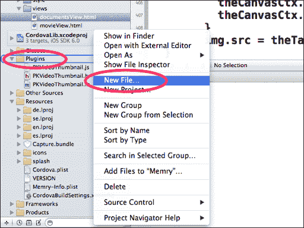
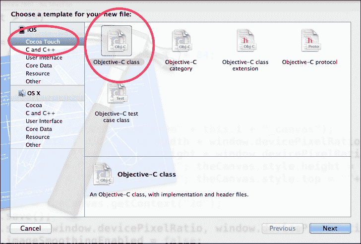
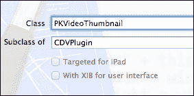
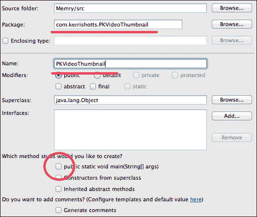
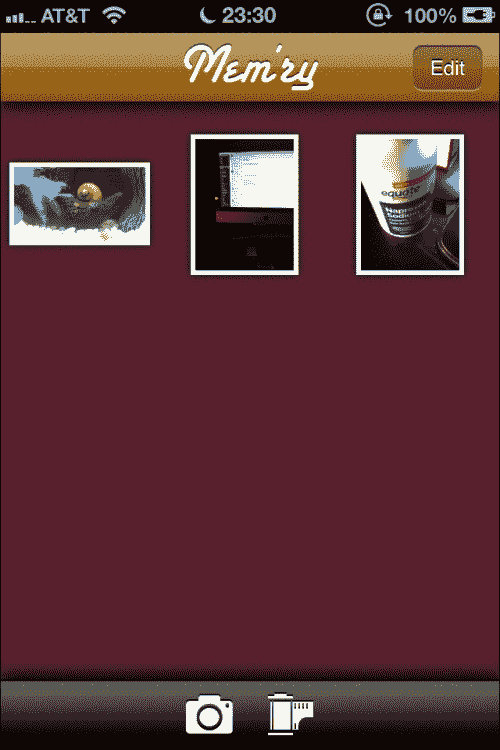
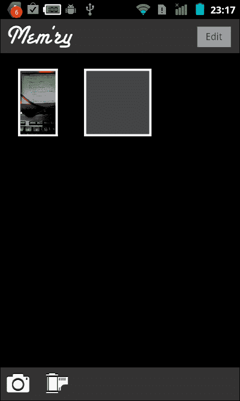

# 第七章。让我们去看电影！

在手机上引入相机不久后，人们就开始问，“视频怎么办？”最初，视频录制受到手机存储空间和硬件的限制。拍几张可能每张只有几百千字节的照片是一回事，但拍摄几秒钟以上的视频，其文件大小却相当大，这是另一回事。此外，视频还需要编码和压缩，这可以通过软件完成，但在硬件上完成会更好。

当视频录制变得可行时，它改变了我们看待世界的方式。突然之间，只要有手机的地方就能拍摄新闻事件——几乎无处不在。视频录制变得司空见惯，所以现在几乎所有的手机都支持视频录制。在这个项目中，我们将探讨如何在我们的应用程序中录制和播放视频。

# 我们要构建什么？

实事求是地说，我们将要构建的是项目 6，“说 Cheese！”。还记得那个吗？我们将不再处理静态图片，而是处理视频。

虽然用户界面和大部分代码将保持不变，但视频确实带来了一些有趣的挑战。例如，如何获取视频的缩略图？我们都知道缩略图应该是什么样子，但实际如何获取呢？或者坦白说，我们如何不仅仅显示视频？我们如何实现播放？

不幸的是（或者从你的观点来看，幸运的是），为了完成这些任务，我们需要深入研究一些本地代码。这些任务本身并不复杂，但 PhoneGap 没有提供对视频缩略图的支持，Android 平台也没有提供对 HTML5 `VIDEO`标签的良好支持，因此我们将不得不使用另一个插件来播放视频。

## 它能做什么？

我们的应用程序名为`Mem'ry`（我们得赶时髦，把元音字母去掉，对吧？）将允许用户在应用程序内录制视频。任何录制的视频都可以播放。此外，我们将使用之前使用的相同文档管理功能来管理这些文件——删除、复制和重命名。

## 为什么它很棒？

坦白说，录制视频并不是很多应用程序必须处理的事情。但播放视频呢？这却是大多数应用程序需要处理的事情。因此，了解如何为最终用户播放视频非常重要，但如果你需要录制视频，这个应用程序也会为你提供必要的工具。

我们还将深入研究一些 PhoneGap 实际上并不提供支持的领域。这并不是 PhoneGap 的错，实际上，视频不仅仅是图像的集合。它们被压缩和编码，没有明显的方法可以从视频中获取缩略图并将其显示为 HTML 中的图像，这是我们迄今为止在处理 PhoneGap 时一直在使用的方法。图像的缩略图很简单：只需缩小图像即可。视频的缩略图？并不简单；你必须从压缩和编码的文件中构建它，而 HTML 不知道如何做到这一点。幸运的是，最流行的平台提供的 SDK 使得这变得容易，但我们需要进行一些原生编码才能达到这个目标。

## 我们该如何进行？

我们将遵循以下步骤：

+   准备视频缩略图插件

+   实现 iOS 版本的视频缩略图插件

+   实现 Android 版本的视频缩略图插件

+   与视频缩略图插件集成

+   实现视频录制和导入

+   实现视频播放

## 我需要准备什么？

首先，请确保从本书提供的下载中获取此项目的文件。由于代码与项目 6 中的代码非常相似，*说奶酪！*，所以为了让你能够跟上，你应该有之前项目的快速参考或我们的文件。

第二，请确保从[`github.com/phonegap/phonegap-plugins/tree/master/Android/VideoPlayer`](https://github.com/phonegap/phonegap-plugins/tree/master/Android/VideoPlayer)下载 Android 视频播放器插件。在这个项目中，我们使用了适用于 PhoneGap 2.x 及更高版本的插件。

# 准备视频缩略图插件

我们的 App 在用户界面和交互方面与先前的项目几乎相同，因此我们不会走完整个设计流程。相反，我们将直接开始实现视频缩略图插件。

## 准备工作

在本书中，我们将首次使用原生代码。虽然我们之前使用过插件（项目 2 中的 ChildBrowser 插件，*让我们社交!*），但我们从未自己创建过。由于我们支持多个平台，我们还需要多次编写插件。

## 开始行动

这个任务本质上由三个步骤组成：

+   配置项目以使用插件

+   创建 JavaScript 接口

+   创建原生代码

前两个任务相当简单，但最后一个，嗯，我们将在几页后解决这个问题。

### 配置项目以使用插件

我们需要做的第一件事是配置我们正在构建的项目以使用新的插件。对于每个平台，步骤都不同，但从*高层次*来看，它们基本上是相同的事情。我们正在告诉 PhoneGap 关于插件的信息，以及它可供使用。不同平台的步骤如下：

+   iOS

    1.  使用 Xcode，导航到`Cordova.plist`文件。

    1.  展开**插件**部分。

    1.  当鼠标悬停在插件上时，点击出现的**+**号。这将插入一个新行。

    1.  将`PKVideoThumbnail`作为键，将`PKVideoThumbnail`作为值添加。

    1.  保存文件。

    1.  打开`index.html`文件，并添加以下`PKVideoThumbnail.js`脚本文件：

        ```js
            <script type="application/javascript" charset="utf-8" src="img/PKVideoThumbnail.js">
            </script>
        ```

+   Android

    1.  使用 Eclipse，导航到`/res/xml/config.xml`文件并打开它。如果您没有显示可编辑的 XML，请切换到 XML 文本编辑视图。

    1.  在 XML 文件中找到**插件**部分。

    1.  添加以下行：

        ```js
        	<plugin name="PKVideoThumbnail" value="com.kerrishotts.PKVideoThumbnail.PKVideoThumbnail"/>
        ```

    1.  保存文件。

    1.  打开`index_android.html`文件，并添加以下`PKVideoThumnail.js`脚本文件：

        ```js
            <script type="application/javascript" charset="utf-8" src="img/PKVideoThumbnail.js">
            </script>
        ```

所有这些只是告诉 PhoneGap 我们将有一个名为`PKVideoThumbnail`的插件可用。没有这个，应用程序将无法正确工作，因为它不知道如何联系插件。

### 创建 JavaScript 接口

虽然在技术上可以在没有任何对应的`.js`文件的情况下调用插件，但事实是，创建一个接口通常会使调用插件变得更容易一些。接口文件将几乎相同，但 iOS 版本将有所不同，以至于它无法在 Android 平台上工作，反之亦然。

在`www/plugins/iOS`目录下，创建一个名为`PKVideoThumbnail.js`的文件，内容如下：

```js
var PKVideoThumbnail = PKVideoThumbnail || {};

PKVideoThumbnail.createThumbnail = function ( source, target, success, failure )
{
    cordova.exec(success, failure,
    "PKVideoThumbnail",
    "createThumbnail",
     ["file://localhost" + source, target]);
}
```

上述代码的作用是简单地创建一个易于使用的包装器调用，这样我们就可以在需要获取视频缩略图时调用`PKVideoThumbnail.createThumbnail()`，而不是使用`cordova.exec(some_function,error_function,"PKVideoThumbnail","createThumbnail",[…])`。

对于提供大量功能的某些插件，JavaScript 接口基本上充当中间人。它将参数转换为插件可以理解的内容，然后在返回到 JavaScript 时处理返回结果。在我们的案例中，包装器非常小。

对于 Android 版本，在`www/plugins/Android`目录下创建一个名为`PKVideoThumbnail.js`的文件，内容如下：

```js
var PKVideoThumbnail = PKVideoThumbnail || {};

PKVideoThumbnail.createThumbnail = function ( source, target, success, failure )
{
    cordova.exec(success, failure,
    "PKVideoThumbnail",
    "createThumbnail",
     [source, target]);
}
```

您能看出这两个文件之间的区别吗？

我给你一个提示：看看倒数第二行，就在`source`之前。iOS 版本添加了`file://localhost`，而 Android 版本没有。这是一个小细节，但没有它，iOS 版本的应用程序将无法工作。

## 我们做了什么？

在这个任务中，我们修改了项目设置，以便项目知道我们即将创建的插件。我们还为 iOS 和 Android 创建了 JavaScript 接口，这将允许我们与本地代码进行通信。

# 实现 iOS 的视频缩略图插件

视频缩略图的 iOS 版本将使用一个*隐藏*的视频播放器来构建缩略图。技术上，我们可以使用另一个库，但视频播放器在从视频构建图像时既方便又快速。我们将其隐藏以确保用户永远不会真正看到正在发生的事情。

## 准备中

首先，让我们在 Xcode 中创建一个新的**Objective-C 类**。最简单的方法是在**插件**文件夹上右键单击并选择**新建文件...**，如以下截图所示：



重要的是你要使用与**其他源**和**资源**目录平级的**插件**文件夹；而不是位于**www**目录中的那个。



接下来，确保选择了**Cocoa Touch**类别，然后选择**Objective-C 类**图标。点击**下一步**。



然后给这个类起一个名字，在这个例子中是`PKVideoThumbnail`，并确保它是`CDVPlugin`的子类。再次点击**下一步**，然后你会被提示验证你想要保存文件的位置。它应该设置为**插件**文件夹；如果不是，在完成任务之前一定要导航到那里。

## 开始行动

现在我们有了`.h`和`.m`文件，我们需要填充它们。让我们先从`.h`文件开始。以下是为这个类提供的*接口*或*规范*：

```js
#import <Cordova/CDVPlugin.h>

@interface PKVideoThumbnail : CDVPlugin

 #if CORDOVA_VERSION_MIN_REQUIRED <= __CORDOVA_2_0_0
- (void) createThumbnail:(NSMutableArray*)arguments withDict:(NSMutableDictionary*)options;
 #else
- (void) createThumbnail:(CDVInvokedUrlCommand*)command;
 #endif
@end
```

在前面的代码中，我们正在定义一个名为`createThumbnail`的方法，它将在从 JavaScript 调用`PKideoThumbnail.createThumbnail()`时执行。

注意`#if…#else…#endif`结构；PhoneGap 在 2.0 和 2.1 版本之间更改了方法签名，因此这处理了两种变体。

然而，到目前为止，我们还没有编写任何实质性的代码；我们一直在进行*声明*或*定义*。让我们通过以下代码片段中的`.m`文件来改变这种情况：

```js
#import "PKVideoThumbnail.h"
#import <Cordova/CDVPluginResult.h>
#import <MediaPlayer/MediaPlayer.h>
```

首先，我们导入我们需要构建插件的一些库。我们还导入了我们的`.h`文件；否则，编译器会报错。

```js
@implementation PKVideoThumbnail

BOOL extractVideoThumbnail ( NSString *theSourceVideoName,NSString *theTargetImageName )
{
    UIImage *thumbnail;
```

接下来，我们定义一个名为`extractVideoThumbnail`的方法，它接受两个参数，即视频的路径以及创建图像时应使用的位置和名称。如果成功，我们的方法将返回`YES`，如果不成功，则返回`NO`。（这是 Objective-C 中的布尔值`TRUE`和`FALSE`的等价物。）

我们还定义了一个类型为`UIImage`的`thumbnail`。星号（`*`）表示这是一个指针——在基于 C 的语言中非常重要。基本上，你会在声明任何对象变量或参数时使用它。当使用数字时，你不会使用星号，但在这个例子中，我们只声明了一个变量来开始。

```js
    // BASED ON http://stackoverflow.com/a/6432050 //
    MPMoviePlayerController *mp = [[MPMoviePlayerController 
    alloc]
      initWithContentURL: [NSURL 
      URLWithString:theSourceVideoName] ];
    mp.shouldAutoplay = NO;
    mp.initialPlaybackTime = 1;
    mp.currentPlaybackTime = 1;
```

我们接下来要做的是声明并创建`MPMoviePlayerController`。它是一个对象，所以它也得到一个星号。我们将它简称为`mp`。

我们传递了视频的路径，该路径需要以 `file://localhost` 前缀；记住我们在 `PKVideoThumbnail.js` 中这样做。

然后，我们将播放时间设置为 `1` 秒，并指示它不应自动播放。我们只想从视频中获取一个单独的图像，所以我们不想立即为用户播放它。

```js
    thumbnail = [mp thumbnailImageAtTime:1
    timeOption:MPMovieTimeOptionNearestKeyFrame];
     [mp stop];
     [mp release];
```

接下来，我们请求电影中 1 秒点附近的最接近的图像。由于电影中的压缩和编码使用关键帧，我们可能无法在确切的 1 秒标记处获得图像，但它应该非常接近。

```js
    return [UIImageJPEGRepresentation ( thumbnail, 1.0) writeToFile:theTargetImageName atomically:YES];
```

最后，我们将缩略图保存到所需的文件中——我们的 JavaScript 通常会使用电影名称并添加一个 `.jpg` 扩展名。操作的返回值将是 `YES` 或 `NO`。如果是 `NO`，则缩略图没有成功写入。

```js
}

 #if CORDOVA_VERSION_MIN_REQUIRED <= __CORDOVA_2_0_0
```

接下来，我们需要为 PhoneGap 2.0 或更低版本定义插件处理程序：

```js
- (void) createThumbnail:(NSMutableArray*)arguments withDict:(NSMutableDictionary*)options
{
    NSString* callbackId = [arguments objectAtIndex:0];
    CDVPluginResult* pluginResult = nil;
    NSString* javaScript = nil;
```

这三个变量总是在插件中定义的。它们对于插件的功能至关重要。第一个是一个唯一 ID，PhoneGap 使用它来跟踪 JavaScript 和原生代码之间的调用。第二个是我们插件活动的结果；我们可以用它将数据传回 JavaScript。最后一个是我们返回代码的 JavaScript 结果；这用于调用成功或失败例程。

```js
    @try {
        NSString* theSourceVideoName = [arguments objectAtIndex:1];
        NSString* theTargetImageName = [arguments objectAtIndex:2];
```

接下来，我们获取应该传递给插件的两个参数。

```js
        if ( extractVideoThumbnail(theSourceVideoName, theTargetImageName) )
        {
          pluginResult = [CDVPluginResult resultWithStatus:CDVCommandStatus_OK messageAsString:theTargetImageName];
          javaScript = [pluginResult toSuccessCallbackString:callbackId];
        }
        else
        {
          pluginResult = [CDVPluginResult resultWithStatus:CDVCommandStatus_ERROR messageAsString:theTargetImageName];
          javaScript = [pluginResult toErrorCallbackString:callbackId];
        }
```

我们使用两个参数调用 `extractVideoThumbnail` 方法。正如我们之前所说的，如果它返回 `YES`，那么它就成功了，因此我们的插件结果将是 OK。如果它返回 `NO`，我们将返回一个错误结果。

```js
    } @catch (NSException* exception) {
      pluginResult = [CDVPluginResult resultWithStatus:CDVCommandStatus_JSON_EXCEPTION messageAsString:[exception reason]];
      javaScript = [pluginResult toErrorCallbackString:callbackId];
    }

     [self writeJavascript:javaScript];
}
```

这里的 `@catch` 块也很重要；它捕获在 `@try` 块中发生的任何错误。这可能会发生在某些事情真的出了问题或发送了错误数量（或类型）的情况下。

```js
 #else
- (void) createThumbnail:(CDVInvokedUrlCommand*)command
{
    CDVPluginResult* pluginResult = nil;
    NSString* javaScript = nil;

    @try {
        NSString* theSourceVideoName = [command.arguments objectAtIndex:0];
        NSString* theTargetImageName = [command.arguments objectAtIndex:1];

        if ( extractVideoThumbnail(theSourceVideoName, theTargetImageName) )
        {
          pluginResult = [CDVPluginResult resultWithStatus:CDVCommandStatus_OK messageAsString:theTargetImageName];
          javaScript = [pluginResult toSuccessCallbackString:command.callbackId];
        }
        else
        {
          pluginResult = [CDVPluginResult resultWithStatus:CDVCommandStatus_ERROR messageAsString:theTargetImageName];
          javaScript = [pluginResult toErrorCallbackString:command.callbackId];
        }
    } @catch (NSException* exception) {
        pluginResult = [CDVPluginResult resultWithStatus:CDVCommandStatus_JSON_EXCEPTION messageAsString:[exception reason]];
        javaScript = [pluginResult toErrorCallbackString:command.callbackId];
    }

     [self writeJavascript:javaScript];
}
 #endif

@end
```

最后，我们基本上是重复自己，但使用 PhoneGap 2.1 版本的插件接口。仔细看看，它做的是同样的事情，但有一些细微的差别。

## 我们做了什么？

就这样！现在当我们调用 `PKVideoThumbnail.createThumbnail()` 时，我们就能从我们拍摄或导入的任何视频中提取缩略图。酷吧，不是吗？

## 我还需要知道什么？

好吧，所以 `extractVideoThumbnail()` 并不完全符合标准的 Objective-C 风格。通常，人们会这样写：

```js
    BOOL extractThumbnailToFile: (NSString *) theTargetImageName fromVideoNamed: (NSString *)theSourceVideoName
```

我们会这样调用它：

```js
  if (extractThumbnailToFile:theTargetImageName fromVideoNamed:theSourceVideoName) …
```

但我们的方法做的是同样的事情，而且更简洁。然而，当与 Objective-C 方法一起工作时，重要的是要认识到定义方法签名之间的差异。如果你要写很多 Objective-C 代码，最好习惯后者，但在紧急情况下，前者也可以用。

最后一点：如果我们无法从视频中提取缩略图会发生什么？你会注意到代码中没有处理这种可能性的内容。很可能是`thumbnail`将是`NULL`，并且尝试将缩略图写入存储将返回`NO`或引发异常。无论如何，我们后面的代码中已经处理了，如果返回`NO`，我们将返回`ERROR`。

# 实现 Android 的视频缩略图插件

插件的 Android 版本与 iOS 版本非常相似，尽管它不必担心使用的 PhoneGap 版本，所以它要短一些。最终，尽管如此，步骤是相同的：从视频中抓取一个帧，保存到存储，然后返回 JavaScript。

## 准备工作

首先，通过打开**文件**菜单，选择**新建**，然后选择**类**来创建一个新的类。

接下来，将**包名**设置为`com.kerrishotts.PKVideoThumbnail`，将类的**名称**字段设置为`PKVideoThumbnail`，然后取消选中**您想创建哪些方法存根？**下的第一个选项——我们不需要任何示例代码。这在上面的屏幕截图中显示：



接下来，打开生成的文件`PKVideoThumbnail.java`，我们将开始编写 Android 版本。

## 继续前进

与 iOS 不同，我们只需要一个文件，而且它最终还要短一些，如下所示：

```js
package com.kerrishotts.PKVideoThumbnail;

import org.apache.cordova.api.Plugin;
import org.apache.cordova.api.PluginResult;
import org.json.JSONArray;
import org.json.JSONException;
import org.json.JSONObject;

import android.graphics.Bitmap;
import android.graphics.Bitmap.CompressFormat;
import android.media.*;
import android.provider.MediaStore;

import java.io.*;
```

首先，就像 iOS 一样，我们导入插件工作所需的库。

```js
public class PKVideoThumbnail extends Plugin {

    public PluginResult execute(String action, JSONArray args, String callbackId) {
```

与 iOS 不同，我们定义了一个名为`execute`的单个方法。如果我们的插件有多个动作，我们需要在这个`execute`方法中处理每一个。在 iOS 中，这已经为我们做好了。

```js
        try {
          if (action.equals("createThumbnail")) {
```

由于我们需要检查传入的操作是否为`createThumbnail`，所以我们有前面的代码。技术上，如果我们只执行一个操作的插件，我们可以避免这样做，但这将是不标准的。

```js
              String sourceVideo = args.getString(0);
              String targetImage = args.getString(1);
```

在前面的代码中，我们定义了我们从 JavaScript 传递的两个参数。注意，与 iOS 版本不同，这里没有星号。不用担心那些讨厌的东西，不是吗？

```js
              Bitmap thumbnail = ThumbnailUtils.createVideoThumbnail ( sourceVideo, MediaStore.Images.Thumbnails.MINI_KIND);
```

从视频中创建缩略图实际上非常简单；已经有一个简单的例程预先为我们写好了。我们只需传递视频的路径，并请求一个特定的尺寸（在我们的情况下，`MINI_KIND`）。

```js
              FileOutputStream theOutputStream;
              try
              {
                File theOutputFile = new File (targetImage.substring(7));
                if (!theOutputFile.exists())
                {
                  if (!theOutputFile.createNewFile())
                  {
                    return new PluginResult(PluginResult.Status.ERROR,"Could not save thumbnail.");
                  }
                }
                  if (theOutputFile.canWrite())
                  {
                    theOutputStream = new FileOutputStream (theOutputFile);
                    if (theOutputStream != null)
                      {
                        thumbnail.compress(CompressFormat.JPEG, 75, theOutputStream);
                      }
                      else
                      {
                        return new PluginResult(PluginResult.Status.ERROR, "Could not save thumbnail; target not writeable.");
                      }
                  }
                }
                catch (IOException e)
                {
                  e.printStackTrace();
                  return new PluginResult(PluginResult.Status.IO_EXCEPTION, "I/O exception saving thumbnail.");
                }
```

实际上保存缩略图到存储要复杂一些。我们需要检查是否应该首先创建文件（通过检查它是否存在），然后检查是否可以写入文件。一旦我们这样做，我们就可以使用`thumbnail.compress()`方法来完成保存文件的实际工作。所有其他东西都是为了处理错误等，Java 要求你必须处理它们。如果不这样做，代码将无法编译。

```js
                return new PluginResult (PluginResult.Status.OK, targetImage );
```

到目前为止，如果我们正在执行这段代码，缩略图已经成功创建，因此我们返回`OK`。如果我们不在这里，我们已经返回了`ERROR`或`IO_EXCEPTION`或甚至其他，如以下代码片段中所示：

```js
            } else {
                return new PluginResult(PluginResult.Status.INVALID_ACTION);
            }
        } catch (JSONException e) {
            return new PluginResult(PluginResult.Status.JSON_EXCEPTION);
        }
    }
}
```

## 我们做了什么？

就这些！我们已经从一个视频文件中提取了缩略图，并将其保存为 JPEG 文件，以便我们的 JavaScript 进行处理。

## 我还需要了解什么？

好的，所以如果你仔细观察这段代码保存出来的内容，你会发现它实际上并不是一个非常小的缩略图。实际上，它是一个与视频分辨率相同的图像。不过，这并不是什么大问题，因为我们在 JavaScript 中会将其缩小，但我还是想让你知道这一点。

# 集成视频缩略图插件

接下来，我们需要实际修改我们的代码，以便显示视频缩略图。打开 `www/views` 下的 `documentsView.html` 文件，以便你可以跟随操作。

## 准备工作

显示缩略图的原理与我们在上一个项目中显示缩略图的原理非常相似；也就是说，我们仍然使用 `canvas` 标签来加快应用程序的响应速度，我们仍然从 JPEG 文件生成缩略图。不同之处在于我们必须从视频文件生成那些 JPEG 文件。

## 开始行动

让我们从以下代码片段中的 `documentIterator()` 方法开始看起：

```js
documentsView.documentIterator = function(o)
  {
    var theHTML = "";
    var theNumberOfDocuments = 0;
 documentsView.documentToIndex = {};
    for (var i = 0; i < o.getDocumentCount(); i++)
    {
      var theDocumentEntry = o.getDocumentAtIndex(i);

      theHTML += PKUTIL.instanceOfTemplate($ge("documentsView_documentTemplate"),
      { "src" : theDocumentEntry.fullPath,
      "index" : i
    });

      documentsView.documentToIndex[ PKUTIL.FILE.getFileNamePart ( theDocumentEntry.fullPath ) ] = i;
      theNumberOfDocuments++;
    }
    $ge("documentsView_contentArea").innerHTML = theHTML;
```

与我们之前的项目相比，内容到目前为止非常相似。唯一的区别是高亮的那一行。我们在文件中之前定义了一个名为 `documentToIndex` 的变量，它是一个对象。我们将其用作关联数组，这样我们就可以稍后根据文件将其映射回其索引。例如，如果文件 *1239548.mov* 是我们文档列表中的第三个项目，我们将在 *1239548.mov* 的空间中存储 *3*。

接下来，就像之前一样，我们在附加长按处理程序等之前等待 `100` 毫秒，如下面的代码片段所示：

```js
    PKUTIL.delay(100, function()
    {
      for (var i = 0; i < theNumberOfDocuments; i++)
      {
        var theDocumentEntry = o.getDocumentAtIndex(i);
        var theElement = $ge("documentsView_item" + i + "");
        var theLPGesture = new GESTURES.LongPressGesture(theElement, function(o)
        {
          documentsView.longPressReceived(o.data);
        });
        theLPGesture.data = i;

        PKVideoThumbnail.createThumbnail ( theDocumentEntry.fullPath,
        PKUTIL.FILE.getPathPart ( theDocumentEntry.fullPath ) + PKUTIL.FILE.getFileNamePart ( theDocumentEntry.fullPath ) + ".jpg",documentsView.renderVideoThumbnail,function ( theError )
          { console.log ( JSON.stringify ( theError ) );
          }
        )
```

这最后的部分是我们要求我们的新插件执行提取视频缩略图的工作。我们知道视频的路径在持久存储中，因此我们可以传递这部分信息。我们还可以构造 JPEG 文件的文件名（我们正在做的是移除视频扩展名，并用 `.jpg` 替换）。然后当视频缩略图成功生成后，`renderVideoThumbnail()` 将被调用。如果发生错误，我们将将其记录到控制台。

```js
      }
    });
  }

  documentsView.renderVideoThumbnail = function ( theTargetImage )
  {
        var img = new Image();
        var i = documentsView.documentToIndex[ PKUTIL.FILE.getFileNamePart ( theTargetImage ) ];
```

`renderVideoThumbnail()` 方法整体上与上一个项目中 `documentIterator()` 方法内部的其余代码非常相似。我们将其分离出来，以便更容易阅读，但除此之外，它做的是同样的事情。这两个方法之间的唯一区别是我们必须找出索引——我们正在谈论哪个图像。如果你记得我们之前定义的变量 `documentToIndex[]`，我们可以从文件名中找出图像的索引，这正是我们在前面的代码片段中所做的。从那里开始，代码是相同的，我们这里不再列出其余部分。

## 我们做了什么？

在这个任务中，我们修改了`documentIterator()`方法以配合我们的新插件。我们已经从视频中请求了缩略图，并且我们已经成功地在需要时将其显示给最终用户。

# 实现视频录制和导入

我们已经完成了我们应用的第一部分，即显示视频缩略图，但在我们将任何内容放入应用之前，我们必须实际录制它们。在这个任务中，我们将做的是——录制一个新的视频。

## 准备工作

如果你想跟随，我们将在这个`www/views`目录下的`documentsView.html`文件中工作。

## 继续前进

你可能会认为我们会使用之前项目中的相机代码，你部分是对的。对于 iOS，我们确实可以使用几乎完全相同的代码来导入新视频，但对于任何平台录制视频，我们必须使用一个新的 API——`CAPTURE` API。

让我们来看看`takeMovie()`函数的代码：

```js
documentsView.takeMovie = function()
  {
    navigator.device.capture.captureVideo(
```

`CAPTURE` API 提供了比仅仅捕获视频更多的方法；你还可以捕获音频（这与在项目 5 中使用`MEDIA` API 类似，*与你的应用交谈*）。在我们的情况下，我们使用`captureVideo()`方法。它接受三个参数：`success`函数、`failure`函数以及我们想要传递的任何选项。在我们的情况下，唯一的选项是我们将限制用户一次只能有一个视频。技术上，API 将允许在会话中录制多个视频，但出于我们的目的，一次一个简化了事情。

```js
      function (mediaFiles)
      {
        var uri = mediaFiles[0].fullPath;
        var fileExt = PKUTIL.FILE.getFileExtensionPart ( uri );
        PKFILE.moveFileTo ( uri, 
        "doc://" + PKUTIL.getUnixTime() + "." + fileExt,
        function ()
          {
            documentsView.reloadAvailableDocuments();
          },
        function (evt)
          {
            console.log (JSON.stringify(evt));
            var anAlert = new PKUI.MESSAGE.Alert(__T("Oops!"), __T("Failed to save the video."));
            anAlert.show();
        } )
    },
```

上述代码显示了`success`方法，它将使用文件列表调用。在我们的情况下，它将只有一个文件名，我们可以通过使用列表的`zero`索引来获取它。从那时起，它几乎与我们在项目 6 中从临时存储复制文件到永久存储的方式相同。唯一的区别是我们不假设文件扩展名将是`.jpg`。不同平台上的视频通常会有非常不同的扩展名。

```js
      function (error)
      {
        var msg = 'An error occurred during capture: ' + error.code;
        var anAlert = new PKUI.MESSAGE.Alert(__T("Oops!"), msg);
        anAlert.show();
      },
```

接下来是`failure`函数，我们唯一要关心的是让用户知道错误代码，但如果你愿意，你可以根据代码给出一个更好的错误信息。

```js
      {limit: 1});
  }
```

最后，第三个参数是那一组选项。在这种情况下，我们只想一次有一个视频，但还有其他可以传递的选项，例如视频编码类型。不同的平台以不同的方式支持这些其他选项，所以我们在这里不会过多讨论它们，但如果你需要，它们可以在 PhoneGap API 文档中找到。([`docs.phonegap.com/en/edge/cordova_media_capture_capture.md.html#Capture`](http://docs.phonegap.com/en/edge/cordova_media_capture_capture.md.html#Capture))

对于导入视频，我们可以使用之前项目中几乎相同的代码，但我们将它全部放在`importMovie()`中：

```js
  documentsView.importMovie = function()
  {
    navigator.camera.getPicture ( function (uri)
    {
      var fileExt = PKUTIL.FILE.getFileExtensionPart ( uri );
      PKFILE.moveFileTo ( uri, "doc://" + PKUTIL.getUnixTime() + "." + fileExt, function ()
      {
        documentsView.reloadAvailableDocuments();
      },
        function (evt)
        {
          console.log (JSON.stringify(evt));
          var anAlert = new PKUI.MESSAGE.Alert(__T("Oops!"), __T("Failed to save the video."));
          anAlert.show();
        } )
     },
     function (msg)
     {
       var anAlert = new PKUI.MESSAGE.Alert(__T("Oops!"), msg);
       anAlert.show();
     },
      { destinationType: Camera.DestinationType.FILE_URI,
      sourceType: Camera.PictureSourceType.PHOTOLIBRARY,
      mediaType: Camera.MediaType.VIDEO,
      saveToPhotoAlbum: false
     }
   );
  }
```

大部分代码与之前项目中 `doPicture()` 的代码相同。唯一的真正区别是文件扩展名和 `mediaType` 选项的处理。注意我们传递了 `Camera.MediaType.VIDEO`。这确保了我们只会得到视频。

一个要注意的问题：这似乎在 Android 上工作得不太好。我们还没有在应用程序中禁用它（以防你运气更好），但你可能希望在 Android 应用程序中禁用导入功能。然而，在 iOS 上，它工作得相当好。

## 我们做了什么？

在这个任务中，我们实现了录制视频和导入视频的代码。

# 实现视频播放

播放视频是一个非常重要的功能，尤其是如果我们正在录制它，对吧？即使应用程序不支持视频录制，视频播放也可以是必不可少的。考虑一个电子学习类型的应用程序；阅读主题对很多人来说效果很好，但真正看到主题的实际操作可以帮助更多。视频将是这种学习类型的绝佳平台。

## 准备工作

如果你想跟上来，我们将会在 `www/views` 目录下的 `documentsView.html` 和 `movieView.html` 中工作。

## 继续前进

首先，有一个问题。在 iOS 设备上播放视频非常简单。在其他设备上播放视频，嗯，不那么简单。

对于 iOS，我们将使用电影视图，这与我们之前项目中的图像视图类似。大部分代码是重复的，所以我们只在这里讨论更改。

电影视图的模板部分看起来如下所示：

```js
<div id="movieView_documentTemplate" class="hidden">
    <video src="img/%SRC%" controls autoplay autobuffer style="width:100%; height: 100%;" />
</div>
```

相比之下，在之前的项目中，我们使用 `IMG` 标签来显示图片，而现在我们使用 `VIDEO` 标签来显示视频。这是 HTML 5 的一个特性，iOS 支持得非常好，因此，这使得我们很容易支持视频播放。

当文档视图调用 `setMovie()` 时，标签将用 `%SRC%` 替换视频文件名，这看起来如下所示：

```js
  movieView.setMovie = function ( moviePath, movieIndex )
  {
    movieView.moviePath = moviePath;
    movieView.movieIndex = movieIndex;

    $ge("movieView_contentArea").innerHTML =
      PKUTIL.instanceOfTemplate($ge("movieView_documentTemplate"),
        { "src" : movieView.moviePath,
          "thumb": PKUTIL.FILE.getPathPart ( moviePath ) +PKUTIL.FILE.getFileNamePart ( moviePath ) + ".jpg"});
  }
```

它基本上与之前项目中的 `setImage()` 相同，尽管我们引入了一个 *缩略图* 部分，如果你想要显示一个用户必须点击才能播放电影的小缩略图，你可以使用它。

一旦电影视图被推入（由文档视图），并且调用了 `setMovie()`，前面的代码中的 `VIDEO` 标签将导致 iOS 设备上的视频立即开始播放。很可能会填充整个屏幕，这在所有移动平台上都很常见。平板电脑通常允许内联视频，但较小的设备通常尝试以全屏模式播放视频。

所以，正如我们之前所说的，iOS 很简单：HTML 5 视频得到了良好的支持，我们可以简单地显示它，无需太多麻烦。

哦，如果其他平台也这么好就好了。例如，Android 声称支持 `VIDEO` 标签，但它的实现非常糟糕，你找到真正能工作的设备的可能性很小。是的，控件会显示，但仅此而已。

我们该怎么办呢？我们使用另一个插件，这次是由 Simon MacDonald 编写的，他决定帮助 PhoneGap 社区，通过提供一个简单的视频播放器插件来提供帮助。（[`simonmacdonald.blogspot.com/2011/11/video-player-plugin-for-phonegap.html`](http://simonmacdonald.blogspot.com/2011/11/video-player-plugin-for-phonegap.html)）

首先，你需要按照以下步骤将插件安装到你的 Java 项目中：

1.  将`Android/VideoPlayer`目录中的`src`目录复制到你的项目中。确保包含内容；在这个目录深处有一个名为`VideoPlayer.java`的文件，你需要将其包含在你的项目中。

1.  将插件包中`Android/VideoPlayer/www`目录下的`video.js`文件复制到项目中的`www/plugins/Android`目录。

1.  将以下行添加到你的`index_android.html`文件中：

    ```js
        <script type="application/javascript" charset="utf-8" src="img/video.js"></script>
    ```

1.  将以下行添加到你的`/res/xml/config.xml`文件中：

    ```js
        <plugin name="VideoPlayer" value="com.phonegap.plugins.video.VideoPlayer"/>
    ```

1.  接下来，我们将修改`documentsView.html`中的代码，以便在 Android 设备上使用此播放器播放视频。我们将在`documentContainerTapped()`方法中这样做：

    ```js
      documentsView.documentContainerTapped = function(idx)
      {
        var theElement = $ge("documentsView_item"+ idx + "_canvas");
        if (documentsView.inSelectionMode)
        {
         … this code is identical to the previous chapter …
        }
        else
        {
          if ( PKDEVICE.platform() != "android" )
          {
            PKUI.CORE.pushView (movieView);
            PKUTIL.delay(500, function()
            {
              movieView.setMovie ( documentsView.availableDocuments.getDocumentAtIndex(idx).fullPath, idx );
            } );
          }
          else
          {
            window.plugins.videoPlayer.play( documentsView.availableDocuments.getDocumentAtIndex(idx).fullPath );
         }
        }
      }
    ```

如果我们不是 Android 平台，我们将尝试使用电影视图来播放视频，但如果我们在 Android 上，我们将使用前面代码片段中突出显示的代码，该代码要求视频播放器插件播放所需的视频。当被要求时，视频将立即全屏播放。这意味着 Android 设备将永远不会显示电影视图，但视图内可用的操作（*删除*和*分享*）在文档视图中也是可用的，所以这并不是一个很大的损失。

## 我们做了什么？

在这个任务中，我们使用了 HTML 5 的`VIDEO`标签来在支持它的设备上播放视频，我们还学习了如何使用 Simon MacDonald 创建的视频播放器插件在 Android 设备上播放视频。

# 游戏结束..... 结束

让我们看看我们最终得到了什么；首先对于 iOS 视图将如下所示：



对于 Android 视图将如下所示：



如果你看看我们的最终应用，它与我们的前一个项目的应用非常相似。是的，我们改变了一些图形，但从视觉上看，它们几乎是相同的，从代码的角度来看，它们几乎是相同的。我们替换了仅与图像相关的部分，并用处理视频的部分替换了它们。我们使用了 HTML 5 的`VIDEO`标签，并使用原生代码编写了自己的插件。你现在应该能够将你所学的应用到自己的应用中，以便录制和播放视频文件。

# 你能承受热度吗？热手挑战

你可以通过几种方式进一步改进这个应用。你愿意挑战自己尝试几种吗？

+   通过**分享**按钮添加上传视频文件到社交网络的功能。

+   允许用户一次性录制多个视频，并相应地处理每个视频。

+   将整个应用程序转变为一个电子学习风格的 APP，其中视频不是由用户录制的，而是嵌入到应用程序中。然后允许用户观看您的视频，以便他们可以了解特定主题。
