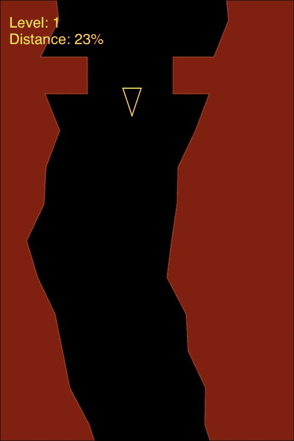
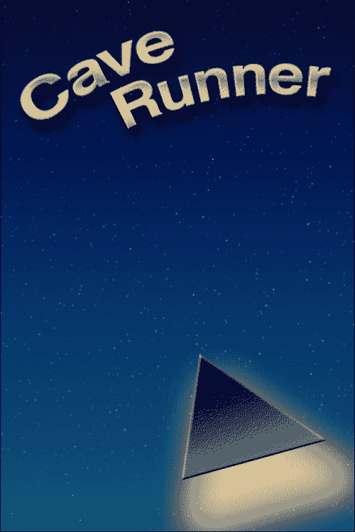
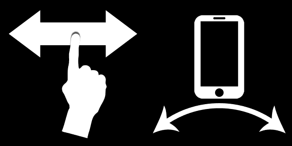
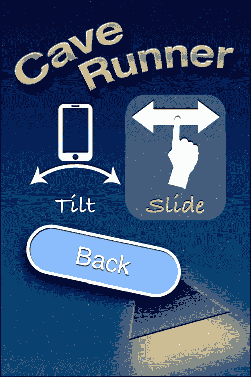
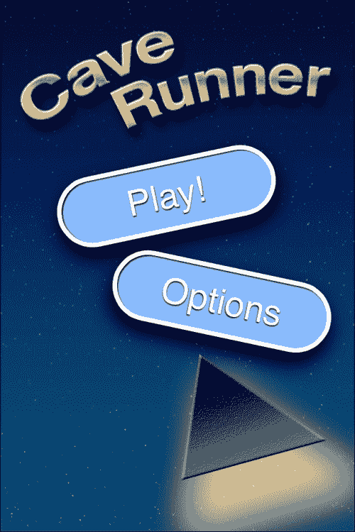
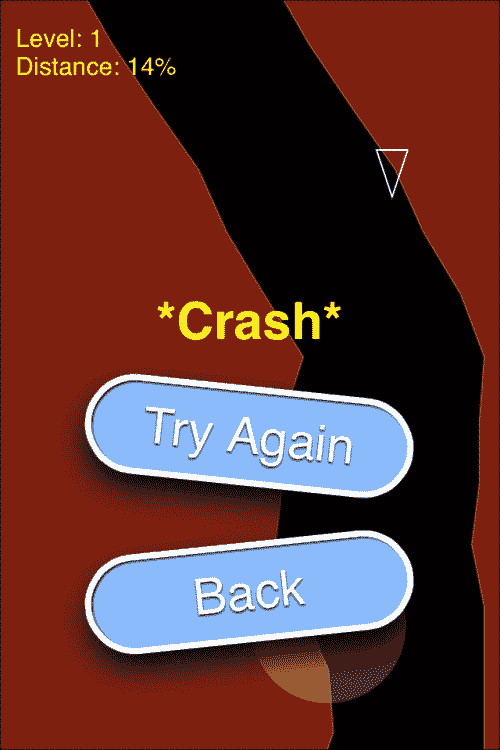

# 第八章。玩玩

智能手机并不陌生于那些帮助消磨时间的有趣小游戏。从看似永恒存在的纸牌游戏到蛇、俄罗斯方块或泡泡龙变体，我们找到了用我们的移动设备消磨时间的方法。即使你几乎总是编写生产性应用程序，迟早，编写游戏的“虫子”很可能会咬你。

# 我们要构建什么？

在这个项目中，我们将组合一个名为 *Cave Runner* 的游戏。好吧，它不会因为游戏（或标题）的原创性而赢得任何奖项，也不会赢得 *年度最佳游戏*。但它很有趣，有很多扩展的潜力，因此是一个很好的基础，特别是对于许多游戏试图适应的快速娱乐类别。

## 它能做什么？

为了实现这一点，我们将严重依赖 HTML5 Canvas，这是我们实现接近 60 fps（大多数游戏的目标）的唯一方式。即便如此，只有最近且功能强大的设备才能达到这个目标，因此我们还需要在如何创建不依赖于帧率的游戏方面进行数学上的研究。如果游戏的计时完全依赖于帧率，30 fps 会感觉像是在泥潭中挣扎，也就是说，游戏会感觉像是在慢动作中前进。相反，我们必须表现得像是在以 60 fps 的速度奔跑，即使我们无法显示那么多帧，这样我们就可以避免这种效果。

在控制控制台、便携式游戏机或 PC 上的游戏角色时，控制游戏角色在可能没有这些功能的移动设备上可能很明显（键盘、鼠标、D-pad、摇杆等），那么如何在移动设备上控制游戏角色呢？有两种答案：使用多触控屏幕，可以用来模拟摇杆或 D-pad，或者使用设备的内置加速度计。我们将在本任务中讨论使用这两种方法。

这就引出了最后一项重要的事情；实现起来并不难，但绝对有必要——**持久** **设置**。如果我们打算提供两种控制方法，我们需要一种方法来保存用户偏好的方法。虽然我们在以前的项目中使用了 `File` API 来存储持久内容，但这次我们将使用 `localStorage`。毕竟，我们只存储一个简单的标志，而不是大量的用户生成内容。

## 为什么它很棒？

希望你能从目前这个游戏中获得一些乐趣，但即使作为一个简单的游戏，它也介绍了你将来创建复杂游戏所需的概念。我们将努力保持游戏以相同的速度进行，无论帧率如何。我们将讨论使用 `localStorage` 的持久化设置。我们还将研究如何使用触摸屏和加速度计来控制游戏。所有这些因素结合起来，创造了一个好游戏，你应该有一个很好的基础，可以在此基础上进行任何未来的努力。

## 我们将如何做到这一点？

我们将像以前的项目一样处理这个问题：

+   设计游戏

+   实现选项视图

+   生成水平

+   在画布上绘制

+   保持进度

+   执行更新

+   处理基于触摸的输入

+   处理加速度计

## 我需要什么来开始？

继续创建你的项目，或者使用本书代码包中的项目作为起点。你将需要使用`www/images`中的图片。如果你想了解我们如何设计图形资产，请随意查看本项目代码包中的`/resources`目录。

在一般情况下，我们将更多地讨论已经编写的代码，而不是逐字拼写代码。因此，最好下载项目，以便你有一个代码作为参考。然后，为你的设备编译它，并与之互动，以更好地了解我们将要讨论的内容。

# 设计游戏

在以前的项目中，我们会开发用户界面以及各种小部件和视图之间的交互，而我们将设计游戏的外观和动作。虽然相似，但设计游戏（图形资产、水平设计、角色设计、动画等等）需要投入更多的工作。不幸的是，鉴于项目的长度，我们无法涵盖所有内容，但我们可以给你一个好的开始。

## 继续前进

游戏的主要主题可能已经从标题“洞穴跑者”中显而易见。这类游戏自第一台计算机问世以来就存在了，即使图形质量有点粗糙。简而言之，我们将开发一个游戏，玩家（控制一艘飞船）必须安全地通过一系列水平才能前进。每个水平都比前一个更难，在我们的特定版本中，只要玩家能够跟上，水平就没有尽头。实际上，总会有一个点，玩家无法安全地通过给定的水平，因此游戏总是以崩溃结束。把它想象成一场我们已经知道结果的耐力赛跑——重点是旅程。

水平由一个类似洞穴的结构组成，屏幕两侧都有墙壁。这些墙壁是不规则和随机的，共同形成一条安全的路径供飞船通过。如果飞船触碰到边缘，游戏就结束了。



为了使事情变得稍微困难一些，有一些障碍物会阻碍飞船的行进。在最初的水平中，它们并不经常出现，但随着水平的难度增加，障碍物出现的频率也会增加。障碍物看起来像有一个开口的*墙*，飞船必须通过开口才能安全通过。

我们的水平将根据某些参数随机生成，以创建一个不断变化的景观。尽管我们的水平是随机的，但你完全可以轻松创建静态水平并在需要的地方加载它们，这是我们建议在项目结束时做的事情。

我们的飞船将非常简单：一个三角形。是的，可以通过动画等方式使其更加复杂，但考虑到我们游戏的简单视觉风格，它很好地满足了我们的需求。

为了移动飞船，玩家有两个选择：触摸或滑动屏幕以控制飞船，或者倾斜设备。飞船将根据滑动或倾斜的方向移动，也就是说，向左倾斜或滑动将使飞船向左移动，反之亦然。由于我们称我们的角色为 *飞船*，我们故意在移动中引入了一些模糊的机制。换句话说，飞船不会立即响应，也不会立即停止。想象一下，飞船上好像有推进器。

当然，我们本可以决定飞船的位置直接与屏幕上手指的位置或倾斜度相关，对于某些游戏来说这可能很合适。始终重要的是要认识到你应该根据你的游戏调整你的控制机制，并使用合理的方法。

我们的游戏本身将包含在一个视图中——游戏视图。游戏之外将存在起始视图和选项视图。起始视图包含两个按钮，即 **玩** 和 **选项**。点击 **玩** 将切换到游戏视图，而 **选项** 按钮将切换到选项视图。

选项视图提供了两种控制移动的标志性表示：一种用于倾斜设备，另一种用于在屏幕上滑动手指。点击这两个元素中的任何一个将选择该方法作为控制方法。一个额外的 **返回** 按钮让用户返回到起始视图。

在游戏视图中，我们有几个需要显示的项目。当然，级别和飞船是必需的，但游戏通常会显示其他信息。在我们的案例中，我们将显示当前级别和通过级别的距离。如果我们需要显示一条消息（例如 ***碰撞！*** 或 **关卡完成**），我们将在屏幕中间显示它，并附带两个按钮：一个用于重新开始或继续，具体取决于情况，另一个用于返回游戏视图。

实际上就是这样，这并不是一个复杂的游戏，但它可以为未来更复杂的尝试提供一个基础。

在我们完成这个任务之前，让我们快速看一下我们的图形资源。我们的启动画面看起来是这样的：



我们的控制图标将看起来像这样：



我们在整个游戏中使用的按钮不需要任何图形资源。我们只需使用带有边框和阴影的圆角矩形，这可以通过 CSS 实现。

## 我们做了什么？

在这个任务中，我们设计了游戏机制和资源。我们也确定了所需的视图。

## 我还需要了解什么？

游戏设计绝不是这么简单。我们可以快速浏览这个特定的游戏，部分原因是因为它既简单，机制也众所周知。即使是稍微复杂一些的游戏，也需要花费大量的时间去设计，最好在写任何代码之前就完成。确定你的视觉风格、声音风格、游戏机制、控制机制、关卡和动画。所有这些都需要时间，并且需要大量的纸张。

# 实现选项视图

开始视图是一个简单的视图，我们不会过多地讨论；您可以自由地查看`www/views/startView.html`中的代码。在这个任务中，我们将关注位于`www/views/optionsView.html`的选项视图。它比开始视图稍微复杂一些，所以一些代码非常相似。

完成后，我们将得到以下截图所示的内容：



## 开始实施

让我们先看看视图的 HTML 代码：

```js
<div class="viewBackground">
    <div id="optionsView_contentArea" style="padding: 0; height: auto; position: relative;"></div>
</div>
```

第一部分非常简单；实际内容在一个模板中，我们将对其进行本地化处理：

```js
<div id="optionsView_actions" class="hidden">
 <div id="optionsView_changeControls">
  <div id="optionsView_tilt" ontouchend="optionsView.selectTilt();" >
    %TILT%
  </div>
  <div id="optionsView_slide" ontouchend="optionsView.selectSlide();">
    %SLIDE%
  </div>
  </div>
 <div id="optionsView_backButton" ontouchend="PKUI.CORE.popView();" >%BACK%</div>
</div>
```

在这段代码中，我们定义了两种控制方法。触摸`optionsView_tilt`或`optionsView_slide`图标将调用选择该控制方法的方法。**返回**按钮将弹出视图并返回到开始视图。

注意，我们在这里没有定义任何样式；样式位于`www/styles/style.css`。以下是我们的视图使用的样式：

```js
#startView_contentArea,
#optionsView_contentArea
{
  background-image: url('../images/splash.png') !important;
  height: 100% !important;
}
```

我们为开始视图和选项视图（但不是游戏视图）使用背景图像，我们在前面的代码中定义了它。这将在我们的控件后面放置一个漂亮的图像，因此我们需要小心地放置按钮，以免覆盖任何关键文本或图形元素。

每个按钮的样式如下：

```js
…
#optionsView_backButton,
…
{
  position: absolute;
  left: 50px;
  width: 200px;
  background-color: #8BF;
  height: 2em;
  font-size: 24pt;
  line-height: 1.75em;
  text-align: center;
  color: white;
  border: 4px solid white;
  border-radius: 1em;
  text-shadow: 0 1px 1px #000;
  box-shadow: 0px 10px 20px #000, 1px 1px 1px #000 inset;
  -webkit-transform: rotate(-12deg);
}
```

这给我们一个漂亮的圆角按钮，颜色鲜艳，如本节标题截图所示。它也稍微倾斜，这在游戏中通常是可以接受的。在生产力应用程序中这样做并不是一个好主意。

```js
#optionsView_backButton
{
  top: 300px;
  left: 32px;
  -webkit-transform: rotate(12deg);
}
```

对于每个按钮，我们必须指定按钮的位置，如果我们想的话，我们还可以覆盖旋转，使屏幕上的按钮以不同的角度旋转。

```js
#optionsView_changeControls
{
  position: absolute;
  top: 120px;
  left: 32px;
  width: 256px;
}
```

对于我们的控制选择，我们首先指示图标将位于哪里，在前面的代码片段中，然后指定每个图标的属性如下：

```js
#optionsView_tilt,
#optionsView_slide
{
  width: 128px;
  text-align: center;
  font-family: "Bradley Hand",sans-serif;
  font-size: 24pt;
  color: #FFFF80;
  text-shadow: 0px -1px 1px #000;
  height: 160px;
  float: left;
  color: #FFFFFF;
}
```

在这种情况下，字体给我们一种手写的感受。请注意，我们提供了一个回退方案，以防设备不支持这种字体，这在 Android 设备上很可能是这种情况。所有最新的 iOS 设备都会自动提供这种字体。

```js
#optionsView_tilt.selected,
#optionsView_slide.selected
{
  color: #FFFF80;
  background-color: rgba(255,255,255,0.25);
  border-radius: 25px;
}
```

当选中时，我们改变文本的颜色，并使选中的项看起来被突出显示。

让我们来看看代码；它实际上非常简单：

```js
  var optionsView = $ge("optionsView") || {};

  optionsView.initializeView = function()
  {

    $ge("optionsView_contentArea").innerHTML =

    PKUTIL.instanceOfTemplate ( $ge("optionsView_actions"),
    { "tilt": __T("TILT"),
    "slide": __T("SLIDE"),
    "back": __T("BACK")
    }
    );

    optionsView.displayControlSetting();

  }
```

和往常一样，我们的`initializeView`方法用于设置视图并执行必要的本地化。它还会调用`displayControlSetting`，这将突出显示适当的方法：

```js
  optionsView.displayControlSetting = function ()
  {
    $ge("optionsView_slide").className="";
    $ge("optionsView_tilt").className="";
    if (localStorage.controlSetting)
    {
      // use the saved setting
      if (localStorage.controlSetting == "slide")
      {
        $ge("optionsView_slide").className="selected";
      }
      else
      {
        $ge("optionsView_tilt").className="selected";
      }
    }
    else
    {
      // default to the slide control option
    $ge("optionsView_slide").className="selected";
    }
  }
```

注意，我们在这里使用的是`localStorage`；它几乎微妙到你可以错过它。首先，我们检查我们想要的属性（`controlSetting`）是否存在。如果不存在，我们将默认使用*滑动*控制方法。如果存在，我们将使用属性中存储的任何值。

虽然`localStorage`并不保证 100%持久（iOS 设备空间不足时可以选择删除），但对于这类设置来说已经足够好了。

当用户点击其中一个控制方法时，我们将`localStorage.controlSetting`设置为以下内容：

```js
  optionsView.selectTilt = function ()
  {
    localStorage.controlSetting = "tilt";
    optionsView.displayControlSetting();
  }

  optionsView.selectSlide = function ()
  {
    localStorage.controlSetting = "slide";
    optionsView.displayControlSetting();
  }
```

从这个点开始，代码就像我们之前使用的那样，所以这里不会重新打印它。

## 我们做了什么？

在这个任务中，我们创建了我们的选项视图。我们为用户提供了选择他们的角色是使用*倾斜*还是*滑动*控制方式的能力，并且我们使用了`localStorage`来保存和读取用户的偏好。

## 我还需要了解什么？

如果用户看到这个屏幕并决定*滑动*是他们想要的控制方法呢？这意味着我们从未在`localStorage`中设置任何属性。这意味着当游戏开始时，它将如何知道使用哪种控制方法？

简单，我们也会在那里进行检查。如果`localStorage`中没有内容，我们将假设用户想要使用滑动方法。这里的关键是要保持一致性；如果游戏决定使用倾斜方法，但在我们的选项视图中显示滑动作为默认选项，玩家显然会困惑于哪个选项代表什么。

# 生成关卡

想象一个没有至少一个关卡的游戏是很难的，而且这个关卡需要包含一些内容。在这个任务中，我们将探讨如何为游戏中的关卡生成内容。

## 准备就绪

在`www/views`中打开`gameView.html`文件。我们将相当频繁地使用这个文件，所以最好将其打开以供参考。

## 继续前进

有几种方法可以生成关卡。可以使用随机内容、伪随机内容或静态内容。第一种很简单：只需为所有内容使用随机数字。不幸的是，这通常不会产生非常好的关卡，而且很难保证可赢性和难度。

第三种方法也很简单：使用静态内容。这意味着你在游戏开始之前就已经确定了整个关卡，并将其存储在文件中。当游戏请求关卡时，可以读取它。这意味着每次都是相同的，这可以是好事（或坏事），取决于游戏，但它也意味着你有明确的方式来确保可赢性和难度。对于解谜游戏，这种方法几乎总是首选。

我们的方法是伪随机。我们将使用大量的随机数；我们不希望洞穴墙壁是完美的直线或容易被猜到的路径。但我们还希望随着时间的推移在难度上增加一些层次，以及将级别限制在几个参数内，以帮助确保（尽管不能保证）可玩性。通过足够的代码可以保证级别可玩，但在这个游戏中我们不会走那么远。

让我们通过以下代码片段来查看用于生成级别的代码：

```js
function generateLevel ( lvl )
{
    points = new Array();
    points[0] = new Array();
    points[1] = new Array();
    points[2] = new Array();
    points[3] = new Array();
```

首先，我们初始化我们的`points[]`数组，然后在其中定义四个数组。前两个数组包含构成洞穴墙壁的左右点。最后两个数组包含任何障碍物开口的边缘，如果没有障碍物，则为`-1`。

```js
    …    

    var lastLeft= (cWidth/5) ;
    var lastRight=(cWidth/5) ;
```

接下来，我们开始定义一些我们将使用来控制我们级别的变量。这两个变量存储洞穴生成的最后几个点，但我们需要有一个起点。`cWidth`在文件中之前被定义为屏幕宽度，所以你可以看到这将在我们级别的开始时在屏幕中间生成一个开放区域。这很重要，因为我们不希望玩家遇到他们无法避免的即时障碍。

```js
    var bias = 0;
```

`bias`控制着我们的洞穴墙壁倾向于哪个方向。它们仍然会被随机生成，但每当墙壁碰到屏幕边缘时，我们就引入`bias`，以确保始终有一些移动。

```js
    var rndWidth = Math.floor(cWidth/ 10) + (lvl*10);
```

`rndWidth`控制我们的洞穴墙壁在特定距离内可以变化的程度。在这种情况下，它由屏幕宽度和我们当前的级别控制。这意味着随着我们通过级别，洞穴的导航会变得更加困难。

```js
    var channelWidth = Math.floor(cWidth / 2.25) - (lvl*16);
```

另一方面，`channelWidth`限制了洞穴墙壁可以靠近的程度。它也基于屏幕宽度和级别。你会在某些高级别时注意到通道太小，无法让飞船通过。在这种情况下，游戏可以被认为是结束了，或者也可以设计一种方法来防止这个值变得太小。

```js
    var wallChance = 0.75 - (lvl/25);
    if (wallChance < 0.15) { wallChance = 0.15; };
```

障碍物或墙壁只会在某些时候生成；我们不希望障碍物在每个点都出现。因此，我们生成一种基于级别的机会。较简单的级别将有较少的障碍物，而较难的级别将有几个障碍物。

```js
    var wallEvery = Math.floor(30 - (lvl/2));
    if (wallEvery < 10) { wallEvery = 10; };
```

`wallEvery`也考虑了障碍物出现的频率，但以不同的方式。它控制着在障碍物有机会生成之前必须有多少点。在这种情况下，我们将从 29 个点开始，但随着级别的增加，我们将稳步降低它。这意味着障碍物不仅会出现的更频繁，而且会更靠近。

```js
    for (var i=0; i< Math.floor(300 + ( 125 * (lvl/2) )); i++)
    { 
```

接下来，我们想要创建一个长度为几百点的洞穴。第一个级别将从 366 个点开始，并且只会从那里增加。

```js
        var newLeft = lastLeft + ( bias * (7+lvl) ) + ( (rndWidth/2) - Math.floor( Math.random()* (rndWidth+1) ) );
        var newRight = lastRight + ( bias * (7+lvl) )  + ( (rndWidth/2) - Math.floor( Math.random()* (rndWidth+1) ) );
```

对于每个点，我们确定洞穴的左右两侧。我们基于前一个点，加入`偏差`（随着关卡的增加而增加），然后在我们允许的宽度内添加一个随机数，我们就有了会随机变化但不会变化太大的洞穴墙壁（至少在最初关卡中是这样）。

```js
        if ( newLeft < 10 ) { newLeft = 10; bias = 1; }
        if ( newLeft > (cWidth/1.5) ) { newLeft = cWidth/1.5; bias = -1; }
        if ( cWidth - newRight < newLeft + channelWidth )
        {
          newRight = cWidth - ( newLeft + (channelWidth) );
        }
        if ( cWidth - newRight > newLeft + (channelWidth*1.5))
        {
          newRight = newRight + (Math.random() * rndWidth);
        }
        if ( newRight < 10 ) { newRight = 10; }
        if ( newRight > (cWidth-10)) { newRight = cWidth-10; }
```

当然，如果没有对两侧的一些限制，洞穴就有可能偏离屏幕，如果玩家看不到它，这对玩家没有任何好处。所以，我们保持洞穴在屏幕上。对于前两个限制，我们也影响了`偏差`；这通常会使得洞穴呈现出锯齿状的图案。

```js
        points[0].push ( newLeft );
        points[1].push ( newRight );

        lastLeft = newLeft;
        lastRight = newRight;
```

最后，我们将点添加到数组中，并存储起来以供将来参考（循环的下一个迭代）。

```js
        if ( (i % wallEvery) == 0 && ( i > 30 ) )
        {
```

接下来，我们确定是否需要放置障碍物。首先，我们只是偶尔检查一下（`wallEvery`），并且我们还限制任何障碍物出现在洞穴前 30 个点内。

```js
            if (Math.random()>wallChance)
            {
```

接下来，我们决定在这个点是否会出现墙壁；这使障碍物在早期阶段相当罕见，但在后面的关卡中会逐渐增加。

```js
                var openingWidth = channelWidth/1.35;
                var caveWidth = ((cWidth-newRight) - newLeft) - openingWidth;
                var wallOpening = Math.floor ( Math.random() * caveWidth );
                points[2].push ( newLeft + wallOpening );
                points[3].push ( newLeft + wallOpening + openingWidth );
```

对于障碍物，我们创建一个比洞穴宽度小的开口；这意味着墙壁会从洞穴中突出一定角度。然后我们确定洞穴开口范围内的一个随机值，这就是开口将出现的位置。

```js
            }
            else   
               // no wall
                points[2].push ( -1 );
                points[3].push ( -1 );    
            }
        }
        else   
           // no wall
            points[2].push ( -1 );
            points[3].push ( -1 );    
        }
    }
}
```

如果没有障碍物，我们推送`-1`；这样我们就可以知道在任意给定点是否有障碍物（或者没有）。

就这样！这将创建一个又长又弯的洞穴，随着关卡级别的提高，它将变得更加危险。

## 我们做了什么？

在这个任务中，我们根据伪随机生成和一些特定的规则为我们的游戏生成了关卡，这些规则使得关卡在游戏过程中难度逐渐增加。

## 我还需要了解什么？

当然，生成伪随机关卡的方法不止一种。还有很多方法超出了这本书的范围，而且你还可以做一些事情来确保关卡始终可赢。关卡生成是一个独立的主题（在这个领域有许多许多聪明的人在工作），所以很快你就能被一些关卡生成技术所震撼。参见[`en.wikipedia.org/wiki/Procedural_generation`](http://en.wikipedia.org/wiki/Procedural_generation)了解一些游戏如何通过程序生成关卡以及一些描述如何通过程序生成关卡的链接。请记住，这非常具体地取决于你正在开发的游戏类型。

# 将绘图绘制到画布上

当然，如果我们不向玩家展示生成的关卡，那么生成关卡就没有任何意义。这正是我们将在这个任务中做的。

## 继续进行

首先，我们设置了画布，在这个过程中也注意到了处理视网膜屏幕。

```js
var c = $ge("gameView_canvas");
var ctx = c.getContext("2d");

c.setAttribute ("width", cWidth * window.devicePixelRatio);
c.setAttribute ("height",cHeight * window.devicePixelRatio);
c.setAttribute ("left", (screen.width/2) - (cWidth/2));
c.style.width = ""+cWidth+"px"; 
c.style.height = ""+cHeight+"px";
```

我们将这些存储为全局变量，因为对于每一帧的内容，我们都不需要做 DOM 遍历——这只会减慢我们的速度——当我们试图在 16 毫秒内渲染一帧时（如果我们目标是 60 fps，我们能够承受的最大时间），这是一件坏事。

```js
function doAnim(timestamp)
{ 
…

    ctx.save();
    ctx.scale (window.devicePixelRatio, window.devicePixelRatio);
    ctx.fillStyle = "#802010";
    ctx.strokeStyle = "#A04020";
    ctx.clearRect ( 0, 0, cWidth, cHeight);
```

接下来，我们设置一些属性，然后清除画布。对于每一帧清除画布是至关重要的；否则，你会在后面留下前帧的幽灵。

然后我们使用循环绘制洞穴的两侧：

```js
    for (var i=0; i<2; i++)
    {
        var pts;
        var cLeft = -10;
        if (i==0) { pts = points[0]; }
        if (i==1) { pts = points[1]; cLeft = cWidth+10; }
```

根据我们正在绘制的洞穴部分，我们将`points[]`的`0`或`1`索引分配给另一个变量`pts`。这让我们避免了需要双重索引点数组，如`points[i][x]`，而是使用`pts[x]`。我们还定义了屏幕外的墙壁的左侧（或右侧）；这对于绘制洞穴很有用，因为我们需要填充洞穴墙壁以使其成为实心。这意味着我们实际上是在绘制一个大矩形，其中一部分非常粗糙；粗糙的一侧是洞穴墙壁。

```js
        ctx.beginPath(); 
        ctx.moveTo ( cLeft, -pieceWidth );
```

我们开始路径，然后移动到画布的最左上角；实际上，离它相当远。这确保玩家永远不会看到我们正在绘制的矩形大框的边缘。

```js
        for (var j = Math.floor ( currentTop  / pieceWidth )-1; 
            j < Math.floor ( currentTop / pieceWidth ) + ( (cHeight+(2*pieceWidth)) / pieceWidth );
            j++)
        {
```

接下来，我们遍历数组中的每个点，但只遍历必要的点。如果玩家已经完成了关卡的一半，就没有必要绘制前面的点，也没有必要绘制屏幕高度之外的洞穴部分。

```js
            var p = pts[j];
            var y = (j * pieceWidth) - currentTop;
```

为了保持洞穴运动的平滑，我们将当前块乘以块宽度，并从关卡中的当前位置减去。技术上，这会在第一个和最后一个绘制的索引处产生跳跃视图，但我们在两边都绘制了一些点，所以任何跳跃都会保持在屏幕之外。

```js
            if (i==1) { p = cWidth - p; }
            ctx.lineTo ( p, y );
```

接下来，我们画一条线到给定的点。如果我们正在处理右侧，那么这个点位于屏幕右侧边缘的左侧，也就是洞穴的右侧。

```js
             if ( points[2][j] > -1 )
            {
              ctx.lineTo ( points[i+2][j], y );
              ctx.lineTo ( points[i+2][j], y+pieceWidth );
            }
```

如果我们有障碍物要显示，我们也会画一条线到那个点，然后画一条`pieceWidth`高的垂直线。这将使障碍物看起来像有一个开口的墙壁。

```js
        }
        ctx.lineTo ( cLeft, ((cWidth+2)*pieceWidth) );
        ctx.closePath();
        ctx.fill();
        ctx.stroke();
    }
```

最后，我们再次在屏幕外画一条线，然后继续填充和描边路径。玩家只会看到洞穴墙壁的粗糙边缘。

```js
    ctx.strokeStyle = "#FFFFFF";
    ctx.beginPath();
    ctx.moveTo ( shipPositionX-10, shipPositionY-5 );
    ctx.lineTo ( shipPositionX+10, shipPositionY-5 );
    ctx.lineTo ( shipPositionX   , shipPositionY+25 );
    ctx.lineTo ( shipPositionX-10, shipPositionY-5 );
    ctx.closePath();
    ctx.stroke();
```

在我们绘制洞穴墙壁之后，我们需要绘制飞船。在这种情况下，我们绘制一个简单的三角形。

```js
    ctx.fillStyle = "#FFFF00";
    ctx.font = "16px Helvetica";
    ctx.fillText ( "Level: " + currentLevel, 10, 30 );
    ctx.fillText ( "Distance: " + Math.floor((currentTop / (points[0].length*pieceWidth))*100) + "%", 10, 48 );
```

通常，大多数游戏需要显示一些文本（例如得分），所以我们也做了类似的事情。我们显示当前关卡和通过关卡的距离。

```js
    if (amTouching)
    {
      ctx.fillStyle = "rgba(255,255,255,0.25)";
      ctx.beginPath();
      ctx.arc ( lastTouchX, 400, 50, 0, 2*Math.PI, false );
      ctx.closePath();
      ctx.fill();
    }
    ctx.restore();

…
}
```

最后，如果用户的控制方法是滑动，我们会在用户触摸的地方显示一个半透明的圆圈（假设它在屏幕底部），这样用户就知道触摸已经被记录了。

请记住，在绘制帧时，我们需要快速，幸运的是，我们刚才看到的操作依赖于硬件；我们可以在几毫秒内完成一帧。如果我们保持在 17 毫秒以下，我们几乎可以达到 60 fps，尽管在较旧的硬件上，这可能是 20-30 毫秒。所以我们需要做其他事情，我们将在下一节中讨论，那就是丢弃帧，以便游戏不会感觉太迟缓。

## 我们做了什么？

在这个任务中，我们在画布上绘制了关卡，显示了飞船，并在画布上放置了各种文本。我们还保持了快速，这是通过使用`canvas`标签实现的。

## 我还需要了解什么？

当然，前面的代码只绘制了一帧；我们需要多次调用它才能实现流畅的滚动。有两种方法可以实现这一点：我们可以使用`setTimeout`或者使用`requestAnimationFrame`。后者更受欢迎，因为它比`setTimeout`具有更好的分辨率，但还不是所有移动浏览器都支持。就我们的目的而言，我们使用`setTimeout`。它在`doUpdate`中调用，我们稍后会讨论，而不是`doAnim`。

# 保持同步

即使我们不能达到 60 fps，我们也需要表现得像是达到了 60 fps。如果我们不这样做，任何减速都会使游戏感觉像是在慢动作中。相反，我们需要*丢弃帧*，并像达到 60 fps 一样继续前进。显示可能不会那么平滑，但直到帧率真的降得很低，游戏体验才不会变得那么慢。

## 继续前进

如果你在上一个任务中仔细观察我们的代码，你会注意到我们跳过了一些行。这些行对于使游戏以 60 fps 的速度进行至关重要：

```js
var startTime;
function doAnim(timestamp)
{ 
    if (!timestamp) { 
    timestamp = (new Date()).getTime(); 
    }
    var diff = timestamp - startTime;
…
    doUpdate ( 60/(1000/diff) );
    startTime = timestamp;
}
```

我们所做的一切只是测量帧之间的时间，然后对它应用一些数学运算。然后我们将其传递给`doUpdate`，我们稍后会讨论。这个数字等同于在给定时间段内应该通过的帧数。如果我们是 60 fps，我们总是会得到这个数字为 1；但如果我们是 30 fps，这个数字将是 2；在 15 fps 时将是 4，以此类推。由于这个数字可以是分数，我们可以在更新游戏时非常细致。

## 我们做了什么？

所以，这很简单，但并不是一个特别复杂的概念。但它非常重要；如果没有它，如果设备因为任何原因变慢，游戏也会变慢，给人一种慢动作的感觉。相反，我们将丢弃帧以保持速度。它可能不会那么平滑，但游戏体验应该始终优于每帧都显示。

# 执行更新

当然，反复绘制相同的帧是没有用的。我们还需要更新游戏。这包括响应用户输入、检查碰撞以及沿着洞穴移动。

## 继续前进

我们将在...猜猜看！`doUpdate`中进行所有更新：

```js
function doUpdate ( f )
{
```

如果你还记得上一个任务，`f`是输入帧乘数。我们希望它是 1，但如果我们的帧率是 30，它可能是 2，如果是 15，它可能是 4。我们将在多个地方使用这个值来乘以任何更新，以便让一切看起来像是在 60 帧下运行，即使我们实际上不是。

```js
    var gameOver = false;
    var levelOver = false;
    var pixels = ctx.getImageData(Math.floor(shipPositionX * window.devicePixelRatio), 
    Math.floor(shipPositionY * window.devicePixelRatio),1,1).data;
```

有多种进行碰撞检测的方法。我们可以通过数学方法来确定，但这会变得相当痛苦。相反，我们将使用画布自己的数据，并执行基于像素的碰撞检测。

前一行从画布请求的数据非常少。实际上，我们只是在检查飞船的中心点是否有碰撞。这样做的一部分原因是为了对用户宽容一些，另一部分原因是懒惰，但还有一部分原因是基于画布的像素碰撞检测非常慢。实际上，仅仅检查一个像素就能将我们的帧率几乎减半。

```js
    if ( pixels[0] != 0 )
    {
      $ge("gameView_nextButton").innerHTML = __T("START_OVER");
      showMessage (__T('CRASHED'));
      gameOver = true;
      currentLevel = 0;
    }
```

如果从画布返回的数据中的像素数据不是零（黑色），那么我们知道我们已经撞击了某个东西；我们撞击的物体不重要。我们标记游戏结束，并通知用户。

```js
    if (f > 0 && f != Infinity)
    {
```

有时`f`会是`0`或`Infinity`。这通常发生在游戏开始时，我们必须传递一个时间差，但实际上并没有。在这种情况下，`doAnim`中的除法将返回`infinity`。我们不想在两种情况下做任何事情，所以我们确保只有在`f`是合理值时才进行操作。

```js
if (controlMethod == 0)
   {
      if (buttonDown != 0)
        {
          if (Math.abs(shipAcceleration)<1)
            { shipAcceleration = buttonDown; } 
              shipAcceleration = Math.min ( 10, shipAcceleration + ( buttonDown * deviceFactor) );
              //shipAcceleration = buttonDown * 3;
            }
            else  
            {
              shipAcceleration = shipAcceleration / 1.5;
              if (Math.abs(shipAcceleration)<0.25)
              { shipAcceleration = 0; }
            }
            shipPositionX += (shipAcceleration*f);
        }
```

`buttonDown`反映了用户使用触摸控制时的输入。如果他们向左滑动，`buttonDown`将是负数。如果他们向右移动，`buttonDown`将是正数。如果他们什么都没做，它将是零。如果他们使用倾斜控制，我们将以不同的方式计算这个值，但将在下一节中展示。

如果我们非零，我们会积累一些加速度，就像飞船上有推进器一样。由于推进器不能立即反应，飞船需要一点时间来反应。这会使游戏变得更难；玩家必须考虑到飞船的反应时间。

如果我们为零，我们会减少加速度，就像飞船在减速一样。一旦我们达到某个阈值，我们就完全停止飞船，但在那之前，仍然有一些移动。再次强调，这增加了难度，因为移动飞船时必须考虑这一点。

在前面的代码片段中，一个重要的变量是`deviceFactor`。这是主观的；当飞船在 Android 设备上移动感觉合适时，在 iOS 设备上感觉太慢，因此这个变量对此差异进行了一些补偿。永远不要害怕在不同的设备上调整移动机制，以便感觉相同，即使技术上并不相同。

注意，我们通过`f`乘以加速度；这样可以使飞船的运动看起来就像是在一个每秒 60 帧的游戏中发生。

```js
      var speed = ((4+currentLevel) * (f));
      currentTop+= speed;
    }
```

接下来，我们计算通过洞穴的垂直距离，这是通过向`currentTop`添加一个数字来完成的。我们还根据当前级别缓慢调整它，因此级别越高，速度越快。再次，我们乘以`f`以保持事物感觉平滑。

```js
    if ( Math.floor (currentTop/pieceWidth) > points[0].length )
    {
      $ge("gameView_nextButton").innerHTML = __T("CONTINUE");
      showMessage (__T('NEXT_LEVEL'));
      levelOver = true;
    }
```

如果玩家设法完成了整个关卡，我们需要停止游戏并告诉用户他们成功了。当他们继续时，他们将开始下一个更高级别的游戏。

```js
    if (!gameOver && !levelOver)
    {
      timer = setTimeout ( doAnim,17);
    }
}
```

这是我们的`setTimeout`，它使一切继续进行。注意，除非游戏结束或关卡结束，否则我们会这样做。如果有人想添加暂停功能，也会避免在这个时候设置定时器。

这里的`17`是为了尽可能接近 60 fps。在现实中，这并不总是能达到，因为浏览器的分辨率并不好，所以下一帧可能需要 12 毫秒或 30 毫秒。幸运的是，WebKit 大约有 4 毫秒的分辨率，所以它不太可能偏离`17`太多，因此我们可以达到 56 fps，假设设备是现代的。

## 我们做了什么？

在这个任务中，我们处理了船只位置的更新，洞穴中的位置，以及我们是否发生碰撞或完成关卡。

## 我还需要了解什么？

嗯，基于像素的碰撞检测是一种相当懒惰的方法。在几乎所有情况下，基于数学的碰撞检测都是更好的（并且更快的）方法。关于如何进行良好的碰撞检测有很多好的资料，但这超出了这个项目的范围。你可以从[`en.wikipedia.org/wiki/Collision_detection`](http://en.wikipedia.org/wiki/Collision_detection)开始了解更多信息。

如果不是因为请求画布数据中的一个像素几乎会减半我们的帧率，我们的游戏不会这么糟糕。我怀疑这与必须将数据从 GPU 传输到 CPU 进行处理的操作有关，但这只是猜测。即使如此，这也有些痛苦，如果我在编写碰撞检测例程时喝更多的咖啡，我可能会选择数学方法。

# 处理基于触摸的输入

由于我们没有物理键盘、摇杆或 D-pad，我们不得不在屏幕上模拟一个。我们可以用屏幕上的两个按钮来为我们的游戏做这件事：一个向左移动，一个向右移动。事实上，游戏已经内置了这个功能，只是隐藏了。另一种方法是允许滑动可能发生的差异：当我们的船不在危险中时，进行缓慢移动；当我们需要紧急避开障碍物时，进行突然移动。另一种方法是将屏幕上的触摸位置与船只连接起来；本质上，我们的手指必须沿着洞穴的路径移动。对于较小的设备，这可能是可以的，但对于较大的设备，最好采用其他方法。

## 继续进行

在我们的游戏中，我们的触摸输入可以处理滑动（手指不总是在屏幕上）来使飞船进行短时间的移动，或者它可以处理长拖动，手指始终在屏幕上，轻微的移动就会产生移动。

简单来说：如果我们向左移动，飞船应该向左移动，反之亦然。然而，如果我们需要紧急避开障碍物，我们不需要移动很长的距离。我们应该能够快速移动一小段距离，因此我们也测量移动之间的距离，以便我们可以调整飞船的移动速度以匹配手指的移动速度。如果手指移动缓慢，飞船移动缓慢。如果手指移动得快，飞船就移动得非常快。

这一切都不难；事实上，最难的部分不是让它工作，而是让它工作得很好。很难让控制方法感觉完全自然，我不会在这里声称我已经掌握了它。这需要大量的测试才能得到一个恰到好处的控制机制。

让我们看看我们的代码：

```js
    // check to see if our control method has changed
    if (!localStorage.controlSetting)
    {
      localStorage.controlSetting = "slide";
    }
    controlMethod = ( (localStorage.controlSetting) == "slide" ? 0 : 1 );
```

在游戏开始之前，我们检查用户选择的控制方法——记得选项视图。如果控制方法是`slide`，我们将事件附加到覆盖`DIV`上：

```js
    if (controlMethod == 0)
    {
      $ge("gameView_overlay").addEventListener ( "touchstart", canvasTouchStart );
      $ge("gameView_overlay").addEventListener ( "touchmove",  canvasTouchMove  );
      $ge("gameView_overlay").addEventListener ( "touchend",   canvasTouchEnd   );
    }
```

这个覆盖层实际上覆盖了整个画布。您可能会想知道为什么我们必须使用覆盖层——结果是画布本身并不总是擅长处理触摸事件！

```js
function canvasTouchStart (evt)
{
  lastTouchX = evt.touches[0].pageX;
  amTouching = true;
}
```

当手指触摸屏幕时，我们记录初始触摸，并告诉游戏有手指触摸屏幕。如果您还记得`doUpdate`，这最后一部分告诉游戏在触摸的 x 位置绘制一个半透明的圆圈，以给用户反馈。

```js
function canvasTouchMove (evt)
{
  if (touchTimer>-1) { clearTimeout(touchTimer); touchTimer = -1; }
  var curTouchX = evt.touches[0].pageX;
  var deltaX = curTouchX-lastTouchX;
  if (Math.abs(deltaX)> 1)
  {
    buttonDown = ( (deltaX) / Math.abs(deltaX) ) / ( 8/Math.min(Math.abs(deltaX),8));
    lastTouchX = curTouchX;
  }
  else
  {
    buttonDown = 0;
  }
  // if player stays in same spot, clear the button...
  touchTimer = setTimeout ( function() { buttonDown = 0; }, 25 );
}
```

如果收到移动，我们需要计算最后 x 位置和新的 x 位置之间的距离。然后根据移动的方向给`buttonDown`赋予负值或正值。如果移动缓慢，我们还会将其除以；如果是一个快速的移动（超过五个像素），我们会有`-1`的左值和`+1`的右值，但缓慢的移动可能返回`-0.2`和`+0.2`。

如果手指移动的距离不大（需要移动超过一个像素才能将移动注册到飞船上），那么我们将`buttonDown`设置为`0`，这样飞船就会滑行到停止。我们还设置了一个计时器，在几毫秒后触发，将`buttonDown`设置为零。这是因为如果手指完全静止不动，我们不会收到`touchMove`事件，所以我们需要一种方法来捕捉这种情况。如果在计时器到期之前收到移动，我们将取消计时器，这样只要存在足够的移动，值就不会变成零。

```js
function canvasTouchEnd (evt)
{
  buttonDown = 0;
  amTouching = false;
}
```

当手指抬起时，我们将立即允许飞船滑行到停止，并停止显示半透明的圆圈。

这不是处理移动的唯一方法，我强烈建议您尝试不同的处理基于触摸输入的方法。

## 我们做了什么？

在这个任务中，我们处理了基于触摸的输入，以便允许用户移动我们游戏中的飞船。

# 处理加速度计

为了响应设备的倾斜，我们需要使用设备的加速度计。这些并不是最容易处理的事情，我们的实现有点天真。不幸的是，不久你就会开始接触到相当复杂的数学，而这超出了这个项目的范围。

## 继续进行

基于加速度计的输入很困难——真的很困难。实际上，游戏对此并没有一个特别好的实现。你被鼓励尝试很多设备和算法，以找到一种好的控制方案。

要启用加速度计检查，我们首先必须为它设置一个监视器：

```js
tiltWatch = navigator.accelerometer.watchAcceleration ( 
                    updateAccelerometer,
                      accelerometerError,
                      { frequency: 40 } );
```

这设置了 40 毫秒的监视器——并不完全像我期望的那样快，但可以工作。每 40 毫秒，`updateAccelerometer` 方法将被调用。如果发生错误，则调用 `accelerometerError`。

监视加速度计需要一些努力，所以当完成它时，总是清除它是一个好主意：

```js
navigator.accelerometer.clearWatch (tiltWatch);
tiltWatch = -1;
```

那么，加速度计能给我们带来什么呢？我们得到一个包含四个值的对象：一个时间戳，一个 x 值，一个 y 值和一个 z 值。这些值表示给定方向上的加速度。如果设备平放在桌子上，x 和 y 值将是零，而 z 值将等于重力。一般来说，我们可以假设 x 值对应于左右倾斜（假设设备是直立的），这是我们游戏所需要的。

```js
function updateAccelerometer ( a )
{
  if (amCalibrated)
  {
    var p = previousAccelerometer;
    var avgX = (p.x * 0.7) + (a.x * 0.3);
    previousAccelerometer = a;
    previousAccelerometer.x = avgX;
  }
```

当我们收到更新时，我们将新的输入和之前的输入应用加权平均值，给之前的输入更多的权重。结果证明，基于加速度计的输入真的很嘈杂，所以我们只给新的输入很小的权重。不幸的是，这有一个副作用，就是让移动感觉有点迟缓。分数值在船的响应能力上有很大的影响，但以船感觉抖动为代价。请随意尝试这些数字，但它们需要加起来等于一。

注意 `amCalibrated` 变量；你也可以将数据与校准值进行比较。校准值通常在关卡开始前不久获得，当时 `amCalibrated` 会被设置为 `false`。下一个加速度计更新将校准设备：

```js
  else
  {
    calibratedAccelerometer = a;
    previousAccelerometer = a;
    amCalibrated = true;
  }
}
```

校准加速度计的一个更好的方法是从一系列输入中取平均值。就这个话题而言，这也是平滑加速度计本身的方法；但那些算法超出了这本书的范围。

现在，让我们回到 `doUpdate` 并查看针对基于倾斜输入的特定代码：

```js
    if (f > 0 && f != Infinity)
    {
        if (controlMethod == 0)
        {             
         …
        }
        else
        {
            // calculate the position based on the acceleromter data
            if (amCalibrated)
            {
                shipPositionX = (window.innerWidth / 2) - (previousAccelerometer.x * 32);
                if ( shipPositionX < 0 )
                {
                    shipPositionX = 0;
                }
                if ( shipPositionX > (window.innerWidth))
                {
                    shipPositionX = window.innerWidth;
                }
            }
 }

```

在这里，我们假设在没有倾斜的情况下，飞船应该在屏幕中间（即`window.innerWidth / 2`）。然后我们从最后一个加速度计样本的 x 值中减去该值，并将其乘以`32`。这个数字实际上相当随意，你可以在这里自由实验。我个人觉得`32`感觉恰到好处——不需要将设备倾斜到极限，但同时也需要足够的倾斜来使移动感觉足够明显。

剩余的行确保飞船不能离开屏幕的边缘。

## 我们做了什么？

在这个任务中，我们处理了基于加速度计的输入。

## 我还需要知道什么？

与加速度计一起工作并不简单。虽然我们的代码相当简单，但有很多复杂的算法旨在减少噪声，同时保持移动感觉不迟钝——这并不是我们真正实现的地方。

另一个选择是使用设备的陀螺仪。这些值不是基于加速度，而是基于设备本身的位置，尽管它们很嘈杂，但它们并不像加速度计值那么嘈杂。因此，它们可以更容易地处理。问题是只有 iOS 将这些暴露给浏览器。在 Android 上，需要编写一个插件来处理这种类型的传感器。此外，并非每个设备都有陀螺仪，因此你需要提供一个回退到加速度计的方案，以防万一。

# 游戏结束..... 结束

呼！这是一项很大的工作，但结果相当有趣。看看你在它变得太难之前能走多远。让我告诉你，我崩溃和失败得并不快。

最终结果将在以下页面显示。我没有包括 Android 截图，因为它们几乎完全相同。

启动屏幕将如下所示：



选项视图将如下所示：


在以下屏幕截图中可以看到一个不幸的崩溃：



# 你能承受高温吗？热手挑战

有很多种方法可以增强这款游戏。你为什么不尝试几种呢？

+   游戏目前缺少暂停选项；你为什么不添加一个呢？

+   我们的游戏在多任务处理方面比较简单。在恢复时，它会愉快地外推我们可能在洞穴中的位置，这可能已经过去很长时间了。更好的方法是在游戏处于后台时暂停游戏。

+   我们正在使用基于像素的碰撞检测。你为什么不尝试使用基于数学的检测呢？

+   尝试各种控制方案，直到找到你喜欢的。

+   如果可用，请使用陀螺仪值。

+   在地图中添加可以影响玩家的增强道具或其他物体。

+   为游戏制作静态关卡，这些关卡可以按需加载。

+   添加逻辑以确保任何关卡都是可赢的。
