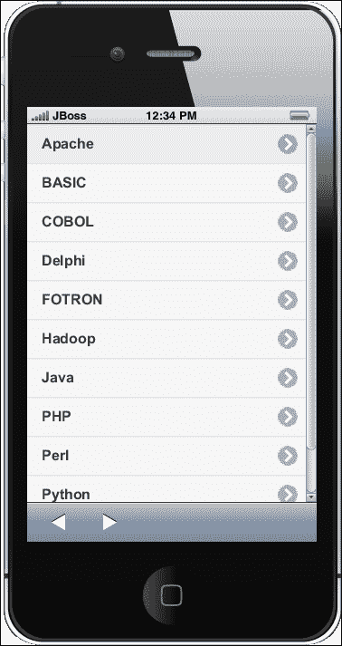
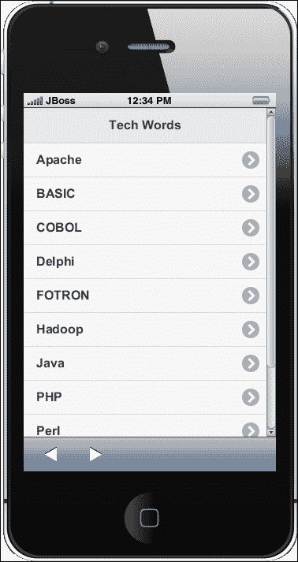
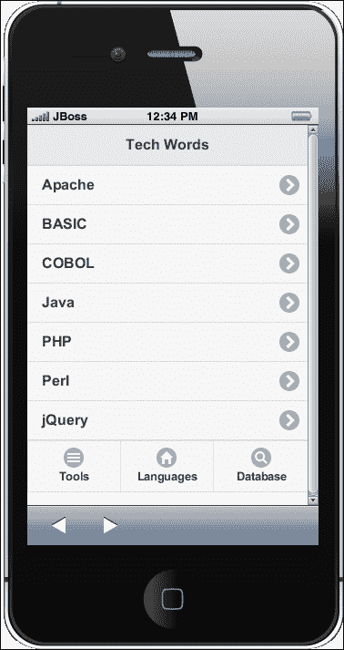

# 第三章. 移动框架

*在第二章*《创建您的第一个 PhoneGap 项目*》，你学习了 PhoneGap 应用程序结构、事件、如何使用命令行工具以及如何创建示例应用程序。你还了解了可以帮助开发者的各种调试方法，并看到了如何构建/部署你的应用程序。在本章中，你将学习设计方法、行业中的移动框架以及这些框架的详细信息。我们还将看到如何使用 jQuery Mobile 创建示例应用程序*。

在本章中，你将完成以下事项：

+   回顾一些关于为移动设备开发原生 UI 的概念

+   探索开发移动 UI 的最佳实践

+   了解最受欢迎的应用程序框架概述

+   学习如何使用 jQuery mobile 创建移动应用程序

# 为移动设备构建原生 UI

当使用 PhoneGap 时，你创建基于标准的混合应用程序。应用程序通过 WebView 呈现给用户，这意味着它是一个封装在应用程序本身中的浏览器实例。

因此，了解如何使用针对移动设备的 HTML 标签、CSS 属性和 JavaScript 方法、属性和事件非常重要。

## `viewport`元标签

`viewport`元标签是由苹果公司在 iOS 1.0 中引入的，并且在所有主要的移动浏览器中得到广泛支持。当一个网页不适合浏览器的大小，移动浏览器的默认行为是缩放它。`viewport`元标签是你控制这种行为的所需元素。

`viewport`元标签看起来像以下代码片段：

```js
<meta name="viewport" content="width=device-width, height=device-height, initial-scale=1, minimum-scale=1, maximum-scale=1.5, user-scalable=1">
```

你实际上告诉浏览器的是，内容的默认宽度和高度是设备屏幕的宽度和高度（`width=device-width`和`height=device-height`），内容是可缩放的（`user-scalable=1`），以及最小和最大缩放值是多少（`minimum-scale=1`和`maximum-scale=1.5`）。

在 Apple 开发者库网站上提供了关于`viewport`元标签的详尽参考，网址为[`developer.apple.com/library/safari/#documentation/appleapplications/reference/SafariHTMLRef/Articles/MetaTags.html`](https://developer.apple.com/library/safari/#documentation/appleapplications/reference/SafariHTMLRef/Articles/MetaTags.html)。在 Opera 开发者网站上也有一些有用的信息，网址为[`dev.opera.com/articles/view/an-introduction-to-meta-viewport-and-viewport/`](http://dev.opera.com/articles/view/an-introduction-to-meta-viewport-and-viewport/)。

记住，PhoneGap 默认使用的 WebView 会忽略`viewport`元标签中定义的设置；你将在本章中学习如何在你的应用程序中启用对 viewport 设置的处理。

## 不想要的电话号码链接

在大多数手机上，移动浏览器点击拨号格式检测并不准确；许多数字被选中，包括地址、ISBN 号码以及各种不同类型的非电话号码的数字数据。为了避免任何可能的问题并完全控制从你的 HTML 标记中发起的通话，有必要在页面头部添加以下元标签：

```js
<meta name="format-detection" content="telephone=no">
```

定义此标签后，你可以通过在`href`属性中使用`tel`或`sms`方案来控制如何处理数字：

```js
<a href="tel:18005555555">Call us at 1-800-555-5555</a>
<a href="sms:18005555555?body=Text%20goes%20here">
```

请注意，这种电话格式检测仅适用于移动浏览器。在桌面浏览器中，它不起作用，除非你在桌面上安装了某些桌面电话软件（如 Skype）以及浏览器插件。

## 自动更正

使用移动设备提交数据对用户来说是一项繁琐的操作，因为有时内置的自动更正功能根本不起作用。为了禁用自动更正功能，请使用`autocorrect`、`autocomplete`和`autocapitalize`属性与`input`字段结合使用：

```js
<input autocorrect="off" autocomplete="off" autocapitalize="off">
```

## CSS 媒体查询和移动属性

CSS 的一个有趣特性是媒体查询。媒体查询本身其实相当古老，并不特定于移动设备，但在处理移动设备上的不同屏幕尺寸时非常实用。媒体查询可以内联使用：

```js
@media all and (orientation: portrait) {
    body { }
    div { }
}
```

或者，媒体查询可以作为`link`标签的`media`属性使用：

```js
<link rel="stylesheet" media="all and (orientation: portrait)" href="portrait.css" />
```

没有使用它们的最佳方式，因为这取决于应用程序的类型。使用内联媒体查询，CSS 文件往往会增长，并且在旧设备上解析可能会变慢。另一方面，将 CSS 规则组织在单独的文件中有助于保持代码的良好组织并加快解析速度，但这意味着更多的 HTTP 调用，通常由于移动连接的延迟，这不是移动设备上的最佳选择。

应该通过使用离线缓存策略来达到良好的平衡，你将在下一章中了解更多关于离线缓存策略的内容。

有几个 CSS 特定于移动的属性；大多数都是供应商特定的，并带有前缀。在移动开发中最常用的属性包括：

+   `-webkit-tap-highlight-color: 0;`（iOS）：这覆盖了当用户点击链接或可点击元素时出现的半透明颜色覆盖层。这是唯一的 iOS 特定属性。

+   `-webkit-user-select: none;`：这阻止了用户选择文本。

+   `-webkit-touch-callout: none;`：这阻止了当用户触摸并保持一个元素（如`anchor`标签）时调用工具栏的出现。

总是记住，在 JavaScript 中使用浏览器前缀仅通过使用混合大小写或小驼峰式格式化是可能的，这意味着为了防止用户通过 JavaScript 选择文本，你必须使用以下语法：

```js
yourElementVariable.style.webkitUserSelect = 'none';
```

驼峰式格式化是由于在 JavaScript 中变量名不能使用破折号符号的事实。

## 屏幕方向

当处理应用时，屏幕方向很重要，因为当方向改变时，屏幕的大小会显著变化。在每次旋转 90 度（纵向和横向模式）时都会触发`orientationchange`事件，并且可以使用`addEventListener`来监听它；当前的方向可以通过`window.orientation`获取。

## 设备方向

如果您想获取有关设备方向的更详细信息，可以为`deviceorientation`事件定义一个监听器。`deviceorientation`事件会非常频繁地触发，并给出有关设备方向的三维信息，以 alpha、beta 和 gamma 的值表示，如下所示：

```js
window.addEventListener("deviceorientation", handleOrientation, true);

function handleOrientation(event) {
    var alpha    = event.alpha;
    var beta     = event.beta;
   var gamma    = event.gamma;

  // Change device orientation based on the data
}
```

`deviceorientation`事件严格与设备上是否存在陀螺仪相关；陀螺仪测量 3D 角度方向，即使设备处于静止状态。有关使用方向数据的详细信息，请参阅[`developer.mozilla.org/en-US/docs/Web/API/Detecting_device_orientation`](https://developer.mozilla.org/en-US/docs/Web/API/Detecting_device_orientation)。

## 摇晃手势

手势处理是成功应用的关键。当用户摇晃或移动其设备时，会触发`devicemotion`事件。`devicemotion`事件严格与加速度计相关，当设备加速时，加速度计会触发事件。

## 媒体捕获 API

虽然旧版本的 iOS 仍然缺乏基本的文件输入，但 Android、iOS 6 版本及以后、Windows Phone 8 和 BlackBerry 10 正在为开发者提供对用户可以上传的内容的精细控制，并允许您访问设备摄像头和麦克风：

```js
<!-- opens directly to the camera -->
<input type="file" accept="image/*;capture=camera"></input>
<!-- opens directly to the camera in video mode -->
<input type="file" accept="video/*;capture=camcorder"></input>
<!-- opens directly to the audio recorder -->  
<input type="file" accept="audio/*;capture=microphone"></input>
```

## 数据 URI

您可以将图片表示为 Base64 字符串，这确保了更高的性能，因为没有 TCP 协商来打开新的 HTTP 连接。从实际的角度来看，这意味着与在网络上通常加载图片的方式相比，延迟更低。当将`base64`字符串分配给`img`标签的`src`属性时，代码看起来如下所示：

```js

```

当将图片转换为 Base64 时，会有 30-40%的重量增加；因此，在转换之前必须仔细优化图片，并在可能的情况下，在服务器上激活 GZip 压缩。

# 在 iOS 上实现原生外观和感觉

iOS 平台最大的问题之一是您的应用在 App Store 的发布。事实上，苹果在检查应用是否可以添加到商店时非常谨慎。

被允许进入 App Store 的最重要标准之一是应用提供 iOS 用户体验。有关应用必须满足的详细要求以进入 App Store 的信息，请访问位于[`developer.apple.com/app-store/review/`](https://developer.apple.com/app-store/review/)的 Apple 开发者网站。

近年来，已经开发出几个针对 iOS 的特定移动框架，例如 Framework 7，可以为您的应用提供 iOS 原生外观。更多信息，请访问[`www.idangero.us/framework7/`](http://www.idangero.us/framework7/)。

# 选择移动框架

开发者通常有自己的模板库，这些库是从零开始构建或商业的，用于快速启动他们的项目。在本节中，我们将简要概述一些有用的 HTML/CSS/JavaScript 框架，您可以将它们作为蓝图、库和框架集成到您的项目中。

### 注意

框架或库本质上是一组您可以调用的函数，这些天通常组织成类或文件。框架体现了一些抽象设计，并内置了更多行为。马丁·福勒在他的文章中进一步讨论了库和框架之间的区别，该文章可在[`martinfowler.com/bliki/InversionOfControl.html`](http://martinfowler.com/bliki/InversionOfControl.html)找到。

## 使用 HTML5 移动模板

这是一个非常干净、适合移动设备的 HTML 模板，它包括优化的 Google Analytics 片段、基于触摸的设备图标占位符、Zepto 库（一个适用于现代浏览器的极简 JavaScript 库，具有大量与 jQuery 兼容的 API），以及 Modernizr 功能检测库（一个使用对象检测技术来发现在使用之前某个功能是否可用的库，允许网页优雅降级或渐进增强）。

您可以从官方网站[`html5boilerplate.com/mobile/`](http://html5boilerplate.com/mobile/)下载 HTML5 移动模板；要获取更新或参与项目，请关注 GitHub 上的项目[`github.com/h5bp/mobile-boilerplate`](https://github.com/h5bp/mobile-boilerplate)。

如果您想下载一个定制的 HTML5 移动模板版本，该版本允许您选择要使用的模板、要包含的 JavaScript 库等，请访问[`www.initializr.com/`](http://www.initializr.com/)。

## 使用 Zurb Foundation

您可能已经听说过响应式设计，这是一种响应观看者设备约束的网站设计。目前这是一个热门话题，Foundation 框架最重要的特性是其布局机制的响应性。

此外，Foundation 提供了一系列模板，用于您应用中最常见的部分；当您从[`foundation.zurb.com/download.php`](http://foundation.zurb.com/download.php)下载框架时，可以选择您想要的模板。

Foundation 的优势如下：

+   一个基于百分比、最大宽度任意的 12 列网格

+   忽略像素的图像样式——基础图像通过网格按不同宽度缩放

+   UI 和布局元素，包括常见的元素，如排版和表单，以及标签页、分页、N-up 网格等

+   移动可见性类——Foundation 让您能够非常快速地在桌面、平板电脑和手机上隐藏和显示元素。

要跟上 Foundation 的最新构建，请关注 GitHub 项目，该项目位于[`github.com/zurb/foundation`](https://github.com/zurb/foundation)。

## 使用 Twitter Bootstrap

Twitter Bootstrap 是一个用于创建网站和 Web 应用程序的免费工具集合。它包含基于 HTML 和 CSS 的设计模板，用于排版、表单、按钮、图表、导航以及其他界面组件，以及可选的 JavaScript 扩展。

这个项目是 GitHub 上最受欢迎的项目之一；它组织得非常好，看起来天生就是为了构建应用程序而设计的。实际上，它包括了基本的 CSS 和 HTML 来创建网格、布局、排版、表格、表单、导航、警告、弹出框等功能。

由于 Bootstrap 使用了 jQuery，因此使用 Bootstrap 开始工作非常简单。要下载 Bootstrap，您可以参考项目下载和自定义页面，该页面位于[`twitter.github.com/bootstrap/customize.html`](http://twitter.github.com/bootstrap/customize.html)；如果您想下载 Bootstrap 的模板，可以参考已提到的[`www.initializr.com/`](http://www.initializr.com/)网站。但请注意，Bootstrap 是专门为移动 Web 设计的，而不是为混合移动应用程序设计的。

## Ionic 框架

Ionic 框架是一个强大的 HTML5 混合应用程序开发框架，它帮助您使用 Web 技术（如 HTML、CSS 和 JavaScript）构建具有原生感觉的移动应用程序。它是考虑到混合移动应用程序而制作的。由于 Ionic 基于 AngularJS 并构建在 PhoneGap/Cordova CLI 之上，您可以看到更多类似于它的 CLI 命令语法。它有一个较深的学习曲线，但值得学习。AngularJS 本身不是一个混合移动框架，但 Ionic 提供了混合移动框架所需的一切。该框架正在积极维护。此外，该框架根据平台处理 UI 渲染，为用户提供原生感觉。请注意，它仅对 Android 和 iOS 提供官方支持。您可以从[`ionicframework.com/`](http://ionicframework.com/)了解更多信息。

## ExtJS

ExtJS 是一个具有美观 UI 小部件的 JavaScript 框架，用于构建交互式网站，基于 ExtJS 的 Sencha Touch 可以用于构建混合移动应用程序。它具有各种功能，很难一一列举。总的来说，您将拥有开发功能丰富的应用程序所需的一切。它既有开源许可，也有企业许可，您可以在[`www.sencha.com/products/extjs/`](https://www.sencha.com/products/extjs/)和[`www.sencha.com/products/touch`](https://www.sencha.com/products/touch)了解更多信息。

## AngularJS

AngularJS 是来自 Google 的 JavaScript 框架，现在是企业开发的明星。由于它基于 JavaScript，AngularJS 和 Cordova/PhoneGap 配合得非常好。AngularJS 的学习曲线陡峭，如 ExtJS，但一旦你度过那个阶段，你会感到很棒。为了构建混合应用程序，AngularJS 有一个特殊的移动版本，称为 Mobile AngularJS UI。你可以在[`angularjs.org`](http://angularjs.org)和[`mobileangularui.com`](http://mobileangularui.com)分别了解更多关于 AngularJS 和 Mobile AngularJS UI 的信息。

## jQuery Mobile

jQuery Mobile 框架是一个跨所有流行移动设备平台的用户界面系统，建立在坚固的 jQuery 和 jQuery UI 基础之上。其代码库采用渐进增强构建，并具有灵活、易于主题化的设计。

jQuery Mobile 对所有主要的现代桌面、智能手机、平板电脑和电子阅读器平台都有广泛的支持。此外，由于渐进增强方法，还支持功能手机和旧浏览器（详情请参阅[`jquerymobile.com/gbs/`](http://jquerymobile.com/gbs/)）。

jQuery Mobile 的主要功能可以总结如下：

+   跨平台、跨设备和跨浏览器

+   优化触摸设备的 UI

+   可主题化和可定制的设计

+   仅使用非侵入性的语义 HTML5 代码

+   AJAX 调用自动加载动态内容

+   轻量级（压缩后 12 KB）

+   渐进增强

+   可访问性

要下载最新稳定版本并保持项目更新，请参考官方网站[`jquerymobile.com`](http://jquerymobile.com)，在那里你可以找到有用的示例和创建你自己的主题的工具[`jquerymobile.com/themeroller/`](http://jquerymobile.com/themeroller/)。

# 行动时间 - 使用 jQuery Mobile 进行开发

让我们看看如何在 PhoneGap 应用程序中使用 jQuery Mobile 的一个快速示例。你可以通过使用 jQuery Mobile 使任何 HTML 页面都变得移动友好。我们将创建一个简单的应用程序，以列表形式显示页面中的多个条目，并显示一些页脚菜单。

1.  首先，我们需要下载 jQuery 和 jQuery Mobile 组件，并将它们放置在我们的项目 JS/CSS 目录中。jQuery 是一个单一的 JavaScript 文件，jQuery Mobile 包括一个 JavaScript 文件和一个 CSS 文件。我们需要在应用程序的 HTML 页面中包含它们。

1.  在 HTML 页面的顶部包含 CSS 文件，紧位于`</head>`标签之上：

    ```js
    <link rel="stylesheet" href="css/jquery.mobile-1.4.4.min.css" />
    ```

1.  在页面底部包含 JavaScript 文件，紧位于`</body>`标签之上：

    ```js
    <script src="img/jquery-1.11.1.min.js"></script>
    <script src="img/jquery.mobile-1.4.4.min.js"></script>
    ```

1.  在 jQuery Mobile 中，您通过将`data-role`属性分配给`page`来定义页面部分。

    首先，让我们添加一个`div`元素来标记一个页面：

    ```js
    <div data-role="page">
    </div>
    ```

1.  现在，让我们向页面添加一个列表。在 jQuery Mobile 中，列表是通过向`<ul>`元素添加`listview`数据角色来识别的：

    ```js
    <div data-role="page">
        <ul data-role="listview">
        </ul>
    </div>
    ```

1.  要向列表视图添加项目，我们将向`<ul>`标签添加数据，如下所示：

    ```js
    <div data-role="page">
      <ul data-role="listview">
        <li><a href="#">Apache</a></li>
        <li><a href="#">BASIC</a></li>
        <li><a href="#">COBOL</a></li>
        <li><a href="#">Delphi</a></li>
        <li><a href="#">FOTRON</a></li>
        <li><a href="#">Hadoop</a></li>
        <li><a href="#">Java</a></li>
        <li><a href="#">PHP</a></li>
        <li><a href="#">Perl</a></li>
        <li><a href="#">Python</a></li>
        <li><a href="#">jQuery</a></li>
      </ul>
    </div>
    ```

    您可以在桌面浏览器或来自 IDE 的移动模拟器中测试输出。对于前面的代码，您将在模拟器中看到以下输出：

    

1.  现在让我们给页面添加一个标题，使其看起来更好。要添加标题到页面，使用 `data-role` 属性作为 `header`，如下所示：

    ```js
    <div data-role="header">
      <h1>Tech Words</h1>
    </div>
    ```

    添加了标题后，您现在将在模拟器中看到以下输出：

    

1.  现在，是时候给应用程序添加一个页脚菜单了。使用以下代码将页脚菜单添加到页面中：

    ```js
    <div data-role="navbar">
      <ul>
        <li><a href="#" data-icon="bars">Tools</a></li>
        <li><a href="#" data-icon="home">Languages</a></li>
        <li><a href="#" data-icon="search">Database</a></li>
      </ul>
    </div>
    ```

    前面的 HTML 代码在 `div` 元素内创建了一个简单的无序列表。列表的内容将根据我们设置的 `data-role` 属性作为导航栏。

    现在应用程序将看起来如下截图所示：

    

我们创建了一个基于 jQuery Mobile 的简单应用程序，并在此提供了完整的 `index.html` 代码供您参考：

```js
<!DOCTYPE html>
<html>
<head>
<meta http-equiv="Content-Type" content="text/html; charset=UTF-8" />
<meta name="format-detection" content="telephone=no" />
<meta name="viewport"
  content="user-scalable=no, initial-scale=1, maximum-scale=1, minimum-scale=1, width=device-width;" />
<link rel="stylesheet" href=" css/jquery.mobile-1.4.4.min.css" />
<title>Hello Cordova</title>
</head>
<body>
  <div data-role="page">
    <div data-role="header">
      <h1>Tech Words</h1>
    </div>
    <ul data-role="listview">
      <li><a href="#">Apache</a></li>
      <li><a href="#">BASIC</a></li>
      <li><a href="#">COBOL</a></li>
      <li><a href="#">Java</a></li>
      <li><a href="#">PHP</a></li>
      <li><a href="#">Perl</a></li>
      <li><a href="#">jQuery</a></li>
    </ul>
    <div data-role="navbar">
    <ul>
      <li><a href="#" data-icon="bars">Tools</a></li>
      <li><a href="#" data-icon="home">Languages</a></li>
      <li><a href="#" data-icon="search">Database</a></li>
    </ul>
    </div>
  </div>
  <script src="img/jquery-1.11.1.min.js"></script>
  <script src="img/jquery.mobile-1.4.4.min.js"></script>
</body>
</html>
```

# 选择框架

很难说哪个框架是最好的，因为每个框架都有自己的优缺点。大多数时候，我不得不说这取决于您必须实现的功能，以及您的应用程序的本质。例如，如果应用程序仅针对手机，那么您可以选择使用更轻量级的 HTML5 Mobile Boilerplate；另一方面，如果应用程序旨在用于 Web 和手机，那么一个更复杂的库可能是正确的选择。

jQuery Mobile 非常容易学习和实现。然而，当谈到良好的性能时，jQuery Mobile 并不是领导者。另一方面，某些框架，如 ExtJS 和 Ionic，需要更多的学习才能在企业级应用程序中使用。它们有几个现成的组件，有助于快速开发。

一些框架仅提供 CSS，一些提供 JavaScript，还有一些两者都有混合。例如，jQuery Mobile 提供了 CSS 主题功能，还提供了 JavaScript 插件以添加更多功能。始终记住，您的目标是找到内置功能和性能之间的平衡，因为移动设备远不如桌面设备强大。

# 摘要

在本章中，您学习了如何构建一个在所有平台上看起来都像原生的 PhoneGap 应用程序，并概述了各种移动开发框架。逐步解释了一个 jQuery Mobile 应用程序代码示例。在下一章中，您将学习如何在您的 Cordova/PhoneGap 项目中处理插件。您将了解如何使用命令行工具安装、集成和删除插件。
