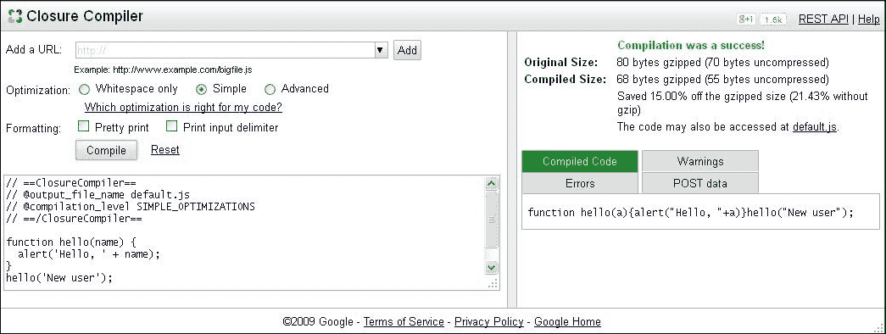

# 第九章。准备发布

*到目前为止，你已经使用 PhoneGap 创建了你的应用，定义了其界面的构建块，并学会了使用 PhoneGap 提供的各种 API。在本章中，你将巩固应用架构，并学习如何为你的最终发布到公众做准备。你可以使用各种方法优化你的应用，为用户提供一个坚实的用户体验。*

在本章中，你将：

+   学习如何压缩你的 JavaScript，并了解为什么这对于移动应用尤其重要

+   学习如何引入 JavaScript 依赖项

+   了解更多关于模板引擎以及如何压缩模板文件

+   使用 PhoneGap 创建流畅的、多个视图的应用

+   学习如何创建硬件加速的过渡

+   发现如何使用适用于 Web 和移动平台的通用代码库

# 探索 JavaScript 压缩

在计算机编程中，我们将从源代码文件中删除不必要的字符，并将它们最终连接起来的过程称为 **文件压缩**。在处理 Web 标准时，我们可以压缩任何类型的文件，包括 HTML、CSS 和 JavaScript。这个过程的主要目标是减小文件大小，以加快下载时间。

在使用 PhoneGap 进行源代码压缩时，其中一个好处是性能提升。在处理移动应用时，文件会被编译成一个单独的文件，最终加载外部数据。然而，当处理使用 PhoneGap 构建的应用时，即使文件存储在本地，也必须在浏览器（即 **WebView**）中加载。较小的文件将执行得更快，因此最终用户将获得一个响应性更强的用户界面，体验更佳。

你可能会认为在移动设备上真正重要的是内存消耗，并且压缩不会导致内存使用量的大幅减少，因为原始文件和压缩后的文件都被解释成相同的代码。然而，有一些压缩工具可以影响运行时性能。以下几节将讨论三种最流行的压缩工具，这些工具可能有助于提高你应用的性能。

## Google Closure Compiler

**Google Closure** 是一套开源工具，旨在帮助开发者加快现代 Web 应用的开发过程。该项目包括一个 JavaScript 优化器、全面的 JavaScript 库、服务器端和客户端模板引擎，以及 JavaScript 风格检查器和风格修复器。由于本书的范围不包括 Google Closure 的完整概述，我们将仅关注编译器。

描述编译器的一句话最好的来自在线文档：

> *“它不是从源语言编译到机器代码，而是从 JavaScript 编译到更好的 JavaScript。”*

你可以使用以下三种方式之一使用编译器：

+   您可以在 [`closure-compiler.appspot.com/home`](http://closure-compiler.appspot.com/home) 在线使用它。

+   您可以从 [`closure-compiler.googlecode.com/files/compiler-latest.zip`](http://closure-compiler.googlecode.com/files/compiler-latest.zip) 下载一个 Java 应用程序，并通过命令行工具执行它。

+   您可以使用 Google 提供的 API（见 [`developers.google.com/closure/compiler/docs/gettingstarted_api`](https://developers.google.com/closure/compiler/docs/gettingstarted_api)）。

当您打开在线应用程序时，您可以在左侧面板中指定您想要编译的脚本的 URL，您想要应用于输出文件的优化类型，以及您是否希望输出文件格式化为可读性。在网页应用程序的右侧面板中，您将获得一份报告，涉及文件的原始大小和优化大小，编译后的代码，警告列表，最终可能是一些错误，以及发送到 Closure Compiler API 的 POST 数据。提供的警告涉及源代码中可能出现的错误和可以执行的优化。有关可能的警告消息的参考，请访问 [`developers.google.com/closure/compiler/docs/error-ref`](https://developers.google.com/closure/compiler/docs/error-ref)。



如果您更喜欢使用命令行工具，您可以下载编译器应用程序并执行它，指定编译选项、输入文件和输出文件：

```js
$ java -jar compiler.jar --compilation_level ADVANCED_OPTIMIZATIONS --js hello.js

```

使用在线工具时，您将获得相同的结果；然而，使用命令行可以节省一个额外的步骤：您不需要首先上传源代码。

当您使用高级优化时，请注意，重命名过程将更加激进，未使用的代码将被删除，函数调用的主体将被替换为函数本身的主体（这个过程被称为**函数内联**）。

# 行动时间 - 使用 Closure Compiler 压缩文件

按照以下步骤使用 Google Closure Compiler 获取压缩和优化的文件：

1.  下载并解压可在 [`dl.google.com/closure-compiler/compiler-latest.zip`](http://dl.google.com/closure-compiler/compiler-latest.zip) 获取的 Closure Compiler 应用程序。

1.  打开命令行工具，移动到解压文件夹，并创建一个名为 `sample` 的文件夹。

1.  在新文件夹中，创建三个文件：`index.html`、`test.js` 和 `index.js`。您可以使用以下命令：

    ```js
    $ echo ‘<!DOCTYPE html><html><head></head><body></body></html>' > index.html
    $ echo > index.js
    $ echo > test.js

    ```

1.  打开 `test.js` 文件并定义一个自执行的函数。在函数体内部，声明两个其他函数，并返回其中一个，以便能够从另一个 JavaScript 文件（这两个函数的目的是模拟某些代码保留在闭包内部而其他代码通过返回对象公开的实际用例）中运行此代码。

    ```js
    var test  =  (function(){

        var main = function(){

            alert(‘executing main');
            internal();
        };

        var internal = function(){

            alert(‘executing internal');

        };

        return {

            init: main

    }

    }());
    ```

1.  打开 `index.js` 文件并声明一个变量以存储自执行函数的结果，并调用函数本身返回的 `init` 函数：

    ```js
    var myTest = test.init();
    ```

1.  返回到命令行工具并针对你刚刚创建的 JavaScript 文件运行编译器：

    ```js
    $ java -jar closure-compiler/compiler.jar --compilation_level ADVANCED_OPTIMIZATIONS --js samples/test.js samples/index.js --js_output_file samples/app.js

    ```

1.  打开生成的文件并查看源代码；你会得到以下 JavaScript：

    ```js
    alert(“executing main”);alert(“executing internal”);
    ```

1.  在 HTML 页面中插入指向新优化 JavaScript 文件的 `script` 标签并在浏览器中打开它。

## *发生了什么？*

你发现了 Closure Compiler 的 `ADVANCED_OPTIMIZATIONS` 编译级别的潜力。正如你所见，它相当激进。实际上，如果你使用为你的实际项目创建的文件运行相同的命令，你将无法按预期运行应用程序。简而言之，确保检查 `ADVANCED_OPTIMIZATIONS` 选项是否破坏了你的代码；如果是这样，你应该考虑使用不同的压缩级别。

接下来，你将了解如何使用 UglifyJS 优化和压缩 JavaScript 模块。

### 注意

为了获得 Closure Compiler 的全面指南，请参考在线参考 [`developers.google.com/closure/compiler/docs/api-tutorial3`](https://developers.google.com/closure/compiler/docs/api-tutorial3)，或者只需在命令行工具中输入 `$ java -jar compiler.jar --help`。

## UglifyJS2

当 jQuery 开始使用它时，**UglifyJS** 项目变得非常流行。作为 *de facto* 标准 JavaScript 库之一的使用，导致作者收到了很多反馈，这反过来帮助他修复了大量的错误。

项目的新版本，命名为 **UglifyJS2**，比之前的版本慢，但整体压缩效果要好得多，并且有更多高级功能，例如多级源映射（基本上，这是一种将合并/压缩文件映射回未构建状态的方法），就像在 Google Closure Compiler 中一样。

UglifyJS2 以 Node.js 模块的形式分发。为了安装它，你可以像安装任何其他 Node.js 模块一样进行。打开命令行工具并使用 npm 安装 `uglify-js` 模块：

```js
$ sudo npm install uglify-js -g

```

到目前为止，压缩你的 JavaScript 文件变得容易多了。

# 行动时间 – 使用 UglifyJS

让我们看看如何使用与 Google Closure Compiler 一起工作的相同文件获得压缩版本：

1.  打开你的命令行工具并转到为测试 Closure Compiler 创建的样本文件夹。

1.  输入以下命令以连接 JavaScript 文件并运行 UglifyJS2 压缩器。对于 Windows，你可以使用 `copy` 命令来连接文件：

    ```js
    C:\ copy /a *.js index.js

    $ cat test.js index.js

    $ uglifyjs --inline-script -o mytest.min.js

    ```

1.  打开生成的文件，查看源代码；你会得到以下 JavaScript：

    ```js
    var test=function(){var main=function(){alert(“executing manin”);internal()};var internal=function(){alert(“executing internal”)};return{init:main}}();var test=test.init();
    ```

1.  在 HTML 页面中插入 `script` 标签并在浏览器中打开它。

## *发生了什么？*

您创建了一个压缩版本的两个简单的 JavaScript 文件。如您所见，输出与使用 Closure Compiler 创建的输出相当不同。UglifyJS2 的一个主要特点是生成的输出不会破坏源代码。

对于完整的参考，您可以在 GitHub 上的项目页面进行检查，链接为[`github.com/mishoo/UglifyJS2`](https://github.com/mishoo/UglifyJS2)。

### 注意

如果您在第四章“使用插件”中运行 UglifyJS2 以压缩文件，您将能够按预期运行应用程序。

## 使用 RequireJS 进行优化

RequireJS 包含一个名为**r.js**的优化工具，该工具将相关的脚本组合到构建层中，并通过 UglifyJS 或 Closure Compiler 对其进行压缩。该工具可以通过 Node.js 或 Java 使用。当使用 Closure Compiler 时，必须使用 Java 运行该工具。

优化器比使用普通的连接脚本更好，因为它在优化过程中运行 RequireJS，因此知道如何加载插件以及您应用程序中需要的所有 JavaScript 模块的依赖项。

要获取关于 r.js 的全面指南，请参考 GitHub 上可用的 readme 文件，链接为[`github.com/jrburke/r.js`](https://github.com/jrburke/r.js)。

# 动手时间 - 使用 RequireJS 优化 JavaScript

按照以下步骤使用 Node.js 和 RequireJS 优化您的 app 的源代码：

1.  使用 npm 从命令行工具安装`requirejs`模块：

    ```js
    $ sudo npm install requirejs -g

    ```

1.  前往您在前几章中工作的 app 的根目录，创建一个名为`build.js`的文件，并向其中添加构建过程配置信息（即 JavaScript 文件夹、项目中使用的库的路径、app 的主文件名以及输出文件夹和文件名）：

    ```js
    ({
        baseUrl: ‘js/',
        paths: {
            mustache: ‘libs/mustache',
            alice: ‘libs/alice.min',
            text: ‘libs/require/plugins/text'
        },
        name: ‘main',
        out: ‘js/main-built.js'
    })
    ```

1.  再次打开命令行工具并执行以下命令以构建 app：

    ```js
    $ r.js -o build.js

    ```

1.  打开`index.html`文件并更改 header 中的`script`标签中您的 app 的入口点：

    ```js
    <script data-main=”js/main-built” src=”js/libs/require/require.js”></script>
    ```

1.  在浏览器中打开`index.html`文件。

## *发生了什么？*

您创建了一个压缩版本的 app 的 JavaScript 文件，这些文件被压缩到一个单独的文件中，使用构建文件指定了命令行选项。结果是，app 的代码现在使用 UglifyJS2（幕后工作的引擎）进行了优化，并且仍然可以完美运行。为了获得完整的构建选项概述，请参考 GitHub 上可用的示例构建文件，链接为[`github.com/jrburke/r.js/blob/master/build/example.build.js`](https://github.com/jrburke/r.js/blob/master/build/example.build.js)。

### 提示

如果你更喜欢使用 Closure Compiler 来压缩和优化应用程序的 JavaScript 文件，你必须下载 Rhino 的二进制文件（一个完全用 Java 编写的 JavaScript 开源实现），可在[`developer.mozilla.org/en-US/docs/Rhino/Download_Rhino`](https://developer.mozilla.org/en-US/docs/Rhino/Download_Rhino)找到，从 RequireJS 网站[`requirejs.org/docs/download.html#rjs`](http://requirejs.org/docs/download.html#rjs)下载 r.js，在构建文件中添加`optimize: ‘closure'`选项，并执行以下命令：

```js
$ java -classpath ~/rhino1_7R4/js.jar:~/compilers/closure-compiler/compiler.jar org.mozilla.javascript.tools.shell.Main r.js build.js

```

在这里，`classpath`指的是 Rhino 和 Closure Compiler 的完整路径。

# 压缩工具比较

我们已经介绍了三种最受欢迎的压缩工具。每种工具都有其优缺点。一如既往，最适合你的工具是那个最能满足你需求的工具。以下表格总结了使用我们刚才讨论的工具压缩 RequireJS 文件本身可以得到的压缩结果，单位为字节：

| 文件 | 原始大小 | 压缩工具 | 压缩后大小 |
| --- | --- | --- | --- |
| RequireJS | 82944 | UglifyJS2 | 24576 |
| Google Closure | 13312 |
| r.js | 15360 |

如你所见，在这个例子中，Google Closure 产生了最佳结果，但这并不总是如此。如果你在流行的 RaphaelJS 库上运行相同的测试，你将得到 Google Closure Compiler 的最佳结果。结果取决于源代码的编写风格；因此，没有单一的最好工具可以使用。我更喜欢 r.js，因为它不仅可以运行压缩引擎，而且可以很好地处理插件和模块依赖。

JavaScript 任务运行器，如 Gulp 或 Grunt，可以用来创建任务，在资源有变化时自动链接、压缩和合并资源。

### 注意

你可能还考虑的其他压缩工具有 KJScompress、Bananascript、JSMin、ShrinkSafe 和 YUI Compressor。

# 使用模板引擎压缩

当你在较大的 HTML 项目上工作时，建议使用 JavaScript 模板引擎和图像压缩。当应用程序需要频繁更新数据时，模板库将非常有用。我坚信没有所谓的*最佳*JavaScript 模板引擎。每次你开始一个项目时，你必须决定哪个引擎最适合当前任务。例如，**Underscore.js**模板快速且轻量级，如果你想在应用程序中预先加载它们，那么这是一个不错的选择。当使用 jQuery 时，自然的选择似乎是**ICanHaz.js**，因为它将每个模板作为 jQuery 对象返回。当你需要一个更健壮的模板引擎时，**Google Closure Templates**可能是一个有效的选择。要比较模板引擎，请访问[`garann.github.io/template-chooser/`](http://garann.github.io/template-chooser/)。

在大多数情况下，**Mustache.js**完全符合应用程序的需求，因为没有逻辑在模板中，并且模板是语言无关的，允许您在前端和后端之间重用它们。有几个基于**Mustache.js**的模板引擎，包括**Handlebars.js**、**Hogan.js**或**Pistachio**。

Handlebars.js 是 Mustache.js 的超集，它添加了一些有用的功能，如块表达式、辅助函数等（有关完整概述，请参阅[`handlebarsjs.com/`](http://handlebarsjs.com/)上的在线文档）。

Hogan.js 是 Twitter 的 Mustache.js 模板的非常强大的编译器。Hogan.js 还附带了一个命令行实用程序，该实用程序可以编译存储在文件夹中的所有`*.mustache`模板；实用程序位于`hogan.js-template/bin`文件夹中。有关 Hogan.js 的更多信息，请访问 GitHub 上的[`github.com/twitter/hogan.js`](https://github.com/twitter/hogan.js)。

Pistachio 不仅仅是一个基于 Mustache.js 的 JavaScript 模板引擎。它的包包含一个纯 JavaScript 编译器，可以将模板编译成自包含的 JavaScript 函数，这些函数可以在任何 JavaScript 环境中使用。

为了开始使用 Pistachio 编译器，您可以将它作为 Node.js 模块安装：

```js
$ sudo npm install pistachio -g

```

安装完成后，您可以通过输入`pistachio`后跟您想要编译的文件路径来编译一个模板。

Pistachio 编译器的有趣特性是能够将模板编译为 AMD 模块或 CommonJS 兼容模块，并且可以将输出创建为 jQuery 对象。使用 Pistachio 编译的模板仍然是动态的，并且可以使用 Google Closure Compiler 进一步压缩。有关 Pistachio 的完整参考，请访问[`npmjs.org/package/pistachio`](https://npmjs.org/package/pistachio)。

压缩模板可以加快您的应用程序渲染速度，因为您可以将它缓存为 JavaScript 函数，并在应用程序使用时避免使用**AJAX**请求（涉及一些性能惩罚）不断加载和卸载它。

### 小贴士

如果您想在文件中包含多个模板，您只需将它们存储在`script`标签中，为每个标签分配一个 ID，然后使用`getElementByID()`文档对象方法和`innerHTML` HTMLElement 对象属性来渲染它：

```js
<script type=”text/x-mustache” id=”tid...”>
    /* mustache template */
</script>
```

# 行动时间 - 使用 Pistachio 编译模板

创建一个新的模板文件，并最终使用 Pistachio 将其压缩。按照以下步骤操作：

1.  打开您的命令行工具并移动到包含模板文件的文件夹中。

1.  输入`pistachio`命令并指定输出文件名和要编译的文件名：

    ```js
    $ pistachio --out=splash-tpl.js splash-tpl.html

    ```

1.  为现有模板创建一个名为，例如，`template-build.js`的构建文件，以便在压缩文件时使用 UglifyJS2，指定模板名称和所需的输出文件名：

    ```js
    ({
        name: ‘splash-tpl',
        out: ‘splash-built.js'
    })
    ```

1.  从命令行工具运行 r.js Node 模块：

    ```js
    $ r.js -o template-build.js

    ```

1.  打开文件并检查其语法和大小。

## *发生了什么？*

您创建了一个存储在变量中的模板文件的压缩版本。现在您可以在应用的模块中请求它，从而避免任何不必要的 XMLHttpRequest。

这种技术在处理相当大且复杂的模板时最有益。在这本书中，您将发现一些高级模板缓存技术。

# 创建流畅的多个应用视图

PhoneGap 的一个优点是，应用 UI 和逻辑建立在 Web 标准之上。一个移动应用由几个视图组成，允许用户与其核心功能交互。至于 Web 应用，当使用 PhoneGap 时，您可以将视图视为一个网页或网页的一部分。

您可以在您的应用中使用不同的 HTML 页面或动态更改单个 HTML 页面的标记来创建多个视图。第一种方法通常被称为**多页模式**；第二种方法被称为**单页模式**。

一般而言，多页模式最适合主要包含静态内容或主要依赖服务器进行业务逻辑的应用程序。当大部分内容是静态的，您可以使用 PhoneGap 对其进行打包，并以应用的形式交付。当业务逻辑在服务器上定义时，您可以认为客户端是您应用的表示层，并依赖于良好的移动连接来使其对用户可用。在这两种情况下，您的客户端代码应该相当简单且易于维护。

多页方法有一些缺点。例如，当用户从一个页面导航到下一个页面时，浏览器必须重新加载并解析与新页面相关联的所有 JavaScript。此外，由于 JavaScript 代码被重新加载，如果您的应用没有使用其他技术（如本地存储或 HTML5 历史状态对象）来维护它，则所有应用程序状态都会丢失。

单页模式克服了与多页方法相关的缺点。PhoneGap 和 app JavaScript 代码只需加载一次，从而消除了在页面之间传递应用程序状态的需求。这种方法的缺点是包含大部分业务逻辑的 JavaScript 变得更加复杂，并且需要在导航发生时更新 UI。单页应用程序最好使用 MVC 设计模式，并可以使用如 AngularJS 之类的库。

这两种模式之间最重要的区别在于，使用单页模式时，PhoneGap JavaScript 桥接器只需加载一次。由于 JavaScript API 与本地对应项之间的链接被创建，加载时会有一段明显的暂停。当应用加载一次 PhoneGap JavaScript API 时，UI 看起来更加响应，用户体验得到改善。

# 使用硬件加速的过渡

关于在智能手机和平板电脑的 Web 浏览器中使用 **图形处理单元**（**GPU**）硬件加速的讨论已经很多了。一般方案是将原本由主 CPU 计算的任务卸载到计算机显卡中的 GPU 上。（为了更好地理解硬件加速的过渡，请参阅 [`dev.sencha.com/blog/understanding-hardware-acceleration-on-mobile-browsers`](https://dev.sencha.com/blog/understanding-hardware-acceleration-on-mobile-browsers) 的详细文章。）

GPU 可以加速以下操作：

+   通用布局合成

+   所有 CSS 过渡

+   CSS 3D 变换

+   所有画布绘图操作

你可以通过轻松地在样式表中定义它们或依赖外部库来使用新的 CSS 过渡创建平滑的动画。

CSS 过渡在最新的 Firefox、Safari 和 Chrome 版本中得到支持。它们在 IE 10 及以上版本中得到支持。如果某个浏览器不支持 CSS 动画，则属性将立即应用，优雅地降级。处理 CSS 过渡有几种技术。我将使用 **Alice.js**，这是一个有趣的 JavaScript 库，允许你在你的应用程序中执行硬件加速的过渡。

## AliceJS

AliceJS（轻量级独立 CSS 引擎）是一个 JavaScript 库，它利用浏览器硬件加速功能来生成视觉效果。该库的一个优点是它不依赖于其他库，并且包含在一个单独的 JavaScript 文件中（对于完整参考和一些有趣示例，请参阅官方网站 [`blackberry.github.com/Alice/demos/index.html`](http://blackberry.github.com/Alice/demos/index.html)）。

每次你想使用 AliceJS 创建过渡时，你必须设置一个配置对象。这个对象根据你使用的效果或插件而变化。然而，一些配置属性在所有效果和插件之间是共享的，包括以下内容：

+   `elems`：这是目标元素或节点

+   `rotate`：这是旋转角度（以度为单位）

+   `perspectiveOrigin`：这是锚点，可以是 `top-left`、`top-center`、`top-right`、`center` 等，或者是 `div` 整个大小的百分比坐标，例如，`{x: 200, y: 200}`

+   `duration`：这是效果持续时间

+   `timing`：这是按照标准 CSS 规范的缓动函数

+   `delay`：这决定了动画开始前的延迟时间

+   `iteration`：这是迭代次数

+   `direction`：这指定了动画是否应该以反向模式播放

+   `playstate`：这是 `running` 或 `paused`

以这种方式，可以轻松地配置基于 CSS 的动画，而无需任何额外的知识。AliceJS 有三个插件，包括几种动画类型。以下是从 Alice 文档中创建摆动效果的 Cheshire 插件的简单代码。因此，我们需要包含核心和插件文件：

```js
<div id=”DIV1”>HERE IS ONE DIV</div>

<script src=”/alice/alice.core.js”></script>
<script src=”/alice/alice.plugins.cheshire.js”></script>

<script>
alicejs.wobble({
    elems: [“DIV1”, “IMG1”], 
    rotate: 5, 
    perspectiveOrigin: “center”, 
    duration: “200ms”, 
    timing: “linear”, 
    delay: “0ms”, 
    iteration: “infinite”, 
    direction: “alternate”, 
    playstate: “running”
});
</script>
```

正如你所见，代码相当简单；要获得完整概述，请参阅 AliceJS 的在线文档。

# 端口 Web 应用程序

我们知道 PhoneGap/Cordova 允许你为所有移动平台拥有一个共同的代码库。PhoneGap 帮助你打包 HTML、CSS 和 JavaScript 代码，以便可以在移动设备上安装，并可以作为不同类型的平台（如 Android、iOS、Firefox 等）上的应用程序使用。这并不令人惊讶。然而，你知道吗，通过一些规划，你可以将现有的 Web 应用程序转换为混合移动应用程序？

如果你是一名 Web 开发者，你甚至可以使用你对 Web 开发的现有知识来创建移动应用程序，并在应用市场中销售。通过避免重新开发，你可以节省大量时间和金钱。

PhoneGap/Cordova 提供了许多 API 来访问设备功能，如相机、加速度计等。这样，PhoneGap 为开发者提供了使用 Web 技术创建功能齐全的移动应用程序的能力。然而，你无法在你的 Web 应用程序中使用这些与设备相关的 API。因此，你必须设计你的代码库，使其提供模块化。

用户与 Android 应用程序交互的方式与与 iOS 应用程序交互的方式不同，等等。因此，在应用程序的设计因素上必须进行仔细的规划。你可能需要对每个平台进行微调以获得更好的用户体验。你可以使用响应式设计和媒体查询来针对多个屏幕尺寸、设备和显示目标（标准或高密度）。

为共同的代码库提供稳健的设计超出了本书的范围。然而，有许多将 Web 应用程序移植到混合移动应用程序的成功案例。

# 摘要

在本章中，你学习了如何优化应用程序的源代码，以及如何压缩你使用的模板；我们还看到了各种代码压缩方法。通过这些，我们已经完成了学习，现在是时候将它们付诸实践了。在下一章中，我们将创建一个应用程序来展示我们所有的 PhoneGap 知识。
