# 第十章：一个 PhoneGap 示例项目

*到目前为止，我们已经看到了如何创建 PhoneGap 项目，单独使用各种 API，以及最终如何构建应用程序。在学习了这些重要内容之后，我们需要将所有学习内容打包，创建一个包含所有 API 的实际应用程序。在这个演示应用项目中工作将帮助您理解 API 的实际用法以及如何使用它们。我已经尽量使项目尽可能简单，以便您能够轻松理解。*

在本章中，您将：

+   创建一个新的 PhoneGap 项目

+   学习如何在项目中包含 Bootstrap 和其他库

+   使用 PhoneGap 提供的所有 API 开发演示应用

+   在真实设备上构建应用程序并尝试

# 应用中包含什么？

我们将要创建的演示应用将展示 PhoneGap/Cordova API 的所有功能。应用将列出所有部分在一个滑动菜单中，用户可以选择他们感兴趣的 API。该演示应用可在 Google Play 商店中找到，链接为 [`play.google.com/store/apps/details?id=com.iyaffle.phonegap`](https://play.google.com/store/apps/details?id=com.iyaffle.phonegap)。

### 注意

为了大家的利益，完整的项目源代码可在 GitHub 仓库中找到。读者可以从 [`github.com/iYaffle/PhoneGap-Demo-App`](https://github.com/iYaffle/PhoneGap-Demo-App) 查看或下载整个源代码。祝您学习愉快！

## 使用的库

我们将在我们的演示应用中使用以下库。我们将找出为什么在我们的演示中使用这些库。

### Twitter Bootstrap

Bootstrap 是最受欢迎的用于在网络上开发响应式项目的 HTML、CSS 和 JS 框架。Bootstrap 将成为我们的主要 UI 框架。

它可以从 [`www.getbootstrap.com/`](http://www.getbootstrap.com/) 下载。

### jQuery

jQuery 是一个改变了众多网页开发者生活的 JavaScript 框架。它重新定义了 JavaScript 的编码方式。它提供了一个 API，可以轻松处理 DOM 操作、事件处理、动画和 AJAX。

它可以从 [`www.jquery.com/`](http://www.jquery.com/) 下载。

### mMenu

mMenu 是一个著名的 jQuery 插件，它为网站和 Web 应用创建滑动子菜单。它依赖于 jQuery，我们将使用它来创建我们的滑动菜单。

它可以从 [`www.mmenu.frebsite.nl/`](http://www.mmenu.frebsite.nl/) 下载。

### FastClick

FastClick 是一个微小但实用的库，它将帮助我们消除触摸设备中的 300 毫秒延迟。关于这方面的更多信息，请参考第八章 *Handling click delays* 部分，*Advanced PhoneGap*。

它可以从 [`github.com/ftlabs/fastclick`](https://github.com/ftlabs/fastclick) 下载。

### 注意

本章将是一个基础章节，强烈建议读者在继续之前阅读前面的章节，以了解 API。我们已经涵盖了项目的关键方面，其余的留给读者去阅读和解释，以鼓励项目的开发。

# 创建项目

作为我们活动的第一步，我们需要创建一个新的 PhoneGap 项目。我们将使用 PhoneGap CLI 工具来创建项目并安装各种插件。

现在，让我们使用 PhoneGap CLI 创建一个名为`PhoneGap`的新项目：

```js
C:\> phonegap create PhoneGap

```

创建项目后，如您所知，将创建一个新的以项目名称命名的目录。让我们将其设置为当前目录：

```js
C:\> cd PhoneGap

```

现在，让我们添加 Android 作为我们的目标平台。如果您感兴趣，如果您已安装所需的 SDK，也可以添加其他平台：

```js
C:\PhoneGap> phonegap platform add android

```

我们应该在项目的家目录`www`目录下的`js`文件夹中下载`fastclick.js`、`jquery.mmenu.min.all`和`jquery-2.1.3.min.js`库。请注意，jQuery 和 mMenu 库的所有 CSS 文件都应该放在`www`目录下的`css`目录中。现在，我们可以开始我们的项目开发。

## 安装插件

由于我们的应用程序将使用几乎所有 API，我们将在项目中安装它们。您现在可以安装所有这些插件，也可以在需要时安装它们。安装它们的命令如下：

+   `cordova plugin add cordova-plugin-dialogs`

+   `cordova plugin add cordova-plugin-device`

+   `cordova plugin add cordova-plugin-vibration`

+   `cordova plugin add cordova-plugin-camera`

+   `cordova plugin add cordova-plugin-network-information`

+   `cordova plugin add cordova-plugin-contacts`

+   `cordova plugin add cordova-plugin-splashscreen`

+   `cordova plugin add cordova-plugin-device-motion`

+   `cordova plugin add cordova-plugin-geolocation`

+   `cordova plugin add cordova-plugin-media-capture`

+   `cordova plugin add cordova-plugin-file`

+   `cordova plugin add cordova-plugin-globalization`

+   `cordova plugin add cordova-plugin-inappbrowser`

+   `cordova plugin add cordova-plugin-media`

## 首页设计

对于每个应用程序，`index.html`页面将是主页，我们的应用程序也将从这里开始。要从头开始，清除文件的 body 内容。在`index.html`文件的`<body>`标签内，我们将添加以下代码：

```js
<div id="page">
    <div class="header">
        <a href="#menu"></a>
        PhoneGap Demo Home
    </div>

    <div class="content">
        <div class="jumbotron">
            <h1>Welcome PhoneGap</h1>
            
            <p>
              <button id="openMenu" class="btn-lg btn-primary" onclick="">Start Here</button>
            </p>
        </div>
    </div>

</div>
```

为了理解前面代码中的每个部分，我们需要了解 Bootstrap 组件。在 Bootstrap 中，我们可以有一个由`header`类标识的页面标题。页面的实际内容放置在具有`content`类的`div`元素下。这些都是标准的 Bootstrap 技术，如果您阅读 Bootstrap 文档，可以轻松理解它们。

现在，我们将添加 CSS 文件引用到页面的`<head>`部分，如下所示：

```js
< link rel="stylesheet" type="text/css" href="css/demo.css">
< link rel="stylesheet" type="text/css" href="css/index.css">
```

现在，我们将在`</body>`标签上方添加所有我们将要使用的 JavaScript 文件。确保你按正确的顺序添加每个文件，以便解决依赖关系：

```js
<script type="text/javascript" src="img/cordova.js"></script>
<script type="text/javascript" src="img/jquery-2.1.3.min.js"></script>
<script type="text/javascript" src="img/jquery.mmenu.min.all.js"></script>
<script type="text/javascript" src="img/fastclick.js"></script>
<script type="text/javascript" src="img/main.js"></script>
```

你可能已经注意到我们添加了一个`id`值为`openMenu`的按钮。现在，我们将为它添加事件。我们试图在用户点击按钮时打开滑动菜单。滑动菜单最近已成为一种流行的方法，因为它被用于 Facebook 移动应用中：

```js
<script type="text/javascript">
    $("#openMenu").click(function() {
        $("#menu").trigger("open.mm");
    });
</script>
```

使用提供的 CSS 样式（参考`.css`文件），你会看到应用如下截图所示：

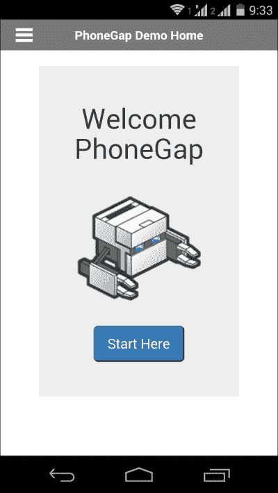

现在，让我们看看滑动菜单。我们已经在单独的模板文件中定义了菜单内容，并计划使用 AJAX 将其包含在我们的页面中。我们将代码放在单独的 JS 文件`main.js`中，以便我们可以在每个页面中包含它。代码片段如下供您参考：

```js
$(document).ready(function() {
    $.ajax({
        url: "menu.html",
        success: function(result) {
            $("#page").prepend(result);

            $("#menu").mmenu({
                "header": {
                    "title": "PhoneGap Demo Menu",
                    "add": true,
                    "update": true
                }
            });
        }
    });
});
```

`menu.html`文件将包含一个带有链接到我们创建的所有页面的普通列表。您可以在这里查看：链接

```js
<nav id="menu">
   <ul>
      <li><a href="motion.html">Accelerometer</a></li>
      <li><a href="device.html">Device Info</a></li>
      <li><a href="camera.html">Camera</a></li>
      <li><a href="capture.html">Capture</a></li>
      <li><a href="connection.html">Connection</a></li>
      <li><a href="contacts.html">Contacts</a></li>
      <li><a href="file.html">Files</a></li>
      <li><a href="geolocation.html">GeoLocation</a></li>
      <li><a href="globalization.html">Globalization</a></li>
      <li><a href="browser.html">InApp Browser</a></li>
      <li><a href="notifications.html">Notifications</a></li>
      <li><a href="splash.html">Splash Screen</a></li>
      <li class="Spacer Label">This demo app is for learning only</li>
      <li><p>For bugs, issues & suggestions please create an issue in GitHub. Feel free to fork the GitHub Repo and contribute to make it better.</p></li>
   </ul>
</nav>
```

此代码负责获取`menu.html`的内容，并将其推送到`id`值为`page`的`div`元素下。然后，我们对包含的菜单项应用滑动选项。

正确完成此操作后，当你点击**从这里开始**按钮时，你将看到滑动菜单在你面前打开：

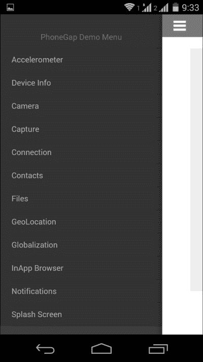

通过这样，我们已经准备好了应用的基本框架。接下来，我们将学习每个 API 及其用法。向前推进，只提供主要片段。这将有助于读者学习和尝试其余部分。

## 使用加速度计 API

我们现在将使用加速度计 API。使用这个 API，我们将获取加速度坐标并在应用中显示它们。为此，我们定义了一些`div`元素，如下所示：

```js
<div class="content">
    <br/>Acceleration X :
    <div id="dataX">0</div>
    <br/>
    <br/>Acceleration Y :
    <div id="dataY">0</div>
    <br/>
    <br/>Acceleration Z :
    <div id="dataZ">0</div>
    <br/>
    <br/>TimeStamp :
    <div id="timeStamp">0</div>
    <br/>
    <br/>
```

接下来，我们有两个按钮来开始和停止加速度监控：

```js
    <button id="start" onclick="onDeviceReady();" style="display:none;" class="btn-lg btn-success">Start Watching</button>
    <br>
    <button id="stop" onclick="stopWatch();" class="btn-lg btn-danger">Stop Watching</button>
</div>
```

现在，让我们来看看这个的核心 JavaScript 代码。我们通过使用`onDeviceReady()`函数，指示应用持续一秒监控加速度，并更新相应的`div`元素中的值。

```js
<script type="text/javascript">
    var watchID = null;

    document.addEventListener('deviceready', onDeviceReady, false);

    function onDeviceReady() {
        $('#stop').show();
        $('#start').hide();

        var options = {
            frequency: 1000
        }; // Update every 1 seconds

        watchID = navigator.accelerometer.watchAcceleration(onSuccess, onError, options);
    }

    function onSuccess(acceleration) {
        $('#dataX').html(acceleration.x);
        $('#dataY').html(acceleration.y);
        $('#dataZ').html(acceleration.z);
        $('#timeStamp').html(acceleration.timestamp);
    };

    function onError() {
        alert('onError!');
    };

    function stopWatch() {
        if (watchID) {
            navigator.accelerometer.clearWatch(watchID);
            watchID = null;

            $('#start').show();
            $('#stop').hide();
        }

    }
</script>
```

此输出的结果如下：

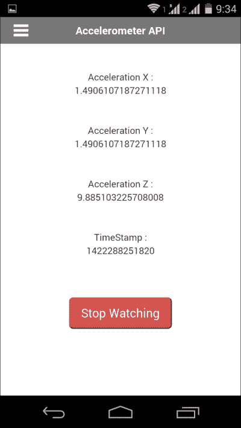

当我们想要停止监控时，通过点击**停止监控**按钮来触发`stopWatch()`函数。当我们点击**开始监控**按钮时，监控将再次开始，如下所示：

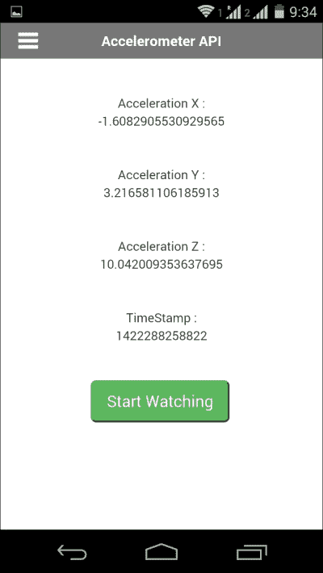

## 使用设备 API

使用设备 API，我们将获取有关我们设备的信息。我们将定义五个`<p>`标签来保存数据：

```js
<p id="model"></p>
<p id="platform"></p>
<p id="version"></p>
<p id="uuid"></p>
<p id="cordova"></p>
```

我们有以下脚本，它将获取设备信息并将其放入 DOM 中。你可能已经注意到我们正在使用`<p>`元素的属性 ID 值：

```js
<script type="text/javascript">
    document.addEventListener('deviceready', onDeviceReady, false);

    function onDeviceReady() {

        $('#model').html(device.model);
        $('#cordova').html(device.cordova);
        $('#platform').html(device.platform);
        $('#uuid').html(device.uuid);
        $('#version').html(device.version);

    }
</script>
```

输出将如下所示：

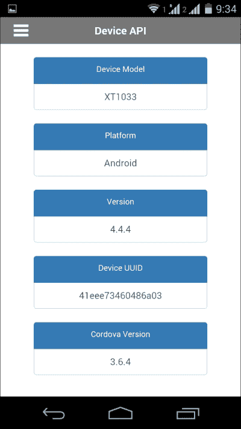

## 使用相机 API

相机 API 可以用来从设备相机捕获图片，也可以从图片库中选择图片。我们将通过示例查看这两种用法：

```js
<div class="content">
    <ul class="nav nav-tabs">
        <li class="active"><a href="#capture" data-toggle="tab">Capture Photo</a>
        </li>
        <li><a href="#album" data-toggle="tab">From Album</a>
        </li>
    </ul>

    <div class="tab-content" id="tabs">
        <div id="capture" class="tab-pane active">
            <br/>
            <button onclick="capturePhoto();" class="btn btn-success">Capture Camera Photo</button>
            <br/>
            <br/>
            

        </div>

        <div id="album" class="tab-pane">
            <br/>
            <button onclick="getPhoto(Camera.PictureSourceType.SAVEDPHOTOALBUM);" class="btn btn-info">Select Image from Album</button>
            <br/>
            <br/>

            
        </div>
    </div>
</div>
```

现在，你将能够使用你的设备相机拍照：

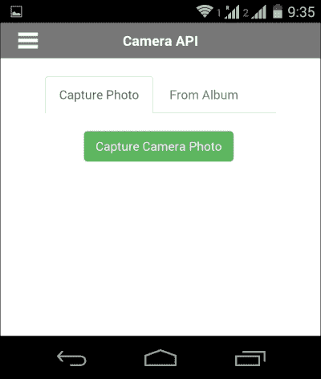

现在，你还将能够从你的设备相册中选择图片：

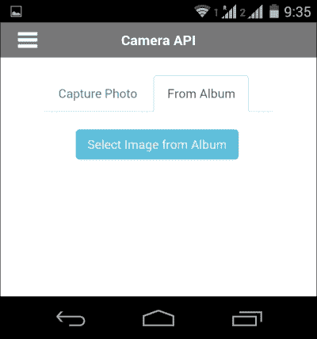

以下是用于此示例的脚本，建议你在继续此示例之前先了解关于相机 API 的内容：

```js
<script type="text/javascript">

    function capturePhoto() {

        navigator.camera.getPicture(onPhotoDataSuccess, onFail, {
            quality: 50,
            allowEdit: true,
            destinationType: Camera.DestinationType.DATA_URL
        });
    }

    function onPhotoDataSuccess(imageData) {

        var smallImage = document.getElementById('smallImage');

        smallImage.style.display = 'block';
        smallImage.src = "data:image/jpeg;base64," + imageData;

    }

    function onPhotoURISuccess(imageURI) {

        var largeImage = document.getElementById('largeImage');

        largeImage.style.display = 'block';

        largeImage.src = "data:image/jpeg;base64," + imageURI;
    }

    function getPhoto(source) {
        navigator.camera.getPicture(onPhotoURISuccess, onFail, {
            quality: 50,
            destinationType: Camera.DestinationType.DATA_URL,
            sourceType: source
        });
    }

    function onFail(message) {
        alert(message);
    }
</script>
```

以下是示例操作的截图：

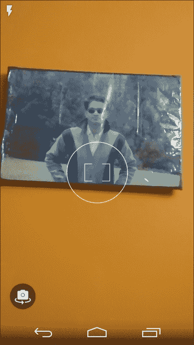

一旦你拍摄了照片，你将被要求选择或拒绝所拍摄的图片：

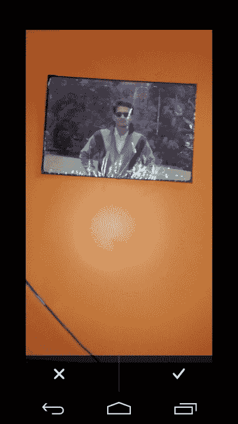

一旦你接受了图片，它将在应用程序中显示：

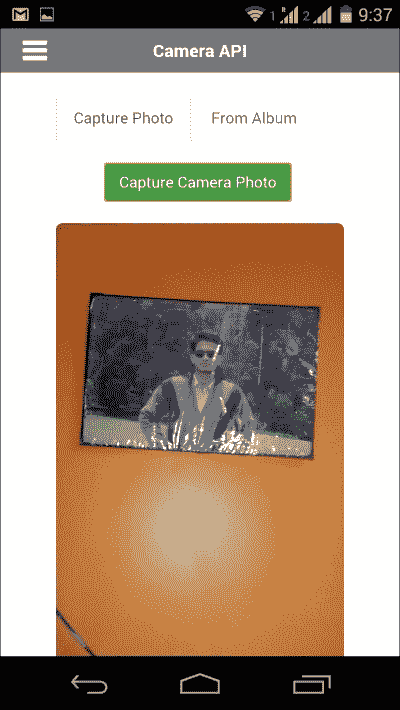

当你选择从图库中选择选项时，将显示图库应用程序以进行图片选择：

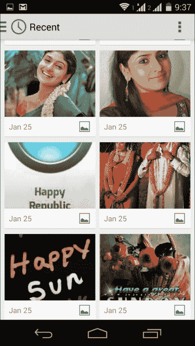

再次强调，一旦你从图库中选择了一张图片，它将在页面上显示：

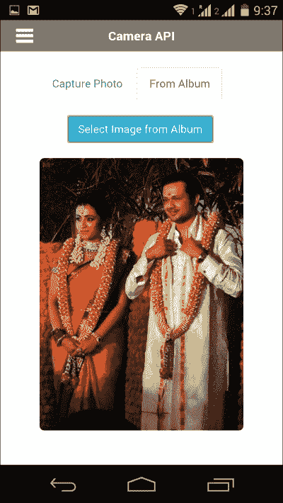

## 使用捕获 API

通过捕获 API，我们可以捕获音频、视频和相机图片。我们将看到一个简单的代码来执行所有这些操作。以下代码将在页面上添加三个按钮，并将事件绑定到每个按钮上：

```js
<div class="content">
    <div class="btn-group-vertical" role="group" aria-label="...">
        <button onclick="captureAudio();" class="btn-lg btn-success">Capture Audio</button>
        <br>
        <button onclick="captureImage();" class="btn-lg btn-warning">Capture Image</button>
        <br>
        <button onclick="captureVideo();" class="btn-lg btn-danger">Capture Video</button>
        <br>
    </div>

    <div id="details" style="display:none">
        <b>File Path : </b> 
        <div id="fullPath"></div>
        <br/>
        <b>File Name : </b> 
        <div id="name"></div>
        <br/>
        <b>Type : </b> 
        <div id="type"></div>
        <br/>
        <b>Last Modified Timestamp : </b> 
        <div id="lastModifiedDate"></div>
        <br/>
        <b>File Size (bytes) : </b> 
        <div id="size"></div>
    </div>
</div>
```

以下是一个 JavaScript 代码片段；每个函数都很容易理解：

```js
<script type="text/javascript">
    function captureSuccess(mediaFiles) {
        var i, len;
        for (i = 0, len = mediaFiles.length; i < len; i += 1) {
            uploadFile(mediaFiles[i]);
        }
    }

     // Called if something bad happens.
    function captureError(error) {
        var msg = 'An error occurred during capture: ' + error.code;
        navigator.notification.alert(msg, null, 'Uh oh!');
    }

    // A button will call this function
    function captureAudio() {
        $('#details').hide();

        // Launch device audio recording application,
        // allowing user to capture up to 1 audio clips
        navigator.device.capture.captureAudio(captureSuccess, captureError, {
            limit: 1,
            duration: 10
        });
    }

    // A button will call this function
    function captureImage() {
        $('#details').hide();

        // Launch device camera application,
        // allowing user to capture up to 1 images
        navigator.device.capture.captureImage(captureSuccess, captureError, {
            limit: 1
        });
    }

    function captureVideo() {
        $('#details').hide();

        // Launch device video recording application,
        // allowing user to capture up to 1 video clip
        navigator.device.capture.captureVideo(captureSuccess, captureError, {
            limit: 1,
            duration: 10
        });
    }

    // Upload files to server
    function uploadFile(mediaFile) {
        $('#fullPath').html(mediaFile.fullPath.replace(mediaFile.name, ""));
        $('#name').html(mediaFile.name);
        $('#type').html(mediaFile.type);
        $('#lastModifiedDate').html(mediaFile.lastModifiedDate);
        $('#size').html(mediaFile.size);
        $('#details').show();
        //Upload file using FileTransfer method not shown here
    }
</script>
```

此操作的输出如下：

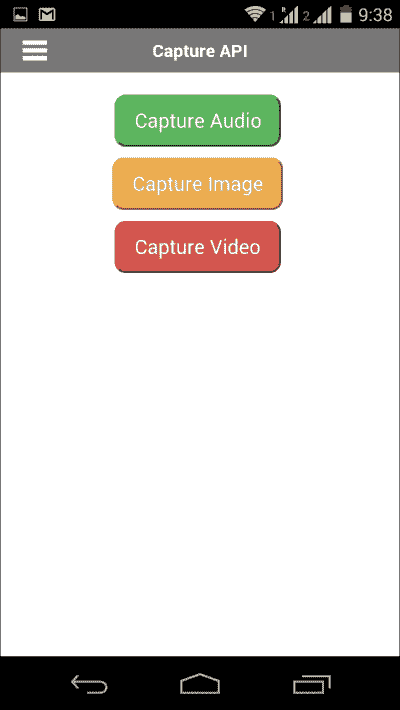

尝试使用应用程序录制你的声音：

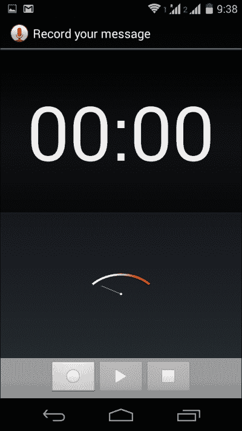

## 使用连接 API

连接 API 是其中最简单的 API 之一。我们将找出设备具有哪种数据连接，然后显示它。

为了存储数据，我们定义了一个新的元素，如下所示：

```js
<p id="status" class="list-group-item-text">
```

在 JavaScript 函数中，我们获取连接类型，并使用`checkConnection()`方法进行验证。然后，我们显示一个友好的消息：

```js
<script type="text/javascript">
  document.addEventListener('deviceready', onDeviceReady, false);

  function onDeviceReady() {
    checkConnection();
  }

  function checkConnection() {
    var networkState = navigator.connection.type;

    var states = {
    };
    states[Connection.UNKNOWN] = 'Unknown Connection';
    states[Connection.ETHERNET] = 'Ethernet Connection';
    states[Connection.WIFI] = 'WiFi Connection';
    states[Connection.CELL_2G] = 'Cell 2G Connection';
    states[Connection.CELL_3G] = 'Cell 3G Connection';
    states[Connection.CELL_4G] = 'Cell 4G Connection';
    states[Connection.CELL] = 'Cell Generic Connection';
    states[Connection.NONE] = 'No Network Connection';

    $('#status').html(states[networkState]);
  }
</script>
```

此操作的输出如下：

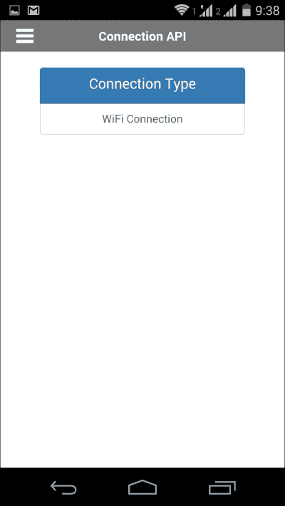

## 使用联系人 API

现在，让我们看看联系人 API 的一些高级概念。我们将做以下三件事：

1.  从设备中获取 10 个电话号码；为了简单起见，我们将其限制为 10 个。

1.  搜索联系人并显示他们的电话号码，以及联系人名称。

1.  使用应用程序添加新联系人。

以下是 HTML 代码；由于我们使用了 Bootstrap 样式来创建标签样式，所以看起来很大：

```js
<div id="page">
    <div class="header">
        <a href="#menu"></a>
        Contacts API
    </div>
    <div class="content">

        <ul class="nav nav-tabs">
            <li class="active"><a href="#fetch" data-toggle="tab">Fetch</a>
            </li>
            <li><a href="#add" data-toggle="tab">Add</a>
            </li>
        </ul>

        <div class="tab-content" id="tabs">

            <div id="fetch" class="tab-pane active">
                <br/>
                <button onclick="fetchContacts('');" class="btn btn-info">Fetch 10 Contacts</button>
                <button id="searchName" class="btn btn-info">Search Name</button>
                <br/>
                <br/>
                <div id="status"></div>

                <div id="panel" style="display:none">
                    <div class="list-group">
                        <a href="#" class="list-group-item active">
                            <h4 class="list-group-item-heading">Total Contacts</h4>
                        </a>
                        <a href="#" class="list-group-item">
                            <p id="count" class="list-group-item-text"></p>
                        </a>
                    </div>

                    <table class="table table-striped">
                        <thead>
                            <tr>
                                <th>#</th>
                                <th>Name</th>
                                <th>Phone Number</th>
                            </tr>
                        </thead>
                        <tbody id="contacts">
                        </tbody>
                    </table>

                </div>
            </div>
            <div id="add" class="tab-pane">
                <form id="saveForm">
                    <div class="form-group">
                        <label for="firstName">First Name</label>
                        <input class="form-control" type="text" id="firstName" placeholder="Enter First Name" />
                    </div>
                    <div class="form-group">
                        <label for="lastName">Last Name</label>
                        <input class="form-control" type="text" id="lastName" placeholder="Enter Last Name" />
                    </div>
                    <div class="form-group">
                        <label for="email">Phone Number</label>
                        <input class="form-control" type="tel" id="number" placeholder="Enter Number" />
                    </div>
                    <div class="form-group">
                        <label for="email">Email Address</label>
                        <input class="form-control" type="email" id="email" placeholder="Enter Email" />
                    </div>
                    <div class="form-group">
                        <label for="note">Note</label>
                        <textarea class="form-control" id="note" placeholder="Enter Notes"></textarea>
                    </div>
                    <div class="form-group">
                        <input class="btn btn-danger" type="button" name="save" id="saveBtn" value="Save Contact" />
                    </div>

                </form>
            </div>

        </div>
    </div>
</div>
```

进入 JavaScript 部分，以下是对每个操作的代码。阅读有关联系人 API 的部分将帮助你理解这一点。代码中还有一些与 jQuery 相关的语句：

```js
<script type="text/javascript">
    $("#searchName").click(function() {
        $('#status').html("");
        $('#panel').hide();

        navigator.notification.prompt(
            'Please enter search text',
            onPrompt,
            'Contact Search', ['Ok', 'Exit'],
            ''
        );
    });

    $("#saveBtn").click(function() {
        var firstName = document.getElementById('firstName').value;
        var lastName = document.getElementById('lastName').value;
        var fullName = firstName + ' ' + lastName;
        var number = document.getElementById('number').value;
        var note = document.getElementById('note').value;
        var emailAddress = document.getElementById('email').value;

        var theContact = navigator.contacts.create({
            "displayName": fullName
        });
        theContact.note = note;

        var emails = [];
        emails[0] = new ContactField('email', emailAddress, false);
        theContact.emails = emails;

        var phoneNumbers = [];
        phoneNumbers[0] = new ContactField('work', number, false);
        phoneNumbers[1] = new ContactField('mobile', number, true); // preferred number
        phoneNumbers[2] = new ContactField('home', number, false);
        theContact.phoneNumbers = phoneNumbers;

        theContact.save(onSaveSuccess, onSaveError);
    });

    function onSaveSuccess(contact) {
        navigator.notification.alert(
            "Contact Saved",
            null,
            'PhoneGap HandsOn Project',
            'OK'
        );

        document.getElementById("saveForm").reset();

    }

    function onSaveError(contactError) {
        navigator.notification.alert(
            "Contact Not Saved - Error Code : " + contactError.code,
            null,
            'PhoneGap HandsOn Project',
            'OK'
        );
    }

    function onPrompt(results) {
        if (results.buttonIndex == 1) {
            if (results.input1 == "") {
                navigator.notification.alert(
                    "Empty Search Text",
                    null,
                    'PhoneGap HandsOn Project',
                    'Try Again'
                );
            } else {
                fetchContacts(results.input1);
            }
        }
    }

    function fetchContacts(filter) {
        $('#panel').hide();
        $('#status').html("In Progress.... Please Wait!");

        var options = new ContactFindOptions();
        options.filter = filter;
        options.multiple = true;
        var fields = ["*"];
        navigator.contacts.find(fields, onSuccess, onError, options);

    };

    function onSuccess(contacts) {

        if (contacts.length == 0) {
            $('#panel').hide();
            $('#status').html("No Contacts Found");
            return;
        }

        var text = "";

        var totalCount = 0;

        for (var i = 0; i < contacts.length; i++) {
            if (totalCount > 9) {
                break;
            }

            if (contacts[i].phoneNumbers) {
                totalCount++;
                for (var j = 0; j < contacts[i].phoneNumbers.length; j++) {
                    text = text + '<tr><td>' + totalCount + "</td><td>" + contacts[i].displayName + "</td><td>" + contacts[i].phoneNumbers[j].value + "</td></tr>";
                }
            }
        }

        $('#contacts').html(text);
        $('#count').html(contacts.length);
        $('#status').html("");
        $('#panel').show();
    }

    function onError(contactError) {
        alert(contactError);
    }
</script>
```

当你点击**获取 10 个联系人**按钮时，将获取并显示 10 个联系人：

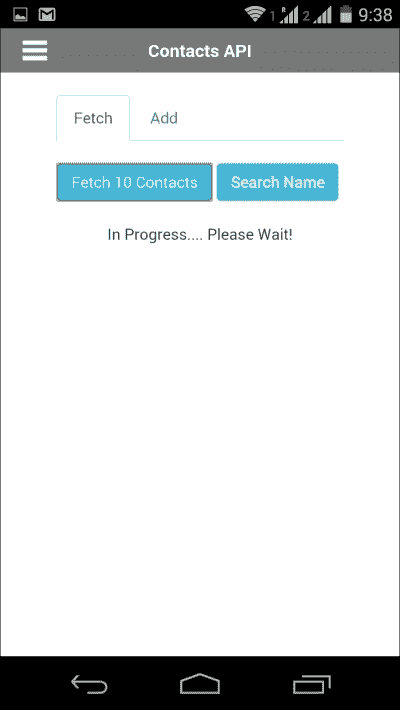

将显示设备中联系人的总数和 10 个联系人，以及电话号码：

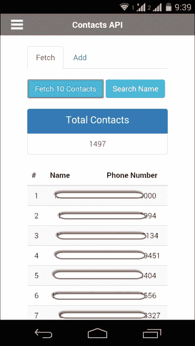

联系人姓名和电话号码出于隐私保护的原因被隐藏。您也可以在此处搜索联系人，如下所示：

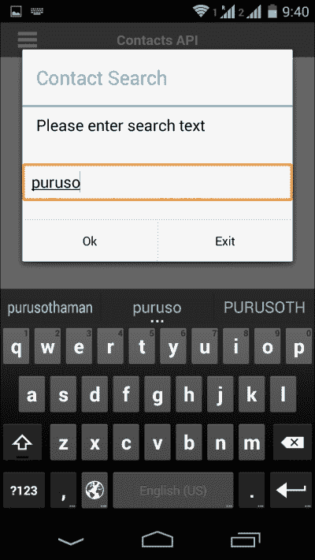

当您输入搜索文本并点击**确定**按钮后，您将看到搜索结果：

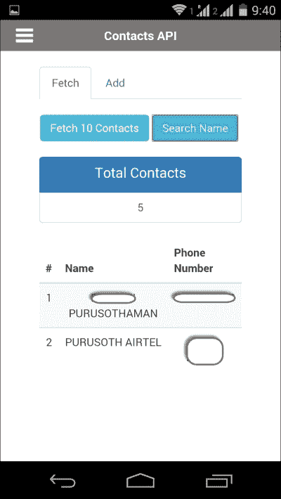

## 使用文件 API

使用文件 API，我们可以在真实设备中处理文件和目录。此 API 使开发者能够轻松处理所有与文件相关的操作：

```js
<div id="page">
    <div class="content">
        <div class="btn-group-vertical" role="group" aria-label="...">
            <button class="btn-lg btn-success" onclick="readDirectory()">Get All Directories</button>
        </div>
    </div>

    <div id="contents"></div>
</div>
```

以下是在设备文件系统中获取所有目录的代码。您可以扩展此代码以读取所有文件，以及读取、编辑和删除文件：

```js
<script type="text/javascript">
    function readDirectory() {
        window.requestFileSystem(LocalFileSystem.PERSISTENT, 0, doDirectoryListing, null);
    }

    function doDirectoryListing(fileSystem) {

        var dirReader = fileSystem.root.createReader();

        dirReader.readEntries(gotDir, onError);
    }

    function gotDir(entries) {
        var s = '<ul class="list-group">';
        for (var i = 0, len = entries.length; i < len; i++) {

            if (entries[i].isDirectory) {
                s += '<li class="list-group-item">' + entries[i].fullPath + '</li>';
            }

        }

        s += "</ul>";
        $('#contents').html(s);
    }

    function onError(error) {
        alert(error.code);
    }
</script>
```

输出将如下所示：

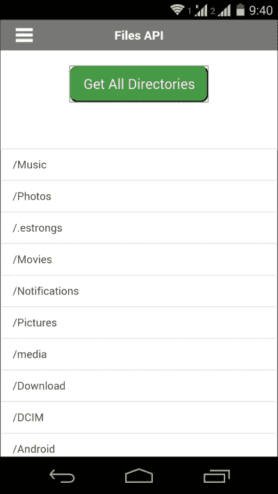

## 使用全球化 API

全球化 API 可以帮助您根据用户的设备区域设置自定义内容，如数字、日期和货币，而不是以硬编码的格式显示。使用此 API，您可以真正创建一个真正的全球化应用程序。

让我们为将要尝试的每个选项创建菜单：

```js
    <div class="btn-group">
        <button type="button" class="btn btn-success">Globalization Menu</button>
        <button type="button" class="btn btn-danger dropdown-toggle" data-toggle="dropdown" aria-expanded="false">
            <span class="caret"></span>
            <span class="sr-only">Toggle Dropdown</span>
        </button>
        <ul class="dropdown-menu" role="menu">
            <li><a id="prefLang" href="#">Language</a>
            </li>
            <li><a id="locale" href="#">Locale</a>
            </li>
            <li><a id="pattern" href="#">Date Pattern</a>
            </li>
            <li><a id="numPattern" href="#">Number Pattern</a>
            </li>
            <li><a id="currPattern" href="#">Currency Pattern</a>
            </li>
            <li><a id="dateStr" href="#">Date to String</a>
            </li>
            <li><a id="strDate" href="#">String to Date</a>
            </li>
            <li><a id="monNames" href="#">Month Names</a>
            </li>
            <li><a id="dst" href="#">DST?</a>
            </li>
            <li><a id="firstWeekDay" href="#">Week First Day</a>
            </li>
        </ul>
    </div>

    <hr/>
    <div id="data"></div>
</div>
```

通过前面的代码，您将看到如下所示的截图；它有一个下拉菜单来选择要使用的选项：

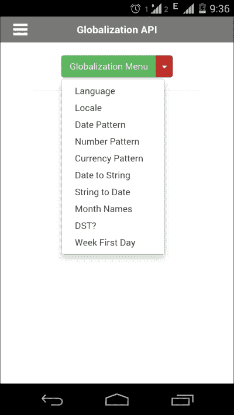

现在，完整的脚本在此提供；我们将每个函数分配给了每个链接的点击事件：

```js
<script type="text/javascript">
    $("#prefLang").click(function() {
        navigator.globalization.getPreferredLanguage(setLanguage, onError);
    });

    $("#locale").click(function() {
        navigator.globalization.getLocaleName(setLocale, onError);
    });

    $("#dateStr").click(function() {
        navigator.globalization.dateToString(new Date(), setDate, onError, {
            formatLength: 'full',
            selector: 'date and time'
        });
    });

    $("#strDate").click(function() {
        navigator.globalization.stringToDate('12/31/2015', setStringDate, onError, {
            selector: 'date'
        });
    });

    $("#pattern").click(function() {
        navigator.globalization.getDatePattern(setPattern, onError, {
            formatLength: 'short',
            selector: 'date and time'
        });
    });

    $("#monNames").click(function() {
        navigator.globalization.getDateNames(setDateNames, onError, {
            type: 'wide',
            item: 'months'
        });
    });

    $("#dst").click(function() {
        navigator.globalization.isDayLightSavingsTime(new Date(), setDST, onError);
    });

    $("#firstWeekDay").click(function() {
        navigator.globalization.getFirstDayOfWeek(setFDW, onError);
    });

    $("#numPattern").click(function() {
        navigator.globalization.getNumberPattern(setNumPattern, onError, {
            type: 'decimal'
        });
    });

    $("#currPattern").click(function() {
        navigator.globalization.getCurrencyPattern('USD', setCurrencyPattern, onError);
    });

    function setCurrencyPattern(pattern) {
        $('#data').html('Currency Pattern: ' + pattern.pattern + '<br/>' +
            'code: ' + pattern.code + '<br/>' +
            'fraction: ' + pattern.fraction + '<br/>' +
            'rounding: ' + pattern.rounding + '<br/>' +
            'decimal: ' + pattern.decimal + '<br/>' +
            'grouping: ' + pattern.grouping);
    }

    function setNumPattern(pattern) {
        $('#data').html('Number Pattern : <br>' + pattern.pattern + '<br/>' +
            'symbol: ' + pattern.symbol + '<br/>' +
            'fraction: ' + pattern.fraction + '<br/>' +
            'rounding: ' + pattern.rounding + '<br/>' +
            'positive: ' + pattern.positive + '<br/>' +
            'negative: ' + pattern.negative + '<br/>' +
            'decimal: ' + pattern.decimal + '<br/>' +
            'grouping: ' + pattern.grouping);
    }

    function setFDW(day) {
        $('#data').html('Fist Day of Week : ' + day.value);
    }

    function setDST(date) {
        $('#data').html('Day Light Savings : ' + date.dst);
    }

    function setDateNames(names) {
        var str = '';

        for (var i = 0; i < names.value.length; i++) {
            str += names.value[i] + '<br/>';
        }

        $('#data').html('Month Names : <br/>' + str);
    }

    function setPattern(date) {
        $('#data').html('Date Pattern : ' + date.pattern + ' ' + date.timezone);
    }

    function setDate(date) {
        $('#data').html('Formatted Date : ' + date.value);
    }

    function setStringDate(date) {
        $('#data').html('Date : ' + (date.month + 1) + '/' + date.day + '/' + date.year);
    }

    function setLocale(locale) {
        $('#data').html('Locale Name : ' + locale.value);
    }

    function setLanguage(lang) {
        $('#data').html('Preferred Language : ' + lang.value);
    }

    function onError(error) {
        alert('code: ' + error.code + '\n' +
            'message: ' + error.message + '\n');

    }</script>
```

当您点击**数字模式**选项时，您可以看到基于手机区域设置的设备上的数字模式。也请尝试其他菜单选项。

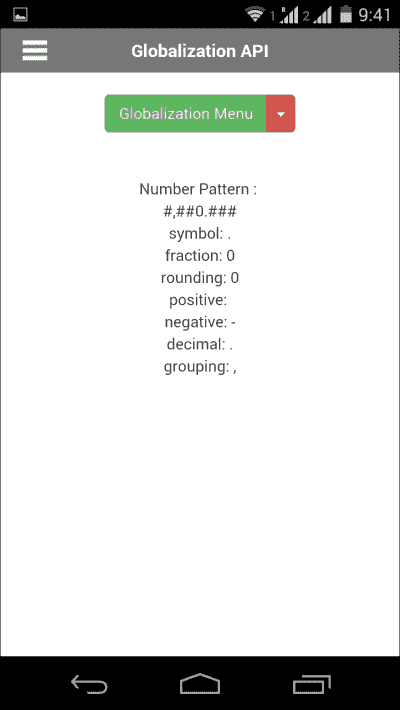

## 使用 InApp 浏览器 API

InApp 浏览器是一个可以被应用控制的网页浏览器。您的应用可以在浏览器中打开网站并按需处理。

再次，我们将有一个按钮来启动 InApp 浏览器。我们创建了一个名为`launchIAB`的 JavaScript 函数来获取 URL 并打开它：

```js
<button onclick="launchIAB('http://www.incredibleindia.org');" class="btn-lg btn-primary">Launch Browser</button>
```

输出将如下所示：

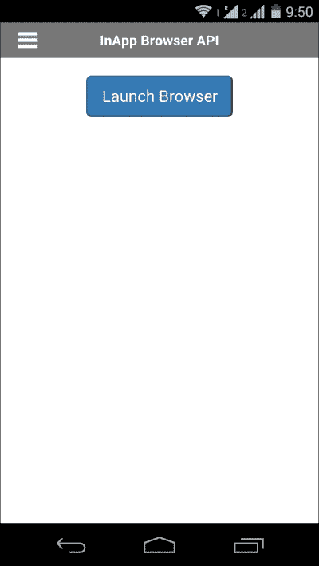

现在，我们将看到这里涉及的 JavaScript。我们处理了 InApp 浏览器的加载、开始和停止事件：

```js
<script type="text/javascript">        var iab = null;

        function loadStart(event) {
            // Event object has event.type & event.url properties
            alert('Loading started');
        }

        function loadStop(event) {
            alert('Loading stopped');
        }

        function loadError(event) {
            alert(event.type + ' - ' + event.message);
        }

        function onClose(event) {
            alert('Browser Closed');
            iab.removeEventListener('loadstart', loadStart);
            iab.removeEventListener('loadstop', loadStop);
            iab.removeEventListener('loaderror', loadError);
            iab.removeEventListener('exit', onClose);
        }

        function launchIAB(url) {
            iab = window.open(url, '_blank ', 'location = yes ');
            iab.addEventListener('loadstart', loadStart);
            iab.addEventListener('loadstop', loadStop);
            iab.addEventListener('loaderror', loadError);
            iab.addEventListener('exit', onClose);
        }</script>
```

加载开始屏幕将如下所示：

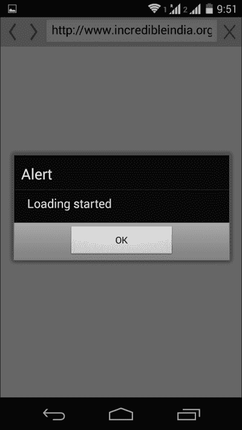

## 使用通知 API

使用通知 API，我们可以使手机发出声音、震动、显示警报以及输入和确认对话框。因此，对于这五种操作中的每一种，我们都会有一个按钮，每个按钮都有一个触发事件。我们使用 Bootstrap 来设计这些按钮：

```js
<div class="content">
    <br/>
    <div class="btn-group-vertical" role="group" aria-label="...">
        <button onclick="beepNow();" class="btn-lg btn-primary">Beep 3 Times</button>
        <button onclick="vibrateNow();" class="btn-lg btn-info">Vibrate 1 Sec</button>
        <button onclick="alertNow();" class="btn-lg btn-success">Alert Notify</button>
        <button onclick="confirmNow();" class="btn-lg btn-warning">Confirm Notify</button>
        <button onclick="promptNow();" class="btn-lg btn-danger">Prompt Notify</button>
    </div>
</div>
```

输出将如下所示：

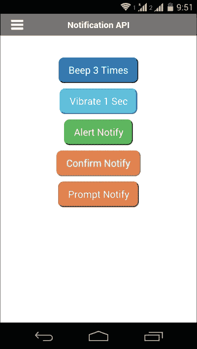

以下代码非常直观。不要忘记注意警报、确认和提示对话框的语法：

```js
function beepNow() {
    navigator.notification.beep(3);
}

function vibrateNow() {
    navigator.notification.vibrate(1000);
}
```

前面的两个函数将分别在您的设备上产生默认的蜂鸣声三次并振动一秒钟：

```js
function alertNow() {
    navigator.notification.alert(
        'You got an alert now', // message
        null, // callback
        'Notifications API', // title
        'Done' // buttonName
    );

}

function confirmNow() {
    navigator.notification.confirm(
        'You like this app?', // message
        onConfirm, // callback to invoke with index of button pressed
        'App Feedback', // title
        ['Yes', 'No'] // buttonLabels
    );

}

function onConfirm(buttonIndex) {
    alert('Button Selected : ' + buttonIndex);
}

function promptNow() {
    navigator.notification.prompt(
        'Please enter your name', // message
        handleAction, // callback to invoke
        'Registration', // title
        ['Ok', 'Exit'], // buttonLabels
        'Super Star Rajini' // defaultText
    );

    function handleAction(results) {
        alert("You selected button " + results.buttonIndex + " with input '" + results.input1 + "'");
    }

}
```

这就是如何显示警告窗口的：

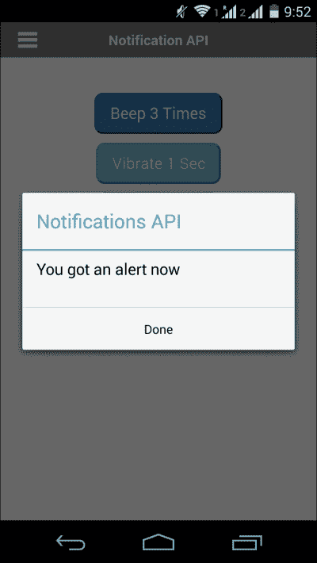

确认框在以下屏幕截图中显示：

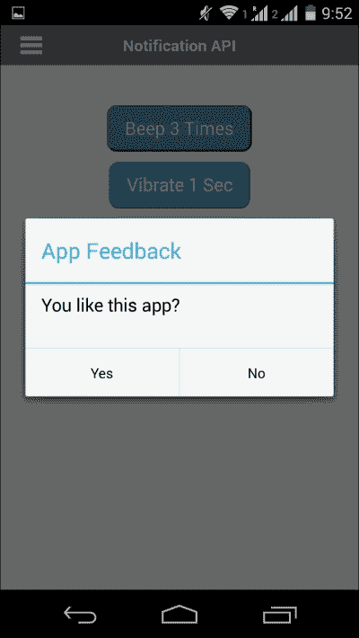

您可以使用提示对话框从用户那里获取输入：

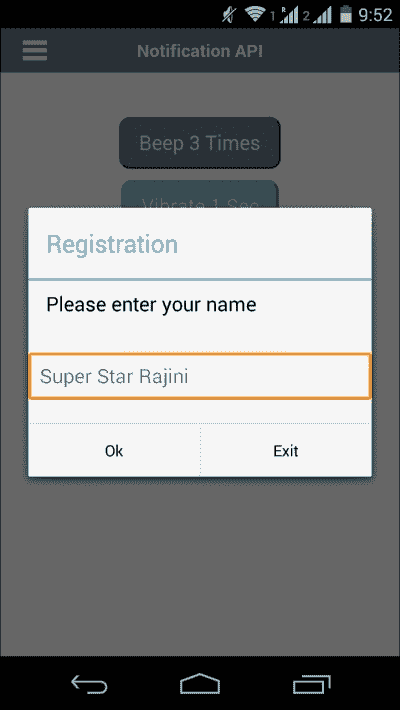

## 使用启动画面 API

启动画面是在应用程序启动时看到的。尽管并非所有应用程序都有它，但它在一些著名的应用程序中可用，例如 Microsoft Office Mobile。当应用程序启动时，会出现一个全屏图像，并在几秒钟后自动关闭。这可以用来隐藏应用程序的后端加载。

我们将有一个带有点击事件的按钮来显示启动画面：

```js
<button onclick="showScreen();">Show Splash Screen</button>
```

在 JavaScript 中，我们使用`navigator.splashscreen.show()`方法来显示启动画面，如下所示：

```js
<script type="text/javascript">
    function showScreen() {
        navigator.splashscreen.show();
    }
</script>
```

输出将如下所示：

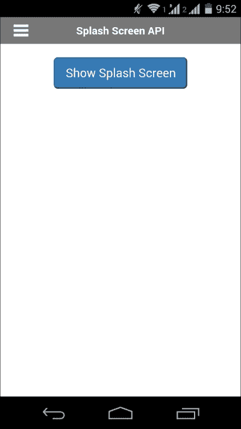

当点击**显示启动画面**按钮时，您会在几秒钟后看到启动画面打开和关闭：

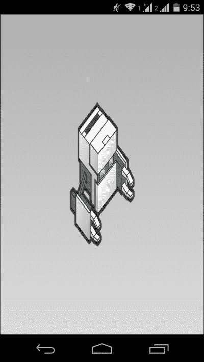

注意，还有一个`hide()`函数，我将留给你去尝试。

## 使用地理位置 API

使用地理位置 API，我们将获取位置坐标并使用谷歌地图在地图上绘制它们：

```js
<div id="page">
    <div class="header">
        <a href="#menu"></a>
        GeoLocation API
    </div>
    <div class="content">
        <div id="geolocation"></div>
        <br/>
        <div id="googleMap" style="width:75%;height:75%;">Loading...</div>
    </div>

</div>
```

`id`为`geolocation`的`div`元素将包含地理位置值。`googleMap`的`div`元素将包含谷歌地图：

```js
<script type="text/javascript">
    document.addEventListener("deviceready", onDeviceReady, false);

    var watchID = null;

    function onDeviceReady() {
        // Throw an error if no update is received
        var options = {
            timeout: 50000
        };
        watchID = navigator.geolocation.watchPosition(onSuccess, onError, options);
    }

    function onSuccess(position) {
        var element = document.getElementById('geolocation');
        element.innerHTML = 'Latitude: ' + position.coords.latitude + '<br />' +
            'Longitude: ' + position.coords.longitude + '<br />' +
            'Altitude: ' + position.coords.altitude + '<br />' +
            'Accuracy: ' + position.coords.accuracy + '<br />' +
            'Altitude Accuracy: ' + position.coords.altitudeAccuracy + '<br />' +
            'Heading: ' + position.coords.heading + '<br />' +
            'Speed: ' + position.coords.speed + '<br />' +
            'Timestamp: ' + position.timestamp + '<br />';

        var myLatlng = new google.maps.LatLng(position.coords.latitude, position.coords.longitude);
        var mapOptions = {
            zoom: 4,
            center: myLatlng
        }
        var map = new google.maps.Map(document.getElementById('googleMap'), mapOptions);

        var marker = new google.maps.Marker({
            position: myLatlng,
            map: map,
            title: 'Hello World!'
        });

    }

    function onError(error) {
        alert('code: ' + error.code + '\n' +
            'message: ' + error.message + '\n');
    }
</script>
```

输出将如下所示：

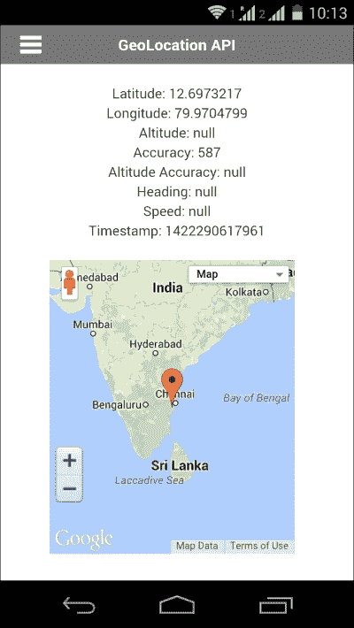

## 构建应用程序

由于我们已经完成了应用程序的开发，我们现在可以在真实设备上构建和尝试应用程序。您可以使用本地构建或使用在线 PhoneGap 服务进行构建。

要使用 Cordova 进行本地构建，请使用以下命令：

```js
C:\PhoneGap> phonegap build

```

构建完成后，应用程序将为您在创建项目时添加的所有平台创建。如果您添加了 iOS 平台，您可以在`platforms\android\ant-build\`目录中看到 Android 应用程序（`.apk`），在`platforms/ios/build/device`目录中看到 iOS 应用程序（`.ipa`）。

您可以直接将 Android 的`.apk`文件安装到设备上。然而，对于 iOS，您需要进行配置。详细信息请参阅附录 B，*发布您的应用*。恭喜您使用 PhoneGap 创建了一个完整的应用程序。现在，在您的真实设备上安装应用程序并享受使用您第一个完整应用程序的感觉。

# 改进空间

我们看到的应用程序非常基础，有很多改进的空间。以下是对我们刚刚完成的应用程序可以进行的几件事情：

+   使用模板引擎，如 HandleBarJS

+   使用 Ionic 框架

+   使用 RequireJS 动态加载所需的库

+   处理基于硬件加速和 GPU 的动画

+   压缩源文件

# 摘要

我们已经学会了如何使用 PhoneGap 及其 API 创建应用程序。这只是一个开始，在实际应用程序开发中还有许多更多的挑战。我们希望这篇教程能成为你在混合应用程序开发技能上的良好基础。PhoneGap 开发不仅限于这些 API，还有其他几个有用的插件可供使用。祝你在 PhoneGap 开发中好运。
