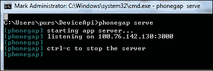
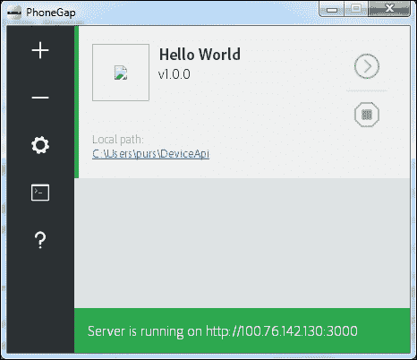

# 附录 D. PhoneGap 工具

# PhoneGap 开发者应用

在前面的章节中，我们看到了几种运行/调试我们的 PhoneGap 项目的办法。最简单的方法是使用 PhoneGap 开发者应用。这是一个适用于 Windows、Android 和 iOS 平台的移动应用。一旦安装了移动应用，你就可以轻松地测试你的项目，而无需实际构建和安装连接到同一无线网络上的物理设备上的应用。

一旦你的项目准备就绪，你可以使用 PhoneGap 命令行工具的 `serve` 命令来启动一个监听 IP 地址的本地服务器。

现在，在你的设备上打开已安装的应用，输入命令行上列出的 IP 地址，然后点击 **连接** 按钮。现在，你的桌面计算机和移动设备将通过无线连接配对，你可以在设备上看到你的应用。对代码所做的任何更改都将立即反映在设备上。那些在浏览器上不工作的设备 API，即使没有安装应用，也会在你的设备上工作。

所有平台的更多详细信息及下载链接可以在 [`app.phonegap.com`](http://app.phonegap.com) 找到。

# PhoneGap 桌面应用

为了使我们的生活更加便捷，我们现在有了桌面应用，你现在可以自由使用它，而不是使用 PhoneGap 命令行界面。你可以创建一个新的 PhoneGap 项目，导入现有的项目，并单击一下即可启动本地服务器。它仍然不是一个成熟的产品，每个月都有许多新功能被添加。

你可以在 [`github.com/phonegap/phonegap-app-desktop/releases`](https://github.com/phonegap/phonegap-app-desktop/releases) 下载适用于你的 Windows 桌面或 Mac OS 的应用。

# 摘要

我们已经看到了一些最近推出的与 PhoneGap 相关的工具，这些工具可以帮助开发者使混合移动应用开发变得更加容易。开发者应用和桌面应用都将帮助你轻松地调试和测试你的应用。
