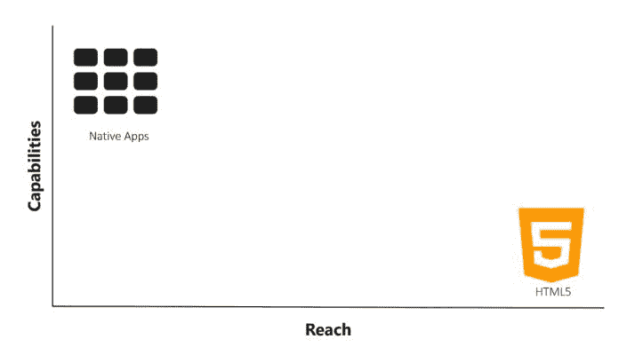
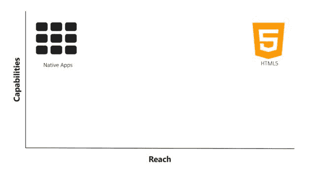
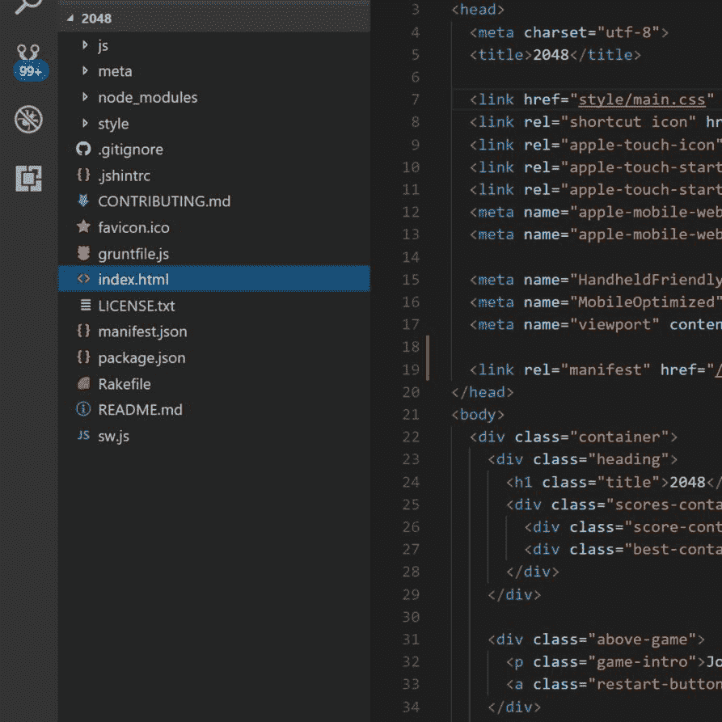

# 渐进式网络应用简介

在 3.28 亿活跃 Twitter 用户中，超过 80%是移动用户。Twitter 知道他们需要他们的移动体验更快、更可靠、更有吸引力。他们选择在 2017 年 4 月将他们的默认移动体验作为**渐进式网络应用**（**PWA**）推出，名为 Twitter Lite。

他们的目标很简单，即更快的加载时间、更高的参与度和更低的数据消耗。在将一般活动与非渐进式网络应用版本进行比较时，他们实现了所有三个目标：

+   每次会话页面增加 65%

+   发送推文数量增加 75%

+   跳出率降低 20%

“Twitter Lite 现在是使用 Twitter 最快、最经济、最可靠的方式。该网络应用的性能与我们的原生应用相媲美，但所需的设备存储空间比 Twitter for Android 少 3%以下。”

——Twitter Lite 的工程负责人 Nicolas Gallagher

这只是在线公司从 PWA 中获得回报的一个例子。这本书应该作为起点，为您提供创建第一个 PWA 所需的基本知识和信心。

在这本书中，您将学习如何构建一个 PWA，它将准备好投入生产使用。如果您还没有创建过 PWA，您将在本章的第一部分学习如何制作一个简单的 PWA。

本章将涵盖 PWA 的基本原理以及它们相对于经典网站和原生应用的优势。您还将了解如何将现有的 2048 游戏网络应用升级为 PWA。您将学习如何向应用添加 web manifest 和 service worker，使用 localhost 网络服务器启用 PWA 功能。

本章的目的是让您对 PWA 的工作原理有一个大致的了解，为什么您想要提供 PWA，并为您提供轻松创建具有基本功能的 PWA 的技能。

本章将涵盖以下要点：

+   PWA 的目的

+   PWA 优势

+   PWA 的基本技术要求

+   三大主要用户体验 PWA 目标

+   如何升级现有网站并在本地运行

我们所熟知的网络已经进入了第三个十年。在这段时间里，网络经历了许多变化和增强。虽然网络拥有一些伟大的超级能力，但它也有一些限制，阻碍了它提供与原生应用相当的用户体验。

PWAs 是一种将原生浏览器技术应用于创建消费者希望添加到主屏幕的 Web 解决方案的方式。同时，新的 Web API 正在进步，以填补 Web 和原生应用之间功能差距的额外空白。

PWA 的伟大之处在于，现有的网站可以轻松升级以获得 PWA 状态。这可以在浏览器和平台上解锁新功能，提升任何网站。

大约十年前，当苹果公司发布 iPhone 时，不仅互联网受到了冲击，桌面计算也受到了影响。这标志着移动优先计算新时代的到来。那个时代的网络技术没有准备好应对从桌面到手持设备的快速转变。

转向以移动为先的世界需要不仅仅是响应式设计技术；它需要一套新的原生 API、功能和编码技术。HTML、CSS 和 JavaScript 规范以及浏览器在过去十年中不断发展，以满足客户端应用程序的消费预期。

今天，我们拥有非常丰富的原生 API 和浏览器，从地理位置到语音输入和相机操作，几乎什么都能做。有客户端平台旨在为开发者提供一个丰富、以移动为先的画布，以创作引人入胜的用户体验。

除了优秀的原生 API 之外，浏览器还在服务工作者、Web 清单和开始要求 HTTPS 以启用现代 API 方面添加了新功能。这三个技术特性是成为 PWA 的核心要求。然而，制作一个优秀的 PWA 的艺术远不止于此。这种艺术需要一种不同的网络开发方法。

在这本书中，我们将探讨优秀 PWA 的需求，以及如何将新网站和现有网站升级为 PWA。在这个过程中，我们将学习如何利用新的功能，如 IndexedDB、多媒体和 Fetch API，为我们的应用程序增加价值。

随着本书的深入，您将学习如何使用服务工作者进行缓存、推送通知和后台同步。下一章深入探讨了 Web 清单文件。第三章，*让你的网站更安全*，涵盖了升级到 HTTPS 的细微之处。

本书将技术和经验需求分解，以便您创建一个优秀的 PWA，并通过三个示例应用程序来展示这一点：

+   第一个应用程序是一个简单的游戏，2048。2048 大约三年前非常流行，我仍然觉得它非常上瘾。尽管它是一个简单的游戏，但它将展示网络如何与常见的原生应用程序在同等水平上竞争。

+   接下来，我们将创建一个相册网站，并了解如何使用服务工作者缓存来创建一个即点即用、在有或没有网络的情况下都能运行的应用程序。该应用程序将与许多流行的播客播放器，如 iTunes 和 Stitcher 相媲美。

+   最后一个应用程序是一个消费者活动门票应用程序。该应用程序将展示高级服务工作者技术，如缓存失效。我还会介绍您可以使用哪些工具来验证您的应用程序，并帮助您为质量和一致性构建它们。

所有源代码均可在 GitHub 上找到，本书中提供了链接。您可随意克隆和分叉这些仓库。根据需要制作本地副本并修改它们。我很乐意看到您如何增强演示应用程序。

# 为什么我们需要一种新的方式来构建网站

当苹果公司在 2007 年发布 iPhone 时，他们最初打算使用 HTML 来构建应用程序。他们提供了一个初始平台来创建网络应用程序。然而，Mac 开发者们呼吁提供更好的本地应用程序解决方案，苹果公司做出了回应。苹果公司这样做的前提是收取应用程序收入的 30%，并控制通过封闭的 App Store 分发的应用程序。

封闭的 App Store 通过引入第三方守门人而违反了网络的开放性。这导致苹果公司审查您的应用程序时产生一层延迟。审查过程可能导致您的应用程序被审查或拒绝进入。App Store 提供的一个优势是为消费者提供一种安全和可信的感觉。

为了使 App Store 模式对苹果公司更有吸引力，他们决定对原生应用程序收取高额的提成。作为回报，苹果公司处理所有应用程序的支付和分发基础设施。然而，网络在从消费者那里收取金钱以及分发问题上并没有遇到问题。

信用卡商户账户通常收取交易额的 2%到 3%。托管已成为一种廉价的商品，对于大多数网站来说，每月的费用通常为 10 美元或更少。

网络遇到的下一个感知问题是性能。性能问题在移动设备上被放大。与桌面电脑相比，智能手机和平板电脑的 CPU 性能较弱。尽管更多移动设备使用 WiFi，但在发达世界，蜂窝连接仍然不可靠。

当 iPhone 首次发布时，与今天我们所经历的相比，网络仍然非常静态。到那时，网络还没有动画和动态内容这一平台。

在过去十年中，随着单页应用程序和许多大型框架的兴起，丰富的用户体验在网络上变得司空见惯。这些变化在很大程度上是由消费者从许多原生应用程序中期望的用户体验所驱动的。

许多开发者尝试通过黑客手段在移动设备上模仿本地应用程序体验。这导致了一些进步，也带来了一些不良体验和编码实践。

大多数不良体验都是由于对可用的 API 及其使用方式缺乏了解。糟糕的编码技术也造成了比预期价值更多的问题。

我看到的一个常见错误是在浏览器中应用服务器端架构。虽然这超出了本书的范围，但重要的是要注意，为了获得良好的现代 Web 用户体验，您可能不得不放弃对网站开发的先入为主的观念。

2012 年，马克·扎克伯格在 Tech Crunch 活动上的一个采访中，展示了如何误解使用 Web 平台和能力差距的典型案例。您可以查看以下链接获取文章：[`tcrn.ch/2hwN6HF`](http://tcrn.ch/2hwN6HF)

Facebook 试图将网络作为其主要平台，但由于许多工程错误和浏览器/硬件限制，他们失败了。在那个时刻，他们转向原生应用作为主要焦点，并从此创建了一个非常大的、封闭的数据和互动社区。

正如您将在本书后面看到的那样，Facebook 在移动原生应用空间中占据主导地位。这为其他人获得屏幕时间留下了很少的空间。

这就是 PWA 如何使企业和组织能够更深入地与消费者互动。这本书旨在为您提供创建 PWA 的工具和知识，以更少的金钱和努力触及消费者。网络拥有原生应用无法触及的几个超级能力。现在，随着原生 API 的兴起，网络超越了原生应用。

# 真实世界的 PWA 示例

Flipkart，印度次大陆的亚马逊，在 PWA 这个术语首次提出时就接受了它。在许多方面，他们是正确实施 PWA 的典范。

Flipkart 的消费市场几乎完全由在糟糕的移动连接上的客户组成。他们的移动设备存储空间有限，可能或可能没有可靠的 3G 连接。实际上，63%的用户是通过 2G 访问网站的。一个快速加载且在网络缺失时也能工作的客户端应用体验为 Flipkart 带来了商业优势。

Flipkart PWA（[`developers.google.com/web/showcase/2016/flipkart`](https://developers.google.com/web/showcase/2016/flipkart)）是由一支小型工程师团队在 42 天内创建的，他们在这一过程中投入的小额投资通过提高转化率 70%获得了巨大的回报。以下是他们发布的一些关键性能指标：

+   与 Flipkart lite 相比，用户在网站上的时间比之前的移动体验长，3.5 分钟比 70 秒

+   在网站上花费的时间增加 3 倍

+   40%更高的重新参与率

+   通过“添加到主屏幕”功能到达的用户的转化率提高 70%

+   数据使用量降低 3 倍

The Weather Channel 的移动使用量超过 50%来自网络。触及全球消费者是一个优先事项。网络提供了一个可靠的渠道来触及每个人，这通常意味着低功耗设备。重新参与和及时信息（如风暴预警）的提供也非常重要。

The Weather Channel（[`developers.google.com/web/showcase/2016/weather-channel`](https://developers.google.com/web/showcase/2016/weather-channel)）创建了一个 PWA，通过推送通知提供与原生应用相匹配的体验。这次升级使他们的团队能够触及 178 个国家，并在提高加载速度的同时提供天气预报：

+   这个 PWA 现在在 62 种语言和 178 个国家可用

+   加载时间提高 80%

+   基于此次成功的全球测试，团队将在 2017 年将 PWA 扩展到其美国网站

兰蔻([`developers.google.com/web/showcase/2017/lancome`](https://developers.google.com/web/showcase/2017/lancome))将其移动网络存在重建为 PWA，转化率提高了 17%。随着他们跟踪移动网络使用情况，超过桌面，兰蔻看到他们的转化率下降。在考虑原生应用后，他们决定投资于网络是正确的选择。

他们确定客户不太可能下载原生应用，也不太可能经常使用它。他们知道必须正确地建立网络存在，因为这样做可以产生更多回报。他们决定从头开始重建他们的网络存在，作为一个 PWA。

总体收益：

+   页面交互时间缩短 84%

+   转化率增加 17%

+   跳出率降低 15%

+   移动会话增加 51%

iOS 改进：

+   iOS 上的移动会话增加 53%

+   iOS 上的跳出率降低 10%

推送通知收益：

+   有 8%的消费者在点击推送通知后进行购买

+   推送通知的打开率提高 18%

+   通过推送通知恢复购物车的转化率提高 12%

如果您担心尚未支持 PWA 技术的浏览器，请注意 iOS 的统计数据。兰蔻(Lancôme)并不孤单；几乎每个采用 PWA 的公司都报告了在 iOS 上类似的改进。稍后，您将看到如何通过 polyfill 缓存和添加到主屏幕的体验在您的应用中实现类似的结果。

这些只是几个已经采用 PWA 并报告了收益的主要品牌的样本。还有许多更多的小型企业也在改进，因为他们正在构建客户想要使用的网络体验。好消息是，您今天就可以使用本章中的示例开始增强您现有的网站。

# 什么是 PWA？

两年前，一位谷歌 Chrome 工程师*Alex Russell*发布了定义 PWA 的里程碑式博客文章。您可以在以下链接中查看文章：[`bit.ly/2n1vQ2r`](http://bit.ly/2n1vQ2r)

通过这篇博客文章，Alex 宣布网络现在可以与原生应用并驾齐驱。但这不仅仅是通过服务工作者添加的原生能力，当涉及到构建网站时，添加到主屏幕的启发式方法也很重要。

另一位谷歌 Chrome 工程师 Chris Wilson 表示，渐进式 Web 应用是关于您用户体验质量的一种新的思维方式。

Chrome 团队和其他浏览器希望您理解的是，用户体验是您网站或应用最重要的部分。浏览器为您提供构建优秀应用的基础，但让这些体验变得生动还是取决于您。

我倾向于认为，与原生应用程序开发者相比，网络开发者存在信心问题。仍然存在这种观念，即原生应用程序统治一切。然而，这并不完全正确。正如我们稍后将会看到的，可访问的网络页面比原生应用程序要多得多，与原生应用程序相比，你的网站品牌有更大的成长空间。

原生应用程序有其用途，而这种用途正开始变得过时。前 Opera 公司负责人布鲁斯·劳森，一个在移动设备上非常受欢迎的浏览器，表示（http://bit.ly/2e5Cgry）原生应用程序是一种过渡技术。

这是一个非常大胆的声明，将网页与原生应用程序进行比较。但这确实值得思考。通常有许多过渡技术最终导致了真正的可消费产品。

例如，Netflix 最初是通过邮寄 DVD 来发货的。我敢肯定你今天仍然可以这样做，但 Netflix 的大多数会员只是流式传输和下载视频内容来观看。DVD 只是公司起步和与一个非常忠诚的客户群建立关系的过渡技术。

分发那些 DVD 的费用对他们来说太高，以至于他们无法将其作为主要分销渠道。随着技术的进步，宽带接入的增加，Netflix 能够摆脱过渡分销技术，专注于最初的目标，即让视频和电影进入全球会员的客厅。

同样，移动设备是一个全新的平台，用于构建应用程序体验。就像桌面计算一样，它从原生应用程序开始，而网页最终赢得了它们的青睐。当移动技术出现时，网页也赢得了桌面，并且是以一种大规模的方式出现的。

PWA 标志着对网页的重新工具化，使其成为一个以移动设备为先的平台。你的应用程序可以运行得更快，离线工作，并请求用户允许它们出现在主屏幕上。我们以前从未能够在网页上以这种水平部署这些体验。

# 应用程序高峰

智能手机用户总是寻找他们认为有用的应用程序进行下载。如果你足够幸运，让消费者下载了你的应用程序，那么如果他们觉得使用起来麻烦或难以操作，他们很可能在第一次使用后就将其删除。

根据尼尔森的一项研究（[`www.nielsen.com/us/en/insights/news/2015/so-many-apps-so-much-more-time-for-entertainment.html`](http://www.nielsen.com/us/en/insights/news/2015/so-many-apps-so-much-more-time-for-entertainment.html)），平均成年人每月使用的应用程序不到 30 个。随着时间的推移，不使用应用程序会导致未使用的应用程序被清除。

几项研究估计，大约 10%的应用程序使用足够频繁，可以保留。这意味着即使你的应用程序被下载，它最终也可能被删除，并且可能永远不会被使用。

品牌在广告上花费 8-12 美元以换取单个应用程序的下载。这意味着真正的客户获取成本大约是 80-120 美元。祝你好运，希望你能收回这笔费用。

苹果和谷歌应用商店宣称拥有 200 万或更多的应用程序。一些过时的研究显示，近 60%的应用程序从未被下载。

苹果最近通过强制执行其应用程序指南要求的第 4.2.6 节，将成功的门槛提高得更高。这一节赋予他们根据自己意愿拒绝和删除应用程序的权力。他们一直在大量清除他们认为不符合这些任意指南的应用程序。

为什么消费者停止下载应用程序了？空间，无论是物理空间还是时间空间。手机和平板电脑的磁盘空间是有限的。现在许多应用程序需要 100 MB-1 GB 的空间。尽管销售了一些 128 GB 的 iPhone，但典型的 iPhone 容量是 32 GB。在个人照片、视频和音乐之后，几乎没有空间留给应用程序。

尽管我们已经成为一个似乎永远离不开手机屏幕的社会，但一天中仍然只有那么多时间。市场分析师密切关注我们如何使用屏幕时间。孩子们观看视频和玩愚蠢的游戏。成年人生活在社交媒体中，Facebook 和 Snapchat 占据了他们的手机。成年人也会玩一些愚蠢的游戏，比如 2048。

在这些应用商店的前五名应用程序中，Facebook 拥有三个。平均成年人每天在 Facebook 的世界中花费超过 2 小时来查看照片和视频。短信正被 Facebook Messenger 取代。千禧一代沉迷于 Instagram，不停地分享、点赞和评论照片和视频。

Facebook、Facebook Messenger 和 Facebook 拥有的 Instagram 是前三大移动应用程序。它们后面是 YouTube、SnapChat 和 Gmail。其中两个由 Google 拥有。在这些应用程序之后，分布曲线下降到几乎为零。

我们，作为移动消费者，已经习惯了使用习惯，并发现对应用程序的需求已经过去了。

安装一个应用程序，即使它是免费的，也需要八个步骤，每个步骤都会使最初的兴趣基础减少 20%。亚马逊实施**一键**购买的原因是为了消除摩擦并增加销售额。

网络相对无摩擦。你点击一封电子邮件中的链接，或者搜索一些内容，点击最佳感知结果，几秒钟内你就下载或安装了你需要的网页。几乎没有摩擦，几乎没有使用设备资源。

与给定月份的应用程序使用分布相比，平均消费者访问超过 100 个网站。这大约是他们应用程序分布的 20 倍。这意味着通过网络与客户互动的机会比原生应用程序更多。

网络满足了两个重要的消费者需求：最小资源投资。所需的时间或磁盘空间非常少。实际上，当他们清理设备以便分享更多视频到 Instagram 时，他们不需要卸载你的网站。

这就是 PWA 之所以重要的地方。公司希望他们的图标出现在消费者的设备上。这象征着一种关系，并有望增加销售额或其他参与度统计数据。当品牌参与对消费者来说成本低廉时，他们更有可能采取步骤让你成为他们日常生活的一部分。

浏览器提供了参与平台，但你仍然需要满足它们的要求。这正是本书将要教授的内容。

# PWA 特性

不要将 PWA（渐进式网络应用）误认为是特定技术。它更多的是一个营销术语，描述了使用现代平台功能来提供一定质量体验的方式。如果没有良好的用户体验，技术本身并不重要。

Chrome 团队确定了 PWA 应该提供的四个体验因素：

+   快速

+   可靠

+   引人入胜

+   集成

研究表明，如果网站加载时间超过 3 秒，53% 的用户将放弃该网站。服务工作者缓存使得页面加载时间几乎瞬间完成，但它不能使动画更快。这需要了解 CSS 动画和可能需要 JavaScript 的知识。

出现卡顿或屏幕跳动现象的应用程序被称为“janky”。例如，如果你曾经加载过网页，比如几乎任何新闻网站，当你开始阅读时内容上下跳动，你就知道我在说什么了。这是一个非常差的用户体验，但可以通过适当的编码实践轻松避免。

在本书的后面部分，你将学习关于 **RAIL**（响应、动画、空闲、加载）和 **PRPL**（推送、渲染、预缓存和懒加载）模式。这些是 Chrome 团队提供的编码最佳实践，因为他们了解浏览器的工作原理。他们和其他浏览器厂商都希望网络对每个人都是可用的。

浏览器厂商正在提供指导，以帮助开发者创建能够在客户主屏幕上占有一席之地的网络应用程序。这种指导从以移动性能优先的方法开始。

消费者需要对应用程序有信心，并且他们需要知道该应用程序是可靠的。这意味着当需要时它应该能够正常工作。为了实现这一点，一个网络应用程序应该在设备在线、离线以及介于两者之间的任何状态下都能加载。

服务工作者缓存在浏览器和网络之间提供了一个代理层。这使得网络成为一个渐进式增强。它还引入了程序员必须掌握的新一类编程。

在本书的后面部分，你将学习不同的缓存策略以及如何在不同的场景中应用它们，以使网站能够正常运行。

服务工作者为网络开发者打开了一个新的机会层，他们可以添加提高性能、参与度和数据管理的有价值功能。服务工作者被设计为可扩展的，以便未来可以添加更多功能。目前，支持缓存、推送通知和背景同步，但在 W3C 工作组中还在讨论许多其他功能。

推送通知让你能够在任何时候与消费者建立联系，从而增加参与度。如前所述，天气频道和兰蔻都通过推送通知增加了参与度。

背景同步是一个你现在可以用来在网络不可用的情况下运行应用的通道。当连接恢复时，你可以无缝地与服务器同步，而不会打扰用户。甚至当你的应用正在同步时，他们的手机可能还在口袋里。

一个网络应用需要足够吸引用户，让他们愿意将其作为永久设备上的固定功能。一旦你的网络应用满足了最低的技术要求——网络清单、注册的服务工作者带有 fetch 事件处理器，并通过 HTTPS 提供服务——浏览器就会触发原生提示，让用户将网络应用添加到他们的主屏幕。随着本书的深入，你将更深入地了解这一体验。

网络清单、HTTPS 和服务工作者需要不同的专业知识才能有效执行。在我看来，它们的复杂性从后者开始增加。这就是为什么拥抱 PWA 通常被称为一段旅程。这是一件你可以，也应该分步骤实施的事情。

# PWA 优势

我曾向你展示了网络相对于原生应用的优势，但这些优势如何提升网络在过去的原生应用之上的地位呢？

让我们借鉴 Chrome 团队的一个演示。一个 XY 图可以显示网络和原生应用之间的差异。垂直轴代表功能。x 轴代表覆盖范围。所定义的覆盖范围是指发现和快速访问应用或网站有多容易：



多年来，原生应用一直享有能力优势。它们拥有紧密的本地平台 API 和钩子，使得原生应用能够做网络未设计去做的事情。例如，原生推送通知允许品牌在应用未打开的情况下向客户发送消息。

然而，应用被苹果、安卓甚至微软生态系统的封闭应用商店所限制。这使得寻找应用变得非常困难。许多估计显示，每天需要花费 8 到 12 美元才能获得一个应用的下载。

如我之前提到的，网络本身并没有准备好适应这种向移动端的转变。已经有一些 API，例如地理位置和某些网络通知功能。这些 API 并不一定与它们的原生对应物处于同一水平。

开发者对许多现代 API 缺乏认识。不幸的是，这种知识和信心的缺乏导致网站没有充分利用这些功能。

十年前，响应式设计还不存在。然而，今天，我们不仅有 CSS 媒体查询和大量的响应式 CSS 库，而且浏览器还内置了响应式图片。现在，网站可以为所有屏幕尺寸提供布局和下载适当大小的图片，而无需进行疯狂的破解。

与其原生版本相比，网站总是很容易被发现。你可以在任何媒体渠道中宣传一个域名，人们知道如何加载它。搜索引擎比应用商店要复杂得多，提供了一个简单的界面来查找几乎所有东西。搜索引擎相对于应用商店的一个大优势是能够深度索引网页内容。

搜索引擎索引网站深处的页面和每个网站数以千计的网页。应用商店只能提供一个下载应用的入口点。你唯一能控制的“页面”是一个销售页面。在这个页面上，你需要在不让客户体验你的内容和体验的情况下推销你的应用。触达能力和一直以来的网络最大超级力量：



如图表所示，网络不仅在平等的基础上与原生应用程序并肩，而且在大多数情况下超过了原生应用程序。当然，仍然会有一些边缘情况，原生应用程序是最佳选择，但随着浏览器添加新功能，这些情况正在逐渐减少。

# PWA 技术要求

至少，要成为 PWA，有三个核心技术要求。一个网站必须有一个 Web 清单文件，使用 HTTPS 提供服务，并且必须注册一个具有 fetch 事件处理器的服务工作者。你将在未来的章节中深入了解这些要求的每一个。

Web 清单驱动着添加到主屏幕的体验。HTTPS 在你的应用程序和浏览器之间提供了一层安全性和信任。服务工作者提供了可扩展的后骨架构，用于在用户界面之外的线程上执行事件驱动功能。

PWA 也应使用应用程序外壳或常见的 HTML 和 CSS。这是 Chrome 最常见的应用，它被用于网站上几乎每个页面。如果你有任何单页应用程序的经验，你应该理解应用程序外壳是什么。

# 应用程序外壳

典型的应用程序外壳通常包含一个页眉、一个主要内容区域和一个页脚。当然，这可能会根据应用程序和网站而有所不同。2048 游戏不同，因为它只有一个网页：


在单页应用程序中，应用程序外壳很常见，因为它们可以在浏览器中动态渲染标记和数据。对于 PWA 来说，情况并不一定如此。单页应用程序之所以如此受欢迎，是因为它们能够创建更接近原生的过渡体验，因为请求新页面时没有请求延迟。

由于 PWA 可以本地缓存，这并不意味着你需要一个真正的应用程序外壳。如果应用程序采用先缓存策略，页面可以在毫秒级加载，通常小于 100 毫秒。这在人类心智中感觉是瞬间的。

这并不意味着你不应该识别应用程序外壳。服务器和构建渲染引擎可以使用应用程序外壳和一系列布局来创建服务器托管标记。你将接触到这一点，以便在我们构建照片库和播客应用程序时工作。


几年前，一个流行的应用程序是一个简单的游戏，叫做 2048。目标是合并带有数字的方块，最终总数达到 2048。方块以 2 的倍数编号。你可以合并相邻的具有相同值的方块，以创建一个新方块，其值为它们的总和。


我在这个游戏上浪费的时间比我愿意承认的要多。它很容易玩，而且非常上瘾。这是一种很好的内啡肽和游戏体验的结合。

幸运的是，GitHub 上有许多开源的类似版本可用。其中一些是网络应用程序。我敢打赌，通过应用商店分发的原生版本可能是包裹在原生外壳中的网站，是一种混合应用程序。

我选择了一个流行的仓库来为这本书进行分支。2048 网络应用程序简单，是展示如何制作一个优秀的 PWA 示例的完美候选：

# 源代码

原始应用程序源代码可在 GitHub 上找到（[`github.com/gabrielecirulli/2048`](https://github.com/gabrielecirulli/2048)）。你可以克隆仓库并在浏览器中打开它来玩游戏。只是提前警告，它很容易上瘾，可能会分散你学习如何创建 PWA 的注意力。

我在我的 GitHub 个人资料中分支了这个仓库（[`github.com/docluv/2048`](https://github.com/docluv/2048)）。我的版本添加了清单、图标、服务工作者，并对代码进行了一些升级，以提高应用程序的性能并利用新的 API 和浏览器功能。原始代码编写得很好，但这是为了三年前的浏览器功能。

随意 star、clone 和 fork 我的 GitHub 仓库，以根据你的喜好进行定制。本书中创建的最终应用程序的运行版本可在网上找到（[`2048.love2dev.com/`](https://2048.love2dev.com/)）。

# 应用程序的代码结构

让我们回顾一下游戏源代码的结构。我喜欢这个项目，因为代码简单，展示了在浏览器中使用少量代码可以完成多少事情。

有三个资源文件夹：`js`、`meta`和`style`。它们包含渲染和执行游戏所需的 JavaScript 文件、图像和样式表。

你还会注意到一个`node_modules`文件夹。我使用`grunt connect`添加了一个本地网络服务器，这是一个 node 模块。原始游戏如果直接在浏览器中加载`index.html`文件，则运行正常。然而，由于安全限制，没有网络服务器，服务工作者无法工作。我将在稍后详细介绍这一点。

在根级别，只有少数几个网络应用文件：

+   `index.html`

+   `manifest.json`

+   `sw.js`

+   `favicon.ico`

2048 代码的优点在于它只需要一个 HTML 文件。`manifest.json`和`sw.js`文件添加了我们追求的 PWA（渐进式网络应用）功能。`favicon.ico`文件是浏览器为地址栏加载的图标：



# 将 node 模块添加到项目中

原始仓库是一个独立游戏，这意味着它不需要网络服务器来执行，只需要一个浏览器。你可以右键点击`index.html`文件，选择在您喜欢的浏览器中打开它。在注册服务工作者之后，你仍然可以这样做，可能不会注意到任何区别。但是，如果你打开浏览器控制台（*F12* 开发者工具），你很可能会看到一个错误。

这种错误可以归因于服务工作者（service worker）的要求。服务工作者，就像大多数浏览器支持的新的 API 一样，需要 HTTPS 协议。这一要求提高了默认的安全级别，并使浏览器对您的网站所有权有最低程度的信任。

服务工作者规范放宽了对 localhost 地址的要求。localhost 是一种常见的引用本地机器的方式，通常是开发环境。由于你不太可能自己攻击自己，浏览器通常会允许你做你想做的事情——除了当你直接从文件系统中打开文件时。

当使用 localhost 加载资源时，浏览器正在发起一个传统的网络请求，这需要一个网络服务器来响应。这意味着你，作为本地机器的用户，已经费尽心思启动了一个本地网络服务器。这不是普通消费者知道如何做的事情。

从文件系统打开的文件是不同的。任何人都可以发送一个`index.html`文件给你，该文件加载了令人恐惧的代码，旨在窃取你的身份或更糟的是展示无穷无尽的猫视频！通过不尊重直接文件系统，访问浏览器正在保护你免受恶意服务工作者脚本注册的影响。信任 localhost 网络服务器可以通过避免注册 localhost SSL 证书的繁琐过程来简化开发。

您可以运行各种本地网络服务器。近年来，我更倾向于使用 node connect，我将它作为一个 Grunt 任务执行（[`love2dev.com/blog/make-a-local-web-server-with-grunt-connect/`](https://love2dev.com/blog/make-a-local-web-server-with-grunt-connect/)）。因为 connect 是一个节点模块，您可以直接从命令行或自定义脚本中启动它。还有针对您喜欢的任务运行器，如 Gulp 等等的模块。此外，node 是跨平台的，所以每个人都可以使用 connect。

如果您熟悉安装节点模块，您可以跳过这一部分。如果 node 和 connect 对您来说是新的，本节将作为一个简单的入门指南，帮助您在本地机器上运行本书中的所有示例应用程序。

加载节点模块的第一步是从 [`www.npmjs.com/`](https://www.npmjs.com/) 或其他新兴的包管理网站安装它们。如果您喜欢，可以通过命令行来管理，或者您可以在 `package.json` 文件中定义所需的模块。

您可以在此处阅读有关 `package.json` 格式的更多信息（[`docs.npmjs.com/files/package.json`](https://docs.npmjs.com/files/package.json)）。就我们的目的而言，`grunt` 和 `grunt-contrib-connect` 模块是 `devDependencies`。如果您这是一个节点应用程序，您也可以定义一个依赖项部分。

Grunt 是一种在几年前获得流行并仍然是我的首选任务运行器。任务运行器，似乎每周都有一个新版本，帮助您将可重复的任务组织成可重复的食谱。我使用 Grunt 和自定义节点脚本来构建和部署我的 PWA。将您的任务运行器视为一个命令行控制面板来管理您的应用程序：

```js
{
    "name": "2048",
    "version": "1.0.0",
    "description": "2048 Progressive Web App",
    "author": "Chris Love",
    "private": true,
    "devDependencies": {
        "grunt": "*",
        "grunt-contrib-connect": "*"
    }
}
```

Grunt 和 Grunt connect 模块都是节点包，必须下载才能执行。`package.json` 文件为 npm 提供了配置，以便它可以管理您的包。这样，您就可以快速在任何机器上设置您的项目，而无需将节点依赖项作为源代码的一部分进行维护。

如果您已经克隆了示例仓库，您会注意到节点模块被排除在源代码之外。这是因为它们不是应用程序本身的一部分。它们是一个依赖项，npm 帮助您重新创建所需的开发环境。

要安装这些包，您需要打开命令行并切换到您的源代码文件夹。接下来，您必须执行以下命令：

```js
>npm install
```

这将启动 npm 安装过程，下载您的模块及其依赖链。完成后，您将拥有运行或构建应用程序所需的一切。

接下来，您需要创建一个 `gruntfile.js` 文件。这是您告诉 Grunt 您想运行哪些任务以及如何运行它们的地方。如果您想了解使用 Grunt 的详细信息，请访问他们的网站（[`gruntjs.com/`](https://gruntjs.com/))：

```js
module.exports = function (grunt) {
    grunt.loadNpmTasks('grunt-contrib-connect');
    // Project configuration.
    grunt.initConfig({
        connect: {
            localhost: {
                options: {
                    port: 15000,
                    keepalive: true
                }
            }
        }
    });
};
```

由于我们只使用 connect 模块，2048 的 Gruntfile 非常简单。你需要告诉 Grunt 加载 connect 模块，然后在`initConfig`函数中注册任务。

2048 是一个非常简单的应用程序，它将我们的定制化保持在最低限度。我随意选择了端口 15000 来提供服务，并选择保持`keepalive`开启。你可以定义许多选项。更多详细信息可以在`grunt-contrib-connect` npm 页面找到（[`www.npmjs.com/package/grunt-contrib-connect`](https://www.npmjs.com/package/grunt-contrib-connect)）。

剩下的唯一任务是启动 connect 网络服务器。这是通过命令行完成的。如果你在执行 npm install 时仍然打开了命令行，你可以重用它。如果没有，重复打开命令行并切换到项目文件夹的过程：

```js
>grunt connect
Running "connect:localhost" (connect) task
Waiting forever...
Started connect web server on http://localhost:15000
```

执行`grunt connect`，你应该会看到前面的示例输出。请注意，命令会继续执行。这是因为它是一个服务器，正在监听端口 15000 的请求。你无法在这个提示符下执行其他命令。

现在，你可以在浏览器中通过在地址栏输入`http://localhost:15000`来加载 2048 游戏。

# 添加清单文件

添加 Web 清单文件应该是升级现有网站的第一步。你可以在几分钟内创建你网站的清单文件。在工具章节中，我将回顾一些可以帮助自动化此过程的在线资源。

注册 PWA 的 Web 清单需要在 HTML 的`head`元素中添加一个特殊的链接元素。以下代码显示了如何注册 2048 清单文件：

```js
<head>
      ….
  <link rel="manifest" href="manifest.json">
</head>
```

如果你熟悉引用样式表，这个语法应该看起来很熟悉。区别在于`rel`属性值是 manifest。`href`值指向清单文件。你可以自由命名它，但 manifest 是最常见的名称。

下一章将详细介绍清单文件。你可以参考项目的`manifest.json`文件来查看 2048 游戏的配置。它包含应用程序的名称、默认 URL、主要颜色以及一个图标图像引用数组。

# 添加服务工作者

接下来，你需要注册一个服务工作者。这是在所谓的客户端代码中完成的，即你习惯于编写的 JavaScript。服务工作者在 UI 的独立线程中执行。我认为它是一个后台进程。你仍然需要为网站注册服务工作者。

对于像这个例子这样的简单注册，我首选的方法是在我网站标记的底部添加一个脚本块。首先，检测是否支持服务工作者。如果支持，那么尝试注册网站的服务工作者。如果浏览器不支持服务工作者，则跳过注册代码以避免出现异常。

注册是通过调用 `navigator.serviceWorker.register` 函数来完成的。它接受一个参数，即服务工作者文件的路径。我将在后面的章节中回顾更多关于这个问题的规则。

注册函数返回一个承诺。你可以添加代码来记录成功的注册，如下所示：

```js
      <script>
        if ('serviceWorker' in navigator) {  
            navigator.serviceWorker.register('/sw.js').then(function 
             (registration) {    // Registration was successful                   
                console.log('ServiceWorker registration successful with 
               scope: ', registration.scope);  
            }).catch(function (err) {    // registration failed :(
                console.log('ServiceWorker registration failed: ', 
                err);  
            });
        }
    </script>
```

我们将在第五章 *服务工作者生命周期*中开始深入了解关于服务工作者细节。为了帮助你理解示例代码，让我介绍一些服务工作者基础知识。服务工作者是完全异步的。如果它们不需要，它们会进入空闲或睡眠状态。当操作系统或浏览器触发事件时，它们会唤醒或完全启动。

所有逻辑执行都是事件的结果。你必须注册事件处理程序来执行你的服务工作者逻辑。2048 服务工作者为安装、激活和获取事件注册了事件处理程序。

2048 游戏服务工作者在安装事件中预缓存了整个应用程序。你将在第六章 *掌握缓存 API – 在播客应用程序中管理网络资产*中了解更多关于缓存策略的内容。现在，我们将缓存应用程序，使其始终可用，没有任何网络通信：

```js
self.addEventListener("install", function (event) {
    console.log("Installing the service worker!");
    caches.open("PRECACHE")
        .then(function (cache) {
            cache.addAll(cacheList);
        });
});
```

2048 服务工作者在安装事件中缓存资产。应用程序资产在服务器工作者代码中的一个数组中定义。缓存 API 提供了一个接口，用于一个专门为持久化响应对象而设计的特殊存储。我将把细节推迟到后面的章节中：

```js
var cacheList = [
    "index.html",
    "style/main.css",
    "js/keyboard_input_manager.js",
    "js/html_actuator.js",
    "js/grid.js",
    "js/tile.js",
    "js/local_storage_manager.js",
    "js/game_manager.js",
    "js/application.js"
];
```

服务工作者也有激活和获取事件处理程序。在触发添加到主屏幕功能之前，必须注册获取事件处理程序。

当浏览器从网络请求资产时，获取事件会被触发。这可能是一个图像、样式表、脚本、AJAX 调用等等。`event` 参数包含请求对象，可以用来检查你的缓存以查看资产是否可用：

```js
self.addEventListener("fetch", function (event) {
    event.respondWith(
        caches.match(event.request)
        .then(function (response) {
            if (response) {
                return response;
            }
            return fetch(event.request);
        })
    );
});
```

没有获取事件处理程序，你的应用程序无法离线工作。没有要求处理程序捕获任何请求，只需注册即可。这是离线功能的最小检查。

在示例中的获取事件处理程序中，所有缓存都会被查询以查看是否存在与请求匹配的现有条目。如果存在，则返回本地缓存的版本。如果不存在，则请求会被传递到网络。

就这样；恭喜！你的网站现在至少在你的本地机器上是一个 PWA：


在这一点上，在 Chrome 中加载 2048 本地站点应该会显示添加到主屏幕的提示。如果没有，请重新加载页面一次或两次，并将焦点应用到浏览器标签页上。如果你仍然没有看到提示，请检查控制台中的任何错误消息并相应地进行调试。

# 摘要

在本章中，你通过更新一个基本的游戏网站学习了 PWAs 的基础知识。我们还回顾了渐进式网站是什么以及为什么它们被创建。

在下一章中，你将了解更多关于主屏幕提示体验的细节以及如何制作一个合适的 Web 清单文件。
