# 使用网页清单创建主屏幕体验

进阶式网页应用让网站感觉就像原生应用一样。对于企业利益相关者来说，这给了他们使用免费应用商店来吸引客户的机会。对于真实用户来说，这意味着他们经常访问的网站可以无缝安装。无论哪种方式，这都是一个通过提供更好的用户体验和自然地将品牌图标放置在用户最重要的位置（即他们的主屏幕）来增加参与度的营销机会。

每个平台（操作系统和浏览器）都以自己的方式实现主屏幕和应用程序的启动，但大多数都涉及某种形式的书签过程和由网页清单文件驱动的打开体验。

Chrome for Android 将安装的 PWA 放置在应用架中，并允许在设备设置中将 PWA 像原生应用一样进行管理。Microsoft 利用 Windows Store，并为未来的版本制定了一个免费商店安装流程。Apple 仍在探索他们将如何实现这些体验，但他们正在基于他们的遗留体验进行构建。

本章将介绍如何创建网页清单文件来描述你的应用程序给平台，以及你如何可以通过编程方式提示用户将 PWA 添加到他们的主屏幕。你将看到我在本章中多次提到添加到主屏幕的过程，但它只是一个指代更多内容的名称。添加到主屏幕这个术语已经逐渐成为描述 PWA 如何在用户设备上安装的默认方式。

事实上，情况更为复杂，因为目前还没有官方的共同规范来定义这个过程。在 Android 上，你将应用图标添加到主屏幕，由于这是 PWA 首次被采用的地方，因此术语就是这样产生的。如今，每个浏览器和平台都以不同的方式处理这个过程。即使是 Android 上的独特浏览器，其做法也与 Chrome 有所不同。在撰写本章时，Microsoft Edge 要求你通过 Windows Store 来安装进阶式网页应用，但即使是这一点也在变化中。

随着本章的深入，你将看到这一概念如何应用于不同的浏览器和平台，并学习如何使用网页清单文件来向平台描述你的 PWA。

本章将涵盖以下主题：

+   网页清单文件

+   添加到主屏幕的过程是如何工作的

+   如何使用遗留功能来*Polyfil*添加到主屏幕体验

# 为什么将应用添加到主屏幕很重要

重新参与是原生应用程序相对于网站所享有的关键优势。它们图标出现在用户的主屏幕和应用架上，提供了快速、直观的品牌体验访问。这是微妙的，但那个图标是客户与品牌关系的持续视觉提醒。

浏览器已经为我们提供了内置机制，多年来我们可以使用收藏夹来书签网站，但这些列表已经变成了杂乱无章的混乱，我们经常忘记它们。我们还可以将书签添加到桌面、开始菜单，甚至任务栏，但这个过程是手动的，大多数消费者都不知道它的存在。

更现代的浏览器已经开始记录你经常访问的页面，并在你打开新标签页时提供这些常见目的地的书签。这是一个在不要求用户*书签*网址的情况下提高用户生产力的例子。

这些书签并不能提供渐进式网络应用添加到首页体验的相同原生体验。Android 上的 Chrome 通过将所有已安装的 PWA 作为 WebAPK 来提供最先进的 PWA 安装优势，引领了这一领域。

WebAPKs 是一种技术术语，表示 Android 上的 Chrome 会在安装过程中将渐进式网络应用打包成 APK（Android 可执行文件）以实现几乎原生的应用升级。由于它们无法访问像原生 Android 应用那样的 Android 特定 API，因此它们仍然有限。

然而，如果你将你的 PWA 提交到 Windows Store，并且客户从 Windows Store 安装它，那么你的渐进式网络应用就是一个原生应用。它将享受与原生应用在 Windows 上相同的所有好处和能力，包括文件系统访问和与 Cortana 等功能的集成能力。

在客户首页上获得位置的能力很重要。原生和 Web 应用都有机制，但两者都有摩擦，这降低了成功率并增加了成本。你必须使用 6-8 个步骤来诱导潜在客户在移动平台上安装你的应用。2012 年，*加博尔·塞勒*估计，每个步骤都会消除 20%对安装你应用感兴趣的移动用户（[`blog.gaborcselle.com/2012/10/every-step-costs-you-20-of-users.html`](https://blog.gaborcselle.com/2012/10/every-step-costs-you-20-of-users.html)）。这意味着对于 6 步安装过程，只有 26%的用户保留，如下面的图表所示。如果步骤有 8 步，这个数字将下降到不到 17%：

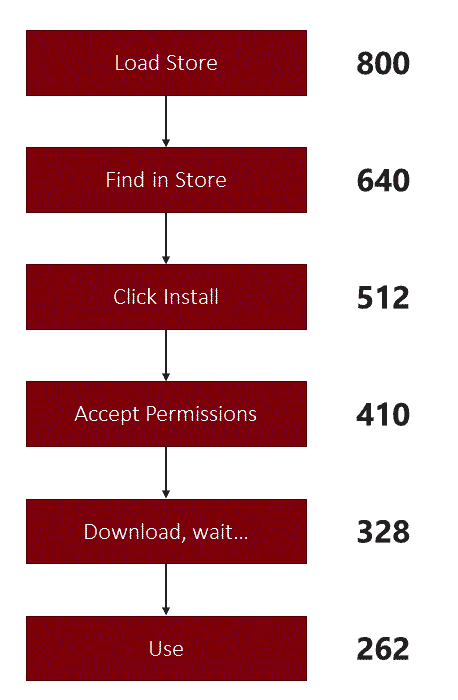

当然，用户只有在知道如何在/能够找到你应用商店的情况下才会开始应用安装过程。这意味着你的公司必须投资时间和金钱来驱动流量和品牌知名度。最近的研究表明，这将在 iOS 上花费 8-14 美元，在 Android 上稍微少一些。

然而，只需为每次点击支付几便士，Facebook、**按点击付费**（**PPC**）或横幅广告活动就能将相同的参与度带到网站上。更好的是，如果你的页面有一个良好的、自然的 SEO 档案，你可以免费驱动大量目标流量！然而，在客户的首页上获得一个位置并不容易。这是因为它不是一个明显的过程。

回顾到原始 iPhone 发布时，第三方应用直到 6 个月后才可用。在 WWDC 上，史蒂夫·乔布斯宣布了第三方应用解决方案 HTML5 + AJAX ([`www.apple.com/newsroom/2007/06/11iPhone-to-Support-Third-Party-Web-2-0-Applications/`](https://www.apple.com/newsroom/2007/06/11iPhone-to-Support-Third-Party-Web-2-0-Applications/)):

*"开发者可以创建看起来和表现就像 iPhone 内置应用一样的 Web 2.0 应用，并且可以无缝访问 iPhone 的服务，包括打电话、发送电子邮件以及在谷歌地图中显示位置。使用 Web 2.0 标准创建的第三方应用可以在不损害其可靠性和安全性的情况下扩展 iPhone 的功能。"*

随着这一声明，苹果公司提供了一种简单且有点黑客式的方法来驱动 iOS 上的主屏幕体验。非标准技术需要为每个页面添加 iOS Safari 特定的 META 标签，并拥有适当大小的主屏幕图片。

# 使你的 PWA iOS 网络应用具备功能

当苹果推出 iOS 时，原始的应用推荐是使用 HTML5、CSS3 和 JavaScript 来创建丰富的客户端用户体验。苹果没有移除 Web 应用支持，并且随着时间的推移增强了一些功能。iOS Web 应用体验是由添加到网页`HEAD`中的自定义元数据驱动的。

大部分苹果元数据已成为现代 Web 清单规范的模式。在创建 Web 清单规范之前，Android 上的 Chrome 集成了对苹果元数据的支持，以驱动类似的经验。

当你的网站包含苹果特定的 META 标签、相应的图标，并且用户已将你的网站添加到他们的主屏幕时，iOS 上的 Web 应用体验被触发。

你需要的第一件东西是一个 png 文件作为默认的主屏幕图标。文件应命名为`apple-touch-icon.png`，并且应位于你网站的根目录中。

单个页面可以有一个独特的图标，在`HEAD`中的`link`引用：

```js
<link rel="apple-touch-icon" href="/custom_icon.png"> 
```

更好地是，为不同的屏幕尺寸和密度指定图标。平台将确定哪个图标最适合设备。如果没有指定图标，则搜索根目录中带有`apple-touch-icon`前缀的图标：

```js
<link rel="apple-touch-icon" href="touch-icon-iphone.png"> 
<link rel="apple-touch-icon" sizes="152x152" href="touch-icon-ipad.png"> 
<link rel="apple-touch-icon" sizes="180x180" href="touch-icon-iphone-retina.png"> 
<link rel="apple-touch-icon" sizes="167x167" href="touch-icon-ipad-retina.png"> 
```

当提供了所需的元数据后，你必须诱导用户启动 iOS 添加到主屏幕的过程。这始于他们按下 Safari 的分享图标：


这触发了 Safari 分享菜单，其中不仅包含分享 URL 的选项：它还包含书签图标，并将网站保存到主屏幕，如下面的截图所示：


与主屏幕图标类似，启动屏幕图像也可以指定。将其视为启动画面。这是通过一个 LINK 元素和一个对启动图像的引用来完成的。如果没有指定图像，则使用上次启动应用时的截图：

```js
<link rel="apple-touch-startup-image" href="/ meta/apple-touch-startup-image-640x920.png"> 
```

# 应用程序标题通过另一个 META 标签设置

这与我在*网络清单*部分将详细讨论的名称和短名称清单属性相似。如果没有提供 META 值，则使用`title`元素值：

```js
<meta name="apple-mobile-web-app-title" content="2048 PWA"> 
```

检查以下截图中的输出：

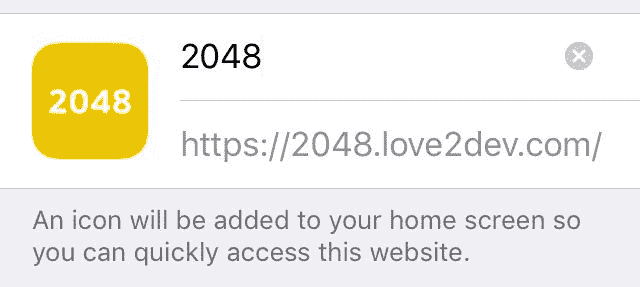

接下来，您应该控制您的 Web 应用如何呈现给用户。iOS 允许您在浏览器中启动应用或以独立模式启动。独立模式移除了浏览器，但保留了屏幕顶部的 iOS 状态栏。以下代码展示了这一点：

```js
  <meta name="apple-mobile-web-app-capable" content="yes"> 
  <meta name="apple-mobile-web-app-status-bar-style" content="black"> 
```

在独立模式下，没有地址栏，因此您可能需要调整您的 UI 以允许客户复制 URL 并返回到之前的屏幕。导航问题与本地应用程序设计师协商的问题相同，每个应用程序都有不同的要求。

状态栏也可以使用`apple-mobile-web-app-bar-style`值进行样式化。此值仅在您的应用以独立模式启动时使用。您可以将默认的灰色更改为黑色或半透明黑色。

不幸的是，您无法将颜色主题化以匹配您的应用程序主题或完全隐藏它：

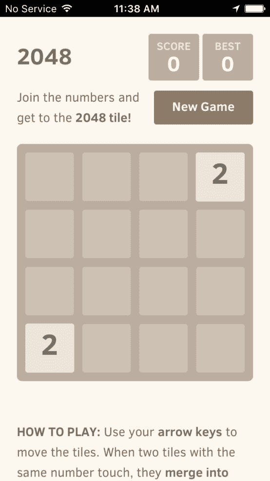

如果您已按照苹果的规范完成所有操作，当用户启动 2048 游戏时，它应该占用整个屏幕，如前一个截图所示。

苹果可能在 iOS 上为与网络品牌建立更亲密的关系铺平了道路，但他们的方法从未成为通用标准。随着 W3C 的标准化，这种变化发生在渐进式 Web 应用时代，这是一个元数据格式，用于向平台描述您的 Web 应用。

# 网络清单规范

网络清单描述了渐进式 Web 应用，使用元数据和 JSON 格式。浏览器解析清单文件以创建添加到主屏幕的图标并启动体验。

现在，不再需要在每个页面的`HEAD`中添加额外的元数据，浏览器可以加载一个包含使用 JSON 格式化的标准属性和值的外部文件。

网络清单规范([`w3c.github.io/manifest/`](https://w3c.github.io/manifest/))为浏览器提供了一些建立添加到主屏幕体验的指南。浏览器如何实现这一体验是开放的，为创造性开辟了途径。我将在审查清单文件后更详细地介绍这一主题。

# 引用网络清单文件

网络清单文件必须在文档的 HEAD 中引用，如以下代码所示：

```js
<head> 
   .... 
  <link rel="manifest" href="manifest.json"> 
</head> 
```

清单应该使用`application/manifest+json` MIME 类型提供服务。这是一个重要的设置，因为它经常被忽视。

您应该研究如何在您选择的 Web 服务器中定义或添加 MIME 类型。

许多服务器默认根据文件类型阻止对文件的请求。这通常导致清单文件返回 404 或 403 类型状态代码。我在 PDF 文档需要被服务时看到类似的问题被提出。您可能需要与您的网络管理员或 devops 团队协调，以确保您的服务器配置正确。

不要使用您的服务工作者缓存网络清单文件。您可能无法在不更新服务工作者的情况下更新文件。它们应该保持解耦。

# 网络清单属性

拥有您应用程序的外观对于确保最佳用户体验至关重要。每个应用程序都有独特的用例，消除了渐进式 Web 应用程序“一刀切”的想法。虽然大多数应用程序将想要复制全屏的原生应用程序体验，但有些将想要保持可见的地址栏。标准化的清单文件为品牌所有者提供了一个与浏览器通信的渠道，以提供最佳品牌体验。

清单应包含一系列属性，包括`name`、`short_name`、`description`、`icons`、`orientation`、颜色和默认页面。这些用于主屏幕和启动体验。

最小化的清单属性列表如下：

+   `name`

+   `short_name`

+   `description`

+   `icons`

+   `orientation`

+   `theme_color`

+   `background_color`

+   `start_url`

您可以在清单中指定其他官方属性，但它们的使用案例有限。我还想指出，由于文档使用 JSON，这是一种可变的数据结构表示法，因此它是可扩展的，一些浏览器正在尝试专有属性。如果您使用非标准属性，请不要担心——您不会破坏其他浏览器，因为它们只是忽略那些值。

有两个名称属性；`name`和`short_name`。`short_name`用于主屏幕图标和其他空间受限的地方。在允许空间的地方，使用`name`属性。

这是在 2048 应用中前四个属性的外观：

```js
{ 
  "name": "2048", 
  "short_name": "2048", 
  "description": "[provide your description here]", 
   "start_url": "/", 
... 
} 
```

`start_url`定义了当选择主屏幕图标时加载的初始 URL。这消除了用户从深度链接（如新闻文章）将 PWA 添加到主屏幕的情况。在过去，图标将是该文章的书签，而不是主页。

`start_url`可以是应用范围内的任何 URL。它不需要是公共主页；它可以是特殊的 PWA 主页。您还可以使用查询字符串值从服务器驱动额外的跟踪和动态行为。

接下来，`icons`属性是一个包含`icon`对象的数组，这些对象定义了图标的 URL、MIME 类型和尺寸：

```js
"icons": [ 
    {     
      "src": "meta/2048-logo-70x70.png", 
      "sizes": "70x70", 
      "type": "image/png" 
    }, 
... 
    { 
      "src": "meta/2048-logo-600x310.png", 
      "sizes": "600x310", 
      "type": "image/png" 
    } 
  ], 
```

虽然支持不同的图像类型，但我建议使用.png，因为 Chrome 至少需要一张 144 x 144 像素的`.png`图像。你应该至少包含四个图标，其中至少一个是 144 x 144 像素，但 192 x 192 像素更好。在第十章，“服务工作者工具”中，我将向你展示如何使用[`www.pwabuilder.com/`](https://www.pwabuilder.com/)来帮助你自动化创建完整图像集的过程。

我的经验法则是包含一打或更多的图标变体，以应对潜在的平台需求和机会。Windows Live Tiles 宽度可达 600 像素，可以缩小到小于 70 像素宽。

在创建图标时使用一些艺术指导也是一个好主意。有些标志在小尺寸下效果不佳。如果你将图标添加到主屏幕并发现难以定位，那么你的客户可能也会如此。

启动画面图像是从图标数组中绘制的。Chrome 会选择与设备 128dp 最接近的图像。标题直接从名称成员中提取。使用名为`background_color`的属性指定背景颜色。

以下图像显示了 Flipkart.com 网站的颜色和标志图标如何用于在加载 Web 应用程序时创建简短的启动画面：

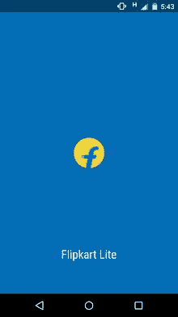

使用数组引用你的 PWA 图标作为 URL。数组中的每个项目都是一个描述图标的对象。包括 src URL、sizes 属性和 MIME 类型。我建议使用.png 文件，因为 Chrome 目前要求此格式。

# 控制启动样式

清单具有平台用于了解如何启动应用程序的属性。`display`属性允许你控制 Chrome 浏览器如何渲染。默认值是`browser`，它将在浏览器中启动 PWA，带有 Chrome。

`minimal-ui`选项将 PWA 作为应用程序启动，但带有最小的一组导航 UI。

`standalone`模式将 PWA 作为全屏应用程序启动。应用程序占据大部分屏幕，但一些浏览器元素，如状态栏，可能会被渲染。查看以下代码以了解属性：

```js
  "display": "fullscreen", 
  "orientation": "landscape", 
```

`fullscreen`模式在无任何浏览器元素的全屏和应用模式下启动应用程序。对于最终用户来说，感觉就像他们打开了一个原生应用程序。

当前支持的显示值如下：

+   `fullscreen`：在全屏中启动应用程序。

+   `standalone`：类似于全屏，但可能有一个可见的系统 UI。

+   `minimal-ui`：向独立视图添加一些最小浏览器导航 UI 组件。

+   `browser`：在浏览器中以常规网页形式打开 PWA。

+   `orientation`：此属性定义应用程序渲染的角度。主要选择是横屏和竖屏。值应该是自解释的。不，你不能以 45 度倾斜渲染你的应用程序！

+   完整的定位选项如下：

    +   `any`

    +   `自然`

    +   `` `横屏` ``

    +   `` `竖屏` ``

    +   `竖屏-主要`

    +   `竖屏-次要`

    +   `横屏-主要`

    +   `横屏-次要`

`theme_color`和`background_color`用于表示应用并提供默认背景颜色。这两种颜色之间的区别在于它们的应用方式：

```js
  "background_color": "#fff", 
  "theme_color": "#f67c5f", 
```

背景颜色指的是`BODY`元素的默认背景颜色。这通常在网站的 CSS 中设置。如果没有设置，则默认回浏览器默认值。今天，事实上的背景颜色是白色，但在早期，它是灰色。

`theme_color`定义了操作系统用于可视化的颜色。这包括任务切换体验。每个平台都提供不同的用户体验，与如何展示应用程序相关，因此主题颜色的应用会有所不同。

如果你的应用程序使用的是从右到左的语言，你可以使用`dir`属性来指定。然后这个方向会被应用到`name`、`short_name`和`description`字段。

`lang`属性与`dir`相关，因为它指定了网站使用的语言。它也应用于文本属性。值应该是一个标准的语言标签（[`developer.mozilla.org/en-US/docs/Web/HTML/Global_attributes/lang`](https://developer.mozilla.org/en-US/docs/Web/HTML/Global_attributes/lang)），由 2 或 3 个字符代码后跟一个可选的子标签组成，例如，`en-US`或`en-GB`。

如果你恰好有一个提供在 PWA 中不可用功能的原生应用程序，你可以使用`prefer_related_applications`字段来指示其可用性，并将其设置为 true 或 false。与`related_applications`值一起使用，以提示如何安装原生应用程序：

```js
"related_applications": [ 
  { 
    "platform": "play", 
    "url": "https://play.google.com/store/apps/details?id=com.love2dev.2048", 
    "id": "com.love2dev.2048" 
  }, {
```

```js
    "platform": "itunes", 
    "url": "https://itunes.apple.com/app/2048-pwa/id123456789" 
  }] 
```

Chrome 最近增加了对清单范围属性的支持，这增加了对 PWA 及其链接页面的渲染方式的更多控制。我将在 WebAPK 或*改进添加到主屏幕体验*部分中稍后回顾 Chrome 如何具体使用此属性。

`scope`属性定义了 Web 应用程序的上下文或被认为是渐进式 Web 应用程序一部分的 URL 范围。平台可以根据需要使用它，但共识是，如果用户在范围内导航，浏览器将根据清单的`display`属性渲染 PWA。任何超出此范围的导航都会导致页面使用完整的 Chrome 浏览器渲染。

# 支持 Apple Safari 网络清单

自从苹果发布了 iOS 11.3 和 Safari 13 更新以来，对网络清单规范的基本支持被包括在内。当前的使用和支持存在一些限制：

+   主屏幕图标仍然引用自`apple-touch-icon`

+   透明图标不受支持

+   不支持 3D 触控菜单

+   没有启动画面

+   无法锁定方向

+   不正确地支持`fullscreen`和`minimal-ui`

苹果还有工作要做，以便完全支持使用 web 清单，但这是一个开始。我相信在接下来的几个月里，我们应该会看到支持得到改善。浏览器供应商面临的一个挑战是转向支持提供功能的新方法。

从提供用户体验的 10 年旧方式（如触摸图标和移动 Web 应用功能）迁移到不同的机制是困难的。如果他们做得太快，他们可能会破坏许多网站，这是所有浏览器供应商都害怕的事情。因此，预计过渡将是渐进的。

我还想指出，PWA 支持，特别是与服务工作者相关，在许多原生应用使用的 webview 中尚未得到支持。这也意味着任何混合应用程序作为 PWA 将无法访问这些功能，包括服务工作者。

在 iOS 上的伪浏览器，如 Chrome、Edge 和 Firefox，也不支持任何渐进式 Web 应用功能。这些浏览器使用 webview 来渲染页面，而不是它们自己的引擎。因此，目前它们也受到限制。

好消息是，Safari 支持所有主要平台上的所有主要浏览器，并且现在支持基本的 web 清单消费。

# 验证 web 清单文件

web 清单是一个简单的 JSON 文档，但很容易出错或忘记某些内容。如果您的网站没有正确注册清单文件，您将需要调试问题。幸运的是，有一些资源可以帮助您验证文件。

Google 托管了一个简单的在线验证器([`manifest-validator.appspot.com`](https://manifest-validator.appspot.com))，您可以在其中输入 URL 或直接将清单代码粘贴到页面中。它将解析您的清单并告知是否存在问题：

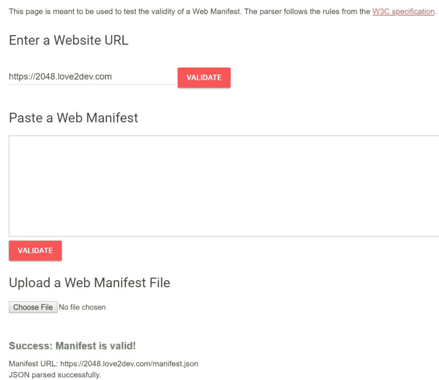

nodejs Web 清单验证器([`github.com/san650/web-app-manifest-validator`](https://github.com/san650/web-app-manifest-validator))是一个可以包含在您的自动化测试工作流程中的模块，用于验证清单文件。它已经有一年多了，所以如果您使用的是较新的清单功能，您可能需要分叉项目并更新它。请记住，清单规范尚未最终确定，并且随着时间的推移可能会发生变化。

这些工具并非只有这些。还有一些其他 node 模块，以及 Lighthouse 和 Sonar。我将在第十章，“服务工作者工具”，以及 PWA Builder 中介绍这些工具，PWA Builder 可以生成您的清单。

# Chrome 改进的添加到主屏幕体验

在 2017 年某个时候，Chrome 团队宣布了对 PWA 安装体验的更改，称为改进的添加到主屏幕体验。当时，这不仅仅关于自动提示，但这已经成为了变化的一部分。它更多地与 PWAs 在 Android 上的行为有关，它更像是原生应用程序。

这些变化是多方面的，始于 Web 清单的作用域属性。这个属性相对较新，但允许浏览器知道如何限制源（域名）上的 PWA 功能。

当你设置作用域值为`/`时，你是在告诉平台，渐进式 Web 应用的能力适用于源内的所有路径。这并不总是如此，尤其是在较大的网站和企业应用中。通常，这些网站被分割成不同的应用。

如果你将作用域更改为`/hr/`，那么只有`/hr/`文件夹下的 URL 将包含在 PWA 的作用域内。这意味着这些 URL 将根据 Web 清单文件配置打开。不在`/hr/`文件夹内的 URL 将在浏览器中正常打开。

当使用 Chrome 在 Android 上安装 PWA 时，它会自动创建一个未签名的 WebAPK，这使得 PWA 成为一个原生应用。在 WebAPK 中，会创建一个 Android 清单文件，其中包含 intent 过滤器。

Intent 过滤器告诉 Android 如何打开源内的 URL。对于 PWA，这意味着应用将根据清单配置启动，或者如果在其作用域之外，则直接在浏览器中打开。

这里是这些 intent 过滤器在 WebAPK 中的样子：

```js
<intent-filter> 
  <action android:name="android.intent.action.VIEW" /> 
  <category android:name="android.intent.category.DEFAULT" /> 
  <category android:name="android.intent.category.BROWSABLE" /> 
  <data 
    android:scheme="https" 
    android:host="2048.love2dev.com" 
    android:pathPrefix="/" /> 
</intent-filter> 
```

`pathPrefix`的值会改变以匹配 Web 清单的作用域值：

```js
<intent-filter> 
  <action android:name="android.intent.action.VIEW" /> 
  <category android:name="android.intent.category.DEFAULT" /> 
  <category android:name="android.intent.category.BROWSABLE" /> 
  <data 
    android:scheme="https" 
    android:host="love2dev.com" 
    android:pathPrefix="/hr/" /> 
</intent-filter> 
```

这些变化并没有停止在 Android 上，因为最近的更新也已经应用于 Chrome OS，并且不久的将来也将应用于桌面 Chrome。谷歌正在用渐进式 Web 应用替换 Chrome OS 应用，为平台上的先前 Web 应用提供类似的功能。

Chrome 还将更多添加到主屏幕体验的功能引入桌面。然而，这会因操作系统而异，因为每个平台都有不同的用户期望。

好消息是，如果你制作了好的渐进式 Web 应用，你将直接受益于这些变化。

# 添加到主屏幕体验

出现自动提示访客将你的渐进式 Web 应用添加到他们的主屏幕上是非常令人兴奋的。在过去，Chrome 最终会显示一个提示安装渐进式 Web 应用，但最近这已经改变了。触发提示的规则仍然有效，但现在只触发`beforeinstallprompt`事件。

用户提示触发的机制是每个浏览器可以选择不同路径的地方。一些要求在 Web 清单规范中定义，但体验被留给浏览器根据需要实现。

目前，Chrome 拥有最成熟的过程。他们建立了以下标准来自动触发添加到主屏幕体验：

+   有一个 Web 应用清单文件：

    +   一个`short_name`（用于主屏幕）

    +   一个名称（用于横幅）

    +   一个 144 x 144 .png 图标（图标声明必须包含 image/png 的 MIME 类型）

    +   `Astart_url`加载

+   在你的网站上注册了 service worker：

    +   有 fetch 事件处理器

    +   Fetch 事件处理器不能是一个空操作函数，它必须做些什么

    +   通过 HTTPS（使用 service worker 的要求）提供服务

    +   至少访问两次，两次访问之间至少有五分钟

+   FireFox、三星和 Opera 有类似的要求。FireFox 将在 Android 上触发体验，但不在桌面版上。你可以允许桌面版上的体验，但它被隐藏在标志后面。

这些浏览器通常在浏览器的地址栏中提供简单的视觉提示。以下是 Android 上的 Firefox 如何显示指示器：


注意它如何使用带有`+`的房屋图标来表示该网站可以安装。在其右侧，你也会看到一个 Android 轮廓标志。小 Android 头像表示有应用可用。在这种情况下，它正在检测我从 Chrome 安装的 PWA，它创建了一个 WebAPK。

# Chrome 添加到主屏幕体验

在渐进式 Web 应用体验方面，Chrome 无疑是当之无愧的领导者。他们应该如此，因为他们创造了这一概念。他们也有时间对这个概念进行实验，看看什么有效，什么无效，以及消费者和开发者有什么期望。

这导致他们不断改进流程，使得在 Android 上安装应用时 Chrome 会创建一个 WebAPK，将应用提升到与原生应用相似的水平。最近，他们扩展了这一功能到 Windows 和 ChromeOS，并计划很快在 macOS 上实现。

这里，你可以看到我 Windows 开始菜单中最近安装的一些渐进式 Web 应用：

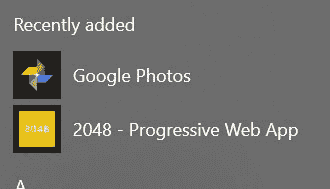

那么，**WebAPK**和**增强型添加到主屏幕体验**究竟是什么？

我已经解释过了：Chrome 将渐进式 Web 应用打包到 apk 包中，这种打包方式被称为**WebAPK**。如果你不熟悉 Android 原生应用开发，所有的资源都打包在一个名为 apk 的单个文件中。

简单来说，这只是一个包含应用资源的 zip 文件。Windows 使用 appx 格式做类似的事情。Chrome 创建 WebAPK 时所做的类似于使用 Cordova 从网站生成原生应用。

Chrome 团队决定创建一个重复的通道来维护并给予 PWAs 类似的控制，因为采用这种混合方法的原生应用效率最高。他们首先在 Chrome 57 中推出了这一功能。原生 Android 应用与已安装的渐进式 Web 应用之间的主要区别是无法访问平台 API。

应用看起来就像设备上安装的任何 Play Store 应用一样。图标可以放置在主屏幕上，在应用托盘上可见，并且可以通过 Android 平台设置进行管理。

这里是如何在 Android 应用管理界面中呈现 2048 PWA 的：

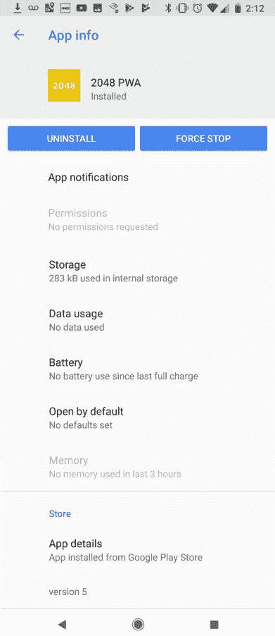

当 Chrome 在其他平台上实现此功能时，您可能会或可能不会发现相同级别的控制。例如，您仍然无法从 Windows 的控制面板中管理已安装的 PWA。

应用程序使用与网页相同的存储设置。清除域的存储也将清除已安装 PWA 的存储。这意味着将删除 cookie 和缓存内容。

另一个好处是当 Web 清单文件更新以引用新的图标或更改名称值时。这将更新主屏幕图标。

Google 并没有将此功能据为己有。他们为其他用户代理（浏览器）提供了文档和参考以实现类似的功能([`chromium.googlesource.com/chromium/src/+/master/chrome/android/webapk`](https://chromium.googlesource.com/chromium/src/+/master/chrome/android/webapk))。这意味着我们可能会看到 Firefox、Samsung Internet、UC 浏览器等很快实现类似的功能。

# 您添加到主屏幕的责任

在 2018 年的 Google I/O 上，宣布 Chrome 在 Android 上将不再包含自动添加到主屏幕的提示。相反，您有责任创建用户体验。最终，Chrome 团队决定更符合其他浏览器供应商构建体验的方式。

清单规范需要时间来定义添加到主屏幕体验的骨架规则和最小要求。而不是将所有浏览器限制在相同的规则下，该规范定义了可以作为添加到主屏幕提示算法一部分使用的 *安装信号*。

提示序列应尊重一定的隐私考虑，并在发出提示之前等待文档完全加载。该过程还应允许用户检查应用程序名称、图标、起始 URL、来源和其他属性。还建议允许最终用户修改一些值。例如，更改他们主屏幕上的应用程序名称。

这就是 `beforeinstallprompt` 事件发挥作用的地方。这是您将用户引导至安装您的渐进式 Web 应用的正确信号的钩子。

当满足触发添加到主屏幕体验的启发式条件时，将触发此事件。但不是来自 Chrome 的原生或内置提示，您需要在事件触发后适当时机提示用户。

他们为什么改变这个？我并不是 100% 确定，尽管我个人认为这是一个好主意，有助于推广 Web 应用程序的安装。但这有点侵扰性，并且不符合其他最佳实践。例如，当我们在这本书的后面部分查看启用推送通知时，您不应该自动打扰访客启用通知。

在请求下一阶段的交往之前，应该有一些小小的求爱过程。我并不喜欢用这个比喻，但到了这个阶段，它已经变得很经典了；你不能只是走到每一个漂亮的女孩面前，就请求她们嫁给你。这是一个更长的过程，其中必须赢得双方的信任。

请求访客将你的图标添加到他们的主屏幕上，并不完全等同于婚姻，但更像是请求他们开始稳定交往或独家约会。

要使用`beforeinstallprompt`事件，在你的网站 JavaScript 中添加一个事件监听器回调：

```js
  var deferredPrompt; 

  window.addEventListener('beforeinstallprompt', function (e) { 
 // Prevent Chrome 67 and earlier from automatically showing the prompt 
    e.preventDefault(); 
 // Stash the event so it can be triggered later. 
    deferredPrompt = e; 

    showAddToHomeScreen(); 

  }); 
```

我需要审查几个移动部件。首先是事件对象`(e)`有两个独特的属性，`platforms`和`userChoice`。`platforms`是一个数组，表示用户是否可以安装原生应用或渐进式 Web 应用。`userChoice`属性解决了一个承诺，表示用户是否选择了安装应用。

在这个代码中使用的另一个元素是`deferredPrompt`变量。这个变量是在事件处理程序外部声明的，因此可以在稍后使用，在这种情况下是在`showAddToHomeScreen`逻辑中。

在这个例子中，`showAddToHomeScreen`方法会在事件触发时立即被调用，但更好的做法是将操作推迟到适当的时间。想想一个正在执行重要应用任务的用户。突然的安装应用提示将会是一个令人困惑的干扰。如果你将提示推迟到操作完成，这将对你和用户都有好处。

`showAddToHomeScreen`方法显示一个特殊的覆盖层，请求用户安装应用：

```js
function showAddToHomeScreen() { 

  var a2hsBtn = document.querySelector(".ad2hs-prompt"); 

  a2hsBtn.style.display = "flex"; 

  a2hsBtn.addEventListener("click", addToHomeScreen); 
}
```

我在 2048 应用中添加了一个简单的覆盖层，当可见时它会向上滑动。查看以下截图：


一旦接受提示，用户将看到原生添加到主屏幕的提示，如下面的截图所示：

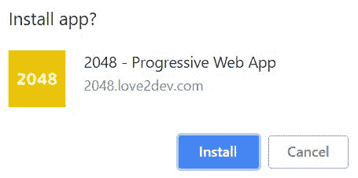

最后，`addToHomeScreen`方法利用了我们保存在`beforeinstallprompt`事件处理程序中的`deferredPrompt`变量。它调用提示方法，显示前面截图所示的内置对话框：

```js
  function addToHomeScreen() { 

... 

    if (deferredPrompt) { 
      // Show the prompt 
      deferredPrompt.prompt(); 

      // Wait for the user to respond to the prompt 
      deferredPrompt.userChoice 
        .then(function (choiceResult) { 

          if (choiceResult.outcome === 'accepted') { 
            console.log('User accepted the A2HS prompt'); 
          } else { 
            console.log('User dismissed the A2HS prompt'); 
          } 

          deferredPrompt = null; 

        }); 
    } 
  } 
```

然后该方法使用`userChoice`方法根据选择执行任务。在这里，我只是将选择记录到控制台。你可以持久化一个表示状态的令牌，或者级联额外的逻辑来执行其他任务。

我认为这是一个启动感谢或入职体验的好机会。

2048 应用是一个非常简单的添加到主屏幕体验。你可以扩展这个功能来教育用户或告诉他们添加你的应用到他们主屏幕上的好处。Flipkart 有一个很棒的教育序列，解释了如何安装应用以及为什么应该这样做。这是一个很好的体验模式，也是他们成功使用渐进式 Web 应用的原因之一。

# 禁用主屏幕提示

`beforeinstallprompt`事件也可以用来抑制 Chrome 的自动提示。这次，就像打破默认表单提交一样，调用`preventDefault`函数并返回 false：

```js
window.addEventListener('beforeinstallprompt', function(e) { 
  e.preventDefault(); 
  return false; 
}); 
```

这将在 Chrome 中阻止该行为。目前，我不知道如何在其他平台上抑制提示，因为它们还没有支持`beforeinstallprompt`事件。

# 跟踪主屏幕安装

一旦显示主屏幕安装提示，用户可以选择将 PWA 添加到他们的主屏幕，或者忽略提示。企业应该跟踪和衡量所有可能的事情，以做出更好的决策。了解有多少主屏幕安装以及客户安装他们的 PWA 的速率，可以提供对他们的营销和技术投资的洞察。

Chrome 支持`beforeinstallprompt`事件，可以用来跟踪这项活动。你可以添加一个处理程序到这个事件，并记录每个用户的选项：

```js
window.addEventListener('beforeinstallprompt', function(event) { 
  event.userChoice.then(function(result) {                                  

if(result.outcome == 'dismissed') {                                         
  // They dismissed, send to analytics 
}else { 
  // User accepted! Send to analytics 
} 
});  
}); 
```

你可以将用户的选项 POST 到你的分析系统中。这可能是一个自定义 API 到你的内部分析，甚至可以绑定到你的第三方服务，如 Google Analytics。

`beforeinstallprompt`是 Web 清单规范的一部分，但在撰写本书时，它只由 Chrome 支持。希望其他浏览器很快会添加支持。

不支持`beforeinstallprompt`的浏览器也可以提供反馈。Web 清单的`start_url`可以设置为特殊起始 URL，或者追加到默认 URL 的自定义查询字符串值。你需要添加逻辑到你的日志分析器中，以跟踪这种行为。除了知道你有多少主屏幕安装之外，你还可以跟踪用户启动你的 PWA 的次数，以及那些没有安装你的 PWA 的用户。

# 在 iOS 和其他旧浏览器上多文件化主屏幕体验

开发者和企业主经常问的一个问题是，如何在 iOS 和像 Internet Explorer 这样的旧浏览器上启用渐进式 Web 应用功能。虽然这些浏览器中所有功能都不能被破解，但大部分是可以的。

当 iPhone 发布时，最初的应用模型是网页。他们为 Web 应用创建了一个高级体验，包括添加到主屏幕的体验。不幸的是，他们没有制作自动提示体验。谁知道如果开发者没有呼吁原生应用模型，今天这个体验可能会多么先进。

我们可以做的仍然是利用这种能力，并使用 Matteo Spinelli 的添加到主屏幕库([`cubiq.org/add-to-home-screen`](http://cubiq.org/add-to-home-screen))与 Apple 的指南相结合。这样做可以让你的 Web 应用从用户的首页启动，无论是否有 Chrome。这在上面的屏幕截图中有展示：

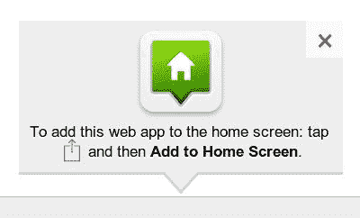

避免重复加载主屏幕提示非常重要，除非需要，不要加载“添加到主屏幕”库。我发现确定是否需要 polyfil 的最简单方法是通过使用功能检测服务工作者支持。我选择这样做是因为支持服务工作者的浏览器有一些添加到主屏幕的体验。这在未来可能或可能不会保持不变，所以如果情况发生变化，请准备好更改标准。

不深入细节，我喜欢在页面加载时动态加载 JavaScript 引用。这个过程涉及一系列功能检测，以 polyfil 各种要求，如 Promises 和 Fetch API：

```js
        if (!'serviceWorker' in navigator) { 
            //add to homescreen polyfil 
            scripts.unshift("js/libs/addtohomescreen.min.js"); 
        } 
```

您可以在*Jake Archibald 的文章中了解更多关于动态加载脚本的信息**（[`www.html5rocks.com/en/tutorials/speed/script-loading`](https://www.html5rocks.com/en/tutorials/speed/script-loading)）*。

您还需要动态添加添加到主屏幕样式表。这次，在文档的`HEAD`中添加一个功能检测脚本：

```js
    <script> 
        if ('serviceWorker' in navigator) { 

            // add addToHomeScreen CSS 
            cssLink = document.createElement("link"); 

            cssLink.id = "addToHomeScreen"; 
            cssLink.rel = "stylesheet"; 
            cssLink.type = "text/css"; 
            cssLink.href = "css/libs/addtohomescreen.css"; 
            document.head.appendChild(cssLink); 

        } 
    </script> 
```

自从 iPhone 发布以来，用户就可以安装这样的 Web 应用，但这个过程是手动的，并且对最终用户和开发者来说都 largely unknown。缺乏自动提示一直是该功能的关键缺失组件。它创造出的体验似乎是 Chrome 团队和其他平台模仿以显示渐进式 Web 应用主屏幕提示的模型。

Matteo 的库只提示用户并开始手动过程，但用户仍需完成一些不太直观的额外步骤。新的原生添加到主屏幕过程有一个伪自动管道可以集成。我认为添加到主屏幕库可以作为设计您体验的良好参考，所以花时间看看它是值得的。

# 你应该 polyfil 响应缓存吗？

请求缓存也可以使用 IndexedDB 进行 polyfile。然而，现在大多数浏览器都支持服务工作者和缓存，我认为这种方法并没有明智地利用资源。在移动使用之外，Internet Explorer 是主要没有服务工作者支持的浏览器。在撰写本书时，IE 应该主要用于企业，当他们的业务线应用程序尚未升级到现代标准时。

这意味着可能只有极少数潜在用户会在没有服务工作者支持的浏览器中打开您的 PWA。当这种情况发生时，可以说他们很可能是某种桌面电脑，并且拥有可靠的网络连接。

尽管我使用早期实现的客户端资产缓存开发了数百个应用程序，但我已经正式从我的推荐中弃用了这种方法。

# 微软 Edge 和 Internet Explorer

当 Windows 8 发布时，微软悄悄地发布了他们所谓的**托管 Web 应用**（**HWA**）的支持。这些是引用有效 web 清单文件的网站，并通过 HTTPS 提供服务。

HWA 是渐进式网络应用的早期前身。明显的区别是无需服务工作者要求，这是预料之中的，因为服务工作者这个概念当时还没有被创造出来。

要成为 HWA，你需要为你的应用程序创建一个包含清单文件和公共 URL 引用的`.appx`文件。然后，你将 HWA appx 提交到 Windows Store，消费者可以从商店安装 HWA。

成为 HWA 的优势在于这些网络应用可以完全访问所有 Windows 平台 API，就像任何原生应用一样。它们拥有这种特权的原因是，一旦安装，它们就构成了商店，并且是完整的应用程序。

主要区别在于 UI 组件和业务逻辑都是网页。这让你能够立即更新应用程序，而无需经历所有移动应用商店都面临的审核延迟。

在许多方面，这就像是传统原生应用和 Chrome 在 Android 上支持的 WebAPK 功能之间的结合。

微软甚至创建了一个名为 Manifoldjs 的在线工具，以帮助进行 HWA 创建和提交过程。近年来，Manifold 已经重新设计，并有了新的名字，PWA Builder([`pwabuilder.com`](https://pwabuilder.com))。

今天，PWA Builder 可以将任何公共网站转换为渐进式网络应用，并提供资源将其提交到 Windows Store，同时还能编译适用于 Apple 和 Google Play 商店的 Cordova 应用。

如果你有所疑问，Windows Store 中已经有很多 HWA 和 PWA 了。Twitter 和 Pandora 是一对知名 Windows 渐进式网络应用。事实上，Twitter 正在逐步淘汰所有原生应用，未来将全部转向 PWA。

我将在第十章第十章，*服务工作者工具*中详细介绍 PWA Builder。相信我，你不会想跳过这一章，因为 PWA Builder 和我们所提到的其他工具都已经成为了我的 PWA 工作流程的基石。

今天，Microsoft Edge 支持服务工作者，这意味着 HWA 的概念已经演变为渐进式网络应用的消费。同样的过程适用于商店提交，你仍然拥有完整、原生的应用功能。

Windows 8 和 Internet Explorer 也支持将网络应用固定到开始屏幕的本地 Live Tiles。当 Edge 和 Windows 10 发布时，Live Tile 支持并未被包含在内。但这并不意味着你不能将网站添加到开始菜单。

在 Microsoft Edge 中，用户可以通过右上角的`...`图标打开菜单。这会显示一个包含许多选项的菜单，其中一个是将此页面固定到开始菜单。另一个选项是将页面添加到任务栏：

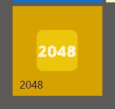

如你所知，在 Windows 7 时代，Internet Explorer 支持丰富的锁定网站功能。最近，对锁定网站的支持已经恢复。就像 iOS 一样，你可以通过 `meta` 标签自定义此体验：

```js
<meta name="application-name" content="2048" /> 
<meta name="msapplication-square70x70logo" content="meta/2048-logo-70x70.png" /> 
<meta name="msapplication-square150x150logo" content="meta/2048-logo-152x152.png" /> 
<meta name="msapplication-wide310x150logo" content="meta/2048-logo-310x150.png" /> 
<meta name="msapplication-square310x310logo" content="meta/2048-logo-310x310.png" /> 
<meta name="msapplication-TileColor" content="#ECC400" /> 
```

锁定网站仍然可以通过 Internet Explorer 使用，但随着企业升级到 Windows 10，作为主要浏览器的 Internet Explorer 使用率正在迅速下降。这并不意味着你应该跳过锁定网站的元数据。目前我仍然包括它。

我不想将这些解决方案放在负面空间，因为它们都是将网络平台推进以提供更好用户体验的良好首次尝试。也许你可以看到这些尝试如何作为现代网络清单规范参考的依据。

现在，随着 Microsoft Edge 发布了服务工作者，团队正忙于研究他们的添加到开始菜单（我的术语，不是他们的）将是什么样子。他们在 2018 年 Build 大会上提供了一些早期原型，但在撰写本书时，还没有确定的东西。

我最好的猜测是在夏末或初秋，我们可能会在 Redmond 的年度 Edge 开发者峰会上看到一些更具体的内容。

# 无需 Polyfils 即可享受好处

即使你没有 polyfil 添加到主屏幕的行为，你的网络应用在 iOS 和其他非 PWA 平台上也会看到用户参与度的提升。许多公司正在公开分享他们在各种渐进式网络应用案例研究中的改进。

在线航空预订服务 Wego 报告称，在 iOS 上的转化率提高了 50%，会话时间延长了 35%。Mynet 页面浏览量增加了 15%，iOS 上的跳出率降低了 23%。兰蔻的 iOS 会话增加了 53%。这些都是积极的渐进式网络应用案例研究的小样本。

这些公司正在享受 iOS 上 PWAs 的好处，因为从本质上讲，正确架构的网站性能更佳。此外，创建渐进式网络应用迫使你将客户放在首位，而不是开发者。当你这样做时，你会创造更好的用户体验，这直接关联到关键性能指标的改善。

遵循渐进式网络应用指南迫使你提供跨所有平台工作的以用户为中心的体验。

# 在 Chrome 中测试添加到主屏幕的体验

没有测试添加到主屏幕的体验，开发者的体验将不完整。Chrome 添加了工具，允许你查看你的网页清单文件是如何被解释的，并手动触发提示。

通过使用 *F12* 启动 Chrome 的开发者工具并选择应用程序标签页。有许多选择可以帮助你调试渐进式网络应用的各个方面。在应用程序下，有一个“清单”选项。这将显示你的网页清单文件属性，包括每个图标。这是一个快速确定你的清单是否被正确解释的方法，如下面的截图所示：

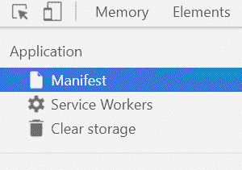

还有一个链接可以手动触发添加到主屏幕体验。查看以下截图：

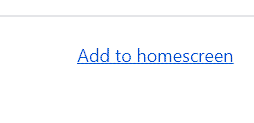

点击开发者工具中的链接将触发添加到主屏幕提示。请看以下截图：


测试您的最佳方式是将您的渐进式 Web 应用部署到云端，并启用 HTTPS。在支持 PWA 的浏览器中打开您的网站，并尽可能遵守规则以触发添加到主屏幕提示。

在多个设备上测试您的网站始终是一个最佳实践。我建议至少有一部 iPhone、一部 Android 手机和一台配备多个浏览器的桌面电脑。拥有这些真实用户体验可以让您有信心，您部署的 PWA 按预期工作。

# 摘要

由于 Web 清单和添加到主屏幕体验，原生和渐进式 Web 应用之间的界限变得非常模糊。主屏幕不再仅限于原生应用；Web 被所有平台所欢迎。

今天，大多数浏览器都为渐进式 Web 应用提供了高级应用体验，尽管苹果公司尚未采用渐进式 Web 应用标准，但他们却是第一个将 Web 体验转变为应用体验的公司。开发者和企业需要采用并实施丰富的添加到主屏幕功能。

触发添加到主屏幕体验是提升您的网络存在感的第一步。

即使用户尚未将您的 PWA 添加到他们的主屏幕，您仍然可以利用渐进式 Web 应用的功能。然而，在我们深入探讨服务工作者之前，让我们看看如何将 SSL 添加到您的网站上。

下一章将介绍安全性或 HTTPS 的使用，这是使应用成为渐进式 Web 应用的三项主要技术要求之一。
