# 第三章：使您的网站安全

现在没有任何网站使用 HTTPS，这令人惊讶。过去保护网站很困难，但近年来大多数安全障碍都已被消除。这些障碍包括价格、技术要求和性能担忧。

要成为渐进式网络应用，网站必须通过 HTTPS 提供服务。服务工作者位于 HTTPS 之后，因为它们在后台运行，旨在执行可能在不受保护的情况下损害隐私的任务。

减少和消除障碍后，由于搜索引擎排名的提高、浏览器中的视觉提示以及 HTTPS 背后的门控 API，搜索引擎和浏览器增加了 HTTPS 对消费者的可见性：

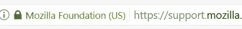

这意味着每个网站现在都有从 HTTP 迁移到 HTTPS 的激励措施。但仍然有一些问题您需要解决，以确保 HTTPS 策略的成功。

在本章中，您将学习以下主题：

+   什么是 SSL/TLS 和 HTTPS

+   常见反对意见，迁移到 HTTPS 的理由

+   HTTPS 迁移策略

# SSL 历史

**安全套接字层**（**SSL**）证书代表了大多数网络和互联网交易中信任的基础。当谈到 SSL 和 HTTPS 时，信任是关键词。当网站使用 SSL 时，浏览器和服务器之间的通信是加密的，但为了获得 SSL 证书，您必须与颁发机构建立一定程度的信任。

要启用 SSL，您必须在服务器上安装证书。证书由**证书颁发机构**（**CA**）颁发。如今，有许多证书颁发机构，很难一一列举。您应该寻找最适合您需求的最佳提供商。在本章中，我将讨论其中的一些。您还将了解不同类型的证书以及 CA**打包**的附加功能。在不久的过去，Network Solutions 是唯一一个可以购买证书的权威机构。

他们不仅是镇上唯一的游戏，您还得处理大量的繁琐手续。如果他们不喜欢您的文件，他们会拒绝您。个人购买证书几乎是不可能的，因为域名所有权需要与注册企业绑定。

这种有限的可用性导致了年度证书的高价。平均博客、企业或组织从未考虑过使用 SSL，因为成本问题。这限制了 SSL 的使用，仅限于传输敏感信息（如信用卡和银行账户号码）的网站，因为这些原始障碍。

证书成本不仅限于年度证书成本——托管安全网站是昂贵的。因为网络技术尚未发展，SSL 限制为每个 IP 地址一个域名。这意味着网站需要支付专用 IP 地址的费用，通常还需要支付专用 Web 服务器的费用。如果您想要加密，每月 4.99 美元的共享托管计划不是选项。

自那时起，HTTPS 的故事已经改变。有许多免费和低成本的证书授权机构，消除了年度成本障碍。HTTP 协议和 Web 服务器技术也得到了发展。今天，您可以使用不同的证书和主机头（域名）在同一 IP 地址上托管多个网站。

**服务器名称指示**（**SNI**）于 2003 年被添加到 TLS 规范中（[`en.wikipedia.org/wiki/Server_Name_Indication`](https://en.wikipedia.org/wiki/Server_Name_Indication)）。这允许服务器在同一 IP 和端口号上使用 TLS 托管多个域名。最初，服务器在 HTTP 连接建立后或 TLS 握手后管理主机头名称的转换。

2003 年的 TLS 规范变更使得客户端将域名作为 TLS 协商的一部分包含在内。现在，Web 服务器可以使用它们的内部主机头表来确定所需的网站。

# TLS 是如何工作的？

TLS 是一种加密协议，它建立在 TCP 之上，有时也建立在 UDP 之上。因为它位于传输层之上，它允许链中更高层的协议保持不变，例如 HTTP。

该协议隐藏了通过线路发送的实际数据。攻击者只能看到与之连接的端口、域名和 IP 地址。他们还可以跟踪传输的数据量。

一旦建立了 TCP 连接，客户端（通过浏览器或其他用户代理客户端应用程序）将启动 TLS 握手。客户端通过提出一系列问题开始 TLS 对话：

+   它运行的是 SSL/TLS 的哪个版本？

+   它想使用哪些加密套件？

+   它想使用哪些压缩方法？

客户端选择客户端和服务器都支持的 TLS 协议的最高级别。同时也会选择压缩方法。

一旦建立了初始的 TLS 连接，客户端会请求服务器的证书。证书必须得到客户端或客户端信任的权威机构的信任。证书授权机构的例子包括 Network Solutions、GeoTrust、Let's Encrypt 和 Amazon。

证书验证完成后，将交换加密密钥。密钥取决于所选择的加密方式。一旦密钥交换完成，客户端和服务器就可以执行对称加密。

客户端通知服务器，所有未来的通信都将是加密的：

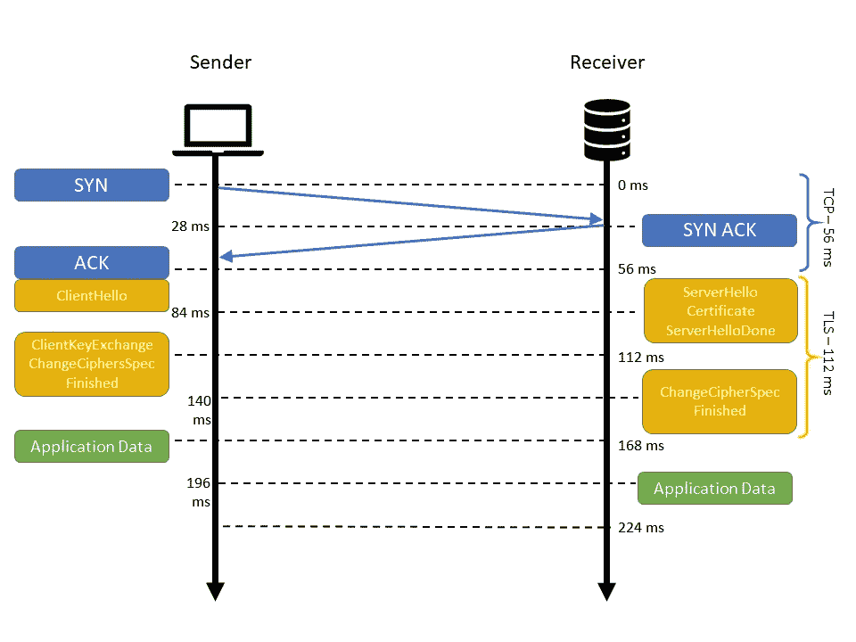

客户端和服务器执行最终验证，其中客户端的 MAC 地址由服务器验证。服务器从客户端接收一个初始认证消息，该消息被解密并发送回客户端以进行验证。

加密密钥为每个连接生成，并基于认证消息。假设握手成功完成，客户端和服务器现在可以安全地通信。

客户端和服务器之间的安全 TLS 连接至少具有以下属性之一：

+   由于对称密码学用于加密传输的数据，这是连接安全的原因。共享密钥的协商既安全又可靠（协商的密钥对窃听者不可用，攻击者无法在协商过程中修改通信内容而不被检测到）。

+   公钥密码学用于验证通信方的身份。认证过程可以是可选的，但通常对于服务器来说是必需的。

+   为了防止在传输过程中数据未被检测到的丢失或更改，每个传输的消息都包含使用消息认证码进行的信息完整性检查。

# 什么是 HTTPS？

**HTTPS** 是 SSL/TLS 中的 HTTP。TLS 为两个主机（Web 服务器和浏览器）之间的双向二进制数据通信建立了一个安全隧道。**HTTP**（**超文本传输文本协议**）是客户端和服务器之间用来互相通信的通信协议：

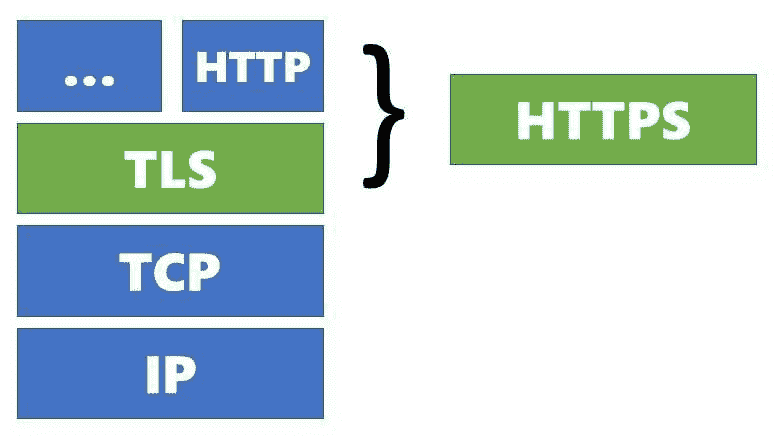

因此，可以将 HTTP 想象成管道内的水。管道是 TLS 加密，而水是数据。HTTPS 与水类比的主要区别在于 HTTPS 是双向的，而管道不是。

还有其他通信协议支持 TLS，例如 WebSockets（WSS）、电子邮件（SMTPS）和 FTP（FTPS）。

# HTTPS 优势

当有人询问 SSL 或 HTTPS 时，你首先想到的，通常是加密。这是使用 HTTPS 的一个很好的理由，但不是唯一的原因，甚至不是最重要的原因。

HTTPS 给我们提供了三个安全特性：

+   **身份**：证书证明服务器是真正的服务器

+   **机密性**：只有浏览器和服务器可以读取它们之间传递的数据

+   **完整性**：发送的数据是对方接收到的数据

# 身份

当你安装 SSL 证书并启用 HTTPS 时，你是在告诉全世界他们可以信任你的网站身份。一旦客户端和服务器之间建立了这个安全的通信通道，双方都可以确信对话是期望的对象。

客户端和服务器通过验证彼此的身份来建立通信通道。证书用于验证这个身份。每次对话都需要一个只有客户端和服务器知道的令牌。

# 机密性

没有 HTTPS，你的连接可能会被中间人攻击所劫持。浏览器中的地址可能会告诉你它是你期望加载的域名，但实际上，它可能是中间的坏人。

让我们先定义不同的场景：

通常，当你使用 HTTP 连接到一个网站时，对话是明文的。一般来说，对话不包含任何敏感信息。但坏人可能会窃听你的流量，并利用他们找到的信息做坏事，如下面的图像所示：

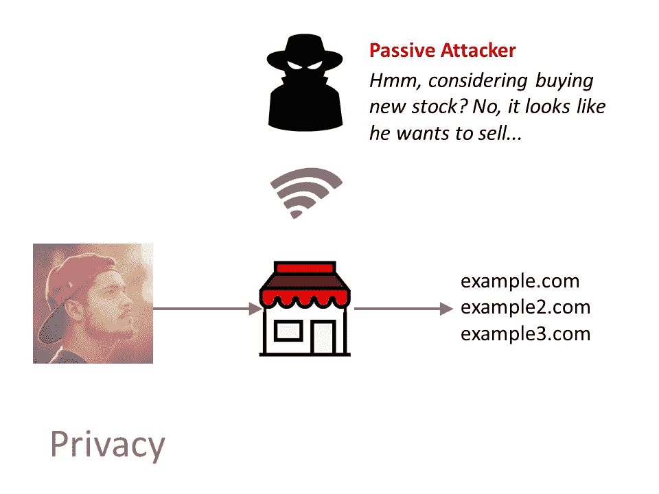

当你使用公共 Wi-Fi 时，这种情况会加剧。这些网络对于免费连接到互联网来说很棒，但对于个人安全来说却很糟糕。

一旦窃听者确定了你的会话，他们可能会拦截对话并将你重定向到他们的服务器。现在，你与目标网站共享的任何信息都会发送到坏家伙的服务器，如下面的图片所示：

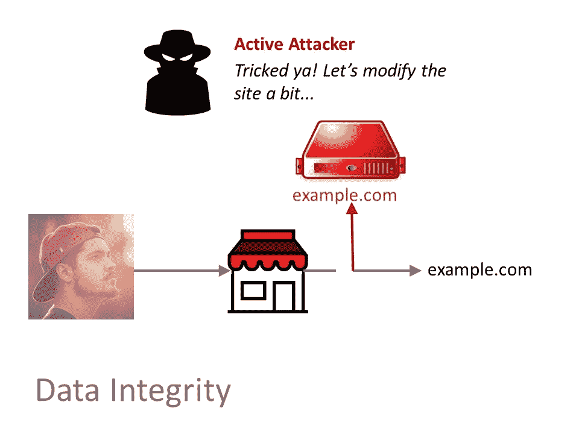

虽然有些复杂，但它发生的次数比你想象的要多。

让我们改变场景，让所有相关人员都在使用 HTTPS。现在所有通信都是加密的。坏家伙唯一能看到的是你访问的域名（s），甚至不是那些域名上的 URL，如下面的图片所示：

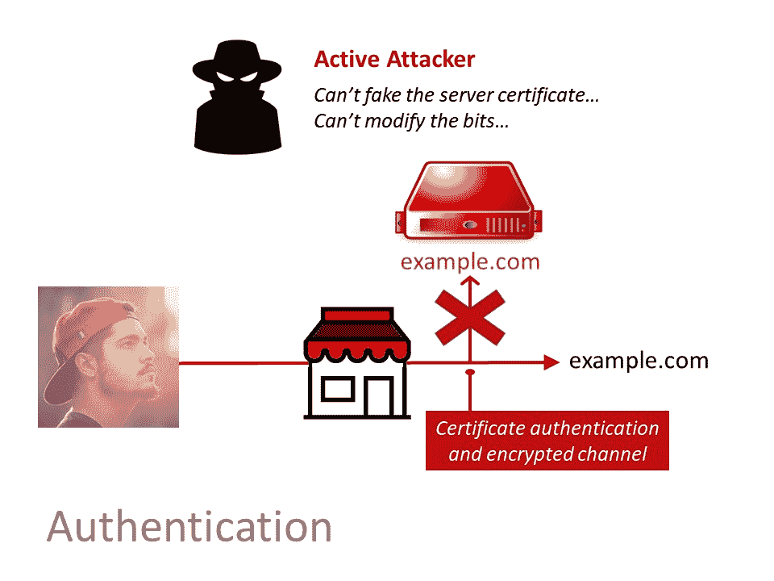

客户端和服务器之间的连接无法被劫持。如果恶意行为者试图劫持会话，客户端和服务器都知道有问题，对话就会结束。

# 完整性

因为连接是加密的，第三方演员无法篡改数据，所以每一端都知道数据是有效的。这是因为中间人攻击被阻止了。

你不仅需要担心坏人。第三方内容，如广告，可能会在 HTTP 的任何地方注入响应中。例如，ISP 或你当地的咖啡馆可能会修改请求和响应，将你重定向到不同的服务器或更改你查看的内容。

HTTPS 保证了客户和服务器对会话包含真实数据的信心。当使用 HTTP 时，无法保证客户端或服务器接收到的数据是正确的。

# 浏览器正不遗余力地向客户表明 HTTPS

你有没有注意到浏览器地址栏中的那些挂锁？你可能注意到了，但你直到觉得有点不对劲时才真正考虑它。近年来，浏览器逐渐提高了普通消费者的用户体验：

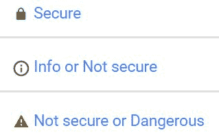

很快，Chrome 将开始明确显示页面包含密码或信用卡字段的情况。如果这些字段存在且不是通过 HTTPS 提供的，它们将显示一个大红色的视觉警告，提示客户该页面不安全。

最近，Chrome 在隐身模式下加载使用 HTTP 的网站时开始显示警告，如下面的图片所示：

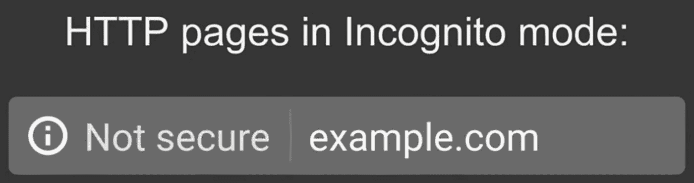

Chrome 并非唯一在网站未使用 HTTPS 提供服务时增加视觉提示的浏览器：Microsoft Edge、FireFox 和 Opera 都已宣布计划增加视觉提示。这当然会导致越来越少诈骗成功，但也会减少合法的商业转化，因为它们忽视了 HTTPS 的应用。

# 搜索引擎优化

谷歌和其他搜索引擎已经公开表示，他们认为 HTTPS 网站比信息相同但不安全的网站更具权威性。原因有两个。首先，普通网络冲浪者会更信任 HTTPS 网站而非非 HTTPS 网站。这可能只是一个简单的博客，也可能是一个巨大的银行——无论网站是什么，对安全的感知都至关重要。

独立调查显示，HTTPS 与更高的排名之间存在关联（见[`backlinko.com/search-engine-ranking`](https://backlinko.com/search-engine-ranking)）。这很有道理，因为搜索排名信号与更好的用户体验高度相关。HTTPS 是一个用户体验因素，因为它向消费者传达了信任。

因此，即使你的网站不处理*敏感*信息，你也应该实施 HTTPS，以增强访客对你品牌和搜索引擎排名的信心。

第二个原因是，搜索引擎推动企业和组织实施 HTTPS 是为了验证所有权。没有某种所有权验证，你无法安装合法的 TLS 证书。证书颁发者会发送一封电子邮件，根据域名的 WHOIS 记录触发验证过程。当你注册域名时，你必须提供真实的联系信息，包括一个有效的电子邮件地址。

恶意分子倾向于使用虚假或错误的联系信息注册域名，这样他们就无法被追踪。通过要求 HTTPS，搜索引擎表明对网站所有权有一定的信任。

随着网络向 HTTPS 作为默认方式发展，垃圾网站将越来越少。恶意分子不会轻易获得 SSL 证书。

# 已不再具有成本障碍

自从 SSL 开始以来，证书就伴随着成本。通常，这是一个年度成本。在过去（大约 15 年前），证书通常每年花费 100 到 500 美元。你可以把它想象成年度营业执照。事实上，为了完成证书请求，你通常需要提供业务或组织的证明。颁发过程也是耗时耗力的。通常需要 3-14 天才能获得证书。颁发机构有一支评估每个证书请求及其相关文件的员工。对于一个数字平台来说，这是一个非常古老的过程。

虽然企业对每年 100 美元的网站费用并不在意，但普通小型企业却会感到压力。对于每一家企业，都有成千上万家小型企业。除了传统的小型企业，还有数百万的企业、博客、论坛和其他实体，它们的网站几乎没有或没有收入。它们几乎无法证明其托管费用的合理性。以那样的价格，HTTPS 根本不可行。

另一个你可能没有考虑到的成本是 IP 地址。最初，SSL 需要一个专用的 IP 地址。尽管有数百万个可能的 IP 地址，但仍然不够，甚至远远不够。IP 地址的有限供应也提高了 HTTPS 的价格。这可能会给托管一个网站的成本每年增加 100 美元或更多。今天，这种情况已经改变。现在，证书映射到域名。这消除了这种税收。

今天，HTTPS 的要求和成本都已经放宽。有许多低成本证书提供商。实际上，您可以从亚马逊或 Let's Encrypt（[`letsencrypt.org`](https://letsencrypt.org)）免费获得证书。Let's Encrypt 分享的最新统计数据表明，已颁发超过 5000 万张证书。

到目前为止，我提到了 SSL，但这个名字已经不再完全准确了。**传输层安全性**（**TLS**）是今天使用的正确术语。安全协议随着时间的推移不断进化。SSL 最初是由 Netscape 创建的，现在由 AOL 拥有。

为了避免潜在的法律问题，TLS 最初于 1999 年在 RFC 2246 中制定（见[`tools.ietf.org/html/rfc2246`](https://tools.ietf.org/html/rfc2246)）。名称变更背后的主要意图是将加密协议从 Netscape 中分离出来，使其更加**开放**和**自由**。

在一般对话中，SSL 和 TLS 是可以互换的，因为大多数人都会明白你的意思。

你实施的协议版本受限于你的服务器平台。因为 TLS 1.2 现在已经非常成熟，所以很难找到一个不支持版本 1.2 的服务器平台或浏览器。但 Qualys 有一些建议：

“SSL/TLS 家族中有五种协议，但并非所有都是安全的。最佳实践是使用 TLS v1.0 作为你的主要协议（确保在配置中缓解了 BEAST 攻击），如果服务器平台支持，则使用 TLS v1.1 和 v1.2。这样，支持较新协议的客户端将选择它们，而不支持的客户端将回退到 TLS v1.0。你绝对不能使用 SSL v2.0，因为它是不安全的。”

幸运的是，当你创建 TLS 证书时，协议版本由你处理。在本章的后面部分，我将介绍在 AWS 和 Let's Encrypt 创建证书的步骤，这两个都是免费服务。

# 现代 API 需要 HTTPS

我们目前处于技术发展的一个阶段，新的高价值 API 和功能正在快速添加。这包括服务工作者和 HTTP/2，两者都需要 HTTPS。WebRTC 和现在的地理位置也都需要 HTTPS。任何处理个人信息的 API 要么是，要么很快就会在 HTTPS 后面受到限制（[`www.chromium.org/Home/chromium-security/deprecating-powerful-features-on-insecure-origins`](https://www.chromium.org/Home/chromium-security/deprecating-powerful-features-on-insecure-origins)）。

虽然这些 API 可以在没有 HTTPS 的情况下工作，但安全性将这些特性包裹在信任之中。想想看——平台让你集成得越深，它们对你的应用程序的要求就越高。

要求使用 HTTPS 确保最小程度的安全和信任，因此足以让潜在的平台相信你不会做坏事。

# HTTPS 可以比 HTTP 快得多

一些旨在使网站更快的技术的确只与 HTTPS 一起工作。一个例子是称为 HTTP/2 的协议增强。通过 HTTP 与 HTTPS 测试来查看这一功能如何发挥作用（详情见[`www.httpvshttps.com/`](https://www.httpvshttps.com/)）。

当我第一次看到研究显示 HTTPS 更快时，我承认我持怀疑态度。我看到加密在网络瀑布中增加了多少时间。幸运的是，管理浏览器和网络堆栈的人们为我们做了好事，并平滑了许多导致 SSL 比非 SSL 慢的问题，如下面来自谷歌的 Adam Langley 的引言所示：

"在我们的生产前端机器上，SSL/TLS 占 CPU 负载不到 1%，每个连接不到 10 KB 的内存，以及网络开销不到 2%。许多人认为 SSL/TLS 会占用大量的 CPU 时间，我们希望前面的数字有助于消除这种看法。"

由于 HTTP/2 通过单个连接多路复用请求，因此只需完成一次 TLS 握手。这减少了检索资产和服务器负载的时间。现在客户端和服务器只需要执行一次握手和加密周期。

HTTP/2 的目标是通过消除 HTTP/1.1 规范中的不足来提高性能。HTTP/2 通过多路复用响应、压缩头部、优先处理响应以及允许服务器端推送来实现这一点，如下面的图像所示：

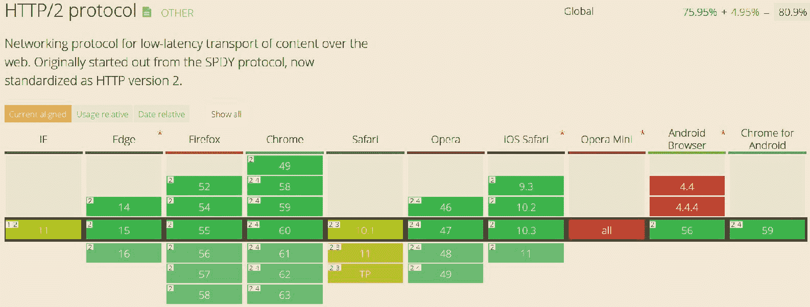

所有浏览器都支持 HTTP/2，大多数服务器也是如此。Windows 2016 是最后一个支持 HTTP/2 的主要操作系统。由于它是相对较新的，因此在网络上没有很多生产部署。

HTTP/2 不会改变任何 HTTP 语义。状态码、动词和其他此类短语是我们多年来一直在使用的，因此不会破坏现有应用程序。

标准浏览器强制执行的默认实现是 HTTP/2 over TLS。虽然技术上可以使用 HTTP/2 而不使用 TLS，但浏览器不允许这种做法。

单个连接和 TLS 握手与 HTTP/2 提供的其他性能优势相结合，意味着 TLS 始终比 HTTP 快。

# HTTPS 的采用

根据 2017 年 8 月的 Qualys 调查（见[`www.ssllabs.com/ssl-pulse/`](https://www.ssllabs.com/ssl-pulse/)），他们分析的网站中有 60.2%配置了正确的 SSL。值得注意的是，他们的调查仅限于 138,672 个最受欢迎的网站，这只是目前数亿个网站中的一小部分样本。

HTTP 档案报告称，前 500,000 个顶级网站中有 64%使用 HTTPS（[`httparchive.org/reports/state-of-the-web#pctHttps`](https://httparchive.org/reports/state-of-the-web#pctHttps)），如图所示。好消息是，两项调查都显示出更多网站使用 SSL 的积极趋势：

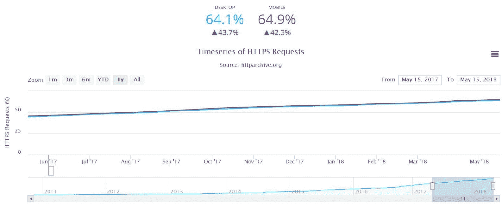

与过去不同，现在每个网站都应该使用 HTTPS 而不是纯文本 HTTP。通过 HTTPS 保护你的网站不仅仅是关于安全，它还关乎建立信任。当你实施 HTTPS 时，你不仅增加了一层安全：你的客户可以看到你对安全的承诺，并更愿意与你品牌做生意。大多数消费者和非技术人员都理解 HTTPS 的目的。他们不关心技术实现，他们关心的是信任。当你实施 HTTPS 时，你正在消除客户可能有的压力，如果你不使用 HTTPS。SSL 增加了你的整体用户体验价值，这就是为什么搜索引擎和浏览器都在推动每个人使用 HTTPS。有几个原因说明为什么你应该在每个网站上使用 HTTPS。

# 不同类型的 SSL 证书

SSL 证书可以分为两种类型：**验证级别**和**受保护域名**。

证书可以颁发给多个域名，甚至通配符域名。但由于扩展验证规范，这些证书只能颁发给单个域名，而不是多个或通配符域名。这是因为验证过程的敏感性。

根据你选择的确认身份的方法，存在几种不同类型的 SSL 证书。这三个级别在复杂性上递增，并且在验证证书所需的信息类型上有所不同。

# 域验证证书

**域验证 SSL 证书**（**DV 证书**）是最基本的，验证与 SSL 证书注册关联的域名。为了验证 DV SSL 证书，所有者（或具有管理员权限的人）通过电子邮件或 DNS 批准证书请求。

电子邮件接收者通过确认收件并发送确认给提供商来证明他们对域的行政权限。此外，他们可能需要为相关域配置某些 DNS 记录。订购和验证 DV 证书的过程可能需要几分钟到几小时。

这应该是最常用的证书类型，因为任何网站都可以快速安装它们，成本极低或没有成本。如果你的网站可能成为钓鱼或其他欺诈形式的攻击目标，你可能需要投资于需要更多身份验证的证书：

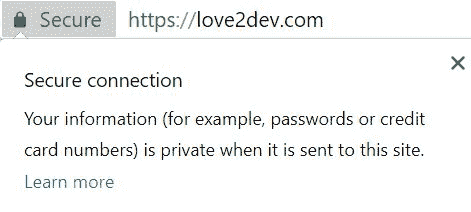

浏览器将通过绿色锁形图标在视觉上指示使用适当 HTTPS 的服务网站。域验证证书是实现这一状态所需的最基本证书。

以下截图显示了 Firefox 如何显示证书信息。这是我的当前 Love2Dev.com 证书，一个域名验证证书：

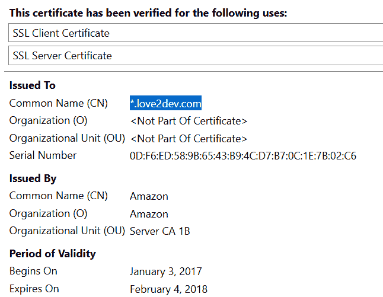

你可以看到它只列出了通用名称（域名），而将组织和组织单位留空。

# 组织验证证书

**组织验证 SSL 证书**（**OV 证书**）验证域名所有权，以及证书中包含的组织信息，如名称、城市、州和国家。验证过程与域名验证证书类似，但需要额外的文件来证明公司的身份。由于公司验证过程，订单可能需要几天的时间。

提供更多公司信息，从而向最终用户传达更多信任。大多数消费者永远不会检查证书的详细信息，但它可以帮助传达更多信任。

# 扩展验证 SSL 证书

**扩展验证 SSL 证书**（**EV 证书**）比 DV 和 OV 证书需要更多的公司数据验证。需要验证域名所有权、组织信息以及法律证明和文件。由于扩展验证过程，订单可能需要几天到几周的时间。

浏览器中的**绿色地址栏**包含公司名称是扩展验证证书的显著特征，并且是扩展验证证书的直接回报。它实际上不是一个绿色栏，但你的组织名称以漂亮的绿色字体列在地址栏中，表明这是一个受信任的网站，如下面的截图所示：


将扩展验证证书与前面的示例进行比较，组织和组织单位字段具有属性，如下面的截图所示：

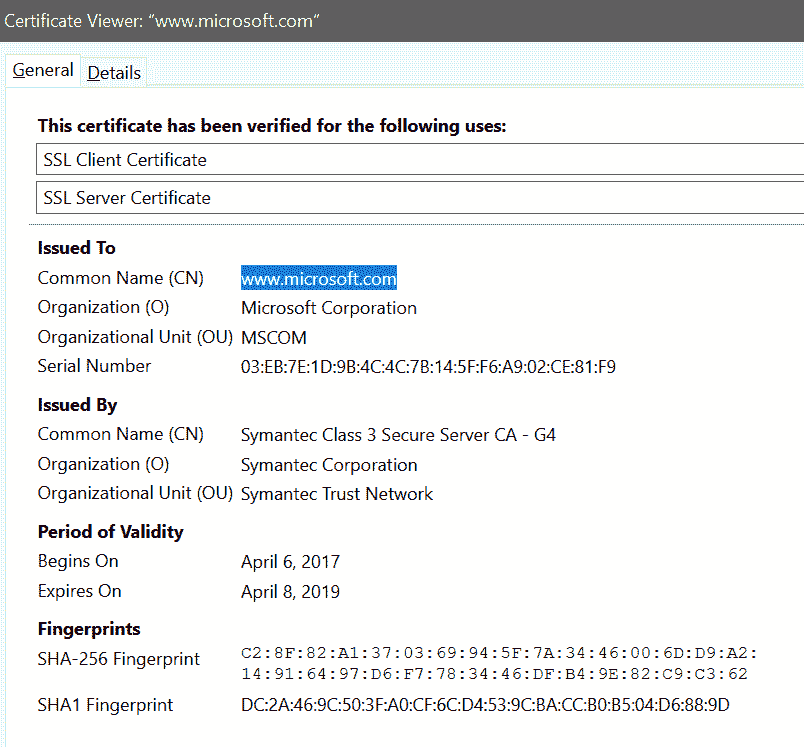

OV 和 EV 证书类型并不反映加密级别的提高；相反，这些反映了网站域名所有者/公司的更严格验证。一个好的规则是，你网站管理的敏感数据越多，你应该使用的验证级别就越高。

如果你使用的是组织或扩展验证证书，请确保你在证书到期前开始续订流程。这些证书由于需要仔细审查，因此发放需要花费数天甚至数周时间。如果你的证书到期，你可能会在没有适当安全保护的情况下度过数天。

# 如何获取和安装 SSL 证书

每个服务器平台都有自己的步骤来生成证书请求和安装已发行的证书。但常见的步骤包括以下内容：

1.  生成**证书签名请求**（**CSR**）

1.  从 CA 订购 SSL 证书

1.  从 CA 下载中间证书

1.  在服务器上安装中间证书

今天可以选择多个证书颁发机构，例如 GeoTrust、DigiCert、Symantec 和网络解决方案。你可以比较他们的价格以及他们提供的证书类型，以找到最适合你的解决方案。我们将在本章后面回顾不同类型的证书。

传统上，你从你的 web 服务器软件或管理面板生成一个未签名的密钥。这通常是一个包含加密字符串的文件。你将此文件作为订单过程的一部分提交给 CA。

一旦验证过程完成，CA 将颁发证书，另一个文件。然后你的 web 服务器允许你为该网站安装证书。

今天，这个过程已经变得更加自动化。许多人将其作为一个包含在 web 服务器控制面板中的自动功能。许多人包括自动的 LetEncrypt.org 证书。

WordPress ([`wordpress.com/`](https://wordpress.com/))是采用 HTTPS-only 政策的最大玩家。他们在 2017 年使用内置的 Let's Encrypt 工具将他们托管的所有网站升级到 HTTPS。

亚马逊 AWS 为 Cloud Front 和他们的网络负载均衡器服务提供免费的证书。这些是域名验证证书，处理大约需要 30 秒；这是自 90 年代中期以来 SSL 世界发展到一个新高度的又一光辉例子。

# 将网站迁移到 HTTPS

无论你有一个新网站还是现有网站，你应该有一个系统来确保你的网站正确地实现了 HTTPS。安装证书只是这个过程的开端。你必须确保网站的不同方面都正确地引用 HTTPS。

这包括你页面中的链接，处理指向你网站的链接，以及你的分析和搜索引擎配置文件。

即使你的网站使用 HTTPS，任何包含 HTTP 内容的页面的 HTTP 部分都可能被攻击者读取或修改。当一个 HTTPS 页面包含 HTTP 内容时，它被称为**混合内容**。你可能认为页面是安全的，但它并不是因为混合内容。

当一个页面包含混合内容时，浏览器会有视觉提示来提醒用户该状态不安全。你不能仅仅依靠在地址栏看到 https 来信赖——寻找绿色的锁。以下截图显示了浏览器栏中的不安全 URL：

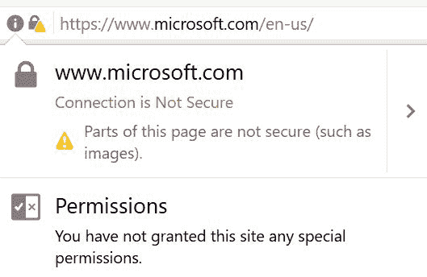

这张图片显示，尽管网站是通过 HTTPS 加载的，但微软的主页并不安全。它包含了对不安全资产的引用。以下截图是可能引起问题的示例：

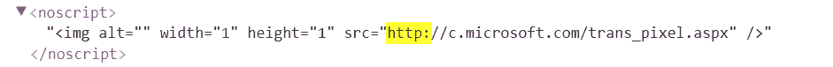

迁移你的网站不仅仅是清理资产引用。本节应该是一个指南或清单，帮助你为你的网站定义一个 HTTPS 迁移策略。

作为额外的好处，这个列表可以作为你完整网站就绪检查单的一部分，因为它包括了一些经常被忽视的最佳实践。

# 审计网站中的任何 HTTP://链接引用

无论你有一个单页网站还是包含数百万个 URL 的网站，你都需要审计每一页的外部`http://`链接引用。这包括锚点标签以及你文档头部可能有的任何链接标签。

所有第三方托管资产，如 CSS、JavaScript 库、图像和字体在公共 CDN 上，以及第三方服务，如**Google Analytics**（**GA**）**，都是 HTTP 引用的主要目标。这些通常被忽视，因为它们不是由企业“拥有”的。

到现在为止，任何值得信赖的第三方服务都提供 HTTPS 支持。如果它不支持，你可能需要要求它们提供 HTTPS，或者如果它们拒绝，你可以寻找新的提供商。

与前面的 Microsoft 示例一样，你也应该确保你网站上所有对资产的引用要么是 HTTPS，要么根本不带协议。这将更新网站并准备好任何潜在的未来协议：

```js
//:c.microsoft.com/trans_pixel.aspx
```

最佳实践是使所有引用无协议。与其将所有引用更改为`https://`，不如将它们更改为`//`。这种方法更具前瞻性，因为它使任何可能演变的未来通信协议更容易适应。

当使用无协议引用时，用户代理将其应用于资产或外部链接的主要协议。这样，用户应该有一个更无缝的浏览体验。

# 审计内容和数据

Google 建议你应该始终使用 HTTPS 协议引用外部 URL，以向排名引擎发送一个明确的信号，表明你的网站有 HTTPS。

内容，如博客或一般文本，通常通过内容管理界面由非开发者输入。这意味着原始内容或网站数据以某种形式保存在数据库中，并且不会成为源代码审计的一部分。

你可以爬取你的整个网站并生成报告。这可以通过简单的 node 模块或其他工具完成。同样，你也应该在网站持久化数据上运行脚本以查找外部 HTTP 引用。

关键是要审计你的整个网站以识别这些潜在问题。每个网站都将需要某种形式的定制审计和更新流程。我建议你尽可能自动化；这样，你可以快速更新并重复这个过程作为你构建的一部分。

更新内容后，部署（最好是到测试服务器）并审计结果。很可能会错过一些引用，需要解决这些问题。纠正这些问题并再次尝试，直到通过测试。

# 更新社交媒体链接

我想强调社交媒体链接作为前一步的常见例子。所有社交媒体网络都使用 HTTPS。由于大多数网站将社交媒体配置文件作为网站主要布局的一部分进行链接，因此这些应该是你首先更新的链接。

由于这些链接通常包含在网站页眉、页脚或两者中，它们会传播到每个页面。从源代码的角度来看，这个 app-shell 文件是一个单独的文件，在这些审计中，它通常会被忽略。

当全局更新某些内容，例如用于引用链接的协议时，你需要审计你的源代码以及你的内容。这包括每个原型文件，例如主布局文件和子布局文件。

# 配置服务器自动将 HTTP 重定向到 HTTPS

旧链接和自然消费者倾向是通过 HTTP 引用 URL。你的 Web 服务器应该配置为向用户代理发送一个 301 重定向，告诉他们永久加载 HTTPS 地址。

`301`重定向是一个永久地址更改。你正在告诉用户代理他们正在寻找的地址不再有效，而应转到新的地址。通过将 HTTP 重定向到 HTTPS，你实际上在告诉全世界不再请求不安全的内容。

这个过程因 Web 服务器而异，因此请查阅你平台的文档以获取更多指导。大多数服务器可以通过简单的设置来完成此操作。

如果你正在使用内容分发网络，并且你应该为任何消费者网站这样做，你应该能够在你的 CDN 配置中配置此重定向。

`301`重定向通过接收用户代理的请求并在服务器的响应中包含一个 301 头来实现。例如，对`www.example.org`的 HTTP 请求看起来如下：

```js
GET / HTTP/2
Host: www.example.org
```

服务器返回一个包含永久位置的`301`响应，如下面的代码所示：

```js
HTTP/2 301 Moved Permanently
Location: https://www.example.org/
```

你还应该在更改网站路由时配置适当的 301 重定向。当从 HTTP 迁移到 HTTPS 时，你正在更改网站中的每个路由。

# 在网站管理工具中添加并验证所有域名协议组合

在网站管理工具中添加和验证所有域名协议组合是另一个常被忽视的迁移任务。如果你对搜索引擎排名认真，你将使用 Google 和必应的网站管理工具正确注册你的网站。

关于这两个网站管理平台的详细信息超出了本书的范围。

最佳实践是注册你的网站可能被引用的所有四种方式。你应该为你的主域名和 www.别名注册 HTTP 和 HTTPS 版本。如果你没有全部注册，你的网站将不是完全注册的，可能会遇到一些搜索引擎排名问题。

# 定义一个规范 HTTPS 链接

你可能还会忽视的另一个 SEO 实践是定义规范链接。Google 和其他搜索引擎使用这个信号来了解内容的原始来源。在这种情况下，任何使用 HTTP URL 的引用都将被视为 HTTPS 版本的重复。以下代码为例：

```js
<link rel="canonical" href="http://example.com/foo">
```

你应该更新如下：

```js
<link rel="canonical" href="https://example.com/foo">
```

这样可以避免重复内容的惩罚，在这种情况下，这会稀释链接流量。通过定义`canonical`链接，您告诉搜索引擎将排名权威导向何处。

# 将 Google 分析更新为默认使用 HTTPS

您应该进行的另一个更新涉及您的分析服务。由于 GA 是最常见的消费者服务，我将演示如何更新 GA。

在当前的 GA 仪表板中，菜单底部有一个 ADMIN 选项，如下面的截图所示：

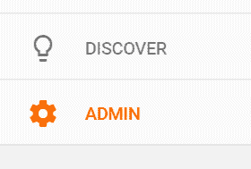

这将打开您网站的行政界面。中心列的属性有一个属性设置选项。选择它：

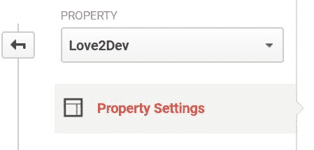

在属性设置面板中，将默认 URL 更改为使用 HTTPS 协议并保存：

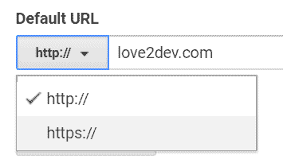

# 更新网站地图和 RSS 源到 HTTPS

就像您更新网站源代码和内容一样，您也应该确保您的`sitemal.xml`和 RSS 源已更新以使用 HTTPS。这些文件被搜索引擎和当然，任何订阅您 RSS 源的人使用。它们充当您网站的一个已知目录。

您网站地图中的链接被认为是搜索引擎的权威来源。您 RSS 源中的链接传播到订阅者，因此是许多活跃访客进入您网站的方式。确保以最佳方式引导他们进入非常重要。

# 更新您的 robots.txt 文件

如果您的`robots.txt`文件包含完整的 URL，您也应该更新这些。一般来说，如果您允许和拒绝蜘蛛访问，您包括相对路径。您最有可能有完整引用的文件是您的`sitemap`文件：

```js
User-Agent: *
Disallow:

Sitemap: https://example.com/sitemap.xml
```

虽然不太常见，但一些网站为搜索引擎蜘蛛维护一个`disavow`文件。他们这样做是为了避免负面链接的惩罚。此文件也应更新为使用`https://`，这加强了网站协议配置文件与搜索引擎的联系。

# 摘要

正如您所看到的，HTTPS 的实施很重要，但确实需要您的一些勤奋来正确配置您的网站。随着 TLS、证书和 HTTP 的进步，之前阻碍网站实施 HTTPS 的障碍已被消除。

进步式网络应用需要 HTTPS，因为它提供了更高的用户体验。它们还需要一个注册的服务工作者，这也需要 HTTPS。HTTPS 解锁了现代网络的功能；没有它，您的网站将被限制在更小的功能集。

由于 TLS 确保客户端和服务器之间的对话不会被中间人篡改，并且因为窃听被减轻，所有网站都应该采用 HTTPS。您正在为您的客户提供一层信任，并为网络提供的最新功能打开大门。
