# 第四章：服务工作者 – 通知、同步以及我们的播客应用

在第一章，“渐进式 Web 应用简介”中，您了解到网络在移动时代的表现不足，以及为什么渐进式 Web 应用可以使您的网站达到与原生选项相当甚至更好的能力。服务工作者是渐进式 Web 应用最重要的部分，因为它们是应用的骨架。

网络清单和主屏幕图标增强了与客户建立关系和控制启动体验的能力。服务工作者在页面加载时以及页面未加载时都允许程序化地增强用户体验。

服务工作者位于浏览器和网络之间，充当代理服务器。它们提供的不仅仅是缓存层；它们是一个可扩展的骨干：

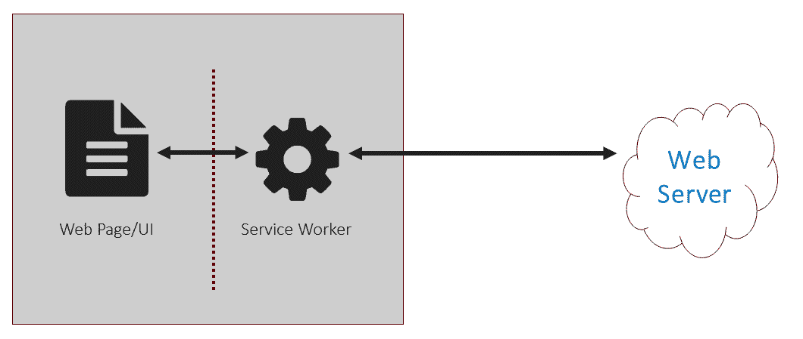

对于程序员来说，**服务工作者**是 JavaScript 文件，这使得它们对大多数 Web 开发者来说都很熟悉。这些脚本更像是 Node.js 模块，而不是网页脚本。它们在 UI 服务工作者之外的一个单独线程上执行，因此它们无法访问 DOM。

服务工作者编程模型比您可能用于用户界面的模型更功能化。将服务工作者编程与无头节点比较是有意义的，因为服务工作者编程用于执行计算，许多任务传统上是为 Web 服务器保留的。

服务工作者与 UI 脚本也有所不同，因为它们是完全异步的。这意味着一些 API，如 XHR 和 localStorage，不支持。相反，您应该使用 Fetch API 和**索引数据库**（**IDB**）来与 API 和持久化数据连接。当浏览器支持服务工作者时，它们也必须支持 promises，提供自然的异步接口。

关于`XMLHttpRequest`的注意事项，当从客户端发起时，请求会通过服务工作者。您不能从服务工作者中发起 XHR 请求。

服务工作者被设计成一个可扩展的平台，允许随着时间的推移添加额外的 API。缓存是规范中详细说明的唯一扩展 API。原生推送通知和后台同步是服务工作者启用的一些额外 API 示例。未来，您可以期待添加更多 API。

缓存使得离线和即时资产加载成为可能。我认为描述这个功能的最佳术语是浏览器中的代理服务器。高级服务工作者几乎像是一个完整的 Web 服务器堆栈。一个精心制作的服务工作者可以承担目前分配给 ASP.NET、Node Express、Ruby 等任务的渲染责任。

上一章介绍了如何为您的网站添加 HTTPS。如果您之前还没有被这个概念说服，现在应该会了。服务工作者也需要 SSL。服务工作者需要 SSL 的主要原因是为了启用需要更高信任级别的 API 和其他功能。

已启用的强大服务工作者可能被用于邪恶目的。除了需要 SSL 之外，它们的作用域也限制在单个域。它们没有能力操纵域之外的内容。

这是一件好事，因为第三方脚本无法注册服务工作者并对您的网站造成破坏。

表面上看，这可能看起来很简单，但掌握服务工作者需要一定的技巧。以下章节旨在为您提供创建能够增强任何网站的服务工作者所需的基础知识。

在本章中，您将学习：

+   服务工作者线程模型

+   服务工作者浏览器支持

+   示例播客应用程序的工作原理

+   fetch API 简介

+   如何创建基本服务工作者

+   服务工作者生命周期

+   服务工作者缓存基础

+   如何使用推送通知

+   背景同步编程简介

# 服务工作者线程

服务工作者在 UI 之外自己的上下文或线程中运行。因为服务工作者线程与 UI 分离，所以它无法访问 DOM。

服务工作者的作用域是事件驱动的，这意味着平台（根据您的观点，是浏览器或操作系统）启动服务工作者。当服务工作者启动时，它是以响应某个事件为目的，例如网页打开、推送通知或其他事件。

进程保持活跃足够长的时间以服务需求。这个时间由浏览器决定，并且因平台而异。服务工作者规范中没有定义固定的时间。

在与正常 JavaScript 不同的上下文中运行为服务工作者提供了许多优势。首先，服务工作者脚本不会阻止 UI 渲染。您可以使用此功能将非 UI 工作卸载到服务工作者。我们将在后面的章节中看到一个示例，展示如何使用客户端模板在服务工作者而不是 UI 线程中渲染标记。

这为您提供了将任务分离到更合适的线程中的方法。现在，您可以在响应 API 调用时执行计算，如数学或渲染标记，然后将结果返回到 UI 线程以更新 DOM。

服务工作者可以通过消息 API 与 UI 线程通信。您可以在线程之间传递文本消息。您还可以在它们到达 UI 线程之前修改来自服务器的响应。

像推送通知这样的功能之所以可行，是因为服务工作者在自己的上下文中执行。服务工作者可以响应操作系统触发的事件而启动，而不是因为页面加载。

在过去，基于 Web 的推送通知可以通过使用 Web 工作者来实现。这些工具很棒，但只有在浏览器打开时才会执行。服务工作者与之不同，因为操作系统可以因为外部刺激而启动它们。唯一真正的要求是客户端设备应该处于开启状态。

# 服务工作者浏览器支持

服务工作者是一项相对较新的技术，因此人们常常会问：使用服务工作者是否安全？我们真正想问的是，有多少浏览器支持服务工作者？

好消息是所有主要的浏览器都已经发布了基本的服务工作者支持。Chrome 一直是领导者，因为他们在很大程度上负责启动这一概念并管理规范。这项技术得到了包括微软、Firefox、三星和 Opera 在内的其他浏览器厂商的热烈支持。

截至 2018 年春季，所有现代浏览器都已向普通消费者发布了更新，至少支持服务工作者缓存功能。当然，旧浏览器不会支持服务工作者。但随着消费者升级手机和笔记本电脑，它们的用量正在减少。

# 微软 Edge 服务工作者支持

在 2017 年 9 月的 Edge Web Summit 上，微软宣布他们将在标志后发布服务工作者支持。目标是解决实现中的任何错误，在向普通消费者发布支持之前。

2018 年春季，随着 Windows RS4 的发布，服务工作者的支持被推向了普通消费者。

# Safari 服务工作者支持

如果您不熟悉苹果如何宣布 Web API 支持，他们不会这样做。新功能会悄悄发布，至少在大多数情况下，留给开发者去发现。

在一个令人惊讶的发布中，苹果在 2018 年 3 月更新了 Safari，以支持服务工作者：

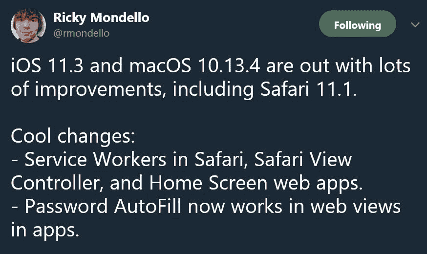

Safari 服务工作者支持存在一些限制。目前，它们不支持原生推送通知或后台同步。我不认为这些缺失的功能是避免在您的应用程序中集成它们的原因。记住，渐进式 Web 应用是关于利用可用功能的。您仍然可以创建可行的解决方案来绕过这些功能。

# 服务工作者是否准备好了？

*杰克·阿奇博尔德*维护一个 GitHub 网站，跟踪每个主流浏览器对服务工作者相关功能的支持（[`jakearchibald.github.io/isserviceworkerready/`](https://jakearchibald.github.io/isserviceworkerready/))，称为*is* service worker Ready*。

该网站有行，专注于每个主要服务工作者功能和它们的要求，以及每个浏览器的图标。灰度浏览器图标表示支持尚未发布。背景为黄色的图标表示已发布部分支持。绿色背景表示对功能的完全支持：

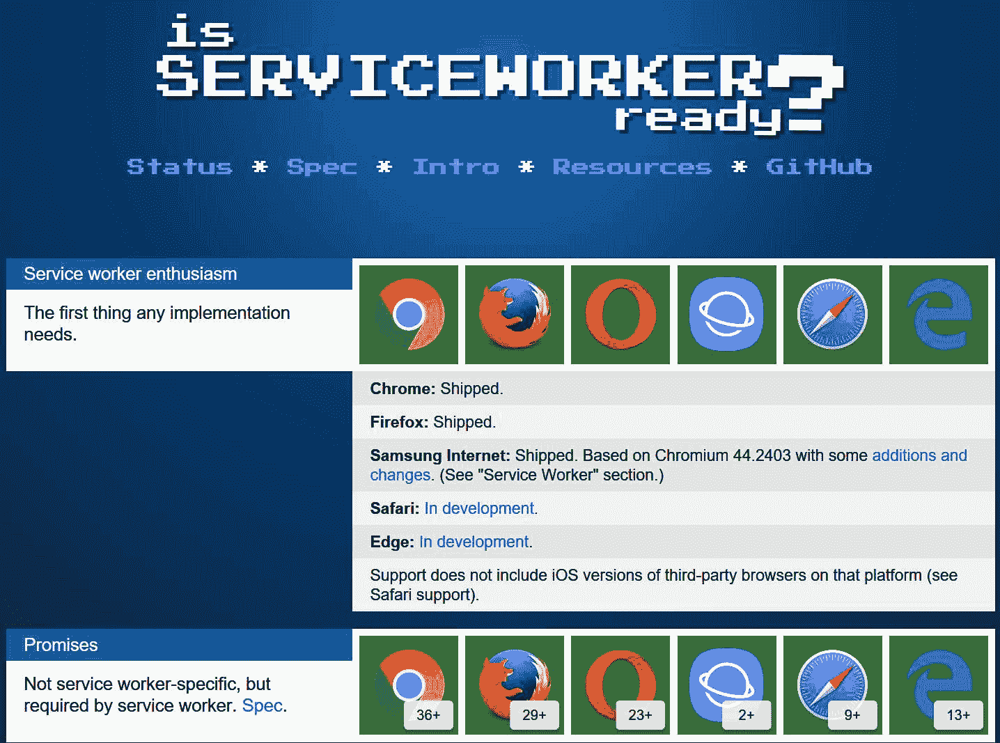

如您所见，主要的浏览器厂商都支持服务工作者（service workers）。

现在所有现代浏览器都支持服务工作者，你可能认为没有必要担心不支持服务工作者的浏览器。但仍有相当一部分浏览器会话使用 Internet Explorer 和遗留的 Android 浏览器。这意味着你可能需要考虑回退选项。

# Polyfilling 更旧的浏览器

Polyfills 是你可以按需引用的库或回退，用于向不支持现代功能的浏览器添加对现代特性的支持。并非所有现代特性都可以通过 Polyfills 实现，但许多可以。有些不是直接的 Polyfills，而是利用其他 API 来创建所需体验。

好消息是你可以将服务工作者缓存 Polyfill 到一定程度。这可以通过 `IndexedDB` 实现。你需要额外的 JavaScript 层来管理网站的资产和 API 调用。我们将在高级缓存章节中涉及此技术。

除了使用 `IndexedDB` 缓存资源外，你还可以使用 `appCache` 作为离线和资源缓存的回退。

推送通知无法通过 Polyfills 实现，但你可以利用替代的通知媒介。短信文本和 Web Worker 通知可以为业务与客户互动提供方式。

# 播客应用程序

本章向您介绍不同的服务工作者概念和功能，如服务工作者生命周期、缓存和推送通知。为此，我们将构建一个简单的播客应用程序。此应用程序将展示如何处理服务工作者生命周期和响应缓存：

最基本的播客应用程序需求包括：

+   快速加载

+   搜索播客

+   收藏播客

+   播放音频文件

+   持久化剧集以供离线收听

应用程序需要一些服务器端的支持，对于我们来说，这将是一组我从公共来源获取的快照数据。这些数据是项目仓库的一部分 ([`github.com/docluv/PWAPodcast`](https://github.com/docluv/PWAPodcast))，因此你可以重新创建应用程序。

你将学习如何注册服务工作者、服务工作者生命周期的基本知识、服务工作者缓存的工作原理以及如何使用 `IndexedDB` 持久化数据。你还将看到如何利用服务工作者缓存和 `IndexedDB` 持久化 MP3 媒体文件。

播客应用程序源代码按文件夹组织，这些文件夹与每个章节的进度相关联。根文件夹包含定义运行本地 Web 服务器的 Grunt 任务等常见文件，就像 2048 应用程序一样。

在每个章节的文件夹中，有用于资产（如 CSS、JavaScript 和图像）的文件夹。每个路由都有一个包含单个 `index.html` 文件的文件夹。这允许应用程序使用无扩展名的 URL。数据文件存储在 API 文件夹下。

应用程序由以下页面组成：

```js
/ (home)
/podcasts/
/podcast/{slug}
/episode/{slug}
/search?q={term}
/later/
```

每个页面都是一个静态页面，作为网站构建过程的一部分预先渲染。背后的逻辑超出了本书的范围。

应用程序的数据来自 iTunes API。它确实需要一些数据处理才能在应用程序中使用。如果您想使用或研究这些数据，我已经将这些原始数据文件包含在 GitHub 仓库中。

苹果的数据模型需要转换为应用程序。而不是建立一个 Web 服务器来托管正式的 API，数据存储在一系列 JSON 文件中。应用程序将根据需要引用这些文件。

服务工作者位于应用程序的根目录中。这个文件是本章的核心，我们将花费大部分时间在每个章节中修改它。它将演示服务工作者生命周期和基本缓存概念。

您可以尝试完成的版本，请访问[`podcast.love2dev.com`](https://podcast.love2dev.com)：

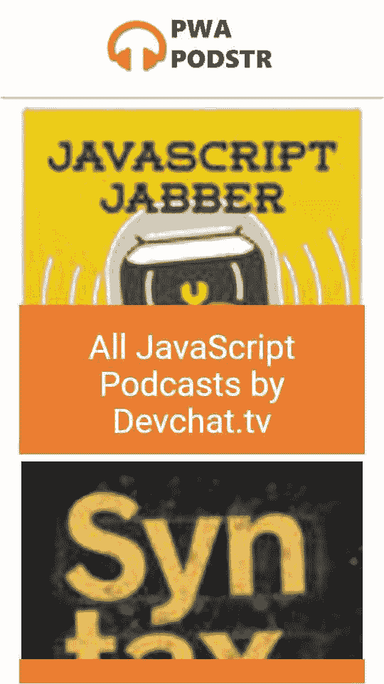

PWA Podstr 的首页

首页包含用户订阅的播客列表。这是通过 API 调用检索列表来填充的。然后使用`Mustache`在浏览器中渲染。所有 API 数据都是一组 JSON 文件，因此不需要编写杂乱的代码来连接和建立数据库：

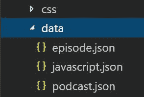

播客页面显示了播客的详细信息以及最近集锦的列表。播客数据也是通过 API 调用检索的：

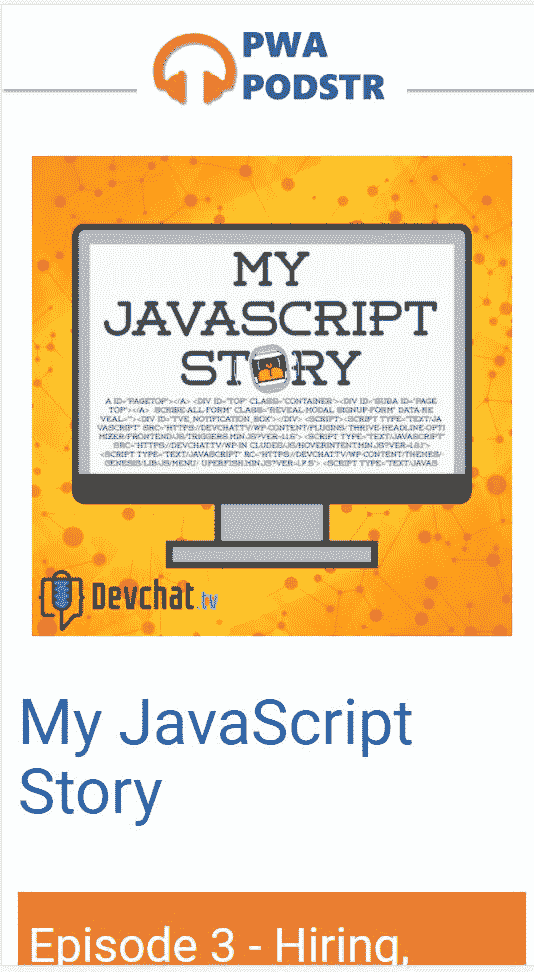

集锦页面列出了集锦的标题和描述。它包括一个播放 mp3 文件的 AUDIO 元素。同样，页面在从服务器检索数据后进行渲染：

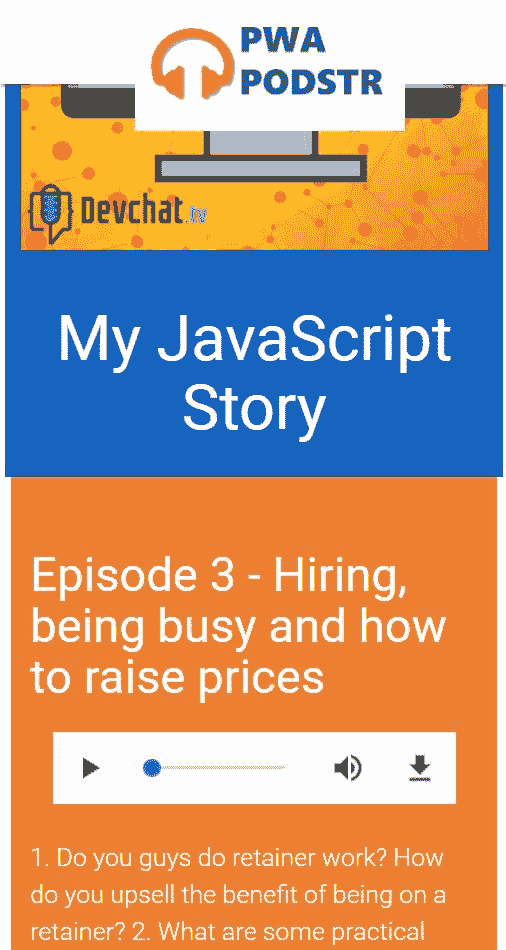

# Fetch API

回到 1996 年，Internet Explorer 引入了*iframe*元素，作为在网页中异步加载网页内容的一种方式。在接下来的两年里，这个概念发展成了我们现在所知道的`XMLHttpRequest`对象的第一种实现。

当时，它被称为`XMLHTTP`，并首次在 Internet Explorer 5.0 中发布。不久之后，Mozilla、Safari 和 Opera 都发布了我们现在称之为`XMLHttpRequest`的实现。

到目前为止，网页是静态的，当用户在同一个站点内从一个页面导航到另一个页面时，需要整个页面重新加载。

在 2004 年，谷歌开始在 Gmail 和 Google Maps 中广泛使用我们现在称之为**AJAX**的技术。他们向我们展示了如何利用浏览器对服务器的请求以及如何根据服务器的有效载荷来操作 DOM。这通常是通过调用返回 JSON 数据的 API 来完成的。

就像任何技术一样，随着它的使用，**实施者**在处理使用过程中暴露的问题时会感到沮丧。为了应对新的用例和问题，技术会更新，通常是通过发布新版本。

有时，这些更新如此重大，以至于新的技术、产品或实现取代了第一个版本。

`XMLHttpRequest`提供了一种机制来对服务器进行异步调用，但它基于十年前网络和浏览器的工作方式。

今天，网络在许多方面都得到了扩展。我们现在普遍支持的一个特性是 JavaScript Promises。我们也对可以使用异步调用服务器的内容类型有了更深入的了解，这些内容类型是我们当初在 AJAX 最初被指定时没有考虑到的。

# 介绍 Fetch

在确定了`XMLHttpRequest`对象的常见限制之后，Fetch API 被标准化，以提供一种新的、经过深思熟虑的方式来实现异步 HTTP 请求。

Fetch API 是制作 AJAX 调用的一种全新的方式。它被创建出来是为了解决我们开发者为了处理`XMLHttpRequest`限制而进行的许多黑客式和绕道工作。主要区别在于，当使用 Promises 时，Fetch 是异步的。

它最初在 2016 年春季开始看到浏览器实现，现在所有现代浏览器都广泛支持。如果你还没有开始使用 Fetch 来制作异步 HTTP 请求，你应该尽快开始迁移。

Fetch 与`XMLHttpRequest`对象区别的三个关键特性是更简单的语法、原生的 promise 支持和能够操作请求和响应：

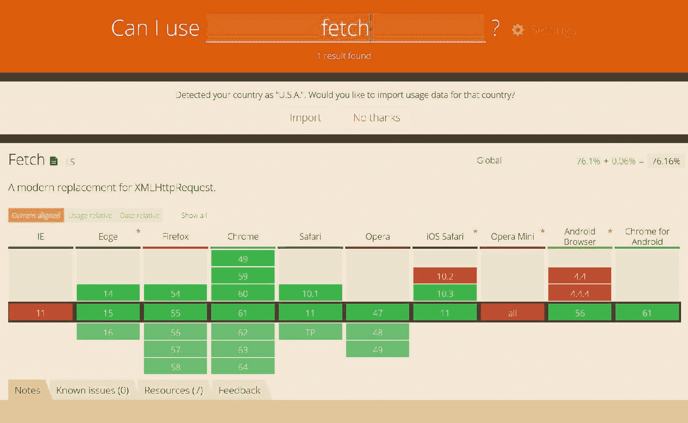

# 使用 Fetch API

由于 AJAX 已经成为驱动 DOM 操作的一种流行方式，让我们看看如何使用 Fetch 来实现这一点。这将会是一个稍微人为构造的例子，其中 Podcast 的标志被获取并设置到相应的`IMG`元素中：

```js
var logo = document.querySelector('.podcast-logo');

fetch("…/600x600bb.jpg").then(function(response) {
  return response.blob();
}).then(function(logoBlob) {
  var objectURL = URL.createObjectURL(logoBlob);
  logo.src = objectURL;
});
```

如果你熟悉如何组合`XMLHttpRequest`，这个例子看起来应该非常干净和简单。你首先会注意到，唯一需要的参数是一个 URL。这是 fetch 的最简单形式。

这段代码做的是同样的事情，但使用了`XMLHttpRequest`对象：

```js
var xhr = new XMLHttpRequest();

xhr.open("GET", "…/600x600bb.jpg", true);  
xhr.overrideMimeType('text/plain; charset=x-user-defined');
xhr.send(null);

xhr.onreadystatechange = function() {
    if (xhr.readyState == 4){
      if ((xhr.status == 200) || (xhr.status == 0)){
            var logo = document.querySelector('.podcast-logo');
            logo.src = "data:image/gif;base64," + 
            encode64(xhr.responseText);
      }else{
            alert("Something misconfiguration : " +
            "\nError Code : " + xhr.status +
            "\nError Message : " + xhr.responseText);
      }
    }
};
```

这并不完全干净，也不是异步的。这个例子相当简单。在大多数情况下，AJAX 请求需要更多的复杂性。

`fetch`方法返回一个 promise，它解析一个响应对象。这代表的是响应，而不是我们想要的图片。通过调用 blob mixin 来访问图片，它也返回一个 promise。

Blob 是图片，然后可以使用`URL.createObjectUrl`函数将其字节转换为可用的图片格式，并将其应用于图片的 src 属性。

虽然这个例子是人为构造的，但它展示了 Fetch API 的多个方面，你应该熟悉这些方面。API 提供了一个简单的表面来发起请求，但它允许你实现非常复杂的请求处理逻辑。

除了`fetch`方法外，API 还指定了请求、响应和头对象。还有一个 body mixins 集合，用于操作不同的响应类型。

你不仅可以向`fetch`方法传递 URL，还可以传递一个组合的请求对象。请求对象包含进行网络请求的值。

请求构造函数有两个参数，即 URL 和一个可选的选项对象。你也可以提供一个现有的请求对象，这听起来可能有些奇怪，但随着你对服务工作者学习的深入，你会意识到这将成为一个常见的起点。

选项参数可以包含以下属性：

+   `method`：HTTP 请求方法：`GET`、`POST`、`PUT`、`DELETE`等。

+   `headers`：自定义请求头，可以是头对象或对象字面量。

+   `body`：你想要添加到请求中的任何主体：一个`Blob`、`BufferSource`、`FormData`、`URLSearchParams`、`USVString`或`ReadableStream`对象。

+   `mode`：请求模式，例如，`cors`、`no-cors`、`same-origin`或`navigate`。默认是`cors`。

+   `credentials`：你想要用于请求的请求凭据：omit、same-origin 或 include。

+   `cache`：类似于 Cache-Control 头中使用的属性。这告诉浏览器如何与本地缓存交互。

其他不太常见的属性是 cache、redirect、referrer 和 integrity。

我们可以使用前面的示例并扩展它以使用自定义请求对象：

```js
var logoHeaders = new Headers();
logoHeaders.append('Content-Type', 'image/jpeg');

var logoInit = { method: 'GET',
                  headers: logoHeaders,
                  mode: 'cors',
                  cache: 'default'
         };

var logoRequest = new Request("…/600x600bb.jpg", logoInit);

fetch(logoRequest).then(function(response) {
  return response.blob();
}).then(function(logoBlob) {
  logo.src = URL.createObjectURL(logoBlob);
});
```

你应该注意，fetch 方法只有在出现网络错误时才会拒绝。当抛出异常时，网络无法访问，例如，当设备离线时。它不会因为非 2XX 状态码而失败。

这意味着你必须验证响应是良好的、未找到、重定向还是服务器错误。你可以构建一个健壮的逻辑树来处理不同的状态码。如果你只需要响应良好的请求，你可以使用`response.ok`属性。

如果响应的状态是 200-299，即良好，那么 ok 属性为真。否则，为假。

你应该以不同的方式处理异常和具有状态码的响应。例如，如果一个响应的状态码是 403，那么你可以重定向到一个登录表单。404 状态应该重定向到一个未找到页面。

如果出现网络错误，你可以触发适当的视觉响应，如错误消息或触发应用程序的离线模式体验。

# 响应对象

fetch 方法解析响应对象。这与请求对象类似，但有几个区别。它代表对请求的服务器响应。

响应对象具有以下属性：

+   `headers`：头对象

+   `ok`：指示状态是否在 200-299 范围内

+   `redirected`：指示响应是否来自重定向

+   `status`：HTTP 状态码，例如，200 表示良好

+   `statusText`：对应代码的状态消息

+   `type`：响应类型，例如，cors 或 basic

+   `url`：响应 URL

+   `bodyUsed`：一个布尔值，指示主体是否已被使用

你还应该了解以下几种方法：

+   `clone`：创建响应对象的副本

+   `arrayBuffer`：返回一个解析为`arrayBuffer`的承诺

+   `blob`：返回一个解析为 blob 的承诺

+   `formData`: 返回一个解析为 `formData` 对象的承诺

+   `json`: 返回一个解析正文为 JSON 对象的承诺

+   `text`: 返回一个解析正文为承诺

之前的示例展示了如何使用 blob 方法创建图像。网络应用程序更常见的任务是从 API 获取数据。通常，响应是文本，包含 JSON。

在播客应用程序中，一个常见的用户任务是在播客和剧集之间进行搜索。我们的播客应用程序在布局标题中集成了搜索表单。它绑定了一些逻辑来调用 API 并返回一组结果。

Podstr 应用程序使用单个 JSON 文件作为示例搜索结果。这样做是为了我们不需要构建服务器端搜索基础设施。生产应用程序将有一个更正式的设置。

搜索结果格式化为包含两个数组，一个是匹配的播客列表，另一个是匹配的剧集列表：

```js
[
      podcasts: [
            {…}
],
      episodes: [
            {…}
]
}
```

搜索结果通过在模板上渲染结果来在搜索页面上显示。检索结果是通过使用 JSON 方法的 fetch 请求完成的：

```js
var searchResults = document.querySelector('.search-results');

fetch("api/search?term={term}").then(function(response) {
  return response.json();
}).then(function(results) {
  renderResults(results);
});
```

`renderResults` 函数将结果对象通过 `Mustache` 模板运行，并将渲染的标记分配给 `search-results` 元素：

```js
    function renderResults(results) {

        var template = document.getElementById("search-results-
        template"),
            searchResults = document.querySelector('.search-results');

```

```js
            searchResults.innerHTML =             
            Mustache.render(template.innerHTML, results);

    }
```

如果你不太熟悉 `Mustache`，它是一个极简模板引擎。渲染方法接受一个 HTML 模板，并将 JSON 对象合并以生成标记。如果你想了解更多关于使用 `Mustache` 的信息，请访问 GitHub 页面 ([`github.com/janl/mustache.js/`](https://github.com/janl/mustache.js/))。

搜索页面展示了如何动态组合页面进行 API 调用。这在今天的网络应用程序中很常见。我们不再来回走动，让服务器根据操作（如提交表单）渲染新的标记。

相反，我们迁移到了一个演变成我们通常称为的单页应用程序的模式。页面不再是静态体验，我们可以动态地更改它们。

能够在不进行完整往返的情况下向服务器发起 API 调用。Fetch 使得这成为可能，并且比之前更简单。模板库如 `Mustache` 使得在客户端渲染标记变得简单。

如果你熟悉 jQuery 的 ajax 方法，你会注意到与 fetch 的一些相似之处。但也有一些关键的区别。

从 `fetch()` 返回的承诺不会在 HTTP 错误状态上拒绝，即使响应是 HTTP 404 或 500 错误。相反，它将正常解析（`ok` 状态设置为 false），并且只有在网络失败或任何阻止请求完成的情况下才会拒绝。

默认情况下，fetch 不会从服务器发送或接收任何 cookies，如果网站依赖于维护用户会话（要发送 cookies，必须设置 credentials 初始化选项），则会导致未认证的请求。

# 服务工作者 fetch

服务工作者依赖于 promises 和异步 API。这消除了在服务工作者中使用`XMLHttpRequest`等平台功能。服务工作者依赖于浏览器支持 promises 和 fetch API。

对 fetch 的基本理解是服务工作者编程所需的基本技能。服务工作者允许你在网络请求发送到网络之前拦截所有网络请求。这是通过添加一个 fetch 事件处理器来完成的：

```js
self.addEventListener('fetch', function(event) {
  event.respondWith(
    caches.match(event.request)
      .then((response) =>{
        // Cache hit - return response
        if (response) {
          return response;
        }
        return fetch(event.request);
      }
    )
  );
});
```

事件处理器接收一个单一的`FetchEvent`对象。你需要了解`FetchEvent`对象的两个成员，它们是`request`和`respondWith`。

请求属性是正在发送到网络的请求对象。`respondWith`方法限制了 fetch 事件处理器。它保持事件处理器*打开*，直到响应准备好。该方法还需要返回一个响应对象。

服务工作者 fetch 事件允许你拦截对网络的请求。这种力量允许你调查请求并返回一个缓存的响应，组合一个自定义响应，或者返回一个网络响应。我们将在服务工作者缓存章节中介绍如何使用这种力量的方法。

# 在旧版浏览器中 polyfill fetch

Fetch 和其他现代 API 得到了主流浏览器的广泛支持。然而，仍然有足够的用户在使用较旧的浏览器。许多企业仍然要求员工使用过时的 Internet Explorer 版本。许多消费者对旧手机感到满意，不升级他们的设备或更新软件。

这意味着我们需要使我们的网站适应这些潜在的情景。幸运的是，许多 API 可以用 JavaScript 库进行 polyfill。Fetch 和 promises 是现代功能，可以轻松地进行 polyfill。

就像我们检测服务工作者支持一样，我们也可以检测 fetch 和 promise 支持。如果这些功能不受支持，那么我们可以加载一个 polyfill。重要的是这些 polyfills 需要按照依赖顺序加载，其中 promise 之后是 fetch，然后是任何特定于网站的代码：

```js
        var scripts = ["js/libs/jquery.small.js",
            "js/libs/index.js",
            "js/libs/collapse.js",
            "js/libs/util.js",
            "js/app/app.js"
        ];

    if (typeof fetch === "undefined" || fetch.toString().indexOf("[native code]") === -1) {
        scripts.unshift("js/polyfill/fetch.js");
    }

    if (typeof Promise === "undefined" || Promise.toString().indexOf("[native code]") === -1) {
        scripts.unshift("js/polyfill/es6-promise.min.js");
    }
```

这是一种从 HTML5 Rocks 文章中借用的异步加载脚本的技巧（[`www.html5rocks.com/en/tutorials/speed/script-loading/#disqus_thread`](https://www.html5rocks.com/en/tutorials/speed/script-loading/#disqus_thread)）。大多数时候，polyfills 是不需要的，但对于那些需要 polyfill 的情况，你需要控制脚本加载的顺序。

这种技术使用一系列脚本 URL，并遍历它们，将每个添加到 DOM 中，同时保持依赖顺序。

由于 polyfills 不是总是需要的，它们只有在必要时才添加。这是通过检查原生支持来确定的。在示例代码中，promise 和 fetch 都被检测到。如果不支持，则将它们添加到脚本 URL 数组中，并在其他脚本之前添加。

承诺也被检查，因为 fetch 依赖于 promise 支持。Podstr 应用程序只需要可能使用 fetch 和 promise polyfill。

但可能有许多 API polyfill 您的应用程序可能需要。HTML5 跨浏览器 polyfill([`github.com/Modernizr/Modernizr/wiki/HTML5-Cross-browser-Polyfills`](https://github.com/Modernizr/Modernizr/wiki/HTML5-Cross-browser-Polyfills) )存储库是一个寻找更多资源的好地方。您可以使用相同的功能检测技术根据需要添加它们。

# 创建服务工作者外壳

在第一章，“渐进式 Web 应用简介”中，我们创建了一个基本的 service worker，它预先缓存了 2048 游戏资源。在本章和接下来的章节中，我们将更深入地探讨 service worker 的细节。

服务工作者在其整体生命周期中经过几个阶段。服务工作者被注册。一旦脚本被加载，它就会触发“安装”事件。此时，服务工作者不控制客户端（浏览器标签页）。

当服务工作者被清除以控制客户端上下文时，激活事件被触发。在此之后，服务工作者完全活跃并控制任何活跃的客户端，无论是标签页还是后台进程。

合适的服务工作者利用事件生命周期来管理数据，如缓存的响应，以设置服务工作者上下文。

播客应用程序从包含安装、激活和 fetch 事件处理器的简单服务工作者脚本开始：

```js
self.addEventListener('install', (event) => {
      //install event handler
});

self.addEventListener('activate', (event) => {
      //activate event handler
});

self.addEventListener('fetch', (event) => {
      //fetch event handler
});
```

随着这些章节的进展，我们将填充代码以使用每个这些处理器。这些更新将展示服务工作者生命周期、常见的缓存技术以及其他重要的服务工作者概念。

# 服务工作者生命周期

服务工作者遵循一个已知的生命周期，允许新的服务工作者在不干扰当前服务工作者的情况下准备自己。生命周期是为最佳用户体验而设计的。

当服务工作者被注册时，它不会立即控制客户端。有一些规则旨在最小化由于代码版本差异而导致的错误。

如果新的服务工作者在期望前一个版本逻辑时控制了客户端上下文，可能会出现问题。尽管服务工作者在单独的线程上操作，但 UI 代码可能依赖于服务工作者逻辑或缓存资源。如果新版本破坏，用户的用户体验可能会受到影响。

生命周期旨在确保在会话期间，作用域内的页面或任务始终由同一服务工作者（或没有服务工作者）控制：


生命周期包括注册、安装和激活步骤。安装和激活事件可以绑定处理器以执行特定任务。

生命周期还包括服务工作者更新和注销。这两个任务可能不会经常使用，但开发者仍然应该熟悉它们的工作方式。

每个阶段都可以用于不同的处理阶段来管理服务工作者、缓存资源和可能的状态数据。下一章将详细介绍生命周期以及如何利用每个阶段来提高应用程序的性能并使其更容易管理。

你将学习如何注册、更新和删除服务工作者。你还将了解服务工作者的作用域和服务工作者客户端的定义。本章还将涵盖安装和激活事件，以便你可以添加代码来管理服务工作者的缓存和活动状态。

# 缓存

最重要的渐进式网络应用程序功能之一是能够在离线状态下工作并即时加载。服务工作者缓存实现了这种超级功能。在过去，网站可以在离线状态下运行，甚至可以通过`appCache`获得一些性能优势。

服务工作者缓存取代了`appCache`并提供了更好的程序化接口。`AppCache`因其难以管理和维护而臭名昭著。

当你的页面引用了`appCache`清单文件并且有注册的服务工作者时，服务工作者管理缓存，而`appCache`被绕过。这使得服务工作者缓存成为从`appCache`的渐进式增强，并且使用它们是安全的。

通过启用缓存，服务工作者使网络成为渐进式增强。因为服务工作者缓存 API 非常底层，它要求开发者应用自定义逻辑来管理网络资源如何被缓存和检索。

这为在你的应用程序中应用不同的缓存策略留下了很大的空间。第六章，“掌握缓存 API - 在播客应用程序中管理 Web 资源”，深入探讨了你需要掌握的核心服务工作者缓存概念。

# 使用推送通知

商业已经使用推送来吸引客户，即使他们的应用程序没有打开，也已经大约十年了。为什么不呢？研究表明，与品牌参与度和收入直接相关的数据相当令人印象深刻，这些数据与微小的中断有关。

例如，谷歌分享了以下内容：

+   通过推送通知访问的用户时间增加了 72%

+   通过推送通知到达的会员平均消费增加了 26%

+   +50% 在 3 个月内重复访问量增加

这些值都指向品牌和产品经理为什么喜欢推送通知的原因。不幸的是，直到最近，网络一直被排除在这个派对之外。许多企业选择通过原生应用程序的麻烦来发送推送通知。

Push API 为网络应用程序提供了从服务器接收消息推送的能力，无论网络应用程序是否在前台，或者当前是否在用户代理上加载。

在您的应用程序中实现推送通知需要基于服务器的服务，通常是云基础服务，如 Google Cloud Messenger 或 AWS Pinpoint。有众多提供商可供选择。

不要担心您的推送提供商。Web 推送通知基于 IETF 标准，即使用 HTTP 推送的通用事件交付（[`tools.ietf.org/html/draft-ietf-webpush-protocol-12`](https://tools.ietf.org/html/draft-ietf-webpush-protocol-12)）。请确保您的提供商符合标准，您应该不会遇到任何问题。

在撰写本书时，Chrome、Firefox、Samsung Internet 和 Opera 目前都提供了推送通知支持。Microsoft Edge 正在推出支持。苹果尚未发布 Safari 支持的时间表。

重要的一点是，每个浏览器或用户代理都独立于其他浏览器。如果客户从多个浏览器加载您的网页，每个浏览器都会注册一个服务工作者。如果每个浏览器还创建了推送通知订阅，用户可能会接收到多个通知。

这使得在您的应用程序服务逻辑中管理订阅逻辑变得很重要。这超出了本书的范围。作为生产逻辑的一部分，在尝试为推送通知注册用户之前查询您的服务器是一个好主意。有几种选项可以处理这种潜在情况，您需要确定最适合您应用程序的方案。

如果您的品牌也有提供推送通知的原生应用，那么它们也将是单独的订阅。这意味着您应该尽可能跟踪客户是否已经在设备上接收到了通知，以避免重复发送消息。

# 实现推送通知

在本节中，您将学习实现推送通知的一些基础知识：

+   如何订阅和取消订阅用户的推送消息

+   如何处理传入的推送消息

+   如何显示通知

+   如何响应用户点击通知

代码是 Podstr 应用程序的一部分。我不会介绍如何设置推送提供商，因为它们差异很大，且易于更改其管理界面。这会创造一个流动的环境，只会给读者和潜在提供商带来困惑。此外，单独强调一个提供商可能会产生不希望的偏见。大多数提供商都有当前的文档和 JavaScript SDK，可以帮助您创建服务器端环境。

如果您想建立自己的推送服务，Google Chrome 团队的马特·高恩（Matt Gaunt）已经发布了一个您可以克隆的示例服务器（[`github.com/web-push-libs/web-push`](https://github.com/web-push-libs/web-push)）。这可能作为一个不错的测试服务，但我不会将其视为生产级别的服务。

对于我们的目的，Chrome 开发者工具提供了足够的功能来触发客户端逻辑和体验。您可以在注册的服务工作者详情右侧找到一个链接来模拟推送事件：

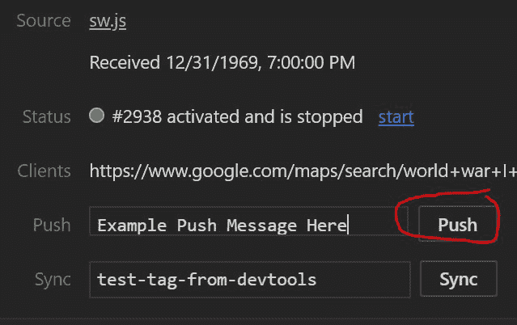

此链接触发一个带有简单负载的模拟推送消息：来自 DevTools 的测试推送消息。Podstr 应用程序将使用此事件来触发一个我们可以显示给用户的关于新播客剧集的消息。

# 设置推送通知

要启用推送通知，您需要遵循几个步骤。第一步是检测浏览器是否支持推送。如果是的话，然后您可以继续：

```js
navigator.serviceWorker.register('/sw.js').then(function (registration) {   
    if ("PushManager" in window) {
      //push is supported
    }
});
```

由于推送是在注册服务工作者之后配置的，因此您可以在服务工作者注册后检查其支持情况。就像检查服务工作者支持一样，您可以检查窗口对象是否包含对`PushManager`的引用。

`PushManager`有三个方法来管理用户的订阅状态。`getSubscription`方法返回一个解析为`PushSubscription`对象的承诺。如果用户已订阅，则订阅是一个对象，否则为 null。

如何在您的应用程序中呈现推送通知的状态取决于您。我个人的建议是，如果浏览器不支持推送通知，则隐藏任何可见的队列，因为这会混淆消费者。

大多数网站会简单地提示用户允许发送推送通知。发送通知的能力受用户批准的限制。当您尝试启动推送通知订阅过程时，浏览器会显示是或否的对话框。

允许用户选择退出推送通知也是一个好的实践。这可以在应用程序设置或配置页面上完成。Podstr 应用程序有一个设置页面，其中包括管理推送通知的选项：

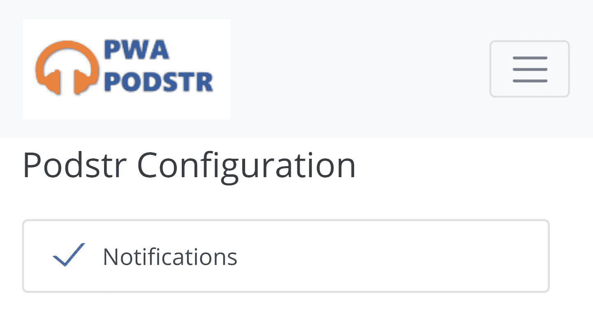

管理推送通知订阅的代码将在本节后面介绍。您可以为用户提供一个界面，无论是作为被动选项，如配置页面，还是通过通知主动提供。

随着 Android 的发展，Chrome 和其他可能的 Android 浏览器将自动将添加到`homescreen`的渐进式 Web 应用程序转换为`WebAPKs`。这些是享受与商店应用几乎同等地位的本地应用程序。它们应该具备的一个功能是通过平台设置应用程序在应用程序中管理推送通知的能力，但您永远不应该依赖这是关闭通知的唯一方式。

例如，Twitter 已经采用了渐进式 Web 应用程序并可以发送通知。我打开了它，但发现它只将通知推送到我的手机上的单个账户（Scott Hanselman）。虽然我喜欢 Scott，但我期待有更多的多样性。

我花了很长时间才发现如何管理 Twitter 通知。我找到了如何在 Chrome 中更快地阻止该网站通知的方法：

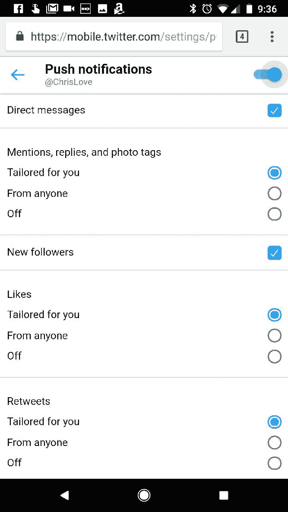

Twitter 有许多需要强大后端来管理的通知选项。Podstr 应用程序使用开或关的选择。如果这是一个生产应用程序，我会随着时间的推移构建出更多的逻辑，就像 Twitter 所做的那样。

# 管理用户的订阅

在示例代码中，如果订阅对象不存在，将调用`subscribeUser`函数。将服务工作者注册对象作为唯一参数传递：

```js
registration.pushManager.getSubscription()
.then(function (subscription) {
            if(subscription === null){
                  subscribeUser(registration);
            }
      });
```

`pushManager`的订阅方法有一个单一参数，即一个具有两个属性的对象，`userVisibleOnly`和`applicationServerKey`。

订阅函数在用户已授予发送通知的权限并且浏览器向推送服务发送请求后返回一个解析的承诺。

作为订阅函数工作流程的一部分，用户代理需要提示用户许可。如果被拒绝，承诺将因`NotAllowedError`而拒绝。您应该始终为订阅调用包括一个 catch 处理程序。

根据[推送通知规范](https://w3c.github.io/push-api/#webapp)：

用户代理不得在未经用户明确许可的情况下向网络应用提供推送 API 访问权限。用户代理必须通过用户界面为`subscribe()`方法的每次调用获取同意，除非之前的权限授予已被持久化，或者存在预安排的信任关系。超出当前浏览会话的权限必须是可撤销的。

`userVisibleOnly`属性是一个布尔值，表示推送通知是否始终对用户可见。目前，您必须将此属性设置为 true，浏览器才会允许您订阅用户：

“如果开发者请求使用静默推送（无需触发用户可见的 UI 变化的能力）的功能，我们目前会拒绝这一请求，但未来我们计划引入一个权限来启用此用例”

– https://goo.gl/ygv404

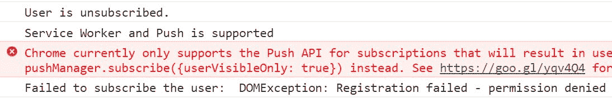

因此，目前您需要向最终用户显示一条消息，即使不需要用户反馈。例如，可以通过推送通知触发缓存策略来更新网站的缓存资源。在这些场景中，您将显示一个通知来提醒用户更新。

`applicationServerKey`属性也称为 WEBPUS-VAPID（自愿的网络推送应用服务器标识[`tools.ietf.org/html/draft-ietf-webpush-vapid-04`](https://tools.ietf.org/html/draft-ietf-webpush-vapid-04)）。此值来自您的推送服务提供商。它将是一个相当长的随机字符和数字的字符串。

该值应该是 base 64 URL 安全编码。`urlB64ToUnit8Array`函数将其转换为`UInt8Array`，这是订阅函数所期望的。`urlB64ToUnit8Array`是您可以在 Podstr 源代码中找到的实用函数。

用户代理应仅接受包含已订阅的`applicationServerKey`的通知。根据规范，这是一个建议，浏览器会遵守这一建议：

```js
function subscribeUser(registration) {
    const applicationServerKey = urlB64ToUint8Array(applicationServerPublicKey);
    registration.pushManager.subscribe({
      userVisibleOnly: true,
      applicationServerKey: applicationServerKey
        })
        .then(function (subscription) {
            updateSubscriptionOnServer(subscription);
            console.log('User is subscribed.');
        })
        .catch(function (err) {
      console.log('Failed to subscribe the user: ', err);
        });
}
```

一旦创建订阅，就不能更改。您必须从初始订阅中退订，并使用新选项创建新的订阅。例如，如果您应该更改您的推送服务，客户端将需要一个新的`applicationServerKey`：

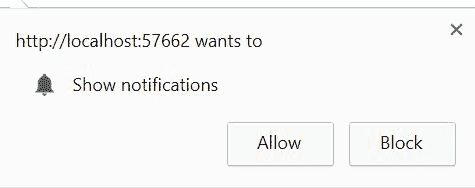

就像服务工作者中的所有事物一样，订阅函数返回一个承诺（promise）。如果没有异常，它将解析为一个`PushSubscription`对象。此对象包含有关订阅的各种值，这些值可能有助于构建更稳健的用户体验或管理逻辑。

**属性**（所有为只读）：

+   `endpoint`：订阅端点

+   `expirationTime`：除非订阅有过期时间，否则为 null

+   `options`：创建订阅时使用的选项的回声

+   `subscriptionId`：订阅 ID

**方法**：

+   `getKey`：表示客户端公钥的`ArrayBuffer`

+   `toJSON`：订阅属性的 JSON 表示

+   `unsubscribe`：启动订阅者退订过程

在成功订阅后调用的`updateSubscriptionOnServer`函数通常用于更新服务器。然而，对于我们的目的，它用于回显订阅对象属性：

```js
{
   "endpoint": "https://fcm.googleapis.com/fcm/send/cRWeyfFxsE0:APA91bE8jAnZtPTHSG5pV9hNWtTdS_ZFZT7FTDEpDEYwf8f_FvwuiLc6YDtxNigxKzyHhj9yzbhlJ4zm3M3wt0w1JPYQ41yhF38yeXKhYVp_TFauMr_RnINOKiobCTCYIgj_X0PWlGQF",
   "expirationTime": null,
   "keys": {
     "p256dh": "BO0FEUNPej_U984Q-dVAvtv1lyIdSvOn01AVl5ALu8F-GPA7lTtZ8QfyiQ7Z12BFjPQLvpvypMrL4I6QqHy2wNg=",
     "auth": "lDiFiN9EFPcXm7LVzOYUlg=="
   }
 }
```

# 处理推送通知

在消费者确认推送通知订阅后，您可以向用户代理发送消息。当消息发送到设备时，它将确定应用消息的服务工作者并触发推送事件。

服务工作者需要一个推送事件处理程序，该处理程序接收一个事件参数。事件对象包含消息数据。

服务器可以在消息中发送任何文本。这取决于服务工作者解析消息并触发适当的工作流程。

PodStr 仅管理新播客的剧集通知。但零售商可能想要推广销售或提醒客户完成订单。您可能发送给客户的提示实际上没有限制。

后者消息可能不是一个简单的字符串——它可能是一个字符串化的 JSON 对象。如果您需要处理 JSON 对象，您需要测试它以查看它是否是有效的对象，然后再回退到字符串。您可能有的消息类型越多，您需要的事件处理程序逻辑就越复杂。

为了演示目的，Podstr 推送事件处理程序将创建一个包含有关新剧集详细信息的`options`对象。这包括剧集标题和播客标志：

```js
{
      "title": "CodeWinds - Leading edge web developer news and training | javascript / React.js / Node.js / HTML5 / web development - Jeff Barczewski",
      “description”: “episode description here”,
"image": "http://codewinds.com/assets/codewinds/codewinds-podcast-1400.png"
}
```

推送消息由核心`serviceWorkerRegistration`对象的扩展处理，这些扩展在注册过程中或`getRegistration`方法中获取。我们感兴趣的方法是`showNotification`方法。

此方法有两个参数，一个标题和一个选项对象。标题应是一个描述通知的字符串。Podstr 应用程序将使用剧集的标题。

选项对象允许您配置通知，可以是几个属性的组合。

**通知对象**：

+   `actions`：一个对象数组，将显示用户可以选择的动作按钮。

+   `badge`：当没有足够空间显示通知本身时，表示通知的图像的 URL。

+   `body`：要显示在消息中的字符串。

+   `dir`：通知的方向；可以是 auto、ltr 或 rtl。

+   `icon`：通知图标的 URL。

+   `image`：包含要显示在通知中的图像 URL 的字符串。

+   `lang`：必须是有效的 BCP 47 语言标签，用于通知语言。

+   `renotify`：如果通知使用标签进行重复显示，则可以将此设置为 true 以抑制振动和可听通知。

+   `requireInteraction`：在较大屏幕上，如果此值为 true，则通知将保持可见，直到用户将其关闭。否则，Chrome 以及我假设的其他浏览器将在 20 秒后将通知最小化。

+   `tag`：一个 ID，允许您在需要时查找和替换通知。这可以通过调用 `getNotifications` 方法来完成。

+   `vibrate`：一个包含振动序列的数字数组。例如，`[300, 100, 400]` 将振动 300 毫秒，暂停 100 毫秒，然后振动 400 毫秒。

+   `data`：这是一个开放字段，您可以按需填充。它可以任何数据类型，如字符串、数字、日期或对象。

`action` 属性允许您向通知添加一个或多个动作按钮。您可以在 `notificationClick` 事件处理器中处理此选择。

动作对象具有以下属性：

+   `action`：一个 `DOMString`，用于标识要在通知上显示的用户动作。

+   `title`：一个包含要显示给用户的动作文本的 `DOMString`。

+   `icon`：[可选] 包含要显示与动作一起的图标的 URL 的字符串：

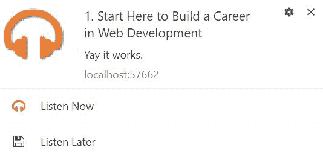

Podstr 服务工作者在通知事件的 `data` 字段中查找一个简单的 JSON 对象。它解析对象并构建一个通知对象。

在尝试解析文本时要小心，因为它可能不是一个 JSON 对象。处理这种情况的最佳方式是将解析方法和相关逻辑包裹在 try catch 语句中。这不是最好的场景，但现在是处理有效和无效 JSON 对象解析的唯一方法：

```js
    try {
        var episode = JSON.parse(event.data.text());

        const title = episode.title;
        const options = {
            body: episode.description,
            icon: 'img/pwa-podstr-logo-70x70.png',
            badge: 'img/pwa-podstr-logo-70x70.png',
            image: episode.image,
            vibrate: [200, 100, 200, 100, 200, 100, 200],
            actions: [{
                action: "listen",
                title: "Listen Now",
                icon: 'img/listen-now.png'
            },
            {
                action: "later",
                title: "Listen Later",
                icon: 'img/listen-later.png'
            }]
        };

        event.waitUntil(self.registration.showNotification(title, 
        options));

    }
    catch (e) {
        console.log('invalid json');

        event.waitUntil(self.registration.showNotification("spartan 
        obstacles", {
            body: 'Generic Notification Handler',
            icon: 'img/pwa-podstr-logo-70x70.png',
            badge: 'img/pwa-podstr-logo-70x70.png',
            vibrate: [200, 100, 200, 100, 200, 100, 200]
        }));
    }
```

如果通知包含纯文本，则显示一个通用通知。

`showNotification` 方法在用户的设备上显示消息。该函数返回一个解析为 `NotificationEvent` 的承诺。

将 `showNotification` 方法包裹在 `waitUntil` 函数中可以保持事件处理器打开，直到承诺解析，这样服务工作者就不会终止。

`NotificationEvent` 对象有两个属性：通知和动作。通知是创建通知时使用的通知对象的副本。如果通知中有一个或多个动作按钮，动作值是通知对象中定义的动作对象的动作属性。

在我们的例子中，这个值将是 listen 或 later。你可以使用这个值来触发不同的响应流程。如果用户选择 listen，你可以直接进入剧集页面并开始播放剧集。如果他们选择 later，你知道要下载剧集的 mp3 文件并将其持久化到缓存中：

```js
self.addEventListener('notificationclick', function (event) {
    if(event.action === "listen"){
        listenToEpisode(event.notification);
    }else if(event.action === "later"){
        saveEpisodeForLater(event.notification);
    }
    event.notification.close();
});
```

`notification.close` 方法可以编程关闭一个通知。

显示推送通知只需这些步骤。记住，处理推送通知的所有代码都在服务工作者中处理。目前，浏览器要求你在处理通知时显示一个可见的消息。这并不意味着通知需要用户交互。

推送通知可以触发在服务工作者中执行的操作逻辑，如更新缓存。如果你需要响应，你可以配置操作按钮并处理最终用户的选项。

# 取消推送通知订阅

我们需要实现的唯一推送通知任务是取消订阅的方式。这可以通过 `pushManager` 完成。

在我深入探讨取消用户推送通知订阅的细节之前，我想看看我们如何为用户提供一个界面来管理他们的订阅状态。

我更喜欢在网站的设置、配置页面或部分中包含一个管理界面。例如，Twitter PWA 有一个详细的推送通知配置体验。它有一个高级页面，包含链接到四个子页面，每个页面都提供了对不同通知方面的更精细控制。

它们被分组为过滤器或偏好设置。在过滤器组中，还有一个复选框来启用质量过滤器，这是一个非常高级的设置。

推送通知在自己的页面组中管理。它们有代码来检测网站是否启用了推送通知，如果是，则给用户一个选项来启用推送。一旦他们启用了推送，他们就可以根据活动类型定制他们的通知。

默认选项可能会导致发送大量通知。所以，如果你像我一样，花时间减少通知的数量。

Twitter Lite 应用可以作为详细推送管理界面的参考。幸运的是，Podstr 应用保持其通知简单。为了我们的目的，我们将提供一个界面来开启或关闭通知：


可以开启或关闭通知，这会触发客户端逻辑来管理订阅。应用程序必须根据用户切换选择来管理 `subscribeUser` 和 `unsubscribeUser`。

这就是为什么有单独的订阅和取消订阅方法。在我深入处理切换 UI 的代码之前，让我们回顾一下 `unsubscribeUser` 方法。

就像 `subscribeUser` 方法一样，`unsubscribeUser` 方法使用服务工作者的 `pushManager.getSubscription` 方法来获取当前订阅的引用（如果有的话）。

如果存在当前订阅，则调用订阅对象的取消订阅方法。取消订阅返回一个解析为布尔值的承诺，指示是否已取消订阅：

```js
function unsubscribeUser(registration) {
    return registration.pushManager.getSubscription()
        .then(function (subscription) {
            if (subscription) {
                return subscription.unsubscribe()
                      .then(function(success){
                        console.log(“user is unsubscribed ”, success);
                      });
            }
        })
        .catch(function (error) {
            console.log('Error unsubscribing', error);
        });
}
```

如果服务工作者未注册，则任何相关的推送通知订阅都将被停用。

当通知订阅在应用程序的控制之外发生变化时，`pushsubscriptionchange` 事件在服务工作者中触发。您可以为该事件添加事件处理器来按需处理更改。

订阅状态可以通过消费者或服务自动更改。如果订阅已经过时，服务可能会删除订阅。在这种情况下，您可以创建一个自动重新订阅过程来续订订阅。

如果您正在重新订阅通知订阅，则必须使用与初始前端 JavaScript 中使用的页面相同的选项进行。您可以通过访问事件对象中的 `oldSubscription` 对象来访问之前的选项。

# 处理推送订阅变更

如果由于订阅过时而自动删除订阅，`pushsubscriptionchange` 事件特别有用。这可能会发生，因为许多推送服务出于安全和因不活跃而限制订阅的生存期。

就像身份验证令牌一样，推送订阅可以无缝续订，无需涉及用户。这就是您可以在服务工作者中为推送订阅做的事情。

`pushsubscriptionchange` 事件包含一个 `oldSubscription` 对象，其中包含原始订阅的详细信息。它们可以用来创建一个新的订阅：

```js
    self.addEventListener('pushsubscriptionchange', e => { 
          e.waitUntil(registration.pushManager.subscribe(e.oldSubscription.options) 
        .then(subscription => { 
          // TODO: Send new subscription to application server 
        })); 
    });
```

这为您节省了在会话之间持久化值的麻烦。现在，您可以在不干扰最终用户的情况下，轻松地在服务工作者中重新订阅用户。

# 背景同步

服务工作者缓存允许网站离线渲染。但只有在您有页面和资源在缓存中可用时才有所帮助。如果您需要在离线状态下发送数据或获取未缓存的页面，您能做什么呢？

这就是背景同步可以帮助的地方。它使您能够注册一个请求，当设备重新上线时将得到满足。

背景同步在设备在线时在后台执行异步任务。它通过建立一个队列，当设备能够连接到互联网时立即满足请求。

背景同步的工作方式是您使用与 `SyncManager` 注册的标签放置一个网络请求。平台负责检查设备是否在线或离线。

如果无法发出请求，同步将请求放入该标签的队列中。背景同步定期检查发出请求的能力，但不会过多到耗尽您的电池或消耗过多的 CPU 周期。

后台同步模型可能需要一种新的方式来组织您的应用程序代码。为了正确使用同步编程，您应该将所有请求从任何事件触发器中分离成独立的方法。

例如，您不会在按钮点击事件处理器中直接进行获取调用，而是会调用一个从事件处理器获取资产的方法。这允许您更好地在后台同步注册中隔离调用。

Podstr 应用程序允许客户选择要离线收听的播客剧集。这需要用户选择剧集，应用程序将下载音频文件并存储以供离线播放。

当然，应用程序必须在线才能下载剧集。您可能还希望限制在设备连接到 WiFi 而不是蜂窝网络时下载大文件，如音频文件。

首先，让我们看看如何使用后台同步来注册一个请求：

```js
if ("sync" in reg) {
      reg.sync.register('get-episode');
}
```

由于后台同步非常新，目前许多浏览器还不支持它。这应该会在不久的将来改变。例如，Edge 在服务工人标志后面提供了支持。

为了安全起见，在使用之前应该进行功能检测。这可以通过检查服务工人注册对象是否支持 `"sync"` 来完成。如果是这样，那么您可以注册请求；否则，您可以像普通请求一样发出请求。

同步请求是在您的 UI 代码中注册的，而不是在服务工人中。服务工人有一个同步事件处理器，负责处理网络请求。

后台同步就像一个基于云的消息平台。您不是直接放置请求，而是向一个队列或缓冲区发送消息，该队列或缓冲区可以被放置请求和响应双方访问。

在我们的示例中，Podstr 将离线剧集的请求存储在 IDB 中。这是因为它是一个异步数据存储，可供客户端代码和服务工人使用。我不会在本章中详细介绍它是如何工作的，因为我在第六章 *掌握缓存 API - 在播客应用程序中管理网络资产* 中会详细介绍，当我们深入探讨缓存时。

要使后台同步工作，您首先需要在 IDB 队列中放置一个消息。当服务工人收到处理稍后收听的剧集的同步事件（`get-episode`）时，它会检查 IDB 队列中的剧集并获取每个文件。

您可以通过调用同步的 `register` 方法来注册请求。此方法接受一个简单的标签名称。这个名称会被传递给服务工人的同步事件处理器。

服务工人注册一个单独的同步事件处理器。每次后台同步事件触发时，处理器都会接收到一个 `SyncEvent` 对象。它包含一个 `tag` 属性，通过提供的 `tag` 值来识别事件：

```js
self.addEventListener('sync', function (event) {
    if (event.tag == 'get-episode') {
        event.waitUntil(getEpisode());
    }
});
```

在这个例子中，你可以看到它在调用`getEpisode`函数之前正在检查标签的值。`getEpisode`函数触发了检索收听稍后队列中剧集并为其离线持久化下载所需的任务。

你应该注意这个方法被包裹在`waitUntil`中。这是为了在执行后台任务时保持事件处理器处于活跃状态。下载一集播客可能需要几分钟，你不想服务工作者进程终止。

在这个例子中，播客剧集将在后台同步事件触发时下载。这意味着请求可能不会立即启动，但它们将会被下载。

奖励是，即使浏览器中没有加载 Podstr 页面，这些下载也会发生。此外，下载在后台线程中发生，释放了 UI 从这项繁琐的任务中。现在，消费者可以自由地在应用程序中导航，无需等待音频文件下载。

# 摘要

服务工作者令人兴奋，为开发者提供了一个构建丰富、引人入胜的用户体验的新环境，同时使用后台活动。本章介绍了不同的服务工作者概念和 Podstr 应用程序。

你现在已经看到了如何利用推送通知和后台同步来建立互动，即使客户没有查看你的应用程序。

在接下来的章节中，你将看到服务工作者生命周期和缓存的工作方式。到本节结束时，你将拥有一个简单的播客应用程序，展示如何使用服务工作者缓存、推送通知和后台同步来创建与使用网络技术构建的流行原生应用程序相媲美的用户体验。
