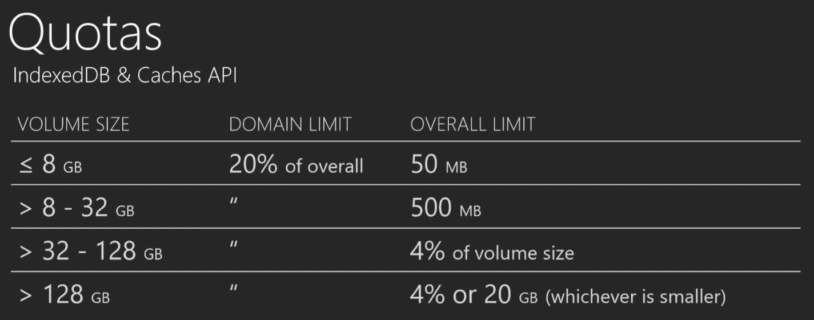

# 掌握 Cache API - 在播客应用中管理 Web 资源

最重要的服务工作者超级能力是使用本地响应缓存，使网络可选。服务工作者可以做到这一点，因为它们可以拦截网络请求并检查在将请求传递到网络之前是否有缓存过的响应。它们还可以被编程来缓存任何网络响应以供将来使用。这允许网站可能立即加载，无论网络状态如何，这也是说您的 Web 应用可以在离线状态下工作。

这种超级能力依赖于两个较新的平台特性，Fetch 和 Cache API。在向 Podstr 应用程序添加缓存之前，我们需要了解 API 的详细信息。

您第一次在第四章，*服务工作者 – 通知、同步以及我们的播客应用*中看到 fetch，但那只是一个简单的介绍。在我们深入使用 Cache API 之前，我们将深入探讨 Fetch API 及其支持对象。在了解这些 API 的详细信息后，我们可以开始积累技能，构建缓存策略，并使我们的 Web 应用更加健壮，成为离线渐进式 Web 应用。

本章将涵盖以下主题：

+   Fetch API 的工作原理

+   `Request`、`Response`、`header`对象以及其他 Fetch API 特性

+   Cache API 的工作原理

# 使用 Fetch API

我们已经在第四章中看到了 Fetch API 的使用，*服务工作者 – 通知、同步以及我们的播客应用*，所以让我们快速回顾一下。Fetch 是`XMLHttpRequest`的现代替代品。它是异步的，依赖于承诺，并提供了一个更流畅的接口来管理动态请求。您可以通过创建自定义的`Request`和`header`对象来自定义请求。服务工作者依赖于 Fetch 来发起网络请求。

`fetch()`方法接受两个参数，即您请求的 URL（或一个`request`对象）和一个`options`对象。此方法返回一个`promise`对象。

与您可能习惯的 AJAX 请求方式相比，Fetch 通常不会在 HTTPS 状态码上抛出异常，只有当请求出现网络问题时，这通常表明是平台或硬件问题，才会抛出异常。来自服务器的任何响应，即使它是错误状态码，如 404：页面未找到或 500：服务器错误，仍然被视为成功的请求。

这是因为浏览器无法从应用程序的角度判断请求的成功与否。您需要负责验证响应，这在第一个代码示例中已经展示，演示了一个基本的 fetch 请求并检查了成功的响应。如果响应状态不是 200（良好响应），则会记录错误信息。

另一个区别是 cookie 的管理方式。Fetch 不会向服务器发送 cookie。这意味着如果你依赖于基于 cookie 的认证令牌，你将需要在`fetch`的初始选项中使用`credentials`属性。

`fetch`方法接受两个参数，一个`request`对象或 URL 和一个可选的`init`对象。第一个参数要么是一个有效的 URL，要么是一个`request`对象。如果提供了 URL，`fetch`会创建一个默认请求来调用网络。`request`对象将在下一节中介绍。

如果未提供`init`参数或未设置属性，则使用默认值。`init`对象可以包含以下属性：

+   `method`: HTTP 动词；GET、POST、PUT、DELETE 等。

+   `headers`: 向你的请求添加自定义 HTTP 头。它们可以是`header`对象或对象字面量的一部分。

+   `body`: 传递给服务器的任何数据。它可以是一个`Blob`、`Buffer`、`FormData`、`QueryString`或`String`对象。

+   `mode`: `cors`、`no-cors`或`same-origin`。

+   `credentials`: `omit`、`same-origin`或`include`（必需）。它表示如何处理认证 cookie。

+   `cache`: `default`、`no-store`、`reload`、`no-cache`、`force-cache`或`only-if-cached`。

+   `redirect`: `follow`或`manual`。

+   `referrer`: `no-referrer`, 客户端（默认），或一个 URL。

+   `referrerPolicy`: `no-referrer`、`no-referrer-when-downgrade`、`origin`、`origin-when-cross-origin`或`unsafe-url`。

+   `keepalive`: 通过在响应交付后保持连接来提高性能。

当你只提供一个 URL 或一个 URL 和一个`init`对象时，`fetch`方法会根据这些参数创建一个请求。当你提供一个自己的`request`对象时，它包含这些值。Fetch API 的一个酷特性是它能够创建一个自定义的`request`对象。这意味着你可以在你的服务工作者中拦截一个请求并将其转换成不同的请求。

# 请求对象

`Request`构造函数与`fetch`方法具有相同的两个参数，一个 URL 和一个可选的初始化对象。以下代码修改了`fetch`示例以使用自定义的`request`对象：

```js
var myRequest = new Request("./api/podcast/" + id + ".json"); 

fetch(myRequest).then(function(response) { 
      if (response.status !== 200) {   
        console.log('Status Code: ' + response.status);   
        return;   
      } 
    return response.json(); 
}).then(function(response) { 
    console.log(data);   
}); 
```

你可以做的不仅仅是根据 URL 创建一个`request`对象。你可以使用各种选项来构建请求。虽然大多数请求是简单的 GET 请求，但很多时候你需要构建一些自定义的内容。`request`对象为你提供了灵活性，以便进行这些请求。

以下示例展示了如何管理一个潜在的跳转情况，其中你已更改了你的主图片文件夹：

```js

self.addEventListener("fetch", function (event) { 

  event.respondWith( 

   var re = /img/S+/g; 

   if(re.test(request.url)){ 

       request = new Request(request.url.replace("img", "images"), 
               { 
                  method: request.method, 
                  headers: request.headers, 
                  mode: request.mode, 
                  credentials: request.credentials 
               }); 

   } 

   return fetch(request) 
      .then(function (response) { 
         //process response  
      }) 
  ); 

}); 

```

当然，还有许多其他可能需要修改请求在发送到网络之前的情况。记住，如果你创建了一个自定义请求并缓存了响应，你需要在检查缓存之前修改请求。

# 处理跨域请求

您可能还需要处理来自不同域的 URL。由于潜在的安全漏洞，对这些 URL 的访问通常受到保护。您可以使用**跨域资源共享**（**CORS**）来访问这些 URL，这是一个额外的层，它依赖于头部来控制访问。

服务器负责告知浏览器是否允许浏览器访问资源。CORS 是一种协议，它使得这些跨源请求成为可能。实际上，完成一个跨源请求需要两个请求。第一个是预检请求([`developer.mozilla.org/en-US/docs/Web/HTTP/CORS#Preflighted_requests`](https://developer.mozilla.org/en-US/docs/Web/HTTP/CORS#Preflighted_requests))，服务器告诉浏览器请求已被批准。之后，再进行原始请求。

除非将`mode`属性设置为`cors`，否则 Fetch 不会进行预检请求。CORS 请求的其余部分在`response`对象中处理。我将在后面的部分中介绍这一点。

有四种不同的请求模式：`cors`、`no-cors`、`same-origin`和`navigate`。您不会使用`navigate`，因为它仅用于在页面之间导航。因此，它是由浏览器创建的。

默认模式是`same-origin`，它限制了请求到`same-origin`。如果发起对外部域的请求，则会抛出错误：

```js
var myRequest = new Request("./api/podcast/" + id + ".json", 
                        {mode: "cors"}); 

fetch(myRequest).then(function(response) { 
      if (response.status !== 200) {   
        console.log('Status Code: ' + response.status);   
        return;   
      } 
     return response.json(); 
}).then(function(response) { 
     console.log(data);   
}); 
```

`no-cors`请求限制了请求方法的类型为 GET、HEAD 和 POST。当使用`no-cors`时，服务工作者在修改请求和访问响应属性方面受到限制。

您仍然可以使用`no-cors`从不同的源请求资源，但响应类型有限。例如，您可以获取一张图片，但对响应的处理能力有限。这些被称为**不透明请求**。

# 管理请求凭证

默认情况下，fetch 不会将 cookies 附加到请求中。这对安全和性能都有好处。在大多数场景中，访问 API 确实需要基于 cookie 的认证。对于这些场景，您需要将凭证属性设置为`same-origin`或`include`。默认值是`omit`。

通过将`credentials`选项设置为`include`或`same-origin`，请求将包含认证 cookies。`include`值会触发`request`对象为任何目标源包含凭证，而`same-origin`将凭证限制在`same-origin`：

```js
var myRequest = new Request("./api/podcast/" + id + ".json", 
                       { 
                          mode: "cors", 
                          credentials: "include" 
                       }); 

fetch(myRequest).then(function(response) { 
      if (response.status !== 200) {   
        console.log('Status Code: ' + response.status);   
        return;   
      } 
     return response.json(); 
}).then(function(response) { 
     console.log(data);   
}); 
```

# 控制响应的缓存方式

另一个重要的请求选项是缓存属性。该属性控制浏览器如何使用其自身的缓存。由于服务工作者提供缓存，您可以编程方式控制浏览器缓存，但这可能显得有些冗余，并可能导致一些不期望的响应。

默认的缓存值不会改变任何东西；浏览器在发起网络调用之前会检查其自身的缓存，响应是基于默认缓存规则的最佳响应。

然而，通过将请求缓存选项设置为另一个值，您可以强制浏览器绕过或更改它使用浏览器缓存的方式。选项如下：

+   `default`

+   `no-store`

+   `reload`

+   `no-cache`

+   `force-cache`

+   `only-if-cached`

由于服务工作者缓存提供了优于浏览器缓存的缓存资产方法，我倾向于使用它，并可能想要从管道中移除浏览器的缓存。在这种情况下，您希望将缓存属性更改为 `no-store`：

```js
var myRequest = new Request("./api/podcast/" + id + ".json", 
                       { 
                          mode: "cors", 
                          credentials: "include", 
                          cache: "no-store" 
                       }); 

fetch(myRequest).then(function(response) { 
      if (response.status !== 200) {   
        console.log('Looks like there was a problem. Status Code: ' +   
          response.status);   
        return;   
      } 
     return response.json(); 
}).then(function(response) { 
     console.log(data);   
}); 
```

# 头部对象

在构建客户端和服务器之间的独特请求和响应时，自定义请求头部非常重要。请求头部属性是一个 `Headers` 对象。`Header` 对象被 `request` 和 `response` 对象使用。

`Headers` 是客户端和服务器之间通信关于请求和响应额外信息的一种方式。可以将它们视为正在发送和接收的数据的元数据。

例如，当响应包含 gzip 压缩数据时，Content-Encoding 头部会通知浏览器，以便它可以解压缩主体。在返回压缩响应之前，服务器会查找相应的头部，例如 accept-encoding，告诉它客户端可以接受压缩响应。

`Headers` 对象管理头部列表。成员方法提供了管理与请求或响应相关联的头部的能力。

# 添加头部

头部可以在构造函数中添加，也可以通过 `append` 方法添加。以下示例使用 `Headers` 构造函数：

```js
var httpHeaders = {  
'Content-Type' : 'image/jpeg',  
'Accept-Charset' : 'utf-8',  
'X-My-Custom-Header' : 'custom-value'  
}; 
var myHeaders = new Headers(httpHeaders); 
```

头部也可以使用 `append` 方法添加：

```js
var myHeaders = new Headers(); 
myHeaders.append('Content-Type', 'image/jpeg'); 
myHeaders.append('Accept-Charset', 'utf-8); 
myHeaders.append('X-My-Custom-Header', 'custom-value'); 
```

添加头部的另一种方式是使用 `set` 方法：

```js
var myHeaders = new Headers(); 
myHeaders.set('Content-Type', 'image/jpeg'); 
myHeaders.set('Accept-Charset', 'utf-8); 
myHeaders.set('X-My-Custom-Header', 'custom-value'); 
```

`append` 和 `set` 方法之间的区别在于后者会覆盖任何现有的值。当 `append` 方法将头部值添加到头部列表中时，应该使用 `append` 方法来处理允许多个值的头部。

一个多值头部示例是 Cache-Control。您可能需要设置许多组合来向不同的客户端和中间件提供指令。

例如，使用我的 CDN 管理 HTML 资产的缓存的最佳方式是将它们标记为私有，生存时间为 3600 秒。您还可以包括 CDN 缓存的值，可能是 300 秒。这意味着我的 CDN 将在 300 秒后自然失效，减少我强制更新的需求。

使用 `append` 方法可能需要最多三次调用：

```js
myHeaders.append('Cache-Control', 'private'); 
myHeaders.append('Cache-Control', 'max-age=3600'); 
myHeaders.append('Cache-Control', 's-max-age=300'); 
```

`set` 方法写入最终值，覆盖任何之前的值：

```js
myHeaders.set('Cache-Control', 'private, max-age=3600, s-max-age=300'); 
```

头部是一个复杂的话题，如果您需要深入了解特定的头部及其值，我建议寻找更多资源。维基百科是一个很好的起点（[`en.wikipedia.org/wiki/List_of_HTTP_header_fields`](https://en.wikipedia.org/wiki/List_of_HTTP_header_fields)），其页面提供了一个非常详尽的列表，包括详细信息以及到规范的进一步链接。

你可以管理的头部数量是有限的。有些头部仅限于浏览器，有些仅限于服务器，这意味着不允许更改它们。

如果你尝试添加或设置一个无效的头部，将会抛出异常。

# 访问头部值

`get` 方法返回一个特定的头部值：

```js
Var cacheHeader = myHeaders.get('Cache-Control'); 
    //returns 'private, max-age=3600, s-max-age=300' 
```

`entries` 方法返回一个迭代器，你可以用它来遍历所有头部。每个条目都是一个简单的数组，第一个条目是头部键名，第二个成员是值：

```js
// Display the key/value pairs 
for (var header of myHeaders.entries()) { 
   console.log(header[0]+ ': '+ header[1]); 
} 
```

`keys` 方法也提供了一个迭代器，但只返回头部名称的列表：

```js
// Display the keys 
for(var key of myHeaders.keys()) { 
   console.log(key);  
} 
```

相反，你可以从 `values` 方法获取值的列表。这个方法的问题在于值与它们的键没有直接关联：

```js
// Display the values 
for (var value of myHeaders.values()) { 
   console.log(value);  
} 
```

你可以通过调用 `has` 方法来检查头部是否存在：

```js
myHeaders.has(name); 
```

可以使用 `delete` 方法删除头部：

```js
myHeaders.delete(name); 
```

# 受保护的头部

头部有一个守卫属性。这个标志指示头部是否可以被操作。如果你尝试操作一个守卫设置为不可变的头部，将会抛出异常。

这些是可能的守卫状态：

+   `none`: 默认

+   `request`: 用于从请求中获取的头部对象的守卫（`Request.headers`）

+   `request-no-cors`: 用于从使用模式 `no-cors` 创建的请求中获取的头部对象的守卫

+   `response`: 自然地，对于从响应中获取的头部（`Response.headers`）

+   `immutable`: 主要用于 ServiceWorkers；渲染一个 `Headers` 对象

实际控制如何操作不同头部的规则非常详细。如果你想了解更多关于这些细节的信息，我建议阅读 Fetch 规范（[`fetch.spec.whatwg.org/`](https://fetch.spec.whatwg.org/))。

# 体混合

`Request` 和 `Response` 对象都有一个 `body` 属性。这实际上是一个混合函数或类，它实现了体接口。体包含一个数据流，具有根据类型检索内容的方法。

每个 `body` 方法读取流并将其转换为所需的格式。流被完全读取，并返回一个 `promise`，解析为格式化数据。

你已经看到了如何使用 `json()` 方法来读取 JSON 格式的数据。还有 `text`、`blob`、`formData` 和 `arrayBuffer` 方法。每个方法都将体解析为相应的格式。

要回顾如何使用 JSON 格式的数据，让我们看看如何在 Podstr 应用程序中检索搜索结果：

```js
    function fetchSearch(term) { 

        fetch("api/search.json?term=" + term) 
            .then(function (response) { 

                if (response.status !== 200) {      
                    console.log('Status Code: ' + response.status); 
                    return;     
                }    

                return response.json(); 

            }).then(function (results) { 
                renderResults(results); 
            }) 
            .catch(function (err) { 
                console.log('No CORS Fetch Error :-S', err); 
            }); 
    } 

```

注意 `json()` 混合函数是如何作为响应的方法提供的。这是因为每个体混合函数都实现了 Body 接口，并被添加到响应对象中。

混合函数返回一个承诺，解析为 JSON 对象。记住，你不能直接使用体混合函数的返回值，因为它们返回一个承诺。你需要在一个承诺处理程序中处理格式化的数据，这就是 `then` 方法。

JSON 可能是现代 API 使用最广泛的格式，但有时你会检索其他格式——最简单的是纯文本。

获取纯文本看起来几乎与获取 JSON 相同。而不是使用 json mixin，使用`text` mixin：

```js
fetch("api/simple.txt") 
    .then(function (response) { 

        if (response.status !== 200) {      
         console.log('Status Code: ' + response.status);      
         return;     
        }    

        return response.text(); 

    }) 
    .then(function(result){ 
        renderResult(result); 
    }) 
    .catch(function (err) { 
        console.log('Fetch Error :-S', err); 
    }); 

```

以下示例展示了如何获取一个音频文件（`ogg`格式）并将数据缓冲到`AudioContext`对象中：

```js
        source = audioCtx.createBufferSource(); 

        fetch('./viper.ogg') 
            .then(function (response) { 
                return response.arrayBuffer(); 
            }) 
            .then(function (buffer) { 
                audioCtx.decodeAudioData(buffer, function (decodedData) { 
                    source.buffer = decodedData; 
                    source.connect(audioCtx.destination); 
                }); 
            }); 

```

到目前为止，我们已经看到了如何使用响应主体，但你也可以在请求中设置主体。一个常见的场景是提交表单数据。

这个例子展示了如何将联系表单作为 JSON 对象进行 POST。方法设置为`'post'`，并提供了自定义头。自定义头告诉服务器你正在发送一个带有`Content-Type`头的 JSON 格式主体。你也在告诉服务器（通过`Accept`头）你期望返回一个 JSON 对象。

表单在`serializeForm`方法中被序列化或转换为 JSON 对象（未显示）：

```js

fetch("/api/contact/, { 
    method: 'post', 
    headers: { 
        'Accept': 'application/json, text/plain, */*', 
        'Content-Type': 'application/json; charset=UTF-8' 
    }, 
    body: JSON.stringify(serializeForm()) 
}).then(function (res) { 

    if (res.status >= 200 && res.status < 400) { 
        // Success! 
   return res.json(); 

    } else { 
  console.log('Status Code: ' + response.status);      
     return; 
    } 
}).then(function (resp) { 
    //process the response 
}); 

```

你也可以使用`FormData`对象（[`developer.mozilla.org/en-US/docs/Web/API/FormData`](https://developer.mozilla.org/en-US/docs/Web/API/FormData)）提交原始表单。确保你提交到的 API 可以处理表单数据：

```js
 var form = document.querySelector("[name=contact-form]"); 

fetch("/api/contact/, { 
    method: 'post', 
    body: new FormData(form) 
}).then(function (res) { 

    if (res.status >= 200 && res.status < 400) { 
        // Success! 
   return res.json(); 
    } else { 
  console.log('Status Code: ' + response.status);      
     return; 
    } 
}).then(function (resp) { 
    //process the response 
}); 
```

你需要了解的关于主体的最后一个方面是`bodyUsed`属性。这可以用来检查你是否还能使用主体。主体只能读取一次。

主体是一个流，它是一组只能向前读取的数据。尝试多次读取主体会导致抛出异常。

如果你需要多次读取或使用一个主体，你应该克隆请求或响应。一个常见的场景是当服务工作者获取一个 URL 并缓存响应的同时返回响应给客户端。你将在下一章中看到更详细的说明：

```js
fetch(request) 
     .then(function (response) { 

         var rsp = response.clone(); 

         //cache response for the next time around 
         return caches.open(cacheName).then(function (cache) { 
             cache.put(request, rsp); 
             return response; 
         }); 

     }) 
```

# 响应对象

`response`对象几乎与`request`对象相同。它是在请求从服务器收到答案时创建的。响应对象也有头和主体，与`request`对象相同的对象类型。

响应通常由平台在从服务器收到响应时创建。然而，你可以创建一个新的响应。这更常见于你想要转换响应时。

我处理的一个场景是从一个返回扁平数据的旧 API 中获取数据。这些扁平数据需要被转换成多维度的 JSON 对象。为了避免重复进行这个计算密集型过程，我将数据转换并缓存了转换后的响应。

响应构造函数有两个参数，一个 Body 对象和一个初始化对象。我们已经在第四章中讨论了 Body 对象，*服务工作者 – 通知、同步和我们的播客应用*。响应初始化对象与`request`对象略有不同。

与`request`对象不同的响应对象属性如下：

+   `status`：响应的状态码，例如，`200`

+   `statusText`：与状态码相关联的状态消息，例如，`OK`

+   `headers`：你想要添加到响应中的任何头信息，包含在 Headers 对象或`ByteString`键/值对的字面量对象中（参见 HTTP 头信息以获取参考）

只有三个属性，一个是 Headers 对象。其他两个属性指示 HTTP 状态。有一个 code、status 和 text 值，statusText。

# 响应属性

大多数响应对象属性与请求对象类似，最值得注意的是 Body 及其混合。

`isRedirected`属性指示响应是否是重定向（HTTPS 状态码`301`或`302`）响应的结果。

类型属性是只读的，告诉我们响应是否有网络错误（错误）、不透明（带有 no-cors 请求的跨源，cors，基本上表示成功的响应）。

`url`属性是任何重定向后的最终响应 URL。

# 验证成功的响应

如我之前提到的，如果响应状态不是 200，fetch 不会抛出异常或返回错误。相反，只要 fetch 收到响应，它就不会失败。仍然取决于你如何查询响应状态来确定你想要如何处理响应。

如果状态码是 200-299，则`ok`属性为 true，否则为 false。这可以是一个快速验证请求成功的方法。但请小心，有时你可以收到缓存、跨源响应的 0 状态码。

在实践中，许多请求可以有一系列成功的状态码。HTTP 状态码按 100s 分组。200-299 表示成功的响应，而 300-399 表示重定向，并伴随新的地址。`400`表示 URL 不可访问，`404`是最著名的。其他资源不可访问的原因与授权或访问资源的权限有关。最后，500 范围内的任何内容都表示存在服务器端问题。

制定策略来处理不同的状态对于应用程序的成功至关重要。检查`response.ok`值可能不会给出完整的故事。我发现 Chrome 为存储在缓存中的外部源资源返回等于 0 的状态。响应仍然是成功的，但将你的逻辑限制为检查`response.ok`会导致过多的网络请求。

现在你已经了解了 Fetch API 的细节，是时候开始学习 Cache API 的工作原理了。Cache API 依赖于 Fetch API，因为它缓存请求-响应对。

# 缓存响应

我们已经能够使用 Web 存储和 IndexedDB 存储内容，包括数据和网站资源好几年了。使用这两种方式中的任何一种都需要一个库或自定义逻辑来管理网站资源，这也是为什么服务工作者规范包括一个专门的缓存 API。

缓存接口为请求/响应对象对提供了一个管理存储机制。这些对象也被称为可网络访问的资源，但你可以将它们视为仅仅是文件或 API 响应。

与 `IndexedDB` 和 `localStorage` 相比，缓存 API 具有天然的优势，因为它被设计为通过 `Request` 和 `Response` 对象来抽象、持久化这些资产。这意味着你可以使用比 `localStorage` 提供的不仅仅是单个键值来引用资产。

除了提供一个管理接口来存储资产外，它还允许你将这些资产组织成组或缓存。随着我们继续阅读剩余的章节，你将看到如何使用这种能力来隔离资产，以便更新和失效变得更容易。

与其他浏览器存储服务一样，缓存由浏览器按来源或域名管理。这阻止第三方访问存储在你网站上的内容。你的整体存储配额也与来源相关联，并在各种存储服务之间分配。

可用空间的大小因设备而异，与可用磁盘空间成正比。就像所得税一样，管理你的配额允许的规则因可用空间的大小而异。

Ali Alabbas 在微软边缘开发者峰会上分享了以下幻灯片，解释了管理存储配额的规则：



如果空间变得有限，浏览器将任意地从不同的存储提供者中清除存储的数据。除非你管理这个过程，否则你无法保证你的资产已经保留在缓存中。

缓存 API 是服务工作者规范的一部分，因为它是使你的渐进式 Web 应用离线工作的基础。如果没有保存资产以供即时访问的能力，你的网站将无法离线工作。

# 缓存对象

`Caches` 对象代表一组命名缓存及其成员，用于与这些缓存交互。该接口提供了打开、创建、迭代和删除单个缓存的方法。你还可以在所有命名缓存中匹配缓存的响应，而无需查询每个缓存。

# caches.open

`caches.open` 方法返回一个与提供的名称匹配的缓存的引用。这个引用是一个 `Cache` 对象，在后面的章节中会详细介绍。如果不存在与名称匹配的缓存，则会创建一个新的缓存。这返回一个承诺；解决缓存对象允许你在该缓存中管理缓存的响应：

```js
caches.open(cacheName).then(function (cache) { 
//do something here 
}); 
```

# caches.match

`caches.match` 方法是一个便利方法，其工作方式与 `cache.match` 方法类似。它返回一个承诺，该承诺解析为与传递给方法的 `Request` 对象匹配的第一个缓存的响应。

`caches.match` 方法的优点在于它处理查询所有命名缓存以找到匹配项的方式。它返回它找到的第一个匹配项。

这意味着如果匹配的响应存储在不同的缓存中，你无法控制找到哪个响应。为了避免匹配到无效响应的场景，你需要确保在缓存更新之前，你的逻辑使过时的缓存响应无效：

```js
return caches.match(request) 
    .then(function (response) { 
   return response; 
    }) 
```

# caches.has()

如果你需要检查一个命名缓存是否存在，`has` 方法返回一个承诺，解析为 true：

```js
caches.has(cacheName).then(function(ret) { 
  // true: your cache exists! 
}); 
```

# caches.delete()

`delete` 方法搜索与提供的名称匹配的缓存。如果找到一个匹配的缓存，它将被删除。返回一个承诺，如果找到匹配的缓存则解析为 true，如果没有找到则解析为 false：

```js
Cached.delete(cacheName).then((ret)=>{ console.log(cacheName + " deleted: " + res}); 
```

你不总是需要添加代码来处理响应。通常，你会记录活动。如果没有删除缓存，最可能的原因是缓存不存在，在这种情况下，你可能没有什么可担心的。

你还应该注意，如果你删除了一个缓存，所有缓存的项都会随之删除。

# caches.keys()

`keys` 方法返回一个承诺，包含每个命名缓存的名称（字符串）数组。这个列表可以迭代以进行处理。

以下示例放置在服务工作者激活事件处理器中。它删除了为先前服务工作者版本制作的缓存。这个概念在第五章中有所介绍，*服务工作者生命周期*：

```js
    caches.keys().then(function (cacheNames) { 
      cacheNames.forEach(function (value) { 
        if (value.indexOf(version) < 0) { 
          caches.delete(value); 
        } 
      }); 
      return; 
    }) 
```

注意 `delete` 方法在删除缓存后没有进行任何处理。如果你想记录有关删除缓存的任何问题，可以在这里做。

# Cache 对象

Cache 接口是一组用于管理存储响应的方法和属性。你不能创建缓存对象；你必须使用 `Caches.open` 方法打开对缓存的引用，这将在后面介绍。这个引用是 Cache 对象的一个实例，它让你可以访问它管理的响应。

# cache.match()

`match` 方法有两个参数，一个 `request` 对象和一个可选的选项对象。如果找到一个匹配的响应，它将返回一个解析的承诺。如果没有找到响应，承诺仍然解析，但作为 undefined。

如果没有找到匹配项，你可以继续执行适当的逻辑，例如将请求转发到网络或返回一个回退响应。

`request` 对象参数可以是有效的 `request` 对象或 URL。如果只提供了一个 URL，方法会内部进行隐式转换。提供 `request` 对象可以让你有更多的控制权，因为不同的响应可能会被请求变体缓存。

例如，相同的 URL 可能对 `HEAD` 和 `GET` 方法都有缓存的响应，每个都是唯一的。不同的 `QueryStrings` 是另一个常见示例，其中相似的 URL 有不同的响应被缓存。

可选的`options`参数允许你向`match`方法提供更多关于你想要匹配的特定请求的详细信息。你可以将其视为一种筛选潜在匹配的方法。

`options`对象有一组潜在的属性，你可以提供值来匹配或筛选。

可用的潜在选项如下：

+   `ignoreSearch`：表示你是否想使用`QueryString`。选项是 true 或 false。

+   `ignoreMethod`：表示你是否想通过`request`方法进行筛选，例如 GET、POST、DELETE 等。默认情况下，匹配确实使用请求方法来匹配响应。

+   `ignoreVary`：当设置为 true 时，在检索匹配项时忽略头信息。URL 用作筛选器，这意味着不同头组合的缓存响应可以匹配。

+   `cacheName`：这限制了匹配响应到特定的缓存名称。多个响应可以跨不同命名的缓存进行缓存，但指定了应该使用哪个缓存。

对于大多数查询，你不会使用这些选项，因为它们高度专业化。`ignoreSearch`最有可能是被使用的，因为`QueryString`参数非常常见。服务器通常根据这些值的差异返回不同的响应：

```js
return namedCache.match(request).then(function (response) { 
   return response; 
    }); 
```

# cache.matchAll

与`match`方法类似，`matchAll()`方法接受请求和选项（可选）参数。该方法返回一个承诺，解析出一个匹配响应的数组。与 Caches 对象上的相同方法不同，它只返回特定命名的缓存中的匹配项。

`matchAll`和`match`之间的主要区别在于，`match`方法返回它匹配的第一个响应。

当你需要使用路由而不是特定 URL 来匹配响应时，`matchAll`方法很有用。例如，如果你想获取所有播客的横幅图像列表，你可以这样做：

```js
caches.open("podcasts").then(function(cache) { 
  cache.matchAll('/images/').then(function(response) { 
    response.forEach(function(element, index, array) { 
         //do something with each response/image 
    }); 
  }); 
}); 
```

# 缓存添加和 addAll

如果你想要检索一个资产并立即缓存响应，`add`和`addAll`方法管理这个过程。`add`方法等同于以下代码：

```js
    const precache_urls = [...] 

    caches.open(preCacheName).then(function (cache) { 
      return cache.addAll(precache_urls); 
    }) 
```

`add`和`addAll`方法都有单个参数：一个`request`对象。像`match`方法一样，你也可以提供一个有效的 URL，方法会将它转换为`request`对象。

两种方法都返回一个承诺，但不会解析一个值。只要没有异常发生，请求被制作和缓存，你就可以使用解析来继续应用程序的工作流程。如果有异常，你可以适当地捕获和处理它。

在安装和激活生命周期事件中，`add`方法很有用，因为你可以提供要预缓存的 URL 列表。你不受这些场景的限制，因为它们可以在任何时候调用。

在大多数由 fetch 事件处理器启动的缓存策略中，它们并不有用。我们将在下一章中介绍许多这些策略。在处理实时 fetch 时，通常需要网络响应来渲染页面。这些方法不返回对响应的访问权限。

# cache.put

尽管你可能认为不是这样，`add` 方法并不允许你直接缓存响应。如果你从 fetch 调用中收到网络响应，你需要显式地处理其缓存。这就是 `put` 方法为你提供所需控制以缓存响应并允许在缓存过程中并行使用响应的灵活性所在。

正如你将在下一章中了解到的那样，有许多不同的缓存策略，在网络请求解析后，网络响应会被缓存。

`put` 方法有两个参数，`request` 和 `response`。这些与在 *Fetch* 部分中提到的相同的 `Request` 和 `Response` 对象。

`put` 方法使用这两个对象以键值对的方式对页面资源进行目录化，有点像 localStorage，但专门用于缓存页面资源。

`put` 方法返回一个承诺，但不解析任何值。

如果你需要使用响应，你应该在缓存之前克隆它。响应体只能使用一次，但 `response` 对象有一个 `clone` 方法可以创建副本。我通常缓存副本并返回原始的，但这并不重要。

以下代码演示了如何获取资源，克隆响应，缓存克隆，并返回原始响应：

```js
fetch(request).then(function (response) { 
   var rsp = response.clone(); 
   //cache response for the next time around 
   return caches.open(cacheName).then(function (cache) { 
       cache.put(request, rsp); 
       return response; 
   }); 
}); 
```

# 删除缓存项

你还负责定期清除缓存条目。浏览器不会为你使缓存失效。如果可用空间变得有限，它可能会清除项目。然而，我并不担心这种场景。相反，你需要有一个计划来删除缓存资源，这样你就可以控制一个项目被缓存的时间长度。

管理或使缓存资源失效的最佳方式是应用一组规则来控制你的缓存。第八章，*应用高级 Service Worker 缓存策略*，更详细地介绍了失效策略。在你达到那个水平之前，了解如何删除资源或删除整个缓存是很重要的。

`delete` 方法返回一个承诺，如果找到并删除了匹配的响应，则解析为 true，否则返回 false：

```js
cache.delete(request,{options}).then(function(true) { 
  //your cache entry has been deleted 
}); 
```

此方法有两个参数，一个请求和一个可选的选项对象。这些选项与在 match 方法中使用的是相同的。这是因为如果你使用这些选项有不同的请求变体，你可以缓存对 URL 的多个响应。

# cache.keys

缓存对象的 `key` 方法返回一个解析为存储在缓存中的请求数组的承诺。该方法有两个可选参数，请求和选项。这些与我们在其他方法中看到的相同类型。

当提供这些参数时，`keys`方法的工作方式与`match`和`matchAll`方法非常相似。

可以使用键或请求的数组来更新您的缓存。例如，您可以循环遍历并删除所有匹配项，或者可能进行静默的背景更新：

```js
caches.open(cacheName).then(function(cache) { 
  cache.keys().then(function(keys) { 
    keys.forEach(function(request) { 
      fetchAndUpdateCache(cacheName, request); 
    }); 
  }); 
}) 
```

键按插入顺序返回。如果您想通过首先删除最旧的配对来管理缓存失效，这可能会很有用。我们将在后面的章节中回顾一些缓存失效策略。您将看到如何实现这一点，以及一些其他策略。

# 摘要

在本章中，我们看到了 Fetch 和 Cache API 对于服务工作者的重要性。为了充分利用服务工作者，您需要能够拦截和操作请求以及服务器响应。因为服务工作者依赖于异步函数（Promises），所以您必须使用 Fetch，作为`XMLHttpRequest`的新替代品。

Cache API 为浏览器提供了一种新的存储介质，这种介质高度专门化，适用于请求/响应对。该 API 是一个丰富的平台，提供了对网络资源的最大控制量。

您的目标是使用最佳的逻辑和平台资源来使您的网站快速加载并离线工作。现在您已经了解了 Fetch 和 Cache API 的工作原理，是时候开始构建您能构建的最好的缓存系统了。

在下一章中，我们将回顾不同的缓存模式，并开始了解它们如何应用，以便您可以确定在您的应用程序中应该采用哪种策略。
