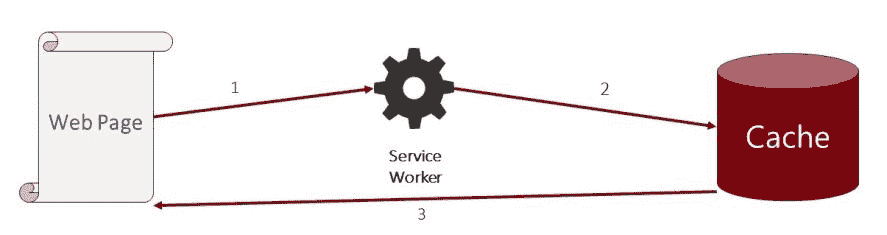

# 服务工作线程缓存模式

互联网很棒，直到你离线或连接不良。然后，当你等待一个似乎永远不会出现的页面加载时，它变成了一种徒劳的行为。最终，请求超时，浏览器显示一条消息告诉你你已离线——Chrome 以其可爱的离线恐龙而闻名。

大多数网络流量来自智能手机，其中许多连接是通过蜂窝连接（GPRS）完成的。当蜂窝网络工作良好时，它们很棒，但通常无法保证有一个干净的网络连接。

即使在美国，可靠的 LTE 网络也不是无处不在。在我家附近有几个地方我没有任何蜂窝信号。想象一下在欠发达地区可能会是什么样子。

这就是服务工作线程和缓存 API 能帮到你的时候。这两个功能的组合使你可以使网络成为可选的。服务工作线程有几个事件，你可以利用这些事件在浏览器中构建一个网络服务器。

本章将涵盖以下主题：

+   服务工作线程缓存的工作原理

+   常见的服务工作线程缓存策略

# 服务工作线程缓存的工作原理

服务工作线程位于浏览器和网络之间。通过添加一个`fetch`事件处理器，你可以确定如何处理请求。所有网络请求都通过服务工作线程的`fetch`事件处理器：


这为你提供了一个钩子，或者说是将逻辑注入工作流程的方法，以拦截请求并确定响应如何以及在哪里返回。

使用服务工作线程（Service Worker），你可以做以下事情：

+   将请求传递给网络，传统方法

+   返回缓存响应，完全绕过网络

+   创建自定义响应

当网络失败时，你可以编程服务工作线程从缓存返回一个响应，即使它是一个*回退*响应。因为服务工作线程可以从缓存返回响应，如果你的页面被缓存，它们可以立即加载：


在前面的图表中，服务工作线程被编程为拦截所有网络请求，并可以从缓存或网络返回响应。

由于服务工作线程在本地运行，它始终可用。它可以根据条件决定返回响应的最佳方式。

以下图表说明了服务工作线程在浏览器上下文中运行，提供代理来处理请求，即使网络不可用：


当使用服务工作线程且网络不可用时，如果你的网站有有效的缓存响应，它仍然可以正常工作。即使页面没有缓存，你也可以创建一个响应，让客户有相关的内容可以与之互动。在本书的后面部分，我将介绍如何在网络可用时排队用户的操作并更新服务器。

以下图表显示了服务工作线程在网络不可用时如何使用缓存资源：


# Service Worker 事件

Service Worker 有几个事件。你可以使用这些事件来管理你的应用缓存。我们已经在第五章，“Service Worker 生命周期”中探讨了如何使用 `install` 和 `activate` 事件来预缓存响应。

全明星 Service Worker 事件是 `fetch`。每次请求网络地址资产（URL）时，都会触发此事件。通过向你的 Service Worker 添加 `fetch` 事件处理器，你可以拦截所有网络请求，触发一个工作流程来确定如何响应：

```js
self.addEventListener("fetch", event => { 
   //process request and return best response 
}); 
```

如你所学 第六章，“掌握 Cache API – 在播客应用程序中管理 Web 资产”，你可以使用 Fetch API 的自定义 `request` 和 `response` 对象来检查请求和创建或克隆网络响应。

`fetch` 事件处理器提供的事件变量有一个请求属性。这个属性是一个 `request` 对象。你可以使用 `request` 对象来确定你将如何返回响应。在本章中，你将学习到几个可以应用来使你的渐进式 Web 应用工作更快、离线的缓存策略。

知道如何使用 `fetch` 事件来最大化应用缓存的使用性能，是提供最佳用户体验的关键。

# 缓存模式和策略

Service Worker 事件为你提供了通往 Service Worker 生命周期的门户，以便应用你的缓存策略。但这不仅仅是检查是否已缓存有效的响应或将请求传递给网络。你应该有一个计划，说明你的应用将如何使用 Service Worker 缓存、事件和网络来提供最佳体验。

这意味着你需要有一系列常见的模式和策略来构建你的应用程序逻辑。本章的其余部分将回顾你可以用来构建应用程序的常见缓存模式。

策略是指导原则和示例代码的组合，你可以使用它们来构建你的应用程序。随着你继续阅读本书，你将看到这些策略在 PodStr 和 PWA Tickets 应用程序中的应用。

# 预缓存

PRPL 模式的一个关键方面，我们将在后面的章节中了解更多，就是在应用安装时存储应用资产。当用户访问一个 Web 应用的初始入口点时，会触发一个后台进程，该进程将自动加载后续渲染网站不同方面所需的额外资产。这被称为预缓存，或者为应用缓存进行预优化，以获得未来的更好性能。

Service Workers 使得这种做法易于管理。你可以利用 `install` 和 `activate` 事件，以及当 Service Worker 首次触发时。常见的做法是在注册新的 Service Worker 时使用 `install` 事件来预缓存一系列已知的资产：

```js
self.addEventListener("install", event => { 

    event.waitUntil( 

        caches.open(cacheName(PRECACHE_NAME)).then(cache => { 

            return cache.addAll(PRECACHE_URLS); 

        }) 

    ); 

}); 
```

你需要了解两种预缓存策略：作为依赖项的预缓存和不作为依赖项的预缓存。

# 作为依赖项安装

当预缓存应用程序资源时，有些资源你知道它们会被很快或频繁地使用。你可以将这些视为关键任务。尽管初始页面加载或应用外壳加载可能会触发对这些资源的网络请求，导致它们被缓存，但可能还有其他你希望确保在应用程序加载早期过程中被缓存的资源：


这些资源应该作为`install`事件完成的依赖项进行预缓存。换句话说，这些资源必须在`install`事件关闭之前完成缓存，这意味着你应该使用`event.waitUntil`方法保持过程开启。通过这样做，你延迟了任何活动事件的触发，直到这些资源完全被缓存：

```js

self.addEventListener('install', function (event) { 
    event.waitUntil( 
    //pre-cache 
    //on install as a dependency 
    return caches.open(preCacheName).then(cache =>{ 
        return cache.addAll(PRECACHE_URLS); 
    }); 
}); 
```

# 不作为依赖项安装

预缓存不仅限于关键任务资源。你很可能会识别出许多将被常用但不是你应用程序成功关键的任务资源。你仍然可以使用服务工作者的`install`事件来缓存这组资源，但选择不使它们依赖于事件完成。这被称为无依赖项的预缓存资源。

在这种情况下，你也会触发这些网络资源的预缓存，但你不会在`event.wait` `until`调用中返回`cache.addAll`方法。这些资源仍然会被添加到缓存中，但不会保持`install`事件开启直到所有资源都被缓存。

这种技术让你能够最小化可能延迟服务工作者安装的预缓存资源的延迟。当你注册新的服务工作者时，你的一个目标就是尽可能快地使其可用。请求可能需要一些时间的资源可能会延迟这个过程。这意味着你的服务工作者不能在所有这些缓存（包括`activate`事件）完成之前控制任何客户端，如图所示：


当你在`install`事件中触发这个请求时，事件不会被延迟。请求仍然会被缓存，但它在`event`循环之外：

```js
self.addEventListener('install', function (event) { 
    event.waitUntil( 
        //won't delay install completing and won't cause installation 
        to  
        //fail if caching fails. 
        //the difference is as dependency returns a Promise, the  
        //no dependency does not. 
        //on install not as dependency (lazy-load) 
        caches.open(preCacheNoDependencyName).then(cache =>{ 
            cache.addAll(PRECACHE_NO_DEPENDENCY_URLS); 
            return cache.addAll(PRECACHE_URLS); 
        })); 
}); 
```

# 在激活时

`activate`事件是服务工作者生命周期链中的下一个部分，你可以利用它来管理缓存资源。它也可以用来缓存资源，但更常用于执行缓存模型清理。

与关注缓存资源相比，`activate`事件更适合清理旧缓存。这可以消除可能导致你的应用程序崩溃的版本不匹配问题：


要实现这个策略，你需要有一个可识别的版本缓存命名约定。我建议将版本号添加到所有命名的缓存中。这给你一个简单的模式，你可以匹配它来确定是否应该删除命名的缓存。只是要注意，那些命名的缓存中缓存的任何资源也将被删除。这是可以接受的，因为新的服务工作者版本通常缓存这些资源的更新版本：

```js
self.addEventListener('activate', function (event) { 
    //on activate 
    event.waitUntil( 
caches.keys().then(function (cacheNames) { 
                    cacheNames.forEach(function (value) { 
                    if (value.indexOf(VERSION) < 0) { 
                       caches.delete(value); 
                   } 
                }); 
            return; 
        }) 
    ); 
}); 
```

之前的示例代码遍历所有命名的缓存，并检查缓存是否属于当前的服务工作者。版本变量具有我们正在寻找的版本号模式。我个人的偏好是在服务工作者开始时声明一个 `const` 值：

```js
const VERSION = "v1", 
```

我在值中添加了一个 `v` 来进一步表明它是一个版本号，但这更多的是一种心理工具，以迎合我个人的偏好。请随意使用你喜欢的任何版本控制模式。语义版本控制甚至随机的哈希或 GUID 也可以在这里很好地工作。

主要目的是在你的缓存名称中有一个独特的模式，你可以识别出来。创建一个变量是有用的，因为它可以被附加到缓存名称上，使清理更容易管理。

# 实时缓存

缓存不需要仅限于服务工作者安装事件。虽然你应该预缓存你的常用资源，但可能有许多资源本质上是动态的。在播客应用中的例子包括单个播客和播客剧集页面。

每个播客都包含独特的属性，如标题、描述和标志。每个剧集也有一个独特的标题、描述、可能还有图片，当然还有音频文件。

这些数据非常动态且流动，为创建新页面和页面资源以及更新这些页面和资源提供了许多机会。服务工作者 `fetch` 事件处理器为你提供了拦截所有网络请求的钩子，这样你可以在连接互联网之前确定这些资源是否已经正确地本地缓存。

这个基本模式让你能够立即加载之前缓存的资源，而无需担心网络连接。正如你将在以下章节中看到的，这个模式有许多变体。

# 在用户交互时

首个动态缓存策略是对用户交互的响应，例如点击按钮。这不需要由服务工作者 `fetch` 事件显式捕获，它可以由客户端 JavaScript 来管理。这利用了客户端（浏览器）对客户端 API 的访问：


播客应用的剧集页面有一个按钮，用户可以选择它来将剧集的 MP3 文件存储在离线状态。这是“稍后听”功能的一部分，这是我在 Stitcher 应用中非常喜欢使用的功能！

以下示例代码是一个在用户点击单集页面上的“稍后收听”按钮时执行的函数。它向 API 发起一个 `fetch` 请求，并将响应缓存到 `LISTEN_LATER` 缓存中：

```js
    function saveEpisodeData(guid) { 
        var episodeSource = "api/episodes/" + guid + ".json"; 
        fetch(episodeSource) 
            .then(function (response) { 
                if (response && response.ok) { 
                    caches.open("LISTEN_LATER").then( 
                        cache => { 
                            cache.put(episodeSource, response); 
                        }); 
                } 
            }); 
    }
```

要使此功能完整，可以使用类似的方法来缓存单集的 MP3 文件。你还希望持久化一些可以用来视觉上指示单集已保存以供以后使用的属性。如果用户稍后打开单集页面，你还希望维护一个已保存单集的本地列表。这可以使用 `IndexedDB` 实现。

# 在网络响应

当请求从网络返回时，你可以拦截 `fetch` 过程的这一部分，并根据你的应用程序逻辑进行处理。最常见的事情是在返回副本的同时缓存响应。

这也扩展了按需资产缓存的核心理念。需要注意的是，当你从网络拦截一个请求时，你应该在缓存之前克隆响应。响应只能使用一次：


`clone` 方法创建响应的深拷贝，允许你对响应进行其他操作。`clone` 方法最常见的使用是创建一个副本，以便一个可以缓存，另一个可以返回给客户端，如下面的代码所示：

```js
self.addEventListener('fetch', function (event) { 
    event.respondWith( 
        caches.open(cacheName).then(cache =>{ 
            return cache.match(event.request).then(function (response)          
             { 
                return response || fetch(event.request).then( 
                    function (response) { 
                        caches.open(cacheName).then( 
                            cache =>{ 
                                cache.put(event.request, 
                                response.clone()); 
                            }); 
                        return response; 
                    }); 
            }); 
        }) 
    ); 
}); 
```

# 过期时重新验证

我们基本网络缓存策略的下一阶段是在发起网络请求获取最新版本的同时，向客户端返回之前缓存的版本。

当你需要快速返回响应，但数据的最新性不是最重要的要求时，这种策略非常有用。例如，播客单集的详细信息变化不大，如果有的话。返回缓存的页面及其图像不会意味着用户错过了新鲜数据。以下图显示了此过程中的交互：


但也许你想要确保用户拥有最新的内容。你可以立即返回缓存的响应，同时向网络发起新的请求并缓存该响应。这将替换任何之前缓存的页面数据，以便下次请求页面时使用，如下面的代码所示：

```js
 self.addEventListener('fetch', event => { 
     event.respondWith(  
caches.open(dynamicCacheName).then(cache =>{    
         return cache.match(event.request).then(function 
         (response) { 
               var fetchPromise = fetch(event.request) 
               .then(function (networkResponse) {      
                cache.put(event.request, 
                networkResponse.clone());      
                return networkResponse;     
                 });  
                return response || fetchPromise;    
                })   
         })  
   ); 
}); 
```

# 在推送通知

用户活动和网络请求并不是唯一可以缓存网络资源的时候：


你也可以使用 `push` 消息来启动缓存响应，如下面的代码所示：

```js
//On push message 
function parsePushMessage(message){ 
   //parse the message 
   If(message.update){ 
   //notify user of background update process here 
    caches.open(preCacheName).then(cache =>{ 
        return cache.addAll(message.urls); 
    }); 
} 
} 

self.addEventListener('push', event => {  
   parsePushMessage(event.data); 
}); 
```

在这个策略中，`push` 事件处理程序确定消息操作的类型。如果是更新应用程序的通知，它将启动该过程。前面的代码示例有点过于简化，但它显示了重要的部分。

`push` 消息体应该包含某种属性，指示应采取的操作。在这种情况下，它触发一个更新工作流程。消息中包含一个属性，`urls`，它是一个应更新或缓存的全部 URL 的数组。

`cache.addAll`方法使代码变得简单，因为它将执行所有的`fetch`请求并为你缓存响应。

你应该始终通知用户已经收到`push`通知并且应用程序正在更新。在这种情况下，你可能还希望提示用户重新加载应用程序，如果他们目前正在使用它。你可以在更新缓存时检查是否有任何活动客户端，并通知他们更新过程。你将在未来的章节中了解更多关于`push`通知的内容。

# 在后台同步

更高级的缓存模式将是使用后台同步 API。我们将在后面的章节中更详细地讨论这个问题。

核心思想是将所有的网络请求都包裹在一个后台同步包装器中。在这里，你会创建一个请求标签，并使其在网络可用时立即处理。

这为使用服务工作者 fetch 添加了一个新的复杂层，但如果需要维护与服务器异步数据集，它可能非常有价值。

如果你连接到网络，任何传递给后台同步 API 的请求将立即按正常方式执行。如果你没有连接，它将被添加到队列中，并在设备恢复连接时执行。以下图像显示了此过程中的交互：


在那个时刻，一个`sync`事件被触发，这可以用来启动缓存更新，如下面的代码所示：

```js
self.addEventListener('sync', function(event) { 
  if (event.id === 'update-podcast-XYZ') { 
    event.waitUntil( 
      caches.open(DYNAMIC_CACHE_NAME).then(function(cache) { 
        return cache.add("podcast/xyz/"); 
      }) 
    ); 
  } 
}); 
```

在这个例子中，为特定的播客创建了一个`后台同步`标签。如果该标签触发了`同步`事件，相应的播客详情页面将被添加到动态缓存中。

# 仅缓存

当网络资源被预缓存时，你可以选择仅使用资产的缓存版本来实现策略。这被称为仅缓存策略。

当你知道一个资源可以被安全地长期缓存时，你可以通过消除不必要的网络通信来减少应用程序中的更多开销。

从缓存中检索这些资源也意味着应用程序可以更快地加载，当然，也可以离线加载。只需确保它们不要变得过于陈旧。

在这里，对网络资源的任何请求都只从缓存中检索，不会使用任何网络响应。这对于长期静态资源，如应用程序的核心 JavaScript 和 CSS 文件，非常有价值。你也可以将其应用于像网站标志和字体文件这样的图像。

如果你正在使用仅缓存策略，我建议在服务工作者执行时自动触发一个常规程序。这个程序应该定期检查新的响应版本，以确保你拥有最新的数据。

此外，请确保这些资源是静态的，否则可能会破坏您的应用程序。如果您选择使它们成为静态资源，我建议在将它们部署到服务器之前，将这些资源添加到服务工作者版本更改中。以下图像显示了此过程中的交互：



仅缓存策略与本章前面讨论的任何预缓存策略搭配良好。预缓存仅缓存资源应确保它们可以从缓存中获取，如下面的代码所示：

```js
self.addEventListener('fetch', event => { 
  // If a match isn't found in the cache, the response 
  // will look like a connection error 
  event.respondWith(caches.match(event.request)); 
}); 
```

在此代码示例中，`fetch`事件处理程序仅对缓存中的匹配项做出响应。如果不存在，客户端将收到一个“未找到”（404 状态码）响应。

# 仅网络

仅缓存与仅从网络请求资源的完全相反。在这种情况下，您将确定始终应从服务器请求的网络资源。

应该在变化非常频繁的数据上应用此策略。例如，股票行情应用希望确保立即而不是从本地缓存更新股票价格请求。在这种情况下，过时的数据可能会让您损失一大笔钱。以下图像显示了此过程中的交互：


您应该确定您可能需要访问的任何文件或网络资源的性质，并确保数据始终在更新。您可以拦截这些请求并根据路由和模式应用适当的策略。为此，我建议您在这些资产的 URL 中包含一些唯一标识符，如下面的代码示例所示：

```js
self.addEventListener('fetch', event => { 
  event.respondWith(fetch(event.request)); 
  // or simply don't call event.respondWith, which 
  // will result in default browser behaviour 
});  
```

# 缓存回退到网络

我看到在服务工作者中最常见的模式是缓存回退到网络。它非常受欢迎，因为检查资产是否存在于您的缓存中意味着它可以立即返回。如果没有，您仍然可以通过网络回退以尽可能快的速度检索它。

任何未预缓存或之前从同一模式缓存的资产都将可访问，前提是您已在线。以下图像显示了此过程中的交互：


我认为这可能是最常用的模式，因为任何未预缓存的资产都可以轻松地适应此模式。播客应用程序使用此模式为所有个人播客和剧集页面。这使得它们可以尽快访问，但我们不希望在事先预缓存每个文件和图像，而仅在需要时。

以下是一个执行此模式的示例：

```js
self.addEventListener('fetch', event => { 
  event.respondWith( 
    caches.match(event.request).then(function(response) { 
      return response || fetch(event.request); 
    }) 
  ); 
}); 
```

在没有缓存网络响应的情况下执行此模式似乎毫无意义。以下代码显示了您应该如何应用此策略；我称之为“缓存回退到网络”，即缓存结果：

```js
self.addEventListener('fetch', event =>{ 
        caches.match(event.request).then( 
            function (response) { 
                return response || fetch(event.request).then( 
                    function (response) { 
                        caches.open(dynamicCacheName).then( 
                            cache =>{ 
                                cache.put(event.request, response.clone()); 
                            }); 
                        return response; 
                    } 
                ) 
            }) 
}); 
```

这是此模式的更完整版本。现在，下次请求资源时，它将来自缓存。但如果之前没有缓存，它可以从网络中检索。

# 缓存和网络竞速

另一个有趣的缓存模式，即缓存回退到网络模式的变体，是缓存和网络竞速模式。这是您将同时从缓存和网络请求资源的地方。最快的响应获胜。虽然缓存应该是赢家，但它可能并不总是能赢。此模式还给您提供了在无缓存版本的情况下更快地检索网络版本的机会。以下图片展示了此过程中的交互：


这种模式的缺点是，即使不需要，您也总是会发起网络请求。这将增加您的网络流量。但您也可以将其视为确保每次至少有一些最新内容缓存的途径。它也可以被视为“陈旧但正在验证”策略的一种变体。以下代码展示了如何实现缓存和网络竞速模式：

```js
self.addEventListener('fetch', event =>{ 
        promiseAny([ 
            caches.match(event.request), 
            fetch(event.request) 
        ]) 
}); 

// Promise.race is no good to us because it rejects if 
// a promise rejects before fulfilling. Let's make a proper 
// race function: 
function promiseAny(promises) {  
    return new Promise((resolve, reject) => {
// make sure promises are all                                                             
        promises = promises.map(p => Promise.resolve(p));  
// resolve this promise as soon as one resolves           
        promises.forEach(p => p.then(resolve));   
// reject if all promises reject           
        promises.reduce((a, b) => a.catch(() => b))    
            .catch(() => reject(Error("All failed")));  
    }); 
}; 
```

注意，这里有一个自定义的 `promiseAny` 函数。这是由于 `Promise.race` 方法的限制。当使用 `Promise.race` 方法且提供的任何承诺抛出异常时，整个过程将失败。

此模式依赖于至少有一个承诺解析响应。`promiseAny` 函数是对 `Promise.race` 方法的修改，除了它不会在提供的承诺失败时失败。它假设其中一个承诺将成功并返回赢家。

# 网络回退到缓存

如果您有一个时间敏感的网络资源，您总是希望访问网络，那么您也应该考虑使用网络回退到缓存策略。在这里，您将始终尝试访问网络，但如果网络不可访问，那么您就有内置的选项来检索最近缓存的文件版本。

如果资源的新鲜度至关重要，我建议您通过视觉方式提醒客户与该响应相关的时间。以下图片展示了此过程中的交互：


此模式还可以为任何通过网络无法访问的资产提供回退，我们将在下一个模式中看到。以下代码展示了如何实现网络回退到缓存模式：

```js
self.addEventListener('fetch', event => { 
   event.respondWidth( 
        fetch(event.request).catch(function () { 
            return caches.match(event.request); 
        }) 
    }); 
}); 

```

# 通用回退

从网络回退到缓存的下一步是为所有请求提供一个通用回退。当缓存和网络都没有可用响应时，您应该使用此策略。

您可以在 Podstr 应用程序中看到这种模式被用于播客剧集及其相关图片。

这里的技巧是为这些特定的网络资产预缓存一个回退响应。我还建议你通过匹配路由变体而不是单个 URL 来应用这种策略。

在 Podstr 播客应用程序中，播客页面、剧集页面和播客标志都有通用的回退。我识别出这些都是无法预缓存的动态资源。

通常，如果你无法访问资源，这意味着资源未找到或设备离线。我认为设置一些逻辑来区分这两种情况很重要。如果应用离线，你希望以某种方式在视觉上指示这一点，但如果资源确实未找到，你可能希望返回一个略有不同的响应。

我认为 Flipkart 在这方面做得非常出色。当应用离线时，他们会将整个 UI 以灰度显示。这对最终用户来说是一个非常清晰的指示，表明设备处于离线状态，这意味着他们可能无法访问信息，并且他们收到的任何信息可能不是最新的。以下截图展示了这种灰度显示的例子：


如果你收到一个`404`错误消息，那么你可以返回一个“未找到”页面，并利用这一点。以下图片展示了这种模式涉及到的交互：


可能你会选择将他们引导到相关资源，或者提供网站地图，如下面的代码所示：

```js
self.addEventListener('fetch', event =>{ 
   event.respondWidth( 
        caches.match(event.request).then(response => {  
              // Fall back to network                
            return response || fetch(event.request);   
        }).catch(function () {    // If both fail, show a generic         
          fallback: 
            return caches.match("fallback/").then(function(response){ 
                return response; 
            });     
                // However, in reality you'd have many different 
                // fallbacks, depending on URL & headers. 
                // Eg, a fallback images for podcast logos. 
        }) 
   ); 
  }); 
```

# 服务工作者模板

关于服务工作者，你应该接受的一个概念是它们可以在浏览器中充当一个网络服务器。传统上，网络服务器使用运行时渲染平台，如 ASP.NET、PHP、Ruby on Rails，以及内容管理系统，如 WordPress、Drupal 和 Joomla！。这些系统更多的是渲染引擎。你可以在服务工作者内部执行 HTML 渲染。

单页应用程序在本十年变得非常流行。它们有效地从服务器接管了渲染过程。如今，预加载应用程序模板很流行，无论你使用 mustache、handlebars 还是更大的框架，如 Angular 和 React。所有这些本质上都是 HTML 渲染系统。服务器端和客户端之间的区别在于渲染发生的位置。由于你可以在服务工作者中拦截网络请求，渲染过程可以从客户端 UI 或服务器移动到服务工作者。

在这种模式中，你很可能会提前预缓存页面或组件模板，并向 API 发起网络请求以获取数据，通常以 JSON 格式返回。当你检索到新的 JSON 后，你将在服务工作者中渲染标记，并将 HTML 返回给客户端。以下图片展示了这种模式涉及到的交互：


我个人的技术是使用 mustache，因为它简单快捷。整体技术稍微复杂一些，但一旦你有一个工作模式，我认为你会发现它更容易实现。

在这个例子中，`fetch`事件处理程序会寻找对播客剧集路由的任何请求。当发起剧集请求时，它会被拦截并创建一个新的自定义请求。服务工作者不会从服务器请求 HTML，而是创建一个请求到 API 以检索 JSON。

理论上，对 JSON 的请求应该比 HTML 的请求小。较小的数据包应该加载得更快。真正的问题是，这个小请求能否比预渲染 HTML 的请求更快地检索和渲染？这是我无法给出的答案。这将需要您对应用程序页面和 API 进行一些实验，以确定哪种解决方案最好。

对于小块数据，例如剧集页面，服务工作者渲染可能会稍微慢一些。但如果您的页面包含大量可重复的信息——例如在业务线应用程序中经常看到的那种信息——这种技术可以提高您的整体性能。以下代码展示了您如何实现这种模式：

```js
self.addEventListener('fetch', event => { 
   event.respondWidth( 
        Promise.all([    
            caches.match("/product-template.html").then( 
                response => {     
                    return response.text();    
                }),     
            caches.match("api/products/35.json").then( 
                response => {     
                    return response.json();    
                })   
        ]).then(function (responses) {    
            var template = responses[0];    
            var data = responses[1];    
            return new Response(Mustache.render(template, data), {     
                headers: {      
                    "Content-Type": "text/html" 
                }    
            });   
        }) 
    }); 
}); 

```

一旦 API 请求返回服务工作者逻辑，它随后加载内容模板并将其渲染为 HTML。然后，这个 HTML 通过一个自定义的`response`对象返回给客户端。

使用这种策略的更高级方法是将其与缓存响应结合使用。这样，你只需渲染一次响应，然后缓存它，并在下次检查它是否已缓存。

这种模式可能并不适用于所有场景，但如果您有包含大量重复数据集的页面，并且希望利用任何速度提升，那么它应该被考虑。

我认为这种模式最能带来好处的是动态渲染的标记，其中数据频繁变化。例如 Podstr 应用程序这样的渐进式 Web 应用程序可能不会实现性能提升，但业务线应用程序可以。

# 摘要

这些策略应该作为您的服务工作者获取和缓存工作流程。之所以有这么多策略，是因为应用程序资产有众多场景。如何应用这些策略取决于您，并且可能需要一些实验来确定每种资产类型最佳策略。

这些策略可能不是您应用程序所需的精确模式，但它们将为您所有的缓存需求提供基础。您可以使用这些作为起点，扩展、混合和匹配以创建最适合您应用程序的最佳策略。
