# 应用高级服务工作者缓存策略

是时候提升我们的渐进式 Web 应用能力了。到目前为止，你已经学会了如何添加到主屏幕体验、核心服务工作者概念以及如何使你的网站安全。在本章中，我们将深入探讨高级服务工作者概念和全新的渐进式 Web 应用，PWA 门票。

本章将涵盖以下主题：

+   什么是 PWA 门票？

+   如何运行本地、模拟 API 服务器

+   PWA 应用程序架构

+   将实用库导入服务工作者中

+   服务工作者响应管理器

+   高级缓存策略和技术

+   缓存失效技术

# 什么是 PWA 门票？

PWA 门票应用程序是一个托管服务应用程序的示例，旨在模仿在线购票解决方案。虽然我可以关注这个应用程序的许多方面，但本书专注于消费者应用程序。

以下截图是 PWA 门票首页，显示了客户可以购买门票的即将举行的活动卡片列表。卡片是指用于样式化列表中项的 UI 隐喻：

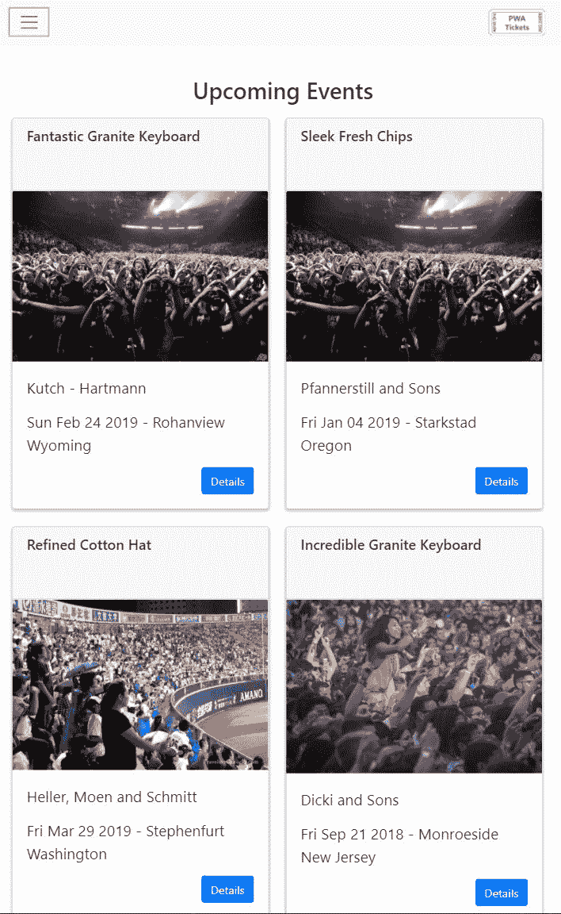

一个真实的门票服务应用程序将包括一套应用程序，包括管理应用程序和用于验证门票的应用程序。对于这本书，我将专注于消费者客户端体验。

应用程序的消费者版本具有用户登录、资料管理、访问未来事件列表、购买门票的能力以及用户的购票历史。

应用程序本身由实时 API 和静态网页组成，但本章真正关注的焦点是一些高级服务工作者概念。

服务工作者评估每个 `fetch` 请求并对其进行不同的处理。服务工作者预先缓存关键资源，但也为不同的路由定义自定义规则。

另一个新的高级概念是缓存失效的想法。这是你定义适用于缓存响应的规则，并确定是否应该发起网络请求以及使缓存失效的地方。这是一个重要的概念，因为它让你完全控制你的应用程序、缓存规则，并允许你管理缓存中存储的内容量。

PWA 门票应用程序将展示一些新的概念和策略，这将帮助你创建专业的渐进式 Web 应用，例如以下内容：

+   服务工作者模板

+   缓存失效

+   根据请求的 URL 触发不同的缓存策略

+   使用 `importScripts`

# 检查 PWA 门票应用程序

让我们看看应用程序将包含的不同部分。应用程序有八个主要页面区域：

+   首页

+   用户资料

+   活动

+   门票

+   购物车

+   联系方式

+   配置

+   登录

票务和事件都包含两个页面：一个是列表页，另一个是项目详情页。该应用还包含我们的第一个页面，这些页面会向 API 发起 POST 请求，而不仅仅是 GET 请求。这引入了一个新的`fetch`方法，我们的 service worker 必须正确处理。

首页列出了 10 个即将举行的事件，后面跟着用户购买的票务列表。每个条目都使用 bootstrap 卡片类进行样式化。每个票务卡片还有一个按钮来显示项目的详情。

用户个人资料页面列出了用户的联系信息和一些他们最近购买的票务。它还包含一个更新用户资料的按钮。这将切换视图从只读模式到编辑模式。

应用程序的导航包括事件、票务、个人资料、注销和一个搜索字段：

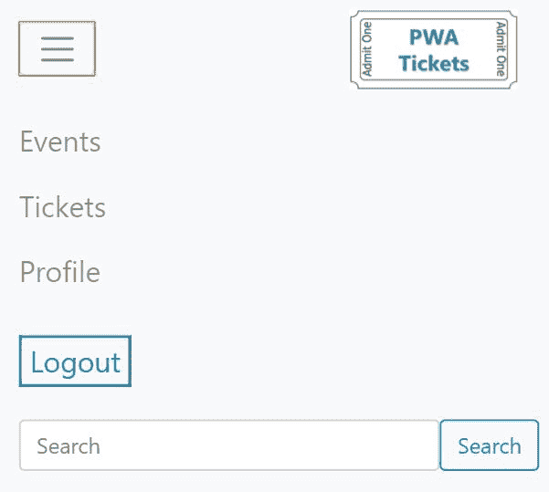

用户可以输入搜索词，无论他们处于哪个页面，都会自动更新以显示任何匹配的事件，而无需加载新页面。这是通过发起一个 AJAX 调用并在浏览器和 service worker 中渲染结果来实现的。

应用程序的 API 并不代表一个生产质量的搜索功能，但它服务于我们的目的。它将匹配搜索框中输入的任何包含的短语的事件。

事件页面将列出系统中所有可用的未来事件。同样，每个事件都是一个带有查看事件详情按钮的卡片。事件的详情页面显示了更多一些信息，并包括可供购买的票务列表：

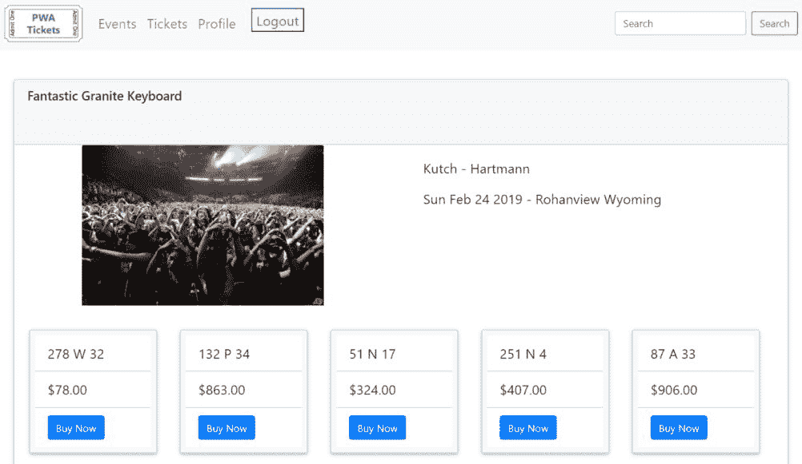

一个真正的票务服务应用会提供一种更复杂的方式来查找票务，但我希望为了演示目的保持其简单性。

当用户购买票务时，他们必须确认购买，然后它会被添加到他们的个人资料中。

在 Now 栏中选择票务链接会将用户带到他们购买的票务列表。从这里，他们可以查看任何票务的详情，包括一个二维码。二维码旨在模拟现代电子票务解决方案在进入场地或需要找到座位时 usher 和 gate agent 扫描的内容：

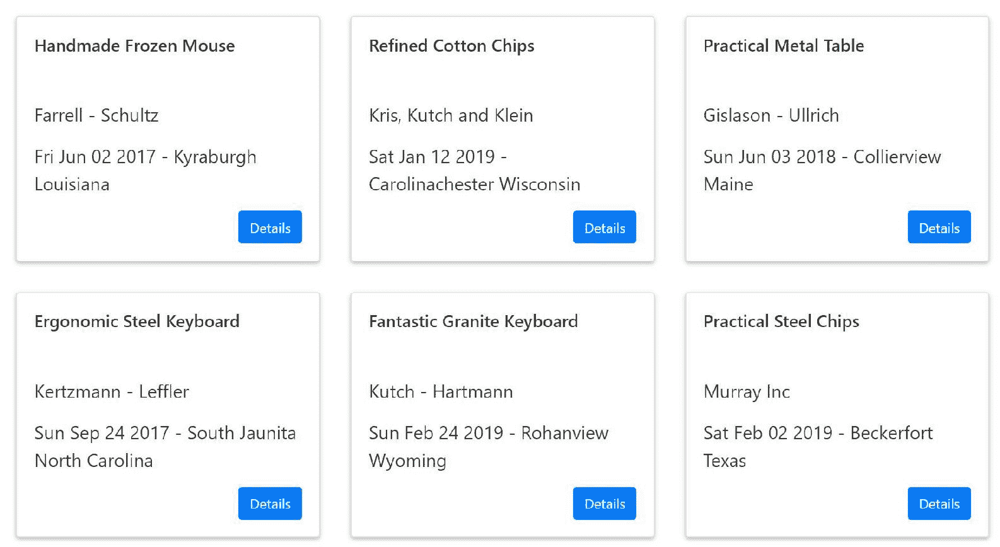

这就是 usher 的应用可以发挥作用的地方。他们可以使用手机扫描二维码以确认票务并允许顾客进入场地。

在这里还有一个联系页面，用户可以向系统管理员提交信息。这主要用于演示如何使用 fetch 和 service worker 来处理帖子消息。

最后，整个应用要求用户进行身份验证。每个页面都会快速验证用户是否已登录，如果没有，则会加载登录页面：

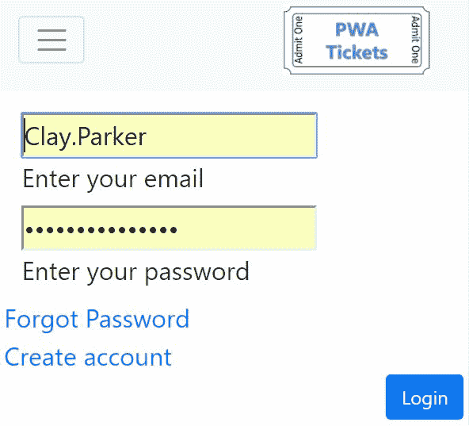

用户通过输入用户名和密码进行登录。凭证被发送到 API 进行验证。API 返回用户的个人资料，这模拟了一个身份验证令牌。身份验证令牌被持久化，并在每次页面加载前进行验证。

用户目前还没有可以选择的个人资料。他们可以使用创建新个人资料链接并将自己添加到系统中。

以下函数是应用程序的 API 调用，用于将用户登录到应用程序：

```js
   login: function (credentials) { 
          return fetch(api + 
               "users/?userName=" + 
                credentials.username + 
                "password=" + credentials.password) 
                .then(function (response) { 

                if (response.ok) { 
                      return response.json() 
                      .then(function (token) { 
                       if (token.length > 0) { 
                              return saveAuthToken(token[0]); 
                             } 
                           });
```

```js
                     } else { 
                     throw "user tickets fetch failed"; 
                    } 
                 }); 
        } 
```

注意，用户名和密码是通过`queryString`传递给 API 的。我通常不会这样做，但我需要一种与 json-server 一起工作的方式，它似乎没有提供使用 POST 匹配的自定义函数的方式。

您不希望在生产环境中这样做，因为这会暴露凭证。当将凭证作为请求体的一部分发送时，它们被 HTTPS 保护。

PWA 车票应用程序包含一个最小功能集，我认为这将有助于展示前三章中涵盖的概念。这个关于应用程序如何工作的介绍并没有涵盖所有内容。我邀请您克隆源代码([`github.com/docluv/pwa-ticket`](https://github.com/docluv/pwa-ticket))并在本地运行它。

# 使用 JSON 服务器作为 API

当您构建现代应用程序时，前端几乎总是通过 API 与数据源进行交互。API 是后端应用程序的入口，可以被任何客户端应用程序消费，例如渐进式 Web 应用程序。

当您不想首先开发整个 API 时，针对 API 进行开发可能会相当棘手。在播客应用程序中，我们只是加载了一个预渲染的 JSON 来模拟 API。播客应用程序只进行了 GET 请求，没有进行任何 POST 请求或尝试更新底层数据模型。

PWA 车票应用程序确实会进行 POST 请求并尝试更新底层数据模型，但与其构建整个基础设施，我找到了一个很好的解决方案：json-server([`github.com/typicode/json-server`](https://github.com/typicode/json-server))。这是一个类似于我们用于前几个应用程序的 http-server 的 node 模块。

json-server 的真正优势在于其内置的创建基于 JSON 数据模型的完整功能 API 的能力。您必须像安装任何其他 node 模块一样安装该模块：使用`npm install`并在您的`package.json`文件中包含对其的引用。

在您执行服务器之前，您必须创建一个数据源。这只是一个 JSON 文件。而不是手动创建数据和数据模型，我选择编写一个使用 faker 模块([`github.com/marak/Faker.js/`](https://github.com/marak/Faker.js/))的脚本。这也可以使用标准的 NPM 任务进行安装。

faker 是一个相当酷的 node 模块，允许你动态地为你生成大量虚假数据，以便你围绕这些数据构建应用程序。在我看来，这是前端和 Web 开发中更令人烦恼的方面之一，因为你需要大量数据来验证你的应用程序逻辑。然而，创建这些数据需要很长时间。Faker 消除了这个问题。

将 json-server 和 faker 结合使用，可以创建一个非常复杂和深入 API 和数据源。你可以使用这两个模块模拟你潜在 API 和后端的几乎所有方面。

在创建 PWA 票务应用程序的过程中，我多次修改数据模型，试图使其恰到好处。而不是手动编码所有数据，我能够编写一个脚本来从头开始重建数据库。

项目源代码库包括一个名为`utils`的顶级文件夹。在这个文件夹中，有几个脚本：一个用于生成虚假数据，另一个用于渲染页面。虚假数据脚本利用了 faker 和一些固定数据源的组合。

Faker 具有生成各种类型数据的能力，包括图像。然而，我发现它生成的和使用图像是一个缓慢的、随机的图像生成服务。与其依赖这些图像，我选择固定一组 8 张场馆图像和 8 张肖像图像。这 16 张图像存储在网站的`img`文件夹下。

你还会注意到一个生成二维码的方法。这也是通过一对 node 模块完成的：一个用于生成二维码图像，另一个用于将图像保存到磁盘。

每张票都会生成一个二维码，代表票的唯一标识符。生成的每个条形码图像都保存在网站的`barcodes`文件夹中。每个条形码图像是一个`.gif`文件，并且扩展名附加在其名称之后。

虽然这些 node 模块对于运行 PWA 票务应用程序至关重要，但它们与服务工作者和渐进式 Web 应用程序没有直接关系。我确实想花点时间解释它们是如何工作的，这样你就可以在本地使用源代码。

# 创建数据库和 API

JSON 服务器允许你通过支持基本的 CRUD 操作而不编写任何代码来托管本地 REST API。该 node 模块通过读取包含完整 JSON 对象的源文件来工作。PWA 票务应用程序依赖于 JSON 数据结构，如下所述：

```js
{ 
    tickets: [], 
    users: [], 
    futureEvents: [], 
    pastEvents: [], 
    contact: [] 
} 
```

你可以配置数据源以包含基于提供的参数返回数据的方法。我选择不这样做，以保持事情简单。因此，这解释了为什么使用`futureEvents`和`pastEvents`数组，而不是按需创建这些列表。

要执行`json-server`，使用带有`--watch`开关的命令行实用程序。watch 开关会导致`json-server`在源数据文件更新时更新：

```js
json-server --watch db.json 
```

PWA 票据源代码在根目录中有 `db.json` 数据源文件。服务器创建 RESTful 端点，映射到顶级对象的名称。它还充当静态文件服务器。你只需注意数据文件中的对象和页面之间的重叠路径。

在创建此演示应用程序时，我遇到了使用 `json-server` 在同一站点重复路由的场景。这迫使我运行两个网络服务器实例：一个用于 API，一个用于网站。

对于基于 localhost 的服务器，你可以指定不同的端口号来运行多个本地服务器。你可以通过在命令行界面添加 `-port` 开关来定义端口号：

```js
json-server --watch db.json -port 15501 
```

在尝试启动仅静态网络服务器的实例时，我遇到了一些挫折，所以我选择使用 `json-server` 启动 API，并使用 `http-server` 启动静态网站。

你可以从命令行运行两个本地网络服务器，每个服务器一个控制台实例，因为它们正在运行服务器：

```js
>npm run api-server 
>npm run web-server 
```

在不同的端口上运行 API 服务器的一个优点是它有助于模拟跨域访问，或称为 CORS。

CORS 代表 **跨源资源共享**，是为了允许浏览器更安全地请求外部域的资源而创建的。它依赖于浏览器使用额外的头信息来管理对外部资源的访问，通常是通过 AJAX 实现的。

服务器会添加 CORS 特定的头信息，以告知浏览器哪些域名可以访问资源。

要检索数据，你可以加载一个与 API 服务器和对象名称相对应的 URI：

```js
http://localhost:15501/users/
```

此示例 URL 返回一个用户对象的数组：

```js
[ 
  { 
    "id": "891ad435-41f3-4b83-929b-18d8870a53a4", 
    "firstName": "Catharine", 
    "lastName": "Cormier", 
    "mugshot": "avtar-2.jpg", 
    "userName": "Clay.Parker", 
    "password": "93gQtXaB0Tc3JM5", 
    "streetAddress": "401 Kassulke Square", 
    "city": "Cronintown", 
    "state": "Vermont", 
    "zipCode": "09904-5827", 
    "email": "Bradly_Fahey56@gmail.com", 
    "phoneNumber": "400.748.9656 x0600", 
    "tickets": [...] 
  }, {...} 
] 
```

json-server 提供了更多高级功能，但这应该足以让你了解如何在本地运行站点。

# 使用 faker

在你可以使用 json-server 托管 API 之前，你需要源数据文件。这正是 faker 模块发挥作用的地方。为真实测试环境创建足够的数据始终是我面临的最大挑战之一。今天，似乎大多数平台都有像 faker 这样的库或工具。

由于我大多数项目都使用 Node.js，因此 faker 是一个突出的强大工具。它只需要一个脚本来生成数据。此脚本位于 `/utils` 文件夹中的 `generate-fake-data.js`：

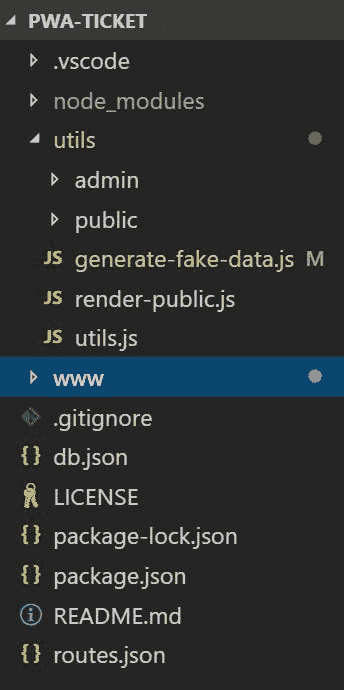

此脚本不仅帮助我生成了文件数据集，还允许我在整体模型演变的过程中不断修改源数据。

此脚本生成随机数量的用户、事件和票据，并将它们随机映射在一起以创建完整的数据库。

我不会详细介绍 `faker` 可用的所有可能的数据类型。这是脚本生成新用户的方式：

```js
    let user = { 
        "id": faker.random.uuid(), 
        "firstName": faker.name.firstName(), 
        "lastName": faker.name.lastName(), 
        "mugshot": mugshots[mugshot], 
        "userName": faker.internet.userName(), 
        "password": faker.internet.password(), 
        "streetAddress": faker.address.streetAddress(), 
        "city": faker.address.city(), 
        "state": faker.address.state(), 
        "zipCode": faker.address.zipCode(), 
        "email": faker.internet.email(), 
        "phoneNumber": faker.phone.phoneNumber() 
    } 
```

`faker` 对象具有不同的顶级数据类型，并提供各种方法来生成格式正确、随机的数据。

由 faker 生成的数据值处于正确的或预期的格式。我喜欢它生成的一些文本值。我鼓励你阅读其中的一些，因为它们创造了一些相当幽默的值和组合！例如，*通用塑料奶酪*。

脚本是自包含的，每次运行时都会创建一个新的数据库。此外，当你使用 `-watch` 开关启动 json-server 时，API 将自动更新以适应新数据。

数据库的下一个方面仍然是：二维码！

# 生成二维码

现代票务解决方案更多地关注条形码和二维码，而不是实体票。为了创建逼真的票务应用程序，我需要为每张票创建自定义的二维码。同样，一对 node 模块使这一过程变得非常简单：`qr-encode` ([`cryptocoinjs.com/modules/misc/qr-encode/`](http://cryptocoinjs.com/modules/misc/qr-encode/)) 和 `ba64`([`www.npmjs.com/package/ba64`](https://www.npmjs.com/package/ba64))。

`qr-encode` 将字符串转换为多种二维码选项之一。以下代码展示了如何使用 `qr` 方法生成 `dataURI`：

```js
    let dataURI = qr(id, { 
        type: 6, 
        size: 6, 
        level: 'Q' 
    }); 
```

`qr` 方法返回一个 `base64` 编码的数据缓冲区。你仍然需要将其转换为物理文件。这正是 `ba64` 发挥作用的地方。它将 `base64` 编码的缓冲区转换为文件：

```js
ba64.writeImageSync(qrCodePath + "/" + id, dataURI); 
```

`qrCodePath` 指向 `public/qrcodes` 文件夹的本地路径。脚本将删除现有的二维码图像文件，并在每张票生成时创建新的二维码：


二维码编码了票的唯一标识符，这是一个由 faker 生成的 GUID。这确保了每张票可以通过扫描二维码来识别。

现在数据已经生成，我们也有了服务 API 和网站的方法，我们只需要一件事：网站。

# 渲染网站

2048 和 Podstr 应用程序基于静态网站。虽然 Podstr 应用程序使用了一些动态渲染的页面，但大部分是预先渲染的。它还有一个创建 HTML 页面的脚本，但这个脚本在演示中并不像 PWA 票务应用程序那样关键。

PWA 票务应用程序有一个脚本，通过结合应用程序外壳和实际页面的单个页面标记来渲染核心页面。这很方便，因为它允许你独立更新应用程序外壳和页面，以及为不同的环境定制渲染脚本。

例如，在部署到生产环境之前，你可能想要捆绑和压缩一些样式表和脚本。正如你将在下一章中看到的，你还将想要使用工具减少资产，例如使用样式。

源标记文件位于网站的 HTML 文件夹中，分别是 `/public/html` 和 `/public/html/pages`。渲染脚本会遍历这些文件，并加载定义页面特定配置数据的相应数据文件：

```js
{ 
    "name": "events", 
    "slug": "events", 
    "scripts": ["js/app/pages/events.js"], 
    "css": [] 
} 
```

PWA 票据应用有一些简单的配置对象。这些属性用于定义每个页面中的组件，如路由或文件夹，用于保存最终渲染的文件。这些属性在渲染管道中使用，以基于通用模板生成最终页面。

脚本是从命令行运行的：

```js
>node render-public 
```

控制台将记录每个页面的渲染过程。

PWA 票据应用比 Podstr 应用更先进，因为大多数页面都是在客户端渲染的，而不是作为一个完整的静态网站。票据应用依赖于客户端渲染的原因是每个页面都与用户的个人资料和购票相关。

本章将探讨这些场景以及服务工作者如何增强整体体验。

# PWA 票据的渲染架构和逻辑

我们在本书中较早地介绍了应用壳的概念。快速回顾一下，这是应用使用一个通用的标记文件来管理常见的`HEAD`和布局功能的地方。然后这个壳与单个页面结合，组成每个页面。

由于最近单页应用的兴起，这个概念得到了广泛的应用。渐进式 Web 应用可以从中受益，但不需要依赖于在 UI 线程中渲染标记。

相反，标记可以在服务工作者中渲染。技术类似：它使用`Mustache`，一个 JavaScript 模板库，将数据合并到标记模板中。渲染的页面标记返回给客户端。我将在本章稍后回顾这段代码。

这种技术是最终缓存策略的实用应用，即*Service Worker 模板化*，这在第七章 Service Worker 缓存模式中讨论过。

# PWA 票据的 JavaScript 架构

与 Podstr 应用类似，PWA 票据应用结合了第三方库和应用特定的 JavaScript。

下面的截图显示了 JavaScript 文件在源代码中的组织方式：

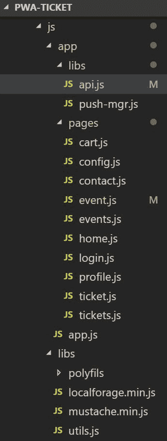

定制的服务工作者逻辑或工作流程利用不同的库在客户端渲染内容。两个第三方库是用于`IndexedDB`交互的`localForage`和用于渲染标记的`Mustache`。

`localForage` ([`localforage.github.io/localForage/`](https://localforage.github.io/localForage/)) 是另一个`IndexedDB`包装器。它提供了一个简单的接口，模仿`localStorage`。主要区别在于`localForage`支持`Promise`，使其异步。

有三个`polyfills`，它们是`Object.assign`、`Promise`和`Fetch`。

每个页面使用一些特定于应用的库：`api`和`push-mgr`，以及通用应用模块。每个页面都有一个特定的脚本来驱动用户体验。

应用程序模块处理常见的 UI 组件，包括汉堡菜单切换、注销、搜索和身份验证验证。它还注册了服务工作者并在较高层次上管理推送通知。

由于常见的用户界面很简单，我将这些组件合并到单个脚本中，以保持管理简单。请注意，没有引用 jQuery 或更复杂的框架来驱动 UI。整个应用程序脚本大约有 200 行整齐排列的代码。单个页面脚本要短得多，因此没有很多特定于应用程序的代码。

`api.js`文件是一个包含与应用程序 API 交互方法的模块。由于应用程序较小，我将所有方法放置在单个模块中。对于更复杂的应用程序，您可能希望重构为独立的模块以使代码更容易维护：

```js
var pwaTicketAPI = (function () { 

    var api = "http://localhost:15501/", 
        authToken = "auth-token"; 

    function saveAuthToken(token) { 

        return localforage.setItem(authToken, token) 
            .then(function () { 
                return token; 
            }); 
     }
```

```js
    return { 
      //API wrapper methods go here 
    }; 

})(); 
```

此方法创建了一个全局变量`pwaTicketAPI`，可以被单个页面控制器模块访问以与 API 交互。

每种方法都封装了对 API 端点的获取调用：

```js
getUser: function (userId) { 

    return fetch(api + "users/" + userId) 
        .then(function (response) { 

            if (response.ok) { 
               return response.json();  
            } else { 

                throw "user tickets fetch failed"; 
            } 
        }); 
}, 
```

大多数 API 方法执行 GET 请求，但少数方法执行 POST 请求以更新或创建新记录：

```js
updateUser: function (user) { 

    return fetch({ 
        "method": "POST", 
        "Content-Type": "application/json", 
        "body": JSON.stringify(user), 
        "url": api + "users/" 
    }); 
}, 
```

每个页面控制器都使用**立即调用的函数表达式**（**IIFE**）来隔离页面逻辑与全局作用域：

```js
(function () { 

//no need to render if service workers are supported 
//unless the service worker is not in control of the page yet. 
//test if the loader element exists. If so then fetch the data to //render 
if (_d.qs(".loader")) { 
        pwaTicketAPI.loadTemplate("templates/event.html") 
       .then(function (template) { 

         if (template) {                        
           pwaTicketAPI.getEvent(pwaTickets.getParameterByName("id")) 
            .then(function (event) { 

         var target = _d.qs(".content-target"); 

         target.innerHTML = Mustache.render(template, event); 
           }); 
            } 
            }) 
            .catch(function (err) { 
               console.log(err); 
         }); 
    } 
})(); 
```

每个页面都遵循从 API 获取数据并渲染标记以构建页面的通用模式。大多数页面都有一个带有旋转圆盘的占位符。当渲染标记时，它会替换：

```js
<div class="loader"></div> 
```

主应用程序外壳有一个具有`content-target`类的`main`元素。这个类名用作选择元素的参考，并使用动态渲染的文本设置内部 HTML：

```js
    <main class="page-content content-target"> 
        <%template%> 
    </main> 
```

你应该已经注意到了我如何使用`_d.qs()`来选择目标元素。这是一个简单的实用程序对象，我创建它来消除编写`document.querySelector()`和相关选择器方法的需要。我不知道你是否和我一样，但我厌倦了到处输入这些内容，而且对于 jQuery 的选择器语法来说有点长：

```js
var _d = { 
    qs: function (s) { 
        return document.querySelector(s); 
    }, 
    qsa: function (s) { 
        return document.querySelectorAll(s); 
    }, 
    gei: function (s) { 
        return document.getElementById(s); 
    }, 
    gen: function (s) { 
        return document.getElementsByName(s); 
    } 
}; 
```

此实用程序提供了一个简单的简写来选择元素，但无需 jQuery 的开销。

# PWA 票据服务工作者架构

2048 和 Podstr 应用程序依赖于单个脚本。PWA 票据应用程序使用更复杂的技巧，如导入库来驱动逻辑。

服务工作者可以使用`importScripts`方法加载外部脚本。此函数在全局范围内可用，并接受一个 URL 数组。这些是额外的脚本，工作方式类似于 node.js 的`require`系统：

```js
self.importScripts("js/libs/localforage.min.js", 
    "js/app/libs/api.js",  
    "sw/response-mgr.js",  
    "sw/push-mgr.js", 
    "sw/invalidation-mgr.js",  
    "sw/date-mgr.js" 
); 
```

前两个脚本也用于客户端代码。`localForage`是一个`IndexedDB`包装器，API 脚本管理对 API 和身份验证令牌的访问。`Mustache`库文件在`ResponseManager`模块中导入，我将在稍后介绍其用法。

剩余的脚本是一些常见的服务工作者库，用于帮助缓存策略，例如缓存失效和推送管理。每个服务工作者库都包含一个 JavaScript 类，其中包含用于管理缓存策略和生命周期的方法。

导入脚本是将服务工作者逻辑重构为更小单元的绝佳方式，这些单元可以复用且更容易维护。我审查了几个超过 10,000 行代码的服务工作者。每次你有一个大代码文件时，你往往会引入不希望出现的维护问题。

大代码文件首先造成的问题是导航代码。即使有现代开发环境和不错的键盘快捷键，也很容易在代码中迷失方向。如果你曾经浪费时间寻找函数和协调变量，你就知道这是什么感觉。

另一个常见问题是管理团队对代码的访问。当你有两个或更多开发者同时在一个文件上工作时，这会引入太多的代码合并机会。代码合并是我最不喜欢的开发者活动之一，尤其是当其他人编写了另一个版本时。

当创建大文件时，我看到的最后一个问题是缺乏代码复用。当你将代码重构为更小的模块时，它们不仅专注于单一职责，类、模块等还可以在其他应用程序区域或不同应用程序中复用。

这就是为什么我喜欢在服务工作者中导入脚本。2048 服务工作者非常简单，并不需要这种策略。Podstr 应用可以使用`importScripts`功能，但我选择将其保留到今天。对于 Podstr 的真正生产版本，我必须重构代码以导入不同的脚本。

将脚本导入服务工作者的一个缺点是关于脚本的更新。当服务工作者更新时，它们不会更新。不幸的是，我仍然不清楚这些文件何时会从服务器更新。我读过一些参考资料说导入的脚本应该遵循正常的浏览器缓存或缓存控制失效，而其他人声称这并没有按预期工作。

在规范讨论中，有一些关于这个问题的开放讨论，但到目前为止，我认为还没有采用真正的解决方案。

无论哪种方式，在开发过程中，这个问题可能会非常令人沮丧。你需要频繁更新这些文件，因为代码更新。我发现强制这些文件更新的最佳方式是手动注销服务工作者。

在注销服务工作者后，重新加载页面会再次注册服务工作者，并执行`importScripts`方法。

目前我在 Chrome 开发者工具中看到的一个与这种技术相关的*bug*是，每个注销的服务工作者都会在工具中留下痕迹：

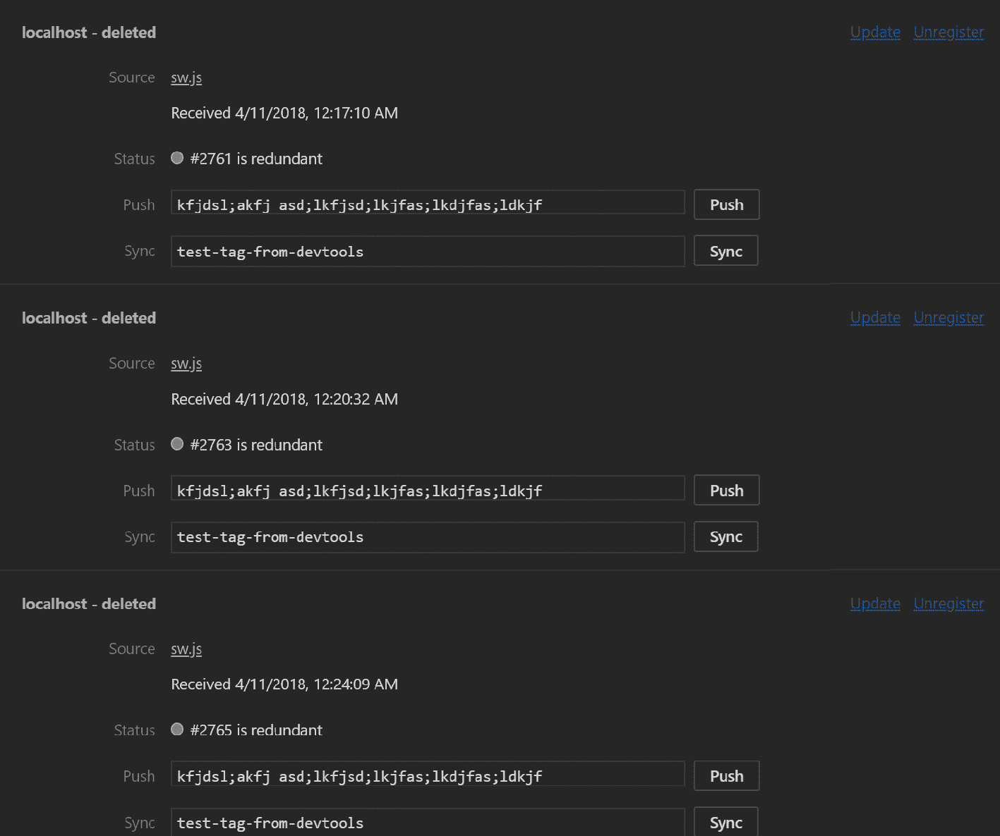

您可以关闭工具以重置服务工作者面板。如果您可以忍受向下滚动到当前的活动服务工作者，您可以避免此步骤。我认为这只是一个问题，即当手动注销服务工作者时，开发者工具 UI 没有正确刷新。

`importScripts` 也可以用于由服务工作者导入的任何脚本。实际上，服务工作者的全局作用域对这些脚本可用。在服务工作者全局作用域中声明的任何变量在脚本中都是可用的。这也适用于从其他导入的脚本导出的任何对象。

节点请求系统与 `importScript` 方法类似。它们都加载外部脚本以创建您可以在脚本中使用的方法和对象，在这种情况下是服务工作者。

# ResponseManager

`ResponseManager` 包含与第七章（[part0152.html#4GULG0-f12cdcca08b54960b3d271452dc7667d]）中介绍的一些缓存策略相关的常用逻辑，即 *Service Worker 缓存模式*。`ResponseManager` 类包含一组压缩的缓存策略及其对应的方法，用于五种缓存策略：

+   仅缓存

+   仅网络

+   缓存回退到网络

+   缓存回退到网络并缓存响应

+   缓存回退到网络、渲染结果和缓存

这是 `ResponseManager` 类的定义以及方法签名：

```js

class ResponseManager { 
   fetchText(url) {...} 
   fetchJSON(url) {...} 
   fetchAndRenderResponseCache(options) {...} 
   cacheFallingBackToNetwork(request, cacheName) {...} 
   cacheFallingBackToNetworkCache(request, cacheName) {...} 
   cacheOnly(request, cacheName) {...} 
   networkOnly(request) {...} 

} 
```

`cacheOnly` 和 `networkOnly` 方法确实如其名称所暗示的那样，要么只从缓存返回响应，要么只从网络返回响应：

```js
cacheOnly(request, cacheName) { 
    return caches.match(request); 
} 

networkOnly(request) { 
    return fetch(request); 
}
```

`cacheFallingBackToNetwork` 检查是否有缓存响应，如果没有，则通过网络请求获取响应。响应不会被缓存。

`cacheFallingBackToNetworkCache` 重复了该逻辑，但会缓存网络响应。

有两个额外的辅助方法，分别是 `fetchText` 和 `fetchJson`。这两个方法专门帮助渲染结果策略检索 HTML 模板并从 API 获取 JSON 数据。

`fetchText` 用于检索 HTML 文件。`fetchJSON` 通过 API 调用获取数据。`fetchAndRenderCache` 方法使用提供的选项参数执行 API 调用。

我在之前的章节中介绍了这些缓存策略的核心概念。然而，我确实想回顾一下 `fetchAndRenderCache` 策略，因为它没有详细说明。

该策略的目标是在服务工作者中动态渲染响应并将其缓存以供下一次请求使用。这在像 PWA 票务应用程序这样的高度动态应用程序中效果很好。

虽然您可以在服务器上为任何应用程序预先渲染所有 HTML 页面，但这可能不如按需渲染高效或成本效益高。在过去，我们依赖于服务器上的运行时渲染系统，如 ASP.NET、PHP 等，以及客户端的大型单页应用程序框架。

无论您如何渲染标记，过程始终相同。您将数据与标记模板合并。您所使用的引擎利用某种合并字段语法，并用源数据中匹配的值替换这些字段。

我更喜欢使用`Mustache` ([`mustache.github.io/`](http://mustache.github.io/))，因为其语法相对简单：

```js
<div class="card ticket-card" id="{{id}}"> 
    <div class="card-header"> 
        <h5 class="card-title">{{event.title}}</h5> 
    </div> 
    <div class="row"> 
        <div class="col-md-6 text-center"> 
             
        </div> 
        <div class="col-md-6"> 
            <div class="card-body"> 
                <p class="card-text">{{event.venue}}</p> 
                <p class="card-text">{{event.date}} - {{event.city}} 
                {{event.state}}</p> 
                <p class="card-text">{{id}}</p> 
            </div> 
            <ul class="list-group list-group-flush"> 
                <li class="list-group-item">Section {{section}}</li> 
                <li class="list-group-item">Row {{row}}</li> 
                <li class="list-group-item">Seat {{seat}}</li> 
            </ul> 
        </div> 
    </div> 
</div> 
```

`Mustache`的名字来源于使用两个花括号来表示合并字段。渲染方法将 JSON 对象的属性与匹配的字段名合并。它可以使用相同的模板处理单个记录或创建重复的列表。它还支持基本的`if...else`逻辑和一些其他功能。

PWA 票据应用程序在大多数页面中使用`Mustache`模板，无论是单个记录还是列表。应用程序模板存储在`/templates`文件夹中：

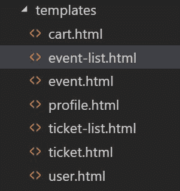

JavaScript `Mustache`库可以在客户端或作为 node 模块使用。我在许多应用程序中在服务器和客户端都使用它。它很棒，因为您可以在应用程序的任何地方使用单个模板，而不用担心渲染库的不同。

如果您正在遵循任何主流 JavaScript 框架，它们都有成熟的服务器端渲染组件。我认为这是一个重要的趋势，因为这些框架已经导致了许多性能问题，并使许多网站无法在搜索引擎中索引。

这些服务器端组件的兴起应该会给这些框架带来更长的生命周期，并帮助他们通过将重逻辑移动到服务器来提供更好的用户体验。这对开发者来说也很好，因为许多开发者已经投入了大量时间学习他们的专有语法。

`fetchAndRenderResponseCache`方法执行服务工作者级别的运行时渲染。它接受一个包含不同属性的选项参数，这些属性是驱动策略所必需的。

我强烈建议将此方法与一个调用缓存来查看响应是否可用的调用配对。`ResponseManager`有一个可以使用的`cacheOnly`方法：

```js
responseManager.cacheOnly(request, runtimeCache) 
  .then(response => { 
   return response ||  
             responseManager.fetchAndRenderResponseCache({...}); 
}); 
```

该方法使用一个 JavaScript 对象作为其唯一参数。它应该具有以下属性：

```js
{ 
    request: //the request that triggered the fetch 
    pageURL: "url to core page html", 
    template: "url to the data template", 
    api: //a method to execute that makes the API call, 
    cacheName: "cache name to save the rendered response" 
} 
```

这些值用于驱动逻辑，并使其足够灵活，可以在任何应用程序的不同页面和组件中重用：

```js
fetchAndRenderResponseCache(options) { 
    return fetchText(options.pageURL) 
        .then(pageHTML => { 
            return fetchText(options.template) 
                .then(template => { 
                    return pageHTML.replace(/<%template%>/g, template); 
                }); 
        }) 
```

序列中的第一步是检索页面的 HTML。这是通过将`pageURL`值传递给`fetchText`方法来完成的。这应该解析页面的核心 HTML。

接下来，使用相同的方法获取模板。这次，将解析后的模板 HTML 注入到`pageHTML`中。它是通过在 HTML 页面中替换自定义标记`/<%template%>/g`来做到这一点的。同样，这是为了使页面模板更加灵活。您可以使用模板预渲染整个页面。

我这样做是因为我想让应用程序能够在不支持服务工作者的情况下回退到使用经典客户端渲染。

在这个阶段，你应该已经拥有了页面的完整 HTML，只是还没有用数据来渲染。接下来的步骤是使用提供的方法从 API 中检索数据。这个方法应该返回一个 promise，这意味着你可以直接返回用于调用 API 的 fetch：

```js
        .then(pageTemplate => { 
            return options.api() 
                .then(data => { 
                    return Mustache.render(pageTemplate, data); 
                }); 
```

API 方法应该将响应解析为 JSON。然后使用`pageTemplate`和`Mustache.render`方法渲染数据。这样就创建了我们所需要的最终 HTML！

现在来点酷炫的魔法。逻辑创建了一个新的`Response`对象并克隆了它。克隆被保存到命名的缓存中，新的响应被返回以便可以用于用户渲染：

```js

        }).then(html => { 

            //make custom response 
            let response = new Response(html, { 
                    headers: { 
                        'content-type': 'text/html' 
                    } 
                }), 
                copy = response.clone(); 

            caches.open(options.cacheName) 
                .then(cache => { 
                    cache.put(options.request, copy); 
                }); 

            return response; 

        }); 
} 
```

这可能看起来像是一项繁重的工作，但假设 API 调用很快，这可以很快完成。我确实建议预先缓存页面和数据模板标记。预缓存是一个很好的地方来做这件事。

你还可以考虑将这些响应缓存到一个特殊的模板缓存中，这样你就可以应用适当的失效规则，确保它们不会变得过于陈旧。

# 使用请求方法确定缓存策略

HTTP 的一个神奇之处在于它使用不同的属性来触发操作。HTTP 方法提供了一种描述性的方式来触发响应。有各种可能的 HTTP 方法，其中 PUT、GET、POST 和 DELETE 是最常见的方法。

这些方法对应于**创建**、**检索**、**更新**和**删除**（**CRUD**）操作。缓存是一个强大的工具，可以使你的应用程序响应更快，但并非所有响应都应该被缓存。HTTP 方法可以是一个触发适当缓存策略的主要信号。

前两个应用程序，2048 和 Podstr，仅使用 GET 请求。PWA 票据应用程序使用 POST 方法，这些方法不应该被缓存。当用户注册、*购买*票据、更新他们的个人资料或提交联系请求时，会向 API 发送 POST 请求。

API 响应通常用于确定成功或某种失败状态。这些响应不应该被缓存。如果它们被缓存，你的请求可能不会被发送到服务器：

```js
if (!responseManager.isResponseNotFound(response)  
    request.method.toUpperCase() === "GET"  
    request.url.indexOf("chrome-extension") === -1  
    responseManager.isResponseCacheable(response)) { 

    //cache response here 
} 
```

# 匹配路由与缓存策略

利用不同的缓存策略涉及到一种触发特定策略以针对不同响应类型或路由的方式。你的应用程序越复杂，你可能需要管理的潜在路由和媒体类型就越多。

这可以通过定义一个由 URL 路由驱动的规则数组来完成。我建议使用正则表达式来匹配路由，尤其是在路由有一个与大量选项的共同基础时。一个很好的例子是一个电子商务网站的产品详情页面。这可能是一个指向预渲染页面的 URL，或者可能涉及一个`QueryString`值。

对于 PWA 票据应用程序，我将演示如何使用正则表达式定义一个用于活动详情的动态路由，以及另一个用于二维码图像的路由。

QR 码请求触发缓存回退到网络，然后缓存响应模式。事件请求触发服务工作者渲染策略。这涉及一个额外的属性，其中包含驱动策略的值：

```js
routeRules = [ 
{ 
    "url": /event?/, 
    "strategy": "fetchAndRenderResponseCache", 
    "options": {...}, 
    "cacheName": eventsCacheName 
},  
{ 
    "url": /qrcodes?/, 
    "strategy": "cacheFallingBackToNetworkCache", 
    "cacheName": qrCodesCacheName 
}  
]; 
```

而不是有一个复杂的 fetch 事件处理器，你应该将逻辑重构为单独的方法。将事件对象传递给你的处理器：

```js
self.addEventListener("fetch", event => { 
    event.respondWith( 
        handleResponse(event) 
    ); 
});
```

通过将请求的 URL 与规则数组中的每个规则的`url`值进行测试，发生魔法般的事情。这是通过使用 JavaScript 的正则表达式`test()`方法完成的：

```js
function testRequestRule(url, rules) { 

    for (let i = 0; i < rules.length - 1; i++) { 

        if (rules[i].route.test(url)) { 
            return rules[i]; 
        } 
    } 
} 
```

此方法返回匹配的规则对象。如果没有定义匹配规则，你可以将规则值合并到一个空对象中：

```js
function handleResponse(event) { 

    let cacheName = getCacheName(event.request.url); 
    let rule = testRequestRule(event.request.url, routeRules); 

    rule = rule || {}; 

    switch(rule.strategy){ 
       // 
    } 
} 
```

在识别到匹配规则后，可以使用 JavaScript 的 switch 语句执行策略。`responseManager`具有每个策略的逻辑。确保传递`request`对象和目标`cacheName`：

```js
    case "cacheFallingBackToNetwork": 

        return responseManager.cacheFallingBackToNetworkCache(event.request, 
        cacheName); 

        break; 
```

我喜欢将缓存回退到网络缓存的响应作为我的默认策略。通过在 case 表达式中堆叠此策略，代码只需包含一次：

```js
    case "cacheFallingBackToNetworkCache": 
    default: 
         return   
        responseManager.cacheFallingBackToNetworkCache(event.request, 
        cacheName) 
            .then(response => { 

                invalidationManager.cacheCleanUp(cacheName); 
                return response; 

            }); 

        break; 
```

此方法依赖于配置路由及其相应的缓存策略。这与 WorkBox 方法类似。我将在下一章中探讨 Workbox，这是一个帮助您构建复杂服务工作者的 Node 模块。

# 缓存失效策略

就像有缓存策略一样，还有你可以采用的缓存失效策略来防止缓存失控。PWA 票据应用程序使用最大项策略来控制缓存的响应数量，但你还可以使用其他策略。

# 唯一哈希名称和长生存期值

使用哈希值在文件名中是一种流行的技术，可以简化具有长生存期值的资产的更新。这是因为基于文件内容的哈希值意味着算法生成了一个相对唯一的价值。

唯一名称为资产创建一个新的 URL，并分配一个新的 Cache-Control 值给资产。这对于样式表、脚本、图像和其他静态资源都适用。

MD5 哈希值是创建这些唯一值最常见的方式。Node.js 有一个内置的`crypto`模块，具有 MD5 哈希功能：

```js
function getHash(data) { 
    var md5 = crypto.createHash('md5'); 
    md5.update(data); 

    return md5.digest('hex'); 
} 
```

数据参数是文件的内容。对于样式表或脚本，数据是文件中的文本。摘要是一个可以用来命名文件的唯一值：

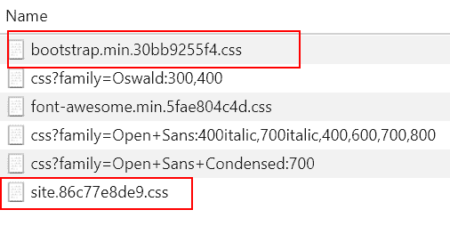

这种技术效果很好，但需要相当复杂的构建过程来更新所有引用文件的文件名。我不鼓励在本地开发环境中使用此技术，但对于生产环境，这是一个非常强大的缓存破坏技术。只需记住，您需要更新所有 HTML 文件中的引用，以及可能引用这些唯一文件名的服务工作者或其他文件。

我认为这对许多网站来说可能有点复杂，尤其是在没有支持此技术的正式系统的情况下。如果哈希技术对开发者来说是透明的，并且几乎是自动的，那就最好了。

不幸的是，这并不常见。您还可以利用其他技术，这些技术提供了更细粒度的控制，并且可能对您缓存的数据量有更多的控制。以下技术可以在您的服务工作者中使用，以管理响应的缓存时间。

# 缓存中的最大项数

一个更简单的缓存失效策略是限制持久项的数量。我称之为**最大项失效**。

这需要服务工作者逻辑来检查特定命名的缓存中保存了多少项。如果缓存已保存最大数量的响应，则在添加新项之前至少会移除一个响应。

这种策略需要多个命名缓存，这些缓存与不同类型的响应相关联。每个命名缓存可以分配不同的项限制，以管理不同类型的响应。您还可以分配不同的缓存失效策略，这将在稍后讨论。

票务应用程序为事件命名了缓存，这些事件在请求时动态渲染。我随意选择了 20 个事件的限制，以便更容易展示策略。它还有一个名为缓存二维码的缓存，限制为五个响应，这同样有些随意。

您需要为您的应用程序和响应类型选择一个合适的值。记住，您的存储配额是所有不同存储介质的组合，并且根据设备和容量而变化。

我通常为文本响应使用更宽松的值，为像图像这样的二进制文件使用较小的值。直到您知道您的客户如何使用您的网站，您可能需要调整此值。

如果您管理像 Amazon.com 这样的网站，您将能够访问数据，这些数据告诉您用户在平均会话中访问了多少个产品。因此，您可能确保可以缓存那么多的产品页面和相关图像。我可能会缓存他们大部分的观看列表产品和购物车中的所有内容。

每个网站和应用都是不同的，在这些网站中，有独特的页面和数据类型需要不同的缓存限制：

```js
    maxItems(options) { 

        self.caches.open(options.cacheName) 
            .then((cache) => { 

                cache.keys().then((keys) => { 

                    if (keys.length > options.strategyOptions.max) { 

                        let purge = keys.length - 
                        options.strategyOptions.max; 

                        for (let i = 0; i < purge; i++) { 
                            cache.delete(keys[i]); 
                        } 

                    } 

                }); 
            }); 
    } 
```

就像没有限制总项数的神奇数字一样，不是所有的缓存都应该通过最大项数来限制。您还应该考虑基于时间来限制。

# 使用生存时间清除陈旧的响应

下一个缓存失效策略是基于响应可以缓存多长时间。如果您无法访问 Cache-Control 头，确定响应的缓存时间可能会很具挑战性。

好消息是，Cache-Control 头部并不是确定响应缓存生命周期的唯一方式。当响应被添加到命名缓存中时，会添加一个 `"date"` 值。你可以使用缓存的日期值来为缓存的响应应用超时规则：

```js
let responseDate = new Date(response.headers.get("date")), 
  currentDate = Date.now(); 

if(!DateManager.compareDates(currentDate,  
  DateManager.addSecondsToDate(responseDate, 300))) { 
    cache.add(request); 
}else{ 
    cache.delete(request); 
} 
```

当缓存的响应变得过时时，你可以删除它。下次请求该资产时，默认的缓存策略会触发。

# 执行 ResponseManager

而不是在服务工作者的 `fetch` 事件处理器中直接编写一个复杂的程序来获取和缓存响应，你可以使用 `ResponseManager`。因为缓存策略逻辑包含在模块中，你可以传递请求和 `cacheName` 来执行：

```js
self.addEventListener("fetch", event => { 

    let cacheName = getCacheName(event.request.url); 

    event.respondWith( 

        responseManager.cacheFallingBackToNetworkCache(event.request, 
        cacheName) 
        .then(response => { 

          invalidationManager.cacheCleanUp(cacheName); 

          return response;     
        })     
    ); 
}); 
```

在这个例子中，响应作为承诺链的结果返回。它还执行缓存的 `InvalidatationManager.cacheCleanUp` 方法，以确保缓存中不包含太多项目或过时项目。

# 无效化管理器

无效化管理器是一个特殊的模块，用于处理实现最大项目和生存时间无效化策略。脚本使用 `importScripts` 方法导入到服务工作者中：

```js
invalidationManager = new InvalidationManager([{ 
        "cacheName": preCache, 
        "invalidationStrategy": "ttl", 
        "strategyOptions": { 
          "ttl": 604800 //1 week }
         },
        { "cacheName": qrCodesCacheName,
          "invalidationStrategy": "maxItems",
          "strategyOptions": { "max": 10 }
        }]);
```

此模块有一个名为 `cacheCleanup` 的方法，它遍历在构造函数中提供的无效化规则集，如前所述。在遍历规则时，它针对命名缓存执行每个策略。无效化规则是在类实例化时通过传递规则数组定义的。

该类可以处理两种无效化策略，即 `maxItems` 和 `ttl`（生存时间）。规则数组中的每个项目都是一个对象，定义了命名缓存、应用于缓存的策略和策略的选项。

`ttl` 的 `strategyOptions` 是缓存项目可以保持缓存的最大时间框架。在前面的例子中，`preCached` 项目可以在一周后才会被清除。一旦被清除，就会发起网络请求，更新资产。

`maxItems` 的 `strategyOptions` 有一个 `max` 属性，它定义了命名缓存可以持久存储的最大缓存项目数。在这个例子中，我选择了一个任意低的数字 10 项来帮助说明原理。

`strategyOptions` 属性是一个对象，尽管现在每个策略只有一个属性。通过使用对象，它允许以后添加更多属性，并为潜在的未来策略提供不同的属性选项：

```js
cacheCleanUp() { 
     let invMgr = this; 
     invMgr.invalidationRules.forEach((value) => { 
         switch (value.invalidationStrategy) { 
             case "ttl": 
                 invMgr.updateStaleEntries(value); 
                 break; 

            case "maxItems": 
                 invMgr.maxItems(value); 
                break; 
             default: 
                 break; 
        } 
    }); 
} 
```

`cacheCleanUp` 方法可以在任何时候调用。它总是在创建新的 `InvalidationManger` 或你的服务工作者首次唤醒时执行。

这可能不足以满足你的应用程序。你可以根据计时器或项目缓存后定期执行此方法。

# `maxItems` 策略

`maxItems` 策略限制了可以存储在命名缓存中的项目数量。它通过打开命名缓存，然后使用键方法检索请求数组来实现。

程序随后将存储的项目数量（`keys.length`）与在此缓存中允许的最大项目数进行比较。如果项目数量超过配额，则计算超出配额的项目数量。

然后执行一个`for`循环来从缓存中删除第一个项目，并重复此操作，直到删除了要清除的项目数量：

```js
maxItems(options) { 

    self.caches.open(options.cacheName) 
        .then(cache => { 

            cache.keys().then(keys => { 

                if (keys.length > options.strategyOptions.max) { 

                    let purge = keys.length - 
                    options.strategyOptions.max; 

                    for (let i = 0; i < purge; i++) { 
                        cache.delete(keys[i]); 
                    } 

                } 

            }); 
        }); 
} 
```

您可能想知道为什么不能使用数组的`pop`或`slice`方法来删除缓存项。这是因为缓存不提供数组接口，因此没有原生数组方法。

相反，您必须创建一个循环或自定义程序来逐个删除缓存项。

# 存活时间失效策略

与`maxItems`策略类似，`updateStaleEntries`策略打开对命名缓存的引用，并获取缓存请求的列表。这次，必须从缓存中检索单个请求。

这需要通过传递一个请求对象（键）来调用缓存的匹配方法。这将返回带有`date`头的存储响应。这是在项目添加到缓存时添加的，可以用来确定响应是否已过时：

```js
updateStaleEntries(rule) { 

    self.caches.open(rule.cacheName) 
        .then(cache => { 

            cache.keys().then(keys => { 

                keys.forEach((request, index, array) => { 

                    cache.match(request).then(response => { 

                        let date = new 
                        Date(response.headers.get("date")), 
                            current = new Date(Date.now()); 

                        if (!DateManager.compareDates(current, 
                                DateManager.addSecondsToDate(date,  
                                    rule.strategyOptions.ttl))) { 

                            cache.delete(request); 

                        } 
                    }); 
                }); 
            }); 
        }); 
} 
```

在检索到缓存日期后，可以使用`DateManager`来测试响应是否已过时或已过期。如果项目已过期，则从缓存中删除。

# 使用实时资产清单

我用来管理服务工作者缓存的一个更复杂的技术是清单文件。这项技术涉及维护一个包含缓存规则的 JSON 对象的文件：

```js
[{ 
    "url": "/", 
    "strategy": "precache-dependency", 
    "ttl": 604800 
}, { 
    "url": "/privacy", 
    "strategy": "genericFallback", 
    "fallback": "fallback/", 
    "ttl": 604800 
}, { 
    "url": "/product/*", 
    "strategy": "cacheFirst", 
    "ttl": 1800 
}, 
... 
] 
```

要利用这项技术，您需要通过将动态请求的 URL 与提供的路由进行测试来处理这些请求。这可以通过正则表达式来完成。

这个过程与之前定义和触发路由和缓存策略的方式非常相似。请求 URL 会与正则表达式进行测试，以确定要使用的缓存策略：

```js
processDynamicRequest(request) { 

    var routeTest = new RegExp(this.routes), 
        result = routeTest.exec(request.url); 

    if (result) { 

        var match = result.shift(), 
            index = result.indexOf(match); 

        //return request handler. Should be a promise. 
        return strategyManager[this.strategies[index - 1]](request); 

    } else { 

        //default to pass-through 
        return fetch(request); 

    } 
} 
```

当服务工作者首次实例化时，清单文件会动态加载。我管理清单更新的方式是通过在`indexedDB`中持久化一系列值：

```js
    canUpdateCacheManifest() { 

        let cm = this, 
            now = new Date(); 

        //retrieve persisted list of precached URLs 
        return cm.idbkv.get(this.CACHE_UPDATE_TTL_KEY).then(ret => { 

            if (!ret) { 
                return true; 
            } 

            return cm.dateMgr.compareDates(ret, Date.now()); 

        }); 

    } 
```

我选择手动控制清单文件的存活时间是为了避免与浏览器缓存相关的潜在问题。您必须设置清单的缓存头，不允许浏览器或代理服务器缓存资源。

我将默认的存活时间设置为 24 小时，就像内置的服务工作者存活时间一样。这可以防止服务工作者频繁加载清单，但又不至于太长，以至于可能与服务端不同步。

票务应用不使用这项技术，但我确实包含了一个示例清单文件和一些可能需要的附加支持模块。我将这项技术保留用于更复杂的应用，并且它确实需要一些维护工作。具体来说，您需要一个工具来保持清单文件更新，我认为这超出了本书的范围。

# 应该缓存多少？

我之前提到，你需要确定应用程序的数据应该如何缓存。数据类型及其使用方式应作为指导方针，以了解如何在服务工作者中管理。

我还希望你考虑你的用户。并不是每个人都能访问到无限的高速连接或大硬盘。许多智能手机仍然只配备了 8 GB 的存储空间，在操作系统和所有消费者记录的照片和视频之后，几乎没有剩余空间。

只因为你能够缓存整个应用程序，包括图片和数据，并不意味着你应该这样做。尼古拉斯·霍伊兹（[`nicolas-hoizey.com/2017/01/how-much-data-should-my-service-worker-put-upfront-in-the-offline-cache.html`](https://nicolas-hoizey.com/2017/01/how-much-data-should-my-service-worker-put-upfront-in-the-offline-cache.html)）展示了这种策略可能会对你的应用程序产生负面影响。

你可能想要考虑添加一个用户可以配置应用程序以控制资源持久化的体验。就像我们在推送通知管理中看到的那样，你可能希望添加用户确定缓存多少事件或票据（在示例应用程序中）以及票据二维码可用的时长：

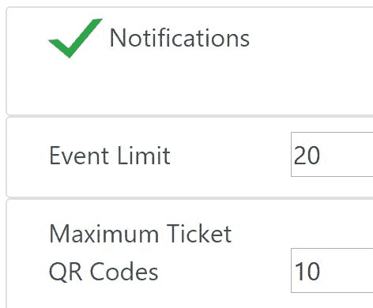

你仍然可以使用本章中涵盖的辅助模块。缓存和失效策略不会改变，只是它们执行操作时使用的设置。

# 摘要

这是一个非常长的章节，涉及了一些高级概念。你学习了如何根据请求 URL 触发不同的缓存策略，模块化服务工作者逻辑，并采用缓存失效策略。此外，你还可以玩一个新的渐进式 Web 应用程序！

本章涵盖了大量的有用信息和源代码，但这些示例仅应作为你应用程序的基础参考。你不仅应该成为分配给你的应用程序存储的良好管理者，还应该关注用户的数据计划。

在下一章中，我们将继续探讨如何使用服务工作者和缓存来提高应用程序的性能。你还将看到如何使用可用的工具来评估和诊断性能问题，以便你可以制作出更好的应用程序。
