# 优化性能

性能是用户体验的关键方面之一。事实上，许多专家认为网站性能创造了良好的用户体验。在提供在线体验时，你应该考虑网站性能的不同方面，例如：

+   **首次字节时间**（**TTFB**）和服务器端延迟

+   渲染过程

+   交互

**渐进式 Web 应用**（**PWA**）的一个主要属性是速度。这是因为人们喜欢页面快速加载，并且对动作或输入的响应更快。制作快速、交互式的网站既是艺术也是科学。

在深入制作快速 PWA 之前，我想定义本章旨在帮助解决的问题：

+   **目标**：定义关键性能指标以衡量性能

+   **指南**：定义实现这些目标的方法

+   **演示**：将这些指南应用于 PWA 票务应用，以便你有一个参考代码和工作流程

本章将深入探讨浏览器如何加载和渲染页面。你还将了解 TCP 的工作细节以及如何利用这些知识创建 1 秒内就能加载完成的页面。

你将学习不同的中级和高级**网站性能优化**（**WPO**）技术以及它们如何与 PWA 设计相关联。这些技术被编织进 PWA 票务应用的天然结构中。随着本章的发展，你将学习部分依赖于自动化构建脚本的技巧。这种自动化将延续到下一章，我将回顾不同的工具来帮助你构建 PWA。

# WPO 的重要性

DoubleClick 和其他网站已经表明，你只有 3 秒钟的时间。如果感知到的页面在 3 秒内没有加载完成，53%的移动访客会放弃该页面（[`www.doubleclickbygoogle.com/articles/mobile-speed-matters/`](https://www.doubleclickbygoogle.com/articles/mobile-speed-matters/)）。此外，DoubleClick 报告称，在 5 秒内加载完成的网站，会享受 70%更长的会话时间，35%更低的跳出率，以及 25%更高的广告可见度。

这些例子只是众多案例研究和报告中的一小部分，展示了页面加载和交互对于一个网站成功的重要性。你可以在[`wpostats.com`](https://wpostats.com)找到更多统计数据。这也是为什么谷歌不断强调网站性能作为一个关键排名信号的原因之一。

人类心理学是性能的一个重要方面。我们知道大脑如何感知性能，并且可以将这些科学原理与我们网页相关联：

+   **0 到 16 毫秒**：只要每秒渲染 60 个新帧或每帧 16 毫秒，用户就会将动画感知为平滑。考虑到浏览器开销，这留下了大约 10 毫秒的时间来生成一个帧。

+   **0 到 100 毫秒**：用户感觉对动作的响应是即时的。

+   **100 到 300 毫秒**：轻微可感知的延迟。

+   **300 到 1000 ms**：感觉像是任务自然和连续进展的一部分。

+   **>= 1000 ms**：用户会失去对任务的注意力。

将这些数字记在心里，因为它们是这个章节的主要基准。本章的目标是将 PWA 票务应用程序修改为在平均 3G 连接下 1 秒内加载完成。

快速加载给你带来竞争优势，因为平均网页在移动设备上加载需要 15 秒（[`www.thinkwithgoogle.com/marketing-resources/data-measurement/mobile-page-speed-new-industry-benchmarks/`](https://www.thinkwithgoogle.com/marketing-resources/data-measurement/mobile-page-speed-new-industry-benchmarks/)），比 2017 年的标准快了 7 秒。这不仅提高了用户的参与度，还改善了当网站性能优化时通常报告的统计数据。这样的网站享有更高的搜索排名。

大多数网络流量来自移动设备。一些企业发现高达 95%的流量来自智能手机。这就是为什么谷歌将他们的主要搜索索引从桌面切换到移动，截止到 2018 年 6 月。

谷歌搜索团队多次表示，速度是一个关键排名因素。他们知道我们想要快速网站，而快速网站提供更好的用户体验，这会让客户满意。他们的目标是提供最佳资源来回答用户的问题，这意味着你需要提供一个快速体验。

最令人不安的统计数据之一是网页大小的增长。到 2015 年，平均网页超过了 2.5 MB 的标记，这比游戏 DOOM 的原始安装盘还要大。因此，网站性能受到了影响。

谷歌的研究发现，关于平均网页大小的以下令人不安的统计数据：

+   79% > 1 MB

+   53% > 2 MB

+   23% > 4 MB

这很重要，因为在良好的 3G 连接下，仅下载 1 兆字节就需要大约 5 秒。这还不是开销的终点，所有资源仍需要被处理，页面也需要被渲染。

如果你考虑谷歌报告的数字，这意味着 79%的网页甚至在初始请求后 5 秒才开始渲染周期！到那时，用户已经跳出的概率是 90%。

# 减少图片负载大小

许多人将图片视为根本原因，并在一定程度上是如此，但图片并不会阻止渲染。图片可以也应该被优化，这会减少整个页面的尺寸。

优化图像文件大小可以将整体负载大小平均减少 25%。如果页面是 1 MB，那么 25%等于 250 KB 的负载减少。

应该也使用响应式图片。这是你使用`srcset`图片和尺寸属性，或者使用`picture`元素来引用适合显示的图片的地方：

```js
 
```

客户端设备视口差异很大。与其试图在每台设备上都非常精确，我建议关注四个视口类别：手机、迷你平板、平板和桌面。我将借用 Twitter bootstrap 项目中的断点，这些断点对应于这些视口。

任何超过不同视口宽度阈值的图像都应该是一个图像数组，在较窄的宽度上保持其宽高比。

# CSS 和 JavaScript 的成本

延迟页面加载时间的真正罪魁祸首是 CSS 和 JavaScript 的过度使用。两者都是渲染阻塞的，这意味着当它们被处理时，其他事情无法发生。

记住从服务工作者章节中学到的，浏览器使用单个线程来管理所有渲染任务，包括处理 CSS 和 JavaScript。当这个线程在进行处理时，无法进行任何渲染。

开发人员往往对 CSS 和 JavaScript 对其页面加载的影响一无所知。这通常归结为忘记真实用户使用什么设备加载网页，即手机。

开发人员通常在高性能工作站和笔记本电脑上工作。他们在这些设备上开发时也会加载他们的工作。因此，他们认为他们的页面是瞬间加载的。

这种差异是由于没有网络延迟、高速处理器和充足的内存。在现实世界中并非如此。

大多数消费者使用更便宜的手机，通常是一部 200 美元的手机，而不是一部 1000 美元的 iPhone 或工作站。这意味着功率较低、网络条件受限的设备加载和渲染页面不如桌面快。

为了加剧这些限制，当移动设备使用电池电量时，它们通常会降低处理器速度，甚至关闭核心以减少功耗。这意味着处理 JavaScript 和 CSS 所需的时间会更长。

数份报告已经证明了 JavaScript 对页面加载效果的影响有多大。*Addy Osmani*发布了一项权威研究([`medium.com/dev-channel/the-cost-of-javascript-84009f51e99e`](https://medium.com/dev-channel/the-cost-of-javascript-84009f51e99e))，展示了 JavaScript 是如何阻碍页面加载的。

一个常见的误解是主要性能影响是加载脚本或样式表通过网络。这确实有一定的影响，但更大的影响是在文件加载之后。这是浏览器必须在内存中加载脚本、解析脚本、评估然后执行脚本的地方。

“字节对字节，JavaScript 对于浏览器来说比同等大小的图像或 Web 字体更昂贵”

— 汤姆·戴尔

如果你使用浏览器分析工具，你可以通过出现黄色或金色红色来识别 JavaScript 的这个阶段。Chrome 团队称这为**一只巨大的黄色蛞蝓**：

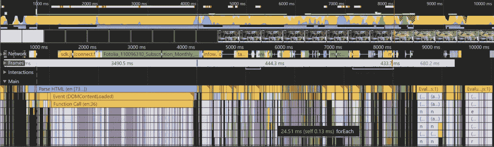

近年来，**单页应用程序**（**SPAs**）变得非常流行。这导致了大型框架的出现，这些框架抽象了原生 API，并为开发者和团队提供了一个可以遵循的架构。

您应该确定 SPA 是否是满足您需求的正确解决方案。SPA 如此受欢迎的主要原因是可以实现无缝的页面转换，类似于原生应用体验。

如果您有服务工作者并利用服务工作者缓存，您可以实现 SPA 提供的所需即时加载和流畅的页面转换。作为额外的好处，您不需要加载那么多客户端 JavaScript。

您也可以学习原生 API 而不是框架抽象，例如 jQuery。例如，`document.querySelector` 和 `document.querySelectorAll` 返回对 DOM 元素的引用，比 jQuery 快得多。

我利用的其他原生 API，包括替换了我大部分使用 jQuery 的部分：

+   `addEventListener`

+   `classList`

+   `setAttribute` 和 `getAttribute`

我已经尝试提供一些简单的架构，您可以根据 Podstr 和 PWA 票据应用程序来遵循。不是 SPA 的好处是您可以减少运行页面所需的 JavaScript 数量。

PWA 票据应用程序几乎不依赖 JavaScript。localForage 和 Mustache 账户用于大部分 JavaScript。应用程序和单个页面几乎不依赖脚本。在应用 gzip 压缩后，典型页面所需的 JavaScript 小于 14 KB。

# 正确的测试设备和仿真

我确实建议拥有现实测试设备。这并不意味着购买 iPhone X、Pixel 2 或三星 9。您应该有一部平均的手机，这在不同地区可能意味着不同的事情。一个基本建议是：

+   北美和欧洲：摩托罗拉 G4：

    +   *常规 3G* 在 Devtools 网络限速中

+   印度和印尼：小米 Redmi 3s

    +   *良好 2G* 在 Devtools 网络限速中

通常情况下，对于网络受限的设备，那些拥有缓慢和差的蜂窝连接的设备，负载很重要。功耗、CPU 和内存受限的设备在解析和评估脚本和样式表时会有更多问题。

当低功耗设备使用受限网络时，这种情况会加剧。这就是为什么您应该将网站架构得好像所有用户都有这种糟糕的组合一样。当您这样做时，您的网站将始终快速加载。

幸运的是，我们有众多工具可用于测量我们页面性能配置文件并改进它们。不同的浏览器开发者工具提供了设备仿真，可以提供对网络和设备限制的合理模拟。WebPageTest 是一个免费在线资源，可以测试真实设备和条件。

需要关注的重点领域包括服务器端因素以及您的页面如何在浏览器中加载。最重要的目标是使您的页面尽可能快地渲染并快速响应。

在本章中，我们将探讨不同的关键性能指标以及您如何应用技术和模式来确保您提供出色的用户体验。我们还将探讨这些技术与渐进式 Web 应用的关系。

# 使用开发者工具测试较差的条件

关于测试较差的连接和普通用户设备的喜讯是，这可以被模拟。Chrome、Edge 和 Firefox 的开发者工具都包括一些模拟较慢连接甚至低功耗设备的容量。

Chrome 拥有最完善的条件测试工具。在开发者工具中，您需要切换设备工具栏。快捷键是*Ctrl* + *Shift* + *M*，按钮位于左上角。它看起来像一部手机覆盖在平板上：

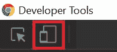

这会将浏览器标签页改为在框架中渲染页面。框架模拟目标设备的视口。它还在内容框架上方渲染设备工具栏：

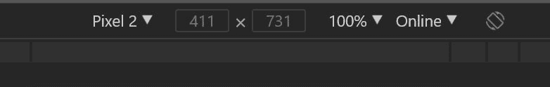

设备工具栏由不同的下拉菜单组成，允许您配置想要模拟的设备和连接场景。最左侧的下拉菜单是预配置设备的列表。它包含了一些更受欢迎的设备，并且可以进行自定义。

当您选择一个设备时，宽度和高度值会调整以匹配设备的视口。我喜欢这一点，因为它让我可以接近真实设备，而无需使用真实设备。

我确实建议您准备几部真机来测试您的网站，但这会很快变得昂贵。我个人有几部安卓手机，一部高端的，一部低端的，还有一部 iPhone。目前，我有一部 iPhone 6。我建议购买翻新的硬件或便宜的预付费手机，这些手机在大多数零售商那里大约售价 50 美元。

Chrome 设备模拟器对真实设备的近似足够好，使我能够完成我的响应式设计工作。您应该注意，您仍在使用桌面 Chrome，这并不完全是 Android Chrome，当然也不是 iOS Safari。

设备模拟器还配置了几个流行的安卓平板和 iPad。此外，您还可以创建自己的视口。

您还可以调整缩放。如果内容对于您来说太小，难以微调，这可能会很有帮助：

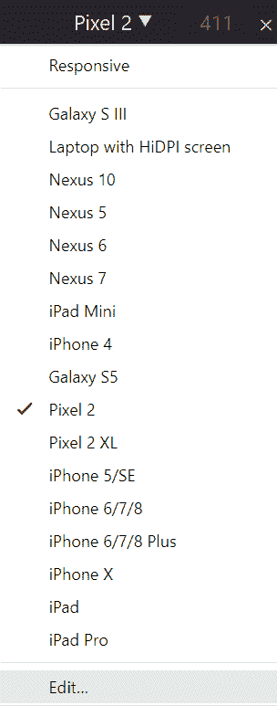

最后一个选项是带宽。这是最右侧的下拉菜单。它包括模拟离线、中间层和低层连接的选项。他们尽量避免用常见的蜂窝连接来标记这些速度，因为这会使它们面临不精确匹配的问题。

3G、4G 和 LTE 的速度因地区而异，即使在同一国家也是如此。用蜂窝速度来标记这些速度可能会非常误导。

由于绝大多数开发都是在功能强大的本地主机网站上进行的，开发者往往忘记他们的页面是在手机的蜂窝连接上加载的。这导致我们假设我们的页面比实际要快得多。相反，你应该始终尽可能真实地体验你的网站。

我鼓励开发者不要使用 JavaScript 框架的一个主要原因是，在发布前几天体验了 3G 上的移动优先应用程序。每个页面加载大约需要 30 秒。我发现不仅 3G 连接差是一个问题，而且 JavaScript 的数量是瓶颈。

如果我没有在我的 3G 手机上开始使用我们的应用程序，我就不会知道用户体验有多差。当时，浏览器开发者工具没有这些模拟功能，这使得真实设备变得必不可少。所以，感谢这些工具的存在，它们可以为你节省数小时的时间来重新设计你的网站。

我利用这些模拟功能来开发我的网站，特别是对于响应式设计工作。速度模拟帮助我感受到客户可能遇到的问题，这使我能够对他们有更多的同理心。

# 使用 Lighthouse 进行性能和 PWA 测试

Chrome 包含一个强大的工具来测试你的网站性能以及是否符合渐进式 Web 应用标准。这个工具被称为 **Lighthouse**。该工具集成到开发者工具的“审计”标签页中，并且可以作为节点模块和命令行实用程序使用：


我将在这里重点介绍如何在开发者工具中使用 Lighthouse，并在下一章中介绍命令行使用。

要执行审计，请按“执行审计...”按钮，如前一个屏幕截图所示。然后你会看到一个对话框，提供了高级配置选项。

Lighthouse 审计有五个区域：

+   性能

+   PWAs

+   最佳实践

+   无障碍性

+   SEO

你可以在所有这些区域运行测试，或者只执行选定区域的测试。Lighthouse 会运行审计并生成一个评分卡和报告：

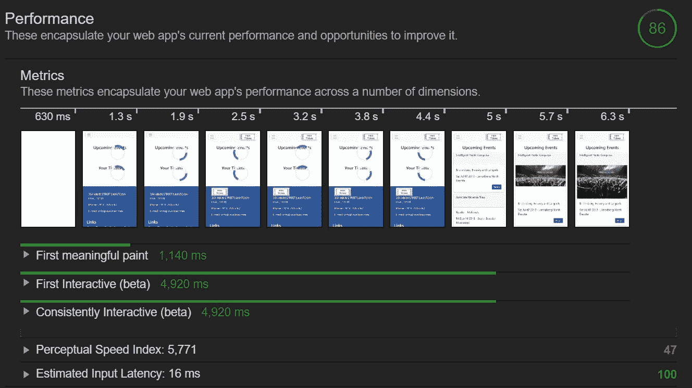

报告突出了你可以改进页面的具体区域。在先前的屏幕截图中，我只运行了性能审计，你可以看到一些需要改进的具体区域，包括感知速度指数。我还让工具在页面加载时截图，这样你可以看到页面随时间如何渲染。

开发者工具使得在单个页面上运行 Lighthouse 审计变得容易。你可以从任何 Chrome 实例运行它们，但我建议打开一个隐身实例。当你这样做时，你会在一个干净的浏览器中加载页面，没有任何缓存、cookies 或扩展程序。

由于 Chrome 扩展程序与浏览器标签页在同一个进程中运行，它们经常会干扰页面和工具，例如 Lighthouse。我发现一个通常加载速度快且评分高的页面，在包含扩展程序时会受到影响。它们会延迟页面加载，并且通常在页面完成加载后才执行。

完成一次全面审计需要 30-90 秒。这取决于正在执行多少测试以及你网站的响应时间。

运行的性能审计电池非常彻底，不仅涵盖了桌面和高速连接，还使用模拟在 3G 连接上模拟低功耗手机。正是这些条件暴露了你的弱点。

你可以使用报告来定位需要纠正的具体区域，其中许多在本章中都有讨论。

每个测试都有在线文档来解释测试的内容以及你可以采取的行动：[`developers.google.com/web/tools/Lighthouse/audits/consistently-interactive`](https://developers.google.com/web/tools/Lighthouse/audits/consistently-interactive)。

由于 PWA 票务应用程序相当优化，没有太多需要解决的问题。这个测试是在用户认证后的主页上运行的。唯一一个导致延迟的区域是感知速度指数。

这衡量了页面内容加载所需的时间。在这个例子中，我们得到了 47 分，这非常低。这是因为 UI 线程在调用 API 和渲染即将发生的事件和用户的票证时无响应。

我们可以通过将 API 调用和渲染传递给服务工作者或甚至网络工作者来提高这个分数。这将把工作从 UI 线程移到后台线程。这将需要对页面和网站架构进行调整。

另一个建议是使用下一代图像格式，如 WebP 和 JPEG 2000。虽然这些图像格式更高效，但它们并不被广泛支持。这部分是由于它们还很年轻，部分是由于不同用户代理的许可问题。因此，目前我倾向于忽略这些建议，并抱有希望这些格式将在不久的将来得到普遍支持。

你可以使用复杂的解决方案，例如使用`PICTURE`元素，但我发现这需要比回报所值得的更多管理和责任。

在最近的 Google I/O 上宣布，Lighthouse 版本 3 将很快推出。他们预览了更新的 UI 和一些新的测试。你可以在 Google 开发者网站上了解更多关于这些公告的信息：[`developers.google.com/web/tools/Lighthouse/v3/scoring`](https://developers.google.com/web/tools/Lighthouse/v3/scoring)。

作为一句忠告，Lighthouse 是一个有偏见的工具。这意味着它会寻找谷歌和 Chrome 团队认为重要的东西。它不是一个你可以根据特定要求添加自定义测试或规则的测试运行工具。

在 2017 年微软 Edge Web 峰会（Microsoft Edge Web Summit）上，他们宣布了一个名为 Sonar（[`sonarwhal.com`](https://sonarwhal.com)）的类似工具。它也是一个节点模块和命令行工具，可以对提供的 URL 进行测试。与 Lighthouse 的不同之处在于可以按需扩展测试套件。你不仅可以添加公开可用的测试或规则，还可以编写自己的。

Sonar 可以执行并确实使用了与 Lighthouse 相同的测试套件，但它允许你添加更多。在撰写本书时，它不像 Lighthouse 那样在 Edge 开发者工具中可用。他们确实提供了一个在线实例，你可以测试公共 URL，当然也可以作为测试套件的一部分本地运行它：

你应该将 Lighthouse 和 Sonar 纳入你的常规开发者工作流程。你可以快速发现不仅性能问题，还包括缺失的渐进式 Web 应用程序要求、最佳实践、基本 SEO 问题和糟糕的服务器配置。

# 使用 WebPageTest 进行性能基准测试

**WebPageTest** ([`webpagetest.org/`](https://webpagetest.org/)) 是一个免费的工具，你可以用它来获取网页性能细节。它的工作方式与开发者工具类似，但增加了更多的价值：

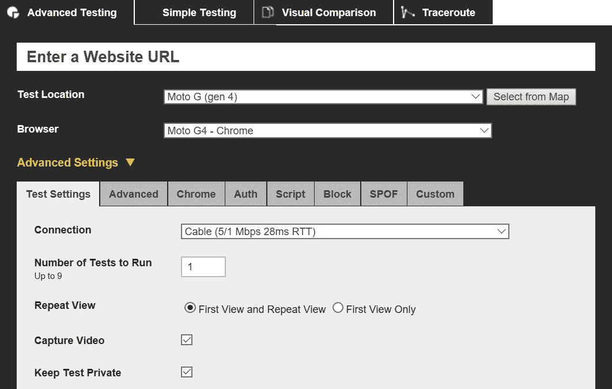

它不仅提供了详细的水落石出，还提供了来自不同位置、不同速度和设备的测试。有时，它揭示的真相可能难以接受，但它为你提供了目标区域，以便你可以提高性能：

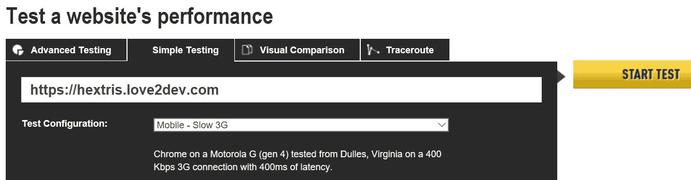

要进行测试，请访问 [`webpagetest.org`](https://webpagetest.org)。如果你的网站有一个公共 URL，请在表单中输入它，并选择一个位置、设备/浏览器以及要测试的速度。一旦提交请求，你的网站将使用真实硬件进行评估。一两分钟后，假设它没有被添加到待处理队列中，你将收到一份报告：

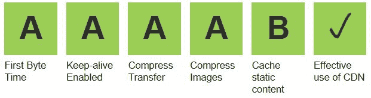

就像浏览器开发者工具提供了网络瀑布图一样，WebPageTest 也可以，但提供了更多细节：

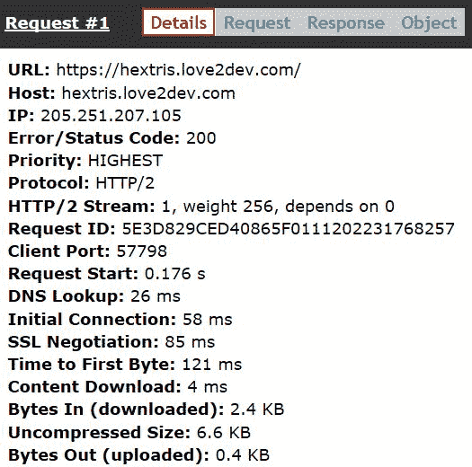

我总是检查的一个关键指标是速度指数。这是由 WebPageTest 背后的思想者帕特里克·米南（Patrick Meenan）创建的性能指标，它衡量页面在加载时间内的视觉完整性：

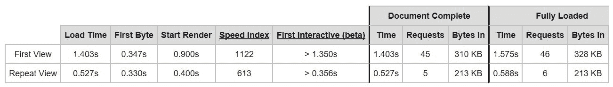

它衡量与最终渲染相比可见的空白区域有多少。目标是尽量减少到完整渲染的时间。速度指数是衡量到第一次交互或感知渲染的时间的一种方法。

一个值得追求的数字是 1,000 或更少。这表明渲染页面花费了 1 秒或更少的时间。为了参考，我评估的大多数页面得分都超过 10,000，这意味着至少需要 10 秒来渲染。这些较差的分数是在宽带连接上，所以对于蜂窝连接来说，这个值要差得多：

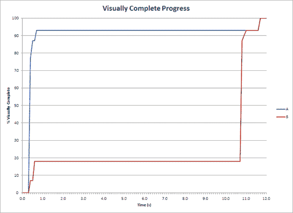

可以使用许多高级功能和设置来执行 WebPageTest，包括自定义脚本。您甚至可以在本地或 Amazon AWS 上建立自己的虚拟机。当您有一个隐藏在防火墙后面的企业应用程序时，这非常有用。

# 关键性能指标

创建快速网站或改进现有网站的第一步是使用工具来衡量您的性能，并了解您需要测量什么。您应该创建一个性能基线，并逐步改进以提升您的性能概况。

在本节中，我将回顾您应该测量的不同指标，为什么需要跟踪它们，以及如何改进它们。

# 首次字节时间

获取第一个响应字节的所需时间是首次字节时间。这一刻标志着响应下载的开始。最重要的网络请求是文档请求。一旦下载完成，其余的网络资源（如图片、脚本、样式表等）就可以下载。

您可以将首次字节时间过程分解为不同的步骤：

+   浏览器和服务器之间建立连接所需的时间

+   在服务器上检索和可能渲染文件所需的时间

+   将字节发送到浏览器所需的时间

测量首次字节时间最简单的方法是通过按*F12*或*Ctrl* + *Shift* + *I*打开浏览器开发者工具。每个浏览器的开发者工具都有一个网络标签。在这里，您可以查看页面的水落图。您可能需要刷新页面以生成报告。

我建议执行带前置符号和无前置符号的请求。区别在于以这是您第一次访问网站的方式加载页面，这被称为无前置符号。在这种情况下，浏览器缓存中没有持久化任何内容。您还应该清除或绕过您的服务工作者。

您可以通过进行硬重载来触发无前置符号请求，即*Ctrl* + *F5*。

如果您查看以下水落图示例，您会注意到第一个请求，即文档或 HTML 的请求，首先完成。然后浏览器解析标记，识别需要加载的附加资源。这就是那些请求开始的时候。

您应该能够在所有页面上注意到这种模式，即使资产是本地缓存的。这就是为什么初始文档请求和辅助资源之间存在轻微的时间间隔：

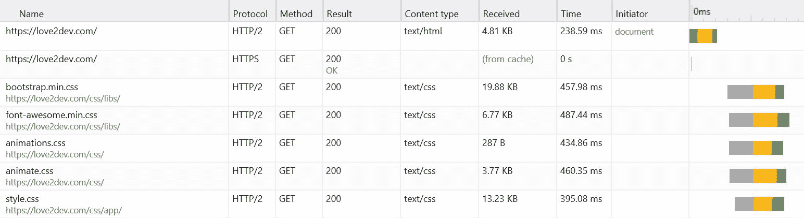

带有前置符号的请求假设您之前已经访问过该网站或页面，并且浏览器和可能的服务工作者缓存包含有效的响应。这意味着这些请求是在本地进行的，没有网络活动。理论上，由于缓存的存在，页面应该加载得更快。

水落图由组成页面的每个文件请求组成。您应该能够选择单个请求（在水落图中双击请求）以查看每个步骤花费了多少时间：

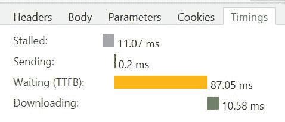

Chrome、Firefox 和 Edge 允许你可视化首次字节时间。每个浏览器都有一个计时面板，它将请求的不同部分和时间分配分解开来。它进一步细化这些部分，显示执行 DNS 解析、建立与服务器连接以及服务器发送字节到浏览器所需的时间。

在发起网络请求之前，它会被添加到浏览器队列中。这个队列是浏览器需要发起的请求集合。每个浏览器都决定如何处理这个队列，这取决于可用资源、HTTP/2 与 HTTP/1 支持等因素。

接下来，如果需要，浏览器将触发 DNS 解析。如果设备有缓存域名解析或 IP 地址，则跳过此步骤。你可以通过使用`dns-prefetch`来加快这一步骤，我将在稍后进行介绍。

浏览器随后发起网络请求。此时，服务器负责发送响应。如果服务器存在任何瓶颈，你应该解决这些问题。

不要忘记 TLS 协商。HTTPS 会有轻微的性能损失，但使用 HTTP/2 时，这种损失通常会被 HTTP/2 提供的额外性能提升所抵消。

你可以通过优化服务器配置来减少首次字节时间。你应该寻找机会通过在内存中缓存响应来减少磁盘 I/O。在 ASP.NET 中，这是通过实现输出缓存来完成的。其他 Web 平台提供类似的功能。

数据库查询是另一个常见的瓶颈。如果你可以消除它们，你应该。评估页面数据，找出可以提前检索的数据。我喜欢创建 JSON 数据文件或在内存中的对象来避免这些昂贵的查询。

这正是 NoSQL、文档数据库如 MongoDB 和 ElasticSearch，以及云服务如 DynamoDB 越来越受欢迎的主要原因。这些数据库设计为预先选择和格式化数据，以便按需使用。这些解决方案帮助 Twitter、Facebook 等热门在线网站快速成长和扩展。

另一种策略是尽可能避免按需渲染。大多数网站都是由 ASP.NET、PHP、Ruby、Node 等服务器进程渲染的。这些都增加了请求过程的负担。通过尽可能预先渲染标记，你减少了这些进程减慢响应的机会。

我尽量在可能的情况下使用静态网站解决方案，因为它们提供最快的响应管道。静态网站的优势在于运行时渲染，因为渲染周期被移除了。你可以创建自己的引擎来预渲染内容，或者使用 Varnish 等工具来管理任务。你不必放弃现有的处理器，而是添加一个静态引擎在顶部来维护静态文件，以便你的页面加载更快。

剩下的唯一摩擦点是网络的速率。不幸的是，这些通常超出了你的控制。路由器、代理和蜂窝塔都可能引起问题。

在这一点上，响应字节开始流入浏览器进行处理。文件越大，通常延迟越长。

# PRPL 模式

我们已经研究了首次字节时间和运行时性能问题。确保你的网站表现最佳的最佳方式是实施架构最佳实践。PRPL 模式是为了帮助现代 Web 应用程序实现最佳性能值而创建的。

Google Polymer 团队开发了 PRPL 作为遵循的指南，以帮助网站性能更好。应将其视为可以实现的架构，但它不仅仅是关于技术细节。引用 PRPL 文档：

“PRPL 更多地关乎一种心态和改善移动网络性能的长期愿景，而不是关于特定的技术或技术。”

PRPL 回归到将性能作为任何网站的一等特性的原则。

PRPL 代表：

+   **推送初始 URL 路由的关键资源**使用`<link preload>`和 HTTP/2

+   **渲染初始路由**

+   **预缓存剩余路由**

+   **按需懒加载并创建剩余路由**

尽管 PRPL 是为现代单页应用程序而设计的，但渐进式 Web 应用程序可以从遵循 PRPL 模式中受益。服务工作者是实现 PRPL 模式的有价值工具，因为你可以利用缓存 API 来实现该模式。你只需要调整如何应用不同的原则来提高你应用程序的性能。

PRPL 模式的主要目标是：

+   最短的可交互时间：

    +   尤其是在首次使用时（无论入口点）

    +   尤其是在现实世界的移动设备上

+   最大的缓存效率，尤其是在更新发布后的时间上

+   开发和部署的简单性

# 使用浏览器提示和服务工作者缓存实现推送

推送的第一个概念依赖于实现 HTTP/2 服务器端推送。我发现这很难配置，因为大多数服务器还没有实现 HTTP/2 推送。

这就是服务工作者可以提供一种我认为更好的解决方案的地方。我们研究了如何实现预缓存，这是使用 HTTP/2 推送的绝佳替代方案。通过使用预缓存，你实际上是在需要之前将这些关键资产推送到浏览器。

记住，你预缓存的资源应该是关键和常见的应用程序资产。这些资产应该反映你可能想要配置 HTTP/2 推送发送的内容。

将服务工作者缓存与预加载资源提示结合可以重现 HTTP/2 推送的大部分功能。浏览器使用预加载提示在代码中遇到资源请求之前初始化资源请求。当与预缓存资源一起使用时，加载过程非常快。

表面上看，像预加载这样的资源提示可能看起来没有提供太多优势。但随着页面组成的复杂化，这些提示可以显著提高页面加载和渲染时间。

浏览器不会在从 HTML 解析或从脚本或样式表发起之前启动请求。

自定义字体文件是一个完美的例子。它们的下载不会开始，直到浏览器解析样式表并找到字体引用。如果文件作为预加载资源提示包含在内，浏览器已经加载或至少开始请求，使文件更快可用：

```js
    <link rel="preload" href="css/webfonts/fa-brands-400.eot " 
     as="font"> 
     ... 
    <link rel="preload" href="js/libs/utils.js" as="script"> 
    <link rel="preload" href="js/libs/localforage.min.js" as="script"> 
    <link rel="preload" href="js/libs/mustache.min.js" as="script"> 
    <link rel="preload" href="js/app/events.js" as="script"> 
    <link rel="preload" href="js/app/tickets.js" as="script"> 
    <link rel="preload" href="js/app/user.js" as="script"> 
    <link rel="preload" href="js/app/app.js" as="script"> 
```

指定资源内容类型允许浏览器：

+   优先加载资源

+   匹配未来的请求并重用相同的资源

+   应用资源的内容安全策略

+   设置资源的正确 Accept 请求头

你还可以添加资源 MIME 类型。当你这样做时，浏览器可以在尝试下载文件之前确定它是否支持该资源类型：

```js
<link rel="preload" href="js/app/app.js" as="script" type="application/javascript"> 
```

理念是在 DOM 解析触发请求之前使页面或应用程序的资产可用。由于这些资产在服务工作者缓存中可用，它们已经存储在本地，可以立即加载。

你可以在使用 `preload` 提示的水墨图中注意到差异。你还记得我指出的初始标记加载和早期瀑布中的资产之间轻微的时间间隔吗？

如果你查看以下瀑布图，你会注意到依赖项是在标记加载完成之前启动的：

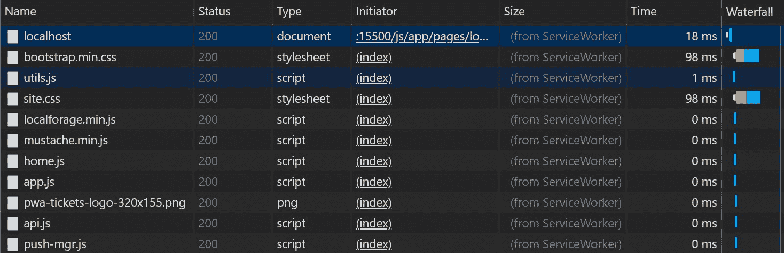

这是因为浏览器将这些资源与预加载提示相关联。它会在解析完标记后立即开始下载资源，而不是在完整文档解析完毕后。

你还应该注意这些资源的加载速度有多快。这是由于它们使用服务工作者缓存进行缓存。这消除了网络瓶颈，在某些情况下意味着文件甚至在标记完全解析之前就已经加载。

这只是轻微的页面加载优势，并不是重大的改进。每一丝帮助都很重要，因为毫秒很快就会累积起来。

# 使用应用外壳模型和服务工作者渲染初始路由

由于 PRPL 模式是从单页应用（SPA）的角度设计的，所以它的语言与该架构相关。但正如你在前面的章节中看到的，应用外壳对渐进式网络应用很有用。

即使你没有缓存页面，你也应该至少缓存你的应用程序的标记外壳。这可以作为你的初始渲染，使用户有响应感。同时，你可以从网络上检索任何资产以完成页面。

PWA 票务应用使用服务工作者通过 Mustache 模板和从 API 获取的 JSON 数据来渲染页面。这是如何将应用外壳作为对请求的有效响应返回，并在内容可用时更新内容的示例。

我的规则是提供我此刻拥有的所有内容，并在有更多内容提供时填补空白。这可能包括提供应用程序外壳并在之后替换它，或者一旦可用就注入页面特定的标记。

# 服务工作者预先缓存重要路由

在本书的这个阶段，应该很明显，一个好的服务工作者预先缓存策略如何适用于 PRPL 预先缓存点，但回顾这个概念永远不会有害。

PRPL 中的第二个 P 代表预先缓存常见路由。这包括 HTML 及其支持文件，如样式、图像和脚本。这正是您服务工作者预先缓存策略应该设计的方式。

重要资源通常是常访问的页面，但也可以是服务工作者中渲染页面所需的标记模板。常见的样式、脚本、图像和其他支持资源应该预先缓存。

# 懒加载非关键和动态路由

并非每个网站上的每个页面都可以或应该预先缓存。正如您在第五章“服务工作者生命周期”中看到的，您还应该有缓存失效逻辑，以确保您提供最新内容。

动态内容，如可用的票务事件或甚至更新的播客剧集列表，长期缓存是困难的。但您可以为仅等待下载页面所有资源提供更好的体验。

这就是采用一个或多个常见缓存策略有帮助的地方。您还可以将您的渲染策略与应用程序外壳概念结合起来，在资源加载或更新时构建页面。

您还可以根据需要预先缓存和更新常见的支持资源。这是网络低估的力量之一，动态更新渲染的内容及其渲染方式。您不仅可以更新页面中的标记，还可以动态更改样式表和脚本。

正如您也已经学到的，您可以在服务工作者中缓存资源而不会影响 UI 线程。这可以用来预先缓存非关键资源并更新之前缓存的资源。

正如您所看到的，服务工作者缓存使得实现 PRPL 模式非常自然。它缓存资源的能力使得所有四个 PRPL 原则都很容易实现。如果您已经遵循了前几章中的示例和指南，那么您已经看到了如何设计符合 PRPL 的渐进式网络应用程序。

我认为 PRPL 的首要原则是尽可能在客户端缓存您应用程序的资源。这使得网络变得可用，而不是潜在的延迟和不确定性的来源。这正是服务工作者缓存设计的目的：使您的资源接近用户的玻璃。

# RAIL 模式

RAIL 模式是 Google Chrome 团队用来定义您应该尝试遵循的许多 WPO 模式之一的缩写。其目标是确保您的用户体验是响应式的：

+   **响应**：任何输入时响应的速度

+   **动画**：包括视觉动画、滚动和拖动

+   **空闲**：后台工作

+   **加载**：页面达到首次有意义的绘制所需的速度

在 PRPL 模式关注资源加载时，RAIL 关注的是运行时用户体验或资源加载后会发生什么。

该模式旨在以用户为中心，首先关注性能。构成该缩写的四个方面是 Web 应用程序和页面生命周期的不同区域，或者一旦字节加载后会发生什么。

考虑到性能重要性的不同区域：加载、渲染和对动作的响应。不仅仅是页面加载阶段。页面加载是浏览器加载资源有多快，但许多人忘记了它仍然需要处理这些资源并渲染内容。然后，一旦渲染，你可以响应用户交互。

你还需要考虑页面响应点击或触摸的速度有多快。滚动是否平滑？通知是否及时？任何后台活动是否高效？

对普通用户来说，第一个关键因素是页面变得可交互所需的时间，而不是下载文件所需的时间。

在最近的 Google I/O 大会上，团队宣布了 Lighthouse 将报告的新指标，特别是**首次内容绘制**（**FCP**）。这是浏览器渲染新页面 DOM 的第一个像素的点。测量从导航开始，到第一个像素渲染的点。

这之所以是关键性能指标，是因为这是用户第一次视觉提示，表明他们的请求操作或导航正在被处理。我喜欢将其翻译为说，这是用户知道页面正在到来，并没有迷失在虚空中，导致他们尝试重新加载页面或放弃。

FCP 可以从 Paint Timing API（[`w3c.github.io/paint-timing/`](https://w3c.github.io/paint-timing/））获得，这是现代浏览器中可用的现代性能 API 之一。

你应该关注的下一个关键绩效指标是**交互时间**（**TTI**）。这是页面完全渲染并能够响应用户输入的点。通常，尽管页面看起来已经渲染，但由于后台处理，它无法响应用户。

例如，页面仍在处理 JavaScript，这会锁定 UI 线程，导致页面无法滚动。

RAIL 关注用户；目标不是在特定设备上使网站性能尽可能快，而是让用户感到满意。任何用户与你的内容互动时，你应该在 100 毫秒内给出响应。任何类型的动画或滚动也应该在 10 毫秒内响应。

由于现代网页往往需要进行大量的后台处理，你应该最大化空闲时间来执行这些任务，而不是阻塞交互和渲染。

如果您需要执行任何非 UI 处理，例如数据转换、服务工作者或 Web 工作者提供了一条通道，让您可以将这些过程卸载到后台线程。这使 UI 线程能够专注于 UI 任务，如布局和绘制。这也使 UI 能够立即响应用户交互。

专注于在一秒内交付交互式内容。在蜂窝网络和平均移动设备上实现这一点可能非常困难，但并非不可能。

正如我之前提到的，服务器加载时间并不是您网络性能配置的主要部分，而是创建更大瓶颈的资源处理。这是因为脚本和样式表阻塞了关键渲染路径，导致您的页面部分渲染或看起来像是挂起了。

如果您从未听说过关键渲染路径，它是浏览器用来构建和渲染页面的工作流程：

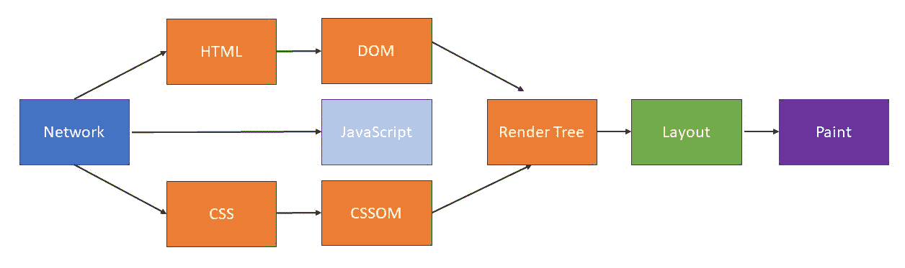

这些是主要步骤：

1.  **文档对象模型**（**DOM**）

1.  **CSS 对象模型**（**CSSOM**）

1.  渲染树

1.  布局

1.  绘制

要构建 DOM，浏览器必须完成以下子步骤：

1.  将字节转换为字符

1.  识别标记

1.  将标记转换为节点

1.  构建 DOM 树

与构建 DOM 类似，浏览器遵循一系列类似的步骤来构建 CSSOM 或处理样式：

1.  将字节转换为字符

1.  识别标记

1.  将标记转换为节点

1.  构建 CSSOM

对于 CSS 来说，重要的结论就像 JavaScript 一样：它是渲染阻塞的。浏览器必须在渲染之前处理页面的样式。多个大型 CSS 文件会导致 CSSOM 过程重复。样式表越大，这一步骤所需的时间就越长。

一旦 DOM 和 CSSOM 被创建，浏览器然后将这两个组合起来构建渲染树。接下来是布局步骤，为所有页面元素计算所有大小和颜色属性。

最后，像素被绘制到屏幕上。这并不总是“瞬间”的，因为不同的样式和样式组合需要不同数量的处理来渲染。

# 如何 JavaScript 阻塞管道

DOM 和 CSSOM 过程协同工作，以产生屏幕上显示的内容，但渲染周期中还有第三部分，即处理 JavaScript。JavaScript 不仅是一个渲染阻塞器，还是一个解析阻塞过程。

这是我们将脚本引用添加到 HTML 末尾的主要原因。通过这样做，浏览器有机会在尝试加载脚本之前解析 HTML 和 CSS，这会阻塞解析过程：

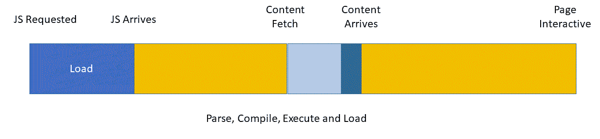

当浏览器遇到脚本时，它会停止 DOM 和 CSS 解析器以加载、解析和评估 JavaScript。这也是我努力最小化 JavaScript 大小的原因之一。

您可以采用一些技巧来最小化这种行为。第一个是将您能标记为异步的任何脚本。这会导致浏览器随意加载脚本文件。

起初这听起来很棒，但我发现这通常比实际更乐观。似乎总有一段关键脚本需要在页面渲染时执行。

你可以将所有脚本标记为异步，并在运行你的应用程序时查看是否有任何问题。只需彻底测试，以排除任何边缘情况：

```js
<script src="img/config.js" async></script> 
```

另一种解决方案是将你的脚本压缩后内联到你的标记中。这也可以帮助你的渲染周期。其中一个主要的好处是不需要等待额外的文件下载。

然而，如果你使用 HTTP/2，多路复用功能可能会提供更多好处。使用 HTTP/2 时，通常使用可以单独缓存的较小文件比大型文件包更好。

当你内联脚本时，你的 HTML 大小会增加，这可能会延迟其处理。然而，正如你即将学习的，内联 CSS 非常有用。这是一个测试的问题，看看什么最适合你的页面和应用。

# 为什么 14 KB 是神奇数字

为了控制网络流量，TCP 实现了一种称为慢启动的模式。它这样做是为了防止网络被请求淹没。详细信息在 RFC 5681 中指定（[`tools.ietf.org/html/rfc5681`](https://tools.ietf.org/html/rfc5681)）。

协议的工作原理是发送方或发起者发送一个初始的小数据包。当它收到响应后，它会将数据包大小加倍。这种往返会重复进行，直到发送方收到拥塞响应。

初始数据包大小为 14 KB。这种往返是一系列往返。如果你可以将整个页面或响应放入 14 KB 中，那么只需要一个往返就可以完全下载：

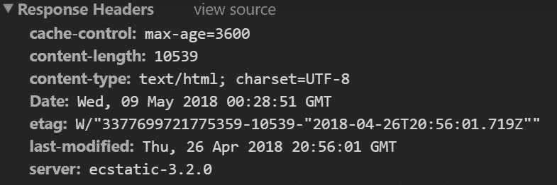

在这个例子中，响应大小为 10.5 KB，因此只需要 1 次往返。你应该注意，这个例子没有压缩，这会显著减小大小。这是我们稍后应用资源内联时想要你记住的另一点。

初始 TCP 数据包实际上是 16 KB，但前 2 KB 被保留用于请求头数据。剩余的 14 KB 是内容或数据传输的地方。如果内容超过 14 KB，则启动第二次往返，这次数据包大小加倍至 32 KB。这会一直重复，直到出现网络拥塞消息。

通过将请求限制为单个往返，你可以几乎瞬间加载整个响应。往返次数越多，数据加载所需的时间越长。

# 内联关键 CSS

当你内联 CSS 时，你消除了检索样式的所需往返，并且它们在解析 DOM 时立即对浏览器可用。这使得这两个关键步骤变得更快。

为了刷新，当浏览器遇到外部样式表时，它会阻止任何渲染，直到样式表完全加载。

如我之前提到的，你希望将页面 CSS 的大小限制仅为渲染页面所需的 CSS。通过仅将样式限制在页面使用的那些，你通常可以将 CSS 的数量减少到几个千字节。

由于实际 CSS 的数量很少，你可以在文档的 `head` 元素中内联这些样式。现在，浏览器没有外部文件需要下载，只需加载最小量的 CSS。此外，你还有渲染应用外壳所需的临界样式。

PWA 票务应用程序有一个非常标准的应用外壳：`header`、`body` 和 `footer`。每个单独的页面都需要最小量的自定义 CSS 来渲染其内容。

好消息是，有工具可以帮助你识别每个页面所需的 CSS。有多个节点模块可用，但我专注于 UnCSS 模块 ([`www.npmjs.com/package/uncss`](https://www.npmjs.com/package/uncss))。它是第一个创建来识别所需 CSS 的模块之一。

因为这些是节点模块，你可以将它们包含在构建脚本中。PWA 票务应用程序在项目的 `utils` 文件夹中有一个名为 `render-public.js` 的构建脚本。我不会详细介绍脚本的所有细节，但它会在网站的源代码上运行，以生成网站的页面和支持文件。

`extractCSS` 函数负责提取页面的样式，最小化它们，并将它们注入到 `head` 元素中。

有额外的节点模块被用来帮助。Cheerio 加载 HTML 并创建一个具有 jQuery API 的对象，就像你在浏览器中使用 jQuery 一样。这使得操作标记更容易。

第二个模块是 CleanCSS。此模块最小化样式，删除不必要的空白，从而使得代码占用更少的空间：

```js
function extractCSS($, callback) { 

    let options = { 
            ignore: [".page-content .card", ".page-content .card-
            title", ".page-content .ticket-card"], 
            media: ['@media (max-width:480px)', '@media (min-
           width:768px)', '@media (max-width:992px)', '@media (max-
           width:1199px)'], 
            stylesheets: [path.resolve(publicPath, 
            'css/libs/bootstrap.min.css'), 
            path.resolve(publicPath, 'css/app/site.css') 
            ], 
            timeout: 1000, 
            report: true, 
            banner: false 
        }, 
        html = $.html(); 

    let $html = cheerio.load(html); 

    $html("body").append(templates); 
    $html("script").remove(); 

    $("script").remove(); 

    //run uncss 
    uncss($html.html(), options, function (error, output) { 

        if (error) { 
            console.log(error); 
        } 

        let minCSS = new CleanCSS({ 
            level: 2 
        }).minify(output); 

        $("head").append("<style>" + minCSS.styles + "</style>"); 

        callback($); 

    }); 
} 
```

UnCSS 有一个很长的配置选项列表，你可以使用这些选项来控制模块的执行方式。我提供了我最常用的设置，例如媒体查询断点和消除横幅注释。

有时，我发现我仍然需要包含一个不应删除的选择器列表：

```js
ignore: [".page-content .card", ".page-content .card-title", ".page-content .ticket-card"] 
```

我还发现，从标记中删除任何脚本引用将有助于该模块。当模块找到脚本时，它会尝试加载并执行它。这是因为 UnCSS 在无头浏览器中执行页面，就像它是一个正常浏览器一样。

UnCSS 可以处理原始 HTML，这就是我使用它的方式，或者通过 URL 或本地路径加载页面。它使用标准的节点回调模式，因此你应该相应地编写代码。

另一件我尝试做的事情是在要处理的 HTML 中注入潜在的内容模板。这应该有助于 UnCSS 确定所需的全部样式，即使它们是动态渲染的。

与 UnCSS 一样，CleanCSS 也使用回调模式。你可以提供过滤后的 CSS，它将返回一个最小化版本。

在这一点上，你可以将最小化的样式注入到 HTML 的 `head`：

```js
$("head").append("<style>" + minCSS.styles + "</style>"); 
```

到目前为止，页面的 HTML 已经包含所有必需的 CSS，内联在标记的 HEAD 中。对于 PWA 技术票据应用程序，典型的页面大小约为 30 KB，这不符合 14 KB 的目标。

幸运的是，我们还没有完成。

静态资源，如 HTML，应该被压缩。你可以使用 gzip 或 deflate 压缩。Brotli 是另一个选项，但并非所有浏览器都支持它。一旦压缩这些文件，它们通常可以减少到大约 8 KB，远远在我们的 14 KB 目标之内！

大多数 Web 服务器都可以配置为按需压缩文本文件。但正如你可以想象的那样，我喜欢将其作为我的部署过程的一部分。这可以通过节点完成，但你应该与你的 DevOps 团队确认，确保这是为你的网站执行的：

```js
Body = fs.createReadStream(src).pipe(zlib.createGzip({ 
            level: 9 
        })); 
```

确保任何压缩文件都通过设置 Content-Encoding 标头为 gzip 或 deflate 来提供，这样浏览器就知道要解压缩响应。

# 使用 uglify 压缩脚本

就像 CSS 一样，你也应该最小化 JavaScript 文件。就像我们使用 Clean-CSS 来压缩 CSS 一样，你可以使用 uglify 来对你的 JavaScript 执行相同的操作。我更喜欢将其保留在单独的文件中。

在过去，我还会将多个脚本文件捆绑在一起。HTTP/2 利用请求多路复用来优化内容交付。通过保持每个脚本为单独的文件，你可以利用长期缓存，并在不需要完整下载的情况下进行小幅度修改。

除了最小化脚本外，我还会向你展示如何使用内容上的 MD5 哈希创建唯一的文件名。这将允许你应用非常长的缓存时间，而不用担心浏览器缓存保留过时的副本。这项技术是高级的，确实需要一些规划，当然，还需要一个智能的构建或渲染过程。

有多个 uglifier 节点模块。我选择了 `uglify-js` 用于 PWA 技术票据应用程序。我挑选这类模块的方式是查看其流行度，同时也会考虑流行的任务运行器，如 Grunt、Gulp 和 WebPack 插件所依赖的。

作为一句警告，`uglify-js` 不处理 ES6 语法，如 `let` 和 `const`，在遇到时会抛出错误。但我警告不要在浏览器中使用 ES6 语法，因为仍然有许多浏览器不支持它，例如 Internet Explorer。

对于构建脚本，我选择创建一个简单的 uglify 模块，以便在整体构建脚本中引用。它引用 `uglify-js` 并创建一个 `uglify` 类：

```js
const UglifyJS = require("uglify-js"), 
    uglifyOptions = { 
        parse: { 
            html5_comments: false, 
            shebang: false 
        }, 
        compress: { 
            drop_console: true, 
            keep_fargs: false 
        } 
    }, 
   ...; 

class uglify { 

    constructor(src) {} 
    transformSrc(srcFiles) {} 
    minify() {} 

} 
```

类 `constructor` 和 `transformSrc` 方法用于在压缩前设置。它们被设置为允许你传递单个脚本引用或脚本数组以供 uglify 和连接。

就像 UnCSS 一样，uglifier 允许你自定义过程。这就是选项允许你配置模块的地方。为此，我选择了我喜欢的一些简单设置来优化过程：

```js
    minify() { 

        let src = this.transformSrc(srcFiles); 
        return UglifyJS.minify(src, uglifyOptions); 

    } 
```

渲染脚本不仅会压缩每个脚本；它还会创建一个唯一的哈希名称：

```js
function uglifyScripts() { 

    scripts.forEach(script => { 

        let ug = new uglify(path.resolve(publicPath, script)); 
        let min = ug.minify(); 

        if (min.code && min.code !== "") { 

            let hashName = utils.getHash(min.code); 

            fs.writeFileSync(path.join(publicPath, 
            path.dirname(script), hashName + ".min.js"), min.code); 

            scriptsObjs.push({ 
                src: script, 
                hash: hashName + ".min.js" 
            }); 
        } else { 
            console.log("uglify error ", min.error); 
        } 
    });  
} 
```

该文件是通过将脚本内容传递给 nodejs crypto 对象来计算的。crypto 对象使得计算哈希变得简单。在这种情况下，我想要一个 md5 哈希值，所以当调用`createHash`方法时，你提供`'md5'`值。

如果你不太熟悉 md5 哈希，它们是一种生成校验和的加密方法，用于验证数据完整性。它们不适合加密，但基于数据提供唯一值。这个唯一值对于创建唯一的文件名很有帮助：

```js
function  getHash(data) { 
    var md5 = crypto.createHash('md5'); 
    md5.update(data); 

    return md5.digest('hex'); 
} 
```

唯一性足够好，可以相信脚本文件名不会在应用程序内部重复。构建脚本不仅需要生成唯一的哈希值，还需要将文件以哈希名称保存。它也可以只是重命名源文件。

即使你创建了具有唯一文件名的文件，你仍然需要将其集成到 HTML 文件中。渲染脚本负责这项任务。产品看起来可能像这样：

```js
<script src="img/470bb9da4a68c224d0034b1792dcbd77.min.js"></script> 
<script src="img/ca901f49ff220b077f4252d2f1140c68.min.js"></script> 
<script src="img/2ae25530a0dd28f30ca44f5182f0de61.min.js"></script> 
<script src="img/aa0a8a25292f1dc72b1bee3bd358d477.min.js"></script> 
<script src="img/470bb9da4a68c224d0034b1792dcbd77.min.js"></script> 
<script src="img/e392a867bee507b90b366637460259aa.min.js"></script> 
<script src="img/8fd5a965abed65cd11ef13e6a3408641.min.js"></script> 
<script src="img/512df4f42ca96bc22908ff3a84431452.min.js"></script> 
<script src="img/bc8ffbb70c5786945962ce782fae415c.min.js"></script> 
```

我还向每个文件添加了`.min`，因为脚本已经被压缩。这是出于惯例而不是要求。好处是对于像浏览器开发者工具这样的工具，它们理解脚本已经被压缩。Edge 允许你在调试时选择绕过脚本，因为`.min`被附加到文件名上。

因为每个页面也会为脚本文件设置一个预加载提示，所以这些引用也必须更新：

```js
<link rel="preload" href="js/libs/470bb9da4a68c224d0034b1792dcbd77.min.js" as="script" type="application/javascript"> 
<link rel="preload" href="js/libs/ca901f49ff220b077f4252d2f1140c68.min.js" as="script" type="application/javascript"> 
<link rel="preload" href="js/libs/2ae25530a0dd28f30ca44f5182f0de61.min.js" as="script" type="application/javascript"> 
<link rel="preload" href="js/libs/aa0a8a25292f1dc72b1bee3bd358d477.min.js" as="script" type="application/javascript"> 
<link rel="preload" href="js/app/pages/bc8ffbb70c5786945962ce782fae415c.min.js" as="script" type="application/javascript"> 
<link rel="preload" href="js/app/512df4f42ca96bc22908ff3a84431452.min.js" as="script" type="application/javascript"> 
```

那么，为什么我要在构建和渲染过程中添加这个复杂的重命名步骤呢？是为了启用较长的缓存时间。这告诉浏览器尝试在内置的浏览器缓存中而不是在服务工作者缓存中本地缓存响应。

推荐的存活时间至少为一年。大多数脚本可以在那个时间范围内更新，并且哈希名称技术为你提供了一个保证的缓存失效技术。其他技术，如附加唯一的`QueryString`参数，可能并不总是有效。

你可以通过设置`cache-control`头来设置长时间存活。这需要在你的 web 服务器上完成，这样它就会成为你的 devops 工作流程的一部分：

```js
cache-control: public, max-age=31536000 
```

我不会深入探讨配置 Cache-Control 头部的艺术，但你可以将前面的示例作为参考。脚本、样式表甚至图像等文件都适合使用哈希命名技巧。只需确保更新任何对文件的引用到新名称即可。

# 使用功能检测条件性地加载 JavaScript polyfills

PWA 票据应用程序使用了许多现代 API，但其中一些在旧浏览器中不受支持。你应该最关注两种浏览器场景：Internet Explorer 和较老的 Android 手机。UC 浏览器是另一个流行的浏览器，它还没有支持所有新功能。

Internet Explorer 是现在已弃用的微软浏览器。唯一支持的是 IE 11，目前仅存在于 Windows 7 和企业中。企业使用许多业务线应用程序，许多都是针对旧的和过时的网络标准创建的。通常，对于他们来说更新或替换这些应用程序是昂贵的。

Internet Explorer 为它们提供了一个遗留浏览器通道，以便它们可以继续运行这些应用程序。然而，当它们升级到 Windows 10 时，它们应该配置这些业务线应用程序，以便在需要时从 Edge 触发 Internet Explorer，而不是作为默认浏览器。

这意味着你应该期望的默认行为是 Edge，而不是 Windows 10 上的 Internet Explorer。然而，人的本性和习惯往往超过推荐的做法，这意味着 IE 仍然是一个非常流行的浏览器。

幸运的是，大多数现代 API PWA 票据都可以使用 polyfills。这就是脚本可以按需加载以实现新 API 的地方。其他 API 可以在功能检测门后面安全使用，就像我们在注册服务工作者之前所做的那样，或者可以信任它们被优雅地忽略。后者是现代 CSS 属性的处理方式。

可以使用功能检测和一种我称之为切换脚本的简单技术按需加载功能 polyfills。

PWA 票据应用程序使用了 4 个 polyfills：

+   `Object.Assign`

+   Promises

+   Fetch API

+   `IntersectionObserver`

这个技巧依赖于这些脚本引用应用了一个除了 script 之外的其他类型属性。这告诉浏览器，尽管它是一个脚本元素，但 src 不是脚本。当然，src 文件是脚本，但通过将类型设置为其他内容，浏览器不会下载脚本。

`toggleScript`方法接受一个 ID 来引用 polyfills 的`script`元素。然后它将脚本的类型从`script-polyfil`切换到 text/JavaScript。当这个切换发生时，浏览器会下载并处理 polyfills 脚本：

```js
<script type="script-polyfil" id="polyfilassign" 
    src="img/object.assign.js"></script> 
    <script type="script-polyfil" id="polyfilpromise"   
    src="img/es6-promise.min.js"></script> 
    <script type="script-polyfil" id="polyfilfetch" 
    src="img/fetch.js"></script> 
    <script type="script-polyfil" id="polyfilintersection" 
    src="img/intersection-observer.js"></script> 
    <script> 
        //wrap in IIFE to keep out of global scope 
        (function () { 
            function toggleScript(id) { 
                var target = document.getElementById("polyfil" + id); 
                target.setAttribute("type", "text/javascript"); 
            } 

            if (typeof Object.assign != 'function') { 
                toggleScript("assign"); 
            } 

            if (typeof Promise === "undefined" || 
            Promise.toString().indexOf("[native code]") === -1) { 
                toggleScript("promise"); 
            } 

            if (typeof fetch === "undefined" || 
            fetch.toString().indexOf("[native code]") === -1) { 
                toggleScript("fetch"); 
            } 
         }()); 
    </script> 
```

所有这些都取决于是否需要 polyfills。每个 API 或功能支持都可以通过简单的测试来检测。如果测试失败，则该功能不受支持，并调用 toggleScript 方法来加载 polyfills。

你应该在加载任何应用程序特定的代码或可能依赖于这些 API 的任何代码之前放置此代码。

动态加载 polyfills 非常重要，因为这意味着当原生 API 可用时，你会使用它，并且当原生 API 存在时避免加载这些昂贵的文件。

任何需要加载这些 polyfills 的时候，页面加载都会受到影响。然而，我认为这是一个合理的权衡，因为这些旧浏览器一开始运行就会慢，用户可能不会有像使用现代浏览器的人那样的期望。

# 懒加载图片

由于图片数量和大小，图片可能会延迟你的整体页面加载体验。有不同策略用于优化图片传输。你应该考虑的第一个策略是在页面可滚动部分以下懒加载图片。

这可能是一个非常棘手的技巧来执行。现代 API 可以帮助您，特别是`IntersectionObserver` ([`developer.mozilla.org/en-US/docs/Web/API/Intersection_Observer_API`](https://developer.mozilla.org/en-US/docs/Web/API/Intersection_Observer_API)) API，它让您能够检测元素何时进入视口。您可以指定元素出现时估计的距离和时间阈值。

`IntersectionObserver` API 将触发一个事件，让您知道当元素即将被显示时。在这个时候，如果需要，您可以启动图像下载。这意味着您的页面图像不会在初始渲染过程中加载，而是按需加载。这可以在初始页面加载过程中节省宝贵的带宽和网络连接：

```js
    lazyDisplay: function () { 

        var images = document.querySelectorAll('.lazy-image'); 
        var config = { 
   // If the image gets within 50px in the Y axis, start the download. 
            rootMargin: '50px 0px', 
            threshold: 0.01 
        }; 

        // The observer for the images on the page 
       var observer = new IntersectionObserver(this.showImage, config); 

        images.forEach(function (image) { 
            observer.observe(image); 
        }); 

    } 
```

代替使用图像的`src`属性，您可以将图像源指定为数据属性（`data-src`）。您也应该对`srcset`属性做同样的事情：

```js

```

`showImage`函数处理切换`data-src`和`data-srcset`值到相应的`src`和`srcset`值。这会导致浏览器在图像即将进入视图之前或按需加载图像：

```js
showImage: function (entries, observer) { 
  entries.forEach(function (io) { 
          if (io.isIntersecting) { 
               var image = io.target, 
               src = image.getAttribute("data-src"), 
               srcSet = image.getAttribute("data-srcset"); 

               if (srcSet) { 
                  image.setAttribute("srcset", srcSet); 
               } 

               if (src) { 
                  image.setAttribute("src", src); 
               } 
            } 
        }); 
    } 
```

如果您担心旧版浏览器支持`IntersectionObserver`，请不要担心：有一个 polyfil ([`github.com/w3c/IntersectionObserver/tree/master/polyfill`](https://github.com/w3c/IntersectionObserver/tree/master/polyfill))。目前，Chrome、Firefox 和 Edge 都原生支持`IntersectionObserver`。这个 polyfil 允许您在其他浏览器中使用这项技术。

您应该使用功能检测来确定是否需要加载 polyfil 以及之前描述的 polyfil 技术。

PWA 票据应用使用`IntersectionObserver`模式来懒加载图像。我还想指出这项技术的关键方面，即指定图像的渲染大小作为占位符。

# 摘要

本章重点介绍了提高您的渐进式 Web 应用性能。您已经了解了您可以衡量的关键性能指标以及测量您应用程序的工具。

一旦您已经确定了需要改进的项目，您就可以着手改进它们，以缩短页面加载时间和响应时间。

您已经获得了一些技巧，并接触到了代码，以帮助您构建页面，提供更好的用户体验。您已经看到了如何最小化每个页面所需的代码量，提高缓存，并减少初始页面负载。

在下一章中，您将看到如何自动化您的渐进式 Web 应用工作流程，以确保您有一个持续表现良好且合格的 PWA。
