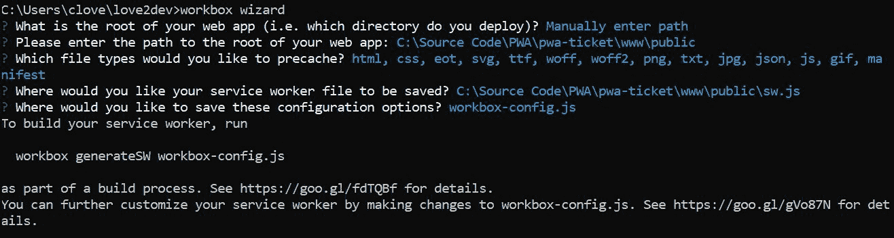

# Service Worker 工具

随着今天有如此多的选项、步骤和工具，Web 开发已经变得复杂。**渐进式 Web 应用**（**PWAs**）需要一个新的模型，但这可能会让错误悄悄进入代码。好消息是，有几个工具可以集成到你的工作流程中，以改善你的应用程序代码的完整性。

在本章中，我将回顾一些我认为非常有价值的工具，这些工具帮助我在发布应用程序之前确保它们达到一定的质量标准。这些工具包括**PWABuilder**、**Lighthouse**、**Sonar**和**WorkBox**。

Lighthouse 和 Sonar 是你可以用来审计你的网页以确保满足最低标准的*linting 工具*，包括 PWA、性能、托管和 SEO 要求。PWABuilder 和 Workbox 在构建渐进式 Web 应用的重要方面非常有帮助，包括清单、图标和服务工作者。

作为额外的好处，所有这些工具都可作为 node 模块提供，你可以将其作为脚本的一部分或在命令行中执行。这意味着你可以将许多此功能包含在自动化工作流程和构建过程中。

本章将涵盖以下主题：

+   使用 PWABuilder 构建 PWA 资产

+   使用 Lighthouse 审计网页

+   使用 Sonar 审计网页

+   使用 WorkBox 构建复杂的服务工作者

# 使用 PWABuilder 构建你的 PWA

PWABuilder 是由 Microsoft Edge 团队构建的渐进式 Web 应用构建工具，公开托管在[`pwabuilder.com`](https://pwabuilder.com)。我喜欢这个工具，因为它可以在不到一分钟的时间内快速构建你需要的资产，将任何网站升级为渐进式 Web 应用。

构建 PWA 组件有三个步骤，包括生成一个 web 清单文件、选择一个简单的 Service Worker 以及下载资产：


让我们详细检查每个步骤。

# 生成有效的 web 清单文件

一个有效的 web 清单文件是 PWA 的基本要求之一，但你会惊讶地发现，许多网站忽略了这一简单的步骤。其中大多数只是忘记了一个重要的字段，或者提供的值不符合指南，例如长名称和短名称值。

最大的错误是没有包含所有不同浏览器和操作系统所需的最小图标集。

要使用在线工具，你需要提供一个公开的 URL、两种主要的应用程序颜色以及你想要制作应用程序图标的标志或图像：


向导将尝试解析值以提供属性，例如全名、简称和描述。如果你的网站已经有一个 web 清单文件，它将使用那些属性。不用担心：你可以在在线表单中提供或更改任何值，以及指定显示方向和语言，如下面的截图所示：


PWABuilder 向导的下一步是生成一组应用程序图标，在撰写本书时，有超过 100 个图标可供选择。您可以选择一个公开图像的 URL 或上传一个基本图像。图像生成器将创建一组图像，以满足每个主要平台（iOS、Android 和 Windows）的准则。它还涵盖了 Chrome 和 Firefox 的要求。

我最喜欢的功能是它包括在生成的 web 清单文件中对每个图像的正确引用。我无法强调这节省了多少时间以及它如何消除潜在的错误。服务创建完整图像集的事实也意味着您不会错过可能使您的 PWA 在不同平台上无法作为渐进式 Web 应用程序的重要图标大小。查看以下截图：


当您点击“输入图像”输入字段时，您会看到一个表单，以便您可以上传图像。您可以从您的硬盘驱动器中选择一个文件：


当向导完成时，产品是一个包含所有图标和一个包含图标引用的清单文件的包：


# 构建服务工作者

在上传源图像以制作应用程序图标后，服务工作者步骤会显示。在这里，您可以选择预制的服务工作者。这些都是基本的服务工作者，可以与大多数网站一起工作，以便您开始渐进式 Web 应用的旅程。

有五种初始服务工作者选项：

+   **离线页面**：使用离线回退页面初始化服务工作者缓存。

+   **页面离线副本**：当用户访问您的网站上的页面时，它们会被缓存，这使得返回访问变得快速且支持离线。

+   离线副本与离线页面的备份

+   **缓存优先网络**：在触网之前检查缓存以获取有效响应，这会将网络响应添加到缓存中。

+   **高级预缓存**：目前处于开发中，但旨在让您对服务工作者安装时缓存的网站资产有更多控制。

# 下载您网站的 PWA 资产

在选择初始服务工作者后，PWABuilder 提供下载您的 PWA 和原生应用程序打包版本的链接。您可以选择仅下载渐进式 Web 应用程序资产、预打包的 Windows appx 文件以及 Google Play 和 iOS 应用商店的原生应用程序。

在大多数情况下，不需要原生应用程序版本，但如果有需要访问特定平台 API 和集成的需求，它们可能很有用。

您可以点击对应于您所需包的按钮。然后，PWABuilder 将生成一个包含所需资产的包，一个 ZIP 文件。该网站还提供了将框架化代码集成到您的网站和提交应用商店包到各个商店的说明。

这是生成的 web 清单文件的示例：


# 框架化的 PWA 图像

我认为 PWABuilder 最好的部分是它如何快速生成所有应用程序图标，并正确引用每个图像的网页清单文件。它生成了超过 100 张图像，我不知道您是否也是如此，但我没有时间或耐心去创建那么多变体，更不用说将代码添加到我的网页清单文件中。

这是 PWABuilder 向导的一部分，但您可能已经创建了一个有效的网页清单文件和一个服务工作者，并且只需要一组图标。

这是您可以直接访问图像生成服务的地方 [`www.pwabuilder.com/imageGenerator`](https://www.pwabuilder.com/imageGenerator)。您将看到与向导界面中包含的相同表单。唯一的区别是，一旦您提供了基础图像，您可以直接点击下载按钮以获取仅包含您的 PWA 图标和网页清单 JSON 的文件。

您不仅限于使用在线图像生成器。源代码是一个开源的 ASP.NET 项目，[`github.com/pwa-builder/App-Image-Generator`](https://github.com/pwa-builder/App-Image-Generator)。您需要建立一个能够服务 ASP.NET 网站的网络服务器，您可以使用 Docker 来实现。我认为这个版本不是基于 .NET Core，这意味着您需要在 Windows 上有一个 IIS 实例。

工具不会修改您网站上的任何文件，因此您仍然需要更新您的页面以注册服务工作者和网页清单文件。您还需要将图标、清单和服务工作者文件复制到您网站文件夹中。

# 本地运行 PWABuilder

如果您的网站不是公开的，请不要担心：您仍然可以通过本地运行来利用 PWABuilder。实际上，PWABuilder 是微软生产的第二代 PWA 工具。在其之前的生活中，它被称为 Manifold JS，并且仍然使用那个引擎。

Manifold 是一个由 PWABuilder 网站使用的节点模块集合，用于生成您 PWA 所需的文件。Manifold JS 组件可在 GitHub ([`github.com/pwa-builder`](https://github.com/pwa-builder)) 和 npm ([`www.npmjs.com/package/manifoldjs`](https://www.npmjs.com/package/manifoldjs)) 上找到。

您可以直接从命令行运行 PWABuilder。由于它是一个节点模块，您需要安装 Nodejs，等等。

我建议全局安装 PWABuilder 节点库：

```js
npm install -g pwabuilder 
```

现在，您可以从任何命令行执行 `pwabuilder`。在以下示例中，我添加了一些选项，一个用于指定目标以保存生成的资产，另一个用于指定生成资产的平台：


如果您想更加雄心勃勃，您可以构建自己的节点脚本来直接执行 PWABuilder 库。您可以克隆 PWABuilder 项目并检查源代码以及命令行实用工具的执行方式，以了解您如何将库的某些部分纳入自己的脚手架流程中。

# 使用 Lighthouse 审计网页

Lighthouse ([`developers.google.com/web/tools/lighthouse/`](https://developers.google.com/web/tools/lighthouse/)) 是由 Chrome 团队管理的一个自动化工具，可以帮助您审核网站以识别需要关注的问题。该工具不仅审核渐进式 Web 应用的要求，还检查许多最佳实践，包括性能、无障碍性和 SEO。

Lighthouse 是一个开源项目，欢迎贡献。

如本书前面所述，Lighthouse 可以通过两种不同的方式执行：

+   内置于 Chrome 开发者工具的审核标签页

+   Node 模块 ([`www.npmjs.com/package/Lighthouse`](https://www.npmjs.com/package/Lighthouse))

Chrome 扩展是原始实现，但现在正在逐步淘汰。今天，扩展是多余的，因为 Lighthouse 已经内置到开发者工具中。

Lighthouse 将在 Chrome 中执行给定的 URL，并通过一系列测试。这些测试涵盖了模拟移动蜂窝网络和桌面版本的不同场景。

它在这些不同场景中对 URL 进行一系列测试，寻找潜在问题。它可以为您应用程序的性能以及它如何满足最低要求（如成为 PWA）建立基准。

Lighthouse 生成一个分数/成绩单，列出页面在一系列测试中的表现。在一分钟左右的审计过程中，审核会根据不同条件多次重新加载页面，每次加载都会捕获跟踪信息。页面加载时间、成为交互式页面、离线工作效果等都会被记录。

Lighthouse 审核的主要类别包括渐进式 Web 应用功能、Web 性能优化、无障碍性和一般最佳实践。最近，该工具新增了 SEO 审核部分，但这一功能目前仍有限。

在您运行 Lighthouse 审核后，您将看到一份成绩单。这是五个顶级审核类型分数的示例。这些分数基于 0-100 的评分标准，100 分是完美分数。分数由审核组中每个点的加权分数组成：


每个顶级审核都运行细粒度测试并提供非常详细的报告。Lighthouse 可以生成 JSON 或默认 HTML 格式的报告。您还可以保存开发工具测试期间收集的数据，以便您可以对其进行审查和比较。

HTML 报告会自动突出显示您失败或需要解决的问题区域。它还提供了有用的链接，指向可以帮助您找到解决方案的文档：


不时地，我喜欢从 Chrome 开发者工具中运行 Lighthouse，只是为了看看我在开发过程中的位置。这是一个快速且自动化的工具，可以帮助我了解我可能遗漏了一些微不足道但可能产生可衡量影响的问题。

对于渐进式 Web 应用，它会通过一系列清单项来确保它是一个完整的渐进式 Web 应用。大多数都可以自动测试，但有一些必须手动评估。Lighthouse 报告中的条目应该手动验证。

最明显的两个是 HTTPS 和在服务工作者中的 Web 清单文件，但它还深入到更深的层次。它还会检查你的性能，以及你是否可以在蜂窝连接下在 3 秒内加载。它是通过模拟更慢的网络条件和 CPU 来做到这一点的。

它还会检查确保你有针对不同视口的有效图标，并且你可以提示主屏幕横幅。

所有测试都会运行，模拟 3G 连接并将 CPU 速度降低到默认速度的 4 倍。这部分显然会根据可用 CPU 的不同，从设备到设备地影响你的测试结果。我在一台非常新的 i7 Surface Laptop 上工作，它的运行速度比更成熟的 i3 或 i5 处理器要快得多。你也会看到，当你使用不同 CPU 功率的虚拟机时，会有所变化。

所有这些小事情加在一起，将帮助你了解你的网站是否能够提供良好的用户体验。这不是唯一的测试方法，但它确实为你提供了一个良好的基准，涵盖了你需要审计的大部分领域。

# 从 Chrome 开发者工具运行 Lighthouse

使用 Lighthouse 最简单的方法是从 Chrome 开发者工具开始。到现在，你应该知道如何打开这些工具。所有桌面浏览器都包含开发者工具，可以通过按 *F12* 或 *Ctrl* + *Shift* + *I* 来打开。

一旦打开开发者工具，你就有多个选项。Lighthouse 就是其中之一。它被标记为 Audits，并作为最后一个原生标签呈现。如果你像我一样，你可能还有一个扩展程序在工具中放置了一个自定义标签页。它们在 Audits 标签页之后列出：


初始状态下，打开 Audits 标签页时并没有太多内容，只有一个 Lighthouse 对话框。

对话框列出了五个当前的审计类别，以及“运行审计”和“取消”按钮。每个类别都可以打开或关闭。按下“运行审计”按钮开始审计过程：


在审计过程中，你会看到一个新对话框，向你保证审计正在运行，并分享有用的网页开发事实和统计数据以供娱乐。同时，相应的浏览器标签页正在由 Lighthouse 进行测试。

如果你观察浏览器标签页，你会看到它使用内置的模拟工具在不同的虚拟设备和不同的网络条件下加载目标页面，包括离线状态。

根据页面行为和加载情况，不同的测试要么通过要么失败。最后，Lighthouse 会生成一个报告，你可以用它来评估你的页面表现。使用报告来识别页面和网站的各个方面，以进行改进：


审计完成后，您将看到一个格式良好的报告，顶部显示每个类别的总体等级。在分数下方，每个类别列出任何失败的测试或您没有完全达到目标数字但应调查的测试。所有通过测试的测试都分组在一起并折叠在视图之外，但仍然可以查看。

每个测试都应该有一个链接，提供更多详细信息，以单独的“了解更多”链接指示测试内容，并希望提供帮助您改进页面的指导，以便您可以通过测试：


您还应该考虑您正在测试的托管环境。由于您可能没有完整的生产规模 Web 服务器，一些测试将在本地站点上失败。虽然 node http-server 使运行本地 Web 服务器变得容易，但它默认不包含 HTTPS 和 HTTP/2。这使得您的页面在寻找这两个功能的测试中失败。

在这些情况下，由于环境限制，您可以安全地忽略这些测试结果。我确实建议在网站部署到开发、预发布和生产等全规模环境中后进行额外的测试。

记住，当在开发者工具中运行时，您应该将其视为一个重要的分类步骤，以确保您的代码和网站更新能够提升整体网站体验。它们并不是真实用户可能拥有的实际体验，因为网站托管在不同的环境中。也要记住，Lighthouse 模拟的条件只是模拟，可能无法完美反映真实世界的设备或网络条件。

开发者工具 Lighthouse 实现中另一个大问题是无法在切换主要测试类别之外自定义审计。您不能通过自己的测试和类别扩展审计。

这就是直接将 Lighthouse 作为 node 模块运行提供巨大优势的地方。

# 将 Lighthouse 作为命令行实用程序运行

我真的很喜欢将 Lighthouse 作为 node 模块执行的能力。Lighthouse node 模块依赖于 Chrome Launcher ([`www.npmjs.com/package/chrome-launcher`](https://www.npmjs.com/package/chrome-launcher))，这将打开一个 Chrome 实例以执行测试。

这意味着执行 Lighthouse 的机器应该已安装 Chrome。该工具使用完整的 Chrome 实例，因为它需要渲染页面并使用开发者工具来模拟不同的模式。

由于 Lighthouse 是一个 node 模块，您需要使用 npm 或 yarn 安装它。像其他工具一样，我建议全局安装：

```js
>npm install -g Lighthouse 
```

您可以直接通过命令行运行完整的审计，只需执行 Lighthouse 后跟目标 URL：

```js
>Lighthouse https://tickets.love2dev.com 
```

这将启动一个新的 Chrome 实例，并对目标 URL 运行测试套件。完成后，在当前文件夹中创建一个 HTML 报告文件。您可以在浏览器中加载此文件进行审查。它与开发者工具中加载的报告相同。

这是一个将自动测试报告文件加载到 Lighthouse 报告查看器的示例：


您可以自定义 Lighthouse 以执行所需的测试并以您想要的格式报告。以下是我在我项目上使用的一些常见选项：

+   `--config-path`: 要用于审计的配置文件的本地路径。

+   `--output`: 报告格式。选项包括 JSON、CSV 和 HTML（默认为 HTML）。您可以指定多个格式。

+   `--output-path`: 报告的写入位置。如果指定了多个格式，路径将被忽略，但每个格式都根据目标的基本名称保存到当前路径。

+   `--view`: 一旦写入，就在浏览器中启动 HTML 报告。

+   `--block-url-patterns`: 强制浏览器忽略某些资源。这对于测试没有第三方脚本的情况很有用。

+   `--throttling-*`: 在测试期间对网络和 CPU 限制的不同选项，以细粒度控制。

+   `--save-assets`: 将测试资源如屏幕截图持久化到磁盘。

在此示例中，运行了完整的审计，并以 JSON 和 HTML 格式保存：

```js
>Lighthouse https://tickets.love2dev.com --output json --output html --output-path ./myfile.json 
```

报告以两种输出格式保存在本地。我喜欢这样做，因为 HTML 报告易于阅读，而 JSON 报告易于被第三方或自定义报告解决方案消费。

默认的 Lighthouse 审计可能无法覆盖您需要监控的规则或您想要测试的规则。您也可以创建自己的测试，这些测试需要被包含在内。您可以使用自己的配置来自定义审计。

自定义配置以 JSON 对象的形式编写。以下示例扩展了默认配置，但将测试限制为仅性能和渐进式 Web 应用测试：

```js
{ 
    "extends": "Lighthouse:default", 
    "settings": { 
        "onlyCategories": ["performance", "pwa"] 
    } 
} 
```

要使用自定义配置文件，您必须将路径作为命令行开关提供：

```js
>Lighthouse https://tickets.love2dev.com --config-path=./custom.Lighthouse.config.js --output json --output html --output-path ./pwa-tickets.json 
```

最终，您可以控制 Lighthouse 用于运行审计的所有内容，包括收集、测试组、类别以及不同通过如何执行。

自定义配置文件使您能够非常容易地控制 Lighthouse 如何针对您的 Web 应用进行测试，而无需烦恼于扩展命令行选项。这也使得测试非常可重复，并且您可以将配置文件包含在源控制中，以便轻松恢复和审计测试的执行情况。

# Lighthouse 和无头测试

最近，Chrome 团队还发布了一个名为 Puppeteer 的工具（[`github.com/GoogleChrome/puppeteer`](https://github.com/GoogleChrome/puppeteer)），它执行一个无头 Chromium 实例。这并不是 Chrome，而是在代码库上的一个变体，许多流行的应用程序如 Visual Studio Code 都是基于这个变体构建的。

无头浏览器可以执行页面，但不能查看页面。因为页面没有可见地渲染，所以一些测试没有运行。在执行使用无头浏览器的审计时，您应该注意这一点。

能够在无头浏览器上使用 Lighthouse 进行测试的能力为将工具集成到不同的工具中打开了机会。例如，WebPageTest、HTTPArchive、Calibre 和其他工具使用 Lighthouse 向他们的报告添加额外的测试点。你可以效仿他们，在你的内部测试和审计工作流程中整合 Lighthouse 节点模块。

由于 Lighthouse 可以作为节点模块从脚本中执行，你可以创建一个自动化测试来测试你的整个网站或网站中一组样本 URL。然后你可以审计结果并找到你需要解决的问题的共同区域。

我确实建议在您网站上的多个 URL 上运行它，因为大多数应用程序都是由许多不同类型的页面组成的。但请注意：限制自动测试的页面数量。每个测试实例都会启动一个新的 Chrome 实例，如果你试图测试整个网站，这可能会迅速失控。

lightcrawler ([`github.com/github/lightcrawler`](https://github.com/github/lightcrawler)) 项目是一个你可以用来自动化测试整个网站的潜在工具。Lighthouse Cron ([`github.com/thearegee/Lighthouse-cron`](https://github.com/thearegee/lighthouse-cron)) 允许你使用 cron 作业在预定和随机间隔内审计网站，以收集随时间变化的分数。这些都是 Lighthouse 和类似工具如何被用来提供有价值的测试和性能审计，以使 Web 应用程序更好的几个例子。

我还建议运行多个测试周期以创建比较。每次我运行网站或页面审计时，我都会发现结果变化。有时，就像任何真正的科学实验一样，你会找到一些异常值，这些异常值并不能准确反映整体体验。

例如，测试机器可能正在运行一个高 CPU 后台任务，或者一个消耗磁盘和内存 I/O 的任务，这可能导致性能问题。当对实时网站进行测试时，你也可能遇到超出你控制范围的网络问题。

这些都可能导致测试失败和审计结果不佳。当我看到性能结果不佳时，我通常会再运行 3-5 次测试，看看可能会有什么变化。当我持续看到测试失败或记录不良结果时，我会努力改进问题。如果一个失败的测试是持续的，那么问题是我的网站，而不是网站周围的环境。

# 在 Node 脚本中运行 Lighthouse

就像 Sonar（将在下一节中介绍）和其他基于节点的实用工具一样，你还可以在自己的 Node 脚本和模块中使用 Lighthouse。你需要创建对`Lighthouse`和`chrome-launcher`模块的引用：

```js
const Lighthouse = require("Lighthouse"), 
   chromeLauncher = require('chrome-launcher'); 
```

Chrome 启动器和 Lighthouse 模块都返回承诺。在启动 Lighthouse 之前，您必须创建一个新的 Chrome 实例。

Chrome Launcher 解析对 Chrome 实例的引用。您需要将开发端口号码传递给灯塔模块。这就是灯塔如何与 Chrome 通信以执行测试的：

```js
function launchChromeAndRunLighthouse(url, flags, config = null) { 

    return chromeLauncher.launch({ 
        chromeFlags: flags.chromeFlags 
    }).then(chrome => { 

        flags.port = chrome.port; 
        return Lighthouse(url, flags, config).then(results => { 
        // The gathered artifacts are typically removed as they can be         
        //quite large (~50MB+) 
            delete results.artifacts; 
            return chrome.kill().then(() => results); 
        }); 
    }); 
} 
```

您还应该将自定义配置提供给灯塔方法。您可以将其留空，并执行默认审计。

当灯塔启动时，会打开一个新的 Chrome 实例，就像从命令行一样。您可以观察您的网站运行所有测试。

当灯塔完成时，它会以目标格式解析结果。

# 使用灯塔进行持续构建

使用灯塔的另一种方法是将其嵌入到您的构建和部署工作流程中。例如，您可能使用像**Travis**这样的工具，该工具执行脚本以部署和测试应用程序。这样，您可以在将项目部署到生产服务器之前确保项目通过灯塔审计。

运行需要认证的现代网站（如 PWA 票据应用）存在问题。因为灯塔使用未初始化的环境来执行网页，有时当存储不可用时，持久令牌可能不可用。

在 PWA 票据应用中，这意味着网站会重定向到登录页面。我看到了一些关于解决这个问题的潜在解决方案的提及，但并没有取得太多成功。

最后，我发现的一个很酷的灯塔工具是埃里克·比德尔（Eric Bidel）的得分徽章（[`github.com/ebidel/Lighthouse-badge`](https://github.com/ebidel/lighthouse-badge)）。您可以将徽章作为项目`readme`文件的一部分包含：


灯塔是一个出色的工具，可以帮助您找到并诊断许多会影响您整体应用程序用户体验的常见问题。它对渐进式 Web 应用程序功能、Web 性能、可访问性和功能行为等方面提供了有价值的见解。正如我们最近所看到的，团队正在不断向灯塔添加新的测试集。SEO 集只是灯塔将要覆盖的新领域的一个起点。

内置工具为您，开发者或任何相关方，提供了快速测试页面以查看您在默认类别中满足预期程度的能力。您应该记住，Chrome 工具执行的默认测试是 Chrome 团队认为重要的，它们可能并不完全符合您的需求。

我确实建议从默认测试开始，以基准测试您网站当前的状态。默认测试是一套很好的基线测试，我认为每个网站都应该将其作为最低标准使用。

直接使用 node 运行灯塔的能力不仅可以让您根据需求定制测试，还让您能够自定义和扩展测试套件。您可以深入研究灯塔文档，了解如何创建自己的测试。

# 使用 Sonar 审计网页

与 Lighthouse 类似，微软 Edge 团队也发布了一个名为 **Sonar** 的新网站代码检查工具（[`sonarwhal.com/`](https://sonarwhal.com/)）。像 Lighthouse 一样，它是一个开源的节点模块，充当测试框架来在网页上执行规则。

这两个工具提供类似的测试能力，但也提供了一组不同的能力和测试套件。两者都提供了一个默认的起点来在页面上执行一组基本测试。两者都可以使用你自己的配置进行自定义，甚至可以通过自定义测试和报告进行扩展。

与灯塔（Lighthouse）不同，Sonar 并未集成到浏览器开发者工具中。至少目前还没有，我之所以这么说，是因为我可以看到这个工具可能会在某个时刻被集成到 Edge 浏览器中，就像 Lighthouse 在 Chrome 浏览器中那样。

Sonar 还有所不同，因为它可以在 Microsoft Edge、Chrome 或其他测试库中执行测试。例如，Sonar 随带一个 jsdom 解析器。

# 使用 Sonar CLI

由于 Sonar 不是浏览器的一部分，而是一个节点模块，它需要在自定义节点脚本中执行或者通过使用其命令行界面（CLI）来执行。CLI 是开始使用 Sonar 的最佳起点，就像 Lighthouse 一样，你首先需要安装 Sonar。再次强调，我推荐全局安装：

```js
npm install -g sonarwhal 
```

在你能够运行 Sonar 之前，你需要创建一个配置文件，`.sonarwhalrc`。你可以手动创建或者使用命令行来初始化配置文件：

```js
> sonarwhal --init 
```

这将启动一个向导，它会问你一系列问题以初始化你的配置。你可以选择一个预定义的配置或者创建一个自定义配置：


目前有 `web-recommended` 和 `progressive-web-apps` 两个预定义配置可用。根据你选择的配置，向导将安装所需的任何节点依赖项。我将在稍后介绍 Sonar 组件：


这将生成一个启动配置文件，扩展内置的 `web-recommended` 包：

```js
{ 
    "extends": [ 
        "web-recommended" 
    ] 
} 
```

这包含一个基础配置，包括最小规则集、格式化器和连接器定义。这就是 `web-recommended` 配置文件的样子。你可以使用以下代码作为参考来查看如何创建自己的配置文件：

```js
{ 
    "connector": { 
        "name": "jsdom", 
        "options": { 
            "waitFor": 5000 
        } 
    }, 
    "formatters": [ 
        "summary" 
    ], 
    "rules": { 
        "axe": "error", 
        "content-type": "error", 
        "disown-opener": "error", 
        "highest-available-document-mode": "error", 
        "html-checker": "error", 
        "http-cache": "error", 
        "http-compression": "error", 
        "meta-charset-utf-8": "error", 
        "meta-viewport": "error", 
        "no-bom": "error", 
        "no-disallowed-headers": "error", 
        "no-friendly-error-pages": "error", 
        "no-html-only-headers": "error", 
        "no-http-redirects": "error", 
        "no-protocol-relative-urls": "error", 
        "no-vulnerable-javascript-libraries": "error", 
        "sri": "error", 
        "ssllabs": "error", 
        "strict-transport-security": "error", 
        "validate-set-cookie-header": "error", 
        "x-content-type-options": "error" 
    }, 
    "rulesTimeout": 120000 
} 
```

我将在稍后演示如何自定义这个配置。

你不仅限于扩展单个配置，因为你还可以扩展多个配置，如以下代码所示：

```js
{ 
    "extends": [ 
        "config1", "config2" 
    ] 
} 
```

你不仅限于内置的配置，而且不需要运行初始化向导。你可以创建自己的配置文件，因为它们只是 JSON 文档：

```js
{ 
    "connector": { 
        "name": "edge" 
    }, 
    "formatters": ["json"], 
    "rules": { 
        "rule1": "error", 
        "rule2": "warning", 
        "rule3": "off" 
    }, 
    "rulesTimeout": 120000 
    ... 
} 
```

一旦 Sonar 有了一个配置，你就可以从命令行执行它。像 Lighthouse 一样，你只需要执行 Sonar 然后跟上一个有效的 URL：

```js
> sonarwhal https://tickets.love2dev.com
```

你可以通过创建一个自定义配置文件来自定义测试。Sonar 将在当前文件夹中查找 `.sonarwhalrc` 文件。

# Sonar 组件

你需要熟悉 Sonar 的五个组件，才能理解这个工具是如何工作的。

# 配置

这些就是我之前提到的 `.sonarwhalrc` 文件。这些文件驱动着针对您网站的特定测试或审计。

# 连接器

连接器是 Sonar 执行的规则与 URL 之间的接口。目前有三种官方连接器可用：

+   `jsdom`：WHATWG DOM 的 nodejs 实现，这意味着它提供了一个相当不错的引擎来测试页面是如何渲染的。

+   `chrome`：通过启动 Chrome 并使用其调试协议来执行规则。

+   `edge`：使用 Microsoft Edge 来执行规则。这需要 Windows 10，因为 Edge 只在 Windows 上运行。

# 格式化器

格式化器将测试结果打印出来。目前有五个格式化器由 Sonar 团队维护：

+   `json`：创建一个 JSON 格式的报告

+   `stylish`：生成一个格式化的表格报告

+   `excel`：将报告生成为一个 Excel 工作表

+   `codeframe`：以代码框架风格生成报告

+   `summary`：以表格格式格式化报告

我个人最喜欢 JSON，因为这样我就可以将其作为原始数据源添加到自定义报告中，或者将其与其他工具（如 Lighthouse 的报告）结合使用，以完成全面的网站审计。

# 解析器

规则订阅解析器和它们发出的事件以执行测试。它们被设计为专注于特定的资源类型，如 JavaScript 和 web 清单文件。

# 规则

规则是 Sonar 的核心，因为它们负责对页面进行测试，以查看是否满足所需的准则。默认的 Sonar 安装中包含了许多规则。像 Sonar 的其他部分一样，您可以自由创建自己的规则。

# 使用 Sonar node 模块自动化网站审计

作为 nodejs 模块和命令行界面的组合，这为您提供了多种方式将 Sonar 集成到您的构建和部署过程中。

与 Lighthouse 不同，没有命令行开关，因为它依赖于配置文件。如果您想执行不同的配置，您需要从目标文件夹运行 sonarwhal，以便加载所需的自定义配置。

# 使用 workbox 创建复杂的服务工作者

**Workbox** ([`developers.google.com/web/tools/workbox/`](https://developers.google.com/web/tools/workbox/)) 是另一个开源项目，可以帮助您创建服务工作者。它由 Chrome 团队维护，但像其他项目一样，我已经审查了那些公开接受贡献的项目。

Workbox 的目标是帮助构建完整的服务工作者或向现有服务工作者添加复杂组件。Workbox 允许您在稳固的基础上构建，因此您可以配置以满足您的特定需求。它让您能够控制如何构建服务工作者。您可以手动向现有服务工作者添加功能，并使用工具从零开始构建服务工作者。

正确配置的服务工作者使用一系列适当的缓存策略。这句话的关键是“正确配置的服务工作者”，正如您现在应该知道的，这并不简单。

Workbox 是一个用于在您的服务工作者中构建缓存组件的工具。该工具专注于提供样板代码，以帮助以下服务工作者区域：

+   预缓存

+   运行时缓存

+   策略

+   请求路由

+   背景同步

+   有用的调试

Workbox 的历史起源于一对现在已弃用的项目，`sw_precache`和`sw_toolbox`。`sw_precache`管理预缓存资源，而`sw_toolbox`处理动态缓存。Workbox 专注于管理所有缓存和失效策略。

在撰写本书时，Workbox 目前处于 3.2 版本，在过去 18 个月里取得了长足的进步。它的优势在于能够将复杂的代码抽象化，从而让您，开发者，可以专注于配置，在某些情况下，还可以进行定制。

在本章的其余部分，我将专注于更新 PWA 票据应用程序，用 Workbox 替换第八章中涵盖的大部分代码，*应用高级服务工作者缓存策略*。我在源代码库中创建了一个名为 workbox 的单独分支。

# 安装 workbox

Workbox 是一个库和 node 模块的集合。要获得工具的全貌，您需要全局安装 node 模块并克隆 GitHub 仓库。克隆库不是必需的，但我建议您这样做，以便您可以研究库的结构：

```js
> npm install -g workbox-cli 
```

Workbox 的 node 模块包括命令行界面，可以帮助您构建服务工作者和 Workbox 组件。我将在解释工具的不同部分时介绍如何使用 CLI。

安装 CLI 后的第一步是运行 Workbox 向导：

```js
> workbox wizard  
```

这将启动一系列关于您应用程序的问题：



这将创建一个配置文件，`workbox-cli`工具可以在后续步骤中使用。这是在运行时选择默认选项为 PWA 票据应用程序生成的：

```js
module.exports = { 
  "globDirectory": "C:\Source Code\PWA\pwa-ticket\www\public", 
  "globPatterns": [ 
    "**/*.{html,css,eot,svg,ttf,woff,woff2,png,txt,jpg,json,js,gif,manifest}" 
  ], 
  "swDest": "C:\Source Code\PWA\pwa-ticket\www\public\sw.js" 
}; 
```

CLI 命令使用配置文件中的设置来查找所有匹配`globPatterns`的文件，并在预缓存数组中创建一个条目。我将在下一节中介绍预缓存列表格式：


我不建议像这个例子那样预先缓存 600 个文件和 11 MB。相反，你应该自定义配置以将列表裁剪到适当的数量。在这种情况下，PWA 票据应用在构建过程中生成了所有票据条形码，因此有数据可以开发。

我会回来展示如何自定义配置文件以最大化您的 Workbox 服务工作者体验。配置文件和 workbox-cli 命令是构建服务工作者的关键，也是使用该库的关键。

您可以自由地以任何您认为合适的方式使用 Workbox 库。配置是为命令行工具准备的。如果您不熟悉 Workbox 的工作方式的不同细微差别，那么我建议您首先从向导开始。

一旦您掌握了 Workbox 库的工作方式，或者至少感到非常舒适，您就可以开始手动集成它。一切从将库导入到您的服务工作者开始。

在前面的章节中，我演示了如何使用 `importScripts` 在您的服务工作者中引用额外的脚本。您需要使用 `importScripts` 引用 workbox 库：

```js
self.importScripts("https://storage.googleapis.com/workbox-cdn/releases/3.2.0/workbox-sw.js", 
    "js/libs/2ae25530a0dd28f30ca44f5182f0de61.min.js", 
    "js/app/libs/e392a867bee507b90b366637460259aa.min.js", 
    "sw/sw-push-manager.js" 
); 
```

这个例子展示了我是如何将 PWA 票务应用中的一些支持库替换为对 CDN 托管的 Workbox 脚本的引用。该库托管在 Google Cloud CDN 上。

您还可以使用 `workbox-cli copyLibrary` 命令将库复制到您的网站上。该库不是一个单独的文件，而是一组包含不同 JavaScript 类的多个文件。这些文件都被复制到目标目录中。我在 PWA 票务应用中使用了 `/sw` 文件夹。

在目标文件夹内创建了一个包含当前 Workbox 版本号的文件夹。要添加对库的引用，您需要引用 `workbox-sw.js` 文件：

```js
self.importScripts("sw/workbox-v3.2.0/workbox-sw.js", 
    "js/libs/2ae25530a0dd28f30ca44f5182f0de61.min.js", 
    "js/app/libs/e392a867bee507b90b366637460259aa.min.js", 
    "sw/sw-push-manager.js" 
); 
```

在之前的 Workbox 版本中，整个库都被加载，这有很多代码。现在已经得到了改进，现在只加载您服务工作者所需的文件，减少了负载和所需的存储。我在这例子中使用的 3.2 版本有 23 个不同的文件或类。

如果您查看 `copyFiles` 方法创建的文件夹，您会发现更多内容。每个类都有两个版本，分别是生产版和调试版。还有源映射文件。我稍后会向您展示如何切换使用的版本，以及如何告诉 Workbox 如何查找本地模块。

CLI 工具是熟悉使用 Workbox 构建服务工作者的一种好方法，但它实际上只是一个库。在下一节中，我将回顾库的结构，并指导您如何在使用服务工作者时使用 Workbox 来最大化您的体验。

# Workbox 结构

当您导入 Workbox 库时，您正在导入根级别模块。该模块加载属于 workbox 命名空间的其他组件，例如：

+   `workbox`

+   `workbox.core`

+   `workbox.precaching`

+   `workbox.routing`

+   `workbox.strategies`

+   `` `workbox.expiration` ``

+   `workbox.backgroundSync`

+   `workbox.googleAnalytics`

+   `workbox.cacheableResponse`

+   `workbox.broadcastUpdate`

+   `workbox.rangeRequest`

+   `workbox.streams`

每个库都有自己的 API。有些是高级别的，而有些在或甚至扩展了其他库。路由使用策略类，而这些类可以通过插件进行扩展。Workbox 库可以处理大多数场景，但它们是可配置和可扩展的，允许您根据需要自定义它们。

您不仅限于库中包含的模块。您可以创建自己的组件，并为 Workbox 的功能添加更多价值。您还可以使用它们的模块作为参考来构建自己的定制解决方案。

# 服务工作者设置

默认情况下，Workbox 使用具有额外日志记录功能的库的调试版本。您可以通过在 `setConfig` 方法中将调试标志设置为 false 来关闭此功能，并使用生产版本。生产版本更轻量级，这意味着您不会对客户的流量计划造成太大负担。生产代码已压缩，并移除了更重的日志记录功能：

```js
workbox.setConfig({ 
    debug: false 
  }); 
```

默认情况下，Workbox 从 CDN 加载模块。如果您在自己的服务器上托管 Workbox，那么您需要配置 Workbox 从您的服务器加载模块。这需要使用配置对象中的 `modulePathPrefix`。

要配置 Workbox 使用本地生产版本，`setConfig` 调用将如下所示：

```js
workbox.setConfig({ 
    debug: false, 
    modulePathPrefix: "sw/ workbox-v3.2.0/" 
  }); 
```

您可以让 Workbox 管理关于您的服务工作者的一切，包括生命周期事件。如果您希望服务工作者立即变为活动状态，您应该对 `skipWaiting`（在第五章，*服务工作者生命周期*) 和 `clientsClaim` 方法执行此操作：

```js
workbox.skipWaiting(); 
workbox.clientsClaim(); 
```

如果您在服务工作者中集成 Workbox 组件，并且没有将所有生命周期管理外包给 Workbox，那么您仍然可以在安装和活动事件中管理这些，就像您在本书的早期部分学到的那样。

# 使用 Workbox 进行预缓存

在本书的早期部分，我介绍了在安装事件中预缓存资源的概念。使用的标准模式是创建一个要缓存的 URL 列表，并将其传递给 `cache.addAll` 方法。当您的应用程序非常稳定且很少更改资源时，这很棒。但如果你只需要更新少量预缓存响应怎么办？

与使用 `cache.addAll` 方法不同，您需要创建更复杂的程序来检查修订版本与缓存资源之间的差异，并执行更新。

这就是 Workbox 预缓存模块发挥作用的地方。它抽象了管理您预缓存资源所需的复杂逻辑。您仍然可以提供简单的 URL 数组，就像我在前面的章节中演示的那样，并且它会缓存这些资源。但您还有选择包括相应的哈希或修订值，Workbox 可以使用这些值来跟踪资源。

`workbox.precaching.precacheAndRoute` 方法接受一个数组，该数组可以包含字符串、对象或两者的组合。在这个例子中，我只是将 PWA 票据预缓存列表复制到了该方法中：

```js
workbox.precaching.precacheAndRoute([ 
    "/", 
    "img/pwa-tickets-logo-320x155.png", 
    "js/app/512df4f42ca96bc22908ff3a84431452.min.js", 
    "js/libs/ca901f49ff220b077f4252d2f1140c68.min.js", 
     //...the remaining URLs to pre-cache 
    "cart/" 
]); 
```

Workbox 在 `IndexedDB` 中维护一个包含额外元数据的缓存响应索引。它只能在需要时使用此索引来更新预缓存资源。您需要做出的更改是将您的预缓存列表从仅字符串转换为包含 URL 和修订值的对象。

在这里，我已经修改了列表的版本，只显示其中的一些条目：

```js
workbox.precaching.precacheAndRoute([ 
     ... 
  { 
    "url": "error.html", 
    "revision": "24d4cb67d5da47a373764712eecb7d86" 
  }, 
  { 
    "url": "event/index.html", 
    "revision": "7127ba50c2b316ccbc33f2fad868c6a7" 
  }, 
  { 
    "url": "events/index.html", 
    "revision": "6702e4d3b1554047e8655696875b396d" 
  }, 
  { 
    "url": "fallback/index.html", 
    "revision": "d03fa5c7471ec4c84ca8bf8fefaddc2b" 
  }, 
    .... 
]); 
```

生成修订值最常见的方法是计算文件的哈希值。我在第八章，“应用高级服务工作者缓存策略”中演示了如何生成文件哈希值。你可以将此例程作为构建过程的一部分，或者利用 Workbox CLI 来帮助。

当你运行 Workbox CLI 向导时，它使用全局模式来识别你的网站资产。它创建一个带有分配给相应修订值的哈希值的预缓存文件列表。你有两个选择：让向导构建整个服务工作者，或者让它将预缓存代码注入现有的服务工作者中。

`injectManifest` 功能允许你使用 Workbox 基础设施注入预缓存代码。这是通过 CLI 和 `injectManifest` 命令完成的。你需要提供配置脚本的路径：

```js
> workbox injectManifest path/to/config.js 
```

CLI 工具查找以下内容以替换为对 `preCacheAndRoute` 的调用：

```js
workbox.precaching.precacheAndRoute([]); 
```

此方法允许你在构建过程中修改源服务工作者。它还允许你依赖向导为你创建文件哈希值。

如果你使用包含哈希或修订值的文件命名约定，你可以继续这样做，无需向 Workbox 提供哈希值。对于这些场景，你只需提供字符串引用即可。

一些文件不能在文件名中使用修订值，例如任何 HTML 的路径。更改 URL 会更改地址，这意味着你可能需要配置复杂的 301 重定向规则，或者更糟糕的是，断开资产链接。

在这个例子中，`precacheAndRoute` 方法接收一个包含字符串、带有修订值嵌入名称的 URL 以及不带修订名称的 HTML 文件对象的数组：

```js
workbox.precaching.precacheAndRoute([ 
     ... 
        "js/app/libs/e392a867bee507b90b366637460259aa.min.js", 
        "js/app/libs/8fd5a965abed65cd11ef13e6a3408641.min.js", 
        "js/app/pages/5b4d14af61fc40df7d6bd62f3e2a86a4.min.js", 
        "js/app/pages/8684e75675485e7af7aab5ca10cc8da5.min.js", 
        "js/app/pages/88ea734e66b98120a5b835a5dfdf8f6c.min.js", 
  { 
    "url": "error.html", 
    "revision": "24d4cb67d5da47a373764712eecb7d86" 
  }, 
  { 
    "url": "event/index.html", 
    "revision": "7127ba50c2b316ccbc33f2fad868c6a7" 
  }, 
  { 
    "url": "events/index.html", 
    "revision": "6702e4d3b1554047e8655696875b396d" 
  }, 
  { 
    "url": "fallback/index.html", 
    "revision": "d03fa5c7471ec4c84ca8bf8fefaddc2b" 
  }, 
    .... 
]); 
```

你可以构建你的列表并调用 `preCacheAndRoute` 方法，就像我展示的那样，但你也可以将预缓存列表分解成逻辑组，这样你可以使用 `workbox.precaching.precache` 方法单独提供这些组。在你提供了所有预缓存引用之后，你必须调用 `addRoute` 方法来完成此过程：

```js
workbox.precaching.precache([ 
     ... 
        "js/app/libs/e392a867bee507b90b366637460259aa.min.js", 
        "js/app/libs/8fd5a965abed65cd11ef13e6a3408641.min.js", 
        "js/app/pages/5b4d14af61fc40df7d6bd62f3e2a86a4.min.js", 
        "js/app/pages/8684e75675485e7af7aab5ca10cc8da5.min.js", 
        "js/app/pages/88ea734e66b98120a5b835a5dfdf8f6c.min.js", 
     ... 
]); 
workbox.precaching.precache([ 
     ... 
  { 
    "url": "error.html", 
    "revision": "24d4cb67d5da47a373764712eecb7d86" 
  }, 
  { 
    "url": "event/index.html", 
    "revision": "7127ba50c2b316ccbc33f2fad868c6a7" 
  }, 
  { 
    "url": "events/index.html", 
    "revision": "6702e4d3b1554047e8655696875b396d" 
  }, 
  { 
    "url": "fallback/index.html", 
    "revision": "d03fa5c7471ec4c84ca8bf8fefaddc2b" 
  }, 
    .... 
]); 

workbox.precaching.andRoute(); 
```

如果你使用 CLI 生成预缓存文件和哈希值的列表，你需要修剪或限制它包含在列表中的文件。例如，PWA 票务应用程序自动为样式表和脚本创建哈希名称，但不为模板和 HTML 资产创建。

简单修改网站的 Workbox 配置文件可以移除从自动化过程中删除的 css 和 js 文件。只需从 `globPatterns` 正则表达式移除这些扩展名即可：

```js
module.exports = { 
  "globDirectory": "C:\Source Code\PWA\pwa-ticket\www\public", 
  "globPatterns": [ 
    "**/*.{html,eot,svg,ttf,woff,woff2,png,txt,jpg,json,gif,manifest}" 
  ], 
  "globIgnores": ["qrcodes/*.gif", "img/venues/**/*.*", "img/people/*.*", "meta/**/*.*",  
    "html/pages/*.*", "css/webfonts/*.*", "img/pwa-tickets-logo*.*", "sw/cache.manifest"], 
  "swDest": "C:\Source Code\PWA\pwa-ticket\www\public\sw.js", 
  "swSrc": "C:\Source Code\PWA\pwa-ticket\www\public\sw.src.js" 
}; 
```

还请注意，我在配置中添加了 `globIgnores` 属性。这告诉向导忽略任何匹配这些模式的文件。我知道二维码是由票据生成的，场馆图片应该按需加载。我还添加了一些额外的模式到忽略列表中。现在，这些资源不会进行预缓存，而不是预缓存超过 11 MB 的资源，服务工作者现在将在 39 个文件中预缓存 886 KB：


Workbox 提供了三种方式供你使用来生成修订值：

+   `workbox-build`：可以包含在任务运行器（如 grunt、gulp 或 npm 脚本）中

+   `workbox-cli`：可以生成列表并将其添加到脚手架（scaffolded）服务工作者中

+   `workbox-webpack-plugin`：适用于 webpack 用户

你不受 Workbox 工具生成的修订值（revision values）的限制，你可以在自己的构建过程中生成它们。修订值只需对每个文件版本唯一，以便 Workbox 服务工作者库可以检查是否需要更新资源。

Workbox 可以操纵请求以匹配缓存的版本。例如，营销标签通常添加在 `QueryString` 中，并且由于许多原因而变化。Workbox 可以配置为忽略 `QueryString` 模式以避免重复内容缓存。

这些是 Workbox 可以配置以优化的常见变化场景：

+   **查询字符串和 URL 参数**

+   **默认文档**：`index.html` 和 `default.html`

+   **清洁 URL**：自动将 `.html` 添加到无扩展名的 URL 后面

+   **自定义操作**：这是一个机会，让你定义一个回调方法来返回可能的匹配数组

这需要使用 `precaching.PrecacheController` 对象。为此，你需要创建控制器的新实例并使用 `addToCacheList` 方法。此方法消耗与预缓存方法相同的数组（s）。

差别在于你必须手动管理服务工作者（service worker）的安装、激活和获取事件：

```js
const precacheController = new workbox.precaching.PrecacheController(); 
precacheController.addToCacheList([ 
    "/", 
    "img/pwa-tickets-logo-320x155.png", 
    "js/app/512df4f42ca96bc22908ff3a84431452.min.js", 
    "js/libs/ca901f49ff220b077f4252d2f1140c68.min.js", 
    //... the remaining URLs to pre-cache 
    "cart/" 
]); 

precacheController.addToCacheList([ 
  { 
    "url": "html/pages/tickets.html", 
    "revision": "11c6e0cb67409cf544b162cd6a7ebfbf" 
  }, 
  { 
    "url": "html/polyfils.html", 
    "revision": "337170ad8814e7571a7b8ddb8831ae04" 
  } 
]); 

self.addEventListener('install', (event) => { 
  event.waitUntil(precacheController.install()); 
}); 
self.addEventListener('activate', (event) => { 
  event.waitUntil(precacheController.cleanup()); 
}); 
self.addEventListener('fetch', (event) => { 
  event.respondWith(caches.match(event.request).then(...)); 
}); 
```

在服务工作者事件安装和激活处理程序中，你需要调用 `precacheController` 的 `install` 和 `cleanup` 方法。

预缓存（Pre-caching）只是 Workbox 的众多优势之一。它的预缓存系统解决了预缓存中常见的常见问题，那就是如何在不清空整个缓存和重新加载的情况下保持缓存的资源更新。现在，你可以更新服务工作者，它只会更新已更改的资源，这是一个巨大的优势。

预缓存系统也是高度可配置和可定制的。尽管 Workbox 在抽象背后执行了大量工作，但你不需要感到失去了控制。

# 使用 Workbox 的动态路由

到目前为止，Workbox 部分已经关注了脚手架（scaffolding）、预缓存（pre-caching）和配置问题。但正如你应该知道的，服务工作者（service worker）的复杂性在增长，管理动态请求或任何没有预缓存响应的请求。

这正是 Workbox 真正发挥其肌肉力量的地方。

动态路由，如 PWA 票务事件页面，需要应用自定义的缓存逻辑。这就是`workbox.routing`对象发挥作用的地方。对于每个动态路由，你需要使用`registerRoute`方法注册路由和处理程序。它的签名如下：

```js
workbox.routing.registerRoute(matchCb, handlerCb); 
```

此方法需要一个匹配和处理回调方法。每个回调方法都提供了一个 URL 和事件（`FetchEvent`）对象。回调方法使用这些参数来确定要执行的操作。

回调签名可能看起来像这样：

```js
const routeCallback = ({url, event}) => { 
  //do something here 
}; 
```

匹配回调应该评估请求并返回一个布尔值，指示请求是否与模式匹配：

```js
const EventsMatch = ({url, event}) => { 
  return (url.pathname.includes("/event/"); 
}; 
```

你还可以提供一个正则表达式对象（`RegEx`）。这为你提供了同时将路由处理器分配给多个相关资源的灵活性。这是你使用 Workbox 路由最常见的方式。

处理器回调可以自由地应用所需的任何缓存策略。再次强调，该方法应使用 URL 和事件对象来执行这些操作，就像你在前面的章节中学到的那样。

这个例子展示了你如何将第八章中演示的`fetchAndRenderResponseCache`功能集成进来，*应用高级 Service Worker 缓存策略*：

```js
const eventsHandler = ({url, event, params}) => { 
            return responseManager.fetchAndRenderResponseCache({ 
                request: event.request, 
                pageURL: rule.options.pageURL, 
                template: rule.options.template, 
                api: rule.options.api, 
                cacheName: cacheName     
            }) 
                .then(response => { 
                    invalidationManager.cacheCleanUp(cacheName); 
                    return response; 
                }); 
}; 
```

在大多数情况下，你不需要创建自己的自定义回调方法，因为 Workbox 为大多数常见场景提供了策略模块。

你还可以为任何可能没有显式注册处理程序的路由定义一个默认处理程序：

```js
  workbox.routing.setDefaultHandler(workbox.strategies.cacheFirst()); 
```

注意我如何将其中一个缓存策略设置为默认值，`cacheFirst`？这应该有助于我们过渡到动态路由的下一步，即使用缓存策略。

当检索响应出现异常时，你可能需要有一个处理程序。Workbox 可以使用`routing.setCacheHandler`方法来完成此操作：

```js
workbox.routing.setCatchHandler(({url, event, params}) => { 
  //create a custom response to provide a proper response for the error 
}); 
```

# 缓存策略

Workbox 将五种最常见的缓存策略内置到库中：

+   `Stale-While-Revalidate`

+   `Cache-First`

+   `Network-First`

+   `Network-Only`

+   `Cache-Only`

这些策略中的每一个都在`workbox.strategies`命名空间中作为方法提供。你可以使用这些策略而不需要任何自定义配置，但正如你所看到的，Workbox 中的所有内容都是高度可配置的。

最好的部分是，这些策略方法返回一个指向正确配置的路由响应处理器的引用。

如果你想要使用这些策略中的任何一个与你的自定义 fetch 处理器一起使用，请随意。创建所需策略的新实例。然后，使用`event.respondWith`方法，提供策略的 handle 方法。你只需要将`fetch` `event`对象提供给 handle 方法：

```js
self.addEventListener('fetch', (event) => { 
  if (event.request.url === '/my-special-url/') { 
    const staleWhileRevalidate = new workbox.strategies.StaleWhileRevalidate(); 
    event.respondWith(staleWhileRevalidate.handle({event})); 
  } 
}); 
```

每个策略方法都允许你配置以下属性：

+   缓存名称

+   过期策略

+   扩展功能的插件

每个缓存策略方法都接受一个`options`对象。在这里，你可以指定这些自定义设置。首先，是`cacheName`。在这个例子中，我正在注册一个自定义路由来捕获单个事件页面请求并将它们缓存到名为 events 的缓存中：

```js
workbox.routing.registerRoute( 
    new RegExp('/event/'), 
    workbox.strategies.cacheFirst({ 
        cacheName: 'events' 
    }) 
); 
```

我喜欢这个选项，因为它使得管理不同资产类型的缓存和失效变得更加容易。Workbox 通过一个自定义模块使管理失效变得更加简单。

# Workbox 缓存失效

缓存失效由 Workbox 过期插件处理。此插件允许你控制特定规则可以缓存多少响应、生命周期或两者的组合。

过期插件应用于路由的处理程序或缓存策略方法。这是通过向策略的插件数组中添加一个新的过期插件引用来完成的：

```js
workbox.routing.registerRoute( 
    new RegExp('/event/'), 
    workbox.strategies.cacheFirst({ 
        cacheName: 'events', 
        plugins: [ 
           new workbox.expiration.Plugin({ 
             maxEntries: 20, 
             maxAgeSeconds: 24 * 60 * 60  //1 day 
           }) 
         ] 
    }) 
); 
```

如果你想要限制缓存响应的数量，为`maxEntries`属性提供一个数值。如果你想限制响应的有效时间，提供一个与响应有效秒数相匹配的数值。正如前面的例子所展示的，你可以同时使用这两个。在这种情况下，当任一条件为真时，清理逻辑就会被触发。

# 添加后台同步功能

服务工作者后台同步稍微有些复杂。它要求你将所有想要包含在同步逻辑中的网络相关活动包裹在标签中。这意味着在许多情况下，你必须修改或完全重写你的缓存逻辑。

此外，大多数浏览器目前还没有支持这个功能。我们正站在普遍支持的边缘，但这限制了这一重要功能的吸引力。

然而，Workbox 包含一个插件模块，使后台同步变得轻而易举。就像过期插件一样，你只需将后台同步插件添加到策略的列表中：

```js
workbox.routing.registerRoute( 
    new RegExp('/event/'), 
    workbox.strategies.cacheFirst({ 
        cacheName: 'events', 
        plugins: [ 
           new workbox.expiration.Plugin({ 
             maxEntries: 20, 
             maxAgeSeconds: 24 * 60 * 60  //1 day 
           }), 
           new workbox.backgroundSync.Plugin('events', { 
             maxRetentionTime: 24 * 60 // Retry for max of 24 Hours 
           }); 
         ] 
    }) 
); 
```

在插件内部，有一个队列与后台同步 API 一起工作，以确保请求被发送到服务器。你可以限制服务工作者尝试连接服务器的时长。在这个例子中，我将重试限制在了一天。与过期插件不同，`maxRetentionTime`属性是以分钟为单位衡量的，而不是秒。

后台同步给服务工作者代码增加的复杂性，这曾是我的热情的一大障碍。Workbox 使这个功能易于集成，这意味着你和我可以更容易地为我们的 Web 应用添加一个额外的功能层，而无需编写这段复杂的代码。

如果你期待从最终用户那里得到响应或数据，后台同步是一个重要的功能。我知道许多企业应用依赖于互联网连接，但员工可能不在稳定的 Wi-Fi 环境下。这让他们在间歇性或没有连接的情况下也能保持生产力。

作为一句忠告，我确实建议你给用户提供关于后台同步队列中挂起的请求状态的提示。这样，他们就知道他们提交的表单尚未提交到服务器。

# 使用 Google Analytics，即使用户离线

我经常被问到，也看到其他人在各种论坛上询问，“我如何使用像 Google Analytics 这样的分析服务与一个服务工作者一起使用？”

他们最终询问的是，当设备离线时，他们如何使用分析包，但服务工作者允许用户继续使用应用程序。用户活动是如何记录到分析工具中的？

好消息是，你可以使用服务工作者跟踪离线活动，但这确实需要你在部分额外的工作来存储所有活动在一个自定义队列中，并在设备重新上线时同步到分析包。

看起来很简单，对吧？

在这本书中，我没有花时间讨论的一个领域是后台同步 API。有几个很好的原因，主要是由于浏览器支持的有限以及它给服务工作者带来的额外复杂性。

如果你曾经编写过一个依赖于分析包（如 GA、Ensighten 等）的应用程序，你就知道事情可能会很复杂。利益相关者使用这些数据来了解他们的营销活动和网站是否有效，以及他们可以在哪里集中改进活动。

好消息是 Workbox 为你提供了支持，至少对于 Google Analytics 来说是这样。Workbox 是谷歌的一个项目，所以你应该期待他们对其产品提供易于使用的支持！简单可能低估了他们的解决方案，因为它只是一行代码：

```js
workbox.googleAnalytics.initialize(); 
```

这启动了管理 Google 分析的工作库。每个请求和响应都通过后台同步层进行管理。如果你需要执行一些高级配置，你也有这个选项。

例如，如果你需要区分在线和离线活动，你可以提供覆盖。如果你理解自定义维度，cd1 参数对你来说将是有意义的：

```js
workbox.googleAnalytics.initialize({ 
  parameterOverrides: { 
    cd1: 'offline', 
  } 
}); 
```

尽管 Workbox 只包括 Google Analytics 提供者，但这并不意味着你不能为你的分析包创建一个类似的处理器。你可以使用 GA 提供者作为参考或模板来创建你自己的分析包提供者。生产代码位于`workbox-google-analytics.prod.js`文件中。

不要仅仅在同步离线活动时考虑分析包。将其用作任何可能需要与之交互的在线 API 的模型，即使用户的设备离线，他们也可以继续交互。这对那些为现场代理提供业务线应用程序的公司来说非常有用。

# 摘要

我一直是个工具和自动化的粉丝，它们可以使我的应用编码更快，维护性更强，并且希望有更少的错误，但重要的是你要对任何生成的代码或组件的功能有一个清晰的理解。这就是为什么即使当你使用本章中我强调的渐进式 Web 应用工具时，你也需要能够识别它们的优点和局限性。

在开始使用 Workbox 这样的工具之前，你还需要对像服务工作者这样的复杂功能如何工作有一个清晰的理解。没有这些基本知识，你可能会迅速创建一个不符合你预期的服务工作者。此外，当你使用这些工具时遇到问题时，你也需要有强大的知识基础来帮助你调试。

我在本章中选择了四个我认为对开发者来说最有价值的工具进行回顾。这并不意味着所有可用的工具都能帮助你构建出色的渐进式 Web 应用。

Pinterest 在 GitHub 上有一系列你可能觉得有用的工具([`github.com/pinterest/service-workers`](https://github.com/pinterest/service-workers))。他们还有一个生成服务工作者的工具。还有一个 webpack 插件。但最引人入胜的工具可能是他们的服务工作者单元测试模拟环境。这允许你在不运行浏览器实例的情况下对你的服务工作者编写单元测试。

大多数主要框架也已经发布了命令行工具，以帮助你为单页应用生成路由逻辑。我也非常着迷于这些渲染引擎快速被包含到命令行工具中，以使用它们向客户端提供的相同逻辑将它们转换为服务器引擎。我认为这些静态网站围绕 PWA 逻辑构建起来要容易得多，因为它们有真实的 URL。

随着企业对渐进式 Web 应用需求的增加，开发者们处于一个需要深入了解如何创建新应用和更新现有应用以使其成为具有各种服务工作者复杂性的渐进式 Web 应用的位置。本章中调查的工具应该能帮助你构建这些解决方案。我希望这本书能帮助你建立起构建这些应用所需的坚实基础。
