# 第四章 测试响应式媒体

哎呀！我应该测试什么？iPad？iPhone？哪些 Android 设备？这些问题肯定已经在你脑海中浮现。别担心！本章将引导你了解一些真正酷炫的测试技术/方法。

测试是处理响应式媒体过程中的关键部分。我们需要在多种不同的浏览器、设备和平台上彻底测试我们的内容，以确保我们的网站发布到野外时不会遇到任何问题。

你可能会认为我们需要大量的专业技术——这离事实相差甚远！在本章中，我们将看到使用不同的浏览器或在线模拟器测试网站是多么容易。我们将探讨我们需要注意的一些考虑事项和陷阱，并看看我们如何可以轻松地改进那些运行不佳的网站。我们将涵盖以下主题：

+   考虑测试响应式媒体的陷阱

+   使用模拟器测试响应式网站

+   使用工具确定速度

+   通过一个理论上的速度缓慢示例进行测试

准备好了吗？让我们开始吧！

# 测试的起点

你已经创建了那个杀手级应用或网站，并准备好将其发布到野外...或者不是吗？

在我们将我们的作品发布到野外之前，我们需要对其进行彻底的测试。不用说，每个元素都需要进行测试，但像图片或视频这样的媒体需要特别注意。

如果一想到测试就会联想到需要大量自动化脚本、严格的检查和专业的软件，那么请重新考虑。最有用的工具就是我们已经拥有的——我们的浏览器！

当然，我们需要进行大量测试以确保我们的内容在各种不同的设备上都能良好工作。然而，我们的大部分测试可以在带有内置响应式设计功能的桌面浏览器中进行。它们并不完美，因此我们需要其他设施来补充我们的测试。让我们开始吧，先看看每个浏览器提供的响应式功能，从 Chrome 开始。

### 注意

应该注意的是，给出的命令适用于 Windows；对于 Mac 用户，我们用*Cmd* + *Opt*代替*Ctrl* + *Shift*。

## 使用 Google Chrome 或 Opera

对于测试响应式网站，Google Chrome 几乎是无敌的。它提供了最广泛的选择来帮助证明响应式网站的工作效果。

我们可以使用它来更改用户代理、更改屏幕分辨率，甚至测试视网膜启用设备；在 Chrome 中启用响应式设计模式就像按下*Ctrl* + *Shift* + *I*：

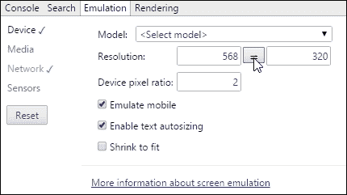

Opera 浏览器的浏览器几乎相同。响应式模拟器可以通过相同的方式启用，尽管一些选项的位置略有不同。

## 使用 Firefox

不甘示弱，Firefox 也拥有响应式设计模式；它比 Chrome 简单，但仍然具有实用功能。Firefox 的**响应式设计视图**可以通过按*Ctrl* + *Shift* + *M*键启用：

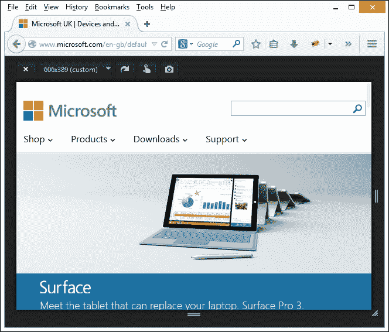

### 小贴士

尝试点击**606 x 389（自定义）**下拉菜单项并选择新值。Firefox 将自动调整视口大小到新尺寸；如果新屏幕尺寸更大，您需要调整浏览器窗口大小。

## 使用因特网浏览器

因特网浏览器在响应式设计方面采取了不同的方法。要获得最佳仿真选项，需要使用浏览器的最新版本，在撰写本文时是第 11 版。响应式仿真设置位于**开发者**工具栏中（按*F12*键启用此功能），然后切换到**仿真**选项卡以更改设置：

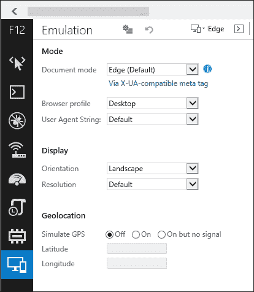

使用桌面浏览器进行测试的关键在于两个方面——它们将给出一个合理的近似值，说明您的网站在移动视图中的样子，并且应该仅作为测试的起点。真正的测试将在我们开始使用在线测试服务时到来。这些服务提供了同时测试多个设备的机会，尽管没有替代品！我们将在本章的*使用在线工具测试响应式网站*部分介绍这些服务的使用。

### 注意

**可以考虑的一些替代方案**

虽然大多数测试最好在线完成，但您可能还想考虑以下几种选项：Google Chrome 有一个更全面的浏览器插件，可以仿真许多在线测试服务。它可在[`www.dimensionstoolkit.com/`](http://www.dimensionstoolkit.com/)找到。Adobe 发布了 Adobe Edge Inspect，它试图将您的本地开发网站与移动仿真器连接起来。它可通过 Apple iTunes 获取——更多详细信息可在[`html.adobe.com/edge/inspect/`](http://html.adobe.com/edge/inspect/)找到。

到目前为止，我们已经看到，唯一有效测试您网站的方法是手动进行，尽可能在广泛的浏览器和不同平台上进行。这并非没有陷阱。让我们花点时间考虑一些可能会让我们绊倒的陷阱，如果我们不小心测试我们的工作的话。

# 考虑响应式测试的陷阱

谁说测试总是容易的？这在大多数项目中都是如此，但在测试响应式网站时尤其如此。我们在整本书中一直专注于与响应式媒体一起工作，但我们可能会遇到的许多陷阱同样适用于网站层面，而不仅仅是图像或视频。以下列表为我们提供了一些这样的陷阱：

+   应该测试哪些设备？在某种程度上，这将取决于研究您的目标市场。但它应该是一个广泛的范围，包括 Android 和 iOS 设备以及流行的移动浏览器，如 Chrome、Opera Mini 和 Dolphin。

    我们显然不能测试每一款设备，因此使用 Google Analytics 对于确定应该使用的好设备范围至关重要。一个很好的例子是 Marriot 酒店，他们发现他们的移动网站揭示了主页显示的多个问题。修复这些问题在他们的响应式网站设计和构建中起到了关键作用。

    ### 注意

    您可以在[`www.mobilemarketer.com/cms/news/software-technology/18494.html`](http://www.mobilemarketer.com/cms/news/software-technology/18494.html)阅读关于 Marriot 进行的测试的完整文章。

+   您的客户想在移动设备上做什么？创建一个适用于所有设备和平台的无缝网站是正确的事情，还是应该根据移动用户请求的任务来划分功能？在移动平台上对提供的功能进行选择性展示，可以作为一个衡量真正响应式网站对用户有用性的指标。

+   速度测试至关重要。这将决定您的网站在良好的或差的 Wi-Fi 连接、4G、3G 和 EDGE 上的表现如何；所有这些都应该进行测试（尤其是 EDGE，如果您能找到的话！）。

+   您是否有同事、朋友或愿意参与的参与者可以帮助测试您的网站？他们是否有符合您测试计划的正确设备，以确保您已经覆盖了足够的设备？

    ### 注意

    事实是，任何花费时间开发响应式内容的人都需要建立一个设备池。如果您独自工作，这可能需要一些时间；Brad Frost 提供了一些有用的建议，说明如何在不过度昂贵的情况下在真实设备上进行测试。您可以在[`bradfrostweb.com/blog/mobile/test-on-real-mobile-devices-without-breaking-the-bank/`](http://bradfrostweb.com/blog/mobile/test-on-real-mobile-devices-without-breaking-the-bank/)阅读他的评论。

+   在线有很多模拟器可以测试响应式网站，但它们的效果如何？这些将给您一个关于网站应该如何工作的感觉，但没有替代品可以替代在真实设备上的测试！

+   屏幕分辨率将扮演重要角色。在 1600 x 900 像素的桌面电脑上调整网站大小，在 Galaxy S4 的五英寸屏幕上看起来会不同，而与 4.7 英寸视网膜显示的苹果 iPhone 6 的 1334 x 750 像素屏幕相比，也会有所不同。不仅内容会显得更小，而且在视网膜设备上显示的图片也会不同。

+   您的网站上使用媒体查询意味着内容可能不在页面的同一位置，甚至可能不会显示。这导致测试时竞争不公平，使得自动化变得不可能，并导致手动努力和资源的成本增加。

+   设备之间的设计策略和方法会有所不同，这使得在一系列设备上保持一致的测试变得困难。例如，桌面上的悬停交互不会转移到移动设备上；一个设备上的链接在另一个设备上可能表现不同。这需要经验丰富的测试者的技能，以允许这些差异，并避免错误地应用测试，这会导致测试覆盖不足。

测试时的关键点是，没有任何东西是一成不变的。对一种设备或平台的测试并不总是可能与其他设备相同！这正是经验丰富的测试者的技能发挥作用的地方。最终，在广泛的不同设备上进行的测试水平将决定任何响应式网站的成功或失败。

# 使用在线工具测试响应式网站

我们已经看到，在大多数桌面浏览器中可以进行我们网站的初步测试，但这种方法有一个缺点。这些工具将设置为显示一组有限的屏幕尺寸，这将需要更新浏览器应用程序以反映任何更改。

为了加强我们的测试，我们可以使用众多在线模拟器之一。这有一个优点，即动态调整大小（通过改变浏览器窗口的大小），以及从众多预设尺寸中选择。虽然我们可能无法完美地模拟设备，但我们至少可以确保内容将在期望的尺寸下正确渲染。

以微软的网站为例——使用 ScreenFly 模拟器（可在[`www.quirktools.com/screenfly`](http://www.quirktools.com/screenfly)获取）查看时——设置为显示为摩托罗拉 RAZR V8，它在这个设备上 240 x 320 像素的显示区域内显示得非常完美：

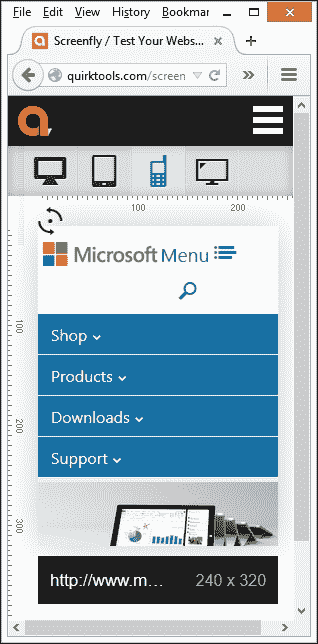

该网站显然是响应式的——桌面版本的图片已经被调整大小和重新定位，菜单系统也被重新设计以适应移动显示。值得看看一些被设置的样式。还记得我们如何使用百分比的基本原则，而不是固定的`em`或`rem`（甚至`像素`）值吗？这里应用了同样的原则，即菜单下方的主要图片大小调整为其大小的`166.5%`。

我们可以通过在 DOM 检查器（如 Firebug）中快速查看来证明这一点：

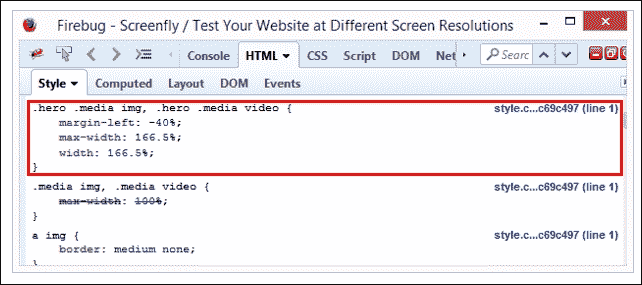

注意截图中所突出的样式吗？这正是我们在第一章中讨论的“使用响应式图片”的一个完美例子。仅仅将我们的图片大小改为百分比，就能在很大程度上使网站变得响应式。尝试调整浏览器窗口大小，并注意在 DOM 检查器中值的变化。

相比之下，Packt Publishing 网站([www.packtpub.com](http://www.packtpub.com))在相同的 ScreenFly 模拟器中显示：

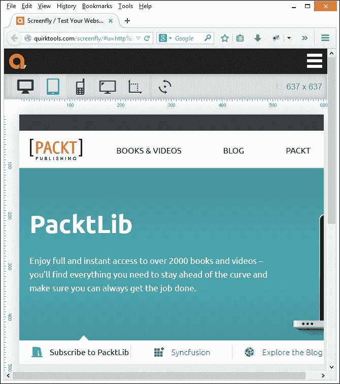

在这个例子中，ScreenFly 被设置为模拟 800 x 600 像素的 Kindle Fire。该网站显然需要一些改进。图片没有响应式设计，导致页面顶部的巨幕无法完全显示。

有许多响应式模拟器可供使用。它们遵循非常相似的原则，尽管在设备尺寸方面可能比标准桌面浏览器更新，以下是一些可以尝试的替代方案：

+   Mat Kersley 的简单响应式测试器，可以在[`mattkersley.com/responsive/`](http://mattkersley.com/responsive/)找到

+   Responsinator，可以在[`www.responsinator.com/`](http://www.responsinator.com/)找到

+   Media Genesis 的 Responsive Design Checker，可以在[`responsivedesignchecker.com/`](http://responsivedesignchecker.com/)找到

+   OpenDeviceLab.com，可以在[`opendevicelab.com/`](http://opendevicelab.com/)找到

+   Malte Wasserman 的 Viewport Resizer，可以在[`lab.maltewassermann.com/viewport-resizer/`](http://lab.maltewassermann.com/viewport-resizer/)找到

+   BrowserShots，可以在[`browsershots.org/`](http://browsershots.org/)找到

+   BrowserStack，可以在[`www.browserstack.com/`](http://www.browserstack.com/)找到

一个好的网站是 Am I Responsive，可以在[`ami.responsivedesign.is`](http://ami.responsivedesign.is)找到——它同时显示了多个常见设备上的网站：


虽然内容看起来非常小，但我们至少可以与网站互动，以了解其工作方式，并开始看到可能需要改进的领域。最终，无论你的网站大小如何，如果它以蜗牛般的速度运行，那么它将使访客感到厌烦。幸运的是，我们可以轻松地查看我们运营的任何网站是否可能成为问题，作为调整元素以改进访问的前兆。

# 使用工具确定速度

有很多方法可以确定我们的网站运行缓慢——其中最知名的方法之一可能是雅虎的 YSlow，可以在[`developer.yahoo.com/yslow/`](https://developer.yahoo.com/yslow/)找到。在下面的截图中，它是在 Firebug 中使用的：

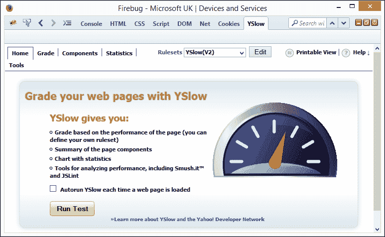

YSlow 非常适合确定我们页面中哪些元素运行缓慢。它使用 Yahoo 卓越性能团队的研究成果，基于一系列规则来评估网站的性能是否符合其标准。

让我们看看如何使用它来检查一些知名网站是否可以改进。作为一个例子，我们将从将 YSlow 作为 Firefox 插件安装开始。

### 注意

此示例假设我们正在使用已安装 Firebug 的 Firefox；如果尚未安装，则可以从[`www.getfirebug.com`](http://www.getfirebug.com)下载并安装它。

安装 YSlow 有多种方式。包括使用书签工具、浏览器插件或直接从命令行工作。最方便的是浏览器插件，因此我们可以直接评估网站：

1.  让我们从浏览到[`developer.yahoo.com/yslow/`](https://developer.yahoo.com/yslow/)并点击**可用性**下的**Firefox**来安装 Firefox 插件开始。

1.  到目前为止，请按照说明操作——插件使用 Firefox 插件的正常过程进行安装。

到目前为止，我们已经准备好开始使用 YSlow：

1.  浏览到[`www.microsoft.com`](http://www.microsoft.com)并调整窗口大小以更小的尺寸；目的是模拟在较小设备上工作的外观。

1.  点击 Firebug 图标或转到**查看** | **Firebug**，然后切换到**YSlow**选项卡。

1.  点击**运行测试**按钮以启动主要测试。这会运行一系列测试，然后生成其发现结果列表：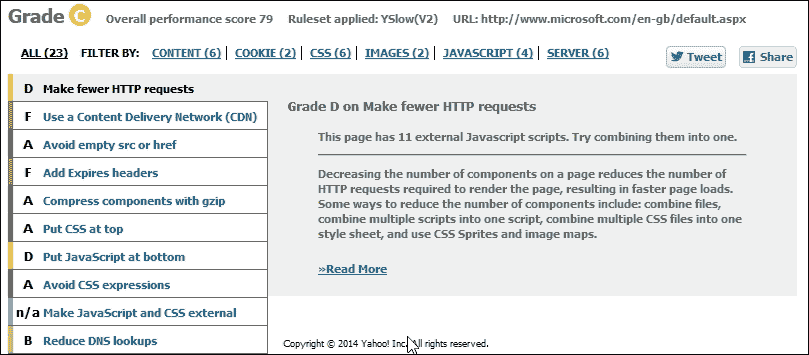

1.  我们对与图片相关的测试感兴趣，因此点击**图片（2**）以过滤结果。

现在我们已经看到了扫描的结果，让我们分析一些结果。

## 分析结果

以以下条目为例：

[`c.s-microsoft.com/en-gb/CMSImages/SpringPromo_LastFrameBG_1600x540_EN_US.jpg?version=250bf4d8-ad95-96e7-3b61-394b95449a92`](http://c.s-microsoft.com/en-gb/CMSImages/SpringPromo_LastFrameBG_1600x540_EN_US.jpg?version=250bf4d8-ad95-96e7-3b61-394b95449a92)

这恰好是列表中的第一条；它是直接显示在菜单栏下面的主要条目：

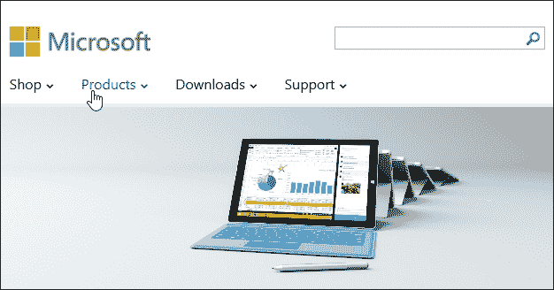

这是一个如何未能通过 YSlow 测试的完美例子。原始图片已经被缩放，当在屏幕上渲染到 1366 x 461 px 时，这给服务器带来了额外的需求：

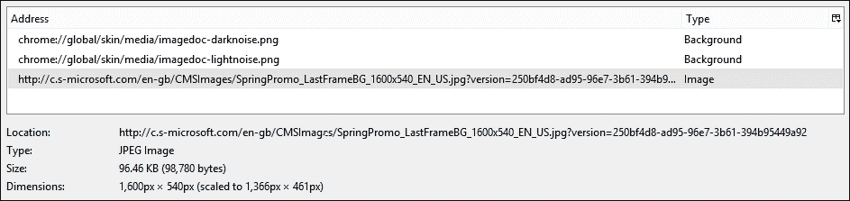

这看起来完全合理。缩小图片会对服务器产生额外的需求。

## 深入代码分析

等一下！这里有些东西不对劲。如果我们通过使用 Firebug 检查 CSS 样式来进一步挖掘，我们可以在以下屏幕截图中看到应用到的样式。在这个例子中，它是`.hero .image .media`和`.hero .img video`：


现在，有人注意到什么了吗？你们中那些目光敏锐的人应该已经注意到，这张图片在*使用在线工具测试响应式网站*部分中已经出现过了。在那里，我们注意到该网站看起来是响应式的——使用了动态百分比值，而不是固定值；这是我们希望在响应式网站上看到的。那么，问题是什么？为什么，即使使用了百分比值，YSlow 仍然报告了问题？

## 显示所有

好吧，为了找出原因，我们需要进一步挖掘在[`www.microsoft.com`](http://www.microsoft.com)上使用的 CSS 文件。在 Firebug 的截图中，你注意到`max-width`的`166.5%`值吗？还有，这正在覆盖下面的`100%`的`max-width`值？这就是我们的第一个线索——在第一章，“使用响应式图像”中，我提到创建响应式图像的基本和最简单的方法是设置`max-width`值为`100%`。

它并非没有自己的怪癖，但将满足大多数需求——至少作为一个实现响应式行为的起点。那么，为什么我们有一个超过 50%的值呢？

这个问题的真正答案在于 CSS 文件。使用文本编辑器，如 Sublime Text，搜索它似乎显示已经使用了媒体查询。这是我们预期会看到的。但是，设计失败的地方在于图像在页面上的显示设置。

我们选择的图像只设置了一次。没有任何媒体查询被设置为在视口或浏览器窗口大小减小时用较小的图像替换图像——这就是问题所在！

## 修复问题

虽然我们显然无法更改代码，但我们至少可以找出解决问题的步骤：

1.  在 Firefox 中，右键单击图像并点击**查看图像信息**以查看属性。

    ### 注意

    在这个练习中，我将假设你正在使用 Windows 上的 GIMP。如果你使用的是不同的包，请相应调整步骤。

    这张截图显示了在 Firefox 中将页面调整到可能的最小宽度：

    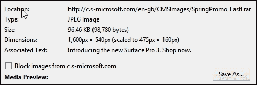

1.  点击**另存为…**以在本地保存副本——名称不是关键；在图像编辑应用程序中打开它，例如 PhotoShop 或 GIMP。

1.  打开时，它将显示全尺寸，为**1600px x 540px**；导航到**图像** | **缩放图像...**并将新尺寸设置为**475px x 160px**。点击**缩放**以调整图像大小。

1.  接下来，转到**文件** | **覆盖…**以更新图像。在**导出图像为 JPEG**中，如果尚未设置为该值，请将质量比例推到**100%**。

1.  点击**导出**以完成过程——图像现在将被保存到新尺寸。

到目前为止，我们有一个更新的图像，通常会被上传到网站上。快速检查显示，它已从 96 KB 的庞大文件减小到 38 KB 的更合理大小。这使得它在我们的样式表中下载得更快。

当然，要真正完成它，我们还需要在我们的样式表中包含一个媒体查询，以便在视口适当调整大小时使用较小的图像，如下面的代码行所示：

```js
@media screen and (max-width: 475px) {
....
  .hero.media img {
    background: url(<path and name of new file>) no repeat;
  ...
  }
}
```

这不仅意味着我们在减少需要下载的内容量，而且还在减少对服务器的需求，并有助于使网站的响应时间更加迅速——对所有相关方来说都是双赢！要实现这一点需要一点研究和规划。但一旦实施，它将显著减少制作我们媒体内容响应式所需的总体工作量。

# 摘要

网站测试是创建在线网站的关键步骤之一。这是我们确保图片和视频正确缩放以及内容在我们响应式网站上正确显示的机会。在本章中，我们探讨了我们应该如何测试响应式内容。让我们花点时间回顾一下我们学到了什么。

我们从查看最简单的测试形式开始，使用常规的桌面浏览器。我们了解到这将处理基本问题，但我们还可以使用能够同时模拟多个浏览器的在线服务来补充。

接下来，我们审视了一些响应式网站测试的陷阱；我们了解到最有效的方法是手动进行测试。存在太多不一致性，使得任何形式的自动化都变得困难。

快速推进，我们随后将注意力转向使用在线工具测试响应式内容——我们看到它们的工作方式与桌面浏览器的响应式功能类似，但可以提供更广泛的服务。然后，我们通过查看响应式网站的测试来结束本章。我们看到如何使用 YSlow 快速识别响应缓慢的元素；然后，我们通过一个理论示例来了解如果我们是网站所有者，会发生什么以及我们如何修复它。

呼！虽然这只是个简短的章节，但我们涵盖了很多内容！在下一章中，我们将探讨如何将本书中介绍的一些原则应用到像 WordPress 这样的 CMS 系统中。
