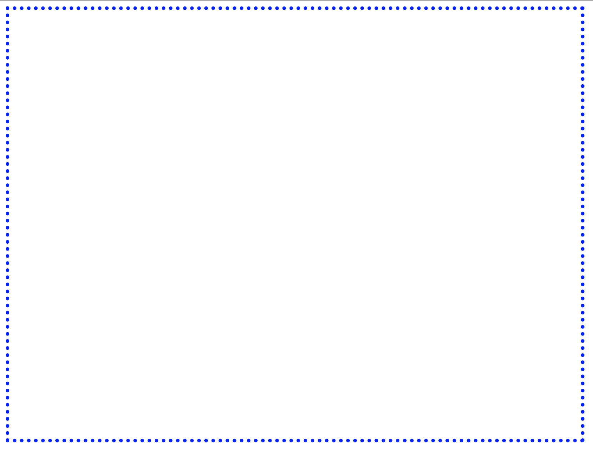

# 入门指南

曾经有一段时间，大部分的网页都是由静态内容组成的——唯一的图形就是嵌入的图片。然而，随着时间的推移，应用需求变得更加雄心勃勃，并开始遇到限制。随着高度交互式应用逐渐成为用户体验的重要组成部分，最终对完全可编程的图形**应用程序编程接口**（**API**）的需求变得足够大，以解决这些需求。2006 年，一位美国塞尔维亚软件工程师 Vladimir Vukicevic 开始为当时即将推出的 HTML `<canvas>` 元素开发一个 OpenGL 原型，他称之为 Canvas 3D。2011 年 3 月，他的工作将导致 OpenGL 背后的非营利组织 Kronos Group 创建**WebGL**，这是一个规范，允许互联网浏览器访问**图形处理单元**（**GPU**）。

所有浏览器引擎合作创建了 WebGL，这是在网络上渲染 3D 图形的标准。它基于 OpenGL **嵌入式系统**（**ES**），这是一个针对嵌入式系统的跨平台图形 API。这是一个正确的起点，因为它使得在所有浏览器中轻松实现相同的 API 成为可能，特别是由于大多数浏览器引擎都在支持 OpenGL 的系统上运行。

WebGL 最初基于 OpenGL ES 2.0，这是 OpenGL 规范的一个版本，用于像苹果的 iPhone 和 iPad 这样的设备。但随着规范的演变，它变得独立，目标是提供跨各种操作系统和设备的可移植性。基于网络的实时渲染的想法为基于网络的 3D 环境开辟了一个全新的可能性世界。由于网络浏览器的普遍性，这些以及其他类型的 3D 应用现在可以在桌面和移动设备上，如智能手机和平板电脑上渲染。根据 Khronos Group 的说法，Web 开发者能够直接从 JavaScript 中访问 OpenGL 类图形，并且可以自由地将 3D 与其他 HTML 内容混合，这将促进 Web 游戏、教育和培训应用的新一波创新。

尽管 WebGL 在成熟并稳定发布后得到了广泛采用——集成在 Firefox、Chrome、Opera、IE11 和 Android 的移动网络浏览器中——但苹果仍然缺乏官方的 WebGL 支持。无论是 OS X Safari 还是 Safari Mobile 都不支持 WebGL。实际上，直到 2014 年 6 月的**全球开发者大会**（**WWDC**），苹果才宣布 OS X Yosemite 和 iOS 8 将内置 WebGL 支持。这成为了网络 3D 图形的一个转折点。随着所有主要浏览器的官方支持，整个 3D 图形范围——以原生速度——可以被发送到数十亿台桌面和移动设备。WebGL 释放了图形处理器的力量，为开放平台上的开发者提供了能力，使得可以在网络上构建具有控制台品质的应用程序。

在本章中，我们将进行以下操作：

+   理解运行 WebGL 所需的系统要求。

+   涵盖 WebGL 应用程序的高级组件。

+   设置绘图区域（`canvas`）。

+   测试您的浏览器 WebGL 功能。

+   理解 WebGL 作为状态机的角色。

+   修改影响您场景的 WebGL 变量。

+   加载并检查一个完全功能的场景。

# 系统要求

WebGL 是一个基于网络的 3D 图形 API。因此，无需安装。虽然 WebGL 1 基于 OpenGL ES 2.0 规范，但 WebGL 2 基于 OpenGL ES 3.0，这保证了许多 WebGL 1 扩展和新特性的可用性。

WebGL 2 与 WebGL 1 的比较

由于本书涵盖 WebGL 2，所有 WebGL 和 WebGL 2 术语均指 WebGL 2（OpenGL ES 3.0）规范。任何对 WebGL 1（OpenGL ES 2.0）的引用都将明确指出。

截至 2016 年 1 月 27 日，Firefox 和 Chrome 默认提供 WebGL 2。如果您使用以下任一网络浏览器，您将自动获得对 WebGL 2 的访问权限：

+   Firefox 51 或更高版本

+   Google Chrome 56 或更高版本

+   Chrome for Android 64 或更高版本

有关支持 WebGL 的网络浏览器的最新列表，请访问 Khronos Group 网页：[`www.khronos.org/webgl/wiki/Getting_a_WebGL_Implementation`](http://www.khronos.org/webgl/wiki/Getting_a_WebGL_Implementation)。

或者访问知名的 **CanIUse.com** 资源：[`caniuse.com/#search=WebGL 2`](https://caniuse.com/#search=webgl2)。

现代标准

由于我们将使用现代浏览器来运行 WebGL 2，因此本书将全面使用 HTML5、CSS3 和 JavaScript ES6。有关这些现代标准的更多信息，请参阅以下链接：[`developer.mozilla.org/en-US/docs/Web`](https://developer.mozilla.org/en-US/docs/Web)。

在本书出版时，WebGL 2 仍然是一个处于变动中的规范。规范的一些部分被认为是稳定的，并在现代浏览器中实现了；其他部分应被视为实验性的，并且已经以不同程度的程度部分实现。因此，您应该熟悉标准化过程以及每个新属性的实施级别。话虽如此，WebGL 2 几乎与 WebGL 1 完全向后兼容。所有向后不兼容的例外情况记录在以下链接中：[`www.khronos.org/registry/webgl/specs/latest/2.0/#BACKWARDS_INCOMPATIBILITY`](https://www.khronos.org/registry/webgl/specs/latest/2.0/#BACKWARDS_INCOMPATIBILITY)。

迁移到 WebGL 2

如果您有 WebGL 1 的经验或对迁移策略到 WebGL 2 感兴趣，您可以参考第十一章，*WebGL 2 突出特点*，其中突出了 WebGL 1 和 WebGL 2 之间的关键差异。

最后，你需要确保你的计算机有一张经过批准的显卡。为了快速验证你的 WebGL 2 当前配置，请访问以下链接：[`get.webgl.org/WebGL 2/`](https://get.webgl.org/webgl2/)。

# WebGL 渲染

WebGL 是一个 3D 图形库，它使现代网络浏览器能够以标准且高效的方式渲染 3D 场景。根据维基百科，**渲染**是通过计算机程序从模型生成图像的过程。由于这是一个由计算机执行的过程，因此有不同方式来生成这样的图像。在讨论渲染时，有三个主要区分：基于软件和硬件的渲染、基于服务器和客户端的渲染，以及保留模式与即时模式的渲染。正如我们将看到的，WebGL 在 Web 上提供了一个独特的硬件和客户端基于即时模式 API 的渲染方法。

# 基于软件和硬件的渲染

我们应该做的第一个区分是是否使用了任何特殊的图形硬件。一方面，我们可以谈论**基于软件的渲染**，在这种情况下，渲染 3D 场景所需的所有计算都是使用计算机的**中央处理器**（**CPU**）完成的。另一方面，正如 WebGL 的情况一样，我们使用**基于硬件的渲染**这个术语，用于有 GPU 执行 3D 图形计算的场景。从技术角度来看，基于硬件的渲染比基于软件的渲染更有效率，因为前者涉及专门的硬件处理必要的操作。相比之下，由于缺乏硬件依赖，基于软件的渲染解决方案可能更常见。

# 基于服务器和客户端的渲染

需要做的第二个区分是渲染过程是在本地还是远程进行。当需要渲染的图像过于复杂时，渲染最有可能在远程进行。例如，对于 3D 动画电影，需要使用配备大量硬件资源的专用服务器来渲染复杂的场景，我们称之为**基于服务器的渲染**。与此相反的方法发生在本地渲染时。我们称之为**基于客户端的渲染**。WebGL 提供了一种基于客户端的渲染方法：3D 场景中的元素通常从服务器下载。然而，获取图像所需的处理都是在客户端的图形硬件上本地完成的。尽管这不是一个独特的解决方案，但与其他技术（如 Java 3D、Flash 和 Unity Web Player 插件）相比，WebGL 具有几个优点：

+   **JavaScript 编程**：JavaScript 是一种对网页开发者和浏览器都自然易用的语言。使用 JavaScript 可以让你访问 DOM 的所有部分，并轻松地将 WebGL 应用程序与其他 JavaScript 库（如 jQuery、React 和 Angular）集成。

+   **自动内存管理**：WebGL 与其他技术（如 OpenGL，其中内存分配和释放是手动处理的）不同，遵循 JavaScript 变量作用域和自动内存管理的规则。这极大地简化了编程，同时减少了代码体积。最终，这种简化使得理解应用程序逻辑变得更加容易。

+   **普及性**：具有 JavaScript 功能的网页浏览器默认安装在智能手机和平板设备上。这意味着您可以在广泛的桌面和移动设备生态系统中利用 WebGL。

+   **性能**：WebGL 应用程序的性能与等效的独立应用程序（有一些例外）相当。这是由于 WebGL 能够访问本地图形硬件的能力。直到最近，许多 3D 网页渲染技术都使用基于软件的渲染。

+   **零编译**：WebGL 使用 JavaScript 编写；因此，在网页浏览器上执行之前不需要编译代码。这使得您能够实时进行更改并看到这些更改如何影响您的 3D 网页应用程序。然而，当我们介绍着色器程序时，我们将了解到需要一些编译。但是，这发生在您的图形硬件上，而不是在您的浏览器上。

# 保留模式和即时模式渲染

需要做的第三个区分是 WebGL 是一个为网页设计的即时模式 3D 渲染 API。图形 API 可以分为保留模式 API 和即时模式 API。

# 保留模式渲染

**保留模式** API 是声明式的。应用程序通过原始元素，如形状和线条，构建场景，然后图形库在内存中维护场景模型。要更改渲染内容，应用程序会发出更新场景的命令，例如添加或删除形状；库随后负责管理和重新绘制场景：


# 即时模式渲染

**即时模式** API 是过程式的。即时模式渲染要求应用程序直接管理渲染。在这种情况下，图形库不维护场景模型。每次绘制新帧时，应用程序都会发出所有必要的绘图命令来描述整个场景，而不管实际的变化。这种方法为应用程序程序提供了最大程度的控制和灵活性：


# 保留模式与即时模式渲染

保留模式渲染可能更容易使用，因为 API 会为你做更多的工作，例如初始化、状态维护和清理。然而，它通常不太灵活，因为 API 强制使用自己的特定场景模型；它也可能有更高的内存需求，因为它需要提供一个通用的场景模型。另一方面，WebGL 提供的即时模式渲染则更加灵活，可以实现有针对性的优化。

# WebGL 应用程序中的元素

WebGL，像其他 3D 图形库一样，包含许多常见的 3D 元素。这些基本元素将按章节顺序在本书中进行介绍。

一些这些常见元素包括以下内容：

+   `canvas`：它是我们的场景渲染的占位符。它是一个标准的 HTML5 元素，因此可以使用 **文档对象模型** (**DOM**) 访问。

+   **对象**：这些是构成场景的 3D 实体。这些实体由三角形组成。在接下来的章节中，我们将看到 WebGL 如何使用 **缓冲区** 处理和渲染几何形状。

+   **灯光**：在 3D 世界中没有灯光，任何东西都无法被看到。在后面的章节中，我们将了解到 WebGL 使用 **着色器** 来在场景中建模灯光。我们将看到 3D 对象如何根据物理定律反射或吸收光线。我们还将讨论不同的光照模型来可视化我们的对象。

+   **相机**：`canvas` 作为 3D 世界的视口。我们通过它看到并探索 3D 场景。在接下来的章节中，我们将了解产生视图透视所需的不同矩阵运算。我们将了解这些运算如何被建模为相机。

本章将介绍我们列表中的第一个元素：`canvas`。接下来的部分将帮助我们了解如何创建 `canvas` 元素以及如何设置 WebGL 上下文。

# 行动时间：创建 HTML5 Canvas 元素

`canvas` 是网页中的一个矩形元素，你的 3D 场景将在其中渲染。让我们创建一个网页并添加一个 HTML5 `canvas` 元素：

1.  使用你喜欢的编辑器，创建一个包含以下代码的网页：

```js
<html>
<head>
  <title>Real-Time 3D Graphics with WebGL2</title>
  <link rel="shortcut icon" type="image/png" 
   href="/common/images/favicon.png" />

  <style type="text/css">
    canvas {
      border: 5px dotted blue;
    }
  </style>
</head>
<body>

  <canvas id="webgl-canvas" width="800" height="600">
    Your browser does not support the HTML5 canvas element.
  </canvas>

</body>
</html>
```

1.  将文件保存为 `ch01_01_canvas.html`。

1.  使用支持的浏览器打开它。

1.  你应该看到以下截图类似的内容：



***刚才发生了什么？***

我们创建了一个包含 `canvas` 元素的基本网页。这个 `canvas` 将包含我们的 3D 应用程序。让我们快速浏览一下这个例子中展示的相关元素。

# 定义 CSS 样式

这是确定 `canvas` 样式的代码片段：

```js
<style type="text/css">
  canvas {
    border: 5px dotted blue;
  }
</style>
```

这段代码不是构建 WebGL 应用程序的基本部分。鉴于 `canvas` 元素最初是空的，一个蓝色的虚线边框是验证 `canvas` 位置的一种简单方法。

# 理解 Canvas 属性

在我们之前的例子中，有三个属性：

+   `id`：这是 DOM 中的 `canvas` 标识符。

+   `width`和`height`：这两个属性决定了我们的`canvas`元素的大小。当这两个属性缺失时，Firefox、Chrome 和 WebKit 将默认使用`300px`宽度和`150px`高度。

# 如果不支持 Canvas 怎么办？

如果你屏幕上出现以下消息，`Your browser does not support the HTML5 canvas element`（这是`<canvas>`标签之间的消息），你需要确保你使用的是之前描述的支持的 Web 浏览器之一。

如果你使用 Firefox 并且仍然看到这个消息，你可能需要检查 WebGL 是否已启用（默认情况下是启用的）。要做到这一点，请转到 Firefox 并在地址栏中输入`about:config`。然后，查找`webgl.disabled`属性。如果它设置为`true`，将其更改为`false`。当你重新启动 Firefox 并加载`ch01_01_canvas.html`时，你应该能够看到`canvas`元素的虚线边框。

在极少数情况下，如果你仍然看不到`canvas`，可能是因为你的浏览器已经将你的 GPU 列入了黑名单。如果是这种情况，请使用具有适当硬件的系统。

# 行动时间：访问 WebGL 上下文

WebGL 上下文是一个句柄（更严格地说是一个 JavaScript 对象），通过它可以访问 WebGL 函数和属性。这些可用的功能构成了 WebGL API。

我们将创建一个 JavaScript 函数，用于检查是否可以获取 WebGL 上下文。与其他需要下载到项目中的技术不同，WebGL 已经存在于你的浏览器中。换句话说，如果你使用的是支持的浏览器之一，你不需要安装或包含任何库。

让我们修改之前的示例，添加一个 JavaScript 函数来检查浏览器中的 WebGL 可用性。这个函数将在页面加载时被调用。为此，我们将使用标准的 DOM`onload`事件：

1.  在你喜欢的文本编辑器中打开`ch01_01_canvas.html`文件。

1.  在`<style>`标签的关闭标签下面添加以下代码：

```js
<script type="text/javascript">
  'use strict';

  function init() {
    const canvas = document.getElementById('webgl-canvas');

    // Ensure we have a canvas
    if (!canvas) {
      console.error('Sorry! No HTML5 Canvas was found on 
       this page');
      return;
    }

    const gl = canvas.getContext('webgl2');

    // Ensure we have a context
    const message = gl
      ? 'Hooray! You got a WebGL2 context'
      : 'Sorry! WebGL is not available';

    alert(message);
  }

  // Call init once the document has loaded
  window.onload = init;
</script>
```

1.  将文件保存为`ch01_02_context.html`。

1.  使用支持 WebGL 2 的浏览器打开`ch01_02_context.html`文件。

1.  如果你可以运行 WebGL 2，你将看到一个类似于以下对话框的界面：


严格模式

通过`'use strict';`声明的严格模式是一种特性，它允许你将程序或函数置于一个“严格”的操作环境中。这种严格环境阻止某些操作被执行，并抛出更多的异常。更多信息请访问以下链接：[`developer.mozilla.org/en-US/docs/Web/JavaScript/Reference/Strict_mode`](https://developer.mozilla.org/en-US/docs/Web/JavaScript/Reference/Strict_mode)。

***发生了什么事？***

通过分配一个 JavaScript 变量（`gl`），我们获得了对 WebGL 上下文的引用。让我们回到代码中，检查允许访问 WebGL 的代码：

```js
const gl = canvas.getContext('webgl2');
```

`canvas.getContext`方法让我们访问 WebGL。当使用`2D`作为上下文名称时，`getContext`也提供了对 HTML5 2D 图形库的访问。HTML5 2D 图形 API 完全独立于 WebGL，并且超出了本书的范围。

# 状态机

一个 WebGL 上下文可以被理解为一个状态机：一旦你修改了属性，这些修改将保持直到后续的修改。在任何时候，你都可以查询这些属性的当前状态以确定你的 WebGL 上下文的当前状态。让我们用一个例子来分析这种行为。

# 实践时间：设置 WebGL 上下文属性

在这个例子中，我们将学习如何修改我们用于清除`canvas`元素的色彩：

1.  使用你喜欢的文本编辑器打开`ch01_03_attributes.html`文件：

```js
<html>
<head>
  <title>Real-Time 3D Graphics with WebGL2</title>
  <link rel="shortcut icon" type="image/png" 
   href="/common/images/favicon.png" />

  <style>
    canvas {
      border: 5px dotted blue;
    }
  </style>

  <script type="text/javascript">
    'use strict';

    let gl;

    function updateClearColor(...color) {
      // The ES6 spread operator (...) allows for us to
      // use elements of an array as arguments to a function
      gl.clearColor(...color);
      gl.clear(gl.COLOR_BUFFER_BIT);
      gl.viewport(0, 0, 0, 0);
    }

    function checkKey(event) {
      switch (event.keyCode) {
        // number 1 => green
        case 49: {
          updateClearColor(0.2, 0.8, 0.2, 1.0);
          break;
        }
        // number 2 => blue
        case 50: {
          updateClearColor(0.2, 0.2, 0.8, 1.0);
          break;
        }
        // number 3 => random color
        case 51: {
          updateClearColor(Math.random(), Math.random(), 
           Math.random(), 1.0);
          break;
        }
        // number 4 => get color
        case 52: {
          const color = gl.getParameter(gl.COLOR_CLEAR_VALUE);
          // Don't let the following line confuse you.
          // It basically rounds up the numbers to one
          // decimal cipher for visualization purposes.

          // TIP: Given that WebGL's color space ranges
          // from 0 to 1 you can multiply these values by 255
          // to display in their RGB values.
          alert(`clearColor = (
            ${color[0].toFixed(1)},
            ${color[1].toFixed(1)},
            ${color[2].toFixed(1)}
          )`);
          window.focus();
          break;
        }
      }
    }

    function init() {
      const canvas = document.getElementById('webgl-canvas');

      if (!canvas) {
        console.error('Sorry! No HTML5 Canvas was found on this page');
        return;
      }

      gl = canvas.getContext('webgl2');

      const message = gl
        ? 'Hooray! You got a WebGL2 context'
        : 'Sorry! WebGL is not available';

      alert(message);

      // Call checkKey whenever a key is pressed
      window.onkeydown = checkKey;
    }

    window.onload = init;
  </script>
</head>
<body>

  <canvas id="webgl-canvas" width="800" height="600">
    Your browser does not support the HTML5 canvas element.
  </canvas>

</body>
</html>
```

1.  你会看到这个文件与我们的前一个例子类似。然而，这里有一些新的代码结构，我们将简要解释。这个文件包含三个 JavaScript 函数：

| **函数** | **描述** |
| --- | --- |
| `updateClearColor` | 更新`clearColor`并设置`canvas`元素的清除颜色，这是 WebGL 上下文的一个属性。如前所述，WebGL 作为一个状态机工作。因此，它将保持这个颜色，直到使用`gl.clearColor` WebGL 函数（参见`checkKey`源代码）来改变它。 |
| `checkKey` | 这是一个附加到窗口`onkeydown`事件的辅助函数。它捕获键盘输入并根据输入的键执行代码。 |
| `init` | 这个函数在文档的`onload`事件中被调用。它获取一个 WebGL 上下文并将其设置为全局的`gl`变量。 |

1.  在你的浏览器中打开`ch01_03_attributes.html`文件。

1.  按*1*。你会看到`canvas`的颜色变成了绿色。如果你想查询使用的确切颜色，请按*4*。

1.  `canvas`元素将保持绿色，直到我们通过调用`gl.clearColor`来改变它。让我们通过按 2 来改变它。如果你查看源代码，这将把`canvas`清除颜色改为蓝色。如果你想了解确切的颜色，请按 4。

1.  你可以按*3*来将清除颜色设置为随机颜色。和之前一样，你可以通过按*4*来获取颜色：*


***刚才发生了什么？***

在这个例子中，我们看到了我们可以通过调用`clearColor`函数来改变 WebGL 用于清除`canvas`元素的色彩。相应地，我们使用`getParameter(gl.COLOR_CLEAR_VALUE)`来获取当前`canvas`清除色彩的值。

在整本书中，我们将遇到类似的构造，其中特定的函数会设置 WebGL 上下文的属性，而`getParameter`函数会在使用相应的参数（在我们的例子中是`COLOR_CLEAR_VALUE`）时检索这些属性的当前值。

# 使用上下文访问 WebGL API

重要的是要注意，所有 WebGL 函数都是通过 WebGL 上下文访问的。在我们的示例中，上下文是由`gl`变量持有的。因此，对 WebGL API 的任何调用都将使用这个变量执行。

# 加载 3D 场景

到目前为止，我们已经看到了如何设置`canvas`元素以及如何获取 WebGL 上下文；下一步是讨论对象、灯光和相机。但为什么要等待看到 WebGL 能做什么呢？在本节中，我们将快速浏览一下本书将要构建的最终 WebGL 应用程序的简化版本。

# 虚拟汽车展厅

通过这本书，我们将使用 WebGL 开发一个虚拟汽车展厅应用程序。在这个阶段，我们将一个简单的场景加载到`canvas`元素中。这个场景将包含一辆车、一些灯光和一个相机。

# 行动时间：可视化 3D 展厅

读完这本书后，您将能够创建像我们接下来将要玩的那样引人入胜的 3D 场景。这个场景展示了本书虚拟汽车展厅中的一辆汽车：

1.  在您的浏览器中打开`ch01_04_showroom.html`文件。

1.  您将看到一个包含汽车的 WebGL 场景，如下面的截图所示。在接下来的章节中，我们将介绍几何渲染，并了解如何加载和渲染各种 3D 模型：


1.  使用滑块来交互式地更新为这个场景定义的四个光源。每个光源有两个元素：漫反射元素和镜面元素。我们已经在第三章，*灯光*，中完全介绍了 3D 场景中的灯光。

1.  在`canvas`上点击并拖动以旋转汽车并从不同的角度可视化它。您可以通过按住*Alt*键并在`canvas`上拖动鼠标来缩放。您还可以使用*箭头*键围绕汽车旋转相机。在使用*箭头*键之前，请确保点击`canvas`以使其获得焦点。在第四章，*相机*中，我们将讨论如何在 WebGL 中创建和操作我们自己的自定义相机。

1.  使用颜色选择器小部件来改变汽车的颜色。本书稍后将对场景中颜色的使用进行详细讨论。

***发生了什么？***

我们已经使用 WebGL 在浏览器中加载了一个简单的场景。这个场景由以下内容组成：

+   通过一个`canvas`元素，我们看到了场景。

+   一系列多边形网格（**对象**），它们构成了汽车：车顶、窗户、车灯、保险杠、车门、车轮、尾翼、保险杠等。

+   **灯光**源，否则一切都将显得漆黑。

+   一个**相机**，它决定了我们在 3D 世界中的视点。这个相机是交互式的，视点可以根据用户输入而改变。例如，我们使用了各种键和鼠标来移动相机。

场景中还有许多其他元素，如纹理、颜色和特殊的光效（如镜面反射）。不要慌张！我们将在这本书的整个过程中解释每个元素。这里的关键是要识别出我们之前讨论的四个基本元素都存在于场景中。因此，您可以自由地检查源代码，以了解接下来会发生什么。

# 架构更新

随着我们进入各个章节，我们将遇到一些常见功能（例如，设计模式、实用函数、辅助函数和数据结构），我们可以在此基础上构建。这不仅将帮助我们编写**DRY**（Don't Repeat Yourself，不要重复自己）的代码，而且还将提供一个有用的架构，以支持本书结束时的高级 3D WebGL 应用程序。

**DRY**（Don't Repeat Yourself，不要重复自己）是一种软件开发原则，其主要目的是减少代码的重复。**WET**（Write Everything Twice，一切都要写两次）是一个俏皮的缩写，表示相反的意思——不遵循 DRY 原则的代码。

让我们介绍一些将在未来章节中使用的更改：

1.  在您的编辑器中打开 `common/js/utils.js` 以查看以下代码。

1.  我们将使用 `utils` 包含许多实用函数，以帮助我们构建我们的 3D 应用程序。`utils` 中的两个方法，`getCanvas` 和 `getGLContent`，与本章早期实现的方法类似：

```js
'use strict';

// A set of utility functions for /common operations across our 
// application
const utils = {

  // Find and return a DOM element given an ID
  getCanvas(id) {
    const canvas = document.getElementById(id);

    if (!canvas) {
      console.error(`There is no canvas with id ${id} on this 
       page.`);
      return null;
    }

    return canvas;
  },

  // Given a canvas element, return the WebGL2 context
  getGLContext(canvas) {
    return canvas.getContext('webgl2') || console.error('WebGL2 is 
     not available in your browser.');
  }

};
```

1.  `getCanvas` 返回具有提供的 `id` 作为参数的 `canvas` 元素。

1.  `getGLContext` 为给定的 `canvas` 元素返回一个 WebGL 2 上下文。

1.  在您的编辑器中打开 `ch01_05_attributes-final.html` 以查看以下更改。

1.  我们在文档的 `<head>` 中包含了 `<link rel="stylesheet" href="/common/lib/normalize.css">`，以重置浏览器之间的许多不一致性。这是一个外部库，帮助我们跨浏览器标准化 CSS 样式。

1.  我们已经包含了 `<script type="text/javascript" src="img/utils.js"></script>`。

1.  滚动到 `init` 函数，其中进行了必要的更改以使用 `utils.getCanvas` 和 `utils.getGLContext` 函数：

```js
function init() {
  const canvas = utils.getCanvas('webgl-canvas');
  gl = utils.getGLContext(canvas);
  window.onkeydown = checkKey;
}
```

1.  在浏览器中打开 `ch01_05_attributes-final.html` 以查看这些更改的实际效果。

**示例代码结构** 所有示例代码都按照常见功能位于目录根目录（`common/`）中，而每个章节的示例则分类在章节目录下（例如，`ch01/`、`ch02/` 和 `ch03/`）。也就是说，为了在浏览器中查看这些示例，您需要在目录根目录启动一个服务器，以加载每个示例所需的所有资源。请参阅本书的前言以获取更多详细信息。

# 概述

让我们总结一下本章所学的内容：

+   我们介绍了 WebGL 的历史以及它是如何实现的。

+   我们学习了常见元素——`canvas`、对象、灯光和相机——它们通常存在于 WebGL 应用程序中。

+   我们学习了如何将 HTML5 `canvas` 元素添加到我们的网页中，以及如何设置其 `id`、`width` 和 `height`。

+   我们实现了获取 WebGL 上下文的代码。

+   我们介绍了 WebGL 作为状态机的工作原理，并且因此我们可以使用 `getParameter` 函数查询其任何变量。

+   我们提前看到了这本书结束时我们将构建的交互式 3D 应用程序。

在下一章中，我们将学习如何定义、加载并将对象渲染到 WebGL 场景中。
