# 渲染

在上一章中，我们介绍了 WebGL 的历史及其演变。我们讨论了 3D 应用中的基本元素以及如何设置 WebGL 上下文。在本章中，我们将研究 WebGL 中几何实体的定义。

WebGL 按照“分而治之”的方法渲染对象。复杂的多边形被分解成三角形、线和点原语。然后，每个几何原语由 GPU 并行处理，以创建最终场景。

在本章中，你将：

+   理解 WebGL 如何定义和处理几何信息

+   讨论与几何操作相关的相关 API 方法

+   检查为什么以及如何使用**JavaScript 对象表示法**（**JSON**）来定义、存储和加载复杂几何形状

+   继续分析 WebGL 作为状态机，描述与几何操作相关的可设置和检索的属性

+   尝试创建和加载不同的几何模型

# WebGL 渲染管线

虽然 WebGL 通常被认为是一个全面的 3D API，但实际上它只是一个光栅化引擎。它根据你提供的代码绘制点、线和三角形。要让 WebGL 执行其他操作，你需要提供代码来使用点、线和三角形来完成你的任务。

WebGL 在你的计算机的 GPU 上运行。因此，你需要提供在该 GPU 上运行的代码。代码应以成对函数的形式提供。这两个函数被称为**顶点着色器**和**片段着色器**，它们各自用一种非常严格类型化的 C/C++语言编写，称为 GLSL（GL 着色语言）。它们一起被称为**程序**。

GLSL 是 OpenGL 着色语言的缩写。GLSL 是一种类似于 C/C++的高级编程语言，用于图形卡的多部分。使用 GLSL，你可以编写简短的程序，称为着色器，这些程序在 GPU 上执行。更多信息，请参阅 [`en.wikipedia.org/wiki/OpenGL_Shading_Language`](https://en.wikipedia.org/wiki/OpenGL_Shading_Language)。

顶点着色器的工作是计算顶点属性。基于各种位置，该函数输出可用于光栅化各种原语（包括点、线和三角形）的值。在光栅化这些原语时，它调用第二个用户提供的函数，称为片段着色器。片段着色器的工作是为当前正在绘制的原语的每个像素计算颜色。

几乎所有的 WebGL API 都是关于为这些成对的函数设置状态以执行。对于你想绘制的每一件事，你需要通过调用`gl.drawArrays`或`gl.drawElements`来设置状态以运行这些函数，这将执行你的着色器在 GPU 上。

在进一步讨论之前，让我们看看 WebGL 的渲染管道是什么样的。在随后的章节中，我们将更详细地讨论管道。以下是一个简化的 WebGL 渲染管道的图表：

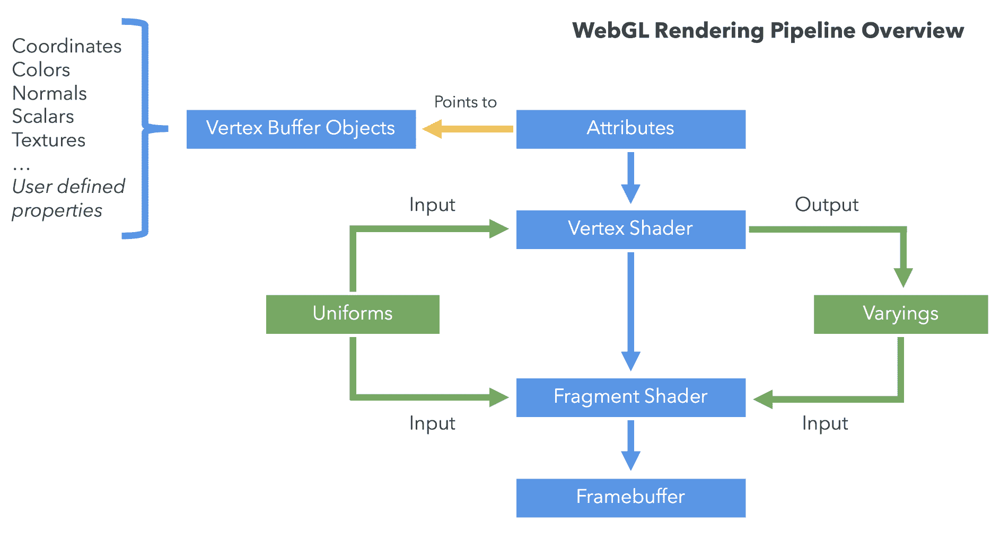

让我们花一点时间来描述每个元素。

# 顶点缓冲区对象 (VBOs)

**VBOs**包含用于描述要渲染的几何形状的数据。定义 3D 对象顶点的顶点坐标通常以 VBO 的形式存储和处理。此外，还有一些数据元素，如顶点法线、颜色和纹理坐标，可以建模为 VBOs。

# 索引缓冲区对象 (IBOs)

虽然**VBOs**包含描述几何形状的顶点，但**IBOs**包含关于顶点之间关系的详细信息，当渲染管道构建绘图类型原语时使用。它使用顶点缓冲区中每个顶点的索引作为值。

# 顶点着色器

**顶点着色器**在每一个顶点上被调用。着色器操作**每个顶点**的数据，例如顶点坐标、法线、颜色和纹理坐标。这些数据由顶点着色器内的属性表示。每个属性指向一个 VBO，从那里读取顶点数据。

# 片段着色器

每组三个顶点定义一个三角形。该三角形表面的每个元素都需要分配一个颜色。没有这个步骤，我们的表面就不会有颜色。每个表面元素被称为**片段**。由于我们处理的是将在屏幕上显示的表面，这些元素更常见地被称为**像素**。

**片段着色器**的主要目标是计算**单个像素**的颜色。以下图表说明了这个概念：

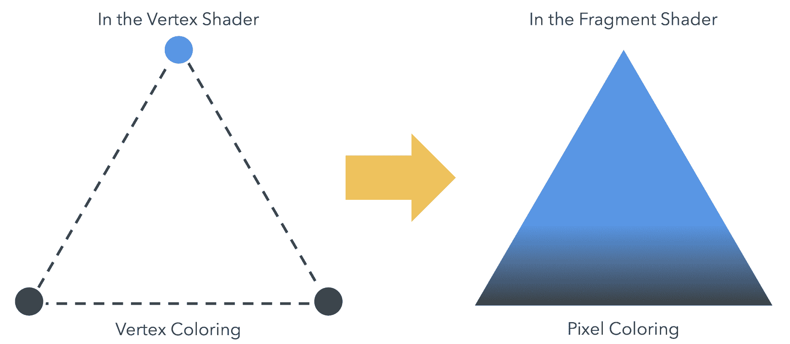

# 帧缓冲区

一个二维缓冲区包含由片段着色器处理过的片段。一旦所有片段都被处理，就会形成一个 2D 图像并在屏幕上显示。**帧缓冲区**是渲染管道的最终目的地。

# 属性

**属性**是用于顶点着色器的输入变量。属性用于指定如何从缓冲区中提取数据并将其提供给顶点着色器。例如，您可以将位置存储在缓冲区中，每个位置为三个 32 位浮点数。您会告诉特定的属性从哪个缓冲区中提取位置，它应该提取什么类型的数据（3 分量，32 位浮点数），缓冲区中位置开始的偏移量，以及从一个位置到下一个位置的字节数。由于顶点着色器在每一个顶点上被调用，因此每次调用顶点着色器时，属性都会不同。

# 全局变量

**统一变量**是可供顶点着色器和片元着色器使用的输入变量。与属性不同，统一变量在渲染周期中是恒定的。例如，光的位置通常被建模为一个统一变量。统一变量实际上是你在执行着色器程序之前设置的全球变量。

# 纹理

**纹理**是可以在你的着色器程序中访问的数据数组。图像数据是将图像放入纹理中最常见的事情，但纹理只是数据，也可以很容易地包含除了描述图像的颜色数组之外的其他内容。

# 插值变量

**插值变量**用于从顶点着色器传递数据到片元着色器。根据渲染的内容——点、线或三角形——顶点着色器设置的插值变量的值将在执行片元着色器时进行插值。

现在，让我们来探讨创建简单几何对象的原则。

# WebGL 中的渲染

WebGL 以标准方式处理几何形状，独立于表面的复杂性和点的数量。有两种数据类型是表示任何 3D 对象几何形状的基本类型：*顶点*和*索引*。

# 顶点

**顶点**是定义 3D 对象角落的点。每个顶点由三个浮点数表示，对应于顶点的`x`、`y`和`z`坐标。与它的表亲 OpenGL 不同，WebGL 不提供 API 方法将独立的顶点传递到渲染管线；因此，我们所有的顶点都需要写入一个**JavaScript 数组**，然后可以使用这个数组来构建 WebGL 顶点缓冲区。

# 索引

**索引**是给定 3D 场景中顶点的数字标签。索引允许我们告诉 WebGL 如何连接顶点以产生表面。与顶点一样，索引存储在 JavaScript 数组中，然后通过 WebGL 索引缓冲区传递给 WebGL 的渲染管线。

VBOs 与 IBOs

有两种类型的 WebGL 缓冲区用于描述和处理几何形状。包含顶点数据的缓冲区被称为**VBOs**，而包含索引数据的缓冲区被称为**IBOs**。

在本节中，我们将使用以下步骤在 WebGL 中渲染一个对象：

1.  使用 JavaScript 数组定义几何形状

1.  创建相应的 WebGL 缓冲区

1.  将顶点着色器属性指向上一步骤中的 VBO 以存储顶点坐标

1.  使用 IBO 渲染几何形状

# 使用 JavaScript 数组定义几何形状

为了练习使用前面的步骤，让我们使用梯形来查看我们如何定义其顶点和索引。我们需要两个 JavaScript 数组——一个用于顶点，一个用于索引：

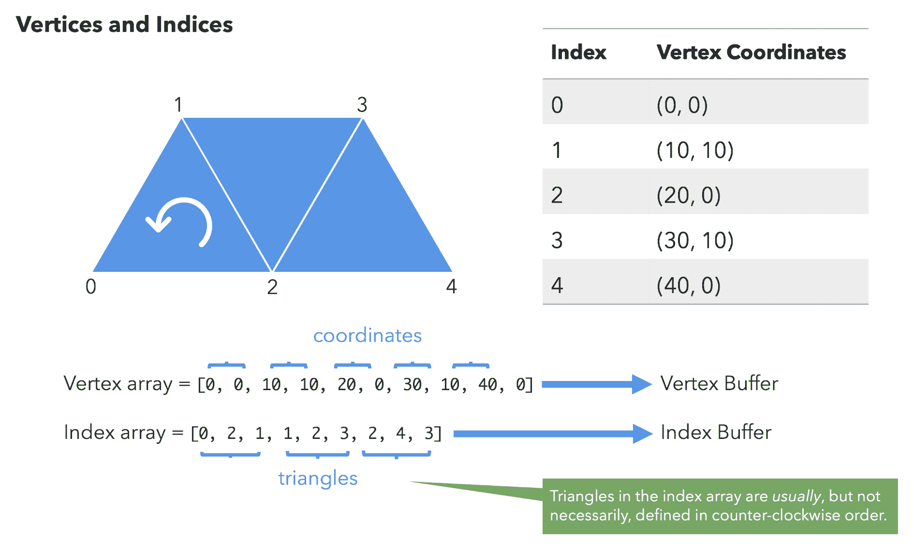

如您从前面的插图中所见，我们已经按顺序将坐标放置在顶点数组中，然后指出了这些坐标如何在索引数组中用于绘制梯形。因此，第一个三角形是由索引为`0`、`2`和`1`的顶点形成的；第二个是由索引为`1`、`2`和`3`的顶点形成的；最后，第三个是由索引为`2`、`4`和`3`的顶点形成的。我们将对所有可能的几何形状遵循相同的程序。

索引数组顺序

索引数组中的三角形通常（但不一定）按逆时针顺序定义。选择一种方法并保持一致对于帮助您确定几何原语的前后侧面非常重要。一致性很重要，因为程序可能使用顺时针/逆时针顺序来确定面是向前还是向后，以便进行剪切和渲染。

剪切

在计算机图形学中，背面剪切（back-face culling）确定一个图形对象的多边形是否可见。它是图形管道中的一个步骤，用于测试多边形中的点在投影到屏幕上时是顺时针还是逆时针顺序。有关更多信息，请访问[`en.wikipedia.org/wiki/Back-face_culling`](https://en.wikipedia.org/wiki/Back-face_culling)[.]。

# 创建 WebGL 缓冲区

现在我们已经了解了如何使用顶点和索引定义一个几何形状，让我们渲染一个正方形。一旦我们创建了定义我们几何形状的顶点和索引的 JavaScript 数组，下一步就是创建相应的缓冲区。在这种情况下，我们在`x`-`y`平面上有一个简单的正方形，z 值设置为`0`：

```js
const vertices = [
  -0.5,  0.5, 0,
  -0.5, -0.5, 0,
   0.5, -0.5, 0,
   0.5,  0.5, 0
];

const positionBuffer = gl.createBuffer();
```

剪裁空间坐标

这些顶点是在剪裁空间坐标中定义的，因为 WebGL 只处理剪裁空间坐标。剪裁空间坐标总是从`-1`到`+1`，无论`canvas`的大小如何。在后面的章节中，我们将更详细地介绍坐标，并学习如何在不同坐标系之间进行转换。

在第一章“入门”中，您可能还记得学习到 WebGL 作为一个状态机运行。现在，当`positionBuffer`成为当前绑定的 WebGL 缓冲区时，任何后续的缓冲区操作都将在这个缓冲区上执行，直到它被解绑，或者通过绑定调用将另一个缓冲区设置为当前缓冲区。我们可以使用以下指令绑定缓冲区：

```js
gl.bindBuffer(gl.ARRAY_BUFFER, positionBuffer);
```

第一个参数是我们正在创建的缓冲区类型。对于这个参数，我们有两种选择：

+   `gl.ARRAY_BUFFER`：顶点数据

+   `gl.ELEMENT_ARRAY_BUFFER`：索引数据

在前面的例子中，我们创建了顶点坐标的缓冲区；因此，我们使用`ARRAY_BUFFER`。对于索引，使用`ELEMENT_ARRAY_BUFFER`类型。

**边界缓冲区操作**

WebGL 将始终访问当前绑定的缓冲区以查找数据。这意味着在调用任何其他几何处理操作之前，我们需要确保已经绑定了缓冲区。如果没有绑定缓冲区，您将获得 `INVALID_OPERATION` 错误。

记住，`drawArrays` 使用 VBOs*.* 一旦我们绑定了缓冲区，我们需要传递其内容。我们通过 `bufferData` 函数来完成此操作：

```js
gl.bufferData(gl.ARRAY_BUFFER, new Float32Array(vertices), gl.STATIC_DRAW);
```

在此示例中，`vertices` 变量是一个包含顶点坐标的正常 JavaScript 数组。WebGL 不接受 JavaScript 数组作为 `bufferData` 方法的参数。相反，WebGL 需要 JavaScript 类型化数组，以便以原生二进制形式处理缓冲区数据，目的是加快几何处理性能。

WebGL 使用的类型化数组包括 `Int8Array`、`Uint8Array`、`Int16Array`、`Uint16Array`、`Int32Array`、`Uint32Array`、`Float32Array` 和 `Float64Array`。

重要的是要注意，顶点坐标可以是浮点数，但索引始终是整数。因此，在这本书中，我们将使用 `Float32Array` 作为 VBOs，使用 `Uint16Array` 作为 IBOs。这两种类型代表了在 WebGL 中每个渲染调用可以使用的最大类型化数组。其他类型可能存在于你的浏览器中，也可能不存在，因为在这个书籍出版时，这个规范尚未最终确定。

由于 WebGL 对索引的支持限制为 16 位整数，索引数组只能有 `65,535` 个元素长。如果你有一个需要更多索引的几何形状，你需要使用多个渲染调用。关于渲染调用的更多内容将在本章后面介绍。

JavaScript 类型化数组

可以在 [`www.khronos.org/registry/typedarray/specs/latest/`](http://www.khronos.org/registry/typedarray/specs/latest/) 找到关于类型化数组的规范。

最后，解除缓冲区绑定是一个好的实践。我们可以通过调用以下指令来实现：

```js
gl.bindBuffer(gl.ARRAY_BUFFER, null);
```

我们将重复此处描述的相同调用，用于我们将要使用的每个 WebGL 缓冲区（VBO 或 IBO）。

让我们通过一个示例回顾一下我们刚刚学到的内容。我们将查看 `ch02_01_square.html` 的一个示例，以了解正方形的 VBO 和 IBO 的定义：

```js
// Set up the buffers for the square
function initBuffers() {
  /*
    V0                    V3
    (-0.5, 0.5, 0)        (0.5, 0.5, 0)
    X---------------------X
    |                     |
    |                     |
    |       (0, 0)        |
    |                     |
    |                     |
    X---------------------X
    V1                    V2
    (-0.5, -0.5, 0)       (0.5, -0.5, 0)
  */
  const vertices = [
    -0.5, 0.5, 0,
    -0.5, -0.5, 0,
    0.5, -0.5, 0,
    0.5, 0.5, 0
  ];

  // Indices defined in counter-clockwise order
  indices = [0, 1, 2, 0, 2, 3];

  // Setting up the VBO
  squareVertexBuffer = gl.createBuffer();
  gl.bindBuffer(gl.ARRAY_BUFFER, squareVertexBuffer);
  gl.bufferData(gl.ARRAY_BUFFER, new Float32Array(vertices), 
   gl.STATIC_DRAW);

  // Setting up the IBO
  squareIndexBuffer = gl.createBuffer();
  gl.bindBuffer(gl.ELEMENT_ARRAY_BUFFER, squareIndexBuffer);
  gl.bufferData(gl.ELEMENT_ARRAY_BUFFER, new Uint16Array(indices), 
   gl.STATIC_DRAW);

  // Clean
  gl.bindBuffer(gl.ARRAY_BUFFER, null);
  gl.bindBuffer(gl.ELEMENT_ARRAY_BUFFER, null);
}
```

如果你想看到这个场景的实际效果，请在你的浏览器中打开 `ch02_01_square.html` 文件。

总结一下，对于每个缓冲区，我们想要执行以下操作：

+   创建一个新的缓冲区

+   绑定它使其成为当前缓冲区

+   使用类型化数组之一传递缓冲区数据

+   解除缓冲区绑定

# 操作 WebGL 缓冲区

操作 WebGL 缓冲区的操作总结如下表所示：

| **方法** | **描述** |
| --- | --- |
| `createBuffer()` | 创建一个新的缓冲区。 |
| `deleteBuffer(buffer)` | 删除提供的缓冲区。 |

| `bindBuffer(target, buffer)` | 绑定一个缓冲区对象。`target` 的有效值如下：

+   `ARRAY_BUFFER`（用于顶点）

+   `ELEMENT_ARRAY_BUFFER`（用于索引）

|

| `bufferData(target, data, type)` | 提供缓冲区数据。`target` 的可接受值如下：

+   `ARRAY_BUFFER` （用于顶点）

+   `ELEMENT_ARRAY_BUFFER` （用于索引）

如前所述，WebGL 只接受 JavaScript 类型数组作为数据。参数 `type` 是 WebGL 的性能提示。`type` 的可接受值如下：

+   `STATIC_DRAW`：缓冲区中的数据将不会更改（指定一次，使用多次）

+   `DYNAMIC_DRAW`：数据将频繁更改（指定多次，使用多次）

+   `STREAM_DRAW`：数据将在每个渲染周期中更改（指定一次，使用一次）

|

# 将属性关联到 VBO

一旦我们创建了 VBO，我们需要将这些缓冲区关联到顶点着色器属性。每个顶点着色器属性将根据建立的对应关系，仅引用一个 *an*d* *仅一个* 缓冲区，如图所示：

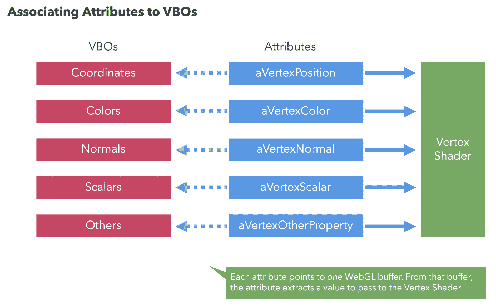

我们可以通过以下步骤实现这一点：

1.  绑定 VBO

1.  将属性指向当前绑定的 VBO

1.  启用属性

1.  解绑

让我们看看第一步。

# 绑定 VBO

我们已经知道如何做到这一点：

```js
gl.bindBuffer(gl.ARRAY_BUFFER, myBuffer);
```

其中 `myBuffer` 是我们想要映射的缓冲区。

# 将属性指向当前绑定的 VBO

WebGL API 的主要部分是设置状态以向我们的 GLSL 程序提供数据。在这种情况下，我们的 GLSL 程序的唯一输入是 `aVertexPosition`，它是一个属性。在 第三章，*灯光*，我们将学习如何定义和引用顶点和片段着色器属性。现在，让我们假设我们有一个 `aVertexPosition` 属性，它描述了着色器中的顶点坐标。

允许将属性指向当前绑定的 VBO 的 WebGL 函数是 `vertexAttribPointer`。以下是其签名：

```js
gl.vertexAttribPointer(index, size, type, normalize, stride, offset);
```

让我们逐个描述每个参数：

+   **索引**：我们将要映射到当前绑定缓冲区的属性的索引。

+   **大小**：表示当前绑定缓冲区中每个顶点存储的值的数量。

+   **类型**：指定当前缓冲区中存储的值的类型。它可以是以下常量之一：`FIXED`、`BYTE`、`UNSIGNED_BYTE`、`FLOAT`、`SHORT` 或 `UNSIGNED_SHORT`。

+   **归一化**：此参数可以设置为 `true` 或 `false`。它处理超出本入门指南范围的数值转换。对于我们的目的，我们将此参数设置为 `false`。

+   **步长**：如果步长为 `0`，则表示元素在缓冲区中按顺序存储。

+   **偏移量**：从缓冲区中读取对应属性值的起始位置。通常设置为 `0`，表示将从缓冲区的第一个元素开始读取值。

**缓冲指针**

`vertexAttribPointer`定义了一个从当前绑定的缓冲区中读取信息的指针。记住，如果没有当前绑定的 VBO，将会生成一个错误。

# 启用属性

最后，我们需要激活顶点着色器属性。按照我们的例子，我们只需要添加`gl.enableVertexAttribArray(positionAttributeLocation);`。

以下图表总结了映射过程：

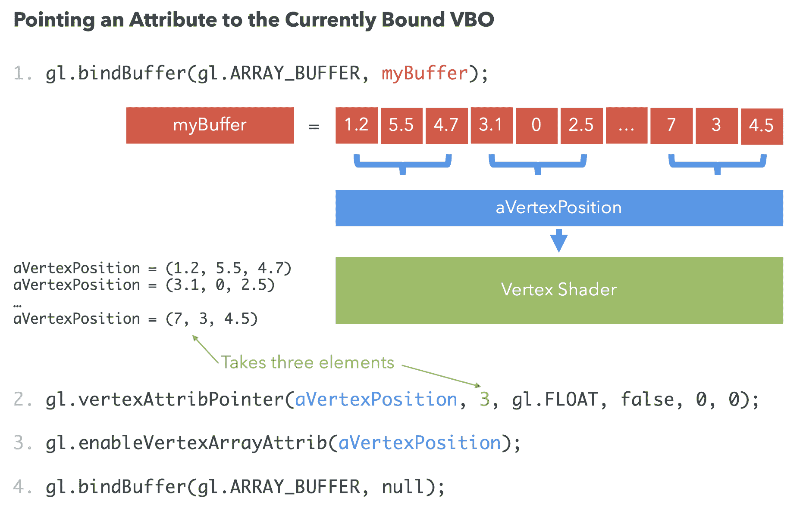

# 解除 VBO 的绑定

作为一条经验法则，我们在使用完缓冲区后应该解除它们的绑定。我们可以通过以下方式做到：

`gl.bindBuffer(gl.ARRAY_BUFFER, null);`.

# 渲染

一旦我们定义了我们的 VBOs 并将它们映射到相应的顶点着色器属性，我们就可以准备渲染了！为此，我们可以使用两个 API 函数之一：`drawArrays`或`drawElements`。

# 绘图函数

`drawArrays`和`drawElements`函数用于向帧缓冲区写入。`drawArrays`使用缓冲区中定义的顶点数据的顺序来创建几何体。相比之下，`drawElements`使用索引来访问顶点数据缓冲区并创建几何体。`drawArrays`和`drawElements`都将仅使用**已启用的数组**。这些是映射到活动顶点着色器属性的顶点缓冲区对象。

在我们的例子中，包含顶点坐标的缓冲区是唯一的已启用数组。然而，在更一般的情况下，我们可能会有几个可用的已启用数组。

例如，我们可以有包含顶点颜色、顶点法线、纹理坐标以及应用程序所需的任何其他每顶点数据的数组。在这种情况下，每个数组都会映射到一个活动的顶点着色器属性。

使用多个 VBO

在第三章，*光线*，我们将学习如何使用顶点法线缓冲区和顶点坐标来为我们的几何体创建光照模型。在这种情况下，我们将有两个活动的数组：顶点坐标和顶点法线。

# 使用 drawArrays

当没有索引信息时，我们将调用`drawArrays`。在大多数情况下，当几何体足够简单，定义索引是过度时，`drawArrays`会被使用——例如，当我们想要渲染一个三角形或矩形时。在这种情况下，WebGL 将按照在 VBO 中定义的顶点坐标的顺序创建几何体。如果你有连续的三角形（就像我们在梯形示例中做的那样），你将不得不在 VBO 中*重复*这些坐标。

如果你需要重复许多顶点来创建几何体，`drawArrays`不是最佳方法，因为顶点数据复制的越多，对顶点着色器的调用就越多。这可能会降低整体性能，因为相同的顶点必须通过管道多次，每次它们在相应的 VBO 中重复时都要通过一次：

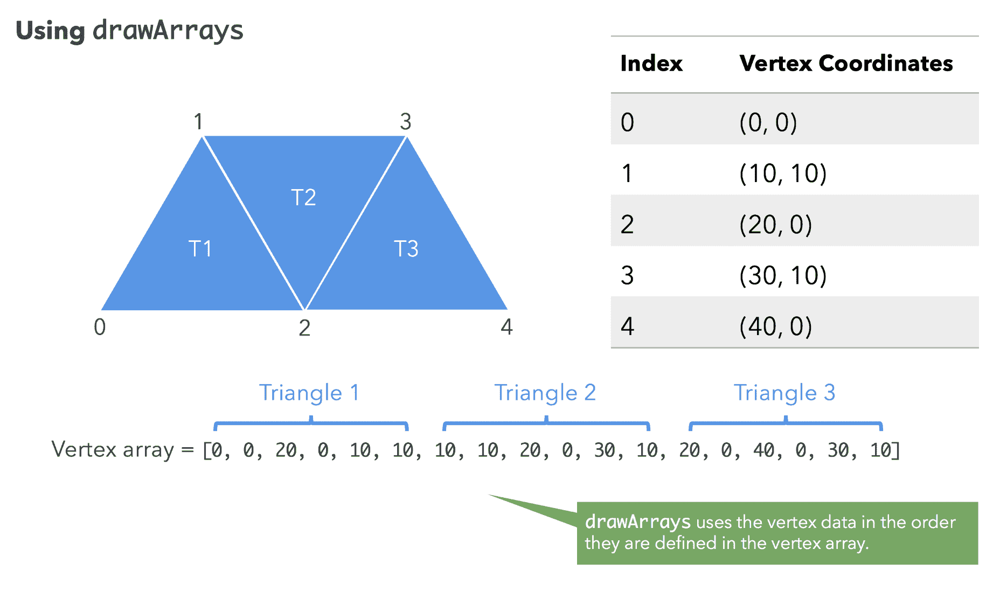

`drawArrays` 的签名如下：

```js
gl.drawArrays(mode, first, count)
```

其中：

+   `mode`：表示我们将要渲染的原始类型。`mode` 的可能值有 `gl.POINTS`、`gl.LINE_STRIP`、`gl.LINE_LOOP`、`gl.LINES`、`gl.TRIANGLE_STRIP`、`gl.TRIANGLE_FAN` 和 `gl.TRIANGLES`。

+   `first`：指定启用的数组中的起始元素。

+   `count`：指定要渲染的元素数量。

WebGL drawArrays 规范

当调用 `drawArrays` 时，它使用每个启用的数组中的连续 `count` 个元素来构建一系列几何原始形状，从元素 `first` 开始。`mode` 指定构建哪些类型的原始形状以及数组元素如何构建这些原始形状。

# 使用 drawElements

与未定义 IBO 的前一种情况不同，`drawElements` 允许我们使用 IBO 来告诉 WebGL 如何渲染几何形状。记住，`drawArrays` 使用 VBOs，这意味着顶点着色器将处理 VBO 中出现的重复顶点多次。另一方面，`drawElements` 使用索引。因此，顶点只处理一次，并且可以在 IBO 中定义的次数内重复使用。这个特性减少了 GPU 上的内存和处理需求。

让我们重新回顾以下图表：

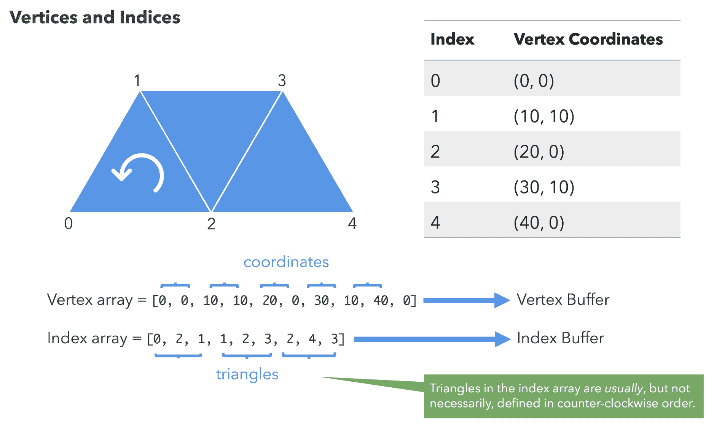

当我们使用 `drawElements` 时，我们需要至少两个缓冲区：一个 VBO 和一个 IBO。由于顶点着色器在每个顶点上执行，渲染管线使用 IBO 将几何形状组装成三角形。

使用 `drawElements` 绑定 IBO

当使用 `drawElements` 时，你需要确保相应的 IBO 当前已绑定。

`drawElements` 的签名如下：

```js
gl.drawElements(mode, count, type, offset)
```

其中：

+   `mode`：表示我们将要渲染的原始类型。`mode` 的可能值有 `POINTS`、`LINE_STRIP`、`LINE_LOOP`、`LINES`、`TRIANGLE_STRIP`、`TRIANGLE_FAN` 和 `TRIANGLES`。

+   `count`：指定要渲染的元素数量。

+   `type`：指定索引中值的类型。必须是 `UNSIGNED_BYTE` 或 `UNSIGNED_SHORT`，因为我们正在处理索引（整数）。

+   `offset`：指示缓冲区中哪个元素将是渲染的起点。通常它是第一个元素（零值）。

WebGL drawElements 规范

当调用 `drawElements` 时，它从启用的数组中从偏移量开始使用连续的 `count` 个元素来构建一系列几何原始形状。`mode` 指定构建哪些类型的原始形状以及数组元素如何构建这些原始形状。如果启用了多个数组，则每个数组都会被使用。

# 将一切整合在一起

由于你可能一直在等待看到所有这些是如何一起工作的，让我们回顾一个简单的 WebGL 程序，该程序渲染一个正方形。

# 行动时间：渲染正方形

按照以下步骤操作：

1.  在代码编辑器（最好是支持语法高亮的编辑器）中打开 `ch02_01_square.html` 文件。

1.  使用以下图表的帮助检查此文件的结构：

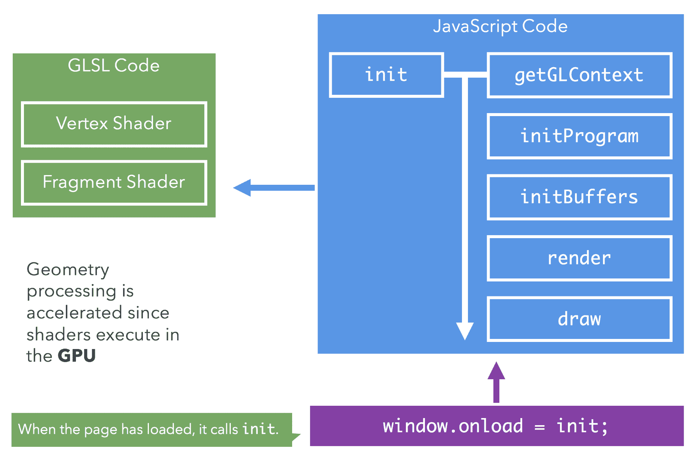

1.  网页包含以下内容：

+   `<script id="vertex-shader" type="x-shader/x-vertex">`脚本包含了顶点着色器代码。

+   `<script id="fragment-shader" type="x-shader/x-fragment">`脚本包含了片段着色器代码。我们暂时不会关注这两个脚本，因为它们将是下一章的主要学习内容。现在，只需注意我们有一个片段着色器和顶点着色器。

+   我们网页上的下一个脚本，`<script type="text/javascript">`，包含了我们需要的所有 JavaScript WebGL 代码。这个脚本分为以下函数：

```js
// Global variables that are set and used
// across the application
let gl,
  program,
  squareVertexBuffer,
  squareIndexBuffer,
  indices;
```

+   我们列出了一些我们在整个应用程序中使用的全局变量：

```js
// Given an id, extract the content's of a shader script
// from the DOM and return the compiled shader
function getShader(id) {
  const script = document.getElementById(id);
  const shaderString = script.text.trim();

  // Assign shader depending on the type of shader
  let shader;
  if (script.type === 'x-shader/x-vertex') {
    shader = gl.createShader(gl.VERTEX_SHADER);
  }
  else if (script.type === 'x-shader/x-fragment') {
    shader = gl.createShader(gl.FRAGMENT_SHADER);
  }
  else {
    return null;
  }

  // Compile the shader using the supplied shader code
  gl.shaderSource(shader, shaderString);
  gl.compileShader(shader);

  // Ensure the shader is valid
  if (!gl.getShaderParameter(shader, gl.COMPILE_STATUS)) {
    console.error(gl.getShaderInfoLog(shader));
    return null;
  }

  return shader;
}
```

+   `getShader`函数从 HTML 网页中提取具有给定`id`的着色器的内容：

```js
// Create a program with the appropriate vertex and fragment shaders
function initProgram() {
  const vertexShader = getShader('vertex-shader');
  const fragmentShader = getShader('fragment-shader');

  // Create a program
  program = gl.createProgram();
  // Attach the shaders to this program
  gl.attachShader(program, vertexShader);
  gl.attachShader(program, fragmentShader);
  gl.linkProgram(program);

  if (!gl.getProgramParameter(program, gl.LINK_STATUS)) {
    console.error('Could not initialize shaders');
  }

  // Use this program instance
  gl.useProgram(program);
  // We attach the location of these shader values to the program 
  // instance for easy access later in the code
  program.aVertexPosition = gl.getAttribLocation(program, 'aVertexPosition');
}
```

+   `initProgram`函数获取网页中存在的顶点着色器和片段着色器的引用（即我们之前讨论的前两个脚本），并将它们传递给 GPU 进行编译。最后，我们将`aVertexPosition`属性的地址附加到`program`对象上，以便以后可以轻松引用。查找`attribute`和`uniform`位置是昂贵的；因此，此类操作应在初始化期间发生一次。我们将在后面的章节中介绍这些技术：

```js
// Set up the buffers for the square
function initBuffers() {
  /*
    V0                    V3
    (-0.5, 0.5, 0)        (0.5, 0.5, 0)
    X---------------------X
    |                     |
    |                     |
    |       (0, 0)        |
    |                     |
    |                     |
    X---------------------X
    V1                    V2
    (-0.5, -0.5, 0)       (0.5, -0.5, 0)
  */
  const vertices = [
    -0.5, 0.5, 0,
    -0.5, -0.5, 0,
    0.5, -0.5, 0,
    0.5, 0.5, 0
  ];

  // Indices defined in counter-clockwise order
  indices = [0, 1, 2, 0, 2, 3];

  // Setting up the VBO
  squareVertexBuffer = gl.createBuffer();
  gl.bindBuffer(gl.ARRAY_BUFFER, squareVertexBuffer);
  gl.bufferData(gl.ARRAY_BUFFER, new Float32Array(vertices), 
   gl.STATIC_DRAW);

  // Setting up the IBO
  squareIndexBuffer = gl.createBuffer();
  gl.bindBuffer(gl.ELEMENT_ARRAY_BUFFER, squareIndexBuffer);
  gl.bufferData(gl.ELEMENT_ARRAY_BUFFER, new Uint16Array(indices), 
   gl.STATIC_DRAW);

  // Clean
  gl.bindBuffer(gl.ARRAY_BUFFER, null);
  gl.bindBuffer(gl.ELEMENT_ARRAY_BUFFER, null);
}
```

+   `initBuffers`函数包含了创建和初始化缓冲区的 API 调用，正如我们在本章前面讨论的那样。在这个例子中，我们创建一个 VBO 来存储正方形的坐标，以及一个 IBO 来存储正方形的索引：

```js
// We call draw to render to our canvas
function draw() {
  // Clear the scene
  gl.clear(gl.COLOR_BUFFER_BIT | gl.DEPTH_BUFFER_BIT);
  gl.viewport(0, 0, gl.canvas.width, gl.canvas.height);

  // Use the buffers we've constructed
  gl.bindBuffer(gl.ARRAY_BUFFER, squareVertexBuffer);
  gl.vertexAttribPointer(program.aVertexPosition, 3, gl.FLOAT, 
   false, 0, 0);
  gl.enableVertexAttribArray(program.aVertexPosition);

  // Bind IBO
  gl.bindBuffer(gl.ELEMENT_ARRAY_BUFFER, squareIndexBuffer);

  // Draw to the scene using triangle primitives
  gl.drawElements(gl.TRIANGLES, indices.length, gl.UNSIGNED_SHORT, 
   0);

  // Clean
  gl.bindBuffer(gl.ARRAY_BUFFER, null);
  gl.bindBuffer(gl.ELEMENT_ARRAY_BUFFER, null);
}
```

+   `draw`函数将 VBO 映射到相应的顶点缓冲区属性`program.aVertexPosition`，并通过调用`enableVertexAttribArray`来启用它。然后它绑定 IBO 并调用`drawElements`函数。我们将在后面的章节中更详细地介绍这些内容：

```js
// Entry point to our application
function init() {
  // Retrieve the canvas
  const canvas = utils.getCanvas('webgl-canvas');

  // Set the canvas to the size of the screen
  canvas.width = window.innerWidth;
  canvas.height = window.innerHeight;

  // Retrieve a WebGL context
  gl = utils.getGLContext(canvas);
  // Set the clear color to be black
  gl.clearColor(0, 0, 0, 1);

  // Call the functions in an appropriate order
  initProgram();
  initBuffers();
  draw();
}
```

+   `init`是整个应用程序的入口点。当页面加载完成后，通过`window.onload = init`调用`init`。需要注意的是，`init`内部函数调用的顺序对于设置和渲染几何形状非常重要。我们还设置了画布的尺寸以适应整个窗口的大小（全屏）。如前所述，在`draw`函数中，我们使用`canvas.width`和`canvas.height`作为绘图尺寸的真相。

1.  在你偏好的 HTML5 浏览器（Firefox、Safari、Chrome 或 Opera）中打开`ch02_01_square.html`文件，你应该会看到以下内容：


1.  打开`ch02_01_square.html`的代码，并向下滚动到`initBuffers`函数。请注意函数内部出现的注释中的图示。这个图示描述了顶点和索引的排列方式。你应该会看到以下内容：

```js
/*
  V0                    V3
  (-0.5, 0.5, 0)        (0.5, 0.5, 0)
  X---------------------X
  |                     |
  |                     |
  |       (0, 0)        |
  |                     |
  |                     |
  X---------------------X
  V1                    V2
  (-0.5, -0.5, 0)       (0.5, -0.5, 0)
*/
```

1.  尝试修改现有的缓冲区，将正方形变成五边形。你会怎么做？

更新几何定义

修改顶点缓冲区数组和索引数组，以便生成的图形是五边形而不是正方形。为此，你需要向顶点数组中添加一个顶点，并在索引数组中定义一个额外的三角形。

1.  将文件另存为不同的名称，并在你偏好的 HTML5 浏览器中打开它以进行测试。

***刚才发生了什么？***

你已经了解了符合 WebGL 应用程序的不同代码元素。`initBuffers`函数已经被仔细检查并修改，以渲染不同的几何形状。

# 尝试一下：更改正方形颜色

前往片段着色器并更改你的几何形状的颜色。

四分量颜色向量

格式是（红色，绿色，蓝色，alpha）。Alpha 现在始终为`1.0`，前三个参数是范围在`0.0`到`1.0`之间的浮点数。

记得在浏览器中打开它之前，在文本编辑器中更改文件后保存文件。

# 尝试一下：使用 drawArrays 进行渲染

我们的正方形是通过`drawElements`通过顶点和索引定义的。现在尝试使用`drawArrays`渲染相同的正方形。

提示

由于你不使用索引与`drawArrays`一起使用，因此你不需要 IBO。所以，你需要复制顶点来构建这个几何形状。

提示为了参考，你可以在这个练习的`ch02_02_square-arrays.html`中找到源代码。

# 顶点数组对象

**顶点数组对象（VAOs）**允许你将一组缓冲区的所有顶点/索引绑定信息存储在单个易于管理的对象中。也就是说，属性的状态、每个属性使用的缓冲区以及如何从这些缓冲区中提取数据都收集到 VAO 中。尽管我们可以通过使用扩展在 WebGL 1 中实现 VAOs，但它们在 WebGL 2 中默认可用。

这是一个应该*始终*使用的重要功能，因为它可以显著减少渲染时间。当不使用 VAOs 时，所有属性数据都在全局 WebGL 状态中，这意味着调用如`gl.vertexAttribPointer`、`gl.enableVertexAttribArray`和`gl.bindBuffer(gl.ELEMENT_ARRAY_BUFFER, buffer)`等函数会操作全局状态。这会导致性能损失，因为在任何绘制调用之前，我们需要设置所有顶点属性并设置`ELEMENT_ARRAY_BUFFER`，其中使用了索引数据。另一方面，使用 VAOs 时，我们会在应用程序初始化期间设置所有属性，并在渲染时简单地绑定数据，从而获得更好的性能。

让我们看看我们如何从这里开始使用 VAOs！

# 行动时间：使用 VAO 渲染正方形

让我们重构一个使用 VAOs 的先前示例：

1.  在你的编辑器中打开`ch02_01_square.html`。

1.  首先，我们更新全局变量：

```js
// Global variables that are set and used
// across the application
let gl,
  program,
  squareVAO,
  squareIndexBuffer,
  indices;
```

1.  我们已经将`squareVertexBuffer`替换为`squareVAO`，因为我们不再需要直接引用顶点缓冲区。

1.  接下来，我们按照以下方式更新`initBuffers`函数：

```js
// Set up the buffers for the square
function initBuffers() {
  /*
    V0                    V3
    (-0.5, 0.5, 0)        (0.5, 0.5, 0)
    X---------------------X
    |                     |
    |                     |
    |       (0, 0)        |
    |                     |
    |                     |
    X---------------------X
    V1                    V2
    (-0.5, -0.5, 0)       (0.5, -0.5, 0)
  */
  const vertices = [
    -0.5, 0.5, 0,
    -0.5, -0.5, 0,
    0.5, -0.5, 0,
    0.5, 0.5, 0
  ];

  // Indices defined in counter-clockwise order
  indices = [0, 1, 2, 0, 2, 3];

 // Create VAO instance
  squareVAO = gl.createVertexArray();

  // Bind it so we can work on it
  gl.bindVertexArray(squareVAO);

  const squareVertexBuffer = gl.createBuffer();
  gl.bindBuffer(gl.ARRAY_BUFFER, squareVertexBuffer);
  gl.bufferData(gl.ARRAY_BUFFER, new Float32Array(vertices), 
   gl.STATIC_DRAW);

  // Provide instructions for VAO to use data later in draw
  gl.enableVertexAttribArray(program.aVertexPosition);
  gl.vertexAttribPointer(program.aVertexPosition, 3, gl.FLOAT, 
   false, 0, 0); 
  // Setting up the IBO
  squareIndexBuffer = gl.createBuffer();
  gl.bindBuffer(gl.ELEMENT_ARRAY_BUFFER, squareIndexBuffer);
  gl.bufferData(gl.ELEMENT_ARRAY_BUFFER, new Uint16Array(indices), 
   gl.STATIC_DRAW);

  // Clean
 gl.bindVertexArray(null);
  gl.bindBuffer(gl.ARRAY_BUFFER, null);
  gl.bindBuffer(gl.ELEMENT_ARRAY_BUFFER, null);
}
```

1.  我们使用`gl.createVertexArray();`创建一个新的 VAO 实例，并将其分配给`squareVAO`。

1.  然后，我们使用`gl.bindVertexArray(squareVAO);`绑定`squareVAO`，这样所有的属性设置都将应用于那一组属性状态。

1.  在配置了`squareVertexBuffer`之后，我们指导当前绑定的 VAO（即`squareVAO`）如何根据`aVertexPosition`的指令提取数据。这些指令与之前位于`draw`函数中的指令相同；但现在，它们在初始化时只发生一次。

1.  最后，我们需要在我们的`draw`函数中使用这个 VAO：

```js
// We call draw to render to our canvas
function draw() {
  // Clear the scene
  gl.clear(gl.COLOR_BUFFER_BIT | gl.DEPTH_BUFFER_BIT);
  gl.viewport(0, 0, gl.canvas.width, gl.canvas.height);

 // Bind the VAO
  gl.bindVertexArray(squareVAO);

  gl.bindBuffer(gl.ELEMENT_ARRAY_BUFFER, squareIndexBuffer);

  // Draw to the scene using triangle primitives
  gl.drawElements(gl.TRIANGLES, indices.length, gl.UNSIGNED_SHORT, 
   0);

  // Clean
 gl.bindVertexArray(null);  gl.bindBuffer(gl.ARRAY_BUFFER, null);
  gl.bindBuffer(gl.ELEMENT_ARRAY_BUFFER, null);
}
```

1.  更新的`draw`函数要简单得多！我们只需绑定 VAO（即`squareVAO`），并允许它在`initBuffers`中处理我们提供的指令。

1.  最后，使用后解除缓冲区和 VAO 的绑定是一个好习惯，通过提供`null`值来实现。

1.  保存文件并在浏览器中打开它。你应该会看到使用 VAO 渲染的相同正方形：


1.  这个练习的源代码可以在`ch02_03_square-vao.html`中找到。

由于我们目前正在渲染单个几何体，使用 VAO 可能看起来是不必要的复杂。这是一个合理的评估！然而，随着我们应用程序的复杂性增加，使用 VAO 成为了一个基础特性。

# 行动时间：渲染模式

让我们回顾一下`drawElements`函数的签名：

```js
gl.drawElements(mode, count, type, offset)
```

第一个参数确定我们要渲染的图元类型。在下一节中，我们将通过示例看到不同的渲染模式。

按照以下步骤操作：

1.  在浏览器中打开`ch02_04_rendering-modes.html`文件。这个例子与上一节的结构相同。

1.  在你的编辑器中打开`ch02_04_rendering-modes.html`文件，并滚动到`initBuffers`函数：

```js
function initBuffers() {
  const vertices = [
    -0.5, -0.5, 0,
    -0.25, 0.5, 0,
    0.0, -0.5, 0,
    0.25, 0.5, 0,
    0.5, -0.5, 0
  ];

  indices = [0, 1, 2, 0, 2, 3, 2, 3, 4];

  // Create VAO
  trapezoidVAO = gl.createVertexArray();

  // Bind VAO
  gl.bindVertexArray(trapezoidVAO);

  const trapezoidVertexBuffer = gl.createBuffer();
  gl.bindBuffer(gl.ARRAY_BUFFER, trapezoidVertexBuffer);
  gl.bufferData(gl.ARRAY_BUFFER, new Float32Array(vertices), 
   gl.STATIC_DRAW);
  // Provide instructions to VAO
  gl.vertexAttribPointer(program.aVertexPosition, 3, gl.FLOAT, 
   false, 0, 0);
  gl.enableVertexAttribArray(program.aVertexPosition);

  trapezoidIndexBuffer = gl.createBuffer();
  gl.bindBuffer(gl.ELEMENT_ARRAY_BUFFER, trapezoidIndexBuffer);
  gl.bufferData(gl.ELEMENT_ARRAY_BUFFER, new Uint16Array(indices), 
   gl.STATIC_DRAW);

  // Clean
  gl.bindVertexArray(null);
  gl.bindBuffer(gl.ARRAY_BUFFER, null);
  gl.bindBuffer(gl.ELEMENT_ARRAY_BUFFER, null);
}
```

1.  这里，你会看到我们在绘制一个梯形。然而，在屏幕上，你会看到两个三角形！稍后，我们将看到这是如何发生的。

1.  在页面顶部，有一个设置控制器，允许你选择 WebGL 提供的不同渲染模式：

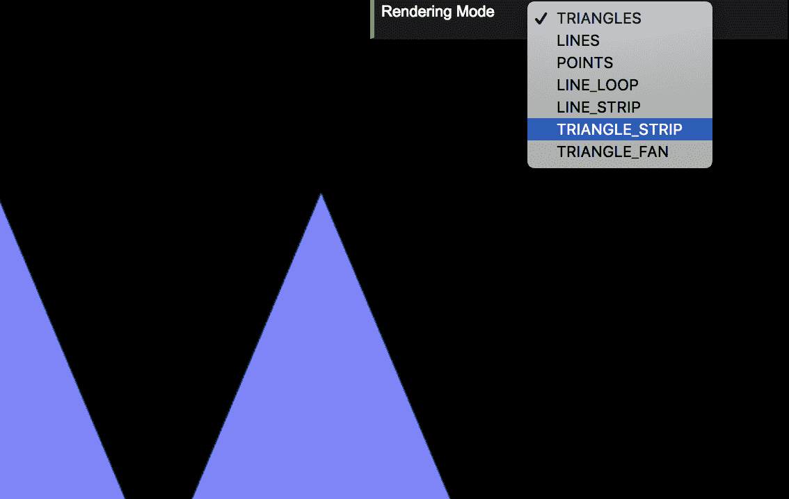

```js
let gl,
  canvas,
  program,
  indices,
  trapezoidVAO,
  trapezoidIndexBuffer,
  // Global variable that captures the current rendering mode type
 renderingMode = 'TRIANGLES';
```

1.  当你从设置中选择任何选项时，你正在改变代码顶部定义的`renderingMode`变量的值（如果你想看到它的定义位置，请向上滚动）。设置控制器设置的代码位于`initControls`函数中。我们将在稍后介绍这个功能。

1.  要查看每个选项如何修改渲染，请滚动到`draw`函数：

```js
function draw() {
  gl.clear(gl.COLOR_BUFFER_BIT | gl.DEPTH_BUFFER_BIT);
  gl.viewport(0, 0, gl.canvas.width, gl.canvas.height);

  // Bind VAO
  gl.bindVertexArray(trapezoidVAO);

  gl.bindBuffer(gl.ELEMENT_ARRAY_BUFFER, trapezoidIndexBuffer);

  // Depending on the rendering mode type, we will draw differently
  switch (renderingMode) {
    case 'TRIANGLES': {
      indices = [0, 1, 2, 2, 3, 4];
      gl.bufferData(gl.ELEMENT_ARRAY_BUFFER, new 
       Uint16Array(indices), gl.STATIC_DRAW);
      gl.drawElements(gl.TRIANGLES, indices.length, 
       gl.UNSIGNED_SHORT, 
       0);
      break;
    }
    case 'LINES': {
      indices = [1, 3, 0, 4, 1, 2, 2, 3];
      gl.bufferData(gl.ELEMENT_ARRAY_BUFFER, new 
       Uint16Array(indices), gl.STATIC_DRAW);
      gl.drawElements(gl.LINES, indices.length, gl.UNSIGNED_SHORT, 
       0);
      break;
    }
    case 'POINTS': {
      indices = [1, 2, 3];
      gl.bufferData(gl.ELEMENT_ARRAY_BUFFER, new 
       Uint16Array(indices), gl.STATIC_DRAW);
      gl.drawElements(gl.POINTS, indices.length, gl.UNSIGNED_SHORT, 
       0);
      break;
    }
    case 'LINE_LOOP': {
      indices = [2, 3, 4, 1, 0];
      gl.bufferData(gl.ELEMENT_ARRAY_BUFFER, new 
       Uint16Array(indices), gl.STATIC_DRAW);
      gl.drawElements(gl.LINE_LOOP, indices.length, 
       gl.UNSIGNED_SHORT, 0);
      break;
    }
    case 'LINE_STRIP': {
      indices = [2, 3, 4, 1, 0];
      gl.bufferData(gl.ELEMENT_ARRAY_BUFFER, new 
       Uint16Array(indices), gl.STATIC_DRAW);
      gl.drawElements(gl.LINE_STRIP, indices.length, 
       gl.UNSIGNED_SHORT, 0);
      break;
    }
    case 'TRIANGLE_STRIP': {
      indices = [0, 1, 2, 3, 4];
      gl.bufferData(gl.ELEMENT_ARRAY_BUFFER, new 
       Uint16Array(indices), gl.STATIC_DRAW);
      gl.drawElements(gl.TRIANGLE_STRIP, indices.length, 
       gl.UNSIGNED_SHORT, 0);
      break;
    }
    case 'TRIANGLE_FAN': {
      indices = [0, 1, 2, 3, 4];
      gl.bufferData(gl.ELEMENT_ARRAY_BUFFER, new 
       Uint16Array(indices), gl.STATIC_DRAW);
      gl.drawElements(gl.TRIANGLE_FAN, indices.length, 
       gl.UNSIGNED_SHORT, 0);
      break;
    }
  }

  // Clean
  gl.bindVertexArray(null);
  gl.bindBuffer(gl.ARRAY_BUFFER, null);
  gl.bindBuffer(gl.ELEMENT_ARRAY_BUFFER, null);
}
```

1.  你会看到在绑定 IBO `trapezoidIndexBuffer`的以下指令之后：

```js
gl.bindBuffer(gl.ELEMENT_ARRAY_BUFFER, trapezoidIndexBuffer);
```

1.  你还有一个 switch 语句，其中有一些代码会根据`renderingMode`变量的值执行。

1.  对于每种模式，我们定义 JavaScript 数组索引的内容。然后，我们通过使用`bufferData`函数将这个数组传递给当前绑定的缓冲区，即`trapezoidIndexBuffer`。最后，我们调用`drawElements`函数。

1.  让我们看看每种模式的作用：

| **模式** | **描述** |
| --- | --- |
| `TRIANGLES` | 当您使用`TRIANGLES`模式时，WebGL 将使用您在 IBO 中定义的前三个索引来构建第一个三角形，接下来三个来构建第二个三角形，依此类推。在这个例子中，我们正在绘制两个三角形，这可以通过检查填充 IBO 的 JavaScript 索引数组来验证：`indices = [0, 1, 2, 2, 3, 4];`。 |
| `LINES` | `LINES`模式将指示 WebGL 根据 IBO 中定义的连续索引对绘制线条，通过获取相应顶点的坐标。例如，`indices = [1, 3, 0, 4, 1, 2, 2, 3];`将绘制四条线：从顶点编号`1`到顶点编号`3`，从顶点编号`0`到顶点编号`4`，从顶点编号`1`到顶点编号`2`，以及从顶点编号`2`到顶点编号`3`。 |
| `POINTS` | 当我们使用`POINTS`模式时，WebGL 不会生成表面。相反，它将使用索引数组渲染我们定义的顶点。在这个例子中，我们将只使用`indices = [1, 2, 3];`渲染顶点编号`1`、`2`和`3`。 |
| `LINE_LOOP` | `LINE_LOOP` 绘制一个闭合循环，将 IBO 中定义的顶点连接到下一个顶点。在我们的情况下，它将是`indices = [2, 3, 4, 1, 0];`。 |
| `LINE_STRIP` | `LINE_STRIP` 与`LINE_LOOP`类似。区别在于 WebGL 不会将最后一个顶点连接到第一个顶点（不是闭合循环）。`indices`JavaScript 数组将是`indices = [2, 3, 4, 1, 0];`。 |
| `TRIANGLE_STRIP` | `TRIANGLE_STRIP` 绘制连接的三角形。在第一个三个顶点之后指定每个顶点。在我们的例子中，顶点编号`0`、`1`和`2`创建了一个新的三角形。如果我们有`indices = [0, 1, 2, 3, 4];`，那么我们将生成三角形*(0, 1, 2)*、*(1, 2, 3)*和*(2, 3, 4)*。 |
| `TRIANGLE_FAN` | `TRIANGLE_FAN` 以类似于`TRIANGLE_STRIP`的方式创建三角形。然而，在 IBO 中定义的第一个顶点被用作扇形的起点（连续三角形之间的唯一共享顶点）。在我们的例子中，`indices = [0, 1, 2, 3, 4];`将创建三角形*(0, 1, 2)*和*(0, 3, 4)*。 |

1.  下面的图示可以帮助可视化这些不同的渲染模式。但说到底，通过更改设置的下拉值并查看各种结果，最容易看到这些模式的效果：

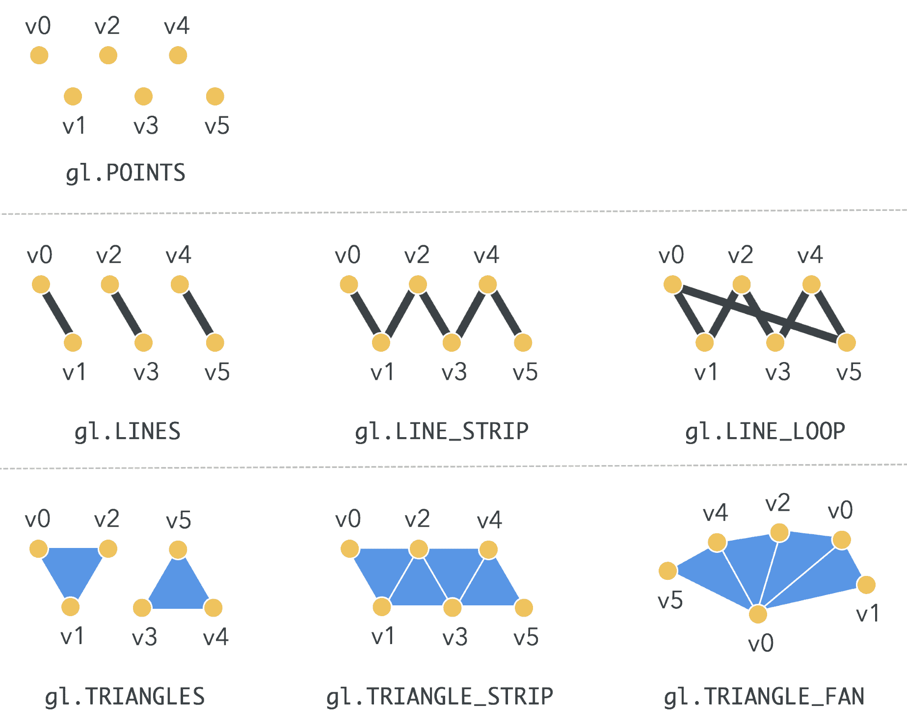

1.  让我们通过编辑`ch02_04_rendering-modes.html`来做出一些更改，以便当您选择`TRIANGLES`选项时，渲染梯形而不是两个三角形。

**提示**

您需要在`indices`数组中添加一个额外的三角形。

1.  保存文件并在浏览器中测试它。

1.  编辑网页，以便使用`LINES`选项绘制字母**M**。

**提示**

您需要在`indices`数组中定义四条线。

1.  就像之前一样，保存您的更改并在浏览器中测试它们。

1.  使用`LINE_LOOP`模式，只绘制梯形的边界。

***发生了什么？***

这个简单的练习帮助我们看到了 WebGL 支持的不同渲染模式。这些不同的模式决定了如何解释顶点和索引数据以渲染对象。

# WebGL 作为状态机：缓冲区操作

当处理`getParameter`、`getBufferParameter`和`isBuffer`函数的缓冲区时，关于渲染管线状态的新信息对我们变得可用。

与第一章 *入门* 类似，我们将使用`getParameter(parameter)`，其中`parameter`可以有以下值：

+   `ARRAY_BUFFER_BINDING`: 获取当前绑定的 VBO 的引用

+   `ELEMENT_ARRAY_BUFFER_BINDING`: 获取当前绑定的 IBO 的引用

我们还可以使用`getBufferParameter(type, parameter)`查询当前绑定的 VBO 和 IBO 的大小和用途，其中`type`可以有以下值：

+   `ARRAY_BUFFER`: 用于引用当前绑定的 VBO

+   `ELEMENT_ARRAY_BUFFER`: 用于引用当前绑定的 IBO

并且`parameter`可以有以下值：

+   `BUFFER_SIZE`: 返回请求的缓冲区大小

+   `BUFFER_USAGE`: 返回请求的缓冲区的使用情况

**绑定缓冲区**

当你使用`getParameter`和`getBufferParameter`检查当前绑定的 VBO 和/或 IBO 的状态时，你的 VBO 和/或 IBO 需要被绑定。

最后，`isBuffer(object)`如果对象是 WebGL 缓冲区，将返回`true`，如果缓冲区无效，则返回`false`并出现错误。与`getParameter`和`getBufferParameter`不同，`isBuffer`不需要绑定任何 VBO 或 IBO。

# 行动时间：查询缓冲区状态

按照给定的步骤进行：

1.  在你的浏览器中打开`ch02_05_state-machine.html`文件。你应该看到以下内容：

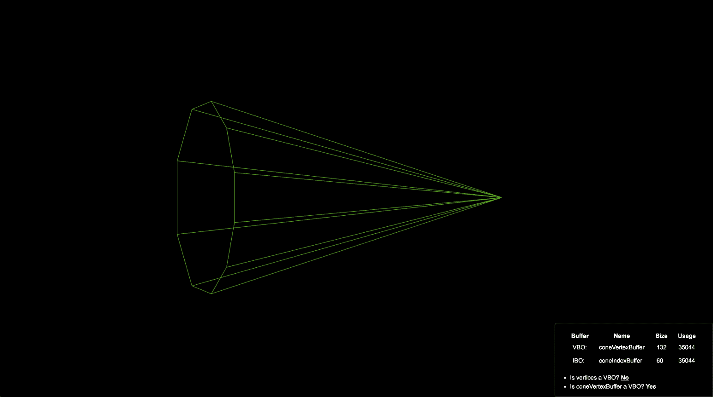

1.  在你的编辑器中打开`ch02_05_state-machine.html`，并滚动到`initBuffers`方法：

```js
function initBuffers() {
  const vertices = [
    1.5, 0, 0,
    -1.5, 1, 0,
    -1.5, 0.809017, 0.587785,
    -1.5, 0.309017, 0.951057,
    -1.5, -0.309017, 0.951057,
    -1.5, -0.809017, 0.587785,
    -1.5, -1, 0,
    -1.5, -0.809017, -0.587785,
    -1.5, -0.309017, -0.951057,
    -1.5, 0.309017, -0.951057,
    -1.5, 0.809017, -0.587785
  ];

  indices = [
    0, 1, 2,
    0, 2, 3,
    0, 3, 4,
    0, 4, 5,
    0, 5, 6,
    0, 6, 7,
    0, 7, 8,
    0, 8, 9,
    0, 9, 10,
    0, 10, 1
  ];

  // Create VAO
  coneVAO = gl.createVertexArray();

  // Bind VAO
  gl.bindVertexArray(coneVAO);

  const coneVertexBuffer = gl.createBuffer();
  gl.bindBuffer(gl.ARRAY_BUFFER, coneVertexBuffer);
  gl.bufferData(gl.ARRAY_BUFFER, new Float32Array(vertices), 
   gl.STATIC_DRAW);

  // Configure instructions
  gl.vertexAttribPointer(program.aVertexPosition, 3, gl.FLOAT, 
   false, 0, 0);
  gl.enableVertexAttribArray(program.aVertexPosition);

  coneIndexBuffer = gl.createBuffer();
  gl.bindBuffer(gl.ELEMENT_ARRAY_BUFFER, coneIndexBuffer);
  gl.bufferData(gl.ELEMENT_ARRAY_BUFFER, new Uint16Array(indices), 
   gl.STATIC_DRAW);

  // Set the global variables based on the parameter type
  if (coneVertexBuffer === 
    gl.getParameter(gl.ARRAY_BUFFER_BINDING)) {
    vboName = 'coneVertexBuffer';
  }
  if (coneIndexBuffer === 
    gl.getParameter(gl.ELEMENT_ARRAY_BUFFER_BINDING)) {
    iboName = 'coneIndexBuffer';
  }

  vboSize = gl.getBufferParameter(gl.ARRAY_BUFFER, gl.BUFFER_SIZE);
  vboUsage = gl.getBufferParameter(gl.ARRAY_BUFFER, 
   gl.BUFFER_USAGE);

  iboSize = gl.getBufferParameter(gl.ELEMENT_ARRAY_BUFFER, 
   gl.BUFFER_SIZE);
  iboUsage = gl.getBufferParameter(gl.ELEMENT_ARRAY_BUFFER, 
   gl.BUFFER_USAGE);

  try {
    isVerticesVbo = gl.isBuffer(vertices);
  }
  catch (e) {
    isVerticesVbo = false;
  }

  isConeVertexBufferVbo = gl.isBuffer(coneVertexBuffer);

  // Clean
  gl.bindVertexArray(null);
  gl.bindBuffer(gl.ARRAY_BUFFER, null);
  gl.bindBuffer(gl.ELEMENT_ARRAY_BUFFER, null);
}
```

1.  注意我们如何使用本节中讨论的方法来检索和显示缓冲区当前状态的信息。

1.  当我们使用`updateInfo`时，`initBuffers`函数查询的信息显示在网页的设置部分。

1.  在网页的设置部分，你会看到以下结果：

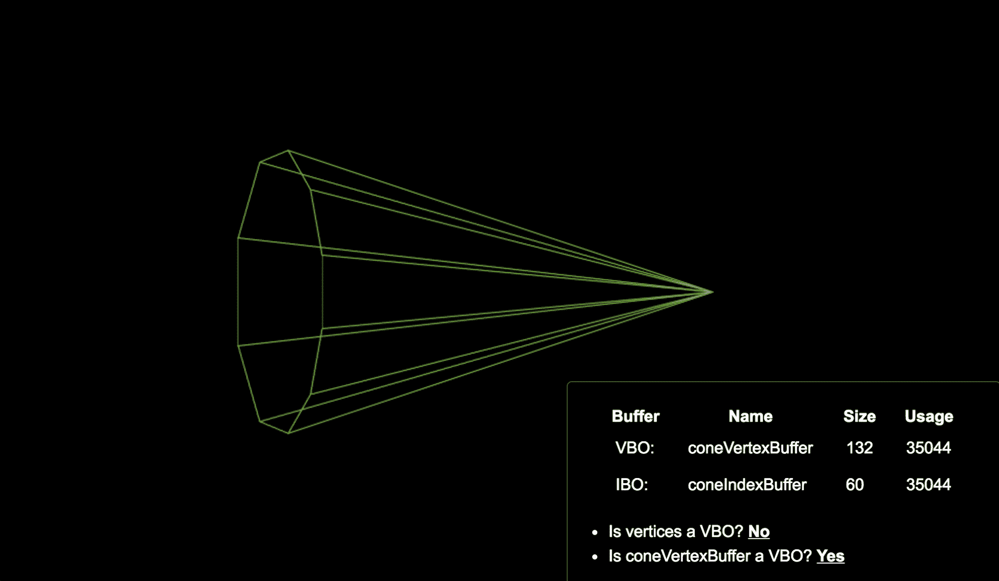

1.  复制以下行，`gl.bindBuffer(gl.ARRAY_BUFFER, null);`，并将其粘贴到`initBuffers`函数中以下行之前：`coneIndexBuffer = gl.createBuffer();`。

1.  当你在浏览器中再次打开页面时会发生什么？

1.  你认为这种行为为什么会发生？

***究竟发生了什么？***

你已经了解到，当前绑定的缓冲区是 WebGL 中的一个状态变量。缓冲区绑定直到你通过再次调用 `bindBuffer` 并将相应的类型（`ARRAY_BUFFER` 或 `ELEMENT_ARRAY_BUFFER`）作为第一个参数，以及 `null` 作为第二个参数（即没有要绑定的缓冲区）来解绑它。你也已经了解到，你只能查询当前绑定的缓冲区的状态。因此，如果你想查询不同的缓冲区，你需要先绑定它。

# 尝试一下：添加一个验证

修改文件，以便你可以验证并显示在屏幕上索引数组和 `coneIndexBuffer` 是否是 WebGL 缓冲区。

**提示**

为了显示值，你将不得不修改 HTML 体内的表格，并相应地修改 `updateInfo` 函数。

# 高级几何加载技术

到目前为止，我们渲染了非常简单的对象。现在，让我们研究如何从文件中加载几何形状（顶点和索引）而不是每次调用 `initBuffers` 时都声明顶点和索引。为此，我们将使用 AJAX 对网络服务器进行异步调用。我们将从网络服务器检索包含我们几何形状的文件，然后使用内置的 JSON 解析器将文件的上下文转换为 JavaScript 对象。在我们的例子中，这些对象将是顶点和索引数组。

# JavaScript 对象表示法（JSON）简介

**JSON** 代表 **JavaScript 对象表示法**。它是一种轻量级、基于文本的开放格式，用于数据交换。JSON 通常用作 XML 的替代品。

JSON 的强大之处在于它是语言无关的。这意味着有许多语言的解析器可以读取和解释 JSON 对象。此外，JSON 是 JavaScript 对象字面量表示法的子集。因此，我们可以使用 JSON 定义 JavaScript 对象。

# 定义基于 JSON 的 3D 模型

例如，假设我们有一个包含两个数组：顶点 `vertices` 和索引 `indices` 的 `model` 对象。假设这些数组包含圆锥示例（`ch02_06_cone.html`）中描述的信息，如下所示：

```js
function initBuffers() {
  const vertices = [
    1.5, 0, 0,
    -1.5, 1, 0,
    -1.5, 0.809017, 0.587785,
    -1.5, 0.309017, 0.951057,
    -1.5, -0.309017, 0.951057,
    -1.5, -0.809017, 0.587785,
    -1.5, -1, 0,
    -1.5, -0.809017, -0.587785,
    -1.5, -0.309017, -0.951057,
    -1.5, 0.309017, -0.951057,
    -1.5, 0.809017, -0.587785
  ];

  indices = [
    0, 1, 2,
    0, 2, 3,
    0, 3, 4,
    0, 4, 5,
    0, 5, 6,
    0, 6, 7,
    0, 7, 8,
    0, 8, 9,
    0, 9, 10,
    0, 10, 1
  ];

  // ...
}
```

根据 JSON 语法，我们会将这些两个数组表示为一个对象，如下所示：

```js
{
  "vertices": [
    1.5, 0, 0,
    -1.5, 1, 0,
    -1.5, 0.809017, 0.587785,
    -1.5, 0.309017, 0.951057,
    -1.5, -0.309017, 0.951057,
    -1.5, -0.809017, 0.587785,
    -1.5, -1, 0,
    -1.5, -0.809017, -0.587785,
    -1.5, -0.309017, -0.951057,
    -1.5, 0.309017, -0.951057,
    -1.5, 0.809017, -0.587785
  ],
  "indices": [
    0, 1, 2,
    0, 2, 3,
    0, 3, 4,
    0, 4, 5,
    0, 5, 6,
    0, 6, 7,
    0, 7, 8,
    0, 8, 9,
    0, 9, 10,
    0, 10, 1
  ]
}
```

基于此示例，我们可以推断出以下语法规则：

+   JSON 对象的范围由大括号 (`{}`) 定义。

+   JSON 对象中的属性由逗号 (`,` ) 分隔。

+   最后一个属性后没有逗号。

+   JSON 对象的每个属性由两部分组成：一个 **键** 和一个 **值**。

+   属性的名称用引号 (`""`) 括起来。

+   每个属性键与其对应的值之间用冒号 (`:`) 分隔。

+   数组的属性定义方式与你在 JavaScript 中定义它们的方式相同。

# 行动时间：编码和解码 JSON

大多数现代网络浏览器支持原生的 JSON 编码和解码。让我们来看看这个对象内部可用的方法：

| **方法** | **描述** |
| --- | --- |
| `JSON.stringify(object)` | 我们使用 `JSON.stringify` 将 JavaScript 对象转换为 JSON 格式的文本。 |
| `JSON.parse(string)` | 我们使用 `JSON.parse` 将文本转换为 JavaScript 对象。 |

让我们通过创建一个简单的模型——一个 3D 线——来学习如何使用 JSON 符号进行编码和解码。在这里，我们将关注我们如何进行 JSON 编码和解码。按照以下步骤进行：

1.  在您的浏览器中打开交互式 JavaScript 控制台。使用以下表格进行帮助：

| **浏览器** | **快捷键（PC/Mac）** |
| --- | --- |
| Firefox | *Ctrl *+ *Shift *+* K*/*Command *+* Alt *+* K* |
| Safari | *Ctrl *+* Shift *+* C*/*Command *+* Alt *+* C* |
| Chrome | *Ctrl *+* Shift *+* J*/*Command *+* Alt* +* J* |

1.  通过输入以下内容创建一个 JSON 对象：

```js
const model = { vertices: [0, 0, 0, 1, 1, 1], indices: [0, 1] };
```

1.  通过编写以下内容来验证模型是否为对象：

```js
typeof(model); // outputs "object"
```

JavaScript 类型检查

由于 JavaScript 中的许多东西都是 *对象*，建议你在类型检查上更加严谨。我们在这里仅使用 `typeof` 进行演示。此外，还有许多实用库，如 Lodash ([`lodash.com`](https://lodash.com/))，它扩展了 JavaScript 功能，提供了这些操作以及更多。

1.  让我们打印模型属性。在控制台中输入以下内容（每行输入后按 *Enter*）：

```js
model.vertices // outputs the vertices
model.indices // outputs the indices
```

1.  让我们创建一个 JSON 文本：

```js
const text = JSON.stringify(model);
alert(text);
```

1.  当你输入 `text.vertices` 时会发生什么？

1.  如您所见，您会收到一条消息，表明 `text.vertices` 是 `undefined`。这是因为文本不是一个 JavaScript 对象，而是一个按照 JSON 符号编写的 `string`，用来描述一个 `object`。它里面的所有内容都是文本，因此它没有任何字段。

1.  让我们将 JSON 文本转换回对象。输入以下内容：

```js
const model2 = JSON.parse(text);
typeof(model2); // outputs "object"
model2.vertices; // outputs vertices
```

***刚才发生了什么？***

我们已经学会了如何编码和解码 JSON 对象。这些练习是相关的，因为我们将使用相同的过程来定义从外部文件加载的几何形状。在下一节中，我们将看到如何从网络服务器下载用 JSON 指定的几何模型。

# 使用 AJAX 进行异步加载

以下图表总结了网页浏览器使用 AJAX 异步加载文件的过程：

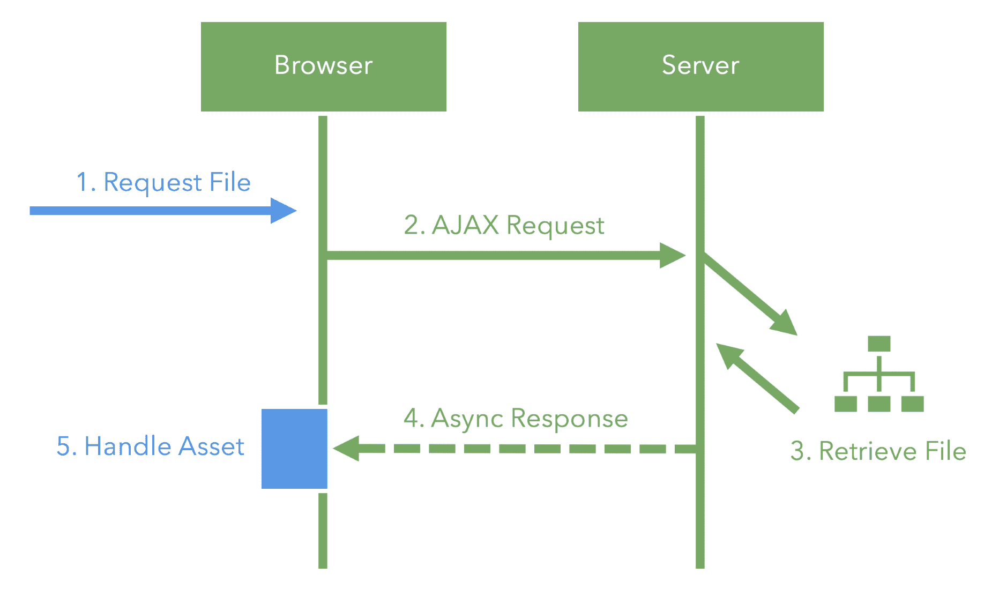

让我们更仔细地分析一下：

+   **请求文件**：指示您想要加载的文件的路径。请记住，这个文件包含我们将从网络服务器加载的几何形状，而不是直接将 JavaScript 数组（顶点和索引）编码到网页中。

+   **AJAX 请求**：我们需要编写一个执行 AJAX 请求的函数。让我们称这个函数为 `load`。代码如下：

```js
// Given a path to a file, load the assets asynchronously
function load(filePath) {
  // We return the promise so that, if needed, you can know when 
  // `load` has resolved
  return fetch(filePath)
  // Convert to a valid json
  .then(res => res.json())
  // Handle the parsed JSON data
  .then(data => {
    // Handle data
  })
  .catch(error => {
    // Handle error
  });
}
```

使用 Fetch 的 AJAX 请求我们正在利用现代浏览器提供的 AJAX API，即 `fetch`，来获取资源。它基于 **Promise** 的实现非常方便。要了解更多关于 `fetch` 的信息，请访问 [`developer.mozilla.org/en-US/docs/Web/API/Fetch_API`](https://developer.mozilla.org/en-US/docs/Web/API/Fetch_API)。

目前，让我们假设这个函数将执行 AJAX 请求。

+   **检索文件**：网络服务器将接收并处理我们的请求作为一个常规 HTTP 请求。实际上，服务器并不知道这个请求是**异步的**（对于浏览器来说它是异步的，因为它不会等待答案）。服务器将寻找我们的文件并生成一个响应，无论它是否找到请求。

+   **异步响应**：一旦将响应发送到浏览器，`fetch` Promise 就会解决，并调用提供的回调。这个回调对应于`then`请求方法。如果请求成功，我们调用`then`回调；如果失败，我们调用`catch`回调。

+   **处理加载的模型**：在数据接收并解析后，我们为从服务器检索的文件附加一个新的回调来处理。请注意，在前面的代码段中，我们使用了基于 Promise 的 JSON 解析器在传递给下一个函数之前将文件转换为 JavaScript 对象。`load`函数的代码如下：

```js
// Given a path to a file, load the assets asynchronously
function load(filePath) {
  // We return the promise so that, if needed, you can know when
  // `load` has resolved
  return fetch(filePath)
  // Convert to a valid json
  .then(res => res.json())
  // Handle the parsed JSON data
  .then(data => {
    model = data;

    // Create VAO
    vao = gl.createVertexArray();

    // Bind VAO
    gl.bindVertexArray(coneVAO);

    const modelVertexBuffer = gl.createBuffer();
    gl.bindBuffer(gl.ARRAY_BUFFER, modelVertexBuffer);
    gl.bufferData(gl.ARRAY_BUFFER, new 
     Float32Array(model.vertices), gl.STATIC_DRAW);

    // Configure instructions
    gl.enableVertexAttribArray(program.aVertexPosition);
    gl.vertexAttribPointer(program.aVertexPosition, 3, gl.FLOAT, 
     false, 0, 0);

    modelIndexBuffer = gl.createBuffer();
    gl.bindBuffer(gl.ELEMENT_ARRAY_BUFFER, modelIndexBuffer);
    gl.bufferData(gl.ELEMENT_ARRAY_BUFFER, new 
     Uint16Array(model.indices), gl.STATIC_DRAW);

    // Clean
    gl.bindVertexArray(null);
    gl.bindBuffer(gl.ARRAY_BUFFER, null);
    gl.bindBuffer(gl.ELEMENT_ARRAY_BUFFER, null);
  })
  // Display into the console if there are any errors
  .catch(console.error);
}
```

如果您仔细观察，您会发现这个函数与我们之前看到的一个函数非常相似：`initBuffers`函数。这是合理的，因为我们不能在从服务器检索几何数据之前初始化缓冲区。就像`initBuffers`一样，我们配置我们的 VAO、VBO 和 IBO，并将我们的模型对象中包含的信息传递给它们。

# 设置网络服务器

现在我们从服务器获取资源，我们需要通过服务器来提供服务。如果您没有网络服务器，我们建议您从以下选项中安装一个轻量级网络服务器：

+   **Serve：**[`github.com/zeit/serve`](https://github.com/zeit/serve)

+   **Lighttpd：**[`www.lighttpd.net`](http://www.lighttpd.net/)

+   **Python 服务器：**[`developer.mozilla.org/en-US/docs/Learn/Common_questions/set_up_a_local_testing_server`](https://developer.mozilla.org/en-US/docs/Learn/Common_questions/set_up_a_local_testing_server)

主机示例尽管任何网络服务器都可以提供这些示例，但`serve`提供了简单性和强大的功能。话虽如此，请确保您从示例目录的根目录运行您的服务器，因为`common`目录是跨章节的共享依赖项。

# 解决网络服务器需求的问题

如果您使用 Firefox 并且不想安装网络服务器，您可以在`about:config`中将`strict_origin_policy`更改为 false。

如果您使用 Chrome 并且不想安装网络服务器，请确保您从命令行使用以下修饰符运行它：

```js
--allow-file-access-from-files 
```

让我们使用 AJAX 和 JSON 从我们的网络服务器加载一个圆锥体。

# 动手时间：使用 AJAX 加载圆锥体

按照以下步骤操作：

1.  确保您的网络服务器正在运行，并使用您的网络服务器访问`ch02_07_ajax-cone.html`文件。

网络服务器地址

如果你知道你正在使用网络服务器，地址栏中的 URL 以 `localhost/` 或 `127.0.0.1/` 开头而不是 `file://`，那么你就知道了。

1.  包含本章代码的文件夹应该看起来像这样：

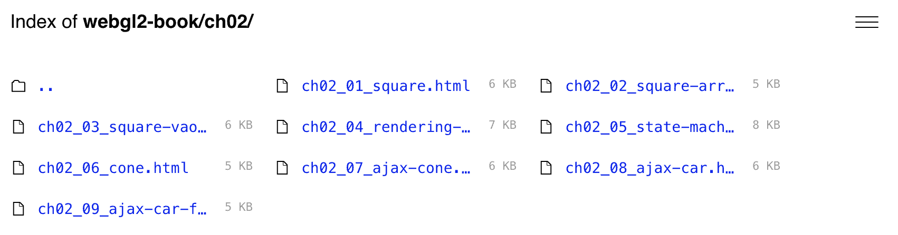

1.  点击 `ch02_07_ajax-cone.html`。

1.  示例将在你的浏览器中加载，你会看到类似这样的：

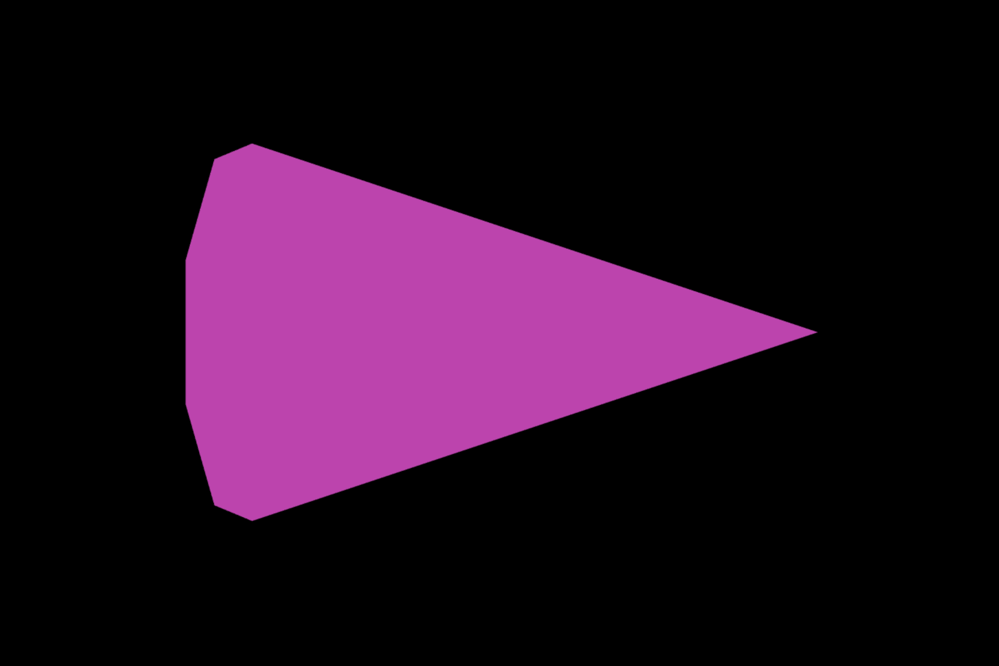

1.  请审查 `load` 函数以更好地理解 AJAX 和 JSON 在应用程序中的使用。

1.  全局 `model` 变量是如何使用的？ *(检查源代码。)*

1.  检查当你更改 `common/models/geometries/cone.json` 文件中的颜色并重新加载页面时会发生什么。

1.  修改 `common/models/geometries/cone.json` 文件中圆锥的坐标并重新加载页面。在这里，你可以验证 WebGL 是否从文件中读取和渲染坐标。如果你在文件中修改它们，屏幕上的几何形状将更新。

***刚才发生了什么？***

你学习了如何使用 AJAX 和 JSON 从远程位置（网络服务器）加载几何形状，而不是在网页内部指定这些几何形状（使用 JavaScript 数组）。

# 尝试加载一辆日产 GTR

按照以下步骤操作：

1.  使用您的网络服务器打开 `ch02_08_ajax-car.html` 文件。

1.  你应该会看到类似这样的：

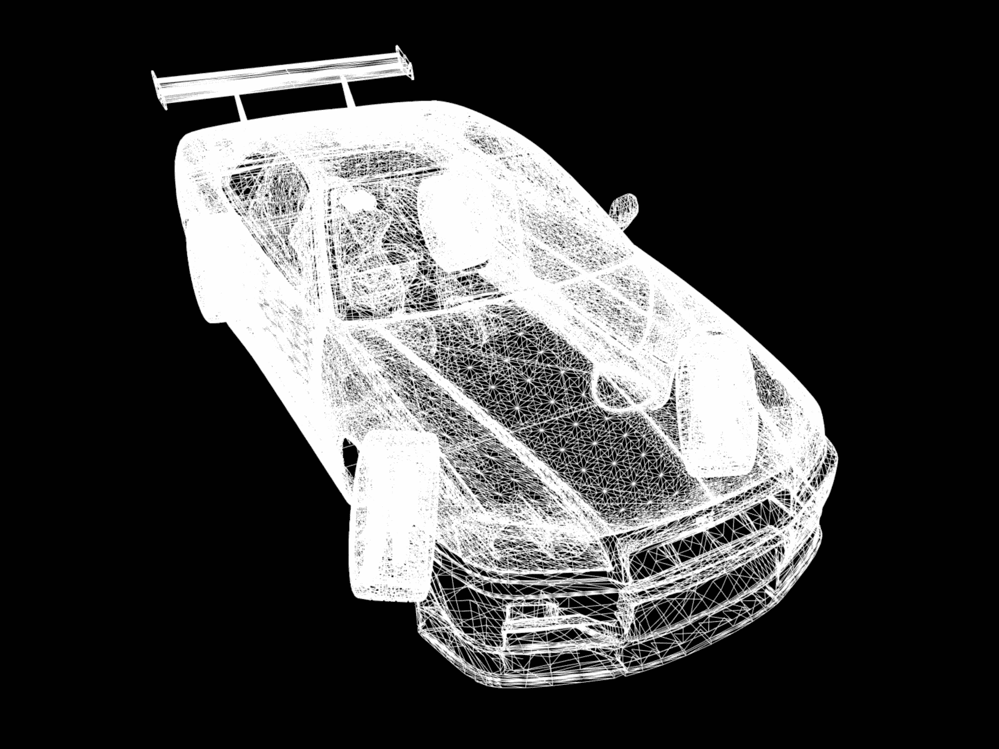

1.  我们选择 `LINES` 模型而不是 `TRIANGLES` 模型的原因是易于可视化汽车的结构。

1.  找到选择渲染模式的行，并确保你理解代码的作用。

1.  前往 `draw` 函数。

1.  在 `drawElements` 指令中，将模式从 `gl.LINES` 更改为 `gl.TRIANGLES`。

1.  在网络浏览器中刷新页面。

1.  你看到了什么？你能猜出为什么视觉效果不同吗？你的推理是什么？

灯光

照明帮助我们更清晰地可视化复杂几何形状。没有灯光，我们所有的体积看起来都是不透明的，当从 `LINES` 切换到 `TRIANGLES` 时，很难区分它们的各个部分。

# 架构更新

让我们介绍一些有用的函数，我们可以重构它们以在后续章节中使用：

1.  在你的编辑器中打开 `common/js/utils.js`，查看以下更改。

1.  我们在 `utils.js` 中添加了两个额外的函数，`autoResizeCanvas` 和 `getShader`，它们看起来与我们本章早期实现的代码非常相似：

```js
'use strict';

// A set of utility functions for /common operations across our 
// application
const utils = {

  // Find and return a DOM element given an ID
  getCanvas(id) {
    // ...
  },

  // Given a canvas element, return the WebGL2 context
  getGLContext(canvas) {
    // ...
  },

  // Given a canvas element, expand it to the size of the window
  // and ensure that it automatically resizes as the window changes
  autoResizeCanvas(canvas) {
    const expandFullScreen = () => {
      canvas.width = window.innerWidth;
      canvas.height = window.innerHeight;
    };
    expandFullScreen();
    window.addEventListener('resize', expandFullScreen);
  },

  // Given a WebGL context and an id for a shader script,
  // return a compiled shader
  getShader(gl, id) {
    const script = document.getElementById(id);
    if (!script) {
      return null;
    }

    const shaderString = script.text.trim();

    let shader;
    if (script.type === 'x-shader/x-vertex') {
      shader = gl.createShader(gl.VERTEX_SHADER);
    }
    else if (script.type === 'x-shader/x-fragment') {
      shader = gl.createShader(gl.FRAGMENT_SHADER);
    }
    else {
      return null;
    }

    gl.shaderSource(shader, shaderString);
    gl.compileShader(shader);

    if (!gl.getShaderParameter(shader, gl.COMPILE_STATUS)) {
      console.error(gl.getShaderInfoLog(shader));
      return null;
    }

    return shader;
  }

};
```

1.  `autoResizeCanvas` 方法接受一个 `canvas` 元素，并通过监听浏览器调整大小事件动态调整其大小以全屏显示。

1.  `getShader` 函数接受一个 `gl` 实例和一个 `id` 脚本来编译并返回着色器源代码。内部，`getShader` 读取脚本的源代码并将其存储在局部变量中。然后，它通过使用 WebGL 的 `createShader` 函数创建一个新的着色器。之后，它将源代码添加到其中使用 `shaderSource` 函数。最后，它将尝试使用 `compileShader` 函数编译着色器。

1.  在您的编辑器中打开 `ch02_09_ajax-car-final.html` 以查看以下更改。

1.  滚动到 `init` 函数，那里进行了必要的修改以使用 `utils.autoResizeCanvas` 方法：

```js
function init() {
  const canvas = utils.getCanvas('webgl-canvas');
 // Handle automatic resizing
 utils.autoResizeCanvas(canvas);

  // Retrieve a valid WebGL2 context
  gl = utils.getGLContext(canvas);
  gl.clearColor(0, 0, 0, 1);
  gl.enable(gl.DEPTH_TEST);

  initProgram();
  // We are no longer blocking the render until `load` has 
  // resolved, as we're not returning a Promise.
  load();
  render();
}
```

1.  滚动到 `ch02_09_ajax-car-final.html` 文件中的 `initProgram` 函数，那里进行了必要的修改以使用 `utils.getShader` 方法：

```js
function initProgram() {
 // Retrieve shaders based on the shader script IDs
  const vertexShader = utils.getShader(gl, 'vertex-shader');
  const fragmentShader = utils.getShader(gl, 'fragment-shader');

  program = gl.createProgram();
  gl.attachShader(program, vertexShader);
  gl.attachShader(program, fragmentShader);
  gl.linkProgram(program);

  if (!gl.getProgramParameter(program, gl.LINK_STATUS)) {
    console.error('Could not initialize shaders');
  }

  gl.useProgram(program);

  program.aVertexPosition = gl.getAttribLocation(program, 
   'aVertexPosition');
  program.uProjectionMatrix = gl.getUniformLocation(program, 
   'uProjectionMatrix');
  program.uModelViewMatrix = gl.getUniformLocation(program, 
   'uModelViewMatrix');
}
```

1.  在浏览器中打开 `ch02_09_ajax-car-final.html` 以查看这些更改的效果。

# 摘要

让我们总结一下本章所学的内容：

+   WebGL API 本身只是一个光栅化器，从概念上讲相当简单。

+   WebGL 的渲染管线描述了如何使用 WebGL 缓冲区，并将它们以属性的形式传递给顶点着色器进行处理。顶点着色器在 GPU 中并行化顶点处理。顶点定义了将要渲染的几何体的表面。表面上的每个元素都称为片段。这些片段由片段着色器处理。

+   片段处理也在 GPU 中并行进行。当所有片段都处理完毕后，帧缓冲区，一个二维数组，包含随后在屏幕上显示的图像。

+   WebGL 实际上是一个相当简单的 API。它的任务是执行两个用户提供的函数，一个顶点着色器和片段着色器，并绘制三角形、线条或点。虽然进行 3D 操作可能会更复杂，但这种复杂性是由程序员通过更复杂的着色器添加的。

+   WebGL 渲染几何体的详细过程。请记住，有两种 WebGL 缓冲区用于处理几何渲染：VBOs 和 IBOs*.*

+   WebGL 作为一个状态机工作。因此，指向缓冲区的属性是可用的，它们的值取决于当前绑定的缓冲区。

+   JSON 和 AJAX 是两种与 WebGL 集成良好的 JavaScript 技术，使我们能够加载大型和复杂的资源。

在下一章中，我们将学习更多关于着色器的内容，并使用它们通过在 WebGL JavaScript API 和属性、统一变量以及插值变量之间传递信息来实现 WebGL 场景中的光源。
