# 光源

在上一章中，我们介绍了 WebGL 的渲染管线，定义了几何形状，将数据传递给 GPU，绘制类型，并利用 AJAX 异步加载外部资源。虽然我们简要介绍了着色器及其在创建 WebGL 应用中的作用，但我们将在本章中更详细地介绍，并利用顶点和片段着色器为我们的场景创建光照模型。

着色器允许我们定义一个数学模型，该模型控制我们的场景如何被照明。为了学习如何实现着色器，我们将研究不同的算法，并查看它们的示例应用。对线性代数的基本了解将非常有用，可以帮助你理解本章的内容。我们将使用一个 JavaScript 库来处理大多数的向量和矩阵运算，因此你不需要担心数学运算。尽管如此，你的整体成功取决于对我们将要讨论的线性代数运算的强大概念理解。

在本章中，我们将：

+   了解光源、法线和材质。

+   学习着色与光照之间的区别。

+   使用 Goraud 和 Phong 着色方法。

+   使用 Lambertian 和 Phong 光照模型。

+   定义和使用统一变量、属性和变量。

+   使用 ESSL，WebGL 的着色语言。

+   讨论与着色器相关的相关 WebGL API 方法。

+   继续分析 WebGL 作为状态机，并描述与着色器相关的可设置和从状态机检索的属性。

# 光源、法线和材质

在现实世界中，我们看到物体是因为它们反射光线。物体的照明取决于其相对于光源的位置、表面朝向以及其材料组成。在本章中，我们将学习如何在 WebGL 中结合这三个元素来模拟不同的照明方案：

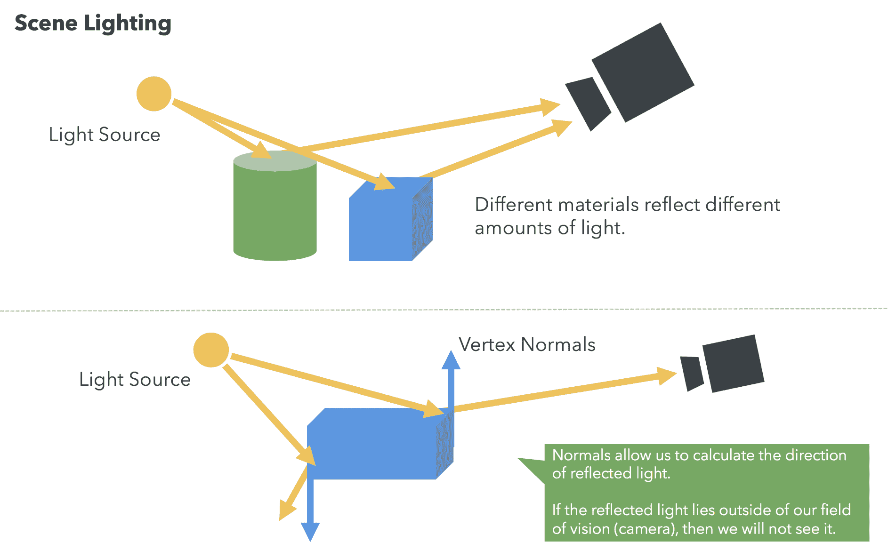

# 位置光源与方向光源的比较

光源可以是**位置**的或**方向的**。当光源的位置会影响场景的照明时，称为位置光源。例如，房间内的灯是一个位置光源。远离灯的物体将接收到很少的光线，甚至可能看起来模糊。相比之下，方向光是指无论其位置如何都会产生相同发光效果的光。例如，太阳光将照亮地面场景中的所有物体，无论它们与太阳的距离如何。这是因为太阳非常遥远，当光线与物体的表面相交时，所有光线都被认为是平行的。方向光照假设光线从同一方向均匀地照射过来：

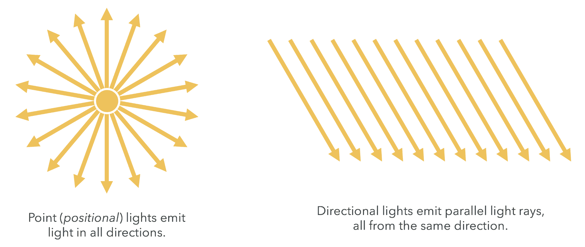

**位置光线**通过空间中的一个点来建模，而**方向光线**则通过表示其方向的向量来建模。出于简化数学运算的目的，通常使用归一化向量，因为这样可以简化数学运算。此外，计算方向光通常比计算位置光更简单，计算成本也更低。

# 法线

**法线**是与我们要照亮的表面垂直的向量。法线代表表面的方向，因此对于模拟光源与物体之间的相互作用至关重要。鉴于每个顶点都有一个相关的法线向量，我们可以使用叉积来计算法线。

**叉积**根据定义，向量`A`和`B`的叉积将是一个垂直于向量`A`和`B`的向量。

让我们分解一下。如果我们有一个由顶点`p0`、`p1`和`p2`构成的三角形，我们可以定义`v1`向量为`p1 - p0`，`v2`向量为`p2 - p0`。然后，通过计算`v1 x v2`的叉积来获得法线。从图形上看，这个过程类似于以下内容：

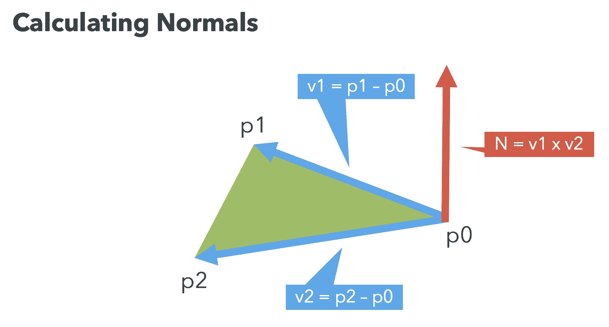

然后，我们对每个三角形上的每个顶点重复相同的计算。但是，对于被多个三角形共享的顶点怎么办？每个共享顶点的法线将接收每个出现该顶点的三角形的一个贡献。

例如，假设`p1`顶点被`#1`和`#2`三角形共享，并且我们已经计算了`#1`三角形顶点的法线。然后，我们需要通过将`#2`三角形上`p1`的法线计算结果相加来更新`p1`的法线。这是一个**向量求和**。从图形上看，这类似于以下内容：

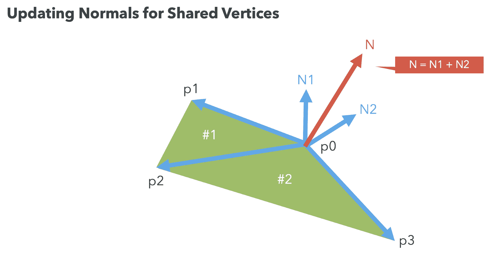

与光线类似，法线通常被归一化以简化数学运算。

# 材质

在 WebGL 中，可以通过包括颜色和纹理在内的多个参数来模拟物体的材质。材质颜色通常在 RGB（红色、绿色、蓝色）空间中建模为三元组。另一方面，纹理对应于映射到物体表面的图像。这个过程通常被称为**纹理映射**。我们将在后面的章节中介绍纹理映射。

# 在管线中使用光线、法线和材料

在第二章“渲染”中，我们讨论了 WebGL 缓冲区、属性和统一变量作为着色器的输入变量，以及变量用于在顶点着色器和片段着色器之间传递信息。现在让我们回顾一下管线，看看光线、法线和材料是如何融入其中的：

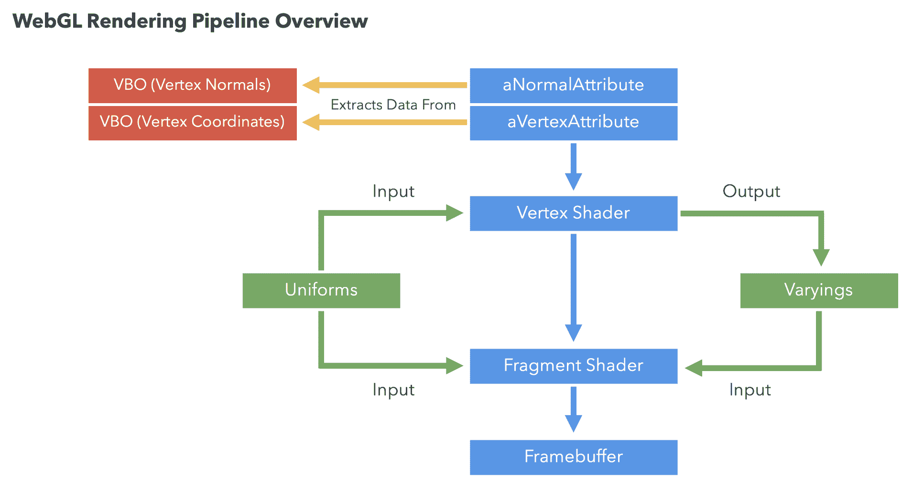

法线是在每个顶点的基础上定义的；因此，法线被建模为一个 VBO，并使用属性映射，如前图所示。请注意，属性不能直接传递给片段着色器。为了将信息从顶点着色器传递到片段着色器，我们必须使用插值变量。

灯光和材质作为统一变量传递。统一变量对顶点着色器和片段着色器都是可用的。这为我们计算光照模型提供了很大的灵活性，因为我们可以在顶点级别（顶点着色器）或片段级别（片段着色器）计算光的反射。

程序

记住，顶点着色器和片段着色器一起被称为**程序**。

# 并行性和属性与统一变量之间的区别

在属性和统一变量之间有一个重要的区别。当调用绘制命令（使用`drawArrays`或`drawElements`）时，GPU 将并行启动多个顶点着色器的副本。每个副本将接收一组不同的属性。这些属性是从映射到相应属性的 VBO 中抽取的。

另一方面，所有顶点着色器的副本都将接收相同的统一变量——这就是为什么叫统一变量的原因。换句话说，统一变量可以看作是每个绘制调用中的常量：

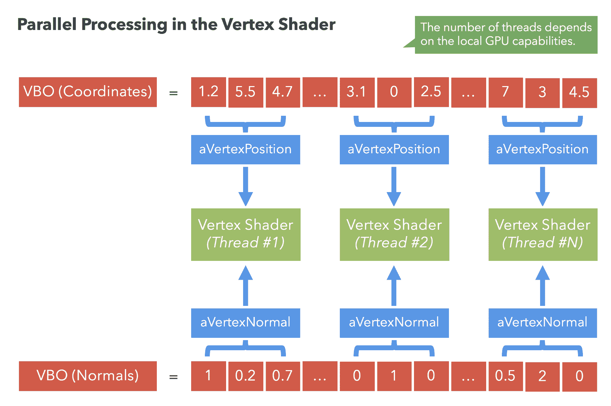

一旦将灯光、法线和材质传递给程序，下一步就是确定我们将实现哪些**着色**和**光照**模型。让我们来调查这涉及到什么。

# 着色方法和光反射模型

虽然术语**着色**和**光照**经常模糊地互换使用，但它们指的是两个不同的概念。

着色指的是为了获得场景中每个片段的最终颜色所执行的**插值**类型。稍后，我们将解释着色类型如何决定最终颜色是在顶点着色器还是片段着色器中计算。

一旦建立了着色模型，光照模型就决定了如何将法线、材质和灯光结合起来以产生最终的颜色。由于光照模型的方程使用了光的反射物理原理，因此光照模型也被称为**反射模型**。

# 着色/插值方法

在本节中，我们将分析两种基本的插值方法：**Goraud**和**Phong**着色。

# Goraud 插值

**Goraud**插值方法在**顶点着色器**中计算最终颜色。使用顶点法线执行此计算。然后，使用插值变量，将顶点的最终颜色传递到片段着色器。由于渲染管道提供的自动插值变量，每个片段将具有一个颜色，它是通过插值包围三角形的颜色来得到的。

插值变量

渲染管道中变元的插值是自动的。不需要编程。

# Phong 插值

**Phong**方法在**片段着色器**中计算最终颜色。为此，每个顶点法线通过一个变元从顶点着色器传递到片段着色器。由于管道中包含的变元的插值机制，每个片段将有自己的法线。然后，使用片段法线在片段着色器中计算最终颜色。

以下图表总结了两种插值模型：

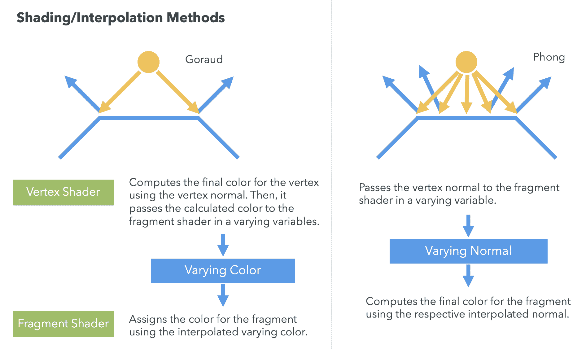

着色方法不指定每个片段的最终颜色是如何计算的。它只指定要使用的地方（顶点着色器或片段着色器）以及要使用的**插值类型**（顶点颜色或顶点法线）。

# Goraud 与 Phong 着色

我们现在明白，Goraud 着色在顶点着色器内部执行计算，并利用内置渲染管道的插值功能。另一方面，Phong 着色在片段着色器内部执行所有计算——也就是说，对每个片段（或像素）进行计算。考虑到这两个细节，你能猜出这两种着色技术的优势和劣势吗？

Goraud 着色被认为更快，因为执行的计算是按顶点计算的，而 Phong 着色是按片段计算的。性能上的速度确实是以准确或更逼真的插值为代价的。这在光线强度在两个顶点之间非线性衰减的情况下最为明显。在本章的后面部分，我们将更详细地介绍这两种技术。

# 光反射模型

正如我们之前提到的，光照模型与着色/插值模型是独立的。着色模型只决定最终颜色的计算位置。现在，我们来谈谈如何执行这些计算。

# 拉姆伯特反射模型

**拉姆伯特反射**在计算机图形学中常用作**漫反射**的模型，这种反射是入射光束在许多角度上反射，而不是像**镜面反射**那样只在**一个**角度上反射：

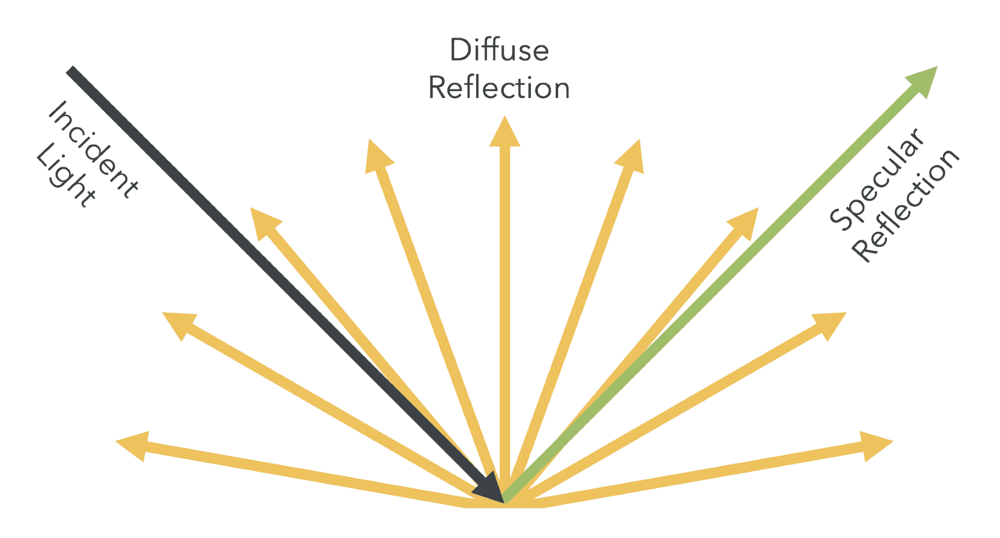

这个光照模型基于**余弦辐射定律**，或**拉姆伯特辐射定律**。它是以约翰·海因里希·拉姆伯特的名字命名的，他的著作《光度量学》于 1760 年出版。

拉姆伯特反射通常计算为表面法线（根据使用的插值方法，是顶点法线或片段法线）与光方向向量的负值的点积。然后，这个数值乘以材料和光源的颜色。

光方向向量光方向向量是从表面开始并结束在光源位置上的向量。它本质上是将光的位置映射到几何表面上的向量。

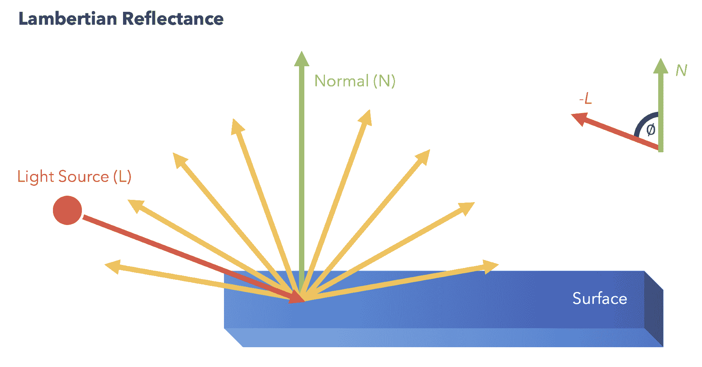

其中：

`` 是最终的漫反射颜色，`` 是光的漫反射颜色，`` 是材料的漫反射颜色。

也就是说，我们将使用以下方法推导出最终的漫反射颜色：

如果 `*L*` 和 `*N*` 是归一化的，那么：

# Phong 反射模型

Phong 反射模型描述了表面如何通过三种反射类型的总和来反射光：环境、漫反射和镜面反射。它是由 Bui Tuong Phong 开发的，他在 1973 年的博士论文中发表了它：

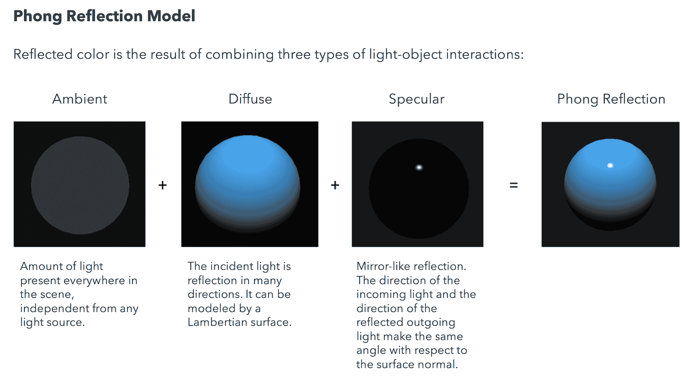

让我们逐个介绍这些概念。

# 环境

**环境**项考虑场景中存在的散射光。这个项与任何光源无关，并且对所有片段都是相同的。

# 漫反射

**漫反射**项对应于漫反射。通常使用朗伯模型（Lambertian model）来表示这一部分。

# 镜面

**镜面**项提供类似镜面的反射。从概念上讲，当我们在与反射光方向向量相等的角度观察物体时，镜面反射达到最大。

镜面项通过两个向量的点积来建模，即视点向量（eye vector）和反射光方向向量。视点向量从片段开始，终止于视图位置（相机）。反射光方向向量是通过在表面法线向量上反射光方向向量得到的。当这个点积等于 `1`（通过使用归一化向量）时，我们的相机将捕捉到最大的镜面反射。

点积随后被一个表示表面光泽度的数字指数化。之后，结果乘以光和材料的镜面反射分量：

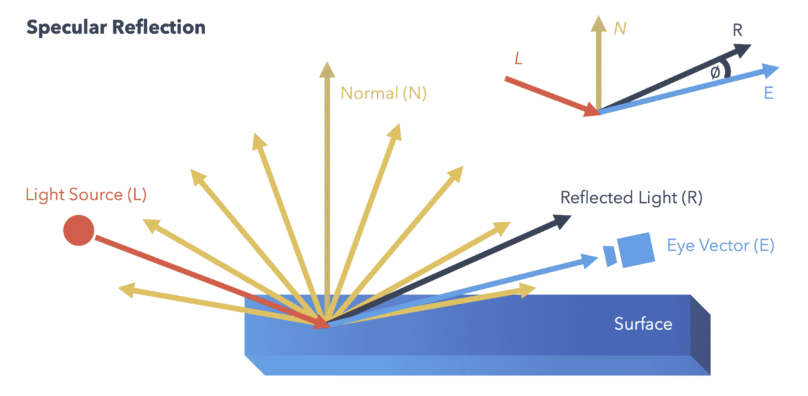

其中：

`` 是最终的镜面反射颜色，`` 是光的镜面反射颜色，`` 是材料的镜面反射颜色，*`n`* 是光泽度因子。

也就是说，我们将使用以下方法推导出最终的镜面反射颜色：

如果 `*R*` 和 `*E*` 是归一化的，那么：

重要的是要注意，当 `*R*` 和 `*E*` 方向相同时，镜面反射达到最大。

一旦我们有了环境、漫反射和镜面反射项，我们将它们相加以找到片段的最终颜色，这为我们提供了 Phong 反射模型。

现在，是时候学习一种语言了，它将使我们能够在顶点和片段着色器中实现着色和光照策略。这种语言被称为 ESSL。

# OpenGL ES 着色语言（ESSL）

OpenGL ES 着色语言（ESSL）是我们编写着色器所使用的语言。它的语法和语义与 C/C++ 非常相似。然而，它有类型和内置函数，使得操作向量和矩阵更加容易。在本节中，我们将介绍 ESSL 的基础知识，以便我们可以立即开始使用它。

GLSL 和 ESSL 开发者通常将 WebGL 中使用的着色语言称为 GLSL。然而，从技术上讲它是 ESSL。WebGL2 建立在 OpenGL ES 3.0 规范之上，因此使用 ESSL，它是 GLSL（OpenGL 的着色语言）的一个子集。

本节总结了官方 GLSL ES 规范。您可以在[`www.khronos.org/registry/OpenGL/specs/es/3.0/GLSL_ES_Specification_3.00.pdf`](https://www.khronos.org/registry/OpenGL/specs/es/3.0/GLSL_ES_Specification_3.00.pdf)找到完整的参考。

# 存储限定符

变量声明可以在类型之前指定存储限定符：

+   `attribute`: 从缓冲区中提取的数据，作为顶点着色器和 WebGL 应用程序之间用于每个顶点数据的链接。此存储限定符仅在顶点着色器内有效。

+   `uniform`: 值在处理的对象之间不改变。统一变量构成了着色器和 WebGL 应用程序之间的链接。统一变量在顶点着色器和片段着色器中都是合法的。如果一个统一变量由顶点着色器和片段着色器共享，相应的声明必须匹配。统一变量的值对于单个绘制调用中的所有顶点都是相同的。

+   `varying`: 这是顶点着色器和片段着色器之间用于插值数据的链接。根据定义，插值变量必须由顶点着色器和片段着色器共享。插值变量的声明需要在顶点着色器和片段着色器之间匹配。

+   `const`: 编译时常量，或只读的函数参数。它们可以在 ESSL 程序的代码中任何地方使用。

# 类型

这里是一个不完整的常见 ESSL 类型列表：

+   `void`: 用于不返回值的函数或空参数列表

+   `bool`: 一个条件类型，取值为真或假

+   `int`: 一个有符号整数

+   `float`: 一个单浮点标量

+   `vec2`: 一个两分量浮点向量

+   `vec3`: 一个三分量浮点向量

+   `vec4`: 一个四分量浮点向量

+   `bvec2`: 一个两分量布尔向量

+   `bvec3`: 一个三分量布尔向量

+   `bvec4`: 一个四分量布尔向量

+   `ivec2`: 一个两分量整数向量

+   `ivec3`: 一个三分量整数向量

+   `ivec4`: 一个四分量整数向量

+   `mat2`: 一个 2×2 浮点矩阵

+   `mat3`: 一个 3×3 浮点矩阵

+   `mat4`: 一个 4×4 浮点矩阵

+   `sampler2D`: 访问 2D 纹理的句柄

+   `sampler3D`: 访问 3D 纹理的句柄

+   `samplerCube`: 访问立方映射纹理的句柄

+   `struct`: 用于根据标准类型声明自定义数据结构

ESSL

OpenGL ES 3.0 着色语言提供了许多其他类型和功能。以下是一个有用的指南，涵盖了其许多核心功能：[`www.khronos.org/files/opengles3-quick-reference-card.pdf`](https://www.khronos.org/files/opengles3-quick-reference-card.pdf)。

输入变量将有一个限定符后跟一个类型。例如，我们将声明我们的 `uLightColor` 变量如下：

```js
uniform vec4 uLightColor;
```

这意味着 `uLightColor` 变量是一个具有四个分量的 `uniform` 向量。

GLSL 和 ESSL 命名约定规定我们在着色器变量前加上其类型的前缀。这使得着色器代码清晰易读。例如，对于一个给定的颜色均匀量，你会将变量命名为 `uLightColor`。对于一个位置变化量，`vNormal`。对于一个法线属性，`aVertexNormal`。

# 向量分量

我们可以通过其索引来引用 ESSL 向量的每个分量。例如，`uLightColor[3]` 将引用向量的第四个元素（基于零的向量）。然而，我们也可以通过字母来引用每个分量，如下表所示：

| `{ x, y, z, w }` | 当访问表示点或向量的向量时很有用。 |
| --- | --- |
| `{ r, g, b, a }` | 当访问表示颜色的向量时很有用。 |
| `{ s, t, p, q }` | 当访问表示纹理坐标的向量时很有用。 |

例如，如果我们想将 `uLightColor` 变量的 *alpha 通道*（第四个分量）设置为 `1.0`，我们可以通过以下任何一种格式来实现：

```js
uLightColor[3] = 1.0;
uLightColor.w = 1.0;
uLightColor.a = 1.0;
uLightColor.q = 1.0;
```

在所有这些情况下，我们都在引用相同的第四个分量。然而，鉴于 `uLightColor` 表示颜色，使用 `r`、`g`、`b`、`a` 表示法更为合理。

还可以使用向量分量表示法来引用向量内部的子集。例如（摘自 GLSL ES 规范）：

```js
vec4 v4;

v4.rgba;  // is a vec4 and the same as just using v4
v4.rgb;   // is a vec3
v4.b;     // is a float
v4.xy;    // is a vec2
v4.xgba;  // is illegal - the component names do not come from the same set
```

# 运算符和函数

GLSL 和 ESSL 的主要优势之一是强大的内置数学运算符。ESSL 提供了许多有用的运算符和函数，简化了向量和矩阵操作。根据规范，算术二元运算符（加`+`、减`-`、乘`*`、除`/`）作用于整数和浮点类型表达式，包括向量和矩阵。两个操作数必须是相同类型，或者一个是标量浮点数，另一个是浮点向量或矩阵，或者一个是标量整数，另一个是整数向量。此外，对于乘法`*`，一个可以是向量，另一个是与向量具有相同维度的矩阵。这些结果与它们操作的表达式具有相同的基本类型（整数或浮点）。如果一个操作数是标量，另一个是向量或矩阵，则标量逐分量应用于向量或矩阵，最终结果与向量或矩阵具有相同类型。需要注意的是，除以零不会引发异常，但会导致一个未指定的值。让我们看看这些操作的几个示例：

+   `-x`: `x`向量的负值。它产生与原向量方向完全相反的向量。

+   `x + y`: `x`和`y`向量的和。这两个向量需要具有相同数量的分量。

+   `x - y`: `x`和`y`向量的减法。这两个向量需要具有相同数量的分量。

+   `x * y`: 如果`x`和`y`都是向量，则此运算符产生逐元素乘法。应用于两个矩阵的乘法返回线性代数矩阵乘法，而不是逐元素乘法。

+   `matrixCompMult(matX, matY)`: 矩阵的逐元素乘法。它们需要具有相同的维度（`mat2`、`mat3`或`mat4`）。

+   `x / y`: 除法运算符的行为与乘法运算符类似。

+   `dot(x, y)`: 返回两个向量的点积（标量）。它们需要具有相同的维度。

+   `cross(vecX, vecY)`: 返回两个向量的叉积（向量）。它们都必须是`vec3`。

+   `normalize(x)`: 返回一个与原向量方向相同但长度为`1`的向量。

+   `reflect(t, n)`: 沿着`n`向量反射`t`向量。

着色器提供了许多其他函数，包括三角函数和指数函数。在开发不同的光照模型时，我们将根据需要引用它们。

让我们看看一个具有以下属性的场景的着色器 ESSL 代码的快速示例：

+   **高洛德着色法**：我们将插值顶点颜色以获得片段颜色。因此，我们需要一个`varying`来将顶点颜色信息从顶点着色器传递到片段着色器。

+   **朗伯反射模型**：我们考虑了单一光源与场景之间的漫反射交互。这意味着我们将使用统一变量来定义光属性，即材料属性。我们将遵循*朗伯辐射定律*来计算每个顶点的最终颜色。

首先，让我们分析一下属性、统一变量和可变变量将是什么。

# 顶点属性

我们将在顶点着色器中定义两个属性。每个顶点将具有以下代码：

```js
in vec3 aVertexPosition;
in vec3 aVertexNormal;
```

**属性**

记住，属性仅在顶点着色器内部可用。

如果你好奇为什么使用`in`而不是`attribute`限定符，我们将在稍后进行解释。在`in`关键字之后，我们找到变量的类型。在这种情况下，它是`vec3`，因为每个顶点位置由三个元素（`x`、`y`、`z`）确定。同样，法线也是由三个元素（`x`、`y`、`z`）确定的。请注意，位置是三维空间中的一个*点*，它告诉我们顶点的位置，而法线是一个*向量*，它提供了关于通过该顶点的表面的方向的信息。

# 统一变量

统一变量对顶点着色器和片段着色器都可用。虽然属性在每次顶点着色器被调用时都会有所不同，但统一变量在整个渲染周期内是恒定的——即在`drawArrays`或`drawElements` WebGL 调用期间。

并行处理

并行处理

我们可以使用统一变量来传递有关光源（如漫反射颜色和方向）和材料（漫反射颜色）的信息：

```js
uniform vec3 uLightDirection;  // incoming light source direction
uniform vec4 uLightDiffuse;    // light diffuse component
uniform vec4 uMaterialDiffuse; // material diffuse color
```

再次，`uniform`关键字告诉我们这些变量是统一变量，而`vec3`和`vec4` ESSL 类型告诉我们这些变量有三个或四个分量。对于颜色，这些分量是红色、蓝色、绿色和 alpha 通道（RGBA），而对于光方向，这些分量是定义光源在场景中指向的向量的`x`、`y`和`z`坐标。

# 可变变量

如前所述，可变变量允许顶点着色器将信息传递给片段着色器。例如，如果我们想将顶点颜色从顶点着色器传递到片段着色器，我们首先更新我们的顶点着色器：

```js
#version 300 es

out vec4 vVertexColor;

void main(void) {
  vVertexColor = vec4(1.0, 1.0, 1.0, 1.0);
}
```

我们将在片段着色器内部如下引用该可变变量：

```js
in vec4 vVertexColor;
```

请记住，*存储限定符*、可变变量的声明需要在顶点和片段着色器之间匹配。

# 输入和输出变量

这些关键词描述了*输入*和*输出*的方向。正如在*属性*和*可变*声明中看到的那样，当我们使用`in`时，该变量被提供给着色器。当我们使用`out`时，着色器暴露该变量。让我们看看这些关键词如何在 WebGL 的早期版本中的顶点和片段着色器中使用。

# 将属性更改为`in`

在 WebGL 1 使用 *ESSL 100* 中，你可能会有这样的代码：

```js
attribute vec4 aVertexPosition;
attribute vec3 aVertexNormal;
```

在 WebGL 2 使用 *ESSL 300* 中，这变成了以下内容：

```js
in vec4 aVertexPosition;
in vec3 aVertexNormal;
```

# 将插值变量改为输入/输出

在 WebGL 1 使用 *ESSL 100* 中，你需要在顶点着色器和片段着色器中声明一个插值变量，如下所示：

```js
varying vec4 vVertexPosition;
varying vec3 vVertexNormal;
```

在 WebGL 2 使用 *ESSL 300* 中，在顶点着色器中，插值变量变成了这样：

```js
out vec4 vVertexPosition;
out vec3 vVertexNormal;
```

在片段着色器中，它们变成了这样：

```js
in vec4 vVertexPosition;
in vec3 vVertexNormal;
```

现在，让我们将属性、统一变量和插值变量插入到代码中，看看顶点着色器和片段着色器是什么样的。

# 顶点着色器

让我们来看一个示例顶点着色器：

```js
#version 300 es

uniform mat4 uModelViewMatrix;
uniform mat4 uProjectionMatrix;
uniform mat4 uNormalMatrix;
uniform vec3 uLightDirection;
uniform vec3 uLightDiffuse;
uniform vec3 uMaterialDiffuse;

in vec3 aVertexPosition;
in vec3 aVertexNormal;

out vec4 vVertexColor;

void main(void) {
  vec3 normal = normalize(vec3(uNormalMatrix * vec4(aVertexNormal, 1.0)));

  vec3 lightDirection = normalize(uLightDirection);

  float LambertianTerm = dot(normal, -lightDirection);

  vVertexColor = vec4(uMaterialDiffuse * uLightDiffuse * LambertianTerm, 
   1.0);

  gl_Position = uProjectionMatrix * uModelViewMatrix * 
   vec4(aVertexPosition, 1.0);
}
```

初步检查后，我们可以识别出我们将使用的属性、统一变量和插值变量，以及我们稍后将要讨论的一些矩阵。我们还可以看到顶点着色器有一个 `main` 函数，它不接受参数，而是返回 `void`。在内部，我们可以看到一些 ESSL 函数，例如 `normalize` 和 `dot`，以及一些算术运算符。

`#version 300 es`

这行字符串必须是你的着色器的第一行。不允许在此之前有任何注释或空白行！`#version 300 es` 告诉 WebGL 你想要使用 WebGL 2 的着色器语言（GLSL ES 3.00）。如果它不是作为第一行编写的，着色器语言将默认为 WebGL 1.0 的 GLSL ES 1.00，它具有较少的功能。

还有三个我们尚未讨论的统一变量：

```js
uniform mat4 uModelViewMatrix;
uniform mat4 uProjectionMatrix;
uniform mat4 uNormalMatrix;
```

我们可以看到这三个统一变量是 `4x4` 矩阵。这些矩阵在顶点着色器中是必需的，用于计算移动相机时顶点和法线的位置。这里有几个涉及使用这些矩阵的操作：

```js
vec3 normal = normalize(vec3(uNormalMatrix * vec4(aVertexNormal, 1.0)));

```

上一行代码计算了 *变换后的法线*：

```js
gl_Position = uProjectionMatrix * uModelViewMatrix * vec4(aVertexPosition, 1.0);
```

这行代码计算了 *变换后的顶点位置*。`gl_Position` 是一个特殊的输出变量，用于存储变换后的顶点位置。

我们将在 第四章 中回到这些操作，*相机*。现在，我们应该承认这些统一变量和操作涉及相机和世界变换（旋转、缩放和平移）。

返回到主函数的代码，我们可以清楚地看到正在实现朗伯反射模型。通过将归一化法线和光方向向量的点积获得，然后乘以光和材料的漫反射分量。最后，将此结果传递到 `vVertexColor` 插值变量中，以便在片段着色器中使用，如下所示：

```js
vVertexColor = vec4(uMaterialDiffuse * uLightDiffuse * LambertianTerm, 1.0);
```

此外，由于我们在顶点着色器中计算颜色，然后自动对每个三角形的片段进行插值，我们使用了 Goraud 插值方法。

# 片段着色器

片段着色器非常简单。前三条线定义了着色器的精度。根据 ESSL 规范，这是强制性的。同样，对于顶点着色器，我们定义我们的输入；在这种情况下，只是一个插值变量，然后我们有主函数：

```js
#version 300 es

// Fragment shaders don't have a default precision so we need
// to pick one. mediump is a good default. It means "medium precision"
precision mediump float;

in vec4 vVertexColor;
// we need to declare an output for the fragment shader
out vec4 fragColor;

void main() {
  fragColor = vVertexColor;
}
```

我们只需要将 `vVertexColor` 插值变量赋值给 `fragColor` 输出变量。

不再需要 `gl_FragColor`

在 WebGL 1 中，你的片段着色器会将`gl_FragColor`特殊变量设置为计算着色器的输出：`gl_FragColor = vec4(1.0, 0.0, 0.0, 1.0);`。

在 WebGL 2 中，*ESSL 300* 强制你声明自己的输出变量，然后设置它。你可以选择任何你想要的名称，但名称不能以 `gl_` 开头。

记住，`vVertexColor`变化变量的值将不同于在顶点着色器中计算出的值，因为 WebGL 会通过取对应计算颜色周围的顶点颜色来插值它，以对应于相应的片段（像素）。

# 编写 ESSL 程序

现在，让我们花一点时间回顾一下整体情况。ESSL 允许我们实现一种照明策略，前提是我们定义了一种着色方法和一个光照反射模型。在本节中，我们将以球体作为我们想要照亮的对象，我们将看到照明策略的选择如何改变场景：

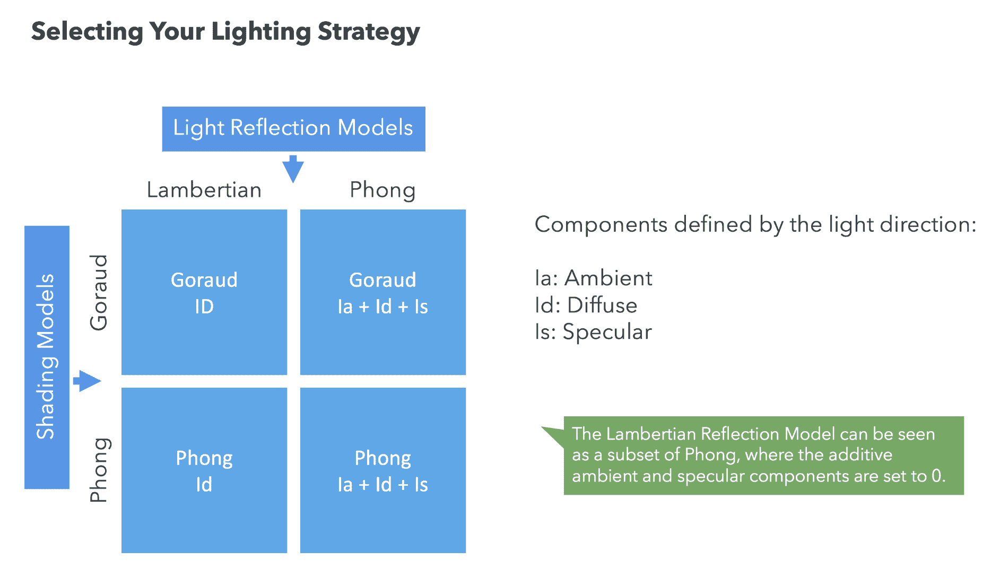

我们将看到两种 Goraud 插值场景：一个带有朗伯反射，另一个带有 Phong 反射。对于 Phong 插值，我们只会看到一个案例；在 Phong 着色下，朗伯反射模型与将环境光和镜面光分量设置为 `0` 的 Phong 反射模型没有区别。

# Goraud 着色与朗伯反射

朗伯反射模型只考虑漫反射材料和漫反射光属性之间的相互作用。简而言之，我们按照以下方式分配最终颜色：

```js
aVertexColor = Id;
```

以下值是可见的：

```js
Id = lightDiffuseProperty * materialDiffuseProperty * lambertCoefficient;
```

在 Goraud 着色下，**朗伯系数**是通过计算顶点法向量和光照方向向量的点积获得的。在找到点积之前，这两个向量都被归一化。

让我们看看提供的示例`ch03_01_goraud_lambert.html`中的顶点着色器和片段着色器：

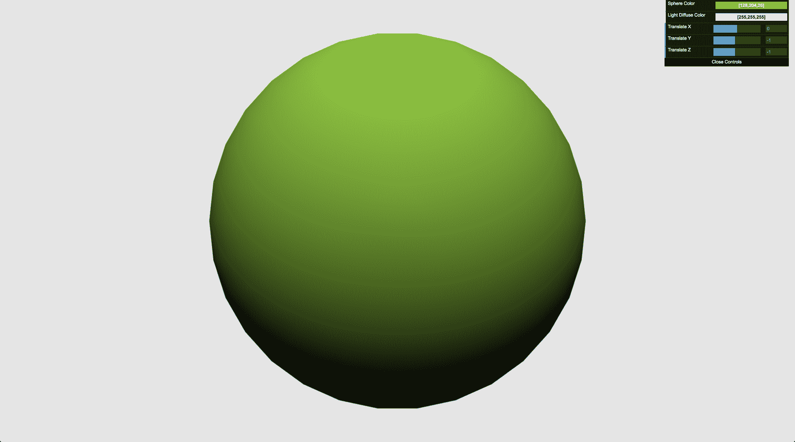

这里是顶点着色器：

```js
#version 300 es
precision mediump float;

uniform mat4 uModelViewMatrix;
uniform mat4 uProjectionMatrix;
uniform mat4 uNormalMatrix;
uniform vec3 uLightDirection;
uniform vec3 uLightDiffuse;
uniform vec3 uMaterialDiffuse;

in vec3 aVertexPosition;
in vec3 aVertexNormal;

out vec4 vVertexColor;

void main(void) {
  // Calculate the normal vector
  vec3 N = normalize(vec3(uNormalMatrix * vec4(aVertexNormal, 1.0)));
  // Normalized light direction
  vec3 L = normalize(uLightDirection);
  // Dot product of the normal product and negative light direction vector
  float lambertTerm = dot(N, -L);
  // Calculating the diffuse color based on the Lambertian reflection model
  vec3 Id = uMaterialDiffuse * uLightDiffuse * lambertTerm;
  vVertexColor = vec4(Id, 1.0);
  // Setting the vertex position
  gl_Position = uProjectionMatrix * uModelViewMatrix * vec4(aVertexPosition, 1.0);
}
```

这里是片段着色器：

```js
#version 300 es
precision mediump float;

// Expect the interpolated value fro, the vertex shader
in vec4 vVertexColor;

// Return the final color as fragColor
out vec4 fragColor;

void main(void)  {
  // Simply set the value passed in from the vertex shader
  fragColor = vVertexColor;
}
```

我们可以看到，在顶点着色器中处理过的最终顶点颜色被传递到一个变化变量中，传递到片段着色器。记住，到达片段着色器的值**不是**我们在顶点着色器中计算出的原始值。片段着色器通过插值`vVertexColor`变量为相应的片段生成一个最终颜色。这种插值考虑了包围当前片段的顶点。

# 行动时间：实时更新统一变量

让我们看看如何交互式地更新着色器统一变量的一个例子：

1.  在你的浏览器中打开`ch03_01_goraud_lambert.html`文件：


1.  注意，在这个例子中，控件部件位于页面的右上角。如果你对它是如何工作的感到好奇，你可以检查示例代码中的`initControls`函数。

设置小部件设置小部件是使用**DatGui**创建的，这是一个开源库。虽然我们不会介绍直观的 DatGui API，但阅读提供的示例中的文档和代码，了解它是如何工作的可能很有用。更多信息，你可以查看[`github.com/dataarts/dat.gui.`](https://github.com/dataarts/dat.gui)

1.  **平移 X, Y, Z**：这些控制光的方向。通过改变这些滑块，你将修改`uLightDirection`统一变量：

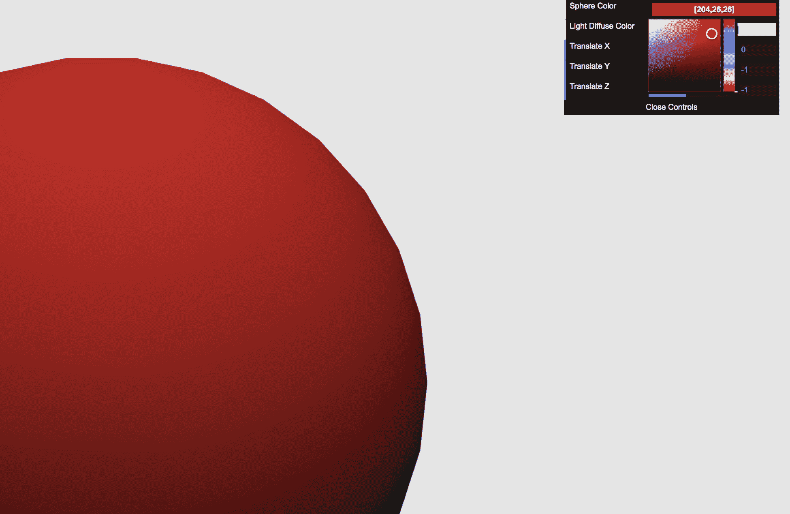

1.  **球体颜色**：这会改变代表球体漫反射颜色的`uMaterialDiffuse`统一变量。在这里，你使用颜色选择小部件，这允许你尝试不同的颜色。`initControls`函数中的`Sphere Color`的`onChange`接收来自小部件的更新并更新`uMaterialDiffuse`统一变量。

1.  **光漫反射颜色**：这会改变代表光源漫反射颜色的`uLightDiffuse`统一变量。没有理由说光的颜色必须是白色的。我们通过将滑块值分配给`uLightDiffuse`的 RGB 分量，同时将 alpha 通道设置为`1.0`来实现这一点。我们在灯光设置的`onChange`函数内部这样做，该函数接收滑块的更新。

1.  尝试不同的光源位置、漫反射材料和光属性设置。

***刚才发生了什么？***

我们已经看到了一个使用 Goraud 插值和 Lambertian 反射模型照亮的简单场景的例子。我们还看到了改变 Lambertian 照明模型统一值时的即时效果。

# 尝试一下：移动光源

我们之前提到，我们使用矩阵在场景中移动相机。我们也可以使用矩阵来移动光源。为此，执行以下步骤：

1.  在你的编辑器中打开`ch03_02_moving-light.html`。顶点着色器与之前的漫反射模型示例非常相似。然而，多了一行：

```js
vec3 light = vec3(uModelViewMatrix * vec4(uLightDirection, 0.0));
```

1.  在这里，我们正在变换`uLightDirection`向量并将其赋值给`light`变量。注意，`uLightDirection`统一变量是一个有三个分量（`vec3`）的向量，而`uModelViewMatrix`是一个 4x4 矩阵。为了完成乘法，我们需要将这个统一变量转换成一个四分量向量（`vec4`）。我们通过以下结构实现这一点：

```js
vec4(uLightDirection, 0.0);
```

1.  `uModelViewMatrix`矩阵包含*模型-视图变换矩阵*。我们将在第四章“相机”中看到所有这些是如何工作的。现在，只需说这个矩阵允许我们更新顶点的位置，在这个例子中，还有光源的位置。

1.  再看看顶点着色器。在这个例子中，我们正在旋转球体和光源。每次调用`draw`函数时，我们都会在 y 轴上稍微旋转一下`modelViewMatrix`矩阵：

```js
mat4.rotate(modelViewMatrix, modelViewMatrix, angle * Math.PI / 180, [0, 1, 0]);
```

1.  如果你更仔细地检查代码，你会注意到 `modelViewMatrix` 矩阵被映射到 `uModelViewMatrix` 常量：

```js
gl.uniformMatrix4fv(program.uModelViewMatrix, false, modelViewMatrix);
```

1.  在浏览器中运行示例。你会看到一个球体和一个光源在 y 轴上旋转：

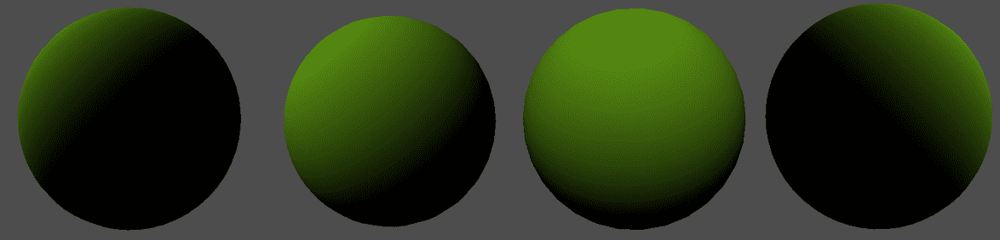

1.  在 `initLights` 函数中查找并更改灯光方向，使灯光指向负 z 轴方向：

```js
gl.uniform3f(program.uLightDirection, 0, -1, -1);
```

1.  保存文件并再次运行。发生了什么？更改灯光方向常量，使其指向 `[-1, 0, 0]`。保存文件并在浏览器中再次运行。发生了什么？你应该看到改变这些值会操纵灯光的方向。

1.  通过改变 `uLightDirection` 常量将灯光恢复到 45 度角，使其返回初始值：

```js
gl.uniform3f(program.uLightDirection, 0, -1, -1);
```

1.  前往 `draw` 并找到以下行：

```js
mat4.rotate(modelViewMatrix, modelViewMatrix, angle * Math.PI / 180, [0, 1, 0]);
```

1.  改成这个：

```js
mat4.rotate(modelViewMatrix, modelViewMatrix, angle * Math.PI / 180, [1, 0, 0]);

```

1.  保存文件并在浏览器中再次打开它。发生了什么？你应该注意到光线沿着不同的轴移动。

***刚才发生了什么？***

如你所见，传递给 `mat4.rotate` 的第三个参数决定了旋转的轴。第一个分量对应于 x 轴，第二个对应于 y 轴，第三个对应于 z 轴。

# Goraud 着色与 Phong 反射

与 Lambertian 反射模型不同，Phong 反射模型考虑了三个属性：环境色、漫反射色和镜面色，并最终产生更逼真的反射。遵循我们在上一节中使用的相同类比，考虑以下示例：

```js
finalVertexColor = Ia + Id + Is;
```

在哪里：

```js
Ia = lightAmbient * materialAmbient;
Id = lightDiffuse * materialDiffuse * lambertCoefficient;
Is = lightSpecular * materialSpecular * specularCoefficient;
```

注意：

+   由于我们使用 Goraud 插值，我们仍然使用顶点法线来计算漫反射项。当使用 Phong 插值时，我们将使用片段法线，这将会改变。

+   光和材料都有三个属性：环境色、漫反射色和镜面色。

+   在这些方程中，我们可以看到 `Ia`、`Id` 和 `Is` 分别从它们各自的光和材料属性中接收贡献。

根据我们对 Phong 反射模型的知识，让我们看看如何在 ESSL 中计算镜面系数：

```js
float specular = pow(max(dot(lightReflection, eyeVector), 0.0), shininess);
```

在哪里：

+   `eyeVector` 是视向量或相机向量

+   `lightReflection` 是反射光向量

+   `shininess` 是镜面指数因子或光泽度

+   `lightReflection` 的计算方式为 `lightReflection = reflect(lightDirection, normal);`

+   `normal` 是顶点法线，而 `lightDirection` 是我们用来计算 Lambert 系数的灯光方向

让我们看看顶点和片段着色器的 ESSL 实现。这是顶点着色器：

```js
#version 300 es
precision mediump float;

uniform mat4 uModelViewMatrix;
uniform mat4 uProjectionMatrix;
uniform mat4 uNormalMatrix;
uniform vec3 uLightDirection;
uniform vec4 uLightAmbient;
uniform vec4 uLightDiffuse;
uniform vec4 uMaterialDiffuse;

in vec3 aVertexPosition;
in vec3 aVertexNormal;

out vec4 vVertexColor;

void main(void) {
  vec3 N = vec3(uNormalMatrix * vec4(aVertexNormal, 1.0));
  vec3 light = vec3(uModelViewMatrix * vec4(uLightDirection, 0.0));
  vec3 L = normalize(light);
  float lambertTerm = dot(N,-L);
  vec4 Ia = uMaterialDiffuse * uLightAmbient;
  vec4 Id =  uMaterialDiffuse * uLightDiffuse * lambertTerm;
  vVertexColor = vec4(vec3(Ia + Id), 1.0);
  gl_Position = uProjectionMatrix * uModelViewMatrix * vec4(aVertexPosition, 1.0);
}
```

当我们的物体几何形状是凹面或物体位于光源和我们的视点之间时，我们可以获得 Lambert 项的负点积。在两种情况下，光方向向量和法线将形成一个钝角，产生负点积，如下面的图所示：

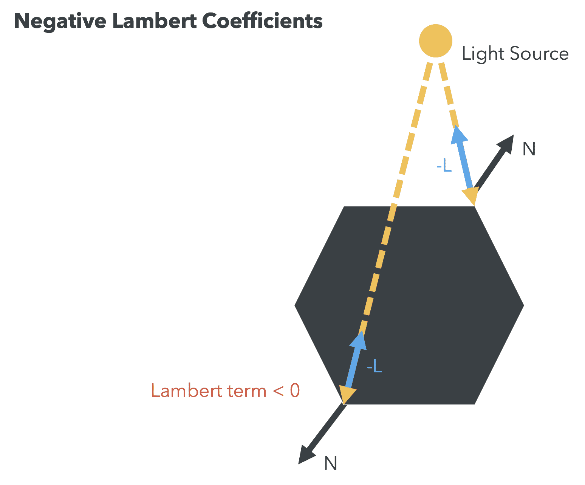

因此，我们使用 ESSL 内置的 clamp 函数来限制点积在正范围内。如果我们得到一个负的点积，clamp 函数将 lambert 项设置为 0，相应的漫射贡献将被丢弃，从而生成正确的结果。

由于我们仍在使用 Goraud 插值，片段着色器与之前相同：

```js
#version 300 es
precision mediump float;

in vec4 vVertexColor;

out vec4 fragColor;

void main(void)  {
  fragColor = vVertexColor;
}
```

在下一节中，我们将探索场景，看看当我们把被 clamp 到`[0,1]`范围的负 Lambert 系数应用到场景中时，它看起来会是什么样子。

# 行动时间：Goraud 着色

让我们来看一个实现 Goraud 着色的示例：

1.  在您的浏览器中打开`ch03_03_goraud_phong.html`文件。您将看到以下截图类似的内容：


1.  界面看起来比漫射光照示例要复杂一些。让我们在这里稍作停留，解释一下这些小部件：

    +   光的颜色（光漫射项）：如本章开头所述，我们可以有一个例子，其中我们的光不是白色的。我们在这里包含了一个颜色选择器小部件，以便您可以尝试不同的光颜色组合。

    +   **环境光项**：光的环境属性。在这个例子中，这是一个灰度值：`r = g = b`。

    +   镜面反射项：光的镜面反射属性。这是一个灰度值：`r = g = b`。

    +   X,Y,Z 坐标：定义光的方向的坐标。

    +   球体颜色（材质漫射项）：材质的漫射属性。我们包含了一个颜色选择器，以便您可以尝试不同的`r`、`g`和`b`通道的组合。

    +   材质环境项：材质的环境属性。我们仅仅为了这个目的而包含它。但正如您在漫射示例中可能已经注意到的，这个向量并不总是被使用。

    +   材质镜面反射项：材质的镜面反射属性。这是一个灰度值：r = g = b。

    +   亮度：Goraud 模型的镜面反射指数因子。

    +   背景颜色（`gl.clearColor`）：这个小部件仅仅允许我们更改背景颜色。

1.  Phong 反射模型中的镜面反射取决于亮度、材质的镜面反射属性和光的镜面反射属性。当材质的镜面反射属性接近`0`时，材质*失去*其镜面反射属性。使用提供的小部件检查这种行为：

    +   当材质的镜面反射低而亮度高时会发生什么？

    +   当材质的镜面反射高而亮度低时会发生什么？

    +   使用这些小部件，尝试不同的光和材质属性组合。

***刚才发生了什么？***

+   我们看到了 Phong 光照模型的不同参数是如何相互作用的。

+   我们修改了光的方向、光的属性和材质，以观察 Phong 光照模型的不同行为。

+   与朗伯反射模型不同，Goraud 光照模型有两个额外的项：环境光和镜面分量。我们看到了这些参数如何影响场景。

就像朗伯反射模型一样，Phong 反射模型在顶点着色器中获取顶点颜色。这个颜色在片段着色器中插值以获得最终的像素颜色。这是因为，在这两种情况下，我们都在使用 Goraud 插值。现在，让我们将繁重的处理移到片段着色器，并研究我们如何实现 Phong 插值方法。

# Phong 着色

与 Goraud 插值不同，在那里我们为每个顶点计算了最终颜色，Phong 插值计算每个片段的最终颜色。这意味着 Phong 模型中环境、漫反射和镜面项的计算是在片段着色器中而不是在顶点着色器中进行的。正如你可以想象的那样，这比在前两个场景中使用 Goraud 插值进行简单插值计算要复杂得多。然而，我们得到了一个看起来更逼真的场景。

在这次翻译之后，你可能想知道顶点着色器还剩下什么要做。嗯，在这种情况下，我们将创建变量，这将使我们能够在片段着色器中完成所有计算。例如，顶点法线是一个很好的选择。

而之前我们有一个每个顶点的法线，现在我们需要为每个像素生成一个法线，以便我们可以计算每个片段的朗伯系数。我们通过插值传递给片段着色器的法线来实现这一点。尽管如此，代码非常简单。我们只需要知道如何在顶点着色器中创建一个存储我们正在处理的顶点法线的变量，并在片段着色器中获取插值值（归功于 ESSL）。就是这样！从概念上讲，这体现在以下图中：

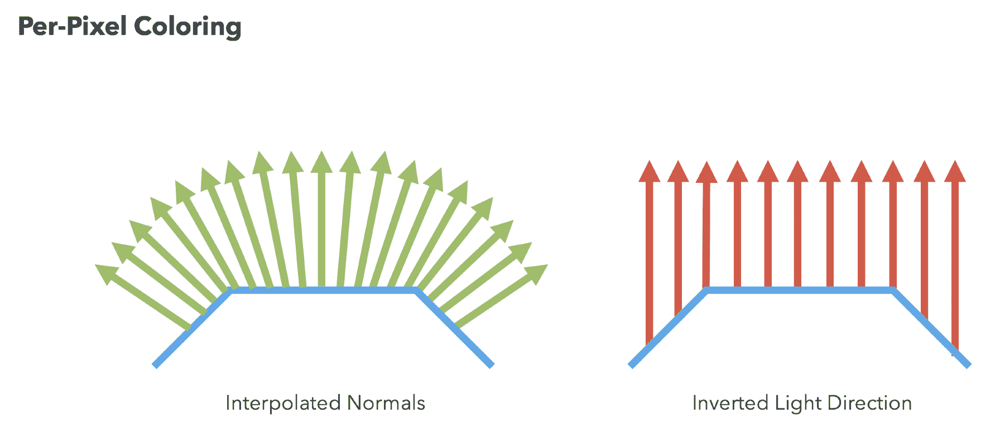

现在，让我们看看 Phong 着色下的顶点着色器：

```js
#version 300 es
precision mediump float;

uniform mat4 uModelViewMatrix;
uniform mat4 uProjectionMatrix;
uniform mat4 uNormalMatrix;

in vec3 aVertexPosition;
in vec3 aVertexNormal;

out vec3 vNormal;
out vec3 vEyeVector;

void main(void) {
  vec4 vertex = uModelViewMatrix * vec4(aVertexPosition, 1.0);
  vNormal = vec3(uNormalMatrix * vec4(aVertexNormal, 1.0));
  vEyeVector = -vec3(vertex.xyz);
  gl_Position = uProjectionMatrix * uModelViewMatrix * vec4(aVertexPosition, 1.0);
}
```

与我们使用 Goraud 插值的例子不同，顶点着色器看起来非常简单。没有最终的色彩计算，我们使用两个变量将信息传递到片段着色器。现在片段着色器将看起来如下：

```js
#version 300 es
precision mediump float;

uniform float uShininess;
uniform vec3 uLightDirection;
uniform vec4 uLightAmbient;
uniform vec4 uLightDiffuse;
uniform vec4 uLightSpecular;
uniform vec4 uMaterialAmbient;
uniform vec4 uMaterialDiffuse;
uniform vec4 uMaterialSpecular;

in vec3 vNormal;
in vec3 vEyeVector;

out vec4 fragColor;

void main(void) {
  vec3 L = normalize(uLightDirection);
  vec3 N = normalize(vNormal);
  float lambertTerm = dot(N, -L);
  vec4 Ia = uLightAmbient * uMaterialAmbient;
  vec4 Id = vec4(0.0, 0.0, 0.0, 1.0);
  vec4 Is = vec4(0.0, 0.0, 0.0, 1.0);

  if (lambertTerm > 0.0) {
    Id = uLightDiffuse * uMaterialDiffuse * lambertTerm;
    vec3 E = normalize(vEyeVector);
    vec3 R = reflect(L, N);
    float specular = pow( max(dot(R, E), 0.0), uShininess);
    Is = uLightSpecular * uMaterialSpecular * specular;
  }

  fragColor = vec4(vec3(Ia + Id + Is), 1.0);
}
```

当我们将向量作为变量传递时，它们在插值步骤中可能会反归一化。因此，你可能已经注意到，在片段着色器中，`vNormal`和`vEyeVector`都被再次归一化了。

正如我们之前提到的，在 Phong 光照下，朗伯反射模型可以看作是一个 Phong 反射模型，其中环境光和镜面分量被设置为`0`。因此，在下一节中，我们将只介绍一般情况，我们将看到当使用 Phong 着色和 Phong 光照结合时球面场景看起来是什么样子。

# 行动时间：使用 Phong 光照的 Phong 着色

让我们来看一个使用 Phong 着色实现光照的例子：

1.  在您的浏览器中打开`ch03_04_sphere_Phong.html`文件。页面将类似于以下截图：

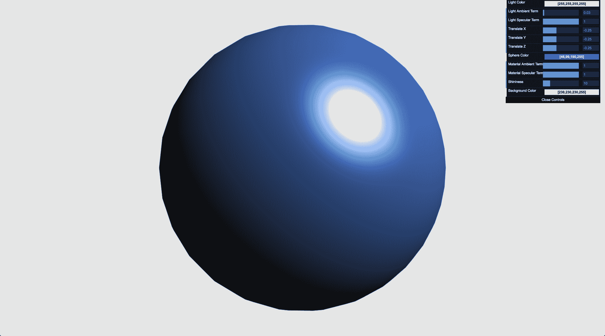

1.  界面与 Goraud 示例的界面非常相似。正如之前所描述的，很明显 Phong 着色与 Phong 光照相结合可以产生更加逼真的场景。通过实验控制部件来查看这种新的光照模型的即时效果。

***发生了什么？***

我们已经看到了 Phong 着色和 Phong 光照的实际应用。我们探索了顶点着色器和片段着色器的源代码。我们还修改了模型的不同参数，并观察了这些变化对场景的即时影响。

# 回到 WebGL

是时候回到我们的 JavaScript 代码了，但现在我们需要考虑如何弥合 JavaScript 代码和 ESSL 代码之间的差距。首先，我们需要看看我们如何使用 WebGL 上下文创建一个**程序**。请记住，我们将顶点着色器和片段着色器都称为程序。其次，我们需要知道如何初始化属性和统一变量。

让我们看看我们迄今为止开发的 Web 应用程序的结构：

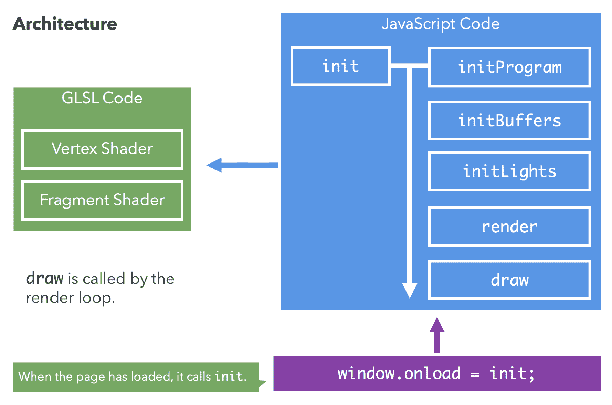

每个应用程序都嵌入在网页中的顶点着色器和片段着色器。此外，还有一个脚本部分，我们在这里编写所有的 WebGL 代码。最后，我们有 HTML 代码定义页面组件，如标题、小部件的位置以及`canvas`的位置。

在 JavaScript 代码中，我们在网页的`onload`事件上调用`init`函数。这是我们应用程序的入口点。`init`首先做的事情是为`initProgram`中的`canvas`获取一个 WebGL 上下文，然后调用一系列初始化程序、WebGL 缓冲区和灯光的函数。最后，它进入一个渲染循环，每次循环结束时调用`draw`函数。

在本节中，我们将更详细地查看`initProgram`和`initLights`函数。`initProgram`允许我们创建和编译一个 ESSL 程序，而`initLights`允许我们初始化并将值传递给程序中定义的统一变量。在`initLights`中，我们将定义光的位置、方向和颜色分量（环境、漫射和镜面）以及材料属性的默认值。

# 创建一个程序

首先，在一个编辑器中打开`ch03_05_wall.html`。让我们一步一步地看看`initProgram`：

```js
function initProgram() {
  const canvas = utils.getCanvas('webgl-canvas');
  utils.autoResizeCanvas(canvas);

  gl = utils.getGLContext(canvas);
  gl.clearColor(0.9, 0.9, 0.9, 1);
  gl.clearDepth(100);
  gl.enable(gl.DEPTH_TEST);
  gl.depthFunc(gl.LEQUAL);

  const vertexShader = utils.getShader(gl, 'vertex-shader');
  const fragmentShader = utils.getShader(gl, 'fragment-shader');

  program = gl.createProgram();
  gl.attachShader(program, vertexShader);
  gl.attachShader(program, fragmentShader);
  gl.linkProgram(program);

  if (!gl.getProgramParameter(program, gl.LINK_STATUS)) {
    console.error('Could not initialize shaders');
  }

  gl.useProgram(program);

  program.aVertexPosition = gl.getAttribLocation(program, 
   'aVertexPosition');
  program.aVertexNormal = gl.getAttribLocation(program, 'aVertexNormal');

  program.uProjectionMatrix = gl.getUniformLocation(program, 
   'uProjectionMatrix');
  program.uModelViewMatrix = gl.getUniformLocation(program, 
   'uModelViewMatrix');
  program.uNormalMatrix = gl.getUniformLocation(program, 
   'uNormalMatrix');
  program.uLightDirection = gl.getUniformLocation(program, 
   'uLightDirection');
  program.uLightAmbient = gl.getUniformLocation(program, 'uLightAmbient');
  program.uLightDiffuse = gl.getUniformLocation(program, 'uLightDiffuse');
  program.uMaterialDiffuse = gl.getUniformLocation(program, 
   'uMaterialDiffuse');
}
```

首先，我们检索一个 WebGL 上下文，就像我们在前面的章节中看到的那样。然后，我们使用`utils.getShader`实用函数检索顶点着色器和片段着色器的内容：

```js
const canvas = utils.getCanvas('webgl-canvas');
utils.autoResizeCanvas(canvas);

gl = utils.getGLContext(canvas);
gl.clearColor(0.9, 0.9, 0.9, 1);
gl.clearDepth(100);
gl.enable(gl.DEPTH_TEST);
gl.depthFunc(gl.LEQUAL);

const vertexShader = utils.getShader(gl, 'vertex-shader');
 const fragmentShader = utils.getShader(gl, 'fragment-shader');
```

程序的创建发生在以下几行：

```js
program = gl.createProgram();
gl.attachShader(program, vertexShader);
gl.attachShader(program, fragmentShader);
gl.linkProgram(program);

if (!gl.getProgramParameter(program, gl.LINK_STATUS)) {
  alert('Could not initialize shaders');
}

gl.useProgram(program);
```

在这里，我们使用了 WebGL 上下文提供的几个函数。以下表格显示了这些函数：

| **WebGL 函数** | **描述** |
| --- | --- |
| `createProgram()` | 创建一个新的程序（*程序*）。 |
| `attachShader(program, shader)` | 将着色器附加到当前程序。 |
| `linkProgram(program)` | 创建传递给 GPU 的顶点和片段着色器的可执行版本。 |
| `getProgramParameter(program, parameter)` | 这是 WebGL 状态机查询机制的一部分。它允许你查询程序参数。我们使用这个函数来验证程序是否已成功链接。 |
| `useProgram(program)` | 如果程序包含有效的代码（即，它已成功链接），则将程序加载到 GPU 上。 |

最后，我们在 JavaScript 变量和程序属性以及统一变量之间创建了一个**映射**：

```js
program.aVertexPosition = gl.getAttribLocation(program, 'aVertexPosition');
program.aVertexNormal = gl.getAttribLocation(program, 'aVertexNormal');

program.uProjectionMatrix = gl.getUniformLocation(program, 'uProjectionMatrix');
program.uModelViewMatrix = gl.getUniformLocation(program, 'uModelViewMatrix');
program.uNormalMatrix = gl.getUniformLocation(program, 'uNormalMatrix');
program.uLightDirection = gl.getUniformLocation(program, 'uLightDirection');
program.uLightAmbient = gl.getUniformLocation(program, 'uLightAmbient');
program.uLightDiffuse = gl.getUniformLocation(program, 'uLightDiffuse');
program.uMaterialDiffuse = gl.getUniformLocation(program, 'uMaterialDiffuse');
```

而不是在这里创建几个 JavaScript 变量（每个程序`属性`或`统一变量`一个），我们正在将属性附加到`program`对象上。这与 WebGL 无关。这只是将所有我们的 JavaScript 变量作为程序对象的一部分的一个方便步骤。

WebGL 程序由于我们将许多重要变量附加到我们的 WebGL 程序中，你可能想知道为什么我们不将其附加到 WebGL 上下文而不是程序。在我们的示例中，我们使用单个**程序**，因为我们的示例很小。随着 WebGL 应用程序的增长，你可能会发现你有几个程序，你通过`gl.useProgram`函数在应用程序中切换。

所有这些信息都与`initProgram`相关。在这里，我们使用了以下 WebGL API 函数：

| **WebGL 函数** | **描述** |
| --- | --- |
| `getAttribLocation(program, name)` | 这个函数接收当前的程序对象和一个包含需要检索的属性名称的字符串。然后，该函数返回相应的属性的**引用**。 |
| `getUniformLocation(program, name)` | 这个函数接收当前的程序对象和一个包含需要检索的统一变量名称的字符串。然后，该函数返回相应的统一变量的**引用**。 |

使用这种映射，我们可以从 JavaScript 代码中初始化统一变量和属性，正如我们将在下一节中看到的。

WebGL 2 的另一个新增功能是从顶点着色器获取项目位置的越来越优化的方法。在我们的示例中，我们使用`getAttribLocation`和`getUniformLocation`来获取这些项目的位置。如果你检查它们的返回值，你会看到它们返回**整数**。

整数仅仅是数字 0, 1, 2, 3, 4, 5, ...（等等）。

习惯上，对于大型 3D 应用程序，你可以利用经过测试的设计模式和数据结构来组织你的代码，这可能包括以预定的或程序化的顺序组织着色器资源。

一个例子是利用 **layout 限定符** 来查找资源位置。这里有一个来自 第二章，*渲染* 的简化示例，其中我们使用 `getAttribLocation` 查找并启用了 `aVertexPosition` 和 `aVertexColor`：

```js
const vertexPosition = gl.getAttribLocation(program, 'aVertexPosition');
gl.enableVertexAttribArray(vertexPosition);

const colorLocation = gl.getAttribLocation(program, 'aVertexColor');
gl.enableVertexAttribArray(colorLocation);
```

下面是相关的顶点着色器：

```js
#version 300 es

in vec4 aVertexPosition;
in vec3 aVertexColor;

out vec3 vVertexColor;

void main() {
  vVertexColor = aVertexColor;
  gl_Position = aVertexPosition;
}
```

这些将变成以下内容：

```js
const vertexPosition = 0;
gl.enableVertexAttribArray(vertexPosition);

const colorLocation = 1;
gl.enableVertexAttribArray(colorLocation);
```

下面是更新的顶点着色器：

```js
#version 300 es

layout (location=0) in vec4 aVertexPosition;
layout (location=1) in vec3 aVertexColor;

out vec3 vVertexColor;

void main() {
  vVertexColor = aVertexColor;
  gl_Position = aVertexPosition;
}
```

如您所见，这是一个细微的变化，我们使用顶点着色器内的索引来定义位置，并简单地使用这些索引启用项目。

性能影响每次我们需要从 JavaScript 上下文查找或设置着色器值时，都会带来性能成本。正因为如此，我们应该始终小心地执行此类操作频率。

虽然布局限定符是最佳的，但鉴于它更易读且开销更小，我们将继续在本书中利用传统的变量和定义查找。

布局限定符有关布局和其他限定符的更多信息，请访问 [`www.khronos.org/opengl/wiki/Layout_Qualifier_(GLSL)`](https://www.khronos.org/opengl/wiki/Layout_Qualifier_(GLSL))。

# 初始化属性和统一变量

一旦我们编译并安装了程序，下一步就是初始化属性和变量。我们将使用 `initLights` 函数初始化我们的统一变量：

```js
function initLights() {
  gl.uniform3fv(program.uLightDirection, [0, 0, -1]);
  gl.uniform4fv(program.uLightAmbient, [0.01, 0.01, 0.01, 1]);
  gl.uniform4fv(program.uLightDiffuse, [0.5, 0.5, 0.5, 1]);
  gl.uniform4f(program.uMaterialDiffuse, 0.1, 0.5, 0.8, 1);
}
```

在这个例子中，你可以看到我们正在使用通过 `getUniformLocation` 获得的引用（我们在 `initProgram` 中这样做）。

这些是 WebGL API 提供的用于设置和获取统一值的函数：

| **WebGL 函数** | **描述** |
| --- | --- |
| `uniform[1234][fi]` | 指定统一变量的 1-4 个 `float` 或 `int` 值。 |
| `uniform[1234][fi]v` | 将统一变量的值指定为 1-4 个 `float` 或 `int` 值的数组。 |
| `getUniform(program)` | 通过 `getUniformLocation` 获取之前获得的引用来检索统一变量的内容。 |

在 第二章，*渲染* 中，我们了解到初始化和使用属性需要四个步骤。回想一下，我们做了以下操作：

1.  绑定 VBO。

1.  将属性指向当前绑定的 VBO。

1.  启用属性。

1.  解绑 VBO。

这里关键的一步是步骤 *2*。我们通过以下指令来完成：

```js
gl.vertexAttribPointer(index, size, type, normalize, stride, offset);
```

如果你查看 `ch03_05_wall.html` 示例，你将看到我们在 `draw` 函数中这样做：

```js
gl.bindBuffer(gl.ARRAY_BUFFER, verticesBuffer);
gl.vertexAttribPointer(program.aVertexPosition, 3, gl.FLOAT, false, 0, 0);

gl.bindBuffer(gl.ARRAY_BUFFER, normalsBuffer);
gl.vertexAttribPointer(program.aVertexNormal, 3, gl.FLOAT, false, 0, 0);
```

# 桥接 WebGL 和 ESSL 之间的差距

现在很有用，可以通过将 `ch03_05_wall.html` 中的代码取出来并进行一些修改，来测试我们如何将 ESSL 程序与 WebGL 代码集成。

想象一下由部分 A、B 和 C 组成的墙壁，而你手持手电筒面对部分 B（正面视角）。直观上，你知道部分 A 和部分 C 会比部分 B 暗。这一事实可以通过从部分 B 的中心颜色开始，随着我们远离中心而逐渐变暗周围像素的颜色来模拟：

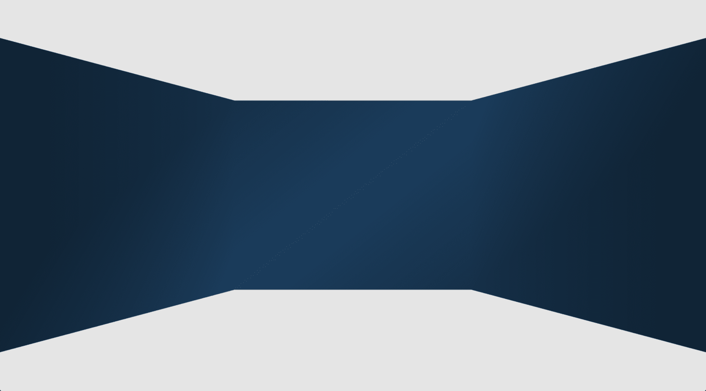

让我们总结一下我们需要覆盖的代码：

+   包含顶点和片段着色器的 ESSL 程序。对于墙壁，我们将选择 Goraud 着色，并使用漫反射/朗伯反射模型。

+   `initProgram`函数。我们需要确保我们映射了在 ESSL 代码中定义的所有属性和 uniforms，包括法线：

```js
program.aVertexNormal= gl.getAttribLocation(program, 'aVertexNormal');
```

+   `initBuffers`函数。在这里，我们需要创建我们的几何形状。我们可以用定义六个三角形的八个顶点来表示墙壁，就像之前图中所示的那样。在`initBuffers`中，我们将应用之前章节中学到的知识来设置适当的 VAOs 和缓冲区。这次，我们需要设置一个额外的缓冲区：包含法线信息的 VBO。设置法线 VBO 的代码如下所示：

```js
function initBuffers() {
  const vertices = [
    -20, -8, 20, // 0
    -10, -8, 0,  // 1
    10, -8, 0,   // 2
    20, -8, 20,  // 3
    -20, 8, 20,  // 4
    -10, 8, 0,   // 5
    10, 8, 0,    // 6
    20, 8, 20    // 7
  ];

  indices = [
    0, 5, 4,
    1, 5, 0,
    1, 6, 5,
    2, 6, 1,
    2, 7, 6,
    3, 7, 2
  ];

  // Create VAO
  vao = gl.createVertexArray();

  // Bind Vao
  gl.bindVertexArray(vao);

  const normals = utils.calculateNormals(vertices, indices);

  const verticesBuffer = gl.createBuffer();
  gl.bindBuffer(gl.ARRAY_BUFFER, verticesBuffer);
  gl.bufferData(gl.ARRAY_BUFFER, new Float32Array(vertices), 
   gl.STATIC_DRAW);
  // Configure instructions
  gl.enableVertexAttribArray(program.aVertexPosition);
  gl.vertexAttribPointer(program.aVertexPosition, 3, gl.FLOAT, 
   false, 0, 0);

  const normalsBuffer = gl.createBuffer();
  gl.bindBuffer(gl.ARRAY_BUFFER, normalsBuffer);
  gl.bufferData(gl.ARRAY_BUFFER, new Float32Array(normals), 
   gl.STATIC_DRAW);
  // Configure instructions
  gl.enableVertexAttribArray(program.aVertexNormal);
  gl.vertexAttribPointer(program.aVertexNormal, 3, gl.FLOAT, false, 
   0, 0);

  indicesBuffer = gl.createBuffer();
  gl.bindBuffer(gl.ELEMENT_ARRAY_BUFFER, indicesBuffer);
  gl.bufferData(gl.ELEMENT_ARRAY_BUFFER, new Uint16Array(indices), 
   gl.STATIC_DRAW);

  // Clean
  gl.bindVertexArray(null);
  gl.bindBuffer(gl.ARRAY_BUFFER, null);
  gl.bindBuffer(gl.ELEMENT_ARRAY_BUFFER, null);
}
```

+   为了计算法线，我们使用`calculateNormals(vertices, indices)`辅助函数。你可以在`common/js/utils.js`文件中找到这个方法。

+   `initLights`：我们已经讨论过这个函数，并且知道如何操作。

+   在`draw`函数中，我们需要进行一个微小但重要的更改。我们需要确保在调用`drawElements`之前绑定 VBOs。执行此操作的代码如下所示：

```js
function draw() {
  gl.viewport(0, 0, gl.canvas.width, gl.canvas.height);
  gl.clear(gl.COLOR_BUFFER_BIT | gl.DEPTH_BUFFER_BIT);

  mat4.perspective(projectionMatrix, 45, gl.canvas.width / 
   gl.canvas.height, 0.1, 10000);
  mat4.identity(modelViewMatrix);
  mat4.translate(modelViewMatrix, modelViewMatrix, [0, 0, -40]);

  gl.uniformMatrix4fv(program.uModelViewMatrix, false, 
   modelViewMatrix);
  gl.uniformMatrix4fv(program.uProjectionMatrix, false, 
   projectionMatrix);

  mat4.copy(normalMatrix, modelViewMatrix);
  mat4.invert(normalMatrix, normalMatrix);
  mat4.transpose(normalMatrix, normalMatrix);

  gl.uniformMatrix4fv(program.uNormalMatrix, false, normalMatrix);

  try {
    // Bind VAO
    gl.bindVertexArray(vao);

    gl.bindBuffer(gl.ELEMENT_ARRAY_BUFFER, indicesBuffer);
    gl.drawElements(gl.TRIANGLES, indices.length, 
     gl.UNSIGNED_SHORT, 0);

    // Clean
    gl.bindVertexArray(null);
    gl.bindBuffer(gl.ARRAY_BUFFER, null);
    gl.bindBuffer(gl.ELEMENT_ARRAY_BUFFER, null);
  }
  catch (error) {
    console.error(error);
  }
}
```

在下一节中，我们将探讨我们刚刚描述的用于构建和照亮墙壁的功能。

# 行动时间：处理墙壁

让我们通过一个示例来展示前面概念的实际应用：

1.  在你的浏览器中打开`ch03_05_wall.html`文件。你会看到以下截图类似的内容：


1.  在代码编辑器中打开`ch03_05_wall.html`文件。

1.  前往顶点着色器。确保你识别出那里声明的属性、uniforms 和 varyings。

1.  前往片段着色器。注意这里没有属性，因为属性仅限于顶点着色器。

顶点和片段着色器

你可以在带有适当 ID 名称的脚本标签内找到这些着色器。例如，顶点着色器可以在`<script id="vertex-shader" type="x-shader/x-vertex">`内找到。

1.  前往`init`函数。确保我们在那里调用`initProgram`和`initLights`。

1.  前往`initProgram`。确保你理解程序是如何构建的，以及我们是如何获得属性和 uniforms 的引用的。

1.  前往`initLights`。更新 uniforms 的值，如下所示：

```js
function initLights() {
  gl.uniform3fv(program.uLightDirection, [0, 0, -1]);
  gl.uniform4fv(program.uLightAmbient, [0.01, 0.01, 0.01, 1]);
  gl.uniform4fv(program.uLightDiffuse, [0.5, 0.5, 0.5, 1]);
  gl.uniform4f(program.uMaterialDiffuse, 0.1, 0.5, 0.8, 1);
}
```

1.  注意，其中一项更新是将`uniform4f`更改为`uniform4fv`，用于`uMaterialDiffuse`uniform。

1.  保存文件。

1.  在浏览器中再次打开它（或重新加载）。发生了什么？

1.  让我们做一些更有趣的事情。我们将创建一个键监听器，以便每次我们按下键时，光线方向都会改变。

1.  在`initLights`函数之后，编写以下代码：

```js
function processKey(ev) {
  const lightDirection = gl.getUniform(program, program.uLightDirection);
  const incrementValue = 10;

  switch (ev.keyCode) {
    // left arrow
    case 37: {
      azimuth -= incrementValue;
      break;
    }
    // up arrow
    case 38: {
      elevation += incrementValue;
      break;
    }
    // right arrow
    case 39: {
      azimuth += incrementValue;
      break;
    }
    // down arrow
    case 40: {
      elevation -= incrementValue;
      break;
    }
  }

  azimuth %= 360;
  elevation %= 360;

  const theta = elevation * Math.PI / 180;
  const phi = azimuth * Math.PI / 180;

  // Spherical to cartesian coordinate transformation
  lightDirection[0] = Math.cos(theta) * Math.sin(phi);
  lightDirection[1] = Math.sin(theta);
  lightDirection[2] = Math.cos(theta) * -Math.cos(phi);

  gl.uniform3fv(program.uLightDirection, lightDirection);
}
```

1.  这个函数处理箭头键并相应地改变光线方向。这里涉及到一点三角学（`Math.cos`，`Math.sin`），但我们只是将角度（方位角和仰角）转换为笛卡尔坐标。

1.  请注意，我们通过以下函数获取当前的光线方向：

```js
const lightDirection = gl.getUniform(program, program.uLightDirection);
```

1.  在处理完按键操作后，我们可以使用以下代码保存更新后的光线方向：

```js
gl.uniform3fv(program.uLightDirection, lightDirection);
```

1.  保存工作并重新加载网页：

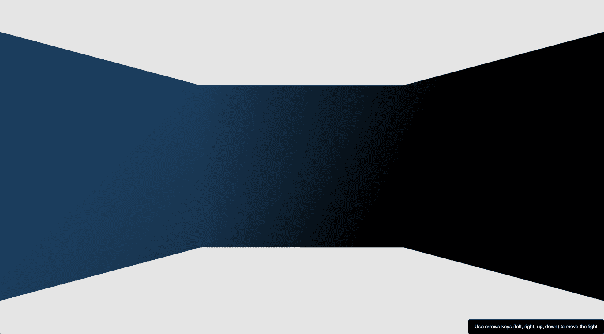

1.  使用箭头键来改变光线方向。

1.  如果你在开发这个练习过程中遇到任何问题或只是想验证最终结果，请检查`ch03_06_wall_final.html`文件，其中包含完成的练习。

***发生了什么？***

在这个练习中，我们创建了一个键盘监听器，允许我们更新光线的方向，以便我们可以将其在墙上移动并观察它如何响应表面法线。我们还看到了如何声明和使用顶点着色器和片段着色器的输入变量。我们通过回顾`initProgram`函数学习了如何构建程序。我们还学习了在`initLights`函数中初始化统一变量的方法。最后，我们研究了`getUniform`函数来检索统一变量的当前值。尽管我们没有完全涵盖示例，但这个练习的目的是让你熟悉顶点着色器和片段着色器，以便你可以实现各种光照和反射模型。

# 关于光线更多内容：位置性光线

在完成这一章之前，让我们回顾一下光线的话题。到目前为止，为了我们示例的目的，我们假设我们的光源距离场景无限远。这个假设允许我们将光线建模为相互平行。一个例子是阳光。这些光线是**方向性光线**。现在，我们将考虑一个光源相对靠近它需要照亮的对象的情况。例如，想象一下台灯照亮你正在阅读的文件。这些光线是**位置性光线**：

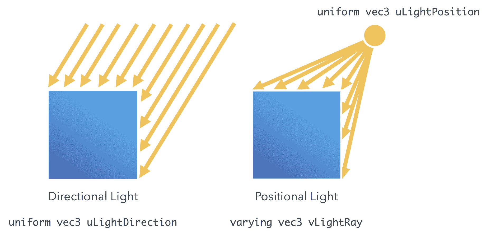

正如我们之前所经历的，当处理方向性光线时，只需要一个变量。这就是我们在`uLightDirection`统一变量中表示的光线方向。

相比之下，当处理位置性光线时，我们需要知道光线的位置。我们可以通过一个名为`uLightPosition`的统一变量来表示它。正如使用位置性光线时的情况一样，这里的射线不是平行的；因此，我们需要单独计算每条光线。我们将通过一个名为`vLightRay`的可变变量来完成这项工作。

在下一节中，我们将研究位置光源如何与场景交互。

# 行动时间：位置光源的实际应用

让我们来看一个位置光源在实际应用中的例子：

1.  在您的浏览器中打开`ch03_07_positional_lighting.html`文件。页面看起来将与以下截图类似：

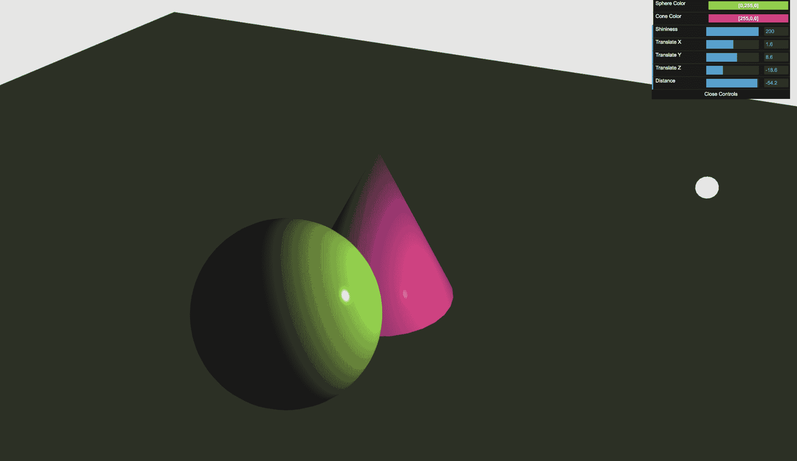

1.  本练习的接口非常简单。您可以使用控件小部件与场景进行交互。与之前的练习不同，**平移 X**、**Y**和**Z**滑块在这里不代表光的方向。相反，它们允许我们设置光源位置。试试看吧。

1.  为了清晰起见，场景中添加了一个表示光源位置的球体，以可视化光源，但这通常不是必需的。

1.  当光源位于圆锥表面与球体表面相比时会发生什么？

1.  当光源位于球体内部时会发生什么？

1.  让我们通过检查源代码中的顶点着色器来了解我们计算光线的的方式。光线的计算在以下两行代码中执行：

```js
vec4 light = uModelViewMatrix * vec4(uLightPosition, 1.0);
vLightRay = vertex.xyz - light.xyz;
```

1.  第一行允许我们通过将模型视图矩阵乘以`uLightPosition`统一变量来获得变换后的光源位置。如果您回顾顶点着色器中的代码，您会注意到我们还将此矩阵用于计算变换后的顶点和法线。我们将在第四章中讨论这些矩阵操作，*相机*。现在，我们只需假设这是在移动相机时获取变换后的顶点、法线和光源位置所必需的。为了测试这一点，修改这一行，从方程中删除矩阵，使其看起来像以下这样：

```js
vec4 light = vec4(uLightPosition, 1.0);
```

1.  保存文件并在浏览器中运行它。不变换光源位置会有什么效果？您可以看到的是，相机在移动，但光源位置没有更新！

1.  我们可以看到光线被计算为从变换后的光源位置（光源）到顶点位置的向量。

多亏了 ESSL 提供的插值变量，我们在片段着色器中自动获得每个像素的所有光线：

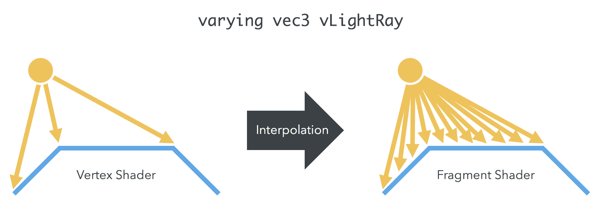

***刚才发生了什么？***

我们研究了方向光源和位置光源之间的区别。我们还调查了当相机移动时，模型视图矩阵对正确计算位置光源的重要性。最后，我们建模了获取每顶点光线的程序。

# 虚拟展厅示例

在本章中，我们包括了我们在第二章中看到的 Nissan GTR 练习示例，*渲染*。这次，我们使用位置光源照亮场景的 Phong 光照模型。您可以在`ch03_08_showroom.html`中找到这个示例：

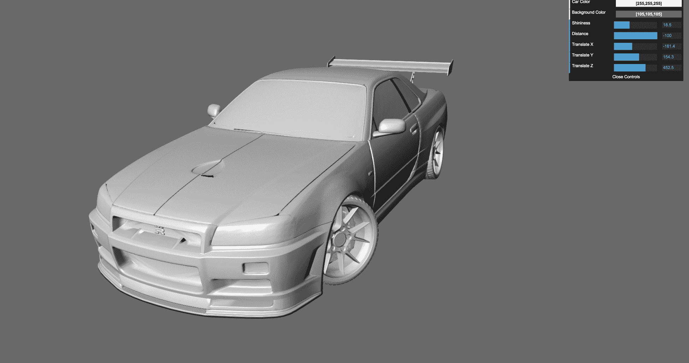

在这里，你可以尝试不同的光照位置。特别注意由于汽车的光泽特性和光照的亮度，你将获得漂亮的镜面反射。

# 架构更新

让我们介绍一些有用的函数，这些函数我们可以重构以在后续章节中使用：

1.  我们已经看到了如何使用着色器创建和编译程序，我们也介绍了如何加载和引用属性和统一变量。让我们包含一个模块，它通过一个更简单的 API 抽象出这种低级功能：

```js
<script type="text/javascript" src="img/Program.js"></script> 
```

1.  就像我们之前做的那样，我们将把这个脚本标签包含在 HTML 文档的`<head>`部分。确保在包含其他模块脚本之后包含它，因为它们可能使用我们已覆盖的库和早期模块。

1.  让我们更新`ch03_08_showroom.html`中的`initProgram`函数，以便我们可以使用这个模块：

```js
function initProgram() {
  const canvas = document.getElementById('webgl-canvas');
  utils.autoResizeCanvas(canvas);

  gl = utils.getGLContext(canvas);
  gl.clearColor(...clearColor, 1);
  gl.enable(gl.DEPTH_TEST);
  gl.depthFunc(gl.LEQUAL);

  program = new Program(gl, 'vertex-shader', 'fragment-shader');

  const attributes = [
    'aVertexPosition',
    'aVertexNormal'
  ];

  const uniforms = [
    'uProjectionMatrix',
    'uModelViewMatrix',
    'uNormalMatrix',
    'uLightAmbient',
    'uLightPosition',
    'uMaterialSpecular',
    'uMaterialDiffuse',
    'uShininess'
  ];

  program.load(attributes, uniforms);
}
```

1.  创建程序、编译着色器以及将统一变量和属性附加到我们的程序的重任都由我们来完成。

1.  让我们检查`Program`类的源代码。大部分操作应该对你来说都很熟悉：

```js
'use strict';

/*
* Program constructor that takes a WebGL context and script tag IDs
* to extract vertex and fragment shader source code from the page
*/
class Program {

  constructor(gl, vertexShaderId, fragmentShaderId) {
    this.gl = gl;
    this.program = gl.createProgram();

    if (!(vertexShaderId && fragmentShaderId)) {
      return console.error('No shader IDs were provided');
    }

    gl.attachShader(this.program, utils.getShader(gl, 
     vertexShaderId));
    gl.attachShader(this.program, utils.getShader(gl, 
     fragmentShaderId));
    gl.linkProgram(this.program);

    if (!this.gl.getProgramParameter(this.program, 
     this.gl.LINK_STATUS)) {
      return console.error('Could not initialize shaders.');
    }

    this.useProgram();
  }

  // Sets the WebGL context to use current program
  useProgram() {
    this.gl.useProgram(this.program);
  }

  // Load up the given attributes and uniforms from the given values
  load(attributes, uniforms) {
    this.useProgram();
    this.setAttributeLocations(attributes);
    this.setUniformLocations(uniforms);
  }

  // Set references to attributes onto the program instance
  setAttributeLocations(attributes) {
    attributes.forEach(attribute => {
      this[attribute] = this.gl.getAttribLocation(this.program, 
       attribute);
    });
  }

  // Set references to uniforms onto the program instance
  setUniformLocations(uniforms) {
    uniforms.forEach(uniform => {
      this[uniform] = this.gl.getUniformLocation(this.program, 
       uniform);
    });
  }

  // Get the uniform location from the program
  getUniform(uniformLocation) {
    return this.gl.getUniform(this.program, uniformLocation);
  }

}
```

1.  我们通过传递对`gl`上下文、顶点和片段着色器`id`的引用来初始化`Program`。

1.  我们通过向`program`实例提供属性和统一变量的数组来加载和引用`attributes`和`uniforms`程序。

1.  其他方法是我们将在后续章节中使用的辅助函数。

1.  你可以在`ch03_09_showroom-final.html`中找到一个这些更改的例子。

1.  你可能注意到了在本章中使用的两个额外的实用方法：`normalizeColor`和`denormalizeColor`。这两个方法只是将颜色从范围`[0-255]`归一化到`[0-1]`或从`[0-1]`反归一化到`[0-255]`：

```js
const utils = {

  // Normalize colors from 0-255 to 0-1
  normalizeColor(color) {
    return color.map(c => c / 255);
  },

  // De-normalize colors from 0-1 to 0-255
  denormalizeColor(color) {
    return color.map(c => c * 255);
  },

  // ...  
};
```

# 摘要

让我们总结一下本章我们学到了什么：

+   我们详细学习了光源、材料和法线是什么，以及这些元素如何相互作用来照亮 WebGL 场景。

+   我们介绍了着色方法和光照模型之间的区别。

+   我们研究了 Goraud 和 Phong 着色方法以及 Lambertian 和 Phong 光照模型的基础知识。通过几个示例，我们还介绍了如何使用 ESSL 在代码中实现这些着色和光照模型，以及如何通过属性和统一变量在 WebGL 代码和 ESSL 代码之间进行通信。

+   我们可以使用顶点着色器和片段着色器来为我们的 3D 场景定义光照模型。

+   我们通过 WebGL 2 更新的着色语言提供的最新和最先进的技术，对这些操作进行了很多探讨。

在下一章中，我们将扩展在 ESSL 中使用矩阵的内容，这样我们就可以学习如何使用它们在 3D 场景中表示和移动我们的视点。
