# 相机

在上一章中，我们介绍了顶点着色器、片段着色器和 ESSL 来定义我们的 3D 场景中的光照模型。在本章中，我们将利用这些概念来深入了解我们在源代码中看到的矩阵。这些矩阵代表变换，当应用于我们的场景时，使我们能够显示和移动物体。在一种情况下，我们已经使用它们来设置相机距离以查看场景中的所有对象，在另一种情况下，我们使用它们来旋转我们的 3D 汽车模型。

尽管我们在 3D 应用程序中有一个相机，但在 WebGL API 中没有相机对象——只有矩阵。这是因为使用矩阵而不是相机对象给 WebGL 提供了表示复杂投影和动画的灵活性。在本章中，我们将学习这些矩阵变换的含义以及我们如何使用它们来定义和操作虚拟相机。

在本章中，我们将探讨以下主题：

+   理解场景从 3D 世界到 2D 屏幕所经历的变换。

+   学习仿射变换。

+   将矩阵映射到 ESSL 统一变量。

+   使用模型视图和投影矩阵。

+   重视正交矩阵的价值。

+   创建一个相机并使用它来在 3D 场景中移动。

# WebGL 没有相机

为什么在 3D 计算机图形技术中没有相机？好吧，让我们重新措辞：WebGL 没有可以操作的相机对象。然而，我们可以假设我们在`canvas`上渲染的内容就是我们的相机捕捉到的。在本章中，我们将解决如何在 WebGL 中表示相机的问题。简短的答案是，我们需要 4x4 矩阵。

每次我们移动我们的相机时，我们都需要根据新的相机位置更新物体。为此，我们需要系统地处理每个顶点并应用一个变换，以产生新的观察位置。同样，我们还需要确保物体法线和光线方向在相机移动后仍然一致。总之，我们需要分析两种不同类型的变换：顶点（点）和法线（向量）。

# 顶点变换

在 WebGL 场景中的物体在我们看到它们在屏幕上之前会经历不同的变换。每个变换都由一个 4x4 矩阵编码。我们如何将具有三个分量`(x, y, z)`的顶点乘以一个 4x4 矩阵？简短的答案是，我们需要通过一个维度增加我们元组的基数。每个顶点将随后有一个第四个分量，称为齐次坐标。让我们看看它们是什么以及为什么它们是有用的。

# 齐次坐标

**齐次坐标**是任何计算机图形程序的关键组成部分。这些坐标使得能够将**仿射**变换（如旋转、缩放、剪切和平移）和**投影**变换表示为 4x4 矩阵。

在齐次坐标中，顶点有四个分量：`x`、`y`、`z`和`w`**。前三个分量是顶点在**欧几里得空间**中的坐标。第四个是透视分量。四元组`(x, y, z, w)`带我们进入一个新的空间：**射影空间**。

齐次坐标使得解决一个线性方程组成为可能，其中每个方程代表一条与系统中所有其他线平行的线。记住，在欧几里得空间中，这样的系统没有解，因为没有交点。然而，在射影空间中，这个系统有一个解——这些线将在无穷远处相交。这个事实由透视分量具有`0`值来表示。这个想法的一个很好的类比是火车轨道的图像：当你从远处看时，平行线会在消失点相交：

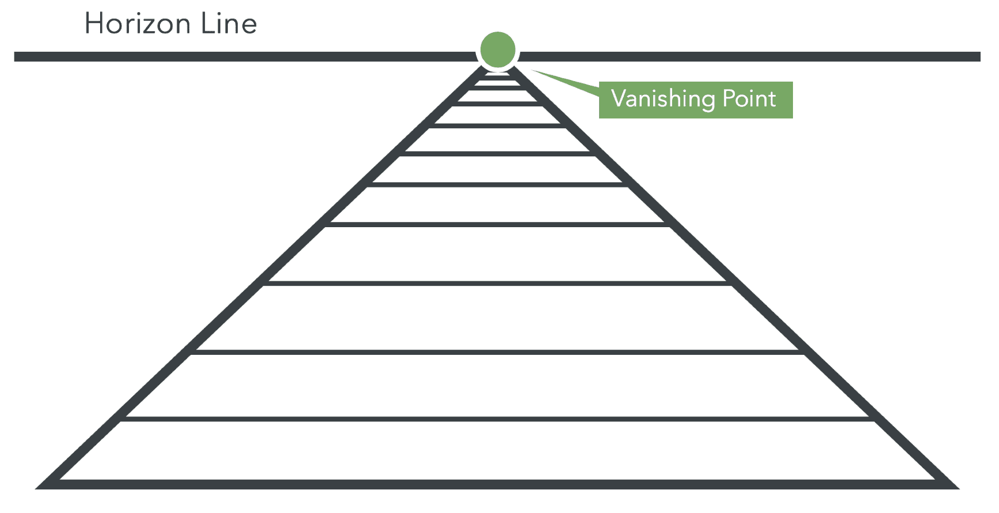

从齐次坐标转换到非齐次、传统的欧几里得坐标很容易。你只需要将坐标除以`w`：

因此，如果你要从欧几里得空间转换到射影空间，你需要添加第四个分量，即`w`，并将其设置为`1`：

实际上，这正是我们在本书的前三章中一直在做的事情！让我们回到上一章中讨论的一个着色器：Phong 顶点着色器。代码如下：

```js
#version 300 es
precision mediump float;

uniform mat4 uModelViewMatrix;
uniform mat4 uProjectionMatrix;
uniform mat4 uNormalMatrix;

in vec3 aVertexPosition;
in vec3 aVertexNormal;

out vec3 vVertexNormal;
out vec3 vEyeVector;

void main(void) {
  // Transformed vertex position
  vec4 vertex = uModelViewMatrix * vec4(aVertexPosition, 1.0);

  // Transformed normal position
  vVertexNormal = vec3(uNormalMatrix * vec4(aVertexNormal, 0.0));

  // Eye vector
  vEyeVector = -vec3(vertex.xyz);

  // Final vertex position
  gl_Position = uProjectionMatrix * uModelViewMatrix * vec4(aVertexPosition, 1.0);
}
```

请注意，对于包含我们几何体顶点的`aVertexPosition`属性，我们从一个三元组创建一个四元组。我们使用 ESSL 构造，`vec4()`来完成这个操作。ESSL 知道`aVertexPosition`是一个`vec3`，因此我们只需要第四个分量来创建一个`vec4`。

坐标变换

要从齐次坐标转换到欧几里得坐标，我们除以`w`**。

要从欧几里得坐标转换到齐次坐标，我们添加`w = 1`。

`w = 0`的齐次坐标代表一个无穷远点。

关于齐次坐标还有一点需要注意：虽然顶点有一个齐次坐标，`w = 1`，但向量有一个齐次坐标，`w = 0`。这是因为，在 Phong 顶点着色器中，处理法线的线看起来是这样的：

```js
vVertexNormal = vec3(uNormalMatrix * vec4(aVertexNormal, 0.0));

```

为了编码顶点变换，我们将使用齐次坐标，除非有其他说明。现在，让我们看看我们的几何体在屏幕上显示之前所经历的不同变换。

# 模型变换

我们从对象坐标系开始分析。这是顶点坐标被指定的空间。如果我们想要平移或移动对象，我们使用一个编码这些变换的矩阵。这个矩阵被称为**模型矩阵**。一旦我们将对象的顶点乘以模型矩阵，我们就得到了新的顶点坐标。这些新的顶点将确定对象在我们 3D 世界中的位置。

在对象坐标系中，每个对象都可以自由定义其原点的位置，并指定其顶点相对于这个原点的位置。在世界坐标系中，所有对象共享同一个原点。世界坐标使我们能够知道对象相对于彼此的位置。正是通过模型变换，我们确定对象在 3D 世界中的位置：

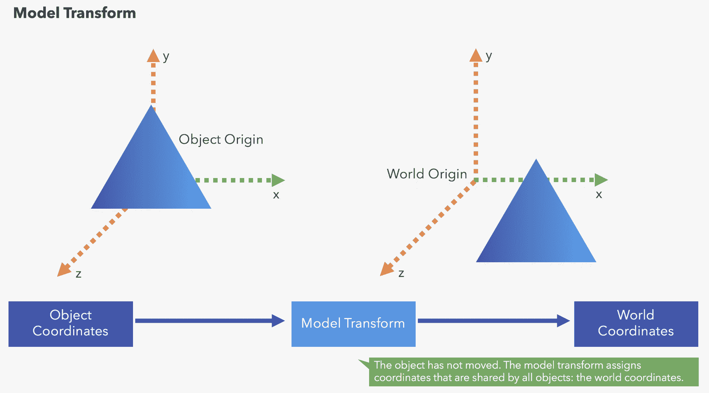

# 视图变换

下一个变换，即视图变换，将坐标系的原点移动到视图原点。视图原点是我们的 *眼睛* 或 *相机* 相对于世界原点的位置。换句话说，视图变换通过视图坐标切换世界坐标。这种变换编码在 **视图矩阵** 中。我们将这个矩阵与模型变换得到的顶点坐标相乘。这个操作的结果是一组新的顶点坐标，其原点是视图原点。我们的相机将在这个坐标系中操作。

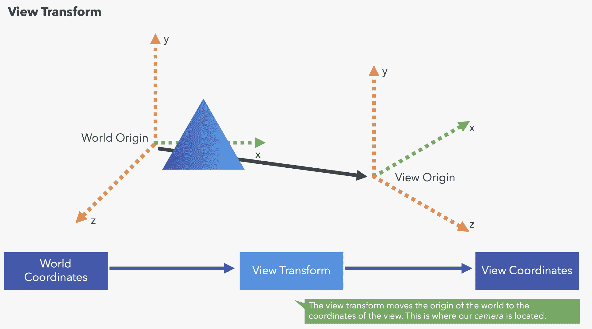

我们将在本章的后面回到这个话题！

# 投影变换

下一个操作称为 **投影变换**。这个操作确定将渲染多少观看空间以及它将如何映射到计算机屏幕上。这个区域被称为 **几何体** ，它由六个平面（近平面、远平面、顶面、底面、右面和左面）定义，如下面的图所示：

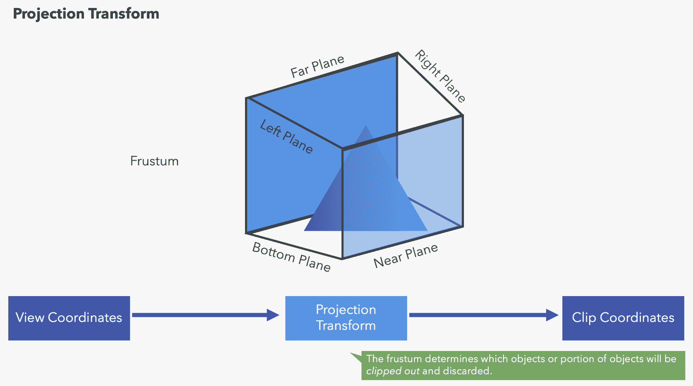

这六个平面编码在 **投影矩阵** 中。在应用变换后，任何位于几何体之外的顶点将被 *裁剪掉* 并从进一步处理中丢弃。因此，几何体 *定义* 裁剪坐标，而编码几何体的投影矩阵 *产生* 裁剪坐标。

几何体的形状和范围决定了从 3D 观看空间到 2D 屏幕的投影类型。如果远平面和近平面的维度相同，则几何体将决定一个 *正交* 投影。否则，它将是一个 *perspective* 投影，如下面的图所示：

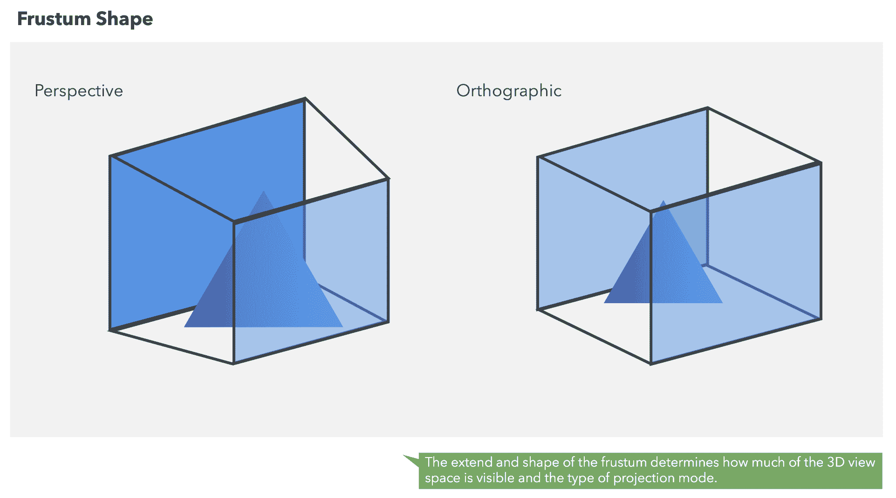

到目前为止，我们仍在使用齐次坐标，因此裁剪坐标有四个分量： `x`， `y`， `z`，和 `w`。裁剪是通过比较 `x`， `y`，和 `z` 分量与齐次坐标 `w` 来完成的。如果其中任何一个大于 `+w`，或小于 `-w`，则该顶点位于几何体之外，将被丢弃。

# 透视除法

一旦确定了将渲染多少观看空间，几何体就被映射到 *near plane* 以产生一个 2D 图像。近平面是将在您的计算机屏幕上渲染的内容。

不同的操作系统和显示设备可能有机制在屏幕上表示 2D 信息。为了对所有可能的情况提供鲁棒性，WebGL 和 OpenGL ES 提供了一个独立于任何特定硬件的中间坐标系。这个空间被称为**归一化设备坐标（NDC）**。

通过除以`w`分量来获得归一化设备坐标。这就是为什么这一步被称为**透视除法**。此外，请记住，当我们除以齐次坐标时，我们是从射影空间（4 个分量）到欧几里得空间（3 个分量），因此 NDC 只有三个分量。在 NDC 空间中，`x`和`y`坐标代表你的顶点在归一化 2D 屏幕上的位置，而 z 坐标编码深度信息，这是物体相对于近平面和远平面的相对位置。尽管我们现在在 2D 屏幕上工作，但我们仍然保留深度信息。这将允许 WebGL 根据物体与最近平面的距离来确定如何显示重叠的物体。当使用归一化设备坐标时，深度编码在 z 分量中。

透视除法将视锥体变换为中心在原点的立方体，最小坐标为`[-1, -1, -1]`，最大坐标为`[1, 1, 1]`。同时，z 轴的方向被反转，如下面的图所示：

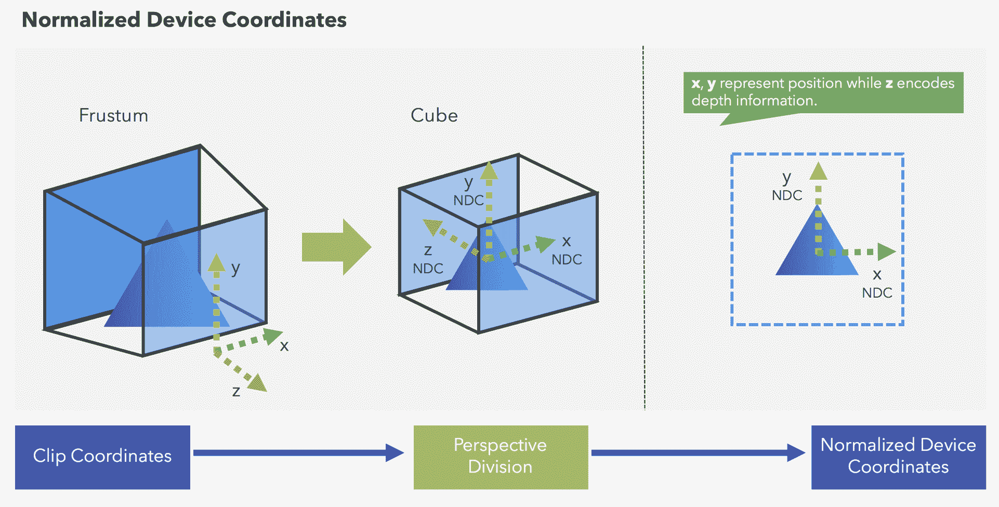

# 视口变换

最后，NDC 被映射到**视口坐标**。这一步将这些坐标映射到屏幕上的可用空间。在 WebGL 中，这个空间由 HTML5 `canvas`提供，如下面的图所示：

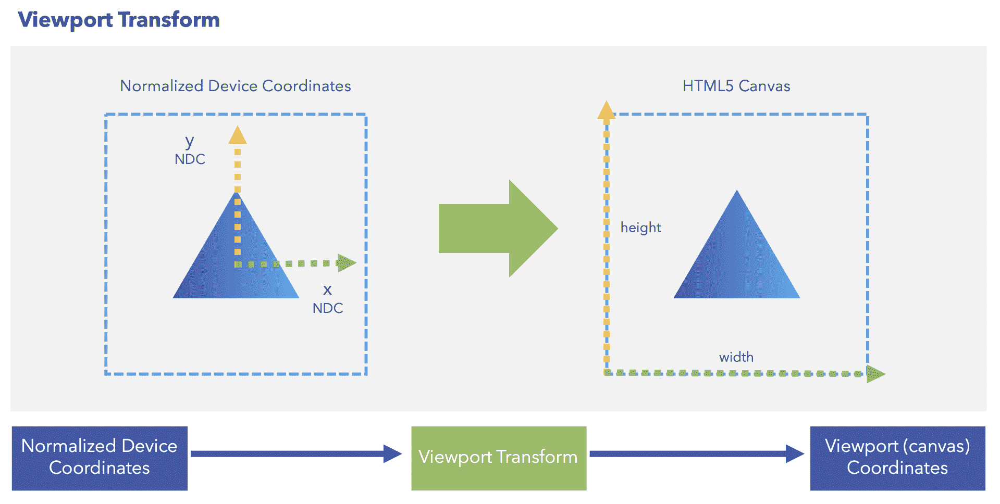

与之前的情况不同，视口变换不是由矩阵变换生成的。在这种情况下，我们使用 WebGL 的视口函数。我们将在本章后面更多地了解这个函数。现在，是时候看看这些变换如何影响法线了。

# 法线变换

每当顶点被变换时，**法线向量**也应该被变换，以便它们指向正确的方向。我们可以考虑使用变换顶点的模型视图矩阵来做这件事，但这种方法是有问题的：模型视图矩阵不会总是保持法线的垂直性，如下面的图所示：

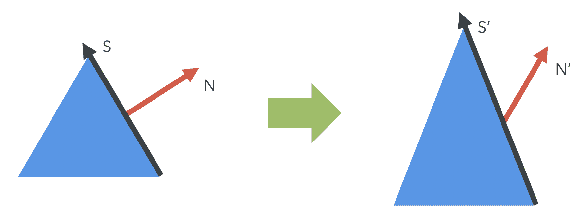

这种问题发生在模型视图矩阵中存在单向（一个轴）缩放变换或剪切变换时。在我们的例子中，我们有一个在 y 轴上进行了缩放变换的三角形。正如你所见，经过这种变换后，`N'`法线不再垂直。我们该如何解决这个问题？

# 计算法线矩阵

如果你不想了解我们如何计算法线矩阵，只想得到答案，请随时跳到本节的末尾。否则，请留下来看看一些线性代数的实际应用！

让我们从垂直性的数学定义开始。如果两个向量的点积为 `0`，则这两个向量是垂直的。在我们的例子中，这将如下所示：

这里，*`S`* 是表面向量，可以计算为两个顶点的差，如本节开头所示的图表所示。

设 *`M`* 为模型视图矩阵。我们可以使用 *`M`* 如下变换 `*S*`：

这是因为 `*S*` 是两个顶点的差。我们使用 `*M*` 来将顶点变换到视图中。

我们想要找到一个矩阵，`*K*`，它允许我们以类似的方式变换法线。对于 `*N*` 法线，我们想要以下内容：

为了在获得 `*N'*` 和 `*S'*` 后使场景保持一致，这两个向量需要保持原始向量 `*N*` 和 `*S*` 的垂直性。如下所示：

代入 `*N'*` 和 `*S'*`：

点积也可以写成通过转置第一个向量来保持这种关系的向量乘法：

乘积的转置是转置的逆序乘积：

将内部项分组：

现在，记住 `` 所以 ``（再次，点积可以写成向量乘法）。这意味着在之前的方程中，(``) 需要是单位矩阵，`*I*`，因此 `*N*` 和 `*S*` 的原始垂直条件保持不变：

应用一点代数：

| `` | 在两边乘以 `*M*` 的逆矩阵。 |
| --- | --- |
| `` | 因为 ``*.* |
| `` | 在两边进行转置。 |
| `` | `*K*` 的双重转置是原始矩阵 `*K*`。 |

结论：

+   *`K`* 是保持法向量与物体表面垂直的正确矩阵变换。我们称 `*K*` 为**法线矩阵**。

+   *`K`* 是通过转置模型视图矩阵的逆矩阵 (`*M*`，在这个例子中）得到的。

+   我们需要使用 *`K`* 来乘以法向量，以便在变换过程中保持它们与表面的垂直性。

# WebGL 实现

现在，让我们看看如何在 WebGL 中实现顶点和法线变换。以下图表显示了我们迄今为止学到的理论，以及理论步骤与 WebGL 实现之间的关系：


在 WebGL 中，我们将应用于物体坐标以获得视口坐标的五个变换组合成三个矩阵和一个 WebGL 方法：

+   **模型视图矩阵** 将 *模型* 和 *视图* 变换组合在一个单一的矩阵中。当我们用这个矩阵乘以我们的顶点时，我们最终得到视图坐标。

+   **法线矩阵** 是通过反转和转置模型视图矩阵获得的。这个矩阵应用于法线向量，以确保它们继续垂直于表面。这在例如光照的情况下非常重要。

+   **投影矩阵** 将 *投影变换* 和 *透视除法* 组合在一起，因此我们最终得到归一化设备坐标。

最后，我们使用 `gl.viewport` 操作将 NDC 转换为视口坐标：

```js
gl.viewport(minX, minY, width, height);
```

视口坐标起源于 HTML5 `canvas` 的左下角。

# JavaScript 矩阵

WebGL JavaScript API 不提供自己的方法来执行矩阵操作。WebGL 只提供了一种将矩阵传递给着色器（作为 uniforms）的方式。因此，我们需要使用一个 JavaScript 库，使我们能够用 JavaScript 操作矩阵。在这本书中，我们使用了 **glMatrix** 来执行所有矩阵操作。然而，还有其他在线库可以为你做这件事。

glMatrix

在这本书的所有矩阵操作中，我们使用了 **glMatrix**。你可以在 [`github.com/toji/gl-matrix.`](https://github.com/toji/gl-matrix) 找到关于这个库的更多信息。

这里有一些你可以使用 **glMatrix** 执行的操作：

| **操作** | **语法** | **描述** |
| --- | --- | --- |
| 创建 | `const m = mat4.create();` | 创建 `m` 矩阵。 |
| 单位矩阵 | `mat4.identity(m);` | 将 `m` 设置为秩为 4 的单位矩阵。 |
| 复制 | `mat4.copy(target, origin);` | 将矩阵 `origin` 复制到矩阵 `target` 上。 |
| 转置 | `mat4.transpose(target, m);` | 将 `m` 矩阵转置到矩阵 `target` 上。 |
| 反转 | `mat4.invert(target, m);` | 将矩阵 `m` 反转到矩阵 `target` 上。 |
| 旋转 | `mat4.rotate(target, m, r, a);` | 将 `m` 矩阵绕 `a` 轴（这是一个包含三个元素的数组，`[x, y, z]`）旋转 `r` 弧度到矩阵 `target` 上。 |

需要注意的是，**glMatrix** 提供了许多其他函数来执行其他线性代数操作。要获取完整列表，请访问 [`glmatrix.net/docs/`](http://glmatrix.net/docs/)。

# 将 JavaScript 矩阵映射到 ESSL Uniforms

由于模型视图矩阵和透视矩阵在单个渲染步骤中不会改变，因此它们作为 *uniforms* 传递给着色器。例如，如果我们正在将平移应用于场景中的对象，我们就必须在新坐标下绘制整个对象，这些新坐标由平移给出。在新的位置绘制整个对象是通过恰好一个渲染步骤实现的。

然而，在调用`drawArrays`或`drawElements`来调用渲染步骤之前，我们需要确保着色器有我们矩阵的更新版本。我们已经知道如何为其他 uniform，如光和颜色属性，这样做。将 JavaScript 矩阵映射到 uniform 的方法与以下类似：

1.  使用以下代码获取 uniform 的 JavaScript 引用：

```js
const reference = getUniformLocation(program, uniformName);
```

1.  使用以下代码使用`reference`将矩阵传递到着色器：

```js
// Matrix is the JavaScript matrix variable
gl.uniformMatrix4fv(reference, transpose, matrix);
```

对于其他 uniform，ESSL 支持二维、三维和四维矩阵：`uniformMatrix[234]fv(reference, transpose, matrix)`。这将加载 2x2、3x3 或 4x4 矩阵（对应于命令名称中的 2、3 或 4），并将浮点数矩阵加载到由`reference`引用的 uniform 中。`reference`的类型是`WebGLUniformLocation`。出于实际目的，它是一个整数。根据规范，转置值必须设置为`false`。矩阵 uniform 始终为浮点类型（`f`）。矩阵作为`4`、`9`或`16`元素向量（`v`）传递，并且始终以列主序指定。矩阵参数也可以是`Float32Array`类型。这是 JavaScript 的一种类型化数组。这些数组被包含在语言中，以提供对原始二进制数据的访问和处理，从而提高效率。

# 在 ESSL 中处理矩阵

让我们回顾一下在第三章中介绍的 Phong 顶点着色器，*光线*。请记住矩阵被定义为 uniform `mat4`。

在这个着色器中，我们定义了三个矩阵：

+   `uModelViewMatrix`：模型-视图矩阵

+   `uProjectionMatrix`：投影矩阵

+   `uNormalMatrix`：法线矩阵

```js
#version 300 es
precision mediump float;

uniform mat4 uModelViewMatrix;
uniform mat4 uProjectionMatrix;
uniform mat4 uNormalMatrix;

in vec3 aVertexPosition;
in vec3 aVertexNormal;

out vec3 vVertexNormal;
out vec3 vEyeVector;

void main(void) {
  // Transformed vertex position
  vec4 vertex = uModelViewMatrix * vec4(aVertexPosition, 1.0);

  // Transformed normal position
  vVertexNormal = vec3(uNormalMatrix * vec4(aVertexNormal, 0.0));

  // Eye vector
  vEyeVector = -vec3(vertex.xyz);

  // Final vertex position
  gl_Position = uProjectionMatrix * uModelViewMatrix * vec4(aVertexPosition, 1.0);
}
```

在 ESSL 中，矩阵的乘法很简单；也就是说，你不需要逐元素相乘。ESSL 知道你正在处理矩阵，所以它会为你执行乘法：

```js
gl_Position = uProjectionMatrix * uModelViewMatrix * vec4(aVertexPosition, 1.0);

```

这个着色器的最后一行将一个值赋给了预定义的`gl_Position`变量。这将包含由着色器正在处理的顶点的裁剪坐标。我们需要记住着色器是并行工作的：每个顶点都由一个顶点着色器的实例处理。

要获得给定顶点的裁剪坐标，我们首先需要将模型-视图矩阵与投影矩阵相乘。为了实现这一点，我们需要从右向左乘，因为矩阵乘法不是交换的，顺序很重要。

此外，请注意，我们需要通过包括齐次坐标来增强`aVertexPosition`属性。这是因为我们已经在欧几里得空间中定义了我们的几何形状。幸运的是，ESSL 允许我们通过简单地添加缺失的组件并在现场创建一个`vec4`来实现这一点。我们需要这样做，因为模型-视图矩阵和投影矩阵都是用齐次坐标描述的（4 行 4 列）。

现在我们已经看到了如何在着色器中将 JavaScript 矩阵映射到 ESSL 统一变量中，让我们谈谈如何操作这三个矩阵：模型-视图矩阵、法线矩阵和投影矩阵。

# 模型-视图矩阵

**模型-视图矩阵**允许我们在场景中执行 *仿射变换*。**仿射**是一个数学术语，描述了不改变经历这种变换的对象结构的变换。在我们的 3D 世界场景中，这种变换包括旋转、缩放、反射剪切和平移。幸运的是，我们不需要了解如何用矩阵表示这样的变换。我们只需要使用许多可在线获得的 JavaScript 矩阵库之一（例如 **glMatrix**）。

仿射变换

你可以在[`en.wikipedia.org/wiki/Affine_transformation`](https://en.wikipedia.org/wiki/Affine_transformation)上找到更多关于变换矩阵如何工作的信息。

如果你只想对场景或场景中的对象应用变换，理解模型-视图矩阵的结构并不能帮助你。为此，只需使用一个库，例如 **glMatrix**，来代表你进行变换。然而，当你在尝试调试你的 3D 应用程序时，这个矩阵的结构可能是有价值的。让我们看看模型-视图矩阵是如何构建的。

# 世界的空间编码

默认情况下，当你渲染一个场景时，你从世界原点沿 z 轴的负方向观看它。如下所示，z 轴从屏幕中出来（这意味着你正在查看负 z 轴）：

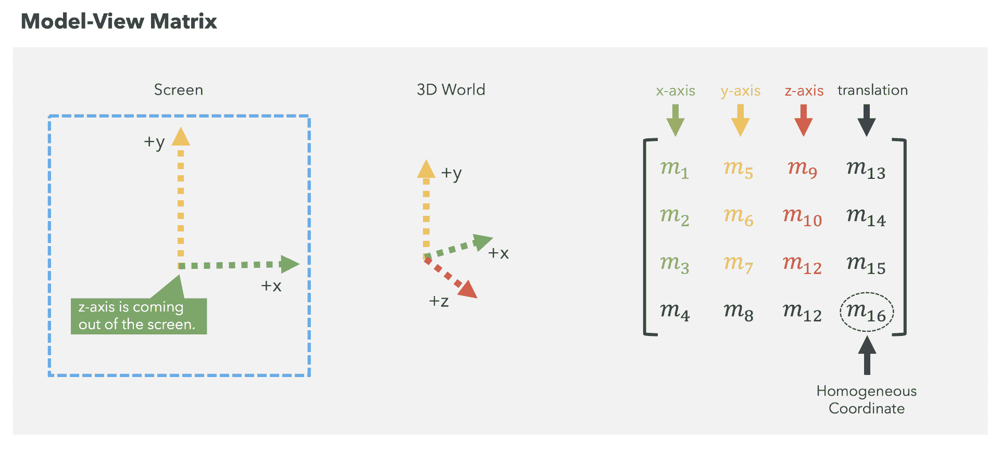

从屏幕中心向右，你将拥有正 x 轴，从屏幕中心向上，你将拥有正 y 轴。这是初始配置，也是仿射变换的参考。

在这个配置中，模型-视图矩阵是四阶的**单位矩阵**。

模型-视图矩阵的前三行包含影响世界的旋转和平移信息。

# 旋转矩阵

前三行与前三列的交集定义了 3x3 的旋转矩阵。这个矩阵包含关于围绕标准轴旋转的信息。在初始配置中，这对应于以下：

`[m1, m2, m3]` = `[1, 0, 0]` = x 轴

`[m5, m6, m7]` = `[0, 1, 0]` = y 轴

`[m9, m10, m11]` = `[0, 0, 1]` = z 轴

# 平移向量

前三行与最后一列的交集定义了一个三组件的平移向量。这个向量指示原点和世界移动了多少。在初始配置中，这对应于以下：

`[m13, m14, m15]` = `[0, 0, 0]` = 原点（无平移）

# 神秘的第四行

第四行没有特殊含义。

+   `m4`、`m8`和`m12`元素始终为`0`。

+   `m16`元素（齐次坐标）始终为`1`。

如本章开头所述，WebGL 中没有摄像机。然而，我们需要操作摄像机的所有信息（主要是旋转和平移）都可以从模型视图矩阵本身提取出来。

# 摄像机矩阵

假设，暂时地，我们在 WebGL 中确实有一个摄像机。摄像机应该能够旋转和平移来探索这个 3D 世界。正如我们在上一节中看到的，一个 4x4 矩阵可以编码旋转和平移。因此，你应该使用这样一个矩阵来表示我们的假设摄像机。

假设我们的摄像机位于世界原点，并且它朝向负 z 轴方向对准。这是一个好的起点；我们已经在 WebGL 中知道了这种配置所代表的变换（四秩单位矩阵）。

为了分析，让我们将问题分解为两个子问题：摄像机平移和摄像机旋转。我们将为每个子问题提供一个实际演示。

# 摄像机平移

让我们将摄像机移动到世界坐标中的`[0, 0, 4]`。这意味着从原点沿正 z 轴移动四个单位。记住，在这个时候，我们还不知道如何移动摄像机。我们只知道如何移动*世界*（使用模型视图矩阵）。如果我们应用：

```js
mat4.translate(modelViewMatrix, modelViewMatrix, [0, 0, 4]);
```

在这种情况下，世界将在正 z 轴上平移`4`个单位，由于摄像机位置没有改变，它将位于`[0, 0, -4]`，这与我们想要的结果正好相反。

现在，假设我们应用了相反方向的平移：

```js
mat4.translate(modelViewMatrix, modelViewMatrix, [0, 0, -4]);
```

在这种情况下，世界将在负 z 轴上移动`4`个单位，然后摄像机将位于新世界坐标系中的`[0, 0, 4]`位置。

在下一节中，我们将探讨世界空间和摄像机空间中的平移。

# 行动时间：世界空间与摄像机空间的平移

让我们通过一个示例来展示这些差异在实际操作中的表现：

1.  在浏览器中打开`ch04_01_model-view-translation.html`：

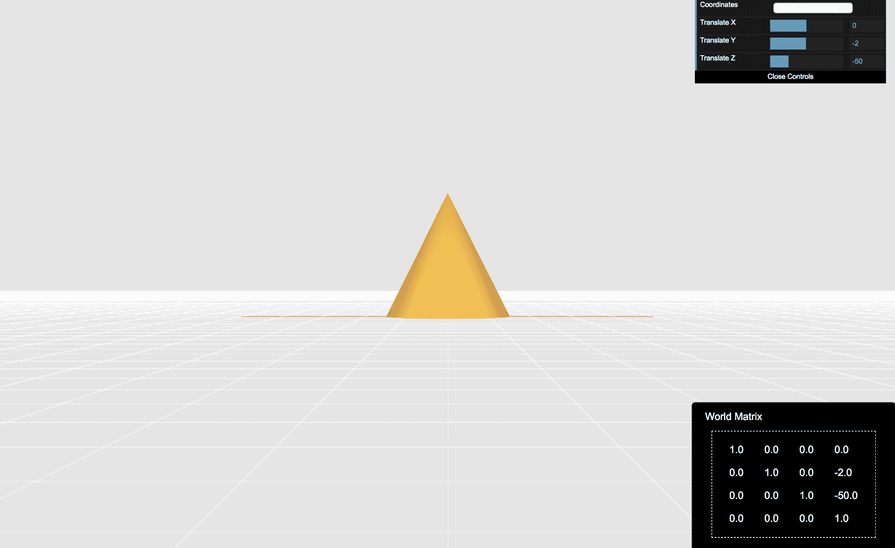

1.  从远处看，我们正在观察位于世界原点的圆锥体的正 z 轴。有三个滑块，分别允许你在`x`、`y`和`z`轴上平移世界或摄像机。默认情况下激活的是世界空间。

1.  通过查看屏幕上的世界矩阵，你能说出世界原点在哪里吗？是`[0, 0, 0]`吗？

提示

检查我们在模型视图矩阵中定义平移的位置。

1.  我们可以将`canvas`视为摄像机看到的图像。如果世界的中心在`[0, -2, -50]`，那么摄像机在哪里？

1.  如果我们想靠近圆锥，我们需要将世界中心移向相机。我们知道相机在世界正 z 轴上很远，所以平移将发生在 z 轴上。鉴于我们处于世界坐标中，我们需要增加还是减少 z 轴滑块？去测试你的答案。

1.  切换到相机坐标。这个矩阵的平移分量是什么？如果你想将相机移近圆锥，你需要做什么？最终的平移看起来像什么？你能得出什么结论？

1.  尝试在 x 轴和 y 轴上移动相机。检查相应的变换在模型视图矩阵中会是什么样子。

***发生了什么？***

我们看到相机平移是模型视图矩阵平移的逆。我们还学习了在变换矩阵中找到平移信息的位置。

# 相机旋转

同样，如果我们想将相机向右旋转 `45` 度，这相当于将世界向左旋转 `45` 度。使用 **glMatrix** 实现这一点，我们可以编写以下代码：

```js
mat4.rotate(modelViewMatrix, modelViewMatrix, 45 * Math.PI/180, [0, 1, 0]);
```

与我们之前探索平移的章节类似，在 *时间行动：世界空间与相机空间中的旋转* 部分中，我们将实验世界和相机空间中的旋转。让我们看看这个行为是如何实现的！

# 时间行动：世界空间与相机空间中的旋转

让我们通过一个例子来展示不同空间中的不同旋转：

1.  在你的浏览器中打开 `ch04_02_model-view-rotation.html`：

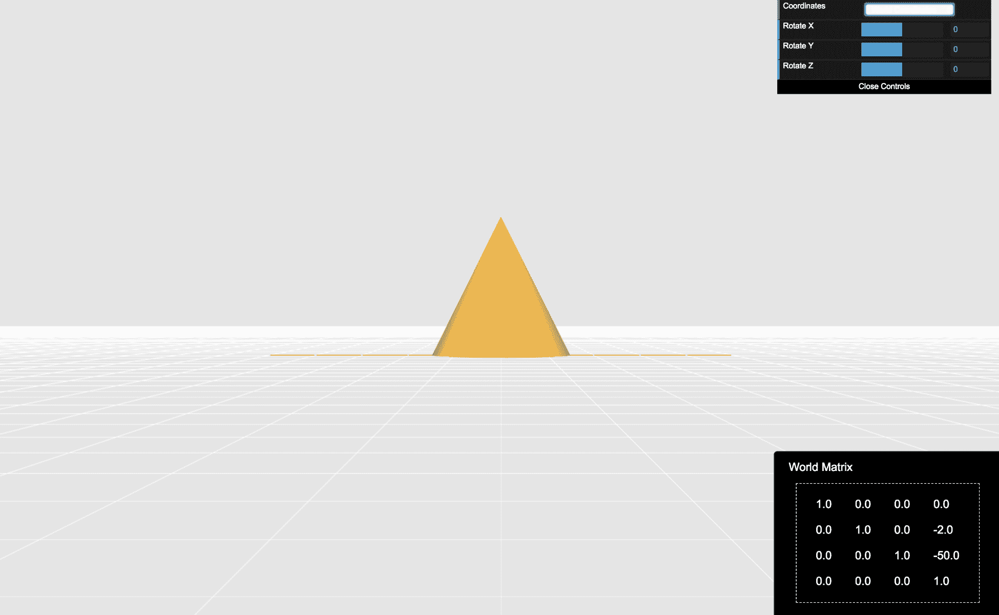

1.  就像我们在上一个例子中所做的那样，我们将看到以下内容：

    +   圆锥位于世界原点

    +   相机位于世界坐标 `[0, 2, 50]`

    +   三个滑块，允许我们旋转世界或相机

    +   一个矩阵，我们可以看到不同旋转的结果

1.  让我们看看应用旋转后轴会发生什么。在 **世界** 坐标选择下，围绕 x 轴旋转世界 `90` 度。模型视图矩阵看起来像什么？

1.  让我们看看在 x 轴周围旋转 `90` 度后，轴会落在何处：

    +   通过查看第一列，我们可以看到 x 轴没有变化。它仍然是 `[1, 0, 0]`。这很有道理，因为我们围绕这个轴旋转。

    +   矩阵的第二列指示旋转后 y 轴的位置。在这种情况下，我们从 `[0, 1, 0]`，即原始配置，变到 `[0, 0, 1]`，这是从屏幕中伸出的轴。这是初始配置中的 z 轴。这很有道理，因为我们现在是从上方向下看圆锥。

    +   矩阵的第三列指示了 z 轴的新位置。它从 `[0, 0, 1]` 变化，正如我们所知，这是标准空间配置（没有变换）中的 z 轴，到 `[0, -1, 0]`，这是原始配置中 y 轴的负部分。这很有道理，因为我们围绕 x 轴旋转：

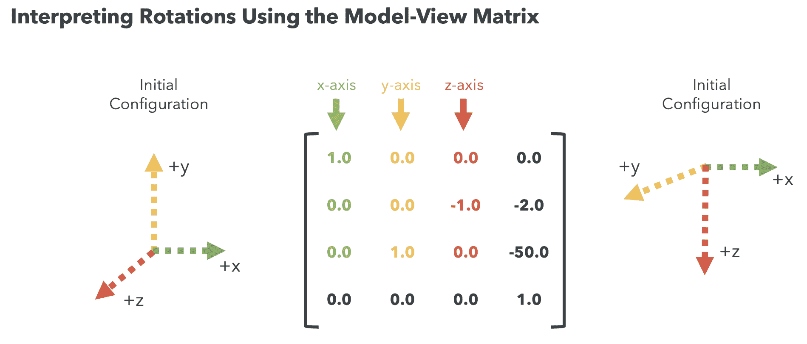

1.  正如我们刚刚看到的，理解旋转矩阵（模型视图矩阵的左上角 3x3 部分）很简单：前三个列始终告诉我们轴在哪里。

1.  在以下变换中，坐标轴在哪里？请看下面的图：

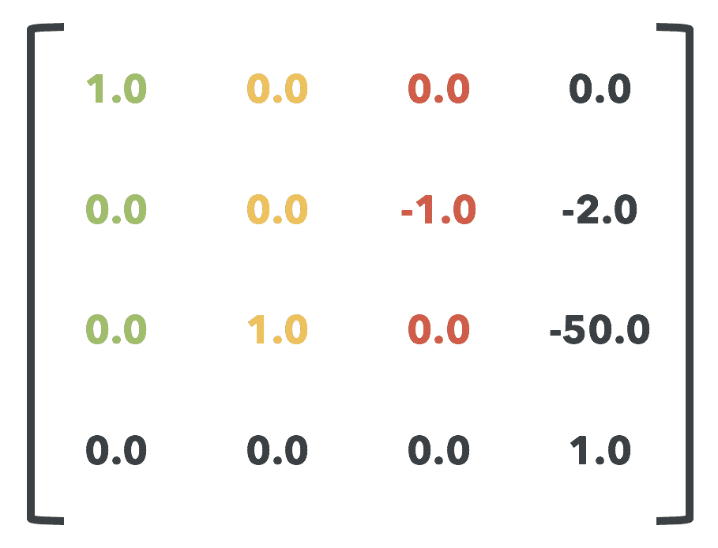

1.  通过使用滑块来达到你认为产生此矩阵的旋转来检查你的答案。

1.  让我们看看在**摄像机**空间中旋转是如何工作的，通过改变坐标和选择。

1.  通过增加滑块位置来增加 x 轴旋转的角度。你注意到什么？

1.  使用滑块，在摄像机空间中尝试不同的旋转。

1.  旋转是**交换律**的吗？也就是说，如果你在 x 轴上旋转`5`度，在 z 轴上旋转`90`度，与先在 z 轴上旋转`90`度然后在 x 轴上旋转`5`度相比，你会得到相同的结果吗？

1.  返回到世界空间。请记住，当你处于世界空间时，你需要反转旋转以获得相同的姿态，例如，如果你在 x 轴上应用`5`度，在 z 轴上应用`90`度，验证当你应用`-5`度在 x 轴上和`-90`度在 z 轴上时，你获得相同的结果。

***刚才发生了什么？***

我们刚刚了解到摄像机矩阵的旋转是模型视图矩阵旋转的逆。我们还学习了如何通过分析旋转矩阵（相应变换矩阵的左上角 3x3 部分）来识别我们的世界或摄像机的方向。

# 尝试：结合旋转和变换

让我们看看我们如何将旋转和变换结合起来：

1.  `ch04_03_model-view.html`文件包含了旋转和变换的组合。当你打开它时，你的浏览器将显示如下内容：

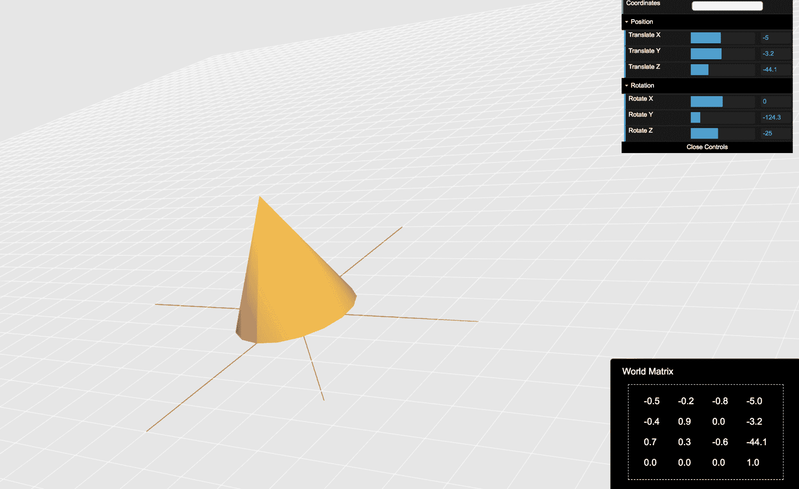

1.  尝试在**世界**和**摄像机**空间中不同的旋转和变换配置。

# 摄像机矩阵是模型视图矩阵的逆

这两种情况帮助我们理解摄像机矩阵是模型视图矩阵的完全相反。在线性代数中，这种性质被称为矩阵的**逆**。

矩阵的逆是当它与原始矩阵相乘时，我们得到单位矩阵。换句话说，如果`M`是模型视图矩阵，`C`是摄像机矩阵，我们得到以下结果：

我们可以使用**glMatrix**编写如下内容来创建摄像机矩阵：

```js
const cameraMatrix = mat4.create();
mat4.invert(cameraMatrix, modelViewMatrix);
```

# 思考 WebGL 中的矩阵乘法

在继续前进之前，我们应该注意，在 WebGL 中，矩阵操作是按照它们应用于顶点的**相反顺序**编写的。这是对新手 3D 图形开发者来说经常令人困惑的重要注意事项。

让我们暂时假设你正在编写旋转/移动世界的代码；也就是说，你围绕原点旋转你的顶点，然后移动离开。最终的变换将看起来像这样：

在这里，`R` 是编码纯旋转的 4x4 矩阵；`T` 是编码纯平移的 4x4 矩阵，而 `v` 对应于场景中存在的顶点（在齐次坐标中）。

现在，你应该已经注意到，我们首先应用于顶点的变换是平移，然后是旋转。顶点需要首先乘以左侧的矩阵。在这种情况下，该矩阵是 `T`。然后，结果需要乘以 `R`。

这一事实反映在操作顺序中（这里，`modelViewMatrix` 是模型-视图矩阵）：

```js
mat4.identity(modelViewMatrix);
mat4.translate(modelViewMatrix, modelViewMatrix, position);
mat4.rotateX(modelViewMatrix, modelViewMatrix, rotation[0] * Math.PI / 180);
mat4.rotateY(modelViewMatrix, modelViewMatrix, rotation[1] * Math.PI / 180);
mat4.rotateZ(modelViewMatrix, modelViewMatrix, rotation[2] * Math.PI / 180);
```

如果我们在相机坐标系中工作，并且想要应用之前的相同变换，我们首先需要应用一些线性代数：

| `` | 模型-视图 `M` 矩阵是旋转和平移相乘的结果。 |
| --- | --- |
| `` | 我们知道相机矩阵是模型-视图矩阵的逆。 |
| `` | 通过代入。 |
| `` | 矩阵乘积的逆是逆矩阵的逆序乘积。 |

幸运的是，在本章的示例中，当我们使用相机坐标系时，我们已经计算了全局变量 `position` 和 `rotation` 中的逆平移和逆旋转。因此，我们可以在代码中写出如下内容（这里，`cameraMatrix` 是相机矩阵）：

```js
mat4.identity(cameraMatrix);
mat4.rotateX(cameraMatrix, cameraMatrix, rotation[0] * Math.PI / 180);
mat4.rotateY(cameraMatrix, cameraMatrix, rotation[1] * Math.PI / 180);
mat4.rotateZ(cameraMatrix, cameraMatrix, rotation[2] * Math.PI / 180);
mat4.translate(cameraMatrix, cameraMatrix, position); 
```

# 基本相机类型

在本章中，我们将讨论以下两种相机类型：

+   环绕相机

+   追踪相机

# 环绕相机

到目前为止，我们已经学习了如何在世界或相机坐标系中生成旋转和平移。然而，在两种情况下，我们总是在世界中心周围生成旋转。当我们围绕一个 3D 对象，如我们的汽车模型旋转时，这可能很理想。在那个例子中，你将对象放在世界中心，然后从不同的角度（旋转）检查对象，之后你可以移动（平移）以查看结果。我们将此类相机称为**环绕相机**。

# 追踪相机

如果我们回到第一人称射击游戏的例子，我们需要有一个相机，当我们想要检查是否有敌人在我们上方时，它可以向上看。我们还应该能够左右旋转（旋转）并沿着相机指向的方向移动（平移）。这种类型的相机可以称为**第一人称**相机。当游戏跟随主要角色时，也使用相同的类型。因此，它通常被称为**追踪相机**。

要实现第一人称相机，我们需要在相机轴上设置旋转，而不是使用世界原点。

# 围绕其位置旋转相机

在乘矩阵时，乘法的顺序是相关的。比如说，我们有两个 4x4 矩阵。让`R`是第一个矩阵，假设这个矩阵编码了纯旋转；让`T`是第二个矩阵，假设`T`编码了纯平移。现在：

换句话说，操作的顺序会影响结果。围绕原点旋转然后远离它（环绕相机）与先平移原点然后围绕它旋转（跟踪相机）是不同的！你的成功取决于理解这个关键的区别。

为了将相机位置设置为旋转的中心，我们需要颠倒操作调用的顺序。这相当于从环绕相机转换为跟踪相机。

# 在视线方向上平移相机

使用环绕相机时，相机将始终朝向世界中心。因此，我们将始终使用 z 轴来移动到和离开我们正在检查的对象。然而，使用跟踪相机时，由于旋转发生在相机位置，我们最终可以看向世界中的任何位置（如果你想要四处移动和探索，这是理想的）。因此，我们需要知道相机在世界坐标中指向的方向（相机轴）。我们将在下一部分看到如何获得这个方向。

# 相机模型

就像它的对应矩阵，模型视图矩阵一样，相机矩阵编码了相机方向的信息。正如我们可以在以下图中看到的那样，左上角的 3x3 矩阵对应于相机轴：

+   第一列对应于相机的 x 轴。我们将它称为`RightVector`。

+   第二列是相机的 y 轴。这将是`UpVector`。

+   第三列决定了相机可以前后移动的向量。这是相机的 z 轴，我们将它称为`CameraAxis`。

因为相机矩阵是模型视图矩阵的逆矩阵，所以相机矩阵中包含的左上角 3x3 旋转矩阵给出了相机轴在世界空间中的方向。这是一个优点，因为它意味着我们只需查看这个 3x3 旋转矩阵的列就可以知道我们相机在世界空间中的方向（我们现在知道每一列代表什么）：

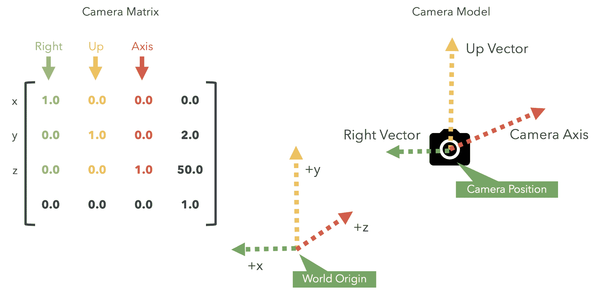

在下一节中，我们将玩环绕和跟踪相机，看看我们如何使用鼠标手势和滑块来改变相机位置。此外，我们还将查看结果的模型视图矩阵的图形表示。在这个练习中，我们将整合旋转和平移，并观察它们在两种基本类型的相机下如何表现。

# 行动时间：探索展厅

让我们来看一个涵盖各种相机类型的例子：

1.  在浏览器中打开`ch04_04_camera-types.html`文件。你会看到以下类似的内容：

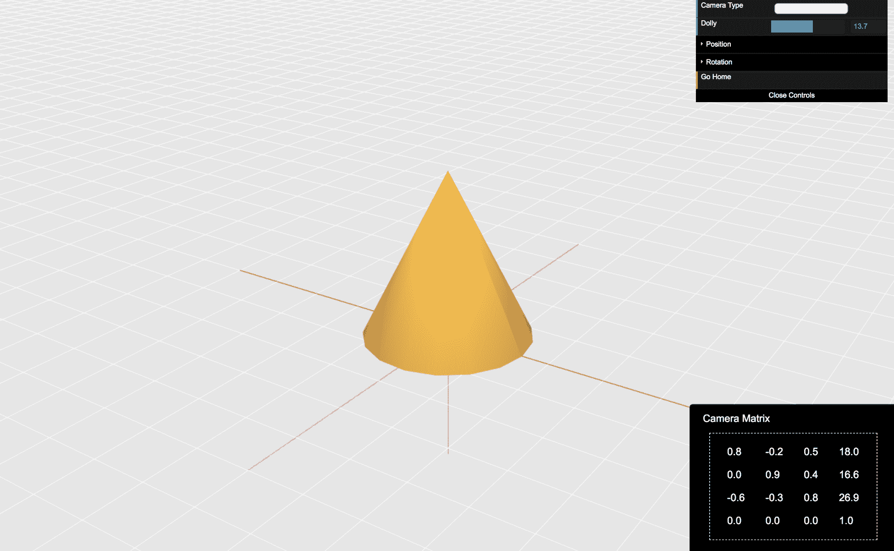

1.  使用 Trackingmode 中的滑块在世界各地环游。酷吧？

1.  将相机类型更改为 Orbitingmode，并执行相同的操作。

1.  请确认，除了滑块控制外，在 Tracking 和 Orbiting 模式下，你还可以使用鼠标和键盘在世界各地移动。

1.  在这个练习中，我们使用两个新的类实现了相机：

    +   `Camera`：用于操作相机。

    +   `Controls`：将相机连接到`canvas`。现在`canvas`将接收鼠标和键盘事件并将它们传递给相机。

1.  如果你好奇，你可以在`common/js`目录中查看这两个类的源代码。我们已经将本章中解释的概念应用到这两个类的构建中。

1.  到目前为止，我们在世界的中心看到了一个圆锥体。随着我们的探索，让我们将其更改为更有趣的东西。在源代码编辑器中打开`ch04_04_camera-types.html`文件。

1.  前往`load`函数。让我们将汽车添加到场景中。将此函数的内容重写为以下内容：

```js
function load() {
  scene.add(new Floor(2000, 100));
  scene.add(new Axis(2000));
  scene.loadByParts('/common/models/nissan-gtr/part', 178);
}
```

1.  你会看到我们增加了轴和地板的大小，这样我们才能看到它们。我们需要这样做，因为汽车模型比原始的圆锥体大得多。

1.  为了正确地看到汽车，我们需要采取几个步骤。我们需要确保我们有一个足够大的视场。前往`updateTransforms`函数并更新此行：

```js
mat4.perspective(projectionMatrix, 45, canvas.width / canvas.height, 0.1, 1000);
```

用这个替换：

```js
mat4.perspective(projectionMatrix, 45, canvas.width / canvas.height, 0.1, 5000);
```

1.  将相机类型更改为，以便在加载页面时，我们默认有一个环绕相机。在`configure`函数中更改此行：

```js
camera = new Camera(Camera.TRACKING_TYPE);
```

用这个替换：

```js
camera = new Camera(Camera.ORBITING_TYPE);
```

1.  我们还必须考虑相机位置。对于像这样的大型物体，我们需要远离世界的中心。为此，我们需要将`camera.goHome`的默认位置从`[0, 2, 50]`更改为`[0, 25, 300]`。

1.  让我们修改场景的照明，使其更适合我们正在显示的模型。在`configure`函数中更新以下内容：

```js
gl.uniform3fv(program.uLightPosition, [0, 120, 120]);
gl.uniform4fv(program.uLightAmbient, [0.2, 0.2, 0.2, 1]);
gl.uniform4fv(program.uLightDiffuse, [1, 1, 1, 1]);
```

用这个替换：

```js
gl.uniform4fv(program.uLightAmbient, [0.1, 0.1, 0.1, 1]);
gl.uniform3fv(program.uLightPosition, [0, 0, 2120]);
gl.uniform4fv(program.uLightDiffuse, [0.7, 0.7, 0.7, 1]);
```

1.  使用不同的名称保存文件，然后在浏览器中加载这个新文件。你应该会看到以下截图类似的内容：

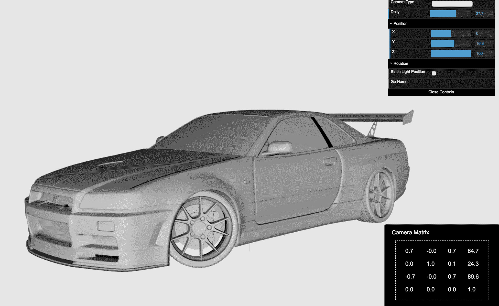

1.  使用鼠标、键盘和/或滑块来探索新场景。

1.  使用环绕模式从不同的角度探索汽车。

1.  看看当你移动场景时，Camera 矩阵是如何更新的。

1.  你可以通过打开`ch04_05_car.html`文件来查看最终练习的样子。

***发生了什么？***

我们在我们的场景中添加了鼠标和键盘交互。我们还尝试了两种基本的相机类型：*跟踪*和*环绕*相机。最后，我们修改了场景的设置以可视化复杂模型。

# 尝试更新光源位置

正如我们所看到的，通过移动相机，我们正在对世界应用逆变换。如果我们不更新光照位置，无论对世界应用了什么最终变换，光源都将位于相同的静态点。

当我们在场景中移动或探索对象时，这非常方便。我们总能看到光是否位于与相机相同的轴上。这是本章练习的情况。尽管如此，我们也可以模拟当相机移动与光源独立的情况。为此，我们需要在移动相机时计算新的光照位置。

首先，我们计算光的方向。我们可以通过简单地计算目标和原点之间的差向量来完成。假设光源位于`[0, 2, 50]`。如果我们想将光源指向原点，我们计算`[0, 0, 0] - [0, 2, 50]`向量（目标-原点）。当目标为原点时，这个向量具有正确的光方向。如果我们有一个需要照明的不同目标，我们重复相同的程序。在这种情况下，我们只需使用目标的坐标，并从中减去光源的位置。

由于我们正在将光源指向原点，我们可以通过反转光照位置来找到光的方向。正如你可能已经注意到的，我们在本章节的早期在顶点着色器中这样做：

```js
vec3 L = normalize(-uLightPosition);
```

由于`light`是一个向量，如果我们想更新光的方向，我们需要使用本章前面讨论过的法线矩阵，在任何世界变换下更新这个向量。这一步在顶点着色器中是可选的：

```js
if (uFixedLight) {
  L = vec3(uNormalMatrix * vec4(L, 0.0));
}
```

在之前的代码片段中，`light`被扩展为四个分量，因此我们可以使用 ESSL 提供的直接乘法。（记住，`uNormalMatrix`是一个 4x4 矩阵，因此它转换的向量需要是四维的。）请记住，正如本章节开头所解释的，向量的齐次坐标始终设置为`0`，而顶点的齐次坐标设置为`1`。

1.  在乘法之后，我们将结果减少到三个分量，然后再将结果赋值回`light`。

1.  你可以通过使用`ch04_05_car.html`文件中提供的“静态光照位置”按钮来测试更新光照位置的效果。

1.  我们将跟踪此按钮状态的全局变量与`uUpdateLight`统一变量连接。

1.  编辑`ch04_05_car.html`并设置光照位置到不同的位置。为此，编辑`configure`函数。前往以下位置：

```js
gl.uniform3fv(program.uLightPosition, [0, 0, 2120]);

```

1.  尝试不同的光照位置：

    +   `[2120, 0, 0]`

    +   `[0, 2120, 0]`

    +   `` `[100, 100, 100]` ``

1.  对于每个选项，保存文件，并尝试更新和不更新光照位置（使用“静态光照位置”按钮）：

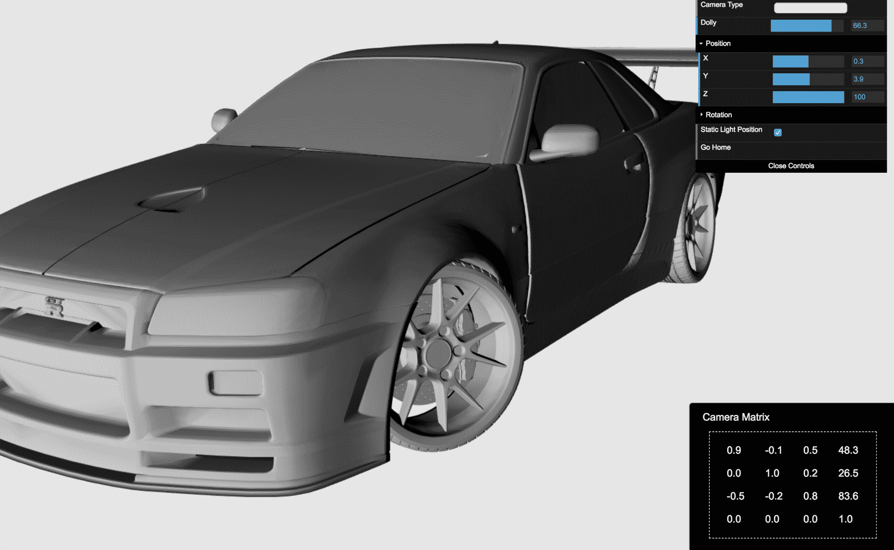

1.  为了更好的可视化，使用**环绕**相机。

# 投影矩阵

在本章的开头，我们了解到**投影矩阵**结合了投影变换和透视除法。这两个步骤将 3D 场景转换为立方体，然后通过视口变换将其映射到 2D `canvas`。

在实践中，投影矩阵决定了摄像机捕获的图像的几何形状。在现实世界的摄像机中，摄像机的镜头将决定最终图像的扭曲程度。在 WebGL 世界中，我们使用投影矩阵来模拟这种效果。此外，与在现实世界中我们的图像总是受到透视影响不同，在 WebGL 中，我们可以选择不同的表示（如正交投影）。

# 视野

投影矩阵决定了摄像机的**视野**（**FOV**），即摄像机将捕捉多少 3D 空间。视野是一个以度为单位给出的度量，该术语与**视场角**一词可以互换使用：

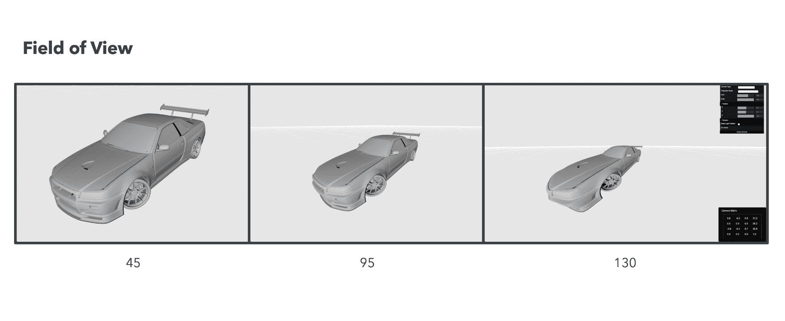

# 透视或正交投影

透视投影将更多空间分配给靠近摄像机的细节，而不是远离摄像机的细节。换句话说，靠近摄像机的几何形状看起来比远离摄像机的几何形状更大。这是我们眼睛看到现实世界的方式。透视投影使我们能够评估距离，因为它给我们的大脑提供了一个*深度线索*。

相比之下，正交投影使用平行线；这意味着线条看起来大小相同，无论它们与摄像机的距离如何。因此，使用正交投影时，深度线索会丢失。

虽然透视投影提供了更真实的场景视图，但在工程中通常使用正交投影作为一种产生明确传达尺寸的对象规范的手段。每条单位长度（厘米、米）的线条在图纸上的任何地方看起来长度都相同。这使得绘图员只需标注部分线条，并让读者知道图纸上的其他相同长度的线条在现实中也是相同长度的。图纸上的每条平行线在物体中也是平行的。

如果你正在观察一个包含建筑物的更大场景，那么正交渲染可以给出建筑物之间距离及其相对尺寸的确切测量。

在透视模式下，由于透视缩短，相同实际长度的线条看起来会不同。这使判断相对尺寸和物体大小变得困难。

使用**glMatrix**，我们可以通过调用`mat4.perspective`或`mat4.ortho`分别设置透视或正交投影。这些方法的签名如下：

| **函数** | **描述** |
| --- | --- |

|

```js
mat4.perspective(
  dest,
  fovy,
  aspect,
  near,
  far
);
```

| 生成具有给定边界的透视投影矩阵。**参数：**

+   `dest`: 将写入的`mat4`视锥矩阵

+   `fovy`: 垂直视野

+   `aspect`：宽高比，通常是`width / height`视窗

+   `near`，`far`：视锥体的近点和远点边界

|

|

```js
mat4.ortho(
  dest,
  left,
  right,
  bottom,
  top,
  near,
  far
);
```

| 生成具有给定边界的正交投影矩阵：**参数：**

+   `dest`：将矩阵写入的`mat4`视锥体

+   `left`，`right`：视锥体的左侧和右侧边界

+   `bottom`，`top`：视锥体的底部和顶部边界

+   `near`，`far`：视锥体的近点和远点边界

|

在“行动时间：正交和透视投影”部分，我们将测试视野和透视投影如何影响我们的相机捕捉到的图像。我们将对旋转和跟踪相机进行透视和正交投影的实验。

# 行动时间：正交和透视投影

让我们看看一个涵盖不同投影类型的例子：

1.  在您的浏览器中打开`ch04_06_projection-modes.html`文件。

1.  这个练习与上一个非常相似。然而，在投影模式中有两个新的选项：透视和正交投影。如你所见，透视默认是激活的。

1.  将相机类型更改为“Orbiting”。

1.  将投影模式更改为正交。

1.  探索场景。注意正交投影缺乏深度提示：

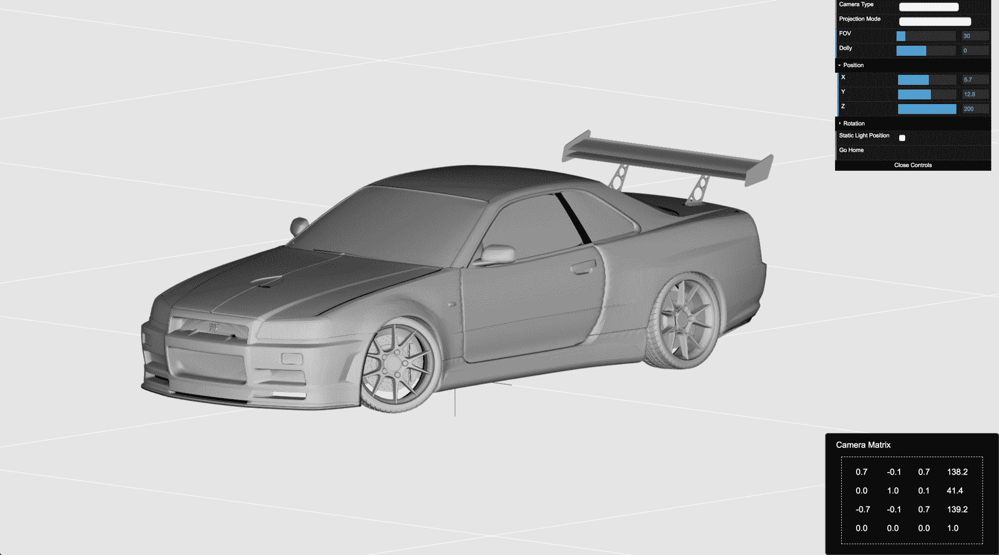

1.  切换到透视模式：

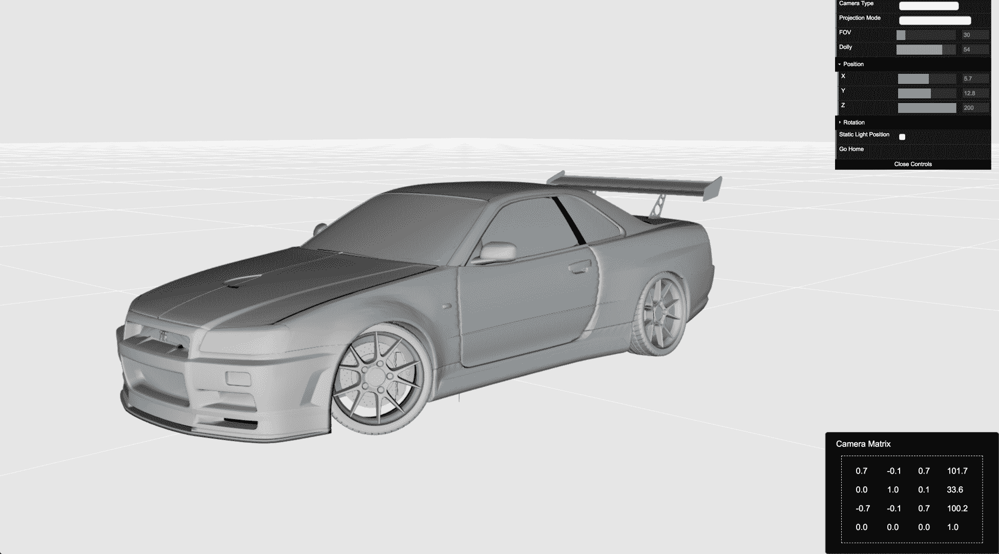

1.  探索源代码。转到`updateTransforms`函数：

```js
function updateTransforms() {
  const { width, height } = canvas;

  if (projectionMode === PERSPECTIVE_PROJECTION) {
    mat4.perspective(
      projectionMatrix, 
      fov, 
      width / height, 
      10, 
      5000
    );
  }
  else {
    mat4.ortho(projectionMatrix,
      -width / fov,
      width / fov,
      -height / fov,
      height / fov,
      -5000,
      5000
    );
  }
}
```

1.  看看我们用来设置投影视图的参数。

1.  注意，当你增加视野（`fov`）时，你的相机将捕捉到更多的 3D 空间。把这想象成现实世界相机的镜头。使用广角镜头，你可以捕捉到更多的空间，但代价是当物体移动到你的视窗边界时，它们会变形。

***发生了什么？***

我们尝试了不同的投影矩阵配置，并看到了这些配置如何在场景中产生不同的结果。

# 尝试一下：整合模型视图和投影变换

回想一下，一旦我们将模型视图变换应用于顶点，下一步就是将视图坐标转换为 NDC 坐标：

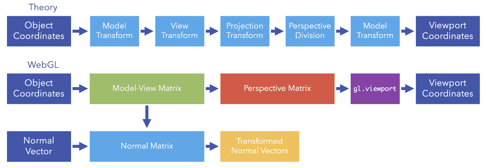

我们通过在顶点着色器中使用 ESSL 进行简单乘法来完成这个操作：

```js
gl_Position = uProjectionMatrix * uModelViewMatrix * vec4(aVertexPosition,1.0);
```

预定义变量`gl_Position`存储场景中每个对象的每个顶点的 NDC 坐标。

在之前的乘法中，我们将着色器属性`aVertexPosition`扩展为 4 个分量的顶点，因为我们的矩阵是 4x4 的。与法线不同，顶点有一个等于一的齐次坐标（`w=1`）。

在这一步之后，WebGL 会将计算出的裁剪坐标转换为归一化设备坐标，然后通过 WebGL 的`viewport`函数将其转换为`canvas`坐标。让我们看看当我们改变这种映射时会发生什么：

1.  在您的源代码编辑器中打开`ch04_06_projection-modes.html`文件。

1.  前往`draw`函数。这是每次我们与场景交互时（通过使用鼠标、键盘或页面上的小部件）调用的渲染函数。

1.  找到以下行：

```js
gl.viewport(0, 0, canvas.width, canvas.height);
```

1.  尝试以下三个操作：

```js
const width = canvas.width,
  height = canvas.height,
  halfWidth = width / 2,
  halfHeight = height / 2;

// First
gl.viewport(0, 0, halfWidth, halfHeight);

// Second
gl.viewport(halfWidth, halfHeight, width, height);

// Third
gl.viewport(50, 50, width - 100, height - 100);
```

1.  对于每个选项，保存文件并在浏览器中打开它。

1.  你看到了什么？请注意，你可以像以前一样与场景进行交互。

# WebGL 示例的结构

我们改进了本章中代码示例的结构。随着我们的 WebGL 应用程序复杂性的增加，拥有一个良好、可维护且清晰的架构是明智的。我们将这一部分留到了本章的末尾，以便你在处理练习时可以作为参考。

就像之前的练习一样，我们的入口点是`init`函数，它在页面加载时被调用。我们在文档的`head`中包含了几个`scripts`，它们指向各种组件以构建我们的 3D 应用程序。

# 支持对象

我们已经创建了以下组件，每个组件都在`common/js`目录下的单独文件中：

+   `Program.js`：使用着色器定义创建程序。提供 JavaScript 变量（`program.*`）与程序属性和统一变量的映射。

+   `Scene.js`：维护要渲染的对象列表。包含 AJAX/JSON 功能，用于检索远程对象。它还允许我们将本地对象添加到场景中。

+   `Floor.js`：在 X-Z 平面上定义一个网格。此对象添加到`scene`中，以便有对地板及其属性的引用

+   `Axis.js`：表示世界空间中的轴。当添加到`scene`中时，我们将有一个对原点的引用。

+   `Camera.js`：创建一个相机实例，通过简单的接口来操作本章中涵盖的各种矩阵和操作。

+   `EventEmitter.js`：一个简单的发布/订阅事件发射器，用于解耦我们的 WebGL 应用程序中的各种组件。我们可以在不相关的功能之间传递硬引用的情况下，利用发布/订阅模式来发射和监听动作。

+   `Clock.js`：一个简单的类，它抽象了`requestAnimationFrame` API，以便整个 WebGL 应用程序从单一的真实来源（如`clock`）更新。

`requestAnimationFrame``window.requestAnimationFrame()`方法告诉浏览器你希望执行动画，并请求浏览器在下次重绘之前调用指定的函数来更新动画。这将请求在浏览器执行下次重绘之前调用你的动画函数。

+   `Controls.js`：提供捕获各种`canvas` DOM 事件的能力，以驱动交互。

+   `utils.js`：我们在前面的章节中介绍过的实用函数。

虽然我们有足够的基礎来理解每个组件的工作原理，但我们将在第九章*，整合一切*中涵盖每个组件。也就是说，如果你迫不及待，可以自由地检查源代码，以了解接下来会发生什么。

# 生命周期函数

以下函数定义了`WebGLApp`应用程序的生命周期。

# 配置函数

`configure`函数设置我们的`gl`上下文的一些参数，例如清除`canvas`的颜色。在配置必要的状态之后。

# 加载函数

`load`函数设置要添加到我们的`scene`中的对象。例如，通过调用`add`方法将两个本地创建的对象`floor`和`axis`添加到`scene`中。之后，使用`scene.load`方法通过 AJAX 调用加载远程对象。

# 绘制函数

`draw`函数调用`updateTransforms`来计算新位置（即当我们移动时）的矩阵，然后遍历`scene`中的对象以渲染它们。在这个循环内部，它为每个要渲染的对象调用`setMatrixUniforms`。

# 矩阵处理函数

在您的编辑器中打开`ch04_02_model-view-rotation.html`。以下是一些初始化、更新并将矩阵传递给着色器的函数。

# initTransforms

如您所见，模型视图矩阵、相机矩阵、投影矩阵和法线矩阵在这里设置：

```js
function initTransforms() {
  mat4.identity(modelViewMatrix);
  mat4.translate(modelViewMatrix, modelViewMatrix, home);

  mat4.identity(cameraMatrix);
  mat4.invert(cameraMatrix, modelViewMatrix);

  mat4.identity(projectionMatrix);

  mat4.identity(normalMatrix);
  mat4.copy(normalMatrix, modelViewMatrix);
  mat4.invert(normalMatrix, normalMatrix);
  mat4.transpose(normalMatrix, normalMatrix);
}
```

# updateTransforms

在`updateTransforms`中，我们使用全局变量的位置和旋转的内容来更新矩阵。这当然是以下内容：

```js
function updateTransforms() {
  mat4.perspective(projectionMatrix, 45,canvas.width /gl.canvas.height, 
   0.1, 1000);

  if (coordinates === WORLD_COORDINATES) {
    mat4.identity(modelViewMatrix);
    mat4.translate(modelViewMatrix, modelViewMatrix, position);
    mat4.rotateX(modelViewMatrix, modelViewMatrix, rotation[0] * Math.PI / 
     180);
    mat4.rotateY(modelViewMatrix, modelViewMatrix, rotation[1] * Math.PI / 
     180);
    mat4.rotateZ(modelViewMatrix, modelViewMatrix, rotation[2] * Math.PI / 
     180);
  }
  else {
    mat4.identity(cameraMatrix);
    mat4.translate(cameraMatrix, cameraMatrix, position);
    mat4.rotateX(cameraMatrix, cameraMatrix, rotation[0] * Math.PI / 180);
    mat4.rotateY(cameraMatrix, cameraMatrix, rotation[1] * Math.PI / 180);
    mat4.rotateZ(cameraMatrix, cameraMatrix, rotation[2] * Math.PI / 180);
  }
}
```

# setMatrixUniforms

此函数执行以下映射：

```js
function setMatrixUniforms() {
  if (coordinates === WORLD_COORDINATES) {
    mat4.invert(cameraMatrix, modelViewMatrix);
    gl.uniformMatrix4fv(program.uModelViewMatrix, false, modelViewMatrix);
  }
  else {
    mat4.invert(modelViewMatrix, cameraMatrix);
  }

  gl.uniformMatrix4fv(program.uProjectionMatrix, false, projectionMatrix);
  gl.uniformMatrix4fv(program.uModelViewMatrix, false, modelViewMatrix);
  mat4.transpose(normalMatrix, cameraMatrix);
  gl.uniformMatrix4fv(program.uNormalMatrix, false, normalMatrix);
}
```

# 概述

让我们总结一下本章所学的内容：

+   WebGL 中没有相机对象。然而，我们可以使用模型视图矩阵构建一个。

+   3D 对象经过几个变换才能在 2D 屏幕上显示。这些变换表示为 4x4 矩阵。

+   场景变换是仿射的。仿射变换由一个线性变换后跟一个平移组成。WebGL 将仿射变换组合到三个矩阵中：模型视图矩阵、投影矩阵和法线矩阵，以及一个 WebGL 操作：`gl.viewport()`。

+   仿射变换应用于投影空间，因此可以用 4x4 矩阵表示。要在投影空间中工作，顶点需要增加一个额外的项，即`w`，称为透视坐标。四元组`(x, y, z, w)`称为齐次坐标。齐次坐标允许通过使透视坐标`w = 0`来表示在无穷远处相交的直线。向量始终有一个齐次坐标，`w = 0`，而点有一个齐次坐标，即`w = 1`（除非它们在无穷远处，在这种情况下`w = 0`）。

+   默认情况下，WebGL 场景从 z 轴负方向的世界原点进行查看。这可以通过更改模型视图矩阵来改变。

+   摄像矩阵是模型视图矩阵的逆矩阵。摄像和世界操作是相反的。有两种基本的摄像机类型：*轨道*和*跟踪*。

+   当对象进行仿射变换时，法线会得到特殊处理。法线通过法线矩阵进行变换，该矩阵可以从模型视图矩阵中获得。

+   投影矩阵使我们能够确定两种基本的投影模式：*正交*投影和*透视*投影。

在下一章中，我们将学习如何区分全局和局部变换。我们将研究那些*全局*变换，正如我们在这里所讨论的，以及那些针对我们 3D 场景中单个对象的*局部*变换。
