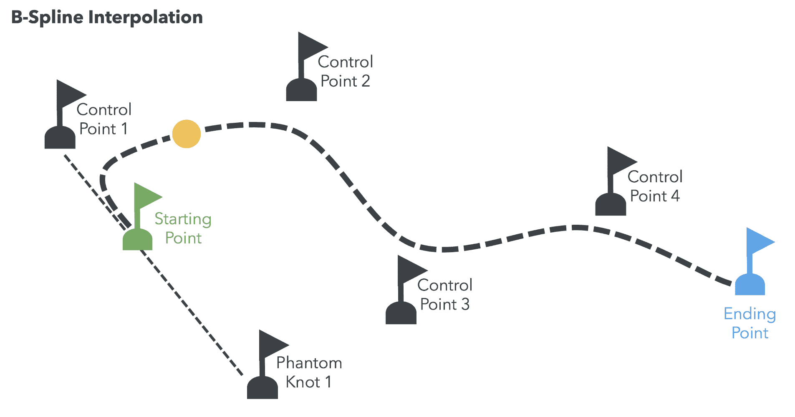

# 动画

在上一章中，我们介绍了矩阵、变换和相机。到目前为止，我们只讨论了静态场景，其中所有交互都是由移动相机完成的。在这些交互中，对 3D 场景中的所有对象应用了相机变换；因此，我们称之为**全局**变换。然而，3D 场景中的对象可以有自己的动作。例如，在赛车游戏中，每辆车都有自己的速度和轨迹。在第一人称射击游戏中，敌人可以躲在障碍物后面，前来战斗，或者简单地逃跑。一般来说，这些动作中的每一个都被建模为一个附加到场景中相应演员的矩阵变换。这些被称为**局部**变换。

在本章中，你将：

+   了解全局变换和局部变换之间的区别。

+   了解矩阵栈以及如何使用它们进行动画。

+   使用 JavaScript 计时器进行基于时间的动画。

+   了解参数曲线。

+   了解插值。

+   探索各种插值技术。

# WebGL 矩阵命名约定

在我们继续之前，让我们花一点时间快速总结一下关于矩阵命名的约定。正如我们所见，WebGL 是一个简单的 API，几乎所有内容（除了少数预定义的名称，如`gl_Position`）都是由程序员你定义的。话虽如此，确实存在一些常见的和半常见的命名约定。这在矩阵方面尤其如此。以下是我们已经覆盖的一些重要约定，以及我们将很快介绍的一些新约定：

+   **世界矩阵:** 有时被称为**模型矩阵**，这是一个矩阵，它将模型的顶点移动到世界空间。

+   **相机矩阵:** 这个矩阵将相机定位在世界中。你也可以将其视为相机的世界矩阵。

+   **视图矩阵:** 这个矩阵将世界中的其他所有内容移动到相机前面。正如我们所见，这是相机矩阵的逆矩阵。

+   **投影矩阵:** 这是将空间的一个截锥体转换为裁剪空间的矩阵。你也可以将其视为你的矩阵数学库的透视或正交函数返回的矩阵。

+   **局部矩阵:** 这个矩阵用于场景图中，在图上的任何特定节点上使用的矩阵在与其他任何节点相乘之前使用。

**场景图:** 这是一个数据结构，通常由基于向量的图形编辑应用程序和现代计算机游戏使用，它安排了图形场景的逻辑和通常空间表示。场景图是一个图或树结构中的节点集合。有关更多信息，请访问[`en.wikipedia.org/wiki/Scene_graph`](https://en.wikipedia.org/wiki/Scene_graph)。

# 矩阵栈

**矩阵栈**提供了一种方法，可以在我们的场景中对单个对象应用局部变换，同时保留全局变换。

矩阵栈在每个渲染周期（每次调用我们的`render`函数）中工作，因为每个渲染周期都需要计算场景矩阵以响应相机移动。我们在将矩阵传递给着色程序（作为`attributes`）之前，首先更新场景中每个对象的模型视图矩阵。我们分三步进行这一操作：

1.  一旦计算出了全局模型视图矩阵（如相机变换），我们就将其保存（推入）栈中。这允许我们在应用局部变换后恢复原始矩阵。

1.  计算场景中每个对象更新的模型视图矩阵。这个更新包括将原始模型视图矩阵乘以一个表示场景中每个对象旋转、平移和/或缩放的矩阵。更新的模型视图矩阵传递给程序，相应的对象随后出现在其局部变换指示的位置。

1.  从栈中恢复原始矩阵，然后对下一个需要渲染的对象重复步骤一至三。

以下图显示了单个对象的三步过程：


# 动画 3D 场景

动画场景不过是将适当的局部变换应用到场景中的对象上。例如，如果我们想移动一个圆锥和一个球，每个对象都将有一个相应的局部变换来描述其位置、方向和比例。在上一节中，我们了解到矩阵栈允许我们保留原始模型视图变换，这样我们就可以为每个对象应用正确的局部变换。

现在我们知道了如何使用局部变换和矩阵栈来移动对象，我们应该考虑何时应用这些变换。

如果我们每次调用`render`函数时都计算应用于示例中的圆锥和球的位置，这将意味着动画速率将取决于我们的渲染周期速度。缓慢的渲染周期会产生不流畅的动画，而过快的渲染周期则会在物体之间跳跃时产生不自然的过渡效果。

因此，使动画独立于渲染周期是很重要的。我们可以使用以下几种解决方案来实现这一目标：`requestAnimationFrame`函数和 JavaScript 计时器。

# `requestAnimationFrame`函数

`requestAnimationFrame`函数在所有支持 WebGL 的浏览器中都是可用的。利用这个函数的一个优点是，它被设计成仅在浏览器/标签窗口处于焦点时调用渲染函数（无论我们指定的是哪个函数）。否则，不会进行调用。这可以节省宝贵的 CPU、GPU 和内存资源。通过使用`requestAnimationFrame`函数，我们可以获得一个与硬件能力同步的渲染周期，并且当窗口失去焦点时，它会自动暂停。

`requestAnimationFrame`

要检查浏览器中`requestAnimationFrame`的状态，请访问[`caniuse.com/#search=requestanimationframe`](https://caniuse.com/#search=requestanimationframe)。

# JavaScript 计时器

话虽如此，`requestAnimationFrame`不是一个魔法函数，它是一个完整的黑盒。重要的是要记住，在它不可用或我们想要定制动画体验的情况下，我们可以实现自己的。为此，我们将使用两个 JavaScript 计时器来隔离渲染速率和动画速率。

与`requestAnimationFrame`函数不同，JavaScript 计时器即使在页面未获得焦点时也会在后台继续运行。这不是最佳性能，因为计算机资源被分配到了一个不可见的场景。为了模仿`requestAnimationFrame`的一些智能行为，我们可以使用 JavaScript 窗口对象的`onblur`和`onfocus`事件。

让我们看看我们能做什么：

| **动作（做什么）** | **目标（为什么）** | **方法（如何）** |
| --- | --- | --- |
| 暂停渲染 | 在窗口获得焦点之前停止渲染。 | 在`window.onblur`函数中调用`clearInterval`清除计时器。 |
| 减慢渲染 | 减少资源消耗，但确保 3D 场景即使在未查看时也能继续演变。 | 我们可以在`window.onblur`函数中清除当前计时器调用`clearInterval`，并创建一个新的计时器，具有更宽松的间隔（更高的值）。 |
| 恢复渲染 | 当浏览器窗口恢复焦点时，以全速激活 3D 场景。 | 在`window.onfocus`函数中启动一个新的计时器，以原始渲染速率。 |

通过减少 JavaScript 计时器速率或清除计时器，我们可以更有效地处理硬件资源。

控制渲染周期

这种低级功能的一个例子可以在`common/js/Clock.js`文件中看到。使用这个通用时钟，你可以看到`onblur`和`onfocus`事件是如何被用来控制时钟滴答（渲染周期）的，正如我们之前所描述的。

# 时间策略

如果你之前在 JavaScript 中编写过动画，你可能已经使用了`setInterval`或`setTimeout`来调用你的绘图函数。

使用这两种方法绘制的问题在于它们与浏览器的渲染周期没有关系。也就是说，它们没有同步到浏览器将要绘制新帧的时间，这可能导致动画与用户的机器不同步。例如，如果你使用`setInterval`或`setTimeout`并假设每秒`60`帧，而用户的机器实际上运行的是不同的帧率，你将与他们的机器不同步。

尽管`requestAnimationFrame`在所有启用 WebGL 的浏览器上都是可用的，但出于教育目的，我们将利用我们自己的动画 JavaScript 计时器。在生产环境中，建议您利用浏览器的优化版本。

在本节中，我们将创建一个 JavaScript 计时器，允许我们控制动画。正如我们之前提到的，我们将实现一个 JavaScript 计时策略，它提供计算机渲染帧的速度和动画速度之间的独立性。我们将把这个属性称为**动画速率**。

在继续前进之前，我们必须解决与计时器一起工作的一个注意事项：*JavaScript 不是多线程语言*。这意味着如果有几个异步事件同时发生（阻塞事件），浏览器将排队等待后续执行。每个浏览器都有不同的机制来处理阻塞事件队列。

在开发动画计时器时，有两种阻塞事件处理的替代方案。

# 动画策略

第一个替代方案是在计时器回调内部计算经过的时间。伪代码如下：

```js
const animationRate = 30; // 30 ms

let initialTime, elapsedTime;

function animate(deltaT) {
  // calculate object positions based on deltaT
}

function onFrame() {
  const currentTime = new Date().getTime();
  elapsedTime = currentTime - initialTime;
  if (elapsedTime < animationRate) return; // come back later
  animate(elapsedTime);
  initialTime = currentTime;
}

function startAnimation() {
  setInterval(onFrame, animationRate / 1000);
}
```

通过这样做，我们保证动画时间与计时器回调实际执行频率无关。如果有大的延迟（由于其他阻塞事件），这种方法可能会导致**丢帧**。这意味着在我们的场景中，对象的位姿将立即移动到根据经过的时间（连续动画计时器回调之间）它们应该所处的当前位置，然后忽略中间位置。屏幕上的运动可能会跳跃，但在实时应用中，丢失的动画帧通常是可以接受的损失。一个例子是物体在给定时间段内从点`A`移动到点`B`。然而，如果我们使用这种策略在 3D 射击游戏中射击目标，我们可能会迅速遇到问题。想象一下，你正在尝试射击一个有延迟的目标。接下来你知道的，目标已经不在那里了！由于在这种情况下我们需要计算碰撞，我们无法承受丢失帧。这是因为碰撞可能发生在我们丢弃的任何帧中，而没有进行分析。以下策略解决了这个问题。

# 模拟策略

有一些应用程序，如射击游戏示例，需要所有中间帧以确保结果的完整性。这些应用程序包括与碰撞检测、物理模拟或游戏人工智能一起工作。对于游戏，我们需要以恒定的速率更新对象的位姿。我们通过在计时器回调内部直接计算对象的下一个位置来实现这一点：  

```js
const animationRate = 30; // 30 ms
const deltaPosition = 0.1;

function animate(deltaP) {
  // Calculate object positions based on deltaP
}

function onFrame() {
  animate(deltaPosition);
}

function startAnimation() {
  setInterval(onFrame, animationRate / 1000);
}
```

这可能会导致**冻结帧**，当存在大量阻塞事件时会发生，因为对象的位姿不会及时更新。

# 综合方法：动画和模拟

通常来说，浏览器可以有效地处理阻塞事件，并且在大多数情况下，无论选择哪种策略，性能都会相似。因此，决定在计时器回调中计算经过的时间或下一个位置将取决于你的特定应用。

尽管如此，有些情况下，结合动画和模拟策略是有益的。我们可以创建一个计时器回调，该回调计算经过的时间，并根据每帧所需的次数更新动画。伪代码如下：

```js
const animationRate = 30; // 30 ms
const deltaPosition = 0.1;

let initialTime, elapsedTime;

function animate(delta) {
  // Calculate object positions based on delta
}

function onFrame() {
  const currentTime = new Date().getTime();
  elapsedTime = currentTime - initialTime;
  if (elapsedTime < animationRate) return; // come back later!
  let steps = Math.floor(elapsedTime / animationRate);
  while (steps > 0) {
    animate(deltaPosition);
    steps -= 1;
  }
  initialTime = currentTime;
}

function startAnimation() {
  initialTime = new Date().getTime();
  setInterval(onFrame, animationRate / 1000);
}
```

上述代码片段表明，动画将以固定的速率更新，无论帧之间经过多少时间。如果应用以`60` Hz 运行，动画将每帧更新一次；如果应用以`30` Hz 运行，动画将每帧更新一次；如果应用以`15` Hz 运行，动画将每帧更新两次。如果动画始终通过固定量向前移动，它将保持更加稳定和确定。

下面的序列显示了在组合方法中每个函数在调用堆栈中的职责：

+   `render`:

    +   启动计时器

    +   设置动画速率

    +   计时器回调是`onFrame`函数

+   `onFrame`:

    +   计算自上次调用以来的经过时间。

    +   如果经过的时间小于动画速率，则它将不进行进一步处理而返回。否则，它计算动画需要更新的帧数。

    +   通过调用`animate`函数更新动画。

+   `animate`:

    +   通过固定增量更新对象位置。在这个例子中，每次调用`animate`时，球体都会更新`0.1`单位。

    +   它调用`draw`来更新屏幕上的对象。这是可选的，因为渲染循环会定期调用`draw`。

+   `draw`:

    +   使用在`animate`中计算的新位置创建局部变换，并将其应用于相应的对象。

代码看起来像这样：

```js
transforms.calculateModelView();
transforms.push();

if (object.alias === 'sphere') {
  const sphereTransform = transforms.modelViewMatrix;
  mat4.translate(sphereTransform, sphereTransform, [0, 0, spherePosition]);
}
else if (object.alias === 'cone') {
  const coneTransform = transforms.modelViewMatrix;
  mat4.translate(coneTransform, coneTransform, [conePosition, 0, 0]);
}

transforms.setMatrixUniforms();
transforms.pop();
```

如果动画步骤实际上计算的时间比固定步骤长，这种方法可能会引起问题。如果发生这种情况，你应该简化你的动画代码或为你的应用程序发布推荐的最低系统规格。

# Web Workers：JavaScript 中的多线程

虽然这超出了本书的范围，但如果你对性能有严格要求，应该考虑使用**Web Workers**。这样做将确保特定的更新循环始终以一致的速率触发。

Web Workers 是一个允许 Web 应用程序在主页面并行运行脚本的背景进程 API。这允许以消息传递作为协调机制进行类似线程的操作。

Web Workers

你可以在[`dev.w3.org/html5/workers/`](http://dev.w3.org/html5/workers/)找到 Web Workers 规范。

# 建筑更新

让我们回顾一下本书中开发的示例结构。

# 应用程序审查

`init` 函数定义了三个函数钩子，用于控制应用程序的生命周期。正如我们在前面的章节中提到的，我们通过调用 `init` 函数来创建我们的应用程序。然后，我们调用 `configure`、`load` 和 `render` 函数的钩子。请注意，`init` 函数是应用程序的入口点，并且它将自动使用网页的 `onload` 事件调用。

# 添加对矩阵栈的支持

我们还添加了一个新的脚本：`Transforms.js`。此文件包含 `Transforms` 类，它封装了矩阵处理操作，包括 `push` 和 `pop` 矩阵栈操作。`Transforms` 类取代了 `initTransforms`、`updateTransforms` 和 `setMatrixUniforms` 函数背后的功能。

你可以在 `common/js/Transforms.js` 中找到 SceneTransforms 的源代码。

# 连接矩阵栈和 JavaScript 定时器

在以下部分，我们将研究一个简单的场景，其中我们动画化了圆锥和球体。我们将使用矩阵栈来实现局部变换，并使用 JavaScript 定时器来实现动画序列。

# 行动时间：简单动画

让我们看看一个涵盖简单动画技术的例子：

1.  在你的浏览器中打开 `ch05_01_simple-animation.html`：


1.  移动相机（左键单击 + 拖动）并观察对象（球体和圆锥）如何独立移动（局部变换）以及相机（全局变换）。

1.  你也可以推拉相机（左键单击 + *Alt* + 拖动）。

1.  将相机类型更改为跟踪。如果你因为任何原因失去了方向，请点击“返回主页”。

1.  让我们检查源代码，看看我们是如何实现这个例子的。在代码编辑器中打开 `ch05_01_simple-animation.html`。

1.  看看 `render`、`onFrame` 和 `animate` 函数。我们在这里使用哪种计时策略？

1.  `spherePosition` 和 `conePosition` 全局变量分别包含球体和圆锥的位置。向上滚动到 `draw` 函数。在主循环中，每个对象场景渲染时，根据当前渲染的对象计算不同的局部变换。代码如下：

```js
function draw() {
  gl.viewport(0, 0, gl.canvas.width, gl.canvas.height);
  gl.clear(gl.COLOR_BUFFER_BIT | gl.DEPTH_BUFFER_BIT);

  transforms.updatePerspective(); 
  try {
    gl.uniform1i(program.uUpdateLight, fixedLight);

    scene.traverse(object => {
      transforms.calculateModelView();
      transforms.push();

      if (object.alias === 'sphere') {
 const sphereTransform = transforms.modelViewMatrix;
        mat4.translate(sphereTransform, sphereTransform, [0, 0, 
         spherePosition]);
      }
 else if (object.alias === 'cone') {
 const coneTransform = transforms.modelViewMatrix;
        mat4.translate(coneTransform, coneTransform, [conePosition, 
         0, 0]);
      }

 transforms.setMatrixUniforms();
      transforms.pop(); 
      gl.uniform4fv(program.uMaterialDiffuse, object.diffuse);
      gl.uniform4fv(program.uMaterialSpecular, object.specular);
      gl.uniform4fv(program.uMaterialAmbient, object.ambient);
      gl.uniform1i(program.uWireframe, object.wireframe);

      // Bind VAO
      gl.bindVertexArray(object.vao);

      gl.bindBuffer(gl.ELEMENT_ARRAY_BUFFER, object.ibo);

      if (object.wireframe) {
        gl.drawElements(gl.LINES, object.indices.length, 
         gl.UNSIGNED_SHORT, 0);
      }
      else {
        gl.drawElements(gl.TRIANGLES, object.indices.length, 
         gl.UNSIGNED_SHORT, 0);
      }

      // Clean
      gl.bindVertexArray(null);
      gl.bindBuffer(gl.ARRAY_BUFFER, null);
      gl.bindBuffer(gl.ELEMENT_ARRAY_BUFFER, null);
    });
  }
  catch (error) {
    console.error(error);
  }
}
```

1.  使用变换对象（它是 `Transforms` 的一个实例），我们通过调用 `transforms.calculateModelView()` 获取全局模型视图矩阵。通过调用 `push` 方法将其推入矩阵栈。现在我们可以应用我们想要的任何变换，因为我们知道我们可以检索全局变换，因为它对于列表中的下一个对象是可用的。我们在代码片段的末尾通过调用 `pop` 方法这样做。在 `push` 和 `pop` 调用之间，我们确定当前正在渲染的对象，并使用 `spherePosition` 或 `conePosition` 全局变量将平移应用于当前的模型视图矩阵。通过这样做，我们创建了一个局部变换。

1.  再次查看前面的代码。正如你在本练习开始时看到的，圆锥在 x 轴上移动，而球体在 z 轴上移动。你需要改变什么来使圆锥在 y 轴上动画化？通过修改此代码、保存网页并在你的网络浏览器中再次打开它来测试你的假设。

1.  让我们回到`animate`函数。我们应该在这里修改什么来使物体移动得更快？

提示：查看这个函数使用的全局变量。

***刚才发生了什么？***

在这个练习中，我们看到了两个物体的简单动画。我们检查了源代码，以了解使动画成为可能的函数调用栈。

# 尝试模拟掉帧和冻结帧

让我们看看我们如何控制渲染速率：

1.  使用你的浏览器打开`ch05_02_dropping-frames.html`文件。在这里，你会看到我们在上一节中分析的相同场景。你会注意到动画不流畅，因为我们正在模拟掉帧：


1.  查看你编辑器中的源代码。

1.  滚动到`onFrame`函数。你可以看到我们增加了一个新的变量：`simulationRate`。在`onFrame`函数中，这个变量计算当时间流逝约为`300 ms`（`animationRate`）时需要执行多少个模拟步骤。鉴于`simulationRate`是`30 ms`，这将产生总共`10`个模拟步骤。如果出现意外延迟且流逝的时间显著更高，这些步骤可能会增加。这是我们期望的行为。

1.  尝试不同的`animationRate`和`simulationRate`变量的值来回答以下问题：

    +   我们如何解决掉帧问题？

    +   我们如何模拟冻结帧？

    +   模拟冻结帧时，`animationRate`和`simulationRate`变量之间的关系是什么？

# 参数曲线

在许多情况下，我们不知道物体在特定时间点的确切位置，但我们知道描述其运动的方程。这些方程被称为**参数曲线**；它们是参数化的，因为位置取决于一个参数——例如，时间。

参数曲线有很多例子。例如，游戏中射出的弹丸、下山的车或弹跳的球。在每种情况下，都有描述这些物体在理想条件下运动的方程。以下图显示了描述自由落体运动的参数方程：


哪里：

+   ``: 在``处的重力

+   ``: 初始速度

+   ``: 初始位置

+   ``: 时间

+   ``: 位置

我们将使用参数曲线来动画化 WebGL 场景中的对象。在这个例子中，我们将模拟一组弹跳球。这个练习的完整源代码可以在 `ch05_03_bouncing-balls.html` 中找到。

# 初始化步骤

我们将创建一个全局变量来存储（模拟）时间。我们还将创建全局变量来调节动画：

```js
let
  gl, scene, program, camera, transforms,
  elapsedTime, initialTime,
  fixedLight = false,
  balls = [],
  sceneTime = 0,
  animationRate = 15,
  gravity = 9.8,
  ballsCount = 50;
```

`load` 函数更新为使用相同的几何形状（相同的 JSON 文件）加载一堆球，但我们将其多次添加到 `scene` 对象中。代码如下：

```js
function load() {
  scene.add(new Floor(80, 2));
  for (let i = 0; i < ballsCount; i++) {
    balls.push(new BouncingBall());
    scene.load('/common/models/geometries/ball.json', `ball${i}`);
  }
}
```

ES6 模板字符串

注意，我们还填充了一个名为 `balls[]` 的数组。我们这样做是为了在全局时间每次变化时存储球的位置。我们将在下一个 *行动时间* 部分深入讨论弹跳球模拟。目前，值得一提的是，我们是在 `load` 函数中加载几何形状并使用初始球位置初始化球数组的。

# 设置动画计时器

`render` 和 `onFrame` 函数与之前的示例完全相同：

```js
function onFrame() {
  elapsedTime = (new Date).getTime() - initialTime;
  if (elapsedTime < animationRate) return;

  let steps = Math.floor(elapsedTime / animationRate);
  while (steps > 0) {
    animate();
    steps -= 1;
  }

  initialTime = (new Date).getTime();
}

function render() {
  initialTime = (new Date).getTime();
  setInterval(onFrame, animationRate / 1000);
}
```

# 运行动画

`animate` 函数将 `sceneTime` 变量传递给球数组中每个球的 `update` 方法。然后，`sceneTime` 通过一个固定量更新。代码如下：

```js
function animate() {
  balls.forEach(ball => ball.update(sceneTime));
  sceneTime += 33 / 1000;
  draw();
}
```

再次强调，参数曲线非常有帮助，因为它们不需要我们事先知道我们想要移动的每个对象的位置。我们只需应用一个参数方程，它根据当前时间给出位置。这发生在每个球在其更新方法内部。

# 在当前位置绘制每个球

在 `draw` 函数中，我们使用矩阵栈在为每个球应用局部变换之前保存 Model-View 矩阵的状态。代码如下：

```js
function draw() {
  gl.viewport(0, 0, gl.canvas.width, gl.canvas.height);
  gl.clear(gl.COLOR_BUFFER_BIT | gl.DEPTH_BUFFER_BIT);

 transforms.updatePerspective(); 
  try {
    gl.uniform1i(program.uUpdateLight, fixedLight);

    scene.traverse(object => {
      transforms.calculateModelView();
 transforms.push();

 if (~object.alias.indexOf('ball')) {
 const index = parseInt(object.alias.substring(4, 8));
 const ballTransform = transforms.modelViewMatrix;
 mat4.translate(ballTransform, ballTransform, balls[index].position);
 object.diffuse = balls[index].color;
 }

 transforms.setMatrixUniforms();
 transforms.pop(); 
      gl.uniform4fv(program.uMaterialDiffuse, object.diffuse);
      gl.uniform4fv(program.uMaterialSpecular, object.specular);
      gl.uniform4fv(program.uMaterialAmbient, object.ambient);

      gl.uniform1i(program.uWireframe, object.wireframe);
      gl.uniform1i(program.uPerVertexColor, object.perVertexColor);

      // Bind
      gl.bindVertexArray(object.vao);
      gl.bindBuffer(gl.ELEMENT_ARRAY_BUFFER, object.ibo);

      if (object.wireframe) {
        gl.drawElements(gl.LINES, object.indices.length, gl.UNSIGNED_SHORT, 
         0);
      }
      else {
        gl.drawElements(gl.TRIANGLES, object.indices.length, 
         gl.UNSIGNED_SHORT, 0);
      }

      // Clean
      gl.bindVertexArray(null);
      gl.bindBuffer(gl.ARRAY_BUFFER, null);
      gl.bindBuffer(gl.ELEMENT_ARRAY_BUFFER, null);
    });
  }
  catch (error) {
    console.error(error);
  }
}
```

这里的技巧是使用组成球别名的数字来查找 `balls` 数组中相应的球位置。例如，如果正在渲染的球具有 `ball32` 别名，那么此代码将查找 `balls` 数组中索引为 `32` 的球当前位置。这种 `ball` 别名与其在球数组中的位置之间的一对一对应关系是在 `load` 函数中建立的。

在下面的 *行动时间* 部分，我们将看到弹跳球动画的实际效果。我们还将讨论一些代码细节。

# 行动时间：弹跳球

让我们看看一个示例，了解我们如何在我们的场景中动画化多个对象：

1.  在你的浏览器中打开 `ch05_03_bouncing-balls.html`：


1.  默认情况下激活了环绕相机。移动相机，你会看到所有对象如何调整到全局变换（相机）并继续根据它们的局部变换弹跳。

1.  让我们更详细地解释我们是如何跟踪每个球的。

1.  定义适当的全局变量和常量：

```js
let
  gl, scene, program, camera, transforms,
  elapsedTime, initialTime,
  fixedLight = false,
  balls = [],
  sceneTime = 0,
  animationRate = 15,
  gravity = 9.8,
  ballsCount = 50;
```

1.  初始化`balls`数组。我们在`load`函数中使用`for`循环来实现这一点：

```js
function load() {
  scene.add(new Floor(80, 2));
  for (let i = 0; i < ballsCount; i++) {
    balls.push(new BouncingBall());
    scene.load('/common/models/geometries/ball.json', `ball${i}`);
  }
}
```

1.  `BouncingBall`类为`balls`数组中的每个球初始化模拟变量。其中一个属性是位置，我们随机选择。你可以通过使用`generatePosition`函数看到我们是如何做到这一点的：

```js
function generatePosition() {
  return [
    Math.floor(Math.random() * 50) - Math.floor(Math.random() * 
     50),
    Math.floor(Math.random() * 30) + 50,
    Math.floor(Math.random() * 50)
  ];
}
```

1.  在将新球添加到`balls`数组后，我们在`scene`实例中添加一个新的球对象（几何形状）。请注意，我们创建的别名包括球对象在`balls`数组中的当前索引。例如，如果我们向数组中添加第 32 个球，相应的几何形状在`scene`中将具有`ball32`的别名。

1.  我们在这里添加到场景中的唯一其他对象是`Floor`。我们在之前的练习中使用了这个对象。你可以在`common/js/Floor.js`中找到`Floor`类的代码。

1.  让我们谈谈`draw`函数。在这里，我们遍历`scene`的元素并检索每个对象的别名。如果别名包含单词`ball`，我们知道这个别名对应于球数组中的`index`。我们可能在这里使用关联数组来使其看起来更美观，但这样做实际上并没有改变我们的目标。这里的主要目的是确保我们可以将每个球的模拟变量与`scene`中相应的对象（几何形状）关联起来。

1.  注意，对于`scene`中的每个对象（球几何形状），我们从`balls`数组中的相应`BouncingBall`实例中提取当前位置和颜色。

1.  通过使用矩阵堆栈来处理局部变换，如前所述，修改每个球当前的模型-视图矩阵。在我们的例子中，我们希望每个球的动画独立于相机变换和彼此之间的变换。

1.  到目前为止，我们已经描述了如何创建弹跳球（`load`）以及它们是如何渲染的（`draw`）。这些函数中的任何一个都没有修改球当前的当前位置。我们通过使用`BouncingBall.update`来实现这一点。此代码使用动画时间（全局变量`sceneTime`）来计算弹跳球的位置。由于每个`BouncingBall`都有自己的模拟参数，因此当提供`sceneTime`时，我们可以为每个给定位置计算位置。简而言之，球的位置是时间的函数，因此它属于由参数曲线描述的运动类别。

1.  `BouncingBall.update`方法在`animate`函数内部被调用。正如我们之前看到的，这个函数由动画计时器在计时器到达时调用。在这个函数内部，你可以看到模拟变量是如何更新以反映该球在模拟中的当前状态的。

***刚才发生了什么？***

我们已经学习了如何使用矩阵栈策略处理多个对象局部变换，同时保持全局变换。在弹跳球示例中，我们使用了一个独立于渲染计时器的动画计时器进行动画。最后，我们看到了弹跳球`update`方法如何展示参数曲线的工作原理。

# 优化策略

如果你稍微调整一下，将全局常量`ballsCount`的值从`50`增加到`500`，你将开始注意到帧率下降：


在前面的屏幕截图中，渲染速度大约在每秒`30`帧左右。根据你的电脑配置，`draw`函数的平均执行时间可能会高于动画计时器回调的调用频率。这会导致帧丢失。为了纠正这个问题，我们需要使`draw`函数运行得更快。让我们看看一些实现这一目标的策略。

# 批处理性能优化

WebGL 2 增加了一些有趣的功能，例如**几何实例化**。这个功能允许我们使用**实例化**和单个`render`调用渲染具有不同着色器属性的相同网格实例。尽管实例化有限制，因为它基于相同的网格，但它仍然是在必须多次绘制相同网格时提高性能的绝佳方法，特别是如果与着色器结合使用。虽然这个功能在 WebGL 2 中提供，但我们将为了教育目的构建自己的几何优化技术。我们将在第十一章 WebGL 2 Highlights 中介绍 WebGL 2 的几何实例化功能。

我们如何在不用 WebGL 2 几何实例化 API 的情况下优化场景？我们可以使用几何缓存作为优化场景中大量相似对象动画的一种方式。这在弹跳球示例中就是这种情况。每个弹跳球都有不同的位置和颜色。这些特征对于每个球来说都是独特且独立的。然而，所有的球都共享相同的几何形状。

在`load`函数中，对于`ch05_03_bouncing-balls.html`，我们为每个球创建了`50`个顶点缓冲对象（VBO）。此外，相同的几何形状被加载了`50`次，并且在每次渲染循环（`draw`函数）中，都会绑定一个不同的 VBO，尽管所有球的几何形状都是相同的！

在`ch05_04_bouncing-balls-optimized.html`中，我们修改了`load`和`draw`函数以处理几何缓存。首先，几何形状只加载一次（`load`函数）：

```js
function load() {
  scene.add(new Floor(80, 2));
  scene.add(new Axis(82));
  scene.load('/common/models/geometries/ball.json', 'ball');
}
```

第二，当具有 `'ball'` 别名的对象是渲染循环中的当前对象（`draw` 函数）时，会调用 `drawBalls` 代理函数。这个函数设置了一些对所有弹跳球都通用的统一变量（这样我们就不必每次都为每个球传递它们到 `program`）。之后，调用 `drawBall` 函数。这个函数将设置每个球独特的元素。在我们的例子中，我们设置了与球颜色和模型视图矩阵相对应的 `program` 统一变量，由于局部变换（球的位置），这个矩阵对每个球来说是唯一的：


# 在顶点着色器中执行平移

如果你查看 `ch05_04_bouncing-balls-optimized.html` 中的代码，你会看到我们额外采取了一步来缓存模型视图矩阵。

这背后的基本思想是将原始矩阵一次性传输到 GPU（全局），然后在顶点着色器内部为每个球（局部）执行平移。这种改变由于顶点着色器的并行性质，显著提高了性能。

这是我们的操作步骤，一步一步来：

1.  创建一个新的统一变量，告诉顶点着色器是否应该执行平移（`uTranslate`）。

1.  创建一个新的统一变量，包含每个球的位置（`uTranslation`）。

1.  将这两个新统一变量映射到 JavaScript 变量（我们在 `configure` 函数中这样做）：

```js
// Create program variable that maps the uniform uTranslation
gl.uniform3fv(program.uTranslation, [0, 0, 0]);

// Create program variable that maps the uniform uTranslate
gl.uniform1i(program.uTranslate, false);
```

1.  在顶点着色器内部执行平移。这部分可能是最棘手的部分，因为它需要一点 ESSL 编程：

```js
// Transformed vertex position
vec3 vecPosition = aVertexPosition;
if (uTranslate) {
  vecPosition += uTranslation;
}
```

1.  在这个代码片段中，我们定义了 `vecPosition`，一个 `vec3` 类型的变量。如果 `uTranslate` 统一变量为 `true`（意味着我们正在尝试渲染一个弹跳球），则使用向量加法更新 `vecPosition`。这是通过以下方式实现的：

1.  确保在存在平移的情况下，变换后的顶点携带平移，所以以下行看起来像这样：

```js
vec4 vertex = uModelViewMatrix * vec4(vecPosition, 1.0);
```

1.  在 `drawBall` 中，将当前球的位置作为 `uTranslation` 统一变量的内容传递：

```js
gl.uniform3fv(program.uTranslation, ball.position);
```

1.  在 `drawBalls` 中，将 `uTranslate` 统一变量设置为 `true`：

```js
gl.uniform1i(program.uTranslate, true);
```

1.  在 `draw` 中，使用以下代码行一次性为所有球传递模型视图矩阵：

```js
transforms.setMatrixUniforms();
```

1.  将全局变量 `ballsCount` 从 `50` 增加到 `500`，并观察应用程序如何继续以合理的性能运行，无论场景复杂度如何增加。执行时间的改进在下面的屏幕截图中显示：


1.  经过这些优化后，示例以流畅的 `60` 帧每秒运行。优化的源代码可在 `ch05_bouncing-balls-optimized.html` 中找到。

# 插值

插值大大简化了 3D 对象的动画。与参数曲线不同，不需要将对象的位置定义为时间的函数。当使用插值时，我们只需要定义控制点或节点。控制点集描述了特定动画对象将遵循的路径。有众多插值方法；然而，始终从基础开始是一个好主意。

# 线性插值

此方法要求我们定义对象位置的开始点和结束点，以及插值步数的数量。对象将在由起点和终点确定的直线上移动：


# 多项式插值

此方法允许我们确定我们想要的任意数量的控制点。对象将从起点移动到终点，并穿过中间的每一个控制点：


当使用多项式时，越来越多的控制点可能会在由该技术描述的对象路径上产生不希望的振荡。这被称为**Runge 现象**。以下图表展示了使用`11`个控制点描述的多项式的一个控制点的移动结果：


# B-Splines

此方法类似于多项式插值，不同之处在于控制点位于对象路径之外。换句话说，当对象移动时，它不会穿过控制点。一般来说，这种方法在计算机图形学中很常见，因为节点允许生成比多项式等价物更平滑的路径，同时所需的节点更少。B 样条对 Runge 现象也有更好的响应：



在以下*行动时间*部分，我们将看到在实践中引入的三种不同的插值技术：**线性**、**多项式**和**B 样条**。

# 行动时间：插值

让我们通过一个示例来展示各种插值技术：

1.  使用浏览器打开`ch05_05_interpolation.html`。你应该看到以下类似的内容：


1.  在编辑器中检查代码。几乎所有函数都与之前相同，只是新增了一个名为`interpolate`的函数。此函数以线性方式插值位置：

```js
function interpolate() {
  const [X0, Y0, Z0] = initialPosition;
  const [X1, Y1, Z1] = finalPosition;

  const dX = (X1 - X0) / incrementSteps;
  const dY = (Y1 - Y0) / incrementSteps;
  const dZ = (Z1 - Z0) / incrementSteps;

  for (let i = 0; i < incrementSteps; i++) {
    position.push([X0 + (dX * i), Y0 + (dY * i), Z0 + (dZ * i)]);
  }
}
```

1.  在浏览器中打开`ch05_06_interpolation-final.html`。你应该看到以下类似的内容：


1.  如果尚未选择，请选择**线性**插值。

1.  使用提供的滑块移动起点和终点。

1.  改变插值步数的数量。当你减少步数时，动画会发生什么变化？

1.  线性插值的代码已经在`doLinearInterpolation`函数中实现。

1.  选择**多项式**插值。在这个例子中，我们实现了拉格朗日插值法。你可以在`doLagrangeInterpolation`函数中看到源代码。

1.  屏幕上出现了三个新的控制点（旗帜）。使用网页上提供的滑块，你可以改变这些控制点的位置。你还可以更改插值步数的数量：


1.  你可能也注意到，每当球体接近一个旗帜（除起点和终点外），旗帜会改变颜色。为了做到这一点，我们编写了辅助的`close`函数。我们在`draw`例程中使用此函数来确定旗帜的颜色。如果球体的当前位置（由`position[sceneTime]`确定）接近旗帜位置之一，相应的旗帜会改变颜色。当球体远离旗帜时，旗帜会变回原来的颜色。

1.  修改源代码，使得每个旗帜都保持**激活**状态；也就是说，在球体经过后，使用新的颜色激活，直到动画循环回到开始。这发生在`sceneTime`等于`incrementSteps`时（参见`animate`函数）。

1.  选择**B-Spline**插值。注意球体在初始配置中并没有触及任何中间旗帜。你能测试出任何配置，使得球体至少穿过两个旗帜吗？

***刚才发生了什么？***

我们学习了如何使用插值来描述我们 3D 世界中物体的运动。我们还创建了非常简单的脚本，用于检测物体接近并相应地改变场景（在这个例子中改变旗帜颜色）。对接近的反应是游戏设计中的关键元素！

# 概述

让我们总结一下本章学到的内容：

+   我们看到了如何利用矩阵栈来在应用局部变换的同时保留全局变换。

+   我们介绍了 WebGL 中对象动画背后的基本概念。更具体地说，我们学习了局部和全局变换之间的区别。

+   我们学习了`requestAnimationFrame`浏览器和用 JavaScript 计时器构建的动画版本。

+   一个与渲染周期无关的动画计时器通过确保场景中的时间独立于屏幕上渲染速度的快慢，提供了很大的灵活性。

+   我们区分了针对各种问题解决方法的动画和模拟策略。

+   我们研究了插值方法和它们的各种方法。

在下一章中，我们将在一个 WebGL 场景中玩转颜色和混合。我们将研究物体和光颜色之间的相互作用，并学习如何创建半透明物体。
