# 第七章：纹理

在上一章中，我们介绍了颜色、多个光源以及关于深度和 alpha 测试的各种混合技术的重要概念。到目前为止，我们已经通过几何、顶点颜色和光照为场景添加了细节；但通常，这还不足以达到我们想要的结果。如果我们能够在不需要额外几何的情况下“绘制”额外的细节到场景中，那岂不是很好？我们可以做到！这需要我们使用一种称为纹理映射的技术。在本章中，我们将探讨如何使用纹理使场景更加详细。

在本章中，你将完成以下任务：

+   学习如何创建纹理。

+   学习如何在渲染时使用纹理。

+   学习关于过滤和包裹模式以及它们如何影响纹理的使用。

+   学习如何使用多纹理。

+   学习关于立方贴图。

# 什么是纹理映射？

纹理映射简单来说是一种在渲染几何体时通过在表面上显示图像来添加细节的方法。考虑以下截图：

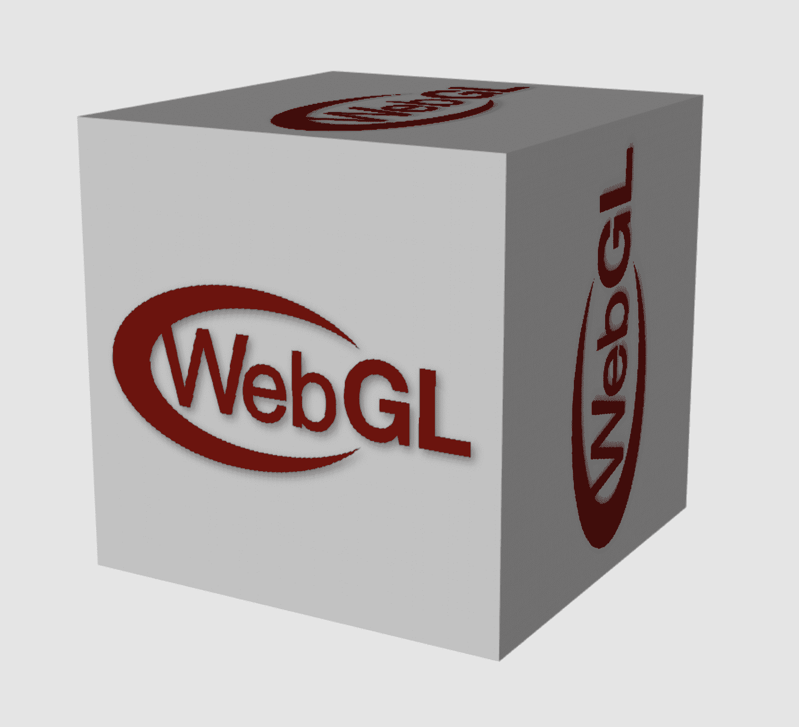

仅使用我们迄今为止学到的技术，构建这样一个相对简单的场景将会非常困难。仅 WebGL 标志就需要仔细由许多三角形原语构建。虽然这是一个可能的方法，但对于稍微复杂一些的场景，额外的几何构造将是不切实际的。

幸运的是，纹理映射使这样的要求变得极其简单。所需的一切只是一个适当文件格式的图像，一个额外的网格顶点属性，以及对我们着色器代码的一些修改。

# 创建和上传纹理

与传统的原生 OpenGL 应用程序不同，浏览器以“颠倒”的方式加载纹理。因此，许多 WebGL 应用程序将纹理设置为使用 `Y` 坐标翻转加载。这可以通过一个单独的调用完成：

```js
gl.pixelStorei(gl.UNPACK_FLIP_Y_WEBGL, true);
```

反转纹理

纹理可以手动翻转，也可以通过 WebGL 翻转。我们将使用 WebGL 逐行编程地翻转它们。

创建纹理的过程类似于创建顶点或索引缓冲区。我们首先创建纹理对象，如下所示：

```js
const texture = gl.createTexture();
```

纹理，就像缓冲区一样，在我们可以操作它们之前必须绑定：

```js
gl.bindTexture(gl.TEXTURE_2D, texture);
```

第一个参数表示我们正在绑定的纹理类型，或纹理目标。现在，我们将专注于 2D 纹理，用 `gl.TEXTURE_2D` 表示。在本章的后面部分将介绍更多目标。

一旦我们绑定了纹理，我们就可以提供图像数据。最简单的方法是将 DOM 图像传递给 `texImage2D` 函数，如下面的代码片段所示：

```js
const image = document.getElementById('texture-image');
gl.texImage2D(gl.TEXTURE_2D, 0, gl.RGBA, gl.RGBA, gl.UNSIGNED_BYTE, image);
```

在前面的代码片段中，我们使用 ID 为 `texture-image` 的元素从我们的页面中选择了一个图像元素作为源纹理。这是**上传**纹理，因为图像将被存储在 GPU 的内存中，以便在渲染期间快速访问。源可以是任何可以在网页上显示的图像格式，例如 JPEG、PNG、GIF 和 BMP 文件。

纹理的图像源作为`texImage2D`调用的最后一个参数传入。当`texImage2D`与图像一起调用时，WebGL 将自动确定提供的纹理的尺寸。其余的参数指导 WebGL 有关图像包含的信息类型以及如何存储它。大多数情况下，您只需要担心更改第三个和第四个参数，这些参数也可以是`gl.RGB`，表示您的纹理没有 alpha（透明度）通道。

除了图像之外，我们还需要指导 WebGL 在渲染时如何过滤纹理。我们将在稍后讨论过滤的含义以及不同的过滤模式做什么。同时，让我们使用最简单的一个来开始：

```js
gl.texParameteri(gl.TEXTURE_2D, gl.TEXTURE_MAG_FILTER, gl.NEAREST);
gl.texParameteri(gl.TEXTURE_2D, gl.TEXTURE_MIN_FILTER, gl.NEAREST);
```

就像缓冲区一样，当您完成使用纹理后，解绑纹理是一个好的实践。您可以通过绑定`null`作为活动纹理来完成此操作：

```js
gl.bindTexture(gl.TEXTURE_2D, null);
```

当然，在许多情况下，您可能不希望将场景中的所有纹理都嵌入到您的网页中，因此通常更方便在 JavaScript 中创建元素并加载它，而不将其添加到文档中。将这些放在一起，我们得到一个简单的函数，可以加载我们提供的任何图像 URL 作为纹理：

```js
const texture = gl.createTexture();

const image = new Image();

image.src = 'texture-file.png';

image.onload = () => {
  gl.bindTexture(gl.TEXTURE_2D, texture);
  gl.texImage2D(gl.TEXTURE_2D, 0, gl.RGBA, gl.RGBA, gl.UNSIGNED_BYTE, 
   image);
  gl.texParameteri(gl.TEXTURE_2D, gl.TEXTURE_MAG_FILTER, gl.NEAREST);
  gl.texParameteri(gl.TEXTURE_2D, gl.TEXTURE_MIN_FILTER, gl.NEAREST);
  gl.bindTexture(gl.TEXTURE_2D, null);
};
```

异步加载

以这种方式加载图像时，有一个小问题。图像加载是**异步的**，这意味着您的程序不会停止等待图像加载完成后再继续执行。那么，如果在图像数据尚未填充之前尝试使用纹理会发生什么？您的场景仍然会渲染，但您采样到的任何纹理值都将为黑色。

简而言之，创建纹理遵循与使用缓冲区相同的模式。对于每个我们创建的纹理，我们希望执行以下操作：

1.  创建一个新的纹理

1.  绑定它以使其成为当前纹理

1.  传递纹理内容，通常是来自图像

1.  设置过滤器模式或其他纹理参数

1.  解绑纹理

如果我们达到不再需要纹理的点，我们可以通过使用`deleteTexture`来删除它并释放相关的内存：

```js
gl.deleteTexture(texture);
```

在此之后，纹理就不再有效。任何尝试使用它的操作都将像传递了`null`一样响应。

# 使用纹理坐标

在我们将纹理应用到表面之前，我们需要确定纹理的哪一部分映射到表面的哪一部分。我们通过另一个称为**纹理坐标**的顶点属性来完成这项工作。

纹理坐标是描述与该顶点相对应的纹理位置的二维浮点向量。您可能会认为这个向量应该是图像上的实际像素位置；相反，WebGL 将所有纹理坐标强制转换为`0`到`1`的范围，其中`(0, 0)`代表纹理的左上角，`(1, 1)`代表纹理的右下角，如下面的图像所示：

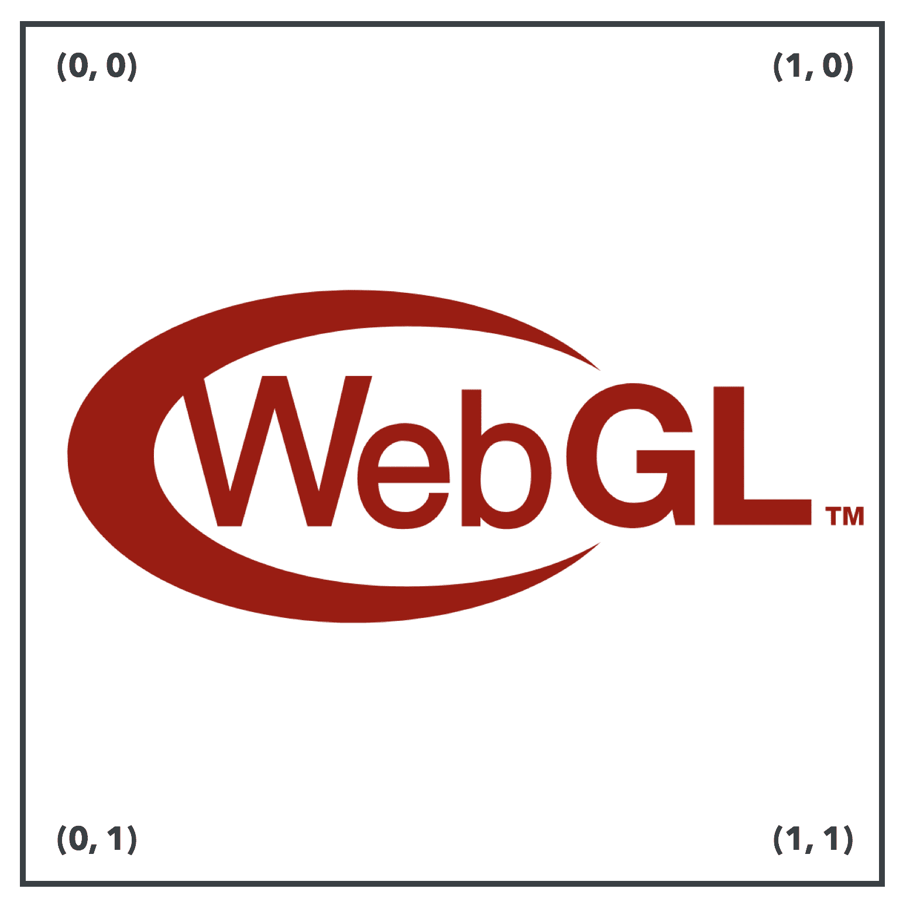

这意味着，为了将顶点映射到任何纹理的中心，你需要给它一个纹理坐标 `(0.5, 0.5)`。这个坐标系对矩形纹理同样适用。

这一开始可能看起来有些奇怪；毕竟，确定特定点的像素坐标比确定图像高度和宽度中点的百分比要容易。话虽如此，WebGL 使用的坐标系确实有其好处。

例如，我们可以构建一个由高分辨率纹理组成的 WebGL 应用程序。然后，在某个后续时刻，我们可能会收到反馈，指出纹理加载时间过长或应用程序导致设备渲染缓慢。因此，我们可能会决定为这些情况提供较低分辨率的纹理选项。

如果你的纹理坐标是以像素为单位的，你现在必须修改应用程序中使用的每个网格，以确保纹理坐标正确地匹配到新的、较小的纹理。然而，当使用 WebGL 的归一化 `0` 到 `1` 坐标范围时，较小的纹理可以使用与较大纹理完全相同的坐标，并且仍然可以正确显示。

确定网格的纹理坐标通常是创建 3D 资源的一个棘手部分，尤其是对于复杂的网格。

多边形网格

多边形网格是一个顶点、边和面的集合，它定义了 3D 计算机图形和实体建模中多面体对象的形状。

幸运的是，大多数 3D 建模工具都配备了出色的纹理布局和纹理坐标生成工具——这个过程被称为**展开**。

纹理坐标

正如顶点位置组件通常用 `(x, y, z)` 表示一样，纹理坐标也有一个常见的符号表示。不幸的是，这种表示在所有 3D 软件应用中并不一致。OpenGL 和 WebGL 分别将这些坐标称为 `s` 和 `t`，分别对应 `x` 和 `y` 组件。然而，DirectX 和许多流行的建模软件包将它们称为 `u` 和 `v`。因此，你经常会看到人们将纹理坐标称为“UVs”，将展开称为“UV 映射”。

为了与 WebGL 的使用保持一致，我们将在这本书的剩余部分使用 `st`。

# 在着色器中使用纹理

纹理坐标以与任何其他顶点属性相同的方式暴露给着色器代码。我们希望在顶点着色器中包含一个两个元素的向量属性，它将映射到我们的纹理坐标：

```js
in vec2 aVertexTextureCoords;
```

此外，我们还想在片段着色器中添加一个新的统一变量，使用我们之前未见过的类型：`sampler2D`。`sampler2D` 统一变量允许我们在着色器中访问纹理数据：

```js
uniform sampler2D uSampler;
```

在过去，当我们使用统一变量时，我们会将其设置为在着色器中想要它们具有的值，例如光颜色。**采样器**的工作方式略有不同。以下代码显示了如何将纹理与特定的采样器统一变量关联起来：

```js
gl.activeTexture(gl.TEXTURE0);
gl.bindTexture(gl.TEXTURE_2D, texture);
gl.uniform1i(program.uSampler, 0);
```

那么，这里发生了什么？首先，我们使用`gl.activeTexture`更改活动纹理索引。WebGL 支持同时使用多个纹理（我们将在本章后面讨论），因此指定我们正在使用的纹理索引是一个好习惯，尽管在本程序期间它不会改变。接下来，我们绑定我们希望使用的纹理，将其与当前活动纹理`TEXTURE0`关联。最后，我们通过`gl.uniform1i`提供的纹理单元告诉采样器统一变量它应该与哪个纹理关联。在这里，我们给出`0`以指示采样器应使用`TEXTURE0`。

我们现在可以使用我们的纹理在片段着色器中了！使用纹理的最简单方法是将它的值作为片段颜色返回，如下所示：

```js
texture(uSampler, vTextureCoord);
```

`texture`函数接受我们希望查询的采样器统一变量和查找的坐标，并返回在那些坐标处的纹理图像颜色作为`vec4`。如果图像没有 alpha 通道，`vec4`仍然会被返回，其 alpha 组件始终设置为`1`。

# 动手实践：给立方体贴图

让我们来看一个例子，我们将纹理映射添加到一个立方体上：

1.  在您的编辑器中打开`ch07_01_textured-cube.html`文件。如果在浏览器中打开，您应该会看到一个类似于以下截图的场景：

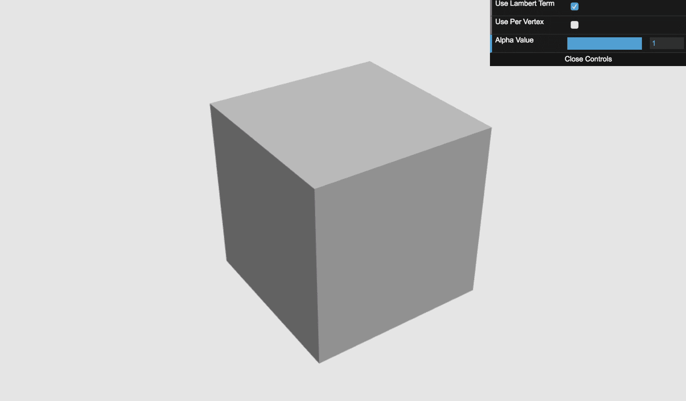

1.  让我们加载纹理图像。在脚本块的顶部，添加一个新的变量来保存纹理：

```js
let texture;
```

1.  在`configure`函数的底部，添加以下代码，它创建纹理对象，加载图像，并将图像设置为纹理数据。在这种情况下，我们将使用带有 WebGL 标志的 PNG 图像作为我们的纹理：

```js
texture = gl.createTexture();

const image = new Image();

image.src = '/common/images/webgl.png';

image.onload = () => {
  gl.bindTexture(gl.TEXTURE_2D, texture);
  gl.texImage2D(gl.TEXTURE_2D, 0, gl.RGBA, gl.RGBA, 
   gl.UNSIGNED_BYTE, image);
  gl.texParameteri(gl.TEXTURE_2D, gl.TEXTURE_MAG_FILTER, 
   gl.NEAREST);
  gl.texParameteri(gl.TEXTURE_2D, gl.TEXTURE_MIN_FILTER, 
   gl.NEAREST);
  gl.bindTexture(gl.TEXTURE_2D, null);
};
```

1.  在`render`函数中的`vertexColors`绑定块之后，添加以下代码以将纹理绑定到着色器采样器统一变量：

```js
if (object.textureCoords) {
  gl.activeTexture(gl.TEXTURE0);
  gl.bindTexture(gl.TEXTURE_2D, texture);
  gl.uniform1i(program.uSampler, 0);
}
```

1.  现在我们需要将纹理特定的代码添加到着色器中。在顶点着色器中，将以下属性和变量添加到变量声明中：

```js
in vec2 aVertexTextureCoords;
out vec2 vTextureCoords;
```

1.  在顶点着色器的`main`函数的末尾，确保将纹理坐标属性复制到变量中，以便片段着色器可以访问它：

```js
vTextureCoords = aVertexTextureCoords;
```

1.  片段着色器还需要两个新的变量声明——采样器统一变量和来自顶点着色器的变量：

```js
uniform sampler2D uSampler;
in vec2 vTextureCoords;
```

1.  我们还必须记住在`configure`函数中向`attributes`列表添加`aVertexTextureCoords`并将`uSampler`添加到`uniforms`列表中，以便可以从我们的 JavaScript 绑定代码访问新变量。

1.  要访问纹理颜色，我们调用`texture`函数，传入采样器和纹理坐标。由于我们希望纹理表面保留光照，我们将光照颜色和纹理颜色相乘，得到以下行来计算片段颜色：

```js
fragColor = vColor * texture(uSampler, vTextureCoords);
```

1.  现在在浏览器中打开文件，您应该会看到这样的场景：

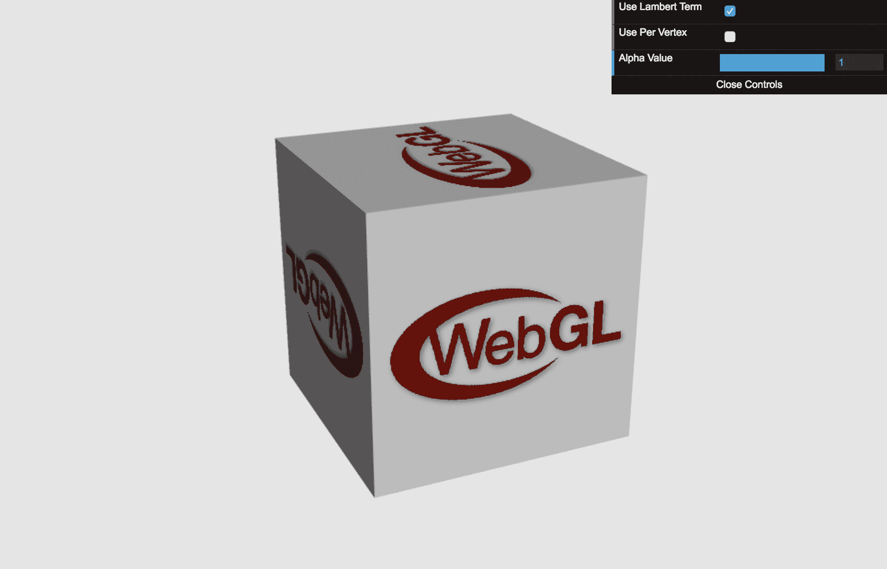

1.  如果你遇到某个步骤有困难并且需要参考，完整的代码可以在 `ch07_02_textured-cube-final.html` 中找到。

***发生了什么？***

我们刚刚从文件中加载了一个纹理，将其上传到 GPU，并在立方体几何体上渲染它，并将其与已经计算出的光照信息混合。

本章剩余的示例将为了简洁和清晰省略光照计算，但如果需要，可以应用到所有这些示例中。

# 尝试不同的纹理

尝试使用你自己的图片，看看你是否能将其显示为纹理。如果你提供一个矩形图像而不是正方形图像会发生什么？

# 纹理过滤模式

到目前为止，我们已经看到了如何在片段着色器中使用纹理来采样图像数据，但我们只在一个有限的上下文中使用了它们。当你开始更仔细地研究纹理时，会出现一些有趣的问题。

例如，如果你从上一个演示中放大立方体，你会看到纹理开始出现走样：


当我们放大时，可以看到 WebGL 标志周围出现了锯齿边缘。当纹理在屏幕上非常小的时候，类似的问题也会变得明显。将这些瑕疵孤立于单个对象中，它们很容易被忽视，但在复杂场景中可能会非常分散注意力。我们最初为什么能看到这些瑕疵？

从上一章，你应该记得顶点颜色是如何插值，以便片段着色器提供平滑的颜色渐变。纹理坐标以完全相同的方式进行插值，结果坐标被提供给片段着色器，并用于从纹理中采样颜色值。在理想情况下，纹理会在屏幕上以 `1:1` 的比例显示，这意味着纹理的每个像素（称为 **纹理元素**）将占据屏幕上的一个像素。在这种情况下，将不会有任何瑕疵：

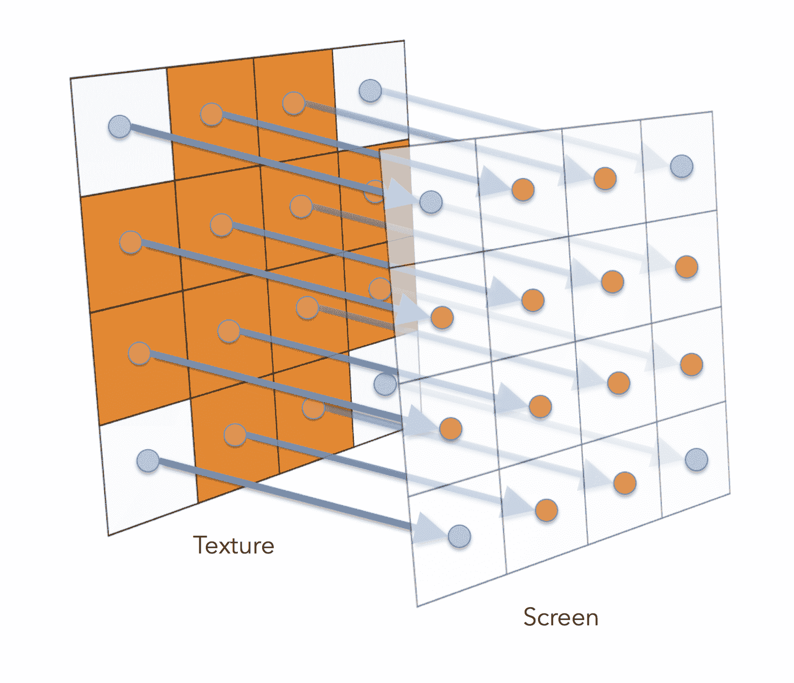

像素与纹理元素有时，纹理中的像素被称为 **纹理元素**。像素是图像元素的简称。纹理元素是纹理元素的简称。

然而，3D 应用程序的现实情况是，纹理几乎从不以它们的原始分辨率显示。我们根据纹理的分辨率是否低于或高于它占据的屏幕空间将其称为 **放大** 和 **缩小**：

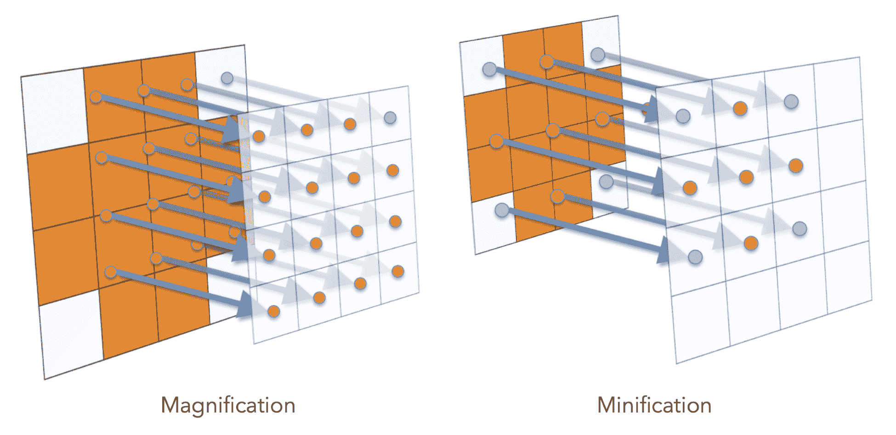

当纹理被放大或缩小的时候，可能会对纹理采样器应该返回什么颜色存在一些模糊性。例如，考虑以下样本点与略微放大的纹理的示意图：

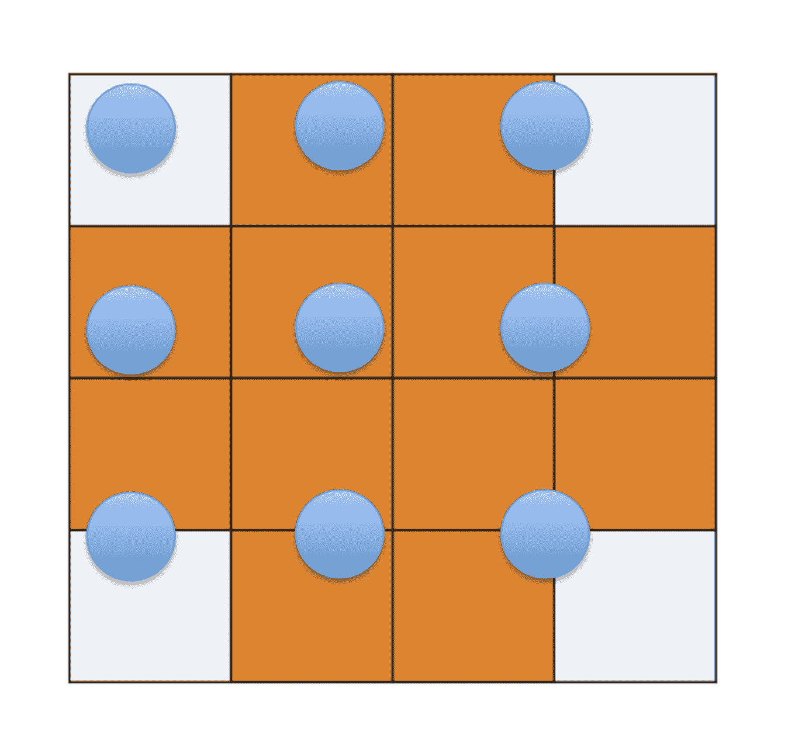

显然，你想要左上角或中间的样本点返回什么颜色，但中间的这些 texel 呢？它们应该返回什么颜色？答案取决于你的过滤器模式。纹理过滤允许我们控制纹理的采样方式，并达到我们想要的外观。

设置纹理的过滤器模式非常直接，当我们讨论创建纹理时已经看到了一个例子：

```js
gl.texParameteri(gl.TEXTURE_2D, gl.TEXTURE_MAG_FILTER, gl.NEAREST);
gl.texParameteri(gl.TEXTURE_2D, gl.TEXTURE_MIN_FILTER, gl.NEAREST);
```

与大多数 WebGL 调用一样，`texParameteri` 操作于当前绑定的纹理，并且必须为每个创建的纹理设置。这也意味着不同的纹理可以有不同的过滤器，这在尝试实现特定效果时可能很有用。

在这个例子中，我们将放大过滤器（`TEXTURE_MAG_FILTER`）和缩小过滤器（`TEXTURE_MIN_FILTER`）都设置为 `NEAREST`。对于第三个参数可以传递几种模式，了解它们对场景产生的视觉影响最好的方式是看到各种过滤器模式的效果。

当我们讨论不同的参数时，让我们在你的浏览器中查看过滤器的一个演示。

# 行动时间：尝试不同的过滤器模式

让我们来看一个例子，看看不同的过滤器模式是如何工作的：

1.  使用你的浏览器打开 `ch07_03_texture-filters.html` 文件：

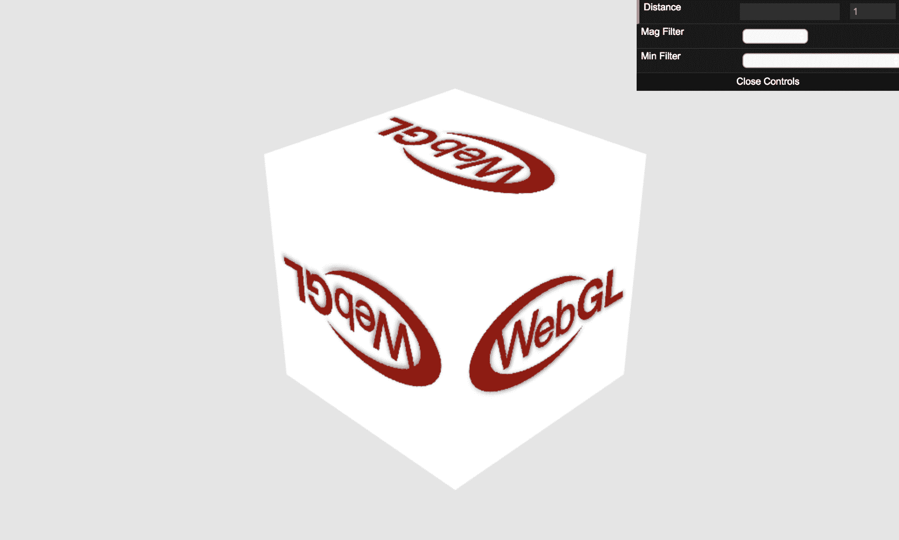

1.  控制包括一个滑块来调整盒子与观察者之间的距离，而按钮则修改放大和缩小过滤器。

1.  尝试不同的模式来观察它们对纹理产生的影响。放大过滤器在立方体的纹理渲染大于其源图像大小时生效；缩小过滤器当它更远时生效。务必旋转立方体，以观察以每个模式从角度观看纹理时的样子。

***发生了什么？***

我们学习了如何创建和加载纹理到我们的 3D 场景中。我们还介绍了将纹理映射到对象上的各种技术，以及一个交互式示例来展示这些功能。

让我们深入探讨每种过滤器模式，并讨论它们是如何工作的。

# NEAREST

使用 `NEAREST` 过滤器的纹理始终返回最近的样本点的 texel 的颜色。使用此模式，纹理在近距离观看时看起来会显得块状和像素化，这可以用于创建“复古”图形。`NEAREST` 可以用于 `MIN` 和 `MAG` 过滤器：

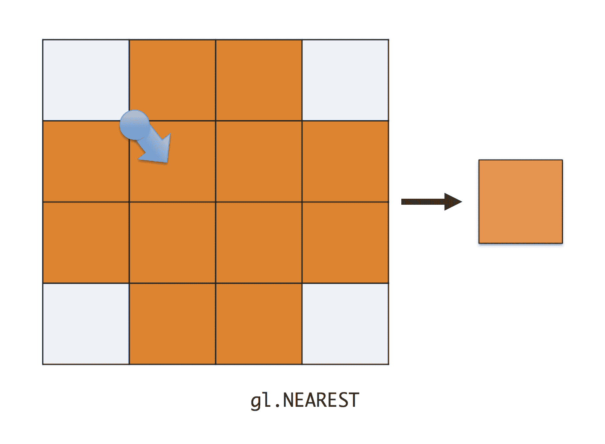

# LINEAR

`LINEAR` 过滤返回与采样点最近的四个像素的加权平均值。当近距离观察纹理时，这提供了平滑的纹理元素颜色混合——这通常是更期望的效果。这也意味着图形硬件必须读取每个片段的四倍像素，因此，它比 `NEAREST` 慢，但现代图形硬件如此之快，这几乎从未成为问题。`LINEAR` 可以用于 `MIN` 和 `MAG` 过滤器。这种过滤模式也称为 **双线性过滤**：

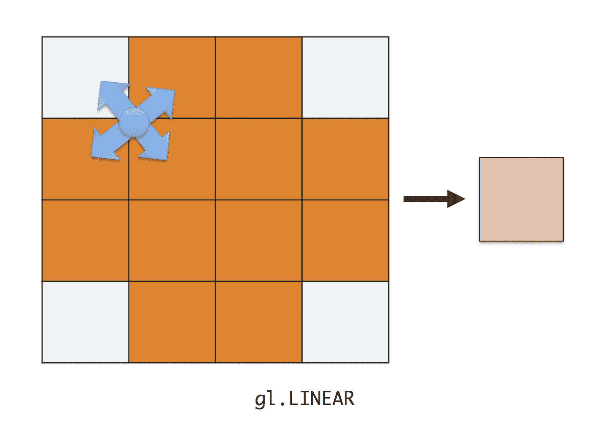

回到我们在本章前面展示的近距离示例图像，如果我们使用了 `LINEAR` 过滤，它看起来会是这样：


# Mipmapping

在我们讨论仅适用于 `TEXTURE_MIN_FILTER` 的剩余过滤模式之前，我们需要介绍一个新概念：**Mipmapping**。

当采样缩小后的纹理时会出现问题。在使用 `LINEAR` 过滤且采样点相距甚远的情况下，我们可能会完全错过纹理的一些细节。随着视角的变化，我们错过的纹理碎片也会变化，这会导致闪烁效果。你可以在演示中将 `MIN` 过滤设置为 `NEAREST` 或 `LINEAR`，然后缩小并旋转立方体来观察这一效果：

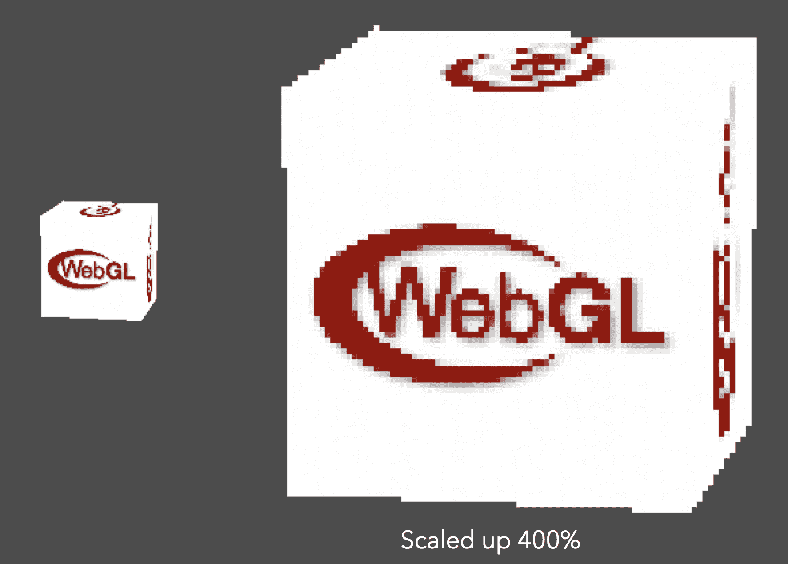

为了避免这种情况，显卡可以利用 **Mipmap 链**。

Mipmaps 是纹理的缩小副本，每个副本的大小正好是前一个副本的一半。如果你将一个纹理及其所有 Mipmaps 按顺序展示，它看起来会是这样：

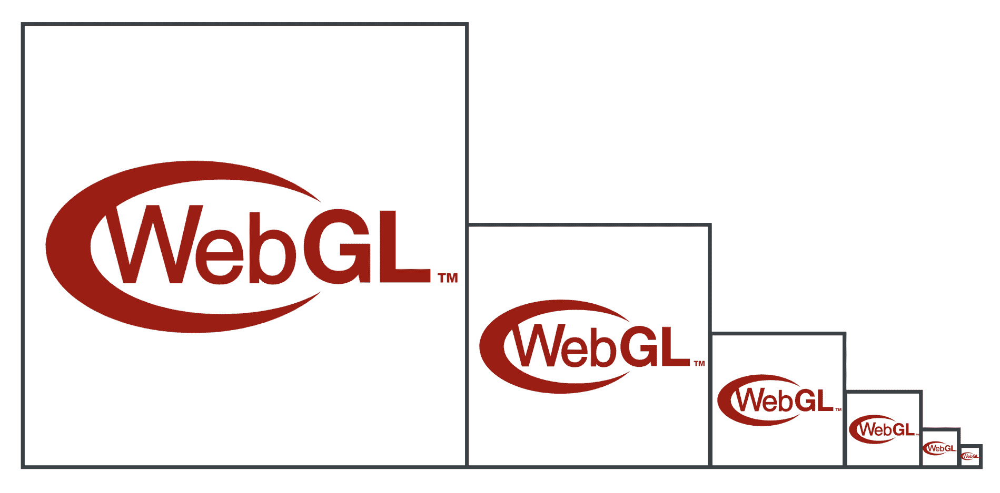

优点是，在渲染时，图形硬件可以选择与屏幕上纹理大小最接近的纹理副本，并从中采样。这减少了跳过的纹理元素数量以及伴随它们的抖动伪影。然而，只有在使用适当的纹理过滤器时才会使用 Mipmapping。

# NEAREST_MIPMAP_NEAREST

此过滤器将选择与屏幕上纹理大小最接近的 Mipmap，并使用 `NEAREST` 算法从中采样。

# LINEAR_MIPMAP_NEAREST

此过滤器选择与屏幕上纹理大小最接近的 Mipmap，并使用 `LINEAR` 算法从中采样。

# NEAREST_MIPMAP_LINEAR

此过滤器选择两个与屏幕上纹理大小最接近的 Mipmap，并使用 `NEAREST` 算法从这两个 Mipmap 中采样。返回的颜色是这两个样本的加权平均值。

# LINEAR_MIPMAP_LINEAR

此过滤器选择两个与屏幕上纹理大小最接近的 Mipmap，并使用 `LINEAR` 算法从这两个 Mipmap 中采样。返回的颜色是这两个样本的加权平均值。这种模式也称为 **三线性过滤**：

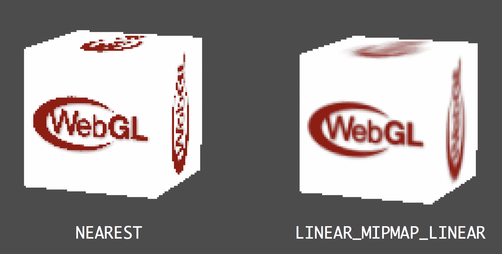

在`*_MIPMAP_*`过滤模式中，`NEAREST_MIPMAP_NEAREST`是最快且质量最低的，而`LINEAR_MIPMAP_LINEAR`将提供最佳质量但性能最低。其他两种模式在质量/速度尺度上介于两者之间。在大多数情况下，性能权衡将足够小，以至于通常使用`LINEAR_MIPMAP_LINEAR`。

# 生成米普图

WebGL 不会自动为每个纹理创建米普图；因此，如果我们想使用`*_MIPMAP_*`过滤模式之一，我们必须首先为纹理创建米普图。幸运的是，所有这些只需要一个函数调用：

```js
gl.generateMipmap(gl.TEXTURE_2D);
```

`generateMipmap`必须在用`texImage2D`填充纹理之后调用，并将自动为图像创建完整的米普图链。

或者，如果你想手动提供米普图，你可以在调用`texImage2D`时指定你提供的是米普图级别而不是源纹理，通过传递除`0`以外的数字作为第二个参数：

```js
gl.texImage2D(gl.TEXTURE_2D, 1, gl.RGBA, gl.RGBA, gl.UNSIGNED_BYTE, mipmapImage);
```

在这里，我们正在手动创建第一个米普图级别，其高度和宽度是正常纹理的一半。第二个级别将是正常纹理尺寸的四分之一，以此类推。

这对于一些高级效果或使用不能与`generateMipmap`一起使用的压缩纹理时可能很有用。

如果你熟悉 WebGL 1，你会记得它的限制，即维度不是 2 的幂（**不是** `1`、`2`、`4`、`8`、`16`、`32`、`64`、`128`、`256`、`512`等等）的纹理不能使用米普图，也不能重复。在 WebGL 2 中，这些限制已经不存在了。

非二进制幂（NPOT）

为了在 WebGL 1 中使用米普图，米普图需要满足一些维度限制。具体来说，纹理的宽度和高度都必须是**2 的幂**（**POT**）。也就是说，宽度和高度可以是`pow(2, n)`像素，其中`n`是任何整数。例如，`16px`、`32px`、`64px`、`128px`、`256px`、`512px`、`1024px`等等。此外，只要两者都是 2 的幂，宽度和高度不必相同。例如，一个`512x128`的纹理仍然可以进行米普图处理。NPOT 纹理仍然可以与 WebGL 1 一起使用，但仅限于使用`NEAREST`和`LINEAR`过滤器。

那么，为什么对两种纹理进行功率限制呢？回想一下，米普链是由尺寸是前一个级别一半的纹理组成的。当维度是 2 的幂时，这总会产生整数，这意味着像素数永远不需要四舍五入，因此产生干净且快速的缩放算法。

从此点之后的所有纹理代码示例中，我们将使用一个简单的纹理类，该类可以干净地封装纹理的下载、创建和设置。使用该类创建的任何纹理都将自动为其生成米普图，并设置为使用`LINEAR`进行放大过滤器，以及使用`LINEAR_MIPMAP_LINEAR`进行缩小过滤器。

# 纹理包裹

在前面的部分中，我们使用了 `texParameteri` 来设置纹理的过滤器模式，但正如您从通用函数名称中预期的那样，这并不是它能做的全部。我们可以操纵的另一种纹理行为是**纹理包裹**模式。

纹理包裹描述了当纹理坐标超出 `0` 和 `1` 范围时采样器的行为。

包裹模式可以独立地为 `S` 和 `T` 坐标设置，因此更改包裹模式通常需要两次调用：

```js
gl.texParameteri(gl.TEXTURE_2D, gl.TEXTURE_WRAP_S, gl.CLAMP_TO_EDGE);
gl.texParameteri(gl.TEXTURE_2D, gl.TEXTURE_WRAP_T, gl.CLAMP_TO_EDGE);
```

在这里，我们将当前绑定的纹理的 `S` 和 `T` 包裹模式都设置为 `CLAMP_TO_EDGE`，其效果我们将在下面看到。

与纹理过滤器一样，通过一个例子演示不同包裹模式的效果，然后讨论结果是最容易的。请再次打开您的浏览器进行另一个演示。

# 行动时间：尝试不同的包裹模式

让我们通过一个例子来看看不同的包裹模式是如何起作用的：

1.  使用您的浏览器打开 `ch07_04_texture-wrapping.html` 文件：

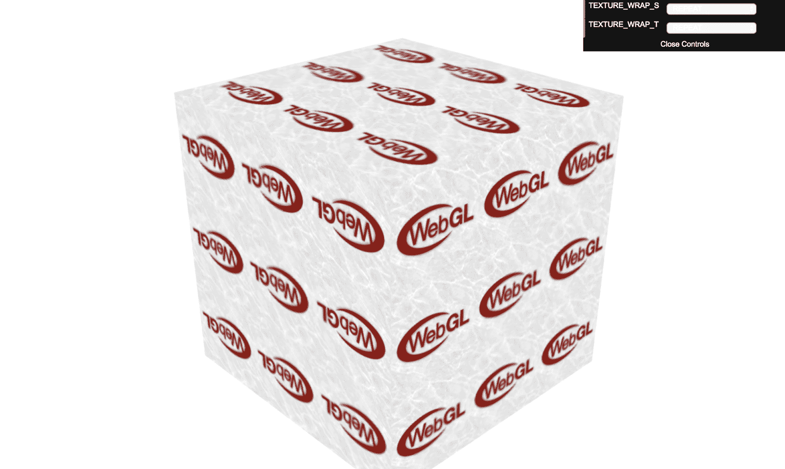

1.  在前面的屏幕截图中显示的立方体具有从 `-1` 到 `2` 的纹理坐标，这迫使纹理包裹模式应用于纹理的中心瓷砖以外的所有内容。

1.  尝试调整控件以查看不同的包裹模式对纹理的影响。

***发生了什么？***

我们尝试了各种纹理插值和米普映射技术的方法，以及展示这些功能的交互式示例。

现在，让我们调查每种包裹模式，并讨论它们是如何工作的。

# CLAMP_TO_EDGE

这种包裹模式将任何大于 `1` 的纹理坐标向下舍入到 `1`；任何小于 `0` 的坐标向上舍入到 `0`，将值“夹”在 `0`-`1` 范围内。从视觉上看，这会在坐标超出 `0`-`1` 范围后无限期地重复纹理的边界像素。请注意，这是唯一与**非幂次方**纹理兼容的包裹模式：

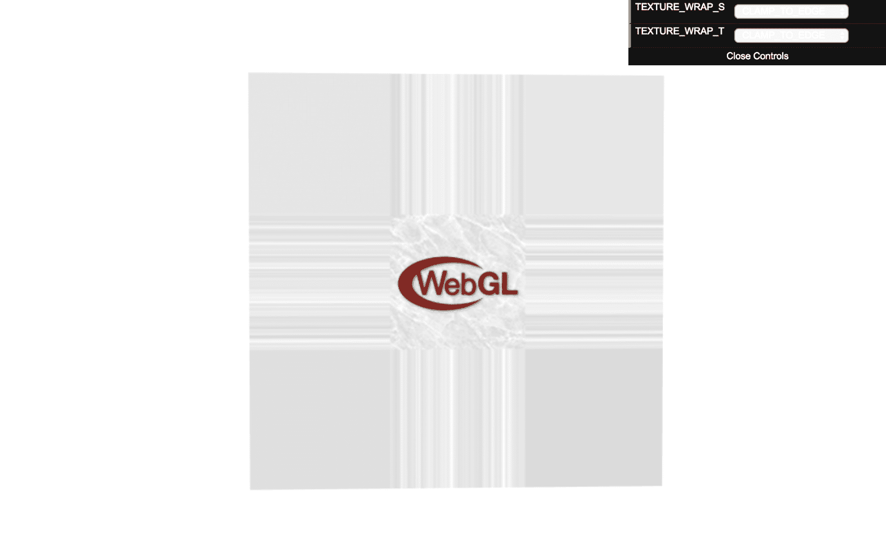

# REPEAT

这是默认的包裹模式，也是您可能最常使用的模式。用数学术语来说，这种包裹模式简单地忽略了纹理坐标的整数部分。这会产生纹理在您移动到 `0`-`1` 范围之外时重复的视觉效果。这对于显示具有自然重复图案的表面非常有用，例如瓷砖地板或砖墙：

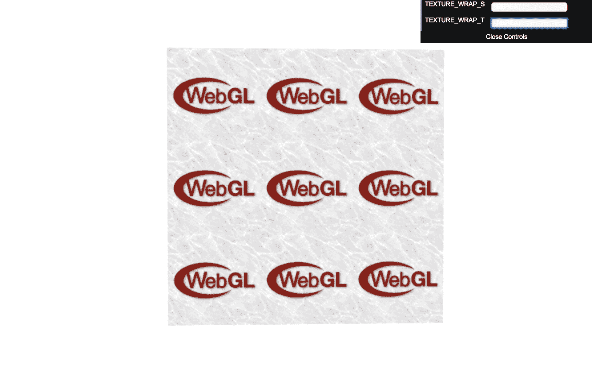

# MIRRORED_REPEAT

这种模式的算法稍微复杂一些。如果坐标的整数部分是偶数，纹理坐标将与使用 `REPEAT` 时的相同。如果坐标的整数部分是奇数，则结果坐标是坐标的分数部分的 `1` 减去。这导致纹理在重复时“翻转”，每隔一次重复都是镜像图像：

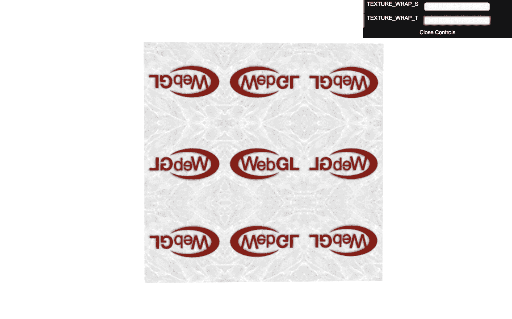

如我们之前提到的，这些模式可以混合使用。例如，考虑以下代码片段：

```js
gl.texParameteri(gl.TEXTURE_2D, gl.TEXTURE_WRAP_S, gl.REPEAT);
gl.texParameteri(gl.TEXTURE_2D, gl.TEXTURE_WRAP_T, gl.CLAMP_TO_EDGE);
```

这将对样本纹理产生以下效果：

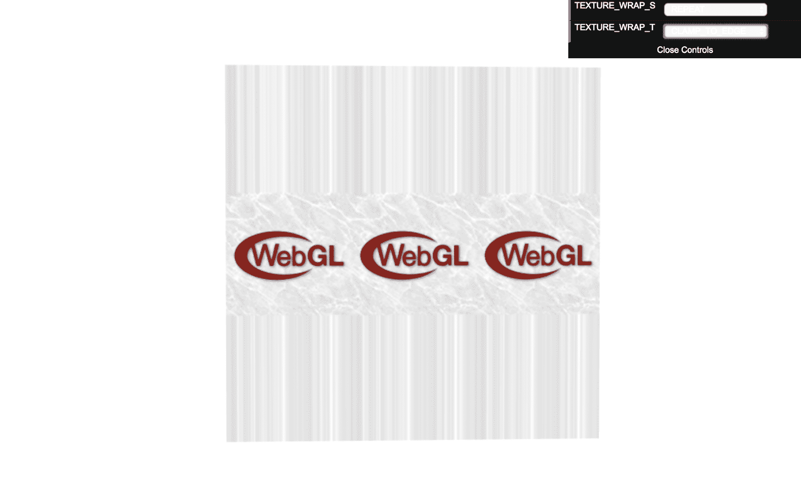

Samplers 与 Textures 的比较

惊奇地想知道为什么着色器统一变量被称为 *samplers* 而不是 *textures* 吗？纹理只是存储在 GPU 上的图像数据，而 sampler 包含了查找纹理信息所需的所有信息，包括过滤器和包裹模式。

# 使用多个纹理

到目前为止，我们一直通过使用单个纹理来进行所有渲染。然而，有时我们可能希望多个纹理共同作用于一个片段以创建更复杂的效果。在这种情况下，我们可以使用 WebGL 在单个绘制调用中访问多个纹理的能力，这通常被称为 **多纹理**。

我们之前简要介绍了多纹理，现在让我们再次回顾一下。当我们谈论将纹理作为 sampler 统一变量暴露给着色器时，我们使用了以下代码：

```js
gl.activeTexture(gl.TEXTURE0);
gl.bindTexture(gl.TEXTURE_2D, texture);
```

第一行，`gl.activeTexture`，是利用多纹理的关键。我们使用它来告诉 WebGL 状态机在后续的纹理函数中将使用哪个纹理。在这种情况下，我们传递了 `gl.TEXTURE0`，这意味着任何后续的纹理调用（如 `gl.bindTexture`）都将改变第一个纹理单元的状态。如果我们想将不同的纹理附加到第二个纹理单元，我们将使用 `gl.TEXTURE1`。

不同设备将支持不同数量的纹理单元，但 WebGL 规定兼容的硬件必须始终支持至少两个纹理单元。我们可以使用以下函数调用来找出当前设备支持多少个纹理单元：

```js
gl.getParameter(gl.MAX_COMBINED_TEXTURE_IMAGE_UNITS);
```

WebGL 为 `gl.TEXTURE0` 到 `gl.TEXTURE31` 提供了显式的枚举。可能更方便的是以程序方式指定纹理单元或需要引用 `31` 以上的纹理单元。在这种情况下，您始终可以用 `gl.TEXTURE0 + i` 替换 `gl.TEXTUREi`，如下例所示：

```js
gl.TEXTURE0 + 2 === gl.TEXTURE2;
```

在着色器中访问多个纹理就像声明多个 sampler 一样简单：

```js
uniform sampler2D uSampler;
uniform sampler2D uOtherSampler;
```

在设置绘制调用时，通过提供纹理单元到 `gl.uniform1i` 来告诉着色器哪个纹理与哪个 sampler 相关联。将两个纹理绑定到上面 sampler 的代码可能看起来像这样：

```js
// bind the first texture
gl.activeTexture(gl.TEXTURE0);
gl.bindTexture(gl.TEXTURE_2D, texture);
gl.uniform1i(program.uSampler, 0);

// bind the second texture
gl.activeTexture(gl.TEXTURE1);
gl.bindTexture(gl.TEXTURE_2D, otherTexture);
gl.uniform1i(program.uOtherSampler, 1);
```

现在我们有两个纹理可供我们的片段着色器使用，但我们想对它们做什么？

例如，我们将实现一个简单的多纹理效果，将另一个纹理叠加到简单的纹理立方体上，以模拟静态光照。

# 使用多纹理的时间：使用多纹理

让我们来看一个多纹理应用的例子：

1.  使用你的编辑器打开`ch07_05_multi-texture.html`文件。

1.  在脚本块的顶部添加另一个纹理变量：

```js
let texture2;
```

1.  在`configure`函数的底部，添加加载第二个纹理的代码。我们使用一个类来简化这个过程，所以新的代码如下：

```js
texture2 = new Texture();
texture2.setImage('/common/images/light.png');
```

1.  我们使用的纹理是一个模拟聚光灯的白色径向渐变纹理：

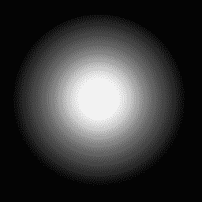

1.  在`render`函数中，在绑定第一个纹理的代码下方，添加以下代码以将新纹理暴露给着色器：

```js
gl.activeTexture(gl.TEXTURE1);
gl.bindTexture(gl.TEXTURE_2D, texture2.tex);
gl.uniform1i(program.uSampler2, 1);
```

1.  我们需要在片段着色器中添加新的采样器统一变量：

```js
uniform sampler2D uSampler2;
```

1.  不要忘记在`configure`函数的统一变量列表中添加相应的字符串。

1.  我们添加了采样新纹理值并将其与第一个纹理混合的代码。由于我们希望第二个纹理模拟光，所以我们像在第一个纹理示例中的每个顶点光照一样将两个值相乘：

```js
fragColor = texture(uSampler2, vTextureCoords) * texture(uSampler, vTextureCoords);
```

1.  注意我们正在重用相同的纹理坐标来处理两个纹理。这更方便，但如果需要，可以提供第二个纹理坐标属性，或者我们可以从顶点位置或其他标准计算一个新的纹理坐标。

1.  当你在浏览器中打开文件时，你应该看到如下场景：

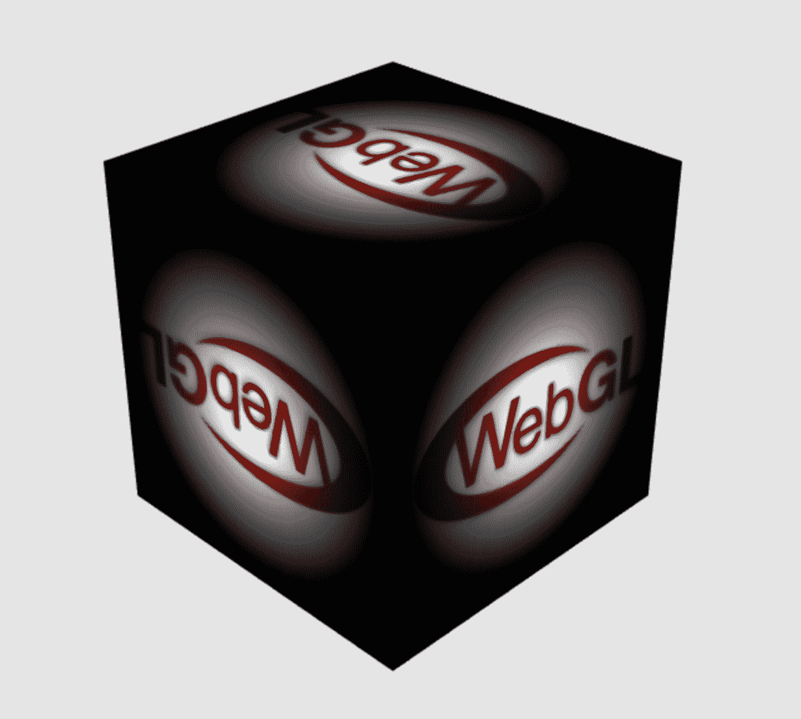

1.  你可以在`ch07_06_multi-texture-final.html`中看到完成的示例。

***刚才发生了什么？***

我们在`render`调用中添加了第二个纹理，并将其与第一个纹理混合，以创建一个新的效果，在这种情况下，模拟了一个简单的静态聚光灯。

重要的是要意识到从纹理中采样的颜色被当作着色器中的任何其他颜色一样处理——也就是说，作为一个通用的四维向量。因此，我们可以像结合顶点和光照颜色，或者任何其他颜色操作一样结合纹理。

# 尝试使用乘法之外的混合

乘法是在着色器中混合颜色最常见的方式之一，但实际上你结合颜色值的方式并没有限制。尝试在片段着色器中实验不同的算法，看看它对输出的影响。当你用加法代替乘法时会发生什么？如果你使用一个纹理的红色通道，而另一个纹理的蓝色和绿色呢？尝试以下算法并看看结果：

```js
fragColor = vec4(texture(uSampler2, vTextureCoords).rgb - texture(uSampler, vTextureCoords).rgb, 1.0);
```

结果如下：


# 尝试使用多维纹理

正如您可能已经注意到的，维护多个纹理的挑战与我们在第六章，“颜色、深度测试和 Alpha 混合”中管理多个灯光所面临的挑战相似。话虽如此，WebGL 是否提供了与统一数组类似的功能来管理多个纹理？是的，当然！我们可以利用 WebGL 2 提供的两种不同的解决方案来管理多维纹理：**3D 纹理**和**纹理数组**。

尽管我们将在第十一章，“WebGL 2 亮点”中讨论这些功能，但考虑这些功能如何有助于减少复杂性、提高代码可维护性以及增加可使用的纹理数量可能是有用的。

# 立方图

在本章前面，我们提到了 2D 纹理和立方图，用于使用图像创建复杂效果。我们讨论了纹理，但立方图究竟是什么，我们如何使用它们？

**立方图**，正如其名，是一个纹理的立方体。创建了六个单独的纹理，每个纹理分配给立方体的一个不同面。图形硬件可以通过使用 3D 纹理坐标将它们作为一个单一实体进行采样。

立方体的面通过它们面对的轴以及它们位于该轴的正面还是负面来识别：

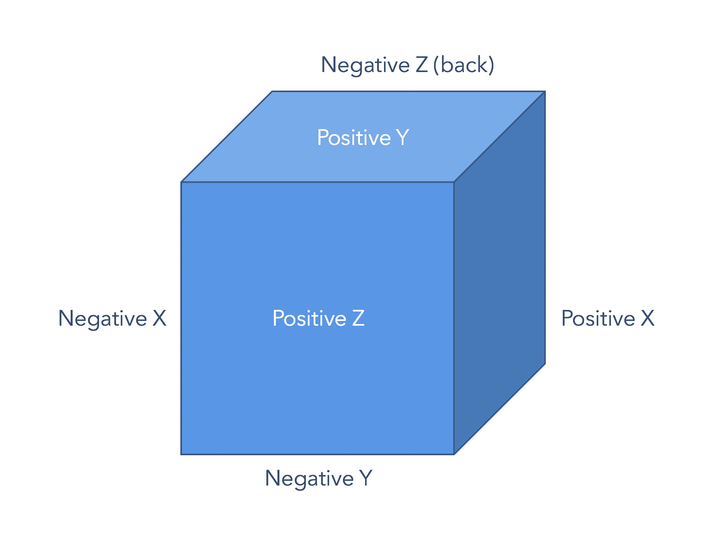

到目前为止，我们通过指定`TEXTURE_2D`纹理目标来操作纹理。立方图引入了一些新的纹理目标，这些目标表明我们正在处理立方图。这些目标还表明我们正在操作立方图的哪个面：

+   `TEXTURE_CUBE_MAP`

+   `TEXTURE_CUBE_MAP_POSITIVE_X`

+   `TEXTURE_CUBE_MAP_NEGATIVE_X`

+   `TEXTURE_CUBE_MAP_POSITIVE_Y`

+   `TEXTURE_CUBE_MAP_NEGATIVE_Y`

+   `TEXTURE_CUBE_MAP_POSITIVE_Z`

+   `TEXTURE_CUBE_MAP_NEGATIVE_Z`

这些目标共同被称为`gl.TEXTURE_CUBE_MAP_*`目标。您需要使用哪个取决于您调用的函数。

立方图就像普通纹理一样创建，但绑定和属性操作使用`TEXTURE_CUBE_MAP`目标，如下所示：

```js
const cubeTexture = gl.createTexture();
gl.bindTexture(gl.TEXTURE_CUBE_MAP, cubeTexture);
gl.texParameteri(gl.TEXTURE_CUBE_MAP, gl.TEXTURE_MAG_FILTER, gl.LINEAR);
gl.texParameteri(gl.TEXTURE_CUBE_MAP, gl.TEXTURE_MIN_FILTER, gl.LINEAR);
```

当上传纹理的图像数据时，您需要指定您正在操作的侧面，如下所示：

```js
gl.texImage2D(gl.TEXTURE_CUBE_MAP_POSITIVE_X, 0, gl.RGBA, gl.RGBA, gl.UNSIGNED_BYTE, positiveXImage);
gl.texImage2D(gl.TEXTURE_CUBE_MAP_NEGATIVE_X, 0, gl.RGBA, gl.RGBA, gl.UNSIGNED_BYTE, negativeXImage);
gl.texImage2D(gl.TEXTURE_CUBE_MAP_POSITIVE_Y, 0, gl.RGBA, gl.RGBA, gl.UNSIGNED_BYTE, positiveYImage);
// ...
```

将立方图纹理暴露给着色器的方式与普通纹理相同，只是使用立方图目标：

```js
gl.activeTexture(gl.TEXTURE0);
gl.bindTexture(gl.TEXTURE_CUBE_MAP, cubeTexture);
gl.uniform1i(program.uCubeSampler, 0);
```

然而，着色器内的统一类型是针对立方图的特定类型：

```js
uniform samplerCube uCubeSampler;
```

从立方图中采样时，您也使用一个针对立方图特定的函数：

```js
texture(uCubeSampler, vCubeTextureCoords);
```

您提供的 3D 坐标被图形硬件归一化成一个单位向量，该向量指定了从“立方体”中心的方向。沿着该向量绘制一条射线，它与立方体面的交点就是纹理被采样的位置：

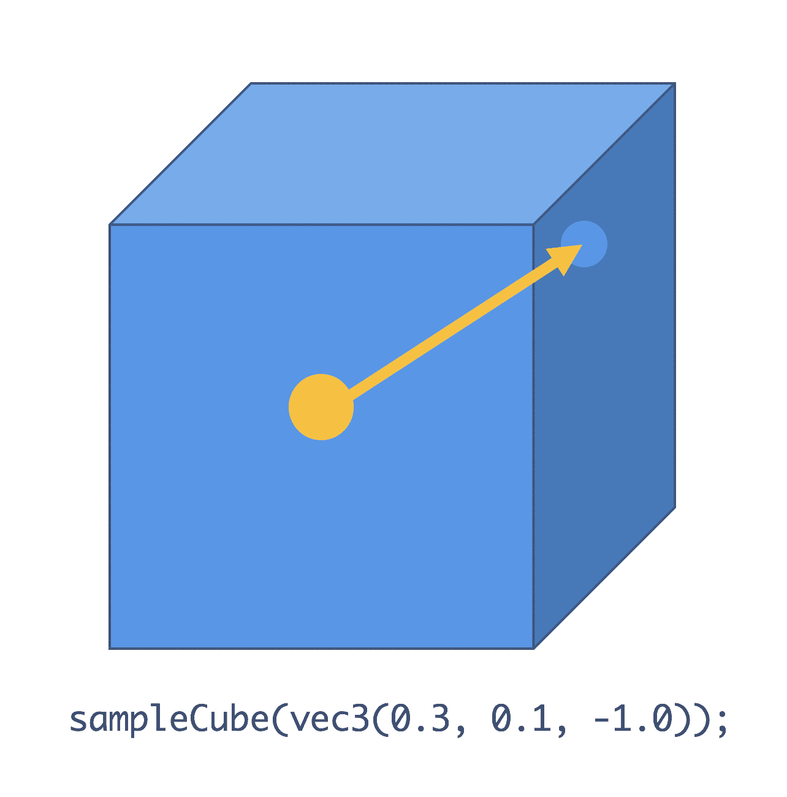

# 行动时间：尝试使用立方图

让我们通过一个例子来看看立方图的实际应用：

1.  在你的浏览器中打开`ch07_07_cubemap.html`文件。这又包含了一个简单的纹理立方体示例，我们将在其上构建立方体贴图示例。我们想使用立方体贴图来创建一个看起来像反射的表面。

1.  创建立方体贴图比我们之前加载的纹理要复杂一些，所以这次我们将使用一个函数来简化单个立方体贴面的异步加载。这个函数叫做`loadCubemapFace`，并且已经添加到了文件中。在`configure`函数的底部，添加以下代码，用于创建和加载立方体贴图面：

```js
cubeTexture = gl.createTexture();

gl.bindTexture(gl.TEXTURE_CUBE_MAP, cubeTexture);
gl.texParameteri(gl.TEXTURE_CUBE_MAP, gl.TEXTURE_MAG_FILTER, gl.LINEAR);
gl.texParameteri(gl.TEXTURE_CUBE_MAP, gl.TEXTURE_MIN_FILTER, gl.LINEAR);

loadCubemapFace(gl, gl.TEXTURE_CUBE_MAP_POSITIVE_X, cubeTexture, '/common/images/cubemap/positive_x.png');

loadCubemapFace(gl, gl.TEXTURE_CUBE_MAP_NEGATIVE_X, cubeTexture, '/common/images/cubemap/negative_x.png');

loadCubemapFace(gl, gl.TEXTURE_CUBE_MAP_POSITIVE_Y, cubeTexture, '/common/images/cubemap/positive_y.png');

loadCubemapFace(gl, gl.TEXTURE_CUBE_MAP_NEGATIVE_Y, cubeTexture, '/common/images/cubemap/negative_y.png');

loadCubemapFace(gl, gl.TEXTURE_CUBE_MAP_POSITIVE_Z, cubeTexture, '/common/images/cubemap/positive_z.png');

loadCubemapFace(gl, gl.TEXTURE_CUBE_MAP_NEGATIVE_Z, cubeTexture, '/common/images/cubemap/negative_z.png');
```

1.  在`render`函数中，添加代码将立方体贴图绑定到适当的采样器：

```js
gl.activeTexture(gl.TEXTURE1);
gl.bindTexture(gl.TEXTURE_CUBE_MAP, cubeTexture);
gl.uniform1i(program.uCubeSampler, 1);
```

1.  现在转向着色器，我们想在顶点着色器中添加一个新的变量：

```js
out vec3 vVertexNormal;
```

1.  我们将使用顶点法线而不是专门的纹理坐标来进行立方体贴图采样，这将给我们带来我们想要的镜像效果。不幸的是，立方体每个面上的实际法线都直接指向外。如果我们使用它们，我们只会从立方体贴图中得到每个面的单色。在这种情况下，我们可以“作弊”并使用顶点位置作为法线（对于大多数模型，使用法线是合适的）：

```js
vVertexNormal = (uNormalMatrix * vec4(-aVertexPosition, 1.0)).xyz;
```

1.  我们需要在片段着色器中定义以下变量：

```js
in vec3 vVertexNormal;
```

1.  我们还需要在片段着色器中添加新的采样器统一变量。确保在`configure`函数中的`uniforms`列表中也包含这个变量：

```js
uniform samplerCube uCubeSampler;
```

1.  然后，在片段着色器的`main`函数中，添加代码来实际采样立方体贴图并将其与基本纹理混合：

```js
fragColor = texture(uSampler, vTextureCoords) * texture(uCubeSampler, vVertexNormal);
```

1.  现在我们应该能够在浏览器中重新加载文件并看到以下截图所示的场景：

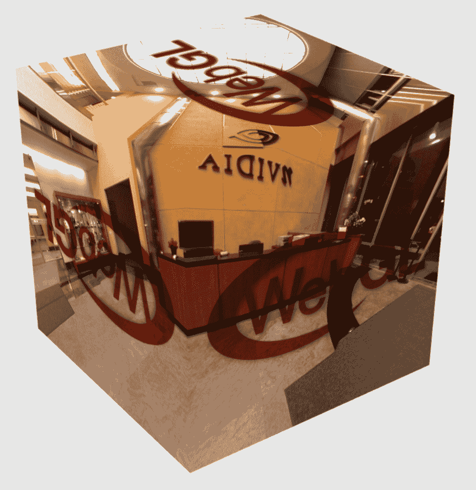

1.  完成的示例可以在`ch07_08_cubemap-final.html`中找到。

***发生了什么？***

当你旋转立方体时，你会注意到立方体贴图上显示的场景并没有随之旋转，从而在立方体贴图面上产生了一个“镜像”效果。这是因为在分配`vVertexNormal`变量时，法线与法线矩阵相乘，将法线放置在世界空间中。

使用立方体贴图进行反射表面是一个常见的技巧，但立方体贴图不仅仅有这个用途。其他常见的用途包括 Skybox 和高级光照模型。

SkyboxA 立方体贴图是一种用于创建背景的方法，使计算机和视频游戏关卡看起来比实际更大。当使用立方体贴图时，关卡被一个长方体包围。天空、远处的山脉、远处的建筑和其他不可达的对象被投影到立方体的面上（使用称为立方体贴图的技术），从而产生遥远的三维环境错觉。Skydome 采用相同的概念，但使用球体或半球体而不是立方体。更多信息，请查看以下链接：[`en.wikipedia.org/wiki/Skybox_(video_games)`](https://en.wikipedia.org/wiki/Skybox_(video_games))。

# 尝试：闪亮的标志

在这个例子中，我们创建了一个反射的“镜像”立方体。但如果我们只想让标志具有反射效果呢？我们如何将立方体贴图限制只显示在纹理的红色部分？

# 概述

让我们总结一下本章所学的内容：

+   如何使用纹理为我们的场景添加新的细节层次。

+   如何创建和管理纹理对象，以及如何将 HTML 图像用作纹理。

+   我们涵盖了纹理坐标和用于各种渲染技术的 mipmap 能力。

+   我们检查了各种过滤模式以及它们如何影响纹理的外观和使用，以及可用的纹理包裹模式以及它们如何改变纹理坐标的解释方式。

+   我们学习了如何在单个绘制调用中使用多个纹理，以及如何在着色器中将它们组合。

+   我们学习了如何创建和渲染立方体贴图，并看到了它们如何用于模拟反射表面。

在下一章中，我们将通过使用一种称为拾取的巧妙技术来查看如何选择和交互我们的 WebGL 场景中的对象。
