# 第八章：拾取

在上一章中，我们介绍了如何使用纹理来为我们的 3D 应用程序添加更多细节。在本章中，我们将学习如何通过一种称为**拾取**的技术与我们的 WebGL 应用程序进行交互。拾取指的是在 3D 场景中选择对象的能力。最常用的拾取设备是计算机鼠标。然而，拾取也可以使用其他人机界面进行，例如触觉屏幕和触觉设备。在本章中，我们将学习如何在 WebGL 中实现拾取。

在本章中，您将：

+   学习如何使用鼠标在 WebGL 场景中选择对象。

+   创建和使用离屏帧缓冲区。

+   学习渲染缓冲区是什么以及它们是如何被帧缓冲区使用的。

+   从帧缓冲区读取像素。

+   使用颜色标签根据颜色进行对象选择。

# 拾取

几乎任何 3D 计算机图形应用程序都需要提供用户与场景交互的机制。例如，在游戏中，您可能想要指向您的目标并对其执行操作。或者在 CAD 系统中，您可能想要能够选择场景中的对象并修改其属性。在本章中，我们将学习在 WebGL 中实现这些类型交互的基础知识。

首先，我们应该指出，我们可以通过从摄像机位置（也称为眼睛位置）向场景投射一条光线（向量）来选择对象，并计算沿其路径的对象。这被称为**光线投射**，涉及到检测场景中光线与对象表面的交点。

**光线投射**

光线投射是使用光线-表面交点测试来解决计算机图形和计算几何中各种问题的方法。这个术语最早在 1982 年由 Scott Roth 在计算机图形学中使用，用来描述渲染构造实体几何模型的方法。如果您想了解更多信息，请查看[`en.wikipedia.org/wiki/Ray_casting`](https://en.wikipedia.org/wiki/Ray_casting)。

话虽如此，在本章中，我们将基于离屏帧缓冲区中的对象颜色实现拾取，因为这是一种更简单、更基础的技术，有助于您了解如何在 3D 应用程序中与对象交互。如果您对光线投射感兴趣，您将在第十章“高级技术”中找到一个专门介绍这一技术的部分。

拾取背后的基本思想是为场景中的每个对象分配一个不同的标识符，并将场景渲染到离屏帧缓冲区中。我们将首先通过唯一颜色来识别对象。当用户点击`canvas`时，我们转到离屏帧缓冲区并读取点击动作位置的像素颜色。由于我们在离屏缓冲区中为每个对象分配了唯一颜色，我们可以使用这种颜色来识别被选中的对象并对其执行操作。以下图表说明了这个概念：

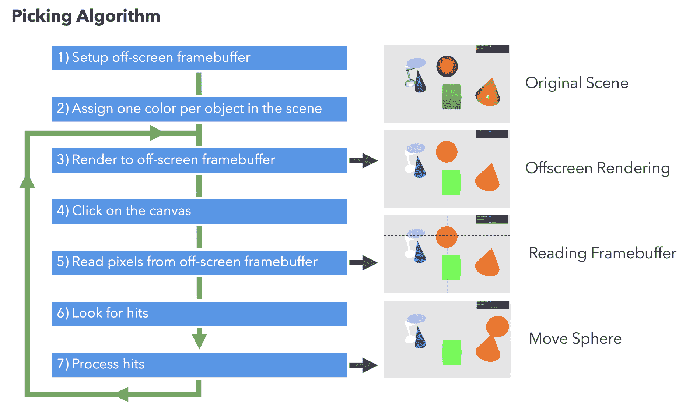

一个可能有助于解释拾取的有趣例子是 90 年代的流行任天堂游戏《鸭子射击》，玩家使用物理塑料枪控制器来射击鸭子：

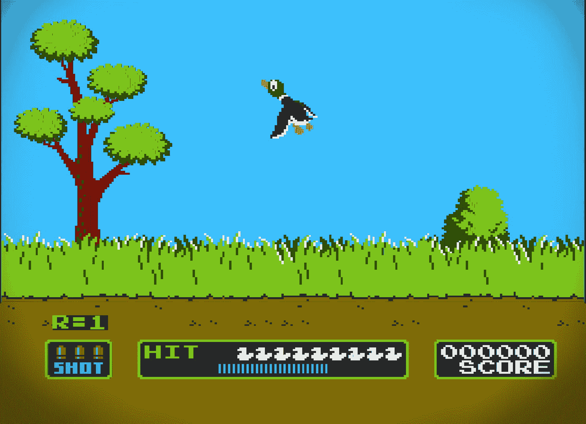

你能猜到游戏是如何确定玩家是否击中了一只鸭子吗？没错，是拾取！当玩家指向一只鸭子并拉动扳机时，NES 中的计算机将屏幕变黑，枪中的 Zapper 二极管开始接收信号。然后，计算机在目标周围闪烁一个实心的白色方块。Zapper 中的光电二极管检测到光强度的变化，并告诉计算机它指向了一个发光的目标方块——换句话说，你应该得分，因为你击中了目标。当然，当你玩游戏时，你不会注意到屏幕变黑和目标闪烁，因为这一切都在一秒钟内发生。非常聪明，对吧？

让我们分解在 WebGL 中实现我们自己的拾取形式的步骤。

# 设置离屏帧缓冲区

如第二章中所示，*渲染*，帧缓冲区是 WebGL 中的最终渲染目的地。屏幕上渲染的结果是帧缓冲区的内容。假设`gl`是我们的 WebGL 上下文，每次调用`gl.drawArrays`、`gl.drawElements`和`gl.clear`都会改变帧缓冲区的内容。

我们不仅可以渲染到默认帧缓冲区，还可以渲染到屏幕外的场景——我们称之为离屏帧缓冲区。这是实现拾取的第一步。为了做到这一点，我们需要设置一个新的帧缓冲区，并告诉 WebGL 我们想要使用它而不是默认的。让我们看看我们如何做到这一点。

为了设置帧缓冲区，我们需要为至少两件事创建存储：颜色和深度信息。我们需要存储帧缓冲区中渲染的每个片段的颜色，以便我们可以创建一个图像。此外，我们需要深度信息来确保场景中重叠的对象看起来是一致的。如果没有深度信息，那么在两个重叠对象的情况下，我们就无法判断哪个对象在前，哪个对象在后。

为了存储颜色，我们将使用 WebGL 纹理；为了存储深度信息，我们将使用渲染缓冲区。

# 创建纹理以存储颜色

在阅读了第七章纹理之后，创建纹理的代码应该相当直接：

```js
const canvas = document.getElementById('webgl-canvas');
const { width, height } = canvas;

const texture = gl.createTexture();
gl.bindTexture(gl.TEXTURE_2D, texture);
gl.texImage2D(gl.TEXTURE_2D, 0, gl.RGBA, width, height, 0, gl.RGBA, gl.UNSIGNED_BYTE, null);
```

唯一的区别是我们没有图像绑定到纹理上，因此当我们调用`gl.texImage2D`时，最后一个参数是`null`。这是因为我们在为存储离屏帧缓冲区的颜色分配空间。

需要注意的是，纹理的`width`和`height`被设置为`canvas`的大小。这是因为我们想要确保离屏帧缓冲区与我们的 3D 场景的尺寸相似。

# 创建渲染缓冲区以存储深度信息

渲染缓冲区用于为帧缓冲区中使用的单个缓冲区提供存储。深度缓冲区（z 缓冲区）是渲染缓冲区的一个例子。它始终附加到屏幕帧缓冲区，这是 WebGL 中的默认渲染目标。

创建渲染缓冲区的代码如下：

```js
const renderbuffer = gl.createRenderbuffer();
gl.bindRenderbuffer(gl.RENDERBUFFER, renderbuffer);
gl.renderbufferStorage(gl.RENDERBUFFER, gl.DEPTH_COMPONENT16, width, height);
```

第一行代码创建渲染缓冲区。类似于其他 WebGL 缓冲区，在我们可以操作它之前，需要绑定渲染缓冲区。第三行代码确定渲染缓冲区的存储大小。

请注意，存储的大小与纹理相同。类似于之前的情况，我们需要确保对于帧缓冲区中的每个片段（像素），我们都有一个颜色（存储在纹理中）和一个深度值（存储在渲染缓冲区中）。

# 为离屏渲染创建帧缓冲区

我们需要创建一个帧缓冲区，并附加我们在上一个示例中创建的纹理和渲染缓冲区。让我们看看这在代码中是如何工作的。

首先，我们需要创建一个新的帧缓冲区：

```js
const framebuffer = gl.createFramebuffer();
```

与 VBO 操作类似，我们通过将帧缓冲区设置为当前绑定的帧缓冲区来告诉 WebGL 我们将要操作这个帧缓冲区。我们通过以下指令来完成：

```js
gl.bindFramebuffer(gl.FRAMEBUFFER, framebuffer);
```

在绑定帧缓冲区后，通过调用以下方法附加纹理：

```js
gl.framebufferTexture2D(gl.FRAMEBUFFER, gl.COLOR_ATTACHMENT0, gl.TEXTURE_2D, texture, 0);
```

然后，使用以下方式将渲染缓冲区附加到已绑定的帧缓冲区：

```js
gl.framebufferRenderbuffer(gl.FRAMEBUFFER, gl.DEPTH_ATTACHMENT, gl.RENDERBUFFER, renderbuffer);
```

最后，我们使用以下代码以通常的方式清理已绑定的缓冲区：

```js
gl.bindTexture(gl.TEXTURE_2D, null);
gl.bindRenderbuffer(gl.RENDERBUFFER, null);
gl.bindFramebuffer(gl.FRAMEBUFFER, null);
```

当之前创建的帧缓冲区解除绑定时，WebGL 状态机会回到渲染到默认屏幕帧缓冲区。

# 场景中每个对象分配一种颜色

为了简化问题，我们将根据对象的原始颜色选择一个对象。也就是说，我们丢弃了闪亮的反射或阴影，并以均匀的颜色渲染对象。这很重要，因为要基于颜色选择对象，我们需要确保颜色对每个对象是恒定的，并且每个对象都有不同的独特颜色。

我们通过告诉片段着色器只使用材料的漫反射属性来设置 ESSL 输出颜色变量，从而实现恒定着色。我们假设每个对象都有一个独特的漫反射属性。

在可能存在共享相同漫反射颜色的对象的情况下，我们可以创建一个新的 ESSL 统一变量来存储选择颜色，并使其对每个渲染到离屏帧缓冲区的对象都是唯一的。这样，当对象在屏幕上渲染时，它们看起来是相同的，但每次它们渲染到离屏帧缓冲区时，它们的颜色都是唯一的。在本章的后面部分，我们将实现这一策略，以及其他用于唯一识别对象的方案。

现在，让我们假设场景中的对象具有独特的漫反射颜色，如下面的图所示：

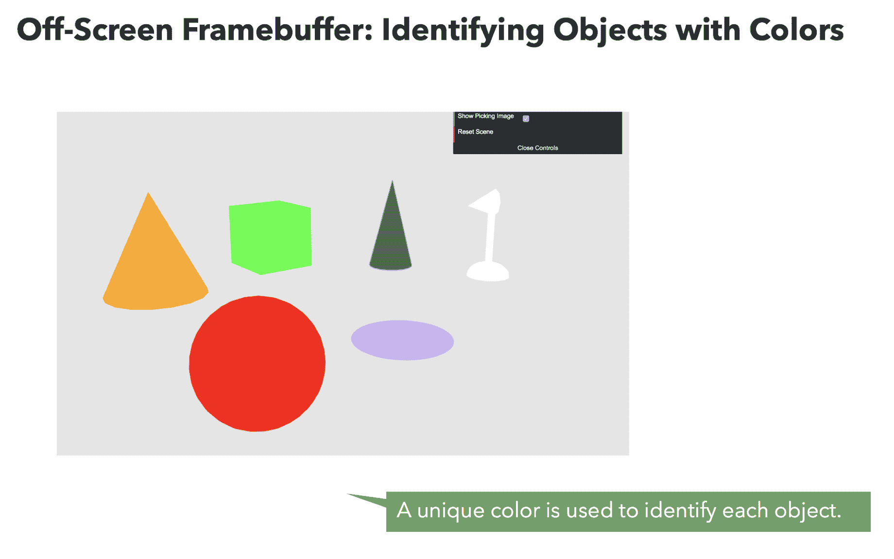

让我们看看如何使用我们刚刚设置的帧缓冲区来离屏渲染场景。

# 渲染到离屏帧缓冲区

为了使用离屏帧缓冲区进行对象选择，我们需要确保两个帧缓冲区同步。如果屏幕帧缓冲区和离屏帧缓冲区不同步，我们可能会错过关键数据，这可能会使我们的选择策略不一致。

一致性的缺乏将限制从离屏帧缓冲区读取颜色并用于识别场景中对象的能力。

为了确保缓冲区同步，我们将创建一个自定义的`render`函数。这个函数调用`draw`函数两次。首先，当离屏缓冲区绑定时，然后当屏幕默认帧缓冲区绑定时。代码如下：

```js
function render() {
  // off-screen rendering
  gl.bindFramebuffer(gl.FRAMEBUFFER, framebuffer);
  // we set the uniform to true because of an offscreen render
  gl.uniform1i(program.uOffscreen, true);
  draw();

  // on-screen rendering
  gl.bindFramebuffer(gl.FRAMEBUFFER, null);
  // we set the uniform to false because of the default render
  gl.uniform1i(program.uOffscreen, false);
  draw();
}
```

我们告诉我们的 ESSL 程序在将渲染到离屏帧缓冲区时只使用漫反射颜色，使用`uOffscreen`统一变量。片段着色器包含以下代码：

```js
void main(void) {

  if (uOffscreen) {
    fragColor = uMaterialDiffuse;
    return;
  }

  // ...
}
```

下面的图显示了`render`函数的行为：

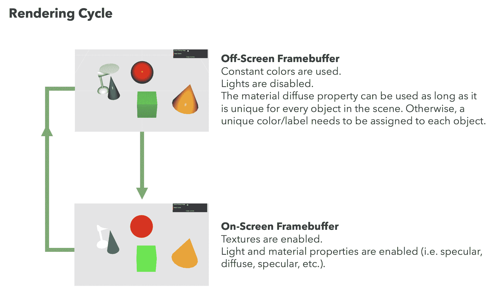

因此，每次场景更新时，都会调用`render`函数而不是调用`draw`函数。

我们在`init`函数中修改这一点：

```js
function init() {
  configure();
  load();

  // instead of calling 'draw', we are now calling 'render'
  clock.on('tick', render);
}
```

这样，`scene`将使用`render`函数而不是原始的`draw`函数定期更新。

# 点击画布

下一步是从离屏帧缓冲区捕获并读取用户点击的鼠标坐标。我们可以使用网页中的`canvas`元素的标准的`onmouseup`事件：

```js
const canvas = document.getElementById('webgl-canvas');

canvas.onmouseup = event => {
  // capture coordinates from the `event`
};
```

由于给定的`event`返回的是从左上角开始的鼠标坐标（`clientX`和`clientY`），而不是相对于`canvas`的坐标，我们需要利用 DOM 层次结构来了解围绕`canvas`元素的总偏移量。

我们可以在`canvas.onmouseup`函数内的代码片段中这样做：

```js
let top = 0,
  left = 0;

while (canvas && canvas.tagName !== 'BODY') {
  top += canvas.offsetTop;
  left += canvas.offsetLeft;
  canvas = canvas.offsetParent;
}
```

下面的图显示了我们是如何使用偏移计算来获得点击的`canvas`坐标的：

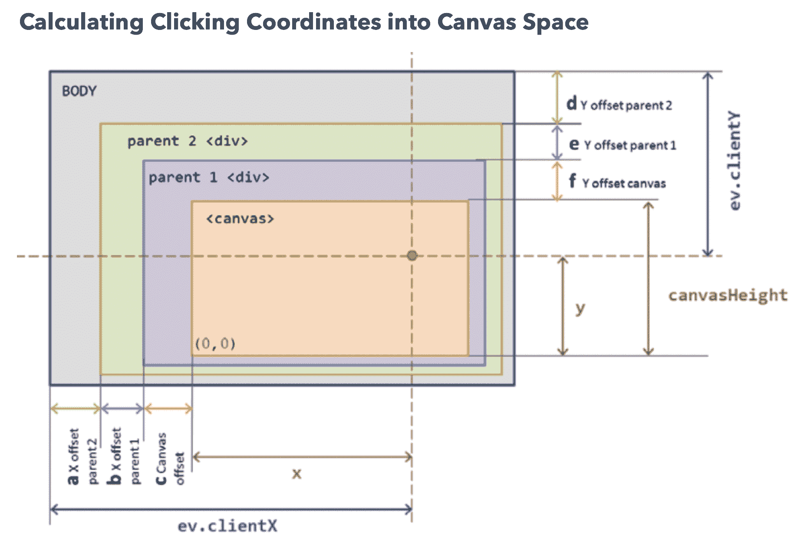

```js
const x = ev.clientX - (a + b + c);
const y = canvasHeight - (ev.clientY - (d + e + f));
```

此外，我们还应该考虑任何可能的页面偏移。页面偏移是滚动的结果，它会影响坐标的计算。我们希望每次都能获得相同的`canvas`坐标，无论是否滚动。为此，我们在计算点击的`canvas`坐标之前添加以下两行代码：

```js
left += window.pageXOffset;
top -= window.pageYOffset;
```

然后，我们计算`canvas`坐标：

```js
x = ev.clientX - left;
y = canvas.height - (ev.clientY - top);
```

记住，与浏览器窗口不同，`canvas`坐标（以及为此目的的帧缓冲区坐标）从左下角开始。

# 从离屏帧缓冲区读取像素

我们现在可以转到离屏缓冲区并从适当的坐标读取颜色：

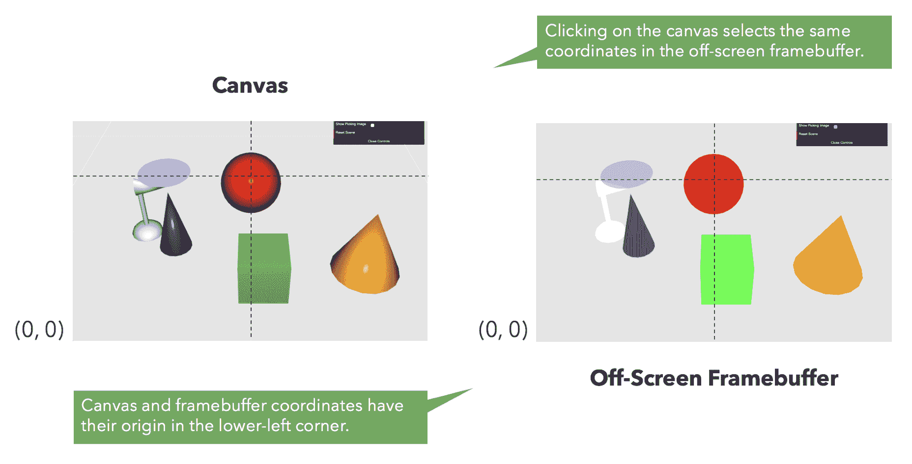

WebGL 允许我们使用`readPixels`函数从帧缓冲区读取。像往常一样，在我们的上下文中使用`gl`作为 WebGL 上下文变量：

| **函数** | **描述** |
| --- | --- |
| `gl.readPixels(x, y, width, height, format, type, pixels)` |

+   `x`和`y`：起始坐标。

+   `width`和`height`：从帧缓冲区读取的像素范围。在我们的例子中，我们只读取一个像素（用户点击的位置），所以这将会是`1`，`1`。

+   `format`：支持`gl.RGBA`格式。

+   `type`：支持`gl.UNSIGNED_BYTE`类型。

+   `pixels`: 一个将包含查询帧缓冲区结果的类型化数组。它需要足够的空间来存储结果，这取决于查询的范围（`x`，`y`，`width`，`height`）。它支持`Uint8Array`类型。

|

记住，WebGL 作为一个状态机工作；因此，许多操作都依赖于其状态的有效性。在这种情况下，我们需要确保我们想要从中读取的离屏帧缓冲区是当前绑定的。为此，我们使用`bindFramebuffer`来绑定它。将所有这些放在一起，代码看起来是这样的：

```js
// read one pixel
const readout = new Uint8Array(1 * 1 * 4);
gl.bindFramebuffer(gl.FRAMEBUFFER, framebuffer);
gl.readPixels(coords.x, coords.y, 1, 1, gl.RGBA, gl.UNSIGNED_BYTE, readout);
gl.bindFramebuffer(gl.FRAMEBUFFER, null);
```

在这里，读取数组的尺寸是`1 * 1 * 4`。这意味着它有一个像素的宽度乘以一个像素的高度乘以四个通道，因为格式是 RGBA。您不需要以这种方式指定大小；这样做是为了演示当我们只检索一个像素时，为什么大小是`4`。

# 寻找命中

现在，我们将检查从离屏帧缓冲区获取的颜色是否与场景中的任何对象匹配。记住，在这里我们使用颜色作为对象标签。如果颜色与其中一个对象匹配，那么我们称之为**命中**。如果不匹配，我们称之为**未命中**。

在寻找命中点时，我们比较每个对象的漫反射颜色与从离屏帧缓冲区获得的标签。然而，还有一个需要考虑的额外步骤：每个颜色通道的返回范围是`[0, 255]`，而对象的漫反射颜色在`[0, 1]`范围内。在我们检查任何可能的命中之前，我们需要更新这一点。我们可以使用比较函数来完成：

```js
function compare(readout, color) {
  return (
    Math.abs(Math.round(color[0] * 255) - readout[0]) <= 1 &&
    Math.abs(Math.round(color[1] * 255) - readout[1]) <= 1 &&
    Math.abs(Math.round(color[2] * 255) - readout[2]) <= 1
  );
}
```

在前面的代码中，我们将漫反射属性缩放到`[0, 255]`范围内，然后逐个比较每个通道。我们不需要比较 alpha 通道。如果我们有两个颜色相同但 alpha 通道不同的对象，我们可以在比较中使用 alpha 通道，但这种情况在我们的例子中并不适用。

此外，需要注意的是，比较并不精确，因为我们正在处理`[0, 1]`范围内的十进制值。因此，我们通过假设在重新缩放颜色并减去读取（对象标签）后我们有一个命中，引入了一个调整因子——差异小于一。

然后，我们只需遍历`scene`中的对象列表，并使用以下代码检查是否有命中或未命中：

```js
let pickedObject;

scene.traverse(object => {
  if (compare(readout, object.diffuse)) {
    // Returning any value from the 'scene.traverse' method breaks the loop
    return pickedObject = object;
  }
});
```

此代码遍历`scene`中的每个对象，并在我们有命中时将`pickedObject`分配给匹配的对象。

# 处理命中

处理碰撞是一个很大的概念，这很大程度上取决于您所使用的应用程序类型。例如，如果您的应用程序是一个 CAD 系统，您可能希望检索所选对象的属性，以便您可以编辑或删除它。相反，如果您正在开发一个游戏，选择一个对象可能涉及将其设置为角色接下来应该与之战斗的目标。正如您所预期的，这部分需要适应各种用途。话虽如此，我们很快就会提供一个实际例子，您可以在我们的场景中拖放对象。但首先，我们需要回顾一下我们应用程序的一些架构更新。

# 架构更新

我们已经用`render`函数替换了`draw`函数，正如本章前面所描述的。

现在有一个新的类：**Picker**。这个类的源代码可以从`common/js/Picker.js`获取。这个类封装了离屏帧缓冲区以及创建、配置和从中读取所需的代码。我们还更新了`Controls`类，以便在用户点击`canvas`时通知选择器。

现在，让我们看看选择操作的实际应用！

# 行动时间：选择操作

让我们来看一个这个技术实际应用的例子：

1.  使用您的浏览器打开`ch08_01_picking.html`文件。您将看到一个类似于以下的屏幕：

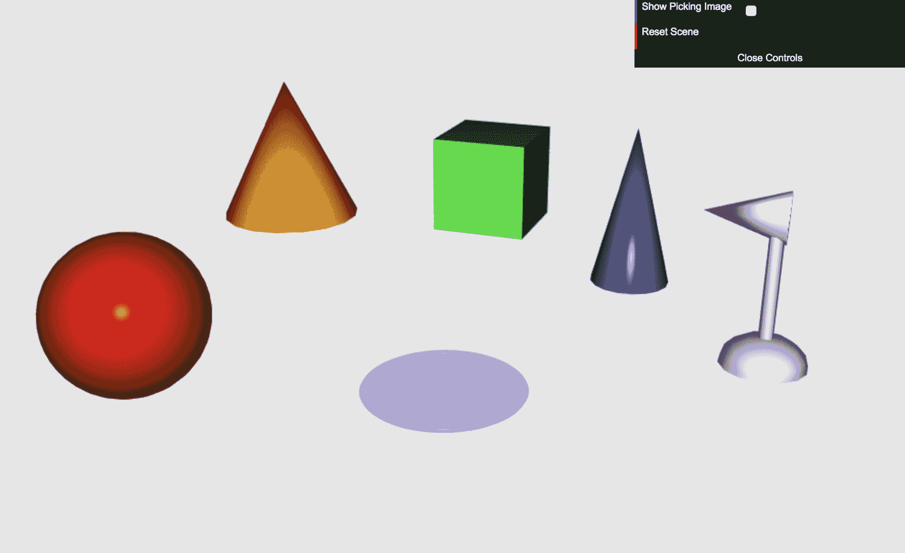

1.  在这里，您有一组对象，每个对象都有一个独特的漫反射颜色属性。与之前的示例一样，您可以围绕场景移动相机。请注意，立方体有一个纹理，而扁平的圆盘是半透明的。正如您所期望的，`draw`函数中的代码处理纹理、坐标以及透明度，因此看起来比之前复杂一些（您可以在源代码中查看）。这是一个更现实的`draw`函数。在实际应用中，您将不得不处理这些情况。

1.  点击球体并在场景中拖动它。请注意，对象变得半透明。此外，请注意位移沿着相机的轴线发生。为了使这一点更加明显，请前往您的网页浏览器的`控制台`并输入以下内容：

```js
camera.setElevation(0);
```

1.  当您通过在场景内点击来恢复时钟时，您将看到相机更新其位置到零度仰角，如下面的截图所示：

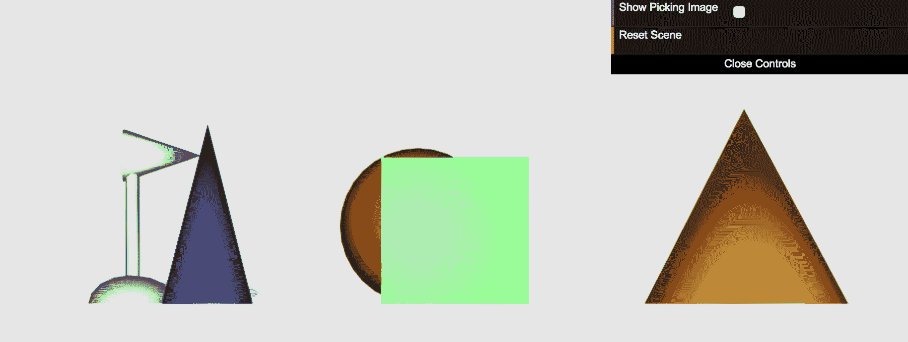

JavaScript 控制台

Firefox：工具 | 网页开发者 | 网页控制台

Safari：开发 | 显示网页检查器

Chrome：工具 | JavaScript 控制台

1.  当您从这一视角点击并拖动场景中的对象时，您会看到它们根据摄像机的轴线改变位置。在这种情况下，摄像机的向上轴线与场景的 y 轴线对齐。如果您上下移动一个对象，您会看到它们在`y`坐标上的位置发生变化。如果您更改摄像机位置（通过点击背景并拖动鼠标），然后移动不同的对象，您会看到对象根据摄像机的新 y 轴线移动。

1.  尝试不同的摄像机角度，看看会发生什么。

1.  让我们看看离屏帧缓冲区看起来像什么。点击“显示拾取图像”按钮。在这里，我们指示片段着色器使用每个对象的漫反射属性来着色片段。您也可以在这种方式下旋转场景并拾取对象。如果您想回到原始着色方法，再次点击“显示拾取图像”以取消激活它。

1.  要重置场景，请点击**重置场景**。

***刚才发生了什么？***

我们已经看到了一个拾取操作的示例。源代码使用了我们在*架构更新*部分之前描述的`Picker`类。让我们更仔细地看看它。

# 拾取架构

如您可能已经注意到的，每个拾取状态都与一个回调函数相关联。以下过程概述了当用户在`canvas`上点击鼠标、拖动它并释放时，`Picker`类中发生的情况：

| **状态** | **回调** |
| --- | --- |
| `Picker`搜索命中项 | `hitPropertyCallback(object)`: 此回调通知拾取器使用哪个对象属性来与从离屏帧缓冲区检索到的颜色进行比较。 |
| 用户在拾取模式下拖动鼠标 | `moveCallback(dx, dy)`: 当拾取模式被激活（通过至少拾取一个对象）时，此回调允许我们移动拾取列表（命中项）中的对象。此列表由`Picker`类内部维护。 |
| 从拾取列表中移除命中项 | `addHitCallback(object)`: 如果我们点击一个对象，而这个对象不在拾取列表中，拾取器将通过触发此回调来通知应用程序。 |
| 将命中项添加到拾取列表 | `removeHitCallback(object)`: 如果我们点击一个对象，而这个对象已经在拾取列表中，拾取器将将其从列表中移除，然后通过触发此回调来通知应用程序。 |
| 结束拾取模式 | `processHitsCallback(hits)`: 如果用户在未按下*Shift*键的情况下释放鼠标按钮，拾取模式结束，并且应用程序将通过触发此回调来得到通知。如果按下*Shift*键，则拾取模式继续，拾取器等待新的点击以继续寻找命中项。 |

# 实现独特的对象标签

我们之前提到，如果场景中的两个或多个对象具有相同的漫反射颜色，基于漫反射属性进行选择可能会很困难。如果情况如此，并且你选择了其中之一，你将如何确定基于其颜色选择的是哪一个？在下面的*行动时间*部分，我们将实现独特的对象标签。对象将使用这些颜色标签而不是漫反射颜色在离屏帧缓冲区中渲染。场景仍然将使用非独特的漫反射颜色在屏幕上渲染。

# 行动时间：独特的对象标签

本节分为两部分。在第一部分，你将开发代码以生成包含圆锥体和圆柱体的随机场景。每个对象将被分配一个独特的对象标签，该标签将用于在离屏渲染缓冲区中着色对象。在第二部分，我们将配置选择器以使用独特的标签。让我们开始吧：

1.  在你的浏览器中打开`ch08_02_picking-initial.html`文件。这是一个只显示地板对象的场景。我们将创建一个包含多个对象（可以是球体或圆柱体）的场景。

1.  在源代码编辑器中打开`ch08_02_picking-initial.html`。

1.  我们将编写代码，以便场景中的每个对象都可以具有以下属性：

    +   随机分配的位置

    +   独特的对象标签颜色

    +   非独特的漫反射颜色

    +   确定对象大小的比例因子

1.  我们已经提供了空函数，你将在本节中实现它们。

1.  让我们编写`positionGenerator`函数。向下滚动到它并添加以下代码：

```js
function positionGenerator() {
  const
    flagX = Math.floor(Math.random() * 10),
    flagZ = Math.floor(Math.random() * 10);

  let x = Math.floor(Math.random() * 60),
    z = Math.floor(Math.random() * 60);

  if (flagX >= 5) {
    x = -x;
  }
  if (flagZ >= 5) {
    z = -z;
  }

  return [x, 0, z];
}
```

1.  在这里，我们使用`Math.random`函数生成场景中对象的`x`和`z`坐标。由于`Math.random`始终返回一个正数，我们使用`flagX`和`flagZ`变量在`x`-`z`平面（地板）上随机分布对象。此外，因为我们希望所有对象都在`x`-`z`平面上，所以在`return`语句中将`y`分量始终设置为`0`。

1.  让我们编写一个独特的对象标签生成函数。滚动到空的`objectLabelGenerator`函数并添加以下代码：

```js
const colorset = {};

function objectLabelGenerator() {
  const
    color = [Math.random(), Math.random(), Math.random(), 1],
    key = color.toString();

  if (key in colorset) {
    return objectLabelGenerator();
  }
  else {
    colorset[key] = true;
    return color;
  }
}
```

1.  我们使用`Math.random`函数创建一个随机颜色。如果`key`变量已经是`colorset`对象的属性，那么我们将递归调用`objectLabelGenerator`函数以获取新值；否则，我们将`key`作为`colorset`的属性，然后`return`相应的颜色。注意，JavaScript 对象作为集合的处理方式如何使我们能够解决任何可能的关键冲突。

1.  编写`diffuseColorGenerator`函数。我们将使用此函数为对象分配漫反射属性：

```js
function diffuseColorGenerator(index) {
  const color = (index % 30 / 60) + 0.2;
  return [color, color, color, 1];
}
```

1.  此函数表示我们想要生成非唯一颜色的情形。`index`参数表示我们正在分配漫反射颜色的`scene.objects`列表中对象的索引。在此函数中，我们创建了一个灰度颜色，因为`return`语句中的`r`、`g`和`b`组件都具有相同的`color`值。

1.  `diffuseColorGenerator`函数将在每个`30`个索引处创建碰撞。索引除以`30`的余数将在序列中创建循环：

```js
0 % 30 = 0
1 % 30 = 1
...
29 % 30 = 29
30 % 30 = 0
31 % 30 = 1
... 
```

1.  由于此结果被除以`60`，结果将是一个在`[0, 0.5]`范围内的数字。然后，我们添加`0.2`以确保`color`的最小值是`0.2`。这样，在屏幕渲染期间对象看起来不会太暗（如果计算的漫反射颜色是`0`，它们将是黑色的）。

1.  我们将要编写的最后一个辅助函数是`scaleGenerator`函数：

```js
function scaleGenerator() {
  const scale = Math.random() + 0.3;
  return [scale, scale, scale];
}
```

1.  此函数将允许我们拥有不同大小的对象。`0.3`被添加以控制场景中任何对象的最小缩放因子。

1.  让我们在场景中加载`100`个对象。到本节结束时，你将能够测试它们中的任何一个的拾取！

1.  前往`load`函数并编辑它，使其看起来像这样：

```js
function load() {
  scene.add(new Floor(80, 20));

  for (let i = 0; i < 100; i++) {
    const objectType = Math.floor(Math.random() * 2);

    const options = {
      position: positionGenerator(),
      scale: scaleGenerator(),
      diffuse: diffuseColorGenerator(i),
      pcolor: objectLabelGenerator()
    };

    switch (objectType) {
      case 1:
        return scene.load('/common/models/ch8/sphere.json', 
         `ball_${i}`, options);
      case 0:
        return scene.load('/common/models/ch8/cylinder.json', 
         `cylinder_${i}`, options);
    }
  }
}
```

1.  选择颜色由`pcolor`属性表示。此属性作为属性列表传递给`scene.load`函数。一旦对象被加载（使用**JSON/Ajax**），`load`将使用此属性列表并将它们添加为对象属性。

1.  本练习中的着色器已经为你设置好了。与唯一对象标签对应的`pcolor`属性映射到`uPickingColor`统一变量，而`uOffscreen`统一变量确定是否在片段着色器中使用：

```js
uniform vec4 uPickingColor;

void main(void) {

  if (uOffscreen) {
    fragColor = uPickingColor;
    return;
  }
  else {
    // on-screen rendering
  }

}
```

1.  如前所述，我们通过使用以下`render`函数来保持离屏和屏幕缓冲区同步：

```js
function render() {
  // Off-screen rendering
  gl.bindFramebuffer(gl.FRAMEBUFFER, picker.framebuffer);
  gl.uniform1i(program.uOffscreen, true);
  draw();

  // On-screen rendering
  gl.uniform1i(program.uOffscreen, showPickingImage);
  gl.bindFramebuffer(gl.FRAMEBUFFER, null);
  draw();
}
```

1.  将你的工作保存为`ch08_03_picking-no-picker.html`。

1.  在你的浏览器中打开`ch08_03_picking-no-picker.html`。

1.  点击“显示拾取图像”。会发生什么？

1.  场景正在被渲染到离屏和默认的屏幕帧缓冲区。然而，我们尚未配置`Picker`回调。

1.  在你的源代码编辑器中打开`ch08_03_picking-no-picker.html`。

1.  滚动到`configure`函数。拾取器已经为你设置好了：

```js
picker = new Picker(canvas, {
  hitPropertyCallback: hitProperty,
  addHitCallback: addHit,
  removeHitCallback: removeHit,
  processHitsCallback: processHits,
  moveCallback: movePickedObjects
});
```

1.  此代码片段将网页中的函数映射到拾取回调钩子。这些回调根据拾取状态被调用。

1.  我们现在将实现必要的回调。同样，我们提供了空函数，你需要编写代码。

1.  让我们创建`hitProperty`函数。滚动到空的`hitProperty`函数并添加以下代码：

```js
function hitProperty(obj) {
  return obj.pcolor;
}
```

1.  我们正在返回`pcolor`属性，以便与从离屏帧缓冲区读取的颜色进行比较。如果这些颜色匹配，那么我们就有一个碰撞。

1.  编写`addHit`和`removeHit`函数。我们想要创建在拾取期间将漫反射颜色更改为拾取颜色的效果。我们需要一个额外的属性来临时保存原始漫反射颜色，以便我们可以在稍后恢复它：

```js
function addHit(obj) {
  obj.previous = obj.diffuse.slice(0);
  obj.diffuse = obj.pcolor;
}
```

1.  `addHit`函数将当前漫反射颜色存储在一个名为`previous`的辅助属性中。然后，它将漫反射颜色更改为`pcolor`，即对象拾取标签：

```js
function removeHit(obj) {
  obj.diffuse = obj.previous.slice(0);
}
```

1.  `removeHit`函数会恢复漫反射颜色。

1.  现在，让我们编写`processHits`的代码：

```js
function processHits(hits) {
  hits.forEach(hit => hit.diffuse = hit.previous);
}
```

1.  请记住，`processHits`在退出拾取模式时被调用。此函数将接收一个参数：`picker`检测到的`hits`。`hits`列表中的每个元素都是`scene`中的一个对象。在这种情况下，我们希望将漫反射颜色还给击中点。为此，我们使用在`addHit`函数中设置的`previous`属性。

1.  我们需要实现的最后一个拾取回调函数是`movePickedObjects`函数：

```js
function movePickedObjects(dx, dy) {
  const hits = picker.getHits();

  if (!hits) return;

  const factor = Math.max(
    Math.max(camera.position[0], camera.position[1]), 
     camera.position[2]
  ) / 2000;

  hits.forEach(hit => {
    const scaleX = vec3.create();
    const scaleY = vec3.create();

    if (controls.alt) {
      vec3.scale(scaleY, camera.normal, dy * factor);
    }
    else {
      vec3.scale(scaleY, camera.up, -dy * factor);
      vec3.scale(scaleX, camera.right, dx * factor);
    }

    vec3.add(hit.position, hit.position, scaleY);
    vec3.add(hit.position, hit.position, scaleX);
  });
}
```

1.  此函数允许我们交互式地移动`hits`列表中的对象。此回调函数接收的参数如下：

    +   `dx`：当鼠标在`canvas`上拖动时从鼠标获得的水平方向位移

    +   `dy`：当鼠标在`canvas`上拖动时从鼠标获得的垂直方向位移

1.  让我们分析一下代码。首先，我们从拾取实例中检索所有击中点：

```js
const hits = picker.getHits();
```

1.  如果没有击中点，函数将立即返回：

```js
if (!hits) return;
```

1.  我们计算一个将在以后使用的加权因子（调整因子）：

```js
const factor = Math.max(
  Math.max(camera.position[0], camera.position[1]), camera.position[2]
) / 2000;
```

1.  我们创建一个循环来遍历击中点列表，以便我们可以更新每个对象的位置：

```js
hits.forEach(hit => {
  const scaleX = vec3.create();
  const scaleY = vec3.create();

  // ...
});
```

1.  对于每个击中点，`scaleX`和`scaleY`变量都会被初始化。

1.  *Alt*键正在被用来执行推拉（沿着相机的法线路径移动相机）。在这种情况下，当用户按下*Alt*键以提供一致的用户体验时，我们希望沿着相机的法线方向移动拾取列表中的对象。

1.  要沿着相机的法线移动击中点，我们使用`dy`（上下）位移，如下所示：

```js
if (controls.alt) {
  vec3.scale(scaleY, camera.normal, dy * factor);
}
```

1.  这创建了一个`camera.normal`的缩放版本，并将其存储到`scaleY`变量中。请注意，`vec3.scale`是**glMatrix**库中可用的一种操作。

1.  如果用户没有按下*Alt*键，则我们使用`dx`（左右）和`dy`（上下）在相机平面内移动击中点。在这里，我们使用相机的向上和向右向量来计算`scaleX`和`scaleY`参数：

```js
else {
  vec3.scale(scaleY, camera.up, -dy * factor);
  vec3.scale(scaleX, camera.right, dx * factor);
}
```

1.  我们更新击中点的位置：

```js
vec3.add(hit.position, hit.position, scaleY);
vec3.add(hit.position, hit.position, scaleX);
```

1.  将页面保存为`ch08_04_picking-final.html`，并使用您的浏览器打开它。

1.  您将看到如下截图所示的场景：

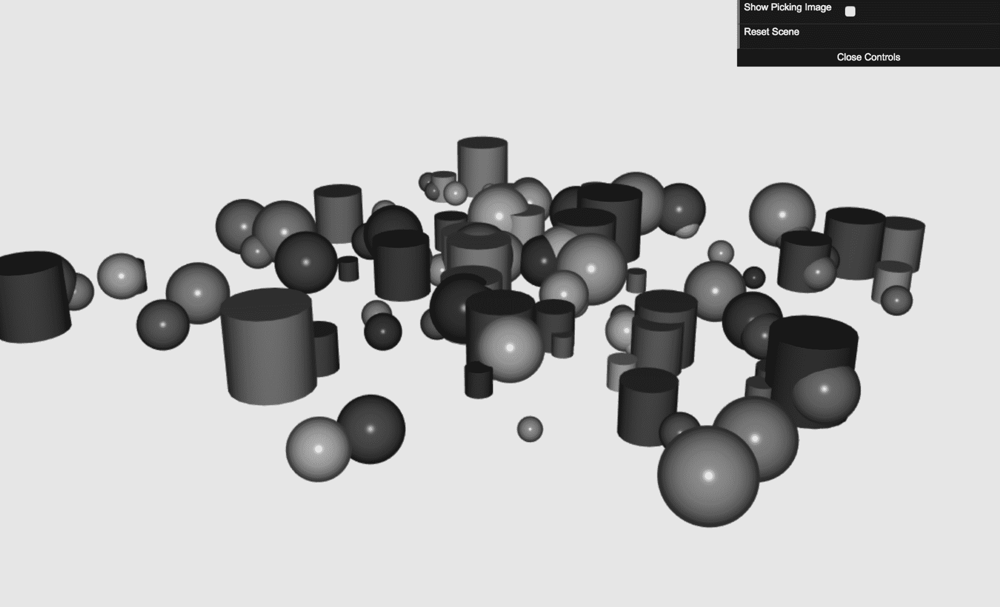

1.  多次点击“重置场景”，并验证每次都得到一个新的场景。

1.  在这个场景中，所有对象的颜色非常相似。然而，每个对象都有一个独特的拾取颜色。为了验证这一点，点击“显示拾取图像”按钮。您将在屏幕上看到在离屏缓冲区中渲染的内容：

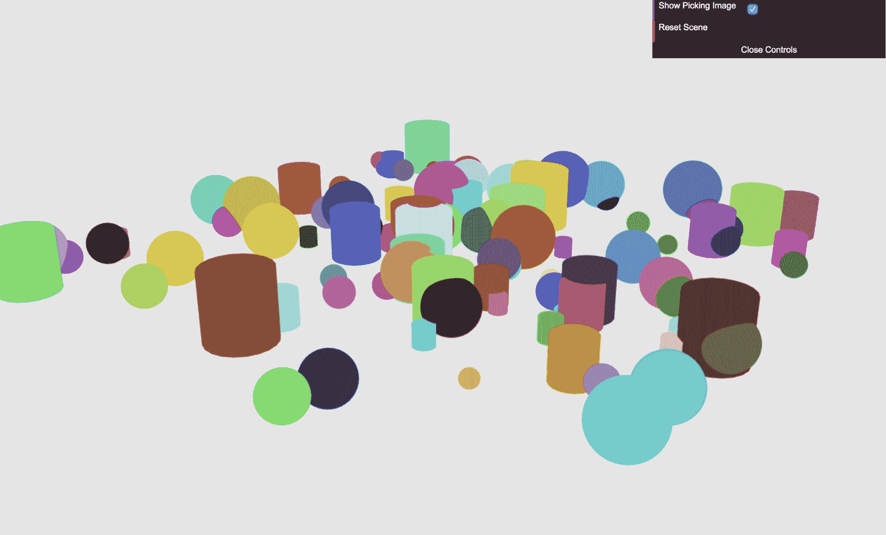

1.  让我们验证我们对选择器回调所做的更改。让我们先选择一个对象。正如你所看到的，对象的漫反射颜色变成了选择颜色（这是你在`addHit`函数中实现的变化）：

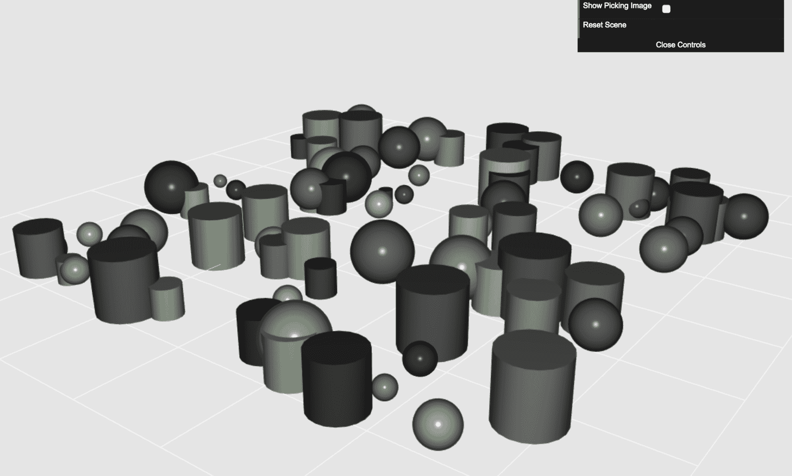

1.  当鼠标释放时，对象会恢复到原始颜色。这是在`processHits`函数中实现的变化。

1.  当鼠标按钮压在对象上时，你可以拖动它。当这样做完成后，`movePickedObjects`将被调用。

1.  在选择对象时按下*Shift*键将告诉选择器不要退出**选择模式**。这样，你可以一次选择并移动多个对象：

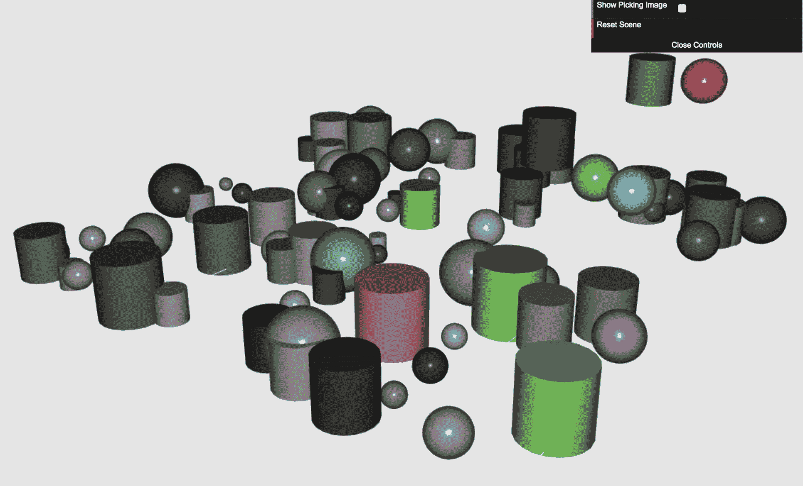

1.  如果你选择了一个对象并且没有按下*Shift*键，或者你的下一次点击没有产生任何击中（换句话说，点击其他任何地方），你将退出选择模式。

1.  如果你在这个练习中遇到任何问题或遗漏了某个步骤，我们已经在`ch08_03_picking-no-picker.html`和`ch08_04_picking-final.html`文件中包含了完整的练习。

***发生了什么？***

我们做了以下几步：

+   创建了属性选择颜色。这个属性对于场景中的每个对象都是唯一的，并允许我们根据它实现选择。

+   修改了片段着色器以使用选择颜色属性，通过包含一个新的统一变量`uPickingColor`并将此统一变量映射到`pcolor`对象属性。

+   学习了不同的选择状态。我们还学习了如何修改`Picker`回调以执行特定的应用程序逻辑，例如从场景中移除被选择的对象。

# 尝试：清除场景

重新编写`processHits`函数以从场景中移除被击中的球体。如果用户已经从场景中移除了所有的球体，显示完成此任务所需的时间信息。

提示

如果别名以`ball_`开头，在`processHits`函数中使用`scene.remove(objectName)`退出选择模式。

提示

一旦从场景中移除击中，重新访问`scene.objects`列表，确保没有对象的别名以`ball_`开头。

提示

使用 JavaScript 计时器来测量和显示完成任务所需的时间。

# 尝试：使用替代标识符进行选择

你会如何在不使用颜色的情况下唯一标识对象？由于我们正在利用离屏帧缓冲区，我们可以用唯一的 ID 而不是颜色来标识每个对象，因为我们的离屏渲染的视觉效果并不重要。继续实现一个基于 ID 的策略来标识每个对象。

将索引打包到 RGBA 通道中

你可以将对象`1`视为索引（或颜色）`[0, 0, 0, 1]`，对象`2`为`[0, 0, 0, 2]`，以此类推，直到对象`1020`（即`255 * 4`）为`[255, 255, 255, 255]`。

由于我们的 RGBA 通道绑定在`[0-255]`的范围内，我们如何将更多的 ID 打包到基于四位的向量中呢？

不同的数制系统

你可能会首先想到利用小数而不是整数。这是一个可行的解决方案，尤其是在你考虑到 ESSL 中浮点数的精度之后。另一个可行的解决方案是使用基于`255`的数制而不是我们传统的基`10`。采用这种方法，你可以唯一地识别超过 40 亿个对象，而不需要小数。

# 尝试：解耦 WebGL 组件

尽管我们可以通过使用更可扩展的架构将`Controls`和`Picker`解耦来实现它们，但出于教育目的，我们选择了更简单的实现方式。

话虽如此，你将如何重新构建本章中的示例，目标是解耦类以最小化组件之间的相互依赖？

提示

一种方法是将之前讨论的 pub/sub 模式用于我们的`Clock`。也就是说，每个组件都可以扩展`EventEmitter`类——类似于`Clock`——来发布其他组件可能订阅的事件。

# 摘要

让我们总结一下在本章中学到的内容：

+   我们研究了帧缓冲区和渲染缓冲区之间的区别。渲染缓冲区是一个特殊的缓冲区，它附加到帧缓冲区上。

+   我们了解到 WebGL 提供了创建与默认屏幕帧缓冲区不同的离屏帧缓冲区的机制。

+   我们讨论了帧缓冲区至少需要一个纹理来存储颜色，以及一个渲染缓冲区来存储深度信息。

+   我们讨论了如何将用户点击坐标转换为`canvas`坐标，以便我们可以将它们映射到离屏帧缓冲区中的值。

+   我们讨论了`Picker`架构。选择可以有不同的状态，每个状态都与一个回调函数相关联。Picker 回调允许自定义应用程序逻辑确定选择进行时会发生什么。

+   我们学习了如何在 WebGL 中实现基于颜色的选择。仅基于漫反射颜色进行选择是有限的，因为可能存在多个对象具有相同漫反射颜色的情况。

+   我们了解到，为每个对象分配一个独特的颜色属性以执行选择是更好的选择。这个属性被称为颜色/对象标签的选择。

+   我们讨论了将唯一的 ID 而不是唯一的颜色编码到基于四位的向量 RGBA 中。

在下一章中，我们将把之前章节中涵盖的所有概念结合起来，构建一个 3D 虚拟汽车展厅。此外，我们还将了解如何将来自 3D 编辑工具 Blender 的汽车模型导入 WebGL 应用程序。
