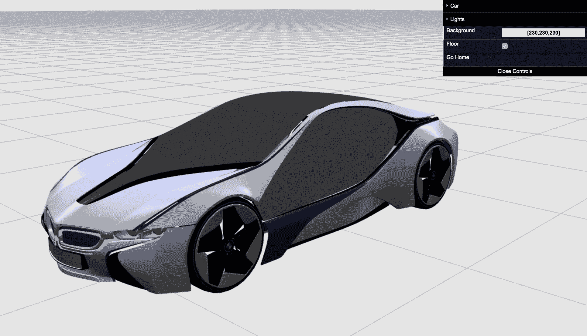
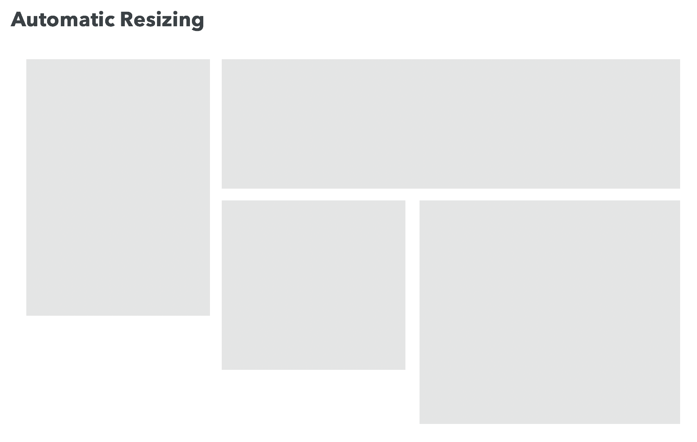
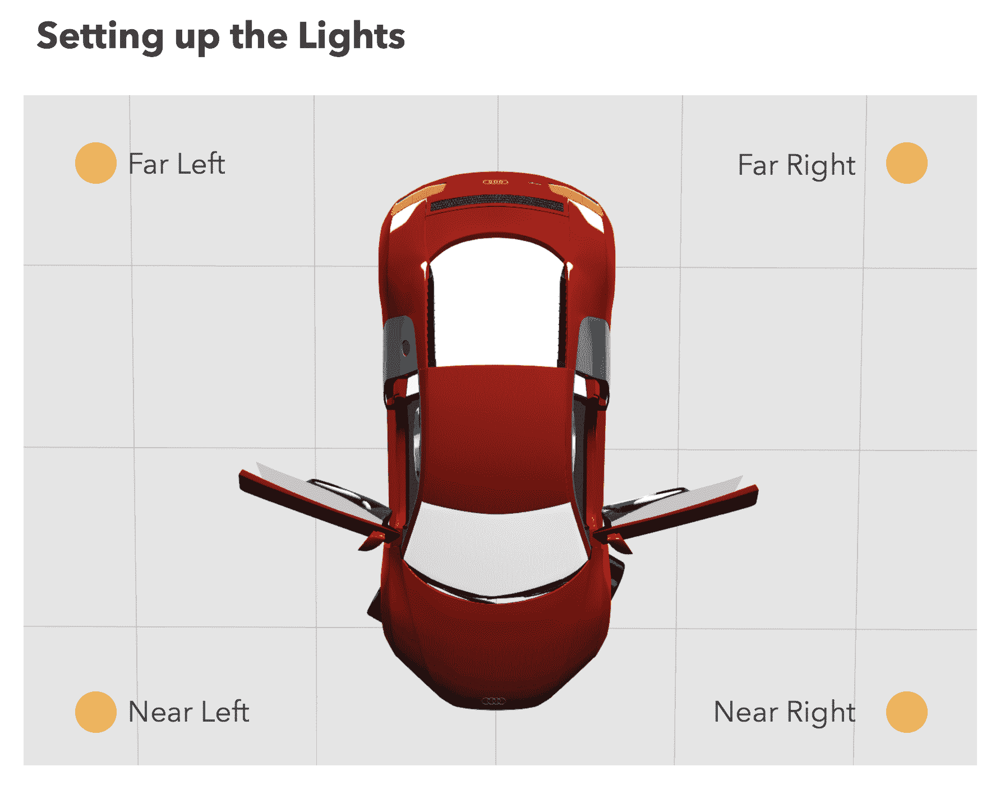
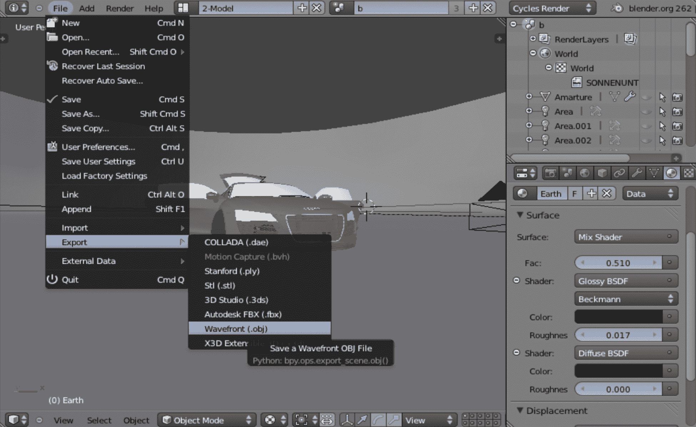
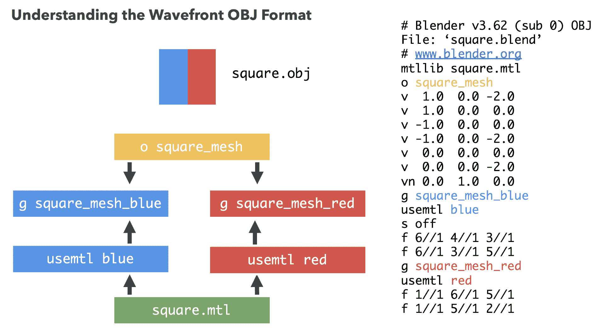
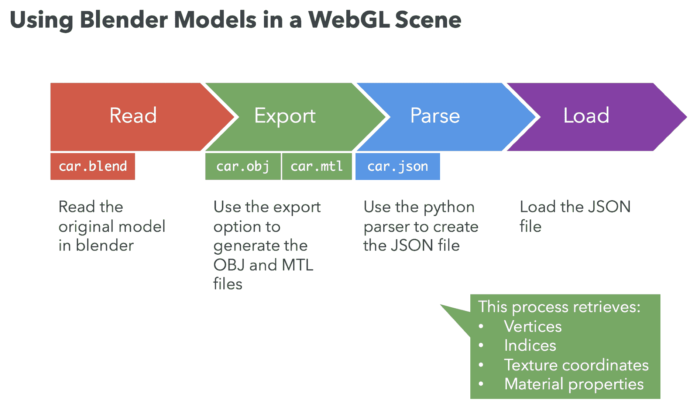
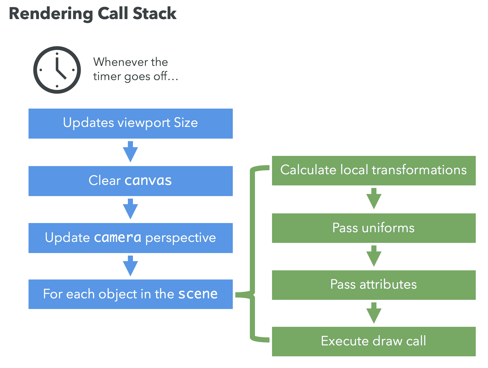
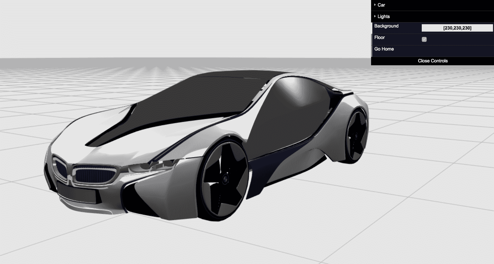
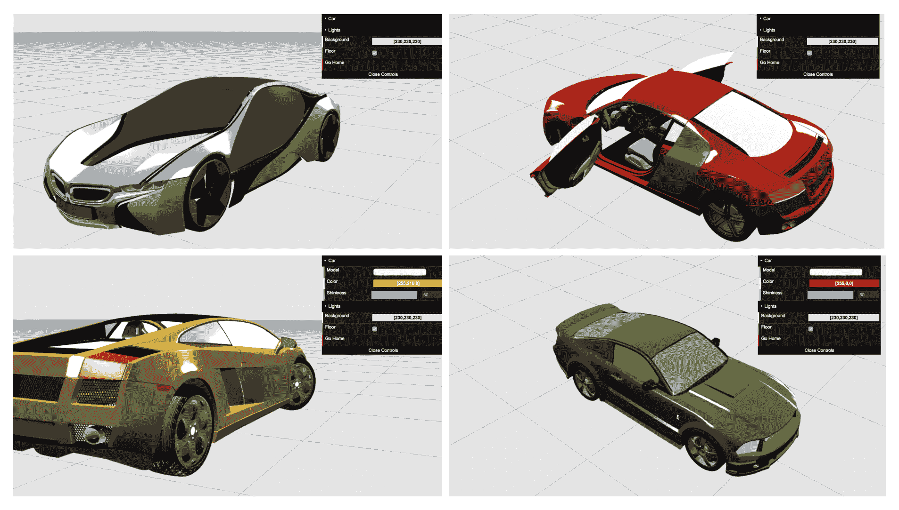

# 第九章：整合所有内容

在上一章中，我们介绍了帧缓冲区、渲染缓冲区以及使用拾取与 3D 应用程序交互所需的步骤。在本章中，我们将结合我们迄今为止所学到的所有概念来构建一个 3D 虚拟汽车展厅。在开发这个演示应用程序的过程中，我们将使用模型、光源、相机、动画、颜色、纹理等。我们还将学习如何将这些元素与一个简单而有效的图形用户界面集成。

在本章中，你将学习以下内容：

+   整合本书中我们开发的所有架构

+   使用我们的架构创建一个 3D 虚拟汽车展厅应用程序

+   将 Blender 中的汽车模型导入 WebGL 场景

+   设置多个光源

+   创建健壮的着色器以处理多种材质

+   了解 OBJ 和 MTL 文件格式

+   编程相机以飞越场景

# 创建 WebGL 应用程序

到目前为止，我们已经涵盖了创建 WebGL 应用程序所需的基本主题。这些主题在我们这本书中通过迭代构建的框架中得到了实现。

在第一章“入门”，我们介绍了 WebGL 以及如何在浏览器中使用它。我们了解到 WebGL 上下文的行为像一个状态机。因此，我们可以使用`gl.getParameter`查询不同的状态变量。

然后，我们研究了 WebGL 场景中的对象是如何由顶点定义的。我们看到了如何使用索引来标记顶点，以便 WebGL 渲染管线可以快速光栅化以渲染对象。我们研究了操作缓冲区的函数以及渲染原语的两个主要函数：`drawArrays`（无索引）和`drawElements`（有索引）。我们还学习了如何使用 JSON 表示几何形状，以及如何从网络服务器下载模型。

接下来，我们研究了如何照亮我们的 3D 场景。我们学习了法线向量、光的反射物理以及实现光照所需的 3D 数学。我们还学习了如何使用 ESSL 中的着色器实现不同的光照模型。

然后，由于 WebGL 没有相机，我们实现了自己的自定义相机。我们研究了相机矩阵，并展示了它实际上是模型-视图矩阵的逆。换句话说，世界空间中的旋转、平移和缩放在相机空间中产生逆操作。

在讨论了相机和矩阵之后，我们介绍了动画的基础知识。我们讨论了动画的有用技术，例如使用`push`和`pop`操作表示局部和全局变换的矩阵栈，并分析了如何建立一个独立于渲染周期的动画周期。我们的动画涵盖了不同类型的插值技术，并通过展示各种动画风格的示例。

然后，我们研究了使用 WebGL 进行颜色表示以及如何在对象、灯光和整个场景中使用颜色。在这个过程中，我们还研究了混合以及创建半透明和透明效果。在颜色和混合之后，我们讨论了纹理，以为我们的场景添加更多细节。然后，我们看到了用户如何通过拾取与我们的 3D 应用程序交互。

在本章中，我们将利用所有这些概念来创建一个令人印象深刻的 3D 应用程序。合乎逻辑的是，我们将使用我们迄今为止开发的所有组件。让我们快速回顾一下。

# 建筑评论

以下组件存在于本书中构建的架构中：

+   `Axis.js`: 代表场景中心的辅助对象，带有视觉辅助工具。

+   `Camera.js`: 包含两种我们开发的相机表示：环绕和跟踪。

+   `Clock.js`: 基于 requestAnimationFrame 的计时器，用于从单一真相源同步我们的整个应用程序。

+   `Controls.js`: 监听 HTML5 `canvas`上的鼠标和键盘事件。它解释这些事件并将它们转换为相机动作。

+   `EventEmitter.js`: 一个简单的类，提供了一种 pub-sub 方法来管理我们应用程序中组件之间的交互。

+   `Floor.js`: 类似于矩形网格的辅助对象，为场景提供地板参考。

+   `Light.js`: 简化了场景中灯光的创建和管理。

+   `Picker.js`: 提供基于颜色的对象拾取。

+   `Program.js`: 组合处理程序、着色器和 JavaScript 值与 ESSL 统一变量之间映射的函数。

+   `Scene.js`: 包含 WebGL 将要渲染的对象列表。

+   `Texture.js`: 用于创建和管理 WebGL 纹理的类。

+   `Transforms.js`: 包含本书中讨论的矩阵，即模型-视图矩阵、相机矩阵、u 投影矩阵和法线矩阵。它通过`push`和`pop`操作实现了矩阵堆栈。

+   `utils.js`: 包含辅助函数，例如`getGLContext`，它有助于为给定的 HTML5 `canvas`创建 WebGL 上下文。

+   应用钩子函数，如下所示：

    +   `init`: 此函数初始化应用程序，并且仅在文档通过`window.onload = init;`加载时调用。

    +   `configure`: 此函数创建和配置依赖项，例如程序、相机、灯光等。

    +   `load`: 此函数通过调用`scene.load`从网络服务器请求对象。我们还可以通过调用`scene.add`添加本地生成的几何形状（例如`Floor`）。

    +   `draw`: 当渲染计时器响起时调用此函数。在这里，我们从`scene`检索对象，并通过确保它们的位置（例如，使用矩阵堆栈应用局部变换）和它们的属性（例如，将相应的统一变量传递给`program`）来适当地渲染它们。

现在，让我们将这些概念结合起来，创建一个 3D 虚拟汽车展厅。

# 行动时间：3D 虚拟汽车展厅

利用我们迄今为止开发的 WebGL 技能和基础设施代码，我们将创建一个可视化不同 3D 汽车模型的程序。最终结果将看起来像这样：



首先，我们将定义我们应用程序的**图形用户界面（GUI**）。然后，我们将通过创建一个`canvas`元素并获取一个 WebGL 上下文来添加 WebGL 支持。在获取有效的 WebGL 上下文后，我们将使用 ESSL 定义和实现顶点和片段着色器。然后，我们将实现三个钩子到我们应用程序生命周期的函数：`configure`、`load`和`draw`。

在我们开始之前，让我们考虑一下我们虚拟展厅应用的一些基本原理。

# 模型的复杂性

实际应用通常比概念验证（Proof of Concept，PoC）演示要复杂得多。这一点在 3D 应用中尤其如此，因为 3D 资产，如模型，比简单的球体、圆锥体和其他原始几何图形要复杂得多。大型 3D 应用中的模型往往具有大量顶点和复杂的配置，以提供用户期望的细节和真实感。除了这些模型的纯几何表示外，它们通常还包含几个纹理。正如预期的那样，使用 JSON 文件手动创建几何形状和纹理是相当令人畏惧的。

幸运的是，我们可以使用各种经过行业验证的 3D 设计软件来创建和将模型导入 WebGL 场景。对于我们的 3D 虚拟汽车展厅，我们将使用用**Blender**创建的模型，这是一个广泛使用的开源 3D 工具。

Blender

Blender 是一个开源的 3D 计算机图形软件，允许你创建动画、游戏和其他交互式应用程序。Blender 提供了众多功能，以便你可以创建复杂模型。你可以查看 Blender 的官方网站获取更多信息：[`www.blender.org`](https://www.blender.org/)。

我们将使用 Blender 将汽车模型导入我们的 WebGL 场景。首先，我们将模型导出为一种称为**OBJ**的中间文件格式，然后解析成可消费的 JSON 文件。我们将在稍后详细介绍这些概念。

# 着色器质量

由于我们将使用复杂的模型，如汽车，我们需要开发能够渲染我们模型不同材质的着色器。这应该相对简单，因为我们开发的着色器已经处理了材质的漫反射、镜面反射和环境反射组件。在 Blender 中，我们将选择在生成 OBJ 文件时导出材质的选项。然后，Blender 将生成一个名为**材质模板库（Material Template Library，MTL**）的第二个文件。为了获得最佳效果，我们的着色器将使用 Phong 着色和 Phong 光照，并支持多个光源。

# 网络延迟和带宽消耗

当涉及到具有大量 3D 资源的 WebGL 应用时，我们通常从网络服务器下载几何形状和纹理。正如预期的那样，这可能会花费一些时间，具体取决于网络连接的质量和需要传输的数据量。然而，有几种策略可以优化这个过程，例如压缩和 3D 资源优化，这些将在后面的章节中介绍。我们将使用 AJAX 在后台下载这些大型资源，为用户提供良好的用户体验。

考虑到这些因素，让我们开始吧。

# 设计我们的 GUI

我们将为我们的应用定义一个非常简单的布局。首先，我们将定义我们的 HTML 文档并包含所有必要的依赖项：

```js
<html>
<head>
  <title>Real-Time 3D Graphics with WebGL 2</title>
  <link rel="shortcut icon" type="image/png" 
   href="/common/images/favicon.png" />

  <!-- libraries -->
 <link rel="stylesheet" href="/common/lib/normalize.css">
 <script type="text/javascript" src="img/dat.gui.js"></script>
 <script type="text/javascript" src="img/gl-matrix.js"></script>

 <!-- modules -->
 <script type="text/javascript" src="img/utils.js"></script>
 <script type="text/javascript" src="img/EventEmitter.js"></script>
 <script type="text/javascript" src="img/Camera.js"></script>
 <script type="text/javascript" src="img/Clock.js"></script>
 <script type="text/javascript" src="img/Controls.js"></script>
 <script type="text/javascript" src="img/Floor.js"></script>
 <script type="text/javascript" src="img/Light.js"></script>
 <script type="text/javascript" src="img/Program.js"></script>
 <script type="text/javascript" src="img/Scene.js"></script>
 <script type="text/javascript" src="img/Texture.js"></script>
 <script type="text/javascript" src="img/Transforms.js"></script>
</head>
<body>
</body>
</html>
```

如您所见，我们已经包含了以下对于我们的应用所必需的库：

+   `normalize.css`：一组使浏览器更一致地渲染所有元素的样式

+   `dat.gui.js`：一个用于在 JavaScript 中更改变量的轻量级图形用户界面

+   `gl-matrix.js`：一个用于高性能应用的 JavaScript 矩阵和向量库

现在我们已经包含了所需的库，我们将包含本书中涵盖的各种组件。

# 添加 canvas 支持

现在我们已经有了我们应用的框架，让我们添加我们 WebGL 应用所需的`canvas`：

```js
<canvas id="webgl-canvas">
 Your browser does not support the HTML5 canvas element.
</canvas>
```

带有`webgl-canvas` ID 的`canvas`元素位于我们的 HTML 文档的`body`之间。

# 添加着色器脚本

接下来，让我们通过以下代码将我们应用所需的两个着色器包含进来：

```js
<script id="vertex-shader" type="x-shader/x-vertex">
  #version 300 es
  precision mediump float;

  void main(void) {}
</script>

<script id="fragment-shader" type="x-shader/x-fragment">
  #version 300 es
  precision mediump float;

  void main(void) {}
</script>
```

这些`scripts`被放置在我们的文档的`head`中。

# 添加 WebGL 支持

现在我们已经有了我们应用的基本模板，让我们初始化我们的 WebGL 应用：

```js
<script type="text/javascript">
  'use strict';

  let gl, program, scene, clock;

  function configure() {
    const canvas = utils.getCanvas('webgl-canvas');
    utils.autoResizeCanvas(canvas);

    gl = utils.getGLContext(canvas);
    gl.clearColor(0.9, 0.9, 0.9, 1);
    gl.clearDepth(1);
    gl.enable(gl.DEPTH_TEST);
    gl.depthFunc(gl.LESS);
    gl.blendFunc(gl.SRC_ALPHA, gl.ONE_MINUS_SRC_ALPHA);

    program = new Program(gl, 'vertex-shader', 'fragment-shader');

    scene = new Scene(gl, program);

    clock = new Clock();
  }

  function draw() {
    gl.viewport(0, 0, gl.canvas.width, gl.canvas.height);
    gl.clear(gl.COLOR_BUFFER_BIT | gl.DEPTH_BUFFER_BIT);
  }

  function init() {
    configure();
    clock.on('tick', draw);
  }

  window.onload = init;
</script>
```

这个`script`标签放在着色器脚本之后，以确保我们可以在需要时引用它们。

让我们详细介绍一下这段代码：

```js
let gl, program, scene, clock;
```

我们需要定义将在整个应用中设置和使用的一些全局变量。就像我们之前的所有练习一样，我们需要定义应用的入口点。我们通过以下代码来完成这项工作：

```js
function init() {
  configure();
  clock.on('tick', draw);
}

window.onload = init;
```

`init`函数在文档通过`window.onload`加载后调用。在`init`函数中，我们通过调用`configure`和使用`clock`实例在每次`tick`（即每次`requestAnimationFrame`调用）上调用`draw`来设置我们的应用。这意味着每次`requestAnimationFrame`调用都会绘制一次。

```js
function configure() {
  const canvas = utils.getCanvas('webgl-canvas');
  utils.autoResizeCanvas(canvas);

  gl = utils.getGLContext(canvas);
  gl.clearColor(0.9, 0.9, 0.9, 1);
  gl.clearDepth(1);
  gl.enable(gl.DEPTH_TEST);
  gl.depthFunc(gl.LESS);
  gl.blendFunc(gl.SRC_ALPHA, gl.ONE_MINUS_SRC_ALPHA);

  program = new Program(gl, 'vertex-shader', 'fragment-shader');

  scene = new Scene(gl, program);

  clock = new Clock();
}
```

我们初始化并设置具有 ID `webgl-canvas` 的 `canvas`。然后，我们将`canvas`实例传递给我们的实用函数，以实现全屏和自动调整大小功能。这个函数很有用，因为它会自动更新`canvas`的大小以适应可用的窗口空间，而不需要硬编码`canvas`的大小。然后，我们使用提供的着色器初始化并设置`gl`、`scene`、`clock`和`program`。最后，我们使用基本配置设置`gl`上下文，例如清除颜色、深度测试和混合函数：

```js
function draw() {
  gl.viewport(0, 0, gl.canvas.width, gl.canvas.height);
  gl.clear(gl.COLOR_BUFFER_BIT | gl.DEPTH_BUFFER_BIT);
}
```

`draw`函数很简单，因为它只是设置视口并清除`canvas`。你可以在本书的`ch09_scaffolding.html`文件中找到此源代码。

现在，如果你在你的浏览器中运行`ch09_scaffolding.html`，你会看到`canvas`根据浏览器的大小进行缩放，如下所示：



# 实现着色器

使用我们的着色器，我们将实现**冯·卡门着色**和**冯·卡门反射**模型。记住，冯·卡门着色插值顶点法线并为每个片段创建一个法线——处理发生在片段着色器中。冯·卡门反射模型描述了光照为对象与光源的漫反射、反射和镜面反射的加和。

为了与材质模板库（MTL）格式保持一致，我们将遵循一些典型约定来设置指向材质属性的统一名称：

| **材质** **统一** | **描述** |
| --- | --- |
| `uKa` | 环境属性。 |
| `uKd` | 漫反射属性。 |
| `uKs` | 镜面属性。 |
| `uNi` | 光学密度。我们不会使用此功能，但你将在 MTL 文件中看到它。 |
| `uNs` | 镜面指数。高指数会导致紧密、集中的高光。`Ns`值通常在`0`到`1000`之间。 |
| `uD` | 透明度（alpha 通道）。 |

| `uIllum` | 确定渲染对象的照明模型。与之前章节中所有对象使用一个模型不同，我们让对象描述它们的反射属性。

根据 MTL 文件格式规范，**illum**可以是以下任何一种：

+   颜色开启和环境关闭。

+   颜色开启和环境开启。

+   高亮开启。

+   反射开启和光线追踪开启。

+   透明度：玻璃开启，反射：光线追踪开启。

+   反射：菲涅耳开启和光线追踪开启。

+   透明度：折射开启，反射：菲涅耳关闭和光线追踪开启。

+   透明度：折射开启，反射：菲涅耳开启和光线追踪开启。

+   反射开启和光线追踪关闭。

+   透明度：玻璃开启，反射：光线追踪关闭。

+   在不可见表面上投射阴影。

|

**Wavefront .obj**文件**

关于 OBJ 和 MTL 文件规范的更多信息，请参阅以下链接：[`en.wikipedia.org/wiki/Wavefront_.obj_file`](https://en.wikipedia.org/wiki/Wavefront_.obj_file)。

我们的着色器将通过使用前面章节中描述的统一数组来支持多个光源。光源的数量由顶点和片段着色器中的常量定义：

```js
const int numLights = 4;
```

我们将使用以下统一数组来处理光源：

| **灯光** **统一数组** | **描述** |
| --- | --- |
| `uLa[numLights]` | 环境属性。 |
| `uLd[numLights]` | 漫反射属性。 |
| `uLs[numLights]` | 镜面属性。 |

**源代码**

如果你希望探索本章着色器的源代码，可以参考`ch09_02_showroom.html`。

这里是顶点着色器：

```js
<script id="vertex-shader" type="x-shader/x-vertex">
  #version 300 es
  precision mediump float;

  const int numLights = 4;

  uniform mat4 uModelViewMatrix;
  uniform mat4 uProjectionMatrix;
  uniform mat4 uNormalMatrix;
  uniform vec3 uLightPosition[numLights];

  in vec3 aVertexPosition;
  in vec3 aVertexNormal;

  out vec3 vNormal;
  out vec3 vLightRay[numLights];
  out vec3 vEye[numLights];

  void main(void) {
    vec4 vertex = uModelViewMatrix * vec4(aVertexPosition, 1.0);
    vec4 lightPosition = vec4(0.0);

    for(int i= 0; i < numLights; i++) {
      lightPosition = vec4(uLightPosition[i], 1.0);
      vLightRay[i] = vertex.xyz - lightPosition.xyz;
      vEye[i] = -vec3(vertex.xyz);
    }

    vNormal = vec3(uNormalMatrix * vec4(aVertexNormal, 1.0));
    gl_Position = uProjectionMatrix * uModelViewMatrix * vec4(aVertexPosition, 1.0);
  }
</script>
```

伴随相应的片段着色器：

```js
<script id="fragment-shader" type="x-shader/x-fragment">
  #version 300 es
  precision mediump float;

  const int numLights = 4;

  uniform vec3 uLd[numLights];
  uniform vec3 uLs[numLights];
  uniform vec3 uLightPosition[numLights];
  uniform vec3 uKa;
  uniform vec3 uKd;
  uniform vec3 uKs;
  uniform float uNs;
  uniform float uD;
  uniform int uIllum;
  uniform bool uWireframe;

  in vec3 vNormal;
  in vec3 vLightRay[numLights];
  in vec3 vEye[numLights];

  out vec4 fragColor;

  void main(void) {
    if (uWireframe || uIllum == 0) {
      fragColor = vec4(uKd, uD);
      return;
    }

    vec3 color = vec3(0.0);
    vec3 light = vec3(0.0);
    vec3 eye = vec3(0.0);
    vec3 reflection = vec3(0.0);
    vec3 normal = normalize(vNormal);

    if (uIllum == 1) {
      for (int i = 0; i < numLights; i++) {
        light = normalize(vLightRay[i]);
        normal = normalize(vNormal);
        color += (uLd[i] * uKd * clamp(dot(normal, -light), 0.0, 1.0));
      }
    }

    if (uIllum == 2) {
      for (int i = 0; i < numLights; i++) {
        eye = normalize(vEye[i]);
        light = normalize(vLightRay[i]);
        reflection = reflect(light, normal);
        color += (uLd[i] * uKd * clamp(dot(normal, -light), 0.0, 1.0));
        color += (uLs[i] * uKs * pow(max(dot(reflection, eye), 0.0), uNs) * 
         4.0);
      }
    }

    fragColor =  vec4(color, uD);
  }
</script>
```

如预期的那样，顶点和片段着色器借鉴了本书中早期章节中的概念，除了`uIllum`。如前所述，`illum`属性决定了正在渲染的对象的照明模型。我们可以默认使用一个更简单的片段着色器（例如`uIllum == 2`），但为了教育目的提供了一个简单示例。

接下来，我们将配置三个主要函数，这些函数钩入我们的 WebGL 应用程序的生命周期。这些是`configure`、`load`和`render`函数。

# 设置场景

我们可以通过定义应用程序的一些全局变量并为`configure`函数编写代码来设置场景。让我们逐行分析：

```js
let gl, program, scene, clock, camera, transforms, lights,
  floor, selectedCar, lightPositions, carModelData,
  clearColor = [0.9, 0.9, 0.9, 1];

function configure() {
 // ...
}
```

在这个阶段，我们想要设置一些 WebGL 属性，例如清除颜色和深度测试。然后，我们需要创建一个相机并设置其初始位置和方向。我们还需要创建一个相机控制实例，以便在场景交互期间更新相机的位置。最后，我们需要定义将映射到着色器的 JavaScript 变量。

为了完成这些任务，我们将使用我们的架构中的`Camera.js`、`Controls.js`、`Program.js`和`Transforms.js`。

# 配置 WebGL 属性

我们需要初始化和配置我们的`canvas`和`gl`实例：

```js
function configure() {
  canvas = utils.getCanvas('webgl-canvas');
  utils.autoResizeCanvas(canvas);
  gl = utils.getGLContext(canvas);

  // ...
}
```

然后，我们需要初始化`scene`、`clock`和`program`：

```js
clock = new Clock();
program = new Program(gl, 'vertex-shader', 'fragment-shader');
scene = new Scene(gl, program); 
```

这些核心组件被全局定义，这样我们就可以在整个应用程序中引用它们。

最后，我们需要设置背景颜色和深度测试属性，如下所示：

```js
gl.clearColor(...clearColor);
gl.clearDepth(1);
gl.enable(gl.DEPTH_TEST);
gl.depthFunc(gl.LESS);
gl.blendFunc(gl.SRC_ALPHA, gl.ONE_MINUS_SRC_ALPHA);
```

# 设置相机

为了保持简单，`camera`变量将是全局的，这样我们就可以从 GUI 控件中访问它：

```js
camera = new Camera(Camera.ORBITING_TYPE);
```

# 创建相机控制

我们需要实例化一个`Controls`实例，该实例将鼠标手势绑定到`camera`动作。第一个参数是我们控制的`camera`，第二个参数是我们`canvas`的引用：

```js
new Controls(camera, canvas);

```

# 场景变换

一旦我们有了`camera`，我们就可以使用它来创建一个新的`Tranforms`实例，如下所示：

```js
transforms = new Transforms(gl, program, camera, canvas);
```

`transforms`变量也被声明为全局变量，这样我们就可以在`draw`函数中使用它来检索当前的矩阵变换并将它们传递给着色器。

# 创建光源

我们将使用我们的框架中的`Light`类创建四个光源，配置如下：



首先，我们实例化一个`LightsManager`实例来管理我们的光源：

```js
lights = new LightsManager();
```

然后，我们为每个光源创建四个光位置，并对每个位置进行迭代，以唯一地定位每个光源：

```js
lightPositions = {
  farLeft: [-1000, 1000, -1000],
  farRight: [1000, 1000, -1000],
  nearLeft: [-1000, 1000, 1000],
  nearRight: [1000, 1000, 1000]
};

Object.keys(lightPositions).forEach(key => {
  const light = new Light(key);
  light.setPosition(lightPositions[key]);
  light.setDiffuse([0.4, 0.4, 0.4]);
  light.setSpecular([0.8, 0.8, 0.8]);
  lights.add(light)
});
```

由于每个光源都具有相同的漫反射、环境光和镜面反射属性，我们只需使用`lightPositions`数据设置动态位置。

# 映射程序属性和统一变量

接下来，在`configure`函数内部，我们将 JavaScript 值映射到着色器内的属性和统一变量。

使用之前提到的`program`实例，我们将设置映射属性和统一变量到着色器的值。代码如下所示：

```js
const attributes = [
  'aVertexPosition',
  'aVertexNormal',
  'aVertexColor'
];

const uniforms = [
  'uProjectionMatrix',
  'uModelViewMatrix',
  'uNormalMatrix',
  'uLightPosition',
  'uWireframe',
  'uLd',
  'uLs',
  'uKa',
  'uKd',
  'uKs',
  'uNs',
  'uD',
  'uIllum'
];

program.load(attributes, uniforms);
```

在创建着色器时，请确保着色器属性和统一变量正确映射到 JavaScript 值。这一映射步骤使我们能够轻松地引用属性和统一变量。查看`Program.js`中的`setAttributeLocations`和`setUniformLocations`方法，这些方法由`program.load`调用。

# 统一初始化

在映射变量之后，我们可以初始化着色器统一变量，例如灯光：

```js
gl.uniform3fv(program.uLightPosition, lights.getArray('position'));
gl.uniform3fv(program.uLd, lights.getArray('diffuse'));
gl.uniform3fv(program.uLs, lights.getArray('specular'));
```

默认材质属性如下：

```js
gl.uniform3fv(program.uKa, [1, 1, 1]);
gl.uniform3fv(program.uKd, [1, 1, 1]);
gl.uniform3fv(program.uKs, [1, 1, 1]);
gl.uniform1f(program.uNs, 1);
```

最后，我们将创建一个`floor`实例，稍后我们将使用它。我们还将构建描述稍后要加载的汽车模型的数据库：

```js
floor = new Floor(200, 2);

carModelData = {
  'BMW i8': {
    paintAlias: 'BMW',
    partsCount: 25,
    path: '/common/models/bmw-i8/part'
  }
};
```

虽然我们在这里只描述了一个汽车模型，但我们将利用这种数据格式，以便我们可以在本章的后面添加其他汽车模型。

这是最终的`configure`函数，您可以在`ch09_02_showroom.html`源代码中找到：

```js
function configure() {
  const canvas = utils.getCanvas('webgl-canvas');
  utils.autoResizeCanvas(canvas);

  gl = utils.getGLContext(canvas);
  gl.clearColor(...clearColor);
  gl.clearDepth(1);
  gl.enable(gl.DEPTH_TEST);
  gl.depthFunc(gl.LESS);
  gl.blendFunc(gl.SRC_ALPHA, gl.ONE_MINUS_SRC_ALPHA);

  program = new Program(gl, 'vertex-shader', 'fragment-shader');

  const attributes = [
    'aVertexPosition',
    'aVertexNormal',
    'aVertexColor'
  ];

  const uniforms = [
    'uProjectionMatrix',
    'uModelViewMatrix',
    'uNormalMatrix',
    'uLightPosition',
    'uWireframe',
    'uLd',
    'uLs',
    'uKa',
    'uKd',
    'uKs',
    'uNs',
    'uD',
    'uIllum'
  ];

  program.load(attributes, uniforms);

  scene = new Scene(gl, program);
  clock = new Clock();

  camera = new Camera(Camera.ORBITING_TYPE);
  new Controls(camera, canvas);

  transforms = new Transforms(gl, program, camera, canvas);

  lights = new LightsManager();

  lightPositions = {
    farLeft: [-1000, 1000, -1000],
    farRight: [1000, 1000, -1000],
    nearLeft: [-1000, 1000, 1000],
    nearRight: [1000, 1000, 1000]
  };

  Object.keys(lightPositions).forEach(key => {
    const light = new Light(key);
    light.setPosition(lightPositions[key]);
    light.setDiffuse([0.4, 0.4, 0.4]);
    light.setSpecular([0.8, 0.8, 0.8]);
    lights.add(light)
  });

  gl.uniform3fv(program.uLightPosition, lights.getArray('position'));
  gl.uniform3fv(program.uLd, lights.getArray('diffuse'));
  gl.uniform3fv(program.uLs, lights.getArray('specular'));

  gl.uniform3fv(program.uKa, [1, 1, 1]);
  gl.uniform3fv(program.uKd, [1, 1, 1]);
  gl.uniform3fv(program.uKs, [1, 1, 1]);
  gl.uniform1f(program.uNs, 1);

  floor = new Floor(200, 2);

  carModelData = {
    'BMW i8': {
      paintAlias: 'BMW',
      partsCount: 25,
      path: '/common/models/bmw-i8/part'
    }
  };
}
```

我们已经完成了场景的设置。接下来，我们将实现`load`函数。

# 加载汽车

在`load`函数内部，我们将下载一些背景资产，以便我们可以将它们加载到我们的应用程序中。

当描述汽车的 JSON 文件可用时，我们只需使用`scene`实例来加载这些文件。请注意，通常不会有现成的 JSON 文件。在这种情况下，有专门的设计工具，如 Blender，它可以显著帮助创建和转换可消费的模型。

话虽如此，我们将使用在[blendswap.org.](http://www.blendswap.org/)上可用的预构建模型。所有这些模型都是公开可用的，并且免费使用和分发。在我们能够使用这些模型之前，我们需要将它们导出为中间文件格式，从而我们可以从中提取几何形状和材质属性以创建适当的 JSON 文件。我们将使用的文件格式是**Wavefront OBJ**。

# 导出 Blender 模型

本练习的所有资产都包含在这本书的源代码中。但是，如果您想通过转换模型的步骤，以下是步骤。对于这个练习，我们将使用 Blender（v2.6）。

**Blender** 如果您没有 Blender，您可以从[`www.blender.org/download/`](https://www.blender.org/download/)下载适用于您的操作系统版本。

一旦将汽车模型导入到 Blender 中，您需要将其导出为 OBJ 文件。为此，请转到**文件**|**导出**|**Wavefront (.obj)**，如下面的截图所示：



在**导出 OBJ**面板中，确保以下选项处于激活状态：

+   **应用修改器**：这将写入场景中由数学运算产生的顶点，而不是直接建模。如果您不检查此选项，模型可能在 WebGL 场景中看起来不完整。

+   **写入材质**：Blender 将创建匹配的材质模板库（MTL）文件。我们将在下一节中详细介绍这一点。

+   **三角化面**：Blender 将写入索引作为三角形。这对于 WebGL 渲染是理想的。

+   **实体作为 OBJ 对象**：此配置将识别 Blender 场景中的每个对象为 OBJ 文件中的对象。

+   **材质组**：如果 Blender 场景中的对象有多个材质，例如，一个可以由铝和橡胶制成的汽车轮胎，那么该对象将被细分为组，每个组对应 OBJ 文件中的一个材质。

OBJ 文件。然后，点击导出。一旦检查了这些导出参数，请选择目录和文件名：

# 理解 OBJ 格式

OBJ 文件中有几种类型的定义。让我们通过一个简单的示例逐行介绍它们。我们将剖析一个名为`square.obj`的样本文件，我们将从名为`square.blend`的 Blender 文件中导出它。此文件表示一个分成两部分的正方形，一部分涂成红色，另一部分涂成蓝色，如图所示：



当我们将 Blender 模型导出为 OBJ 格式时，生成的文件通常以注释开始：

```js
# Blender v2.62 (sub 0) OBJ
File: 'squares.blend'
# www.blender.org
```

这些是注释，并且它们在行首用哈希`#`符号表示。

接下来，我们通常会找到一行引用此 OBJ 文件使用的材质模板库。此行将以关键字`mtllib`开头，后面跟材质文件的名称：

```js
mtllib square.mtl
```

在 OBJ 文件中，几何体可以通过几种方式组合成实体。我们可以找到以前缀`o`开头的行，后面跟对象名称，或者以前缀`g`开头的行，后面跟组名称：

```js
o squares_mesh
```

在对象声明之后，接下来的行将引用顶点`v`，可选地引用顶点法线`vn`和纹理坐标`vt`。需要注意的是，在 OBJ 格式中，对象中的所有组共享顶点。也就是说，在定义组时，不会找到引用顶点的行，因为假设在定义对象时已经定义了所有顶点数据：

```js
v  1.0  0.0 -2.0
v  1.0  0.0  0.0
v -1.0  0.0  0.0
v -1.0  0.0 -2.0
v  0.0  0.0  0.0
v  0.0  0.0 -2.0
vn 0.0  1.0  0.0
```

在我们的例子中，我们指示 Blender 导出组材质。这意味着具有不同材质属性集的对象的每个部分都将作为组出现在 OBJ 文件中。在这个例子中，我们定义了一个具有两个组（`squares_mesh_blue`和`squares_mesh_red`）和两个相应的材质（蓝色和红色）的对象：

```js
g squares_mesh_blue
```

如果使用了材质，则在组声明之后的行将是该组使用的材质。在这种情况下，只需要材质的名称。假设该材质的属性定义在 OBJ 文件开头声明的 MTL 文件中：

```js
usemtl blue
```

以前缀`s`开头的行指的是多边形上的平滑着色。虽然在这里提到了，但在解析 OBJ 文件到 JSON 文件时，我们不会使用这个定义：

```js
s off
```

以`f`开头的行指的是面。有不同方式来表示面。让我们看看它们。

# 顶点

```js
f i1 i2 i3...
```

在这个配置中，每个面元素对应一个顶点索引。根据每个面的索引数，你可能会有三角形、矩形或多边形面。然而，我们已经指示 Blender 使用三角形面来创建 OBJ 文件。否则，我们需要在调用`drawElements`之前将多边形分解成三角形。

# 顶点/纹理坐标

```js
f i1/t1 i2/t2 i3/t3...
```

在这种组合中，每个顶点索引似乎都跟着一个正斜杠和纹理坐标索引。通常在用`vt`在对象级别定义纹理坐标时，你会找到这种组合。

# 顶点/纹理坐标/法线

```js
f i1/t1/n1 i2/t2/n2 i3/t3/n3...
```

这里是一个正常的索引，它已被添加为配置中的第三个元素。如果纹理坐标和顶点法线都在对象级别定义，你很可能会在组级别看到这种配置。

# 顶点//法线

也可能存在法线已定义但纹理坐标未定义的情况。在这种情况下，面配置的第二部分缺失：

```js
f i1//n1 i2//n2 i3//n3...
```

对于`square.obj`来说，它看起来是这样的：

```js
f 6//1 4//1 3//1
f 6//1 3//1 5//1
```

注意，面是通过索引定义的。在我们的例子中，我们定义了一个分成两部分的正方形。在这里，我们可以看到所有顶点共享相同的法线，该法线已用索引`1`标识。

文件中剩余的行代表红色组：

```js
g squares_mesh_red
usemtl red
f 1//1 6//1 5//1
f 1//1 5//1 2//1
```

正如我们之前提到的，属于同一对象的组共享索引。

# 解析 OBJ 文件

在将我们的汽车导出为 OBJ 格式后，下一步是将 OBJ 文件解析成我们可以加载到场景中的 JSON 文件。我们已经在`common/models/obj-parser.py`中包含了为此步骤开发的解析器。这个解析器有以下特点：

+   它是用 Python 编写的（对于 OBJ 解析器来说相当常见），可以通过以下格式在命令行中调用：

```js
obj-parser.py arg1 arg2
```

+   其中`arg1`是解析的 OBJ 文件名，`arg2`是 MTL 文件名。两种情况下都需要文件扩展名。例如：

```js
obj-parser.py square.obj square.mtl
```

+   它为每个 OBJ 组创建一个 JSON 文件。

+   它会在（如果已定义）材质模板库中搜索每个组的材质属性，并将它们添加到相应的 JSON 文件中。

+   它将为每个组计算适当的索引。请记住，OBJ 组共享索引。由于我们为每个组创建一个独立的 WebGL 对象，每个对象都需要从`0`开始的索引。解析器会为你处理这一点。

**Python**

如果你系统上没有安装 Python，你可以从[`www.python.org/`](http://www.python.org/)或[ https://anaconda.org/anaconda/python](https://anaconda.org/anaconda/python)获取。

以下图表总结了从 Blender 场景创建 JSON 文件所需的程序：



# 将汽车加载到我们的 WebGL 场景中

现在我们已经将汽车存储为 JSON 文件，它们就可以在我们的 WebGL 场景中使用。首先，我们必须让用户选择要可视化的汽车。也就是说，默认加载一辆汽车仍然是一个好主意。为此，我们将在`load`函数内部编写以下代码：

```js
function goHome() {
  camera.goHome([0, 0.5, 10]);
  camera.setFocus([0, 0, 0]);
  camera.setAzimuth(25);
  camera.setElevation(-11);
}

function load() {
  goHome();
  loadCar('BMW i8');
}
```

我们调用辅助函数`goHome`，将`camera`位置设置为我们场景中的特定点。这是因为我们稍后将其用作重置`camera`位置的方式。然后，我们调用`loadCar`，这是我们提供要加载的汽车的`key`（例如，`BMW i8`）的地方，我们从`configure`中定义的`carModelData`中提供。让我们看看`loadCar`的样子：

```js
function loadCar(model) {
  scene.objects = [];
  scene.add(floor);
  const { path, partsCount } = carModelData[model];
  scene.loadByParts(path, partsCount);
  selectedCar = model;
}
```

此函数清除我们`scene`中的所有对象，添加已经创建的`floor`实例，并从`carModelData`对象中提取必要的数据，例如模型的`path`和要加载的部分数量。

# 渲染

让我们退一步，评估整体情况。我们之前提到，在我们的架构中，我们定义了三个主要函数，这些函数定义了我们的 WebGL 应用程序的生命周期。这些函数是`configure`、`load`和`draw`。

到目前为止，我们已经通过编写`configure`函数的代码来设置场景。之后，我们创建了我们的 JSON 汽车并通过编写`load`函数的代码来加载它们。现在，我们将实现第三个函数：`draw`函数。

代码相当标准，几乎与我们在前几章中编写的`draw`函数完全相同。以下代码演示了，我们设置了将要绘制的区域，并清除该区域。然后，我们检查摄像机的视角并处理`scene`中的每个对象。

一个重要的考虑因素是我们需要确保我们正确地将 JSON 对象中定义的材料属性映射到适当的着色器 uniform。

让我们开始实现`draw`函数：

```js
function draw() {
  gl.viewport(0, 0, gl.canvas.width, gl.canvas.height);
  gl.clear(gl.COLOR_BUFFER_BIT | gl.DEPTH_BUFFER_BIT);
  transforms.updatePerspective();

  // ...
}
```

首先，我们设置我们的视口并清除场景，然后通过使用我们在`configure`中初始化的`transforms`实例应用透视更新。

然后，我们转向场景中的对象：

```js
try {
  scene.traverse(object => {
    if (!object.visible) return;

    transforms.calculateModelView();
    transforms.push();
    transforms.setMatrixUniforms();
    transforms.pop();

    gl.uniform3fv(program.uKa, object.Ka);
    gl.uniform3fv(program.uKd, object.Kd);
    gl.uniform3fv(program.uKs, object.Ks);
    gl.uniform1f(program.uNs, object.Ns);
    gl.uniform1f(program.uD, object.d);
    gl.uniform1i(program.uIllum, object.illum);

    // Bind
    gl.bindVertexArray(object.vao);
    gl.bindBuffer(gl.ELEMENT_ARRAY_BUFFER, object.ibo);

    if (object.wireframe) {
      gl.uniform1i(program.uWireframe, 1);
      gl.drawElements(gl.LINES, object.indices.length, gl.UNSIGNED_SHORT, 
       0);
    }
    else {
      gl.uniform1i(program.uWireframe, 0);
      gl.drawElements(gl.TRIANGLES, object.indices.length, 
       gl.UNSIGNED_SHORT, 0);
    }

    // Clean
    gl.bindVertexArray(null);
    gl.bindBuffer(gl.ARRAY_BUFFER, null);
    gl.bindBuffer(gl.ELEMENT_ARRAY_BUFFER, null);
  });
}
catch (error) {
  console.error(error);
}
```

查看之前章节中定义的 uniforms 列表可能会有所帮助。我们需要确保所有的着色器 uniform 都与对象属性配对。

以下图表显示了`draw`函数内部发生的流程：



每个汽车部件都是一个不同的 JSON 文件。`draw` 函数遍历 `scene` 内的所有这些部件。对于每个部件，材质属性作为 uniform 传递给着色器，几何形状作为属性（从相应的 VBO 中读取数据）传递。最后，执行绘制调用（`drawElements`）。结果看起来像这样：



这是可以在 `ch09_02_showroom.html` 中找到的最终 JavaScript 源代码：

```js
<html>
<head>
  <title>Real-Time 3D Graphics with WebGL2</title>
  <link rel="shortcut icon" type="image/png" 
   href="/common/images/favicon.png" />

  <!-- libraries -->
  <link rel="stylesheet" href="/common/lib/normalize.css">
  <script type="text/javascript" src="img/dat.gui.js"></script>
  <script type="text/javascript" src="img/gl-matrix.js"></script>

  <!-- modules -->
  <script type="text/javascript" src="img/utils.js"></script>
  <script type="text/javascript" src="img/EventEmitter.js"></script>
  <script type="text/javascript" src="img/Camera.js"></script>
  <script type="text/javascript" src="img/Clock.js"></script>
  <script type="text/javascript" src="img/Controls.js"></script>
  <script type="text/javascript" src="img/Floor.js"></script>
  <script type="text/javascript" src="img/Light.js"></script>
  <script type="text/javascript" src="img/Program.js"></script>
  <script type="text/javascript" src="img/Scene.js"></script>
  <script type="text/javascript" src="img/Texture.js"></script>
  <script type="text/javascript" src="img/Transforms.js"></script>

```

以下代码是用于顶点着色器的：

```js
  <script id="vertex-shader" type="x-shader/x-vertex">
    #version 300 es
    precision mediump float;

    const int numLights = 4;

    uniform mat4 uModelViewMatrix;
    uniform mat4 uProjectionMatrix;
    uniform mat4 uNormalMatrix;
    uniform vec3 uLightPosition[numLights];

    in vec3 aVertexPosition;
    in vec3 aVertexNormal;

    out vec3 vNormal;
    out vec3 vLightRay[numLights];
    out vec3 vEye[numLights];

    void main(void) {
      vec4 vertex = uModelViewMatrix * vec4(aVertexPosition, 1.0);
      vec4 lightPosition = vec4(0.0);

      for(int i= 0; i < numLights; i++) {
        lightPosition = vec4(uLightPosition[i], 1.0);
        vLightRay[i] = vertex.xyz - lightPosition.xyz;
        vEye[i] = -vec3(vertex.xyz);
      }

      vNormal = vec3(uNormalMatrix * vec4(aVertexNormal, 1.0));
      gl_Position = uProjectionMatrix * uModelViewMatrix * 
       vec4(aVertexPosition, 1.0);
    }
  </script>
```

以下代码是用于片段着色器的：

```js
  <script id="fragment-shader" type="x-shader/x-fragment">
    #version 300 es
    precision mediump float;

    const int numLights = 4;

    uniform vec3 uLd[numLights];
    uniform vec3 uLs[numLights];
    uniform vec3 uLightPosition[numLights];
    uniform vec3 uKa;
    uniform vec3 uKd;
    uniform vec3 uKs;
    uniform float uNs;
    uniform float uD;
    uniform int uIllum;
    uniform bool uWireframe;

    in vec3 vNormal;
    in vec3 vLightRay[numLights];
    in vec3 vEye[numLights];

    out vec4 fragColor;

    void main(void) {
      if (uWireframe || uIllum == 0) {
        fragColor = vec4(uKd, uD);
        return;
      }

      vec3 color = vec3(0.0);
      vec3 light = vec3(0.0);
      vec3 eye = vec3(0.0);
      vec3 reflection = vec3(0.0);
      vec3 normal = normalize(vNormal);

      if (uIllum == 1) {
        for (int i = 0; i < numLights; i++) {
          light = normalize(vLightRay[i]);
          normal = normalize(vNormal);
          color += (uLd[i] * uKd * clamp(dot(normal, -light), 0.0, 1.0));
        }
      }

      if (uIllum == 2) {
        for (int i = 0; i < numLights; i++) {
          eye = normalize(vEye[i]);
          light = normalize(vLightRay[i]);
          reflection = reflect(light, normal);
          color += (uLd[i] * uKd * clamp(dot(normal, -light), 0.0, 1.0));
          color += (uLs[i] * uKs * pow(max(dot(reflection, eye), 0.0), uNs) 
           * 4.0);
        }
      }

      fragColor =  vec4(color, uD);
    }
  </script>

```

以下是带有适当全局变量定义的应用程序代码：

```js
  <script type="text/javascript">
    'use strict';

    let gl, program, scene, clock, camera, transforms, lights,
      floor, selectedCar, lightPositions, carModelData,
      clearColor = [0.9, 0.9, 0.9, 1];

```

以下是为配置步骤：

```js

    function configure() {
      const canvas = utils.getCanvas('webgl-canvas');
      utils.autoResizeCanvas(canvas);

      gl = utils.getGLContext(canvas);
      gl.clearColor(...clearColor);
      gl.clearDepth(1);
      gl.enable(gl.DEPTH_TEST);
      gl.depthFunc(gl.LESS);
      gl.blendFunc(gl.SRC_ALPHA, gl.ONE_MINUS_SRC_ALPHA);

      program = new Program(gl, 'vertex-shader', 'fragment-shader');

      const attributes = [
        'aVertexPosition',
        'aVertexNormal',
        'aVertexColor'
      ];

      const uniforms = [
        'uProjectionMatrix',
        'uModelViewMatrix',
        'uNormalMatrix',
        'uLightPosition',
        'uWireframe',
        'uLd',
        'uLs',
        'uKa',
        'uKd',
        'uKs',
        'uNs',
        'uD',
        'uIllum'
      ];

      program.load(attributes, uniforms);

      scene = new Scene(gl, program);
      clock = new Clock();

      camera = new Camera(Camera.ORBITING_TYPE);
      new Controls(camera, canvas);

      transforms = new Transforms(gl, program, camera, canvas);

      lights = new LightsManager();

      lightPositions = {
        farLeft: [-1000, 1000, -1000],
        farRight: [1000, 1000, -1000],
        nearLeft: [-1000, 1000, 1000],
        nearRight: [1000, 1000, 1000]
      };

      Object.keys(lightPositions).forEach(key => {
        const light = new Light(key);
        light.setPosition(lightPositions[key]);
        light.setDiffuse([0.4, 0.4, 0.4]);
        light.setSpecular([0.8, 0.8, 0.8]);
        lights.add(light)
      });

      gl.uniform3fv(program.uLightPosition, lights.getArray('position'));
      gl.uniform3fv(program.uLd, lights.getArray('diffuse'));
      gl.uniform3fv(program.uLs, lights.getArray('specular'));

      gl.uniform3fv(program.uKa, [1, 1, 1]);
      gl.uniform3fv(program.uKd, [1, 1, 1]);
      gl.uniform3fv(program.uKs, [1, 1, 1]);
      gl.uniform1f(program.uNs, 1);

      floor = new Floor(200, 2);

      carModelData = {
        'BMW i8': {
          paintAlias: 'BMW',
          partsCount: 25,
          path: '/common/models/bmw-i8/part'
        }
      };
    }

    function goHome() {
      camera.goHome([0, 0.5, 5]);
      camera.setFocus([0, 0, 0]);
      camera.setAzimuth(25);
      camera.setElevation(-10);
    }
```

以下代码用于加载所需的资源：

```js
    function loadCar(model) {
      scene.objects = [];
      scene.add(floor);
      const { path, partsCount } = carModelData[model];
      scene.loadByParts(path, partsCount);
      selectedCar = model;
    }

    function load() {
      goHome();
      loadCar('BMW i8');
    }
```

以下代码说明了我们绘制场景的位置：

```js
    function draw() {
      gl.viewport(0, 0, gl.canvas.width, gl.canvas.height);
      gl.clear(gl.COLOR_BUFFER_BIT | gl.DEPTH_BUFFER_BIT);
      transforms.updatePerspective();

      try {
        scene.traverse(object => {
          if (!object.visible) return;

          transforms.calculateModelView();
          transforms.push();
          transforms.setMatrixUniforms();
          transforms.pop();

          gl.uniform3fv(program.uKa, object.Ka);
          gl.uniform3fv(program.uKd, object.Kd);
          gl.uniform3fv(program.uKs, object.Ks);
          gl.uniform1f(program.uNs, object.Ns);
          gl.uniform1f(program.uD, object.d);
          gl.uniform1i(program.uIllum, object.illum);

          // Bind
          gl.bindVertexArray(object.vao);
          gl.bindBuffer(gl.ELEMENT_ARRAY_BUFFER, object.ibo);

          if (object.wireframe) {
            gl.uniform1i(program.uWireframe, 1);
            gl.drawElements(gl.LINES, object.indices.length, 
             gl.UNSIGNED_SHORT, 0);
          }
          else {
            gl.uniform1i(program.uWireframe, 0);
            gl.drawElements(gl.TRIANGLES, object.indices.length, 
             gl.UNSIGNED_SHORT, 0);
          }

          // Clean
          gl.bindVertexArray(null);
          gl.bindBuffer(gl.ARRAY_BUFFER, null);
          gl.bindBuffer(gl.ELEMENT_ARRAY_BUFFER, null);
        });
      }
      catch (error) {
        console.error(error);
      }
    }
```

文档加载后，我们使用以下代码初始化应用程序：

```js
    function init() {
      configure();
      load();
      clock.on('tick', draw);
    }

    window.onload = init;

  </script>
</head>

<body>

  <canvas id="webgl-canvas">
    Your browser does not support the HTML5 canvas element.
  </canvas>

</body>
</html>
```

***发生了什么？***

我们已经介绍了一个演示，它使用了本书中讨论的许多元素。我们使用了之前章节中开发的代码基础设施，并实现了三个主要功能：`configure`、`load` 和 `draw`。正如我们所见，这些函数定义了我们的应用程序的生命周期。

# 试试看：交互式控件

让我们利用 **dat.GUI** 为我们的应用程序添加更多交互性和定制功能。请尝试添加以下功能：

1.  创建一个下拉菜单，以便您可以从 `common/models/` 目录中提供的以下汽车模型中选择：`bmw-i8`、`audi-r8`、`ford-mustang` 和 `lamborghini-gallardo`。

**提示** 您可以利用 `carModelData` 声明性地描述汽车模型，并使用已创建的 `loadCar` 函数以及适当的信息。

1.  创建一个颜色选择器来改变加载的汽车的颜色。

**提示** 通过检查汽车数据文件，您将找到各种指示器，这些指示器表示哪些部件是车身面板。这些在 `carModelData` 中描述为 `paintAlias`，可以用来改变场景中每个单独项目的 `Kd` 属性。

1.  创建一个滑块来改变所选汽车的亮度。

**提示** 您可以再次使用 `paintAlias` 并更新场景中每个单独项目的 `Ks` 属性。

以下功能已在 `ch09_03_showroom-controls.html` 中实现，包括每个单独的灯光、背景颜色、地板可见性等控件：

`utils.configureControls`

`utils.configureControls` 方法是在 dat.GUI 接口之上简单抽象的一个方法，用于减少重复并提供描述我们的控件小部件的更声明性方式。您可以直接使用 dat.GUI 或在此基础上构建这个简单的辅助函数。

# 奖励

你做到了！这有多么酷？！作为奖励，我们在`ch10`目录下的源代码中为你提供了一些额外的示例。这些奖励示例以虚拟汽车展厅为基础，展示了更多高级功能，供你在未来构建引人入胜的 3D 体验时使用。享受吧！

# 摘要

让我们总结一下本章所学的内容：

+   我们回顾了本书中开发的概念、架构和代码。

+   我们构建了一个 3D 虚拟汽车展厅应用，展示了所有这些元素是如何结合在一起的。

+   我们了解到设计复杂模型需要专门的工具，例如 Blender。

+   我们介绍了大多数当前 3D 图形格式都需要定义顶点、索引、法线和纹理坐标。

+   我们学习了如何从 Blender 模型中获取所需元素，并将它们解析成我们可以加载到 WebGL 场景中的 JSON 文件。

+   我们学习了如何添加控件小部件以提供定制功能。

在下一章中，我们将提前了解一些在 3D 计算机图形系统中常用的高级技术，包括游戏、模拟和其他 3D 应用。在讨论了这些主题之后，我们还将学习如何在 WebGL 中实现它们。
