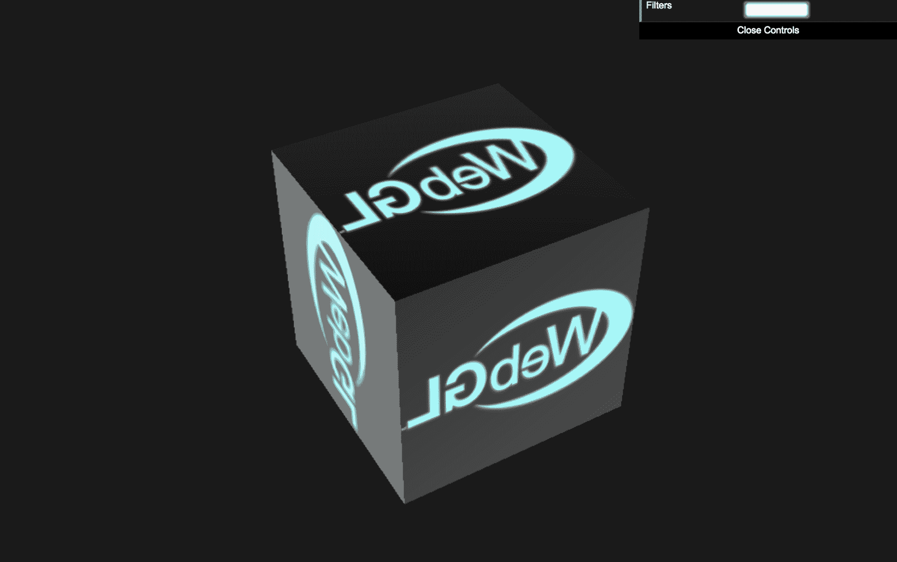
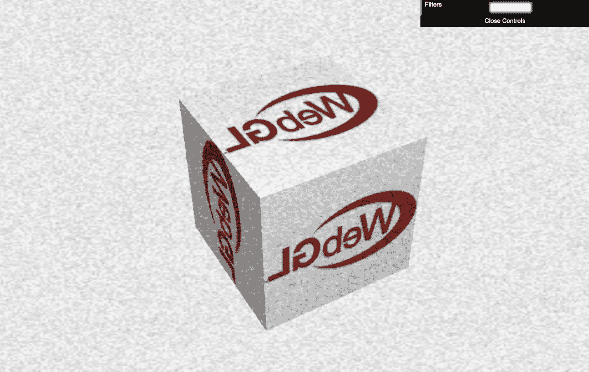
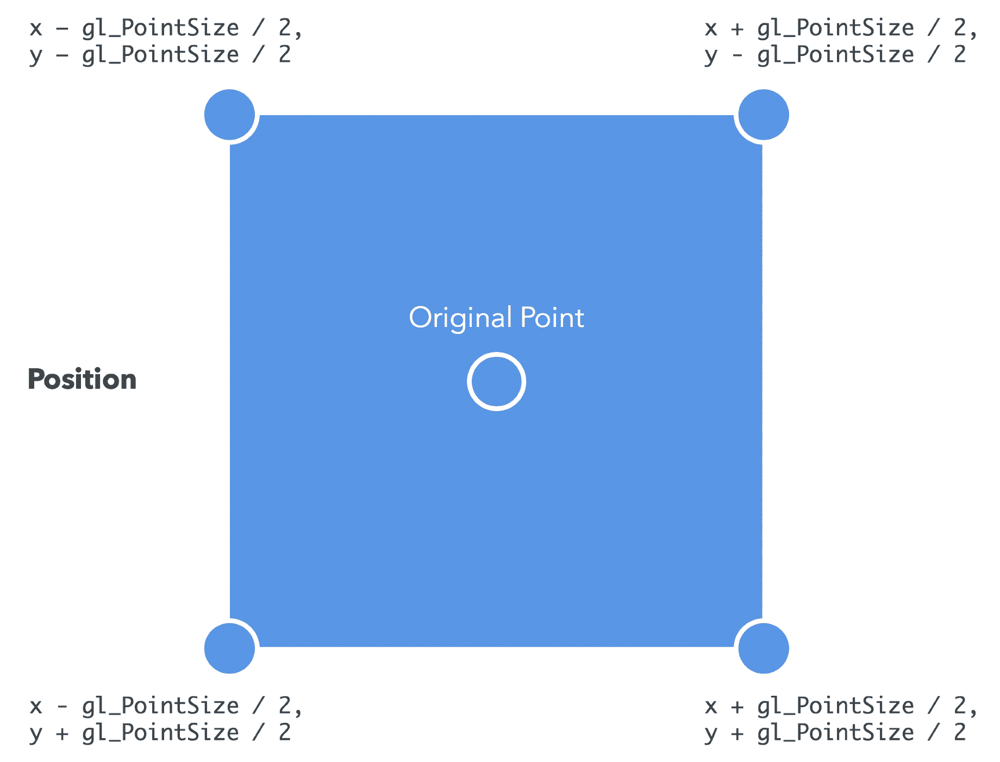
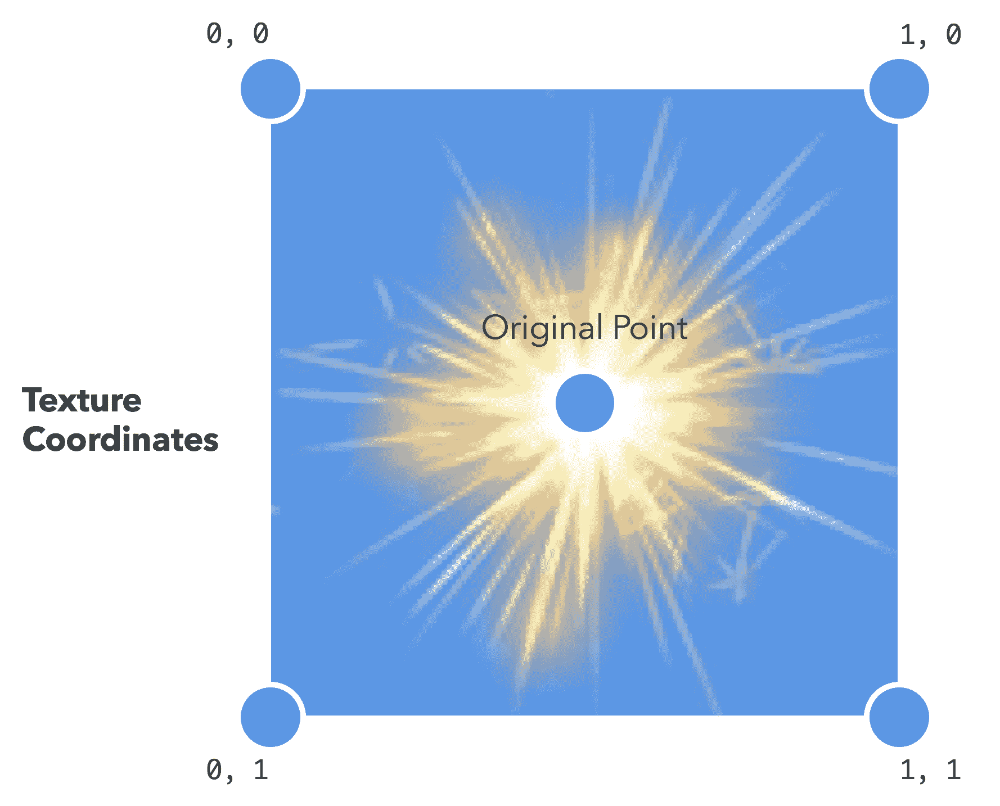
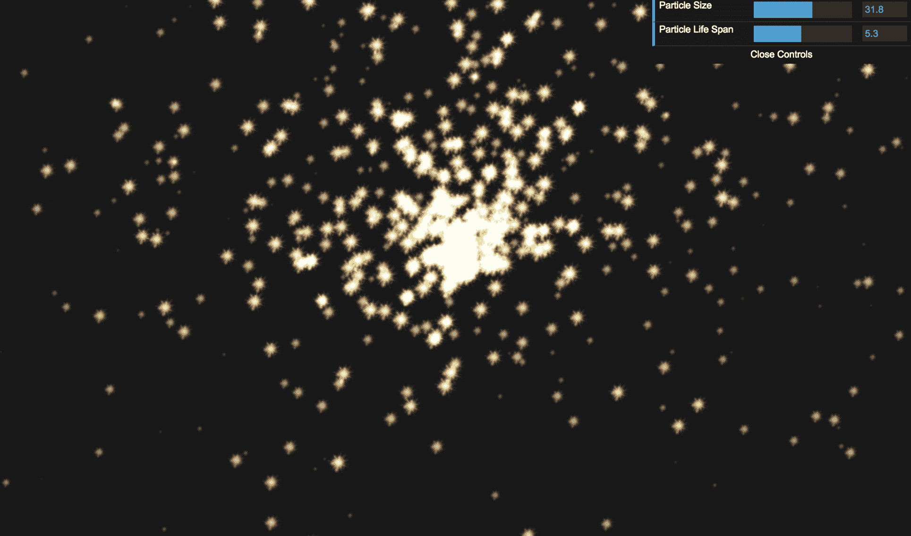
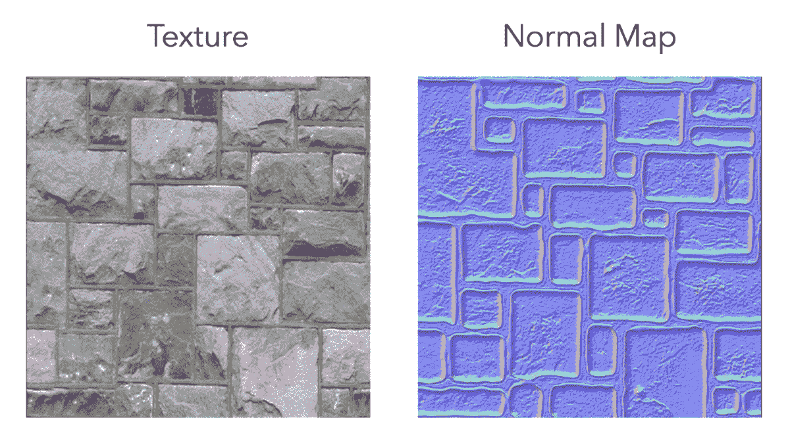
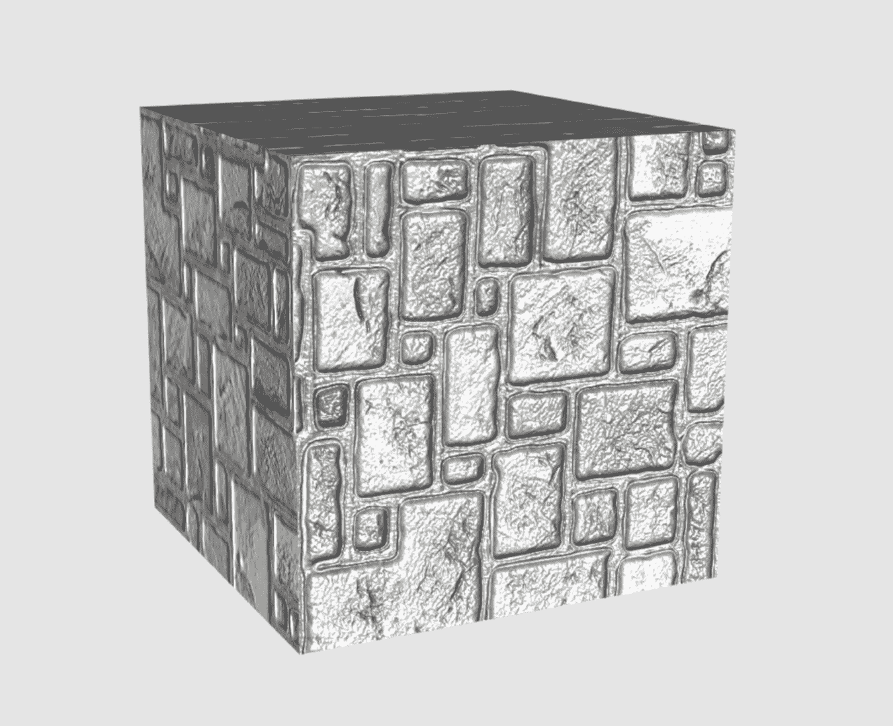
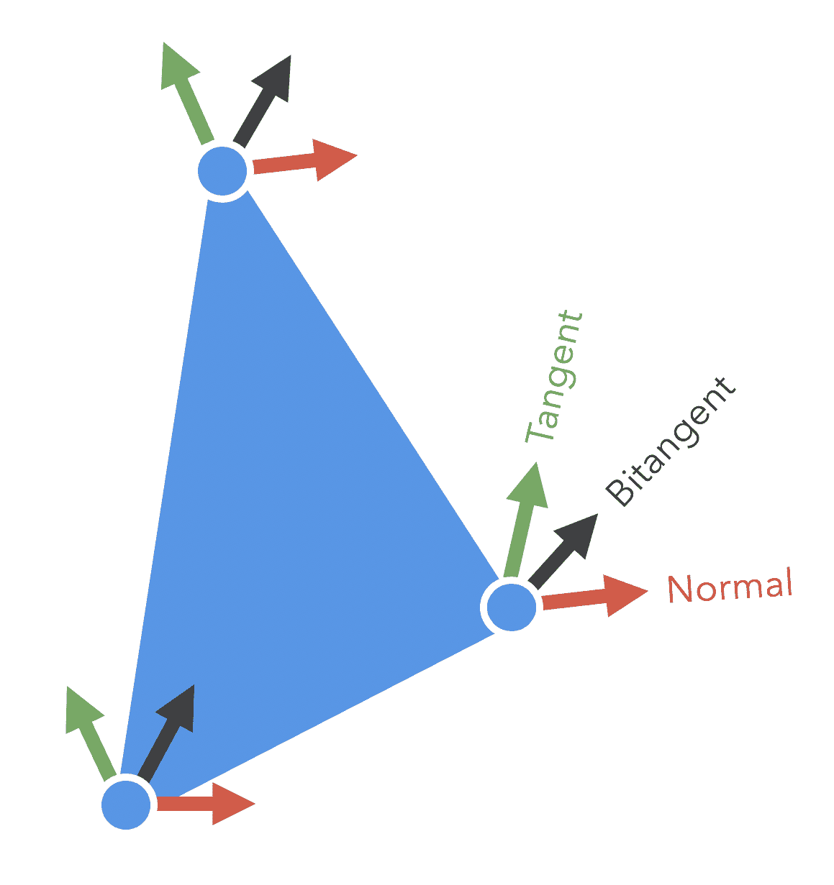
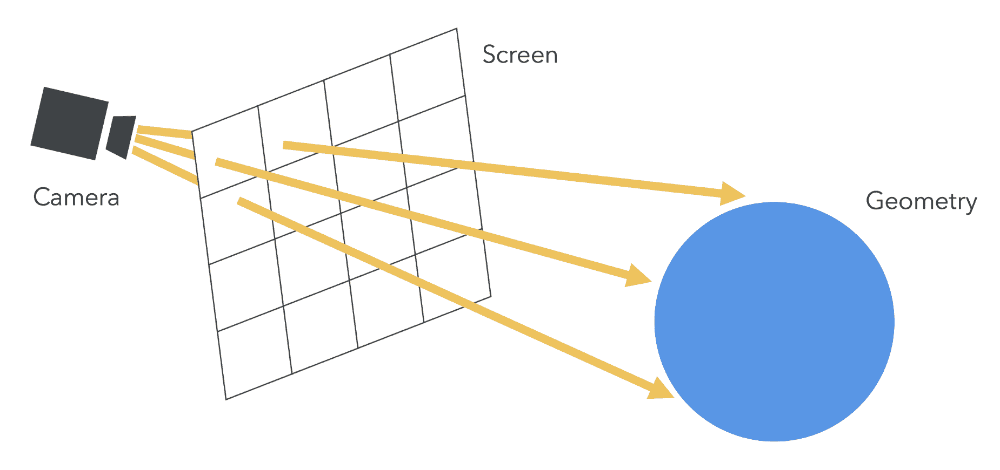

# 高级技术

在本书的前几章中，我们介绍了许多计算机图形学的基础概念，这些概念最终为我们提供了构建 3D 虚拟汽车展台所需的知识和技能。这意味着，到目前为止，你已经拥有了创建丰富的 3D 应用程序所需的全部信息，使用 WebGL。然而，我们只是刚刚触及了 WebGL 的表面！创意地使用着色器、纹理和顶点属性可以产生惊人的效果。在这些最后的章节中，我们将介绍一些高级的 WebGL 概念，这些概念应该会激发你进一步探索的欲望。

在本章中，我们将涵盖以下内容：

+   学习各种后处理效果

+   使用点精灵实现粒子系统

+   理解如何使用正常贴图

+   实现如何使用光线追踪

# 后处理

**后处理**是通过使用一个改变最终图像的着色器重新渲染场景图像的过程。你可以将其想象成对场景进行截图（理想情况下每秒`60+`帧），然后在你的首选图像编辑器中打开它，并应用各种过滤器。当然，区别在于我们可以在实时中这样做！

一些简单的后处理效果示例包括以下：

+   灰度效果

+   褐色调

+   反转颜色

+   胶片颗粒效果

+   模糊效果

+   波浪/眩晕效果

创建这些效果的基本技术相对简单：创建一个与`canvas`尺寸相同的帧缓冲区，并在`draw`循环开始时将整个场景渲染到该缓冲区。然后，使用构成帧缓冲区颜色附件的纹理将一个四边形渲染到默认帧缓冲区。在四边形渲染过程中使用的着色器包含了后处理效果。该着色器可以将渲染场景的颜色值转换为四边形，以产生所需的视觉效果。

让我们更详细地研究这个过程的各个步骤。

# 创建帧缓冲区

我们将用于创建帧缓冲区的代码几乎与我们在第八章，“拾取”中创建的相同。然而，有一些关键的区别值得注意：

```js
const { width, height } = canvas;

// 1\. Init Color Texture
const texture = gl.createTexture();
gl.bindTexture(gl.TEXTURE_2D, texture);
gl.texParameteri(gl.TEXTURE_2D, gl.TEXTURE_MAG_FILTER, gl.NEAREST);
gl.texParameteri(gl.TEXTURE_2D, gl.TEXTURE_MIN_FILTER, gl.NEAREST);
gl.texParameteri(gl.TEXTURE_2D, gl.TEXTURE_WRAP_S, gl.CLAMP_TO_EDGE);
gl.texParameteri(gl.TEXTURE_2D, gl.TEXTURE_WRAP_T, gl.CLAMP_TO_EDGE);
gl.texImage2D(gl.TEXTURE_2D, 0, gl.RGBA, width, height, 0, gl.RGBA, gl.UNSIGNED_BYTE, null);

// 2\. Init Renderbuffer
const renderbuffer = gl.createRenderbuffer();
gl.bindRenderbuffer(gl.RENDERBUFFER, renderbuffer);
gl.renderbufferStorage(gl.RENDERBUFFER, gl.DEPTH_COMPONENT16, width, height);

// 3\. Init Framebuffer
const framebuffer = gl.createFramebuffer();
gl.bindFramebuffer(gl.FRAMEBUFFER, framebuffer);
gl.framebufferTexture2D(gl.FRAMEBUFFER, gl.COLOR_ATTACHMENT0, gl.TEXTURE_2D, texture, 0);
gl.framebufferRenderbuffer(gl.FRAMEBUFFER, gl.DEPTH_ATTACHMENT, gl.RENDERBUFFER, renderbuffer);

// 4\. Clean up
gl.bindTexture(gl.TEXTURE_2D, null);
gl.bindRenderbuffer(gl.RENDERBUFFER, null);
gl.bindFramebuffer(gl.FRAMEBUFFER, null);
```

我们使用`canvas`的`width`和`height`来确定我们的缓冲区大小，而不是使用用于拾取器的任意值。因为拾取器缓冲区的内容不是用于屏幕渲染，所以我们不必过多担心分辨率。然而，对于后处理缓冲区，如果输出与`canvas`的尺寸匹配，我们将获得最佳结果。

由于纹理将与`canvas`的大小完全相同，并且由于我们将其渲染为全屏四边形，我们创造了一个情况，即纹理将在屏幕上以`1:1`的比例显示。这意味着不需要应用任何过滤器，并且我们可以使用`NEAREST`过滤器而不会出现视觉伪影。此外，在需要扭曲纹理坐标的后处理情况下（例如波浪效果），我们会从使用`LINEAR`过滤器中受益。我们还需要使用`CLAMP_TO_EDGE`的包裹模式。话虽如此，代码几乎与用于帧缓冲区创建的`Picker`相同。

# 创建几何形状

虽然我们可以从文件中加载四边形，但几何形状足够简单，我们可以直接将其包含在代码中。所需的所有内容只是顶点位置和纹理坐标：

```js
// 1\. Define the geometry for the full-screen quad
const vertices = [
  -1, -1,
   1, -1,
  -1,  1,

  -1,  1,
   1, -1,
   1,  1
];

const textureCoords = [
  0, 0,
  1, 0,
  0, 1,

  0, 1,
  1, 0,
  1, 1
];

// 2\. Create and bind VAO
const vao = gl.createVertexArray();
gl.bindVertexArray(vao);

// 3\. Init the buffers
const vertexBuffer = gl.createBuffer();
gl.bindBuffer(gl.ARRAY_BUFFER, vertexBuffer);
gl.bufferData(gl.ARRAY_BUFFER, new Float32Array(vertices), 
// Configure instructions for VAO
gl.STATIC_DRAW);gl.enableVertexAttribArray(program.aVertexPosition);
gl.vertexAttribPointer(program.aVertexPosition, 3, gl.FLOAT, false, 0, 0);

const textureBuffer = gl.createBuffer();
gl.bindBuffer(gl.ARRAY_BUFFER, textureBuffer);
gl.bufferData(gl.ARRAY_BUFFER, new Float32Array(textureCoords), gl.STATIC_DRAW);
// Configure instructions for VAO
gl.enableVertexAttribArray(program.aVertexTextureCoords);
gl.vertexAttribPointer(program.aVertexTextureCoords, 2, gl.FLOAT, false, 0, 0);

// 4\. Clean up
gl.bindVertexArray(null);
gl.bindBuffer(gl.ARRAY_BUFFER, null);
```

# 设置着色器

后处理绘制的顶点着色器相当简单：

```js
#version 300 es
precision mediump float;

in vec2 aVertexPosition;
in vec2 aVertexTextureCoords;

out vec2 vTextureCoords;

void main(void) {
  vTextureCoords = aVertexTextureCoords;
  gl_Position = vec4(aVertexPosition, 0.0, 1.0);
}
```

注意，与迄今为止我们使用的其他顶点着色器不同，这个着色器没有使用任何矩阵。这是因为我们在上一步中声明的顶点已经**预变换**。

回想一下第四章中提到的，我们通过将顶点位置乘以投影矩阵来检索归一化设备坐标。在这里，坐标将所有位置映射到每个轴上的`[-1, 1]`范围，这代表了整个视口。然而，在这种情况下，我们的顶点位置已经映射到`[-1, 1]`范围；因此，不需要变换，因为当渲染时，它们将完美映射到视口边界。

片段着色器是大多数有趣操作发生的地方。每个后处理效果都会有不同的片段着色器。让我们以一个简单的**灰度效果**为例：

```js
#version 300 es
precision mediump float;

uniform sampler2D uSampler;

in vec2 vTextureCoords;

out vec4 fragColor;

void main(void) {
  vec4 frameColor = texture(uSampler, vTextureCoords);
  float luminance = frameColor.r * 0.3 + frameColor.g * 0.59 + frameColor.b 
   * 0.11;
  fragColor = vec4(luminance, luminance, luminance, frameColor.a);
}
```

在前面的代码中，我们采样场景渲染的原色（通过`uSampler`可用）并输出一个加权平均的红、绿、蓝通道的颜色。结果是原始场景的简单灰度版本：


# 建筑更新

我们添加了一个新的类，`PostProcess`，以帮助进行后处理效果。此代码位于`common/js/PostProcess.js`文件中。此类将创建适当的帧缓冲区和四边形几何形状，编译后处理着色器，并设置绘制场景到四边形的渲染。

让我们通过一个示例来看看这个组件是如何工作的！

# 行动时间：后处理效果

让我们看看一些后处理效果的实际应用：

1.  在您的浏览器中打开`ch10_01_post-process.html`文件，如下所示：


1.  控制下拉菜单允许您在不同的采样效果之间切换。尝试它们以了解它们对场景的影响。我们已经看到了灰度效果，所以让我们单独检查其余的过滤器。

1.  **反转效果**，类似于灰度效果，它只修改颜色输出，反转每个颜色通道：

```js
#version 300 es
precision mediump float;

uniform sampler2D uSampler;

in vec2 vTextureCoords;

out vec4 fragColor;

void main(void) {
  vec4 frameColor = texture(uSampler, vTextureCoords);
  fragColor = vec4(vec3(1.0) - frameColor.rgb, frameColor.a);
}
```



1.  **波浪效果**操纵纹理坐标，使场景旋转和摇摆。在这个效果中，我们还提供了当前时间，以便随着时间的变化，扭曲也会改变：

```js
#version 300 es
precision mediump float;

const float speed = 15.0;
const float magnitude = 0.015;

uniform sampler2D uSampler;
uniform float uTime;

in vec2 vTextureCoords;

out vec4 fragColor;

void main(void) {
  vec2 wavyCoord;
  wavyCoord.s = vTextureCoords.s + sin(uTime + vTextureCoords.t * 
   speed) * magnitude;
  wavyCoord.t = vTextureCoords.t + cos(uTime + vTextureCoords.s * 
   speed) * magnitude;
  fragColor = texture(uSampler, wavyCoord);
}
```


1.  **模糊效果**在当前像素周围采样几个像素，并使用加权混合来产生一个片段输出，该输出是其邻居的平均值。这给场景带来了一种模糊感。一个新的统一变量`uInverseTextureSize`提供了视口宽度和高度的倒数。我们使用这些值来准确地在纹理中定位单个像素。例如，`vTextureCoords.x + 2 * uInverseTextureSize.x`将正好在原始纹理坐标的左侧 2 个像素处：

```js
#version 300 es
precision mediump float;

uniform sampler2D uSampler;
uniform vec2 uInverseTextureSize;

in vec2 vTextureCoords;

out vec4 fragColor;

vec4 offsetLookup(float xOff, float yOff) {
  return texture(
    uSampler, 
    vec2(
      vTextureCoords.x + xOff * uInverseTextureSize.x, 
      vTextureCoords.y + yOff * uInverseTextureSize.y
    )
  );
}

void main(void) {
  vec4 frameColor = offsetLookup(-4.0, 0.0) * 0.05;
  frameColor += offsetLookup(-3.0, 0.0) * 0.09;
  frameColor += offsetLookup(-2.0, 0.0) * 0.12;
  frameColor += offsetLookup(-1.0, 0.0) * 0.15;
  frameColor += offsetLookup(0.0, 0.0) * 0.16;
  frameColor += offsetLookup(1.0, 0.0) * 0.15;
  frameColor += offsetLookup(2.0, 0.0) * 0.12;
  frameColor += offsetLookup(3.0, 0.0) * 0.09;
  frameColor += offsetLookup(4.0, 0.0) * 0.05;
  fragColor = frameColor;
}
```


1.  我们的最后一个例子是**胶片颗粒效果**。这个效果使用噪点纹理来创建颗粒场景，模拟使用老式相机的效果。这个例子很重要，因为它展示了在渲染时除了帧缓冲区外还使用了第二个纹理：

```js
#version 300 es
precision mediump float;

const float grainIntensity = 0.1;
const float scrollSpeed = 4000.0;

uniform sampler2D uSampler;
uniform sampler2D uNoiseSampler;
uniform vec2 uInverseTextureSize;
uniform float uTime;

in vec2 vTextureCoords;

out vec4 fragColor;

void main(void) {
  vec4 frameColor = texture(uSampler, vTextureCoords);
  vec4 grain = texture(
    uNoiseSampler,
    vTextureCoords * 2.0 + uTime * scrollSpeed * 
     uInverseTextureSize
  );
  fragColor = frameColor - (grain * grainIntensity);
}
```



***刚才发生了什么？***

所有这些效果都是通过在输出到屏幕之前操纵渲染的图像来实现的。由于这些效果处理的几何量很小，因此它们是高效的，无论场景的复杂程度如何。然而，随着`canvas`的大小或后处理着色器的复杂性的增加，性能可能会受到影响。

# 尝试一下：趣味屋镜面效果

要创建一个在视口中心附近拉伸图像并在边缘挤压的效果，需要什么？

# 点精灵

**粒子效果**是许多 3D 应用程序和游戏中常用的技术。粒子效果是对通过渲染粒子群（以点、纹理四边形或重复的几何形状显示）创建的任何特殊效果的通称，通常在单个粒子上作用一些简单的物理模拟。它们可以用来模拟烟雾、火焰、子弹、爆炸、水、火花以及许多其他难以用单个几何模型表示的效果。

渲染粒子的一种非常有效的方法是使用**点精灵**。在这本书中，我们一直在渲染三角形原语，但如果你使用`POINTS`原语类型渲染顶点，那么每个顶点将作为屏幕上的单个像素渲染。点精灵是`POINTS`原语渲染的扩展，其中每个点都提供了一个大小并在着色器中进行纹理化。

通过在顶点着色器中设置`gl_PointSize`值来创建点精灵。它可以设置为常量值或从着色器输入计算出的值。如果设置为大于一的数字，点将以一个始终面向屏幕的四边形渲染（也称为**广告牌**）。四边形以原始点为中心，其宽度和高度等于以像素为单位的`gl_PointSize`：



当点精灵渲染时，它还会为四边形生成纹理坐标，覆盖从左上角到右下角的简单`0-1`范围：



纹理坐标可以通过内置的`vec2 gl_PointCoord`在片段着色器中访问。结合这些属性，我们得到一个简单的点精灵顶点着色器，看起来像这样：

```js
#version 300 es
precision mediump float;

uniform mat4 uModelViewMatrix;
uniform mat4 uProjectionMatrix;
uniform float uPointSize;

in vec4 aParticle;

out float vLifespan;

void main(void) {
  gl_Position = uProjectionMatrix * uModelViewMatrix * vec4(aParticle.xyz, 
   1.0);
  vLifespan = aParticle.w;
  gl_PointSize = uPointSize * vLifespan;
}
```

相应的片段着色器看起来像这样：

```js
#version 300 es
precision mediump float;

uniform sampler2D uSampler;

in float vLifespan;

out vec4 fragColor;

void main(void) {
  vec4 texColor = texture(uSampler, gl_PointCoord);
  fragColor = vec4(texColor.rgb, texColor.a * vLifespan);
}
```

以下是一个适当的绘制命令的示例：

```js
gl.drawArrays(gl.POINTS, 0, vertexCount);
```

这将顶点缓冲区中的每个点渲染为`16x16`纹理。

# 行动时间：火花喷泉

让我们看看如何使用点精灵创建一个火花喷泉：

1.  在您的浏览器中打开`ch10_02_point-sprites.html`文件：



1.  此示例展示了使用点精灵的简单**火花喷泉**效果。您可以通过使用滑块调整粒子的尺寸和寿命。

1.  粒子模拟是通过维护一个由位置、速度和寿命组成的粒子列表来完成的。在每一帧中，我们遍历列表并根据速度移动粒子；我们还应用重力并减少剩余寿命。一旦粒子的寿命达到`0`，它就会重置到原点，并带有随机速度和更新的寿命。

1.  在粒子的模拟迭代中，粒子位置和寿命被复制到一个数组中，然后用于更新顶点缓冲区。这个顶点缓冲区就是用于在屏幕上生成精灵的渲染内容。

1.  让我们实验一下控制模拟的其他一些值，看看它们如何影响场景。在您的编辑器中打开`ch10_02_point-sprites.html`。

1.  首先，在`configure`函数的底部定位到对`configureParticles`的调用。作为参数传递的数字，最初设置为`1024`，决定了创建多少个粒子。尝试将其更改为一个较低或较高的值，以查看它对粒子系统的影响。但请注意，极端高的值（例如，数百万）可能会导致性能问题。

1.  接下来，找到`resetParticle`函数。每当创建或重置粒子时都会调用此函数。这里有几个值可以显著影响场景的渲染方式：

```js
function resetParticle(particle) {
  particle.position = [0, 0, 0];

  particle.velocity = [
    Math.random() * 20 - 10,
    Math.random() * 20,
    Math.random() * 20 - 10,
  ];

  particle.lifespan = Math.random() * particleLifespan;
  particle.remainingLife = particle.lifespan;
}
```

1.  `particle.position`是粒子的`x`、`y`、`z`起始坐标。最初，所有点都从世界原点`(0, 0, 0)`开始，但这也可能被设置为任何值。通常希望粒子从另一个物体的位置开始，以产生物体产生粒子的印象。你也可以随机化位置，使粒子看起来在给定区域内。

1.  `particle.velocity`是粒子的初始速度。在这里，你可以看到它已经被随机化，这样粒子在远离原点时就会分散开来。随机方向移动的粒子看起来更像爆炸或喷雾，而那些朝同一方向移动的粒子则给人一种稳定流的感觉。在这种情况下，`y`值被设计为始终为正，而`x`和`z`值可以是正也可以是负。尝试增加或减少这些速度值或从其中一个分量中移除随机元素，看看会发生什么。

1.  最后，`particle.lifespan`决定了粒子在重置之前显示的时间长度。这使用控制器的值同时进行随机化，以提供视觉多样性。如果你从粒子寿命中移除随机元素，所有粒子将同时到期并重置，导致类似烟花般的*爆发*粒子。

1.  接下来，找到`updateParticles`函数。这个函数每帧调用一次，用于更新所有粒子的位置和速度，在将新值推送到顶点缓冲区之前。值得注意的是，在操纵模拟行为方面，重力是在函数中途应用的：

```js
function updateParticles(elapsed) {
  // Loop through all the particles in the array
  particles.forEach((particle, i) => {
    // Track the particles lifespan
    particle.remainingLife -= elapsed;

    if (particle.remainingLife <= 0) {
      // Once the particle expires, reset it to the origin with a 
      // new velocity
      resetParticle(particle);
    }

    // Update the particle position
    particle.position[0] += particle.velocity[0] * elapsed;
    particle.position[1] += particle.velocity[1] * elapsed;
    particle.position[2] += particle.velocity[2] * elapsed;

    // Apply gravity to the velocity
    particle.velocity[1] -= 9.8 * elapsed;

    if (particle.position[1] < 0) {
      // Allow particles to bounce off the floor
      particle.velocity[1] *= -0.75;
      particle.position[1] = 0;
    }

    // Update the corresponding values in the array
    const index = i * 4;
    particleArray[index] = particle.position[0];
    particleArray[index + 1] = particle.position[1];
    particleArray[index + 2] = particle.position[2];
    particleArray[index + 3] = particle.remainingLife / 
     particle.lifespan;
  });

  // Once we are done looping through all the particles, update the 
  // buffer once
  gl.bindBuffer(gl.ARRAY_BUFFER, particleBuffer);
  gl.bufferData(gl.ARRAY_BUFFER, particleArray, gl.STATIC_DRAW);
  gl.bindBuffer(gl.ARRAY_BUFFER, null);
}
```

1.  这里的`9.8`是对`y`分量随时间施加的加速度。换句话说，这就是重力。我们可以完全移除这个计算来创建一个粒子沿其原始轨迹无限期漂浮的环境。我们可以增加这个值使粒子快速下落（赋予它们*沉重*的外观），或者我们可以改变减速施加的分量，以便我们可以改变重力的方向。例如，从`velocity[0]`中减去会使粒子*侧向下落*。

1.  这也是我们应用简单的碰撞响应与*地板*的地方。任何`y`位置小于`0`（在地板下方）的粒子，其速度会被反转并减小。这给了我们一个真实的弹跳运动。我们可以通过减小乘数（即，`0.25`而不是`0.75`）来使粒子不那么弹跳，或者通过简单地将`y`速度设置为`0`来完全消除弹跳。此外，我们可以通过移除对`y < 0`的检查来移除地板，这将允许粒子无限期地落下。

1.  值得注意的是，我们可以用不同的纹理实现不同的效果。尝试在`configure`函数中将`spriteTexture`的路径更改，看看使用不同图像时的效果。

***发生了什么？***

我们已经看到如何使用点精灵高效地渲染粒子效果。我们也看到了我们可以操纵粒子模拟以实现各种效果的不同方式。

# 尝试一下：气泡！

此处的粒子系统可以用来模拟向上漂浮的气泡或烟雾，就像弹跳的火花一样容易。你将如何改变模拟，使粒子漂浮而不是下落？

# 法线贴图

在实时 3D 应用中，**法线贴图**是一种非常强大且流行的技术。法线贴图通过在纹理图中存储表面法线，从而在低多边形模型上创建高度详细几何形状的错觉，然后可以用来计算对象的光照。这种方法在现代游戏中特别受欢迎，因为它允许开发者在高性能和场景细节之间取得平衡。

通常，光照是通过使用正在渲染的三角形的表面法线来计算的，这意味着整个多边形将被作为一个连续、平滑的表面来照亮：


使用法线贴图时，表面法线被编码在纹理中的法线所取代，这些法线给出了粗糙或凹凸表面的外观。请注意，使用法线贴图时，实际几何形状并未改变——只有光照方式发生了变化。如果你从侧面看一个法线贴图的多边形，它仍然看起来是完全平坦的：


用于存储法线的纹理称为**法线图**，它通常与一个特定的漫反射纹理配对，以补充法线图试图模拟的表面。例如，这里有一些石板的漫反射纹理和相应的法线图：



你可以看到法线贴图包含与漫反射纹理相似的图案。两者结合，给人一种石头表面粗糙且有凹凸纹理，而灰缝则是凹进去的印象。

**映射技术** 虽然法线贴图是一种高效地为资产添加更多细节的强大技术，但还有许多其他遵循相同推理路线的映射技术。您可以在以下链接中了解一些其他可用的技术：[`en.wikipedia.org/wiki/Category:Texture_mapping`](https://en.wikipedia.org/wiki/Category:Texture_mapping)。

法线图包含自定义格式的颜色信息，可以在运行时由着色器解释为片段法线。片段法线本质上与顶点法线相同：它是一个指向表面的三分量向量。法线纹理将法线向量的三个分量编码到纹理的 texel 颜色的三个通道中。红色代表`x`轴，绿色代表`y`轴，蓝色代表`z`轴。

编码的法线通常存储在**切线空间**中，而不是世界空间或对象空间。切线空间是面纹理坐标的坐标系。法线图通常呈蓝色，因为它们所表示的法线通常指向表面外部，因此具有更大的`z`分量。

# 行动时间：法线图的实际应用

让我们通过一个示例来展示法线图的实际应用：

1.  在浏览器中打开`ch10_03_normal-map.html`文件：



1.  旋转立方体以查看法线图对光照立方体产生的影响。请记住，立方体的轮廓并没有改变。让我们看看这个效果是如何实现的。

1.  首先，我们需要向我们的顶点缓冲区中添加一个新的属性。计算光照的切线空间坐标需要三个向量：**法线**、**切线**和**偏切线**：



1.  我们已经介绍了法线，现在让我们研究其他两个向量。切线代表相对于多边形表面的纹理的**向上**（正`y`）向量。偏切线代表相对于多边形表面的纹理的**向左**（正`x`）向量。

1.  我们只需要提供三个向量中的两个作为顶点属性。传统上，法线和切线就足够了，因为第三个向量在顶点着色器中是通过其他两个向量的叉积计算得出的。

1.  3D 建模软件通常可以为你生成切线。然而，如果没有提供，它们可以从顶点位置和纹理坐标中计算出来，类似于计算顶点法线：

**切线生成算法**

我们在这里不会介绍这个算法，但为了参考，它已经在`common/js/utils.js`中作为`calculateTangents`实现，并在`scene.add`中使用。

```js
const tangentBufferObject = gl.createBuffer();

gl.bindBuffer(gl.ARRAY_BUFFER, tangentBufferObject);

gl.bufferData(
  gl.ARRAY_BUFFER,
  new Float32Array(utils.calculateTangents(
    object.vertices,
    object.textureCoords,
    object.indices
  )),
  gl.STATIC_DRAW
);
```

1.  在顶点着色器中，在`ch10_03_normal-map.html`的顶部，切线需要通过法线矩阵进行变换。两个变换后的向量可以用来计算第三个向量：

```js
// Transformed normal position
vec3 normal = vec3(uNormalMatrix * vec4(aVertexNormal, 1.0));
vec3 tangent = vec3(uNormalMatrix * vec4(aVertexTangent, 1.0));
vec3 bitangent = cross(normal, tangent);
```

1.  这三个向量可以用来创建一个矩阵，将向量转换到切线空间：

```js
mat3 tbnMatrix = mat3(
  tangent.x, bitangent.x, normal.x,
  tangent.y, bitangent.y, normal.y,
  tangent.z, bitangent.z, normal.z
);
```

1.  与之前在顶点着色器中应用光照不同，大部分光照计算需要在片段着色器中进行，以便我们可以结合纹理中的法线。也就是说，我们在将光方向传递到片段着色器之前，将其转换为切线空间：

```js
// Light direction, from light position to vertex
vec3 lightDirection = uLightPosition - vertex.xyz;

vTangentEyeDir = eyeDirection * tbnMatrix;
```

1.  在片段着色器中，我们首先从法线贴图纹理中提取切线空间法线。由于纹理 texel 不存储负值，法线分量必须编码以从`[-1, 1]`映射到`[0, 1]`范围。因此，在着色器中使用之前，它们必须被*解包*到正确的范围。执行此操作的算法可以用 ESSL 轻松表达：

```js
// Unpack tangent-space normal from texture
vec3 normal = normalize(2.0 * (texture(uNormalSampler, vTextureCoords).rgb - 0.5));
```

1.  光照的计算几乎与顶点光照模型相同，这是通过使用纹理法线和切线空间光照方向来完成的：

```js
// Normalize the light direction and determine how much light is hitting this point
vec3 lightDirection = normalize(vTangentLightDir);
float lambertTerm = max(dot(normal, lightDirection), 0.20);

// Calculate Specular level
vec3 eyeDirection = normalize(vTangentEyeDir);
vec3 reflectDir = reflect(-lightDirection, normal);
float Is = pow(clamp(dot(reflectDir, eyeDirection), 0.0, 1.0), 8.0);

// Combine lighting and material colors
vec4 Ia = uLightAmbient * uMaterialAmbient;
vec4 Id = uLightDiffuse * uMaterialDiffuse * texture(uSampler, vTextureCoords) * lambertTerm;

fragColor = Ia + Id + Is;
```

1.  为了强调法线映射效果，代码示例还包括了镜面项的计算。

***刚才发生了什么？***

我们已经看到，我们可以使用编码到纹理中的法线信息，在不添加额外几何形状的情况下为我们的光照模型添加新的复杂度。

# 光线追踪在片段着色器中

一种常见的（尽管有些不切实际）技术，用于展示着色器的强大功能，是使用它们来**光线追踪**场景。到目前为止，我们的渲染都是通过**多边形光栅化**完成的，这是 WebGL 所采用的基于三角形的渲染的技术术语。光线追踪是一种替代渲染技术，它追踪光线在场景中与数学定义的几何体交互时的路径。

与传统的多边形渲染相比，光线追踪具有几个优势。主要优势包括由于更精确的光照模型而创建更逼真的场景，该模型可以轻松地考虑反射和反射光照等因素。尽管如此，光线追踪通常比多边形渲染慢得多，这也是它不常用于实时应用的原因。

通过创建一系列从相机位置开始并穿过视口中的每个像素的光线（由一个起点和方向表示），可以实现对场景的光线追踪。然后，这些光线与场景中的每个对象进行测试，以确定是否存在任何交点。如果发生交点，则返回与光线起点最近的交点，从而确定渲染像素的颜色：



尽管有许多算法可以用来确定交点的颜色——从简单的漫反射光照到从其他物体反射出来的光线的多次弹跳以模拟反射——但我们将保持我们的示例简单。重要的是要注意，渲染的场景将完全是着色器代码的产物。

# 行动时间：检查光线追踪场景

让我们通过一个示例来展示光线追踪的强大功能：

1.  在您的浏览器中打开`ch10_04_ray-tracing.html`文件。您应该会看到一个场景，其中有一个简单的被光照、上下摆动的球体，就像以下截图所示：


1.  为了触发着色器，我们需要一种绘制全屏四边形的方法。幸运的是，我们在这个章节早期的一些后处理示例中有一个类可以帮助我们做到这一点。由于我们没有要处理的场景，我们可以省略大部分渲染代码并简化 JavaScript 的`draw`函数：

```js
function draw() {
  gl.viewport(0, 0, gl.canvas.width, gl.canvas.height);
  gl.clear(gl.COLOR_BUFFER_BIT | gl.DEPTH_BUFFER_BIT);

  // Checks to see if the framebuffer needs to be re-sized to match
  // the canvas
  post.validateSize();
  post.bind();

  // Render the fullscreen quad
  post.draw();
}
```

1.  就这些。我们场景的其余部分将内置到片段着色器中。

1.  我们着色器的核心有两个函数：一个用于确定光线是否与球体相交，另一个用于确定球面上某点的法线。我们使用球体，因为它们通常是射影最简单的几何形状，而且它们也是用多边形难以准确表示的几何形状：

```js
// ro is the ray origin.
// rd is the ray direction.
// s is the sphere
float sphereIntersection(vec3 ro, vec3 rd, vec4 s) {
  // Transform the ray into object space
  vec3 oro = ro - s.xyz;

  float a = dot(rd, rd);
  float b = 2.0 * dot(oro, rd);
  // w is the sphere radius
  float c = dot(oro, oro) - s.w * s.w;

  float d = b * b - 4.0 * a * c;

  // No intersection
  if (d < 0.0) return d;

  return (-b - sqrt(d)) / 2.0;
}

vec3 sphereNormaml(vec3 pt, vec4 s) {
  return (pt - s.xyz) / s.w;
}
```

1.  接下来，我们将使用这两个函数来确定光线是否与球体相交（如果相交的话），以及在该点球体的法线和颜色。为了简化问题，球体信息被硬编码为全局变量，但它们也可以很容易地从 JavaScript 中的 uniform 提供：

```js
vec4 sphere = vec4(1.0);
vec3 sphereColor = vec3(0.9, 0.8, 0.6);
float maxDistance = 1024.0;

float intersect(vec3 ro, vec3 rd, out vec3 norm, out vec3 color) {
  float distance = maxDistance;

  // If we wanted multiple objects in the scene you would loop 
  // through them here and return the normal and color with the
  // closest intersection point (lowest distance).

 float intersectionDistance = sphereIntersection(ro, rd, sphere);

  if (intersectionDistance > 0.0 && intersectionDistance < 
   distance) {
    distance = intersectionDistance;
    // Point of intersection
    vec3 pt = ro + distance * rd;
    // Get normal for that point
    norm = sphereNormaml(pt, sphere);
    // Get color for the sphere
    color = sphereColor;
  }

  return distance;
}
```

1.  现在我们可以使用光线来确定一个点的法线和颜色，我们需要生成用于投射的光线。我们可以通过确定当前片段代表的像素，然后创建一个从相机位置通过该像素的光线来实现。为此，我们将利用`PostProcess`类提供给着色器的`uInverseTextureSize` uniform：

```js
// Pixel coordinate of the fragment being rendered
vec2 uv = gl_FragCoord.xy * uInverseTextureSize;
float aspectRatio = uInverseTextureSize.y / uInverseTextureSize.x;

// Cast a ray out from the eye position into the scene
vec3 ro = eyePos;

// The ray we cast is tilted slightly downward to give a better
// view of the scene
vec3 rd = normalize(vec3(-0.5 + uv * vec2(aspectRatio, 1.0), -1.0));
```

1.  使用我们刚刚生成的光线，我们调用`intersect`函数来获取关于球体交点的信息。然后，我们应用我们一直在使用的相同的漫反射光照计算！为了简化问题，我们这里使用的是方向性光照，但很容易将光照模型更新为点光源或聚光灯：

```js
// Default color if we don't intersect with anything
vec3 rayColor = backgroundColor;

// See if the ray intersects with any objects.
// Provides the normal of the nearest intersection point and color
vec3 objectNormal, objectColor;
float t = intersect(ro, rd, objectNormal, objectColor);

if (t < maxDistance) {
  // Diffuse factor
  float diffuse = clamp(dot(objectNormal, lightDirection), 0.0,
   1.0);
  rayColor = objectColor * diffuse + ambient;
}

fragColor = vec4(rayColor, 1.0);
```

1.  到目前为止，我们的例子是一个静态的照明球体。我们如何给场景添加一点运动，以便更好地了解场景的渲染速度以及光照如何与球体相互作用？我们通过在着色器开始时使用`uTime` uniform 修改`x`和`z`坐标，给球体添加一个简单的循环圆周运动来实现这一点：

```js
// Wiggle the sphere back and forth a bit
sphere.x = 1.5 * sin(uTime);
sphere.z = 0.5 * cos(uTime * 3.0);
```

***刚才发生了什么？***

我们介绍了如何在片段着色器中完全构建一个 3D 场景，包括光照等。当然，这是一个简单的场景，但也是一个几乎不可能使用基于多边形的渲染来渲染的场景。这是因为完美的球体只能用三角形来近似。

**着色器玩具** 现在你已经看到了如何完全在片段着色器中构建 3D 场景，你会发现[ShaderToy.com](https://www.shadertoy.com/)上的演示既美丽又富有启发性。

# 尝试：多个球体

在我们的例子中，我们通过只渲染一个单独的球体来保持简单。但话说回来，渲染多个球体所需的所有组件都已经就位！你将如何渲染一个具有不同颜色和运动的多个球体的场景？

**提示** 需要编辑的主要着色器函数是 `intersect`。

# 摘要

让我们总结一下在本章中学到的内容：

+   我们介绍了多种高级技术，以创建更视觉复杂和吸引人的场景。

+   我们通过利用帧缓冲区学习了如何应用后处理效果。

+   我们使用点精灵渲染了粒子效果。

+   我们通过使用法线贴图创造了复杂几何形状的错觉。

+   最后，我们通过光线投射在片段着色器中完全渲染了一个场景。

这些高级效果只是 WebGL 可实现效果广阔天地的一瞥。鉴于着色器的强大和灵活性，可能性是无限的！

在下一章中，我们将介绍 WebGL 1（OpenGL ES 2.0）和 WebGL 2（OpenGL ES 3.0）之间的主要区别，以及迁移到 WebGL 2 的计划。
