# 前路漫漫

在这本书中，我们已经涵盖了构建使用 WebGL 2 的交互式 3D 网络应用程序所需的基础概念、技术和资源。现在，你正在成为计算机图形专家的道路上，本章的资源专门用于帮助你完成这段旅程。

在本章的结尾，你将执行以下操作：

+   涵盖不同大小和功能的 WebGL 库。

+   探讨测试 WebGL 应用程序的战略。

+   了解 3D 重建。

+   探索基于物理的渲染的力量。

+   认识各种图形社区。

# WebGL 库

在我们深入探讨各种 WebGL 库之前，我们首先应该定义什么是软件库。尽管 **库** 和 **框架** 经常被互换使用，但在计算机科学中它们指的是 **不同** 的概念。一个软件库包含定义好的代码、配置、文档、类、脚本等，以便开发者可以将它们包含在自己的程序中，以增强他们的产品。例如，在开发需要大量数学运算的程序时，开发者可以包含一个合适的软件库（例如，`glMatrix`），以减少自己编写这些运算的需求。

话虽如此，正如你可能已经注意到的，我们以这种方式构建了我们的 3D 应用程序，使得类、实用程序和整体架构最终可以被转换成一个库。这个过程是故意为之，这样我们就可以孤立地学习概念，并编写最终可以构成功能丰富的 WebGL 库的代码，该库可以被其他应用程序使用。

话虽如此，了解何时何地使用库是很重要的，所以让我们了解一下不同大小和功能的几个 WebGL 库。

# 小型库

这里有一些小型、非规定性的 WebGL 库的例子，它们提供了许多辅助工具、实用程序和 WebGL 低级 API 的抽象层。

# TWGL

**TWGL** ([`github.com/greggman/twgl.js`](https://github.com/greggman/twgl.js)) 是一个旨在“使使用 WebGL API 更简洁”的开放源代码 WebGL 库。例如，以下是一个简单的 TWGL 演示，它展示了其易于理解、但低级的 API 在 WebGL 之上：

```js
const
  canvas = document.getElementById('webgl-canvas'),
  gl = canvas.getContext('webgl'),
  program = twgl.createProgramInfo(gl, ['vertex-shader', 'fragment-shader']),
  arrays = {
    position: [
      -1, -1, 0,
      1, -1, 0,
      -1, 1, 0,
      -1, 1, 0,
      1, -1, 0,
      1, 1, 0
    ],
  },
  bufferInfo = twgl.createBufferInfoFromArrays(gl, arrays);

function draw(time) {
  const { width, height } = gl.canvas;

  twgl.resizeCanvasToDisplaySize(gl.canvas);
  gl.viewport(0, 0, width, height);

  const uniforms = {
    time: time * 0.001,
    resolution: [width, height],
  };

  gl.useProgram(program.program);

  twgl.setBuffersAndAttributes(gl, program, bufferInfo);
  twgl.setUniforms(program, uniforms);
  twgl.drawBufferInfo(gl, bufferInfo);

  requestAnimationFrame(draw);
}

requestAnimationFrame(draw);
```

你可以在他们的 GitHub 页面上看到实时演示，它类似于以下内容：

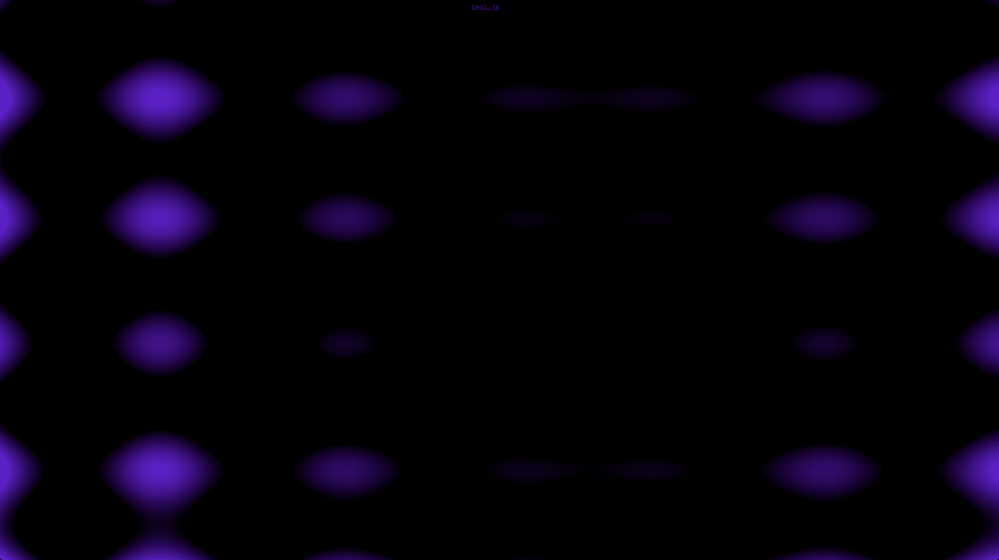

# Regl

**Regl** ([`github.com/regl-project/regl`](https://github.com/regl-project/regl)) 是一个具有函数式风格的开放源代码 WebGL 库。正如其文档所解释的，Regl 通过“尽可能多地移除共享状态来简化 WebGL 编程”。为此，它用两个基本抽象——**资源** 和 **命令** 来替换 WebGL API。以下代码片段展示了函数式 Regl API：

```js
const regl = require('regl')();

const vertexShader = `
  precision mediump float;

  attribute vec2 position;

  void main(void) {
    gl_Position = vec4(position, 0, 1);
  }
`;

const fragmentShader = `
  precision mediump float;

  uniform vec4 color;

  void main(void) {
    gl_FragColor = color;
  }
`;

const drawTriangle = regl({
  vert: vertexShader,
  frag: fragmentShader,
  attributes: {
    position: regl.buffer([
      [-2, -2],
      [4, -2],
      [4, 4]
    ])
  },
  uniforms: {
    color: regl.prop('color')
  },
  count: 3
});

regl.frame(({ time }) => {

  regl.clear({
    color: [1, 1, 1, 1],
    depth: 1
  });

  drawTriangle({
    color: [
      Math.cos(time * 0.001),
      Math.sin(time * 0.0008),
      Math.cos(time * 0.003),
      1
    ]
  });

});
```

你可以在他们的 GitHub 页面上看到实时演示，它类似于以下内容：

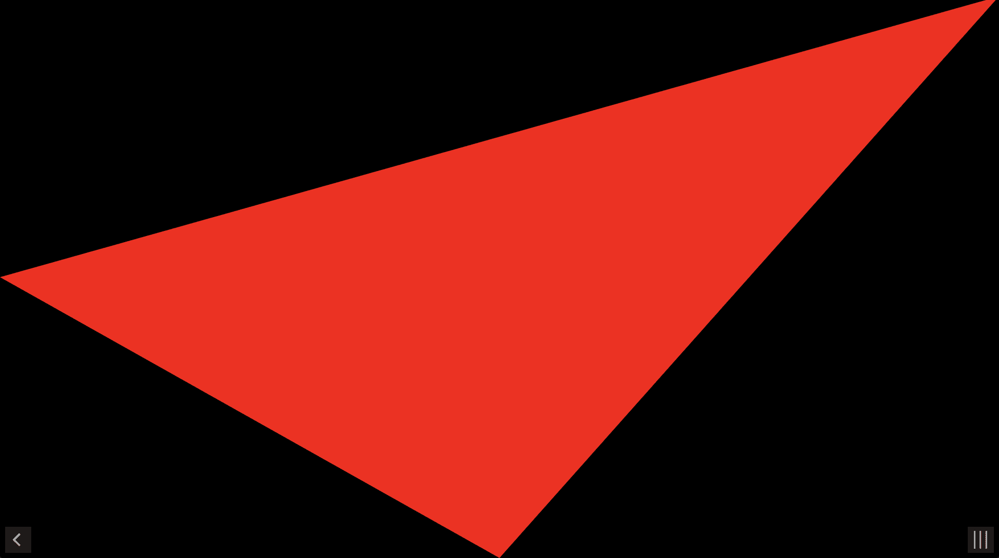

# StackGL

**StackGL** ([`stack.gl`](http://stack.gl/)) 是一个有趣的 WebGL 应用程序构建方法的开源项目。它不是一个捆绑为单个库的单一库，而是一个由许多小型、精简模块组成的生态系统，灵感来源于 Unix 哲学。

Unix 哲学 Unix 思维模式是一种编写简约、模块化软件的哲学方法，通常用口号“只做一件事，做好它！”来表达。更多信息，请访问以下网址：[`en.wikipedia.org/wiki/Unix_philosophy`](https://en.wikipedia.org/wiki/Unix_philosophy)。

与许多 3D 引擎不同，StackGL 强调编写精简、模块化的代码，专注于编写着色器代码。因此，请务必访问他们的网站，因为它包含了广泛的文档和演示，这将帮助您掌握这种方法。

# 功能丰富的库

虽然小型、精简和模块化的 WebGL 库很有用，但它们可能不足以满足复杂应用程序的需求。以下是一些功能丰富的 WebGL 库，它们提供了一系列的功能和特性。

# Three.js

**Three.js** ([`github.com/mrdoob/three.js`](https://github.com/mrdoob/three.js)) 是一个开源库，为许多网页上的 WebGL 应用程序提供动力。它旨在创建一个易于使用、轻量级的 3D 库，具有多个渲染器，针对 2D `canvas`、WebGL、SVG 和 CSS3D。以下是一个展示 Three.js API 简单性的旋转立方体演示：

```js
let
  renderer,
  scene,
  camera,
  mesh,
  width = window.innerWidth,
  height = window.innerHeight;

function init() {
  camera = new THREE.PerspectiveCamera(70, width / height, 0.01, 10);
  camera.position.z = 1;

  scene = new THREE.Scene();

  const mesh = new THREE.Mesh(
    // geometry
    new THREE.BoxGeometry(0.2, 0.2, 0.2),
    // material
    new THREE.MeshNormalMaterial()
  );
  scene.add(mesh);

  renderer = new THREE.WebGLRenderer({ antialias: true });
  renderer.setSize(width, height);
  document.body.appendChild(renderer.domElement);
}

function render() {
  requestAnimationFrame(render);
  mesh.rotation.x += 0.01;
  mesh.rotation.y += 0.02;
  renderer.render(scene, camera);
}

init();
render();
```

你可以在他们的 GitHub 页面上看到实时演示，如下所示：

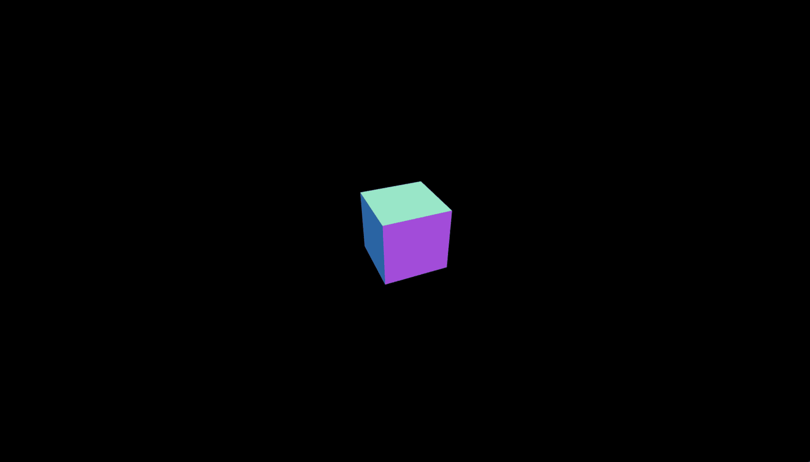

# Babylon.js

**Babylon.js** ([`github.com/mrdoob/three.js`](https://github.com/mrdoob/three.js)) 是一个在微软内部诞生的开源 WebGL 库。它是一个功能强大的库，最近完全用 TypeScript 重写。

TypeScriptTypeScript 是由微软开发的开源语言。它是一种强大的语言，是 JavaScript 的严格语法超集，并为 JavaScript 添加了可选的静态类型。更多信息，请访问[`github.com/Microsoft/TypeScript`](https://github.com/Microsoft/TypeScript)。

虽然选择 Babylon.js 不需要使用 TypeScript，但如果您或您的团队更喜欢 TypeScript 提供的功能，这可以成为与其他库相比的一个主要优势。以下是一个展示简单 Babylon.js API 的有趣的 JavaScript 演示：

```js
const canvas = document.getElementById('webgl-canvas');

const engine = new BABYLON.Engine(
  canvas,
  true,
  {
    preserveDrawingBuffer: true,
    stencil: true
  }
);

function initScene() {
  const scene = new BABYLON.Scene(engine);

  const camera = new BABYLON.FreeCamera('camera', new BABYLON.Vector3(0, 5, 
   -10), scene);
  camera.setTarget(BABYLON.Vector3.Zero());
  camera.attachControl(canvas, false);

  const ground = BABYLON.Mesh.CreateGround('ground', 6, 6, 2, scene, 
   false);

  const sphere = BABYLON.Mesh.CreateSphere('sphere', 16, 2, scene, false, 
   BABYLON.Mesh.FRONTSIDE);
  sphere.position.y = 1;

  const light = new BABYLON.HemisphericLight('light', new 
   BABYLON.Vector3(0, 1, 0), scene);

  return scene;
}

const scene = initScene();
engine.runRenderLoop(() => scene.render());
```

你可以在他们的 GitHub 页面上看到实时演示，如下所示：

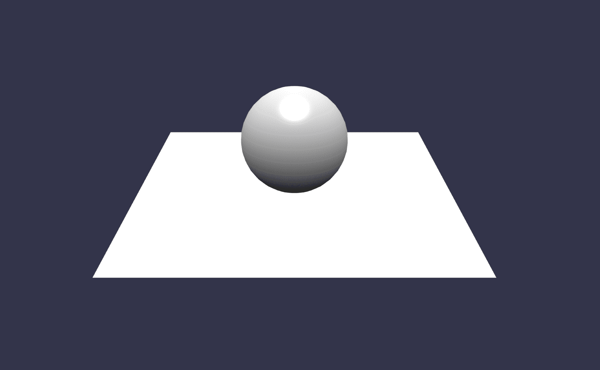

# A-Frame

**A-Frame** ([`github.com/aframevr/aframe`](https://github.com/aframevr/aframe)) 是一个用于构建虚拟现实（VR）体验的开源网页框架。它主要由 Mozilla 和 WebVR 社区维护。尽管其他 WebGL 库，如 Three.js 和 Babylon.js，提供了 VR 支持，但 A-Frame 完全是为了构建网页上的 VR 应用程序而设计的。

**A-Frame 核心** 虽然 A-Frame 是一个全新的项目，但它建立在 Three.js 游戏引擎之上。

这里有一个展示 A-Frame 声明性 API 的演示：

```js
<!DOCTYPE html>
<html>
<head>
  <title>Hello, WebVR! - A-Frame</title>
  <meta name="description" content="Hello, WebVR! - A-Frame">
  <script src="img/aframe.min.js"></script>
</head>
<body>
<a-scene>
  <a-box position="-1 0.5 -3" rotation="0 45 0" color="#4CC3D9" shadow>
  </a-box>
  <a-sphere position="0 1.25 -5" radius="1.25" color="#EF2D5E" shadow>
  </a-sphere>
  <a-cylinder position="1 0.75 -3" radius="0.5" height="1.5" 
   color="#FFC65D" shadow></a-cylinder>
  <a-plane position="0 0 -4" rotation="-90 0 0" width="4" height="4" 
   color="#7BC8A4" shadow></a-plane>
  <a-sky color="#ECECEC"></a-sky>
</a-scene>
</body>
</html>
```

你可以在他们的 GitHub 页面上看到实时演示，它类似于以下内容：

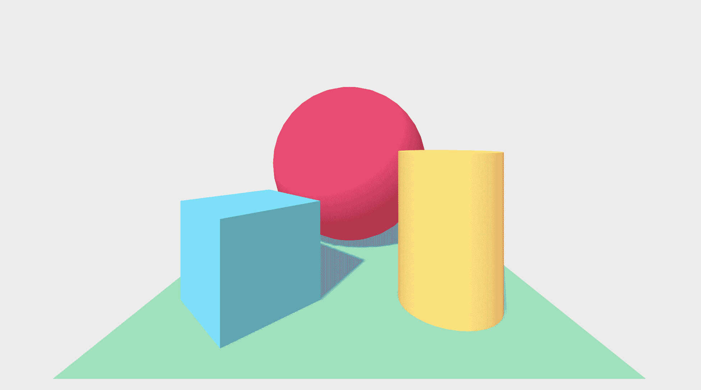

# 游戏引擎

构建复杂 3D 应用的另一种方法是使用成熟的游戏引擎。游戏引擎是一个软件开发环境，旨在让人们能够构建复杂的 3D 应用。尽管开发者使用 3D 引擎为游戏机、移动设备和个人电脑创建游戏，但它们也可以用来构建交互式 Web 应用。在构建复杂的 WebGL 应用时，你可以使用两个强大的游戏引擎：Unity 和 PlayCanvas。

# Unity

**Unity** ([`unity3D.com`](https://unity3d.com)) 是由 Unity Technologies 开发的便携式游戏引擎，提供跨平台功能。它最初于 2005 年 6 月在苹果公司的全球开发者大会上宣布并发布，作为一款仅限 OS X 的游戏引擎。多年来，它已成为跨平台提供一些最知名游戏的主要游戏引擎。尽管 Unity 优先考虑原生输出而非基于 Web 的输出，但它确实提供了 WebGL 支持：

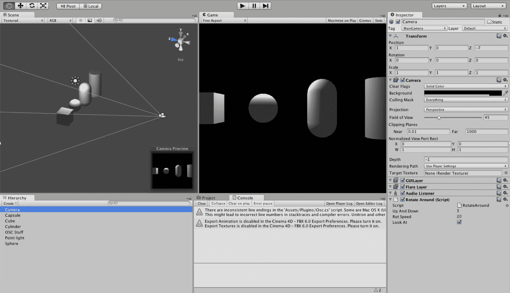

# PlayCanvas

**PlayCanvas** ([`playcanvas.com`](https://playcanvas.com/)) 是一个开源的 3D 游戏引擎，同时也提供专有云托管创作平台。尽管其他游戏引擎，如 Unity，也提供 WebGL 支持，但 PlayCanvas 是从头开始为 Web 构建的。此外，PlayCanvas 提供出色的开发体验，因为它拥有许多强大的功能，如可视化工作区、完整的 WebGL 2 支持、多台计算机同时编辑等：

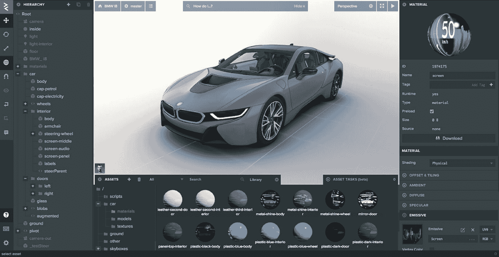

# 测试 WebGL 2 应用

如果你在这本书中打开了浏览器的调试工具，你可能已经注意到你看到的`canvas`是一个完整的“黑盒”。也就是说，你不能像检查网页上的 DOM 元素那样检查它的任何元素。如果你来自传统的 Web 开发背景，这可能会显得像一个大问题，因为我们习惯于利用 DOM 来帮助我们查询元素以测试我们的应用。那么，我们如何确保我们的 WebGL 应用的品质和稳定性呢？

# 视觉回归测试

在开发周期中，对各种应用状态的图像进行比较是测试 WebGL 应用的常见方法。这种技术通常被称为**视觉回归测试**，通过捕获网页/UI 的屏幕截图并与原始图像（历史基线截图或实时网站的参考图像）进行比较，执行前端或用户界面回归测试：

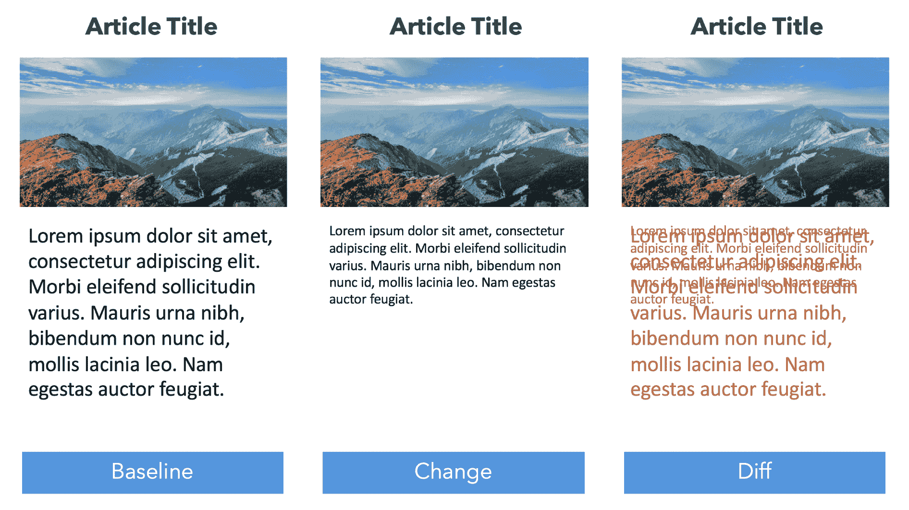

在前面的屏幕截图中，您可以看到通过最终的 Diff 输出，基线和更改是如何不同的。这种技术可以是一个确保您的 WebGL 应用程序继续按预期行为的有效方法。

可视回归测试工具

# 应用内省测试

另一种方法是通过自定义 API 公开你的 WebGL 元素来模拟 DOM API。例如，如果我们想通过 ID 查询 DOM 元素，我们会这样做：`document.getElementById('element-id')`。我们也可以通过 jQuery 的更简单 API 通过`$('#element-id')`实现同样的操作。

jQuery

要查看此方法的实现，请参考**Three Musketeers**（[`github.com/webgl/three-musketeer`](https://github.com/webgl/three-musketeer)），一个开源库，可以将其包含在任何 Three.js 应用程序中，只需一行代码。通过包含 `three-musketeers`，我们可以在场景中的元素上运行各种查询，类似于网页中的 DOM 元素。以下是一些示例查询以供进一步说明：

```js
$$$.debug();
```

`$$$` 是 `three-musketeers` 实例的别名。`debug` 方法启用可视化调试模式：

```js
$$$
.find('Cube_1')
.exists();
// returns true

```

`find` 方法在场景中搜索具有 ID `Cube_1` 的项目。通过调用 `exists`，它返回一个布尔值，表示是否存在：

```js
$$$
.findAll((node) => node.geometry.type === 'BoxGeometry');

```

与 `find` 类似，`findAll` 返回一个项目数组。在这种情况下，我们不是在搜索一个唯一的 ID，而是在寻找所有匹配 `BoxGeometry` 类型的几何体：

```js
$$$
.find('Cube_1')
.click();

```

我们找到具有唯一 ID `Cube_1` 的几何体，并在适当的坐标上触发鼠标点击事件：

```js
window.addEventListener('click', (event) => {
 const intersectedItems = $$$.pickFromEvent(event);
 console.log(intersectedItems);
});
```

这是一个非常有助于调试的简单技术。每次我们在网页上点击，我们都会记录所有相交的几何体，给定鼠标点击的 2D 坐标映射到我们的 3D 场景中。

更多信息，请务必查看 GitHub 上的`three-musketeers`（[`github.com/webgl/three-musketeers`](https://github.com/webgl/three-musketeers)）或其文档（[`webgl.github.io/three-musketeers`](https://webgl.github.io/three-musketeers)）。

# 3D 重建

在整本书中，我们要么构建自己的几何形状，要么导入在 3D 建模工具（如 Maya 或 Blender）中创建的模型。尽管这些是构建 3D 资产常用的方法，但它们需要人工劳动来创建。有没有其他获取几何形状的技术呢？当然有！**3D 重建**是从图像中创建 3D 模型的过程。这是从 3D 场景中获得 2D 图像的逆过程。以下是一个完全通过航空摄影和称为摄影测量的技术生成的 3D 模型的例子：

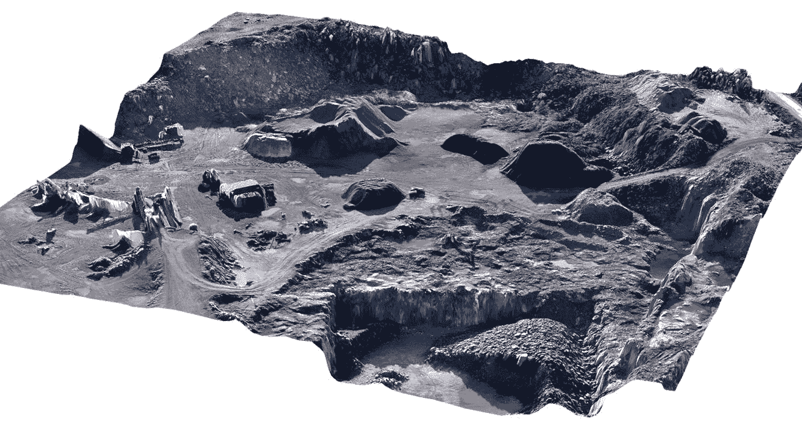

摄影测量

摄影测量是通过对照片进行空间测量的科学。这是一种强大的技术，可以恢复表面点的精确位置。更多信息，请访问[`en.wikipedia.org/wiki/Photogrammetry`](https://en.wikipedia.org/wiki/Photogrammetry)。

# 基于物理的渲染

在第三章《光线》中，我们学习了如何通过模拟光线来照亮我们的场景。我们通过利用各种着色和光线反射技术来实现，这些技术主要使用两个主要组件：镜面反射和漫反射。尽管我们在计算机图形学中已经使用镜面反射和漫反射来建模材料很长时间了，但这些技术产生的结果并不非常逼真。例如，改变材料的镜面反射率并不会改变漫反射：

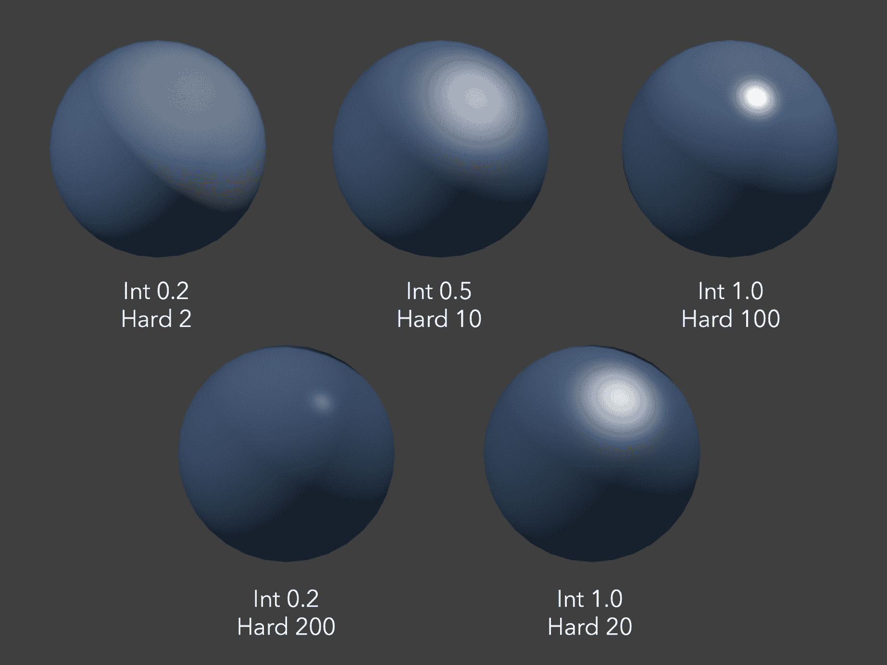

之前的截图表明，仅改变镜面强度和镜面硬度这两个参数只会改变反射的白色部分。蓝色的漫反射根本不会改变——这并不是我们物理世界的运作方式！因此，在追求更逼真效果的应用中，艺术家将负责手动调整每个材料的这些值，直到它“看起来正确”，这充其量是一种低效的方法。必须有一种更好的方法！

进入**基于物理的渲染**（**PBR**），这是一种通过更客观、可测量和科学的真实表面属性来验证我们的材料描述的方法。最明显的属性之一是能量守恒：粗糙的表面会漫反射光线，而更光滑/更金属的表面会直接反射光线，尽管它们都是从同一个光源中反射出来的。因此，在所有条件相同的情况下，规则遵循着随着材料变得越亮，漫反射成分应该越暗：

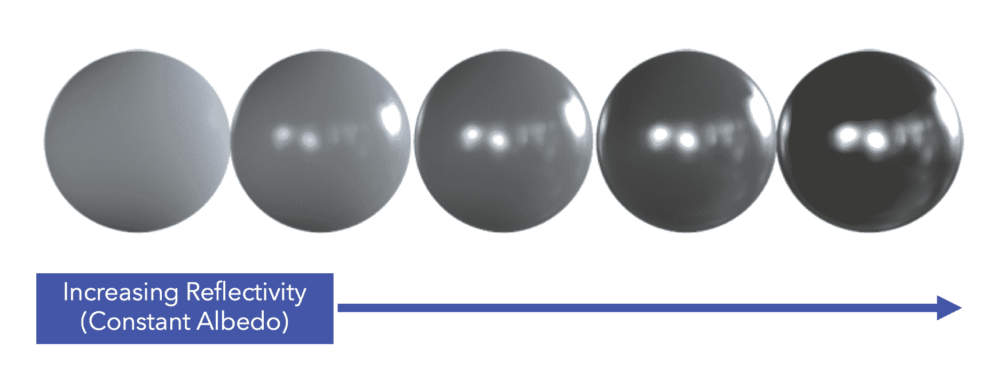

当然，基于物理的渲染不仅仅是能量守恒；然而，这是一个清楚地展示基于物理系统特性的例子。通过保持反射模型与材料在现实生活中的工作方式相似，我们减少了主观手动调整的需求，并产生了在各种光照条件下看起来逼真的真实世界材料。

# 社区

计算机图形学是一个充满复杂、美丽和启发性的概念领域。参与致力于这一学科的社区是学习、分享和启发他人的最佳方式之一。以下是一些最受欢迎的社区的非详尽列表：

+   **Chrome Experiments** ([`experiments.withgoogle.com`](https://experiments.withgoogle.com/)) 是一个基于网络浏览器的实验、互动程序和艺术项目的在线展示厅。

+   **WebGL.com** ([`WebGL.com`](https://webgl.com/)) 是 WebGL 开发者的领先社区，包括演示、教程、新闻等。

+   **SketchFab** ([`sketchfab.com`](https://sketchfab.com/)) 是一个发布、分享、发现、购买和销售 3D、VR 和 AR 内容的平台。它提供了一个基于 WebGL 和 WebVR 技术的查看器，允许用户在网页上显示 3D 模型。

+   **ShaderToy** ([`www.shadertoy.com`](https://www.shadertoy.com/)) 是一个跨浏览器的在线社区和工具，用于通过 WebGL 创建和分享着色器，用于在网页浏览器中学习和教授 3D 计算机图形学。

+   **CGTrader** ([`www.cgtrader.com/3D-models`](https://www.cgtrader.com/3d-models)) 是一个在线平台，允许设计师和建模工作室上传他们的 3D 模型，并与社区分享或出售。

+   **TurboSquid** ([`www.turbosquid.com`](https://www.turbosquid.com/)) 是一家数字媒体公司，向包括计算机游戏、建筑和交互式培训在内的多个行业销售用于 3D 图形的库存 3D 模型。

+   **Poly** ([`poly.google.com`](https://poly.google.com/)) 是由 Google 创建的一个网站，用户可以浏览、分发和下载 3D 对象。它包含一个免费库，包含数千个可用于虚拟现实和增强现实应用的 3D 对象。

# 摘要

感谢您花时间阅读这本书。通过涵盖广泛的主题——如渲染、着色器、3D 数学、光照、相机、纹理等——并指导您构建引人入胜的 3D 应用程序，我们希望它已经实现了帮助您使用 WebGL 2 学习交互式 3D 计算机图形学的目标。

“故事不会结束，”他说，“它们只是变成了新的开始。”

– Lindsay Eagar，《蜜蜂时刻》

考虑到这一点，请确保保持联系并分享您的工作——我们期待看到您所构建的内容！如果您有任何问题或反馈，请参阅本书的序言以获取联系方式。
