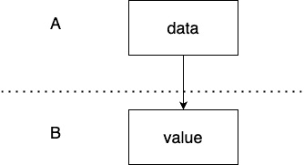
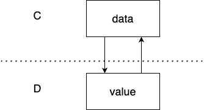
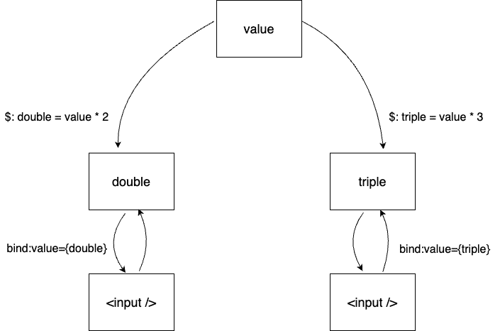
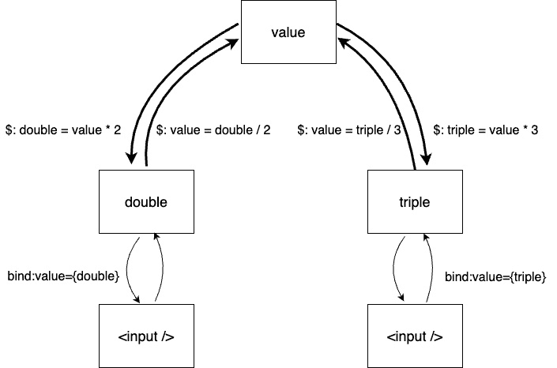
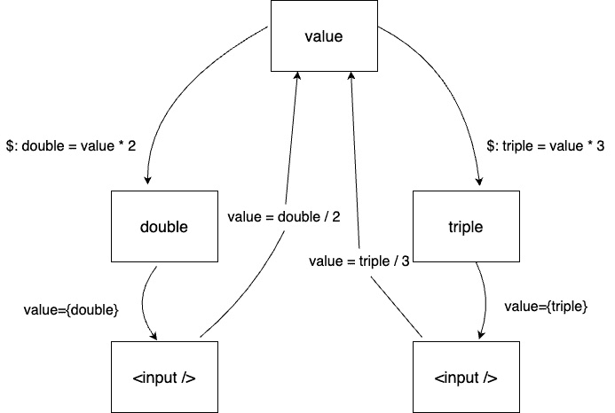

# 第三章：管理属性和状态

在网络开发的世界里，有效地管理数据至关重要。无论是组件之间的信息流还是组件的内部状态，适当的数据管理是功能性和响应式网络应用程序的基石。

在本章中，我们将深入研究在 Svelte 应用程序中管理属性和状态的核心概念。首先，我们将明确 Svelte 中的属性和状态是什么，为理解更高级的主题打下基础。然后，我们将探讨绑定的概念，这是 Svelte 中用于保持状态和元素值或组件属性同步的功能。

然后，我们将探讨组件内的数据流，突出单向数据流和双向数据流之间的差异以及它们为什么重要。接下来，我们将讨论如何使用 Svelte 的响应式声明从属性派生状态。最后，我们将提供管理复杂派生状态的技巧，并解释如何根据这些派生状态更新属性。

到本章结束时，你将牢固地理解如何在 Svelte 组件中管理数据，并掌握实用的技巧和策略来有效地应对常见挑战。

在本章中，你将学习以下内容：

+   定义属性和状态

+   理解绑定

+   单向与双向数据流

+   使用响应式声明从属性派生状态

+   管理复杂的派生状态

+   使用派生状态更新属性

在我们开始讨论属性和状态之前，让我们首先定义在 Svelte 中属性和状态是什么。

# 技术要求

你可以在 GitHub 上找到本章中使用的所有代码示例：[`github.com/PacktPublishing/Real-World-Svelte/tree/main/Chapter03`](https://github.com/PacktPublishing/Real-World-Svelte/tree/main/Chapter03)

# 定义属性和状态

在 Svelte 中，属性和状态都用于在组件内管理数据。属性是一种将数据从父组件传递到子组件的方式。这使得子组件更加灵活和可重用，因为它可以根据需要从父组件获取不同的数据。

另一方面，状态是在组件内部初始化和管理的内部数据，与从外部来源接收的属性不同。状态允许组件自包含和模块化。

## 定义属性

让我们从属性开始。在 Svelte 中，属性使用 `export` 关键字定义。当你在一个 Svelte 组件中导出一个变量时，它就变成了一个可以传递数据的属性，你可以从父组件传递数据。

这里有一个简单的例子：

```js
<!-- file: Child.svelte -->
<script>
  export let message;
</script>
<h1>{message}</h1>
```

在前面的代码片段中，我们在名为 `Child.svelte` 的文件中定义了一个 Svelte 组件。在 Svelte 组件中，`message` 是一个属性。你可以从父组件传递数据到 `message`，如下所示：

```js
<!-- file: Parent.svelte -->
<script>
  import Child from './Child.svelte';
</script>
<Child message="Hello, World!" />
```

在前面的代码片段中，我们在名为 `Parent.svelte` 的文件中定义了另一个 Svelte 组件。在这个组件中，我们导入并使用来自 `Child.svelte` 的 `Child` 组件。由于 `Parent` 组件包含了 `Child` 组件，因此 `Parent` 组件被认为是导入的 `Child` 组件的父组件。

在父组件中，你可以通过 `<Child />` 组件的 `message` 属性传递 `"Hello, World!"` 来设置子组件的 `message` 道具，如前面的代码片段所示。

总结来说，道具是通过 `export` 关键字定义的，它们的值是从父组件传递到子组件的。

## 定义状态

接下来，让我们看看状态。状态是任何在组件内部使用和管理的数据。它不像道具那样从父组件传递进来。相反，它是在组件内部定义的。

这里有一个说明状态的例子：

```js
<!-- file: Counter.svelte -->
<script>
  let count = 0;
  function increment() {
    count += 1;
  }
</script>
<button on:click={increment}>Click me</button>
<p>{count}</p>
```

在这个例子中，`count` 是一个状态变量。它不是作为道具传递的，而是在 `Counter` 组件内部定义和管理的。当你点击按钮时，会调用 `increment` 函数，该函数修改 `count` 状态。

总结来说，道具是从父组件传递到组件的变量，而状态是组件内部管理的数据。

## 道具与状态

如果你仔细观察，道具和状态都代表数据。它们之间的区别取决于你考虑的组件的上下文。

例如，让我们考虑两个组件，组件 `A` 和组件 `B`。

让我们从组件 `A` 开始：

```js
<!-- A.svelte -->
<script>
  export let height;
</script>
```

在组件 `A` 中，我们定义了一个名为 `height` 的道具。

现在让我们看看组件 `B`：

```js
<!-- B.svelte -->
<script>
  import A from './A.svelte';
  let height = 0;
</script>
<A height={height} />
```

在组件 `B` 中，我们定义了一个名为 `height` 的状态，并将其值作为道具传递给组件 `A`。

从组件 `B` 的角度来看，`height` 被视为状态，但从组件 `A` 的角度来看，它被视为道具。一个变量是道具还是状态取决于它被查看的组件的上下文。在本质上，它们基本上是同一件事。

在这个例子中，由于 JavaScript 以值的方式传递原始变量，可能不会立即明显地看出组件 `A` 和组件 `B` 中的 `height` 变量指向同一件事。

然而，如果我们定义一个对象作为状态并通过道具传递给另一个组件，那么就会变得明显，一个组件中的状态和另一个组件中的道具都指向同一个对象引用。

让我们修改我们的例子来说明这一点：

```js
<!-- A.svelte -->
<script>
  export let height;
  setInterval(() => console.log('A:', height), 1000);
</script>
<!-- B.svelte -->
<script>
  import A from './A.svelte';
  let height = { value: 100 };
  setInterval(() => console.log('B:', height), 1000);
</script>
<A height={height} />
```

在这个代码片段中，我添加了一个 `setInterval` 函数，每秒钟在两个组件中打印出 `height` 变量的值。在组件 `B` 中，我将状态 `height` 修改为对象。因为 JavaScript 中的对象是通过引用传递的，所以作为属性传递给组件 `A` 的组件 `B` 中的状态 `height` 也是通过引用传递的。这意味着组件 `A` 中的 `height` 属性引用的是与组件 `B` 中的状态 `height` 相同的对象。

如果我们在组件 `B` 中添加一个 `<button>` 元素来修改 `height` 对象，如下所示，你将能够看到组件 `A` 和 `B` 都会在控制台中打印出相同的更新后的 `height` 变量值。这是因为它们打印的是相同对象引用的值：

```js
<button on:click={() => { height.value += 10; }} />
```

点击前面代码片段中的按钮会导致控制台打印出 `A: { value: 110 }` 和 `B: { value: 110 }`。这表明组件 `A` 和 `B` 中的 `height` 变量引用的是相同的对象引用。当组件 `B` 中的 `height.value` 更改为 `110` 时，这个变化也会反映在组件 `A` 中的 `height` 变量上。

现在我们已经了解了 Svelte 中的 props 和状态是什么，接下来让我们谈谈绑定。

# 理解绑定

Svelte 中的绑定允许你保持组件状态值与 `<input />` 元素值的同步。如果状态发生变化，输入会更新；反之，如果输入发生变化，状态也会更新。

以下代码片段是创建 Svelte 中绑定的一个示例：

```js
<script>
  let name = "John";
</script>
<input bind:value={name} />
```

绑定是通过 `bind:` 指令创建的。在前面代码片段中，输入元素的值被绑定到 `name` 变量。当你输入时，`name` 变量将自动更新。反之，当你更改 `name` 变量的值时，输入元素的值也会自动更新。

如所示，绑定创建了一个双向数据流，使得数据变化可以从元素传播到组件状态，以及从组件状态传播到元素。

之前的例子演示了在元素上的绑定，但绑定也可以在组件上工作。你可以使用 `bind:` 指令将组件的属性与你的组件状态链接起来，如下面的代码所示：

```js
<script>
  import Profile from './Profile.svelte';
  let name = "John";
</script>
<Profile bind:username={name} />
```

在前面的代码片段中，我们将 `<Profile>` 组件的 `username` 属性绑定到 `name` 状态变量。当你更新 `name` 状态变量时，`username` 属性的值将自动反映新的值；反之，如果你在 `<Profile>` 组件内部更新 `username` 属性的值，`name` 状态变量的值也会自动更新以匹配。

为了进一步演示这种行为，让我们对代码进行一些小的修改。这是组件的更新版本：

```js
<script>
  import Profile from './Profile.svelte';
  let name = "John";
</script>
<p>Name from App: {name}</p>
<Profile bind:username={name} />
<p> element and a <button> element. The <p> element shows the value of the name state variable, and the <button> element, when clicked, updates the value of the name state variable to Svelte. Due to the binding, when the button is clicked, it will also update the username props in the <Profile> component.
Here’s the updated version of the `<``Profile>` component:

```

<script>

export let username;

</script>

<p>Profile 中的名称：{username}</p>

<button on:click={() => username = "World"}>从个人资料更新</button>

```js

 In this code snippet, we are looking at the `<Profile>` component. This component receives a prop called `username`, whose value is displayed inside a `<p>` element. We’ve also added a button, and when clicked, it will update the value of the `username` prop to `"World"`.
Because of the binding we established in the parent component, any change to the `username` prop in this `<Profile>` component will also update the `name` state variable in the parent component.
Indeed, if you click on the button in the parent component, both the `name` state variable in the parent component and the `username` prop in the `<Profile>` component will update to `"Svelte"`. On the other hand, if you click on the button in the `<Profile>` component, both the `name` state variable in the parent component and the `username` prop in the `<Profile>` component will change to `"World"`. This is the power of two-way binding in Svelte, allowing you to easily synchronize data between parent and child components.
When we talk about binding in Svelte, we often refer to *two-way data binding*. But what exactly does *two-way* mean? And is there such a thing as *one-way* data binding? Let’s delve deeper into the concept of data flow to clarify these terms.
One-way versus two-way data flow
When you pass data from one component to another component either through props or binding, data flows from one component to another component. The term data flow refers to how data is passed or transmitted between components or elements within a web application.
Understanding data flow is important when designing an application’s architecture, as it helps to establish clear lines of communication between components and determine how information is shared and updated throughout the system.
Data flow can be unidirectional (one-way) or bidirectional (two-way), depending on how data is transferred between components.
In one-way data flow, data moves in a single direction, from a parent to a child component, or from a component to a DOM element. This unidirectional flow is achieved through component props or DOM element attributes.
For example, consider the following code snippets featuring two components, component `A` and component `B`.
In component `B`, we define a prop named `value`:

```

<!-- 文件名：B.svelte -->

<script>

export let value;

</script>

```js

 In component `A`, we import component `B` and pass the value of a variable named `data` to the prop of component `B`:

```

<!-- 文件名：A.svelte -->

<script>

从 './B.svelte' 导入 B;

let data;

</script>

<B value={data} />

```js

 Here, the value of `data` in component `A` is passed to the `value` prop in component `B`, illustrating the data flow from component `A` to component `B`.
If you draw up the data flow in a diagram, this is what a one-way data flow looks like:


Figure 3.1: One-way data flow
The boxes show the data state and value prop, and the arrow shows how changing one value will affect another.
In one-way data flow, changes to data in the parent component automatically propagate to the child component, but the reverse is not true.
Building on the example with component `A` and component `B`, if the value of the `data` variable in component `A` changes, this change would automatically update the `value` props in component `B`. However, any changes made directly to the `value` props in component `B` would not affect the `data` variable in component `A`. Data changes only flow from component `A` to component `B`, but not in the reverse direction.
Having a one-way data flow makes the application easier to reason about and debug, as data changes follow a predictable path. For example, when the `data` variable in component `A` changes unexpectedly, isolating the issue becomes more straightforward. Because of the one-way data flow, we know that any changes to the `data` variable in component `A` will only originate from component `A`, not from component `B`.
On the other hand, two-way data flow allows data to flow in both directions, enabling automatic updates between the parent and child components, or between a component and DOM elements. Two-way data flow in Svelte is achieved through component or DOM element bindings.
For example, consider the following code snippets featuring two components, component `C` and component `D`.
In component `D`, we define a prop named `value`:

```

<!-- 文件名：D.svelte -->

<script>

export let value;

</script>

```js

 In component `C`, we import component `D` and bind the value of a variable named `data` to the prop of component `D`:

```

<!-- 文件名：C.svelte -->

<script>

从 './D.svelte' 导入 D;

let data;

</script>

<D bind:value={data} />

```js

 Here, the value of `data` in component `C` is bound to the `value` prop in component `D`, illustrating the two-way data flow between component `C` to component `D`.
Here is a diagram showing how the data flows in a two-way data flow:


Figure 3.2: Two-way data flow
In a two-way data flow, when you change the data in the parent component, the child component is automatically updated; conversely, changing the data in the child component automatically updates the parent.
Building on the example with component `C` and component `D`, if the value of the `data` variable in component `C` changes, this change would automatically update the `value` props in component `D`. Conversely, unlike one-way data flow, any changes made directly to the `value` props in component `D` would update the `data` variable in component `C`. Data changes flow from component `C` to component `D` as well as from component `D` to component `C`.
While this bidirectional flow of data can make it easier to keep data in different components synchronized, it can also introduce complexity and make the application harder to debug, since data changes can originate from multiple sources.
For example, when the `data` variable in component `C` changes unexpectedly, isolating the issue becomes more complex. Because of two-way data flow, any changes to the `data` variable in component `C` could originate from component `C`, as well as from component `D`. This complexity can escalate further if the `value` prop of component `D` is also bound to the prop of another component.
In summary, one-way data flow offers predictability and easier debugging, while two-way data flow makes it much easier to synchronize data across multiple components but at the cost of added complexity.
Now that we’ve delved into both one-way and two-way data flows via props, let’s explore how to create state variables that derive their values from props.
Deriving states from props with a reactive declaration
It’s common in Svelte to create new state variables based on the values of props.
For instance, a `<DateLabel />` component might accept a `date` value as a prop and display a formatted date inside a `<label>` element. To use the `<DateLabel>` component, you might write the following:

```

<DateLabel date={new Date(2023,5,5)} />

```js

 To display the date as formatted text, you could first define a variable named `label`, deriving its value from the `date` prop:

```

<!-- 文件名：DateLabel.svelte -->

<script>

export let date;

// 从 'date' 属性派生 'label' 变量

let label = date.toLocaleDateString();

</script>

<label>{label}</label>

```js

 In this code snippet, we defined a variable called `label` and derived its value from the `date` prop using the `toLocaleDateString()` method. This variable is then used inside a `<label>` element to display the formatted date.
In the preceding code snippet, the `label` variable is initialized when the `<DateLabel>` component is first created. However, if the `date` prop changes after the component has been initialized, the `label` variable won’t update to reflect the new value. This is not the intended behavior, as the `<DateLabel>` component should always display the most up-to-date formatted date based on the latest `date` prop.
To solve this issue, you can use Svelte’s reactive declarations to keep the `label` variable updated whenever the `date` prop changes.
Svelte’s reactive declarations utilize a special `$:` syntax to mark a statement as reactive. This means that whenever the variables used in that statement change, the statement itself will be re-run.
Let’s modify our component code to use Svelte’s reactive declaration:

```

<!-- 文件名：DateLabel.svelte -->

<script>

export let date;

// 从 'date' 属性派生 'label' 变量

$: label = date.toLocaleDateString();

</script>

```js

 In this code snippet, by modifying the declaration of `label` to a reactive declaration, the component will automatically re-compute the `label` variable whenever the `date` prop is modified, ensuring that the `<DateLabel>` component is always displaying the most current formatted date.
So, how does Svelte know when a reactive declaration statement should be re-run?
Svelte re-runs a reactive declaration statement whenever any of its dependent variables change. The Svelte compiler identifies these dependencies by analyzing the statement.
For example, in the reactive declaration `$: label = date.toLocaleDateString();`, Svelte recognizes that the dependency for this statement is the `date` variable. Therefore, whenever the `date` changes, the statement will re-run and update the value of the `label` variable.
A good rule of thumb for identifying dependencies in a reactive declaration is to look for any variable on the right side of the equal sign (`=`). These variables are considered dependencies of the reactive declaration.
You can include multiple dependencies within a single reactive declaration. For instance, let’s say we want to add a new `locale` prop to the `<DateLabel>` component. To use this new prop, you might write something like this:

```

<DateLabel date={new Date(2023, 5, 5)} locale="de-DE" />

```js

 In this code snippet, we pass in a new `locale` prop with the value `de-DE` to format the date in German. To accommodate this new `locale` prop, we’ll need to modify our `<DateLabel>` component as follows:

```

<script>

export let date;

export let locale;

// 带有多个依赖项的响应式声明

$: label = date.toLocaleDateString(locale);

</script>

<label>{label}</label>

```js

 In this updated code, the reactive declaration `$: label = date.toLocaleDateString(locale);` now has two dependencies: `date` and `locale`. Svelte will automatically re-run this statement whenever either of these variables changes, ensuring that the `label` value stays up to date with the latest `date` and `locale` props.
Now that we’ve covered the basics of props, bindings, states, and derived states, it’s crucial to note that as components become more complex, managing these elements can quickly become overwhelming. In the next section, we’ll explore some tips for effectively managing complex derived states to keep them manageable.
Managing complex derived states
As your Svelte application grows more complex, it will likely involve a greater number of interconnected components with multiple props and derived states. When dealing with this complexity, tracking updates and changes can become a complex task. Each prop or state change can affect other parts of your component, making it challenging to manage and predict how your component will behave.
To make this easier, here are some guidelines to consider:

*   *Maintain one-way data flow for* *derived states*

    While it’s possible to derive state from props and other states, it’s crucial to maintain a one-way data flow to simplify both debugging and understanding. Consider the following Svelte example:

    ```

    <script>

    export let valueA;

    export let valueB;

    $: valueC = valueA + 5;

    $: valueD = valueB + valueC;

    $: valueC = Math.min(valueC, valueD / 2);

    </script>

    在观察数据流时，我们可以看到 valueC 依赖于 valueA，valueD 依赖于 valueB 和 valueC，然后 valueC 又反过来依赖于 valueD。因此，valueC 的实际计算方式并不明确，它可能是 valueA + 5 或 valueC 和 valueD / 2 中的最小值。这种复杂性使得代码难以理解，并增加了出现错误的可能性。

    ```js

     *   *Group similar* *logic together*

    Consider this tip a stylistic suggestion. When dealing with multiple reactive declarations, it’s beneficial to group those that are related together. Utilize blank lines to create a visual separation between unrelated reactive declarations. This not only improves readability but also aids in code maintenance.

    It is worth noting that the Svelte compiler takes care of execution order based on dependencies regardless of how you arrange your declarations. For example, the following two code snippets will behave identically due to Svelte’s handling of dependencies:

    ```

    <script>

    export let a;

    $: b = a * 2;

    $: c = b * 2;

    </script>

    b 在 c 声明之前被声明为响应式。然而，它的行为与以下片段相同，其中 c 在 b 声明之前。让我们看看下一个：

    ```js

    ```

    <script>

    导出 let a;

    $: c = b * 2;

    $: b = a * 2;

    </script>

    ```js

    The Svelte compiler analyzes the dependencies of each declaration and executes them in the correct order. In this case, it evaluates `b = a * 2` before `c = b * 2` since the latter depends on the value of `b`, established by the former declaration.

     *   *Avoid reassigning* *props directly*

    It might be tempting to modify the value of a prop directly, especially when you want to transform its value or provide a default fallback. For example, you might consider writing something like this to set a default value for an undefined prop:

    ```

    <script>

    export let data;

    $: data = data ?? 100;

    </script>

    相反，最好声明一个新的状态变量来管理这种行为：

    ```js

    ```

    <script>

    export let data;

    $: dataWithDefault = data ?? 100;

    </script>

    ```js

    In this improved example, we introduce a new variable, `dataWithDefault`, which takes on either the value of the `data` prop or a default value of `100` if `data` is undefined. This approach makes the component’s behavior more transparent and easier to debug.

     *   *Be cautious when updating* *derived states*

    Modifying a derived state directly can introduce inconsistencies, particularly when that state is based on props or other state variables.

    Consider the following example:

    ```

    <script>

    export let value;

    $: double = value * 2;

    $: triple = value * 3;

    </script>

    <input bind:value={double} type="number" />

    <input bind:value={triple} type="number" />

    ```js

    In this example, we have a single prop named `value` and two derived states, `double` and `triple`, which are two and three times the value of the `value` prop respectively. The component features two input boxes, each bound to `double` and `triple` using two-way binding.

    Here, `triple` can be modified in two ways: either by updating the `value` prop, which will keep `triple` at three times the value of `value`, or by directly changing the value in the input box, thereby directly altering `triple`.

    If you type into the input box bound to `triple`, you’ll find that its value diverges from being strictly three times the `value` prop. This inconsistency arises because `triple` is now subject to changes from multiple sources, causing it to go *out of sync* with the original `value`.

    If you were to map out a diagram illustrating the data flow between `value` `double` and `triple`, you’d get the following diagram:



Figure 3.3: Data flows between props, states, and the input elements
Notice that both `double` and `triple` have two incoming arrows, suggesting multiple pathways for changing their values. Conversely, `value` has no incoming arrows, indicating that modifying `triple` alone would cause `value` and `double` to go out of sync.
Therefore, it is recommended to refrain from manually updating derived states, as this complicates debugging and makes the component’s behavior harder to reason about.
If you wish to modify the input while maintaining the synchrony between `value`, `double`, and `triple`, a solution will be discussed in the following section.
By keeping these tips in mind, you can better manage complex derived states and make your components more maintainable and easier to understand.
In our last tip, we highlighted that updating the derived states can lead to inconsistencies between states and props and noted that there’s a solution to modify the input while keeping everything in sync. That solution is what we will explore next.
Updating props using derived states
In an attempt to synchronize the `value` prop with changes to the input bound to `triple`, one might be tempted to add another reactive declaration. This declaration would update the `value` prop to be one-third of `triple` whenever `triple` changes. Here is the proposed modification:

```

<script>

export let value;

$: double = value * 2;

$: triple = value * 3;

$: value = double / 2;

$: value = triple / 3;

</script>

<input bind:value={double} type="number" />

<input bind:value={triple} type="number" />

```js

 As we discussed earlier, it’s best practice to maintain a one-way data flow for derived states to simplify debugging and data management. Indeed, the Svelte compiler flags the preceding code snippet for cyclical dependencies. This is because `double` is derived from `value`, and `value` is in turn dependent on `double`.
However, Svelte’s compiler determines dependency relationships based solely on the reactive declarations. By refactoring the code to make these relationships less obvious, you can bypass the compiler’s cyclical dependency check. Here’s a refactored version of the code that does just that:

```

<script>

export let value;

$: double = value * 2;

$: triple = value * 3;

$: updateValueFromDouble(double);

$: updateValueFromTriple(triple);

function updateValueFromDouble(double) {

value = double / 2;

}

function updateValueFromTriple(triple) {

value = triple / 3;

}

</script>

<input bind:value={double} type="number" />

<input bind:value={triple} type="number" />

```js

 In the provided code snippet, we’ve shifted the equations `value = double / 2` and `value = triple / 3` into separate functions named `updateValueFromDouble` and `updateValueFromTriple`. This change lets us evade Svelte’s compiler warning about cyclical dependencies.
However, there’s a catch. If you try altering the `triple` input, it updates `value` but doesn’t refresh `double`. This happens because Svelte avoids infinite update loops. Changing `triple` would set off a chain reaction—updating `value`, then `double`, then back to `value`, and so on.
This is how the data flow looks right now:


Figure 3.4: Data flows between props, states, and the input elements
As you can see in the diagram, we update the value of `value`, `double`, and `triple` through reactive declarations, creating a loop in the data flow, indicated by the bold arrows.
Therefore, using derived states to update their original properties via reactive declarations isn’t advisable.
A better approach to keep `value`, `double`, and `triple` in sync is to establish value as the single source of truth. Since both `double` and `triple` are derived from `value`, any changes to the input should first update `value`. This, in turn, triggers the reactive declarations to automatically recalculate `double` and `triple`.
Here’s the updated code:

```

<script>

export let value;

$: double = value * 2;

$: triple = value * 3;

function updateValueFromDouble(double) {

value = double / 2;

}

function updateValueFromTriple(triple) {

value = triple / 3;

}

</script>

`<input value={double} type="number" on:change={e => updateValueFromDouble(e.target.value)} />`

`<input value as the sole source of truth. Instead of binding the input elements directly to double and triple, we’ve added event listeners that update value based on user input. This change automatically updates double and triple through reactive declarations, which then refresh the displayed values in the input fields.`

通过更新的代码，数据流现在已简化，如下面的图所示：



图 3.5：props、states 和输入元素之间的数据流

`double`和`triple`的值直接从`value`派生，然后填充输入字段。当你修改输入时，它会直接改变`value`，进而自动更新`double`和`triple`，以及输入字段本身。

因此，这是通过关注数据流并保持单一事实来源来维护`value`、`double`和`triple`同步状态的方法。

摘要

理解如何有效地处理 props 和 state 对于创建健壮的 Svelte 应用至关重要。本章向您展示了 Svelte 如何使用 props、bindings 和 reactive declarations 来促进组件间的数据传递和状态变化。

在组件内部关注数据流至关重要。拥有统一和有序的数据流使得代码更容易跟踪和调试。良好的数据管理为轻松构建更复杂和动态的应用铺平了道路。

在下一章中，我们将探讨如何组合 Svelte 组件来构建更复杂的应用。

```js

```
