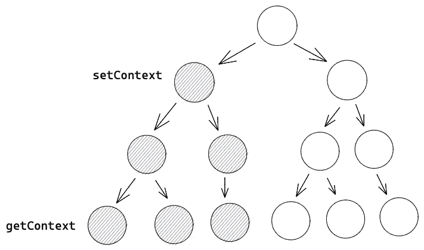
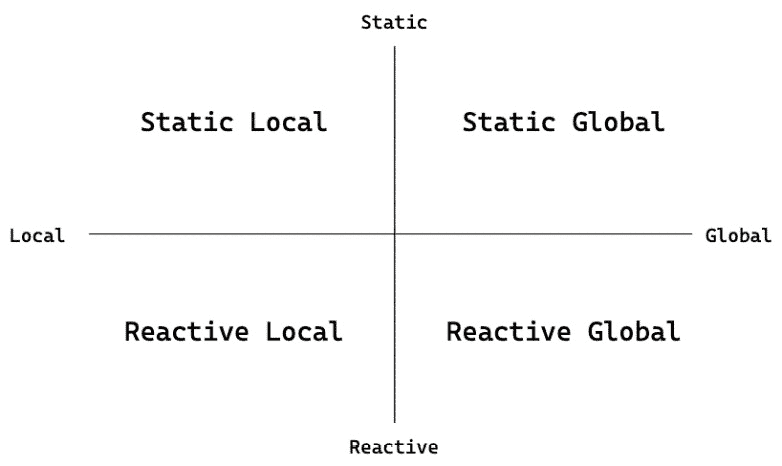

# 8

# 上下文与存储的比较

一个 Svelte 应用可以由一个或多个 Svelte 组件组成。一个 Svelte 组件可以被看作是一个独立的单元，封装了自己的响应式数据和逻辑。在前一章中，我们学习了两个 Svelte 组件——特别是父组件和子组件之间的关系——是如何相互通信和传递数据的。然而，在本章中，我们将探索超出父子和关系的组件间的通信和数据传递。

Svelte 提供了两个原语来在 Svelte 组件间传递数据——Svelte 上下文和 Svelte 存储。Svelte 上下文允许你从祖先组件传递数据到所有子组件，而 Svelte 存储使用观察者模式允许你在多个无关的 Svelte 组件间访问响应式数据。

在接下来的五章节中，我们将探讨 Svelte 上下文和 Svelte 存储的不同用例。在本章中，我们将介绍 Svelte 上下文和 Svelte 存储是什么。

我们将讨论何时使用 Svelte 上下文和/或 Svelte 存储，以及选择它们的考虑因素。然后我们将通过一个结合了 Svelte 上下文和 Svelte 存储的示例来继续讨论——一个 Svelte 上下文存储。

到本章结束时，你将熟练使用 Svelte 存储和 Svelte 上下文在你的 Svelte 应用中。你还将了解何时有效地使用它们。

在本章中，我们将涵盖以下主题：

+   定义 Svelte 上下文和 Svelte 存储

+   何时使用 Svelte 上下文和 Svelte 存储

+   使用 Svelte 存储创建动态上下文

# 定义 Svelte 上下文

当你需要从父组件传递数据到子组件时，你应该首先考虑使用 props：

```js
<Component props={value} />
```

如果你需要从父组件传递数据到孙组件呢？你可以从父组件通过 props 传递数据到子组件，然后从子组件传递到孙组件：

```js
<!-- Parent.svelte -->
<Child props={value} />
<!-- Child.svelte -->
<script>
  export let props;
</script>
<GrandChild props={props} />
```

如果你需要从父组件传递数据到曾孙组件呢？

你可以遵循与前面代码中类似的过程，通过组件层传递数据以到达曾孙组件。

这种方法被称为 *属性钻取*。它类似于通过 props 在组件层中钻孔。由于以下原因，在大多数情况下都不推荐这样做：

+   很难追踪数据的来源。

    当你想在子组件中追踪数据的来源时，你可能需要无限地向上追踪通过父组件的多层，跳过不同的 Svelte 组件文件。

    这会减慢你的速度，并使你对数据流进行推理变得更加困难。

+   很难追踪数据流向何方。

    通过属性传递到子组件中的数据不应直接由子组件使用，而应通过它传递到其子组件。你将不得不遍历组件层来找出数据最终被使用的地方。

    你可能会失去数据的去向，对修改传递下来的数据进行更改的信心会降低。

+   重新结构组件层次结构很困难。

    当你在层之间添加新组件时，你需要确保仍然通过新组件从其父组件传递属性到其子组件。

    当你移动组件时，你需要确保通过检查父组件的链来确保子组件仍然能够获取它需要的属性。

注意

考虑到这一点，当组件树小而简单时，即使有缺点，传递属性仍然可能是从父组件传递数据到其子组件的最简单方式。

那么，*属性钻取*的替代方案是什么？Svelte 上下文。

Svelte 上下文是一种为所有子组件提供数据的方法，无论它们在组件树中的层级有多深。

组件树就像组件的家谱。你有一个位于顶部的父组件，下一级是其子组件，再下一级是子组件的子组件：



图 8.1：组件树图

在前面的组件树图中，左上角的节点表示 `setContext` 被调用的位置，该节点下的所有阴影节点都可以使用 `getContext` 访问上下文值。要在组件中设置上下文值，你可以使用 `setContext()`：

```js
<script>
  import { setContext } from 'svelte';
  setContext("key", value);
</script>
```

所有子组件及其子组件的子组件都将能够通过 `getContext()` 读取上下文值：

```js
<script>
  import { getContext } from 'svelte';
  const value = getContext("key");
</script>
```

如果你注意到了前面的代码片段，你可能已经注意到我们一直在设置和读取上下文时使用字符串作为上下文键。然而，你可能想知道是否可以使用其他数据类型作为上下文键。让我们来看看这一点。

## 使用对象作为上下文键

Svelte 上下文的底层机制是什么？

如我之前提到的，Svelte 上下文是使用 JavaScript `Map` 实现的，这意味着你可以使用键设置和读取 Svelte 上下文中的值，就像使用 JavaScript 地图一样。

这也意味着你可以为 Svelte 上下文设置多个键：

```js
<script>
  setContext("item", item);
  setContext("order", order);
</script>
```

你只需要确保使用你设置上下文时相同的键读取它们。

就像之前提到的，Svelte 上下文是使用 JavaScript `Map` 实现的，`Map` 的键可以是任何类型，包括函数、对象或任何原始类型；你不必仅限于使用 `String` 键值：

```js
<script>
  const object = {};
  setContext(object, value);
</script>
```

正如 JavaScript `Map` 的工作方式一样，如果你使用对象设置上下文，那么你需要使用相同的对象实例来从 Svelte 上下文中读取值。

## 修改上下文值

使用 `setContext` 和 `getContext` 时需要注意的一点是，这些函数需要在组件初始化期间调用。阅读*第一章* 回顾组件初始化是什么。

如果我们可以在组件初始化后调用 `setContext`，那么这就会引出下一个问题——我们该如何更改上下文值？

看以下代码片段：

```js
<script>
  let itemId = 123;
  setContext("itemid", itemId);
  itemId = 456;
</script>
```

当在第 3 行调用 `setContext` 时，我们正在将 `itemId` 变量的值传递给 `setContext` 函数。在第 5 行重新分配 `itemId` 变量不会使上下文值发生变化。

这就是 JavaScript 的工作方式。如果你用一个原始类型的变量调用一个函数，那么变量的值就会被传递进去，而在函数外部重新分配变量不会改变函数内部读取的变量的值。

那么将对象作为上下文值传递怎么样？让我们看看它是如何工作的：

```js
<script>
  let item = { id: 123 };
  setContext("item", item);
  item.id = 456;
</script>
```

在 JavaScript 中，对象是通过引用传递的。这意味着 Svelte 上下文和 `setContext` 函数之外的 `item` 变量引用的是同一个对象。修改对象会修改同一个引用对象，因此当读取 Svelte 上下文时可以看到这些变化：

```js
<script>
  const item = getContext("item");
</script>
{item.id}
```

然而，你可能已经注意到，在你将 `{item.id}` 渲染到 DOM 上之后，当你在其父组件中修改它时，DOM 中显示的值并没有改变。

这并不意味着 `item.id` 没有改变。如果你尝试以间隔打印 `item.id`，你会注意到 `item.id` 已经改变，但 DOM 中的值保持不变：

```js
const item = getContext("item");
setInterval(() => {
  console.log(item.id);
}, 1000);
```

为什么会发生这种情况？

Svelte 跟踪 Svelte 组件内部的变量突变和重新分配，并记录操作以更新 DOM 以反映这些变化。然而，这意味着组件外部发生的变化不会被跟踪，因此 DOM 不会反映这些变化。

那么，我们应该怎么做才能让 Svelte 意识到组件外部变量的变化？

这就是 Svelte 存储发挥作用的地方。

# 定义 Svelte 存储

要理解为什么 Svelte 的响应性在 Svelte 组件内受限，我们必须首先了解 Svelte 的响应性是如何工作的。

与一些其他框架不同，Svelte 的响应性在构建时就会工作。当 Svelte 将 Svelte 组件编译成 JavaScript 时，Svelte 会查看每个变量并跟踪变量，以查看变量何时发生变化。

与其跟踪整个应用程序中的所有变量，Svelte 只限制自己一次分析并编译一个文件。这允许 Svelte 并行编译多个 Svelte 组件文件，但也意味着 Svelte 组件不会意识到其他文件中发生的变量变化。

变量变化未被跟踪的常见情况是，当变量定义在单独的文件中并被导入到当前组件时。

在下面的代码片段中，`quantity`变量是从一个单独的文件中导入的。Svelte 不会跟踪该文件中可能发生的任何对`quantity`变量的更改：

```js
<script>
  import { quantity } from './item';
</script>
<p>Quantity: {quantity}</p>
```

如果你尝试在 Svelte 组件外部修改变量，那么 Svelte 无法跟踪这一点。因此，Svelte 不知道何时修改变量，因此无法在发生这种情况时更新 DOM。

为了使 Svelte 意识到组件外部的变化并相应地更新 DOM，我们需要在运行时设计一个机制，以便在变量发生变化时通知 Svelte。

对于此，我们可以从**观察者模式**中汲取灵感。观察者模式是一种设计模式，它允许你定义一个订阅机制，以便在事件发生时通知多个对象。

## 使用观察者模式

在这里，除了导入`quantity`变量之外，我还导入了一个`subscribe`函数，我们将在稍后定义它：

```js
import { quantity, subscribe } from './item';
```

`subscribe`函数的想法是这样的，我们可以订阅以了解`quantity`何时发生变化。

在这里，我们假设`subscribe`接受一个回调函数，该函数将在`quantity`发生变化时被调用。回调函数接受一个参数，它给出了`quantity`的最新值：

```js
import { quantity, subscribe } from './item';
subscribe((newQuantity) => { ... });
```

因此，现在尽管 Svelte 仍然无法跟踪组件外部的`quantity`变量的变化，但我们可以使用`subscribe`函数来告诉 Svelte 何时发生这种情况。

为了说明如何告诉 Svelte 这一点，我们可以定义另一个变量叫做`_quantity`，它初始化为与`quantity`相同的值。

每当`quantity`发生变化时，传递给`subscribe`函数的回调函数应该使用新的`quantity`值被调用。我们将利用这个机会将`_quantity`更新为新`quantity`值：

```js
<script>
  import { quantity, subscribe } from './item';
  let _quantity = quantity;
  subscribe((newQuantity) => { _quantity = newQuantity; });
</script>
<p>Quantity: {_quantity}</p>
```

由于`_quantity`变量是在组件内部定义的，并且我们在组件内部更新变量的值（在`_quantity = newQuantity`语句中），Svelte 可以跟踪`_quantity`的更新。由于`_quantity`变量跟踪`quantity`变量的变化，你可以看到每当`quantity`发生变化时，DOM 都会更新。

然而，所有这些都依赖于`subscribe`函数，该函数会在`quantity`的值发生变化时调用回调函数。

那么，让我们看看我们如何定义`subscribe`函数。

## 定义`subscribe`函数

定义`subscribe`函数有多种方式。

在这里，我们将使用一个数组并将其命名为`subscribers`，以便我们可以跟踪所有使用`subscribe`调用的函数。然后，当我们尝试更新`quantity`的值时，我们将遍历`subscribers`数组以获取每个订阅函数并逐个调用它们：

```js
let subscribers = [];
function subscribe(fn) {
  subscribers.push(fn);
}
function notifySubscribers(newQuantity) {
  subscribers.forEach(fn => {
    fn(newQuantity);
  });
}
```

例如，在这里，我们想将`quantity`更新为`20`。为了确保通知订阅者变化，我们同时调用`notifySubscribers`并传递更新后的值，这样每个`subscribers`都会收到`quantity`的最新值的通知：

```js
quantity = 20;
notifySubscribers(quantity);
```

当你将前面代码中`subscribe`和`notifySubscribers`函数的实现与上一节中的 Svelte 组件代码联系起来时，请慢慢来。你会发现每次我们调用`notifySubscribers`时，传递给`subscribe`函数的回调函数都会被调用。`_quantity`将被更新，DOM 中的值也将被更新。

因此，无论你在 Svelte 组件外部修改`quantity`，只要调用`notifySubscribers`函数即可。Svelte 会使用`quantity`的新值更新 DOM 元素，以反映`quantity`的最新值。

通过观察者模式，我们现在能够定义和更新 Svelte 组件之间的变量。

你会在 Svelte 中看到很多这种模式。Svelte 将`subscribe`和`notifySubscribers`的概念封装成一个叫做 Svelte 存储的概念。所以，让我们探索成为 Svelte 存储的含义，以及 Svelte 为 Svelte 存储提供的一等支持。

## 定义一个 Svelte 存储

Svelte 存储是任何遵循 Svelte 存储约定的对象。

这意味着任何遵循 Svelte 存储约定的对象都可以被称为 Svelte 存储。作为一个 Svelte 存储，它附带一些语法糖和内置函数。

在我们继续前进之前，让我们看看 Svelte 存储约定是什么。

Svelte 存储约定要求一个对象必须有一个`subscribe`方法和一个可选的`set`方法：

```js
const store = {
  subscribe() {},
  set() {},
};
```

我还没有告诉你`subscribe`和`set`方法的特定要求，但我希望你能看到 Svelte 存储约定中的`subscribe`和`set`方法与上一节中展示的`subscribe`和`notifySubscribers`函数之间的相似性。

但这里似乎缺少了什么。我们应该把价值存储放在哪里，或者从上一节中对应的`quantity`变量放在哪里？

好吧，存储值不是 Svelte 存储约定的一部分，我们很快就会解释原因。

让我们继续讨论`subscribe`和`set`方法的要求：

+   `subscribe`方法必须返回一个函数来取消订阅存储。

    这允许订阅者停止接收存储最新值的更新。

    例如，如果我们使用一个数组来跟踪使用`subscribe`函数调用的订阅者函数，那么我们可以使用`subscribe`返回的函数从数组中移除订阅者函数，因为订阅者函数不再需要从存储中接收任何新的更新：

    ```js
    const subscribers = [];
    const store = {
      subscribe(fn) {
        // add the fn to the list of subscribers
        subscribers.push(fn);
        // return a function to remove the fn from the list of subscribers
        return () => {
          subscribers.splice(subscribers.indexOf(fn), 1);
        };
      }
    };
    ```

+   当`subscribe`方法用一个函数被调用时，该函数必须立即和同步地与存储值一起被调用。

    如果函数没有立即被调用，则假设存储值为 `undefined`：

    ```js
    let storeValue = 10;
    const store = {
      subscribe(fn) {
        // immediately call the function with the store value
        fn(storeValue);
        // ...
      },
    };
    ```

    这个要求意味着要从 Svelte 存储中读取存储值，你需要使用 `subscribe` 方法：

    ```js
    let storeValue;
    store.subscribe((value) => {
      storeValue = value;
    });
    console.log(storeValue);
    subscribe method is not being called immediately and synchronously, then immediately in the next statement where we console out the value of storeValue, you will see that the value of storeValue remains undefined.
    ```

+   Svelte 存储的 `set` 方法接收一个新的存储值并返回空值：

    ```js
    store.set(newValue);
    ```

    `set` 方法是用来更新存储值的。自然地，我们会实现 `set` 方法，以便通知所有存储订阅者最新的存储值：

    ```js
    const store = {
      // ...
      set(newValue) {
        // notify subscribers with new store value
        for(const subscriber of subscribers) {
          subscriber(newValue);
        }
      },
    };
    ```

通过这样，我们已经了解了 Svelte 存储合约的要求。在这个过程中，我们也看到了实现 Svelte 存储每个要求的代码片段。将它们组合起来，我们就会得到一个 Svelte 存储。

创建 Svelte 存储是一个如此常见的用例，以至于 Svelte 提供了一些内置函数来帮助我们创建一个。

## 使用内置函数创建 Svelte 存储

Svelte 提供了一个子包，导出了一些用于 Svelte 存储的内置函数。你可以从 `'svelte/store'` 包中导入它们。

这里是内置 Svelte 存储函数的列表：

+   `readable()` 帮助创建一个可读的 Svelte 存储。由于 Svelte 合约中的 `set` 方法是可选的，所以可读存储是一个没有实现 `set` 方法的存储。

    要更新存储值，`readable()` 函数接收一个回调函数，当存储被订阅时，这个回调函数会被调用，并且回调函数会带有一个 `set` 函数，可以用来更新存储值：

    ```js
    const store = readable(initialValue, (set) => {
      // update store value
      set(newValue);
    });
    ```

    回调函数中的 `set` 函数可以被多次调用。在下面的示例中，我们每秒调用一次 `set` 函数来更新存储值到最新的时间戳：

    ```js
    const store = readable(Date.now(), (set) => {
      setInterval(() => {
        // update store value to the current timestamp
        set(Date.now());
      }, 1000);
    });
    ```

+   `writable()` 帮助创建一个可写的 Svelte 存储。这与可读存储类似，但它实现了 `set` 方法：

    ```js
    const store = writable(initialValue);
    store.set(newValue);
    ```

+   `derived()` 创建一个新的 Svelte 存储，它从现有的存储中派生出来。

    在我们讨论创建自定义存储时，我们将在下一章更详细地探讨 `derived()`。

使用 `readable()`、`writable()` 和 `derived()`，你可以轻松地创建一个新的 Svelte 存储，而无需自己实现 Svelte 存储合约。

因此，我们有内置方法来创建 Svelte 存储，但我们是否有任何内置方法来使用 Svelte 存储？让我们来看看。

## 自动订阅 Svelte 存储

由于所有 Svelte 存储都遵循 Svelte 存储合约，所以所有 Svelte 存储都有 `subscribe` 方法，以及可选的 `set` 方法。我们可以使用 `store.subscribe()` 方法来订阅最新的存储值，以及使用 `store.set()` 来更新存储值：

```js
<script>
  import { onMount } from 'svelte';
  let storeValue;
  onMount(() => {
    // use `subscribe` to subscribe to latest store value
    const unsubscribe = store.subscribe(newStoreValue => {
      storeValue = newStoreValue;
    });
    return () => unsubscribe();
  });
  function update(newValue) {
    // use `set` to update store value
    store.set(newValue);
  }
</script>
<p>{storeValue}</p>
```

当在 Svelte 组件中使用 Svelte 存储时，我们只在需要时（通常在我们挂载 Svelte 组件时）订阅 Svelte 存储。在上面的代码片段中，我们通过在 `onMount` 回调中调用 `store.subscribe` 方法，在 Svelte 组件挂载后立即订阅存储。

当不再需要时，取消订阅新存储值的变化是很重要的。这通常发生在我们卸载和销毁 Svelte 组件时。在前面的代码片段中，我们在 `onMount` 回调中返回一个函数，该函数将在组件卸载时被调用。在该函数中，我们调用从 `store.subscribe` 方法返回的 `unsubscribe` 函数。

这符合 Svelte 存储契约，其中 `store.subscribe` 方法必须返回一个函数来取消订阅存储。

在 Svelte 组件中，我们需要记住在 `onMount` 期间调用 `store.subscribe`，并记住在 `onDestroy` 期间调用 `unsubscribe` 来清理。

这可能会变得冗长，所以 Svelte 提供了一种在 Svelte 组件中自动订阅 Svelte 存储的方法。

当你在 Svelte 组件中有一个引用存储的变量时，你可以自动订阅存储并通过存储变量的 `$` 前缀变量名访问存储值。

例如，假设你有一个名为 `count` 的 Svelte 存储变量，如下所示：

```js
<script>
  import { writable } from 'svelte/store';
  const count = writable();
</script>
```

在这种情况下，你可以自动订阅 `count` Svelte 存储并通过 `$count` 访问存储值：

```js
<script>
  import { writable } from 'svelte/store';
  const count = writable();
  console.log($count);
</script>
```

这相当于订阅存储并将最新的存储值赋给 `$count` 变量。然而，以这种方式做时，你不再需要显式调用 `count.subscribe` 方法来订阅存储，并调用 `unsubscribe` 函数来取消订阅。

如果你注意到了代码，你可能已经注意到我们没有声明 `$count` 变量。然而，它是神奇地可用的，由 Svelte 在构建 Svelte 组件代码时自动声明。

这也假设了每次当你使用以 `$` 开头的变量时，没有 `$` 前缀的变量被认为是 Svelte 存储。

此外，由于 Svelte 自动声明以 `$` 开头的变量，它禁止声明任何以 `$` 符号开头的变量名。

如果我给 `$` 前缀变量赋一个新的值会发生什么？这样做相当于调用存储的 `set` 方法：

```js
$count = 123;
// is equivalent to
count.set(123);
```

因此，既然我们已经了解了 Svelte 上下文和 Svelte 存储，让我们讨论我们应该何时使用 Svelte 上下文和/或 Svelte 存储。

# 选择 Svelte 上下文和 Svelte 存储之间的区别

Svelte 上下文和 Svelte 存储是为非常不同的用例设计的。

这里简要回顾一下：Svelte 上下文有助于将数据从父组件传递到所有子组件，而 Svelte 存储有助于使多个 Svelte 组件之间的数据变得响应式。

虽然 Svelte 上下文和 Svelte 存储都是为了在 Svelte 组件之间传递数据，但它们是为不同的用例设计的。因此，选择何时使用 Svelte 上下文和 Svelte 存储永远不会是二选一的情况。

你可以使用 Svelte 上下文、Svelte 存储或两者来在 Svelte 组件之间传递相同的数据。

为了决定使用哪一个，我想出了一个 2x2 的决策矩阵：



图 8.2：选择 Svelte 存储、Svelte 上下文或两者的决策矩阵

在这个 2x2 决策矩阵中，有两个维度：本地-全局和静态-响应式。

根据你传递的数据类型，数据应属于四个象限之一。然后，我们可以决定在组件之间传递数据的最佳方式。

因此，让我们更仔细地看看每个维度代表什么。

在本地-全局维度中，我们确定数据是否应该在整个应用程序中具有相同的全局值，或者在不同彼此靠近的组件中具有独立的本地版本。

例如，语言偏好数据属于全局而不是本地。在整个应用程序中通常只有一个语言偏好数据片段，以确保应用程序中的语言偏好一致。

另一方面，图表仪表板中的图表设置可能是本地数据。在同一图表内，多个 Svelte 组件，如图表轴、图表数据和图表网格，共享相同的数据，但不同的图表可能有不同的图表设置。在整个应用程序中并没有单一的数据片段。因此，在这种情况下，它更倾向于在本地-全局维度上的本地化。

如果数据将在整个应用程序中保持全局，则可以在 JavaScript 模块中声明数据，并在应用程序的任何位置导入：

```js
// language-preference.js
export const languagePreference = ...;
```

另一方面，如果数据将是本地的，则可以将数据声明为 Svelte 上下文。这允许子组件根据组件在组件树层次结构中的位置获取不同的值：

```js
<!-- Chart.svelte -->
<script>
  import { setContext } from 'svelte';
  setContext('chart', ...);
</script>
<!-- ChartAxis.svelte -->
<script>
  import { getContext } from 'svelte';
  // chartSettings depending on which chart it falls under
  const chartSettings = getContext('chart');
</script>
```

在静态-响应式维度中，我们确定数据应该是静态的，这意味着它不会在应用程序的生命周期中改变，或者应该是动态的，其中数据的值将随着用户与应用程序的交互而改变。

静态数据的例子可以是应用程序的主题。数据的值可以根据动态条件确定，但一旦在应用程序开始时确定值，该值在整个应用程序生命周期中不会改变。应用程序的主题是这种情况的一个好例子。通常，应用程序的主题在应用程序加载时确定，并且在整个应用程序中保持不变。

另一方面，动态数据的例子可以是图表数据。图表数据是动态的，可以在应用程序的生命周期内进行更改。

如果数据将在整个应用程序生命周期中保持静态，那么可以使用常规 JavaScript 变量声明数据：

```js
let theme = 'dark';
```

然而，如果数据将是动态的，并且需要在多个组件之间保持响应式，则应将数据声明为 Svelte 存储：

```js
import { writable } from 'svelte/store';
let chartData = writable();
```

如果我们将这两个维度结合起来，我们得到以下结果：

+   **静态全局**：数据在 JavaScript 模块中以正常 JavaScript 变量的形式声明，并导出供 Svelte 组件导入

+   **动态全局**：数据在 JavaScript 模块中以 Svelte 存储的形式声明，并导出供 Svelte 组件导入

+   **静态局部**：数据以 Svelte 上下文的形式声明，其中正常 JavaScript 变量作为 Svelte 上下文值

+   **动态局部**：数据以 Svelte 上下文的形式声明，其中 Svelte 存储作为 Svelte 上下文值

通过这样，我们已经看到了如何单独使用 Svelte 上下文和 Svelte 存储，但在传递 Svelte 组件之间的动态局部数据时，我们同时使用 Svelte 上下文和 Svelte 存储。

那么，如何结合 Svelte 上下文和 Svelte 存储呢？让我们来看看。

## 使用 Svelte 存储传递动态上下文

要使 Svelte 上下文数据在组件之间动态且具有反应性，我们需要传递一个 Svelte 存储作为 Svelte 上下文数据，而不是一个正常的 JavaScript 变量。

这与从 JavaScript 模块导入 Svelte 存储非常相似，只是我们不是导入 Svelte 存储；相反，我们通过 Svelte 上下文发送 Svelte 存储。

首先，我们创建一个 Svelte 存储，并将 Svelte 存储传递到上下文中：

```js
<script>
  import { writable } from 'svelte/store';
  import { setContext } from 'svelte';
  // declare a Svelte store
  let data = writable(0);
  setContext('data', data);
</script>
```

注意，我们直接将存储传递到 Svelte 上下文中，而不是传递存储值。

在子组件中，我们可以通过`getContext()`从上下文中读取值：

```js
<script>
  import { getContext } from 'svelte';
  const data = getContext('data');
</script>
```

由于`data`是一个 Svelte 存储，我们可以使用带`$`前缀的变量来引用 Svelte 存储值：

```js
<script>
  import { getContext } from 'svelte';
  const data = getContext('data');
</script>
<p>{$data}</p>
```

要测试反应性是否工作，我们可以在父组件中将新的值设置到`data`存储中：

```js
<script>
  let data = writable(0);
  setContext('data', data);
  function update() {
    $data = 123;
  }
</script>
```

这两个方向都适用。如果你尝试从子组件更新存储值，父组件中的存储值也会更新。由于你通过上下文在所有子组件中获取相同的存储值，因此使用相同存储的任何组件都会更新。

# 摘要

在本章中，我们学习了 Svelte 上下文和 Svelte 存储的概念。

虽然 Svelte 上下文和 Svelte 存储都旨在在多个 Svelte 组件之间共享数据，但它们的设计和使用目的不同。

Svelte 上下文旨在在组件树中的所有后代组件之间共享相同的数据，而 Svelte 存储旨在在 Svelte 组件之间共享反应性。

然后，我们探讨了何时使用 Svelte 上下文、何时使用 Svelte 存储以及何时同时使用两者的决策矩阵。

本章介绍了 Svelte 上下文和 Svelte 存储。到目前为止，你应该对它们是什么以及它们的工作方式有了很好的理解，并且对何时使用它们感到自信。随着我们继续前进，我们将探讨涉及 Svelte 上下文和 Svelte 存储的实际用例，使你能够在现实世界的场景中有效地应用这些强大的概念。

在下一章中，我们将更深入地探讨 Svelte store 主题，并查看如何创建一个自定义的 store。
