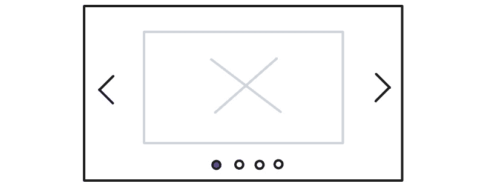

# 第十一章：无渲染组件

无渲染组件是 Svelte 中的一个高级概念，它允许开发者创建不包含任何 HTML 元素的可重用组件。

这种技术在利用 Svelte 在画布或 3D 上下文中渲染时特别有用，其中 Svelte 不需要渲染 HTML 模板。相反，画布和**Web 图形库**（**WebGL**）提供了一个命令式 API 来在画布上生成图形。使用无渲染组件技术，可以设计出允许用户声明性地描述画布的组件，从而使组件能够将其转换为命令式指令。

无渲染组件的另一个用例是创建仅管理状态和行为，而将实际渲染的控制权留给父组件的组件。这在开发组件库时非常有用，你希望用户能够轻松地自定义组件的外观，同时让你控制状态和行为。

在本章中，我们将利用 Svelte 上下文来创建我们的无渲染组件。如果你对 Svelte 上下文不熟悉，请参阅*第八章*，其中我们解释了它的含义。

初始时，我们将探讨无渲染组件的概念，然后构建创建它们的技巧。随着我们开发无渲染组件，我们将分享一些无渲染组件的示例。

在本章结束时，你应该能够使用无渲染组件技术将命令式 API 转换为声明式组件。

本章讨论的主题如下：

+   什么是无渲染组件？

+   使用 Svelte 上下文构建无渲染组件

# 技术要求

你可以在 GitHub 上找到本章使用的代码：[`github.com/PacktPublishing/Real-World-Svelte/tree/main/Chapter11`](https://github.com/PacktPublishing/Real-World-Svelte/tree/main/Chapter11)。

# 什么是无渲染组件？

如其名所示，无渲染组件是一种不渲染任何自身 HTML 元素的组件类型。

你可能会想知道，一个不渲染任何内容的组件有什么用？

好吧，尽管它不支持渲染 HTML，但组件仍然可以做几件有用的事情，包括以下内容：

+   **接受属性、处理它们的值，并在它们的值变化时触发副作用**：即使属性值没有直接在模板中使用，它们仍然是响应式的。你可以在组件中使用属性编写响应式语句，并在属性值变化时运行它们。你可以在下面的示例代码片段中看到这一点：

    ```js
    <script>
      export let title;
      export let description;
      $: document.title = `${title} - ${description}`;
    </script>
    ```

    即使`title`和`description`属性在模板中没有使用，`title`和`description`都会在响应式语句中使用。每当`title`或`description`属性发生变化时，第 4 行的响应式语句将重新运行并更新文档的标题。

    设置文档标题、更新 cookie 值和修改上下文是副作用的好例子。

+   即使在组件中没有元素挂载和销毁，`onMount`和`onDestroy`也会运行。

+   `<slot>` `<slot>`元素允许组件的使用者传递子元素或组件。

    例如，在下面的`Parent`组件中，我们渲染了一个`default`槽：

    ```js
    <!-- Parent.svelte -->
    <slot />
    ```

    然后，`Parent`组件的使用者可以在`Parent`组件下传递子元素或组件：

    ```js
    <script>
      import Parent from './Parent.svelte';
    </script>
    <Parent>
      <Child /> <!-- example of child components -->
      <div /> <!-- example of child elements -->
    </Parent>
    ```

    `Parent`组件可以通过两种途径向子组件或元素传递数据——设置上下文数据和设置槽属性。

    你可以在*第四章*中了解更多关于设置槽属性的信息。

+   使用`getContext()`来检索由其父组件设置的上下文值。根据父组件提供的上下文值类型，我们可以使用上下文值与父组件通信或通知它子组件的存在。

    在本章后面的*编写声明式画布组件*部分，你将看到一个此类技术的示例。

在接下来的章节中，我们将通过创建仅执行前面列表中列出的操作，而不渲染任何 HTML 元素的组件来挑战自己。

在本章中，我们将探讨无状态组件的两个用例，即把可重复使用的无状态组件和声明性描述转换为命令性指令。让我们深入了解一下。

# 探索可重复使用的无状态组件

无状态组件的第一个用例是创建仅关注组件逻辑的组件。这些组件不是你典型的按钮或文本输入等组件。相反，考虑一下具有稍微复杂逻辑的组件，例如轮播、标签页或下拉菜单。尽管轮播组件的逻辑相对标准，但其外观可以根据其使用位置和方式而有很大差异。

那么，我们如何创建一个可重复使用的轮播组件，使其根据使用位置的不同而具有不同的外观？

一种解决方案是创建一个仅包含轮播逻辑的轮播组件，不包含任何特定的样式或 HTML 结构。然后，组件的消费者可以通过传递自己的样式和 HTML 结构来决定轮播组件的外观。这提供了更大的灵活性和定制性，使组件在不同环境中更具通用性和可重复使用性。

例如，轮播组件可以接受如`items`这样的属性，这将确定轮播中的项目列表。轮播组件可以渲染一个`slot`元素，该元素接受如`currentIndex`和`setIndex`这样的 slot 属性，这将代表当前活动项目的索引和设置索引的函数。这允许轮播组件管理轮播项目循环逻辑，同时让轮播组件的消费者决定实际的轮播样式和结构。

通过将轮播逻辑与特定的样式和结构分离，我们可以创建一个更模块化和可重用的组件，可以在各种环境中使用，而无需反复重写相同的逻辑。这就是无渲染组件的力量——它们允许我们创建专注于核心功能的组件，而不受任何特定渲染或样式要求的限制。

当然，在我们继续之前，明确何时不使用无渲染组件来创建轮播是很重要的。如果您需要一个包含设计和样式的完整功能的轮播组件，那么无渲染组件可能不适合您的需求，因为其主要目的是处理轮播的逻辑和行为，而不规定其外观。

最终，是否为轮播创建无渲染组件取决于您的具体需求和目标。在决定最佳方法之前，请考虑您的项目需求和设计偏好。

在下一节中，我将逐步向您展示如何构建一个无渲染的轮播组件。

## 示例 - 构建一个无渲染的轮播组件

轮播组件是一个 UI 组件，以循环的方式显示一组项目。它允许用户以幻灯片式的格式查看一系列项目。轮播组件通常在电子商务平台、新闻门户和社交媒体平台上找到。



图 11.1：轮播组件的示例

我们将创建一个无渲染的轮播组件，该组件通过名为`items`的属性接受一个项目列表。轮播组件将渲染一个`slot`元素，以允许自定义其外观。

`slot`元素将接受一些 slot 属性：

+   `currentIndex`：这代表轮播中当前显示项目的索引。

+   `currentItem`：这代表轮播中当前显示的项目。

+   `setCurrentIndex`：这是一个可以用来更新轮播当前索引的函数。它可以用来实现自定义导航控制。

+   `next`和`prev`：这些`slot`属性是函数，可以用来导航到轮播中的下一个或上一个项目。它们可以用来实现自定义导航控制或响应用户输入，如点击或滑动。

这些`slot`属性允许消费者决定如何使用它们来构建自己的轮播 UI。

为了确定轮播组件适当的`slot`属性，我们考虑了用户构建自己的轮播 UI 所需的基本状态和功能。在这种情况下，关键状态是`currentIndex`和`currentItem`，而与轮播 UI 交互所需的必要函数包括`setCurrentIndex`、`next`和`prev`，这些对于实现自定义导航控制非常有帮助。

轮播 UI 的一个例子是显示当前项目并具有导航前后按钮的轮播：

```js
<Carousel {items} let:currentItem let:next let:prev>
  <button on:click={prev}>{'<'}</button>
  
  <button on:click={next}>{'>'}</button>
</Carousel>
```

在前面的代码片段中，我们使用`currentItem`、`next`和`prev` slot 属性构建了一个简单的轮播 UI。我们决定如何使用`slot`属性，并控制 HTML 元素的布局和样式。

轮播 UI 的另一个例子是在其底部显示项目编号列表，使用户能够通过点击其编号快速跳转到所选项目：

```js
<Carousel {items} let:currentItem let:setCurrentIndex>
  
  {#each items as _, index}
    <button on:click={() => setCurrentIndex(index)}>
      {index}
    </button>
  {/each}
</Carousel>
```

在前面的代码中，我使用了 Svelte 的`{#each}`块来创建一个按钮列表，每个按钮都有一个不同的索引编号。每个按钮都有一个点击事件监听器，将轮播的当前索引设置为按钮的索引编号。当你点击按钮时，轮播将跳转到按钮指定的索引位置的项目。

第二个轮播 UI 与第一个轮播 UI 不同，你可以创建并设计一个完全不同的轮播 UI。你可以看到轮播 UI 的外观完全取决于用户。无渲染轮播组件专注于轮播逻辑，并允许用户决定 UI 结构和样式。

不再拖延，让我们探索如何编写轮播组件。

## 编写无渲染轮播组件

在前面的章节中，我们决定了我们的`Carousel`组件的属性`items`，并决定它应该有一个默认的`<slot>`。

基于这些信息，让我们创建我们的`Carousel`组件的结构：

```js
<script>
  export let items;
</script>
<slot>
```

在前面的代码片段中，`<slot>`元素将是我们在`Carousel`组件中拥有的唯一元素。这个`<slot>`元素是必需的；否则，如果没有`<slot>`元素，在`Carousel`组件内部指示的以下代码片段中的子元素将被忽略并丢弃：

```js
<Carousel>
  <!-- content over here will be ignored if the Carousel don't have a <slot> element -->
</Carousel>
```

在`<slot>`元素中，我们定义以下`slot`属性 - `currentIndex`、`currentItem`、`setCurrentIndex`、`prev`和`next`：

```js
<slot {currentIndex} {currentItem} {setCurrentIndex} {prev} {next} />
```

然而，这些`slot`属性在我们的`Carousel`组件中尚未定义，所以让我们来定义它们。

我们在组件开始时将`currentIndex`初始化为`0`：

```js
let currentIndex = 0;
```

`setCurrentIndex`用于将`currentIndex`更新为传入的值：

```js
const setCurrentIndex = (value) => { currentIndex = value; };
```

`currentItem`将是`items`数组中`currentIndex`索引位置的项目。在这里，我将使用响应式语句，这样每当`items`数组或`currentIndex`发生变化时，我们都会有新的`currentItem` slot 属性：

```js
$: currentItem = items[currentIndex];
```

最后，`prev`和`next`函数将根据其当前值设置`currentIndex`：

```js
const prev = () => setCurrentIndex((currentIndex - 1 + items.length) % items.length);
const next = () => setCurrentIndex((currentIndex + 1) % items.length);
```

在前面的代码片段中，我使用了`% items.length`，这样索引总是位于`items`数组长度的范围内。这样，我们确保在到达数组末尾后，轮播图可以回到`items`数组的开头，为用户创建一个无缝循环效果。

就这样。如果你将所有前面的代码片段添加到`Carousel`组件中，你将拥有一个可工作的无状态组件。完整的代码可在 GitHub 上找到：[`github.com/PacktPublishing/Real-World-Svelte/tree/main/Chapter11/01-carousel`](https://github.com/PacktPublishing/Real-World-Svelte/tree/main/Chapter11/01-carousel)。

创建一个无状态组件并不难；创建一个无状态`Carousel`组件并不需要我们花费太多时间。关键是要弄清楚我们无状态组件的属性，然后确定所需的`slot`属性，最后创建一个带有`slot`属性的默认`<slot>`元素。

在我们继续之前，让我们进行一个练习，自己创建一个可重用的无状态组件。

## 练习 1 - 创建一个无状态自动完成组件

自动完成组件是一个带有自动建议下拉菜单的输入框，当用户在输入框中输入时，会显示匹配选项的列表。它帮助用户快速、轻松地从大量选择中找到并选择一个选项。自动完成组件通常用于搜索栏、表单和其他需要用户快速、准确输入数据的区域。

在这个练习中，我们将创建一个无状态自动完成组件。

自动完成组件仅接受一个属性，即一个`search`函数，该函数接受一个搜索值并返回`Promise`，该`Promise`解析为一个字符串结果数组。

那么，我们的无状态`Autocomplete`组件会提供哪些插槽属性呢？

我们需要为我们的自动完成组件设置三个状态：

+   `value`：表示输入框中的当前值

+   `searching`：一个布尔值，表示自动完成当前是否正在搜索结果

+   `suggestions`：从`search`函数返回的自动完成结果数组

为了让用户与`Autocomplete`组件交互，我们需要两个函数：

+   `setValue`：用于更新输入框的值

+   `selectSuggestion`：用于选择建议并将其应用到输入框

因此，前面的三个状态和两个函数将成为我们的`Autocomplete`组件的插槽属性。

这里是`Autocomplete`组件的一个使用示例：

```js
<Autocomplete {search} let:value let:setValue let:searching let:suggestions let:selectSuggestion>
  <input {value} on:input={event => setValue(event.currentTarget.value)}>
  {#if searching}Searching...{/if}
  {#if suggestions}
    <ul>
      {#each suggestions as suggestion}
        <li on:click={() => selectSuggestion(suggestion)}>{suggestion}</li>
      {/each}
    </ul>
  {/if}
</Autocomplete>
```

在前面的代码片段中，我们使用`Autocomplete`组件来渲染一个自动完成文本框，其中包含一个`<input>`元素和一个`<ul>`元素在默认插槽中。

`<input>`元素使用`value`和`setValue`插槽属性来访问和修改由`Autocomplete`组件持有的`value`。

`<ul>` 元素使用 `suggestions` 插槽属性来展示 `Autocomplete` 组件提供的建议列表，而 `selectSuggestion` 插槽属性用于 `<li>` 元素的 `click` 事件处理器中，以选择选定的建议并将其应用到文本框中。

一个示例解决方案可以在[`github.com/PacktPublishing/Real-World-Svelte/tree/main/Chapter11/02-autocomplete`](https://github.com/PacktPublishing/Real-World-Svelte/tree/main/Chapter11/02-autocomplete)找到。

现在，让我们看看无渲染组件的第二个用例。

# 将声明性描述转换为命令式指令

无渲染组件的第二个用例涉及允许用户以声明式方式描述他们的需求，然后将它们转换为命令式指令。

在处理画布或 WebGL 时，这是一个很好的用例示例。

例如，在画布中，要创建一个带有绿色边框的红色矩形，你需要使用命令式 API 来创建和样式化矩形：

```js
ctx.fillStyle = 'red';
ctx.strokeStyle = 'green';
ctx.rect(10, 10, 100, 100);
ctx.stroke();
ctx.fill();
```

逐步指导画布上下文设置 `fillStyle` 和 `strokeStyle`，然后根据设置的填充颜色和描边颜色绘制矩形。

当以命令式方式与画布交互时，代码关注的是如何做事情，而不是要做什么。这可能导致难以阅读和维护的代码，其中包含大量低级细节，可能会使其难以看到整体情况。

相反，如果你以声明式编写代码，你描述的是你想要发生的事情，而不是它应该如何发生。这使得代码更具表现力，更容易阅读，同时也更灵活和可重用。

继续以红色矩形的例子，我们可以创建一个 Svelte 组件来处理在画布上绘制矩形。我们不需要手动编写绘制矩形的指令，而可以通过组件简单地描述我们希望在画布上看到的样子。然后，组件会为我们处理在画布上渲染矩形。

这里是一个通过 Svelte 组件描述相同矩形的代码示例：

```js
<script>
  let x = 10, y = 10, height = 100, width = 100;
</script>
<Canvas>
  <Rectangle
    fill="red" stroke="green"
    {x} {y} {height} {width}
  />
</Canvas>
```

在前面的代码片段中，我们看到一个嵌套在 `Canvas` 组件中的 `Rectangle` 组件。`Rectangle` 组件指定了其填充、描边、*x* 位置、*y* 位置、宽度和高度。

下图说明了前面代码中的 `Rectangle` 组件如何渲染一个带有绿色边框的红色正方形。


图 11.2：一个带有绿色边框的红色正方形

尽管代码中看不到绘制在画布上的显式指令，但我们可以根据 `Rectangle` 组件可视化一个矩形在画布上被绘制。这个矩形，宽度和高度各为 100 像素，距离左边和上边各 10 像素，填充红色，边框为绿色。

通过创建一个处理低级画布指令的无渲染组件，我们可以将绘制矩形的逻辑与它应该如何渲染的具体细节分开。这允许我们在画布上以更多样化的方式显示矩形，同时也使得代码的维护更加容易。

此外，通过允许用户以声明式的方式描述他们的需求，我们创建了一个更直观、用户友好的界面来与画布和其他低级技术一起工作。这可能导致开发时间更快，开发体验更加愉快。

让我给你举一个例子，说明以声明式描述画布比强制性地指令它要快得多。如果我想动画化矩形的尺寸，而不是手动使用命令式 API 编码动画，我只需简单地动画化 `height` 和 `width` 变量的值，就像以下代码片段所示：

```js
<script>
  let x = 10, y = 10, height = 100, width = 100;
  setInterval(() => {
    height += 10;
    width += 10;
  }, 100);
</script>
<Canvas>
  <Rectangle
    fill="red" stroke="green"
    {x} {y} {height} {width}
  />
</Canvas>
```

虽然使用 `setInterval` 可能不是创建动画的最佳方式，但前面的代码片段试图展示改变画布上矩形的高度和宽度是多么容易。

在前面的代码片段中，我们每隔一段时间更新 `height` 和 `width`。我们将 `height` 和 `width` 传递给 `Rectangle` 组件。正如你所见，画布上矩形的宽度和高度每 100 毫秒增加 10 px。

相反，如果我们强制性地进行动画处理，我们必须在每个间隔清除画布并重新绘制一个具有新高度和宽度的矩形。这些实现细节现在在声明式组件中被抽象出来，使得推理动画和未来修改它变得更加容易。

总体来说，使用无渲染组件来处理低级命令式任务可以极大地提高我们代码的可读性、可维护性和灵活性，同时使其更加易于访问和用户友好。

那么，我们如何实现前面代码片段中显示的 `Canvas` 和 `Rectangle` 组件呢？让我们来看看。

## 编写声明式 Canvas 组件

我们将从 `Canvas` 组件开始。

与前一小节中 `Carousel` 组件的组件结构类似，`Canvas` 组件将渲染一个 `<slot>` 元素来插入所有子组件。

然而，不同之处在于它还会渲染一个 `<canvas>` 元素，这是我们将会与之交互并在其上绘制的元素：

```js
<script>
  import { onMount } from 'svelte';
  let canvas, ctx;
  onMount(() => {
    ctx = canvas.getContext('2d');
  });
</script>
<canvas bind:this={canvas} />
<slot />
```

在前面的代码片段中，我们将 `<canvas>` 元素的引用绑定到名为 `canvas` 的变量。在 `<canvas>` 元素挂载到 DOM 之后，我们获取 `<canvas>` 元素的绘图上下文并将其分配给名为 `ctx` 的变量。

如果你还记得之前的代码示例，我们将 `<Rectangle>` 组件放置在 `<Canvas>` 组件内部，以便在画布上绘制矩形。`<Rectangle>` 组件不会从 `<Canvas>` 组件接收任何数据或插槽属性。那么，`<Rectangle>` 组件是如何通知 `<Canvas>` 组件它是 `<Canvas>` 组件的子组件的呢？`<Canvas>` 组件是如何与 `<Rectangle>` 组件通信，以知道要绘制什么以及如何在它的 `<canvas>` 元素上绘制呢？

如果你还记得 *第八章*，我们介绍了 Svelte 上下文作为一种设置数据并将其提供给子组件的机制。Svelte 上下文允许父组件在无需显式作为属性传递的情况下，与子组件共享数据和函数。

我们可以使用 Svelte 上下文在 `<Canvas>` 和 `<Rectangle>` 组件之间进行通信。

`<Canvas>` 组件可以使用绘图上下文 `ctx` 设置上下文：

```js
<script>
  import { setContext } from 'svelte';
  // setting the context with the drawing context
  setContext('canvas', () => ctx);
</script>
```

当 `<Rectangle>` 组件作为 `<Canvas>` 组件的子组件渲染时，它可以访问 `<Canvas>` 组件设置的上下文并检索 `ctx` 变量。在 `onMount` 中，`<Rectangle>` 获取 `<canvas>` 元素的绘图上下文并在画布上绘制矩形：

```js
<script>
  import { getContext, onMount } from 'svelte';
  const getCtx = getContext('canvas');
  onMount(() => {
    const ctx = getCtxt();
    // draws a rectangle onto the canvas
    ctx.fillRect(...);
  });
</script>
```

我们传递一个返回 `ctx` 的函数而不是直接在上下文中传递 `ctx` 的原因是因为 `ctx` 值仅在 `<canvas>` 元素挂载到 DOM 之后在 `onMount` 中可用，而 `setContext` 必须在组件初始化期间调用，即在 `onMount` 之前。在 `<Rectangle>` 组件中，你应该只在 `onMount` 中调用 `getCtx()` 来检索 `ctx` 的最新值。

通过利用 Svelte 上下文，`<Canvas>` 和 `<Rectangle>` 组件可以保持清晰且高效的通信通道。`<Canvas>` 组件创建画布并提供绘图上下文，而 `<Rectangle>` 组件访问画布并执行绘图任务。

要完成 `<Rectangle>` 组件，我们需要在 `x` 或 `y` 位置或宽度和高度尺寸发生变化时重新绘制矩形。为此，我们将使用响应式语句：

```js
<script>
  // ...
  export let x, y, width, height;
  $: draw(x, y, width, height);
  function draw(x, y, width, height) {
    const ctx = getCtx();
    ctx.fillRect(x, y, width, height);
  }
</script>
```

在前面的响应式语句中，每当 `x`、`y`、`width` 或 `height` 值发生变化时，`draw` 函数会重新执行。通过使用这种方法，`<Rectangle>` 组件可以高效地根据位置或尺寸的变化更新其外观，确保渲染的矩形始终反映最新的状态。

然而，你可能注意到它没有按预期工作。你会看到新矩形被绘制在旧矩形之上。这是因为我们需要在绘制另一个矩形之前清除画布。我们不能用我们的 `draw` 函数来做这件事，因为如果有多个 `<Rectangle>` 组件，这会导致不希望的结果。每个组件都会在绘制自己的矩形之前清除画布，结果只有最后一个 `<Rectangle>` 组件是可见的。

为了解决这个问题，我们需要 `<Canvas>` 组件在重新绘制所有子矩形之前清除画布。这个函数可以在任何子矩形组件请求更新时调用。

让我们在 `<Canvas>` 组件中定义一个 `redrawCanvas` 函数来重新绘制画布。在 `redrawCanvas` 函数中，我们首先通过 `ctx.clearRect()` 清除画布。以下是 `<Canvas>` 组件的更新代码：

```js
<script>
  // ...
  function redrawCanvas() {
    ctx.clearRect(0, 0, ctx.canvas.width, ctx.canvas.height);
    // TODO: here we need to redraw all the rectangles
  }
  // Provide both the drawing context and the clearCanvas function to child components
  setContext('canvas', { getCtx: () => ctx, redrawCanvas });
</script>
```

在 `redrawCanvas` 函数中，我们希望在清除画布后重新绘制所有矩形。但我们如何做到这一点？一个想法是，而不是为所有子组件提供绘图上下文 `ctx` 并让组件决定何时以及如何绘制到画布上，我们可以提供一个函数让组件注册它们的 `draw` 函数。这样，`<Canvas>` 组件可以在需要重新绘制画布时调用这些 `draw` 函数。

在 `<Canvas>` 组件中，我们将 `getCtx` 函数改为 `registerDrawFunction`：

```js
<script>
  const drawFunctions = new Set();
  function registerDrawFunction(drawFn) {
    drawFunctions.add(drawFn);
    return () => {
      drawFunctions.delete(drawFn);
    };
  }
  function redrawCanvas() {
    ctx.clearRect(0, 0, ctx.canvas.width, ctx.canvas.height);
    // Redraw all the rectangles
    for (const drawFn of drawFunctions) {
      drawFn(ctx);
    }
  }
  setContext('canvas', { registerDrawFunction, redrawCanvas });
</script>
```

在前面的 `redrawCanvas` 函数中，我们遍历从子组件注册的 `drawFunctions` 并使用绘图上下文 `ctx` 调用它们。这样，我们不需要通过 Svelte 上下文提供 `ctx`，但子组件可以在它们的 `draw` 函数中获取最新的 `ctx`。

最后，让我们在 `<Rectangle>` 组件中注册我们的 `draw` 函数：

```js
<script>
  // ...
  const { registerDrawFunction, redrawCanvas } = getContext('canvas');
  function draw(ctx) {
    ctx.fillRect(x, y, width, height);
  }
  onMount(() => {
    // register the draw function
    const unregister = registerDrawFunction(draw);
    return () => {
      unregister();
      redrawCanvas();
    };
  });
  // call redrawCanvas when x, y, height, width changes
  $: x, y, height, width, redrawCanvas();
</script>
```

在 `onMount` 回调中，我们通过 Svelte 上下文注册 `<Rectangle>` 组件的 `draw` 函数。当组件被销毁并从 DOM 中移除时，`<Rectangle>` 组件会取消注册自己并调用 `redrawCanvas` 函数。这确保了 `<Canvas>` 组件被更新，并且画布上的移除矩形被清除。

此外，通过在 `x`、`y`、`height` 或 `width` 发生变化时调用 `redrawCanvas` 函数，`<Rectangle>` 组件确保其位置和尺寸在画布上得到准确反映。这样，`<Canvas>` 组件始终保持其子组件的最新视觉表示。

现在，`<Canvas>` 组件完全控制整个画布的重新绘制，`<Rectangle>` 组件可以将其 `draw` 函数注册到 `<Canvas>` 组件上。这种方法确保在重新绘制之前总是清除画布，并允许多个 `<Rectangle>` 组件共存而不会相互干扰。

我们现在有了功能性的 `<Canvas>` 和 `<Rectangle>` 组件。在整个创建这些组件的过程中，我们将命令式画布操作转换为更易于管理的声明式组件。

为了促进父组件和子组件之间的通信，我们使用了 Svelte 上下文作为通信渠道。正如前述代码片段所示，父 `<Canvas>` 组件维护一个从其子组件继承的 `draw` 函数列表，使其能够按需调用它们。这种通用模式可以应用于需要跟踪和调用其子组件方法的父组件。

虽然我们编写的代码是可行的，但它可能还需要一些改进。要访问完整的可工作代码，包括任何额外的功能或优化，以便实现一个完善和全面的实现，请访问 GitHub 仓库：[`github.com/PacktPublishing/Real-World-Svelte/tree/main/Chapter11/03-canvas`](https://github.com/PacktPublishing/Real-World-Svelte/tree/main/Chapter11/03-canvas%0D)。

## 练习 2 – 扩展形状组件

在这个练习中，我们挑战您创建额外的形状组件，以扩展您现有的 `<Canvas>` 组件的功能。

您可以创建的形状示例包括以下内容：

+   一个 `<Circle>` 组件，它接受 `x`、`y`、`radius` 和 `color` 作为属性。该组件应在指定的坐标和指定的半径和颜色上绘制画布上的圆。

+   一个 `<Line>` 组件，它接受 `x1`、`y1`、`x2`、`y2` 和 `color` 作为属性。该组件应在指定的颜色下在两个坐标集之间绘制画布上的线。

+   其他形状组件，如 `<Ellipse>` 和 `<Triangle>`。

您可能需要参考 Canvas API 文档来学习如何绘制不同的形状。

您可以在 [`github.com/PacktPublishing/Real-World-Svelte/tree/main/Chapter11/03-canvas`](https://github.com/PacktPublishing/Real-World-Svelte/tree/main/Chapter11/03-canvas) 找到 `<Circle>` 和 `<Line>` 组件的代码。

# 摘要

在本章中，我们深入探讨了 Svelte 中无渲染组件的概念，并探讨了它们的各种用例。理解无渲染组件为您提供了创建可重用组件的新工具集。无渲染组件通过关注核心逻辑、状态和行为来强调可重用性，同时将视觉呈现留作灵活定制。

通过使用插槽属性，我们演示了如何构建一个可重用且允许用户控制其外观的无渲染组件，同时保持组件逻辑并将命令式操作转换为声明式 Svelte 组件。

我们还展示了将命令式操作转换为声明式 Svelte 组件的实际示例。我们演示了如何创建 `<Canvas>` 和 `<Rectangle>` 组件，这些组件可以在画布上绘制矩形，其大小可以动态变化。

在下一章中，我们将探讨如何将 Svelte 存储和动画结合，以创建流畅、动态的应用程序。

无状态组件
