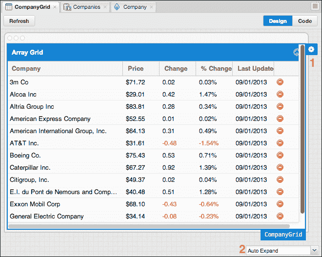

# 第一章. 介绍 Sencha Architect

Sencha Architect 是一款软件工具，使我们能够使用 Sencha Touch 和 Ext JS 框架。它是一个 **所见即所得**（**WYSIWYG**） IDE，提供使用可视化编辑器和内置代码编辑器实现应用程序的能力。它还使用拖放可视化界面进行快速应用程序开发，针对桌面（Ext JS）和移动设备（Sencha Touch）。在本章中，我们将介绍 Sencha Architect 的基础知识。我们将涵盖以下内容：

+   介绍 Sencha Architect 及其界面功能

+   项目基础知识

+   检查器

+   配置面板

+   工具箱

+   设计画布

# 开始使用

Sencha Architect 是 Sencha Touch 和 Ext JS 框架库的优秀学习工具。此外，Sencha Architect 也是应用程序快速原型设计和快速无代码启动以及完整应用程序开发的优秀工具。Sencha Architect 在两个层面上工作：作为原型工具以及代码生成工具。特别是对于复杂的 UI，它节省了通常花费在调整布局和确保嵌套元素良好协作上的数小时开发时间。最好的是（并且与大多数原型工具不同），它生成干净、面向对象的代码，看起来就像您自己编写的代码；并且它完全使用 Ext JS 编写。

Sencha Architect 于 2010 年发布。在 2010 年，它被称为 Ext Designer，并且仅支持 Ext JS 应用程序（仅支持 Ext JS 3）。然后，当 Sencha 发布 Ext JS 4.2 时，Ext Designer 获得了升级，并被称为 Ext Designer 1.2，支持开发 Ext JS 3 和 Ext JS 4 应用程序。2012 年 1 月，Sencha 宣布了 Sencha Designer 2 测试版，这是从 Ext Designer 的另一个升级，但现在，该工具也支持 Sencha Touch 2 应用程序开发。2012 年 4 月，Sencha 决定将工具重命名为 Sencha Architect 2，这是一个用于使用 Ext JS 4 开发桌面应用程序（它失去了对 Ext JS 3 的支持）和使用 Sencha Touch 2 开发移动应用程序的完整工具。

因此，这就是为什么没有 Sencha Architect 1 的原因，因为它在成为 Sencha Architect 之前被称为 Ext Designer！当前最新版本是 2.2.2（本书编写时）。

在我们开始动手之前，有一些事情您需要了解：

+   熟悉 HTML 编码

+   基本的 CSS（层叠样式表）背景

+   强大的 JavaScript 背景，以及对 **JSON**（**JavaScript 对象表示法**）的基本理解

+   对 Ext JS 和 Sencha Touch 的基本了解

我们将探索 Sencha Architect 的许多功能，并创建一些示例。但是，您也可以通过以下链接查看示例：

+   Ext JS 示例在 [`github.com/loiane/sencha-extjs4-examples-architect`](https://github.com/loiane/sencha-extjs4-examples-architect)

+   Sencha Touch 示例在 [`github.com/loiane/sencha-touch2-examples-architect`](https://github.com/loiane/sencha-touch2-examples-architect)

+   Sencha 示例在 [`github.com/SenchaArchitect`](https://github.com/SenchaArchitect)

# 展示 Sencha Architect

在我们开始之前，您需要在您的计算机上安装 Sencha Architect。由于 Sencha Architect 是一款付费工具，您可以在 [`www.sencha.com/products/architect/download/`](http://www.sencha.com/products/architect/download/) 下载 30 天试用版，或者您可以在 [`www.sencha.com/store/architect/`](http://www.sencha.com/store/architect/) 购买许可证。Sencha Architect 支持 Windows（`.exe`）、Linux（`.run`）和 Mac OS（`.dmg`）用户。安装过程非常简单。您只需运行可执行文件，并按照向导步骤操作（也需要管理员权限）。

安装完成后，点击 Sencha Architect 应用程序以运行它：

## 首次运行 Sencha Architect

当您首次执行 Sencha Architect 时，您可以选择输入用户名和密码（与您在 Sencha 论坛上用于 30 天试用版相同的用户名和密码）或使用在您在 Sencha 网站上完成购买后发送到您的电子邮件的许可证密钥激活软件。接下来，将显示**欢迎使用 Sencha Architect**屏幕，如图所示：

在屏幕的左侧，我们可以找到指向其文档、**变更日志**和**Sencha Architect 论坛**的链接。在**打开最近的项目**下，我们可以找到我们最近工作的四个项目的列表，以及一个打开现有项目的链接。在现有项目列表下方，我们可以选择一个可用的框架来创建一个新的空白项目。

一旦我们打开 Sencha Architect，屏幕将显示如下截图：

如前一个截图所示，Sencha Architect 的界面由七个主要项目组成：

+   应用程序工具栏

+   软件内集成的在线文档

+   项目检查器

+   配置面板

+   由设计编辑器和代码编辑器组成的画布

+   工具箱

+   日志

让我们深入了解 Sencha Architect 界面中的每个主要项目。

## 工具栏

工具栏包含对 Sencha Architect 最常用功能的快捷方式，例如创建新项目、打开现有项目、保存项目、构建、发布（部署）、预览（自动打开浏览器以预览应用程序）和编辑项目设置。

您也可以隐藏这个工具栏。点击**设置**，转到**应用程序**选项卡，并取消选中**显示工具栏**复选框，如图所示：

在**应用程序**设置中，还可以启用或禁用选项卡（在可视化/代码编辑器中打开的类）；将**项目** **检查器**更改为**左侧**或**右侧**位置（我们将在项目检查器主题中讨论这一点），以及更改 Sencha Architect 的**代码编辑器**主题、使用**代码编辑器字体大小**调整代码字体大小，并在代码编辑器中启用**JSHint**验证。

要再次显示工具栏，请转到应用程序菜单，**编辑** | **项目设置**，并再次勾选**显示工具栏**选项。

## 工具箱

在工具箱中，您可以找到在实现应用程序时可以使用的所有原生组件，包括在**模型**、**视图**、**控制器**和**存储**中使用的组件。它们根据其功能区域（**视图**、**表单**、**数据**、**图表**等）组织。您也可以通过选择**所有内容**来查看所有可用的组件。如果您需要查找特定的组件，您还可以使用搜索字段来过滤组件。

工具箱组件将根据您是在进行 Ext JS 还是 Sencha Touch 项目的工作而设置不同的变化，如以下截图所示：

默认情况下，工具箱位于 Sencha Architect 的左侧，右侧是项目检查器和配置面板。可以将工具箱切换到右侧，这样左侧将会有项目检查器（如果我们处理的是大型项目，这可能很有趣），而工具箱和配置面板将位于右侧。要这样做，请返回到项目**设置**并选择您喜欢的侧边。

## 配置面板

在整本书中，您会发现使用 Sencha Architect，您需要自己编写的代码量非常少。基本上，我们只需编写函数或全新的类。其余的都将通过使用 Sencha Architect 的功能来完成。因此，配置面板非常重要。配置面板的主要用途是我们可以查看我们创建的类的属性值，以便我们可以设置一个值或更改现有的值。

以下截图显示了配置面板及其一些功能：

在配置面板中，有一些东西可以帮助我们提高开发任务。例如，根据你在项目检查器中选择的类，配置面板显示所选类或组件的配置属性。这非常有帮助，因为我们可以访问该类的所有属性，我们不需要总是参考文档来查看我们正在寻找的属性是否在那里。此外，Sencha Architect 只显示 Sencha 推荐的最佳实践属性；例如，对于 `Form` 类（配置 `buttons` 在 Sencha Architect 中不会显示），使用 `dockedItems` 代替 `buttons`。

如果你没有心情滚动查看特定类的所有配置，你可以轻松地使用过滤器来搜索特定的配置（*3*）。通过点击锁形图标（*4*），你可以锁定过滤器，当你从项目检查器中选择另一个类时，过滤器将自动应用。如果你想要移除过滤器，只需关闭面板即可。

看到那个问号图标（2）了吗？当你将鼠标悬停在问号图标上时，你可以阅读类的简要描述，如果我们想了解更多关于它的信息，我们可以点击描述框中的链接并进入文档。同样，当我们将鼠标悬停在类的配置上时，问号图标也会显示配置的简要描述，我们也可以访问在线文档来了解更多关于它的信息。

我们还可以在**配置**标签的旁边看到两个图标（*1*）。第一个（在截图上已选中），将显示所选类的常用配置。第二个将显示高级配置，例如 `alternateClassName`（用于与旧版本保持兼容）。通常，我们只会使用常用配置，但如果你需要使用一些高级配置，Sencha Architect 也提供了这个选项。

现在，假设你想要使用配置面板上未列出的配置。我们能添加它吗？答案是肯定的。我们可以添加配置面板上不存在的配置。要这样做，请转到过滤器，输入配置的名称，然后点击**添加**按钮（*5*）。这个新的配置将列在**（自定义属性）**下。通过点击**…**，我们可以选择新配置的类型（*6*—**数组**，**布尔值**，**数字**，**对象**或**字符串**），然后根据所选类型设置其值。

Sencha Architect 的另一个不错特性：因为这个工具根据 Sencha 最佳实践提供和生成代码，当您尝试设置特定属性的值时，Sencha Architect 会允许您根据属性类型设置值。例如，如果您需要为网格或列表设置**store**属性，Sencha Architect 会列出当前已创建的当前存储（*7*），因此您可以从列表中选择一个。而且，如果您更改了**store**的名称，它将在使用该**store**的类中自动更改。这有助于我们在代码上犯更少的错误。根据配置类型，可以使用的一些编辑器有*布尔值*、*数组*、*类*、*字符串*、*模板*或*选项*，如下面的截图所示：

如果配置已被类使用，它将以蓝色显示；（*1*）在之前的截图中。要从此类中移除此属性，我们只需点击**属性**面板。

一些类可以被其他类用作配置。例如，一个`Ext.panel.Grid`类可以有一个或多个`Ext.grid.column.Column`类（或其子类）。我们可以通过点击以下截图显示的箭头图标来从网格的特定列导航到其配置：

## 画布

画布是您可以直观创建应用程序的地方，您还可以编辑其代码。

### 小贴士

您还可以将工具箱组件拖放到设计画布以及项目检查器中，这在设计画布上有很多组件时尤其有用。

画布有两个标签页：**设计**标签页，这是可视化编辑器，或者**代码**编辑器标签页。让我们更深入地了解一下它们。

### 可视化编辑器

可视化编辑器提供了应用程序的视觉表示。在这里，您可以查看应用程序或特定组件的外观，而无需在浏览器上执行应用程序。还有一个**刷新**按钮，如果您进行了更改并希望刷新可视化编辑器以查看其外观，您可以使用它。您还可以在**设计**和**代码**编辑器标签页之间导航。

对于 Ext JS 和 Sencha Touch 项目，可视化编辑器略有不同。以下截图来自一个 Ext JS 项目：

在底部，您可以调整可视化编辑器的大小（*2*）。这可以用来查看应用程序在不同分辨率屏幕上的外观。

此外，还有展开配置（*1*），它可以用来设置布局配置和其他影响组件外观的属性。

在下一张截图中，我们可以看到 Sencha Touch 项目的可视化编辑器：

我们还可以编辑画布大小（*1*），由于 Sencha Touch 是为移动应用程序设计的，我们可以选择不同的设备（**iPhone (320 x 480)**，**iPad (786 x 1023)**，**Nexus S (480 x 800)**，和 **PlayBook/Kindle Fire (600 x…)**）来查看应用程序在不同设备上的外观。我们还可以设置自定义大小。如果我们想查看应用程序在不同位置上的外观，我们可以设置为水平（默认选项）或垂直（*2*）。我们还可以设置画布的缩放（*3*），并且我们还可以要求 Sencha Architect 根据我们电脑屏幕上的可用空间调整画布（*4*）。

### 代码编辑器

切换到**代码**标签，我们可以看到特定组件生成的代码（以下屏幕截图中的*1*）。如果我们尝试直接在代码编辑器中更改特定的属性，我们会注意到除非它是函数，否则这是不可能的。这是因为大部分的配置都将使用配置面板来完成。这可以是一件好事，也可能是一件坏事。这是好事，因为它可以保持代码免受不必要的更改，并按照 Sencha 最佳实践生成代码。然而，它也可能是一个坏处，因为它限制了我们的代码编辑能力；我们需要习惯使用配置面板。总的来说，Sencha Architect 有这种行为是好事。对于习惯自己编写所有代码的开发者来说，这只是习惯这种新编码方式的问题：

在前面的屏幕截图中，在顶部，你可以轻松地浏览你已打开或创建的不同类（*2*），你也可以从当前打开的标签列表中打开特定的标签（*6*）。

### 注意

如果你不想保留你正在工作的类别的标签页，你可以通过回到**设置** | **应用程序**并选择**禁用**对于**持久保存当前项目保存时打开的标签页**选项来轻松地禁用此选项。

我们还可以浏览特定组件的代码（*3*）。我们可以浏览的可用项包括：

+   **生成的类**，它是生成代码的只读版本

+   **生成的 JSON**，它也是类生成的 JSON 代码的只读版本（如果我们使用 `Ext.create` 来实例化它，这是我们传递给类的配置）

+   如果我们覆盖当前类，将使用的覆盖类（*4*——我们将在本书后面的部分了解更多关于覆盖的内容）

+   可编辑的代码项，如事件绑定、控制器操作、函数和模板

Sencha Architect 还允许我们使用导出到磁盘图标（*5*）将代码编辑器上显示的当前代码保存到单独的文件中；也可以将代码复制到剪贴板。

如果我们将鼠标悬停在代码的某些部分（*7*—可编辑的部分，如函数和模板）上，我们会看到会出现一个编辑图标。如果我们点击它，代码将可供编辑，如下面的截图所示：

如果启用了 JSHint 验证（**设置** | **应用程序**以启用或禁用它），我们将在代码中看到任何警告或错误（如前一个截图中的第`20`行上的**缺少分号**）。

Sencha Architect 还提供了**查找**和**替换**功能。通过点击*Ctrl* + *F*（或在 Mac OS 上点击*cmd* + *F*），我们可以在代码中搜索特定的字符串。通过点击*Ctrl* + *H*（或在 Mac OS 上点击*cmd* + *Alt* + *F*），我们可以启用**替换**功能，如前一个截图所示。

尽管 Sencha Architect 为我们生成了大部分代码，但在可编辑的部分，目前还没有自动完成功能（Sencha Architect 2.2），因此我们必须在没有智能感应（或代码补全）的帮助下编写代码。

## 项目检查员

在项目检查员中，我们可以看到我们项目的结构，包括为特定项目创建的所有**控制器**、**存储**、**视图**、**模型**和**资源**。如果我们展开一个类，我们将能够看到其内部组件和函数。对于大型项目，使用**快速打开…**功能可以轻松找到特定的类。通过点击加号图标，我们可以快速创建一个新的**控制器**、**存储**、**模型**、**资源**或全新的**类**：

Sencha Architect 在创建类后也提供了一些选项。例如，假设我们创建了一个视口，但那并不是我们真正需要的；我们需要创建一个面板而不是视口。通过右键单击我们创建的类，我们可以将其转换成其他东西；这样，就无需删除当前类并重新编写所有现有代码。让我们再举一个例子：如果我们需要创建一个网格面板，但我们设置了存储，通过右键单击它，我们可以通过选择**自动列**选项自动生成基于模型或存储的字段的全部列。在存储中，如果我们为代理设置了用于加载数据的 URL，我们可以选择**加载数据**选项并查看服务器发送回的数据。其他选项还包括：**导出到文件…**，我们可以将当前类导出到外部文件，其他开发者可以将其导入到 Sencha Architect；**标记为初始视图**或**取消标记为初始视图**，我们可以设置哪个组件将是应用程序的初始视图；以及**复制**、**删除**或**保存到工具箱**（将组件保存到工具箱以供重用）：

我们将在本书中学习更多关于这些选项的内容。

## 在线文档

通过点击右上角的在线文档图标，Sencha Architect 将在您的默认浏览器中打开其在线文档。在线文档中，我们可以通过其指南了解更多关于 Sencha Architect 的信息：[`docs.sencha.com/architect/2/`](http://docs.sencha.com/architect/2/)。

## 日志

当我们点击日志时，Sencha Architect 将显示一个新窗口，显示最新的消息。这也会清除日志计数：

# 准备环境

在我们进入下一章之前，让我们准备好环境，以便我们可以使用 Sencha Architect 创建我们的第一个项目。

我们需要一个 Web 服务器来执行我们的项目。在这本书中，我们将使用 XAMPP ([`www.apachefriends.org/en/xampp.html`](http://www.apachefriends.org/en/xampp.html)) 作为默认的 Web 服务器。您也可以使用您已经在计算机上安装的任何 Web 服务器（IIS、Apache HTTP 等）。

在以下链接中，如果您还没有安装 XAMPP，您将找到一个简要教程：

+   **Mac OS**: [`www.apachefriends.org/en/xampp-macosx.html`](http://www.apachefriends.org/en/xampp-macosx.html)

+   **Windows**: [`www.apachefriends.org/en/xampp-windows.html`](http://www.apachefriends.org/en/xampp-windows.html)

+   **Linux**: [`www.apachefriends.org/en/xampp-linux.html`](http://www.apachefriends.org/en/xampp-linux.html)

在 XAMPP 的 `htdocs` 目录（或您的 Web 服务器的 `public` 目录）内，创建一个名为 `sencha-architect` 的新文件夹。这是我们将在整本书中保存所有创建的 Sencha Architect 项目的位置。

# 摘要

在本章中，我们了解了 Sencha Architect 的基础知识以及一些界面功能，例如工具栏、工具箱、配置面板、可视化编辑器、代码编辑器、在线文档和项目检查器。由于这是我们第一次接触 Sencha Architect，本章是一个介绍。我们将在整本书中了解更多关于这些内容。

我们还学习了如何准备我们的环境，因此我们可以在下一章开始创建我们的第一个 Ext JS 项目。
