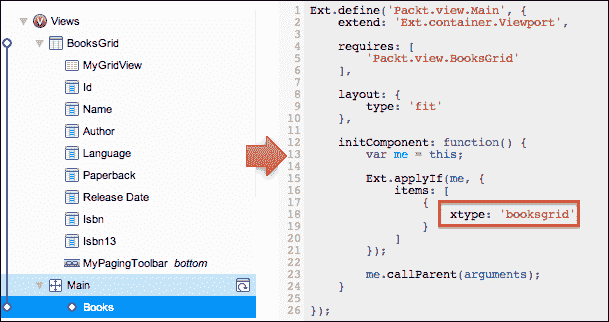

# 第二章 创建 Ext JS 应用

在本章中，我们将通过实现一个使用 Ext JS 的示例应用程序来迈出 Sencha Architect 的第一步，始终突出 Sencha Architect 的功能。我们将涵盖以下内容：

+   创建 Ext JS 项目

+   创建模型、存储、视图和控制器

+   首次执行项目

# 实现 Ext JS 应用

在我们开始实现我们的 Ext JS 应用程序之前，让我们看看本章结束时我们将有什么：

它是一个简单的网格，列出书籍，我们将从数据库中检索这些书籍。

# 创建项目

首先，要创建一个新的 Ext JS 项目，请参考以下截图：

项目创建后，我们将看到带有工具栏、画布、项目检查器、配置面板和工具箱的登录屏幕。我们将立即保存项目。为此，请点击工具箱中的 **保存** 或按 *Ctrl* + *S* (*cmd* + *S* 在 Mac OS 上)。将显示 **保存项目** 屏幕：

我们将项目保存为 `extBooks`，位于 `sencha-architect` 目录下。

现在项目已保存，我们可以开始实现了。我们将遵循以下开发工作流程：首先实现模型，然后是存储、视图和控制器，然后重复此过程，直到项目完成。

## 简单谈谈 MVC

**模型-视图-控制器** (**MVC**) 是一种软件架构模式，它将信息的表示与用户的交互分离。模型表示应用程序数据，视图表示数据的表示输出（表单、网格、图表），控制器调解输入，将其转换为模型或视图的命令。

Ext JS 和 Sencha Touch 使用 **模型-视图-控制器-存储** (**MVCS**) 模式。模型是我们想要在应用程序中操作的数据的表示（数据库中表的表示）。视图包含我们创建的所有组件和屏幕，用于管理模型的信息。由于 Ext JS 是事件驱动的，所有视图在用户与之交互时都会触发事件，控制器将捕获这些事件并执行某些操作，将命令重定向到模型（或存储）或视图。Ext JS 中的存储与在服务器端使用的 **数据访问对象** (**DAO**) 模式非常相似。

为了快速举例，假设我们有一个**WidgetA**，它是一个显示表 A 中所有记录的网格面板。**ModelA**代表这个表。**StoreA**表负责检索信息（从服务器获取的**ModelA**集合）。当用户点击**WidgetA**中的记录时，将打开一个窗口（称为**WidgetB**），显示表 B 的信息（由**ModelB**表示）。当然，**StoreB**将负责从服务器检索**ModelB**集合。在这种情况下，我们将有**ControllerA**来捕获**WidgetA**的点击事件，并执行所有必要的逻辑以显示**WidgetB**并加载所有**ModelB**信息。如果我们尝试将其放入快速参考图中，它将看起来像以下截图：

### 注意

有关 MVC 和 Sencha 应用程序的更多信息，请访问[`docs.sencha.com/extjs/4.2.1/#!/guide/application_architecture`](http://docs.sencha.com/extjs/4.2.1/#!/guide/application_architecture)。

# 配置应用程序

第一步是设置我们将在本章中开发的整个应用程序。在我们开始之前，在项目检查器中，选择**应用程序**选项（以下截图中的*步骤 1*），然后转到配置面板；找到**名称**属性并将其值设置为`Packt`（*步骤 2*）。这是我们的应用程序命名空间，意味着所有类都将命名为`Packt.` `+` `package` `+` `className`。许多编程语言使用命名空间来避免与全局命名空间中的其他对象或变量发生冲突。如果我们打开代码编辑器，我们将看到的代码与*步骤 3*相同：

所有这些配置都将应用于`app.js`文件，因为**应用程序**选项代表`app.js`文件。

# 创建模型

按照我们的开发工作流程，我们将从模型开始。在项目检查器的顶部，点击**+**图标，并选择**模型**（*步骤 1*）：

一旦创建了模型，选择它，转到配置面板，并将类名（**userClassName**）设置为**Book**（*步骤 2*）。然后，仍然在配置面板中，找到**字段**选项，点击其**+**图标，并添加第一个字段，我们将命名为`id`。继续添加以下字段：**id**、**name**、**author**、**language**、**paperback**、**releaseDate**、**isbn**和**isbn13**，如图所示（*步骤 4*）：

如果我们回到项目检查器，书籍模型应该看起来像*步骤 5*。如果我们查看画布，设计模式下将不会显示任何内容，但如果我们查看代码编辑器，`Packt.model.Book`类将被定义。如果我们尝试编辑其代码，将无法进行，因为我们有一个简单的模型，其中没有函数或方法（由我们自己创建）。

保存项目并查看 Sencha Architect 迄今为止创建的文件，我们会看到它已经在`app/model`目录中创建了一个名为`Book.js`的文件。

# 创建存储

下一步是创建一个存储。我们的数据将来自服务器（Java、Ruby、PHP、.NET 等），我们将使用 Ajax 来加载它。因此，我们需要创建一个使用 Ajax 代理来读取以**JavaScript 对象表示法**（**JSON**）格式从服务器发送的信息的存储。因此，我们需要回到项目检查器，再次点击**+**图标，选择**Store**和**Json Store**，如下面的截图所示：

### 注意

有关 Ajax 代理和 Json Store 的更多信息，请访问[`docs.sencha.com/extjs/4.2.1/#!/api/Ext.data.proxy.Ajax`](http://docs.sencha.com/extjs/4.2.1/#!/api/Ext.data.proxy.Ajax)。

在创建存储后，我们会看到一个红色的感叹号图标（*步骤 1*）。如果我们点击它（*步骤 1*），我们会看到一个错误消息，说明我们需要为此存储关联一个模型或至少在存储上创建一个字段（*步骤 2*）。因为我们已经有一个模型，所以点击项目检查器中的存储（**MyJsonStore**），进入配置面板，搜索`model`，然后可以从列表中选择**Book**模型（该模型已经创建）（*步骤 3*）。在这种情况下，我们只创建了**Book**模型：

接下来，我们需要为我们的存储命名。我们将称之为`Books`（遵循 Sencha MVC 约定，存储名称应该是模型名称的复数形式）。Sencha Architect 还会自动为存储创建**storeId**字段。让我们也将它改为**books**（如下面的截图所示）。还要搜索`pageSize`属性，并将其设置为`5`（我们稍后将使用分页工具栏）：

下一步是选择项目检查器中**Books**存储下的代理（**MyAjaxProxy**），定位到**url**配置，并将其值设置为`http://localhost/sencha-architect/extBooks/php/list.php`。我们将在这个示例中创建`php`文件夹中的服务器代码。您可以从本书附带源代码中获取服务器端代码。

最后，我们需要为读者设置一些配置。为此，请选择**MyJsonReader**存储，定位到**root**属性，并将其值设置为**data**：

当我们从服务器加载信息时，我们期望收到一个名为**data**的属性，它将包含书籍对象的集合。

测试的最后一步——如果一切正常的话——是加载存储。要这样做，请选择**Books**存储，右键单击它，然后选择**加载数据**；然后，将显示一个新窗口，其中包含从服务器加载的数据。如果您想查看加载的信息，也可以点击如下截图所示的眼睛图标：

我们将代理 URL 设置为`http://localhost/sencha-architect/extBooks/php/list.php`（完整路径），以便我们可以进行此测试。通常，我们只需要设置相对 URL；在我们的情况下，它是`php/list.php`。完整的 URL 仅用于测试。

### 注意

您可以在[`github.com/loiane/sencha-architect-app-development`](https://github.com/loiane/sencha-architect-app-development)下载的`extbooks`项目中找到`list.php`文件。在执行项目之前，请执行`dbscript.sql`文件，并将`db.php`文件中的用户名和密码更改为连接到您的数据库。

大多数开发者犯的一个错误是将服务器代码部署在服务器上，而将 Sencha Architect 项目部署在不同的位置。我们始终需要记住，我们正在使用 Ajax 代理，这意味着调用需要从与项目部署相同的 URL（服务器）进行。如果您想使用不同的域名/服务器，可以使用 JSONP 代理或在服务器端启用**跨源资源共享**（**CORS**）。

### 注意

要了解更多关于 CORS 的信息，请访问[`enable-cors.org/`](http://enable-cors.org/)。

保存项目并查看 Sencha Architect 迄今为止创建的文件后，我们将看到它已在`app/store`目录中创建了一个名为`Books.js`的文件。

# 创建书籍网格

在下一步中，我们将创建我们的第一个视图，即书籍网格。创建视图有两种方式。您可以选择您最喜欢的一种。第一种方法需要选择项目检查器上的**视图**包，转到工具箱，找到**网格面板**组件，然后双击它。将在**视图**包下创建一个名为`MyGridPanel`的新**网格面板**视图：

您可以使用这种方法做任何事情。如果您想在网格中添加工具栏，请从项目检查器中选择网格，然后转到工具栏并双击您想将其作为网格（或任何其他视图、存储、模型或控制器）项目添加的组件。

第二种方法是从工具箱中选择组件并将其拖放到**视图**包内（或者它也可以是一个视图、存储、模型或控制器）：

一旦我们在**视图**包下有了`MyGridPanel`组件，我们需要设置一些配置。选择`MyGridPanel`视图，进入配置面板，取消勾选**initialView**属性，将**userAlias**设置为**booksgrid**（别名约定全部小写），并将**userClassName**设置为**BooksGrid**（这是类的名称），如*步骤 1*所示。然后，定位**store**属性并选择**Books**存储（*步骤 2*）：

现在，我们的类在**视图**中命名为**BooksGrid**，选择它，右键单击它，并选择**自动列**（*步骤 3*）。这将根据与**BooksGrid**类关联的存储的模型字段生成所有列（*步骤 4*）。然而：我们只能在设置了网格上的存储后生成自动列。

接下来，我们可以转到画布上的**设计**选项卡，更改一些内容，例如网格标题、列标题和列宽。要修改网格或列的标题，只需双击它，如下所示（或者您也可以通过使用配置面板来完成）：

这些功能可以为我们节省一些时间，因为我们不需要进入配置面板来配置它们。

我们最后一步是将分页工具栏添加到书籍网格中。在项目检查器中选择**BooksGrid**类，进入工具箱，找到分页工具栏，并双击它。分页工具栏将被添加到**BooksGrid**类中（或者您可以从工具箱中拖动它并将其放在**BooksGrid**类上）。由于存储已经设置在网格上，它也将自动设置到分页工具栏上。

保存项目并查看 Sencha Architect 迄今为止创建的文件，我们会看到它已经在`app/view`目录中创建了一个名为`BooksGrid.js`的文件。

# 创建视口

我们下一步是创建一个视口。为此，选择**视图**包（*步骤 1*），在工具箱中找到**Viewport**组件并双击它（*步骤 2*）。从项目检查器中选择**视图**包中的**MyViewport**视图，进入配置面板，并设置一些属性：勾选**initialView**并将**userClassName**设置为**Main**（*步骤 3*）。最后，转到**设计**选项卡并点击空白区域。应该会显示一个蓝色边框。选择飞出配置按钮并选择**fit**作为**布局**，如以下截图所示（*步骤 4*）：

### 注意

要了解更多关于视口的信息，请访问[`docs.sencha.com/extjs/4.2.1/#!/api/Ext.container`](http://docs.sencha.com/extjs/4.2.1/#!/api/Ext.container)。要了解更多关于 Fit 布局的信息，请访问[`docs.sencha.com/extjs/4.2.1/#!/api/Ext.layout.container.Fit`](http://docs.sencha.com/extjs/4.2.1/#!/api/Ext.layout.container.Fit)。

我们不能忘记始终在项目中保留 **initialView**。**视图** 类中必须有一个如图所示的高亮图标，否则当我们执行项目时将得到一个空白屏幕：

一旦我们保存项目并查看 Sencha Architect 到目前为止创建的文件，我们会看到它已经在 `app/view` 目录中创建了一个名为 `Main.js` 的文件。

## 将网格链接到视口

我们下一个目标是使 `booksgrid` 类成为我们创建的视口的项。所以，让我们继续前进并实现它。第一步是选择 `booksgrid` 类，然后将其拖放到 `Main` 类上：

将显示一个带有 **复制** **组件** 问题的窗口。我们将选择 **链接**；这样，我们的 `booksgrid` 类将继续作为一个类，我们可以重用其代码。如果我们选择 **复制**，Sencha Architect 将将所有 **BooksGrid** 代码复制到 `Main` 类作为一个项。如果我们选择 **移动**，Sencha Architect 将删除 `booksgrid` 类并将所有代码放入 `Main` 类作为一个项。

结果，我们将看到一个蓝色线条连接 `booksgrid` 类和 `Main` 类。如果我们验证代码编辑器上的 `Main` 类源代码，我们会注意到 `booksgrid` 类是通过使用其 **xtype**（配置面板上的 `userAlias` 属性）被声明为视口的项：

在 Sencha Architect 中链接组件是一种很好的重用组件的方法。

## 到目前为止的输出

是时候执行我们的项目了。在工具栏上，点击 **预览** 图标。您的默认浏览器将打开一个类似这样的页面：

这是因为 Sencha Architect 认为包含我们应用程序（Sencha Architect 创建 `app.html` 文件而不是 `index.html`）所有代码的 `app.html` 页面部署在 web 服务器的 `root` 文件夹上，这并不正确。在我们的情况下，应用程序位于 `htdocs/sencha-architect/extBooks` 目录（`htdocs` 是 Xampp 的公共文件夹）。因此，我们需要在项目设置中设置正确的位置。在工具栏上，点击 **设置** 图标。将显示一个新窗口；点击 **项目** 选项卡，并将项目目录的完整路径放入以下截图所示（**URL 前缀**）：

现在，如果我们再次尝试执行项目，它将打开我们刚刚创建的网格的正确 URL：

但等等，网格是空的，在我们进行的测试中，服务器返回了一些数据。我们需要创建一个控制器，当网格渲染时加载存储；这样，我们将在网格内显示一些信息。

# 创建控制器

因此，要创建控制器，让我们回到项目检查器的顶部并再次点击**+**图标，然后选择**Controller**选项（*步骤 1*）。然后，在选择了控制器后，转到配置面板并将它的**userClassname**更改为**Book**（*步骤 2*）：

仍然在配置面板中，找到**models**、**stores**和**views**属性（*步骤 3*）。有了这些属性，我们将声明控制器将关心的**models**、**stores**和**views**。一旦您选择了一个模型、存储或视图，Sencha Architect 将显示以下带有问题的窗口。点击**移除**：

这是因为在应用程序（`app.js`）中，当我们创建模型、存储和视图时，它们将被声明在应用程序的**models**、**views**和**stores**属性中。通过这一步，我们将责任转移到控制器，并且不需要在`app.js`文件和控制器（如果我们点击**保留**按钮会发生的情况）中保留它们的声明。

下一步是将**控制器****操作**添加到**书籍**控制器中。为此，在项目检查器中选择**书籍**控制器，转到工具箱，找到**控制器****操作**，并双击它（或按需拖放），如*步骤 1*所示。一旦**控制器****操作**在**书籍**控制器下列出，选择它（*步骤 2*），转到配置面板，并将**targetType**选择为**BooksGrid**；然后在**EventBinding**中，选择我们想要监听的事件名称，即**render**。如果您愿意，可以将**controlQuery**改为更具体，并将**BasicFunction**（**fn**）的名称也更改（*步骤 3*）：

在这些步骤之后，代码编辑器将打开**onGridpanelRender**函数编辑器，因此我们可以添加我们想要的代码（我们需要输入*步骤 4*中显示的代码）。在这种情况下，渲染事件将网格引用（**component**）作为参数传递，还传递了一些选项（**eOpts**）。因此，我们需要获取网格引用（**component**），调用`getStore`方法以获取存储引用，然后调用`load`方法，以便存储可以从服务器加载数据（*步骤 4*）。

注意，我们在模型、存储、视图和控制器上进行了工作。到目前为止，Sencha Architect 已经为我们生成了所有代码。现在，只有在控制器操作中，我们才必须使用代码编辑器。

保存项目并查看 Sencha Architect 迄今为止创建的文件后，我们将看到它已经在`app/controller`目录中创建了一个名为`Book.js`的文件。

我们可以在工具栏上再次点击预览图标，现在我们将看到我们项目的最终版本。

# 最终的项目结构

既然我们已经使用 Sencha Architect 完成了第一个 Ext JS 项目的实现，让我们来看看为我们生成的代码：

注意到 Sencha Architect 为我们创建了所有文件（除了服务器端代码的 `php` 文件夹）。

非常重要的是要引起我们的注意，我们不能在代码编辑器上修改文件。如果我们修改了任何文件并尝试再次在 Sencha Architect 上打开它们，所有更改都将丢失，因为 Sencha Architect 将覆盖它们。所以，如果你决定想在代码编辑器上更改任何文件，重要的是要知道你将无法再次使用 Sencha Architect（如果你这样做，你将丢失这些修改）。

# 摘要

在本章中，我们学习了如何使用 Sencha Architect 实现我们的第一个 Ext JS 项目。我们学习了如何创建一个新的 Ext JS 项目，并使用应用程序设置 `app.js` 文件。我们还学习了如何创建模型、存储、视图和控制器，以及如何通过将其链接到另一个组件来重用组件。我们还学习了如何测试存储以查看信息是否正确从服务器加载，以及如何配置项目设置以执行第一次运行。

在下一章中，我们将使用 Sencha Architect 创建我们的第一个 Sencha Touch 应用程序。
