# 第三章。创建 Sencha Touch 应用程序

在本章中，我们将使用 Sencha Architect 来构建我们的第一个 Sencha Touch 应用程序。我们将涵盖以下内容：

+   创建 Sencha Touch 项目

+   创建模型、存储、视图和控制器

+   首次执行项目

+   将 Sencha Touch 与 PhoneGap 集成

# 实现 Sencha Touch 应用程序

在我们实现我们的 Sencha Touch 应用程序之前，让我们看看本章结束时我们将要构建的内容：

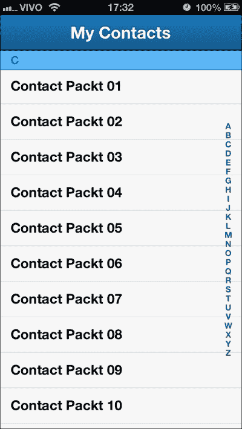

这是一个简单的列表，列出了手机上可用的所有联系人。所有的 UI 设计都将使用 Sencha Touch 完成，并且为了从设备中检索原生联系人，我们将使用 PhoneGap。前面的截图是在 iPhone 上运行应用程序时拍摄的。我们将在本书的后面部分学习如何构建和准备在真实设备上执行的应用程序。

# 创建项目

首先，创建一个新的 Sencha Touch 项目；我们可以通过从欢迎屏幕或从工具栏中选择**新建项目**选项来完成此操作：


项目创建后，我们将看到登录屏幕，其中包括工具栏、画布、项目检查器、配置面板和工具箱。我们将立即保存我们的项目。为此，请点击工具箱中的**保存**或按*Ctrl* + *S*（在 Mac OS 上为*cmd* + *S*）。将显示**保存项目**屏幕。

我们将把项目保存在`sencha-architect`目录下的`SenchaContacts`中，这个目录和我们的 Ext JS 项目保存的目录相同。以下截图显示了**保存项目**屏幕：

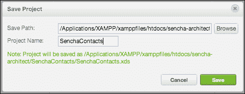

现在项目已保存，我们可以开始实现它。我们将使用以下开发工作流程：首先实现**模型**，然后是**存储**，然后是**视图**，最后是**控制器**，直到我们的项目完成。

# 配置应用程序

第一步是设置本章我们将要开发的应用程序。在我们开始之前，在项目检查器中，选择**应用程序**（*步骤 1*），然后转到配置面板，找到属性**名称**，并将其值设置为`Packt`（*步骤 2*）。这是我们的应用程序命名空间，意味着所有类都将命名为`Packt + package + className`。如果我们打开代码编辑器，我们将看到的代码如下截图所示（*步骤 3*）：


所有这些配置都将应用于`app.js`文件，因为应用程序代表`app.js`文件。

你会注意到，在本章中我们将执行的大多数步骤与上一章中执行的操作非常相似。这是因为 Ext JS 和 Sencha Touch 共享部分 API，而且一旦你习惯了 Ext JS 或 Sencha Touch，学习第二个框架就会更容易。

# 创建模型

按照我们的开发工作流程，我们将从模型开始。在项目检查器的顶部，点击**+**图标并选择**Model**（*步骤 1*）：

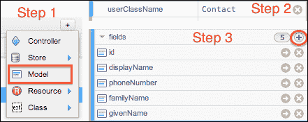

一旦创建了**模型**，选择它，转到配置面板，并将类名（`userClassName`）设置为`Contact`（*步骤 2*）。然后，仍然在配置面板中，找到**字段**属性，点击其**+**图标并添加第一个字段，该字段命名为`id`。继续添加，直到我们创建了以下字段：`id`、`displayName`、`phoneNumber`、`familyName`和`givenName`（*步骤 3*）。这些字段代表设备上可用的某些字段。


由于我们有`givenName`和`familyName`，假设我们想要创建一个返回连接`givenName`和`familyName`字段的字段。因此，我们创建了`displayName`字段。所以为了完成我们想要的操作，我们需要为`displayName`字段创建一个`convert()`函数。为此，我们需要在项目检查器中选择`displayName`字段（*步骤 4*），找到**convert**属性并点击**+**图标（*步骤 5*），然后，一个绿色菱形图标将出现在**convert**属性左侧。这意味着在代码编辑器中创建了一个函数，并且它可供编辑。要转到代码编辑器，我们可以点击箭头图标（*步骤 6*）。然后我们可以添加将连接`givenName`和`familyName`字段的代码（*步骤 7*）。

如果我们回到项目检查器，联系模型应该如图所示（*步骤 8*）。如果我们查看画布，在**设计**模式下将不会显示任何内容，但如果我们查看**代码**编辑器，`Packt.model.Contact`类将被定义。如果我们尝试编辑其代码，我们会注意到唯一可编辑的代码是我们为`displayName`字段创建的`convert()`函数（当我们将鼠标悬停在`convert()`函数内容上时，将出现编辑图标）。任何其他更改都必须使用配置面板进行。

保存项目并查看 Sencha Architect 迄今为止创建的文件，我们会看到它在`app/model`目录中创建了一个名为`Contact.js`的文件。

# 创建商店

下一步是创建一个商店。我们的数据将来自设备，我们将使用特殊的代理和 PhoneGap 代码来加载它。这意味着我们可以创建一个使用 Ajax 代理的商店，因为在项目检查器的**+**菜单中，我们没有创建空商店的选项（无论是通过工具箱创建商店）。因此，我们需要回到项目检查器，再次点击**+**图标，选择**Store**，然后选择**Json Store**，如图所示：

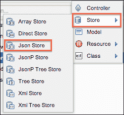

在我们创建商店后，我们需要给它起一个名字。因此，在项目检查器中选择商店，转到配置面板，找到**userClassName**，并将其值设置为**Contacts**（这将成为商店的名称—*步骤 1*）。然后，我们还需要为其分配一个**storeId**，其值也将设置为**Contacts**（*步骤 2*）。创建商店后，我们还将看到一个红色的感叹号图标（*步骤 3*）。如果我们点击它（*步骤 3*），我们将看到一个错误消息，表示我们需要将一个模型与此商店关联或至少在商店上创建一个字段（*步骤 4*）。由于我们已经有了一个模型，我们可以点击项目检查器中的**Store**，转到配置面板，搜索**model**，然后可以从我们已创建的模型列表中选择（*步骤 5*）。

在这种情况下，我们只创建了**Contact**模型。最后，由于我们将使用自己的代理（而不是 Sencha Touch API 上可用的代理），我们可以通过选择它并右键单击它来删除代理，然后选择**Delete**选项（*步骤 6*）：

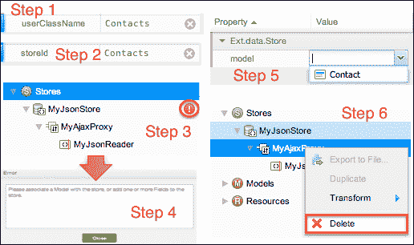

我们也可以通过直接点击**Store**选项（如下一张截图所示）来创建没有代理的商店，无需点击以下选项之一；**Array Store**、**Direct Store**等：

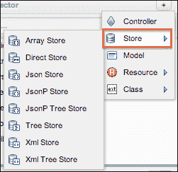

如本章前面所见，在从 iPhone 拍摄的截图中，一个字母将联系人分组（这个字母代表`givenName`的第一个字母—如果没有`givenName`，则为`familyName`）。我们将在稍后添加此配置，但将执行分组工作的类是商店。因此，为了做到这一点，我们需要从项目检查器中选择**Contacts**在**Stores**中，转到工具箱，选择数据，然后在**Data Utilities**下找到**Grouper**。双击它，将在**Contacts**商店中添加一个分组器。然后，在**Contacts**商店下选择**MyGrouper**，在配置面板上找到**groupFn**，并点击**+**图标（*步骤 8*）。在**groupFn**函数旁边将出现一个绿色菱形图标。点击箭头图标（*步骤 9*），代码编辑器将打开，这样我们就可以添加分组器代码（*步骤 10*）：

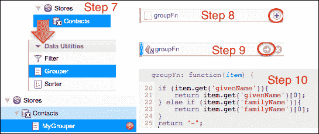

如果联系人有`givenName`，商店将使用其第一个字母进行分组；如果没有，则将使用`familyName`的第一个字母。如果联系人没有名字（这种情况可能发生），我们将返回`"-"`。覆盖所有情况非常重要，因为如果不这样做，当我们在真实设备上运行此示例时，联系人将不会出现在列表中。

保存项目并查看 Sencha Architect 迄今为止创建的文件后，我们将看到它已在`app/store`目录中创建了一个名为`Contacts.js`的文件。

## 创建联系人代理 – PhoneGap

我们的目的是从设备中加载联系人，因此我们将使用 PhoneGap 为我们进行原生访问。为此，我们需要使用 PhoneGap 代码创建自己的代理。所以请转到应用程序目录（`sencha-architect/SenchaContacts`），然后在`app`文件夹内创建一个名为`proxy`的新文件夹，并创建一个名为`ContactsProxy.js`的文件，如下面的截图所示：


在`ContactsProxy.js`文件中，我们将添加以下代码（使用您选择的代码编辑器——记事本、Sublime Text、Eclipse 等）——遗憾的是，这是我们不能从 Sencha Architect 中完成的事情，因为它仅限于模型、存储、视图和控制器包：

```js
Ext.define('Packt.proxy.ContactsProxy', { // #1
    extend: 'Ext.data.proxy.Proxy', // #2
    alias : 'proxy.contactstorage', // #3
    constructor: function(config) { // #4
        var me = this;
        config = config || {};
        me.callParent([config]);
    },
    create: function(operation, callback, scope) { }, // #5
   update: function(operation, callback, scope) { }, // #6
   destroy: function(operation, callback, scope) { } // #7
});
```

这是我们的代理的骨架。创建自定义代理是一个高级话题，需要一些对 API 源代码的了解。所以让我们一步一步来。首先，我们有类的定义（`#1`），它遵循 Sencha 命名约定。

注意，`Packt`是我们为应用程序选择的命名空间，`proxy`是包名，`ContactsProxy`是我们创建的`.js`文件的名称。然后我们扩展了 Sencha Touch API 中的代理类（`#2`）。接下来，我们创建了一个别名，这样我们就可以在定义联系人存储中的代理时使用`contactsstorage`类型（`#3`）。在代码之后，我们有默认的构造函数（`#4`），然后是我们代理需要的函数签名：`create()`（`#5`）、`update()`（`#6`）和`destroy()`（`#7`）。我们不会实现这些函数。我们将实现的是`read()`，我们将将其添加到`ContactsProxy`类中：

```js
read: function(operation, callback, scope) {
    var thisProxy = this;
    var fields = ['id', 'name', 'phoneNumbers']; // #8
    navigator.contacts.find(fields,
        function(deviceContacts) { // #9
            //loop over contacts and create Contact model instance
            var contacts = [];
            for (var i = 0; i < deviceContacts.length; i++){// #10
                var deviceContact = deviceContacts[ i ];

                var phone = "";
                if (deviceContact.phoneNumbers){ // #11
                    phone = deviceContact.phoneNumbers[0];
                    if (phone){
                        phone = phone.value;
                    } else{
                        phone = "";
                    }
                }
                // #12
                contacts.push(Ext.create('Packt.model.Contact',{ 
                        id: deviceContact.id,
                        givenName: deviceContact.name.givenName,
                        familyName: deviceContact.name.familyName,
                        phoneNumber: phone
                    }));
                }
            //return model instances in a result set
            operation.setResultSet( // #13
                Ext.create('Ext.data.ResultSet', {
                    records: contacts,
                    total  : contacts.length
                })
            );
            //announce success
            operation.setSuccessful(); // #14
            operation.setCompleted();
            //finish with callback
            if (typeof callback == "function") { // #15
                callback.call(scope || thisProxy, operation);
            }
        },
        function (e) { // error handling from PhoneGap
            console.log('Error fetching contacts'); // #16
        },
        {multiple: true} // #17
    );
}
```

在`read()`方法中，我们有 Sencha 和 PhoneGap 代码的混合。为了读取联系人，我们将使用一个 PhoneGap 函数（有关更多信息，请参阅[`docs.phonegap.com/en/2.6.0/cordova_contacts_contacts.md.html#Contacts`](http://docs.phonegap.com/en/2.6.0/cordova_contacts_contacts.md.html#Contacts)）。`navigator.contacts.find()`函数需要搜索的`contactFields`（`#8`），在 PhoneGap 能够成功读取联系人时的成功函数（`#9`），一个错误回调（`#16`），以及一些选项（`#17`）。

我们最大的兴趣在于`success()`函数（`#9`）。首先，我们将遍历设备返回给 PhoneGap 的每个联系人（`#10`）。我们将提取一个电话号码（`#11`——联系人可以有多个电话，在这种情况下，我们将只检索第一个）。然后我们需要使用从设备提取的信息创建一个联系人模型实例（`#12`）。我们将把这个联系人模型实例推入一个数组。最后，我们需要将信息（联系人模型实例及其总数）设置到`ResultSet`中，以便 Ext JS 联系人存储可以理解这些信息（`#14`）并将`operation`设置为成功和完成（`#14`）。最后，我们需要通知 Ext JS 回调函数（`#15`）。

然后，联系人存储将理解我们从设备检索到的信息。当我们从存储中调用`load()`方法时，将调用`read()`函数。我们将在控制器部分看到如何在存储中应用此代理。

# 创建列表视图

在下一步中，我们将创建我们的视图，即联系人列表。有两种创建视图的方法。你可以选择你最喜欢的一种。第一种方法需要选择项目检查器上的**Views**包（*步骤 1*）；转到**Toolbox**并找到**Grid Panel**组件，然后双击它（*步骤 2*）。在**Views**下将创建一个新的列表视图`MyList`：

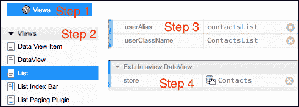

然后，在列表创建后，我们需要从项目检查器中选择它，找到**userAlias**，并将其值设置为**contactsList**，并将**userClassName**也设置为**contactsList**（*步骤 3*）。仍然在配置面板上，我们还需要为列表设置一个**store**（*步骤 4*）。

创建视图的第二种方法是选择组件从**Toolbox**，并将其拖放到**Views**包内部（或者它也可以是**Views**、**Stores**、**Models**或**Controllers**包）：


下一步是更改**itemTpl**。**itemTpl**是我们将显示为**ContactsList**项目的信息的模板。在这种情况下，我们希望以粗体显示`givenName`，并以常规字体显示`familyName`，如下面的屏幕截图所示：


### 小贴士

如果我们在项目检查器中双击**itemTpl**，代码编辑器将显示出来，然后我们可以像前一个屏幕截图所示那样编辑**itemTpl**。

为了使我们的列表看起来更美观，让我们给它添加一个工具栏。从项目检查器中选择**ContactsList**，然后转到工具箱并找到**Toolbar**组件；双击它（*步骤 5*）。然后，从项目检查器中选择**Toolbar**，转到配置面板，找到**title**，并将其值设置为`My Contacts`（*步骤 6*）。设置工具栏标题的另一种方法是使用设计视图，通过双击来更改标题：


我们的最后一步是添加索引栏并对列表进行分组。所以首先，为了添加索引栏，从项目检查器中选择**ContactsList**，转到**Toolbox** | **Views**，并找到**List Index Bar**组件（*步骤 8*），这是我们唯一需要做的事情。如果我们转到代码编辑器，我们会看到 Sencha Architect 添加了属性`indexBar: true`。

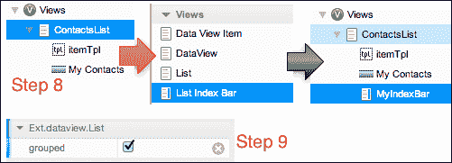

最后，再次从项目检查器中选择**ContactsList**，转到配置面板，找到**grouped**属性复选框，并勾选它。这将向代码编辑器中添加属性`grouped: true`。

保存项目并查看 Sencha Architect 迄今为止创建的文件，我们会看到它已经在`app/view`目录中创建了一个名为`ContactsList.js`的文件。

# 创建控制器

因此，要创建控制器，让我们回到项目检查器的顶部并再次点击**+**图标，然后选择**Controller**选项（*步骤 1*）。然后，选择**Controller**，转到配置面板，并将它的**userClassName**更改为**Contacts**（*步骤 2*）：

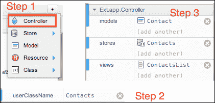

仍然在配置面板中，定位到**models**、**stores**和**views**属性（*步骤 3*）。使用这些属性，我们将声明这个控制器将关注的模型、存储和视图。一旦选择**Model**、**Store**或**View**，Sencha Architect 将显示一个带有问题的窗口，如下截图所示。点击**移除**：


这是因为在应用程序（`app.js`）中，当我们创建模型、存储和视图时，它们将被声明在应用程序的**models**、**views**和**stores**属性中。通过这一步，我们将责任转移到控制器，并且不需要在`app.js`应用程序和控制器（如果我们点击**保留**按钮会发生的情况）上保留它们的声明。

下一步是为联系人控制器添加一个新的**Controller Action**。要做到这一点，在项目检查器中选择联系人控制器，转到工具箱，找到**Controller** **Action**，并双击它（或拖放），如*步骤 4*所示。一旦**Controller** **Action**在联系人控制器下列出，选择它，转到配置面板，并将**targetType**选择为**ContactsList**（*步骤 5*）；然后，在**EventBinding**中，选择我们想要监听的事件的**name**，即**show**。如果您愿意，可以将**controlQuery**改为更具体，以及通过更改**fn**来更改**BasicFunction**的名称。


然后在代码编辑器中，我们将添加我们希望在**ContactsList**显示时发生的逻辑，即加载其**Store**，这样 PhoneGap 就可以从设备中加载联系人。但实际情况是联系人存储没有设置代理，因此我们可以设置`contactsstorage`，这是我们使用`setProxy()`方法创建的代理。这是我们可以做到的最简单的方法。另一种方法是在联系人存储上创建一个覆盖，但这是一个高级主题，我们将在下一章中学习。

在 `onListShow()` 方法的第 `26` 行，我们有 `document.addEventListener('deviceready')` 声明。这是一段 PhoneGap 代码，当设备准备好使用时将会触发。然后，作为一个函数，我们加载 **ContactsList** 存储。由于我们创建的代理使用了 PhoneGap 代码，我们需要确保只有在设备准备好使用时才调用它。

保存项目并查看 Sencha Architect 到目前为止创建的文件后，我们会看到它在 `app/controller` 目录中创建了一个名为 `Contacts.js` 的文件。

我们可以再次在工具栏中点击预览图标，现在我们将看到我们项目的最终版本，但首先我们需要设置 **URL 前缀**，如下截图所示：


然后，通过点击工具栏中的 **预览** 按钮，浏览器将被打开，但它不会显示任何内容，因为浏览器不是一个设备。要显示任何联系人，我们需要使用模拟器或在真实设备上测试应用程序；我们将在本书的后面部分学习这一点。

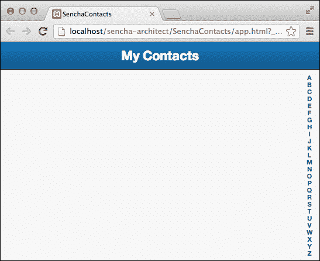

# 添加 PhoneGap

由于我们已经编写了所有需要做的代码，剩下要做的就是将 `PhoneGap js` 文件添加到我们的 Sencha Architect 项目中。要做到这一点，在项目检查器中选择 **资源**，转到工具箱，选择 **资源**，然后双击 **JS 资源**。然后，在配置面板中，给它一个 **id**（**phonegap**）并将 **URL** 设置为 **phonegap** 文件（在这种情况下我们使用的是可以从 [`phonegap.com`](http://phonegap.com) 获取的 **cordova-2.5.0.js**）。然后我们就完成了！


# 最终项目结构

在使用 Sencha Architect 完成我们的第一个 Sencha Touch 项目实现后，让我们看看为我们生成的代码，如下截图所示：


注意到 Sencha Architect 为我们创建了所有文件（除了代理）。

与 Ext JS 项目类似，我们必须注意，我们不能在代码编辑器中修改文件。如果我们修改了任何文件并尝试再次在 Sencha Architect 中打开，所有更改都将丢失，因为 Sencha Architect 将会覆盖它们。所以，如果你决定在代码编辑器中更改任何文件，重要的是要知道你将无法再次使用 Sencha Architect（如果你这样做，你将丢失这些更改）。

# 摘要

在本章中，我们学习了如何使用 Sencha Architect 实现我们的第一个 Sencha Touch 项目。我们学习了如何创建一个新的 Sencha Touch 项目，以及如何使用应用程序设置 `app.js` 文件。我们学习了如何创建模型、存储、视图和控制器，我们还介绍了如何将我们的 Sencha Touch 项目与 PhoneGap 集成，这是一个高级主题。

在下一章中，我们将学习一些技巧和窍门，例如多语言应用、创建覆盖、导出和导入项目，以及更多内容。
