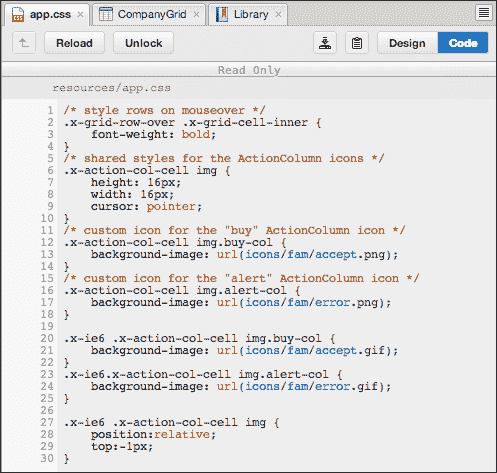

# 第五章。使用资源

在本章中，我们将学习如何使用项目检查器中的资源工具箱和资源包。因此，在本章中，我们将涵盖：

+   更改 Ext JS 和 Sencha Touch SDK 路径

+   调试模式和发布模式

+   创建新的 CSS 文件

+   使用 Google Maps

+   使用主题文件

+   使用额外的 JavaScript 文件

# 库资源

当我们在 Sencha Architect 上创建 Sencha Touch 或 Ext JS 项目时，我们将能够看到一个包含库资源的资源包。根据我们用于创建项目的 SDK 版本，选项可能会有所不同。

例如，如果我们创建一个 Ext JS 4.1 项目，我们将有默认的**库**选项，例如**调试**、**包含 CSS**、**包含** **JavaScript**和**库** **基本** **路径**。当我们创建一个 Ext JS 4.2 项目时，我们将看到所有已提到的选项，以及如以下截图所示的主题属性：

同样，Sencha Touch 2.1 项目和 Sencha Touch 2.2 项目也会发生相同的情况：

这是因为 Sencha 为 Sencha Touch 2.2 及以后版本和 Ext JS 4.2 及以后版本增加了更改主题的功能。

那么每个选项代表什么（**调试**、**包含 CSS**、**包含 JavaScript**、**库基本路径**）？

**调试**选项意味着，如果我们想使用调试或生产版本的 SDK。默认情况下，Sencha Architect 将使用`ext-all.js`和`sencha-touch-all.js`SDK 文件。如果我们勾选**调试**复选框，Sencha Architect 将使用`ext-all-debug.js`和`sencha-touch-debug.js`SDK 文件。

默认情况下，Sencha Architect 也勾选了**包含 CSS**属性。这意味着 Sencha Architect 将自动将 Ext JS 和 Sencha Touch CSS 文件（`ext-theme-classic-all.css`和`sencha-touch.css`）添加到`app.html`文件中。但如果我们需要 CSS 具有 Ext JS 和 Sencha Touch 框架提供的美丽外观，为什么 Sencha Architect 会给开发者提供添加 CSS 文件的选项？我们将在本章后面回答这个问题。

**包含 JavaScript** 选项也被选中。当此选项被选中时，Sencha Architect 将 `ext-all.js` 和 `sencha-touch-all.js` SDK 文件包含在 `app.html` 中。同样的问题：如果我们需要 Ext JS 或 Sencha Touch SDK 来创建 Ext JS 或 Sencha Touch 应用程序，为什么 Sencha Architect 提供从 `app.html` 中移除这些文件的可能性？如果你已经使用 Sencha Cmd 生成了一个 Sencha Touch 或 Ext JS 项目，你会在 `index.html` 文件中注意到，它包含了一个不同的文件作为 `bootstrap.js` 文件，在这个 `bootstrap.js` 文件中我们有添加生产或调试文件的逻辑。因此，如果我们取消选中 **包含 JavaScript** 属性，我们可以通过添加一个新的 JS 资源来包含 `bootstrap.js` 文件。在将哪些文件包含在 `app.html` 文件中时，Sencha Architect 非常灵活。

## 设置本地 SDK

另一个引起我们注意的属性是**库基本路径**。当我们创建一个 Sencha Architect 项目时，Ext JS 4.2 项目的**库基本路径**是 [`cdn.sencha.com/ext/gpl/4.2.0/`](http://cdn.sencha.com/ext/gpl/4.2.0/)，而对于 Sencha Touch 2.2 项目则是 [`cdn.sencha.com/touch/sencha-touch-2.2.0-rc/`](http://cdn.sencha.com/touch/sencha-touch-2.2.0-rc/)。这意味着每次你执行你创建的应用程序时，你的应用程序都会从 Sencha 服务器加载 SDK JS 文件和 CSS 文件。

如果你正在本地测试你的应用程序，或者你想要从特定位置加载框架资源，我们需要更改**库基本路径**。例如，在下面的屏幕截图中，我们正在从本地服务器加载 Ext JS 框架文件：

这在你乘坐飞机并想要继续编码你的项目，而你又没有互联网访问时也非常有用，因此你可以指向你的本地安装。

## 升级项目

这又是 Sencha Architect 在很多方面帮助我们的一种场景。开发一个真正的大 Ext JS 或 Sencha Touch 项目可能需要一段时间。我们通常从框架的最新版本开始开发项目；然而，Sencha 会发布带有修复和新组件的框架新版本。我们想要这些修复，因此出于这个原因，我们也想升级项目。

Sencha Architect 还提供了升级功能。要升级一个项目（只要 Sencha Architect 已经支持这个新版本），我们需要选择**库**并右键单击它。会出现一个**升级**选项。一旦点击它，我们需要确认我们确实想要升级，因为一旦升级就没有回头路了。Sencha Architect 还会为项目的安全创建一个存档备份：

在前面的截图中，我们升级了一个使用 Ext JS 4.0 构建的项目。因此，我们可以首先升级到 Ext JS 4.1.x，或者我们可以直接更新到 Ext JS 4.2.x。此外，在先前的截图中，我们从 Ext JS 4.0.x 升级到 Ext JS 4.1.x。如果我们再次尝试升级，则只有**升级到 Ext JS 4.2.x**选项将可用，如下面的截图所示：

同样的功能也适用于 Sencha Touch：

### 注意

对于这些示例，我们使用了一个现有的 Ext JS 项目（`arrayGrid`），可在[`github.com/loiane/sencha-extjs4-examples-architect/tree/master/grid/arrayGrid`](https://github.com/loiane/sencha-extjs4-examples-architect/tree/master/grid/arrayGrid)找到，以及可在[`github.com/loiane/sencha-touch2-examples-architect/tree/master/TouchTwitterSearch`](https://github.com/loiane/sencha-touch2-examples-architect/tree/master/TouchTwitterSearch)找到的`Touch Twitter Search`。

## 原生主题

对于 Ext JS 4.2 和 Sencha Touch 2.2 项目，库也会显示**主题**属性。我们可以切换到另一个可用的**主题**（原生主题），如下面的截图所示：

如果我们在 Sencha Architect 中更改**主题**，我们将在画布的**设计**模式下立即看到变化：

对于 Sencha Touch 也会发生同样的事情：

我们将在本章末尾了解如何处理自定义主题。

# 创建/链接 CSS 和 JavaScript 文件

在整本书中，我们学习了如何使用 Sencha Architect 创建 Sencha 代码。但 Ext JS 或 Sencha Touch 项目并不意味着我们只会拥有 Ext JS 或 Sencha Touch 代码。我们还可以有额外的 JS 和 CSS 文件。

因此，让我们看看如何创建新的 CSS 和 JS 文件（CSS 和 JS 文件的逻辑是相同的）。首先，我们需要从项目检查器中选择**资源**，然后转到工具箱，找到**资源**，并双击我们想要创建的资源（*步骤 1*）。或者，我们也可以使用我们在前几章中学到的拖放功能。然后，一个新的 CSS 或 JS 文件将在**资源**包下显示。我们需要选择它，并在配置面板中我们可以给出一个**id**（仅用于帮助我们识别文件）和它的**url**（*步骤 2*）。然后，如果我们转到画布并打开代码编辑器，我们将能够编辑此文件（*步骤 3*）：

如果文件不存在，Sencha Architect 将在设置为**url**的路径上为我们创建它（如果是本地路径）。如果文件已存在，Sencha Architect 将为我们加载它，如下面的截图所示：

由于它是一个现有文件，它将被锁定以防止更改。如果您想对其进行更改，只需单击**解锁**，然后您将可以自由地添加、编辑或删除所需的代码。

# 使用 Google Maps

对于 Sencha Touch 项目，可以将 Google Maps API 资源添加到项目中。此资源将在 `app.html` 文件中添加一个新的 JavaScript 文件声明，指向 Google Maps API URL。

要添加它，从项目检查器中选择**资源**，进入工具箱，找到**资源**，然后双击**Google Maps API**资源。它将被添加到项目检查器的**资源**包下。我们不需要在配置面板上做任何更改。

只有 Sencha Touch 项目才有此资源选项。但如果我们想在 Ext JS 项目上添加 Google Maps API，我们可以简单地添加一个指向先前演示的相同 URL 的新 JS 资源。

# 使用自定义主题

我们已经学习了如何在 Sencha Architect 中使用原生主题。但创建和自定义主题很有趣，我们还想在我们的 Sencha Architect 项目中使用自定义主题。这是可能的！

记得我们问过为什么 Sencha Architect 允许我们禁用库中的**包含 CSS**选项？这是其中一个原因。所以如果我们想使用自定义主题，我们需要禁用**包含 CSS**选项并添加我们自己的主题。添加自定义主题与将现有 CSS 资源添加到项目非常相似。首先，我们从项目检查器中选择**资源**。然后我们需要进入工具箱，找到**资源**选项，然后双击**CSS 资源**。代表自定义主题的 CSS 文件必须已经存在于项目的目录中。因此，我们进入这个新 CSS 资源的配置面板，并添加 `my-theme.css` 文件的相对路径。

最后，主题被包含在 `app.html` 文件中。

当我们重新加载画布的**设计**视图时，CSS 将应用于项目，我们可以立即看到其外观，如下面的截图所示：

只需记住，我们首先需要生成主题。Sencha Architect 并不是一个帮助我们创建主题的工具；我们需要使用 Sencha Cmd（以及 Sass 和 Compass）来完成这项工作。

### 注意

有关为 Ext JS 创建主题的更多信息，请访问 [`docs.sencha.com/extjs/4.2.1/#!/guide/theming`](http://docs.sencha.com/extjs/4.2.1/#!/guide/theming)，以及 Sencha Touch 请访问 [`docs.sencha.com/touch/2.2.1/#!/guide/theming`](http://docs.sencha.com/touch/2.2.1/#!/guide/theming)。

# 摘要

在本章中，我们学习了如何向 Sencha Architect 项目添加一些额外的资源，例如新的 CSS（或现有的），新的 JavaScript 文件（或现有的），如何更改主题，以及如何应用由您或任何其他开发者创建的自定义主题，如何升级 Ext JS 或 Sencha Touch SDK 版本，以及如何与 Google Maps 一起工作。有了所有这些资源，我们可以增强我们的项目。

在下一章中，我们将学习如何构建、打包和部署 Sencha Architect 项目。
