# 第六章：模拟、构建、打包和部署应用程序/项目

在本章中，我们将学习如何通过预览（在浏览器中进行测试）、打包、构建和部署来准备应用程序以供生产使用。因此，在本章中，我们将涵盖：

+   预览和发布 Ext JS 项目

+   预览和发布 Sencha Touch 项目

+   模拟 Sencha Touch 应用

+   打包 Sencha Touch 应用

# 预览、发布和构建项目

在本节中，我们将学习工具栏中的**构建**、**发布**和**预览**按钮的功能。这些按钮对于 Ext JS 项目或 Sencha Touch 项目都是相同的：

让我们从**构建**按钮开始。这个按钮不会为我们执行生产构建。这个按钮唯一能做的就是编译并保存项目。对于 Ext JS 项目，构建必须手动完成（Sencha Architect 2.2 及更早版本不支持）。对于 Sencha Touch 项目，我们将在本章后面学习如何进行。

我们在本章中将学习的所有功能仅在项目保存时才可用。因此，请点击**保存**，选择您要保存项目的地方，然后享受乐趣吧！

## 预览项目

**预览**按钮将打开您的计算机的默认浏览器，并在其上渲染`app.html`文件，这意味着它将在浏览器上执行应用程序。因此，当我们点击它时，将显示一个弹出窗口，询问项目的根目录的**URL 前缀**：

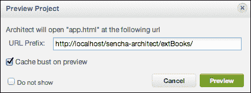

由于我们的项目已经从`Xampp`目录中的`htdocs`文件夹创建，我们只需通知本地主机路径和应用程序路径。然后，应用程序将在浏览器中打开，如下面的截图所示：

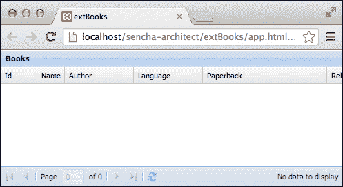

每次您点击**预览**按钮时，都会显示相同的弹出窗口。您可以选择点击**不再显示**复选框，这样它就不会再次显示。

## 发布项目

**发布**按钮只是将您的代码复制到特定的目录。它不会复制 Sencha Architect 文件或源控制文件（`.svn`, `.git` 等）。

例如，假设您正在本地工作在一个项目上，但您想将应用程序发布到 Web 服务器上进行测试。您需要点击**发布**按钮，如果这是您第一次为特定项目点击此按钮，将显示如下截图所示的弹出窗口：

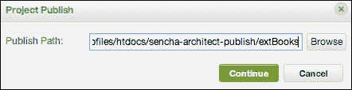

然后，点击**浏览**并选择要复制文件的目录。它需要与项目根文件夹不同的目录。当您点击**继续**时，Sencha Architect 将运行一个脚本并将所有文件复制到指定的目录，如图所示：

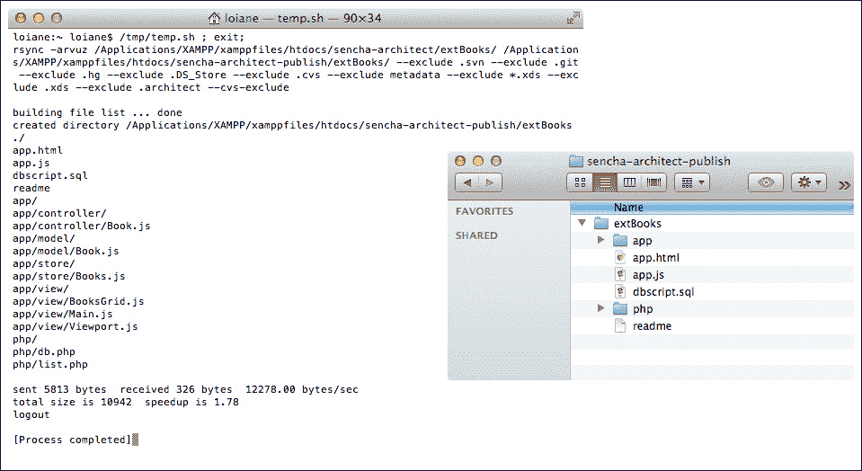

您可以通过点击**设置**按钮和**项目**选项卡来随时更改设置：

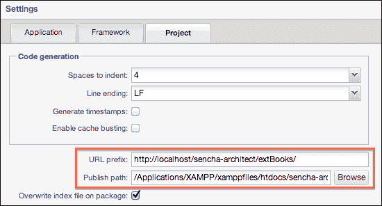

# 介绍 Sencha Cmd 和 Sencha Architect

Sencha Architect 是一个专为 Sencha 项目设计的优秀开发工具。Sencha 还有一个名为 Sencha Cmd 的其他工具，允许开发者使用命令行终端创建、构建、模拟和打包项目。Sencha Architect 允许我们原生地构建、模拟和打包 Sencha Touch 项目。因此，这两个工具之间有集成。因此，为了充分利用它们，我们需要安装 Sencha Cmd。

下载它，请访问 [`www.sencha.com/products/sencha-cmd/download`](http://www.sencha.com/products/sencha-cmd/download) 并根据您使用的操作系统下载适当的版本。

### 注意

在我们开始之前，我们还需要安装 Java JDK 并配置环境变量 ([`docs.oracle.com/javase/tutorial/essential/environment/paths.html`](http://docs.oracle.com/javase/tutorial/essential/environment/paths.html))，安装 Ruby ([`www.ruby-lang.org`](http://www.ruby-lang.org))，Sass ([`sass-lang.com/`](http://sass-lang.com/)) 以及 Compass ([`compass-style.org/`](http://compass-style.org/))。您可以在 Sencha Cmd 文档中找到所有这些步骤：[`docs.sencha.com/touch/2.2.0/#/guide/command`](http://docs.sencha.com/touch/2.2.0/#/guide/command)。

在这本书的整个过程中，我们还了解到，当我们创建一个 Sencha Touch 项目时，它会指向 Sencha 服务器上的 SDK。为了能够模拟和打包应用，我们还需要在本地安装 Sencha Touch。只需从 Sencha 网站下载 ([`www.sencha.com/products/touch/download/`](http://www.sencha.com/products/touch/download/)) 并解压缩到您偏好的目录即可。然后，我们就可以开始了！

# 模拟 Sencha Touch 应用

对于所有 Sencha Touch 项目，在保存后，您将在工具箱中看到一个名为**打包**的按钮，如下截图所示：

点击**打包**按钮是我们模拟应用之前需要采取的第一步。当我们点击它时，将显示一个屏幕，如下截图所示：

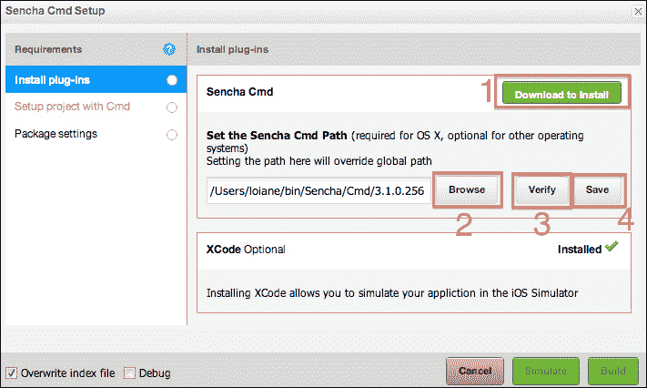

我们需要做的第一件事是下载并安装**Sencha Cmd** (*1*)。如果您已经完成了，那么您需要设置 Sencha Cmd 安装路径 (*2*)。下一步是点击**验证**按钮 (*3*) 来验证一切是否正常。输出应该是一个窗口，它将弹出（终端），Sencha Architect 将尝试执行 `sencha` 命令以确保一切正常。如果一切正常，只需点击**保存** (*4*)。

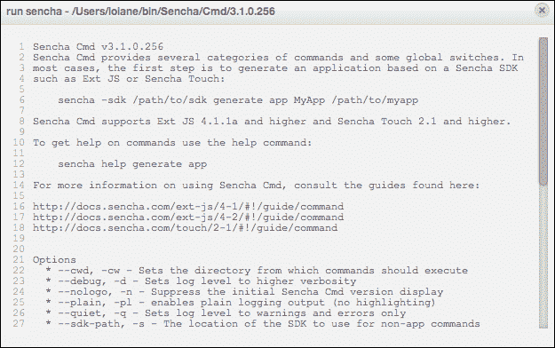

接下来，转到**使用 Cmd 设置项目**垂直标签。注意，**安装插件**标签现在有一个绿色的子弹。我们的目标是让所有标签都有绿色的子弹。这意味着我们已经完成了设置，并且我们准备好模拟或构建原生应用了。

在这个第二个标签中，我们需要通知 Sencha Architect 关于本地安装 Sencha Touch SDK 的目录（*2*）。如果您还没有，请下载它并将其解压缩到您偏好的目录（*1*）。

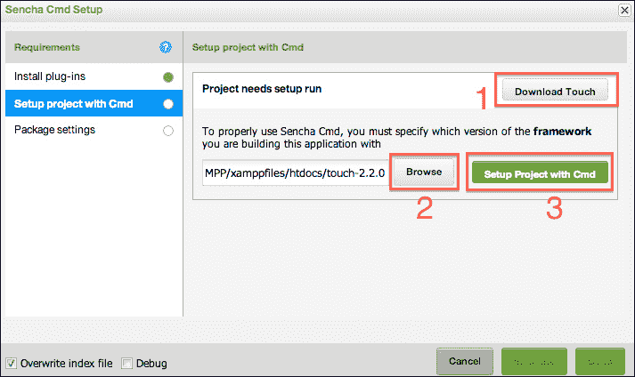

我们需要特别注意的一件非常重要的事情是我们使用的 Sencha Touch 版本与 Sencha Cmd 版本的结合。对于 Sencha Touch 2.0.x，我们需要使用 Sencha SDK Tools 2.x（这是 Sencha Cmd 的一个较旧版本）。对于 Sencha Touch 2.1.x，我们需要使用 Sencha Cmd 3.0.x，而对于 Sencha Touch 2.2.x，我们需要使用 Sencha Cmd 3.1.x。为了确保我们使用的是正确的版本，请始终查看官方论坛以获取更多信息（[`www.sencha.com/forum/forumdisplay.php?98-Sencha-Architect-2.x-Help-amp-Discussions`](http://www.sencha.com/forum/forumdisplay.php?98-Sencha-Architect-2.x-Help-amp-Discussions)）。如果我们没有使用正确的版本，我们可能会得到诸如“当前工作目录不是一个已识别的 Sencha SDK 或应用程序文件夹”的错误。

最后，点击**使用 Cmd 设置项目**按钮（*3*）。将显示一个终端窗口。在这个终端中，将执行`sencha generate app`命令，并将项目配置（名称和路径）作为参数传递给命令（如要求）：

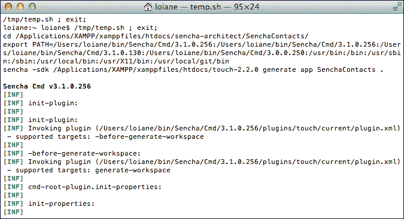

最后一步，我们需要点击第三个垂直标签，即**打包设置**（再次注意，前两个标签都有绿色的子弹，这意味着前面的步骤是正确的）。

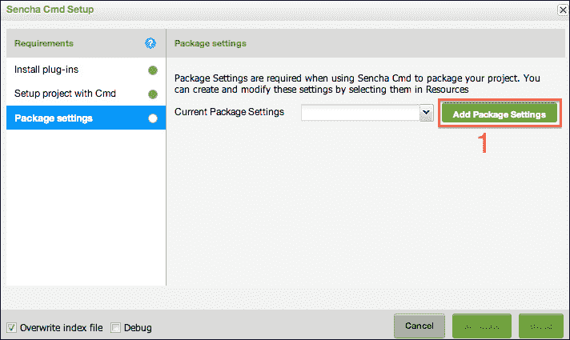

当我们手动创建一个 Sencha Touch 应用（不使用 Sencha Architect），使用 Sencha Cmd 和`sencha generate app`命令时，它会创建一个名为`packager.json`的文件，其中包含我们需要提供给 Sencha Cmd 和 Sencha Touch 以模拟和为我们创建原生应用的所有信息。我们现在需要做同样的事情。但这个`packager.json`可以通过点击**添加打包设置**按钮自动创建。当你点击它时，结果将如以下截图所示：

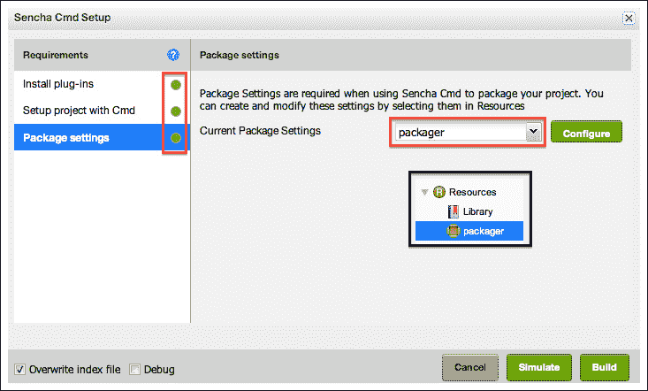

我们需要注意的三件事：首先，所有来自垂直标签的子弹都是绿色的。这意味着我们现在可以开始本地模拟和打包了。其次，创建了一个**打包器**（**当前打包设置**），我们可以按照自己的意愿进行配置（模拟，为 Android 或 iOS 构建原生应用）。第三，**打包器**被添加为项目资源，这意味着我们也可以手动完成这项工作（就像创建任何其他资源一样）。

现在，让我们看看如何模拟 iOS 和 Android（Sencha Cmd 支持的唯一平台）。

## iOS

首先，为了模拟 iOS 应用，您需要有一个 Mac OS。因此，此步骤仅适用于 Mac OS 用户，如果您使用 Windows 或 Linux 则不会生效。

其次，您还需要安装 XCode ([`developer.apple.com/xcode/`](https://developer.apple.com/xcode/))。它是免费的，您可以直接从 App Store 下载。

默认情况下，所有打包器配置都为 iOS 平台准备好了，所以我们只需从工具栏的 **Package** 按钮点击下拉箭头图标，然后选择 **Simulate**。同样，将打开一个终端窗口并运行 `sencha app build native` 命令。然后我们的应用将被模拟！

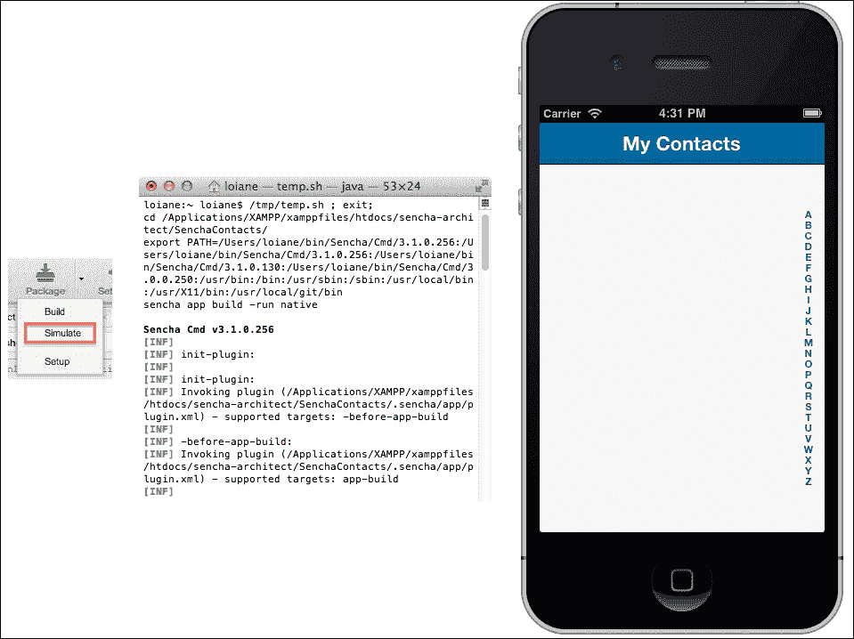

### 故障排除

如果您在尝试模拟 iOS 时遇到错误，请打开 **iOS Simulator**，转到菜单并选择 **Reset Contents and Settings…**，然后点击 **Reset**。然后，通过点击 **Simulate** 再次尝试模拟。

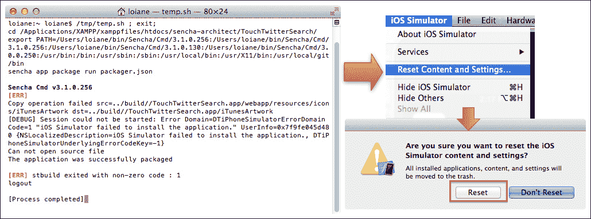

## Android

要模拟 Android 应用，您只需要安装 Android SDK ([`developer.android.com/sdk/index.html`](http://developer.android.com/sdk/index.html))。但强烈建议您安装带有 ADT 插件的 Eclipse（信息见 [`developer.android.com/sdk/index.html`](http://developer.android.com/sdk/index.html)）。在开始 Android 开发之前，设置和配置您所需的一切会容易得多。您可以使用任何操作系统（Mac OS、Linux 或 Windows）来模拟或打包 Android 应用。

在打包文件中，我们需要配置三件事情。第一件事是将 **platform** 从 **iOSSimulator** 更改为 **AndroidEmulator**。第二件事是 **sdkPath**；您需要告知您在机器上解压 Android SDK 的完整路径。第三件事是 `androidAPILevel`；只需确保您已安装相应的 API Level。

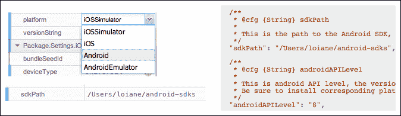

在我们再次点击 **Package** 中的 **Simulate** 按钮之前，我们需要手动启动 Android 模拟器。对于 iOS，模拟器会自动启动；对于 Android，我们需要手动启动。从 Eclipse 打开 **Android Virtual Device Manager** 或从命令行启动它 ([`developer.android.com/tools/devices/index.html`](http://developer.android.com/tools/devices/index.html))。确保您有一个 **Android Virtual Device** (**AVD**) 用于您在打包文件中设置的 **API Level**：

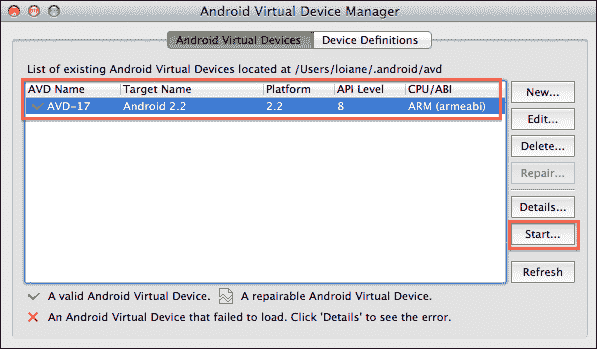

然后，在 Sencha Architect 工具栏的 **Package** 中点击 **Simulate** 按钮，稍等片刻。应用将在 AVD 上模拟，如下截图所示：

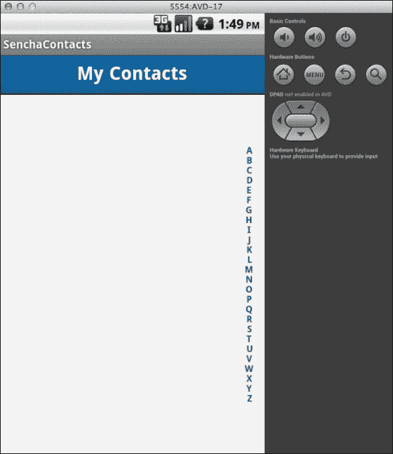

当你在 AVD 上第一次模拟应用时，可能需要一些时间，所以请稍加耐心。

# 打包（原生）Sencha Touch 应用

在我们完成所有测试后，是时候在真实设备上测试了！

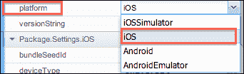

iOS 和 Android（我们在前面的主题中已设置）的配置是相同的。现在，如果我们想在真实设备上测试，我们只需将**平台（platform**）更改为**iOS**或**Android**，如前一个屏幕截图所示。

## iOS

在真实苹果设备上测试一个应用需要更多步骤。我们首先需要在 iOS 开发者中心创建一个配置文件。并且要有一个 iOS 开发者中心的账户([`developer.apple.com/account/ios/overview.action`](https://developer.apple.com/account/ios/overview.action))，你需要每年向苹果支付 99 美元。但如果你只想模拟应用，你不需要支付任何费用！

因此，第一步是创建配置文件。确保**应用 ID（App ID**）与打包器上设置的一致。你还需要设置**捆绑种子 ID（bundleSeedId**）（你还可以在你的 iOS 开发者账户中找到你的**捆绑种子 ID**）。你需要下载配置文件，并从打包器中将路径设置在**provisionProfile**配置中。**证书别名（certificateAlias**）、**证书密码（certificatePass**）和**证书路径（certificatePath**）不是必需的。如果你已经在 Xcode 上有了所有需要的配置，Sencha Cmd 会找到它，你不需要担心。

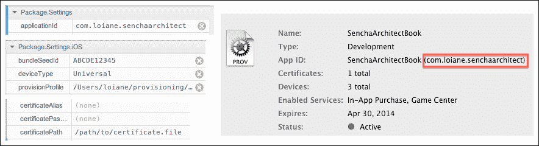

### 注意

要了解更多关于在苹果真实设备上部署应用的信息，请访问[`mobiforge.com/developing/story/deploying-iphone-apps-real-devices`](http://mobiforge.com/developing/story/deploying-iphone-apps-real-devices)。

一切准备就绪后，只需再次点击**包**中的**模拟**按钮。当然，你的 iDevice 必须通过 USB 线连接到电脑。

## Android

要在真实 Android 设备上测试一个应用，你不需要为此付费。你只需要有一个调试密钥库。如果你使用带有 ADT 插件的 Eclipse([`developer.android.com/tools/sdk/eclipse-adt.html`](http://developer.android.com/tools/sdk/eclipse-adt.html))，它将为你创建一个，如以下屏幕截图所示：

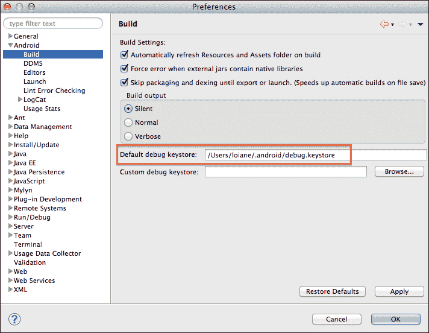

### 注意

如果你需要，你也可以手动创建密钥库。请参阅指南中的*创建证书*部分：[`docs.sencha.com/architect/2/#!/guide/deploy`](http://docs.sencha.com/architect/2/#!/guide/deploy)。

然后，当你的 Android 设备连接到电脑时（不要忘记在**设备设置**中启用**开发者配置**），你只需再次点击工具栏中的**包**|**模拟**按钮，等待应用安装完成。

### 注意

如需了解更多关于在真实 Android 设备上测试应用程序的信息，请访问 [`mobile.tutsplus.com/tutorials/connecting-physical-android-devices-to-your-development-machine/`](http://mobile.tutsplus.com/tutorials/connecting-physical-android-devices-to-your-development-machine/)。

# Windows Phone 8 和 Blackberry 10

不幸的是，Sencha Cmd 不支持模拟和打包应用程序到 Windows Phone 8 和 Blackberry 10，尽管 Sencha Touch 2.2 及更高版本支持 Windows Phone 8 和 Blackberry 10 主题（正如我们在上一章所学到的）。

然而，我们可以创建一个 Blackberry 10 应用程序 ([`developer.blackberry.com/html5/documentation/creating_a_bb10_app_2007539_11.html`](http://developer.blackberry.com/html5/documentation/creating_a_bb10_app_2007539_11.html))，并使用 Sencha Architect 工具栏中的 **发布** 按钮将文件从 Sencha Architect 项目复制到 Blackberry 10 应用程序项目。Blackberry 10 SDK 可用于 Mac OS、Linux 和 Windows。

同样，对于 Windows Phone 8，只需使用 Visual Studio 2012 创建 Windows Phone 8 项目（JavaScript 项目）（有一个针对 Windows Phone 8 的 Express 版本，并且是免费的）并将 Sencha Architect 项目文件发布到 Windows Phone 8 项目的特定目录。只需记住，您需要拥有 Windows 8 Pro 版本才能开发并模拟 Windows Phone 8 应用程序。Windows Phone 8 开发和模拟在之前的 Windows 操作系统（Windows Vista、Windows 7 和 Windows XP）上不可用，同样在 Mac OS 和 Linux 上也不可用。

# 摘要

在本章中，我们学习了如何在 Sencha Architect 中预览和发布 Ext JS 和 Sencha Touch 应用程序。我们还学习了如何使用 Sencha Architect 与 Sencha Cmd 一起模拟和打包原生 iOS 和 Android 应用程序。最后，我们还了解了一些使用相同代码创建 Blackberry 10 和 Windows Phone 8 应用的技巧。

因此，现在是时候让创意流淌，创建令人惊叹的应用程序并将它们发布到不同平台的不同应用商店了！希望您阅读这本书时过得愉快。

开源快乐！
