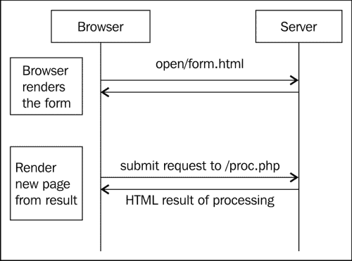
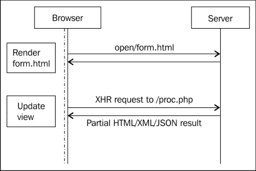
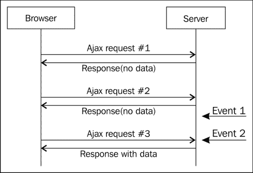
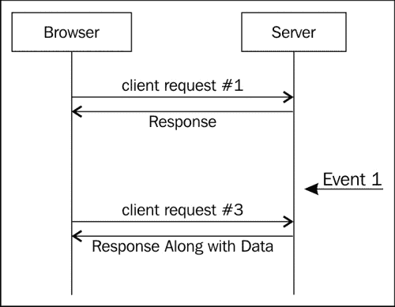
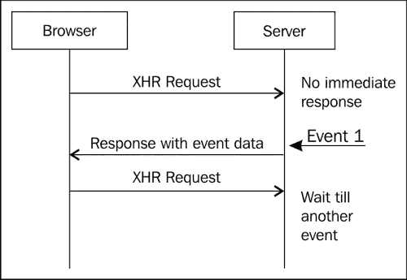

# 第一章. 在网络上实现实时性

阿拉伯之春革命是通过 Facebook 和 Twitter 等社交媒体网站引发的，并得到了推动。在接下来的几天里，社交媒体从仅仅是与家人和朋友互动的手段变成了赋予人民权力并带来世界重大变化的武器。每个人都注意到了人民的力量，人们也注意到了社交网络的能力。所有这一切的核心是使这一切成为可能的技术，这种技术消除了所有沟通的障碍，比野火传播得更快。这就是实时网络的力量！

# 什么是实时网络？

在网络上，我们已经习惯了点击链接或按钮、更改一些输入并执行某些操作，从而导致页面发生变化的应用程序和网站。但如果我们让我们的 Twitter 页面保持一段时间，当我们收到新的推文时，我们会收到警报，即使我们没有执行任何操作（如下一张截图所示）。这就是我们通常所说的“实时网络”的含义。

Twitter 上的实时更新

维基百科用以下这些话介绍了实时网络：

> 实时网络是一套技术和实践，使用户能够在作者发布信息时立即接收信息，而不是要求他们或他们的软件定期检查源以获取更新。

这“套技术”是网络中最热门的趋势之一。在接下来的几页中，我们将熟悉这些技术，并了解它们在各种应用中的使用。

# 一点历史

要理解和完全欣赏任何概念，了解它的来源和演变过程是很重要的。

实时网络并不是新事物；最早尝试使网络实现实时性的尝试之一是使用 Java 小程序。许多人会记得在 20 世纪 90 年代末在 Yahoo!聊天室聊天或下棋。然后出现了 Flash 和 ActiveX 插件。这不仅仅是为了“娱乐”（针对消费者部分），还用于企业市场。我在职业生涯的早期阶段为一家 BPM（业务流程管理）公司工作，他们当时开发了一个 ActiveX 插件，用于为他们的仪表板提供动力并实时更新流程信息。那么为什么现在很重要呢？因为实现实时功能的方式以及实现这种功能所涉及的成本已经发生了变化。从成为应用程序中的一个花哨功能，它已经变成了必需品——用户的需求。从成为应用程序中非法添加或技术上有挑战性的部分，它正在成为 WebSocket 和服务器发送事件（SSE）形式的认可标准。我们是如何从静态网络到现在的？

众所周知，网络（和网络应用）是建立在 HTTP 协议之上的。HTTP 是一个请求-响应系统，其中客户端向服务器发送信息请求，服务器以请求的信息进行响应。在大多数情况下，这些信息是浏览器将要渲染的 HTML 或相关信息，如 XML 或 JSON。以下图显示了 HTTP 浏览器-服务器交互：

HTTP 浏览器-服务器交互

在 1995 年，Sun 和 Netscape 宣布了一项合作，Netscape 将 Sun 的新 Java 运行时与其浏览器捆绑在一起。这是高度交互式网络的开始。尽管他们后来获得了非常糟糕的名声，但小程序是实时网络领域的先驱。在实时网络的早期，我们看到小程序被用于聊天、游戏，甚至是横幅广告。

在同一年，Netscape 提出了一种名为 JavaScript（最初称为 LiveScript）的脚本语言，另一家名为 FutureWave Software 的小公司开始开发一款名为 FutureSplash Animator 的动画软件。后来，这两者都成为了 Java 小程序几乎从网络中消失的原因。

FutureWave 在 1996 年被 Macromedia 收购，他们将 FutureSplash Animator 重命名为 Flash。正如我们所知，Flash 继续统治网络，成为创建动画、游戏、视频播放器和所有交互式内容的最大平台，在接下来的十年中占据了主导地位。

在 1999 年，Microsoft 使用其 iframe 技术和 JavaScript 更新了 Internet Explorer 默认主页上的新闻和股票报价（[`home.microsoft.com`](http://home.microsoft.com)）。同年，他们为 IE 发布了一个专有的 ActiveX 扩展，称为 XMLHTTP。这是 XML 成为“热门”事物的时代，每个人都想在他们所做的事情中使用 XML。这个 XMLHTTP 组件最初是为了使用 JavaScript 异步加载页面中的 XML 数据。它很快被 Mozilla、Safari 和 Opera 采用，作为 XMLHttpRequest（或简称 XHR）。但是，随着 Gmail（由 Google 推出）的推出，Jesse James Garrett 在一篇题为 *Ajax: A New Approach to Web Applications* 的文章中创造的术语 AJAX（异步 JavaScript 和 XML）成为了网络开发的流行语。以下图显示了 AJAX 请求：

AJAX 请求

Gmail 也展示了网页实时更新的优势，并打开了使用 AJAX 构建的各种黑客攻击的大门，以从服务器（或至少，给人一种这样做的感觉）推送数据。

这些技术统称为 Comet——这是 Alex Russell 在 2006 年他在博客中引入的一个术语。Comet 是对 Ajax 这个词的戏仿，两者在美国都是流行的家用清洁剂。Comet 并不是单一的方法。它引入了多种机制来给人一种数据从服务器推送到客户端的感觉。这些包括隐藏 iframe、XHR 轮询、XHR 长轮询和 script 标签长轮询（或 JSONP 长轮询）。

让我们了解这些是如何工作的，因为它们仍然是所有现代浏览器中最常见的机制。

其中第一种也是最简单易实现的是 XHR 轮询，其中浏览器定期轮询数据，服务器除非有数据要发送回浏览器，否则会一直响应空响应。在事件发生后，例如接收邮件或在数据库中创建/更新记录，服务器会使用新数据响应下一个轮询请求。以下图展示了这一机制：

XHR polling

如您所见，这里有一个问题。即使没有数据，浏览器也必须不断向服务器发送请求。这导致服务器在没有要发送的内容时获取和处理数据。

解决这个问题的方法之一是修改服务器，通过不仅发送客户端请求的数据，还附加服务器拥有的其他数据来“搭载”实际的客户端请求。客户端需要被修改以理解并处理这些额外的传入数据。以下图显示了 HTTP piggybacking 的过程：

HTTP piggybacking

由于新数据仅在客户端有动作时发送，这会导致数据到达浏览器的时间延迟。在快速接收事件的同时避免频繁的服务器查询的解决方案是长轮询。

在长轮询中，当浏览器向服务器发送请求时，如果服务器没有数据响应，它不会立即响应，并将挂起请求。一旦发生事件，服务器通过向客户端发送响应来关闭挂起的请求。一旦客户端收到响应，它就发送一个新的请求：

长轮询

长轮询有多种实现方式，例如永久性 iframe、多部分 XHR、带有 JSONP 的 script 标签和长生存期 XHR。

虽然所有这些技术都有效，但这些是黑客手段，通过弯曲 HTTP 和 XHR 来实现双向通信，而这并不是它们的目的。

随着 Firefox 和 Chrome 等浏览器快速的发展，HTML 的长期升级，即 HTML5，正在被广泛采用。在 HTML5 中，有两种新的从服务器向客户端推送数据的方法。一种是服务器发送事件（SSE），另一种是全双工 WebSockets。

服务器端事件尝试在浏览器之间标准化类似 Comet 的通信。在这种方法中，有一个 JavaScript API 用于创建事件源，即服务器可以发送事件的流。这是一个单向协议。我们仍然会使用老式的 XHR。当您不需要全双工通信时，这是一个很好的方法；只需从服务器向客户端推送更新。

另一个实现全双工通信协议的规范是 WebSockets。在 WebSockets 中，客户端与支持此协议的服务器建立 socket 连接，服务器和客户端将在此 socket 连接上发送和接收数据。

# 实时网络的应用

让我们快速看一下实时网络是如何改变我们每天在网络上遇到的应用程序的。

## 游戏

随着 Zynga 和其他社交游戏公司的成功，在线游戏已成为一种热门趋势。WordSquared 是一个大规模并行的在线多人填字游戏，而 BrowserQuest 是 Mozilla 尝试构建的浏览器内实时角色扮演游戏。基于 socket.io 构建的更受欢迎和公开宣传的游戏之一是 Rawkets。有许多基于 canvas 和实时通信系统构建的开源游戏引擎。

## 社交流更新

Twitter 是获取实时数据（推文）到浏览器而不需要用户操作的最好例子。Google+和 Facebook 也有。在社交网络上，重要的是能够实时了解发生的事情。

## 商业应用

CRM（客户关系管理）是商业并购中最重要的组成部分之一。将问题跟踪系统作为 CRM 出售的日子已经过去了。CRM 正在不断改进和自我革新。大多数 CRM 都在添加社交功能；他们每天都在增加更多功能。Salesforce——最受欢迎的托管 CRM 解决方案之一，推出了 Chatter。Chatter 为 CRM 添加了社交功能，并带来了许多由实时更新驱动的优势。它允许客户在系统上添加评论或发布更新，这些问题会实时出现在支持人员的系统中。BPM（业务流程管理）解决方案也在整合实时组件，以跟踪流程状态和更新。

## 基于网络的监控器

Google Analytics 的最新更新包括了一个功能，可以查看访问您网站的用户的实时更新。Splunk——一个广泛用于监控基础设施和机器数据的事件跟踪系统——允许您在实时更新的图表上监控和跟踪事件更新。

# 摘要

在本章中，我们看到了实时网络的样子，它的应用是什么，以及围绕实时网络的技术是如何在十年发展中演变的。在下一章中，我们将了解 Node.js，这是一个 JavaScript 网络应用程序开发平台，它是 socket.io 的主要目标。
