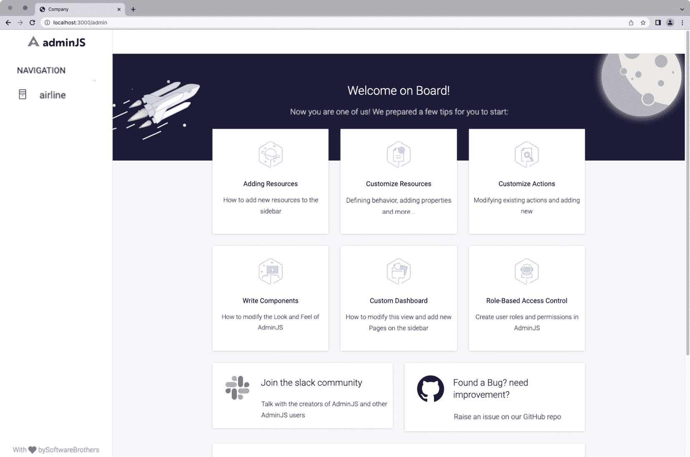
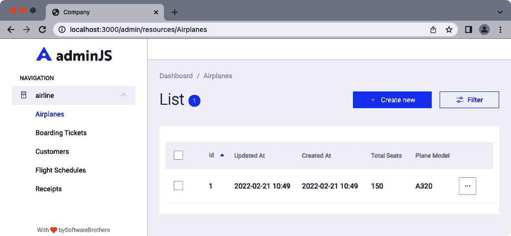
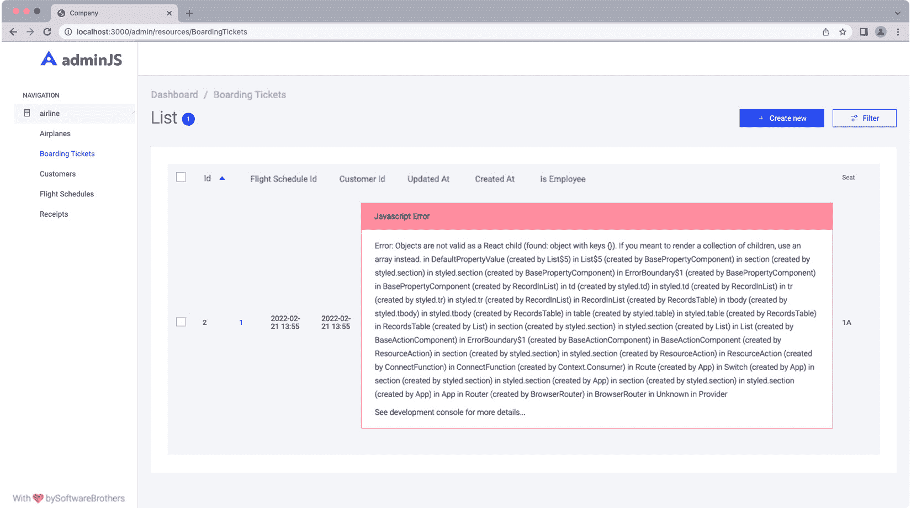
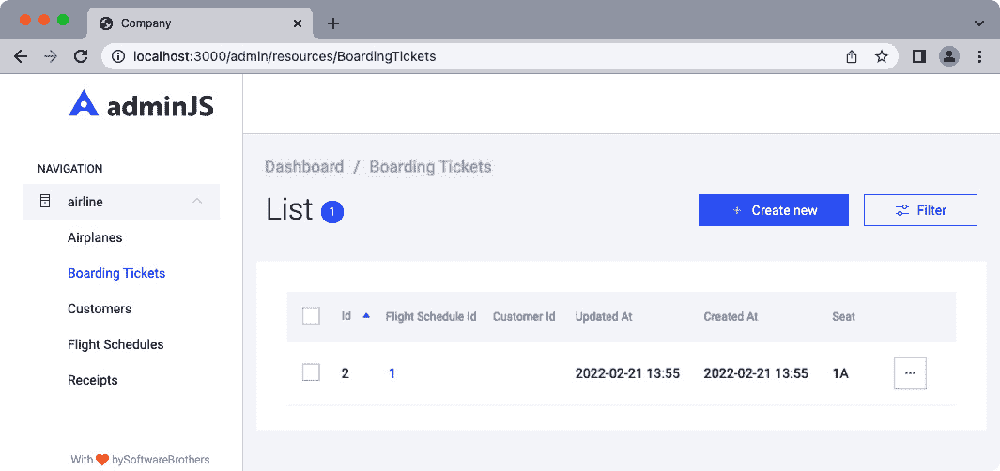
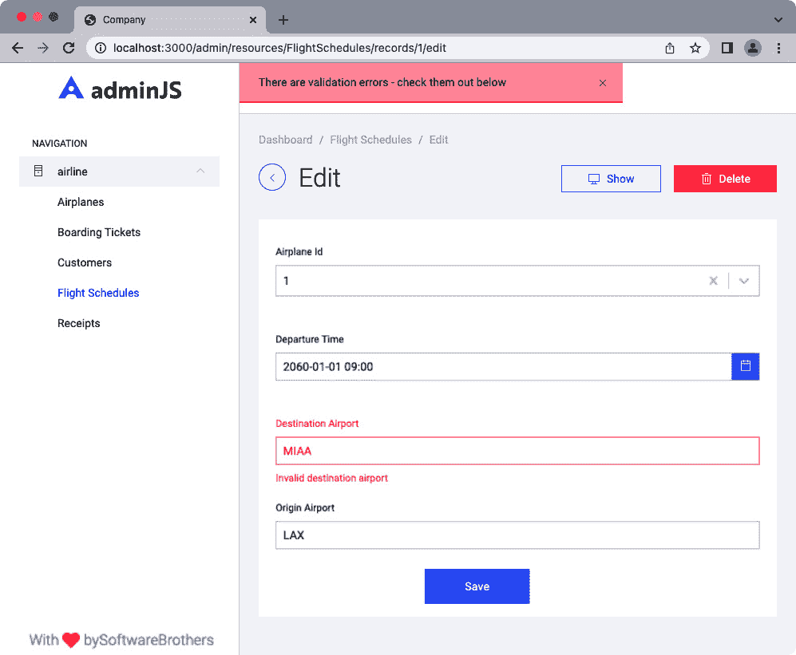
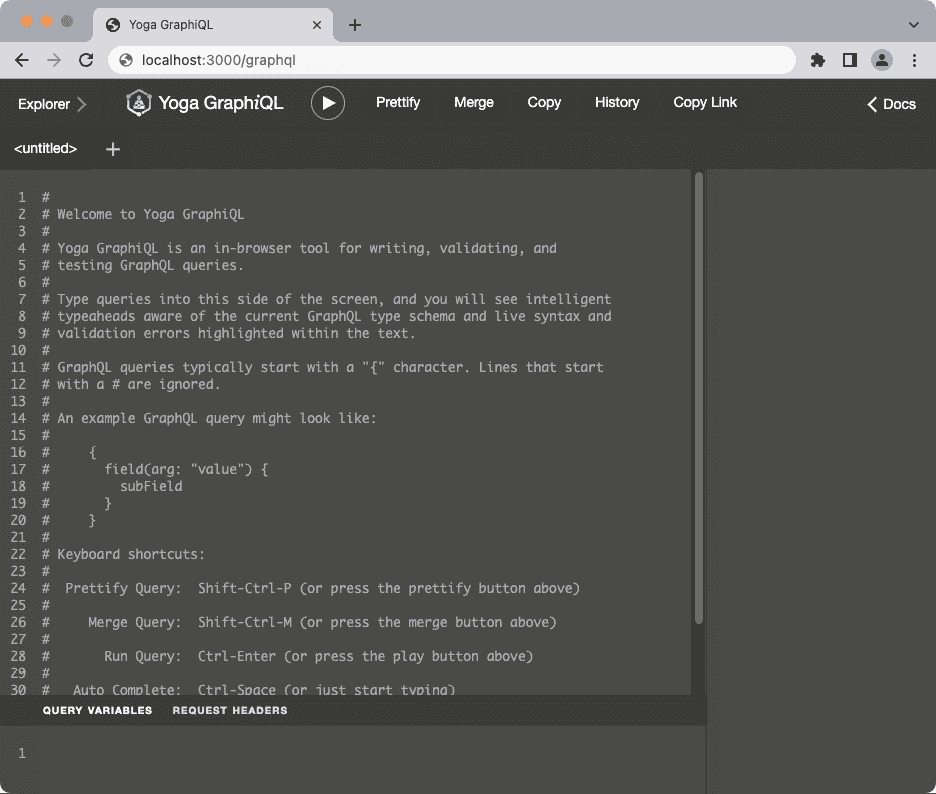

# 9

# 使用和创建适配器

经过几年的开发，您可能已经积累了一套常见的实用函数、其他框架的集合以及您自己的脚本库。维护所有这些动态部分可能对于一个企业项目或一系列微服务来说过于复杂。我们可以将通用代码重构为更通用的接口或模式，并将这些脚本重新分类为“适配器”（也称为“插件”）。

使用适配器可以节省我们开发时间，防止我们重复工作，并通过维护其代码库来帮助集中协作。适配器的一些例子包括将文本转换为特定的字符规则集、构建一个辅助项目，如行政仪表板，或提供缓存层。

Sequelize 通过允许通过对象原型化和其生命周期事件集成适配器和插件来扩展其行为。一旦我们熟悉了使用现有的适配器，我们将为 Sequelize 创建自己的适配器/扩展，为模型中的每个实例生成“slug URL”。

在本章中，我们将涵盖以下主题：

+   安装、配置和集成 AdminJS 与 Sequelize

+   将 Sequelize 与 GraphQL 集成

+   创建我们自己的适配器

# 技术要求

您可以在 GitHub 上找到本章的代码文件，位于 [`github.com/PacktPublishing/Supercharging-Node.js-Applications-with-Sequelize/tree/main/ch9`](https://github.com/PacktPublishing/Supercharging-Node.js-Applications-with-Sequelize/tree/main/ch9)

# 安装、配置和集成 AdminJS 与 Sequelize

AdminJS 是一个可以集成到各种数据库管理系统、ORM 和 Web 框架的行政仪表板。除了 AdminJS 能够为您的数据生成图表和表格之外，它还可以创建角色和访问控制列表、导出报告，并集中管理 **创建、读取、更新、删除** （**CRUD**） 操作的建模。

Avalon Airline 的投资者希望我们有一个仪表板，允许我们管理航班和机票，并显示基本报告数字，例如飞机总数和毛利润。AdminJS 似乎非常适合这里；我们可以从在 Avalon Airline 的根目录中安装必要的组件开始。

在终端中，我们可以通过执行以下命令来安装包：

```js
npm i adminjs @adminjs/express express-formidable @adminjs/sequelize tslib express-session
```

注意

`express-formidable` 模块是 `@adminjs/express` 包的依赖项。`formidable` 模块是一个具有低内存占用的高速流式多部分解析器。有关 formidable 及其功能的更多信息，您可以参考其位于 [`github.com/node-formidable/formidable`](https://github.com/node-formidable/formidable) 的 GitHub 仓库。

根据您安装的 `npm` 版本（8 或更高版本）以及安装的 `@adminjs/sequelize` 版本，您可能会遇到遗留依赖问题。由于我们的一个包（`@adminjs/sequelize`）需要一个旧的 Sequelize 模块路径（`sequelize` 与 `@sequelize/core`），我们可能会遇到缺失依赖问题，这些问题可以通过启用 `legacy-peer-deps` 或使用 `override` 选项来解决。

通常，我们想要避免使用 `legacy-peer-deps` 选项以避免破坏性更改。我们可以在 *package.json* 中使用 `override` 选项来解决问题，这将在 [`docs.npmjs.com/cli/v8/configuring-npm/package-json#overrides`](https://docs.npmjs.com/cli/v8/configuring-npm/package-json#overrides) 中解释得更详细。在 *package.json* 文件中，在 `scripts` 块下方，我们希望添加另一个块，如下所示：

```js
  "overrides": {
    "sequelize": "⁶"
  },
```

如果之前的 npm 安装步骤失败，我们可以在更新 *package.json* 后重试，这将解决 `@adminjs/sequelize` 包的 `sequelize` 版本要求。

现在，我们可以开始将 AdminJS 集成到我们的应用程序中。在 `index.js` 文件中，在最顶部，我们可以添加以下行，这将加载必要的 AdminJS 模块：

```js
const AdminJS = require("adminjs");
const AdminJSExpress = require("@adminjs/express");
const AdminJSSequelize = require("@adminjs/sequelize");
```

在 `const models = require("./models");` 行下方，我们现在可以添加以下行，这将注册 Sequelize 适配器用于 AdminJS：

```js
AdminJS.registerAdapter(AdminJSSequelize);
```

在该行下方，我们可以添加我们的 AdminJS 实例并构建 Express 路由器：

```js
const adminJs = new AdminJS({
    databases: [models.sequelize],
    resources: [
        models.Airplane,
        models.BoardingTicket,
        models.Customer,
        models.FlightSchedule,
        models.Receipts,
    ],
    rootPath: '/admin',
});

const router = AdminJSExpress.buildRouter(adminJs);
```

`model.sequelize` 是我们从 `models/index.js` 创建的实例。这将指示 AdminJS 使用 Sequelize 进行我们的连接。`resources` 键包含所有应暴露/适用于 AdminJS 的模型列表。`rootPath` 将是 AdminJS 的 Web 应用程序 URL 前缀。

在 `index.js` 文件中，在 `app.use(bodyParser.json({ type: 'application/json' }));` 行下方，我们现在可以添加 AdminJS 中间件以帮助集成到 Express：

```js
app.use(adminJs.options.rootPath, router);
```

现在，当我们启动浏览器到 `http://localhost:3000/admin` 时，我们应该看到类似于 *图 9.1* 的页面。

注意

在下一章，*部署 Sequelize 应用程序*中，我们将介绍如何通过密码保护应用程序来防止不受欢迎的访客修改数据库。



图 9.1 – AdminJS 欢迎仪表板

在左侧导航栏中，我们应该看到标记为**airline**的数据库。点击该链接将显示我们暴露的 Sequelize 模型。点击**Airplanes**将显示一个包含我们模型数据的简短表格，类似于*图 9.2*：



图 9.2 – 飞机模型表格

AdminJS 有一个小的限制；在撰写本文时，AdminJS 不支持 Sequelize 的虚拟数据类型，这些类型不是文本值。我们的`BoardingTickets`模型包含一个作为布尔值的虚拟类型。当我们点击**登机牌**菜单项时，我们会遇到类似于*图 9.3*的错误。



图 9.3 – AdminJS 显示来自虚拟类型的错误

为了解决这个问题，我们可以通过扩展 AdminJS 资源的选项来移除属性的可见性。在新`AdminJS(…)`块中，在`resources`键下，将`models.BoardingTicket`行替换为以下内容：

```js
        {
            resource: models.BoardingTicket,
            options: {
                properties: {
                    isEmployee: {
                        isVisible: false,
                    }
                }
            }
        },
```

这将指示 AdminJS 将`isEmployee`属性的可见性设置为`false`。现在，当我们刷新页面时，错误应该不再显示，如*图 9.4*所示。



图 9.4 – 使用虚拟类型解决 AdminJS 的错误

注意

要了解 AdminJS 属性配置中可调整的设置类型，你可以参考以下 API 文档：[`docs.adminjs.co/PropertyOptions.xhtml`](https://docs.adminjs.co/PropertyOptions.xhtml)。

AdminJS 还会自动集成到 Sequelize 的验证系统中。因此，如果我们编辑我们的航班计划并输入了一个无效的机场，我们会看到一个类似于*图 9.5*的错误。



图 9.5 – AdminJS 验证集成

当我们使用 AdminJS 初始化应用程序时，你可能会注意到在项目根目录中自动创建了一个名为`.adminjs`的新文件夹。这个目录中的文件仅适用于你的实例，不适用于部署或其他团队成员。

注意

你可能已经注意到一个包含`.adminjs`作为其内容的`.gitignore`文件。`.gitignore`文件用于防止文件夹、文件、匹配路径等被提交到 git 的对象空间中。如果你在一个使用版本控制的项目中工作，例如 Git，那么建议忽略`.adminjs`目录的提交。

不论是添加、删除、修改还是验证记录，AdminJS 都提供了一个非常方便的方式来管理模型。有时，方便可能会成为障碍，我们需要以 AdminJS 无法实现的方式查看或修改我们的记录。实现这一目标的一种方法是用一个 GraphQL 库。

# 将 Sequelize 与 GraphQL 集成

GraphQL 相对于 REST 等替代方案提供了一些优势。我们可以使用强类型声明数据形状，关联关系层次结构，并在查询数据时减少请求的数量。

GraphQL 是一种数据存储无关的查询语言。您可以将 GraphQL 模型与典型的**数据库管理系统**（**DBMS**）相关联，或者将其作为模型验证和塑形的抽象。

这里是一个 GraphQL 模式定义的示例：

```js
type User {
  name: String!
  bio: String
  roles: [Role!]!
}
type Role {
  name: String!
}
```

`User`类型有三个属性，其中`name`和`roles`是必需的（用感叹号表示），而`bio`定义是一个可选的字符串。在这个例子中，`User`类型的`roles`属性将始终返回一个包含零个或多个项的数组，这些项位于括号外的感叹号（`[...]!`）之外，而另一个感叹号表示集合中的每个项都将是非空值并返回一个`Role`类型。

类型仅引用一个对象，但有两个类型是为 GraphQL 本身保留的，即`Query`和`Mutation`类型。查询类型保留用于定义类型集合的输入参数和关系以及关联。`Mutation`类型用于我们想要修改数据时。您可以将查询视为`GET`请求，将突变查询视为`POST`和`PUT`HTTP 方法的组合。

要查询前面示例的类型，我们将调用一个查询类型，如下所示：

```js
type Query {
  query usersByName($name: String!) {
    users(name: $name) {
      name
      bio
      roles {
        name
      }
    }
  }
}
```

此示例将生成一个名为`usersByName`的函数，该函数有一个必需的字符串输入参数。该函数将产生任何名称与`$name`变量匹配的`User`类型。每条记录将返回名称、bio 以及与该用户关联的角色数组。返回的数据形状将类似于以下内容：

```js
{
    "data": {
        "usersByName": {
            "users": [
                {
                    "name": "Bob",
                    "bio": "Programmer",
                    "roles": []
                },
                {
                    "name": "Bob",
                    "bio": "Lead",
                    "roles": [{"name": "Admin"}]
                }
            ]
        }
    }
}
```

Mick Hansen，Sequelize 的原始维护者之一，创建了一个名为 sequelize-graphql 的 NPM 包，该包将帮助我们通过 GraphQL 类型定义桥接我们的模型。要在我们的当前项目中开始使用 GraphQL 与 Sequelize，我们需要安装以下 NPM 模块：

```js
npm i --save graphql-sequelize @graphql-yoga/node graphql-relay
```

`graphql-sequelize`库可能需要旧版本或冲突版本的`graphql`和`graphql-relay`库。我们需要修改`package.json`文件中的`override`对象，如下所示，以解决这些问题：

```js
  "overrides": {
    "graphql": "¹⁵",
    "graphql-relay": "⁰.10.0",
    "sequelize": "⁶"
  },
```

`graphql-yoga`包是一个专注于性能和易用性的 GraphQL 服务器框架。其 GitHub 仓库可在此处找到：[`github.com/dotansimha/graphql-yoga`](https://github.com/dotansimha/graphql-yoga)。

第一步是为每个模型添加一个静态常量，称为`tableName`，其值应为`sequelize-graphql`插件中模型的表名。

我们将从`models/airplane.js`文件开始；在`class Airplane extends Model`行下，添加以下变量：

```js
static tableName = 'Airplanes';
```

在`models/boardingticket.js`文件中，在`class BoardingTicket extends Model`行下，添加以下变量：

```js
static tableName = 'BoardingTickets';
```

在`models/customer.js`文件中，在`class Customer extends Model`行下，添加以下变量：

```js
static tableName = 'Customers';
```

在`models/flightschedule.js`文件中，在`class FlightSchedule extends Model`行下，添加以下变量：

```js
static tableName = 'FlightSchedules';
```

在 `models/receipts.js` 文件中，在 `class Receipts extends Model` 行下面，添加以下变量：

```js
static tableName = 'Receipts';
```

现在，我们可以开始声明我们的类型定义和查询解析器模式，用于 GraphQL 服务器。在项目根目录下，添加一个名为 `graphql.js` 的新文件，从以下 `require` 命令开始：

```js
const { createServer } = require("@graphql-yoga/node");
const { resolver } = require("graphql-sequelize");
const models = require("./models");
```

接下来，我们想要开始定义我们用于以后执行查询的查询接口。你可以把它想象成“C”语言项目中类似头文件的东西：

```js
const typeDefs = `
  type Query {
    airplane(id: ID!): Airplane
    airplanes: [Airplane]
    boardingTicket(id: ID!): BoardingTicket
    boardingTickets: [BoardingTicket]
    customer(id: ID!): Customer
    customers: [Customer]
    flightSchedule(id: ID!): FlightSchedule
    flightSchedules: [FlightSchedule]
    receipt(id: ID!): Receipt
    receipts: [Receipt]
  }
```

在保持 `typeDef` 变量打开的同时，我们可以添加一个简单的 `Mutation` 查询示例：

```js
  type Mutation {
    upsertAirplane(name: String!, data: AirplaneInput!): 
    Airplane
  }
  input AirplaneInput {
    planeModel: String
    totalSeats: Int
  }
  type Airplane {
    id: ID!
    planeModel: String
    totalSeats: Int
    schedules: [FlightSchedule]
  }
```

接下来，我们可以将我们的模型模式添加到定义中：

```js
  type Airplane {
    id: ID!
    planeModel: String
    totalSeats: Int
    schedules: [FlightSchedule]
  }
  type BoardingTicket {
    id: ID!
    seat: String
    owner: Customer
  }
  type Customer {
    id: ID!
    name: String
    email: String
    tickets: [BoardingTicket]
  }
  type FlightSchedule {
    id: ID!
    originAirport: String
    destinationAirport: String
    departureTime: String
  }
  type Receipt {
    id: ID!
    receipt: String
  }
`;
```

接下来，我们希望设置我们的解析器以将类型定义与正确的 Sequelize 模型关联关联起来。让我们从查询解析器开始：

```js
const resolvers = {
  Query: {
    airplane: resolver(models.Airplane),
    airplanes: resolver(models.Airplane),
    boardingTicket: resolver(models.BoardingTicket),
    boardingTickets: resolver(models.BoardingTicket),
    customer: resolver(models.Customer),
    customers: resolver(models.Customer),
    flightSchedule: resolver(models.FlightSchedule),
    flightSchedules: resolver(models.FlightSchedule),
    receipt: resolver(models.Receipts),
    receipts: resolver(models.Receipts),
  },
```

接下来，我们可以添加一个 `Mutation` 解析器示例：

```js
  Mutation: {
    async upsertAirplane(parent, args, ctx, info) {
        const [airplane, created] = await models.Airplane.
        findOrCreate({
            where: {
                planeModel: args.name
            },
            defaults: (args.data || {}),
        });
        // if we created the record we do not need to 
           update it
        if (created) {
            return airplane;
        }
        if (typeof args.data !== "undefined") {
            await airplane.update(args.data);
        }
        return airplane;
    }
  },
```

然后，我们可以解析我们的模型关联并关闭变量：

```js
  Airplane: {
    schedules: resolver(models.Airplane.FlightSchedules),
  },
  BoardingTicket: {
    owner: resolver(models.BoardingTicket.Customer),
  },
  Customer: {
      tickets: resolver(models.Customer.BoardingTickets),
  },
};
```

最后，我们可以使用模式定义创建我们的服务器并将其导出：

```js
const server = new createServer({
  schema: {
    typeDefs,
    resolvers,
  }
});
module.exports = { server };
```

在项目根目录下的 `index.js` 文件中，在我们的 `var models = require("./models")` 行下面，我们可以添加以下一行：

```js
const { server } = require("./graphql");
```

在我们挂载了 AdminJS 路由后，`app.use(adminJs.options.rootPath, router)`，添加以下一行：

```js
app.use('/graphql', server);
```

在我们完成 `index.js` 的修改后，我们可以启动我们的应用程序：

```js
npm run start
```

一旦服务器启动并运行，我们可以在浏览器中通过访问以下 URL 来访问 GraphQL Yoga 的仪表板界面（*图 9.6*）：[`http://localhost:3000/graphql`](http://localhost:3000/graphql)：

注意

在生产部署中，我们可能希望根据 `process.env.NODE_ENV` 的值禁用此路由，或者在 `index.js` 中的 `/graphql` 路由上添加基于身份验证的中间件。



图 9.6 – GraphQL Yoga 仪表板

我们可以通过在仪表板中执行查询来测试我们的查询和解析器。删除仪表板记事本部分的所有当前内容，并输入以下内容：

```js
{
  airplanes {
    id
    planeModel
    totalSeats
  }
}
```

顶部应该有一个“播放按钮”，点击它将执行您的查询（或者，同时按下 *Ctrl* 和 *Enter* 键也可以达到同样的效果），这将产生类似于以下的结果：

```js
{
  "data": {
    "airplanes": [
      {
        "id": "1",
        "planeModel": "A320",
        "totalSeats": 150
      }
    ]
  }
}
```

如果我们想要更新飞机的模型名称，我们可以使用一个 `mutation` 查询：

```js
mutation {
  upsertAirplane(name:"A320", data:{planeModel:"A321"}) {
    planeModel
  }
}
```

这将返回以下结果：

```js
{
  "data": {
    "upsertAirplane": {
      "planeModel": "A321"
    }
  }
}
```

在 GraphQL Yoga 仪表板中，顶部右方应该有一个 **< Docs** 链接（参见图 9.6*），点击它将打开一个抽屉面板。然后会有一个 **Query** 链接，这将暴露我们的查询和类型定义。这应该有助于在仪表板中使查询更加容易。

现在我们已经建立了一个 GraphQL 服务器和我们的 Sequelize 模型之间的连接，并集成了另一个提供易于使用的管理仪表板的适配器，是时候为我们自己的 Sequelize 构建适配器了。

# 创建我们自己的适配器

Sequelize 通过其类属性、生命周期事件和配置相当可扩展。对于创建 Sequelize 自定义适配器的示例，我们将集成一个新的数据类型，该类型将自动使用一组特定的规则将值转换为所谓的“slug URL”。slug URL 通常由连字符代替空格、小写字母，并移除所有特殊字符。

让我们看看创建我们的适配器的步骤：

1.  我们将开始安装任何必要的包。保留特殊字符字符映射的副本可能是一项艰巨的任务，因此我们将使用一个名为 `github-slugger` 的 `npm` 包来帮助我们：

    ```js
    npm i --save github-slugger
    ```

1.  接下来，我们希望创建几个目录和一个文件，其路径为从项目根目录到 `plugins/slug/index.js`。在我们能够开始在该文件中编码之前，我们需要将 `slug` 列添加到数据库中的一个表中。我们将使用 Airplane 模型作为此示例；使用 `sequelize-cli` 命令，我们可以创建一个新的迁移事件：

    ```js
    sequelize-cli migration:create --name add_slug_to_airplanes
    ```

此命令应在 `migrations` 目录中生成一个以 `add_slug_to_airplanes.js` 结尾的新文件。

1.  将文件内容替换为以下内容：

    ```js
    'use strict';
    module.exports = {
      up: async (queryInterface, Sequelize) => {
        await queryInterface.addColumn(
          'Airplanes',
          'slug',
          {
            type: Sequelize.STRING,
            allowNull: true,
          },
        );
        await queryInterface.addIndex(
          'Airplanes',
          ['slug'],
          {
            name: 'airplanes_slug_uniq_idx',
            unique: true,
          },
        );
      },
      down: async (queryInterface, Sequelize) => {
        await queryInterface.removeIndex('Airplanes', 
        'airplanes_slug_uniq_idx');
        await queryInterface.removeColumn('Airplanes', 
        'slug');
      },
    };
    ```

这将指示 Sequelize 在 `Airplanes` 表中创建一个名为 `slug` 的新列，作为文本值，并关联一个与该列相关的唯一索引。

1.  要执行最新的迁移，我们将运行 `db:migrate` 命令：

    ```js
    sequelize-cli db:migrate 
    ```

在列被添加到 Airplanes 表之后，我们还需要手动将其属性添加到 `models/airplanes.js` 文件中。

1.  将 `totalSeats` 属性块替换为以下内容：

    ```js
        totalSeats: {
          type: DataTypes.INTEGER,
          validate: {
            min: {
              args: 1,
              msg: 'A plane must have at least one seat'
            }
          }
        },
        slug: {
          type: DataTypes.STRING,
          unique: true,
        },
    ```

1.  在 `graphql.js` 文件中，我们希望将 `slug` 列添加到 `Airplane` 类型定义中：

    ```js
      type Airplane {
        id: ID!
        planeModel: String
        totalSeats: Int
        slug: String
        schedules: [FlightSchedule]
      }
    ```

1.  现在，我们可以开始编辑 `plugins/slug/index.js` 文件，从以下代码行开始：

    ```js
    const slug = require("github-slugger").slug;
    class SlugPlugin {
        use(model, options) {
            const DEFAULTS = {
                column: 'slug',
                source: 'name',
                transaction: null,
            };
            options = {...DEFAULTS, ...options};
    ```

这将创建一个名为 `SlugPlugin` 的类，其中有一个名为 `use` 的方法。输入参数是 `model` 类、一些选项及其默认值。

1.  在这些块下面，我们将创建我们的 `generateSlug` 方法：

    ```js
            // concat the fields for the slug
            function generateSlug(instance, fields) {
                return slug(fields.map((field) => 
                instance[field]));
            }
    ```

1.  接下来，我们希望确保在更新之前 slug 不存在。我们希望创建一种查找方法和一个增量方法来找到一个唯一的值。我们可以从下面的查找方法开始：

    ```js
            async function findSlug(slug) {
                return await model.findOne({
                    where: {
                        [options.column]: slug
                    },
                    transaction: options.transaction || 
                    null,
                });
            }
    ```

1.  现在是增量方法；此函数将循环运行，直到使用 slug 的值和整数组合找到一个唯一的匹配项。理想情况下，在真实的生产环境中，我们会想出一种更聪明的方法来找到唯一的值（例如，附加一个哈希而不是增量变量），但为了简洁，我们将创建此函数：

    ```js
            async function incrementSuffix(slugVal) {
                let found = false;
                let cnt = 1;
                let suffix = "";
                while (!found) {
                    suffix = `${slugVal}-${cnt}`;
                    found = await findSlug(suffix);
                    cnt++;
                }
                return suffix;
            }
    ```

1.  我们现在可以开始创建主要事件函数。首先，我们将检查我们的 slug 的适用属性（在这个例子中是 `planeModel` 属性）是否已被修改。如果没有被更改，那么我们将跳过整个事件，因为没有事情要做：

    ```js
            async function onSaveOrUpdate(instance) {
                const changed = options.source.
                some(function (field) {
                    return instance.changed(field);
                });
                if (!changed) {
                    return instance;
                }
    ```

1.  接下来，我们将比较当前值与新生成的值。如果它们相同（例如，字母大小写的变化），则简单地跳过事件：

    ```js
                let curVal = instance[options.column];
                let newVal = generateSlug(instance, 
                options.source);
                if (curVal !== null && curVal == newVal) {
                    return instance;
                }
    ```

1.  现在，我们可以检查新生成的值是否唯一，如果是，则将实例的`slug`属性设置为该值并返回实例：

    ```js
                let slugExist = await findSlug(newVal);
                if (!slugExist) {
                    instance[options.column] = newVal;
                    return instance;
                }
    ```

1.  否则，我们将想要使用我们的`incrementSuffix`方法，并在之后返回实例：

    ```js
                newVal = await incrementSuffix(newVal);
                instance[options.column] = newVal;
                return instance;
    ```

1.  之后，我们可以关闭`event`方法，将其附加到模型的生存周期事件上，并关闭`SlugPlugin`类：

    ```js
            }
            // use the lifecycle events for invoking the 
               onSaveOrUpdate event
            model.addHook('beforeCreate', onSaveOrUpdate);
            model.addHook('beforeUpdate', onSaveOrUpdate);
        }
    }
    ```

1.  最后，我们可以导出我们插件的一个实例以及类定义本身：

    ```js
    const instance = new SlugPlugin();
    module.exports = instance;
    module.exports.SlugPlugin = instance;
    ```

1.  在`models/airplanes.js`文件中，我们希望将我们的新插件与模型集成。在文件顶部，我们可以像这样包含插件：

    ```js
    const slugPlugin = require('../plugins/slug');
    ```

1.  在模型的定义之后，在`return Airplane`行之前，我们可以将`slug`插件与模型关联：

    ```js
      slugPlugin.use(Airplane, {
        source: ['planeModel']
      });
    ```

这将告诉我们的插件在生成 slug 值时使用`planeModel`属性作为源字段。

1.  为了测试我们的插件，我们可以前往位于`http://localhost:3000/graphql`的 GraphQL 仪表板，并输入以下命令：

    ```js
    mutation {
      upsertAirplane(name:"A321", data:{planeModel:
      "A321 B"}) {
        planeModel
        totalSeats
        slug
      }
    }
    ```

这将找到并更新我们的 A321 飞机的`planeModel`值，同时设置一个`slug`值，如下所示：

```js
{
  "data": {
    "upsertAirplane": {
      "planeModel": "A321 B",
      "totalSeats": 150,
      "slug": "a321-b"
    }
  }
}
```

这完成了我们的自定义 Sequelize 适配器部分。您可以在使用 Sequelize 的任何其他项目中使用`plugins/slug/index.js`适配器。请随意将`slug`列添加到其他模型中，但请确保遵循必要的步骤：

1.  生成迁移文件并将列更改迁移到数据库。

1.  更新`graphql.js`文件，添加适当的数据类型定义。

1.  在适用模型的文件中包含`plugin`库，并使用`use`方法将插件与模型关联。

# 摘要

在本章中，我们介绍了安装与数据库集成的仪表板的过程，使用第三方库集成 GraphQL，以及创建我们自己的 Sequelize 适配器，该适配器将自动添加 slug 值。

在下一章中，我们将开始开发我们的网站，使其更具生产准备性和功能完整性。这些功能包括列出时间表、订购票务和输入客户信息。
