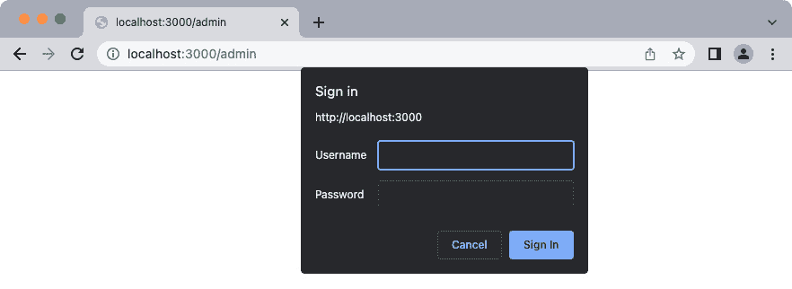
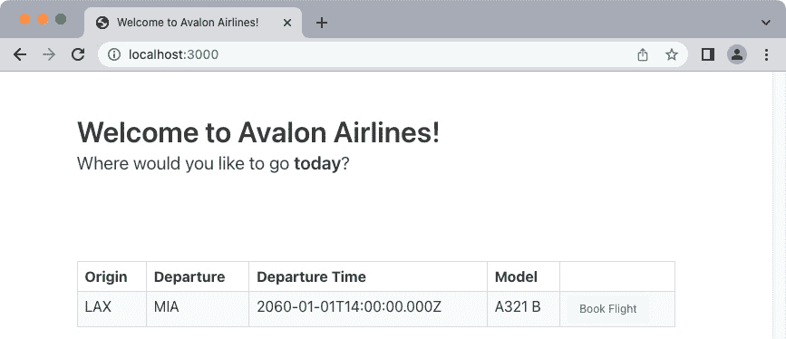
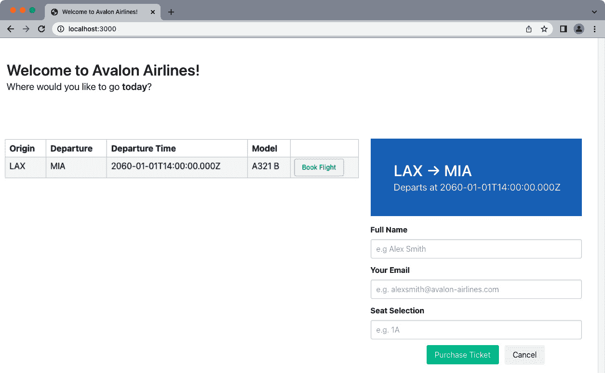
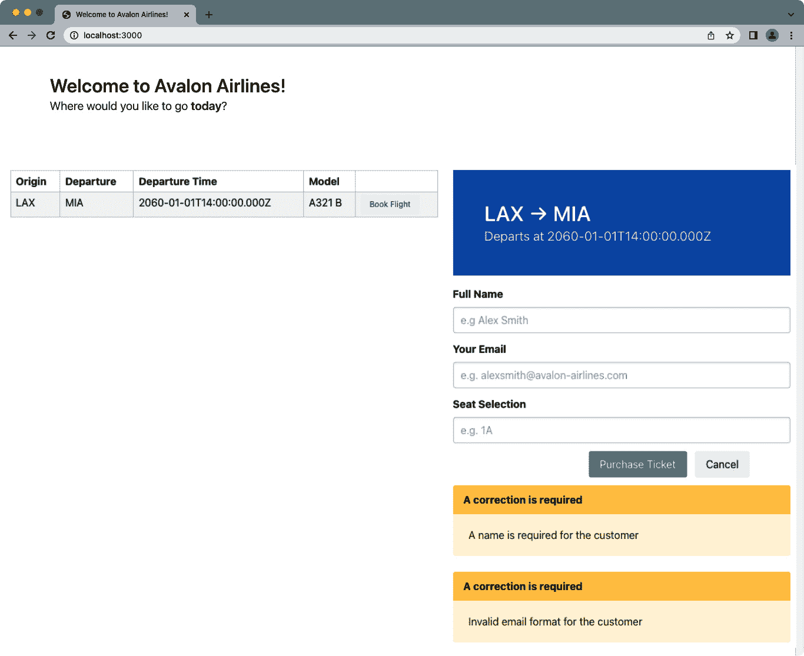
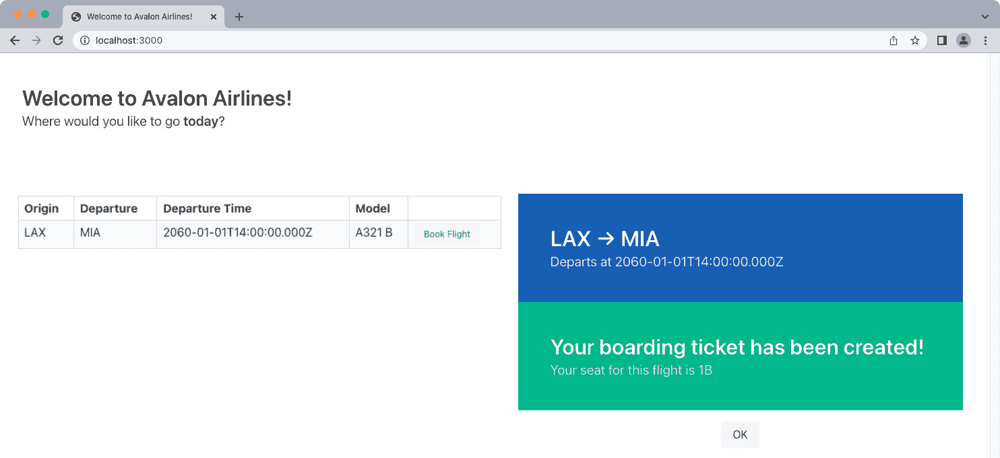
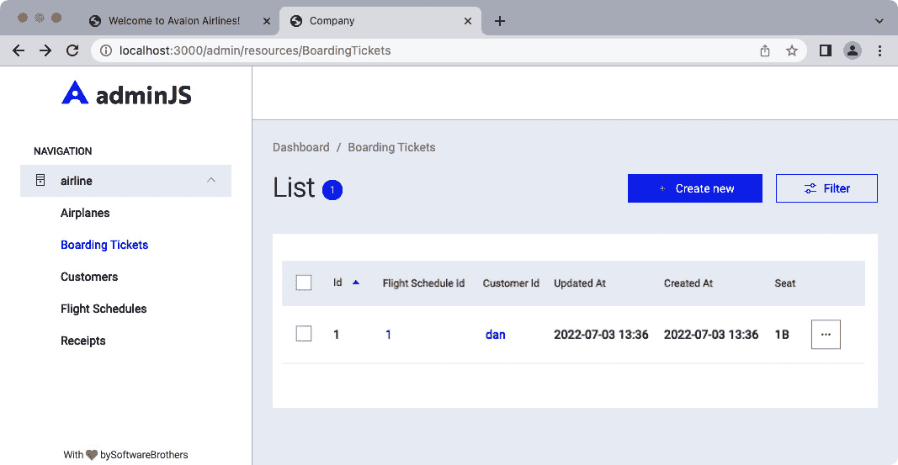
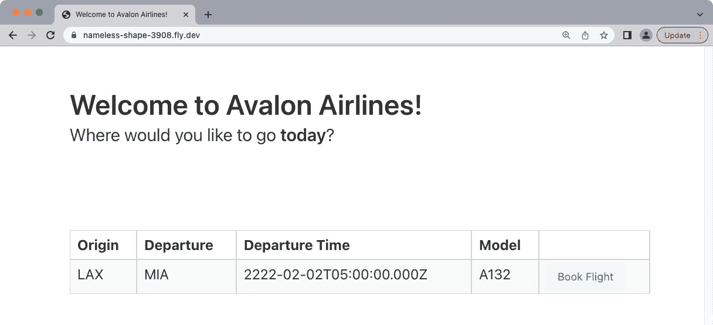

# 10

# 部署 Sequelize 应用程序

在安装了管理仪表板、配置了我们的 Web 应用程序以预订航班并构建了后端服务器之后，我们现在可以开始开发前端界面并部署应用程序。正好及时，因为我们的董事会成员希望看到一些进展，并且他们希望看到购买票证的运行原型。

在本章中，为了满足董事会成员的要求，我们需要执行以下操作：

+   重构一些当前的路由并添加另一个列出航班时刻表的路由

+   集成 Express 的静态中间件并保护管理界面

+   创建一个页面来列出和预订航班

+   将应用程序部署到 Fly.io 等服务

# 技术要求

对于本章的任务，我们将安装以下附加软件：

+   一个名为 Git 的版本控制管理器

+   部署到云应用程序平台的 Fly.io CLI

您可以在 GitHub 上找到本章的代码文件，地址为[`github.com/PacktPublishing/Supercharging-Node.js-Applications-with-Sequelize/tree/main/ch10`](https://github.com/PacktPublishing/Supercharging-Node.js-Applications-with-Sequelize/tree/main/ch10)。

# 重构并添加航班时刻表路由

在我们开始创建购买登机牌的客户界面之前，我们需要对我们的代码库进行一些调整。让我们首先创建一个位于`routes/airplanes.js`的新文件，并将`app.post('/airplanes', …)`和`app.get('/airplanes/:id', …)`块移动到该文件中，如下所示：

```js
async function getAirplane(req, res) {
    const airplane = await models.Airplane.findByPk
     (req.params.id);
    if (!airplane) {
        return res.sendStatus(404);
    }
    res.json(airplane);
}
exports.getAirplane = getAirplane;
```

此路由将根据主键返回一个`Airplane`模型记录，主键在 Express 的请求对象中定义（由`:id`符号表示）。如果没有找到记录，则返回`404`（未找到）状态。

接下来，我们将从`routes/flights.js`中的`createAirplane`代码块将其移动到`routes/airplanes.js`文件中：

```js
async function createAirplane(req, res) {
    const { name, seats } = req.body;
    try {
        const airplane = await models.Airplane.create({
            planeModel: name,
            totalSeats: seats,
        });
        return res.json(airplane);
    } catch (error) {
        res.status(500).send(error);
    }
}
exports.createAirplane = createAirplane;
```

在`routes/flights.js`中，我们希望添加一个名为`flightSchedules`的新处理程序：

```js
async function flightSchedules(req, res) {
    const records = await models.FlightSchedule.findAll({
       include: [models.Airplane]
    });
    res.json(records);
}
exports.flightSchedules = flightSchedules;
```

之后，在项目根目录下的`index.js`文件中，我们可以删除`app.get('/', …)`块并修改需要匹配新方法路径的路线要求块（在我们删除的块上方）如下：

```js
const { bookTicket } = require("./routes/tickets")
const { createSchedule, flightSchedules } = 
require("./routes/flights");
const { getAirplane, createAirplane } = 
require("./routes/airplanes");
```

`app.get('/airplanes/:id', …)`块现在应如下所示：

```js
app.get('/airplanes/:id', getAirplane);
```

在下面，我们可以添加航班时刻表路由：

```js
app.get('/flights', flightSchedules);
```

接下来，我们将想要调整客户模型返回的错误。在`models/customers.js`中，将现有的属性替换为以下代码：

```js
    name: {
      type: DataTypes.STRING,
      validate: {
        notEmpty: {
            msg: "A name is required for the customer",
        }
      }
    },
    email: {
      type: DataTypes.STRING,
      validate: {
        isEmail: {
            msg: "Invalid email format for the customer",
        }
      }
    }
```

最后，对于航班和预订票证的最后修改，我们需要对`routes/tickets.js`文件进行一些调整。首先，我们希望在文件顶部添加 Sequelize 的`ValidationError`：

```js
const { ValidationError } = require("@sequelize/core");
```

由于我们将在预订过程中查找或创建客户，我们希望将`req.body`行更改为以下内容：

```js
const { scheduleId, seat, name, email } = req.body;
```

在此行下方，我们将添加以下内容：

```js
const [customer] = await models.Customer.findOrCreate({
    where: {
        email,
    },
    defaults: {
        name,
    }
});
```

这将告诉 Sequelize 使用电子邮件作为键来查找或创建一个客户记录，并且将从 `POST` 请求中填充记录的名称（如果记录是新的）。

在 `await schedule.addBoardingTicket(…)` 块上方，我们希望添加一个定义新创建登机牌客户关联的方法：

```js
await boardingTicket.setCustomer(
 customer,
 { transaction: tx }
);
```

此文件剩余的修改是将 `catch` 块替换为以下代码：

```js
    } catch (error) {
        if (error instanceof ValidationError) {
            let errObj = {};
            error.errors.map(err => {
               errObj[err.path] = err.message;
            });
            return res.status(400).json(errObj);
        }
        if (error instanceof Error) {
            return res.status(400).send(error.message);
        }
        return res.status(400).send(error.toString());
    }
```

此错误块将检查传入的错误是否为 Sequelize `ValidationError` 类型，如果是，则将错误映射到 `errorObj`，其中列（`err.path`）作为键，错误消息（`err.message`）作为值 - 然后，它将返回 `error` 对象。下一个 `if` 块将检查错误是否为通用的 `Error` 类型，如果是，则返回 `error.message` 值 - 否则，它将返回 `error` 变量作为字符串。这将提供一种更方便的方式来处理错误，以便快速原型网站。

这些都是管理航班和创建机票所必需的所有修改。下一步是为我们的静态资产打下基础并确保我们的管理仪表板安全。

# 集成 Express 的静态中间件和确保管理界面安全

在将我们的应用程序公开给公众之前，我们需要确保管理仪表板路由安全，同时公开静态资产以供前端开发使用。首先，我们希望创建一个新目录，并在 `public/index.xhtml` 中放置一个空文件。之后，我们可以开始修改位于项目根目录中的 `index.js` 文件。在顶部，我们需要 Node.js 的路径模块：

```js
const path = require("path");
```

在 `app.use('/graphql', server)` 块下方，我们希望告诉 Express 服务器公共目录中找到的静态资产：

```js
app.use(express.static(path.join(__dirname, "public")));
```

Express 将在级联到我们的 API 路由（例如 `/airplanes` 或 `/flights`）之前，在公共目录中尝试找到相关路由的匹配文件。我们在这里使用 `path.join` 的原因是为了避免相对路径的不匹配，这允许我们从任何目录运行应用程序。

接下来，我们希望确保我们的管理仪表板安全 - 为了简洁起见，我们将使用 HTTP 认证方法。这需要我们安装 `express-basic-auth` 包：

```js
npm i --save express-basic-auth
```

在 `index.js` 的顶部添加要求：

```js
const basicAuth = require("express-basic-auth");
```

将 `app.use(adminJs.options.rootPath, router)` 块替换为以下内容：

```js
app.use(adminJs.options.rootPath, basicAuth({
        users: { 'admin': 'supersecret' }, challenge: true,
        }), router);
```

这将告诉 Express 在访问 AdminJS 根路径时请求用户名和密码组合（分别是 `admin` 和 `supersecret`）。现在，当我们启动应用程序并转到 `http://localhost:3000/admin` 时，我们应该会看到一个类似于 *图 10.1* 中的登录对话框：



图 10.1 – 管理登录

现在，我们的 AdminJS 路由已经安全，我们可以开始创建客户在访问应用程序时将看到的前端页面。

注意

在实际场景的应用程序中，我们不会使用基本身份验证，而是会使用其他形式的身份验证，例如 JSON Web Tokens 或单点登录服务。

# 创建一个列出和预订航班的页面

对于这个应用程序，我们将需要两个外部库来帮助构建应用程序的前端组件。第一个库是**Bulma**，这是一个为快速原型设计而设计的 CSS 框架，不需要自己的 JavaScript 库。有关 Bulma 的更多信息，您可以访问其网站，位于[`bulma.io/`](https://bulma.io/)。下一个库是**AlpineJS**，这是一个框架，它通过使用 HTML 标签和标记来帮助我们避免编写 JavaScript 来修改状态或行为。更多信息可以在[`alpinejs.dev/`](https://alpinejs.dev/)找到。

注意

可以用作 AlpineJS 替代品的其他出色的前端框架包括 VueJS、React 或 Deepkit。AlpineJS 被选为这本书的原因是其最小化的设置和需求。

让我们从最基本的需求开始，这是网站简单页眉部分的 HTML：

1.  在`public/index.xhtml`中，添加以下代码：

    ```js
    <!DOCTYPE html>
    <html>
    <head>
      <meta charset="utf-8">
      <meta name="viewport" content="width=device-width, initial-scale=1">
      <title>Welcome to Avalon Airlines!</title>
      <link rel="stylesheet" href="https://cdn.jsdelivr.net/npm/bulma@0.9.4/css/bulma.min.css">
      <script src="img/cdn.min.js" defer></script>
    </head>
    <body>
      <section class="section">
        <div class="container">
          <h1 class="title">
            Welcome to Avalon Airlines!
          </h1>
          <p class="subtitle">
            Where would you like to go 
             <strong>today</strong>?
          </p>
        </div>
      </section>
    </body>
    </html>
    ```

1.  在第一个`<section>`之后，我们希望添加另一个带有两个列分隔的容器：

    ```js
      <section class="section">
        <div class="container">
          <div class="columns" x-data="{
                        flights: [],
                        selected: {}
                      }" x-init="fetch('/flights')
                          .then(res => res.json())
                          .then(res => flights = res)">
            <div class="column">
            </div>
            <div class="column">
          </div>
        </div>
      </section>
    ```

`x-data`属性将告诉 AlpineJS 我们的模型和数据将保持什么形状。这些数据将被传播到子元素。`x-init`属性将在元素的初始化时运行，并从我们的 API 调用`/flights`。之后，我们获取结果并将它们转换为 JSON 对象，然后我们将 JSON 响应分配给`x-data`属性中的`flights`数组。

1.  在第一列，从我们刚刚创建的章节开始，我们希望创建一个表格，以渲染所有可用的航班：

    ```js
    <table class="table is-bordered is-striped is-narrow is-hoverable is-fullwidth">
        <thead>
          <tr>
            <th>Origin</th>
            <th>Departure</th>
            <th>Departure Time</th>
            <th>Model</th>
            <th></th>
          </tr>
        </thead>
        <tbody>
          <template x-for="flight in flights">
            <tr>
              <td x-text="flight.originAirport"></td>
              <td x-text="flight.destinationAirport"></td>
              <td x-text="flight.departureTime"></td>
              <td x-text=
               "flight.Airplane.planeModel"></td>
              <td><button x-on:click="selected = flight" 
               class="button is-primary is-light is-
               small">Book
                  Flight</button></td>
            </tr>
          </template>
        </tbody>
      </table>
    ```

AlpineJS 将识别`x-for`属性，它的工作方式与其他语言的`for`循环类似——该块内的任何内容都将为每次迭代渲染。如果`flights`数组为空，则`template`块将不会渲染。`x-on:click`属性将为`button`元素添加一个点击事件监听器，该监听器将选定的变量（来自父元素的`x-data`模型的一部分）分配给相关的航班条目。

1.  接下来，我们将想要创建处理我们的表单提交的逻辑。在关闭`<body>`标签（`</body>`）的上方，我们希望添加以下内容：

    ```js
    <script>
      function flightForm() {
        return {
          data: {
            email: "",
            name: "",
            seat: "",
            success: false,
          },
          formMessages: [],
          loading: false,
    ```

`data`、`formMessages`和`loading`变量都是 AlpineJS 的状态。我们可以选择任何我们想要的名称，因为它对 AlpineJS 来说并不重要。

1.  现在，对于提交事件处理部分，在`loading: false`块下方添加以下内容：

    ```js
          submit(e) {
            this.loading = true;
            fetch("/book-flight", {
              method: "POST",
              headers: {
                "Content-Type": "application/json",
                "Accept": "application/json",
              },
              body: JSON.stringify({
                ...this.data,
                scheduleId: this.selected.id,
              }),
            })
    ```

一旦提交事件被调用，就会发出一个带有必要的 JSON 头和正文参数的`POST` `/book-flight`请求。`this.selected.id`变量将引用父元素的`x-data`模型。

1.  在获取之后，我们需要处理适当的响应。让我们从成功的路径开始，并在获取块之后添加以下代码：

    ```js
              .then(async (response) => {
                const { headers, ok, message, body } = 
                 response;
                const isJson = headers.get('content-
                 type')?.includes('application/json');
                const data = isJson ? await 
                 response.json() : await response.text();
                if (!ok) {
                  return Promise.reject(isJson ? 
                  Object.values(data) : data);
                }
               // boarding ticket was successfully created
                this.formMessages = [];
                this.data = {
                  email: "",
                  name: "",
                  seat: this.data.seat,
                  success: true,
                }
              })
    ```

此方法将检查数据是否为 JSON 或纯文本。然后，它将检查响应是否为 OK（如果返回错误，则返回一个被拒绝的承诺）。如果机票成功创建，我们将重置电子邮件、名称和座位到它们的初始值，并将 `success` 设置为 `true`。

注意

在上一个例子中，我们将名称和电子邮件设置为空字符串以清除当前表单的数据。如果我们省略这些显式值，那么当 `flightForm` 出现在屏幕上时，AlpineJS 将显示名称和电子邮件输入框及其之前的值。

1.  之后，我们可以添加 `catch` 和 `finally` 块并关闭剩余的脚本：

    ```js
              .catch((err) => {
                this.formMessages = Array.isArray(err) ? 
                 err : [err];
              })
              .finally(() => {
                this.loading = false;
              });
          },
        };
      }
    </script>
    ```

捕获到的错误将自身传播到 `formMessages` 数组中，无论成功与否，我们都会想要使用 `finally` 块将加载状态设置为 `false`。

1.  让我们回到我们之前创建的两个列的部分——在第二个列中，我们想要添加一个成功消息以及表单本身。我们将从一个显示当前选定的航班信息的部分开始：

    ```js
    <div x-show="!!selected.id">
      <section class="hero is-info">
        <div class="hero-body">
          <p class="title">
            <span x-text="selected.originAirport"></span> &#8594; <span x-text="selected.destinationAirport">
            </span>
          </p>
          <p class="subtitle">
            Departs at <span x-text="selected.
            departureTime"></span>
          </p>
        </div>
      </section>
    ```

`x-show` 属性会在值返回为 `true` 时隐藏一个元素。接下来的几个元素将使用来自父元素 `x-data` 模型的选中对象属性的数据。此元素应该在选择航班之前隐藏。`x-text` 属性将告诉 AlpineJS 将元素的 `innerText` 渲染为与属性关联的值（例如，`selected.originAirport` 或 `selected.departureTime`）。

1.  一旦设置了 `hero` 部分，我们将添加一个表单用于成功预订航班时的成功消息：

    ```js
    <form x-data="flightForm()" @submit.prevent="submit">
      <div x-show="!!data.success">
        <section class="hero is-primary">
          <div class="hero-body">
            <p class="title">
              Your boarding ticket has been created!
            </p>
            <p class="subtitle">
              Your seat for this flight is <span 
               x-text="data.seat"></span>
            </p>
          </div>
        </section>
        <div class="mt-4 field is-grouped is-grouped-  
         centered">
          <p class="control">
            <a class="button is-light" 
              x-on:click="selected = {}; data.success =     
              false; data.seat = ''">
              OK
            </a>
          </p>
        </div>
      </div>
    ```

我们在 `<form>` 标签中封装了 `flightForm` 的状态和事件。`@submit.prevent="submit"` 属性将告诉 AlpineJS 在提交事件时防止冒泡传播，并在 `flightForm` 方法中使用我们的 `submit` 函数。

接下来，我们将检查 `success` 是否为 `true`，如果是，则显示订单确认部分。我们想要有一种方式在客户购买机票后重置状态（以防他们想要购买另一张机票），这就是我们点击 **OK** 按钮时 `x-on:click` 事件所做的事情。

1.  现在，对于实际的表单，我们将检查 `data.success` 是否为 `false`，如果是，则显示带有一些基本字段的表单。在相同的 `form` 属性中，添加以下内容：

    ```js
    <div x-show="!data.success">
      <div class="field pt-4">
        <label class="label">Full Name</label>
        <div class="control">
          <input class="input" type="text" x-model=
           "data.name" placeholder="e.g Alex Smith">
        </div>
      </div>
      <div class="field">
        <label class="label">Your Email</label>
        <div class="control">
          <input class="input" type="email" 
            x-model="data.email"
            placeholder="e.g. alexsmith@avalon-
            airlines.com">
        </div>
      </div>
      <div class="field">
        <label class="label">Seat Selection</label>
        <div class="control">
          <input class="input" type="text" 
            x-model="data.seat" placeholder="e.g. 1A">
        </div>
      </div>
    ```

`x-model` 属性会将输入的值与 `x-data` 对象绑定（例如，`x-model="data.email"` 将与其关联 `flightForm` 的 `data.email` 属性）。

1.  在此代码下方，我们可以添加用于购买机票或取消订单的调用操作按钮：

    ```js
    <div class="field is-grouped is-grouped-centered">
      <p class="control">
        <button type="submit" :disabled="loading" 
        class="button is-primary">
          Purchase Ticket
        </button>
      </p>
      <p class="control">
        <a class="button is-light" x-on:click="selected = {}; 
        data.success = false; formMessages = []">
          Cancel
        </a>
      </p>
    </div>
    ```

`:disabled` 属性是 AlpineJS 的简写代码，用于在特定条件下禁用特定元素（在我们的情况下，这将是指示变量）。点击 `data.success` 变量将其设置为 `false`，并将 `formMessages` 设置为空数组。

1.  最后，我们可以为处理 `formMessages` 变量添加一个模板，并关闭剩余的 HTML 标签：

    ```js
                    <template x-for="message in 
                     formMessages">
                      <article class="message is-warning">
                        <div class="message-header">
                          <p>A correction is required</p>
                        </div>
                        <div x-text="message" class=
                         "message-body"></div>
                      </article>
                    </template>
                  </div>
                </form>
    ```

我们的前端应用程序现在应该完成了。如果我们访问 `http://localhost:3000/`，它应该类似于*图 10.2*。点击**预订航班**按钮应该生成类似于*图 10.3*的内容：



图 10.2 – 欢迎来到 Avalon 航空公司！



图 10.3 – 预订航班

当我们点击**购买票务**而没有输入任何信息时，我们应该看到一些警告，如图*图 10.4*所示：



图 10.4 – Sequelize 的警告

当我们输入适当的信息时，应用程序将创建一个新的客户和登机牌，并显示成功消息，如图*图 10.5*所示：



图 10.5 – 成功消息

访问管理仪表板将确认我们的票务和客户账户已成功创建。我们可以在 `http://localhost:3000/admin/resources/BoardingTickets`（请记住使用适当的凭据登录）查看登机牌，类似于*图 10.6*：



图 10.6 – 显示登机牌的管理仪表板

看起来我们的应用程序已经准备好部署了。在下一节中，我们将讨论在云应用程序平台（如 Fly.io）上设置环境的要求。

# 部署应用程序

在我们开始之前，我们需要确保我们的项目已初始化为 git 仓库，如果你的机器没有安装 git，你可以在以下链接中找到如何安装二进制文件的说明[`git-scm.com/book/en/v2/Getting-Started-Installing-Git`](https://git-scm.com/book/en/v2/Getting-Started-Installing-Git)。如果你一直在跟随，但尚未将项目初始化为 git 仓库，你可以在项目的根目录中运行以下命令：

```js
git init
```

对于部署过程，我们将使用一个名为**Fly.io**的云托管服务([`fly.io/`](https://fly.io/))。Fly.io 提供了一个有用的命令行工具，可以帮助我们注册和验证账户，同时使应用程序部署更加容易。有关如何开始使用 Fly.io 的 CLI 的详细说明，请参阅[`fly.io/docs/hands-on/install-flyctl/`](https://fly.io/docs/hands-on/install-flyctl/)。

对于 MacOS 用户，使用 Homebrew，我们可以使用以下命令安装二进制文件：

```js
brew install flyctl
```

Linux 用户可以使用以下命令安装二进制文件：

```js
curl -L https://fly.io/install.sh | sh
```

对于 Windows 用户，Fly.io 建议使用 PowerShell 下载二进制文件：

```js
iwr https://fly.io/install.ps1 -useb | iex
```

一旦二进制安装完成，我们需要登录或注册一个新账户，然后创建一个新的应用程序。如果您之前没有创建您的免费 Fly.io 账户，我们可以使用以下命令开始：

```js
flyctl auth signup
```

或者，如果我们之前已经注册了一个账户，我们可以通过以下方式进行身份验证：

```js
flyctl auth login
```

在我们进行身份验证后，现在我们可以部署我们的应用程序：

```js
flyctl launch
```

此命令将要求我们输入应用程序名称和区域，我们可以将这些值留空或使用默认值。我们还将被询问是否想要创建一个 Postgres 数据库并立即部署应用程序，我们应该通过输入“n”键作为响应来拒绝。以下内容应与您的屏幕类似：

```js
Creating app in /Users/daniel/Documents/Book/code/ch10
Scanning source code
Detected a NodeJS app
Using the following build configuration:
	Builder: heroku/buildpacks:20
? App Name (leave blank to use an auto-generated name):
Automatically selected personal organization: Daniel Durante
? Select region: iad (Ashburn, Virginia (US))
Created app nameless-shape-3908 in organization personal
Wrote config file fly.toml
? Would you like to set up a Postgresql database now? No
? Would you like to deploy now? No
Your app is ready. Deploy with `flyctl deploy`
```

不要立即部署应用程序。我们首先需要通过 Fly.io 应用程序启用 MySQL。目前，Fly.io 不提供在同一个应用程序中作为我们的网络应用程序的 MySQL 数据库进行 sidecar 的方式。解决方案是创建一个仅包含 MySQL 的单独 Fly.io 应用程序。

在项目的根目录中，我们希望在名为“fly-mysql”的新文件夹中创建一个文件夹，并在该文件夹中运行以下命令：

```js
fly launch
```

以与之前 `fly launch` 命令中相同的方式回答问题。现在，我们的数据库需要存储在某个地方，所以让我们首先在 Fly.io 上创建一个卷，并选择与之前步骤相同的区域。在 `*fly-mysql*` 目录中运行以下命令以创建一个新的卷：

```js
fly volumes create mysqldata --size 1
```

注意

`fly volumes create <name>` 的 “--size” 参数表示以千兆字节为单位的数字。有关 `volumes` Fly.io 子命令的更多信息，请参阅 [`fly.io/docs/reference/volumes/`](https://fly.io/docs/reference/volumes/)。

现在，我们可以为 MySQL 实例设置密码（将“password”替换为更合适的密码）：

```js
fly secrets set MYSQL_PASSWORD=password MYSQL_ROOT_PASSWORD=root_password
```

在整个过程中，Fly.io 为其应用程序创建了一个 `fly.toml` 文件（一个位于项目根目录中的用于我们的网络应用程序，另一个位于 `fly-mysql` 目录中的用于 MySQL）。这类似于 Heroku 的 `Procfile` 或 CloudFlare 的 `wrangler.toml` 文件。在 `fly.toml` 文件中，我们希望在第一行（应用程序的名称）或从 `kill_signal` 行开始替换其内容，如下所示：

```js
kill_signal = “SIGINT”
kill_timeout = 5
[mounts]
  source=”mysqldata”
  destination=”/data”
[env]
  MYSQL_DATABASE = “avalon_airlines”
  MYSQL_USER = “avalon_airlines”
[build]
  image = “mysql:5.7”
[experimental]
  cmd = [
    “--default-authentication-plugin”,
    “mysql_native_password”,
    “--datadir”,
    “/data/mysql”
  ]
```

修改完文件内容后，我们可以将我们的 MySQL 应用程序扩展到拥有 256 MB 的 RAM 并部署 MySQL 实例：

```js
fly scale memory 256
fly deploy
```

现在，回到项目的根目录，我们可以通过运行以下命令将一个名为 `DATABSE_URL` 的环境密钥添加到我们的网络应用程序的 Fly.io 配置中：

```js
flyctl secrets set DATABASE_URL=mysql://avalon_airlines:<YOUR PASSWORD>@<YOUR MYSQL’S APPLICATION NAME>.internal/avalon_airlines
```

将 `YOUR_PASSWORD` 替换为之前为 MySQL 应用程序设置的 `MYSQL_PASSWORD` 密码。您的 MySQL 应用程序名称应在带有 `app` 键的 `fly-mysql/fly.toml` 文件中可用。

注意

如果您忘记了应用程序的名称，Fly.io CLI 提供了一种使用 `flyctl apps list` 命令列出您账户中所有应用程序的方法。

我们需要对 `package.json` 文件进行一些修改。由于应用程序的构建器正在使用 Heroku 的构建包，应用程序将默认使用最新的 `start` 脚本，目前使用 nodemon。我们可以确保应用程序使用正确的 Node.js 版本构建，并通过在 `package.json` 中的 `start` 脚本替换来删除 nodemon 依赖项，如下所示：

```js
  “scripts”: {
    “start”: “node index.js”,
    “dev”: “nodemon index.js”
  },
  “engines”: {
    “node”: “16.x”
  },
```

现在，当我们本地开发应用程序时，我们将想要执行 `npm run dev` 而不是 `npm run start`。

注意

关于 Heroku 的 Node.js 构建包的更多信息以及注意事项，可以在 [`devcenter.heroku.com/articles/nodejs-support`](https://devcenter.heroku.com/articles/nodejs-support) 找到。

从 Avalon 航空公司项目开始，我们需要打开并修改 `config/index.js` 文件，并用适当的数据库连接值替换生产对象：

```js
    “production”: {
        “use_env_variable”: “DATABASE_URL”,
        “dialect”: “mysql”
    }
```

Fly.io 将在容器集群中部署，该集群公开动态范围内的端口。由于这一规定，我们被要求修改 `index.js` 底部的 `app.listen(3000, …)`：

```js
app.listen(process.env.PORT || 3000, function () {
    console.log(“> express server has started”);
});
```

这将使用 `PORT` 环境变量，如果未找到环境变量，则默认为 3000，正确地在 Fly.io 的生态系统上公开我们的 Express 应用程序。在 `fly.toml` 文件的项目根目录中，我们还需要进行一项更改，即用以下内容替换 `[env]` 块：

```js
[env]
  PORT = “8080”
  NODE_ENV = “production”
```

其他内容应保持不变，现在，我们可以部署并打开我们的应用程序：

```js
flyctl deploy
flyctl open
```

注意

您可能会收到类似“无法找到模块 'sequelize'”的错误，这可能是来自第三方应用程序依赖项，例如 Admin.js。作为一个临时解决方案，我们可以在项目目录中的终端中手动安装并保存原始 Sequelize 库，方法是输入 `npm i sequelize` 并重新部署您的应用程序。

您可能会注意到网站看起来有点简陋，我们可以前往 `/admin` 控制台路由并开始填充我们的飞机库存和航班计划。一旦完成，我们就可以开始处理和预订 Avalon 航空公司的机票了！



图 10.7 – Avalon 航空公司主页，显示已安排的航班！

# 摘要

在本章中，我们介绍了添加具有生成航班计划列表和创建登机牌功能的前端页面的过程。我们还学习了如何将我们的应用程序部署到云应用程序环境中。

恭喜！我们已经完成了从熟悉 Sequelize 到部署基于 Sequelize 的 Web 应用的过程。在现实场景中，我们可能还想进行一些调整，例如安全存储数据库凭证、设置事务性电子邮件、添加更多页面、处理信用卡以及拥有实际的座位库存管理系统。到目前为止，剩下的就取决于你了，只有天空才是极限！希望这对你来说是一个令人满意的开端！这确实应该是，因为 Avalon 航空公司的董事会成员到目前为止都很满意，他们已经决定资助我们下一轮。
