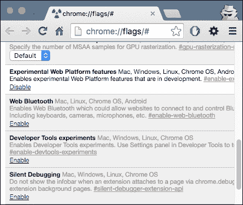

# 第一章. 学习服务工作者基础

在本章中，我们将涵盖以下主题：

+   设置服务工作者

+   为 Windows 设置 SSL

+   为 Mac 设置 SSL

+   为 GitHub 页面设置 SSL

+   注册服务工作者

+   详细注册服务工作者

+   调试

+   在出错时提供陈旧版本

+   创建模拟响应

+   处理请求超时

# 简介

如果你稍微旅行一下，很可能会发现自己经常遇到**零网络连接**的情况。这很令人沮丧，尤其是当你只想继续阅读一些新闻文章，或者你想完成一些工作的时候。

不幸的是，使用你的浏览器，在离线状态下尝试从网络请求某些内容并不太顺利。


尽管在飞机上、地铁里、酒店和会议上，Wi-Fi 可能会为你提供恢复连接的机会，但总的来说，你将不得不等待网络重新上线，才能请求你想要查看的页面。

解决这个问题的先前尝试包括`AppCache`。它在某种程度上似乎有效，但`AppCache`的问题在于它对用户交互做了很多假设。当这些假设没有得到满足时，应用程序将无法按预期工作。它也被设计成与单页应用程序很好地协同工作，而不是传统的多页网站。

此外，在提供无缝用户体验的 Web 应用程序中，最具挑战性的问题之一是在离线状态下使它们功能正常。鉴于大多数用户现在都在移动中访问 Web 应用程序，这是一个需要解决的问题。服务工作者应运而生，这是一种在浏览器后台运行的脚本。

能够使用不受连接性影响的网络应用程序意味着用户在乘坐飞机、地铁或在网络有限或不可用的地方时可以不间断地操作。这项技术将有助于提高客户的生产力，并增加应用程序的可用性。

使用服务工作者，我们能够预先缓存网站的一些资源。我们所说的资源包括 JavaScript 文件、CSS 文件、图片和一些字体。这将帮助我们加快加载时间，而不是每次访问同一网站时都要从网络服务器获取信息。当然，最重要的是，这些资源在我们离线时也会可用。

## 服务工作者

服务工作者是一个脚本，它位于你的浏览器和网络之间，为你提供拦截网络请求的能力，并以不同的方式响应它们。

为了使你的网站或应用能够工作，浏览器会获取其资产，例如 HTML 页面、JavaScript、CSS、图片和字体。在过去，管理这些资源主要是浏览器的责任。如果浏览器无法访问网络，你可能会看到其 **无法连接到互联网** 的消息。你可以使用一些技术来鼓励资产的本地缓存，但浏览器通常有最后的决定权。

服务工作者大量使用的一个特性是承诺。因此，对承诺有一个良好的理解非常重要。

## 承诺

承诺是运行相互依赖的异步操作的一个很好的机制。这是服务工作者工作的核心。

承诺可以做很多事情，但就目前而言，你需要知道的是，如果某个操作返回了一个承诺，你可以在其末尾附加 `.then()` 并在其中包含成功、失败等回调函数，或者如果你想包含一个失败回调，可以插入 `.catch()`。

让我们比较传统的同步回调结构与其异步承诺等效结构：

`sync`

```js
try {
  var value = Fn();
  console.log(value);
} catch(err) {
  console.log(err);
}
```

`async`

```js
Fn().then(function(value) {
  console.log(value);
  }).catch(function(err) {
  console.log(err);
});
```

在 `sync` 示例中，我们必须等待 `Fn()` 运行并返回一个 `value`，然后才能执行更多代码。在 `async` 示例中，`Fn()` 返回一个包含值的承诺，然后其余代码可以继续运行。当承诺解决时，`then` 中的代码将异步运行。

### `Promise.resolve(value)`

此方法返回一个 `Promise.then` 对象，该对象通过传递给 `resolve` 方法的值得到解决，就像 `Promise.resolve(value)` 一样。如果此值有一个 `then` 方法，则返回的方法将跟随它；否则，它将以该值得到满足。

### `Promise.reject(reason)`

此方法将 `reason` 作为参数，并返回一个被拒绝的承诺对象。

# 设置服务工作者

为了使服务工作者运行，我们需要通过 **超文本传输协议安全**（**HTTPS**）来提供我们的代码。出于安全原因，服务工作者仅设计在 HTTPS 上运行。源代码存储库，如 GitHub，支持 HTTPS，你可以在那里托管你的文件。

## 准备工作

如果你正在使用浏览器的新版本，那么服务工作者可能已经在其上启用。但是，如果情况不是这样，我们可能需要在浏览器设置中更改一些设置。在接下来的部分，我们将介绍如何在 Chrome 和 Firefox 中启用服务工作者功能。

## 如何操作...

按照以下步骤在 Chrome 和 Firefox 中启用服务工作者。

### Chrome

为了在 Chrome 中进行实验，你需要下载 Chrome Canary：

1.  前往 [`www.google.com/chrome/browser/canary.html`](https://www.google.com/chrome/browser/canary.html) 下载最新版本。

1.  打开 Chrome Canary 并输入 `chrome://flags`。

1.  打开 `experimental-web-platform-features`。

1.  重新启动浏览器。

1.  以下图像显示了 Chrome 浏览器中的实验性功能，您可以通过点击底下的**启用**链接来启用**实验性 Web 平台**功能：

### Firefox

要在 Firefox 中进行实验，您需要下载 Firefox Nightly：

1.  前往 [`nightly.mozilla.org/`](https://nightly.mozilla.org/) 并下载最新版本。

1.  打开 Firefox Nightly，并前往 `about:config`。

1.  将 `experimental-web-platform-features` 设置为 `true`。

1.  重新启动浏览器。

### 注意

在撰写本文时，Opera 提供了对服务工作者部分的支持，包括基本支持以及安装和卸载事件。Internet Explorer 和 Safari 不支持服务工作者。

服务工作者目前是一个实验性技术，这意味着其语法和行为可能会随着规范的变更在未来版本中发生变化。

# 在 Windows 上设置 SSL

服务工作者仅设计在 HTTPS 上运行，因此为了测试我们的代码，我们需要确保我们的网页通过 HTTPS 传输。在这个菜谱中，我们将介绍如何在 Windows 上为您的网站设置 SSL 支持。

## 准备工作

此菜谱假设您正在运行 Windows 7 或更高版本，并且已启用**互联网信息服务**（**IIS**）。

## 如何操作...

按照以下说明启用 SSL：

1.  首先，打开 IIS；您可以在命令行中运行以下命令来完成此操作：

    ```js
    Inetmgr

    ```

1.  在树视图中选择服务器节点，然后在列表视图中双击**服务器证书**功能，如图所示：

1.  在**操作**面板中点击**创建自签名证书...**链接。

1.  为新证书输入一个有意义的名称，然后点击**确定**。

    这将生成一个自签名证书，该证书标记为**服务器身份验证**使用，这意味着它使用服务器端证书来验证服务器的身份，同时也用于 HTTP SSL 加密。

    为了创建 SSL 绑定，我们必须在树视图中选择一个网站，然后在**操作**面板中点击**绑定...**。这将打开绑定编辑器，该编辑器管理您的网站的绑定，包括创建、编辑和删除。现在，要将您的新 SSL 绑定添加到网站，请点击**添加...**。

    

1.  端口 80 是 HTTP 的新绑定的默认设置。我们可以在**类型**下拉列表中选择**https**。从**SSL 证书**下拉列表中选择我们在上一节中创建的自签名证书，然后点击**确定**。

1.  现在我们已经在网站上设置了新的 SSL 绑定，剩下要做的就是确保它能够正常工作。

1.  点击**继续访问此网站**以继续。

# 在 Mac 上设置 SSL

如前所述，服务工作者旨在仅在 HTTPS 上运行。因此，为了测试我们的代码，我们需要我们的网页通过 HTTPS 交付。在本食谱中，我们将介绍如何为 Mac 网站设置 SSL 支持。

## 准备工作

本食谱假设您正在运行 OS X 10.11, El Capitan 或更高版本。我们将使用名为 Vim 的命令行工具来编辑文件，该工具已随 Mac 一起提供。请确保不要在 Vim 中使用数字键盘。请注意，此过程可能需要较长时间。

## 如何操作...

按照以下说明启用 SSL：

1.  首先，我们需要确保 Apache 正在运行（您可能会收到密码提示）：

    ```js
    $ sudo apachectl start

    ```

1.  下一步是修改您的 `httpd.conf` 文件。因为它是一个系统文件，您将需要再次使用 `sudo`：

    ```js
    $ sudo vim /etc/apache2/httpd.conf

    ```

1.  在此文件中，您应取消注释 `socache_shmcb_module` 和 `ssl_module`，并包含 `httpd-ssl.conf` 文件，通过删除这些行前面的 `#` 符号（您可以在 Vim 编辑器中使用 `/` 进行搜索）：

    ```js
    LoadModule socache_shmcb_module libexec/apache2/mod_socache_shmcb.so
    ...
    LoadModule ssl_module libexec/apache2/mod_ssl.so
    ...
    Include /private/etc/apache2/extra/httpd-ssl.conf
    ```

1.  在保存上述文件（按 `:wq`）后，您应打开您的 `/etc/apache2/extra/httpd-vhosts.conf` 文件：

    ```js
    $ sudo vim /etc/apache2/extra/httpd-vhosts.conf

    ```

1.  在这里，您可以为您希望提供 SSL 支持的每个虚拟主机创建一个 VirtualHost 条目：

    ```js
    <VirtualHost *:80>
           DocumentRoot "/Library/WebServer/Documents"
        ServerName localhost
        SSLEngine on
        SSLCertificateFile "/private/etc/apache2/localhost.crt"
        SSLCertificateKeyFile "/private/etc/apache2/localhost.key"
    </VirtualHost>
    ```

    确保您已将您的开发文件夹复制到之前所做的 `DocumentRoot` 目录：`/Library/WebServer/Documents`。

    为了让所有这些与 Apache 一起工作，我们需要创建一个自签名证书，我们已经在 `VirtualHost` 定义中引用了它。

1.  生成一个密钥：

    ```js
    $ cd /etc/apache2

    ```

1.  在以下命令后按 *Enter* 键，不要输入任何内容：

    ```js
    $ sudo openssl genrsa -out localhost-key.pem 1024

    ```

1.  接下来，我们必须生成一个证书签名请求：

    ```js
    $ sudo openssl req -new -key localhost-key.pem -out localhost.csr

    ```

1.  使用此 **证书签名请求**（**CSR**）生成证书：

    ```js
    $ sudo openssl x509 -req -days 365 -in localhost.csr -signkey 
    localhost-key.pem -out localhost.crt

    ```

1.  然后，我们必须将密钥转换为无短语密钥：

    ```js
    $ sudo openssl rsa -in localhost-key.pem -out localhost.key

    ```

1.  现在将 `server.crt` 更改为 `localhost.crt`，以及将 `server.key` 更改为 `localhost.key`：

    ```js
    $ sudo vim /etc/apache2/extra/httpd-ssl.conf

    ```

1.  现在您只需再次检查您的 Apache 配置语法：

    ```js
    $ sudo apachectl configtest

    ```

1.  如果一切顺利，请重新启动 Apache：

    ```js
    $ sudo apachectl -k restart

    ```

1.  现在，只需将您的浏览器指向 `https://localhost`。如果您在 Chrome 中被提示输入自签名证书，您可以在该页面上点击 **高级** 选项并继续，而在 Firefox 中，您需要展开 **我了解风险** 选项并添加一个例外。这是由于自签名证书未由任何权威机构签名，因此浏览器会添加有关它们的警告。尽管如此，由于您是创建证书的人，您知道接受它是安全的。

1.  为了解决这个问题，您需要将证书添加为受信任的根权威机构。

1.  在 OS X 中打开 **密钥链访问** 工具。在左侧选择 **系统** 选项。点击左上角的锁形图标以启用更改。如何操作...

1.  点击底部的加号按钮，选择您复制到桌面的 `/etc/apache2/localhost.cer` 文件。在出现的对话框中，点击 **始终信任**。在 localhost 被添加到系统密钥链后，双击它再次打开。展开 **信任** 部分，对于第一个选项，选择 **始终信任**。

1.  到目前为止，一切配置已完成。退出 Chrome 和所有其他浏览器（这是必需的），启动网络服务器，并再次尝试导航到本地 HTTPS 网站。

### 小贴士

有关下载代码包的详细步骤在本书的序言中提及。请查看。

该书的代码包也托管在 GitHub 上，网址为 [`github.com/PacktPublishing/Service-Worker-Development-Cookbook`](https://github.com/PacktPublishing/Service-Worker-Development-Cookbook)。我们还有其他来自我们丰富图书和视频目录的代码包，可在 [`github.com/PacktPublishing/`](https://github.com/PacktPublishing/) 找到。去看看吧！

# 设置 GitHub 页面的 SSL

服务工作者设计为仅在 HTTPS 上运行。因此，为了测试我们的代码，我们需要我们的网页通过 HTTPS 传输。GitHub 页面通过 HTTPS 提供，并且免费使用。所以让我们继续吧。

## 准备工作

在注册 GitHub 账户之前，请确保您有一个有效的电子邮件地址。

## 如何操作...

按照以下说明设置 GitHub 页面：

1.  前往 GitHub ([`github.com`](https://github.com)) 并注册自己以获取账户，如果您还没有的话。

1.  完成后，登录并创建一个新的仓库，格式如下：

    `username.github.io`，其中 `username` 是您的用户名。

    

    如果仓库的第一部分与您的用户名不完全匹配，则不会工作。

1.  打开您的命令行窗口并克隆您的仓库。

    ```js
    $ git  clone https://github.com/username/username.github.io

    ```

1.  切换到 `username.github.io` 目录：

    ```js
    $ cd username.github.io

    ```

1.  创建一个名为 `service-workers` 的目录：

    ```js
    $ mkdir service-workers

    ```

1.  创建一个包含一些文本的 `index.html` 文件：

    ```js
    $ echo "Service Workers" > index.html

    ```

1.  现在让我们提交并推送我们的更改到仓库：

    ```js
    $ git add --all
    $ git commit -m "initial commit"
    $ git push -u origin master

    ```

1.  打开浏览器并访问 `http://username.github.io/service-workers/`。

# 注册服务工作者

注册服务工作者是启动服务工作者的第一步。通过注册服务工作者，我们告诉我们的网站使用服务工作者。并且这个过程是在服务工作者之外进行的，在我们的例子中是在 `index.html` 文件中。您可以在 JavaScript 文件中这样做，然后在 `index.html` 文件中引用它，但不能在服务工作者脚本文件中。

在这个基本的注册演示中，我们将测试我们的服务工作者是否成功注册。

## 准备工作

要开始使用服务工作者，你需要在浏览器设置中开启服务工作者实验功能。如果你还没有这样做，请参考第一个菜谱：*设置服务工作者*。服务工作者仅在 HTTPS 上运行。要了解如何设置支持此功能的开发生态，请参考以下菜谱：*为 GitHub 页面设置 SSL*，*为 Windows 设置 SSL*，和*为 Mac 设置 SSL*。

## 如何操作...

按照以下说明设置你的文件结构：

1.  首先，我们需要创建如下所示的 `index.html` 文件：

    ```js
    <!DOCTYPE html>
      <html lang="en">
       <head></head>
           <body>
           <p>Registration status: <strong id="status"></strong></p>
           <script>
              if ('serviceWorker' in navigator) {
               navigator.serviceWorker.register(
                  'service-worker.js',
                  { scope: './' }
                ).then( function(serviceWorker) {
                  document.getElementById('status').innerHTML =
                        'successful';
                  }).catch(function(error) {
                      document.getElementById('status').innerHTML = error;
                  });
              } else {
                    document.getElementById('status').innerHTML = 
               'unavailable';
                }
    </script>
    </body>
    </html>
    ```

1.  在 `index.html` 文件所在的同一文件夹中创建一个名为 `service-worker.js` 的空 JavaScript 文件。

1.  在你的两个文件就绪后，你可以导航到 GitHub 页面，`https://username.github.io/service-workers/01/01/index.html`，你将在浏览器中看到成功消息。

## 它是如何工作的...

我们首先确保服务工作者功能可用，通过这一行代码 `if ('serviceWorker' in navigator)`. 如果不是这种情况，我们将消息设置为不可用。如果你的浏览器不支持服务工作者，你将看到这条消息。

现在我们使用空 JavaScript 文件和作用域来注册服务工作者。为了确保注册只适用于当前目录及其下级目录，我们在 `{ scope: './' }` 这行代码中将默认作用域 `'/'` 覆盖为 `'./'`，因为作用域必须是同一来源。

如果你决定你的脚本文件应该放在其他地方，你需要一个特殊的头信息，例如 `Service-Worker-allowed: true` 或特定的内容类型，例如 `text/javascript`。

如果注册成功，我们将打印消息 `successful` 到状态消息。

否则，我们将错误消息作为状态打印出来。错误的原因可能是注册过程中出现问题，例如，`service-worker.js` 文件可能不可用或其中可能包含语法错误。

## 还有更多...

我们可以通过调用以下 `unregister()` 函数来注销服务工作者：

```js
serviceWorker.unregister().then(function() {
    document.getElementById('status').innerHTML = 'unregistered';
})
```

### 已知问题

当与服务工作者一起工作时，Chrome 浏览器存在一些问题，可能会让你感到困惑。

#### `ERR_FILE_EXISTS` 错误消息

使用服务工作者重新加载页面将始终显示 `ERR_FILE_EXISTS` 错误消息，即使你的代码没有问题。

这似乎发生在我们尝试访问已注册的服务工作者时。


#### 过期控制台消息

从服务工作者脚本中记录的消息，如 `console.log`，可能不会从控制台中清除，这看起来像是后续页面加载时事件被触发得太多次。

# 详细注册服务工作者

理解服务工作者注册和状态转换中涉及的事件，将使你能够通过使用此功能来更好地控制你的应用程序。在这个详细的注册演示中，我们将查看服务工作者注册的状态转换。

## 准备中

要开始使用服务工作者，你需要在浏览器设置中开启服务工作者实验功能。如果你还没有这样做，请参考之前的配方：*设置服务工作者*。服务工作者仅在 HTTPS 上运行。要了解如何设置支持此功能的开发生态，请参考以下配方：*设置 GitHub 页面以支持 SSL*、*在 Windows 上设置 SSL* 和 *在 Mac 上设置 SSL*。

## 如何操作...

按照以下说明设置你的文件结构：

1.  首先，我们需要创建一个如下的 `index.html` 文件：

    ```js
    <!DOCTYPE html>
    <html lang="en">
    <head>
      <meta charset="UTF-8">
      <title>Detailed Registration</title>
    </head>
    <body>
      <p>Registration status: <strong id="status"></strong></p>
      <p>State: <strong id="state"></strong></p>

      <script>
        function printState(state) {
          document.getElementById('state').innerHTML = state;
        }

        if ('serviceWorker' in navigator) {

          navigator.serviceWorker.register(
            'service-worker.js',
            { scope: './' }
          ).then( function(registration) {
            var serviceWorker;

            document.getElementById('status').innerHTML = 'successful';

            if (registration.installing) {
              serviceWorker = registration.installing;
              printState('installing');
            } else if (registration.waiting) {
              serviceWorker = registration.waiting;
              printState('waiting');
            } else if (registration.active) {
              serviceWorker = registration.active;
              printState('active');
            }

            if (serviceWorker) {
              printState(serviceWorker.state);

              serviceWorker.addEventListener('statechange', function(e) {
                printState(e.target.state);
              });
            }
          }).catch(function(error) {
            document.getElementById('status').innerHTML = error;
          });
        } else {
            document.getElementById('status').innerHTML = 'unavailable';
          }
      </script>
    </body>
    </html>
    ```

1.  在与 `index.html` 文件相同的文件夹中创建一个名为 `service-worker.js` 的 JavaScript 文件，并包含以下代码：

    ```js
    self.addEventListener('install', function(e) {
      console.log('Install Event:', e);
    });

    self.addEventListener('activate', function(e) {
      console.log('Activate Event:', e);
    });
    ```

1.  在你的两个文件就绪后，你可以导航到 GitHub 页面，`https://username.github.io/service-workers/01/02/index.html`，你将在浏览器中看到成功消息。

## 它是如何工作的...

当注册成功时，我们检查注册状态并将其打印到浏览器。在这种情况下，它可能是安装中、等待中或激活中：

```js
 if (registration.installing) {
          serviceWorker = registration.installing;
          printState('installing');
        } else if (registration.waiting) {
          serviceWorker = registration.waiting;
          printState('waiting');
        } else if (registration.active) {
          serviceWorker = registration.active;
          printState('active');
        }
```

`printState(state)` 辅助函数将打印状态到浏览器。

最后，我们向服务工作者添加一个名为 `statechange` 的事件监听器。此事件监听器的回调将打印状态变化到浏览器：

```js
if (serviceWorker) {
          printState(serviceWorker.state);

          serviceWorker.addEventListener('statechange', function(e) {
            printState(e.target.state);
          });
        }
```

当注册的服务工作者处于激活状态时，我们可以刷新页面以看到服务工作者接管。

要演示页面加载，而不让服务工作者接管，请按 *Shift* 并刷新页面。你将在网页控制台中看到激活事件被记录。

我们在 `service-worker.js` 文件中订阅了两个事件监听器，`install` 和 `activate`：

```js
self.addEventListener('install', function(e) {
  console.log('Install Event:', e);
});

self.addEventListener('activate', function(e) {
  console.log('Activate Event:', e);
});
```

当这个版本的脚本首次在给定范围内注册时，会触发这些事件。

安装事件是预取数据和初始化缓存的绝佳位置，而 `activate` 事件非常适合清理旧版本脚本中的数据。

## 更多...

当服务工作者成功注册后，它将经历以下阶段。

### 安装

在服务工作者的生命周期中，当服务工作者在无错误的情况下注册，但尚未激活时，之前激活的任何服务工作者仍然处于控制状态。如果服务工作者文件在页面重新加载之间有任何变化，则服务工作者被视为新的。因此，它将经历安装步骤。在这个阶段，服务工作者不会拦截任何请求。

### 激活

当服务工人首次变得活跃时，我们说它处于激活阶段。服务工人现在能够拦截请求。这将在我们关闭标签页并重新打开它，或者通过使用*Shift* + 刷新来硬刷新页面时发生。它不会在安装事件之后立即发生。

### 获取

获取操作发生在当前服务工人作用域内有一个请求正在发起时。

### 终止

这可能随时发生，甚至可能发生在请求之外。但是，终止通常发生在浏览器需要回收内存时。当发起新的请求时，服务工人将根据需要重新启动，或者接收一条消息，但它不会回到激活步骤。

服务工人将拦截它注册以捕获的所有请求，即使它需要重新启动才能这样做。但是，话虽如此，我们无法保证它将存在任何长度的时间。正因为如此，全局状态将不会被保留，因此我们必须确保在服务工人文件中不使用任何全局变量。相反，我们可以使用索引或`localStorage`进行持久化。

## 相关链接

+   之前的配方，*注册服务工人*

# 调试

服务工人运行在浏览器中与它们控制的页面分开的线程中。有方法在工人和页面之间进行通信，但它们在单独的作用域中执行。这意味着你将无法从服务工人脚本中访问那些网页的 DOM，例如。正因为如此，我们不能在同一网页上使用 DevTools 来调试服务工人脚本。我们需要打开一个单独的检查器来调试服务工人线程。

服务工人主要通过监听相关事件并以有效的方式响应它们来完成大部分工作。在服务工人的生命周期中，不同的事件在不同的生命周期点被触发。因此，如果我们想缓存资源，那么在安装状态下监听`install`事件是一个很好的时机。同样，我们也可以通过向相关事件处理器添加断点来调试服务工人。

## 准备就绪

要开始使用服务工人，你需要在浏览器设置中开启服务工人实验功能。如果你还没有这样做，请参考之前的配方：*设置服务工人*。服务工人仅在 HTTPS 上运行。要了解如何设置一个支持此功能的开发生态，请参考以下配方：*为 GitHub 页面设置 SSL*，*为 Windows 设置 SSL*，和*为 Mac 设置 SSL*。

## 如何操作...

按照以下说明设置服务工人的调试：

1.  要找出你当前正在运行的服务工人，请在浏览器中输入以下内容：`chrome://inspect/#service-workers`：

1.  否则，在你的浏览器中输入以下内容：`chrome://serviceworker-internals`以查找已注册的 worker。如果没有列出任何内容，那么当前没有正在运行的服务 worker。

1.  要使用 Chrome DevTools 调试你的服务 worker，请导航到服务 worker 页面并打开 DevTools。（在 Mac 上为*Cmd* + *Alt* + *I*，在 Windows 上为*F12*）

1.  你可以为你的代码添加一个断点来检查。

    服务 worker 将在**线程**列表中显示，而**服务 worker**选项卡列出了此页面所属的所有**活动运行**服务 worker。

    

    我们也可以使用控制台进行调试。安装过程中的任何错误都会打印在控制台页面上。控制台对于检查服务 worker 上下文很有用。

    

1.  你还可以在 DevTools 的**资源**选项卡中找到调试面板。为了查看 worker 的网络活动，点击**资源**选项卡上的`检查`链接以启动为 worker 专用的 DevTools 窗口。

结果页面`chrome://serviceworker-internals`显示了已注册的服务 worker。它还显示了基本操作按钮，以下将详细解释：

+   **终止**：注销 worker。

+   **启动/停止**：启动或停止 worker。当你导航到 worker 作用域内的页面时，这会自动发生。

+   **同步**：向 worker 发送同步事件。如果你不处理此事件，则不会发生任何操作。

+   **推送**：向 worker 发送推送事件。如果你不处理此事件，则不会发生任何操作。

+   **检查**：在检查器中打开 worker。

## 更多...

当你使用 DevTools 打开时，你可能想要检查确保在**网络**选项卡中**禁用缓存**没有被勾选。如果该选项被勾选，请求将发送到网络而不是服务 worker。

# 提供错误时的陈旧版本

如果你经常出差，那么你很可能经常遇到很多零网络连接的情况。这很令人沮丧，尤其是当你想查看之前查看过的页面时。在这个配方中，我们将探讨如何通过向用户提供缓存中的陈旧版本来解决此问题。

## 准备中

要开始使用服务 worker，你需要在浏览器设置中开启服务 worker 实验功能。如果你还没有这样做，请参考之前的配方：*设置服务 worker*。服务 worker 仅在 HTTPS 上运行。要了解如何设置支持此功能的发展环境，请参考以下配方：*为 GitHub 页面设置 SSL*，*为 Windows 设置 SSL*，和*为 Mac 设置 SSL*。

## 如何操作...

按照以下说明设置你的文件结构（或者你可以在提供的目录`01/05`中找到文件）：

1.  首先，我们需要创建一个如下所示的 `index.html` 文件：

    ```js
    <!DOCTYPE html>
    <html lang="en">
    <head>
      <meta charset="UTF-8">
      <title>Stale on Error</title>
    </head>
    <body>
      <p>Registration status: <strong id="status"></strong></p>
      <script>
        if ('serviceWorker' in navigator) {
          navigator.serviceWorker.register(
            'service-worker.js',
            { scope: './' }
          ).then( function(serviceWorker) {
            document.getElementById('status').innerHTML = 
            'successful';
          }).catch(function(error) {
            document.getElementById('status').innerHTML = error;
          });

        } else {
            document.getElementById('status').innerHTML = 
            'unavailable';
          }
      </script>
    </body>
    </html>
    ```

1.  在与 `index.html` 文件相同的文件夹中创建一个名为 `service-worker.js` 的 JavaScript 文件，并包含以下代码：

    ```js
    var version = 1;
    var cacheName = 'stale- ' + version;

    self.addEventListener('install', function(event) {
        self.skipWaiting();
    });

    self.addEventListener('activate', function(event) {
        if (self.clients && clients.claim) {
            clients.claim();
        }
    });

    self.addEventListener('fetch', function(event) {

        event.respondWith(
            fetch(event.request).then(function(response) {
                caches.open(cacheName).then(function(cache) {

                    if(response.status >= 500) {
                        cache.match(event.request).
    					then(function(response) {

                            return response;
                        }).catch(function() {

                            return response;
                        });
                    } else {
                          cache.put(event.request, response.clone());
                        return response;
                    }
                });
            })
        );
    });
    ```

1.  将你的两个文件放置好，导航到 `index.html`：

## 它是如何工作的...

当注册成功时，我们检查注册状态并将其打印到浏览器：

在 `service-worker.js` 文件中，我们始终从网络获取响应：

```js
event.respondWith(
        fetch(event.request).then(function(response) {
```

如果我们收到一个错误响应，我们将从缓存中返回过时的版本：

```js
if(response.status >= 500) {
                    cache.match(event.request).
					then(function(response) {
                        // Return stale version from cache
                        return response;
})
```

如果我们找不到过时的版本，我们将返回网络响应，即错误：

```js
}).catch(function() {

return response;
});
```

如果响应成功（响应代码 200），我们更新缓存的版本：

```js
} else {
cache.put(event.request, response.clone());
   return response;
}
```

## 还有更多...

缓存接口的 `put()` 方法允许将键/值对添加到当前缓存对象中。`put()` 方法还会覆盖缓存中之前存储的任何与请求匹配的键/值对：

```js
fetch(url).then(function (response) {
  return cache.put(url, response);
});
```

# 创建模拟响应

为了模拟你的服务器对你的应用的 API 响应，而不是实际的 API 响应，我们可以让服务工作者返回与 API 响应相同的模拟响应。

## 准备工作

要开始使用服务工作者，你需要在浏览器设置中开启服务工作者实验功能。如果你还没有这样做，请参考之前的配方：*设置服务工作者*。服务工作者仅在 HTTPS 上运行。要了解如何设置支持此功能的发展环境，请参考以下配方：*设置 GitHub 页面以支持 SSL*，*设置 Windows 上的 SSL*，和 *设置 Mac 上的 SSL*。

## 如何操作...

按照以下说明设置你的文件结构（这些也可以在提供的目录 `01/03` 中找到）：

1.  首先，我们需要创建一个如下所示的 `index.html` 文件：

    ```js
    <!DOCTYPE html>
    <html lang="en">
    <head>
      <meta charset="UTF-8">
      <title>Detailed Registration</title>
    </head>
    <body>
      <p>Network status: <strong id="status"></strong></p>
      <div id="request" style="display: none">
        <input id="long-url" value="https://www.packtpub.com/" size="50">
          <input type="button" id="url-shorten-btn" value="Shorten URL" />
        </div>
        <div>
          <input type="checkbox" id="mock-checkbox" checked>Mock Response</input>
        </div>
        <div>
          <br />
          <a href="" id="short-url"></a>
        </div>
      </div>

      <script>
        function printStatus(status) {
          document.getElementById('status').innerHTML = status;
        }

        function showRequest() {
          document.getElementById('url-shorten-btn')
          .addEventListener('click', sendRequest);
          document.getElementById('request').style.display = 'block';
        }

        function sendRequest() {
          var xhr = new XMLHttpRequest(),
            request;

                xhr.open('POST',
                'https://www.googleapis.com/urlshortener/v1/url?' +
                'key=[Your API Key]');
          xhr.setRequestHeader('Content-Type', 'application/json');

          if (document.getElementById('mock-checkbox').checked) {
                    xhr.setRequestHeader('X-Mock-Response', 'yes');
          }

          xhr.addEventListener('load', function() {
            var response = JSON.parse(xhr.response);
            var el = document.getElementById('short-url');

            el.href = response.id;
            el.innerHTML = response.id;
          });

          request = {
            longUrl: document.getElementById('long-url').value
          };

          xhr.send(JSON.stringify(request));
        }

        if ('serviceWorker' in navigator) {

          navigator.serviceWorker.register(
            'service-worker.js',
            { scope: './' }
          ).then( function(registration) {
            if (navigator.serviceWorker.controller) {
                printStatus('The service worker is currently handling ' + 
                'network operations.');
                showRequest();
            } else {
                printStatus('Please reload this page to allow the ' + 'service worker to handle network operations.');
                  }
          }).catch(function(error) {
            document.getElementById('status').innerHTML = error;
          });
        } else {
                   document.getElementById('status').innerHTML = 'unavailable';
              }
      </script>
    </body>
    </html>
    ```

1.  在与 `index.html` 文件相同的文件夹中创建一个名为 `service-worker.js` 的 JavaScript 文件，并包含以下代码：

    ```js
    self.addEventListener('fetch', function(event) {
      console.log('Handling fetch event for', event.request.url);
      var requestUrl = new URL(event.request.url);

      if (requestUrl.pathname === '/urlshortener/v1/url' &&
          event.request.headers.has('X-Mock-Response')) {

        var response = {
          body: {
            kind: 'urlshortener#url',
            id: 'http://goo.gl/IKyjuU',
            longUrl: 'https://slightlyoff.github.io/ServiceWorker/spec/service_worker/index.html'
          },
          init: {
            status: 200,
            statusText: 'OK',
            headers: {
              'Content-Type': 'application/json',
              'X-Mock-Response': 'yes'
            }
          }
        };

        var mockResponse = new Response(JSON.stringify(response.body),  
            response.init);

        console.log('Responding with a mock response body:', 
            response.body);
        event.respondWith(mockResponse);
      }
    });
    ```

1.  将你的两个文件放置好，你可以导航到 GitHub 页面，`https://username.github.io/service-workers/01/03/index.html`，你将在浏览器中看到成功消息。

## 它是如何工作的...

在服务工作者成功注册后，我们检查以确保它目前正在处理网络操作：

```js
if (navigator.serviceWorker.controller) {
printStatus('The service worker is currently handling 
network operations.');
…
}
```

在这种情况下，我们调用 `showRequest()` 函数为 URL 缩短按钮添加事件监听器，并显示 `request` 块。否则，整个 `request` 块将被隐藏：

```js
function showRequest() {
   document.getElementById('url-shorten-btn')
.addEventListener('click', sendRequest);
   document.getElementById('request').style.display = 'block';
}
```

`sendRequest()` 函数构建 HTTP 请求。它创建一个带有 Google API 短网址 URL 的 `POST` 请求：

```js
xhr.open('POST',
        'https://www.googleapis.com/urlshortener/v1/url?' +
  'key=[Your API Key]');
```

你将需要为这个服务获取一个 API 密钥。为此，请按照以下说明操作：

1.  访问 Google 开发者控制台页面 [`console.developers.google.com`](https://console.developers.google.com)：

1.  你可以选择一个现有项目或创建一个新的项目。

1.  在左侧侧边栏中展开 **APIs & auth**：

1.  点击 **APIs**。现在，在提供的 API 列表中，确保 Google URL Shortener API 的状态是 **开启**。

1.  最后，在左侧边栏中，选择 **Credentials**。

如果 **Mock Response** 被勾选，将请求头 `X-Mock-Response` 设置为 `yes`：

```js
if (document.getElementById('mock-checkbox').checked) {
      xhr.setRequestHeader('X-Mock-Response', 'yes');
    }
```

现在添加一个事件监听器到 load 事件，并传递一个回调来分配响应数据到显示结果的链接：

```js
xhr.addEventListener('load', function() {
var response = JSON.parse(xhr.response);
var el = document.getElementById('short-url');

   el.href = response.id;
   el.innerHTML = response.id;
});
```

在 `sendRequest` 函数的末尾，我们发送原始 URL 以及我们构建的 `request` 对象作为请求：

```js
request = {
        longUrl: document.getElementById('long-url').value
      };
xhr.send(JSON.stringify(request));
```

在 `service-worker.js` 文件中，我们正在添加一个用于 fetch 事件的监听器。我们检查请求 URL 路径中包含 `urlshortner`，并且请求头有 `X-Mock-Response`：

```js
if (requestUrl.pathname === '/urlshortener/v1/url' &&
    event.request.headers.has('X-Mock-Response')) {
…
   }
```

我们构建一个包含正文、状态和头的模拟响应对象：

```js
   var response = {
      body: {
        kind: 'urlshortener#url',
        id: 'https://goo.gl/KqR3lJ',
        longUrl: 'https://www.packtpub.com/books/info/packt/about'
      },
      init: {
        status: 200,
        statusText: 'OK',
        headers: {
          'Content-Type': 'application/json',
          'X-Mock-Response': 'yes'
        }
      }
    };
```

最后，我们使用模拟响应创建一个响应：

```js
var mockResponse = new Response(
JSON.stringify(response.body), response.init);

console.log('Mock Response: ', response.body);
event.respondWith(mockResponse);
```

# 处理请求超时

长时间运行的请求可能是连接问题造成的。服务工作者是解决这些问题的理想解决方案。让我们看看我们如何使用服务工作者实现一个处理请求超时的解决方案。

## 准备工作

要开始使用服务工作者，你需要在浏览器设置中开启服务工作者实验功能。如果你还没有这样做，请参考之前的配方：*设置服务工作者*。服务工作者仅在 HTTPS 上运行。要了解如何设置支持此功能的发展环境，请参考以下配方：*为 GitHub 页面设置 SSL*，*为 Windows 设置 SSL*，和*为 Mac 设置 SSL*。

## 如何操作...

按照以下说明设置你的文件结构：

1.  首先，我们需要创建一个如下的 `index.html` 文件：

    ```js
    <!DOCTYPE html>
    <html lang="en">
    <head>
      <meta charset="UTF-8">
      <title>Request Timeouts</title>
    </head>
    <body>
      <p>Registration status: <strong id="status"></strong></p>

      <script>
        if ('serviceWorker' in navigator) {
          navigator.serviceWorker.register(
            'service-worker.js',
            { scope: './' }
          ).then(function(serviceWorker) {
            document.getElementById('status').innerHTML = 'successful';
    });
        } else {
          document.getElementById('status').innerHTML = 'unavailable';
        }
      </script>
      <script src="img/jquery-2.2.0.js"></script>
    </body>
    </html>
    ```

1.  在与 `index.html` 文件相同的文件夹中创建一个名为 `service-worker.js` 的 JavaScript 文件，并包含以下代码：

    ```js
    function timeout(delay) {
        return new Promise(function(resolve, reject) {
            setTimeout(function() {
                resolve(new Response('', {
                    status: 408,
                    statusText: 'Request timed out.'
                }));
            }, delay);
        });
    }

    self.addEventListener('install', function(event) {
        self.skipWaiting();
    });

    self.addEventListener('activate', function(event) {
        if (self.clients && clients.claim) {
            clients.claim();
        }
    });

    self.addEventListener('fetch', function(event) {
      if (/\.js$/.test(event.request.url)) {
        event.respondWith(Promise.race([timeout(400), fetch(event.request.url)]));
      } else {
        event.respondWith(fetch(event.request));
      }
    });
    ```

1.  将你的两个文件放置好，导航到 `index.html` 并打开开发者工具。你会在控制台看到超时错误记录。

## 它是如何工作的...

在我们的 `index.html` 文件中，我们正在获取一个大型未压缩的 jQuery 库：

```js
<script src="img/jquery-2.2.0.js"></script>
```

在我们的 `service-worker.js` 文件中，安装事件的监听器调用 `skipWaiting()` 方法，这强制等待中的服务工作者成为活动服务工作者：

```js
self.addEventListener('install', function(event) {
    self.skipWaiting();
});
```

`skipWaiting()` 方法在活动事件处理器中使用，它反过来使用 `Clients.claim()` 确保对底层服务工作者的更新立即生效，对当前客户端和所有其他活动客户端都有效：

```js
self.addEventListener('activate', function(event) {
    if (self.clients && clients.claim) {
        clients.claim();
    }
});
```

在 fetch 事件的监听器中，我们传递一个 `Promise.race()` 函数，其中第一个可迭代项 `timeout(400)` 首先解决：

```js
self.addEventListener('fetch', function(event) {
  if (/\.js$/.test(event.request.url)) {
    event.respondWith(Promise.race([timeout(400), fetch(event.request.url)]));
  } else {
    event.respondWith(fetch(event.request));
  }
});
```

我们将在不久的将来详细说明 `Promise.race()` 函数。`timeout()` 函数返回一个 408 的 promise，这是请求超时状态的代码。

## 更多内容...

`Promise.race()`方法返回一个承诺，一旦可迭代中的任何一个承诺解决或拒绝，它就会解析或拒绝，并带有那个承诺的值或原因：

```js
var p1 = new Promise(function(resolve, reject) { 
    setTimeout(resolve, 400, "one"); 
});
var p2 = new Promise(function(resolve, reject) { 
    setTimeout(reject, 100, "two");
});

Promise.race([p1, p2]).then(function(value) {
  // Not called              
}, function(reason) {
  console.log(reason); // "two"
  // p2 is faster, so it rejects
});
```

正如你所见，`two`更快，所以结果是`reject`。
