# 第二章. 与资源文件一起工作

在本章中，我们将涵盖以下主题：

+   显示自定义离线页面

+   离线加载图片

+   离线加载 CSS

+   离线加载字体

+   实现多个 fetch 处理器

+   获取远程资源

# 简介

你可能时不时地遇到过某些网站上出现损坏的图片。这可能是因为多种原因：图片可能不存在，可能没有正确命名，或者代码中的文件路径可能不正确。无论原因如何，它都可能影响你的网站，并可能导致用户认为你的网站已损坏。

图片并不是你网站中唯一必要的资源。**层叠样式表**（**CSS**）、JavaScript 文件和字体文件也是使你的网站看起来功能齐全所必需的。在本章中，我们将探讨如何离线加载这些资源。

在我们开始处理离线加载资源之前，让我们了解一下如何通知用户网络不可用。

# 显示自定义离线页面

让我们回顾一下第一章中的场景，当时你正在火车上，从工作中回家，你正在使用你的移动设备阅读一篇重要的新闻文章。就在你点击链接查看更多详情的同时，火车突然消失在隧道中。你刚刚失去了连接，并显示**无法连接到互联网**的消息。好吧，如果你仍然可以通过在桌面/笔记本电脑上按空格键或在手机上轻触来玩恐龙游戏，你将不会那么烦恼。但是，这可以通过使用服务工作者在用户体验方面进行显著改进。服务工作者的一项伟大功能是它们允许你拦截网络请求并决定你想要如何响应：

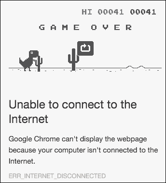

在这个食谱中，我们将使用服务工作者来检查用户是否有连接性，如果他们没有连接，则显示一个非常简单的离线页面。

## 准备工作

要开始使用服务工作者，你需要在浏览器设置中开启服务工作者实验功能。如果你还没有这样做，请参考第一章的*设置服务工作者*食谱，*学习服务工作者基础*。服务工作者仅在 HTTPS 上运行。要了解如何设置开发环境以支持此功能，请参考以下第一章的食谱：*设置 GitHub 页面以支持 SSL*，*在 Windows 上设置 SSL*，和*在 Mac 上设置 SSL*。

## 如何做到这一点...

按照以下说明设置你的文件结构：

1.  首先，我们必须创建一个`index.html`文件，如下所示：

    ```js
    <!DOCTYPE html>
    <html lang="en">
    <head>
      <meta charset="UTF-8">
      <title>Custom Offline Page</title>
    </head>
    <body>
      <p>Registration status: <strong id="status"></strong></p>

      <script>
        var scope = {
          scope: './'
        };

        if ('serviceWorker' in navigator) {
          navigator.serviceWorker.register('service-worker.js', scope)
          .then(
            function(serviceWorker) {
            document.getElementById('status').innerHTML = 'successful';
          }).catch(function(error) {
            document.getElementById('status').innerHTML = error;
          });
        } else {
            document.getElementById('status').innerHTML = 'unavailable';
          }
      </script>
    </body>
    </html>
    ```

1.  在与`index.html`文件相同的文件夹中创建一个名为`service-worker.js`的 JavaScript 文件，并包含以下代码：

    ```js
    'use strict';

    var version = 1;
    var currentCache = {
      offline: 'offline-cache' + version
    };

    var offlineUrl = 'offline.html';

    self.addEventListener('install', function(event) {
      event.waitUntil(
        caches.open(currentCache.offline).then(function(cache) {
          return cache.addAll([
            offlineUrl
          ]);
        })
      );
    });

    self.addEventListener('fetch', function(event) {
      var request = event.request,
        isRequestMethodGET = request.method === 'GET';

      if (request.mode === 'navigate' || isRequestMethodGET) {
        event.respondWith(
          fetch(createRequestWithCacheBusting(request.url)).catch(function(error) {
            console.log('OFFLINE: Returning offline page.', error);
            return caches.match(offlineUrl);
          })
        );
      } else {
        event.respondWith(caches.match(request)
            .then(function (response) {
            return response || fetch(request);
          })
        );
      }
    });
    function createRequestWithCacheBusting(url) {
      var request,
        cacheBustingUrl;

      request = new Request(url,
        {cache: 'reload'}
      );

      if ('cache' in request) {
        return request;
      }

      cacheBustingUrl = new URL(url, self.location.href);
      cacheBustingUrl.search += (cacheBustingUrl.search ? '&' : '') + 'cachebust=' + Date.now();

      return new Request(cacheBustingUrl);
    }
    ```

1.  创建第二个 HTML 文件，命名为`offline.html`，如下所示：

    ```js
    <!DOCTYPE html>
    <html>
     <head>
      <meta charset="UTF-8">
      <title>Offline</title>
      <style>
        #container {
          text-align: center;
          margin-top: 40px;
        }
        #container img {
          width: 80px;
          height: 80px;
        }
      </style>
     </head>
     <body>
       <div id="container">
         <svg  width="25" height="25" viewBox="0 0 25 25">
           <path d="M16 0l-3 9h9l-1.866 2h-14.4L16 0zm2.267 13h-14.4L2 15h9l-3 9 10.267-11z" fill="#04b8b8"/>
         </svg>
         <p>Whoops, something went wrong...!</p>
         <p>Your internet connection is not working.</p>
         <p>Please check your internet connection and try again.</p>
       <div>
      </body>
    </html>
    ```

1.  打开一个浏览器并转到`index.html`。您将看到**注册状态：成功**的消息：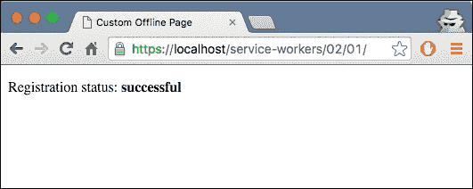

1.  现在打开开发者工具（*Cmd* + *Alt* + *I* 或 *F12*），转到**网络**标签，点击显示**无限制**的下拉菜单，并选择**离线**：

1.  现在刷新您的浏览器，您将看到离线消息和以下图像：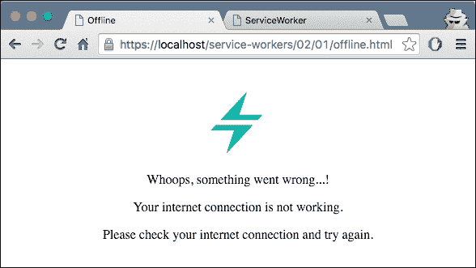

## 工作原理...

当注册成功时，我们指示服务工作者使用 fetch 事件拦截请求，并从缓存内容中提供资源，如下面的图示所示：

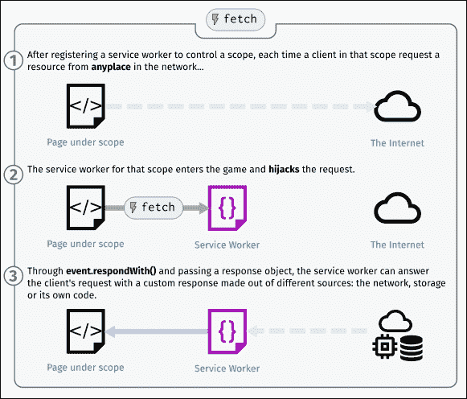

在`index.html`文件内部，当注册成功时，我们检查注册状态并将其打印到浏览器中。否则，我们打印由服务工作者返回的错误信息：

```js
navigator.serviceWorker.register(
      'service-worker.js',
      { scope: './' }
   ).then(function(serviceWorker) {
      document.getElementById('status').innerHTML = 
          'successful';
   }).catch(function(error) {
      document.getElementById('status').innerHTML = error;
   });
```

服务工作者脚本文件将拦截网络请求，检查连接性，并向用户提供内容。

我们首先在安装服务工作者时将离线页面添加到缓存中。在前几行中，我们指定了缓存版本和离线页面的 URL。如果我们有不同的缓存版本，您只需更新这个版本号，这样文件的新版本就会生效。我们称之为**缓存破坏**：

```js
var version = 1;
var currentCache = {
  offline: 'offline-cache' + version
};
```

我们向 install 事件添加事件监听器，并在回调函数中请求这个离线页面及其资源；当我们收到成功的响应时，它会被添加到缓存中：

```js
self.addEventListener('install', function(event) {
  event.waitUntil(
    caches.open(currentCache.offline)
    .then(function(cache) {
         return cache.addAll([
            offlineUrl
         ]);
    })
  );
});
```

现在离线页面已存储在缓存中，我们可以在需要时检索它。在同一个服务工作者中，我们需要添加逻辑以在没有连接性时返回离线页面：

```js
self.addEventListener('fetch', function(event) {
  var request = event.request,
    isRequestMethodGET = request.method === 'GET';

  if (request.mode === 'navigate' || isRequestMethodGET) {
    event.respondWith(
      fetch(createRequestWithCacheBusting(request.url)).catch(function(error) {
        console.log('OFFLINE: Returning offline page.', error);
        return caches.match(offlineUrl);
      })
    );
  } else {
    event.respondWith(caches.match(request)
        .then(function (response) {
        return response || fetch(request);
      })
    );
  }
}); 
```

在前面的列表中，我们正在监听 fetch 事件，如果我们检测到用户正在尝试导航到另一个页面，并且在这个过程中出现错误，我们只需从缓存中返回离线页面。就这样，我们的离线页面开始工作。

## 更多内容...

`waitUntil`事件延长了 install 事件的寿命，直到所有缓存都已填充。换句话说，它延迟将安装中的工作者视为已安装，直到我们指定的所有资源都已缓存并且传递的 promise 成功解析。

我们看到了一个 HTML 文件和一个图像文件被缓存，然后在我们网站离线时被检索。我们还可以缓存其他资源，包括 CSS 和 JavaScript 文件：

```js
caches.open(currentCache.offline)
.then(function(cache) {
    return cache.addAll([
        'offline.html',
        '/assets/css/style.css',
        '/assets/js/index.js'
    ]);
  })
);
```

## 参见

+   第一章的*详细注册服务工作者*配方，*学习服务工作者基础*

+   第一章的*创建模拟响应*配方，*学习 Service Worker 基础知识*

# 离线加载图片

图片是当今世界上几乎所有网站都使用的资源。就像你的 HTML、CSS 和 JavaScript 一样，你可以使用服务工作者缓存图片以便离线查看。在本章中，我们将探讨如何离线加载图片以及处理响应式图片。

## 准备工作

要开始使用服务工作者，你需要在浏览器设置中开启服务工作者实验功能。如果你还没有这样做，请参考第一章的*设置服务工作者*配方，*学习 Service Worker 基础知识*。服务工作者仅在 HTTPS 上运行。要了解如何设置支持此功能的发展环境，请参考以下第一章的配方：*设置 GitHub 页面以支持 SSL*、*为 Windows 设置 SSL*和*为 Mac 设置 SSL*。

## 如何操作...

按照以下说明设置你的文件结构：

1.  首先，我们必须创建一个`index.html`文件，如下所示：

    ```js
    <!DOCTYPE html>
    <html lang="en">
    <head>
      <meta charset="UTF-8">
      <title>Offline Images</title>
    </head>
    <body>
      <main>
        <p>Registration status: <strong id="status"></strong></p>
        
      <main>
      <script src="img/index.js"></script>
    </body>
    </html>
    ```

1.  现在我们必须创建一个名为`service-worker.js`的 JavaScript 文件，并将其保存在与`index.html`文件相同的文件夹中，代码如下：

    ```js
    'use strict';

    var version = 1;
    var cacheName = 'static-' + version;

    self.addEventListener('install', installHandler);
    self.addEventListener('fetch', fetchHandler);

    function installHandler(event) {
        event.waitUntil(
            caches.open(cacheName).then(function(cache) {
                return cache.addAll([
                  'index.html',
                  'packt-logo.png'
                ]);
            })
        );
    }

    event.respondWith(
      fetch(event.request).catch(function() {
        return caches.match(event.request);
      })
    );
    ```

1.  在与`index.html`文件相同的文件夹中创建一个名为`index.js`的 JavaScript 文件，代码如下：

    ```js
    'use strict';

    var scope = {
      scope: './'
    };

    if ('serviceWorker' in navigator) {
      navigator.serviceWorker.register('service-worker.js', scope
      ).then( function(serviceWorker) {
        printStatus('successful');
      }).catch(function(error) {
        printStatus(error);
      });
    } else {
      printStatus('unavailable');
    }

    function printStatus(status) {
      document.getElementById('status').innerHTML = status;
    }
    ```

1.  下载一个图片文件并将其保存在与`index.html`文件相同的文件夹中。在这个例子中，我将其命名为`packt-logo.png`。

1.  打开浏览器并转到`index.html`文件：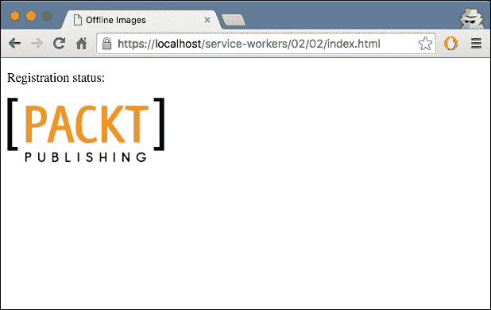

1.  打开 Chrome 开发者工具(*Cmd* + *Alt* + *I* 或 *F12*)，选择**网络**选项卡，并点击**离线**：

1.  通过按*Cmd* + *R* 或 *F5*刷新页面，你会看到图片看起来和在线时一样。

## 它是如何工作的...

在`index.html`文件中，我们通过`img`标签链接我们下载的图片：

```js
<body>
  <p>Registration status: <strong id="status"></strong></p>
  
  <script src="img/index.js"></script>
</body>
```

在服务工作者脚本文件中，我们在安装服务工作者时将离线页面添加到缓存中。在前几行中，我们指定缓存版本和离线页面的 URL：

```js
var version = 1;
var cacheName = 'static-' + version;
```

安装事件的监听器调用`waitUntil`函数，在那里我们缓存`index.html`和字体文件，在我们的例子中，是`webfont-serif.woff`。`cache.addAll`函数接受一个要缓存的文件数组：

```js
self.addEventListener('install', function(event) {
    event.waitUntil(
        caches.open(cacheName).then(function(cache) {
            return cache.addAll([
                'index.html',
                'packt-logo.png'
            ]);
        })
    );
});
```

当我们重新加载页面，在设置为离线后，fetch 事件被触发，从缓存中检索这两个文件，并将它们随响应发送：

```js
self.addEventListener('fetch', function(event) {
    event.respondWith(caches.match(event.request));
});    
```

现在，页面将以在线时的样子显示。

## 更多内容...

如果我们按照移动优先策略开发我们的网站，拥有响应式图片将极大地受益。让我们看看我们如何实现这一点。

### 处理响应式图片

有许多方法可以启用图片的响应式行为。其中一种较老的方法（不推荐）是通过简单的脚本实现，但这会导致一些问题。首先，如果脚本确定要下载的图片，但脚本本身在指定的 HTML 图片下载之后才加载，你可能会最终下载两张图片。其次，如果你在 HTML 中没有指定任何图片，只想通过脚本加载定义的图片，那么对于禁用脚本的浏览器，你将没有任何图片。

因此，我们需要一种更好的方式来处理响应式图片。幸运的是，确实存在一种！推荐的方式是使用：

+   `srcset`

+   `sizes`

+   `picture`

#### `srcset` 属性

在我们探讨 `srcset` 实际使用方法之前，让我们先了解一些术语。

##### 设备像素比

设备像素比是每 CSS 像素中的设备像素数量。有两个关键条件会影响设备像素比：

+   **设备的像素密度（每英寸物理像素的数量）**：高分辨率设备将具有更高的像素密度，因此，对于相同的缩放级别，与低分辨率设备相比，它将具有更高的设备像素比。例如：高端的 Lumia 950 手机比预算型的 Lumia 630 手机具有更高的分辨率，因此，在相同的缩放级别下，它将具有更高的设备像素比。

+   **浏览器的缩放级别**：对于同一设备，更高的缩放级别意味着每 CSS 像素拥有更多的设备像素，因此设备像素比更高。例如，考虑这个图：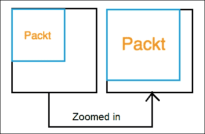

当你在浏览器中放大（*Ctrl* + *+*）时，你的 `div` 的 CSS 像素数量保持不变，但占用的设备像素数量增加。因此，你每 CSS 像素拥有更多的设备像素。

当你希望根据设备像素比显示不同的图片（或通常，同一图片的不同资产）时，你可以选择基本的 `srcset` 实现：

```js

```

`srcset` 属性中的 `x` 描述符用于定义设备像素比：

+   对于设备像素比为 1 的情况，将使用 `image-src.png` 图片。

+   对于设备像素比为 2 的情况，将使用 `image-2x.png` 图片。

`src` 属性用于作为不支持 `srcset` 实现的浏览器的后备选项。

这效果很好。使用 `x` 描述符，你将在具有相似设备像素比的设备上始终获得相同的图片——即使这意味着你会在 13.5 英寸的笔记本电脑和 5 英寸的手机上获得相同的图片，这两者的设备像素比相同。

#### `sizes` 属性

当你希望在不同的屏幕尺寸上使用不同大小的图片（不同的高度和宽度）时，可以通过使用 `sizes` 属性以及 `srcset` 属性的 `w` 描述符来实现。

假设你希望图片的显示宽度为视口宽度的一半。你将输入：

```js

```

#### `picture` 元素

正如我们在上一节中看到的，当您想要根据图片的渲染大小显示不同的图片时，会使用`picture`元素。`picture`元素是一个容器，它包含其他控制要下载的图片的元素：

```js
<picture>
  
</picture>
```

在运行时，`srcset`属性或`<picture>`元素会选择最合适的图片资源，并执行网络请求。

如果您想在安装服务工作者步骤中缓存图片，您有几个选择：

+   安装单个低分辨率版本的图片

+   安装单个高分辨率版本的图片

为了保留内存，最好将图片数量限制在两到三张。

为了提高加载时间，您可能决定在安装时选择低分辨率版本，并在页面加载时尝试从网络检索更高分辨率的图片；然而，在高清图片失败的情况下，您可能会认为可以轻松地回退到低分辨率版本，但有一个问题。

假设我们有两个图片：

| 显示密度 | 宽度 | 高度 |
| --- | --- | --- |
| `1x` | `400` | `400` |
| `2x` | `800` | `800` |

这里是`srcset`图片的标记：

```js

```

在一个`2x`显示的屏幕上，浏览器可以选择下载`image-2x.png`，如果我们离线，那么我们可以捕获这个请求，如果图片已缓存，则返回`image-src.png`图片代替。如果图片已缓存，浏览器可能期望一个考虑`2x`屏幕额外像素的图片，因此图片将显示为 200 x 200 像素，而不是 400 x 400 像素。唯一的解决办法是在图片上设置固定的宽度和高度：

```js

```

我们可以采取相同的方法来处理`srcset`。

未设置宽度和高度：


设置高度和宽度：


如果您想注销服务工作者，您可以前往 Chrome 的开发者工具栏，并在**服务工作者**部分点击**注销**按钮，如下面的截图所示：


如果您想找出存储在缓存中的资源，您可以通过打开开发者工具并查看**资源**选项卡来做到：

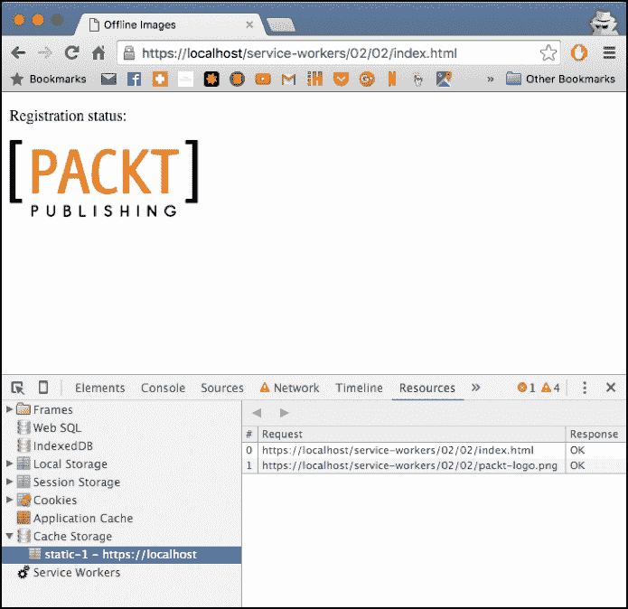

如果您使用 Firefox Nightly，您可以通过打开开发者工具并查看存储检查器来查看缓存：

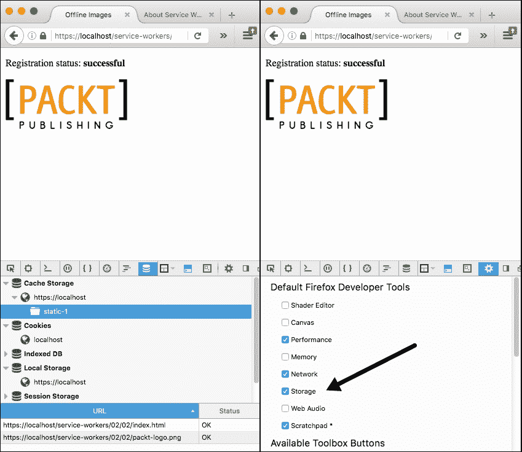

## 参见

+   在第一章的*详细注册服务工作者*食谱，*学习服务工作者基础*

+   在第一章的*创建模拟响应*食谱中，*学习服务工作者基础*

# 离线加载 CSS

CSS 对于构建你的网站和使其看起来功能齐全至关重要。正因为如此，如果你的网站离线且 CSS 不在缓存中，你的网站将看起来损坏。为了实现这一点，我们使用服务工作者缓存 CSS，并将这些 CSS 文件作为外部资源提供。在本教程中，我们将探讨如何离线加载 CSS。

## 准备工作

要开始使用服务工作者，你需要在浏览器设置中开启服务工作者实验功能。如果你还没有这样做，请参考第一章的*设置服务工作者*教程，*学习服务工作者基础*。服务工作者仅在 HTTPS 上运行。要了解如何设置支持此功能的开发生态，请参考第一章的以下教程：*设置 GitHub 页面以支持 SSL*，*在 Windows 上设置 SSL*，和*在 Mac 上设置 SSL*。

## 如何操作...

按照以下说明设置你的文件结构：

1.  首先，我们必须创建一个`index.html`文件，如下所示：

    ```js
    <!DOCTYPE html>
    <html lang="en">
    <head>
      <meta charset="UTF-8">
      <title>Offline CSS</title>
      <link rel="stylesheet" href="style-2.css">
      <link rel="stylesheet" href="style-1.css">
    </head> 
    <body>
      <p>Registration status: <strong id="status"></strong></p>

      <script>
          var scope = {
          scope: './'
        };

        if ('serviceWorker' in navigator) {
          navigator.serviceWorker.register('service-worker.js', scope)
          .then(
            function(serviceWorker) {
            printStatus('successful');
          }).catch(function(error) {
            printStatus(error);
          });
        } else {
          printStatus('unavailable');
        }

        function printStatus(status) {
          document.getElementById('status').innerHTML = status;
        }  </script>
    </body>
    </html>
    ```

1.  在与`index.html`文件相同的文件夹中创建一个名为`service-worker.js`的 JavaScript 文件，内容如下：

    ```js
    var version = 1;
    var cacheName = 'static-' + version;

    self.addEventListener('install', installHandler);
    self.addEventListener('fetch', fetchHandler);

    function installHandler(event) {
        event.waitUntil(
            caches.open(cacheName).then(function(cache) {
                return cache.addAll([
                  'index.html',
                  'style-2.css'
                ]);
            })
        );
    }

    function fetchHandler(event) {
      if (/index/.test(event.request.url) || /style-2/.test(event.request.url)) {
        event.respondWith(caches.match(event.request));
      }
    }
    ```

1.  在与`index.html`文件相同的文件夹中创建一个名为`style-1.css`的 CSS 文件，内容如下：

    ```js
    body {
        background-color: lightgreen;
    }
    ```

1.  在与`index.html`文件相同的文件夹中创建另一个名为`style-2.css`的 CSS 文件，内容如下：

    ```js
    body {
        background-color: red;
    }
    ```

1.  打开浏览器并访问`index.html`文件。你会看到背景颜色是绿色：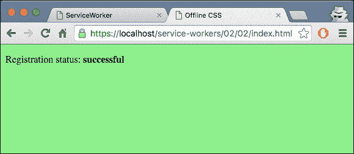

1.  现在打开开发者工具（*Cmd* + *Shift* + *I* 或 *F12*）并将**网络**标签页切换到**离线**，如图所示：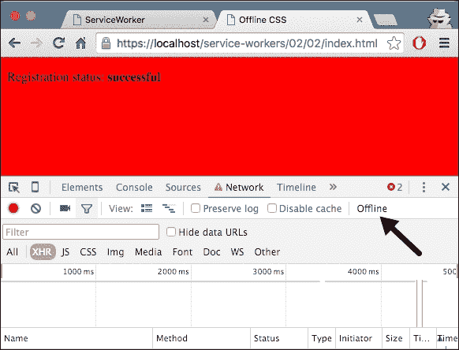

1.  背景颜色现在是红色。

## 工作原理...

在`index.html`文件的头部部分，我们链接了两个 CSS 文件：

```js
<head>
  <meta charset="UTF-8">
  <title>Offline CSS</title>
  <link rel="stylesheet" href="style-2.css">
  <link rel="stylesheet" href="style-1.css">
</head>
```

在我们的样式表中，我们引用了 body 的相同 CSS 属性。

由于我们调用 CSS 文件的顺序，最后一个选择器在在线页面上生效，在我们的例子中，这是`style-1.css`的`body`选择器：

```js
body {
    background-color: lightgreen;
}
```

在`service-worker.js`文件中，我们在安装服务工作者时将`index.html`和`style-2.css`文件添加到缓存中。在前几行中，我们指定缓存版本和离线页面的 URL：

```js
var version = 1;
var cacheName = 'static-' + version;
```

安装事件的监听器调用`waitUntil`函数，其中我们缓存`index.html`和 CSS 文件。`cache.addAll`函数接受一个要缓存的文件数组：

```js
function installHandler(event) {
    event.waitUntil(
        caches.open(cacheName).then(function(cache) {
            return cache.addAll([
              'index.html',
              'style-2.css'
            ]);
        })
    );
}
```

当我们重新加载页面，在设置为离线后，fetch 事件被触发，从缓存中检索这两个文件，并将它们随响应一起发送：

```js
self.addEventListener('fetch', function(event) {
    event.respondWith(caches.match(event.request));
});
```

现在，当我们刷新页面时，背景将变为红色，因为我们保存在缓存中的 CSS 文件这次将被应用到页面上。

# 离线加载字体

如果您的网站使用外部字体，例如开源网络字体，您可以使用服务工作者将其缓存以便离线查看。在本章中，我们将探讨如何离线加载字体。

## 准备工作

要开始使用服务工作者，您需要在浏览器设置中开启服务工作者实验功能。如果您还没有这样做，请参考第一章中的*设置服务工作者*配方，*学习服务工作者基础*。服务工作者仅在 HTTPS 上运行。要了解如何设置支持此功能的发展环境，请参考以下第一章中的配方：*设置 GitHub 页面以支持 SSL*，*在 Windows 上设置 SSL*，和*在 Mac 上设置 SSL*。

## 如何操作...

按照以下说明设置您的文件结构：

1.  首先，我们必须创建一个如下所示的 `index.html` 文件：

    ```js
    <!DOCTYPE html>
    <html lang="en">
    <head>
      <meta charset="UTF-8">
      <title>Offline Fonts</title>
      <style>
        @font-face{
          font-family: 'MyWebFont';
          src: url('webfont-serif.woff') format('woff');
        }
        p { font-family: 'MyWebFont', Arial, sans-serif; }
      </style>
    </head>
    <body>
      <p>Registration status: <strong id="status"></strong></p>

      <script>
          var scope = {
          scope: './'
        };

        if ('serviceWorker' in navigator) {
          navigator.serviceWorker.register('service-worker.js', scope)
          .then(
            function(serviceWorker) {
            printStatus('successful');
          }).catch(function(error) {
            printStatus(error);
          });
        } else {
          printStatus('unavailable');
        }

        function printStatus(status) {
          document.getElementById('status').innerHTML = status;
        }  </script>
    </body>
    </html>
    ```

1.  在与 `index.html` 文件相同的文件夹中创建一个名为 `service-worker.js` 的 JavaScript 文件，并包含以下代码：

    ```js
    'use strict';

    var version = 1;
    var cacheName = 'static-' + version;

    self.addEventListener('install', installHandler);
    self.addEventListener('fetch', fetchHandler);

    function installHandler(event) {
        event.waitUntil(
            caches.open(cacheName).then(function(cache) {
                return cache.addAll([
                    'index.html',
                    'webfont-serif.woff'
                ]);
            })
        );
    }

    function fetchHandler(event) {
        event.respondWith(caches.match(event.request));
    }
    ```

1.  从 [`www.google.com/fonts`](https://www.google.com/fonts) 下载网络字体并将其保存在与 `index.html` 文件相同的文件夹中。如果您不确定如何操作，请参阅以下 *更多内容...* 部分。

1.  打开浏览器并转到 `index.html` 文件：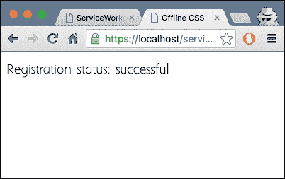

1.  打开 Chrome 开发者工具(*Cmd* + *Alt* + *I* 或 Fb12)，选择**网络**选项卡，并点击**离线**：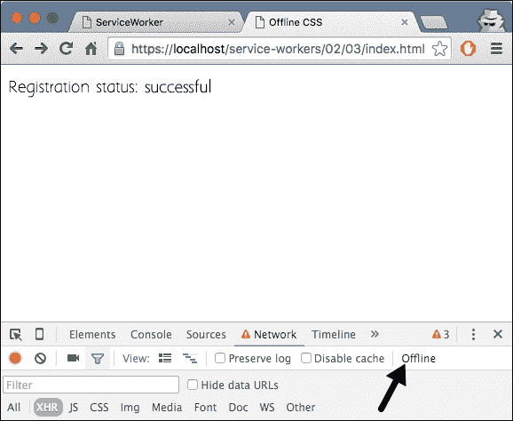

1.  通过按 *Cmd* + *R* 或 *F5* 刷新页面，您将看到字体看起来与在线时相同。

## 它是如何工作的...

在 `index.html` 文件的头部部分，我们在 `style` 标签内链接我们下载的字体文件：

```js
<style>
   @font-face{
     font-family: 'MyWebFont';
     src: url('webfont-serif.woff') format('woff');
   }

   p { font-family: 'MyWebFont', Arial, sans-serif; }
</style>
```

`@font-face` 声明将指定一个名为 `myWebFont` 的字体，并指定可以找到该字体的 URL。在我们的例子中，它位于 `index.html` 文件相同的目录中。然后我们在段落声明中引用该字体作为 `font-family` 属性：

```js
p { font-family: 'MyWebFont', Arial, sans-serif; }
```

在服务工作者脚本文件中，我们在安装服务工作者时将我们的离线页面添加到缓存中。在前几行中，我们指定缓存版本和离线页面的 URL：

```js
var version = 1;
var cacheName = 'static-' + version;
```

安装事件的监听器调用 `waitUntil` 函数，在那里我们缓存 `index.html` 文件和字体文件；在我们的例子中是 `webfont-serif.woff`。`cache.addAll` 函数接受要缓存的文件数组：

```js
self.addEventListener('install', function(event) {
    event.waitUntil(
        caches.open(cacheName).then(function(cache) {
            return cache.addAll([
                'index.html',
                'webfont-serif.woff'
            ]);
        })
    );
});
```

当我们重新加载页面，在设置为离线后，fetch 事件被触发，从缓存中检索这两个文件，并将它们随响应发送：

```js
self.addEventListener('fetch', function(event) {
    event.respondWith(caches.match(event.request));
});    
```

现在，页面将以在线时的样子显示。

## 更多内容...

为了从 Google 找到免费字体并下载它，请执行以下步骤：

1.  请导航到[`www.google.com/fonts`](https://www.google.com/fonts)，搜索或浏览所需的字体，然后通过点击字体右侧的蓝色**添加到收藏**按钮将你喜欢的字体添加到你的收藏中：

1.  你的收藏将显示在屏幕底部。一旦有了，选择屏幕右上角的**使用此样式**复选框：

1.  现在，当你点击页面右上角的箭头时，它会弹出一个对话框。你可以选择第一个选项，它将文件作为 ZIP 文件下载：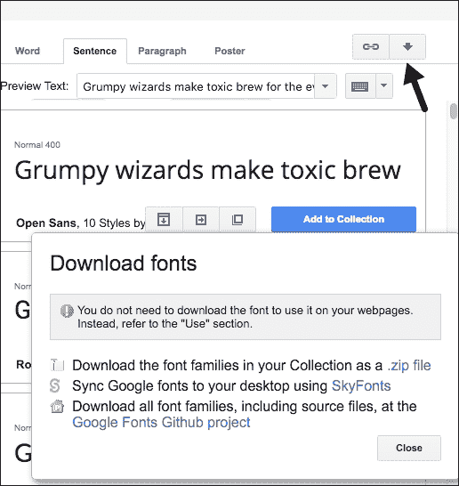

1.  一旦解压文件，你将在文件夹内找到所需的字体。如果你想注销一个 service worker，你可以转到`chrome://service-worker-internals`并点击**注销**按钮：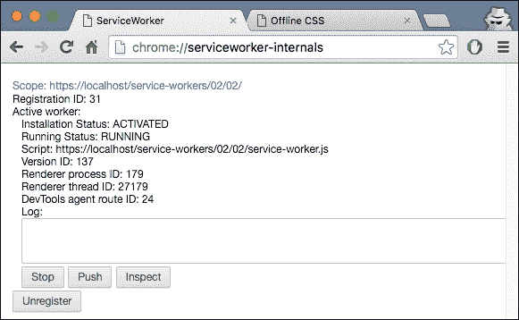

1.  在 Firefox Nightly 中，你可以转到`about:serviceworkers`并点击**注销**按钮：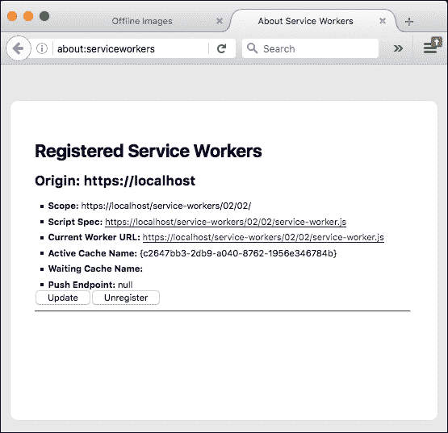

## 相关内容

+   在第一章的*详细注册 Service Worker*配方中，*学习 Service Worker 基础知识*

+   在第一章的*创建模拟响应*配方中，*学习 Service Worker 基础知识*

# 实现多个 fetch 处理器

Service workers 可以处理多个 fetch 处理器，每个处理器拦截不同类型的请求。这个配方详细解释了如何通过实现单独的 fetch 处理器来处理不同类型的请求。

## 准备工作

要开始使用 service workers，你需要在浏览器设置中开启 service worker 实验功能。如果你还没有这样做，请参考第一章的*设置 Service Workers*配方，*学习 Service Worker 基础知识*。Service workers 仅在 HTTPS 上运行。要了解如何设置一个支持此功能的发展环境，请参考第一章的以下配方：*设置 GitHub pages for SSL*，*设置 Windows 的 SSL*，和*设置 Mac 的 SSL*。

## 如何操作...

按照以下说明设置你的文件结构：

1.  首先，我们需要创建一个`index.html`文件，如下所示：

    ```js
    <!DOCTYPE html>
    <html lang="en">
    <head>
      <meta charset="UTF-8">
      <title>Multiple Fetch</title>
    </head>
    <body>
      <p>Registration status: <strong id="status"></strong></p>

      <script>
        if ('serviceWorker' in navigator) {
          navigator.serviceWorker.register(
            'service-worker.js',
            { scope: './' }
          ).then( function(serviceWorker) {
            document.getElementById('status').innerHTML = 'successful';
          }).catch(function(error) {
            document.getElementById('status').innerHTML = error;
          });
        } else {
          document.getElementById('status').innerHTML = 'unavailable';
        }
      </script>
    </body>
    </html>
    ```

1.  在与`index.html`文件相同的文件夹中创建一个名为`service-worker.js`的 JavaScript 文件，并包含以下代码：

    ```js
    var cookFetchHandler = function(event) {
      console.log('DEBUG: Inside the /cook handler.');
      if (event.request.url.indexOf('/cook/') > 0) {
        event.respondWith(new Response('Fetch handler for /cook'));
      }
    };

    var cookBookFetchHandler = function(event) {
      console.log('DEBUG: Inside the /cook/book handler.');
      if (event.request.url.endsWith('/cook/book')) {
        event.respondWith(new Response('Fetch handler for /cook/book'));
      }
    };

    var fetchHandlers = [cookBookFetchHandler, cookFetchHandler];

    fetchHandlers.forEach(function(fetchHandler) {
      self.addEventListener('fetch', fetchHandler);
    });
    ```

1.  打开浏览器并转到`index.html`文件。你会看到**注册状态：成功**的消息：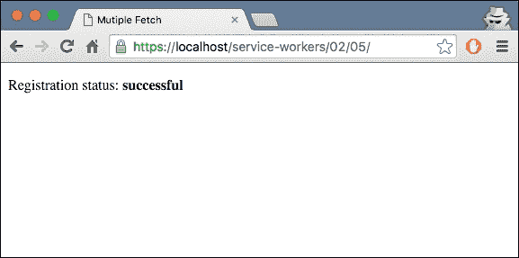

1.  通过在前面添加`/cook/`来更改 URL，如下所示：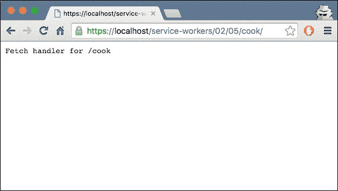

1.  通过在前面添加`/book`来更改 URL，如下所示：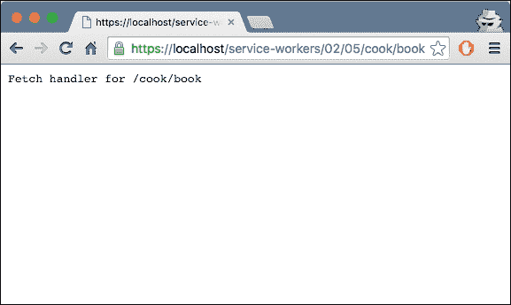

## 它是如何工作的...

当注册成功时，我们检查注册状态，并将其打印到浏览器中。现在，是时候通过服务工作者触发响应了。在 `service-worker.js` 文件中，有两个注册的获取处理程序，`cookFetchHandler` 和 `cookBookFetchHandler`：

```js
var cookFetchHandler = function(event) {
  console.log('DEBUG: Inside the /cook handler.');
  if (event.request.url.indexOf('/cook/') > 0) {
    event.respondWith(new Response('Fetch handler for /cook'));
  }
};

var cookBookFetchHandler = function(event) {
  console.log('DEBUG: Inside the /cook/book handler.');
  if (event.request.url.endsWith('/cook/book')) {
    event.respondWith(new Response('Fetch handler for /cook/book'));
  }
};
```

第一个处理程序，`cookFetchHandler`，拦截 URL 中任何位置的以 `/cook` 结尾的请求，并返回一个包含文字 `Fetch handler for /cook` 的新响应。

第二个处理程序，`cookBookFetchHandler`，拦截 URL 中任何位置的以 `/cook/book` 结尾的请求，并返回一个包含文字 `Fetch handler for /cook/book` 的新响应。

由于 `cookBookFetchHandler` 是首先注册的，当它拦截 `/cook/book` 请求时，它将首先有机会通过 `event.respondWith()` 返回响应。只有当第一个处理程序没有调用它时，第二个处理程序才会得到处理 `event.respondWith()` 的机会。

当发生获取事件时，它们将按注册顺序逐个调用。每当处理程序调用 `event.respondWith()` 时，其他注册的处理程序将不会运行：

```js
var fetchHandlers = [cookBookFetchHandler, cookFetchHandler];

fetchHandlers.forEach(function(fetchHandler) {
  self.addEventListener('fetch', fetchHandler);
});
```

如果注册的任何获取处理程序都没有调用 `event.respondWith()`，浏览器将接管并执行一个正常的 HTTP 请求。这是没有服务工作者参与时的正常流程。

## 还有更多...

在每个获取处理程序内部，我们必须确保确定是否调用 `event.respondWith()` 的逻辑是同步执行的。简单的 `if()` 语句检查 `event.request.url` 是可以的。任何异步操作，例如执行 `caches.match()` 然后根据响应决定是否调用 `event.respondWith()`，都会触发竞争条件，你很可能会在控制台看到 `event already responded to` 错误。

如果你想注销服务工作者，你可以转到 Chrome 的开发者工具栏，并在 **服务工作者** 部分点击 **注销** 按钮，如图所示：

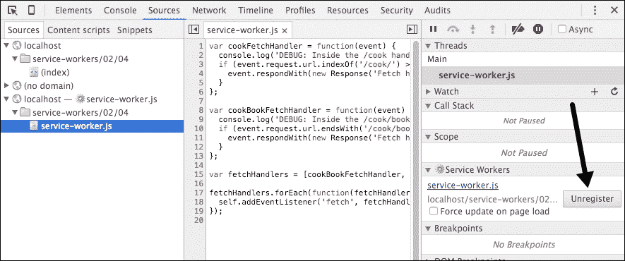

## 参见

+   在第一章 *学习服务工作者基础* 的 *详细注册服务工作者* 菜谱中，*学习服务工作者基础*

+   在第一章 *学习服务工作者基础* 的 *创建模拟响应* 菜谱中，*学习服务工作者基础*

# 获取远程资源

获取远程资源可以通过几种不同的方式完成。在这个菜谱中，我们将探讨两种获取远程资源的标准方式，以及了解如何使用服务工作者充当代理中间件。

## 准备工作

要开始使用服务工作者，您需要在浏览器设置中开启服务工作者实验功能。如果您还没有这样做，请参阅第一章 *设置服务工作者* 的配方，*学习服务工作者基础知识*。服务工作者仅在 HTTPS 上运行。要了解如何设置支持此功能的发展环境，请参阅第一章 *为 SSL 设置 GitHub 页面* 的配方，*学习服务工作者基础知识*。

## 如何操作...

按照以下说明设置你的文件结构：

1.  首先，我们需要创建一个 `index.html` 文件，如下所示：

    ```js
    <!DOCTYPE html>
    <html lang="en">
      <head>
        <meta charset="UTF-8">
        <title>Fetching Offline Resources</title>
      <style>
          .error {
            color: #FF0000;
          }
          .success {
            color: #00FF00;
          }
        </style>
      </head>
      <body>
        <section>
          <h1>Images</h1>
          <div id="https-acao-image"></div>
          <div id="https-image"></div>
          <div id="http-image"></div>
        </section>

        <section>
          <h1>HTTPS Fetch</h1>
          <div id="https-cors">
            <strong>https-cors</strong>
          </div>
          <div id="https-no-cors">
            <strong>https-no-cors</strong>
          </div>
          <div id="https-acao-cors">
            <strong>https-acao-cors</strong>
          </div>
          <div id="https-acao-no-cors">
            <strong>https-acao-no-cors</strong>
          </div>
          <div id="service-https-cors">
            <strong>service-https-cors</strong>
          </div>
          <div id="service-http-cors">
            <strong>service-http-cors</strong>
          </div>
          <div id="service-http-no-cors">
            <strong>service-http-no-cors</strong>
          </div>
        </section>

        <section>
          <h1>HTTP Fetch</h1>
          <div id="http-cors">
            <strong>http-cors</strong>
          </div>
          <div id="http-no-cors">
            <strong>http-no-cors</strong>
          </div>
        </section>

        <script src="img/index.js"></script>
      </body>
    </html>
    ```

1.  在与 `index.html` 文件相同的文件夹中创建一个名为 `index.js` 的 JavaScript 文件，其中包含以下代码：

    ```js
    'use strict';

    var protocols = {
    'https': 
    'https://dz13w8afd47il.cloudfront.net/sites/all/themes/packt_v4/images/packtlib-logo-dark.png',

      'https-acao': 
    'https://i942.photobucket.com/albums/ad261/szaranger/Packt/packt-logo.png',

      'http': 
    'http://seanamarasinghe.com/wp-content/uploads/2015/06/icon-128x128.jpg'
    };

    navigator.serviceWorker.getRegistration()
    .then(function(registration) {
      var fetchModes = ['cors', 'no-cors'];

      if (!registration || !navigator.serviceWorker.controller) {
        navigator.serviceWorker.register(
        './service-worker.js').then(function() {
            console.log('Service worker registered, 
            reloading the page');
            window.location.reload();
        });
      } else {
        console.log('Client is under service worker\s control');

        for (var protocol in protocols) {
          if (protocols.hasOwnProperty(protocol)) {
            buildImage(protocol, protocols[protocol]);

            for (var index = 0; index < fetchModes.length; index++) {
              var fetchMode = fetchModes[index],
                init = { method: 'GET',
                         mode: fetchMode,
                         cache: 'default' };

              fireRequest(fetchMode, protocol, init)();
            }
          }
        }
      }
    });

    function buildImage(protocol, url) {
      var element = protocol + '-image',
        image = document.createElement('img');

      image.src = url;
      document.getElementById(element).appendChild(image);
    }

    function fireRequest(fetchMode, protocol, init) {
      return function() {
        var section = protocol + '-' + fetchMode,
          url = protocols[protocol];

        fetch(url, init).then(function(response) {
          printSuccess(response, url, section);
        }).catch(function(error) {
          printError(error, url, section);
        });

        fetch('./proxy/' + url, init).then(function(response) {
          url = './proxy/' + url;
          printSuccess(response, url, section);
        }).catch(function(error) {
          section = 'service-' + section;

          console.log(section, 'ERROR: ', url, error);
          log(section, 'ERROR: ' + error, 'error');
        });
      };
    }

    function printSuccess(response, url, section) {
      if (response.ok) {
        console.log(section, 'SUCCESS: ', url, response);
        log(section, 'SUCCESS');
      } else {
        console.log(section, 'FAIL:', url, response);
        log(section, 'FAIL: response type: ' + response.type +
                     ', response status: ' + 
                     response.status, 'error');
      }
    }

    function printError(error, url, section) {
      console.log(section, 'ERROR: ', url, error);
      log(section, 'ERROR: ' + error, 'error');
    }

    function log(id, message, type) {
      var sectionElement = document.getElementById(id),
        logElement = document.createElement('p');

      if (type) {
        logElement.classList.add(type);
      }
      logElement.textContent = message;
      sectionElement.appendChild(logElement);
    }
    ```

1.  在与 `index.html` 文件相同的文件夹中创建一个名为 `service-worker.js` 的 JavaScript 文件，其中包含以下代码：

    ```js
    self.onfetch = function(event) {
      if (event.request.url.indexOf('proxy') > -1) {
        var init = { method: 'GET',
                     mode: event.request.mode,
                     cache: 'default' };
        var url = event.request.url.split('proxy/')[1];
        console.log('DEBUG: proxying', url);
        event.respondWith(fetch(url, init));
      } else {
        event.respondWith(fetch(event.request));
      }
    };
    ```

1.  打开浏览器并转到 `index.html` 文件：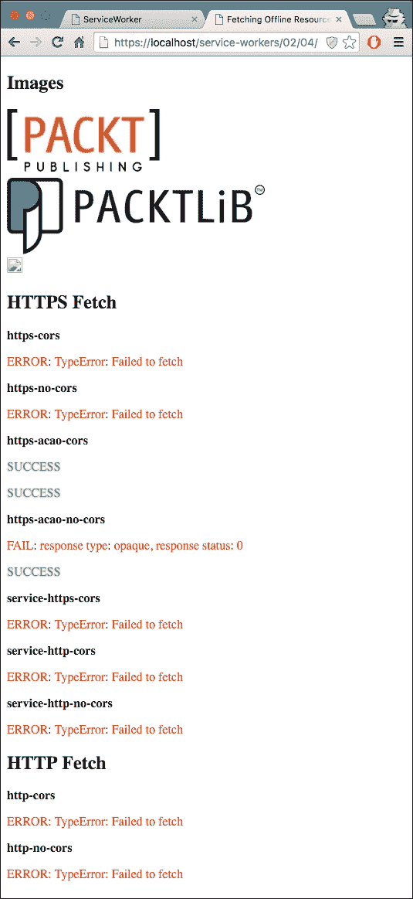

## 工作原理...

在 `index.js` 文件的开始处，我们正在测试三种不同的协议来加载资源：

+   `https`：带有 **Secure Socket Layer**（**SSL**）协议的 HTTP

+   `https-acao`：带有 **Access-Control-Origin=*** 标头的 SSL 协议

+   `http`：没有 SSL 的 HTTP

我们将使用三个不同的 URL，这些 URL 将被多次加载：

```js
var protocols = {
  'https-acao':  
    'https://i942.photobucket.com/albums/ad261/szaranger/Packt/packt-logo.png',
  'https': 
    'https://dz13w8afd47il.cloudfront.net/sites/all/themes/packt_v4/images/packtlib-logo-dark.png',
  'http': 
    'http://seanamarasinghe.com/wp-content/uploads/2015/06/icon-128x128.jpg'
};
```

我们还使用两种不同的方法来获取资源，带有或没有 `cors`：

```js
var fetchModes = ['cors', 'no-cors'];
```

接下来，我们检查服务工作者是否已注册：

```js
  navigator.serviceWorker.register(
'./service-worker.js').then(function() {
      console.log('Service worker registered, reloading the page');
      window.location.reload();
    });
```

如果情况不是这样，那么我们将注册它并重新加载页面以确保客户端处于服务工作者的控制之下：

```js
for (var protocol in protocols) {
      if (protocols.hasOwnProperty(protocol)) {
        buildImage(protocol, protocols[protocol]);

        for (var i = 0; i < fetchModes.length; i++) {
          var fetchMode = fetchModes[i],
            init = { 
                 method: 'GET',
                 mode: fetchMode,
                 cache: 'default' 
            };

          fireRequest(fetchMode, protocol, init)();
        }
      }
}
```

`for` 循环遍历提供的 `protocols` 数组，为每个协议发出请求，使用每个 URL 构建一个 DOM 图像元素，并遍历 `fetchModes` 数组中的每个模式。

`init` 对象包含您想要应用于请求的任何自定义设置：

+   `method`：请求方法，例如，`GET` 和 `POST`

+   `mode`：您想要用于请求的模式，例如，`cors`、`no-cors` 或 `same-origin`

+   `cache`：您想要用于请求的缓存模式：`default`、`no-store`、`reload`、`no-cache`、`force-cache` 或 `only-if-cached`

`buildImage` 函数接受两个参数：`protocol` 和 `url`。它会动态创建一个图像元素，并将 URL 作为该图像的源。然后它继续将该图像添加到 DOM 树中，其中 ID 为 `https-acao-image`、`https-image` 或 `http–image` 之一。在此阶段，JavaScript 对 URL 的处理没有控制权；浏览器处理这些 URL：

```js
function buildImage(protocol, url) {
  var element = protocol + '-image',
    image = document.createElement('img');

  image.src = url;
  document.getElementById(element).appendChild(image);
}
```

只有 HTTPS 请求的图像将被渲染，因为服务工作者仅支持 SSL 连接：

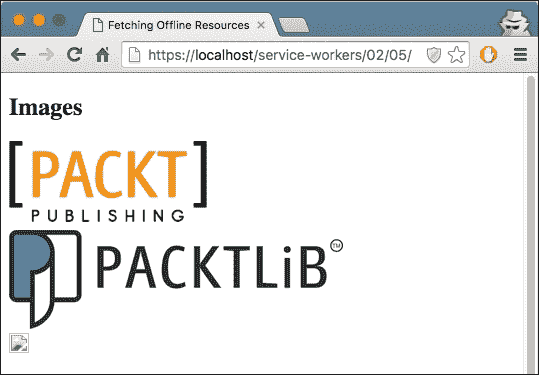

破损的图像是通过标准 HTTP 请求的，未能响应请求的图像。

其他通过 HTTP 发出的请求也未能成功交付，导致错误：


通过 SSL 进行的请求，带有`**Access-Control-Origin=***`头（**访问控制允许源**），将成功返回结果：


默认情况下，如果第三方 URL 不支持 CORS，则从该 URL 获取资源会失败。你可以向请求添加非 CORS 选项来克服这个问题，尽管这会导致一个*不透明的*响应，这意味着你无法判断响应是否成功：


`fireRequest`函数接受三个参数，`fetchMode`、`protocol`和`init`。这个函数反过来返回另一个函数，我们可以将其称为组合。我们首先从远程资源直接获取给定的资源：

```js
 fetch(url, init).then(function(response) {
    printSuccess(response, url, section);
 }).catch(function(error) {
    printError(error, url, section);
 });
```

如果获取成功，我们将它打印到控制台，并在网页上记录。如果请求失败，我们也会这样做，只是打印`error`。

我们还尝试使用服务工人的代理来获取资源，客户端将其识别为本地资源：

```js
fetch('./proxy/' + url, init).then(function(response) {
    url = './proxy/' + url;
    printSuccess(response, url, section);
  }).catch(function(error) {
    section = 'service-' + section;

     console.log(section, 'ERROR: ', url, error);
    log(section, 'ERROR: ' + error, 'error');
   });
```

`printSuccess`和`printError`函数将响应记录到控制台，以及网页的 DOM：

```js
function printSuccess(response, url, section) {
  if (response.ok) {
    console.log(section, 'SUCCESS: ', url, response);
    log(section, 'SUCCESS');
  } else {
    console.log(section, 'FAIL:', url, response);
    log(section, 'FAIL: response type: ' + response.type +
                 ', response status: ' + response.status, 'error');
  }
}

function printError(error, url, section) {
  console.log(section, 'ERROR: ', url, error);
  log(section, 'ERROR: ' + error, 'error');
}
```

辅助函数 log 通过 ID 查找 DOM 元素，并添加一个段落元素以及一个类属性，以描述消息的类型：

```js
function log(id, message, type) {
  var type = type || 'success',
    sectionElement = document.getElementById(id),
    logElement = document.createElement('p');

  if (type) {
    logElement.classList.add(type);
  }
  logElement.textContent = message;
  sectionElement.appendChild(logElement);
}
```

在`index.html`文件中，我们在`head`部分有样式声明：

```js
<style>
.error {
     color: #FF0000;
   }
   .success {
     color: #00FF00;
   }
</style>
```

在我们的`log()`函数中，我们将未定义的类型设置为成功，这样当我们将其添加到`classList`时，它将显示绿色。错误类型将显示为之前声明的红色。

让我们转到我们的`service-worker.js`文件。在那里我们有`onfetch`事件处理程序，它在每次发生 fetch 事件时被触发。在这里，我们检查请求中是否有`proxy/`参数。如果有，则响应剩余的 URL 部分：

```js
var url = event.request.url.split('proxy/')[1];
console.log('DEBUG: proxying', url);
event.respondWith(fetch(url, init));
```

否则，响应将使用完整的 URL 执行请求：

```js
} else {
    event.respondWith(fetch(event.request));
}
```

## 还有更多...

让我们更详细地检查`fetch()`函数的默认值。

### 默认不包含凭据

当你使用 fetch 时，默认情况下，请求不会包含凭据，例如 cookies。如果你想包含凭据，你可以调用这个代替：

```js
fetch(url, {
  credentials: 'include'
});
```

这种行为是有意为之，并且可以说是比 XHR 更复杂的默认行为（如果 URL 具有相同的源，则发送凭据，否则不发送）更好的选择。

Fetch 的行为更类似于其他 CORS 请求，例如``，除非你通过``选择加入，否则它永远不会发送 cookies。

### 默认情况下，非 CORS 请求会失败

默认情况下，如果第三方 URL 不支持 CORS，则从该 URL 获取资源会失败。你可以向`Request`函数添加非 CORS 选项来克服这个问题，尽管这会导致一个*不透明的*响应，这意味着你无法判断响应是否成功：

```js
cache.addAll(urlsToPrefetch.map(function(urlToPrefetch) {
  return new Request(urlToPrefetch, { mode: 'no-cors' });
})).then(function() {
  console.log('All resources have been fetched and cached.');
});
```

如果你想要注销服务工作者，你可以前往 Chrome 中的 `chrome://service-worker-internals` 页面，并点击相关服务工作者的**注销**按钮，如下面的截图所示：


## 参见

+   第一章, *详细注册服务工作者*配方，*学习服务工作者基础*

+   第一章, *创建模拟响应*配方，*学习服务工作者基础*
