# 第三章。访问离线内容

在本章中，我们将涵盖以下主题：

+   缓存关键资源以供离线使用

+   首先显示缓存内容

+   实现缓存和网络竞态

+   使用 window.caches

+   实现陈旧数据验证

# 简介

您不需要网络访问，您的笔记本电脑或智能手机也能发挥作用。特别是在移动数据昂贵的地区，通过一些适当的规划，您可以下载某些应用程序，通过免费 Wi-Fi 进行同步，然后在其他地方离线使用。

如 Google Maps、FeedMe 和 Wikipedia 等移动应用程序为我们提供了离线应用程序，无论是否有互联网，都可以在任何地方使用。使我们的应用程序离线兼容是赢得客户芳心的好方法。

让我们从如何缓存关键资源以供离线使用开始这一章。

# 缓存关键资源以供离线使用

在这个食谱中，我们看看我们如何缓存一组关键资源，使用户能够离线使用，并给用户提供相同的使用体验。同时，我们将通知用户他们可以离线使用并继续使用相同的功能。

## 准备工作

要开始使用服务工作者，您需要在浏览器设置中开启服务工作者实验功能。如果您还没有这样做，请参考第一章的第一个食谱，*学习服务工作者基础*：*设置服务工作者*。服务工作者仅在 HTTPS 上运行。要了解如何设置支持此功能的发展环境，请参考第一章的以下食谱，*学习服务工作者基础*：*设置 GitHub 页面以支持 SSL*，*在 Windows 上设置 SSL*，和*在 Mac 上设置 SSL*。

## 如何操作...

按照以下说明设置您的文件结构。或者，您可以从以下位置下载文件：

[`github.com/szaranger/szaranger.github.io/tree/master/service-workers/03/01/`](https://github.com/szaranger/szaranger.github.io/tree/master/service-workers/03/01/)

1.  首先，我们必须创建一个如下所示的`index.html`文件：

    ```js
    <!DOCTYPE html>
    <html lang="en">
    <head>
      <meta charset="UTF-8">
      <title>Caching Critical Resources</title>
      <link rel="stylesheet" href="style.css">
    </head>
    <body>
      <section id="registration-status">
        <p>Registration status: <strong id="status"></strong></p>
        <input type="button" id="resetButton" value="Reset" />
      </section>

      <main>
        <section>
        <h1>Brand Game</h1>
        <p>Attempts: <span id="attempts">0</span></p>
        <select id="choice">
          <option value="0">Apple</option>
          <option value="1">Google</option>
          <option value="2">Adobe</option>
          <option value="3">Facebook</option>
          <option value="4">Amazon</option>
        </select>
        <input type="button" id="tryButton" value="Try" />
        </section>
        <section>
          
          <p id="result">
        </section>
        <div id="notification" class="hidden">
          <p>Ready to go offline!</p>
        </div>
      </main>

      <script src="img/index.js"></script>
      <script src="img/game.js"></script>
    </body>
    </html>
    ```

1.  在与`index.html`文件相同的文件夹中创建一个名为`index.js`的 JavaScript 文件，并包含以下代码：

    ```js
    'use strict';

    var scope = {
      scope: './'
    };

    if ('serviceWorker' in navigator) {
      navigator.serviceWorker.register(
        'service-worker.js',
        scope
      ).then( function(serviceWorker) {
        printStatus('successful');
      }).catch(function(error) {
        printStatus(error);
      });
    } else {
      printStatus('unavailable');
    }

    navigator.serviceWorker.addEventListener('controllerchange',
      function(event) {
        console.log('EVENT: controllerchange', event);

        navigator.serviceWorker.controller
          .addEventListener('statechange',
            function() {
              console.log('EVENT: statechange', this.state);
              if (this.state === 'activated') {
                document.querySelector('#notification')
    			.classList.remove('hidden');
              }
            }
          );
      }
    );

    function printStatus(status) {
      document.querySelector('#status').innerHTML = status;
    }

    document.querySelector('#resetButton').addEventListener('click',
      function() {
        navigator.serviceWorker.getRegistration().then(function(registration) {
          registration.unregister();
          window.location.reload();
        });
      }
    );
    ```

1.  在与`index.html`文件相同的文件夹中创建一个名为`game.js`的 JavaScript 文件，并包含以下代码：

    ```js
    'use strict';

    var attempts = 0,
      images = [
          'adobe',
          'apple',
          'google',
          'facebook',
          'amazon'
        ];

    document.getElementById('tryButton').addEventListener('click', function() {
      var imageElement = document.getElementById('logo'),
        choice = document.querySelector('#choice').value,
        attemptsEl = document.querySelector('#attempts'),
        result = document.querySelector('#result'),
        currentIndex = imageElement.getAttribute('data-image'),
        newIndex = getRandomIndex();

      do {
        newIndex = getRandomIndex();
      } while(newIndex === currentIndex);

      imageElement.src = images[newIndex] + '-logo.png';
      imageElement.setAttribute('data-image', newIndex);

      result.className = '';
      attempts++;

      if(newIndex == choice) {
        result.innerText = "Yay! Well done! You did it in " + attempts + " attempt(s)";
        result.classList.add('success');
        attemptsEl.innerText = attempts;
        attempts = 0;
      } else {
        result.innerText = "Boo! Try again..";
        result.classList.add('fail');
        attemptsEl.innerText = attempts;
      }

    });

    function getRandomIndex() {
      return Math.floor(Math.random() * 5);
    }
    ```

1.  在与`index.html`文件相同的文件夹中创建一个名为`service-worker.js`的 JavaScript 文件，并包含以下代码：

    ```js
    'use strict';
    var cacheName= 'dependencies-cache';

    self.addEventListener('install', function(event) {
      event.waitUntil(
        caches.open(cacheName)
          .then(function(cache) {
            return cache.addAll([
              'apple',
        'google',
        'adobe',
        'facebook',
        'amazon'
            ]);
          })
          .then(function() {
             return self.skipWaiting();
          })
      );
    });

    self.addEventListener('fetch', function(event) {
      event.respondWith(
        caches.match(event.request)
          .then(function(response) {
            if (response) {
              console.log('Fetching from the cache: ', event.request.url);
              return response;
            } else {
              console.log('Fetching from server: ', event.request.url);
            }
           return fetch(event.request);
         }
       )
     );
    });

    self.addEventListener('activate', function(event) {
       console.log('Activating the service worker!');
       event.waitUntil(self.clients.claim());
    });
    ```

1.  在与`index.html`文件相同的文件夹中创建一个名为`style.css`的 CSS 文件，并包含以下代码：

    ```js
    * {
      -webkit-box-sizing: border-box;
      -moz-box-sizing: border-box;
      box-sizing: border-box;
    }

    body {
      margin: 0 auto;
      text-align: center;
      font-family: sans-serif;
    }

    main {
      max-width: 350px;
      border: 1px solid #4CAF50;
      padding: 20px;
      border-radius: 5px;
      width: 350px;
      margin: 20px auto;
    }

    h1 {
      color: #4CAF50;
    }

    img {
      padding: 20px 0;
      max-width: 200px;
    }

    .success {
      color: #4CAF50;
      font-size: 2em;
    }

    .fail {
      color: #FF8401;
      font-size: 1.5em;
    }

    .hidden {
      display: none;
    }

    #registration-status {
      background-color: #FFE454;
      padding: 10px;
    }

    #notification {
      background-color: #4CAF50;
      padding: 3px;
      border-radius: 5px;
      max-width: 350px;
      color: #FFF;
    }
    ```

1.  打开浏览器并访问`index.html`文件：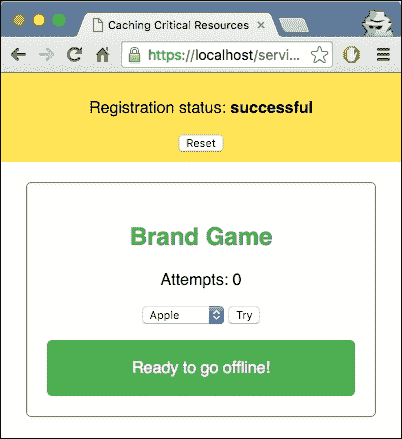

1.  您将看到 **Ready to go offline!** 消息。这意味着我们可以离线玩游戏。现在打开 DevTools (*Cmd* + *Alt* + *I* 或 *F12*)，转到 **Network** 选项卡，点击显示 **No throttling** 的下拉菜单，并选择 **Offline**：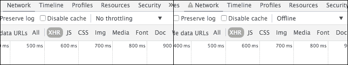

1.  现在刷新您的浏览器，您将能够继续玩游戏。

1.  您可以从下拉菜单中选择一个公司名称，然后点击 **Try** 按钮：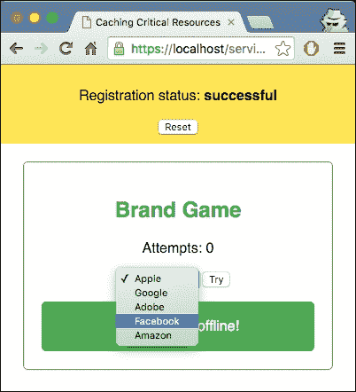

1.  每次选择不匹配结果时，都会显示一条消息说 **Boo! Try again..**，并且您将看到尝试次数：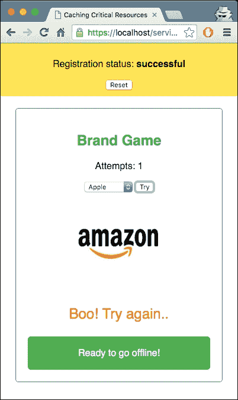

1.  一旦您的选择匹配，您将获得一个带有尝试次数的成功消息，并且您将看到尝试次数：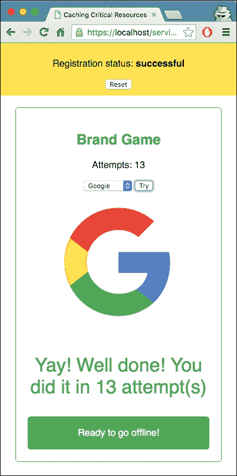

## 它是如何工作的...

我们的 `index.html` 文件包含下拉菜单、按钮和图像的结构。下拉菜单包含品牌的选项：

```js
<select id="choice">
    <option value="0">Apple</option>
    <option value="1">Google</option>
    <option value="2">Adobe</option>
    <option value="3">Facebook</option>
    <option value="4">Amazon</option>
</select>
```

选项的值由数字指定，这些数字稍后会与图像匹配，因此顺序很重要。如您所见，它们从 0 开始，以符合我们将要存储公司名称的数组的 0 基索引。

`style.css` 文件包含我们页面所需的全部样式。前两个声明是所有元素和 body 元素的通用样式：

```js
* {
  -webkit-box-sizing: border-box;
  -moz-box-sizing: border-box;
  box-sizing: border-box;
}

body {
  margin: 0 auto;
  text-align: center;
  font-family: sans-serif;
}
```

失败和成功消息的样式包含橙色和绿色：

```js
.success {
  color: #4CAF50;
  font-size: 2em;
}

.fail {
  color: #FF8401;
  font-size: 1.5em;
}
```

通知消息最初是隐藏的。这是通过分配一个带有 `display:none` 类来实现的：

```js
.hidden {
  display: none;
}
```

第三个 JavaScript 文件 `index.js` 执行服务工作者注册，然后监听 `controllerchange` 事件。它还处理重置按钮的事件。

我们的小游戏的引擎在 `game.js` 文件中。所以让我们看看这个文件内部发生了什么。

首先，我们在顶部声明了两个变量，`attempts` 和 `images`，并赋予初始值；`attempts` 包含尝试的初始值，0，而 `images` 是一个数组常量，包含品牌名称的顺序。品牌的顺序很重要，以便与 `index.html` 文件中的下拉菜单相匹配：

```js
var attempts = 0,
images = [
  'apple',
  'google',
  'adobe',
  'facebook',
  'amazon'
];
```

当用户点击 `try` 按钮，回调函数中的游戏逻辑被处理：

```js
document.getElementById('tryButton').addEventListener('click', function() {
  // callback  
…
});
```

在回调处理程序中的声明部分有很多事情发生。所以让我们看看每个初始化：

1.  首先，我们从 **Document Object Model** (**DOM**) 中获取标志：

    ```js
    var imageElement = document.getElementById('logo'),
    ```

1.  我们还从 DOM 中捕获了用户的 `choice` 和 `attempts` 元素，以及结果元素：

    ```js
    choice = document.querySelector('#choice').value,
    attemptsEl = document.querySelector('#attempts'),
    result = document.querySelector('#result'),
    ```

1.  然后我们从标志元素捕获数据属性，并使用 `getRandomIndex()` 生成一个随机数：

    ```js
    currentIndex = imageElement.getAttribute('data-image'),
    newIndex = getRandomIndex();
    ```

1.  我们为下一个索引生成一个随机数，只要它不是我们已为该索引拥有的一个：

    ```js
    do {
        newIndex = getRandomIndex();
      } while(newIndex === currentIndex);
    ```

1.  接下来，我们将品牌图像的源设置为随机索引创建的图像。然后我们将 `data-image` 属性设置为相同的索引：

    ```js
    imageElement.src = images[newIndex] + '-logo.png';
    imageElement.setAttribute('data-image', newIndex);
    ```

    例如，这可能在我们的网页上创建一个如下所示的 HTML 元素：

    ```js
    
    ```

1.  在添加新的之前，我们确保结果元素的类名被清除。然后我们增加尝试次数：

    ```js
    result.className = '';
    attempts++;
    ```

1.  接下来，我们找出新的索引是否等于用户所做的选择。请注意，我们故意使用双等号而不是三等号，因为选择是一个字符串，而`newIndex`是一个整数：

    ```js
    if(newIndex == choice) {
    ```

让我们继续到`service-worker.js`文件。在那里我们处理三个事件：install、fetch 和 activate。在 install 事件处理器中，我们缓存所有依赖项——我们需要离线运行的文件：

```js
return cache.addAll([
          'adobe-logo.png',
          'apple-logo.png',
          'google-logo.png',
          'style.css',
          'index.html',
          'index.js',
          'style.css'
        ]);
```

在 fetch 处理器内部，我们检查资源是否在缓存中。如果是，则由缓存提供响应：

```js
caches.match(event.req uest)
      .then(function(response) {
        if (response) {
          console.log('Fetching from the cache: ', event.request.url);
          return response;
        } 
```

否则，直接从服务器返回结果：

```js
else {
          console.log('Fetching from server: ', event.request.url);
     }
     return fetch(event.request);
```

最后，我们通过调用`claim()`在`navigator.serviceWorker`上强制触发一个`controllerchange`事件：

```js
self.addEventListener('activate', function(event) {
   console.log('Activating the service worker!');
   event.waitUntil(self.clients.claim());
});
```

## 参见

+   第一章的*详细注册 Service Worker*配方，*学习 Service Worker 基础知识*

+   第二章的*离线加载 CSS*配方，*处理资源文件*

# 首先显示缓存内容

如果你经常访问某个网站，那么你很可能正在从你的缓存而不是从服务器本身加载大部分资源，例如 CSS 和 JavaScript 文件。这为我们节省了服务器必要的带宽，以及网络请求。控制我们从缓存和服务器提供的内容是一个巨大的优势。服务器工作者通过程序性地控制内容为我们提供了这个强大的功能。在这个配方中，我们将查看使我们能够通过创建性能艺术事件查看器 Web 应用程序来实现这一点的各种方法。

## 准备工作

要开始使用 Service Worker，你需要在浏览器设置中开启 Service Worker 实验功能。如果你还没有这样做，请参考第一章的第一篇配方，*设置 Service Worker*：*设置 Service Worker*。Service Worker 仅在 HTTPS 上运行。要了解如何设置支持此功能的发展环境，请参考第一章的以下配方：*设置 GitHub pages for SSL*，*在 Windows 上设置 SSL*，和*在 Mac 上设置 SSL*。

## 如何操作...

按照以下说明设置你的文件结构。或者，你也可以从以下位置下载文件：

[`github.com/szaranger/szaranger.github.io/tree/master/service-workers/03/02/`](https://github.com/szaranger/szaranger.github.io/tree/master/service-workers/03/02/)

1.  首先，我们必须创建一个如下所示的`index.html`文件：

    ```js
    <!DOCTYPE html>
    <html lang="en">
    <head>
      <meta charset="UTF-8">
      <title>Cache First, then Network</title>
      <link rel="stylesheet" href="style.css">
    </head>
    <body>
      <section id="events">
        <h1><span class="nyc">NYC</span> Events TONIGHT</h1>
        <aside>
          
          <h2>Source</h2>
          <section>
            <h3>Network</h3>
            <input type="checkbox" name="network" id="network-disabled-checkbox">
            <label for="network">Disabled</label><br />
            <h3>Cache</h3>
            <input type="checkbox" name="cache" id="cache-disabled-checkbox">
            <label for="cache">Disabled</label><br />
          </section>
          <h2>Delay</h2>
          <section>
            <h3>Network</h3>
            <input type="text" name="network-delay" id="network-delay" value="400" /> ms
            <h3>Cache</h3>
            <input type="text" name="cache-delay" id="cache-delay" value="1000" /> ms
          </section>
        <input type="button" id="fetch-btn" value="FETCH" />
      </aside>
      <section class="data connection">
        <table>
          <tr>
            <td><strong>Network</strong></td>
            <td><output id='network-status'></output></td>
          </tr>
          <tr>
            <td><strong>Cache</strong></td>
            <td><output id='cache-status'></output><td>
          </tr>
        </table>
      </section>
      <section class="data detail">
        <output id="data"></output>
      </section>
      <script src="img/index.js"></script>
    </body>
    </html>
    ```

1.  在与`index.html`文件相同的文件夹中创建一个名为`style.css`的 CSS 文件。你可以在 GitHub 的以下位置找到源代码：

    [`github.com/szaranger/szaranger.github.io/blob/master/service-workers/03/02/style.css`](https://github.com/szaranger/szaranger.github.io/blob/master/service-workers/03/02/style.css)

1.  在与`index.html`文件相同的文件夹中创建一个名为`index.js`的 JavaScript 文件。你可以在 GitHub 的以下位置找到源代码：

    [`github.com/szaranger/szaranger.github.io/blob/master/service-workers/03/02/index.js`](https://github.com/szaranger/szaranger.github.io/blob/master/service-workers/03/02/index.js)

1.  打开浏览器并转到`index.html`：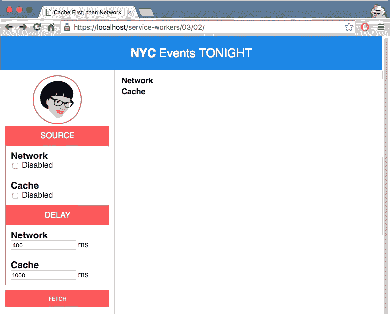

1.  首先，我们正在启用缓存从网络请求数据。点击**获取**按钮：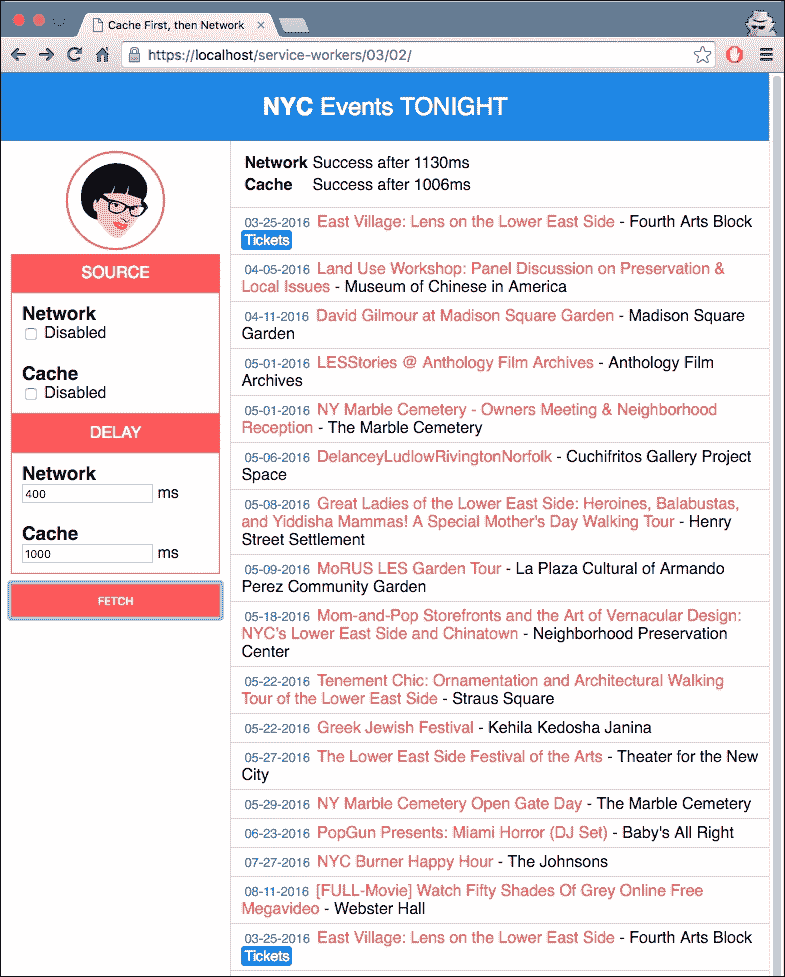

1.  如果你再次点击**获取**，数据首先从缓存中检索，然后从网络中检索，所以你会看到重复的数据（注意最后一行与第一行相同）：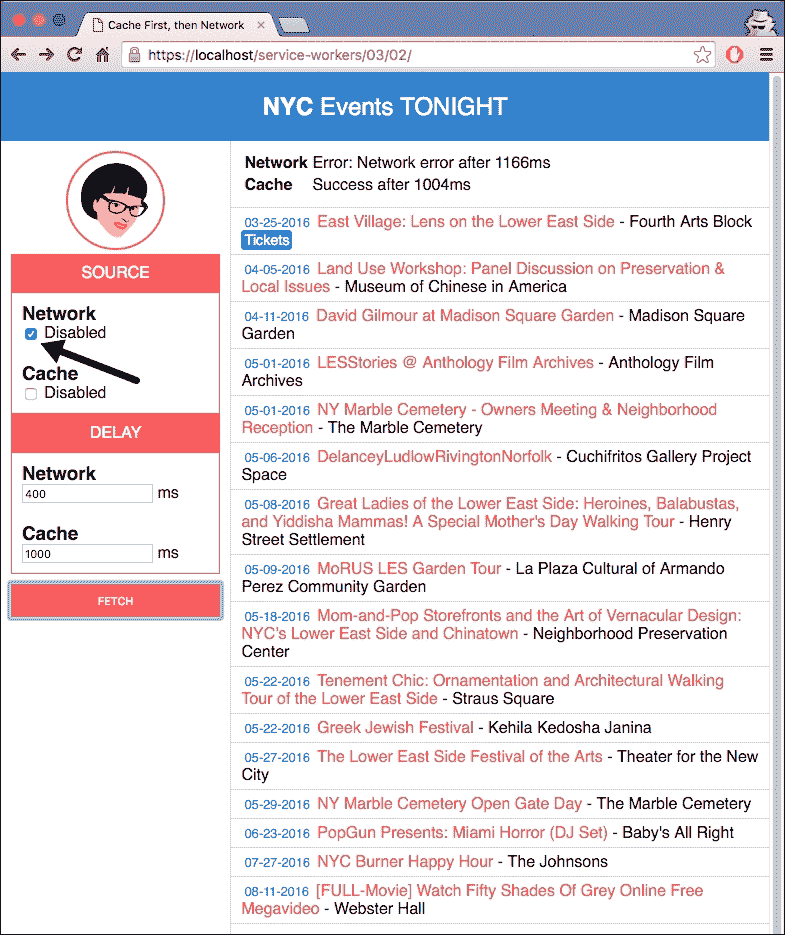

1.  现在，我们将选择**网络**标签下的**禁用**复选框，并再次点击**获取**按钮，以便只从缓存中获取数据：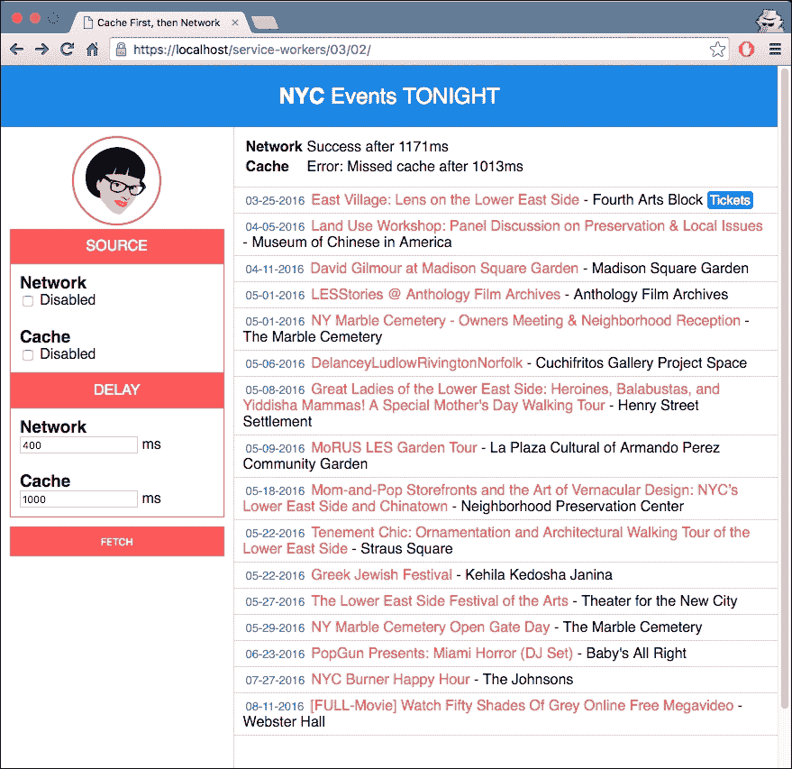

1.  选择**网络**标签下的**禁用**复选框，以及**缓存**标签，然后再次点击**获取**按钮：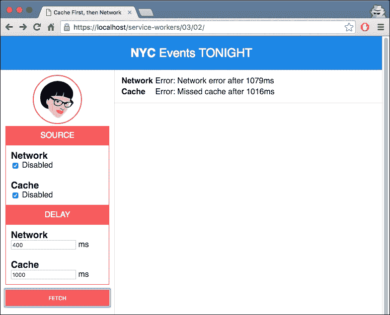

## 如何工作...

在`index.js`文件中，我们为缓存设置一个特定于页面的名称，因为缓存是基于源的，并且没有其他页面应该使用相同的缓存名称：

```js
var CACHE_NAME = 'cache-and-then-network';
```

如果你检查开发工具的**资源**标签页，你将在**缓存存储**标签页内找到缓存：

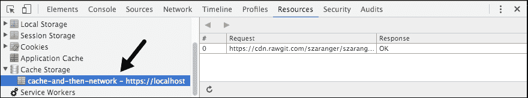

如果我们已经获取了网络数据，我们不希望缓存获取完成并覆盖我们从网络刚刚获取的数据。我们使用`networkDataReceived`标志让缓存获取回调知道网络获取是否已经完成：

```js
var networkDataReceived = false;
```

我们在两个变量中存储网络和缓存的经过时间：

```js
var networkFetchStartTime;
var cacheFetchStartTime;
```

源 URL，例如，是通过 RawGit 指向 GitHub 上的文件位置：

```js
var SOURCE_URL = 'https://cdn.rawgit.com/szaranger/szaranger.github.io/master/service-workers/03/02/events';
```

如果你想要设置自己的源 URL，你可以通过在 GitHub 上创建一个 gist 或仓库，并创建一个包含你的数据的 JSON 格式的文件（不需要`.json`扩展名）轻松做到这一点。一旦你完成了这个，复制文件的 URL，转到[`rawgit.com`](https://rawgit.com)，并将链接粘贴在那里以获得另一个带有内容类型头的链接，如下面的截图所示：

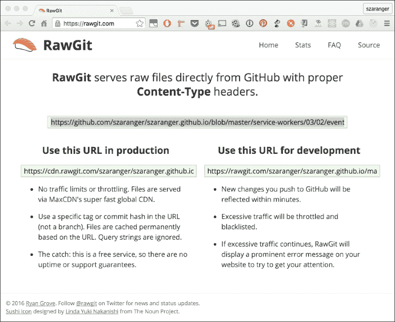

在我们按下**获取**按钮和接收到数据之间，我们必须确保用户不会更改搜索条件，或者再次按下**获取**按钮。为了处理这种情况，我们禁用控件：

```js
function clear() {
  outlet.textContent = '';
  cacheStatus.textContent = '';
  networkStatus.textContent = '';
  networkDataReceived = false;
}

function disableEdit(enable) {
  fetchButton.disabled = enable;
  cacheDelayText.disabled = enable;
  cacheDisabledCheckbox.disabled = enable;
  networkDelayText.disabled = enable;
  networkDisabledCheckbox.disabled = enable;

  if(!enable) {
    clear();
  }
}
```

返回的数据将以行形式渲染到屏幕上：

```js
function displayEvents(events) {

  events.forEach(function(event) {
    var tickets = event.ticket ?
      '<a href="' + event.ticket + '" class="tickets">Tickets</a>' : '';

    outlet.innerHTML = outlet.innerHTML +
      '<article>' +
      '<span class="date">' + formatDate(event.date) + '</span>' +
      ' <span class="title">' + event.title + '</span>' +
      ' <span class="venue"> - ' + event.venue + '</span> ' +
      tickets +
      '</article>';
  });

}
```

`events`数组中的每个项目都将作为行打印到屏幕上：

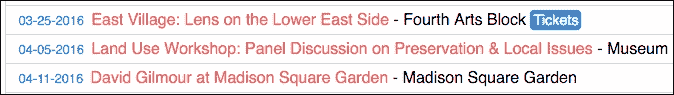

函数`handleFetchComplete`是缓存和网络的双重回调。

如果禁用复选框被勾选，我们通过抛出错误来模拟网络错误：

```js
var shouldNetworkError = networkDisabledCheckbox.checked,
    cloned;

  if (shouldNetworkError) {
    throw new Error('Network error');
  }
```

由于请求体只能读取一次，我们必须克隆响应：

```js
cloned = response.clone();
```

我们使用`cache.put`将克隆的响应放入缓存，作为键/值对。这有助于后续的缓存获取找到这些更新数据：

```js
caches.open(CACHE_NAME).then(function(cache) {
   cache.put(SOURCE_URL, cloned); // cache.put(URL, response)
});
```

现在我们以 JSON 格式读取响应。同时，我们确保任何正在进行的缓存请求不会被我们刚刚接收到的数据覆盖，使用`networkDataReceived`标志：

```js
response.json().then(function(data) {
    displayEvents(data);
    networkDataReceived = true;
  });
```

为了防止覆盖我们从网络接收到的数据，我们确保只有在网络请求尚未返回的情况下才更新页面：

```js
result.json().then(function(data) {
    if (!networkDataReceived) {
      displayEvents(data);
    }
  });
```

当用户按下**获取**按钮时，他们会几乎同时向网络和缓存请求数据。这在现实世界的应用程序中是在页面加载时发生的，而不是由用户操作引起的：

```js
fetchButton.addEventListener('click', function handleClick() {
...
}
```

我们首先在启动网络获取请求时禁用任何用户输入：

```js
disableEdit(true);

networkStatus.textContent = 'Fetching events...';
networkFetchStartTime = Date.now();
```

我们使用带有缓存破坏 URL 的`fetch` API 请求数据，以及 Firefox 的 no-cache 选项，以支持尚未实现缓存选项的 Firefox：

```js
networkFetch = fetch(SOURCE_URL + '?cacheBuster=' + now, {
   mode: 'cors',
   cache: 'no-cache',
   headers: headers
})
```

为了模拟网络延迟，我们在调用网络获取回调之前等待。在回调出错的情况下，我们必须确保拒绝我们从原始获取中收到的承诺：

```js
return new Promise(function(resolve, reject) {
      setTimeout(function() {
        try {
          handleFetchComplete(response);
          resolve();
        } catch (err) {
          reject(err);
        }
      }, networkDelay);
    });
```

为了模拟缓存延迟，我们在调用缓存获取回调之前等待。如果回调出错，我们确保拒绝我们从原始调用中获得的承诺以匹配：

```js
return new Promise(function(resolve, reject) {
        setTimeout(function() {
          try {
            handleCacheFetchComplete(response);
            resolve();
          } catch (err) {
            reject(err);
          }
        }, cacheDelay);
      });
```

`formatDate`函数是我们将接收到的响应中的日期格式转换为屏幕上更易读格式的辅助函数：

```js
function formatDate(date) {
  var d = new Date(date),
      month = (d.getMonth() + 1).toString(),
      day = d.getDate().toString(),
      year = d.getFullYear();

  if (month.length < 2) month = '0' + month;
  if (day.length < 2) day = '0' + day;

  return [month, day, year].join('-');
}
```

如果你使用不同的日期格式，你可以根据你喜欢的格式在返回语句中调整数组的顺序：

# 实现缓存和网络竞争

如果你的客户端正在使用较旧且较慢的硬件，包括较旧的硬盘驱动器，那么从硬盘驱动器访问资源可能比从较快的互联网连接访问相同的资源要慢。但仅仅因为一些用户正在使用较慢的硬件，这并不能证明总是通过网络访问已经存在于硬件中的资源是合理的，因为一些用户可能拥有更快的硬件，这可能会浪费数据。为了解决这个问题，我们可以实现一个执行竞争条件的解决方案，并根据哪个先解决来获取数据：

## 准备就绪

要开始使用服务工作者，你需要在浏览器设置中打开服务工作者实验功能。如果你还没有这样做，请参阅第一章的第一个配方，*学习服务工作者基础*：*设置服务工作者*。服务工作者仅在 HTTPS 上运行。要了解如何设置支持此功能的开发生态，请参阅第一章的以下配方，*学习服务工作者基础*：*设置 GitHub 页面以支持 SSL*，*在 Windows 上设置 SSL*，和*在 Mac 上设置 SSL*。

## 如何操作...

按照以下说明设置你的文件结构。或者，你也可以从以下位置下载文件：

[`github.com/szaranger/szaranger.github.io/tree/master/service-workers/03/03/`](https://github.com/szaranger/szaranger.github.io/tree/master/service-workers/03/03/)

1.  首先，我们必须创建一个如下所示的`index.html`文件：

    ```js
    <!DOCTYPE html>
    <html lang="en">
    <head>
      <meta charset="UTF-8">
      <title>Cache &amp; Network Race</title>
      <link rel="stylesheet" href="style.css">
    </head>
    <body>
      <section id="registration-status">
        <p>Registration status: <strong id="status"></strong></p>
        <input type="button" id="resetButton" value="Reset" />
      </section>
      <script src="img/index.js"></script>
    </body>
    </html>
    ```

1.  在与`index.html`文件相同的文件夹中创建一个名为`style.css`的 JavaScript 文件，并包含以下代码：

    ```js
    * {
      -webkit-box-sizing: border-box;
      -moz-box-sizing: border-box;
      box-sizing: border-box;
    }

    body {
      margin: 0 auto;
      text-align: center;
      font-family: sans-serif;
    }

    main {
      max-width: 350px;
      border: 1px solid #4CAF50;
      padding: 20px;
      border-radius: 5px;
      width: 350px;
      margin: 20px auto;
    }

    h1 {
      color: #4CAF50;
    }

    img {
      padding: 20px 0;
      max-width: 200px;
    }

    .hidden {
      display: none;
    }

    #registration-status {
      background-color: #FFE454;
      padding: 10px;
    }
    ```

1.  在与`index.html`文件相同的文件夹中创建一个名为`index.js`的 JavaScript 文件，并包含以下代码：

    ```js
    'use strict';

    var scope = {
      scope: './'
    };

    if ('serviceWorker' in navigator) {
      navigator.serviceWorker.register(
        'service-worker.js',
        scope
      ).then( function(serviceWorker) {
        printStatus('successful');
      }).catch(function(error) {
        printStatus(error);
      });
    } else {
      printStatus('unavailable');
    }

    function printStatus(status) {
      document.querySelector('#status').innerHTML = status;
    }

    document.querySelector('#resetButton').addEventListener('click',
      function() {
        navigator.serviceWorker.getRegistration().then(function(registration) {
          registration.unregister();
          window.location.reload();
        });
      }
    );
    ```

1.  在与`index.html`文件相同的文件夹中创建一个名为`service-worker.js`的 JavaScript 文件，并包含以下代码：

    ```js
    'use strict';

    var cacheName = 'cache-network-race';

    self.addEventListener('install', function(event) {
      event.waitUntil(
        caches.open(cacheName)
          .then(function(cache) {
            return cache.addAll([
              'index.html',
              'style.css',
              'index.js'
            ]);
          })
          .then(function() {
            return self.skipWaiting();
          })
      );
    });

    self.addEventListener('fetch', function(event) {
      event.respondWith(
        resolveAny([
          caches.match(event.request),
          fetch(event.request)
        ])
      );
    });

    function resolveAny(promises) {
      return new Promise(function(resolve, reject) {
        promises = promises.map(function(promise) {
          return Promise.resolve(promise);
        });

        promises.forEach(function(promise) {
          promise.then(resolve);
        });

        promises.reduce(function(a, b) {
          return a.catch(function() {
            return b;
          });
        }).catch(function() {
          return reject(Error("All have failed"));
        });
      });
    }
    ```

1.  打开浏览器并访问`index.html`文件：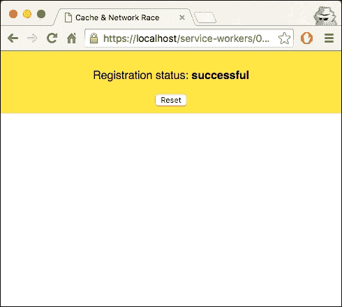

1.  现在打开开发者工具(*Cmd* + *Alt* + *I* 或 *F12*)，转到**网络**标签，点击下拉菜单，并选择**GPRS(50 kb/s**)以模拟较慢的网络速度：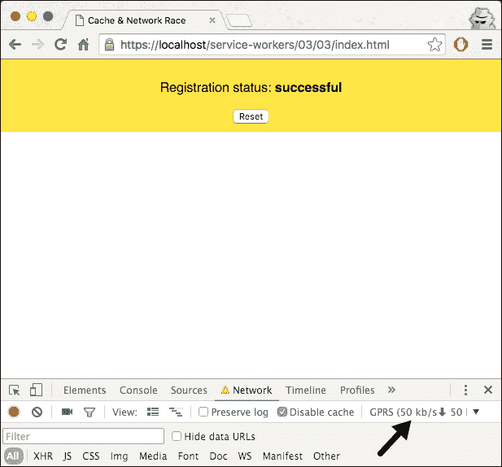

1.  刷新页面，你会看到相同的页面。但如果查看网络请求，你会发现服务工作者已经启动：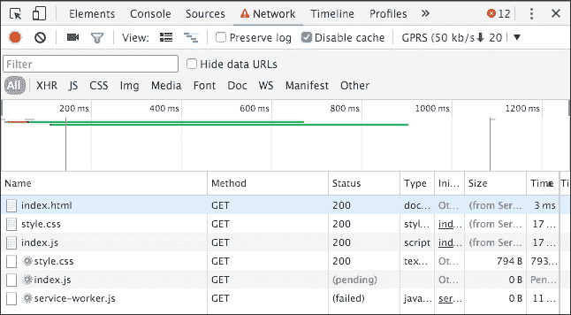

## 它是如何工作的...

在`service-worker.js`文件中，我们正在缓存必要的资源，以便我们可以在离线状态下仍然使用应用程序：

```js
self.addEventListener('install', function(event) {
  event.waitUntil(
    caches.open(cacheName)
      .then(function(cache) {
        return cache.addAll([
          'index.html',
          'style.css',
          'index.js'
        ]);
      })
      .then(function() {
        return self.skipWaiting();
      })
  );
});
```

然后我们创建一个名为`resolveAny`的函数。这个函数的目的是以适当的方式处理竞争条件。Promise 有一个名为`race()`的函数。这个函数对我们没有帮助，因为它在 Promise 在完成之前被拒绝时也会拒绝。

`resolveAny`函数返回一个新的 Promise。在 Promise 内部，我们确保我们传入的数组是一个 Promise 数组：

```js
promises = promises.map(function(promise) {
      return Promise.resolve(promise);
    });
```

接下来，我们确保在数组中的另一个 Promise 解决后立即解决当前的 Promise：

```js
promises.forEach(function(promise) {
      promise.then(resolve);
    });
```

我们还确保如果所有 Promise 都被拒绝，则拒绝：

```js
promises.reduce(function(a, b) {
      return a.catch(function() {
        return b;
      });
    }
```

`fetch`调用的事件监听器的回调函数调用`resolveAny`函数，并传入两个函数，`caches.match(event.request)`和`fetch(event.request)`。这两个函数发送相同的请求，导致竞争条件。

# 使用`window.caches`

在这个菜谱中，我们探讨如何在服务工作线程安装期间预取特定资源，以及如何使用 `window.cache` 来对缓存存储 API 发起请求，不是在服务工作线程的作用域内，而是在 HTML 文档的上下文中。

## 准备工作

要开始使用服务工作线程，你需要在浏览器设置中开启服务工作线程实验功能。如果你还没有这样做，请参考第一章的第一道菜谱 第一章：学习服务工作线程基础，*学习服务工作线程基础*：*设置服务工作线程*。服务工作线程仅在 HTTPS 上运行。要了解如何设置开发环境以支持此功能，请参考第一章 第一章：学习服务工作线程基础 的以下菜谱：*设置 GitHub 页面以支持 SSL*，*在 Windows 上设置 SSL*，以及 *在 Mac 上设置 SSL*。

## 如何操作...

按照以下说明设置你的文件结构。或者，你也可以从以下位置下载文件：

[`github.com/szaranger/szaranger.github.io/tree/master/service-workers/03/04/`](https://github.com/szaranger/szaranger.github.io/tree/master/service-workers/03/04/)

1.  首先，我们必须创建一个 `index.html` 文件，如下所示：

    ```js
    <!DOCTYPE html>
    <html lang="en">
    <head>
      <meta charset="UTF-8">
      <title>Using window.caches</title>
      <link rel="stylesheet" href="style.css">
    </head>
    <body>
      <section id="registration-status">
        <p>Registration status: <strong id="status"></strong></p>
        <input type="button" id="resetButton" value="Reset" />
      </section>
      <section id="article-area">
        <h1>Bookmark App</h1>
        <form action="#" method="post">
          <div>
            <label for="new-bookmark">+Add Bookmark</label>
            <input type="text" name="new-bookmark" id="new-bookmark" placeholder="new bookmark">
            <input type="submit" value="Add">
          </div>
        </form>
        <ul id="articles"></ul>
        <div id="bookmark-status"></div>
      </section>
      <script src="img/index.js"></script>
      <script src="img/app.js"></script>
    </body>
    </html>
    ```

1.  在与 `index.html` 文件相同的文件夹中创建一个名为 `style.css` 的 CSS 文件。你可以在 GitHub 上找到源代码，位置如下：

    [`github.com/szaranger/szaranger.github.io/blob/master/service-workers/03/04/style.css`](https://github.com/szaranger/szaranger.github.io/blob/master/service-workers/03/04/style.css)

1.  在与 `index.html` 文件相同的文件夹中创建一个名为 `index.js` 的 JavaScript 文件，内容如下：

    ```js
    'use strict';

    var scope = {
      scope: './'
    };

    if ('serviceWorker' in navigator) {
      navigator.serviceWorker.register(
        'service-worker.js',
        scope
      ).then( function(serviceWorker) {
        printStatus('successful');
      }).catch(function(error) {
        printStatus(error);
      });
    } else {
      printStatus('unavailable');
    }

    function printStatus(status) {
      document.querySelector('#status').innerHTML = status;
    }

    document.querySelector('#resetButton').addEventListener('click',
      function() {
        navigator.serviceWorker.getRegistration().then(function(registration) {
          registration.unregister();
          window.location.reload();
        });
      }
    );
    ```

1.  在与 `index.html` 文件相同的文件夹中创建一个名为 `app.js` 的 JavaScript 文件。该文件的源代码可以在 GitHub 上找到，位置如下：

    [`github.com/szaranger/szaranger.github.io/blob/master/service-workers/03/04/app.js`](https://github.com/szaranger/szaranger.github.io/blob/master/service-workers/03/04/app.js)

1.  创建一个名为 `prefetched.html` 的 HTML 文件：

    ```js
    <!DOCTYPE html>
    <html lang="en">
    <head>
      <meta charset="UTF-8">
      <title>Prefetched</title>
    </head>
    <body>
      <p>Prefetched Page</p>
    </body>
    </html>
    ```

1.  在与 `index.html` 文件相同的文件夹中创建一个名为 `service-worker.js` 的 JavaScript 文件，内容如下：

    ```js
    'use strict';

    var cacheVersion = 1;
    var currentCaches = {
      prefetch: 'window-cache-v' + cacheVersion
    };

    self.addEventListener('install', function(event) {
      var prefetchUrls = [
        './prefetched.html',
      ];

      console.log('EVENT: install. Prefetching resource:',
        prefetchUrls);

      event.waitUntil(
        caches.open(currentCaches.prefetch).then(function(cache) {
          return cache.addAll(prefetchUrls.map(function(prefetchUrl) {
            return new Request(prefetchUrl, {mode: 'no-cors'});
          })).then(function() {
            console.log('SUCCESS: All resources fetched and cached.');
          });
        }).catch(function(error) {
          console.error('FAIL: Prefetch:', error);
        })
      );
    });

    self.addEventListener('activate', function(event) {
      var expectedCacheNames = Object.keys(currentCaches).map(function(key) {
        return currentCaches[key];
      });

      event.waitUntil(
        caches.keys().then(function(cacheNames) {
          return Promise.all(
            cacheNames.map(function(cacheName) {
              if (expectedCacheNames.indexOf(cacheName) === -1) {
                console.log('DELETE: Out of date cache:', cacheName);
                return caches.delete(cacheName);
              }
            })
          );
        })
      );
    });
    ```

1.  打开浏览器并访问 `index.html` 文件。你会看到一个预取的书签：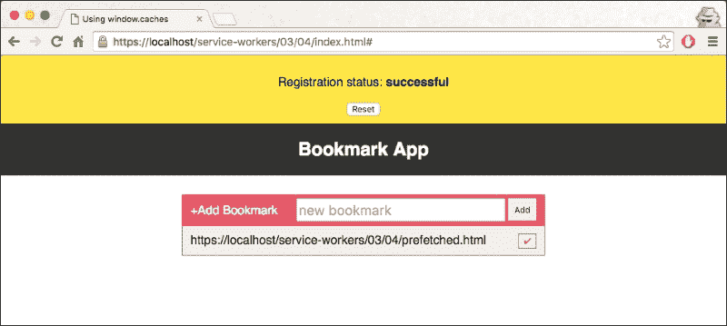

1.  通过输入 URL 并点击右侧的 **添加** 按钮来添加书签：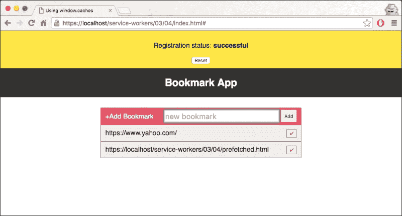

1.  你可以通过点击书签右侧的勾选图标来删除书签。

1.  添加另一个书签并刷新页面。你会看到书签仍然完好无损。

## 如何工作...

在我们的 `service-worker.js` 文件中，我们维护一个缓存版本，以便通过增加 `cacheVersion` 值来使用新的缓存。当更新的服务工作线程启动时，旧缓存将作为激活事件处理程序的一部分被删除：

```js
var cacheVersion = 1;
var currentCaches = {
  prefetch: 'window-cache-v' + cacheVersion
};
```

当你首次加载页面时，以下资源将显示为书签 URL，并且该事件将在你的开发者控制台中记录：

```js
var prefetchUrls = [
    './prefetched.html',
  ];
console.log('EVENT: install. Prefetching resource:',
    prefetchUrls);
```

如果有可能会从不支持 CORS 的服务器获取资源，那么使用`{mode: 'no-cors'}`是非常重要的：

```js
return new Request(prefetchUrl, {mode: 'no-cors'});
```

`catch()`方法处理`caches.open()`和`cache.addAll()`步骤中的任何异常：

```js
}).catch(function(error) {
    console.error('FAIL: Prefetch:', error);
})
```

在激活事件的处理器中，我们删除了所有不在`currentCaches`中命名的缓存。虽然在这个例子中只有一个缓存，但同样的逻辑也处理了存在多个版本化缓存的情况：

```js
var expectedCacheNames = Object.keys(currentCaches).map(function(key) {
    return currentCaches[key];
  });
```

如果这个缓存名称不在“预期”的缓存名称数组中，那么就删除它：

```js
if (expectedCacheNames.indexOf(cacheName) === -1) {
console.log('DELETE: Out of date cache:', cacheName);
      return caches.delete(cacheName);
}
```

让我们继续到`app.js`文件，大部分工作都在这里进行。`initializeBookmarks`函数将事件监听器附加到表单的提交按钮上。在提交的回调中，提取文本字段的值，然后根据它生成一个列表。然后，这个列表被附加到由`index.html`文件中文章的 ID 表示的无序列表。然后我们调用`showBookmarks()`函数：

```js
function initializeBookmarks() {
  form.addEventListener('submit', function( event ) {
    var text = newBookmark.value;
    if (text !== '') {
      articles.innerHTML += '<li>' + text + '</li>';
      addUrlToCache(text);
      newBookmark.value = '';
      newBookmark.focus();
    }
    event.preventDefault();
  }, false);
  showBookmarks();
}
```

我们还向无序列表的文章列表添加了一个点击事件监听器。在回调内部，如果它是列表（`li`）元素，我们就移除该项。这就是我们从列表中移除文章的方式：

```js
articles.addEventListener( 'click', function( event ) {
  var target = event.target;
  if ( target.tagName === 'LI' ) {
    target.parentNode.removeChild( target );
  };

  event.preventDefault();
}, false);
```

在`showBookmarks()`函数中，我们清除任何之前的 URL，以防这个函数在向缓存添加新 URL 之后被调用：

```js
while (articles.firstChild) {
   articles.removeChild(articles.firstChild);
}
```

然后，我们遍历所有可用的缓存，并对每个缓存遍历所有 URL，将每个缓存添加到书签列表中：

```js
window.caches.keys().then(function(cacheNames) {
    cacheNames.forEach(function(cacheName) {
      window.caches.open(cacheName).then(function(cache) {
        cache.keys().then(function(requests) {
          requests.forEach(function(request) {
            addRequestToBookmarks(cacheName, request);
          });
        });
      });
    });
  });
```

现在，让我们看看实际使用`window.fetch()`从网络获取响应并将其存储在命名缓存中的函数。这里重要的是，控制此页面的服务工作者没有 fetch 事件处理器，因此这个请求是在没有服务工作者参与的情况下发出的：

```js
function addUrlToCache(url) {
  window.fetch(url, { mode: 'no-cors' }).then(function(response) {
    if (response.status < 400) {
      caches.open(cacheName).then(function(cache) {
        cache.put(url, response).then(showBookmarks);
      });
    }
  }).catch(function(error) {
    document.querySelector('#status').textContent = error;
  });
}
```

`addRequestToBookmarks()`函数是一个辅助函数，用于将缓存的请求添加到缓存的列表中。在这个函数中，我们创建一个 span、一个按钮和一个列表项，并将它们附加到无序列表的文章列表中：

```js
function addRequestToBookmarks(cacheName, request) {
  var url = request.url,
    span = document.createElement('span'),
    button = document.createElement('button'),
    li = document.createElement('li');

  span.textContent = url;
  button.textContent = '✔';
  button.dataset.url = url;
  button.dataset.cacheName = cacheName;
  button.classList.add('done');
  button.addEventListener('click', function() {
    removeCachedBookmark(this.dataset.cacheName, this.dataset.url).then(function() {
      var parent = this.parentNode,
        grandParent = parent.parentNode;
        grandParent.removeChild(parent);
    }.bind(this));
  });
  li.appendChild(span);
  li.appendChild(button);
  articles.appendChild(li);
}
```

接下来，`removeCachedBookmark()`函数通过给定的缓存名称和 URL 删除缓存条目：

```js
function removeCachedBookmark(cacheName, url) {
  return window.caches.open(cacheName).then(function(cache) {
    return cache.delete(url);
  });
}
```

`waitUntilInstalled()`辅助函数返回一个承诺，一旦服务工作者注册通过`installing`状态，该承诺就会被解决：

```js
function waitUntilInstalled(registration) {
  return new Promise(function(resolve, reject) {
    if (registration.installing) {
```

如果当前注册的服务工作者是`installing`状态，那么我们确保等待安装步骤完成，其中资源被预获取，然后显示书签列表：

```js
registration.installing.addEventListener('statechange', function(event) {
   if (event.target.state === 'installed') {
   	resolve();
   } else if(event.target.state === 'redundant') {
   	reject();
   }
});
```

如果不是这种情况，并且这不是`installing`服务工作者，那么我们可以安全地假设安装是在访问当前页面的前一次访问期间完成的，并且资源已经被预获取。因此，我们现在可以立即显示书签列表：

```js
  } else {
     resolve();
  }
```

# 实现缓存失效并重新验证

有时，对于网页中某些图像等资源来说，拥有最新版本的缓存并不是绝对必要的。如果可用，我们可以使用缓存的版本，并在下次获取更新。

## 准备工作

要开始使用服务工作者，你需要在浏览器设置中开启服务工作者实验功能。如果你还没有这样做，请参考第一章的第一个食谱，*学习服务工作者基础*：*设置服务工作者*。服务工作者仅在 HTTPS 上运行。要了解如何设置开发环境以支持此功能，请参考第一章的以下食谱，*学习服务工作者基础*：*为 SSL 设置 GitHub 页面*，*为 Windows 设置 SSL*，以及*为 Mac 设置 SSL*。

## 如何操作...

按照以下说明设置你的文件结构。或者，你也可以从以下位置下载文件：

[`github.com/szaranger/szaranger.github.io/tree/master/service-workers/03/05/`](https://github.com/szaranger/szaranger.github.io/tree/master/service-workers/03/05/)

1.  首先，我们必须创建一个`index.html`文件，如下所示：

    ```js
    <!DOCTYPE html>
    <html lang="en">
    <head>
      <meta charset="UTF-8">
      <title>Cache First, then Network</title>
      <link rel="stylesheet" href="style.css">
    </head>
    <body>
      <section id="registration-status">
        <p>Registration status: <strong id="status"></strong></p>
        <input type="button" id="resetButton" value="Reset" />
      </section>
      <section>
        
      </section>
      <script src="img/index.js"></script>
    </body>
    </html>
    ```

1.  在与`index.html`文件相同的文件夹中创建一个名为`index.js`的 JavaScript 文件，并包含以下代码：

    ```js
    'use strict';

    var scope = {
      scope: './'
    };

    if ('serviceWorker' in navigator) {
      navigator.serviceWorker.register(
        'service-worker.js',
        scope
      ).then( function(serviceWorker) {
        printStatus('successful');
      }).catch(function(error) {
        printStatus(error);
      });
    } else {
      printStatus('unavailable');
    }

    function printStatus(status) {
      document.querySelector('#status').innerHTML = status;
    }

    document.querySelector('#resetButton').addEventListener('click',
      function() {
        navigator.serviceWorker.getRegistration().then(function(registration) {
          registration.unregister();
          window.location.reload();
        });
      }
    );
    ```

1.  在与`index.html`文件相同的文件夹中创建一个名为`service-worker.js`的 JavaScript 文件，并包含以下代码：

    ```js
    'use strict';

    var cacheName= 'stale-while-revalidate';

    self.addEventListener('install', function(event) {
      event.waitUntil(
        caches.open(cacheName)
          .then(function(cache) {
            return cache.addAll([
              'adobe-logo.png',
              'style.css',
              'index.html',
              'index.js',
              'style.css'
            ]);
          })
          .then(function() {
            return self.skipWaiting();
          })
      );
    });

    self.addEventListener('fetch', function(event) {
      event.respondWith(
        caches.open('stale-while-revalidate')
          .then(function(cache) {
            return cache.match(event.request)
              .then(function(response) {
                var promise;

                if (response) {
                  console.log('Fetching from the cache: ', event.request.url);
                } else {
                  console.log('Fetching from server: ', event.request.url);
                }

                promise = fetch(event.request)
                  .then(function(networkResponse) {
                    var cloned = networkResponse.clone();
                    cache.put(event.request, cloned);
                    console.log('Fetching from the cache: ', event.request.url);
                    return networkResponse;
                  }
                )
                console.log('Fetching from server: ', event.request.url);
                return response || promise;
              }
            )
          }
        )
      );
    });

    self.addEventListener('activate', function(event) {
       console.log('Activating the service worker!');
       event.waitUntil(self.clients.claim());
    });
    ```

1.  从源代码下载`adobe-log.png`图像，或者使用与`index.html`文件相同的文件夹中的自己的图像。

1.  打开浏览器并访问`index.html`。你会看到**注册状态：成功**的消息和标志：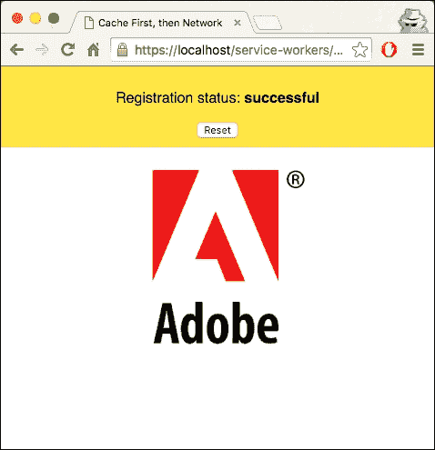

1.  现在，如果你刷新页面并检查开发者工具的**控制台**标签页，你将能够看到`adobe-logo.png`文件已经被从缓存中获取。

## 它是如何工作的...

在我们的`service-worker.js`文件中，我们确保如果可用，则使用缓存版本而不是网络请求，但下次获取更新：

```js
self.addEventListener('fetch', function(event) {
  event.respondWith(
    caches.open('stale-while-revalidate')
      .then(function(cache) {
        return cache.match(event.request)
          .then(function(response) {
            var promise;

            if (response) {
              console.log('Fetching from the cache: ', event.request.url);
            } else {
              console.log('Fetching from server: ', event.request.url);
            }
            promise = fetch(event.request)
              .then(function(networkResponse) {
                var cloned = networkResponse.clone();
                cache.put(event.request, cloned);
                console.log('Fetching from the cache: ', event.request.url);
                return networkResponse;
              }
            )
            console.log('Fetching from server: ', event.request.url);
            return response || promise;
          }
        )
      }
    )
  );
});
```
