# 第四章. 使用高级技术访问离线内容

在本章中，我们将涵盖以下主题：

+   模板化

+   实现读取缓存

+   允许离线 Google Analytics

+   允许离线用户交互

+   实现选择性缓存

# 简介

在本章中，我们将继续改进使用服务工作者处理离线内容的经验。

我们将探讨高级技术，包括如何使用模板引擎进行模板化，深入 Google Analytics，如何解决离线用户交互问题，以及实现选择性缓存。

让我们从本章开始，通过实验服务工作者的模板化来开始。

# 模板化

传统的服务器端页面渲染已成为现代**单页应用**（**SPA**）的过去式。尽管服务器端渲染更快，但使用服务工作者实现状态数据将变得困难。相反，我们可以请求 JSON 数据和模板，允许服务工作者接收数据和模板，并渲染响应页面。JavaScript 模板化是一种客户端数据绑定方法，使用 JavaScript 语言实现。

为了了解更多关于模板化的信息，请参考以下链接：

[`en.wikipedia.org/wiki/JavaScript_templating`](https://en.wikipedia.org/wiki/JavaScript_templating)

## 准备工作

要开始使用服务工作者，您需要在浏览器设置中开启服务工作者实验功能。如果您还没有这样做，请参考第一章的第一个食谱，*学习服务工作者基础*：*设置服务工作者*。服务工作者仅在 HTTPS 上运行。要了解如何设置支持此功能的发展环境，请参考以下食谱：*设置 GitHub 页面以支持 SSL*，*在 Windows 上设置 SSL*，和*在 Mac 上设置 SSL*。

## 如何操作...

按照以下说明设置您的文件结构。或者，您可以从以下位置下载文件：

[`github.com/szaranger/szaranger.github.io/tree/master/service-workers/04/01/`](https://github.com/szaranger/szaranger.github.io/tree/master/service-workers/04/01/)

1.  首先，我们必须创建一个如下所示的`index.html`文件：

    ```js
    <!DOCTYPE html>
    <html lang="en">
    <head>
      <meta charset="UTF-8">
      <title>Templating</title>
      <style>
      * {
        -webkit-box-sizing: border-box;
        -moz-box-sizing: border-box;
        box-sizing: border-box;
      }

      body {
        margin: 0 auto;
        text-align: center;
        font-family: sans-serif;
      }

      main {
        max-width: 350px;
        border: 1px solid #4CAF50;
        padding: 20px;
        border-radius: 5px;
        width: 350px;
        margin: 20px auto;
      }

      h1 {
        color: #4CAF50;
      }

      img {
        padding: 20px 0;
        max-width: 200px;
      }

      .hidden {
        display: none;
      }

      .frameworks {
        margin: 20px auto;
      }

      table, th, td {
        border: 1px solid black;
        border-collapse: collapse;
      }

      .frameworks th {
        background-color: #000;
        color: #FFF;
        padding: 3px 10px;
      }

      .frameworks tr {
        text-align: left;
      }

      .frameworks td {
        background-color: #FFF;
        padding: 3px 10px;
      }

      #registration-status {
        background-color: #FFE454;
        padding: 10px;
      }
      </style>
    </head>
    <body>
      <section id="registration-status">
        <p>Registration status: <strong id="status"></strong></p>
        <input type="button" id="resetButton" value="Reset" />
      </section>
      <section>
          <h2>JS Frameworks & Creators</h2>
          <table class="frameworks">
            <tr>
              <th>Framework</th>
              <th>Name</th>
              <th>Twitter</th>
            </tr>
            {{#users}}
              <tr>
                  <td>{{framework}}</td>
                  <td>{{person.firstName}} 
    			  {{person.lastName}}</td>
                  <td><a href="https://twitter.com/{{twitter}}">@{{twitter}}</a></td>
              </tr>
            {{/users}}
          </table>
      </section>

      <script>
      'use strict';

      var scope = {
        scope: './'
      };

      if ('serviceWorker' in navigator) {
        navigator.serviceWorker.register(
          'service-worker.js',
          scope
        ).then( function(serviceWorker) {
          printStatus('successful');
        }).catch(function(error) {
          printStatus(error);
        });
      } else {
        printStatus('unavailable');
      }

      function printStatus(status) {
        document.querySelector('#status').innerHTML = status;
      }

      document.querySelector('#resetButton').addEventListener('click',
        function() {
          navigator.serviceWorker.getRegistration().then(function(registration) {
            registration.unregister();
            window.location.reload();
          });
        }
      );
      </script>
    </body>
    </html>
    ```

1.  在与`index.html`文件相同的文件夹中创建一个名为`service-worker.js`的 JavaScript 文件，包含以下代码：

    ```js
    'use strict';

    importScripts('handlebars.js');

    var cacheName= 'template-cache';

    self.addEventListener('install', function(event) {
      event.waitUntil(
        caches.open(cacheName)
          .then(function(cache) {
            return cache.addAll([
              'index.html',
              'service-worker.js',
              'people.json'
            ]);
          })
          .then(function() {
            return self.skipWaiting();
          })
      );
    });

    self.addEventListener('fetch', function(event) {
      var requestURL = new URL(event.request.url);

      event.respondWith(
        Promise.all([
          caches.match('index.html').then(function(res) {
            if(res) {
              return res.text();
            }
          }),
          caches.match('people.json').then(function(res) {
            return res.json();
          })
        ]).then(function(resps) {
          var template = resps[0],
            data = resps[1],
            renderTemplate = Handlebars.compile(template);

          return new Response(renderTemplate(data), {
            headers: {
              'Content-Type': 'text/html'
            }
          });
        })
      );
    });
    ```

1.  在与`index.html`文件相同的文件夹中创建一个名为`people.js`的 JSON 文件，包含以下代码：

    ```js
    {
      "users":[
        {
          "framework": "Ember",
          "person":{
            "firstName": "Yehuda",
            "lastName": "Katz"
          },
          "twitter": "wycats"
        },
        {
          "framework": "React",
          "person":{
            "firstName": "Jordan",
            "lastName": "Walke"
          },
          "twitter": "jordwalke"
        },
        {
          "framework": "Angular",
          "person":{
            "firstName": "Miško",
            "lastName": "Hevery"
          },
          "twitter": "mhevery"
        }
      ]
    }
    ```

1.  从[`handlebarsjs.com/installation.html`](http://handlebarsjs.com/installation.html)下载 handlebars 库，并将其保存为与`index.html`文件相同的目录下的`handlebars.js`，如图所示：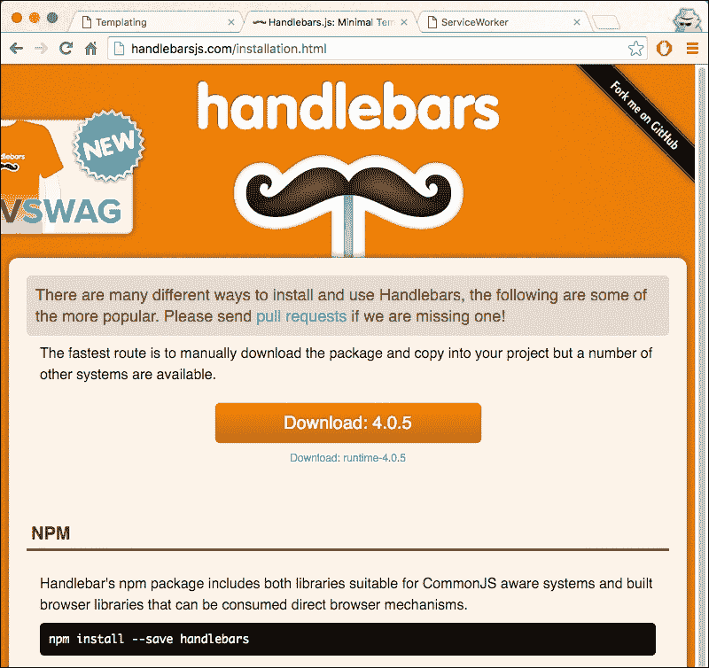

1.  打开浏览器并转到`index.html`文件：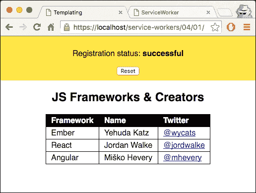

## 工作原理...

在这个例子中，我们选择使用 handlebars 作为模板引擎。

服务工人的模板是 `index.html` 文件本身。我们在表格中使用双大括号，`Handlebars` 语法：

```js
<table class="frameworks">
    <tr>
    <th>Framework</th>
       <th>Name</th>
       <th>Twitter</th>
    </tr>
    {{#users}}
       <tr>
          <td>{{framework}}</td>
          <td>{{person.firstName}} {{person.lastName}}</td>
          <td><a href="https://twitter.com/{{twitter}}">
		  @{{twitter}}</a></td>
          </tr>
        {{/users}}
</table>
```

值是从我们输入模板的 JSON 文件中读取的。`{{#users}}` 标签是一个数组，它就像一个循环，通过用相关值替换占位符，如 `{{twitter}}`，将 `users` 属性中的内容打印到屏幕上。

`people.json` 文件包含我们模板所需的数据。`users` 属性包含用户数组：

```js
{
  "users":[
    {
      "framework": "Ember",
      "person":{
        "firstName": "Yehuda",
        "lastName": "Katz"
      },
      "twitter": "wycats"
    },
    {
      "framework": "React",
      "person":{
        "firstName": "Jordan",
        "lastName": "Walke"
      },
      "twitter": "jordwalke"
    },
    {
      "framework": "Angular",
      "person":{
        "firstName": "Miško",
        "lastName": "Hevery"
      },
      "twitter": "mhevery"
    }
  ]
}
```

让我们继续到 `service-worker.js` 文件。在那里我们处理两个事件：安装和获取。在安装事件处理器中，我们正在缓存所有依赖项：

```js
return cache.addAll([
          'index.html',
          'style.css',
          'service-worker.js',
          'people.json'
        ]);
```

在获取处理器内部，我们检查获取请求是否是模板，在我们的例子中是 `index.html` 文件，并以文本格式发送响应：

```js
caches.match('index.html').then(function(response) {
        if(response) {
          return response.text();
        }
      }),
```

如果获取请求是 JSON 文件，我们以 JSON 格式返回结果：

```js
   caches.match('people.json').then(function(response) {
        return response.json();
      })
```

最后，我们使用 JSON 数据渲染模板，然后发送带有标题的响应：

```js
]).then(function(resps) {
      var template = resps[0],
        data = resps[1],
        renderTemplate = Handlebars.compile(template);

      return new Response(renderTemplate(data), {
        headers: {
          'Content-Type': 'text/html'
        }
      });
    })
```

`Handlebars.compile()` 函数接受一个模板并返回一个函数，该函数可以进一步接受数据并渲染输出。

## 参见

+   在第一章 *学习服务工人基础* 的 *详细注册服务工人* 菜谱中，*学习服务工人基础*

# 实现读取缓存

读取缓存是一种对所有经常访问的静态内容类型进行全面缓存的方法。这并不适合动态内容，如新闻或体育。在这种情况下，选择性的缓存方法会更好。读取缓存为我们节省了服务器必要的带宽，以及网络请求。读取缓存的工作方式是，在服务工人接管你的页面后，当第一次调用 `fetch()` 请求时，响应将被缓存，并且对同一 URL 的后续请求将来自缓存。

## 准备工作

要开始使用服务工人，你需要在浏览器设置中开启服务工人实验功能。如果你还没有这样做，请参考第一章 *学习服务工人基础* 的第一个菜谱：*设置服务工人*。服务工人仅在 HTTPS 上运行。要了解如何设置支持此功能的发展环境，请参考以下第一章 *学习服务工人基础* 的菜谱：*设置 GitHub 页面以支持 SSL*，*在 Windows 上设置 SSL* 和 *在 Mac 上设置 SSL*。

## 如何做到这一点...

按照说明设置你的文件结构。或者，你也可以从以下位置下载文件：

[`github.com/szaranger/szaranger.github.io/tree/master/service-workers/04/02`](https://github.com/szaranger/szaranger.github.io/tree/master/service-workers/04/02)/

1.  首先，我们必须创建一个如下的`index.html`文件：

    ```js
    <!DOCTYPE html>
    <html lang="en">
    <head>
      <meta charset="UTF-8">
      <title>Read-through Caching</title>
      <link rel="stylesheet" href="style.css">
    </head>
    <body>
      <section id="registration-status">
        <p>Registration status: <strong id="status"></strong></p>
        <input type="button" id="resetButton" value="Reset" />
      </section>
      <section</section>
      <script src="img/index.js"></script>
    </body>
    </html>
    ```

1.  在与`index.html`文件相同的文件夹中创建一个名为`style.css`的 CSS 文件：

    ```js
    * {
      -webkit-box-sizing: border-box;
      -moz-box-sizing: border-box;
      box-sizing: border-box;
    }

    body {
      margin: 0 auto;
      text-align: center;
      font-family: sans-serif;
    }

    main {
      max-width: 350px;
      border: 1px solid #4CAF50;
      padding: 20px;
      border-radius: 5px;
      width: 350px;
      margin: 20px auto;
    }

    h1 {
      color: #4CAF50;
    }

    img {
      padding: 20px 0;
      max-width: 200px;
    }

    .hidden {
      display: none;
    }

    #registration-status {
      background-color: #FFE454;
      padding: 10px;
    }
    ```

1.  在与`index.html`文件相同的文件夹中创建一个名为`index.js`的 JavaScript 文件：

    ```js
    'use strict';

    var scope = {
      scope: './'
    };

    if ('serviceWorker' in navigator) {
      navigator.serviceWorker.register(
        'service-worker.js',
        scope
      ).then( function(serviceWorker) {
        printStatus('successful');
      }).catch(function(error) {
        printStatus(error);
      });
    } else {
      printStatus('unavailable');
    }

    function printStatus(status) {
      document.querySelector('#status').innerHTML = status;
    }

    document.querySelector('#resetButton').addEventListener('click',
      function() {
        navigator.serviceWorker.getRegistration().then(function(registration) {
          registration.unregister();
          window.location.reload();
        });
      }
    );
    ```

1.  在与`index.html`文件相同的文件夹中创建一个名为`service-worker.js`的 JavaScript 文件：

    ```js
    'use strict';

    var version = 1,
      currentCaches= { readThrough : 'version-' + version },
      NOT_FOUND = -1,
      ERROR_RESPONSE = 400;

    self.addEventListener('activate', function(event) {
      var expectingCacheNames = Object.keys(currentCaches).map(function(key) {
        return currentCaches[key];
      });

      event.waitUntil(
        caches.keys().then(function(cacheNames) {
          return Promise.all(
            cacheNames.map(function(cacheName) {
              if (expectingCacheNames.indexOf(cacheName) === NOT_FOUND) {
                console.log(
                  '%c DELETE: Out of date cache: %s',
                  'color: #ff0000',
                  cacheName
                );
                return caches.delete(cacheName);
              }
            })
          );
        })
      );
    });

    self.addEventListener('fetch', function(event) {
      var request = event.request,
        requestUrl = request.url;

      console.log(
        '%c  EVENT: %c Handling fetch event for %s',
        'color: #F57F20',
        'color: #000',
        requestUrl
      );

      event.respondWith(
        caches.open(currentCaches['readThrough']).then(function(cache) {
          return cache.match(request).then(function(response) {
            if (response) {
              console.log(
                '%c P RESPONSE: %c Found in cache: %s',
                'color: #5EBD00',
                'color: #000000',
                response
              );

              return response;
            }
            console.log(
              '%c O RESPONSE: %c For %s not found in cache. ' +
              'fetching from network...',
              'color: #F05266',
              'color: #000',
              requestUrl
            );

            return fetch(request.clone()).then(function(response) {
              console.log(
                '%c RESPONSE: %c For %s from network is: %O',
                'color: #F05266',
                'color: #000',
                requestUrl,
                response
              );

              if (response.status < ERROR_RESPONSE) {
                cache.put(request, response.clone());
              }

              return response;
            });
          }).catch(function(err) {
            console.error('FAIL: Read-through cache:', err);
            throw error;
          });
        })
      );
    });
    ```

1.  打开浏览器并转到`index.html`：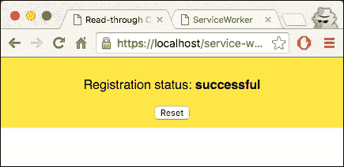

1.  打开开发者工具（*Cmd* + *Alt* + *I* 或 *F12*）。你将在控制台看到记录的消息，表明大多数资源都没有在缓存中找到，因此从网络上获取：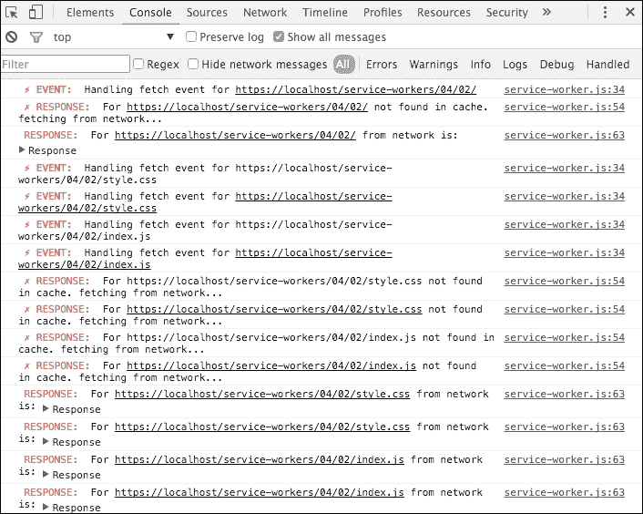

1.  如果你刷新页面，你将在控制台看到不同的消息。这次，资源是从缓存中获取的：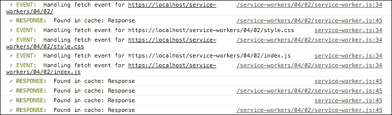

## 它是如何工作的...

在`service-worker.js`文件中，我们为缓存设置了一个特定于页面的名称，因为缓存是基于源的，其他页面不应使用相同的缓存名称。我们还对缓存进行了版本控制，以便解决你可能想要一个新缓存的情况；在这种情况下，我们可以更新版本：

```js
var version = 1,
   currentCaches= { readThrough : 'version-' + version },
```

我们还确保在服务工作者激活时清除旧缓存。因此，我们删除了所有与我们之前指定的缓存名称不匹配的缓存：

```js
self.addEventListener('activate', function(event) {
  var expectingCacheNames = Object.keys(currentCaches).map(function(key) {
    return currentCaches[key];
  });

  event.waitUntil(
    caches.keys().then(function(cacheNames) {
      return Promise.all(
        cacheNames.map(function(cacheName) {
          if (expectingCacheNames.indexOf(cacheName) === NOT_FOUND) {
            console.log('%c DELETE: Out of date cache: %s',
              'color: #ff0000', cacheName);
            return caches.delete(cacheName);
          }
        })
      );
    })
  );
});
```

fetch 事件监听器会检查缓存以确定我们请求的资源是否在缓存中；如果找到，它将响应条目：

```js
event.respondWith(
    caches.open(currentCaches['readThrough']).then(function(cache) {
      return cache.match(request).then(function(response) {
        if (response) {
          console.log(
            '%c ✔ RESPONSE: %c Found in cache: %s',
            'color: #5EBD00','color: #000000',response
          );

          return response;
        }
```

否则，如果缓存中没有`event.request`的条目，响应将是未定义的，因此我们必须使用`fetch()`来获取资源：

```js
return fetch(request.clone()).then(function(response) {
          console.log(
            '%c RESPONSE: %c For %s from network is: %O',
            'color: #F05266',
            'color: #000',
            requestUrl,
            response
          );
```

在这里，如果之后我们使用`cache.put()`，`clone()`调用是有用的。

制作副本是必要的，因为`cache.put()`和`fetch()`都会消耗请求。

我们还确保通过检查`response.status`参数不是 400 或更高来避免缓存错误响应：

```js
if (response.status < ERROR_RESPONSE) {
```

最后，我们在响应上调用`clone()`方法，以便在缓存中保存一个副本，然后将响应返回给浏览器：

```js
…
cache.put(request, response.clone());
}

return response;
```

# 允许离线 Google Analytics

在之前的配方中，我们讨论了读透缓存。让我们快速回顾一下什么是读透缓存。当一个服务工作者获得页面控制权后，第一次请求新的资源时，响应将被存储在服务工作者缓存中。

在这个配方中，我们利用这个功能将任何失败的 Google Analytics/collect pings 存储在 IndexedDb 数据库中。IndexedDb 是一个客户端、用户特定的存储规范，它允许我们以索引的方式存储数据，并由一个提供搜索功能的 API 支持。因此，每次服务工作者启动时，任何保存的 Google Analytics pings 都将重新播放。

要了解更多关于 IndexedDb 的信息，可以参考以下链接：

+   [`developer.mozilla.org/en-US/docs/Web/API/IndexedDB_API/Using_IndexedDB`](https://developer.mozilla.org/en-US/docs/Web/API/IndexedDB_API/Using_IndexedDB)

+   [`seanamarasinghe.com/developer/indexeddb/`](http://seanamarasinghe.com/developer/indexeddb/)

这将为您提供一个在离线状态下执行交易的平台，无论连接性和可用性如何。

## 准备工作

要开始使用服务工作者，您需要在浏览器设置中开启服务工作者实验功能。如果您还没有这样做，请参考第一章的第一个食谱，*学习服务工作者基础*：*设置服务工作者*。服务工作者仅在 HTTPS 上运行。要了解如何设置支持此功能的发展环境，请参考以下食谱：*设置 GitHub 页面以支持 SSL*，*在 Windows 上设置 SSL*，以及*在 Mac 上设置 SSL*。

## 如何操作...

按照说明设置您的文件结构。或者，您也可以从以下位置下载文件：

[`github.com/szaranger/szaranger.github.io/tree/master/service-workers/04/03/`](https://github.com/szaranger/szaranger.github.io/tree/master/service-workers/04/03/)

1.  首先，我们必须创建一个如下所示的`index.html`文件：

    ```js
    <!DOCTYPE html>
    <html lang="en">
    <head>
      <meta charset="UTF-8">
      <title>Offline Google Analytics</title>
      <link rel="stylesheet" href="style.css">
    </head>
    <body>
      <section id="registration-status">
        <p>Registration status: <strong id="status"></strong></p>
        <input type="button" id="resetButton" value="Reset" />
      </section>
      <section id="outlet">
        <p id="message"></p>
        <div id="images" style="display: none">
           
        </div>
      </section>
      <script src="img/index.js"></script>
      <script>
          /* jshint ignore:start */
          (function(i,s,o,g,r,a,m){i['GoogleAnalyticsObject']=r;i[r]=i[r]||function(){
            (i[r].q=i[r].q||[]).push(arguments)},i[r].l=1*new Date();a=s.createElement(o),
            m=s.getElementsByTagName(o)[0];a.async=1;a.src=g;m.parentNode.insertBefore(a,m)
          })(window,document,'script','//www.google-analytics.com/analytics.js','ga');
          ga('create', 'UA-12345678-1', 'auto');
          ga('send', 'pageview');
          /* jshint ignore:end */
        </script>
    </body>
    </html>
    ```

1.  在与`index.html`文件相同的文件夹中创建一个名为`style.css`的 CSS 文件，并包含以下代码：

    ```js
    * {
      -webkit-box-sizing: border-box;
      -moz-box-sizing: border-box;
      box-sizing: border-box;
    }

    body {
      margin: 0 auto;
      text-align: center;
      font-family: sans-serif;
    }

    main {
      max-width: 350px;
      border: 1px solid #4CAF50;
      padding: 20px;
      border-radius: 5px;
      width: 350px;
      margin: 20px auto;
    }

    h1 {
      color: #4CAF50;
    }

    img {
      padding: 20px 0;
      max-width: 400px;
    }

    .hidden {
      display: none;
    }

    #registration-status {
      background-color: #FFE454;
      padding: 10px;
    }
    ```

1.  在与`index.html`文件相同的文件夹中创建一个名为`index.js`的 JavaScript 文件，并包含以下代码：

    ```js
    'use strict';

    var scope = {
      scope: './'
    };

    if ('serviceWorker' in navigator) {
      navigator.serviceWorker.register(
        'service-worker.js',
        scope
      ).then( function(serviceWorker) {
        printStatus('successful');
        if (navigator.serviceWorker.controller) {
          showImages();
        } else {
          document.querySelector('#message').textContent = 'Reload the page for images to be loaded from the service worker cache';
        }
      }).catch(function(error) {
        printStatus(error);
      });
    } else {
      printStatus('unavailable');
    }

    function printStatus(status) {
      document.querySelector('#status').innerHTML = status;
    }

    document.querySelector('#resetButton').addEventListener('click',
      function() {
        navigator.serviceWorker.getRegistration().then(function(registration) {
          registration.unregister();
          window.location.reload();
        });
      }
    );

    function showImages() {
      document.querySelector('#images').style.display = 'block';
    }
    ```

1.  在与`index.html`文件相同的文件夹中创建一个名为`analytics.js`的 JavaScript 文件，并包含以下代码：

    ```js
    'use strict';

    var RW = 'readwrite';

    function checkForAnalyticsRequest(requestUrl) {
      var url = new URL(requestUrl),
        regex = /^(w{3}|ssl)\.google-analytics.com$/;

      if (url.hostname.match(regex) && url.pathname === '/collect') {
        console.log('INDEXEDDB: Store request(Google analytics) for replaying later.');
        saveGoogleAnalyticsRequest(requestUrl);
      }
    }

    function saveGoogleAnalyticsRequest(requestUrl) {
      getIDBObjectStore(idbInstance, idbStore, RW).add({
        url: requestUrl,
        timestamp: Date.now()
      });
    }

    function replayGoogleAnalyticsRequests(idbInstance, idbStore, throttle) {
      var savedGoogleAnalyticsRequests = [];

      getIDBObjectStore(idbInstance, idbStore).openCursor().onsuccess = function(event) {
        var cursor = event.target.result;

        if (cursor) {
          savedGoogleAnalyticsRequests.push(cursor.value);
          cursor.continue();
        } else {
          console.log('REPLAY: Starting %d Google Analytics requests',
            savedGoogleAnalyticsRequests.length);

          savedGoogleAnalyticsRequests.forEach(function(savedRequest) {
            var queueTime = Date.now() - savedRequest.timestamp;
            if (queueTime > throttle) {
              getIDBObjectStore(idbInstance, idbStore, RW).delete(savedRequest.url);
              console.log('REQUEST: Queued for %dms ' +
                'STOPPED: Replay attempt', queueTime);
            } else {
              var requestUrl = savedRequest.url + '&qt=' + queueTime;

              console.log('%c ♫ REPLAY: %s %s', 'color: #1C99D8', 'in progress...', requestUrl);

              fetch(requestUrl).then(function(response) {
                if (response.status < 400) {
                  getIDBObjectStore(idbInstance, idbStore, RW).delete(savedRequest.url);
                  console.log('%c ♫ REPLAY: %s', 'color: #1C99D8', 'success');
                } else {
                  console.error('♫ REPLAY: fail -', response);
                }
              }).catch(function(err) {
                console.error('♫ REPLAY: fail - ', err);
              });
            }
          });
        }
      };
    }
    ```

1.  打开浏览器并访问`index.html`文件：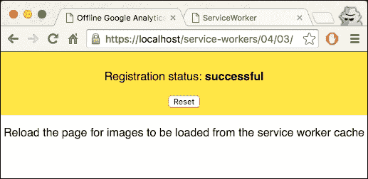

1.  现在，打开开发者工具（*Cmd* + *Alt* + *I* 或 *F12*）并转到**网络**选项卡。您将看到`/collect`请求的状态为**200**，这意味着成功：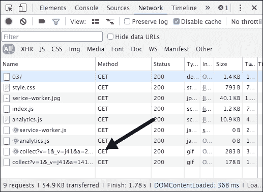

1.  刷新页面。您将看到如下截图所示的图像：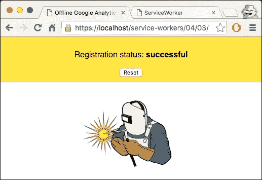

1.  转到开发者工具的**控制台**选项卡：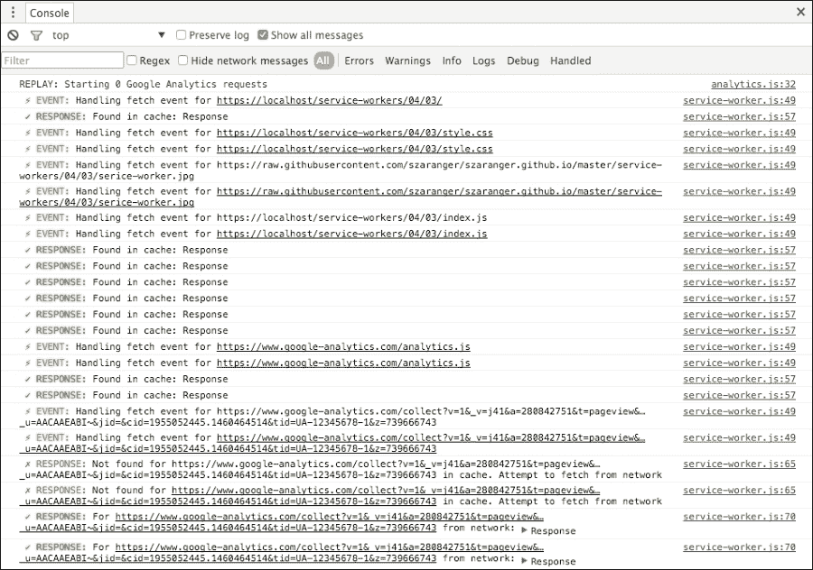

1.  现在，转到开发者工具的**网络**选项卡并选择**离线**：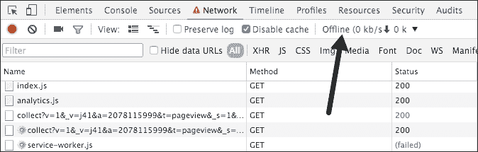

1.  刷新页面，您仍然会看到相同的页面，但如果您查看网络请求，您将能够发现服务工作者已将分析请求保存到 IndexedDb 中：

1.  现在，在开发者工具中将**离线**选项更改为**无节流**：

1.  点击此页面的**重置**按钮以刷新服务工作者，并在开发者工具的控制台中进行监控。您将看到从 IndexedDb 提取的重放消息已被发送：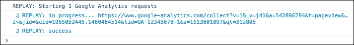

## 工作原理...

在`service-worker.js`文件中，我们通过获取其引用来访问 IndexedDb。然后我们继续为数据库实例的`error`、`upgradeneed`和`onsuccess`事件附加事件处理器：

```js
var db = openIDBDatabase('offline-google-analytics', idbVersion);
db.onerror = function(err) {
  console.error('%c ✗ ERROR: IndexedDB - %s', 'color: #ff0000', err);
};

db.onupgradeneeded = function() {
  this.result.createObjectStore(idbStore, {keyPath: 'url'});
};

db.onsuccess = function() {
  idbInstance = this.result;
  replayGoogleAnalyticsRequests(idbInstance, idbStore, throttle);
};
```

由于读取穿透，缓存将缓存初始请求；对同一资源的后续请求将由服务工人的`fetch()`事件处理器处理。fetch 事件处理器查询`currentCaches`缓存中的请求，并将响应发送回浏览器：

```js
event.respondWith(
    caches.open(currentCaches['offline-google-analytics']).then(function(cache) {
      return cache.match(event.request).then(function(res) {
        if (res) {
          console.log(
            '%c ✔ RESPONSE: %c Found in cache: %s',
            'color: #5EBD00', 'color: #000000', res
          );

          return res;
        }
```

如果响应未找到，它将向网络发送 fetch 请求：

```js
 return fetch(event.request.clone()).then(function(res) {
          console.log('%c ✔ RESPONSE: %c For %s from network: %O',
            'color: #5EBD00', 'color: #000000',
            event.request.url, res);

          if (res.status < 400) {
            cache.put(event.request, res.clone());
          }
```

如果前一个请求的响应是成功的，响应将被克隆并添加到缓存中，请求作为键，响应作为值：

```js
promises = promises.map(function(promise) {
      return Promise.resolve(promise);
    });
```

接下来，我们要确保在数组中的另一个 promise 被解析后，立即解析当前的 promise：

```js
if (res.status < 400) {
            cache.put(event.request, res.clone());
          }
```

如果响应不是服务器错误，并且可能是超时，我们将请求 URL 传递给`checkForAnalyticsRequest()`：

```js
} else if (res.status >= 500) {
            checkForAnalyticsRequest(event.request.url);
          }
```

`checkForAnalyticsRequest()`函数位于`analytics.js`文件中。让我们检查这个方法。传入的 URL 首先被检查以确保它是对`google-analytics.com`的调用，无论子域名是`www`还是`ssl`，路径名中是否有`/collect`。这是为了确保这是一个分析 ping：

```js
function checkForAnalyticsRequest(requestUrl) {
  var url = new URL(requestUrl),
    regex = /^(w{3}|ssl)\.google-analytics.com$/;

  if (url.hostname.match(regex) && url.pathname === '/collect') {
    console.log('INDEXEDDB: Store request(Google analytics) for replaying later.');
    saveGoogleAnalyticsRequest(requestUrl);
  }
}
```

`saveGoogleAnalyticsRequest()`方法将 URL 和时间戳添加到存储中，从而保存条目。

在`service-worker.js`文件中，`onsuccess()`方法调用`replayGoogleAnalyticsRequests()`方法。在这个方法中，分析请求将被保存到一个名为`savedGoogleAnalyticsRequests`的队列中：

```js
function replayGoogleAnalyticsRequests(idbInstance, idbStore, throttle) {
  var savedGoogleAnalyticsRequests = [];

  getIDBObjectStore(idbInstance, idbStore).openCursor().onsuccess = function(event) {
    var cursor = event.target.result;
```

`openCursor()`函数是指向数据库的指针，你可以遍历记录。

`onsuccess`事件处理器的回调将`event.target.result`的值传递到`savedGoogleAnalyticsRequests`数组中：

```js
getIDBObjectStore(idbInstance, idbStore).openCursor().onsuccess = function(event) {
    var cursor = event.target.result;

    if (cursor) {
      savedGoogleAnalyticsRequests.push(cursor.value);
      cursor.continue();
    }
```

否则，每个保存的 Google Analytics 请求将被重新播放：

```js
} else {
      console.log('REPLAY: Starting %d Google Analytics requests',
        savedGoogleAnalyticsRequests.length);

      savedGoogleAnalyticsRequests.forEach(function(savedRequest) {
        var queueTime = Date.now() - savedRequest.timestamp;
        if (queueTime > throttle) {
          getIDBObjectStore(idbInstance, idbStore, RW).delete(savedRequest.url);
          console.log('REQUEST: Queued for %dms ' +
            'STOPPED: Replay attempt', queueTime);
        } else {
          var requestUrl = savedRequest.url + '&qt=' + queueTime;

          console.log('%c ♫ REPLAY: %s %s', 'color: #1C99D8', 'in progress...', requestUrl);

          fetch(requestUrl).then(function(response) {
            if (response.status < 400) {
              getIDBObjectStore(idbInstance, idbStore, RW).delete(savedRequest.url);
              console.log('%c ♫ REPLAY: %s', 'color: #1C99D8', 'success');
            } else {
              console.error('♫ REPLAY: fail -', response);
            }
          }).catch(function(err) {
            console.error('♫ REPLAY: fail - ', err);
          });
        }
      });
    }
```

## 参见

+   *实现读取穿透缓存*菜谱

# 允许离线用户交互

大多数网站，包括新闻文章、体育视频或音乐，由于内容量很大，并不能完全离线。如果你不访问它们，没有必要在缓存中保存所有内容。但是，给用户保存内容到缓存以便稍后阅读的选项是理想的解决方案。在这个菜谱中，我们将探讨如何实现这一点。

## 准备工作

要开始使用服务工作者，你需要在浏览器设置中开启服务工作者实验功能。如果你还没有这样做，请参考第一章的第一个食谱，*学习服务工作者基础*：*设置服务工作者*。服务工作者仅在 HTTPS 上运行。要了解如何设置开发环境以支持此功能，请参考以下食谱：*设置 GitHub 页面以支持 SSL*，*设置 Windows 的 SSL*，和*设置 Mac 的 SSL*。

## 如何操作...

按照说明设置你的文件结构。或者，你也可以从以下位置下载文件：

[`github.com/szaranger/szaranger.github.io/tree/master/service-workers/04/04/`](https://github.com/szaranger/szaranger.github.io/tree/master/service-workers/04/04/)

1.  首先，我们必须创建一个`index.html`文件，如下所示：

    ```js
    <!DOCTYPE html>
    <html lang="en">
    <head>
      <meta charset="UTF-8">
      <title>Offline User Interaction</title>
      <link rel="stylesheet" href="style.css">
    </head>
    <body>
      <section id="registration-status">
        <p>Registration status: <strong id="status"></strong></p>
        <input type="button" id="resetButton" value="Reset" />
      </section>
      <section>
        <video width="320" height="240" id="video-01" controls>
          <source src="img/video.mp4" type="video/mp4">
          Your browser does not support the video tag.
        </video>
        <input type="button" id="watch-later" value="Watch Later" />
      </section>
      <script src="img/index.js"></script>
    </body>
    </html>
    ```

1.  在与`index.html`文件相同的文件夹中创建一个名为`index.js`的 JavaScript 文件，包含以下代码：

    ```js
    'use strict';

    var scope = {
      scope: './'
    };

    if ('serviceWorker' in navigator) {
      navigator.serviceWorker.register(
        'service-worker.js',
        scope
      ).then( function(serviceWorker) {
        printStatus('successful');
      }).catch(function(error) {
        printStatus(error);
      });
    } else {
      printStatus('unavailable');
    }

    document.querySelector('#resetButton').addEventListener('click',
      function() {
        navigator.serviceWorker.getRegistration().then(function(registration) {
          registration.unregister();
          window.location.reload();
        });
      }
    );

    function printStatus(status) {
      document.querySelector('#status').innerHTML = status;
    }

    document.getElementById('watch-later').addEventListener('click', function(event) {
      event.preventDefault();

      caches.open('video').then(function(cache) {
        fetch('video.mp4').then(function(response) {
          return response.url;
        }).then(function(url) {
          cache.add(url);
        });
      });
    });
    ```

1.  在与`index.html`文件相同的文件夹中创建一个名为`service-worker.js`的 JavaScript 文件，包含以下代码：

    ```js
    'use strict';

    var cacheName= 'user-interaction-cache';

    self.addEventListener('install', function(event) {
      event.waitUntil(
        caches.open(cacheName)
          .then(function(cache) {
            return cache.addAll([
              'index.html'
            ]);
          })
          .then(function() {
            return self.skipWaiting();
          })
      );
    });

    self.addEventListener('fetch', function(event) {
      event.respondWith(
        caches.match(event.request)
          .then(function(response) {
            if (response) {
              console.log('Fetching from the cache: ', event.request.url);
              return response;
            } else {
              console.log('Fetching from server: ', event.request.url);
            }
           return fetch(event.request);
         }
       )
     );
    });

    self.addEventListener('activate', function(event) {
       console.log('Activating the service worker!');
       event.waitUntil(self.clients.claim());
    });
    ```

1.  在与`index.html`文件相同的文件夹中创建一个名为`style.css`的 CSS 文件，包含以下代码：

    ```js
    * {
      -webkit-box-sizing: border-box;
      -moz-box-sizing: border-box;
      box-sizing: border-box;
    }

    body {
      margin: 0 auto;
      text-align: center;
      font-family: sans-serif;
    }

    main {
      max-width: 350px;
      border: 1px solid #4CAF50;
      padding: 20px;
      border-radius: 5px;
      width: 350px;
      margin: 20px auto;
    }

    h1 {
      color: #4CAF50;
    }

    img {
      padding: 20px 0;
      max-width: 200px;
    }

    .hidden {
      display: none;
    }

    #registration-status {
      background-color: #FFE454;
      padding: 10px;
    }

    input#watch-later {
        display: block;
        margin: 10px auto;
        padding: 50px;
    }
    ```

1.  打开浏览器并访问`index.html`文件。你会看到一个预取的书签：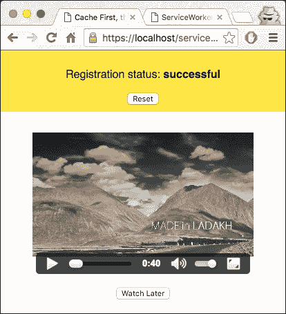

1.  通过点击**稍后观看**按钮将视频添加到缓存中：

1.  现在，在 DevTools 中将**离线**选项更改为**无节流**：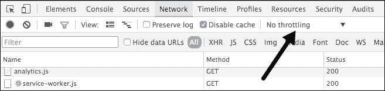

1.  现在刷新页面。你会看到样式没有加载，但视频仍然可以访问：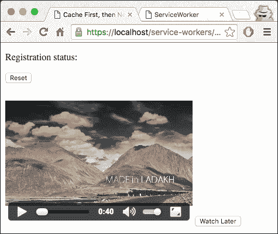

## 它是如何工作的...

在我们的`service-worker.js`文件中，我们只缓存`index.html`文件以加载页面：

```js
caches.open(cacheName)
      .then(function(cache) {
        return cache.addAll([
          'index.html'
        ]);
      })
```

在`index.html`文件中，我们有一个视频标签，其源指向一个视频文件。如果浏览器不支持`.mp4`扩展名，它将显示`您的浏览器不支持视频标签`的消息：

```js
<section>
    <video width="320" height="240" id="video-01" controls>
      <source src="img/video.mp4" type="video/mp4">
      Your browser does not support the video tag.
    </video>
    <input type="button" id="watch-later" value="Watch Later" />
  </section>
```

当你点击**稍后观看**按钮时，事件处理程序被触发，这反过来又在`index.js`文件内部处理：

```js
document.getElementById('watch-later').addEventListener('click', function(event) {
  event.preventDefault();

  caches.open('video').then(function(cache) {
    fetch('video.mp4').then(function(response) {
      return response.url;
    }).then(function(url) {
      cache.add(url);
    });
  });
});
```

`cache.add()`函数将响应 URL 添加到缓存中。回到`service-worker.js`，fetch 事件监听器在离线模式下刷新页面时检索这个保存的响应：

```js
self.addEventListener('fetch', function(event) {
  event.respondWith(
    caches.match(event.request)
      .then(function(response) {
        if (response) {
          console.log('Fetching from the cache: ', event.request.url);
          return response;
        } else {
          console.log('Fetching from server: ', event.request.url);
        }
       return fetch(event.request);
     }
   )
 );
});
```

# 实现选择性缓存

在本章的第二部分，*实现读取缓存*，我们讨论了在第一次请求时缓存所有资源，并讨论了它不适合某些场景，例如新闻或体育，其中大多数文章都会过时，你将永远不会再次访问它们。当时我们提出的解决方案是选择性缓存。那么，让我们看看一个工作示例。

## 准备工作

要开始使用服务工作者，你需要在浏览器设置中开启服务工作者实验功能。如果你还没有这样做，请参考第一章的第一个菜谱，*学习服务工作者基础*：*设置服务工作者*。服务工作者仅在 HTTPS 上运行。要了解如何设置支持此功能的发展环境，请参考以下菜谱：*设置 GitHub 页面以支持 SSL*，*在 Windows 上设置 SSL*，和*在 Mac 上设置 SSL*。

## 如何操作...

按照以下说明设置你的文件结构：

1.  首先，我们必须创建一个如下所示的`index.html`文件：

    ```js
    <!DOCTYPE html>
    <html lang="en">
    <head>
      <meta charset="UTF-8">
      <title>Cache First, then Network</title>
      <link rel="stylesheet" href="style.css">
    </head>
    <body>
      <section id="registration-status">
        <p>Registration status: <strong id="status"></strong></p>
        <input type="button" id="resetButton" value="Reset" />
      </section>
      <section id="outlet">
        <p></p>
      </section>
      <script src="img/index.js"></script>
    </body>
    </html>
    ```

1.  在与`index.html`文件相同的文件夹中创建一个名为`index.js`的 JavaScript 文件，并包含以下代码：

    ```js
    'use strict';

    var scope = {
      scope: './'
    };

    if ('serviceWorker' in navigator) {
      navigator.serviceWorker.register(
        'service-worker.js',
        scope
      ).then( function(serviceWorker) {
        printStatus('successful');
        document.querySelector('#outlet p').textContent =
        'The service worker controlling this page has cached this funky font.';
      }).catch(function(error) {
        printStatus(error);
      });
    } else {
      printStatus('unavailable');
    }

    function printStatus(status) {
      document.querySelector('#status').innerHTML = status;
    }

    document.querySelector('#resetButton').addEventListener('click',
      function() {
        navigator.serviceWorker.getRegistration().then(function(registration) {
          registration.unregister();
          window.location.reload();
        });
      }
    );
    ```

1.  从源代码下载`webfont-serif.woff`文件，或者使用你自己的字体文件，与`index.html`文件在同一文件夹中。

1.  在与`index.html`文件相同的文件夹中创建一个名为`service-worker.js`的 JavaScript 文件，并包含以下代码：

    ```js
    'use strict';

    var cacheVersion = 1,
      currentCaches = {
      font: 'selective-caching-v' + cacheVersion
    };

    self.addEventListener('activate', function(event) {
      var cacheNamesExpected = Object.keys(currentCaches).map(function(key) {
        return currentCaches[key];
      });

      event.waitUntil(
        caches.keys().then(function(cacheNames) {
          return Promise.all(
            cacheNames.map(function(cacheName) {
              if (cacheNamesExpected.indexOf(cacheName) === -1) {
                console.log('DELETE: out of date cache:', cacheName);
                return caches.delete(cacheName);
              }
            })
          );
        })
      );
    });
    self.addEventListener('fetch', function(event) {
      console.log('%c  EVENT: %c Handling fetch event for %s','color: #F57F20',
      'color: #000',
      event.request.url);

      event.respondWith(
        caches.open(currentCaches.font).then(function(cache) {
          return cache.match(event.request).then(function(res) {
            if (res) {
              console.log(
                '%c ✔ RESPONSE: %c Found in cache: %s',
                'color: #5EBD00', 'color: #000000', res
              );
              return res;
            }

            console.log('%c  ✗ RESPONSE: %c Not found for %s in cache. ' +
              'Attempt to fetch from network', 'color: #EB4A4B', 'color: #000000',
              event.request.url);

            return fetch(event.request.clone()).then(function(res) {
              console.log('%c ✔ RESPONSE: %c For %s from network: %O',
                'color: #5EBD00', 'color: #000000',
                event.request.url, res);

              if (res.status < 400 &&
                  res.headers.has('content-type') &&
                  res.headers.get('content-type').match(/^font\//i)) {
                console.log('%c ✔ RESPONSE: %c Caching to %s ',
                  'color: #5EBD00', 'color: #000000',
                  event.request.url);
                cache.put(event.request, res.clone());
              } else {
                console.log('%c ✔ RESPONSE: %c Not caching to %s ',
                  'color: #5EBD00', 'color: #000000',
                  event.request.url);
              }

              return res;
            });
          }).catch(function(err) {
            throw error;
          });
        })
      );
    });
    ```

1.  在与`index.html`文件相同的文件夹中创建一个名为`style.css`的 CSS 文件，并包含以下代码：

    ```js
    * {
      -webkit-box-sizing: border-box;
      -moz-box-sizing: border-box;
      box-sizing: border-box;
    }

    body {
      margin: 0 auto;
      text-align: center;
      font-family: sans-serif;
    }

    main {
      max-width: 350px;
      border: 1px solid #4CAF50;
      padding: 20px;
      border-radius: 5px;
      width: 350px;
      margin: 20px auto;
    }

    h1 {
      color: #4CAF50;
    }

    img {
      padding: 20px 0;
      max-width: 200px;
    }

    .hidden {
      display: none;
    }

    #registration-status {
      background-color: #FFE454;
      padding: 10px;
    }

    @font-face{
      font-family: 'MyWebFont';
      src: url('webfont-serif.woff') format('woff');
    }

    #outlet p {
      font-family: 'MyWebFont', Arial, sans-serif;
    }
    ```

1.  打开浏览器并转到`index.html`。你会看到**注册状态：成功**的消息和标志：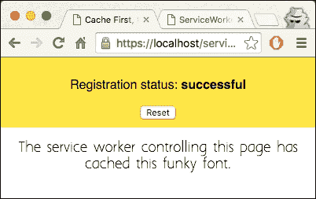

1.  现在，如果你刷新页面并检查开发者工具的**控制台**标签页，你将能够看到`webfont-serif.woff`文件已从缓存中获取。

## 它是如何工作的...

在我们的`index.html`文件中，我们添加一个占位符部分以显示我们的消息：

```js
  <section id="outlet">
    <p></p>
  </section>
```

在`style.css`文件中，我们声明我们将要使用的字体家族，然后将其分配给我们要针对的段落：

```js
  @font-face{
  font-family: 'MyWebFont';
  src: url('webfont-serif.woff') format('woff');
}

#outlet p {
  font-family: 'MyWebFont', Arial, sans-serif;
}
```

在我们的`service-worker.js`文件中，我们确保如果可用，则使用缓存的版本而不是网络请求，但下次会获取更新：

```js
if (res.status < 400 &&
              res.headers.has('content-type') &&
              res.headers.get('content-type').match(/^font\//i)) {
            console.log('%c ✔ RESPONSE: %c Caching to %s ',
              'color: #5EBD00', 'color: #000000',
              event.request.url);
            cache.put(event.request, res.clone());
          } else {
            console.log('%c ✔ RESPONSE: %c Not caching to %s ',
              'color: #5EBD00', 'color: #000000',
              event.request.url);
          }
```

## 参见

+   *实现读取缓存*菜谱
