# 第五章。超越离线缓存

在本章中，我们将涵盖以下主题：

+   离线获取网络响应

+   从 ZIP 文件中缓存内容

+   选择最佳内容提供者（负载均衡器）

+   重定向请求

+   设置请求头

+   使服务工作者表现得像远程服务器（虚拟服务器）

+   使服务工作者充当依赖注入器

+   强制立即控制

+   实现回退响应

+   延迟离线请求

# 简介

在本章中，我们将超越离线缓存，探讨一些高级技术，例如离线网络响应；高级请求处理，包括重定向、设置请求头、延迟离线请求和实现回退请求；以及使用服务工作者作为负载均衡器或依赖注入器，强制立即控制，并从 ZIP 文件中缓存内容。

让我们从本章开始，看看如何离线获取网络响应。

# 离线获取网络响应

读取缓存是一种对所有静态内容进行全面缓存 assertive approach，这些静态内容是你经常访问的。这并不适合动态内容，如新闻和体育。在这种情况下，选择性的缓存方法会更好。读取缓存可以为我们节省服务器带宽以及网络请求。读取缓存的工作方式是，当服务工作者在第一次 `fetch()` 请求被调用时接管你的页面，响应将被缓存，后续对同一 URL 的请求将来自缓存。

## 准备工作

要开始使用服务工作者，你需要在浏览器设置中开启服务工作者实验功能。如果你还没有这样做，请参考 第一章 的第一个配方，*学习服务工作者基础*：*设置服务工作者*。服务工作者仅在 HTTPS 上运行。要了解如何设置支持此功能的发展环境，请参考 第一章 的以下配方，*学习服务工作者基础*：*设置 GitHub pages for SSL*、*设置 Windows 的 SSL* 和 *设置 Mac 的 SSL*。

## 如何操作...

按照以下说明设置你的文件结构：

1.  从以下位置复制 `index.html`、`index.js`、`service-worker.js` 和 `style.css` 文件：

    [`github.com/szaranger/szaranger.github.io/blob/master/service-workers/05/01/`](https://github.com/szaranger/szaranger.github.io/blob/master/service-workers/05/01/)

1.  打开浏览器并访问 `index.html`。

1.  打开开发者工具栏（*Cmd* + *Alt* + *I* 或 *F12*）。现在刷新页面并查看控制台中的消息。你会看到 `style.css` 文件是从网络中提供的，但 `index.js` 文件是从缓存中提供的。

## 它是如何工作的...

当服务工作线程文件安装服务工作线程时，它会将`index.html`文件和`index.js`文件保存在缓存中。我们故意跳过了`style.css`文件，因此当您刷新页面时，服务工作线程首先查看缓存文件，找到那里的`index.html`和`index.js`文件，并从缓存中提供它们。然而，`style.css`文件不在缓存中，因此服务工作线程从网络中获取它。

```js
self.addEventListener('install', function(event) {
  event.waitUntil(
    caches.open(cacheName)
      .then(function(cache) {
        return cache.addAll([
          'index.html',
          'index.js'
        ]);
      })
      .then(function() {
        return self.skipWaiting();
      })
  );
});
```

# 从 ZIP 中缓存内容

如果您担心应用程序在互联网上的加载速度，您可能需要考虑的一个领域是减少应用程序为下载资源而发出的请求数量。减少 HTTP 请求的一种方法是将资源文件，例如图像，作为 ZIP 包发送给客户端。

在本食谱中，我们将探讨如何从 ZIP 文件中缓存资源。

## 准备工作

要开始使用服务工作线程，您需要在浏览器设置中开启服务工作线程实验功能。如果您还没有这样做，请参考第一章的第一个食谱，*学习服务工作线程基础*：*设置服务工作线程*。服务工作线程仅在 HTTPS 上运行。要了解如何设置开发环境以支持此功能，请参考第一章的以下食谱，*学习服务工作线程基础*：*为 SSL 设置 GitHub 页面*，*为 Windows 设置 SSL*，以及*为 Mac 设置 SSL*。

## 如何操作...

按照以下说明设置您的文件结构：

1.  首先，我们必须创建一个`index.html`文件，并从以下位置复制代码：

    [`github.com/szaranger/szaranger.github.io/blob/master/service-workers/05/02/index.html`](https://github.com/szaranger/szaranger.github.io/blob/master/service-workers/05/02/index.html)

1.  在与`index.html`相同的文件夹中创建一个名为`service-worker.js`的 JavaScript 文件，并从以下位置复制代码：

    [`github.com/szaranger/szaranger.github.io/blob/master/service-workers/05/02/index.html`](https://github.com/szaranger/szaranger.github.io/blob/master/service-workers/05/02/index.html)

1.  将第三方代码从以下位置复制到一个名为`vendor`的新文件夹中：

    [`github.com/szaranger/szaranger.github.io/blob/master/service-workers/05/02/vendor`](https://github.com/szaranger/szaranger.github.io/blob/master/service-workers/05/02/vendor)

1.  将`archive.zip`、`cacheProvider.js`、`helper.js`、`index.js`、`images`文件夹和`style.css`添加到与`index.html`文件相同的目录中：

    [`github.com/szaranger/szaranger.github.io/blob/master/service-workers/05/02/`](https://github.com/szaranger/szaranger.github.io/blob/master/service-workers/05/02/)

1.  打开浏览器并转到`index.html`文件。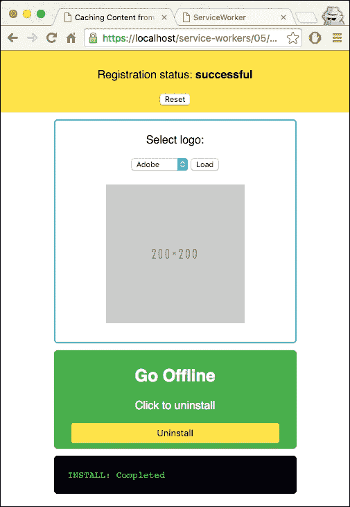

1.  从下拉菜单中选择一个品牌并点击**加载**。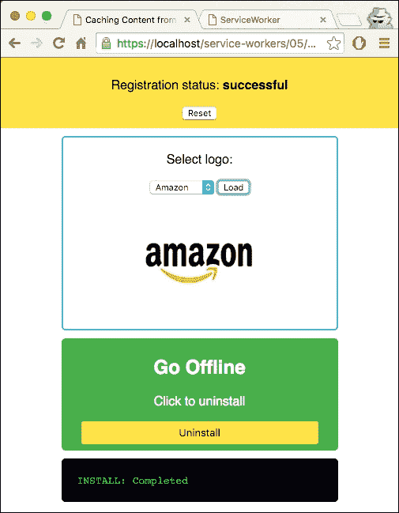

1.  现在点击**卸载**按钮。

## 工作原理...

在我们的`index.html`文件中，我们检查服务工人是否控制着页面。如果是，我们显示图片。

```js
navigator.serviceWorker.getRegistration().then(function(reg) {
     if (reg && reg.active) {
       displayImages();
     }
   });
```

当服务工人在安装时处于活动状态，我们显示下拉列表：

```js
navigator.serviceWorker.oncontrollerchange = function() {
  if (navigator.serviceWorker.controller) {
    printInstall('INSTALL: Completed');
    displayImages();
  }
};
```

卸载包不会从缓存中删除资源，因为卸载服务工人不会擦除离线缓存：

```js
document.querySelector('#uninstall').onclick = function() {      
  …
}
```

让我们继续到`service-worker.js`文件。在那里，我们从供应商文件夹导入一些第三方脚本，以及我们的一些脚本：

```js
importScripts('./vendor/zip.js');
importScripts('./vendor/ArrayBufferReader.js');
importScripts('./vendor/deflate.js');
importScripts('./vendor/inflate.js');
importScripts('./helper.js');
importScripts('./cacheProvider.js');
```

在安装时，我们从 ZIP 文件`responses-offline`获取内容，并将其存储在缓存中。

```js
self.oninstall = function(event) {
  event.waitUntil(
    fetch(zipURL)
      .then(function(res) {
        return res.arrayBuffer();
      })
      .then(getZipFileReader)
      .then(cacheFileContents)
      .then(self.skipWaiting.bind(self))
  );
};
```

在激活点控制客户端：

```js
self.onactivate = function(evt) {
  evt.waitUntil(self.clients.claim());
};
```

查询缓存，如果请求不匹配，则将请求发送到网络：

```js
self.onfetch = function(evt) {
  evt.respondWith(openCache().then(function(cache) {
    var request = evt.request;

    return cache.match(request).then(function(res) {
      return res || fetch(request);
    });
  }));
  };
```

现在我们来看看处理缓存的`cacheProvider.js`文件。

我们不缓存文件夹，只缓存其中的文件：

```js
function cacheEntry(entry) {
  if (entry.directory) {
    return Promise.resolve();
  }
```

块写入器是响应对象构造函数的支持格式。数据将以写入器想要的方式读取：

```js
return new Promise(function(fulfill, reject) {
    var blobWriter = new zip.BlobWriter();

    entry.getData(blobWriter, function(data) {
      return openCache().then(function(cache) {
        var fileLocation = getFileLocation(entry.filename),
          response = new Response(data, { headers: {
```

我们通过查看扩展名来识别文件的类型：

```js
  response = new Response(data, { headers: {
            'Content-Type': getContentType(entry.filename)
          } });
```

我们必须克隆`response`对象，因为一旦它被使用，就不能再次使用：

```js
if (entry.filename === ROOT) {
          cache.put(getFileLocation(), response.clone());
        }

        return cache.put(fileLocation, response);
      }).then(fulfill, reject);
```

让我们再看看`helper.js`文件。`getZipFileReader(data)`函数将`zip.js` API 包装在 Promise 中：

```js
function getZipFileReader(data) {
  return new Promise(function(fulfill, reject) {
    var arrayBufferReader = new zip.ArrayBufferReader(data);
    zip.createReader(arrayBufferReader, fulfill, reject);
  });
}
```

`getContentType(filename)`方法通过扩展名返回文件的类型：

```js
function getContentType(filename) {
  var tokens = filename.split('.');
  var extension = tokens[tokens.length - 1];
  return contentTypes[extension] || 'text/plain';
}
```

# 选择最佳内容提供者（负载均衡器）

在这个菜谱中，我们将探讨如何使用服务工人作为负载均衡器，以便我们可以根据内容提供者的负载决定哪个内容提供者最适合我们从其获取内容。

## 准备工作

要开始使用服务工人，您需要在浏览器设置中启用服务工人实验功能。如果您还没有这样做，请参阅第一章的第一个菜谱，*学习服务工人基础知识*：*设置服务工人*。服务工人仅在 HTTPS 上运行。要了解如何设置支持此功能的开发生态，请参阅以下菜谱：*设置 GitHub 页面以支持 SSL*，*设置 Windows 的 SSL*，和*设置 Mac 的 SSL*。您还需要确保 Node.js 可用。您可以在[`nodejs.org/en/`](https://nodejs.org/en/)上阅读如何安装 Node.js。

## 如何操作...

按照以下说明设置您的文件结构：

1.  从以下位置下载所有文件：

    [`github.com/szaranger/szaranger.github.io/blob/master/service-workers/05/03/`](https://github.com/szaranger/szaranger.github.io/blob/master/service-workers/05/03/)

1.  在命令行中运行以下命令（确保已安装 Node.js，或者阅读如何在[`nodejs.org/en/`](https://nodejs.org/en/)上安装）：

    ```js
    npm install
    ```

1.  打开浏览器并转到`index.html`。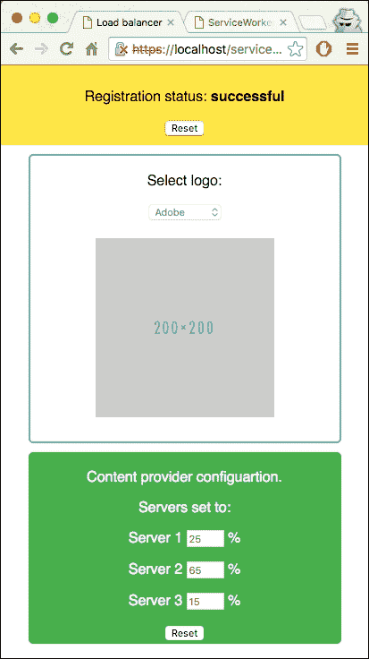

1.  你可以从下拉列表中选择标志，它将从最佳内容提供商加载图像，减少负载。你也可以手动设置服务器负载并点击**重置**。

## 它是如何工作的...

在`service-worker.js`文件中，我们正在强制服务工作者立即控制客户端：

```js
self.oninstall = function(evt) {
  evt.waitUntil(self.skipWaiting());
};

self.onactivate = function(evt) {
  evt.waitUntil(self.clients.claim());
};
```

我们使用正则表达式模式来检查请求是否包含图像：

```js
function isResource(req) {
  return req.url.match(/\/images\/.*$/) && req.method === 'GET';
}
```

最佳服务器的方法返回负载最低的服务器，然后从该服务器返回图像：

```js
function fetchContentFromBestServer(req) {
  var session = req.url.match(/\?session=([^&]*)/)[1];
  return getContentServerLoads(session)
    .then(selectContentServer)
    .then(function(serverUrl) {
      var resourcePath = req.url.match(/\/images\/[^?]*/)[0],
        serverReq = new Request(serverUrl + resourcePath);

      return fetch(serverReq);
    });
}
```

Express 服务器将被查询以找到服务器负载：

```js
function getContentServerLoads(session) {
  return fetch(baseURL + '/server-loads?session=' + session).then(function(res) {
    return res.json();
  });
}
```

在`index.js`文件中，我们正在设置图像选择的处理器：

```js
navigator.serviceWorker.ready.then(displayUI);

function displayUI() {
  getServerLoads().then(function(loads) {
    serverLoads.forEach(function(input, index) {
      input.value = loads[index];
      input.disabled = false;
    });
    document.querySelector('#image-selection').disabled = false;
  });
}
```

此外，当用户点击**重置**按钮时，手动负载值将被发送到 Express 服务器：

```js
document.querySelector('#load-configuration').onsubmit = function(event) {
  event.preventDefault();

  var loads = serverLoads.map(function(input) {
    return parseInt(input.value, 10);
  });

  fetch(setSession(baseURL + '/server-loads'), {
    method: 'PUT',
    headers: { 'Content-Type': 'application/json' },
    body: JSON.stringify(loads)
  }).then(function(res) {
    return res.json();
  }).then(function(result) {
    document.querySelector('#server-label').textContent = result;
  });
};
```

在更改图像选择时，为了防止缓存，我们添加了一个缓存破坏参数：

```js
document.querySelector('#image-selection').onchange = function() {
  var imgUrl = document.querySelector('select').value,
    img = document.querySelector('img');
  if (imgUrl) {
    img.src = setSession(imgUrl) + '&_b=' + Date.now();
```

我们使用随机字符串设置会话值并将它们存储在`localStorage`中：

```js
function getSession() {
  var session = localStorage.getItem('session');
  if (!session) {
    session = '' + Date.now() + '-' + Math.random();
    localStorage.setItem('session', session);
  }
  return session;
}
```

`server.js`文件是一个在指定端口上运行的 Express 服务器。服务工作者需要服务器通过 SSL 连接运行。为了实现这一点，我们正在使用 HTTP 节点模块，并设置我们在以下第一章的以下食谱中创建的键/值对的位置，*学习服务工作者基础*：*设置 GitHub 页面以支持 SSL*，*在 Windows 上设置 SSL*，和*在 Mac 上设置 SSL*。

```js
var https = require('https');
var fs = require('fs');

var privateKey = fs.readFileSync('/private/etc/apache2/localhost-key.pem', 'utf8');
var certificate = fs.readFileSync('/private/etc/apache2/localhost-cert.pem', 'utf8');
var credentials = { key: privateKey, cert: certificate };
var httpsServer = https.createServer(credentials, app);
```

我们还允许网页跨源资源共享以访问此服务器。

```js
app.use(function(req, res, next) {
  res.header("Access-Control-Allow-Origin", "*");
  res.header("Access-Control-Allow-Methods", "POST, GET, PUT, DELETE, OPTIONS");
  res.header("Access-Control-Allow-Headers", "Origin, X-Requested-With, Content-Type, Accept");
  next();
});
```

# 重定向请求

相对 URL，例如`test/`，如果`test/`目录中有一个，则应重定向到`index.html`。让我们通过服务工作者测试这个场景。

## 准备工作

要开始使用服务工作者，你需要在浏览器设置中打开服务工作者实验功能。如果你还没有这样做，请参阅第一章的第一道食谱，*学习服务工作者基础*：*设置服务工作者*。服务工作者仅在 HTTPS 上运行。要了解如何设置支持此功能的开发生态，请参阅以下食谱：*设置 GitHub 页面以支持 SSL*，*在 Windows 上设置 SSL*，和*在 Mac 上设置 SSL*。

## 如何做到这一点...

按照以下说明设置你的文件结构：

1.  首先，我们必须创建一个`index.html`文件，如下所示：

    ```js
    <!DOCTYPE html>
    <html lang="en">
    <head>
      <meta charset="UTF-8">
      <title>Redirect request</title>
      <link rel="stylesheet" href="style.css">
    </head>
    <body>
      <section id="registration-status">
        <p>Registration status: <strong id="status"></strong></p>
        <input type="button" id="resetButton" value="Reset" />
      </section>
      <section>
        <h1>Redirect</h1>
        <p>Relative URLs should redirect to <strong>index.html</strong> if it exists.</p>
        <p><a href="test">Click</a></p>
      </section>
      <script src="img/index.js"></script>
    </body>
    </html>
    ```

1.  在与`index.html`文件相同的文件夹中创建一个名为`style.css`的 CSS 文件，其中包含以下代码：

    ```js
    * {
      -webkit-box-sizing: border-box;
      -moz-box-sizing: border-box;
      box-sizing: border-box;
    }

    body {
      margin: 0 auto;
      text-align: center;
      font-family: sans-serif;
    }

    main {
      max-width: 350px;
      border: 1px solid #4CAF50;
      padding: 20px;
      border-radius: 5px;
      width: 350px;
      margin: 20px auto;
    }

    h1 {
      color: #4CAF50;
    }

    img {
      padding: 20px 0;
      max-width: 400px;
    }

    .hidden {
      display: none;
    }

    #registration-status {
      background-color: #FFE454;
      padding: 10px;
    }
    ```

1.  在与`index.html`文件相同的文件夹中创建一个名为`index.js`的 JavaScript 文件，其中包含以下代码：

    ```js
    'use strict';

    var scope = {
      scope: './'
    };

    if ('serviceWorker' in navigator) {
      navigator.serviceWorker.register(
        'service-worker.js',
        scope
      ).then( function(serviceWorker) {
        printStatus('successful');
        if (navigator.serviceWorker.controller) {
          showImages();
        } else {
          document.querySelector('#message').textContent = 'Reload the page for images to be loaded from the service worker cache';
        }
      }).catch(function(error) {
        printStatus(error);
      });
    } else {
      printStatus('unavailable');
    }

    function printStatus(status) {
      document.querySelector('#status').innerHTML = status;
    }

    document.querySelector('#resetButton').addEventListener('click',
      function() {
        navigator.serviceWorker.getRegistration().then(function(registration) {
          registration.unregister();
          window.location.reload();
        });
      }
    );
    ```

1.  在与`index.html`文件相同的文件夹中创建一个名为`service-worker.js`的 JavaScript 文件

1.  :

    ```js
    'use strict';

    var cacheName= 'redirect-request';

    self.addEventListener('activate', function() {
      clients.claim();
    });

    self.addEventListener('fetch', function(evt) {
      console.log(evt.request);
      evt.respondWith(
        fetch(evt.request).catch(function() {
          return new Response("FETCH: failed");
        })
      );
    });
    ```

1.  打开浏览器并转到 `index.html`。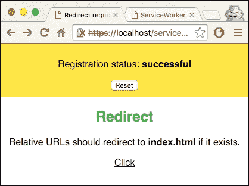

1.  现在打开开发者工具 (*Cmd* + *Alt* + *I* 或 *F12*) 并确保点击了 **Preserve log** 复选框。现在点击 **Click** 链接。页面将被重定向到 `test/` 目录下的 `index.html` 文件。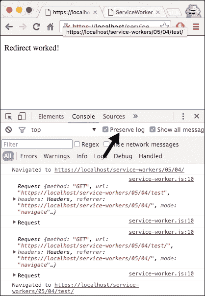

## 它是如何工作的...

在 `service-worker.js` 文件中，我们让所有 fetch 请求通过到网络：

```js
self.addEventListener('fetch', function(evt) {
  console.log(evt.request);
  evt.respondWith(
    fetch(evt.request).catch(function() {
      return new Response("FETCH: failed");
    })
  );
});
```

这样，如果 `test/index.html` 文件存在，相对 URL 将重定向到 `test/` 的 HTTP 版本。

# 设置请求头

如果我们想找出发送到网络的请求头详细信息，我们可以将请求头详细信息记录到控制台。在这个菜谱中，我们将了解如何做到这一点。

## 准备工作

要开始使用服务工作者，你需要在浏览器设置中开启服务工作者实验功能。如果你还没有这样做，请参考第一章的第一道菜谱 Chapter 1，*学习服务工作者基础*：*设置服务工作者*。服务工作者仅在 HTTPS 上运行。要了解如何设置支持此功能的发展环境，请参考以下菜谱：*设置 GitHub pages for SSL*，*设置 Windows 的 SSL* 和 *设置 Mac 的 SSL*。

## 如何操作...

按照以下说明设置你的文件结构：

1.  首先，我们必须创建一个 `index.html` 文件，如下所示：

    ```js
    <!DOCTYPE html>
    <html lang="en">
    <head>
      <meta charset="UTF-8">
      <title>Request headers</title>
      <link rel="stylesheet" href="style.css">
    </head>
    <body>
      <section id="registration-status">
        <p>Registration status: <strong id="status"></strong></p>
        <input type="button" id="resetButton" value="Reset" />
      </section>
      <script src="img/index.js"></script>
      <section>
        
      </section>
    </body>
    </html>
    ```

1.  在与 `index.html` 文件相同的文件夹中创建一个名为 `service-worker.js` 的 JavaScript 文件，并包含以下代码：

    ```js
    'use strict';

    self.addEventListener('fetch', function(evt) {
      var request = evt.request;

      console.log(
        "FETCH: ",
        evt.request.url,
        "HEADERS: ",
        new Set(request.headers)
      );

      evt.respondWith(fetch(request));
    });
    ```

1.  在与 `index.html` 文件相同的文件夹中创建一个名为 `style.css` 的 CSS 文件，并包含以下代码：

    ```js
    * {
      -webkit-box-sizing: border-box;
      -moz-box-sizing: border-box;
      box-sizing: border-box;
    }

    body {
      margin: 0 auto;
      text-align: center;
      font-family: sans-serif;
    }

    main {
      max-width: 350px;
      border: 1px solid #4CAF50;
      padding: 20px;
      border-radius: 5px;
      width: 350px;
      margin: 20px auto;
    }

    h1 {
      color: #4CAF50;
    }

    img {
      padding: 20px 0;
      max-width: 200px;
    }

    .hidden {
      display: none;
    }

    #registration-status {
      background-color: #FFE454;
      padding: 10px;
    }
    ```

1.  打开浏览器并转到 `index.html` 文件。你会看到一个预取的书签。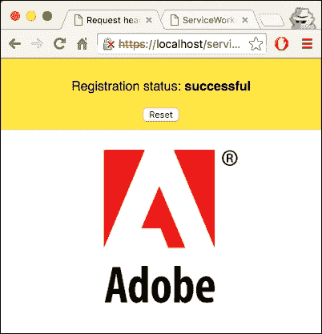

1.  现在打开开发者工具 (*Cmd* + *Alt* + *I* 或 *F12*)，并刷新页面。检查控制台上的日志详情。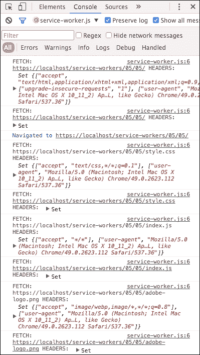

## 它是如何工作的...

在我们的 `service-worker.js` 文件中，fetch 事件处理程序记录了请求详情，以及任何请求的头部详情：

```js
caches.open(cacheName)
      .then(function(cache) {
        return cache.addAll([
          'index.html'
        ]);
      })
```

在 `index.html` 文件中，我们正在加载一个将被控制服务工作者的 fetch 事件拦截的图像。

```js
<section >
    
</section>
```

# 使服务工作者表现得像远程服务器

服务工作者不仅像我们在本章的 *选择最佳内容提供者（负载均衡器）* 菜谱中讨论的那样充当负载均衡器；它们还可以充当虚拟服务器。这允许我们将 UI 与典型的服务器端业务逻辑解耦。

在这个菜谱中，我们将学习如何将业务逻辑部分移动到响应传统 RESTful fetch 请求的服务工作者。为了演示这个功能，我们将实现一个待办事项应用。

## 准备工作

要开始使用服务工作者，你需要在浏览器设置中开启服务工作者实验功能。如果你还没有这样做，请参考第一章的第一个食谱，*学习服务工作者基础*：*设置服务工作者*。服务工作者仅在 HTTPS 上运行。要了解如何设置支持此功能的发展环境，请参考以下食谱：*设置 GitHub 页面以支持 SSL*，*设置 Windows 的 SSL*，和*设置 Mac 的 SSL*。

## 如何做...

按照以下说明设置你的文件结构：

1.  从以下位置下载所有文件：

    [`github.com/szaranger/szaranger.github.io/blob/master/service-workers/05/06/`](https://github.com/szaranger/szaranger.github.io/blob/master/service-workers/05/06/)

1.  打开浏览器并转到`index.html`文件。你会看到带有预取待办事项的待办事项应用。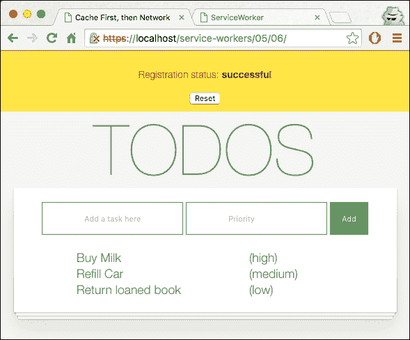

1.  现在打开开发者工具（*Cmd* + *Alt* + *I* 或 *F12*）并刷新页面。检查控制台上的日志详情。你会看到已经访问了端点。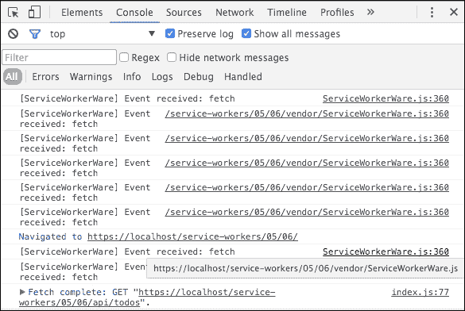

1.  你可以添加待办事项及其优先级，也可以通过点击删除图标来删除它们。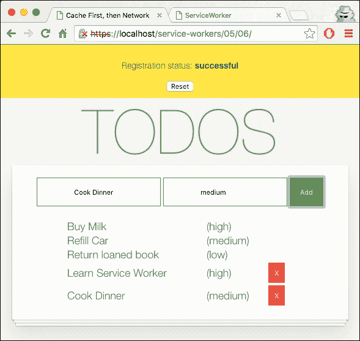

## 它是如何工作的...

我们需要实现端点以开始。在`worker.js`文件中，我们创建了一个`ServiceWorkerWare`模块的实例。然后我们声明了我们的待办事项的路由。

我们使用`self.location`确定根：

```js
root = (function() {
    var tkns = (self.location + '').split('/');
    tkns[tkns.length - 1] = '';
    return tkns.join('/');
  })();
```

获取所有待办事项：

```js
worker.get(root + 'api/todos', function(request, response) {
  return new Response(JSON.stringify(todos.filter(function(item) {
    return item !== null;
  })));
});
```

获取要删除的特定待办事项的 0 基于位置（`id`）：

```js
worker.delete(root + 'api/todos/:id', function(request, response) {
  var id = parseInt(request.parameters.id, 10) - 1;
  if (!todos[id].isSticky) {
    todos[id] = null;
  }
  return new Response({ status: 204 });
});
```

要将新的待办事项添加到集合中，请使用以下代码：

```js
worker.post(root + 'api/todos', function(request, response) {
  return request.json().then(function(quote) {
    quote.id = todos.length + 1;
    todos.push(quote);
    return new Response(JSON.stringify(quote), { status: 201 });
  });
});
```

在`index.html`文件中，我们加载了一个将被控制服务工作者的 fetch 事件拦截的图片：

```js
<section >
    
</section>
```

在我们的`service-worker.js`文件中，我们导入了一个名为`ServiceWorkerWare.js`的第三方脚本以及我们的自定义脚本`worker.js`，并声明了一个预填充待办事项的待办事项列表：

```js
importScripts('./vendor/ServiceWorkerWare.js');
importScripts('./worker.js');

var todos = [
  {
    text: 'Buy Milk',
    priority: 'high'
  },
  {
    text: 'Refill Car',
    priority: 'medium'
  },
  {
    text: 'Return loaned book',
    priority: 'low'
  }
].map(function(todo, index) {
  todo.id = index + 1;
  todo.isSticky = true;

  return todo;
});
```

`index.js`文件是我们大部分工作的地方。当服务工作者获得页面控制权时，它会显示待办事项列表：

```js
navigator.serviceWorker.oncontrollerchange = function() {
    this.controller.onstatechange = function() {
      if (this.state === 'activated') {
        loadTodos();
      }
    };
};
```

点击**+**按钮将检索待办事项并将其发送到后端：

```js
document.getElementById('add-form').onsubmit = function(event) {
```

没有提供优先级的任何待办事项都将留空：

```js
todoPriority = document.getElementById('priority').value.trim() ||
                    'Not specified';
```

最后，通过 POST 请求将待办事项发送到后端：

```js
fetch(endPoint, {
    method: 'POST',
    body: JSON.stringify(todo),
    headers: headers
  })
```

# 使服务工作者充当依赖注入器

依赖注入是一个避免为组件硬编码依赖项的绝佳模式。在这个食谱中，我们将探讨我们如何通过向组件传递两个注入器而不硬编码依赖项来使用服务工作者进行开发和生产环境。

## 准备工作

要开始使用服务工作者，您需要在浏览器设置中开启服务工作者实验功能。如果您还没有这样做，请参考第一章的第一个配方，*学习服务工作者基础*：*设置服务工作者*。服务工作者仅在 HTTPS 上运行。要了解如何设置支持此功能的发展环境，请参考以下配方：*设置 GitHub 页面以支持 SSL*，*设置 Windows 的 SSL*，和*设置 Mac 的 SSL*。

## 如何操作...

按照以下说明设置您的文件结构：

1.  从以下位置下载所有文件：

    [`github.com/szaranger/szaranger.github.io/blob/master/service-workers/05/07/`](https://github.com/szaranger/szaranger.github.io/blob/master/service-workers/05/07/)

1.  打开浏览器并转到 `index.html` 文件：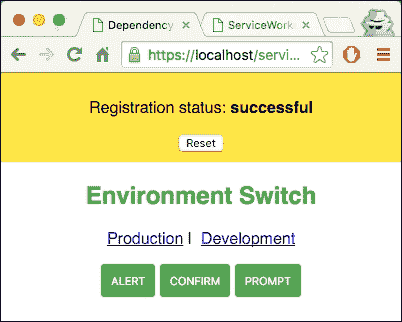

1.  点击 **生产** 链接。您将看到 URL 前添加了一个哈希，`#production`。

1.  现在点击按钮。您将得到 JavaScript 警告消息作为结果。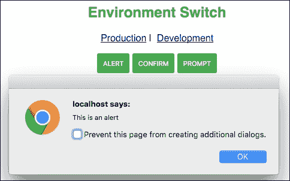

1.  打开开发者工具 (*Cmd* + *Alt* + *I* 或 *F12*)。

1.  现在点击 **开发** 按钮，然后点击按钮。检查控制台上的日志详情。您将得到控制台消息作为结果。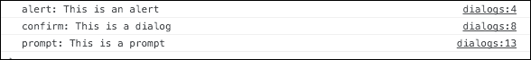

## 它是如何工作的...

我们在 `index.html` 文件中添加了一个包含两个链接和三个按钮的部分；链接用于生产和发展，按钮用于提示：

```js
<section id="actions">
      <h1>Environment Switch</h1>
      <p>
        <a href="#production">Production</a>&nbsp;|&nbsp;
        <a href="#development">Development</a>
      </p>
      <p>
        <button id="alert">Alert</button>
        <button id="confirm">Confirm</button>
        <button id="prompt">Prompt</button>
      </p>
    </section>
```

在 `index.js` 文件中，服务工作者注册处理程序被赋予即将实现的 `development-sw.js` 文件：

```js
if ('serviceWorker' in navigator) {
  navigator.serviceWorker.register(
    'development-sw.js',
    scope
  )
```

当我们点击开发或生产链接时，我们创建一个引导文件来识别位置 URL 哈希变化并执行依赖注入。

这样，通过检查 URL 的哈希，我们可以在开发和生产环境之间切换：

```js
window.onhashchange = function() {
  var newInjector = window.location.hash.substr(1) || 
  'production',
    lastInjector = getLastInjector();

  if (newInjector !== lastInjector) {
    navigator.serviceWorker.oncontrollerchange = function() {
      this.controller.onstatechange = function() {
        if (this.state === 'activated') {
          window.location.reload();
        }
      };
    };
    registerNewInjector(newInjector);
  }
};
```

现在我们强制进行初始检查：

```js
window.onhashchange();
```

根据环境类型，注册服务工作者：

```js
function registerNewInjector(newInjector) {
  var newInjectorUrl = newInjector + '-sw.js';
  return navigator.serviceWorker.register(newInjectorUrl);
}
```

如果有任何已注册的服务工作者，获取当前正在检查的注入器：

```js
    function getLastInjector() {
        var newInjector,
        ctr = navigator.serviceWorker.controller;

        if (ctr) {
            newInjector = ctr.scriptURL.endsWith('production-sw.js')
                 ? 'production' : 'development';
        }
        return newInjector;
    }
```

现在让我们看看 `injector.js` 文件。让我们让服务工作者立即控制客户端：

```js
function onInstall(evt) {
  evt.waitUntil(self.skipWaiting());
}

function onActivate(evt) {
  evt.waitUntil(self.clients.claim());
}
```

其余的代码负责检索实际和抽象资源，并根据请求相应地做出响应：

```js
function onFetch(evt) {
  var abstractRes = evt.request.url,
    actualRes = getActualRes(abstractRes);

  evt.respondWith(fetch(actualRes || abstractRes));
}

function getActualRes(abstractRes) {
  var actualRes,
    keys = Object.keys(mapping);

  for (var i = 0, len = keys.length; i < len; i++) {
    var key = keys[i];

    if (abstractRes.endsWith(key)) {
      actualRes = mapping[key];
      break;
    }
  }

  return actualRes;
}
```

`fake-dialogs.js` 文件是一个模拟实现，它将提示信息控制台输出；也就是说，它不会显示警告消息，而是记录到控制台：

```js
(function(window) {
  window.dialogs = {
    alert: function(msg) {
      console.log('alert:', msg);
    },

    confirm: function(msg) {
      console.log('confirm:', msg);
      return true;
    },

    prompt: function(msg) {
      console.log('prompt:', msg);
      return 'development';
    }
  };
})(window);
```

`real-dialogs.js` 文件则生成一个警告消息：

```js
(function(window) {
  window.dialogs = {
    alert: function(msg) {
      window.alert(msg);
    },

    confirm: function(msg) {
      return window.confirm(msg);
    },

    prompt: function(msg) {
      return window.prompt(msg);
    }
  };
})(window);
```

`production-sw.js` 文件导入默认映射以及注入器。我们还为以下事件连接了事件监听器：

```js
importScripts('injector.js');
importScripts('default-mapping.js');

self.onfetch = onFetch;
self.oninstall = onInstall;
self.onactivate = onActivate;
```

`development-sw.js` 文件导入默认映射以及注入器。但不同之处在于它覆盖了 `utils/dialogs` 以提供模拟数据：

```js
importScripts('injector.js');
importScripts('default-mapping.js');

mapping['utils/dialogs'] = 'fake-dialogs.js';

self.onfetch = onFetch;
self.oninstall = onInstall;
self.onactivate = onActivate;
```

# 强制立即控制

通常，当导航事件触发时，服务工作者会接管页面。在这个菜谱中，我们探讨的是如何在不需要等待任何类型的导航事件的情况下接管页面。

## 准备工作

要开始使用服务工作者，你需要在浏览器设置中开启服务工作者实验功能。如果你还没有这样做，请参考第一章的第一个菜谱，*学习服务工作者基础*：*设置服务工作者*。服务工作者仅在 HTTPS 上运行。要了解如何设置支持此功能的发展环境，请参考以下菜谱：*设置 GitHub 页面以支持 SSL*，*为 Windows 设置 SSL*，和*为 Mac 设置 SSL*。

## 如何操作...

按照以下说明设置你的文件结构：

1.  从以下位置下载所有文件：

    [`github.com/szaranger/szaranger.github.io/blob/master/service-workers/05/08/`](https://github.com/szaranger/szaranger.github.io/blob/master/service-workers/05/08/)

1.  打开浏览器并访问`index.html`文件。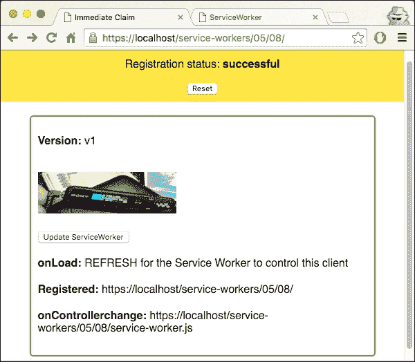

1.  现在刷新页面。你会看到没有注册，也没有触发控制器更改事件。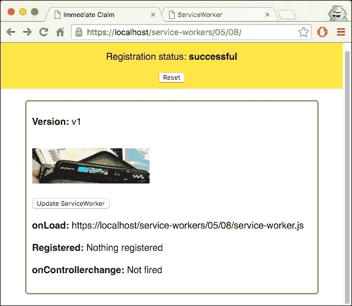

1.  打开开发者工具 (*Cmd* + *Alt* + *I* 或 *F12*) 并刷新页面。检查控制台上的日志详情。你会看到图片是从缓存中提供的。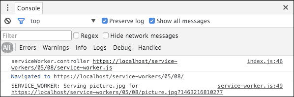

## 工作原理...

在`index.js`文件中，`fetchServiceWorkerUpdate`方法更新图片和当前版本：

```js
function fetchServiceWorkerUpdate() {
  var img = document.getElementById('picture');
  img.src = 'picture.jpg?' + Date.now();

  fetch('./version').then(function(res) {
    return res.text();
  }).then(function(text) {
    debug(text, 'version');
  });
}
```

服务工作者在页面加载时接管网站并处理离线回退：

```js
if (navigator.serviceWorker.controller) {
  var url = navigator.serviceWorker.controller.scriptURL;
  console.log('serviceWorker.controller', url);
  debug(url, 'onload');
  fetchServiceWorkerUpdate();
} else {
  navigator.serviceWorker.register('service-worker.js', {
    scope: './'
  }).then(function(registration) {
    debug('REFRESH for the Service Worker to control this client', 'onload');
    debug(registration.scope, 'register');
  });
}
```

`skipWaiting()`方法将通过触发`onactivate`事件强制等待中的服务工作者变为活跃状态。结合`Clients.claim()`，这将允许服务工作者立即在客户端生效：

```js
    }).then(function() {
      console.log('SERVICE_WORKER: Skip waiting on install');
      return self.skipWaiting();
    })
```

通常，`onactivate`方法在工作者安装并刷新页面后调用一次。然而，由于我们在`oninstall`点调用`skipWaiting()`，`onactivate`方法立即被调用：

```js
self.addEventListener('activate', function(evt) {
  self.clients.matchAll({
    includeUncontrolled: true
  }).then(function(clientList) {
    var urls = clientList.map(function(client) {
      return client.url;
    });
    console.log('SERVICE_WORKER:  Matching clients:', urls.join(', '));
  });

  evt.waitUntil(
    caches.keys().then(function(cacheNames) {
      return Promise.all(
        cacheNames.map(function(cacheName) {
          if (cacheName !== VERSION) {
            console.log('SERVICE_WORKER: Deleting old cache:', cacheName);
            return caches.delete(cacheName);
          }
        })
      );
    }).then(function() {
      console.log('SERVICE_WORKER: Claiming clients for version', VERSION);
      return self.clients.claim();
    })
  );
});
```

# 实现回退响应

通常，你可以信任你的应用程序连接到的 API 端点，但总有可能那些服务会中断。在这种情况下有一个备用计划是好的。在这个菜谱中，我们将使用服务工作者在这种情况下提供回退响应。

## 准备工作

要开始使用服务工作者，你需要在浏览器设置中开启服务工作者实验功能。如果你还没有这样做，请参考第一章的第一个菜谱，*学习服务工作者基础*：*设置服务工作者*。服务工作者仅在 HTTPS 上运行。要了解如何设置支持此功能的发展环境，请参考以下菜谱：*设置 GitHub 页面以支持 SSL*，*设置 Windows 的 SSL*，和*设置 Mac 的 SSL*。

## 如何操作...

按照以下说明设置你的文件结构：

1.  从以下位置下载所有文件：

    [`github.com/szaranger/szaranger.github.io/blob/master/service-workers/05/09/`](https://github.com/szaranger/szaranger.github.io/blob/master/service-workers/05/09/)

1.  打开浏览器并转到`index.html`文件。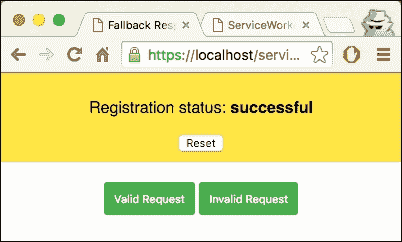

1.  点击**有效请求**按钮。你将看到三个品牌的列表。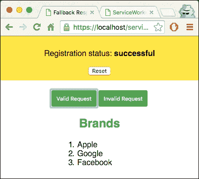

1.  现在点击**无效请求**按钮。你将看到三个品牌的列表。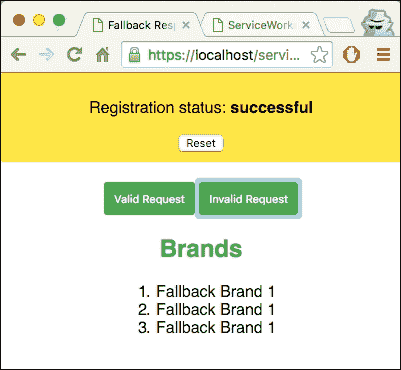

1.  打开开发者工具（*Cmd* + *Alt* + *I* 或 *F12*）并刷新页面。检查控制台上的日志详情。你将看到后备响应在起作用。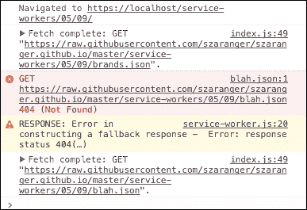

## 它是如何工作的...

我们在`index.html`文件中添加了一个包含两个按钮的部分，一个用于有效请求，另一个用于无效请求：

```js
<section id="actions">
    <button id="valid-call" disabled>Valid Request</button>
    <button id="invalid-call" disabled>Invalid Request</button>
    <div id="output"></div>
</section>
```

在`index.js`文件中，`enableRequestLinks`方法将按钮的事件处理程序连接起来。这两个处理程序都会以链接作为参数触发`fetchApiRequest`方法：

```js
function enableRequestLinks() {
  var validButton = document.querySelector('#valid-call');
  validButton.addEventListener('click', function() {
    fetchApiRequest('https://raw.githubusercontent.com/szaranger/szaranger.github.io/master/service-workers/05/09/brands.json');
  });
  validButton.disabled = false;

  var invalidButton = document.querySelector('#invalid-call');
  invalidButton.addEventListener('click', function() {
    fetchApiRequest('https://raw.githubusercontent.com/szaranger/szaranger.github.io/master/service-workers/05/09/blah.json');
  });
  invalidButton.disabled = false;
}
```

我们在这个菜谱中为此准备了一个模拟 API 响应，位置如下：

[`github.com/szaranger/szaranger.github.io/blob/master/service-workers/05/09/brands.json`](https://github.com/szaranger/szaranger.github.io/blob/master/service-workers/05/09/brands.json)

这是一个简单的 JSON 对象，包含少量品牌名称：

```js
{
    "brands": [
        {
          "name": "Apple"
        },
        {
          "name": "Google"
        },
        {
          "name": "Facebook"
        }
    ]
}
```

`fetchApiRequest`方法调用 fetch 以获取一个返回结果的承诺。我们将使用响应来构建我们需要的列表：

```js
function fetchApiRequest(url) {
  fetch(url).then(function(res) {
    return res.json();
  }).then(function(res) {
    var brands = res.brands.map(function(brand) {
      return '<li>' + brand.name + '</li>';
    }).join('');

    brands = '<ol>' + brands+ '</ol>';

    document.querySelector('#output').innerHTML = '<h1>Brands</h1>' + brands;
  });
}
```

服务工作者是我们实现 API 不可用时的后备响应的地方。但首先，我们需要告诉服务工作者立即接管页面：

```js
    self.addEventListener('install', function(evt) {
      evt.waitUntil(self.skipWaiting());
    });

   self.addEventListener('activate', function(evt) {
      evt.waitUntil(self.clients.claim());
   });
```

在 fetch 处理程序中，我们检查响应以确定它是否成功，通过检查`res.ok`。否则，我们将动态构建一个响应作为后备：

```js
self.addEventListener('fetch', function(evt) {
    evt.respondWith(
      fetch(evt.request).then(function(res) {
        if (!res.ok) {
          throw Error('response status ' + res.status);
        }

        return res;
      }).catch(function(err) {
        console.warn('RESPONSE: Error in constructing a fallback response - ', err);

        var fallbackRes = {
          brands: [
            {
              name: 'Fallback Brand 1'
            },
            {
              name: 'Fallback Brand 1'
            },
            {
              name: 'Fallback Brand 1'
            }
          ]
        };

        return new Response(JSON.stringify(fallbackRes), {
          headers: {'Content-Type': 'application/json'}
        });
      })
    );
});
```

# 延迟离线请求

如 Gmail 之类的应用程序可以在网络不可用时在缓冲区中排队请求。当连接恢复时，它将按顺序执行请求以完成操作。

在这个菜谱中，我们正在构建一个可以在离线时延迟待办事项的应用程序。

## 准备工作

要开始使用服务工作者，你需要在浏览器设置中开启服务工作者实验功能。如果你还没有这样做，请参考第一章的第一个食谱，*学习服务工作者基础*：*设置服务工作者*。服务工作者仅在 HTTPS 上运行。要了解如何设置开发环境以支持此功能，请参考以下食谱：*设置 GitHub 页面以支持 SSL*，*设置 Windows 的 SSL*，和*设置 Mac 的 SSL*。

## 如何操作...

按照以下说明设置你的文件结构：

1.  从以下位置下载所有文件：

    [`github.com/szaranger/szaranger.github.io/blob/master/service-workers/05/10`](https://github.com/szaranger/szaranger.github.io/blob/master/service-workers/05/10)

1.  打开浏览器并转到`index.html`文件。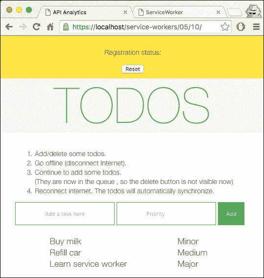

1.  添加和删除待办事项，然后按照指示离线。一旦重新连接，待办事项将自动同步。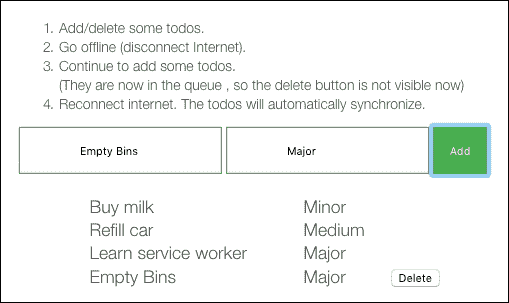

## 它是如何工作的...

我们正在向`index.html`文件添加一个包含输入和按钮的部分：

```js
<section id="todo-area">
    <ol>
      <li>Add/delete some todos.</li>
      <li>Go offline (disconnect Internet).</li>
      <li>Continue to add some todos. <br/>(They are now in the queue, so the delete button is not visible now)</li>
      <li>Reconnect internet. The todos will automatically synchronize.</li>
    </ol>
    <form id="add-form">
      <input type="text" id="new-todo" placeholder="Add a task here"/>
      <input type="text" id="priority" placeholder="Priority"/>
      <input type="submit" value="Add" />
    </form>
    <table id="todos">
    </table>
  </section>
```

在`service-worker.js`文件中，我们引入了两个第三方库，`ServiceWorkerWare.js`和`localforage.js`：

```js
importScripts('./vendor/ServiceWorkerWare.js');
importScripts('./vendor/localforage.js');
```

确定路由的根：

```js
var root = (function() {
  var tokens = (self.location + '').split('/');
  tokens[tokens.length - 1] = '';
  return tokens.join('/');
})();
```

我们正在使用 Mozilla 的`ServiceWorkerWare`库为虚拟服务器构建快速路由：

```js
var worker = new ServiceWorkerWare();
```

为了模拟响应，我们将原始请求入队：

```js
    function tryOrFallback(fakeResponse) { 
      return function(req, res) {
        if (!navigator.onLine) {
          console.log('No network availability, enqueuing');
          return enqueue(req).then(function() {
        return fakeResponse.clone();
      });
    }
```

## 相关内容

+   第六章的*日志 API 分析*食谱，*使用高级库*
