# 第六章。使用高级库

本章将涵盖以下主题：

+   与全局 API 协同工作

+   实现电路断路器

+   实现死信队列

+   记录 API 分析

+   与 Google Analytics 协同工作

# 简介

在本章中，你将了解一些可用于与服务工作者接口的高级库。这些主题将非常实用，你将在实际软件开发中使用高级库。我们还将学习一些高级主题，例如电路断路器和死信队列，这些可能在日常编程中不会遇到，但却是新学的知识。

让我们从查看服务工作者可用的全局 API 开始这一章。

# 与全局 API 协同工作

服务工作者可以访问一些非常实用的全局 API 方法。让我们看看其中的一些方法；你可能觉得它们很有用，并且可以在你的项目中使用。这些全局 API 方法包括`Cache`、`caches`、`getAll`、`Request`、`Response`和`fetch`。

## 准备工作

要开始使用服务工作者，你需要在浏览器设置中开启服务工作者实验功能。如果你还没有这样做，请参考第一章的第一个菜谱，*学习服务工作者基础*：*设置服务工作者*。服务工作者仅在 HTTPS 上运行。要了解如何设置支持此功能的发展环境，请参考第一章的以下菜谱，*学习服务工作者基础*：*设置 GitHub 页面以支持 SSL*、*在 Windows 上设置 SSL*和*在 Mac 上设置 SSL*。

## 如何操作...

按照以下说明设置你的文件结构：

1.  从以下位置复制`index.html`、`index.js`、`service-worker.js`和`style.css`文件：

    [`github.com/szaranger/szaranger.github.io/blob/master/service-workers/06/01/`](https://github.com/szaranger/szaranger.github.io/blob/master/service-workers/06/01/)

1.  打开浏览器并转到`index.html`：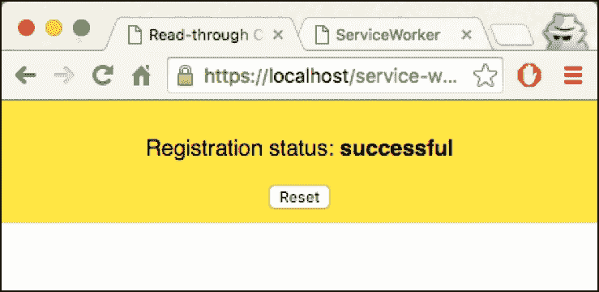

1.  打开开发者工具栏（*Cmd* + *Alt* + *I* 或 *F12*）。现在刷新页面，查看控制台中的消息。你将看到全局 API 函数已记录到控制台：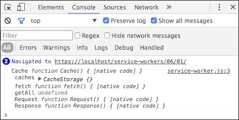

## 的工作原理...

我们只是将可用的服务工作者 API 打印到控制台。我们的`service-worker.js`文件如下所示：

```js
'use strict';

console.log(
  'Cache', this.Cache, '\n',
  'caches', this.caches,'\n',
  'fetch', this.fetch,'\n',
  'getAll', this.getAll,'\n',
  'Request', this.Request,'\n',
  'Response', this.Response
);
```

让我们更详细地讨论一些这些 API 方法。

### 缓存

`Cache`接口对服务工作者和窗口作用域都可用。其主要目的是为缓存的`Request`和`Response`对象对提供存储机制。

### caches

服务工作者使用`CacheStorage`对象将资产离线存储，该对象由`window.caches`只读属性启用。

### fetch

全局 `fetch` 在网络中执行异步获取。

### getAll

这是 Chromium 命令 API 的一部分。它作为参数传递给 `Promise.then()`。

# 实现断路器

假设你运行的应用程序每 5 秒轮询一个 API，但出于某种原因，服务中断了，你继续轮询并得到超时。你需要快速而优雅地处理错误。断路器模式检测故障并防止你的应用程序执行注定要失败的操作。

在这个菜谱中，我们将探讨如何使用服务工作者实现断路器库。

## 准备工作

要开始使用服务工作者，你需要在浏览器设置中开启服务工作者实验功能。如果你还没有这样做，请参考第一章的第一个菜谱，*学习服务工作者基础*：*设置服务工作者*。服务工作者仅在 HTTPS 上运行。要了解如何设置支持此功能的发展环境，请参考第一章的以下菜谱，*学习服务工作者基础*：*设置 GitHub 页面以支持 SSL*，*在 Windows 上设置 SSL*，和*在 Mac 上设置 SSL*。

## 如何做到这一点...

按照以下说明设置你的文件结构：

1.  从以下位置下载所有文件：

    [`github.com/szaranger/szaranger.github.io/blob/master/service-workers/06/02/`](https://github.com/szaranger/szaranger.github.io/blob/master/service-workers/06/02/)

1.  打开浏览器并转到 `index.html` 文件：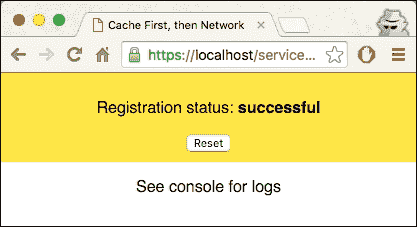

1.  现在打开开发者工具 (*Cmd* + *Alt* + *I* 或 *F12*) 并确保点击了 **Preserve log** 复选框。现在刷新页面，你将看到断路器的日志消息：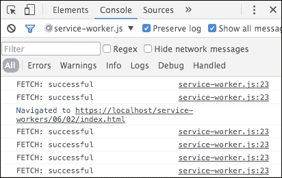

## 如何工作...

在查看实现之前，让我们尝试理解断路器是如何工作的。

断路器监控故障。每当故障达到阈值时，断路器跳闸，任何对断路器的调用都将返回错误。在适当的间隔后，如果错误不再发生，断路器将重置断路器。

如您所见，我们需要两个阈值来处理错误和在一定时间后重置断路器：

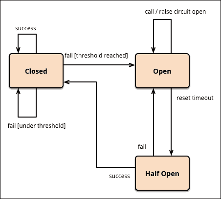

图片来源：[`martinfowler.com`](http://martinfowler.com)

我们的大部分工作将在 `circuit-breaker.js` 文件中完成。如果你想了解更多关于断路器的信息，请点击此链接：

[`martinfowler.com/bliki/CircuitBreaker.html`](http://martinfowler.com/bliki/CircuitBreaker.html)

首先，我们需要配置断路器。让我们创建 10 个块，每个块的超时时间为 3 秒，阈值为五个。我们还定义错误阈值为百分之五十：

```js
var TEN_SECONDS = 10000,
    TEN_BLOCKS = 10,
    THREE_SECONDS = 3000,
    FIFTY_PERCENT = 50,
    FIVE = 5;

  var CB = function(opts) {
    opts = opts || {};

    this.errorThreshold = opts.errorThreshold || FIFTY_PERCENT;
    this.numBlocks = opts.numBlocks || TEN_BLOCKS;
    this.timeoutDuration = opts.timeoutDuration || THREE_SECONDS;
    this.volumeThreshold = opts.volumeThreshold || FIVE;
    this.windowDuration = opts.windowDuration || TEN_SECONDS;

    this.hanldeCircuitOpen = opts.hanldeCircuitOpen || function() {};
    this.handleCircuitClose = opts.handleCircuitClose || function() {};

    this.$buckets = [this.$createBlock()];
    this.$state = CB.CLOSED;

    this.$startTicker();
  };
```

我们然后定义`run`方法如下：

```js
CB.prototype.run = function(command, fallback) {
    if (this.isOpen()) {
      this.$executeFallback(fallback || function() {});
    } else {
      this.$execCmd(command);
    }
  };
```

如果电路开启，此方法将执行作为参数传入的回退函数。否则，它将执行命令。在`service-worker.js`文件中，我们将`fetch`请求作为`run`方法的回退函数传入：

```js
CircuitBreaker.prototype.fetch = function(request) {
    var unavailableRes = Response.error();

    return new Promise(function(resolve, reject) {
        this.run(function(success, fail) {
            fetch(request).then(function(res) {
                if(res.status < 400) {
                    success();
                    console.log('FETCH: successful');
                } else {
                    fail();
                    console.log('FETCH: failed');
                }
                resolve(res);
            }).catch(function(err) {
                fail();
                reject(unavailableRes);
                console.log('FETCH: unavailable');
            });
        }, function() {
            resolve(unavailableRes);
        });
    }.bind(this));
};
```

`forceClose`、`forceOpen`和`unforce`方法相应地改变状态：

```js
  CB.prototype.forceClose = function() {
    this.$forced = this.$state;
    this.$state = CB.CLOSED;
  };

  CB.prototype.forceOpen = function() {
    this.$forced = this.$state;
    this.$state = CB.OPEN;
  };

  CB.prototype.unforce = function() {
    this.$state = this.$forced;
    this.$forced = null;
  };
```

`isOpen`函数返回一个值，表示电路是开启还是关闭：

```js
    CB.prototype.isOpen = function() {
        return this.$state === CB.OPEN;
    };
```

首先查询缓存；如果请求不匹配，将请求发送到网络：

```js
self.onfetch = function(evt) {
  evt.respondWith(openCache().then(function(cache) {
    var request = evt.request;

    return cache.match(request).then(function(res) {
      return res || fetch(request);
    });
  }));
};
```

我们用`$`前缀表示我们的私有函数。`$startTicker`函数为我们启动计时器：

```js
CB.prototype.$startTicker = function() {
    var me = this,
      bucketIndex = 0,
      bucketDuration = this.windowDuration / this.numBlocks;

    var tick = function() {
      if (me.$buckets.length > me.numBlocks) {
        me.$buckets.shift();
      }

      bucketIndex++;

      if (bucketIndex > me.numBlocks) {
        bucketIndex = 0;

        if (me.isOpen()) {
          me.$state = CB.HALF_OPEN;
        }
      }

      me.$buckets.push(me.$createBlock());
    };

    setInterval(tick, bucketDuration);
};
```

`$createBlock`函数给我们提供了一个新的块来工作，而`$lastBlock`函数则如预期地给出了最后一个块：

```js
  CB.prototype.$createBlock = function() {
    return {
      successes: 0,
      failures: 0,
      shortCircuits: 0,
      timeouts: 0
    };
  };

  CB.prototype.$lastBlock = function() {
    var numBlocks = this.$buckets.length,
      lastBlock = this.$buckets[numBlocks - 1];

    return lastBlock;
  };
```

`$execCmd`方法通过增加成功和失败次数来更新状态：

```js
  CB.prototype.$execCmd = function(command) {
    var me = this,
      increment,
      timeout;

    increment = function(prop) {
      return function() {
        var bucket;

        if (!timeout) {
          return;
        }

        bucket = me.$lastBlock();
        bucket[prop]++;

        if (me.$forced === null) {
          me.$updateState();
        }

        clearTimeout(timeout);
        timeout = null;
      };
    };

    timeout = setTimeout(increment('timeouts'), this.timeoutDuration);

    command(increment('successes'), increment('failures'));
  };
```

`$executeFallback`函数运行我们之前讨论过的回退方法：

```js
CB.prototype.$executeFallback = function(fallback) {
    var bucket;

    fallback();

    bucket = this.$lastBlock();
    bucket.shortCircuits++;
};
```

`$calcMetrics`函数返回错误总数以及成功次数：

```js
CB.prototype.$calcMetrics = function() {
    var totalCount = 0,
      totalErrors = 0,
      errorPerc = 0,
      bucket,
      errors,
      i;

    for (i = 0, len = this.$buckets.length; i < len; i++) {
      bucket = this.$buckets[i];
      errors = (bucket.failures + bucket.timeouts);

      totalErrors += errors;
      totalCount += (errors + bucket.successes);
    }

    errorPerc = (totalErrors / (totalCount > 0 ? totalCount : 1)) * 100;

    return {
      totalErrors: totalErrors,
      errorPerc: errorPerc,
      totalCount: totalCount
    };
};
```

`$updateState`方法在一系列计算后更新状态：

```js
CB.prototype.$updateState = function() {
    var metrics = this.$calcMetrics();

    if (this.$state == CB.HALF_OPEN) {
      var lastCmdFailed = !this.$lastBlock().successes && metrics.totalErrors > 0;

      if (lastCmdFailed) {
        this.$state = CB.OPEN;
      } else {
        this.$state = CB.CLOSED;
        this.handleCircuitClose(metrics);
      }
    } else {
      var overErrorThreshold = metrics.errorPerc > this.errorThreshold,
        overVolumeThreshold = metrics.totalCount > this.volumeThreshold,
        overThreshold = overVolumeThreshold && overErrorThreshold;

      if (overThreshold) {
        this.$state = CB.OPEN;
        this.hanldeCircuitOpen(metrics);
      }
    }
};
```

在我们的`service-worker.js`文件中，我们通过传递 fetch 请求通过 circuitBreaker 对象来使用我们的断路器库：

```js
self.addEventListener('fetch', function(evt) {
    var url = evt.request.url;

    if(!circuitBreakers[url]) {
        circuitBreakers[url] = new CircuitBreaker(opt);
    }

    evt.respondWith(circuitBreakers[url].fetch(evt.request));
});
```

# 实现死信队列

死信队列是由于以下一个或多个原因系统生成的队列：存储无法投递的消息、队列长度限制超出、消息长度限制超出或消息被另一个队列交换拒绝。

在这个食谱中，我们正在服务工作者中实现死信队列。

## 准备中

要开始使用服务工作者，你需要在浏览器设置中开启服务工作者实验功能。如果你还没有这样做，请参考第一章的第一个食谱，*学习服务工作者基础*：*设置服务工作者*。服务工作者仅在 HTTPS 上运行。要了解如何设置支持此功能的发展环境，请参考以下食谱：*设置 GitHub 页面以支持 SSL*、*设置 Windows 的 SSL*和*设置 Mac 的 SSL*。

## 如何操作...

按照以下说明设置你的文件结构：

1.  从以下位置下载所有文件：

    [`github.com/szaranger/szaranger.github.io/blob/master/service-workers/06/03/`](https://github.com/szaranger/szaranger.github.io/blob/master/service-workers/06/03/)

1.  打开浏览器并转到`index.html`：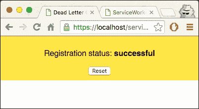

1.  现在打开开发者工具（*Cmd* + *Alt* + *I* 或 *F12*）并确保点击了**保留日志**复选框。

1.  在**网络**选项卡上选择**离线**选项：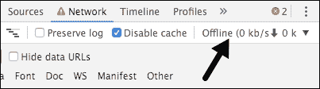

1.  现在刷新页面，你会看到失败请求的消息，这些消息被我们实现的死信队列排队：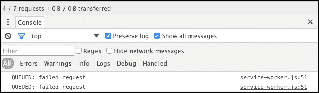

## 它是如何工作的...

服务工作者安装事件处理程序将我们传递到 `service-worker.js` 文件中的 `addAll` 方法的文件缓存起来：

```js
self.addEventListener('install', function(evt) {
  evt.waitUntil(
    caches.open(cacheName)
      .then(function(cache) {
        return cache.addAll([
          'style.css',
          'index.html',
          'index.js',
          'style.css'
        ]);
      })
      .then(function() {
        return self.skipWaiting();
      })
  );
});
```

当我们在网络上请求文件时，`fetch` 事件处理程序会查询缓存以确定请求是否匹配，如果匹配，则从缓存中提供它们：

```js
self.addEventListener('fetch', function(evt) {
    evt.respondWith(
        caches.match(evt.request)
          .then(function(res) {
            if(res.status >= 500) {
                console.log('RESPONSE: error');
                return Response.error();
            } else {
                console.log('RESPONSE: success');
                replayQueuedRequests();
                return res;
            }
        }).catch(function() {
            queueFailedRequest(evt.request);
        })
    );
});
```

此外，如果响应成功，则调用 `replayQueuedRequests()` 来运行队列中的任何挂起请求：

```js
function replayQueuedRequests() {
    Object.keys(queue).forEach(function(evt) {
        fetch(queue[evt]).then(function(){
            if(res.status >= 500) {
                console.log('RESPONSE: error');
                return Response.error();
            }
            console.log('DELETE: queue');
            delete queue[error];
        }).catch(function() {
            if (Date.now() - evt > expiration) {
                delete queue[error];
                console.log('DELETE: queue');
            }
        });
    });
} 
```

如果获取失败，我们将请求排队：

```js
function queueFailedRequest(request) {
    queue[Date.now()] = request.url;
    console.log('QUEUED: failed request');
} 
```

# 记录 API 分析

如果你被要求为现有应用程序实现 API 日志记录，你的方法会是什么？最常见的方法是更改客户端代码或服务器端代码，或者两者都更改。

通过使用服务工作者，我们可以拦截客户端请求并收集信息，然后将它们发送到日志 API。

## 准备工作

要开始使用服务工作者，你需要在浏览器设置中开启服务工作者实验功能。如果你还没有这样做，请参考第一章的第一道菜谱，*学习服务工作者基础*：*设置服务工作者*。服务工作者仅在 HTTPS 上运行。要了解如何设置支持此功能的发展环境，请参考以下菜谱：*设置 GitHub pages for SSL*，*设置 Windows 的 SSL* 和 *设置 Mac 的 SSL*。

## 如何操作...

按照以下说明设置你的文件结构：

1.  从以下位置下载所有文件：

    [`github.com/szaranger/szaranger.github.io/blob/master/service-workers/06/04/`](https://github.com/szaranger/szaranger.github.io/blob/master/service-workers/06/04/)

1.  在命令行上运行 `npm install`：

    ```js
    npm install

    ```

1.  在命令行上运行 `npm start`：

    ```js
    npm start

    ```

1.  打开浏览器并转到 `index.html` 文件：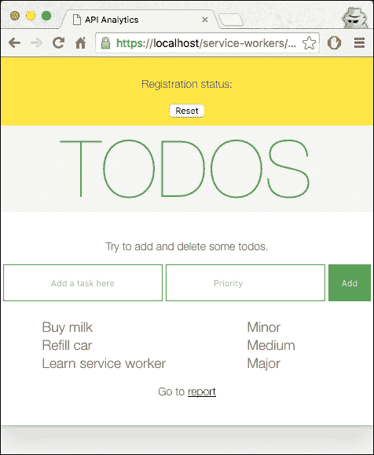

1.  添加任务和优先级：

1.  现在通过点击 **报告** 链接转到报告页面：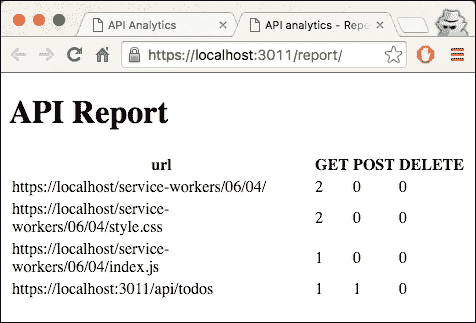

## 它是如何工作的...

在 `index.html` 文件中，我们添加了一个带有表单的章节：

```js
<section id="todo-area">
    <p>Try to add and delete some todos.</p>
    <form id="add-form">
      <input type="text" id="new-todo" placeholder="Add a task here"/>
      <input type="text" id="priority" placeholder="Priority"/>
      <input type="submit" value="Add" />
    </form>
    <table id="todos">
    </table>
    <p>Go to <a href="https://localhost:3011/report/" target="_blank">report</a></p>
  </section>
```

在 `service-worker.js` 文件中，每次发起获取请求时，我们都会记录它：

```js
self.onfetch = function(evt) {
  evt.respondWith(
    logRequest(evt.request).then(fetch)
  );
};

function logRequest(req) {
  var retRequest = function() {
    return req;
  };

  var data = {
    method: req.method,
    url: req.url
  };

  return fetch(URL, {
    method: 'POST',
    body: JSON.stringify(data),
    headers: { 'content-type': 'application/json' }
  }).then(retRequest, retRequest);
}
```

`index.js` 文件包含添加和删除待办事项的逻辑。我们首先在注册点显示待办事项列表：

```js
navigator.serviceWorker.oncontrollerchange = function() {
    this.controller.onstatechange = function() {
      if (this.state === 'activated') {
        loadTodos();
      }
    };
};
```

通过点击添加按钮，创建一个新的待办事项并将其发送到服务器：

```js
document.querySelector('#add-form').onsubmit = function(event) {
```

如果提供了待办事项，则跳过。如果没有提供优先级，则默认为 `次要`：

```js
if (!newTodo) {
    return;
   }

priority = document.querySelector('#priority').value.trim()
                    || 'Minor';
```

我们随后发送 API 请求，一个待办事项集合的 `POST` 请求：

```js
fetch(URL, {
    method: 'POST',
    body: JSON.stringify(todo),
    headers: headers,
  }).then(function(response) {
      return response.json();
    }).then(function(addedTodo) {
      document.querySelector('#todos').appendChild(getRowFor(addedTodo));
    });
};
```

为了检索待办事项集合，我们使用 `GET` 方法发起一个获取请求：

```js
function loadTodos() {
  fetch(URL).then(function(res) {
      return res.json();
    }).then(showTodos);
}
```

然后我们填充待办事项表：

```js
function showTodos(items) {
  var table = document.querySelector('#todos');

  table.innerHTML = '';
  for (var i = 0, len = items.length, todo; i < len; i++) {
    todo = items[i];
    table.appendChild(getRowFor(todo));
  }

  if (window.parent !== window) {
    window.parent.document.body.dispatchEvent(new CustomEvent('iframeresize'));
  }
}
```

一个函数对于创建表格行很有用：

```js
function getRowFor(todo) {
  var tr = document.createElement('TR'),
    id = todo.id;

  tr.id = id;

  tr.appendChild(getCell(todo.todo));
  tr.appendChild(getCell(todo.priority));
  tr.appendChild(todo.isSticky ? getCell('') : getDeleteButton(id));

  return tr;
}
```

为表格数据构建一个辅助函数：

```js
function getCell(todo) {
  var td = document.createElement('TD');

  td.textContent = todo;
  return td;
}
```

构建删除按钮：

```js
function getDeleteButton(id) {
  var td = document.createElement('TD'),
    btn = document.createElement('BUTTON');

  btn.textContent = 'Delete';
  btn.onclick = function() {
    deleteTodo(id).then(function() {
      var tr = document.getElementById(id);
      tr.parentNode.removeChild(tr);
    });
  };

  td.appendChild(btn);
  return td;
}
```

发起删除待办事项的 `DELETE` 请求：

```js
function deleteTodo(id) {
  return fetch(URL + '/' + id, { method: 'DELETE' });
}
```

`server.js` 文件包含两个 API，其中一个用于待办事项管理，另一个用于日志。

我们提供了一套默认的待办事项以开始。这些待办事项将作为示例出现在我们的列表顶部。

```js
var todos = [
  {
    todo: 'Buy milk',
    priority: 'Minor'
  },
  {
    todo: 'Refill car',
    priority: 'Medium'
  },
  {
    todo: 'Learn service worker',
    priority: 'Major'
  }
].map(function(todo, index) {
  todo.id = index + 1;
  todo.isSticky = true;

  return todo;
});
```

粘性标志将确保这些待办事项不可删除。

REST API 端点将管理添加和删除待办事项以及日志的请求：

```js
app.get('/report', function(req, res) {
  var stats = getLogSummary();
  var buffer = report({ stats: stats });
  res.send(buffer);
});

app.post('/report/logs', function(req, res) {
  var logEntry = logRequest(req.body);
  res.status(201).json(logEntry);
});

app.get('/api/todos', function(req, res) {
  res.json(todos.filter(function(item) {
    return item !== null;
  }));
});

app.get('/api/todos', function(req, res) {
  res.json(todos.filter(function(item) {
    return item !== null;
  }));
});

app.delete('/api/todos/:id', function(req, res) {
  var id = parseInt(req.params.id, 10) - 1;
  if (!todos[id].isSticky) {
    todos[id] = null;
  }
  res.sendStatus(204);
});

app.post('/api/todos', function(req, res) {
  var todo = req.body;
  todo.id = todos.length + 1;
  todos.push(todo);
  res.status(201).json(todo);
});
```

我们为`GET`、`DELETE`和`POST`请求创建一个用于日志报告的聚合函数：

```js
function getLogSummary() {
  var aggr = requestsLog.reduce(function(subSummary, entry) {
    if (!(entry.url in subSummary)) {
      subSummary[entry.url] = {
        url: entry.url,
        GET: 0,
        POST: 0,
        DELETE: 0,
      };
    }
    subSummary[entry.url][entry.method]++;
    return subSummary;
  }, {});

  return Object.keys(aggr).map(function(url) {
    return aggr[url];
  });
}
```

在`report.html`文件中，我们有一个用于渲染日志数据的模板。我们在服务器端使用 SWIG 来渲染此模板：

```js
<table id="todos">
    <tr>
      <th>url</th>
      <th>GET</th>
      <th>POST</th>
      <th>DELETE</th>
    </tr>
    
    <tr>
      <td>{{ entry.url }}</td>
      <td class="counter">{{ entry.GET }}</td>
      <td class="counter">{{ entry.POST }}</td>
      <td class="counter">{{ entry.DELETE }}</td>
    </tr>
    
  </table>
```

# 与 Google Analytics 协作

Google Analytics 是今天广泛使用的工具，大多数网站都使用它来收集访客的各种数据。在本菜谱中，我们将探讨在实现 Google Analytics 时如何从服务工作者中获益。

## 准备工作

要开始使用服务工作者，您需要在浏览器设置中开启服务工作者实验功能。如果您还没有这样做，请参阅第一章的第一个菜谱，*学习服务工作者基础*：*设置服务工作者*。服务工作者仅在 HTTPS 上运行。要了解如何设置支持此功能的发展环境，请参阅以下菜谱：*设置 GitHub 页面以支持 SSL*、*设置 Windows 的 SSL*和*设置 Mac 的 SSL*。

## 如何操作...

按照以下说明设置您的文件结构：

1.  从以下位置下载所有文件：

    [`github.com/szaranger/szaranger.github.io/blob/master/service-workers/06/05/`](https://github.com/szaranger/szaranger.github.io/blob/master/service-workers/06/05/)

1.  打开浏览器并转到`index.html`文件：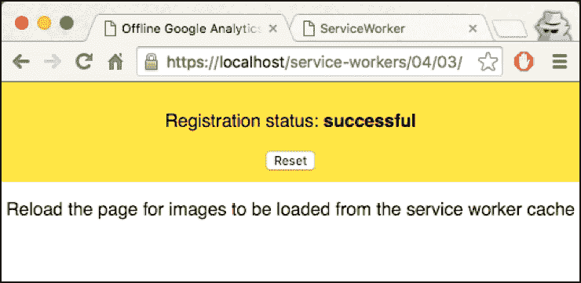

1.  现在打开开发者工具（*Cmd* + *Alt* + *I* 或 *F12*），并转到**网络**选项卡。您将看到/collect 请求的**状态**为 200，这意味着它们已成功：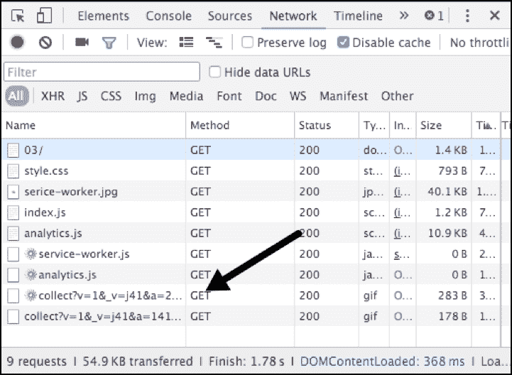

1.  刷新页面。您将看到以下屏幕：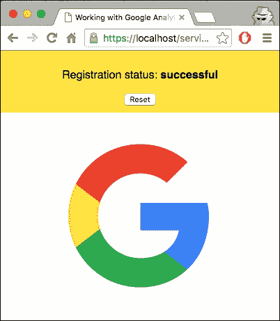

1.  转到开发者工具的**控制台**选项卡：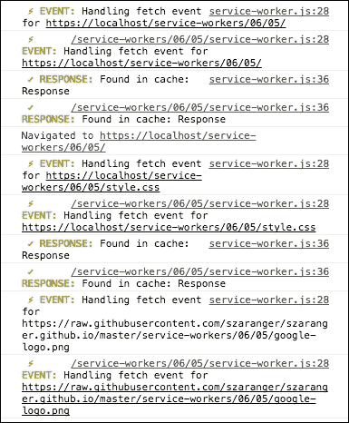

## 工作原理...

在`service-worker.js`文件中，在激活点，`caches.delete(cacheName)`将通过检查缓存名称来查找并删除冗余的过时缓存：

```js
var version = 1,
  currentCaches = {
    'google-analytics': 'google-analytics-v' + version
  };

self.addEventListener('activate', function(event) {
  var cacheNamesExpected = Object.keys(currentCaches).map(function(key) {
    return currentCaches[key];
  });

  event.waitUntil(
    caches.keys().then(function(cacheNames) {
      return Promise.all(
        cacheNames.map(function(cacheName) {
          if (cacheNamesExpected.indexOf(cacheName) === -1) {
            console.log('DELETE: Out of date cache:', cacheName);
            return caches.delete(cacheName);
          }
        })
      );
    })
  );
});
```

服务工作者将缓存初始请求；对同一资源的后续请求将由服务工作者的`fetch()`事件处理器处理。`fetch`事件处理器在`currentCaches`缓存中查询请求，并将响应发送回浏览器：

```js
event.respondWith(
    caches.open(currentCaches['google-analytics']).then(function(cache) {
      return cache.match(event.request).then(function(res) {
        if (res) {
          console.log(
            '%c ✓ RESPONSE: %c Found in cache: %s',
            'color: #5EBD00', 'color: #000000', res
          );

          return res;
        }
```

如果响应未找到，它将向网络发送 fetch 请求：

```js
 return fetch(event.request.clone()).then(function(res) {
          console.log('%c ✓ RESPONSE: %c For %s from network: %O',
            'color: #5EBD00', 'color: #000000',
            event.request.url, res);

          if (res.status < 400) {
            cache.put(event.request, res.clone());
          } 
```

如果前一个请求的响应成功，响应将被克隆并添加到缓存中，请求作为键，响应作为值：

```js
promises = promises.map(function(promise) {
      return Promise.resolve(promise);
    });
```

接下来，我们确保在数组中的另一个承诺解决后立即解决当前承诺：

```js
if (res.status < 400) {
    cache.put(event.request, res.clone());
}
```

## 参见

+   在第四章的*实现读取缓存*配方中，*使用高级技术访问离线内容*
