# 第八章. 尝试 Web 推送

在本章中，我们将涵盖以下主题：

+   实现简单的推送通知

+   显示丰富的推送通知

+   使用通知标签

+   实现推送客户端

+   订阅推送通知

+   管理推送通知配额

# 简介

在过去几年中，推送通知因其手机应用程序中的功能而受到欢迎。无论你是否打开了应用程序，在前台运行，或者根本未运行，推送通知都会在你的手机上弹出一个消息。类似地，在编写本文时，有一个新的 Web API 可用，称为 **Push API**，它是一种实验性技术。为了使 Push API 工作，我们需要有一个活跃的服务工作者运行，并且必须已订阅推送通知。

让我们从本章开始，看看如何实现一个简单的推送通知。

# 实现简单的推送通知

获取远程资源可以通过不同的方式完成。在这个菜谱中，我们将探讨使用服务工作者获取远程资源的两种标准方式，包括带有和不带有 **跨源 HTTP 请求**（**CORS**）。

如果你想了解更多关于 CORS 的信息，请点击以下链接：

[`developer.mozilla.org/en-US/docs/Web/HTTP/Access_control_CORS`](https://developer.mozilla.org/en-US/docs/Web/HTTP/Access_control_CORS)

## 准备工作

要开始使用服务工作者，你需要在浏览器设置中开启服务工作者实验功能。如果你还没有这样做，请参考 第一章 的 *设置服务工作者* 菜谱，*学习服务工作者基础*。服务工作者仅在 HTTPS 上运行。要了解如何设置支持此功能的发展环境，请参考 第一章 的 *设置 GitHub pages for SSL* 菜谱，*学习服务工作者基础*。

## 如何实现...

按照以下说明设置你的文件结构：

1.  从以下位置复制 `index.html`、`index.js`、`service-worker.js`、`manifest.json`、`server.js`、`package.json` 和 `style.css` 文件：

    [`github.com/szaranger/szaranger.github.io/blob/master/service-workers/08/01/`](https://github.com/szaranger/szaranger.github.io/blob/master/service-workers/08/01/)

1.  在命令行中运行 `npm install`。

1.  前往 [`console.developers.google.com/project`](https://console.developers.google.com/project) 创建一个 API 项目。获取一个发送者 ID（项目编号）并在 `manifest.json` 文件中替换 `gcm_sender_id`。同时替换 `server.js` 文件中的 `<GCM API KEY>` 占位符。

    ```js
    webPush.setGCMAPIKey(/*GCM API KEY*/);
    ```

1.  运行 `npm start` 以启动服务器。

1.  打开浏览器并前往 `index.html`。确保你不在隐身模式下打开浏览器。点击 **发送通知！** 按钮发送通知。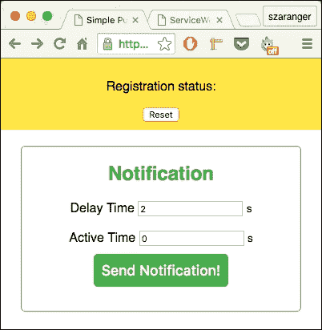

1.  打开开发者工具栏（*Cmd* + *Alt* + *I* 或 *F12*）。现在刷新页面并查看控制台中的消息。你会看到 fetch 请求被记录到控制台中。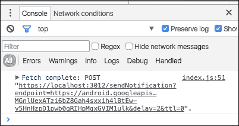

1.  浏览器会提示你允许通知。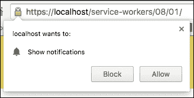

1.  很快你就会收到通知。（这可能会根据你的配置需要一些时间。）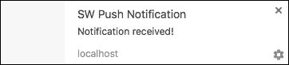

## 它是如何工作的...

在`index.js`文件的开始处，我们指定用于服务器的基准 URL。

```js
var baseURL = 'https://localhost:3012/';
```

接下来，为了获取用户的推送服务订阅，我们使用`pushManager`。

```js
return registration.pushManager.getSubscription()
```

如果找到了订阅，它将被返回。否则，用户将被订阅。

```js
return registration.pushManager.getSubscription()
  .then(function(subscription) {
    if (subscription) {
      return subscription;
    }

    return registration.pushManager.subscribe({ userVisibleOnly: true });
  });
```

接下来，我们将向服务器发送订阅详情。

```js
fetch(baseURL + 'register', {
    method: 'post',
    headers: {
      'Content-type': 'application/json'
    },
    body: JSON.stringify({
      endpoint: subscription.endpoint,
    }),
  });
```

这将使服务器向客户端发送通知。

```js
document.querySelector('#send').onclick = function() {
  var delay = document.querySelector('#notification-delay').value;
  var ttl = document.querySelector('#notification-ttl').value;

  fetch(baseURL + 'sendNotification?endpoint=' + endpoint + '&delay=' + delay +
        '&ttl=' + ttl,
    {
      method: 'post',
    }
  );
};
```

我们将在`index.html`文件中添加一个用于延迟时间和活动时间的输入字段部分。

```js
<section id="notification-input">
    <form>
      <h1>Notification</h1>
      Delay Time&nbsp;<input id='notification-delay' type='number' value='2'></input> <small>s</small><br/>
      <br/>
      Active Time&nbsp;<input id='notification-ttl' type='number' value='0'></input> <small>s</small><br/>
    </form>
    <button id="send">Send Notification!</button>
</section>
```

我们将使用`manifest.json`文件以支持 Google Chrome。

```js
{
  "name": "Simple Push Notification",
  "short_name": "push-simple",
  "start_url": "./index.html",
  "display": "standalone",
  "gcm_sender_id": "46143029380",
  "gcm_user_visible_only": true
}
```

在`service-worker.js`文件中，我们将添加一个用于注册推送事件的监听器。

```js
'use strict';

self.addEventListener('push', function(event) {
  event.waitUntil(
    self.registration.showNotification('SW Push Notification', {
      body: 'Notification received!',
    })
  );
}); 
```

# 显示丰富通知

丰富的推送通知可以发送图片、振动模式和本地化通知。让我们看看我们如何实现这一点。

## 准备工作

要开始使用服务工作者，你需要在浏览器设置中开启服务工作者实验功能。如果你还没有这样做，请参考第一章中的*设置服务工作者*配方，*学习服务工作者基础*。服务工作者仅在 HTTPS 上运行。要了解如何设置支持此功能的发展环境，请参考第一章中的*设置 GitHub 页面以支持 SSL*配方，*学习服务工作者基础*。

## 如何操作...

按照以下说明设置你的文件结构：

1.  从以下位置复制`index.html`、`index.js`、`service-worker.js`、`manifest.json`、`server.js`、`package.json`、`amazon-logo.png`和`style.css`文件：

    [`github.com/szaranger/szaranger.github.io/blob/master/service-workers/08/03/`](https://github.com/szaranger/szaranger.github.io/blob/master/service-workers/08/03/)

1.  打开浏览器并转到`index.html`。

1.  你可以通过更改输入字段来更改延迟时间和活动时间。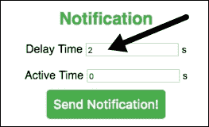

1.  你可能会被提示允许推送通知。

1.  很快你就会收到通知。（这可能会根据你的配置需要一些时间。）

1.  打开开发者工具栏（*Cmd* + *Alt* + *I* 或 *F12*）。现在刷新页面并查看控制台中的消息。

## 它是如何工作的...

在`index.js`文件中，我们将处理用户点击按钮时的点击事件。

这将使服务器向客户端发送通知。

```js
document.querySelector('#send').onclick = function() {
  var delay = document.querySelector('#notification-delay').value;
  var ttl = document.querySelector('#notification-ttl').value;

  fetch(baseURL + 'sendNotification?endpoint=' + endpoint + '&delay=' + delay +
        '&ttl=' + ttl,
    {
      method: 'post',
    }
  );
};
```

在`service-worker.js`文件中，我们将添加一个事件监听器来注册推送事件。

```js
'use strict';

self.addEventListener('push', function(event) {
  event.waitUntil(
    self.registration.showNotification('SW Rich Push Notification', {
      body: 'Richer than richest',
      icon: 'amazon-logo.png',
      vibrate: [300, 100, 300]
    })
  );
});
```

# 使用通知标签

为了替换旧的通知，我们可以使用通知标签。这将帮助我们向用户展示最新的信息。

这个食谱将展示如何管理通知队列，并丢弃之前的通知或将它们合并为一个单一的通知。

## 准备工作

要开始使用服务工作者，你需要在浏览器设置中开启服务工作者实验功能。如果你还没有这样做，请参考第一章的第一个食谱，*学习服务工作者基础*：*设置服务工作者*。服务工作者仅在 HTTPS 上运行。要了解如何设置支持此功能的开发生态系统，请参考第一章的*设置 GitHub 页面以支持 SSL*食谱。

## 如何操作...

按照以下说明设置你的文件结构：

1.  从以下位置复制`index.html`、`index.js`、`service-worker.js`、`manifest.json`、`server.js`、`package.json`和`style.css`文件：

    [`github.com/szaranger/szaranger.github.io/blob/master/service-workers/08/04/`](https://github.com/szaranger/szaranger.github.io/blob/master/service-workers/08/04/)

1.  打开浏览器并转到`index.html`。如何操作...

1.  很快你将收到通知。（这可能会根据你的配置需要一些时间。）如何操作...

## 它是如何工作的...

在`service-worker.js`文件中，我们将添加一个事件监听器来注册推送事件。注意传递给`showNotification`方法的`tag`元素。

```js
'use strict';

self.addEventListener('push', function(event) {
  event.waitUntil(
     self.registration.showNotification('SW Push Notification', {
      body: 'Notification ' + count++,
      tag: 'swc'
    })  );
});
```

# 实现推送客户端

推送客户端使我们能够在用户点击通知消息时专注于我们的应用程序正在运行的标签页。我们甚至可以在应用程序关闭后重新打开它。

## 准备工作

要开始使用服务工作者，你需要在浏览器设置中开启服务工作者实验功能。如果你还没有这样做，请参考第一章的第一个食谱，*学习服务工作者基础*，*设置服务工作者*。服务工作者仅在 HTTPS 上运行。要了解如何设置支持此功能的开发生态系统，请参考第一章的以下食谱：*设置 GitHub 页面以支持 SSL*、*在 Windows 上设置 SSL*和*在 Mac 上设置 SSL*。

## 如何操作...

按照以下说明设置你的文件结构：

1.  从以下位置复制`index.html`、`index.js`、`service-worker.js`、`manifest.json`、`server.js`、`package.json`和`style.css`文件：

    [`github.com/szaranger/szaranger.github.io/blob/master/service-workers/08/05/`](https://github.com/szaranger/szaranger.github.io/blob/master/service-workers/08/05/)

1.  从命令行运行`npm install`。

1.  前往[`console.developers.google.com/project`](https://console.developers.google.com/project)并创建一个 API 项目。获取一个发送者 ID（项目编号）并在`manifest.json`文件中替换`gcm_sender_id`。同时替换`server.js`文件中的`<GCM API KEY>`占位符。

    ```js
    webPush.setGCMAPIKey(/*GCM API KEY*/);
    ```

1.  运行`npm start`以启动服务器。

1.  打开浏览器并前往`index.html`。确保您没有在隐身模式下打开浏览器。在**有效载荷**字段中输入一些文本，然后点击**发送通知**按钮以发送通知。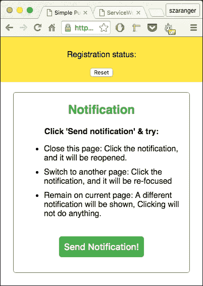

1.  打开开发者工具栏（*Cmd* + *Alt* + *I* 或 *F12*）。现在刷新页面并查看控制台中的消息。您将看到 fetch 请求被记录到控制台中。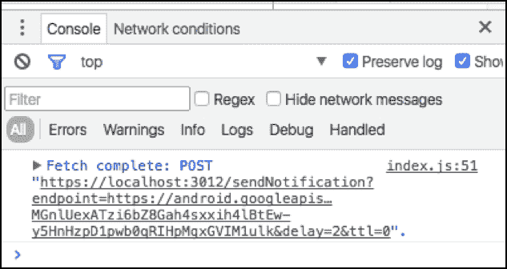

1.  浏览器将提示您允许通知。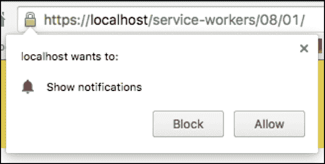

1.  很快您将开始收到通知。（这可能会根据您的配置需要一些时间。）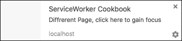

1.  点击这个第一个通知将带您到应用程序运行所在的页面。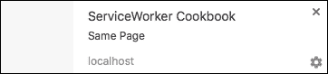

1.  点击第二个通知将不会执行任何操作。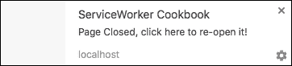

1.  点击第三个通知将打开一个新页面，其中包含运行中的应用程序。

## 工作原理...

在`index.js`文件的开始处，我们将指定我们用于服务器的基准 URL。

```js
var baseURL = 'https://localhost:3012/'; 
```

接下来，为了获取用户对推送服务的订阅，我们使用`pushManager`。

```js
return registration.pushManager.getSubscription()
```

如果找到订阅，这将返回。否则，用户将被订阅。

```js
return registration.pushManager.getSubscription()
  .then(function(subscription) {
    if (subscription) {
      return subscription;
    }

    return registration.pushManager.subscribe({ userVisibleOnly: true });
});
```

接下来，我们将发送订阅详情到服务器。

```js
fetch(baseURL + 'register', {
    method: 'post',
    headers: {
      'Content-type': 'application/json'
    },
    body: JSON.stringify({
      endpoint: subscription.endpoint,
    }),
});
```

**发送**按钮使服务器能够向客户端发送我们在表单中指定的有效载荷的通知。

```js
document.querySelector('#send').onclick = function() {
  fetch(baseURL + 'sendNotification?endpoint=' + endpoint, {
      method: 'post',
  });
};
```

我们将在`index.html`文件中添加一个部分，用于指导用户关于通知消息。

```js
<section id="notification-input">
    <form>
      <h1>Notification</h1>
      <p><strong>Click 'Send notification' &amp; try:</strong></p>
      <ul>
        <li>Close this page: Click the notification, and it will be reopened.</li>
        <li>Switch to another page: Click the notification, and it will be re-focused</li>
        <li>Remain on current page: A different notification will be shown, Clicking will not do anything.</li>
      </ul>
    </form>
    <button id="send">Send Notification!</button>
</section>
```

我们使用`manifest.json`文件以支持 Google Chrome。

```js
{
  "name": "SW Push Clients Notification",
  "short_name": "push-clients",
  "start_url": "./index.html",
  "display": "standalone",
  "gcm_sender_id": "46143029380",
  "gcm_user_visible_only": true
}
```

在`service-worker.js`文件中，我们将接收有效载荷并为注册推送事件添加事件监听器。

```js
'use strict';

self.addEventListener('push', function(event) {
  event.waitUntil(
    self.clients.matchAll().then(function(clients) {

      var focused = clients.some(function(client) {
        return client.focused;
      });

      var notificationMessage;

      if (focused) {
        notificationMessage = 'Same Page';
      } else if (clients.length > 0) {
        notificationMessage = 'Diffrerent Page, ' +
                              'click here to gain focus';
      } else {
        notificationMessage = 'Page Closed, ' +
                              'click here to re-open it!';
      }

      return self.registration.showNotification('ServiceWorker Cookbook', {
        body: notificationMessage,
      });
    })
  );
});
```

# 订阅推送通知

这个菜谱将教会您如何使用带有订阅管理的推送通知，使用户能够订阅应用程序将公开的功能，以保持联系。

## 准备工作

要开始使用服务工作者，你需要在浏览器设置中开启服务工作者实验功能。如果你还没有这样做，请参考第一章的第一个食谱，*学习服务工作者基础*，*设置服务工作者*。服务工作者仅在 HTTPS 上运行。要了解如何设置支持此功能的发展环境，请参考第一章的以下食谱，*学习服务工作者基础*：*设置 GitHub 页面以支持 SSL*，*在 Windows 上设置 SSL*，和*在 Mac 上设置 SSL*。

## 如何操作...

按照以下说明设置你的文件结构：

1.  从以下位置复制`index.html`、`index.js`、`service-worker.js`、`manifest.json`、`server.js`、`package.json`和`style.css`文件：

    [`github.com/szaranger/szaranger.github.io/blob/master/service-workers/08/06/`](https://github.com/szaranger/szaranger.github.io/blob/master/service-workers/08/06/)

1.  从命令行运行`npm install`。

1.  前往[`console.developers.google.com/project`](https://console.developers.google.com/project)创建一个 API 项目。获取一个发送者 ID（项目编号）并在`manifest.json`文件中替换`gcm_sender_id`。同时替换`server.js`文件中的`<GCM API KEY>`占位符。

    ```js
    webPush.setGCMAPIKey(/*GCM API KEY*/);
    ```

1.  运行`npm start`以启动服务器。

1.  打开浏览器并转到`index.html`。确保你不在隐身模式下打开浏览器。点击**订阅**按钮。按钮将变为**取消订阅**。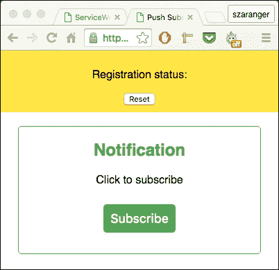

1.  打开开发者工具栏（*Cmd* + *Alt* + *I* 或 *F12*）。现在刷新页面并查看控制台中的消息。你会看到 fetch 请求被记录到控制台中。

1.  浏览器可能会提示你允许通知。

1.  很快你就会收到通知。（这可能会根据你的配置需要一些时间。）一旦你点击**取消订阅**按钮，通知将不再显示。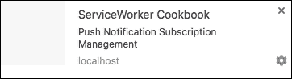

## 它是如何工作的...

在`index.js`文件的开始处，我们将指定我们用于服务器的基准 URL。

```js
var baseURL = 'https://localhost:3012/'; 
```

接下来，为了获取用户对推送服务的订阅，我们使用`pushManager`。

```js
return registration.pushManager.getSubscription()
```

如果找到了订阅，它将被返回。否则，用户将被订阅。

```js
return registration.pushManager.getSubscription()
  .then(function(subscription) {
    if (subscription) {
      return subscription;
    }

    return registration.pushManager.subscribe({ userVisibleOnly: true });
});
```

接下来，我们将向服务器发送订阅详情。

```js
fetch(baseURL + 'register', {
    method: 'post',
    headers: {
      'Content-type': 'application/json'
    },
    body: JSON.stringify({
      endpoint: subscription.endpoint,
    }),
  });
```

该按钮使服务器能够向客户端发送我们以表单形式指定的有效载荷的通知。

```js
document.querySelector('#subscription-button').onclick = function() {
  fetch(baseURL + 'sendNotification?endpoint=' + endpoint, {
      method: 'post',
  });
};
```

为了管理订阅，我们将添加切换逻辑。

```js
function unsubscribe() {
  getSubscription().then(function(subscription) {
    return subscription.unsubscribe()
      .then(function() {
        console.log('Unsubscribed', subscription.endpoint);
        return fetch('unregister', {
          method: 'post',
          headers: {
            'Content-type': 'application/json'
          },
          body: JSON.stringify({
            endpoint: subscription.endpoint
          })
        });
      });
  }).then(setSubscribeButton);
}

function setSubscribeButton() {
  subscriptionBtn.onclick = subscribe;
  subscriptionBtn.textContent = 'Subscribe!';
}

function setUnsubscribeButton() {
  subscriptionBtn.onclick = unsubscribe;
  subscriptionBtn.textContent = 'Unsubscribe!';
}
```

我们将在`index.html`文件中添加一个部分，用于指导用户了解通知消息。

```js
<section id="notification-input">
    <form>
      <h1>Notification</h1>
      <p>Click to subscribe</p>
    </form>
    <button id="subscription-button" disabled=true></button>
</section>
```

我们将使用`manifest.json`文件以支持 Google Chrome。

```js
{
  "name": "SW Push Notification Subscription Management",
  "short_name": "push-with_subscription",
  "start_url": "./index.html",
  "display": "standalone",
  "gcm_sender_id": "46143029380",
  "gcm_user_visible_only": true
}
```

在`service-worker.js`文件中，我们将接收有效载荷并为注册推送事件添加事件监听器。

```js
'use strict';

self.addEventListener('push', function(event) {
  event.waitUntil(self.registration.showNotification('ServiceWorker Cookbook', {
    body: 'Push Notification Subscription Management'
  }));
});

self.addEventListener('pushsubscriptionchange', function(event) {
  console.log('Subscription expired');
  event.waitUntil(
    self.registration.pushManager.subscribe({ userVisibleOnly: true })
    .then(function(subscription) {
      console.log('Subscribed after expiration', subscription.endpoint);
      return fetch('register', {
        method: 'post',
        headers: {
          'Content-type': 'application/json'
        },
        body: JSON.stringify({
          endpoint: subscription.endpoint
        })
      });
    })
  );
});
```

在`server.js`文件中，我们将向推送服务发送通知。

```js
function sendNotification(endpoint) {
  webPush.sendNotification(endpoint).then(function() {
    console.log('Push Application Server - Notification sent to ' + endpoint);
  }).catch(function() {
    console.log('ERROR in sending Notification, endpoint removed ' + endpoint);
    subscriptions.splice(subscriptions.indexOf(endpoint), 1);
  });
}
```

为了演示目的，我们将通过在每`pushInterval`内向注册的端点发送通知来模拟已发生的事件。因此，您将看到通知快速到来。

```js
setInterval(function() {
  subscriptions.forEach(sendNotification);
}, pushInterval * 1000);

function isSubscribed(endpoint) {
  return (subscriptions.indexOf(endpoint) >= 0);
}
```

# 管理推送通知配额

在这个配方中，我们将对不同浏览器的配额管理策略进行实验。我们将尝试发送尽可能多的通知来测试打开和关闭标签页、点击通知以及忽略通知的情况。

## 准备工作

要开始使用服务工作线程，您需要在浏览器设置中开启服务工作线程实验功能。如果您还没有这样做，请参考第一章的*设置服务工作线程*配方，*学习服务工作线程基础*。服务工作线程仅在 HTTPS 上运行。要了解如何设置支持此功能的发展环境，请参考以下第一章的配方，*学习服务工作线程基础*：*设置 GitHub 页面以支持 SSL*，*在 Windows 上设置 SSL*，和*在 Mac 上设置 SSL*。

## 如何操作...

按照以下说明设置您的文件结构：

1.  从以下位置复制`index.html`、`index.js`、`service-worker.js`、`manifest.json`、`server.js`、`package.json`和`style.css`文件：

    [`github.com/szaranger/szaranger.github.io/blob/master/service-workers/08/07/`](https://github.com/szaranger/szaranger.github.io/blob/master/service-workers/08/07/)

1.  从命令行运行`npm install`。

1.  前往[`console.developers.google.com/project`](https://console.developers.google.com/project)并创建一个 API 项目。获取一个发送者 ID（项目编号）并在`manifest.json`文件中替换`gcm_sender_id`。同时，在`server.js`文件中替换`<GCM API KEY>`占位符。

    ```js
    webPush.setGCMAPIKey(/*GCM API KEY*/);
    ```

1.  运行`npm start`以启动服务器。

1.  打开浏览器并转到`index.html`。确保您没有在隐身模式下打开浏览器。点击**可见通知**或**不可见通知**按钮。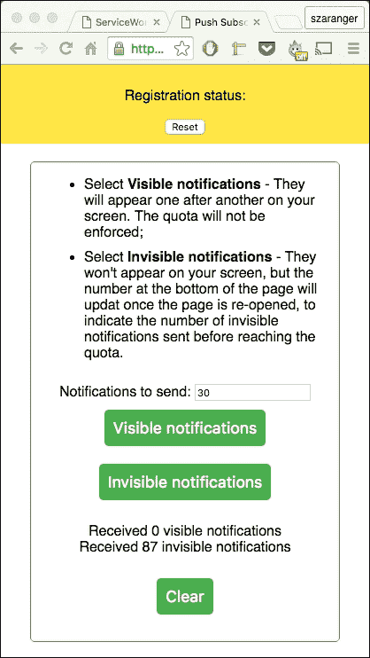

1.  打开开发者工具栏（*Cmd* + *Alt* + *I* 或 *F12*）。现在刷新页面并查看控制台中的消息。您将看到 fetch 请求被记录到控制台中。

1.  您的浏览器可能会提示您允许通知。

## 它是如何工作的...

在`index.js`文件的开始处，我们将指定我们用于服务器的基准 URL。

```js
var baseURL = 'https://localhost:3012/'; 
```

接下来，为了获取用户对推送服务的订阅，我们使用`pushManager`。

```js
return registration.pushManager.getSubscription()
```

如果找到订阅，则将其返回。否则，用户将被订阅。

```js
return registration.pushManager.getSubscription()
  .then(function(subscription) {
    if (subscription) {
      return subscription;
    }

  return registration.pushManager.subscribe({ userVisibleOnly: true });
});
```

我们还将检索用户的公钥。

```js
var rawKey = subscription.getKey ? subscription.getKey('p256dh') : '';
key = rawKey ?
btoa(String.fromCharCode.apply(null, new Uint8Array(rawKey))) : '';
var rawAuthSecret = subscription.getKey ? subscription.getKey('auth') : '';
authSecret = rawAuthSecret ?
btoa(String.fromCharCode.apply(null, new Uint8Array(rawAuthSecret))) : '';

  endpoint = subscription.endpoint;
```

接下来，我们将发送订阅详情到服务器。

```js
fetch(baseURL + 'register', {
    method: 'post',
    headers: {
      'Content-type': 'application/json'
    },
    body: JSON.stringify({
      endpoint: subscription.endpoint,
      key: key,
      authSecret: authSecret
    }),
  });
```

我们将请求服务器向客户端发送通知以进行测试。

```js
fetch(baseURL + 'sendNotification', {
    method: 'post',
    headers: {
      'Content-type': 'application/json'
    },
    body: JSON.stringify({
      endpoint: endpoint,
      key: key,
      visible: visible,
      num: notificationNum,
    }),
  });
```

`清除`按钮清除通知缓存，该缓存存储收到的通知数量。

```js
document.querySelector('#clear').onclick = function() {
  window.caches.open('notifications').then(function(cache) {
    Promise.all([
      cache.put(new Request('invisible'), new Response('0', {
        headers: {
          'content-type': 'application/json'
        }
      })),
      cache.put(new Request('visible'), new Response('0', {
        headers: {
          'content-type': 'application/json'
        }
      })),
    ]).then(function() {
      updateNotificationNumbers();
    });
  });
};
```

通过读取收到的通知数量来更新用户界面。

```js
function updateNotificationNumbers() {
  window.caches.open('notifications').then(function(cache) {
    ['visible', 'invisible'].forEach(function(type) {
      cache.match(type).then(function(res) {
        if(res) {
          res.text().then(function(text) {
            document.getElementById('sent-' + type).textContent = text;
          });
        }
      });
    });
  });
}
```

此外，定期更新收到的通知数量。

```js
window.onload = function() {
  updateNotificationNumbers();
  setInterval(updateNotificationNumbers, 1000);
};
```

我们将在`index.html`文件中添加一个部分，用于指导用户关于通知消息。

```js
<section id="notification-input">
    <ul>
      <li>Select <strong>Visible notifications</strong> - They will appear one after another on your screen. The quota will not be enforced;</li>
      <li>Select <strong>Invisible notifications</strong> - They won't appear on your screen, but the number at the bottom of the page will update once the page is re-opened, to indicate the number of invisible notifications sent before reaching the quota.</li>
    </ul>

    <form>
    Notifications to send: <input id="notification-count" type="number" value="30"></input>
    </form>

    <button id="visible">Visible notifications</button>
    <button id="invisible">Invisible notifications</button>

    <p>Received <span id="sent-visible">0</span> visible notifications<br />
    Received <span id="sent-invisible">0</span> invisible notifications</p>
    <button id="clear">Clear</button>
  </section> id="subscription-button" disabled=true></button>
</section>
```

我们将使用`manifest.json`文件以支持 Google Chrome。

```js
{
  "name": "SW Push Quota",
  "short_name": "push-quota",
  "start_url": "./index.html",
  "display": "standalone",
  "gcm_sender_id": "46143029380",
  "gcm_user_visible_only": true
}
```

在`service-worker.js`文件中，我们保持服务工作者（service worker）处于活跃状态，直到通知缓存更新。

```js
self.addEventListener('push', function(event) {

  var visible = event.data ? event.data.json() : false;

  if (visible) {
    event.waitUntil(updateNumber('visible').then(function(num) {
      return self.registration.showNotification('SW', {
        body: 'Received ' + num + ' visible notifications',
      });
    }));
  } else {
    event.waitUntil(updateNumber('invisible'));
  }
});
```

我们将创建一个通知缓存来存储收到的通知。

```js
self.addEventListener('install', function(event) {
  event.waitUntil(
    caches.open(cacheName).then(function(cache) {
      return Promise.all([
        cache.put(new Request('invisible'), new Response('0', {
          headers: {
            'content-type': 'application/json'
          }
        })),
        cache.put(new Request('visible'), new Response('0', {
          headers: {
            'content-type': 'application/json'
          }
        })),
      ]);
    })
  );
});
```

在`server.js`文件中，我们将向推送服务发送通知。

```js
app.post('/sendNotification', function(req, res) {
  var num = 1;
  var promises = [];

  var intervalID = setInterval(function() {
     promises.push(webPush.sendNotification(req.body.endpoint, {
       TTL: 200,
       payload: JSON.stringify(req.body.visible),
       userPublicKey: req.body.key,
       userAuth: req.body.authSecret,
     }));

     if (num++ === Number(req.body.num)) {
       clearInterval(intervalID);

       Promise.all(promises)
       .then(function() {
         res.sendStatus(201);
       });
     }
   }, 1000);
});
```
