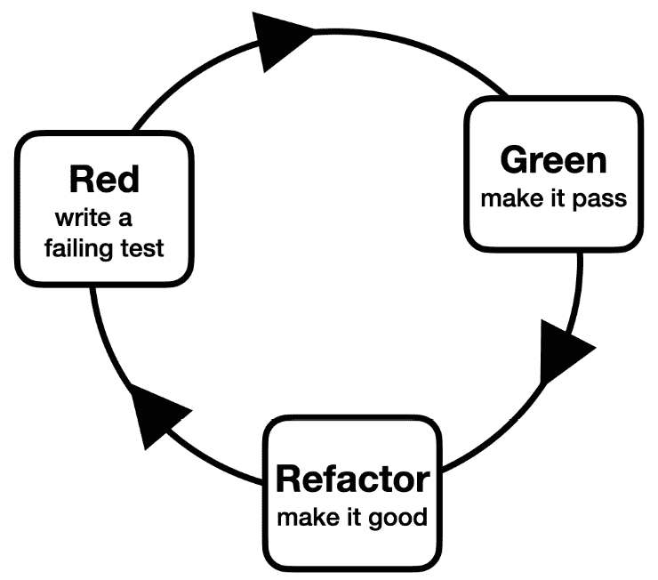
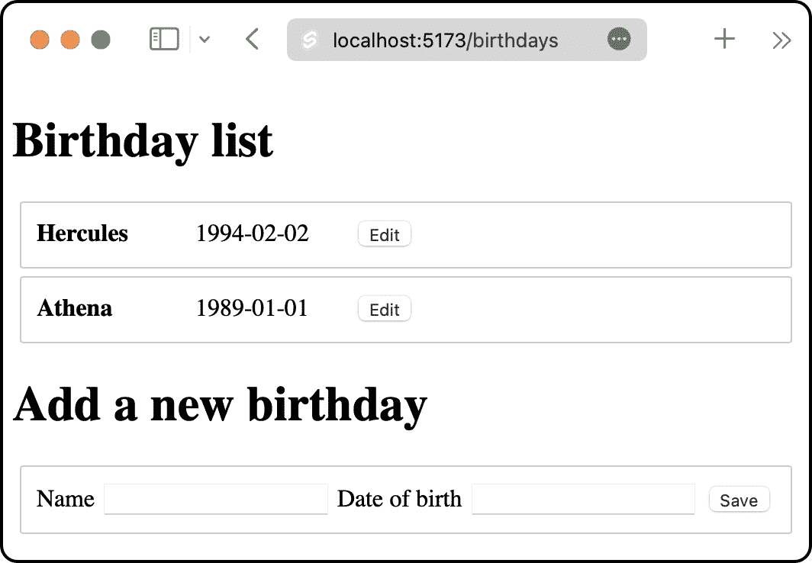

# 2

# 介绍红绿重构工作流程

本章介绍了**红-绿-重构**工作流程，这是**测试驱动开发**（**TDD**）的核心。你将使用它来编写第一个 Svelte 组件，包括一个单元测试套件，该套件指定了组件的行为。

这种工作流程对你有益，因为它为软件实现提供了结构。这使你不太可能实现错误的东西。它还帮助你避免过度复杂化解决方案。

本章涵盖了以下主题：

+   理解红-绿-重构工作流程

+   前瞻性设计

+   编写失败的测试

+   让它通过

+   重构测试

+   为组件添加样式

到本章结束时，你将使用 TDD 编写你的第一块 Svelte 功能。

# 技术需求

本章的代码可以在网上找到，地址为[`github.com/PacktPublishing/Svelte-with-Test-Driven-Development/tree/main/Chapter02/Start`](https://github.com/PacktPublishing/Svelte-with-Test-Driven-Development/tree/main/Chapter02/Start)。

# 理解红绿重构工作流程

红绿重构工作流程（或周期）是一个定义你如何编写软件的机制的过程。它具有持久的吸引力，因为它通过为他们的日常工作提供结构，帮助许多开发者提高了生产力。

你通过在工作流程中重复循环，直到软件完成来完成任务。红-绿-重构也适合成对或团队合作开发，因为它为你提供了一种组织讨论和决策的方式。

*图 2**.1*显示了工作流程。它有三个部分：

+   **红**：首先，你编写一个失败的测试。这听起来比实际要容易，因为你首先必须知道你打算**建造什么**。

+   **绿**：一旦你有一个失败的测试，你让它通过。你努力找到解决测试的**最短**路线。

+   **重构**：让它变得更好。退一步思考设计。即使你选择了最短的路线，你是否弄乱了？是否有任何抽象开始出现，可以被实现，或者现有的抽象需要调整？



图 2.1 – 红绿重构工作流程

这为你构建软件提供了结构。你从无到有，通过重复循环，测试一次，构建你的软件产品，直到它变得有用。（当然，你需要知道你的轨迹，但这将是第一步的一部分，正如我们很快将看到的。）

我们将在本章剩余的两部分中更详细地探讨红和绿步骤。首先，我们将编写一些代码作为示例，然后我们将讨论我们所做的。

第三部分，重构，在我们有更多代码可以操作时更容易解释，所以我们将重点放在 *第四章*，*保存表单数据*，和 *第五章*，*验证表单数据*。

现在，你已经了解了 Red-Green-Refactor 的理论。让我们试试看，好吗？

# 提前进行一些初步设计

如果你想象我们是一支即将开始新项目的开发团队，那么在没有项目概要的情况下开始项目是非常不可能的——你不能没有目的就随意编写测试。

因此，本节的目标有两件事：

+   在本书的第一部分，从高层次上讨论我们将要构建的内容

+   学习足够多的知识，以便我们可以编写第一个失败的测试

## Birthdays 应用程序

我们将构建一个名为 *Birthdays* 的网络应用程序，用于管理人员名单及其生日。

*图 2.2* 展示了该应用程序的实际运行情况。主页是一个存储的生日列表。底部有一个表单，可以添加新的生日，这些生日以人员的姓名（仅一个文本字段）和他们的出生日期存储。



图 2.2 – Birthdays 应用程序

用户通过访问我们网站的 `/birthdays` URL 来访问这个应用程序。

在本章中，我们将专注于构建一个 Svelte 组件，该组件以列表的形式显示每个生日。它可以这样使用：

```js
<Birthday name={name} dob={dob} />
```

我们可以从一个测试开始，这个测试指定了`Birthday`组件将如何使用其`name`属性。

初步设计和 TDD

工作流程中的 Red 部分要求*编写一个失败的测试*。好吧，但写什么测试呢？实际上，每次你开始 Red 循环时，你应该在思考你的轨迹。我们接下来需要什么？我们对我们设计了解到了什么？这就是你应该在每次测试之前进行的*初步设计*。

然而，技巧在于只做*足够多*的事情，以便确切地知道你要编写什么测试。你不需要把整个系统都规划出来。

这就是我们在这个阶段需要做的所有初步设计。我们知道我们可以从哪里开始——一个检查组件是否显示名称的检查。

# 编写一个失败的测试

在本节中，你将为 Vitest 测试运行器编写第一个单元测试。

创建一个名为 `src/routes/birthdays/Birthday.test.js` 的新文件，并从以下 `import` 语句开始：

```js
import { describe, it, expect } from 'vitest';
import {
  render,
  screen
} from '@testing-library/svelte';
import Birthday from './Birthday.svelte';
```

`describe` 函数用于将测试分组为测试套件。每个测试文件（如 `Birthday.test.js`）至少有一个 `describe` 块。这些块也可以嵌套；在未来的章节中，我们将探讨一些场景，在这些场景中，你可能想要这样做。例如，在 *第四章*，*保存表单数据*，你将使用它们根据 HTML 表单中出现的单个表单字段来分组测试。

`it` 函数是定义单元测试的基本函数，它被这样命名是为了让测试描述读起来像规范。这个函数被设计成流畅的，意味着它的调用应该像普通英语一样阅读。这通常是我们在编写测试时追求的目标，因为它有助于它们像规范一样阅读。

`expect` 函数是我们用来检查我们的软件是否做了我们 *期望* 它做的事情。

`render` 和 `screen` 函数帮助我们操作 `render` 将组件结果输出到当前的 DOM 文档中，随后调用 `screen` 会给我们提供一系列定位函数，用于查找 DOM 元素。

最后一个导入是 `Birthday` 组件。这个组件目前还不存在。事实上，文件还不存在。这是故意的。注意我们已经做出了设计选择：文件应该存放的位置，它的名称，以及组件的名称。

单位级别的设计讨论

如果我们作为一个团队一起工作，我们会就所有这些决策进行讨论。尽管这看起来可能很显然，但 TDD 工作流程给了我们与队友自由讨论这些问题的空间。

命名事物很难。这就是为什么讨论命名非常有帮助。关于我自己，我学到的就是当我与他人讨论一个困难的变量名时，我们总能想出一个比我最初选择更好的名字。

与此相对的是作为一个独立开发者，你会在完成工作后进行工作审查，可能在一个漂亮的拉取请求中打包。想象一下，你完成了一切工作，后来队友告诉你：“我认为这个名字可以改进……” 这不是很令人沮丧吗？提前讨论意味着你可以避免之后的所有情绪困扰。

让我们继续编写测试。我们首先需要的是 `describe` 块和 `it` 测试描述。在 `import` 定义下方添加以下内容：

```js
describe('Birthday', () => {
  it('displays the name of the person', () => {
  });
});
```

看看 `describe` 和 `it` 函数给出的描述是如何形成一个简单的英文句子的？*Birthday 显示了* *该人的* *名字*。

现在我们可以填写测试：

```js
describe('Birthday', () => {
  it('displays the name of the person', () => {
    render(Birthday, { name: 'Hercules' });
  });
});
```

`render` 调用将我们的 `Birthday` 组件与传递的 `name` 属性一起调用。它将 `Birthday` 组件挂载到 DOM 上，以便我们检查其结果。

接下来，是断言的时间。通过以下代码块中的 `expect` 函数完成测试：

```js
describe('Birthday', () => {
  it('displays the name of the person', () => {
    render(Birthday, { name: 'Hercules' });
    expect(
      screen.queryByText('Hercules')
    ).toBeVisible();
  });
});
```

在这个期望中，有几个重要的事情需要注意。

首先，注意定位器的使用，`screen.queryByText`。`screen` 对象有一系列这样的查询函数，所有这些函数都是为了在 DOM 中找到单个元素。随着本书的进展，我们将揭示常见的查询函数。`queryByText` 函数搜索提供的文本，如果找不到则返回 `null`。

`queryBy` 与 `getBy` 查询函数变体

如果您有使用 Testing Library 的经验，您会知道每个查询函数都有一个`getBy`和`queryBy`变体。当我使用 TDD 时，我在引入新元素的第一个测试中使用`queryBy`。这使得很清楚，我不期望元素此时存在。但是一旦这个测试变为绿色（并且通过），后续的测试就可以使用`getBy`，如果找不到元素，它会抛出一个异常。这有助于清楚地表明这个测试依赖于前面的测试来证明元素的存在。

另一个重要的事情是`toBeVisible`函数调用，它连接在`expect`函数调用之后。这检查我们在第一次调用中获得的内容是否在 DOM 文档中可见。

如果您熟悉 Testing Library，您可能知道这里有一个更功能上合适的匹配器我们可以使用。我们可以使用`not.toBeNull`，如下所示：

```js
expect(
  screen.queryByText('Hercules')
).not.toBeNull();
```

我认为这是更*功能上合适*的做法，因为`queryByText`查询函数如果找不到页面上的文本，将返回`null`，这正是我们真正感兴趣的。

我更喜欢使用`toBeVisible`的原因是它使测试更易于阅读，继续使用流畅、简洁的英语匹配语句的主题。当然，了解测试失败时的错误信息也很重要，我们马上就会看到。

红阶段的最后一步是观察测试失败。现在就运行它，无论是在您的 IDE 中还是在终端上。（如果您遵循了*第一章*中设置说明的指示，*为测试设置*，您将能够使用`v` shell 命令或`npm run test:unit`来运行测试。）

你应该看到以下输出：

```js
 FAIL  src/routes/birthdays/Birthday.test.js [ src/routes/birthdays/Birthday.test.js ]
Error: Failed to load url ./Birthday.svelte (resolved id: ./Birthday.svelte). Does the file exist?
```

这实际上并不是一个测试失败！它告诉我们我们导入的文件不存在。这是创建文件的时候了。

请在`src/routes/birthdays/Birthday.svelte`位置创建一个空白文件。

然后，重新运行测试。会发生什么？

```js
 FAIL  src/routes/birthdays/Birthday.test.js > Birthday > displays the name of the person
Error: expect(received).toBeVisible()
received value must be an HTMLElement or an SVGElement.
 ❯ src/routes/birthdays/Birthday.test.js:13:5
     11|   expect(
     12|    screen.queryByText('Hercules')
     13|   ).toBeVisible();
       |     ^
     14|  });
     15| });
```

完美——我们得到了一个测试失败！注意这个神秘的错误信息，“接收到的值必须是 HTMLElement 或 SVGElement”。如果我们使用了`not.toBeNull`匹配器，我们会看到更不神秘的东西。然而，我认为这个测试足够简单，所以很清楚发生了什么——特别是由于这一行：

```js
Error: expect(received).toBeVisible()
```

本节向您展示了如何使用基本的`describe`、`it`和`expect`函数编写一个失败的测试。您还看到了如何使用测试运行器来驱动一些管道工作，例如创建文件。

这就完成了循环中的红部分。接下来是绿部分。

# 让它通过

在本节中，我们将进行一个非常简单的更改，使测试通过，然后我们将用第二个测试重复这个循环。

要使这个测试通过，请将以下内容添加到`src/routes/birthdays/Birthday.svelte`文件中：

```js
<script>
  export let name;
</script>
<span><strong>{name}</strong></span>
```

现在重新运行你的测试，你应该会看到 Vitest 测试运行器的以下输出（你将看到来自*第一章*，*设置测试环境*的测试仍然列在这里）：

```js
 ✓ src/routes/birthdays/Birthday.test.js (1)
   ✓ Birthday (1)
     ✓ displays the name of the person
 ✓ src/index.test.js (3)
   ✓ sum test (3)
     ✓ adds 1 + 2 to equal 3
     ✓ renders hello into the document
     ✓ renders hello, svelte
 Test Files  2 passed (2)
      Tests  4 passed (4)
   Start at  11:45:47
   Duration  1.60s (transform 503ms, setup 306ms, collect 272ms, tests 63ms)
```

## 重复此过程

让我们继续添加`dob`属性的下一步。回到`src/routes/birthdays/Birthday.test.js`文件，添加此测试，就在原始测试下方，仍然在`describe`块内：

```js
it('displays the date of birth', () => {
  render(Birthday, { dob: '1994-02-02' });
  expect(
    screen.queryByText('1994-02-02')
  ).toBeVisible();
});
```

确保运行你的测试并观察它失败。然后，为了使其通过，请在`src/routes/birthdays/Birthday.svelte`中添加以下修改：

```js
<script>
  export let name;
  export let dob;
</script>
<span><strong>{name}</strong></span>
<span>{dob}</span>
```

再次运行测试，你应该会看到现在两者都是绿色的。然而，有一些警告：

```js
stderr | src/routes/birthdays/Birthday.test.js > Birthday > displays the name of the person
<Birthday> was created without expected prop 'dob'
stderr | src/routes/birthdays/Birthday.test.js > Birthday > displays the date of birth
<Birthday> was created without expected prop 'name'
 ✓ src/routes/birthdays/Birthday.test.js (2)
   ✓ Birthday (2)
     ✓ displays the name of the person
     ✓ displays the date of birth
```

我们将在下一节中修复这些警告，同时解决几个其他问题。

# 重构测试

在本节中，我们将查看在开始考虑下一个功能之前我们可以进行的重构工作。我们首先修复上一节中的测试警告，然后添加第三个测试作为完整性测试，最后添加一些样式。

重构和改变行为

重构的通常定义是*任何不影响外部行为的内部更改*。将 CSS 样式更改包括在内，或者确实删除警告的更改，这有点牵强。但我在项目早期发现，总是需要做出这样的小改动。关键点是，你的测试套件是*绿色*的，并且在整个过程中保持*绿色*。

## 清理警告

清理任何出现的警告非常重要。因为如果不这样做，测试运行器的输出就会充满噪音。我们希望输出尽可能简短，以便快速解析出现的问题。

在`src/routes/birthdays/Birthday.test.js`文件中，在`describe`块顶部添加一个名为`exampleBirthday`的新定义：

```js
describe('Birthday', () => {
  const exampleBirthday = {
    name: 'Ares',
    dob: '1996-03-03'
  };
  ...
});
```

然后，更新第一个测试以包括此变量作为传递给组件的*基本*属性：

```js
it('displays the name of the person', () => {
  render(Birthday, {
    ...exampleBirthday,
    name: 'Hercules'
  });
  ...
});
```

现在更新第二个测试，如下所示：

```js
it('displays the date of birth', () => {
  render(Birthday, {
    ...exampleBirthday,
    dob: '1994-02-02'
  });
  ...
});
```

如果你现在运行测试，你应该会看到警告已经消失，测试仍然通过。

## 添加第三个测试以进行三角测量

如果你将`Birthday.svelte`文件更新为具有如下硬编码值，会发生什么？

```js
<span><strong>Hercules</strong></span>
<span>1994-02-02</span>
```

好吧，试试看；你会发现你的测试仍然通过。

事实上，你的测试并不能防止硬编码。这突出了 TDD（测试驱动开发）的一个有趣方面。当我们根据测试构建软件时，我们总是旨在构建可能工作的最简单的东西。

为了超越硬编码的值，我们可以为每个单独的属性添加第二个测试。将此测试添加到测试套件中：

```js
it('displays the name of another person', () => {
  render(Birthday, {
    ...exampleBirthday,
    name: 'Athena'
  });
  expect(
    screen.queryByText('Athena')
  ).toBeVisible();
});
```

你会看到硬编码版本不再工作。使这两个测试都能正常工作的最简单方法就是简单地输出传入的`name`属性值。

本节已简要介绍了重构步骤。随着本书的进展，将会有更多的重构工作。

# 为组件添加样式

最后，你可以在`Birthday.svelte`文件中添加以下`<style>`块，这完成了`Birthday`组件，意味着你将准备好在页面上显示它，你将在下一章中这样做：

```js
<script>
  export let name;
  export let dob;
</script>
<span><strong>{name}</strong></span>
<span>{dob}</span>
<style>
  span {
    display: inline-block;
    width: 100px;
  }
</style>
```

你可以避免为 CSS 编写单元测试，因为那是一种静态信息。单元测试专门关于行为：当这个或那个东西发生变化，或者传递了一个不同的`name`属性时会发生什么？

# 摘要

本章详细探讨了红-绿-重构工作流程中涉及的步骤。你已经看到了每一步都涉及了多少思考，以及 TDD 过程如何为个人工作和团队工作提供支架。

你还看到了如何使用 TDD 创建 Svelte 组件，并为 Vitest 测试运行器编写单元测试。

这种批判性思维的价值在于，它将帮助你从始至终规划你的预期工作，消除走错路或迷失方向的风险。如果你花时间练习这种工作流程，它很快就会变成一种本能。

在下一章中，我们将介绍 Playwright 测试，你将构建一个页面来容纳`Birthday`组件。
