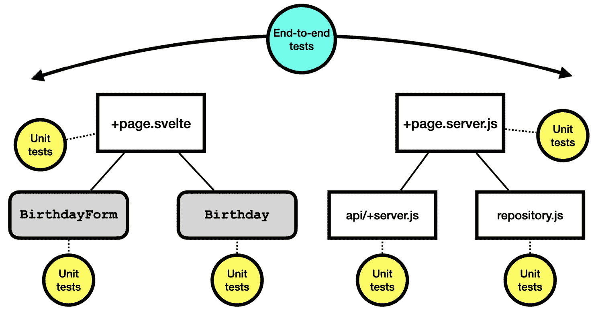
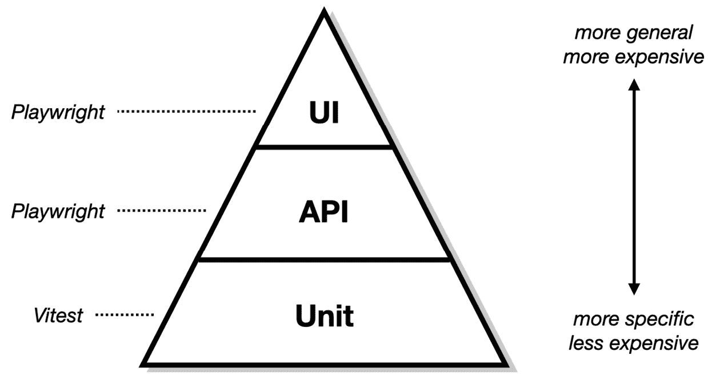

# 3

# 将数据加载到路由中

本章我们将要工作的`/birthdays`路由。其中一部分路由是确保路由有可用的数据。在本章中，你将看到如何测试驱动 SvelteKit 的`load`函数，以将数据拉入组件中。

你还将看到如何使用 Playwright 构建一个端到端测试，以证明这个系统的所有各种组件。

本章涵盖了以下内容：

+   使用 Playwright 指定端到端行为

+   决定使端到端测试通过的方法

+   测试驱动加载函数

+   测试驱动页面组件

到本章结束时，你将测试驱动一个可以在你的网络浏览器中查看的 SvelteKit 路由，并且你将了解 Playwright 端到端测试和 Vitest 单元测试之间的关键区别。

# 技术要求

本章的代码可以在网上找到，地址为[`github.com/PacktPublishing/Svelte-with-Test-Driven-Development/tree/main/Chapter03/Start`](https://github.com/PacktPublishing/Svelte-with-Test-Driven-Development/tree/main/Chapter03/Start)。

# 使用 Playwright 指定端到端行为

在本节中，你将编写你的第一个 Playwright 测试，并了解其中的各种函数调用，你还将了解区分 Playwright 端到端测试和 Vitest 单元测试。

## 编写测试并观察其失败

我们将要编写的测试名为`列出所有生日`，它将执行以下步骤：

1.  浏览到`/``birthdays`位置。

1.  寻找文本`Hercules`和`Athena`，这将作为测试通过的证据。

一旦测试就位，我们将停下来思考如何让这个`Hercules`和`Athena`数据进入我们的系统。

创建一个名为`tests/birthdays.test.js`的新文件，并添加以下内容：

```js
import { expect, test } from '@playwright/test';
test('lists all birthdays', async ({ page }) => {
  await page.goto('/birthdays');
  await expect(
    page.getByText('Hercules')
  ).toBeVisible();
  await expect(
    page.getByText('Athena')
  ).toBeVisible();
});
```

你可以在这里看到一些与 Vitest 测试类似的东西，例如使用`expect`和`toBeVisible`匹配器。

然而，有些事情是不同的。首先，测试被标记为`async`，所有的函数调用（包括`expect`函数调用）都被标记为`await`。

这是必要的，因为 Playwright 正在驱动一个无头浏览器，这意味着它启动了一个在后台运行的真正浏览器进程，对你来说是不可见的。Playwright 没有机制来确定浏览器何时完成工作，除了耐心地等待并频繁检查浏览器状态。因此，其大部分内部逻辑都是由等待和超时驱动的：浏览器被给予一定的时间，通常几秒钟，来显示内容。

`page.goto`调用指示这个无头浏览器导航到`/birthdays`端点。Playwright 负责在后台启动一个真实的开发服务器，并确保任何相对 URL（例如`/birthdays`）都转换为指向此开发服务器的绝对 URL（如`https://localhost:5173/birthdays`）。

现在运行测试，使用 `npm test` 命令。你应该会看到几乎立即出现的失败：

```js
     1 birthdays.test.js:3:1 › lists all birthdays
  ✓  2 test.js:3:1 › index page has expected h1 (618ms)
[WebServer] Error: Not found: /birthdays
```

测试完成后，让我们更详细地看看 Vitest 测试和 Playwright 测试之间的区别。

## 理解 Vitest 测试和 Playwright 测试之间的区别

Vitest 测试的工作方式和 Playwright 测试的工作方式之间有根本性的区别。两者都在 TDD 中扮演着它们的角色。

*图 3.1* 展示了每种类型的测试如何涵盖您的代码。Playwright 测试通常被称为端到端测试，它们是高级的，每个测试都锻炼大量的代码。Vitest 测试通常被称为单元测试。它们非常详细，只锻炼一小段代码。



图 3.1 – SvelteKit 项目中的端到端测试和单元测试

当开始构建新功能时，Playwright 测试通常是一个好的起点。甚至可能由不是开发者但仍然参与定义特性的项目利益相关者编写。在 *第十三章*，*添加 Cucumber 测试* 中，我们将看到如何使用纯英语语法而不是 JavaScript 代码来完成这项工作。

Playwright 测试通常针对浏览器 UI 编写。它们锻炼整个系统，包括网络浏览器和任何进程外资源，如数据库。当与 SvelteKit 应用程序一起工作时，Playwright 测试运行器启动 SvelteKit 网络服务器并执行所有 SvelteKit 运行时代码，以管理路由。

相反，Vitest 测试运行器不会加载 SvelteKit 网络服务器，也不会执行其任何代码。相反，它直接将您的 JavaScript 文件加载到与 Vitest 和您的测试套件相同的 Node 进程中。

虽然 Playwright 测试有助于让团队专注于需要构建的内容，但它们通常对软件的内部设计或整个系统的架构没有太多可说的。这就是 Vitest 单元测试发挥作用的地方。开发者可以使用它们来弄清楚系统的 *如何*。

单元测试有助于设计的方式有很多。例如，如果一个单元测试很难编写，那有时可能意味着应用程序设计过于复杂。以不同的方式分解单元可以使得单元测试变得更加简单。

Playwright 测试通常在具体细节上保持较低的要求，将详细内容留给单元测试。例如，在我们刚刚编写的测试中，我们关注的是系统所知道的生日列表，但请注意，我们只是通过查找人的名字来检查，而没有检查生日。我们将完整的生日检查留给 `Birthday` 组件的单元测试，该组件已在 *第二章*，*介绍红-绿-重构工作流程* 中编写。

这样，我们最终会有很多低级的 Vitest 单元测试和一些高级的 Playwright 测试。这正是 Mike Cohn 在《成功实施敏捷》一书中描述的经典测试自动化金字塔。它鼓励采用包含许多单元测试、一些服务测试以及少量 UI 测试的测试策略。

*图 3.2* 展示了测试自动化金字塔如何应用于 SvelteKit 项目。Playwright 端到端测试可以针对 UI 和特定 API 端点编写，而你的单元测试是为 Vitest 运行器编写的。



图 3.2 – 将测试金字塔应用于 SvelteKit 项目

以这种方式构建自动化测试的一个原因是单元测试创建和维护成本低，而 UI 测试在时间和精力投入方面成本高昂。

服务测试类似于 UI 测试，因为它们覆盖了整个系统流程，但避免了 UI。例如，它们可以直接调用 HTTP API 端点。这可能很有帮助，因为 UI 往往是系统中最脆弱的组件，而驱动 UI 需要一段时间，因为你需要等待屏幕上的变化被渲染。

注意

现代网络浏览器环境，以及现代测试运行器如 Playwright，在处理自动化 UI 测试方面已经变得越来越好。

经典测试自动化金字塔合理性的另一个原因是单元测试通常执行得非常快。你可以有很多单元测试，每个测试只执行代码表面的极小部分。当其中一个测试失败时，阅读测试描述或测试代码并找出应用程序代码中失败位置的速度非常快。

还值得记住的是，单元测试旨在记录编写代码时所做的所有技术设计决策，这种文档对于理解项目的历史至关重要。

最后，请记住，Vitest 单元测试并不测试 SvelteKit 服务器端运行环境。这意味着，例如，Vitest 单元测试可以测试你是否正确定义了 `load` 函数，但它不能测试路由是否正确连接。为此，你需要一个 Playwright 测试，它编译并运行你的组件和路由，就像它是一个真实的浏览器环境一样。

# 决定一种方法来使端到端测试通过

话虽如此，既然我们已经有了定义我们想要什么的 Playwright 测试，我们现在如何开始编写 Vitest 单元测试呢？

Playwright 测试寻找名称 `Hercules` 和 `Athena`。测试假设这两个人在系统中列出了他们的生日，并且 `/birthdays` 页面列出了他们。但我们是怎样首先将他们放入系统中的呢？

在真正的 TDD 风格中，我们可以推迟这个决定，并简单地将这些两个生日硬编码到系统中。毕竟，测试似乎并不关心数据是如何进入系统的，而只是关心它是如何呈现的。

我们可以稍后回来讨论如何添加生日。实际上，我们将在*第八章*中这样做，*创建匹配器以简化测试*。我们还可以利用*第二章*中的`Birthday`组件，*介绍红-绿-重构工作流程*，依次显示每个生日。

因此，我们需要做的是以下这些：

1.  创建一个`load`函数，返回赫拉克勒斯和雅典娜的硬编码生日数据。这需要在`src/routes/birthdays/+page.server.js`文件中存在。

1.  创建一个`page`组件，它从`load`获取数据并为每个给定的生日显示一个`Birthday`组件。这需要作为`src/routes/birthdays/+page.svelte`存在。

SvelteKit 负责将`/birthdays`路由与`src/routes/birthdays`目录中的文件匹配。在调用`load`后，它将结果传递到`+page.svelte`组件的`data`属性中。

这就涵盖了如何编写基本的 Playwright 端到端测试。我们已经讨论了 Playwright 端到端测试和 Vitest 单元测试之间的区别，并为本章的其余部分制定了一个计划。

下一个部分将介绍如何测试驱动我们的`load`函数的基本、硬编码版本。

# 测试驱动加载函数

现在我们已经决定实现一个`load`函数，该函数返回赫拉克勒斯和雅典娜的硬编码生日数据，实际的更改已经变得非常简单。

`load`函数是一个特殊的 SvelteKit 函数，当有请求到达指定的路由时将被调用。因此，当用户导航到`/birthdays`路由时，SvelteKit 会调用`src/routes/birthdays/+page.server.js`文件中的`load`函数，然后渲染`src/routes/birthdays/+page.svelte`文件中的组件。

按照以下步骤使用 TDD 创建`load`函数：

1.  创建一个新的 Vitest 测试文件，命名为`src/routes/birthdays/page.server.test.js`，并按照以下方式开始。我们正在从还不存在的`+page.server.js`文件中导入`load`函数。我们在测试中调用该函数并存储结果：

    ```js
    import { describe, it, expect } from 'vitest';
    import { load } from './+page.server.js';
    describe('/birthdays - load', () => {
      it('returns a fixture of two items', () => {
        const result = load();
      });
    });
    ```

为加载函数命名 describe 块

我将`describe`块命名为`/birthdays - load`，这展示了可以用于路由`load`函数的标准命名模式。

1.  使用以下期望完成测试：

    ```js
    it('returns a fixture of two items', () => {
      const result = load();
      expect(result.birthdays).toEqual([
        { name: 'Hercules', dob: '1994-02-02' },
        { name: 'Athena', dob: '1989-01-01' }
      ]);
    });
    ```

每个测试一个期望

整个测试只包含对`expect`的单次调用。通常，在编写测试时，我发现尽可能只保留一个期望是有用的。这有助于保持测试描述和`expect`调用内容之间的紧密联系。

通常情况下（就像这个测试一样），你可以在单个期望中放入大量的检查。

`toEqual` 匹配器有一个特殊的 *深度相等* 机制，这意味着可以检查对象或数组的每一层的值，而不是它的身份。而且，我们可以使用约束函数，例如 `objectContaining`，我们将在 *第六章*，*编辑* *表单数据*）中看到。

1.  使用你的 Vitest 测试运行器运行测试。这将给出以下输出：

    ```js
     FAILsrc/routes/birthdays/page.server.test.js [ src/routes/birthdays/page.server.test.js ]
    Error: Failed to load url ./+page.server.js (resolved id: ./+page.server.js). Does the file exist?
    ```

1.  按照建议在 `src/routes/birthdays/+page.server.js` 位置创建一个空文件，然后重新运行你的测试。你应该会看到以下内容：

    ```js
     FAIL  src/routes/birthdays/page.server.test.js > /birthdays - load > returns a fixture of two items
    TypeError: load is not a function
    ❯ src/routes/birthdays/page.server.test.js:6:18
          4| describe('/birthdays - load', () => {
          5|  it('returns a fixture of two items', () => {
          6|   const result = load();
           |                  ^
          7|   expect(result.birthdays).toEqual([
          8|    expect.objectContaining({
    ```

1.  好的，太棒了：`load` 不是一个函数。那么，让我们创建一个基本的 `load` 函数，里面什么都没有。将以下内容添加到新文件中：

    ```js
    export const load = () => ({});
    ```

1.  重新运行你的测试。你会得到以下内容：

    ```js
     FAIL  src/routes/birthdays/page.server.test.js > /birthdays - load > returns a fixture of two items
     AssertionError: expected [ { name: 'Hercules', …(2) }, …(1) ] to deeply equal [ { name: 'Hercules', …(1) }, …(1) ]
    ❯ src/routes/birthdays/page.server.test.js:14:28
         12|  it('returns a fixture of two items', () => {
         13|   const result = load();
         14|   expect(result.birthdays).toEqual([
           |                            ^
         15|    { name: 'Hercules', dob: '1994-02-02' },
         16|    { name: 'Athena', dob: '1989-01-01' }
      - Expected  - 10
      + Received  + 1
      - Array [
      -   Object {
      -     "dob": "1994-02-02",
      -     "name": "Hercules",
    -   },
      -   Object {
      -     "dob": "1989-01-01",
      -     "name": "Athena",
      -   },
    - ]"
      + "undefined"
    ```

1.  为了解决这个问题，我们只需要填写硬编码的值。更新 `src/routes/birthdays/+page.server.js` 中的代码，使其看起来如下：

    ```js
    export const load = () => ({
      birthdays: [
        { name: 'Hercules', dob: '1994-02-02' },
        { name: 'Athena', dob: '1989-01-01' }
      ]
    });
    ```

管道和硬编码的值

虽然这样做可能感觉有点没有意义，但价值在于将管道设置到位。我们在这里编写的测试将在我们填充 *真实* 实现时作为一个有用的回归测试，这个实现不仅仅是返回硬编码的数据。（我们将在 *第四章*，*保存* *表单数据*）中改进这个实现）。

1.  再次运行你的测试，你会看到测试成功：

    ```js
    ✓ src/routes/birthdays/page.server.test.js (1)
    ✓ /birthdays - load (1)
    ✓ returns a fixture of two items
    ```

这就完成了一个工作的 `load` 函数。你现在已经涵盖了测试驱动路由的 `load` 函数的基础，以确保它符合 SvelteKit 的要求。

现在我们可以构建路由的 `page` 组件了。

# 测试驱动页面组件

是时候创建存在于路由中的 `page` 组件了。一如既往，我们将从一个测试开始：

1.  创建 `src/routes/birthdays/page.test.js` 文件，并添加以下导入。最后一个是为 `page` 组件本身。因为 SvelteKit 预期路由的组件存在于名为 `+page.svelte` 的文件中，所以我们不妨将组件命名为 `Page`（毕竟它就是这个名字）：

    ```js
    import { describe, it, expect } from 'vitest';
    import {
      render,
      screen
    } from '@testing-library/svelte';
    import Page from './+page.svelte';
    ```

1.  接下来，让我们编写测试。关键部分是 `Page` 接收一个 `data` 属性，它需要与我们的 `load` 函数的结构相匹配。在实际运行环境中，SvelteKit 将调用 `load` 函数，然后使用 `data` 属性设置为 `load` 函数的结果来渲染 `+page.svelte` 中的组件：

    ```js
    describe('/birthdays', () => {
      const birthdays = [
        { name: 'Hercules', dob: '1994-02-02' },
        { name: 'Athena', dob: '1989-01-01' }
      ];
      it('displays all the birthdays passed to it', () =>
      {
        render(Page, { data: { birthdays } });
        expect(
          screen.queryByText('Hercules')
        ).toBeVisible();
        expect(
          screen.queryByText('Athena')
        ).toBeVisible();
      });
    });
    ```

测试数据固定

尽管它们有相同的值，但这里的 `birthdays` 值集合与 `load` 函数中的硬编码值之间没有联系。`load` 函数最终会失去其 *种子* 数据。

1.  如果你现在运行测试，你应该会看到缺少文件的常规失败：

    ```js
     FAIL  src/routes/birthdays/page.test.js [ src/routes/birthdays/page.test.js ]
    Error: Failed to load url ./+page.svelte (resolved id: ./+page.svelte). Does the file exist?
    ```

1.  在 `src/routes/birthdays/+page.svelte` 创建一个空文件，然后再次运行测试：

    ```js
     FAIL  src/routes/birthdays/page.test.js > /birthdays > displays all the birthdays passed to it
    Error: expect(received).toBeVisible()
    received value must be an HTMLElement or an SVGElement.
    ```

1.  是时候进行真正的实现了。复制以下代码，它使用 `data` 属性来显示一个带有 `li` 的 `ol` 元素，每个生日都有一个。我们使用来自 *第二章* *介绍红-绿-重构工作流程* 的 `Birthday` 组件来显示 `data.birthdays` 数组中的每个项目的生日：

    ```js
    <script>
      import Birthday from './Birthday.svelte';
      export let data;
    </script>
    <h1>Birthday list</h1>
    <ol>
      {#each data.birthdays as birthday}
        <li>
          <Birthday {...birthday} />
        </li>
      {/each}
    </ol>
    ```

使用 HTML 列表进行可测试性

当渲染 *数组* 中的项目时，我们在这里所做的那样，始终使用 `ol` 元素（用于有序列表）或 `ul` 元素（用于无序列表）作为父容器，然后为列表中的每个项目使用 `li` 元素。使用列表元素可以增加你组件的可测试性，因为你可以使用定位函数来特别寻找 `listitem` 角色，我们将在 *第六章* *编辑表单数据* 中看到。

注意，我们正在使用 `Birthday` 组件来使测试通过。但我们的测试并没有明确请求一个 `Birthday` 组件；期望看起来是这样的：

```js
expect(
  screen.queryByText('Hercules')
).toBeVisible();
```

你可能会认为使这个测试通过的最简单方法就是简单地打印出生日的名字。但那样会忽略我们测试的意图，我们的测试意图是显示一个 `Birthday` 组件的列表。

在 *第十二章* *使用组件模拟来明确测试* 中，我们将探讨如何使用组件模拟来明确表示我们在这里想要使用 `Birthday` 组件。

实现完成后，你现在可以验证你通过测试。

1.  运行 Vitest 测试运行器，你应该会看到测试现在通过了：

    ```js
    ✓ src/routes/birthdays/page.test.js (1)
    ✓ /birthdays (1)
    ✓ displays all the birthdays passed to it
    ```

1.  现在，你也可以运行 Playwright 来查看你通过测试：

    ```js
    ✓  1 test.js:3:1 › index page has expected h1 (402ms)
    ✓  2 birthdays.test.js:3:1 › lists all birthdays (430ms)
      2 passed (4s)
    ```

1.  你可以在 `src/routes/birthdays/+page.svelte` 文件中添加一些样式：

    ```js
    <style>
      ol {
        list-style-type: none;
        padding-left: 0;
      }
      li {
        padding: 10px;
        margin: 5px;
        border: 1px solid #ccc;
        border-radius: 2px;
      }
    </style>
    ```

1.  最后，使用 `npm run dev` 命令运行开发服务器。记下你应用程序的基本 URL，然后打开浏览器，加载 `/birthdays` URL 来检查你的工作。

计算加载路径

我们构建的路由最终会指向类似 `https://localhost:5173/birthdays` 的位置。但你的端口号可能不同：你需要运行 `npm run dev` 命令并查找带有 `Local` 标签的基本 URL。

本节向你展示了你如何在名为 `+page.svelte` 的文件中测试驱动一个 `page` 组件，SvelteKit 会在你浏览到已知路由时为你渲染该文件。

# 摘要

本章向你展示了如何使用 Playwright 编写端到端测试，并将其用作 Vitest 单元测试的脚手架。Playwright 测试检查所有单元是否协同工作，框架是否正常工作。Vitest 测试检查你是否满足了 SvelteKit 所要求的合同，例如 `load` 函数是否以正确的方式工作。

你也看到了如何使用 TDD 来延迟那些不是立即相关的决策，比如我们为什么直接硬编码样本数据而不是实现任何形式的持久化数据库来存储生日。

在下一章中，我们将通过实现一个 SvelteKit 表单操作来扩展相同的概念，使您能够向列表中添加新的生日。
