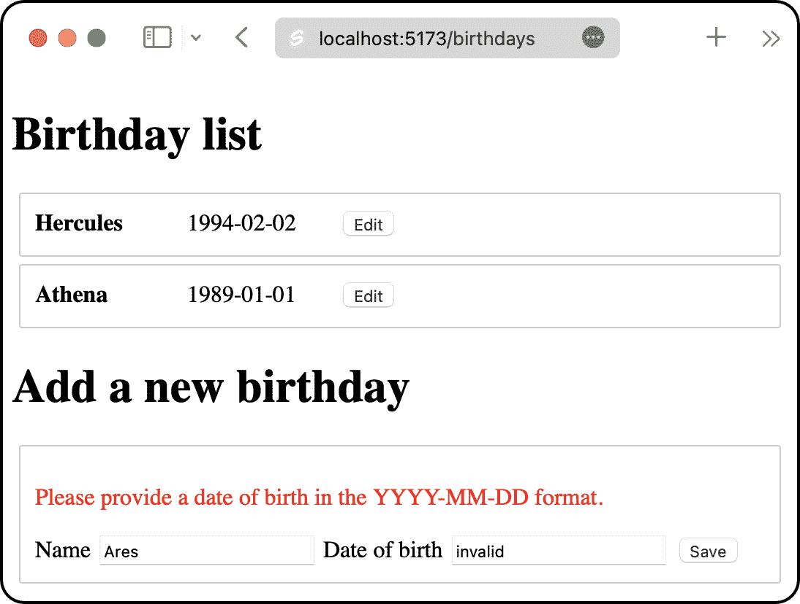

# 验证表单数据

现在我们系统正在接受新的生日，我们需要验证传入的数据。在本章中，我们将看到如何测试驱动 SvelteKit 的`fail`函数，以便向用户返回有用的信息，使他们能够纠正任何错误。

*图 5.1*显示了服务器认为用户的出生日期无效后显示给用户的内容。注意无效的表单数据是如何被保留的，以便用户有机会进行更正：



图 5.1 – 输入无效日期时显示验证错误

本章涵盖了以下关键主题：

+   添加一个 Playwright 测试来验证表单错误

+   显示 SvelteKit 表单错误

+   在表单操作中验证数据

+   在测试之间清除数据存储

到本章结束时，你将很好地理解如何使用测试驱动的方法实现表单验证。

# 技术要求

本章的代码可以在网上找到，地址为[`github.com/PacktPublishing/Svelte-with-Test-Driven-Development/tree/main/Chapter05/Start`](https://github.com/PacktPublishing/Svelte-with-Test-Driven-Development/tree/main/Chapter05/Start)。

# 添加一个 Playwright 测试来验证表单错误

在本节中，我们将编写另一个 Playwright 测试，并为所需的 Vitest 单元测试做一些前期规划。

这是下一个端到端测试，你现在可以将其添加到`tests/birthdays.test.js`中。它填写生日表单，就像上一章一样，但这次，`invalid`实际上就是单词`invalid`，它不是一个有效的出生日期：

```js
test('does not save a birthday if there are validation errors', async ({
  page
}) => {
  await page.goto('/birthdays');
  await page.getByLabel('Name').fill('Demeter');
  await page
    .getByLabel('Date of birth')
    .fill('invalid');
  await page.getByRole('button').click();
  await expect(
    page.getByText('Demeter')
  ).not.toBeVisible();
  await expect(
    page.getByText(
      'Please provide a date of birth in the YYYY-MM-DD
       format.'
    )
  ).toBeVisible();
});
```

让我们思考一下错误信息：`请提供 YYYY-MM-DD 格式的出生日期`。为了简洁起见，我们不会完全进行测试驱动；相反，我们只会接受可以被内置的`Date.parse`函数解析的任何内容。结果证明，许多字符串都可以被这个函数解析。

除了这些，还需要什么才能使这个功能正常工作？我们的表单操作应该使用 SvelteKit 的`fail`函数来通知 SvelteKit 表单需要重新评估。我们使用`422` – *不可处理的实体*错误代码，这意味着请求数据无效。

`fail`函数还可以返回一个对象，该对象将传递回客户端。它作为`form`属性传递给我们的页面组件。该对象是一个我们控制的普通 JavaScript 对象。我们可以返回我们想要的任何内容：我们只需要调用 SvelteKit 的`fail`函数并传递该对象，它就会将其返回给客户端。

有效的返回对象

返回的对象只有在可以被序列化为字符串并在浏览器中重建时才是有效的。函数不能序列化，因此不能传递回。

我们可以包含一个返回错误信息的`error`属性。我们还可以返回`name`和`dob`属性，以便它们可以再次呈现给用户。

一个示例对象看起来像这样：

```js
{
  name: 'Demeter',
  dob: 'invalid',
  error: 'Please provide a date of birth in the YYYY-MM-DD
          format.'
}
```

在剩余的部分，我们将首先更新 `BirthdayForm` 组件以使用这个新的 `form` 属性。然后，我们将更新表单操作以返回两个不同的验证错误：一个空的名字和一个无效的出生日期。

# 显示 SvelteKit 表单错误

在本节中，我们将添加测试和功能以支持将新的 `form` 属性传递给 `BirthayForm` 组件。

让我们从一个新的测试开始：

1.  在 `src/routes/birthdays/BirthdayForm.test.js` 文件中，添加一个新的嵌套 `describe` 块，其中包含一个测试，如下面的代码片段所示。它检查如果 `error` 属性设置在 `form` 属性上，那么那个错误必须在页面上某处显示：

    ```js
    describe('validation errors', () => {
      it('displays a message', () => {
        render(BirthdayForm, {
          form: {
            error: 'An error'
          }
        });
        expect(
          screen.queryByText('An error')
        ).toBeVisible();
      });
    });
    ```

1.  在 `src/routes/birthdays/BirthdayForm.svelte` 中使那通过，首先添加一个用于新 `form` 属性的 `export` 语句，然后添加一个包含错误文本的新 `p` 元素。你还可以在底部添加 `<style>` 元素，尽管这对于测试通过不是必需的：

    ```js
    <script>
      export let form;
    </script>
    <p class="error">{form.error}</p>
    <form>
      ...
    </form>
    <style>
      .error {
        color: red;
      }
    </style>
    ```

1.  如果你现在运行测试，你会看到我们通过要求 `form` 属性具有对象值而破坏了其他一些测试。但在这个组件的 *创建* 模式下，`form` 属性应该保持未定义。按照以下代码块更新 `BirthdayForm` 组件：

    ```js
    <script>
      export let form = undefined;
    </script>
    {#if form?.error}
      <p class="error">{form.error}</p>
    {/if}
    ...
    ```

1.  让我们在同一个 `describe` 块中添加下一个测试。这个测试检查如果发生错误，我们将使用与传递的相同值重新填充 `name` 文本字段：

    ```js
    describe('validation errors', () => {
      ...
      it('keeps the previous name value when an error
      occurs', () => {
        render(BirthdayForm, {
          form: {
            name: 'Hercules',
            error: 'Some awful error message'
          }
        });
        expect(
          screen.queryByLabelText('Name')
        ).toHaveValue('Hercules');
      });
    });
    ```

1.  为了使那通过，只需向 `input` 字段添加一个 `value` 属性值：

    ```js
    <input type="text" name="name" value={form?.name} />
    ```

1.  现在为 `dob` 字段重复那个操作：

    ```js
    describe('validation errors', () => {
      ...
      it('keeps the previous dob value when an error
      occurs', () => {
        render(BirthdayForm, {
          form: {
            dob: '1994-01-01',
            error: 'Some awful error message'
          }
        });
        expect(
          screen.queryByLabelText('Date of birth')
        ).toHaveValue('1994-01-01');
      });
    });
    ```

1.  通过在 `dob` 字段上添加 `value` 属性使那通过：

    ```js
    <input type="text" name="dob" value={form?.dob} />
    ```

1.  如果你现在运行应用程序，你会看到在 *创建* 模式下，当 `form` 是 `undefined` 时，`undefined` 字符串值现在出现在 `form` 上，因此 `value` 是 `undefined`。浏览器将其转换为字符串，在文本框中给出 `undefined`。为了修复这个问题，我们需要为字段指定一个初始值。在 `BirthdayForm` 测试套件中，找到 `name` 字段的 `describe` 块，并在其中添加一个第二个测试，如下面的代码块所示：

    ```js
    describe('name field', () => {
      ...
      it('initially has a blank value', () => {
        render(BirthdayForm);
        expect(
          screen.getByLabelText('Name')
        ).toHaveValue('');
      });
    });
    ```

1.  为了使那通过，更新 `value` 属性，如下所示：

    ```js
    <input
      type="text"
      name="name"
      value={form?.name || ''}
    />
    ```

1.  然后，从下面的测试开始，对 `date of birth field` 重复那个操作：

    ```js
    describe('date a birth field', () => {
      ...
      it('initially has a blank value', () => {
        render(BirthdayForm);
        expect(
          screen.getByLabelText('Name')
        ).toHaveValue('');
      });
    });
    ```

1.  最后，通过在 `dob` 字段上设置 `value` 属性以同样的方式使那个测试通过：

    ```js
    <input
      type="text"
      name="dob"
      value={form?.dob || ''}
    />
    ```

这就完成了 `BirthdayForm` 组件的更改。接下来，我们需要从页面组件获取 `form` 属性到 `BirthdayForm`。

## 通过页面组件传递表单数据

`BirthdayForm` 组件不是 *根* 路由组件：它作为 `+page.svelte` 中的组件的子组件实例化。

按照以下步骤确保 `form` 属性被 `page` 组件接收并传递给 `BirthdayForm` 组件：

1.  在 `src/routes/birthdays/page.test.js` 文件中，在测试套件的底部添加一个新的测试，如下面的代码片段所示。它检查如果发送了带有 `error` 属性的 `form` 属性，错误文本将显示在屏幕上：

    ```js
    it('passes any form information to the BirthdayForm', () => {
      render(Page, {
        data: { birthdays },
        form: { error: 'An error' }
      });
      expect(
        screen.queryByText('An error')
      ).toBeVisible();
    });
    ```

1.  由于页面组件已经渲染了 `BirthdayForm`，因此使这个测试通过的最简单方法是传递 `form` 属性到 `BirthdayForm`。在 *第十二章*，*使用组件模拟来澄清测试*，我们将看到如何使用组件模拟重写这个测试。不过，现在，在 `src/routes/birthdays/+page.svelte` 文件中，更新组件以声明 `form` 属性，然后直接将其传递给 `BirthdayForm`：

    ```js
    <script>
      ...
      export let form = undefined;
    </script>
    ...
    <BirthdayForm {form} />
    ```

你现在已经学会了如何使用自动化测试来驱动表单错误的显示。

在下一节中，我们将编写针对服务器端发生的表单操作的测试。

# 在表单操作中验证数据

现在我们已经为客户端的错误做好了准备，但我们还需要服务器代码实际执行验证检查。我们将添加两个检查：一个检查名称是否不为空，另一个检查日期是否可以解析为有效的 `Date` 对象。

这些检查需要四个单元测试：第一个测试确保我们在不添加生日的情况下提前退出；下一个测试检查 `422` 错误代码；然后一个测试检查错误信息文本；最后，一个测试检查原始数据是否被返回。（在 *第八章*，*创建匹配器以简化测试*，你将看到如何构建一个可以将这三个测试合并为一个单一测试的匹配器。）

`beforeEach` 函数

本节介绍了 `beforeEach` 函数，该函数用于在 `describe` 块内的每个测试之前运行设置代码。它是减少测试套件中重复的有用工具。你可以将其视为测试的 **安排** 阶段的一部分。

`beforeAll`、`afterEach` 和 `afterAll` 函数执行类似的工作，但使用频率较低。我们在 *第一章*，*为测试做准备* 中使用了 `afterEach` 函数进行初始化，我们将在 *第八章*，*创建匹配器以简化测试* 中使用 `beforeAll`。

让我们开始吧：

1.  在 `src/routes/birthdays/page.server.test.js` 文件中，为 `beforeEach` 函数添加一个新的导入。我们将使用这个函数来为整个测试集进行设置：

    ```js
    import {
      describe,
      it,
      expect,
      beforeEach
    } from 'vitest';
    ```

然后添加一个嵌套的 `'validation errors'` `describe` 块，以及另一个嵌套的标题为 `'when the name is not provided'` 的 `describe` 块，如下所示。这包括第一个测试：

```js
describe('/birthdays - default action', () => {
  ...
  describe('validation errors', () => {
    describe('when the name is not provided', () => {
      let result;
      beforeEach(async () => {
        const request = createFormDataRequest({
          name: '',
          dob: '2009-02-02'
        });
        result = await actions.default({
          request
        });
      });
      it('does not save the birthday', () => {
        expect(load().birthdays).not.toContainEqual(
          expect.objectContaining({
            name: '',
            dob: '2009-02-02'
          })
        );
      });
    });
  });
});
```

`when…` 上下文

当一组测试属于特定的起始场景时，例如前面场景所示，使用 `when` 风格命名 `describe` 上下文是常见的。它们通常包含一个包含所有测试的共同设置的 `beforeEach` 块。

有时候可能会有多个嵌套层级，但为了简单起见，最好只保留一个层级的`when...`上下文块。前面的例子显示了一个名为`'validation errors'`的外部块，但这只是为了组织，并不包含任何自己的设置。

1.  然后，在`src/routes/birthdays/+page.server.js`文件中，更新`actions`中的新`name`字段为空：

    ```js
    export const actions = {
       default: async ({ request }) => {
         const data = await request.formData();
        const name = data.get('name');
        if (empty(name)) {
          return;
        }
        ...
      }
    };
    ```

1.  为了使其工作，您需要一个`empty`函数的定义，您可以像下面这样定义：

    ```js
    const empty = (value) =>
      value === undefined ||
      value === null ||
      value.trim() === '';
    ```

简化操作

您可能会观察到我们没有完全测试`empty`函数，例如，如果发送了一行空格会发生什么。为了避免在本章中编写更多的测试，我没有列出那些测试。如果这是一个真实的应用程序，我会将`empty`移动到自己的文件中，然后提供一大堆直接针对它的单元测试。

1.  对于下一个测试，我们将编写一个测试来确保表单返回`422`响应。将此测试添加到同一嵌套的`describe`块中：

    ```js
    it('returns a 422', () => {
      expect(result.status).toEqual(422);
    });
    ```

1.  为了使它通过，首先在`src/routes/birthdays/+page.server.js`文件中添加以下`import`语句：

    ```js
    import { fail } from '@sveltejs/kit';
    ```

1.  然后更新保护子句以使用`fail`返回一个值：

    ```js
    if (empty(name)) {
      return fail(422);
    }
    ```

1.  现在，仍然在同一嵌套的`describe`块中，添加一个测试来检查错误消息：

    ```js
    it('returns a useful message', () => {
      expect(result.data.error).toEqual(
        'Please provide a name.'
      );
    });
    ```

1.  通过将`return`对象作为`fail`调用的第二个参数添加来使它通过：

    ```js
    if (empty(name)) {
      return fail(422, {
       error: 'Please provide a name.'
      });
    }
    ```

1.  然后添加此名称检查的最后一个测试，即我们继续传递`dob`字段值：

    ```js
    it('returns the data back', () => {
      expect(result.data).toContain({
        dob: '2009-02-02'
      });
    });
    ```

1.  完成保护子句，如下面的代码片段所示。为此，您需要以与`name`相同的方式提取`dob`字段：

    ```js
    const name = data.get('name');
    const dob = data.get('dob');
    ...
    if (empty(name)) {
      return fail(422, {
        dob,
        error: 'Please provide a name.'
      });
    }
    ```

1.  现在，让我们开始对无法解析的`date`值进行第二个检查。这的行为与之前的检查完全相同，只是表单数据有不同的值：

    ```js
    describe('/birthdays - default action', () => {
      ...
      describe('validation errors', () => {
        ...
        describe('when the date of birth is in the wrong
        format', () => {
          let result;
          beforeEach(async () => {
            const request = createFormDataRequest({
              name: 'Hercules',
              dob: 'unknown'
            });
            result = await actions.default({
              request
            });
          });
          it('does not save the birthday', () => {
            expect(load().birthdays).not.toContainEqual(
              expect.objectContaining({
                name: '',
                dob: '2009-02-02'
              })
            );
          });
        });
      });
    });
    ```

1.  为了使它通过，首先在`empty`辅助函数旁边定义一个`invalidDob`辅助函数：

    ```js
    const invalidDob = (dob) => isNaN(Date.parse(dob));
    ```

1.  然后，更新表单操作以包含一个新的保护子句：

    ```js
    export const actions = {
       default: async ({ request }) => {
         ...
         if (invalidDob(dob)) {
           return;
         }
      }
    };
    ```

1.  然后，从*步骤 4*开始重复动作，添加一个测试以确保返回`422`响应：

    ```js
    it('returns a 422', () => {
      expect(result.status).toEqual(422);
    });
    ```

1.  为了使它通过，更新`return`语句如下：

    ```js
    if (invalidDob(dob)) {
      return fail(422);
    }
    ```

1.  接下来，添加一个测试来确保返回一个有用的消息：

    ```js
    it('returns a useful message', () => {
      expect(result.data.error).toEqual(
        'Please provide a date of birth in the YYYY-MM-DD
         format.'
      );
    });
    ```

1.  更新保护子句以显示该消息：

    ```js
    if (invalidDob(dob)) {
      return fail(422, {
        error:
          'Please provide a date of birth in the YYYY-MM-
    DD format.'
      });
    }
    ```

1.  对于最终测试，我们检查是否返回了所有数据，包括无效日期。这样用户就有机会更正数据：

    ```js
    it('returns all data back, including the incorrect value', () => {
      expect(result.data).toContain({
        name: 'Hercules',
        dob: 'unknown'
      });
    });
    ```

1.  通过将`name`和`dob`属性传递给失败对象来使它通过。此时，所有测试都应通过：

    ```js
    if (invalidDob(dob)) {
      return fail(422, {
        name,
        dob,
        error:
            'Please provide a date of birth in the YYYY-
             MM-DD format.'
      });
    }
    ```

1.  现在，作为最后的微小*重构*步骤，您可以更新对`addNew`的调用，使其使用您在前面步骤中已经提取的表单数据值：

    ```js
    addNew({
      name,
      dob
    });
    ```

这样就完成了服务器端验证的测试驱动。您的 Vitest 测试和 Playwright 测试现在应该通过。您也可以通过运行开发服务器（使用`npm run dev`命令）并在浏览器中打开应用程序来尝试应用程序。

在本章的最后部分，我们将修复测试套件中悄悄出现的错误。

# 在测试之间清除数据存储

结果表明，我们的测试并不是独立的：一个测试中对`db`对象的更改也会影响其他测试。我们不得不在每次运行之间清除我们的测试数据库。我们可以通过创建一个清除数据库对象的`clear`函数来解决，我们将在每个测试之前使用`beforeEach`块来调用它。

我们需要的是一个可以直接在我们的测试中调用的`clear`函数。然而，如果你尝试将这个函数添加到`+page.server.js`文件中，当你运行 Playwright 测试时，SvelteKit 会发出警告：

```js
Error: Invalid export 'clear' in /birthdays (valid exports are load, prerender, csr, ssr, actions, trailingSlash, or anything with a '_' prefix)
```

为什么这个错误只在 Playwright 测试中出现，而不是在 Vitest 测试中出现？你的 Vitest 测试不会运行通过 SvelteKit 服务器代码，因此框架没有机会检查无效的导出。只有当你通过 Playwright 运行测试时，你才会看到这样的运行时问题。

SvelteKit 只需要一个`load`导出和一个`actions`导出，绝对不需要其他任何东西。因此，我们需要将东西从动作中移出，放入它们自己的文件中：

1.  创建一个新文件，`src/lib/server/birthdayRepository.js`，内容如下：

    ```js
    let db = [];
    export const addNew = (item) => db.push(item);
    export const getAll = () => Array.from(db);
    export const clear = () => (db = []);
    ```

1.  在`src/routes/birthdays/+page.server.js`中，你现在可以像以下代码块所示导入它们。注意文件路径前使用`$`符号，这是用来创建一个相对于`src`文件夹的位置，这样我们就不需要在文件名前写`../../`：

    ```js
    import {
      addNew,
      getAll
    } from '$lib/server/birthdayRepository.js';
    ```

1.  然后删除`db`和`addNew`函数，并将`load`函数更新如下。此时，除了跳过的测试外，所有测试都应该仍然通过：

    ```js
    export const load = () => ({
      birthdays: getAll()
    });
    ```

1.  现在，你可以在`src/routes/birthdays/page.server.test.js`中添加这个新的`import`语句：

    ```js
    import
      as birthdayRepository
    from '$lib/server/birthdayRepository.js';
    ```

1.  添加`beforeEach`语句，如下面的代码块所示：

    ```js
    describe('/birthdays - default action', () => {
      beforeEach(birthdayRepository.clear);
      ...
    });
    ```

1.  最后，在`describe`动作块中，你现在也可以用`birthdayRepository.getAll`替换`load`的使用，这使得测试更清晰地表明实际测试的内容：表单动作会将一个新的生日插入到`birthdayRepository`对象中：

    ```js
    it('adds a new birthday into the list', async () => {
      ...
      expect(birthdayRepository.getAll()).toContainEqual(
        ...
      );
    });
    ```

在最后一步，请注意不要替换`load`的所有出现。在第二个`describe`块中，`load`函数是受测试的函数。因此，我们保留那些测试保持原样。

这样就完成了提取仓库模块所需的所有工作。这样做使我们能够引入一个`clear`函数，可以用来保持我们的测试相互独立。`beforeEach`块确保每个测试都是从一张白纸开始的。

# 摘要

本章涉及编写的单元测试比之前的章节要多得多。有时，单元测试需要非常详细，尤其是在测试非常具体的返回值时。在第八章*创建匹配器以简化测试*中，我们将探讨减少所需测试数量的方法。

你也看到了为什么单元测试需要独立运行的重要性，以及如何使用`beforeEach`函数确保你的 SvelteKit 路由测试在每次测试之间清除数据。

在下一章中，你将学习如何扩展当前的`BirthdayForm`组件，使其能够处理编辑现有生日，除了添加新生日。
