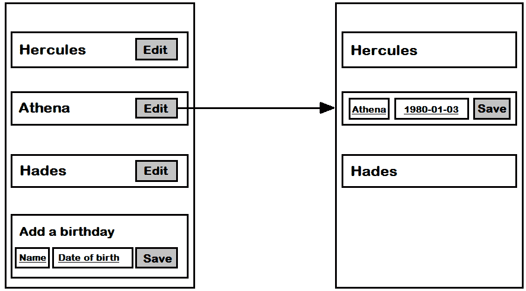
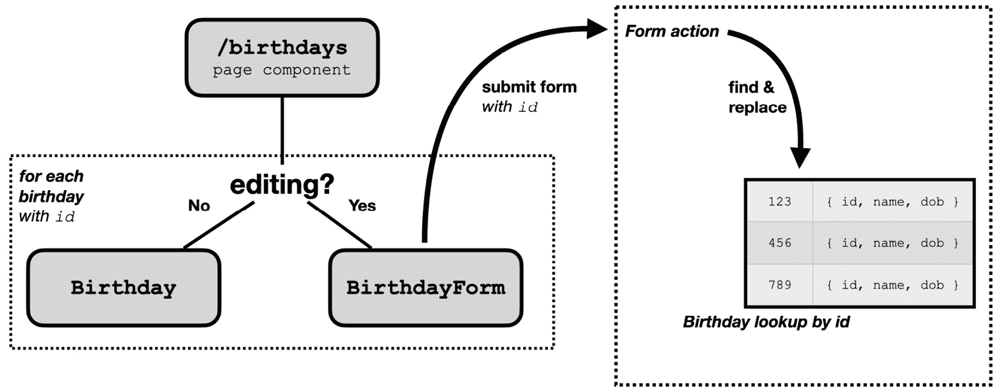
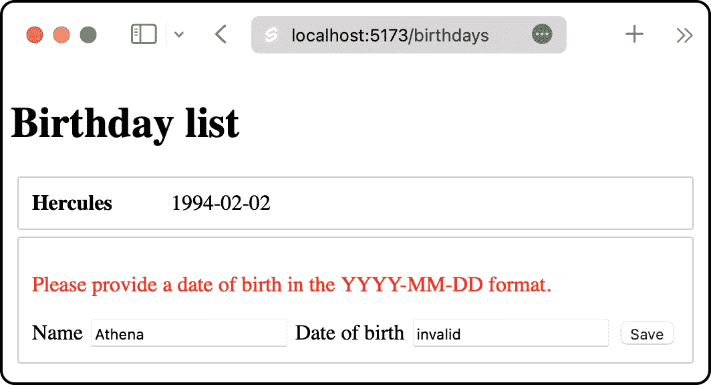

# 6

# 编辑表单数据

前两章展示了如何构建一个 HTML 表单来将新的生日添加到 *Birthdays* 应用程序中，以及如何为该表单添加服务器端验证。本章通过添加编辑现有生日信息的能力来总结表单实现。

做这件事将涉及添加 Svelte 组件状态来跟踪编辑表单是在列表模式还是编辑模式。

到目前为止，服务器一直在使用纯 JavaScript 数组存储数据。我们一直使用 TDD 来强制实施最简单的可能工作的实现。本章引入了一个更复杂的实现，它使用了一个 `Map` 对象，我们将作为 *Refactor* 步骤的一部分，在 *Red-Green-Refactor* 工作流程中进行。

本章将涵盖以下关键主题：

+   规划未来的路径

+   为编辑表单数据添加 Playwright 测试

+   逐步演化存储库以允许 ID 查找

+   更新表单操作以处理编辑

+   使用新的编辑模式更新列表页面

到本章结束时，你将看到如何使用 TDD 来演化系统设计，当你增加软件系统的功能时。

# 技术要求

该章节的代码可以在网上找到，地址为 [`github.com/PacktPublishing/Svelte-with-Test-Driven-Development/tree/main/Chapter06/Start`](https://github.com/PacktPublishing/Svelte-with-Test-Driven-Development/tree/main/Chapter06/Start)。

# 规划未来的路径

在我们开始编写代码之前，让我们做一些初步设计，以便有一个大致的行动路线。

总体目标是允许系统中的每个生日条目都可以被修改。我们希望重用现有的 `BirthdayForm` 组件，以便它可以用于此目的。

*图 6.1* 展示了如何更新系统以支持这个新功能的示意图。每个列表项将有一个 `Birthday` 组件，将被切换到 `BirthdayForm` 组件：



图 6.1 – 编辑生日的原型

在编辑模式下，隐藏添加生日的表单并禁止编辑其他生日是有意义的，只是为了确保始终只有一个活动表单在显示。

剩下的一个问题是如何让后端表单操作知道我们正在编辑一个生日而不是添加一个？

做这件事的一个直接方法是给每个生日数据对象添加一个特殊的 `id` 属性。这是一个服务器可以用来识别每个单独对象的唯一值。`id` 将永远不会改变且不能被编辑，而其他数据项可以更改。用户永远不需要看到 `id` 值。它的目的是简单地启用现有数据项的修改。

我们可以使用标准的 JavaScript `randomUUID` 函数来生成一个唯一的字符串，为每个生日创建一个 `id`。

*图 6**.2*显示了各种 SvelteKit 组件和函数，以及实现此功能所需的重要数据，包括页面组件中的新编辑状态变量和用于选择编辑生日所用的`id`字段：



图 6.2 – 使用组件状态和查找表实现编辑行为

在继续之前，值得注意的是，我们当前的生日存储库以纯 JavaScript 数组的形式存储其`birthday`对象。这对于列出和添加新项目来说是不错的，但不是在不需要更新版本的情况下替换现有项目的理想数据结构。更好的数据结构是一个`Map`对象，它允许我们根据键轻松更新项目。由于我们已经意识到我们需要一个固定的`id`值来表示每个生日，我们已经有了一个很好的键选择。

这就完成了我们的初步设计。有了计划，现在是时候进行端到端测试了。

# 添加用于编辑表单数据的 Playwright 测试

在本节中，我们将构建我们系统的最新 Playwright 测试。因为这个测试相当长，我们将逐步构建它。在*第七章*“整理测试套件”中，我们将看看如何缩短这个测试脚本。

让我们按照以下步骤创建测试：

1.  在`tests/birthday.test.js`中，使用以下代码开始测试，该代码加载应用程序、`/birthdays`端点，然后完成表单以添加`Ares`的新生日。我们必须小心地找到名为**保存**的按钮。这是因为我们现在将在页面上有多个按钮：一个名为**保存**的按钮，然后是多个名为**编辑**的按钮：

    ```js
    test('edits a birthday', async ({ page }) => {
      await page.goto('/birthdays');
      // add a birthday using the form
      await page.getByLabel('Name').fill('Ares');
      await page
        .getByLabel('Date of birth')
        .fill('1985-01-01');
      await page
        .getByRole('button', { name: 'Save' })
        .click();
    });
    ```

1.  接下来，添加以下命令以找到`Ares`。这使用特殊的`getByRole('listitem').filter(...)`链式命令，该命令找到一个具有`listitem`角色的元素（意味着`li`元素），同时也包含`'Ares'`文本。然后我们在该列表项元素中找到**编辑**按钮：

    ```js
    await page
      .getByRole('listitem')
      .filter({ hasText: 'Ares' })
      .getByRole('button', { name: 'Edit' })
      .click();
    ```

1.  我们现在假设已经出现了一个新的表单，用于编辑`Ares`的生日信息。使用以下代码继续测试，该代码将`出生日期`字段替换为另一个值，然后点击**保存**按钮：

    ```js
    await page
      .getByLabel('Date of birth')
      .fill('1995-01-01');
    await page
      .getByRole('button', { name: 'Save' })
      .click();
    ```

1.  使用几个期望来完成新的测试。我们检查原始出生日期不再出现，而新的出生日期确实出现：

    ```js
    // check that the original text doesn't appear
    await expect(
      page
        .getByRole('listitem')
        .filter({ hasText: 'Ares' })
    ).not.toContainText('1985-01-01');
    // check that the new text does appear
    await expect(
      page
        .getByRole('listitem')
        .filter({ hasText: 'Ares' })
    ).toContainText('1995-01-01');
    ```

1.  最后，需要修改之前的 Playwright 测试。每个测试都假设页面上只有一个按钮，即`find a button`，并将它们更改为`find a button named Save`。找到所有看起来像这样的行：

    ```js
    await page.getByRole('button').click();
    ```

并将它们更新如下：

```js
await page.getByRole('button',
{ name: 'Save' }
).click();
```

这就完成了新的测试。您可以看到，我们已经在新的**编辑**按钮及其操作上做出了一些设计决策。

如果您现在使用`npm test`命令运行测试，您将看到新的测试超时等待**编辑**按钮出现：

```js
Test timeout of 30000ms exceeded.
...
waiting for getByRole('listitem').filter({ hasText: 'Ares' }).getByRole('button', { name: 'Edit' })
```

在下一节中，我们将将其转换为关于应用程序代码的决定。

# 使存储库进化以允许 ID 查找

现在是时候更新我们的生日数据项，包括一个 `id` 字段。

让我们从一个新的测试开始，检查 `id` 是否存在。

1.  首先将此测试添加到 `src/routes/birthdays/page.server.test.js` 文件中，在名为 `/birthdays - default action` 的 `describe` 块内。它检查每个生日都有一个与其关联的唯一 `id` 字段：

    ```js
    it('saves unique ids onto each new birthday', async () => {
      const request = createFormDataRequest({
        name: 'Zeus',
        dob: '2009-02-02'
      });
      await actions.default({ request });
      await actions.default({ request });
      expect(birthdayRepository.getAll()[0].id).not
      .toEqual(birthdayRepository.getAll()[1].id);
    });
    ```

1.  在 `src/lib/server/birthdayRepository.js` 中使其通过。首先添加 `import` 语句：

    ```js
    import { randomUUID } from 'crypto';
    ```

1.  然后更新 `addNew` 函数的定义：

    ```js
    export const addNew = (item) =>
      db.push({ ...item, id: randomUUID() });
    ```

1.  如果你现在运行测试，你会看到测试通过了，但我们测试套件中的另一个部分出现了新的失败。由于这些新的 `id` 字段，`返回两个项目的固定值` 测试现在出现了错误。我们可以通过使用 `expect.objectContaining` 约束函数来修复这个问题，这是一个有用的工具，可以用来表示，“我不在乎除了这些属性之外的一切”。它是减少测试脆弱性的有用工具。现在更新那个测试，如下面的代码块所示：

    ```js
    it('returns a fixture of two items', () => {
      const result = load();
      expect(result.birthdays).toEqual([
        expect.objectContaining({
          name: 'Hercules',
          dob: '1994-02-02'
        }),
        expect.objectContaining({
          name: 'Athena',
          dob: '1989-01-01'
        })
      ]);
    });
    ```

1.  现在添加这个下一个测试，该测试检查如果我们发送一个带有 `id` 属性的请求，那么我们应该选择更新与该 `id` 匹配的项目，而不是添加一个新的生日。注意 `storedId` 函数的使用，它提取出已保存到存储库中的 `id` 属性：

    ```js
    const storedId = () =>
      birthdayRepository.getAll()[0].id;
    it('updates an entry that shares the same id', async () => {
      let request = createFormDataRequest({
        name: 'Zeus',
        dob: '2009-02-02'
      });
      await actions.default({ request });
      request = createFormDataRequest({
        id: storedId(),
        name: 'Zeus Ex',
        dob: '2007-02-02'
      });
      await actions.default({ request });
      expect(birthdayRepository.getAll()).toHaveLength(1);
      expect(birthdayRepository.getAll()).toContainEqual({
        id: storedId(),
        name: 'Zeus Ex',
        dob: '2007-02-02'
      });
    });
    ```

1.  现在是时候重构我们的 `db` 值，使其成为一个 `Map` 对象，而不是数组，正如我们在上一节中讨论的那样。进行这个重构将使这个新测试变得简单。但我们不在 *Red* 上 *重构*。所以，首先跳过你刚刚编写的测试，并检查测试套件是否 *Green*。

    ```js
    it.skip('updates an entry that shares the same id', async () => {
      ...
    });
    ```

1.  在 `src/lib/server/birthdayRepository.js` 中，将 `db`、`addNew`、`getAll` 和 `clear` 替换为使用 `Map` 对象的这个实现：

    ```js
    const db = new Map();
    export const addNew = (item) => {
      const id = randomUUID();
      db.set(id, { ...item, id });
    };
    export const getAll = () => Array.from(db.values());
    export const clear = () => db.clear();
    ```

1.  在此更改后运行测试，并确保它们仍然是 *Green*。

有信心地进行重构

注意，你的单元测试的存在消除了当你完全替换内部数据结构时的任何改变恐惧。测试鼓励你做出任何必要的更改，而不用担心行为上的无意改变。

所有测试都应该通过——太棒了！

本节向您展示了另一个示例，说明我们可以如何使用 TDD 将复杂设计推迟到单元测试迫使我们的时候。您已经看到我们可以如何将一个重要变量从数组迁移到 `Map` 对象。

现在让我们继续构建编辑功能。

# 更新表单操作以处理编辑

在本节中，我们将继续更新存储库以处理更新生日以及添加新生日。我们将分三部分来处理这个问题：首先，替换 `db` 字段中的项目，其次，防止无效的 `id` 值，最后，确保在验证错误中返回 `id` 值，以便用户可以更正相同的生日。

## 替换存储库中的项目

让我们从上一节中写的测试开始：

1.  取消 `src/routes/birthdays/page.server.test.js` 文件中你最后写的测试的跳过。确保运行测试并观察它失败，确保你处于 *红色* 状态：

    ```js
    it('updates an entry that shares the same id', async () => {
      ...
    });
    ```

1.  为了使这个测试通过，首先在 `src/lib/server/birthdayRepository.js` 中添加一个 `replace` 函数：

    ```js
    export const replace = (id, item) =>
      db.set(id, { ...item, id });
    ```

1.  然后，将那个新函数导入到 `src/routes/birthdays/+page.server.js`：

    ```js
    import {
      addNew,
      getAll,
      replace
    } from '$lib/server/birthdayRepository.js';
    ```

1.  更新 `actions` 常量，首先从请求中提取 `id`，然后使用该 `id` 值来切换行为。如果 `id` 存在，则调用 `replace` 函数；否则，调用 `addNew` 函数：

    ```js
    export const actions = {
      default: async ({ request }) => {
        const data = await request.formData();
        const id = data.get('id');
        ...
        if (id) {
          replace(id, {
            name,
            dob
          });
        } else {
          addNew({ name, dob });
        }
      }
    };
    ```

1.  重新运行你的测试；你现在应该处于 *绿色* 状态。

接下来，让我们确保只接受有效的 `id` 值。

## 防止未知标识符

我们需要的最后一个验证是确保我们不会尝试更新库中不存在的项目。让我们从一个新的测试上下文开始：

1.  仍然在 `src/routes/birthdays/page.server.test.js` 中，向 *验证错误* 上下文中添加一个新的嵌套 `describe` 块，如下面的代码所示。我已经跳过了一些内容，并包括了 *三个* 测试，因为我们之前已经解决过这类测试，并且我们可以对同时解决它们有信心：

    ```js
    describe('when the id is unknown', () => {
      let result;
      beforeEach(async () => {
        const request = createFormDataRequest({
          id: 'unknown',
          name: 'Hercules',
          dob: '2009-01-02'
        });
        result = await actions.default({
          request
        });
      });
      it('does not save the birthday', () => {
        expect(load().birthdays).not.toContainEqual(
          expect.objectContaining({
            name: 'Hercules',
            dob: 'unknown'
          })
        );
      });
      it('returns a 422', () => {
        expect(result.status).toEqual(422);
      });
      it('returns a useful message', () => {
        expect(result.data.error).toEqual(
          'An unknown ID was provided.'
        );
      });
    });
    ```

1.  要使这个通过，首先在 `src/lib/server/birthdayRepository.js` 中添加一个新的 `has` 函数：

    ```js
    export const has = (id) => db.has(id);
    ```

1.  然后将它导入到 `src/routes/birthdays/+page.server.js`：

    ```js
    import {
      addNew,
      getAll,
      replace,
      has
    } from '$lib/server/birthdayRepository.js';
    ```

1.  最后，通过添加一个新的防护子句来利用它。

    ```js
    if (id && !has(id)) {
      return fail(422, {
        error: 'An unknown ID was provided.'
      });
    }
    ```

我们几乎完成了表单操作验证，但还有一件事需要做。

## 更新返回值以包含标识符

当发生验证错误时，例如当 `name` 字段为空时，我们需要确保 `id` 表单值包含在返回的错误值中。这确保了在网页浏览器中，可以重新打开正确的编辑表单，以便用户更正他们的编辑。

在我们开始代码更改之前，让我们讨论一下策略。这是应用程序代码最终将呈现的样子：

```js
if (empty(name)) {
  return fail(422, {
id,
    dob,
    error: 'Please provide a name.'
  });
}
```

在你做出更改之前，考虑一下你将如何测试这个。我们已经有了一个检查返回值内容的测试，所以一个选择是回过头来编辑这个测试，如下所示：

```js
beforeEach(async () => {
  const request = createFormDataRequest({
    id: '123',
    name: 'Hercules'
  });
});
```

但不要这样做。

我发现编辑之前的测试通常是一个坏主意。原因是它可能会产生测试，最终指定了永远不会发生的不合法场景。前面的例子确实是一个不合法的场景。这是因为系统中没有 `id` 值为 `123` 的生日。为了使其有效，我们需要新的测试设置说明，创建一个 `id` 值为 `123` 的生日，以确保 `id` 值是有效的。

但如果我们这样做，那么我们就没有对添加生日时的原始场景进行测试了！相反，让我们创建新的测试，覆盖可能发生的两种用例：编辑生日时无效的名称或无效的出生日期。

基于场景的测试

当你编写单元测试时，始终确保你的测试覆盖了有效场景。如果你遵循 TDD，那通常意味着总是添加新的测试而不是返回修改现有测试。

让我们从在`validation` `errors`上下文中添加一个新的嵌套上下文开始：

1.  添加以下带有相关`beforeEach`块的`describe`上下文，该块将生日添加到系统中：

    ```js
    describe('when replacing an item', () => {
      beforeEach(async () => {
        let request = createFormDataRequest({
          name: 'Zeus',
          dob: '2009-02-02'
        });
        await actions.default({ request });
      });
    });
    ```

1.  现在，将第一个测试添加到上下文中。它尝试编辑创建的生日，但名称为空。期望检查响应中返回的`id`值是否相同：

    ```js
    it('returns the id when an empty name is provided', async () => {
      const request = createFormDataRequest({
        id: storedId(),
        name: '',
        dob: '1982-05-01'
      });
      const result = await actions.default({
        request
      });
      expect(result.data).toContain({ id: storedId() });
    });
    ```

1.  为了使这一步通过，请在相关的保护子句中包含`id`属性：

    ```js
    if (empty(name)) {
      return fail(422, {
        id,
        dob,
        error: 'Please provide a name.'
      });
    }
    ```

1.  接下来，添加一个针对无效出生日期的测试：

    ```js
    it('returns the id when an empty date of birth is provided', async () => {
      const request = createFormDataRequest({
        id: storedId(),
        name: 'Hercules',
        dob: ''
      });
      const result = await actions.default({
        request
      });
      expect(result.data).toContain({ id: storedId() });
    });
    ```

1.  为了使这一步通过，更新第二个保护子句，如下所示：

    ```js
    if (invalidDob(dob)) {
      return fail(422, {
        id,
        name,
        dob,
        error:
          'Please provide a date of birth in the YYYY-MM-DD format.'
      });
    }
    ```

这样就完成了表单操作的更改。

倾听你的测试

倾听你的测试非常重要。如果它们编写和更新起来很困难，那么这可能意味着测试可以改进或应用程序代码设计可以改进。

在*第九章*《从框架中提取逻辑》中，我们将验证移动到生日仓库中，这将给我们一个重新思考这些测试结构的机会。

本节涵盖了大量的更改：为替换项目添加仓库功能，更新表单操作以添加或替换项目，添加另一个保护子句以防止无效替换，并最终更新现有的保护子句以返回`id`值。

现在是时候更新页面组件以在编辑模式下显示`BirthdayForm`了。

# 更新列表页面以使用新的编辑模式

在本节中，你将更新页面，使其能够切换到特定生日的编辑模式。这依赖于有一个隐藏的表单字段用于`id`值。

测试隐藏字段

测试库没有提供一种简单的方法来查询`隐藏`输入字段，因为它通常关注的是用户可以看到的内容，而我们的`id`字段是故意设计成内部系统细节。

幸运的是，我们可以退回到标准的**文档对象模型**（**DOM**）表单 API 来解决这个问题。

为 SvelteKit 等框架编写单元测试的性质意味着有时你需要检查像这样的内部细节。

让我们从一个新的嵌套`describe`块中的新测试开始：

1.  在`src/routes/birthdays/BirthdayForm.test.js`文件中，并在`describe`块中的`BirthdayForm`根内部，添加这个新的嵌套`describe`块和测试：

    ```js
    describe('id field', () => {
      it('contains a hidden field for the id if an id is
      given', () => {
        render(BirthdayForm, { form: { id: '123' } });
        expect(
          document.forms.birthday.elements.id.value
        ).toEqual('123');
      });
    });
    ```

1.  为了使这一步通过，更新`BirthdayForm`组件（在`src/routes/birthdays/BirthdayForm.svelte`）以包含一个新的隐藏字段：

    ```js
    <form method="post" name="birthday">
      <input type="hidden" name="id" value={form?.id} />
    </form>
    ```

1.  注意我们如何需要可选链（使用`form?`）来确保我们的现有测试（没有`form`属性）继续工作。然而，这提出了一个问题：如果我们不是在编辑而是在创建，`id`字段的值是什么？我们需要另一个测试，你可以将其添加到同一个`describe`块中：

    ```js
    it('does not include the id field if no id is present', () => {
      render(BirthdayForm);
      expect(
        document.forms.birthday.elements.id
      ).not.toBeDefined();
    });
    ```

1.  为了使这个测试通过，将可选链提升到条件中，该条件将`BirthdayForm`组件中的隐藏`input`元素包装起来：

    ```js
    <form method="post" name="birthday">
      {#if form?.id}
        <input type="hidden" name="id" value={form.id} />
      {/if}
    </form>
    ```

好了，这就是`BirthdayForm`组件本身的所有内容。现在关于页面组件呢？

## 在页面上添加切换模式

在本节中，你将引入一个名为`editing`的组件状态变量，使我们能够在*创建*和*更新*模式之间切换。

让我们从显示页面上列出的每个生日的**编辑**按钮开始：

1.  在`src/routes/birthdays/page.test.js`中添加以下测试。请记住，默认情况下，仓库有两个项目，因此这个测试允许我们测试*两个*都有一个**编辑**按钮：

    ```js
    it('displays an Edit button for each birthday in the list', () => {
      render(Page, { data: { birthdays } });
      expect(
        screen.queryAllByRole('button', {
          name: 'Edit'
        })
      ).toHaveLength(2);
    });
    ```

1.  为了使这个测试通过，在`/src/routes/birthdays/+page.svelte`中，更新每个`li`元素以包含一个新的`button`元素：

    ```js
    <ol>
      {#each data.birthdays as birthday}
        <li>
          <Birthday {...birthday} />
          <button>Edit</button>
        </li>
      {/each}
    </ol>
    ```

1.  接下来，当我们点击那个按钮时会发生什么？让我们添加一组测试来检查使用`beforeEach`函数（我们将用它来提取每个测试的公共设置）时的行为。第二个是为`click`函数，它将用于模拟 DOM 点击事件：

    ```js
    import {
      describe,
      it,
      expect,
      beforeEach
    } from 'vitest';
    import { click } from '@testing-library/user-event';
    ```

1.  然后添加这个新的嵌套`describe`块和测试。`beforeEach`函数用于提取测试的*安排*部分，以避免在后续的每个测试中重复它。此代码还使用了一个名为`firstEditButton`的辅助函数，使测试可读且简短：

    ```js
    describe('when editing an existing birthday', () => {
      beforeEach(() =>
        render(Page, { data: { birthdays } })
      );
      const firstEditButton = () =>
        screen.queryAllByRole('button', {
          name: 'Edit'
        })[0];
      it('hides the existing birthday information', async
      () => {
        await click(firstEditButton());
        expect(
          screen.queryByText('Hercules')
        ).toBeNull();
      });
    });
    ```

1.  为了使这个测试通过，首先在页面组件中引入一个新的组件状态变量`editing`：

    ```js
    <script>
      ...
      let editing = null;
    </script>
    ```

1.  当`editing`到特定的`birthday`对象时，这个对象是由`each`构造函数给我们的。然后我们可以用条件包装原始的`Birthday`组件；如果`editing`等于当前的`birthday`对象，则不显示`Birthday`：

    ```js
    <ol>
      {#each data.birthdays as birthday}
        <li>
          {#if editing !== birthday}
            <Birthday {...birthday} />
          {/if}
            <button
              on:click={() => (editing = birthday)}>
                Edit</button>
        </li>
      {/each}
    </ol>
    ```

1.  接下来，我们还想隐藏添加页面的原始表单：

    ```js
    it('hides the birthday form for adding new birthdays', async () => {
      await click(firstEditButton());
      expect(
        screen.queryByRole('heading', {
          name: 'Add a new birthday'
        })
      ).toBeNull();
    });
    ```

1.  为了使这个测试通过，将页面组件的最后部分用`if`包装起来：

    ```js
    {#if !editing}
      <h1>Add a new birthday</h1>
      <div>
        <BirthdayForm {form} />
      </div>
    {/if}
    ```

但是等等！我们现在正在定义一个静态元素的行为，我们之前从未测试过：标题。`添加新生日`文本是我们没有费心测试的东西。但现在它是我们测试套件的一个组成部分，我们当然应该有一个测试来证明它最初在那里？（否则，使最后一个测试变为*绿色*的最直接方法就是删除标题。）

事实上，现在就做吧。删除它并观察你的测试套件愉快地通过。为了将其恢复，我们需要一个失败的测试：

1.  在测试套件的顶部添加这个新测试：

    ```js
    it('displays a heading for "Add a new birthday"', () => {
      render(Page, { data: { birthdays } });
      expect(
        screen.queryByRole('heading', {
          name: 'Add a new birthday'
        })
      ).toBeVisible();
    });
    ```

1.  观察测试失败，然后继续取消删除标题。

1.  接下来是下一个测试。这次，让我们检查是否显示了`BirthdayForm`。我们可以通过查找包含现有名称的`Name`字段来完成（在这种情况下，是`Hercules`）：

    ```js
    it('shows the birthday form for editing', async () => {
      await click(firstEditButton());
      expect(
        screen.getByLabelText('Name')
      ).toHaveValue('Hercules');
    });
    ```

1.  为了使这个测试通过，用一个新的`:else`块充实`if`条件块。注意这里的执行顺序发生了变化：如果`editing`等于`birthday`，则显示`BirthdayForm`；否则，显示`Birthday`：

    ```js
    <ol>
      {#each data.birthdays as birthday}
        <li>
          {#if editing == birthday}
            <BirthdayForm form={editing} />
          {:else}
            <Birthday {...birthday} />
          {/if}
          ...
        </li>
      {/each}
    </ol>
    ```

1.  现在我们页面上有了**保存**按钮，难道我们不应该隐藏所有的**编辑**按钮吗？是的，让我们这么做：

    ```js
    it('hides all the Edit buttons', async () => {
      await click(firstEditButton());
      expect(
        screen.queryByRole('button', {
          name: 'Edit'
        })
      ).toBeNull();
    });
    ```

1.  要使它通过，在按钮周围引入另一个`if`块：

    ```js
    {#if !editing}
      <button
        on:click={() => (editing = birthday)}>
          Edit</button>
    {/if}
    ```

1.  还有一个最后的测试。这是一个重要的测试。它检查如果 SvelteKit 返回一个带有`id`值的`form`对象，那么我们需要立即开始对该生日进行*编辑*模式。由于`id`值在这里很重要，这个测试包括它自己的`data`和`form`属性：

    ```js
    it('opens the form in editing mode if a form id is passed in', () => {
      render(Page, {
        data: {
          birthdays: [
            {
              id: '123',
              name: 'Hercules',
              dob: '1994-02-02'
            }
          ]
        },
        form: {
          id: '123',
          name: 'Hercules',
          dob: 'bad dob',
          error: 'An error'
        }
      });
      expect(
        screen.queryByRole('heading', {
          name: 'Add a new birthday'
        })
      ).toBeNull();
    });
    ```

使用工厂方法缩短测试

在*第七章*，*整理测试套件*中，您将创建一个用于生日的工厂方法，这将缩短这个测试。

1.  测试暗示`editing`的初始值取决于`form`。所以，现在更新它，使其看起来像这样：

    ```js
    let editing = form?.id ? form : null;
    ```

1.  然后，因为我们正在处理不同的对象，我们不能再使用基于对象身份的相等性来匹配当前正在编辑的生日。所以，更新第一个`if`，使其像以下代码所示，检查`id`而不是整个对象本身：

    ```js
    {#if editing?.id === birthday.id}
      ...
    {/if}
    ```

1.  现在，由于对`id`字段的这种新依赖，您会发现其他测试正在中断。更新`birthdays`数组，包括像这样的`id`值：

    ```js
    const birthdays = [
      {
        id: '123',
        name: 'Hercules',
        dob: '1994-02-02'
      },
      {
    id: '234',
        name: 'Athena',
        dob: '1989-01-01'
      }
    ];
    ```

从这一点开始，您的测试应该通过，包括 Playwright 测试。

*图 6**.3*显示了如果您启动开发服务器（使用`npm run dev`命令）并尝试用无效日期替换现有的生日，应用程序看起来会是什么样子：



图 6.3 – 编辑生日时的验证错误

本节向您展示了如何使用 Svelte 组件状态在表单的添加和编辑模式之间切换，以及如何对这两种修改进行测试驱动开发，既在表单组件中也在页面组件中。

# 摘要

本章演示了在放置了大量代码之后，TDD 过程是如何工作的。此外，您还看到了我们如何使用与*第二章*，*介绍红-绿-重构工作流程*中学习到的相同的*红-绿-重构*工作流程来构建功能：首先，通过重构存储实现，然后通过引入 Svelte 组件状态。

在下一章中，我们将停下来看看我们可以简化当前代码库的一些方法。

# 第二部分：重构测试和应用代码

现在您已经了解了并实践了测试驱动开发的工作流程，是时候关注那些将保持您的自动化测试和应用代码整洁有序的实践和策略了。本部分中的章节将为您提供创建优雅且可维护的自动化测试套件的指导。

这一部分包含以下章节：

+   *第七章*，*整理测试套件*

+   *第八章*，*创建匹配器以简化测试*

+   *第九章*, *从框架中提取逻辑*

+   *第十章*, *测试驱动 API 端点*

+   *第十一章*, *用并排实现替换行为*

+   *第十二章*, *使用组件模拟来澄清测试*

+   *第十三章*, *添加 Cucumber 测试*
