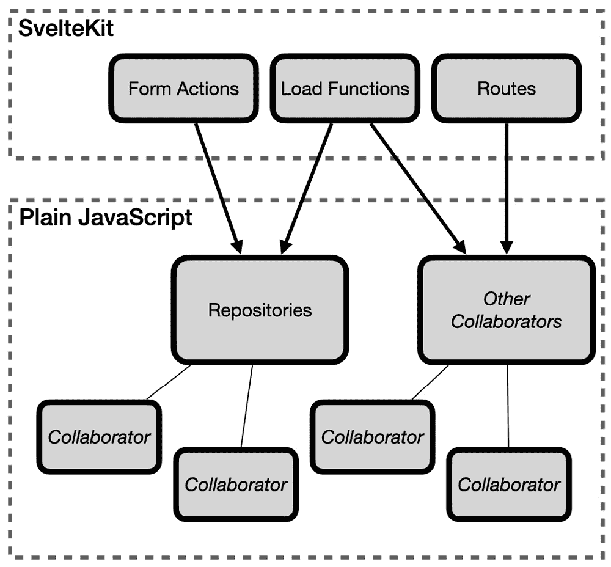

# 9

# 从框架中提取逻辑

可维护软件的一个重要属性是其**可测试性**。这是指应用程序的所有部分都应该易于测试。更具体地说，应用程序代码的设计应该使其容易编写自动化的单元测试。

在本章中，我们将探讨一种提高可测试性的技术：将领域逻辑从框架中移出并放入纯 JavaScript。纯 JavaScript 代码更容易测试，因为没有复杂的框架对象与你的代码交互。

下面的图示展示了如何以这种方式思考 SvelteKit 代码库。



图 9.1 – 将应用程序代码保留在框架组件之外以帮助可测试性

在*第七章*“整理测试套件”中，我们朝着将生日数据项的存储移入`birthdayRepository`模块迈出了一步。我们将继续这个过程，通过将数据验证从 SvelteKit 表单操作中移出并放入`birthdayRepository`。这意味着我们可以测试复杂的验证规则，而无需设置复杂的 SvelteKit 表单请求对象，也无需测试表单响应对象。

由于仓库没有异步行为，移动的测试不再需要充斥着`async`和`await`关键字。

本章涵盖了以下主题：

+   使用测试待办事项列表迁移测试

+   从表单操作迁移测试

+   在仓库中复制表单验证行为

+   提取常用方法

到本章结束时，你将使用测试驱动的方法将领域逻辑从框架中移出。

# 技术要求

该章节的代码可以在网上找到，链接为[`github.com/PacktPublishing/Svelte-with-Test-Driven-Development/tree/main/Chapter09/Start`](https://github.com/PacktPublishing/Svelte-with-Test-Driven-Development/tree/main/Chapter09/Start)。

# 使用测试待办事项列表迁移测试

当前任务是将我们在*第五章*“验证表单数据”中完成的 SvelteKit 表单操作中的验证逻辑移出，并放入`birthdayRepository`模块。在这一节中，我们将使用一种新技术来规划这个任务。

你可能还记得`birthdayRepository`模块已经存在，但没有测试。在我们重构时提取模块时，我们经常会遇到这种情况。通常，不测试这些模块是完全可以接受的。问题在于当我们想要修改这些模块的行为时：我们在哪里添加测试？

对于这个问题，没有明确的答案，但在这个情况下，我们将利用这个机会在`birthdayRepository`模块中复制所有来自表单操作的测试，同时也会添加一些新的测试。

删除原始位置的测试

我们不会删除原始测试，但你应该考虑这样做，以免过度测试。（比过度测试更糟糕的是不足测试！）

`it` 测试函数有一个特殊的修饰符，可以用于规划测试套件：`it.todo` 修饰符。作为一种前置规划，当你已经有一个具体的测试套件中所需测试的明确想法时，它非常有用。

`birthdayRepository` 模块导出了两个我们感兴趣要测试的函数：`addNew` 和 `replace` 函数。我们将把现有的表单操作测试在这两个新函数之间分配。验证错误的测试需要为两个函数重复。这样，每个函数都将被完全指定。

继续创建 `src/lib/server/birthdayRepository.test.js` 文件，并包含以下内容。这会放置所有导入，并通过调用 `clear` 来初始化 `birthdayRepository` 测试套件，以便每个测试都从一个空白状态开始。

还有一个 `storedId` 的定义——我们可以使用与表单操作测试中相同的技巧来验证数据。我们还添加了一个检查初始状态的空测试：

```js
import { describe, it, expect, beforeEach } from 'vitest';
import {
  createBirthday
} from 'src/factories/birthday.js';
import {
  addNew, clear, getAll, replace
} from './birthdayRepository.js';
describe('birthdayRepository', () => {
  beforeEach(clear);
  const storedId = () => getAll()[0].id;
  it.todo('is initially empty');
});
```

现在，为 `addNew` 函数添加一个嵌套的 `describe` 块。这将从 `src/routes/birthdays/page.server.test.js` 文件中获取原始测试描述，并将它们转换为更合适的形式：

```js
describe('addNew', () => {
  it.todo('adds a new birthday into the list');
  it.todo('saves unique ids onto each new birthday');
  it.todo('returns the added birthday with its id');
  describe('validation errors', () => {
    describe.todo('when the name is not provided');
    describe.todo(
      'when the date of birth in the right format'
    );
  });
});
```

是时候查看 `replace` 函数的测试了。你会看到验证错误是从 `addNew` 上下文中重复的。这突出了将单个 `entrypoint`（表单操作）拆分为两个（`addNew` 和 `replace` 函数）时的一个差异：

```js
describe('replace', () => {
  it.todo('updates an entry that shares the same id');
  it.todo('returns the updated birthday');
  describe('validation errors', () => {
    describe.todo('when the name is not provided');
    describe.todo(
      'when the date of birth in the right format'
    );
    it.todo(
      'returns the id when an empty date of birth is
       provided'
    );
  });
});
```

计划已完成。本章剩余的部分将完成测试套件，从 *happy path* 测试开始，这些测试已经通过，然后回到完成验证错误。

# 从表单操作移植测试

在本节中，我们将编写针对 `birthdayRepository` 模块中已存在的行为的测试，同时确保函数为表单操作返回可重用的值。

`src/lib/server/birthdayRepository.js` 文件已经包含了你在 *第六章*，*编辑表单数据* 中最后修改的工作代码。这里是一个提醒：

```js
import { randomUUID } from 'crypto';
const db = new Map();
export const addNew = (item) => {
  const id = randomUUID();
  db.set(id, { ...item, id });
};
export const getAll = () => Array.from(db.values());
export const clear = () => db.clear();
export const replace = (id, item) =>
  db.set(id, { ...item, id });
export const has = (id) => db.has(id);
```

大部分功能都是通过表单操作进行测试的。我们需要添加测试，然后再次检查它们是否工作。

总是要求有一个失败的测试

在移植测试时，你会编写已经通过的测试。你跳过 *Red* 步骤，直接进入 *Green*。然而，仍然重要的是要验证你的测试检查的是正确的东西，而要做到这一点，你可以删除或注释掉正在测试的应用程序代码，这样你就可以看到测试失败。

现在让我们开始吧：

1.  在 `src/lib/server/birthdayRepository.test.js` 中，从第一个测试中移除 `.todo` 修饰符，并添加以下测试内容：

    ```js
    it('is initially empty', () => {
      expect(getAll()).toHaveLength(0);
    });
    ```

1.  你会看到测试已经通过了。通过将`getAll`实现替换为`null`返回值来验证它是否测试了正确的内容，然后重新运行测试以检查它是否为红色。这样做的一个简单方法是注释掉该行的其余部分，如下所示：

    ```js
    export const getAll = () =>
      null; //Array.from(db.values());
    ```

1.  在检查测试失败后，恢复原始实现并验证它是否为绿色。

1.  填写下一个测试用例的正文，如下所示。由于以下几个原因，这比我们正在迁移的表单操作测试要简单。首先，不再有任何异步行为，其次，我们使用单个`createBirthday`工厂方法，避免了更复杂的`performFormAction`辅助方法：

    ```js
    describe('addNew', () => {
      it('adds a new birthday into the list', () => {
        addNew(createBirthday('Zeus', '2009-02-02'));
        expect(getAll()).toContainEqual(
          expect.objectContaining({
            name: 'Zeus',
            dob: '2009-02-02'
          })
        );
      });
    });
    ```

1.  虽然这已经通过了，但检查它是否为红色是很重要的。你可以通过使用相同的注释掉相关代码行的技术来完成，如下所示：

    ```js
    export const addNew = (item) => {
      const id = randomUUID();
      //db.set(id, { ...item, id });
    };
    ```

1.  在验证测试失败后，撤销注释的代码，并将测试恢复为绿色。

1.  接下来，填写第三个测试：

    ```js
    it('saves unique ids onto each new birthday', () => {
      const birthday = createBirthday(
        'Zeus',
        '2009-02-02'
      );
      addNew(birthday);
      addNew(birthday);
      expect(getAll()[0].id).not.toEqual(
        getAll()[1].id
      );
    });
    ```

1.  为了验证这一点，你可以注释掉`id`值：

    ```js
    export const addNew = (item) => {
      const id = null; //randomUUID();
      db.set(id, { ...item, id });
    };
    ```

1.  现在，我们来测试新的行为，检查对象是否与其新的`id`属性一起返回。这使用了在测试套件顶部定义的`storedId`函数：

    ```js
    it('returns the added birthday with its id', () => {
      expect(
        addNew(createBirthday('Zeus', '2009-02-02'))
      ).toEqual({
        id: storedId(),
        name: 'Zeus',
        dob: '2009-02-02'
      });
    });
    ```

1.  为了使其通过，引入一个名为`itemWithId`的变量并返回它：

    ```js
    export const addNew = (item) => {
      ...
      const itemWithId = { ...item, id };
      db.set(id, itemWithId);
      return itemWithId;
    };
    ```

1.  现在，让我们继续进行`replace`测试。我们将从迁移`beforeEach`块和`storedId`方法开始：

    ```js
    describe('replace', () => {
      beforeEach(() =>
        addNew(createBirthday('Hercules', '1991-05-06'))
      );
      const storedId = () => getAll()[0].id;
      ...
    });
    ```

1.  然后，我们将继续进行`replace`函数的第一个测试。你可以通过给它一个`null`实现的方式来验证，就像你验证`getAll`的第一个测试一样：

    ```js
    it('updates an entry that shares the same id', () => {
      replace(
        storedId(),
        createBirthday('Zeus Ex', '2007-02-02')
      );
      expect(getAll()).toHaveLength(1);
      expect(getAll()).toContainEqual({
        id: storedId(),
        name: 'Zeus Ex',
        dob: '2007-02-02'
      });
    });
    ```

1.  本节中的最后一个测试确保我们返回了更新后的项目：

    ```js
    it('returns the updated birthday', () => {
      expect(
        replace(
          storedId(),
          createBirthday('Zeus Ex', '2007-02-02')
        )
      ).toEqual({
        id: storedId(),
        name: 'Zeus Ex',
        dob: '2007-02-02'
      });
    });
    ```

1.  为了使其通过，在`addNew`函数中做出完全相同的更改：

    ```js
    export const replace = (id, item) => {
      ...
      const itemWithId = { ...item, id };
      db.set(id, itemWithId);
      return itemWithId;
    };
    ```

这就是证明现有行为的所有测试。在下一节中，我们除了需要迁移测试用例外，还需要迁移实现。

# 在仓库中复制表单验证行为

在本节中，我们将继续从`src/routes/birthdays/page.server.test.js`文件迁移测试，但现在我们将复制表单操作中的验证行为。

重复作为设计信号

以下步骤包含相当多的重复。首先，测试与你在表单操作中已经编写的测试非常相似。其次，对`addNew`和`replace`函数都进行了相同的检查。

这种*强制重复*（让你感受到重复工作的痛苦）可以帮助你找出你想要提取的（如果有的话）共享逻辑。

让我们开始：

1.  首先，填写嵌套的`validation errors` `describe`块及其中的测试。我选择一次性复制两个测试，因为这些测试非常简单，而且我们已经对实现的结果有了很好的了解：

    ```js
    describe('addNew', () => {
      ...
        describe('validation errors', () => {
          describe('when the name is not provided', () => {
            let result;
            beforeEach(() => {
              result = addNew(
                createBirthday('', '1991-05-06')
              );
            });
            it('does not save the birthday', () => {
              expect(getAll()).toHaveLength(0);
            });
            it('returns an error', () => {
              expect(result).toEqual({
                error: 'Please provide a name.'
              });
            });
          });
        });
      });
    });
    ```

1.  要在`src/lib/server/birthdayRepository.js`中实现这个通过，首先在文件底部定义`empty`函数：

    ```js
    const empty = (value) =>
      value === undefined ||
      value === null ||
      value.trim() === '';
    ```

1.  然后，更新`addNew`方法，包括使用`empty`函数的保护类。在此更改之后，两个测试都应该通过：

    ```js
    export const addNew = (item) => {
      if (empty(item.name)) {
        return { error: 'Please provide a name.' };
      }
      ...
    };
    ```

1.  现在，我们将继续到下一个嵌套的`describe`块，用于检查出生日期格式：

    ```js
    describe('when the date of birth is in the wrong format', () => {
      let result;
      beforeEach(() => {
        result = addNew(
          createBirthday('Hercules', 'unknown')
        );
      });
      it('does not save the birthday', () => {
        expect(getAll()).toHaveLength(0);
      });
      it('returns an error', () => {
        expect(result).toEqual({
          error:
            'Please provide a date of birth in the YYYY-
              MM-DD format.'
        });
      });
    });
    ```

1.  要实现这个通过，首先从表单操作中复制`invalidDob`辅助函数：

    ```js
    const invalidDob = (dob) => isNaN(Date.parse(dob));
    ```

1.  然后，添加保护子句，这将使两个测试都通过：

    ```js
    if (invalidDob(item.dob)) {
      return {
        error:
          'Please provide a date of birth in the YYYY-MM-
            DD format.'
      };
    }
    ```

1.  现在，让我们重复对`replace`函数的验证检查。在原始表单操作测试中，这并不是必需的，因为我们通过在创建生日的原始操作之上构建来实现了**编辑表单**功能，所以验证已经存在。但现在，这两个操作是分开的。填写新的嵌套`describe`块：

    ```js
    describe('replace', () => {
      ...
      describe('validation errors', () => {
        describe('when the name is not provided', () => {
          let result;
          beforeEach(() => {
            result = replace(
              storedId(),
              createBirthday('', '1991-05-06')
            );
          });
          it('does not update the birthday', () => {
            expect(getAll()[0].name).toEqual(
              'Hercules'
            );
          });
          it('returns an error', () => {
            expect(result).toEqual({
              error: 'Please provide a name.'
            });
          });
        });
      });
    });
    ```

1.  要实现这个通过，首先从`addNew`复制相同的保护子句。我们稍后会移除这个重复：

    ```js
    export const replace = (id, item) => {
      if (empty(item.name)) {
        return { error: 'Please provide a name.' };
      }
      ...
    };
    ```

1.  现在，继续到出生日期：

    ```js
    describe('when the date of birth is in the wrong format', () => {
      let result;
      beforeEach(() => {
        result = replace(
          storedId(),
          createBirthday('Hercules', 'unknown')
        );
      });
      it('does not update the birthday', () => {
        expect(getAll()[0].dob).toEqual(
          '1991-05-06'
        );
      });
      it('returns an error', () => {
        expect(result).toEqual({
          error:
            'Please provide a date of birth in the YYYY-
              MM-DD format.'
        });
      });
    });
    ```

1.  通过添加第二个保护子句来实现这个通过，重复*步骤 6*，但这次在`replace`函数中添加代码：

    ```js
    if (invalidDob(item.dob)) {
      return {
        error:
          'Please provide a date of birth in the YYYY-MM-
            DD format.'
      };
    }
    ```

1.  然后，进行最后的测试。由于只有一个测试，所以不需要`describe`块：

    ```js
    it('requires an id of a birthday that exists in the store', () => {
      expect(
        replace(
          '234',
          createBirthday('Hercules', '2009-01-02')
        )
      ).toEqual({
        error: 'An unknown ID was provided.'
      });
    });
    ```

1.  这次，将保护子句放在最上面。这个保护子句似乎应该优先于姓名和出生日期检查——注意，例如，参数在参数列表中的位置：

    ```js
    export const replace = (id, item) => {
      if (!has(id))
        return { error: 'An unknown ID was provided.' };
      ...
    }
    ```

这就完成了所有新的功能。`birthdayRepository`的所有行为都已完成。接下来，我们将停下来重构以消除重复。

# 提取公共方法

在本节中，我们将从`addNew`和`replace`函数中提取重复的验证子句，将它们移动到共享的`validate`函数中。

让我们从`validate`函数开始：

1.  在`addNew`和`replace`的定义下方，添加以下名为`validate`的函数。这个函数包含了原始函数中出现的两个保护子句。为了简化，`item`参数已经被解构为`name`和`dob`参数：

    ```js
    const validate = ({ name, dob }) => {
      if (empty(name)) {
        return { error: 'Please provide a name.' };
      }
      if (invalidDob(dob)) {
        return {
          error:
            'Please provide a date of birth in the YYYY-
              MM-DD format.'
        };
      }
    };
    ```

1.  然后，更新`addNew`，用对`validate`的调用替换其保护子句。结果存储在`validationResult`中，如果有值则可以返回：

    ```js
    export const addNew = (item) => {
      const validationResult = validate(item);
      if (validationResult) {
        return validationResult;
      }
      const id = randomUUID();
      const itemWithId = { ...item, id };
      db.set(id, itemWithId);
      return itemWithId;
    };
    ```

1.  接下来，对`replace`函数做同样的处理：

    ```js
    export const replace = (id, item) => {
      if (!has(id))
        return { error: 'An unknown ID was provided.' };
      const validationResult = validate(item);
      if (validationResult) {
        return validationResult;
      }
      const itemWithId = { ...item, id };
      db.set(id, itemWithId);
      return itemWithId;
    };
    ```

1.  现在，我们是否应该提取每个函数的最后部分？添加`set`函数：

    ```js
    const set = (id, item) => {
      const itemWithId = { ...item, id };
      db.set(id, itemWithId);
      return itemWithId;
    };
    ```

1.  然后，在`addNew`中使用它：

    ```js
    export const addNew = (item) => {
      const validationResult = validate(item);
      if (validationResult) {
        return validationResult;
      }
      return set(randomUUID(), item);
    };
    ```

1.  最后，在`replace`函数的末尾添加相同的调用：

    ```js
    export const replace = (id, item) => {
      if (!has(id))
        return { error: 'An unknown ID was provided.' };
      const validationResult = validate(item);
      if (validationResult) {
        return validationResult;
      }
      return set(id, item);
    };
    ```

这就完成了`birthdayRepository`的实现——一个简单但令人满意的重构。

# 摘要

本章介绍了将现有行为从一个地方迁移到另一个地方的技术。特别是，它展示了将业务逻辑从框架对象（如表单操作）移入普通 JavaScript 对象是多么有价值。这样做可以使测试更简单。

在这种情况下，我们的测试不再异步，也不再需要使用复杂的`performFormAction`辅助函数。

另一个好处是`birthdayRepository`及其验证可以在其他地方重用。这正是我们在下一章将要做的，当时我们将介绍与存储库交互的新 API 端点。
