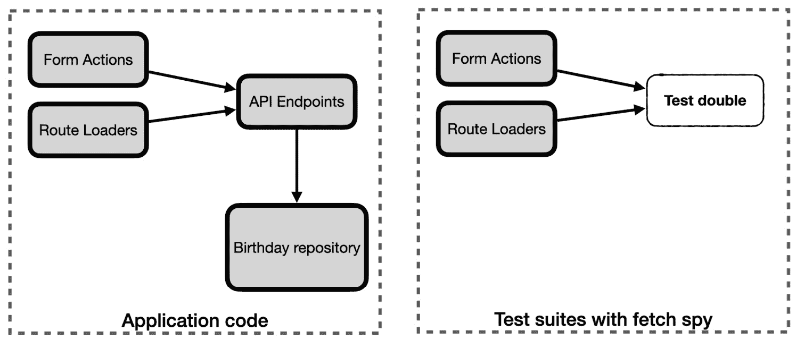

# 11

# 用并行实现替换行为

在前两个章节中，您构建了一个完整的仓库和访问它的 API。现在，是时候通过更新 SvelteKit 加载器和表单操作来使用 API 而不是仓库来完成故事弧了。

值得指出的是，这不是一个必要的步骤：保持 SvelteKit 服务器组件直接指向仓库是完全可接受的。

但将现有代码重写以指向新的 API 端点将向您介绍两个想法：首先，是**并行实现**的概念，这是一种使用测试来替换现有代码的同时确保测试套件保持**绿色**的方法。第二个是使用测试替身来保护单元测试不受 SvelteKit 的影响。测试替身取代了框架代码的位置，避免了向 API 发起真正的网络调用——这本来就不可能工作，因为 API 没有在我们的 Vitest 测试套件中运行。

*图 11.1*显示了我们的代码库的两个视图。左侧显示了我们的应用程序代码的新架构将如何看起来，其中 SvelteKit 路由加载器和表单操作指向 API 端点。右侧显示了路由加载器和表单操作的单元测试将如何看待世界。在这个设置中，根本不会访问 API 端点。



图 11.1 – 使用测试替身将 SvelteKit 行为插入单元测试套件

在更新我们的 SvelteKit 组件后，我们将通过更新 Playwright 测试以使用新的 API 并停止在测试环境中（Playwright 和 Vitest）显示数据库种子数据来结束整个工作。

本章涵盖了以下关键主题：

+   更新路由加载器以使用 API

+   更新页面表单操作以使用 API

+   使用服务器钩子来生成样本数据

到本章结束时，您将看到如何使用**间谍**（一种测试替身的形式）以及构建并行实现的过程。

# 技术要求

本章的代码可以在网上找到，地址为[`github.com/PacktPublishing/Svelte-with-Test-Driven-Development/tree/main/Chapter11/Start`](https://github.com/PacktPublishing/Svelte-with-Test-Driven-Development/tree/main/Chapter11/Start)。

# 更新路由加载器以使用 API

在本节中，您将使用 SvelteKit 的 fetch 函数引入对`GET` `/api/birthdays`端点的调用。这将涉及使用间谍。

什么是测试间谍？

间谍是一个记录每次被调用以及调用时传递的参数的函数。然后可以在之后检查以验证它是否以正确的参数被调用。间谍几乎总是也是一个*存根*，这意味着它完全避免了调用真实函数，而是返回一个硬编码的——存根——值。间谍充当真实函数的替代品。

在 Vitest 中，通过调用`vi.fn`函数来创建间谍。

当我们使用测试间谍时，你至少会有一个测试来检查传递给间谍的参数。然后你至少会有一个针对间谍返回的每个存根返回值的额外测试。

我们将使用一个间谍来模拟通过`GET` `/api/birthdays`端点检索生日。

理解 SvelteKit 的 fetch 函数

SvelteKit 为用户定义的`load`函数和表单操作提供了一个`fetch`参数。此参数的值是一个具有与浏览器提供的标准 Fetch API 相同语义的函数。区别在于机制：SvelteKit 的`fetch`函数能够绕过对服务器的调用，以便它们不会引起 HTTP 请求，而是直接输入与指定路由匹配的`GET`函数。

让我们从一个新的工厂方法定义开始：

1.  创建一个名为`src/factories/fetch.js`的新文件，并添加以下定义。我们将使用它来构建测试间谍将返回的存根`Response`对象：

    ```js
    export const fetchResponseOk = (response = {}) => ({
      status: 'ok',
      json: () => Promise.resolve(response)
    });
    ```

1.  现在打开`src/routes/birthdays/page.server.test.js`中的测试文件，并添加一个`import`语句到该函数：

    ```js
    import {
      fetchResponseOk
    } from 'src/factories/fetch.js';
    ```

1.  接下来，更新 Vitest 的`import`语句以包含对`vi`的导入，如下所示：

    ```js
    import {
      describe,
      it,
      expect,
      beforeEach,
      vi
    } from 'vitest';
    ```

1.  在`describe`块底部添加以下测试。除了通过调用`vi.fn()`创建测试间谍外，它还使用`mockResolvedValue`函数指定间谍应返回一个包装在`Promise`对象中的值。测试以`toBeCalledWith`匹配器结束，以验证间谍以正确的方式被调用：

    ```js
    describe('/birthdays - load', () => {
      ...
      it('calls fetch with /api/birthdays', async () => {
        const fetch = vi.fn();
        fetch.mockResolvedValue(fetchResponseOk());
        const result = await load({ fetch });
        expect(fetch).toBeCalledWith('/api/birthdays');
      });
    });
    ```

1.  为了使其通过，我们将从并行实现开始。这意味着之前的实现仍然与新的实现并存。在`src/routes/birthdays/+page.server.js`文件中，修改`load`函数，使其接受一个`fetch`参数，并将其作为第一件事调用，如下所示：

    ```js
    export const load = ({ fetch }) => {
      fetch('/api/birthdays');
      return {
        birthdays: getAll()
      }
    };
    ```

这将导致原始测试用例因缺少`fetch`的值而失败。我们即将删除此测试，但暂时让我们通过修复测试来自我娱乐。

1.  更新测试用例以使用一个非常简单的存根值`fetch`，如下所示。这突出了这样一个事实：由`vi.fn`创建的 Vitest 间谍并不总是必要的。如果你没有检查间谍，那么一个普通的存根就足够了：

    ```js
    describe('/birthdays - load', () => {
      it('returns a fixture of two items', () => {
        const result = load({ fetch: () => {} });
        ...
      });
    });
    ```

1.  继续编写第二个测试，该测试检查`load`函数返回从`fetch`返回的任何数据。这次，我们需要向`fetchResponseOk`传递一个实际值，并将其与`return`值进行比较：

    ```js
    describe('/birthdays - load', () => {
      ...
      it('returns the response body', async () => {
        const birthdays = [
          createBirthday('Hercules', '1994-02-02'),
          createBirthday('Athena', '1989-01-01')
        ];
        const fetch = vi.fn();
        fetch.mockResolvedValue(
          fetchResponseOk({ birthdays })
        );
        const result = await load({ fetch });
        expect(result).toEqual({ birthdays });
      });
    });
    ```

1.  然后更新`load`函数以返回此值：

    ```js
    export const load = async ({ fetch }) => {
      const result = await fetch('/api/birthdays');
      return result.json();
    };
    ```

1.  你可能已经注意到这与我们最初编写的测试直接冲突。当我们构建并排实现时，最后一步通常是替换返回值。当发生这种情况时，就是删除原始测试的时候了。所以，请删除原始测试——唯一一个标题为 *返回两个项目的固定装置* 的测试——因为它不再适用。

1.  最后，从 `+``page.server.js` 文件中删除 `getAll` 导入：

    ```js
    import {
      addNew,
      replace
    } from '$lib/server/birthdayRepository.js';
    ```

现在，你已经看到了如何使用 `vi.fn` 创建一个用于测试 `fetch` 调用的测试间谍和一个基本的并排实现。下一节将重复相同的流程来测试页面表单操作，但这次实现更复杂。

# 更新页面表单操作以使用 API

在本节中，我们将更新页面表单操作，使用 API 上的新 `POST` 和 `PUT` 方法，而不是存储库的 `addNew` 和 `replace` 函数。

这将使用与上一节相同的并排技术来完成，但这次更复杂。我们仍然需要测试来验证间谍是否以正确的参数被调用，并且返回值被给出。但现在我们还需要验证错误是否被转换为 SvelteKit 表单失败，因为表单操作对错误有单独的处理。

这里另一个重要的变化是，我们将使用两个测试来检查传递给 `fetch` 调用的参数。当面对有 *团块* 参数具有不同意义的复杂参数时，这是一种强大的技术。

在 `fetch` 的情况下，URL 和 HTTP 动词是一个 *团块*：我们可以有一个单独的测试来验证，例如，我们是否调用了 `POST` `/api/birthdays` 端点。但还有 `body` 属性，由于这不是静态数据——它根据表单操作输入参数而变化——因此为它提供一个单独的测试似乎是合理的。

最后，由于 API 端点正在执行数据验证，我们不再需要该功能。因此，我们将通过删除该实现及其相关测试来完成。

让我们开始更新现有的 `describe` 块，添加一些新的设置：

1.  找到名为 `/birthdays - default action` 的 `describe` 块，并添加以下三件设置：一个可以在所有测试中访问的 `fetch` 变量；一个新的 `beforeEach` 块来设置 `fetch` 响应；以及一个更新的 `performFormAction` 方法，该方法传递 `fetch` 参数：

    ```js
    describe('/birthdays - default action', () => {
      const fetch = vi.fn();
      beforeEach(() => {
        fetch.mockResolvedValue(fetchResponseOk());
      });
      const performFormAction = (formData) =>
        actions.default({
          request: createFormDataRequest(formData),
          fetch
        });
      ...
    });
    ```

1.  然后，添加这个新的嵌套 `describe` 块及其单个测试，位于所有现有测试的下方。它检查 `fetch` 间谍是否以正确的 URL 和 `POST` 的 `method` 被调用：

    ```js
    describe('when adding a new birthday', () => {
      it('requests data from POST /api/birthdays', async
      () => {
        await performFormAction(
          createBirthday('Zeus', '2009-02-02')
        );
        expect(fetch).toBeCalledWith(
          '/api/birthdays',
          expect.objectContaining({ method: 'POST' })
        );
      });
    });
    ```

1.  要使其通过，首先将 `fetch` 参数添加到表单操作中：

    ```js
    export const actions = {
      default: async ({ request, fetch }) => {
      ...
    }
    ```

1.  然后，开始进行并排实现。找到对 `addNew` 的调用，并在其下方添加一个新的 `fetch` 调用，如下所示：

    ```js
    let result;
    if (id) {
      ...
    } else {
      result = addNew({ name, dob });
      await fetch('/api/birthdays', {
        method: 'POST'
      });
    }
    ```

1.  对于下一个测试，我们有一个非常相似的测试，它仍然在测试 `fetch` 间谍的参数，但这次检查的是它的可变部分：`body` 属性。现在添加这个测试：

    ```js
    it('sends the birthday as the request body', async () => {
      await performFormAction(
        createBirthday('Zeus', '2009-02-02')
      );
      expect(fetch).toBeCalledWith(
        expect.anything(),
        expect.objectContaining({
          body: JSON.stringify({
            name: 'Zeus',
            dob: '2009-02-02'
          })
        })
      );
    });
    ```

上述代码示例使用了名为 `expect.anything` 的辅助函数，您在 *第十章*，*测试驱动 API 端点* 中也看到了它。由于我们已经有了一个检查第一个参数值的先前测试，我们可以通过在这里进行检查来避免重复，同时放松期望，使测试彼此独立。

使用此辅助工具还有助于提高测试的可读性，因为它将读者的注意力集中在具体感兴趣的部分：第二个参数，而不是第一个。

1.  为了使它通过，将 `fetch` 调用从 *步骤 4* 更新为包括 `body` 属性：

    ```js
    await fetch('/api/birthdays', {
      method: 'POST',
      body: JSON.stringify({ name, dob })
    });
    ```

1.  现在让我们处理错误情况。为此，我们需要一个用于错误响应的新工厂。在 `src/factories/fetch.js` 中，添加以下 `fetchResponseError` 的定义：

    ```js
    export const fetchResponseError = (errorMessage) => ({
      status: 'error',
      json: () =>
        Promise.resolve({ message: errorMessage })
    });
    ```

1.  然后将它导入到您的测试套件中：

    ```js
    import {
      fetchResponseOk,
      fetchResponseError
    } from 'src/factories/fetch.js';
    ```

1.  我们已经准备好进行下一个测试。这个测试检查当发生错误时会发生什么。由于我们的间谍没有真正的逻辑，我们不在乎错误的 *具体细节*。我们只需要它触发与真实代码相同的操作。这意味着有一个非 `ok` 状态消息，就像 `fetchResponseError` 工厂给我们的一样。为了清楚地表明这不是真实逻辑，我使用了一个 `error message` 字符串而不是真正的错误消息：

    ```js
    it('returns a 422 if the POST request returns an error', async () => {
      fetch.mockResolvedValue(
        fetchResponseError('error message')
      );
      const result = await performFormAction(
        createBirthday('Zeus', '2009-02-02')
      );
      expect(result).toBeUnprocessableEntity({
        error: 'error message',
        name: 'Zeus',
        dob: '2009-02-02'
      });
    });
    ```

1.  为了使这个通过，首先将 `fetch` 调用的响应保存到表单操作中：

    ```js
    let result;
    let response;
    if (id) {
      ...
    } else {
      result = addNew({ name, dob });
    response = await fetch('/api/birthdays', {
        method: 'POST',
        body: JSON.stringify({ name, dob })
      });
    }
    ```

1.  然后，在原始 `result` 值的现有错误子句之后添加以下返回子句。这是并行实现的一个技巧。这确保了原始实现不会在我们这里失败：

    ```js
    if (!response.ok) {
      const { message } = await response.json();
      return fail(422, {
        id,
        name,
        dob,
        error: message
      });
    }
    ```

1.  好吧，让我们对 `replace` 调用也做同样的事情。添加以下新的嵌套 `describe` 块，包含一个测试：

    ```js
    describe('when replacing an existing birthday', () => {
      it('requests data from PUT /api/birthday/{id}',
      async () => {
        await performFormAction(
          createBirthday('Zeus', '2009-02-02', {
            id: '123'
          })
        );
        expect(fetch).toBeCalledWith(
          '/api/birthday/123',
          expect.objectContaining({ method: 'PUT' })
        );
      });
    });
    ```

1.  在应用程序代码中，找到对 `replace` 的调用，并在其下方添加一个新的 `fetch` 调用。之后，测试应该通过：

    ```js
    if (id) {
      result = replace(id, { name, dob });
      await fetch(`/api/birthday/${id}`, {
        method: 'PUT'
      });
    } else {
     ...
    }
    ```

1.  接下来，我们将测试 `PUT` 请求的主体。因为我们实际上并没有调用到存储库，所以不再重要该项是否存在。一切都取决于测试双工设置：

    ```js
    it('sends the birthday as the request body', async () => {
      await performFormAction(
        createBirthday('Zeus', '2009-02-02', {
          id: '123'
        })
      );
      expect(fetch).toBeCalledWith(
        expect.anything(),
        expect.objectContaining({
          body: JSON.stringify({
            name: 'Zeus',
            dob: '2009-02-02'
          })
        })
      );
    });
    ```

1.  为了使它通过，将 `body` 属性添加到 `fetch` 调用中：

    ```js
    await fetch(`/api/birthday/${id}`, {
      method: 'PUT',
      body: JSON.stringify({ name, dob })
    });
    ```

1.  对于最后的测试，重复用于 `POST` 请求的相同过程。我们使用 `mockResolvedValue` 与 `fetchResponseError` 工厂结合使用，以使间谍触发我们的错误流程：

    ```js
    it('returns a 422 if the POST request returns an error', async () => {
      fetch.mockResolvedValue(
        fetchResponseError('error message')
      );
      const result = await performFormAction(
        createBirthday('Zeus', '2009-02-02', {
          id: '123'
        })
      );
      expect(result).toBeUnprocessableEntity({
        error: 'error message',
        name: 'Zeus',
        dob: '2009-02-02',
        id: '123'
      });
    });
    ```

1.  为了使它通过，只需将结果保存在 `response` 变量中。然后代码将依赖于与 *步骤 11* 相同的返回子句：

    ```js
    if (id) {
      result = replace(id, { name, dob });
      response = await fetch('/api/birthdays', {
        method: 'POST',
        body: JSON.stringify({ name, dob })
      });
    } ...
    ```

1.  现在是令人满意的部分。您可以继续删除原始实现，首先删除测试，然后删除代码本身。删除所有这些测试：

    +   `将新的生日添加到列表中`

    +   `将唯一的 ids 保存到每个新的生日`

    +   `更新具有相同 id 的条目`

    +   `当名称未提供时...`

    +   `当出生日期格式错误时...`

    +   `当 id 未知时...`

    +   `当提供空名称时返回 id`

    +   `当提供空出生日期时返回 id`

使用在线代码仓库

这是一大堆代码更改。你可以使用在线仓库在过程中交叉检查你的更改。

1.  你可以删除对`birthayRepository`的导入，因为你不再使用它，以及`storedId`方法。如果你现在运行测试，你应该会发现它们仍然通过。

1.  现在就去删除实现中所有引用生日仓库的部分：

    +   对`addNew`和`replace`的调用

    +   `result`变量和错误处理

    +   `replace`函数的`import`语句（尽管`addNew`函数仍然需要；我们将在下一节中删除它）

这就完成了页面表单操作的新版本。但在完成之前，我们需要处理我们的种子数据。

# 使用服务器钩子来生成样本数据

在本书的前几章中，我们在`src/routes/birthdays/+page.server.js`文件中的`/birthdays`路由中添加了种子数据。在顶部，有两个对`addNew`的调用以创建两个虚假的生日。我们在 Playwright 测试中依赖这些数据。现在是时候清理了。

在开发环境中创建重复数据

如果你编辑文件时一直在运行开发服务器，你将注意到，随着 SvelteKit 重新加载你的文件，虚假的生日被反复创建，导致系统中出现了许多生日对象。这是因为路由的`+page.server.js`文件顶部的那些`addNew`调用。现在我们将修复由我们的种子数据引起的另一个问题。

首先，我们将更新 Playwright 测试，通过 API 创建所有测试数据。然后我们将从我们的系统中删除硬编码的种子数据。最后，当加载开发环境时，我们将重新引入种子数据。

这意味着种子数据可以通过`npm run dev`命令使用，但在运行自动化测试或以生产模式启动时将不可用。

让我们从 Playwright 测试开始：

1.  将以下内容添加到`tests/birthdays.test.js`的顶部，这是一个新函数，用于向仓库发送`POST /api/birthdays`请求以插入生日：

    ```js
    const addBirthday = async (request, { name, dob }) => {
      await request.post('/api/birthdays', {
        data: { name, dob }
      });
    };
    ```

1.  然后，更新`列出所有生日`测试，使其以两个对`addBirthday`的调用开始，如下所示：

    ```js
    test('lists all birthday', async ({ page, request }) => {
      await addBirthday(request, {
      name: 'Hercules',
        dob: '1995-02-03'
      });
      await addBirthday(request, {
        name: 'Athena',
        dob: '1995-02-03'
      });
      ...
    });
    ```

1.  接下来，以相同的方式更新`编辑生日`测试：

    ```js
    test('edits a birthday', async ({ page, request }) => {
      await addBirthday(request, {
        name: 'Ares',
        dob: '1985-01-01'
      });
      ...
    });
    ```

1.  在运行 Playwright 测试之前，我们需要删除种子数据。在`src/routes/birthdays/+page.server.js`中，删除对`addNew`的两个调用和`addNew`导入语句。

1.  运行 Playwright 测试并验证它们是否通过。

1.  剩下的就是添加一个服务器钩子来处理这些数据，这样当你在开发模式下运行服务器时，你就能得到一些数据。创建一个名为`src/hooks.server.js`的新文件，内容如下。SvelteKit 将在启动网络服务器时自动加载此文件：

    ```js
    import {
      addNew
    } from '$lib/server/birthdayRepository.js';
    if (import.meta.env.MODE === 'development') {
      addNew({ name: 'Hercules', dob: '1994-02-02' });
      addNew({ name: 'Athena', dob: '1989-01-01' });
    }
    ```

这样就完成了对硬编码种子数据的移除。

# 摘要

本章向您介绍了测试替身（test double）的概念，它可以用来屏蔽不想要的框架行为。在我们的例子中，那就是在运行时会被神奇地连接到 API 端点的`fetch`调用。但由于我们在 Vitest 单元测试中无法访问 SvelteKit 运行时环境，所以我们对其进行了存根化处理。

您还学习了如何使用并排实现来保持您的测试套件处于*绿色*状态，同时您有系统地替换函数的内部结构。

下一章将继续探讨测试替身主题，详细介绍了组件模拟。
